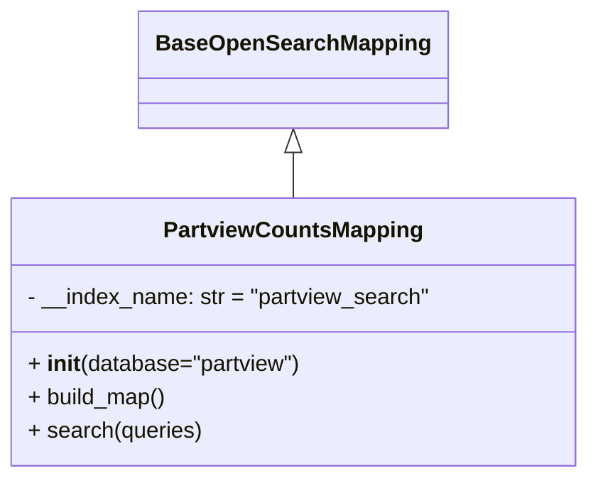

# Diagram: partview_core/partview_service/partview_service/persistence/open_search/PartviewCountsMapping.py


> Auto-generated by Obscura crawlers

## Diagram 1



### SVG

<svg id="container" width="418.8984375" xmlns="http://www.w3.org/2000/svg" class="classDiagram" height="342" viewBox="0 0 418.8984375 342" role="graphics-document document" aria-roledescription="class"><style>#container{font-family:"trebuchet ms",verdana,arial,sans-serif;font-size:16px;fill:#333;}@keyframes edge-animation-frame{from{stroke-dashoffset:0;}}@keyframes dash{to{stroke-dashoffset:0;}}#container .edge-animation-slow{stroke-dasharray:9,5!important;stroke-dashoffset:900;animation:dash 50s linear infinite;stroke-linecap:round;}#container .edge-animation-fast{stroke-dasharray:9,5!important;stroke-dashoffset:900;animation:dash 20s linear infinite;stroke-linecap:round;}#container .error-icon{fill:#552222;}#container .error-text{fill:#552222;stroke:#552222;}#container .edge-thickness-normal{stroke-width:1px;}#container .edge-thickness-thick{stroke-width:3.5px;}#container .edge-pattern-solid{stroke-dasharray:0;}#container .edge-thickness-invisible{stroke-width:0;fill:none;}#container .edge-pattern-dashed{stroke-dasharray:3;}#container .edge-pattern-dotted{stroke-dasharray:2;}#container .marker{fill:#333333;stroke:#333333;}#container .marker.cross{stroke:#333333;}#container svg{font-family:"trebuchet ms",verdana,arial,sans-serif;font-size:16px;}#container p{margin:0;}#container g.classGroup text{fill:#9370DB;stroke:none;font-family:"trebuchet ms",verdana,arial,sans-serif;font-size:10px;}#container g.classGroup text .title{font-weight:bolder;}#container .nodeLabel,#container .edgeLabel{color:#131300;}#container .edgeLabel .label rect{fill:#ECECFF;}#container .label text{fill:#131300;}#container .labelBkg{background:#ECECFF;}#container .edgeLabel .label span{background:#ECECFF;}#container .classTitle{font-weight:bolder;}#container .node rect,#container .node circle,#container .node ellipse,#container .node polygon,#container .node path{fill:#ECECFF;stroke:#9370DB;stroke-width:1px;}#container .divider{stroke:#9370DB;stroke-width:1;}#container g.clickable{cursor:pointer;}#container g.classGroup rect{fill:#ECECFF;stroke:#9370DB;}#container g.classGroup line{stroke:#9370DB;stroke-width:1;}#container .classLabel .box{stroke:none;stroke-width:0;fill:#ECECFF;opacity:0.5;}#container .classLabel .label{fill:#9370DB;font-size:10px;}#container .relation{stroke:#333333;stroke-width:1;fill:none;}#container .dashed-line{stroke-dasharray:3;}#container .dotted-line{stroke-dasharray:1 2;}#container #compositionStart,#container .composition{fill:#333333!important;stroke:#333333!important;stroke-width:1;}#container #compositionEnd,#container .composition{fill:#333333!important;stroke:#333333!important;stroke-width:1;}#container #dependencyStart,#container .dependency{fill:#333333!important;stroke:#333333!important;stroke-width:1;}#container #dependencyStart,#container .dependency{fill:#333333!important;stroke:#333333!important;stroke-width:1;}#container #extensionStart,#container .extension{fill:transparent!important;stroke:#333333!important;stroke-width:1;}#container #extensionEnd,#container .extension{fill:transparent!important;stroke:#333333!important;stroke-width:1;}#container #aggregationStart,#container .aggregation{fill:transparent!important;stroke:#333333!important;stroke-width:1;}#container #aggregationEnd,#container .aggregation{fill:transparent!important;stroke:#333333!important;stroke-width:1;}#container #lollipopStart,#container .lollipop{fill:#ECECFF!important;stroke:#333333!important;stroke-width:1;}#container #lollipopEnd,#container .lollipop{fill:#ECECFF!important;stroke:#333333!important;stroke-width:1;}#container .edgeTerminals{font-size:11px;line-height:initial;}#container .classTitleText{text-anchor:middle;font-size:18px;fill:#333;}#container .label-icon{display:inline-block;height:1em;overflow:visible;vertical-align:-0.125em;}#container .node .label-icon path{fill:currentColor;stroke:revert;stroke-width:revert;}#container :root{--mermaid-font-family:"trebuchet ms",verdana,arial,sans-serif;}</style><g><defs><marker id="container_class-aggregationStart" class="marker aggregation class" refX="18" refY="7" markerWidth="190" markerHeight="240" orient="auto"><path d="M 18,7 L9,13 L1,7 L9,1 Z"></path></marker></defs><defs><marker id="container_class-aggregationEnd" class="marker aggregation class" refX="1" refY="7" markerWidth="20" markerHeight="28" orient="auto"><path d="M 18,7 L9,13 L1,7 L9,1 Z"></path></marker></defs><defs><marker id="container_class-extensionStart" class="marker extension class" refX="18" refY="7" markerWidth="190" markerHeight="240" orient="auto"><path d="M 1,7 L18,13 V 1 Z"></path></marker></defs><defs><marker id="container_class-extensionEnd" class="marker extension class" refX="1" refY="7" markerWidth="20" markerHeight="28" orient="auto"><path d="M 1,1 V 13 L18,7 Z"></path></marker></defs><defs><marker id="container_class-compositionStart" class="marker composition class" refX="18" refY="7" markerWidth="190" markerHeight="240" orient="auto"><path d="M 18,7 L9,13 L1,7 L9,1 Z"></path></marker></defs><defs><marker id="container_class-compositionEnd" class="marker composition class" refX="1" refY="7" markerWidth="20" markerHeight="28" orient="auto"><path d="M 18,7 L9,13 L1,7 L9,1 Z"></path></marker></defs><defs><marker id="container_class-dependencyStart" class="marker dependency class" refX="6" refY="7" markerWidth="190" markerHeight="240" orient="auto"><path d="M 5,7 L9,13 L1,7 L9,1 Z"></path></marker></defs><defs><marker id="container_class-dependencyEnd" class="marker dependency class" refX="13" refY="7" markerWidth="20" markerHeight="28" orient="auto"><path d="M 18,7 L9,13 L14,7 L9,1 Z"></path></marker></defs><defs><marker id="container_class-lollipopStart" class="marker lollipop class" refX="13" refY="7" markerWidth="190" markerHeight="240" orient="auto"><circle stroke="black" fill="transparent" cx="7" cy="7" r="6"></circle></marker></defs><defs><marker id="container_class-lollipopEnd" class="marker lollipop class" refX="1" refY="7" markerWidth="190" markerHeight="240" orient="auto"><circle stroke="black" fill="transparent" cx="7" cy="7" r="6"></circle></marker></defs><g class="root"><g class="clusters"></g><g class="edgePaths"><path d="M209.449,109.25L209.449,110.542C209.449,111.833,209.449,114.417,209.449,119.875C209.449,125.333,209.449,133.667,209.449,137.833L209.449,142" id="id_BaseOpenSearchMapping_PartviewCountsMapping_1" class="edge-thickness-normal edge-pattern-solid relation" style=";;;" data-edge="true" data-et="edge" data-id="id_BaseOpenSearchMapping_PartviewCountsMapping_1" data-points="W3sieCI6MjA5LjQ0OTIxODc1LCJ5Ijo5Mn0seyJ4IjoyMDkuNDQ5MjE4NzUsInkiOjExN30seyJ4IjoyMDkuNDQ5MjE4NzUsInkiOjE0Mn1d" marker-start="url(#container_class-extensionStart)"></path></g><g class="edgeLabels"><g class="edgeLabel"><g class="label" data-id="id_BaseOpenSearchMapping_PartviewCountsMapping_1" transform="translate(0, 0)"><foreignObject width="0" height="0"><div xmlns="http://www.w3.org/1999/xhtml" class="labelBkg" style="display: table-cell; white-space: nowrap; line-height: 1.5; max-width: 200px; text-align: center;"><span class="edgeLabel"></span></div></foreignObject></g></g></g><g class="nodes"><g class="node default" id="classId-BaseOpenSearchMapping-0" transform="translate(209.44921875, 50)"><g class="basic label-container"><path d="M-105.078125 -42 L105.078125 -42 L105.078125 42 L-105.078125 42" stroke="none" stroke-width="0" fill="#ECECFF" style=""></path><path d="M-105.078125 -42 C-23.047911060414492 -42, 58.982302879171016 -42, 105.078125 -42 M-105.078125 -42 C-31.780662765065443 -42, 41.51679946986911 -42, 105.078125 -42 M105.078125 -42 C105.078125 -15.097063768768098, 105.078125 11.805872462463803, 105.078125 42 M105.078125 -42 C105.078125 -10.371136825109556, 105.078125 21.25772634978089, 105.078125 42 M105.078125 42 C43.70258504227558 42, -17.67295491544884 42, -105.078125 42 M105.078125 42 C31.34422641041813 42, -42.38967217916374 42, -105.078125 42 M-105.078125 42 C-105.078125 9.73212789053025, -105.078125 -22.5357442189395, -105.078125 -42 M-105.078125 42 C-105.078125 12.653329591054728, -105.078125 -16.693340817890544, -105.078125 -42" stroke="#9370DB" stroke-width="1.3" fill="none" stroke-dasharray="0 0" style=""></path></g><g class="annotation-group text" transform="translate(0, -18)"></g><g class="label-group text" transform="translate(-93.078125, -18)"><g class="label" style="font-weight: bolder" transform="translate(0,-12)"><foreignObject width="186.15625" height="24"><div xmlns="http://www.w3.org/1999/xhtml" style="display: table-cell; white-space: nowrap; line-height: 1.5; max-width: 235px; text-align: center;"><span class="nodeLabel markdown-node-label" style=""><p>BaseOpenSearchMapping</p></span></div></foreignObject></g></g><g class="members-group text" transform="translate(-93.078125, 30)"></g><g class="methods-group text" transform="translate(-93.078125, 60)"></g><g class="divider" style=""><path d="M-105.078125 6 C-23.092621638091018 6, 58.892881723817965 6, 105.078125 6 M-105.078125 6 C-49.53494370048598 6, 6.0082375990280354 6, 105.078125 6" stroke="#9370DB" stroke-width="1.3" fill="none" stroke-dasharray="0 0" style=""></path></g><g class="divider" style=""><path d="M-105.078125 24 C-43.349056865475426 24, 18.38001126904915 24, 105.078125 24 M-105.078125 24 C-55.37472467463347 24, -5.671324349266939 24, 105.078125 24" stroke="#9370DB" stroke-width="1.3" fill="none" stroke-dasharray="0 0" style=""></path></g></g><g class="node default" id="classId-PartviewCountsMapping-1" transform="translate(209.44921875, 238)"><g class="basic label-container"><path d="M-201.44921875 -96 L201.44921875 -96 L201.44921875 96 L-201.44921875 96" stroke="none" stroke-width="0" fill="#ECECFF" style=""></path><path d="M-201.44921875 -96 C-107.08703278266108 -96, -12.724846815322167 -96, 201.44921875 -96 M-201.44921875 -96 C-94.07809925775457 -96, 13.293020234490854 -96, 201.44921875 -96 M201.44921875 -96 C201.44921875 -34.52322294855883, 201.44921875 26.953554102882336, 201.44921875 96 M201.44921875 -96 C201.44921875 -37.02714899488613, 201.44921875 21.945702010227734, 201.44921875 96 M201.44921875 96 C94.21155328001556 96, -13.02611218996887 96, -201.44921875 96 M201.44921875 96 C102.22921156294557 96, 3.00920437589113 96, -201.44921875 96 M-201.44921875 96 C-201.44921875 30.36726891662073, -201.44921875 -35.26546216675854, -201.44921875 -96 M-201.44921875 96 C-201.44921875 29.346290303554213, -201.44921875 -37.307419392891575, -201.44921875 -96" stroke="#9370DB" stroke-width="1.3" fill="none" stroke-dasharray="0 0" style=""></path></g><g class="annotation-group text" transform="translate(0, -72)"></g><g class="label-group text" transform="translate(-88.5546875, -72)"><g class="label" style="font-weight: bolder" transform="translate(0,-12)"><foreignObject width="177.109375" height="24"><div xmlns="http://www.w3.org/1999/xhtml" style="display: table-cell; white-space: nowrap; line-height: 1.5; max-width: 225px; text-align: center;"><span class="nodeLabel markdown-node-label" style=""><p>PartviewCountsMapping</p></span></div></foreignObject></g></g><g class="members-group text" transform="translate(-189.44921875, -24)"><g class="label" style="" transform="translate(0,-12)"><foreignObject width="290.34375" height="24"><div xmlns="http://www.w3.org/1999/xhtml" style="display: table-cell; white-space: nowrap; line-height: 1.5; max-width: 348px; text-align: center;"><span class="nodeLabel markdown-node-label" style=""><p>- __index_name: str = "partview_search"</p></span></div></foreignObject></g></g><g class="methods-group text" transform="translate(-189.44921875, 24)"><g class="label" style="" transform="translate(0,-12)"><foreignObject width="197.03125" height="24"><div xmlns="http://www.w3.org/1999/xhtml" style="display: table-cell; white-space: nowrap; line-height: 1.5; max-width: 287px; text-align: center;"><span class="nodeLabel markdown-node-label" style=""><p>+ <strong>init</strong>(database="partview")</p></span></div></foreignObject></g><g class="label" style="" transform="translate(0,12)"><foreignObject width="100.34375" height="24"><div xmlns="http://www.w3.org/1999/xhtml" style="display: table-cell; white-space: nowrap; line-height: 1.5; max-width: 158px; text-align: center;"><span class="nodeLabel markdown-node-label" style=""><p>+ build_map()</p></span></div></foreignObject></g><g class="label" style="" transform="translate(0,36)"><foreignObject width="124.53125" height="24"><div xmlns="http://www.w3.org/1999/xhtml" style="display: table-cell; white-space: nowrap; line-height: 1.5; max-width: 182px; text-align: center;"><span class="nodeLabel markdown-node-label" style=""><p>+ search(queries)</p></span></div></foreignObject></g></g><g class="divider" style=""><path d="M-201.44921875 -48 C-43.41668139012634 -48, 114.61585596974732 -48, 201.44921875 -48 M-201.44921875 -48 C-54.758557057114956 -48, 91.93210463577009 -48, 201.44921875 -48" stroke="#9370DB" stroke-width="1.3" fill="none" stroke-dasharray="0 0" style=""></path></g><g class="divider" style=""><path d="M-201.44921875 0 C-89.29770072978734 0, 22.853817290425326 0, 201.44921875 0 M-201.44921875 0 C-54.54920712462814 0, 92.35080450074372 0, 201.44921875 0" stroke="#9370DB" stroke-width="1.3" fill="none" stroke-dasharray="0 0" style=""></path></g></g></g></g></g></svg>

## Diagram 2

```mermaid
flowchart TD
    Start([start]) --> GetCursor[Get OpenSearch connector via get_open_search_connector()]
    GetCursor --> CheckType{Type of queries}
    CheckType -->|list| BuildMSearch[Build msearch_body:\n(index, query) pairs]
    BuildMSearch --> MSearchCall[Call cursor.msearch(body=msearch_body)\n-> return result]
    CheckType -->|str| DumpJSON[Serialize queries: json.dumps(queries)]
    DumpJSON --> SearchCall[Call cursor.search(index="partview_search", body=queries)\n-> return result]
    CheckType -->|other| SearchCall
    MSearchCall --> End([end])
    SearchCall --> End
```

> SVG rendering failed for this diagram.
