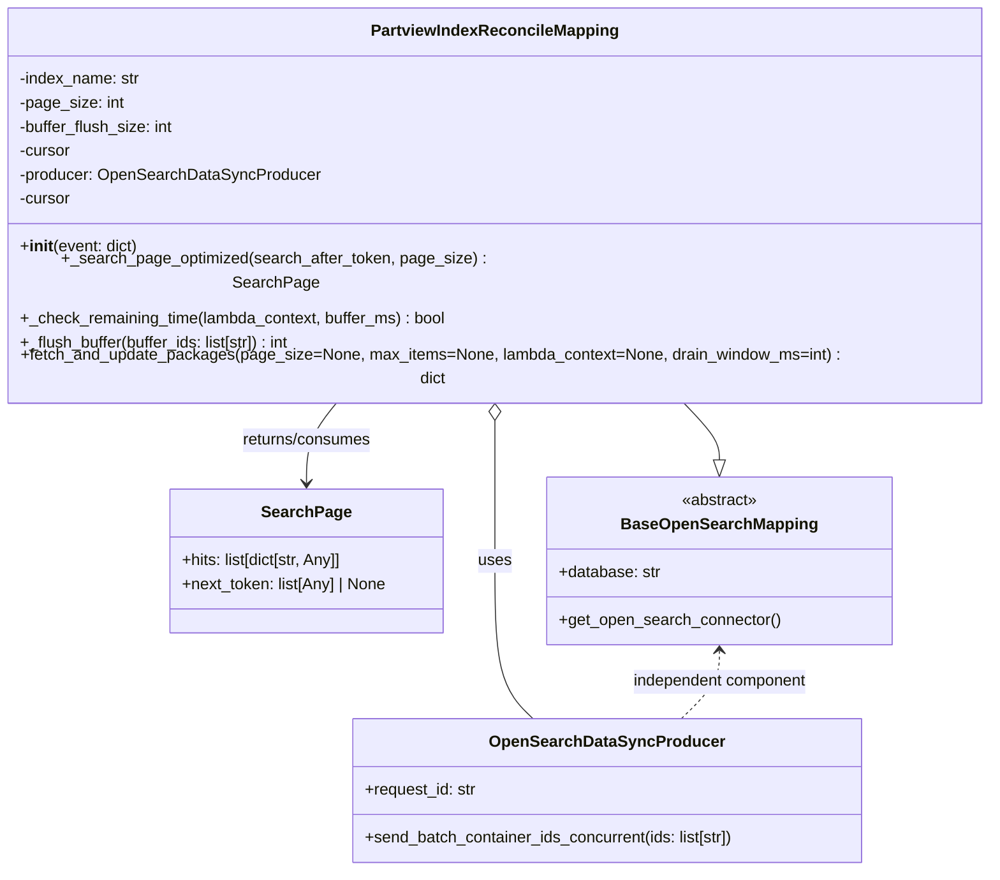
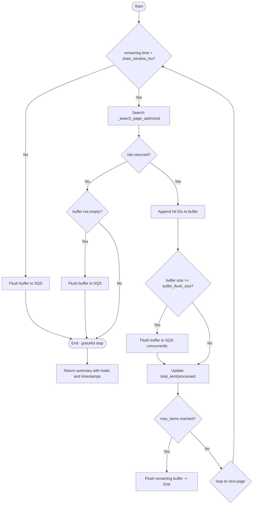

# Diagram: partview_core/partview_service/partview_service/persistence/open_search/PartviewIndexReconcileMapping.py

> Auto-generated by Obscura crawlers

## Diagram 1

### SVG

<svg id="container" width="1008.796875" xmlns="http://www.w3.org/2000/svg" class="classDiagram" height="836" viewBox="0 0 1008.796875 836" role="graphics-document document" aria-roledescription="class"><g><defs><marker id="container_class-aggregationStart" class="marker aggregation class" refX="18" refY="7" markerWidth="190" markerHeight="240" orient="auto"><path d="M 18,7 L9,13 L1,7 L9,1 Z"></path></marker></defs><defs><marker id="container_class-aggregationEnd" class="marker aggregation class" refX="1" refY="7" markerWidth="20" markerHeight="28" orient="auto"><path d="M 18,7 L9,13 L1,7 L9,1 Z"></path></marker></defs><defs><marker id="container_class-extensionStart" class="marker extension class" refX="18" refY="7" markerWidth="190" markerHeight="240" orient="auto"><path d="M 1,7 L18,13 V 1 Z"></path></marker></defs><defs><marker id="container_class-extensionEnd" class="marker extension class" refX="1" refY="7" markerWidth="20" markerHeight="28" orient="auto"><path d="M 1,1 V 13 L18,7 Z"></path></marker></defs><defs><marker id="container_class-compositionStart" class="marker composition class" refX="18" refY="7" markerWidth="190" markerHeight="240" orient="auto"><path d="M 18,7 L9,13 L1,7 L9,1 Z"></path></marker></defs><defs><marker id="container_class-compositionEnd" class="marker composition class" refX="1" refY="7" markerWidth="20" markerHeight="28" orient="auto"><path d="M 18,7 L9,13 L1,7 L9,1 Z"></path></marker></defs><defs><marker id="container_class-dependencyStart" class="marker dependency class" refX="6" refY="7" markerWidth="190" markerHeight="240" orient="auto"><path d="M 5,7 L9,13 L1,7 L9,1 Z"></path></marker></defs><defs><marker id="container_class-dependencyEnd" class="marker dependency class" refX="13" refY="7" markerWidth="20" markerHeight="28" orient="auto"><path d="M 18,7 L9,13 L14,7 L9,1 Z"></path></marker></defs><defs><marker id="container_class-lollipopStart" class="marker lollipop class" refX="13" refY="7" markerWidth="190" markerHeight="240" orient="auto"><circle stroke="black" fill="transparent" cx="7" cy="7" r="6"></circle></marker></defs><defs><marker id="container_class-lollipopEnd" class="marker lollipop class" refX="1" refY="7" markerWidth="190" markerHeight="240" orient="auto"><circle stroke="black" fill="transparent" cx="7" cy="7" r="6"></circle></marker></defs><g class="root"><g class="clusters"></g><g class="edgePaths"><path d="M687.943,368L694.231,374.167C700.519,380.333,713.096,392.667,719.384,402.125C725.672,411.583,725.672,418.167,725.672,421.458L725.672,424.75" id="id_PartviewIndexReconcileMapping_BaseOpenSearchMapping_1" class="edge-thickness-normal edge-pattern-solid relation" style=";;;" data-edge="true" data-et="edge" data-id="id_PartviewIndexReconcileMapping_BaseOpenSearchMapping_1" data-points="W3sieCI6Njg3Ljk0MzIyNDM2NjM1OTUsInkiOjM2OH0seyJ4Ijo3MjUuNjcxODc1LCJ5Ijo0MDV9LHsieCI6NzI1LjY3MTg3NSwieSI6NDQyfV0=" marker-end="url(#container_class-extensionEnd)"></path><path d="M504.398,385.25L504.398,388.542C504.398,391.833,504.398,398.417,504.398,421.875C504.398,445.333,504.398,485.667,504.398,526C504.398,566.333,504.398,606.667,510.658,633C516.917,659.333,529.435,671.667,535.695,677.833L541.954,684" id="id_PartviewIndexReconcileMapping_OpenSearchDataSyncProducer_2" class="edge-thickness-normal edge-pattern-solid relation" style=";;;" data-edge="true" data-et="edge" data-id="id_PartviewIndexReconcileMapping_OpenSearchDataSyncProducer_2" data-points="W3sieCI6NTA0LjM5ODQzNzUsInkiOjM2OH0seyJ4Ijo1MDQuMzk4NDM3NSwieSI6NDA1fSx7IngiOjUwNC4zOTg0Mzc1LCJ5Ijo1MjZ9LHsieCI6NTA0LjM5ODQzNzUsInkiOjY0N30seyJ4Ijo1NDEuOTU0MDIwOTI4ODk5MSwieSI6Njg0fV0=" marker-start="url(#container_class-aggregationStart)"></path><path d="M347.576,368L342.203,374.167C336.83,380.333,326.085,392.667,320.712,406C315.34,419.333,315.34,433.667,315.34,440.833L315.34,448" id="id_PartviewIndexReconcileMapping_SearchPage_3" class="edge-thickness-normal edge-pattern-solid relation" style=";;;" data-edge="true" data-et="edge" data-id="id_PartviewIndexReconcileMapping_SearchPage_3" data-points="W3sieCI6MzQ3LjU3NTY0MDg0MTAxMzg2LCJ5IjozNjh9LHsieCI6MzE1LjMzOTg0Mzc1LCJ5Ijo0MDV9LHsieCI6MzE1LjMzOTg0Mzc1LCJ5Ijo0NTR9XQ==" marker-end="url(#container_class-dependencyEnd)"></path><path d="M725.672,616L725.672,621.167C725.672,626.333,725.672,636.667,719.413,648C713.153,659.333,700.635,671.667,694.376,677.833L688.116,684" id="id_BaseOpenSearchMapping_OpenSearchDataSyncProducer_4" class="edge-thickness-normal edge-pattern-dashed relation" style=";;;" data-edge="true" data-et="edge" data-id="id_BaseOpenSearchMapping_OpenSearchDataSyncProducer_4" data-points="W3sieCI6NzI1LjY3MTg3NSwieSI6NjEwfSx7IngiOjcyNS42NzE4NzUsInkiOjY0N30seyJ4Ijo2ODguMTE2MjkxNTcxMTAwOSwieSI6Njg0fV0=" marker-start="url(#container_class-dependencyStart)"></path></g><g class="edgeLabels"><g class="edgeLabel"><g class="label" data-id="id_PartviewIndexReconcileMapping_BaseOpenSearchMapping_1" transform="translate(0, 0)"><foreignObject width="0" height="0">

</foreignObject></g></g><g class="edgeLabel" transform="translate(504.3984375, 526)"><g class="label" data-id="id_PartviewIndexReconcileMapping_OpenSearchDataSyncProducer_2" transform="translate(-16.4921875, -12)"><foreignObject width="32.984375" height="24">

uses

</foreignObject></g></g><g class="edgeLabel" transform="translate(315.33984375, 405)"><g class="label" data-id="id_PartviewIndexReconcileMapping_SearchPage_3" transform="translate(-66.3984375, -12)"><foreignObject width="132.796875" height="24">

returns/consumes

</foreignObject></g></g><g class="edgeLabel" transform="translate(725.671875, 647)"><g class="label" data-id="id_BaseOpenSearchMapping_OpenSearchDataSyncProducer_4" transform="translate(-89.96875, -12)"><foreignObject width="179.9375" height="24">

independent component

</foreignObject></g></g></g><g class="nodes"><g class="node default" id="classId-SearchPage-0" transform="translate(315.33984375, 526)"><g class="basic label-container"><path d="M-137.56640625 -72 L137.56640625 -72 L137.56640625 72 L-137.56640625 72" stroke="none" stroke-width="0" fill="#ECECFF" style=""></path><path d="M-137.56640625 -72 C-53.5713813705913 -72, 30.423643508817406 -72, 137.56640625 -72 M-137.56640625 -72 C-50.698653564307236 -72, 36.16909912138553 -72, 137.56640625 -72 M137.56640625 -72 C137.56640625 -40.167596307561894, 137.56640625 -8.335192615123795, 137.56640625 72 M137.56640625 -72 C137.56640625 -33.34124854982835, 137.56640625 5.3175029003433, 137.56640625 72 M137.56640625 72 C47.16157730812209 72, -43.24325163375582 72, -137.56640625 72 M137.56640625 72 C28.100102638528668 72, -81.36620097294266 72, -137.56640625 72 M-137.56640625 72 C-137.56640625 41.38011349306419, -137.56640625 10.760226986128373, -137.56640625 -72 M-137.56640625 72 C-137.56640625 25.89384059203914, -137.56640625 -20.21231881592172, -137.56640625 -72" stroke="#9370DB" stroke-width="1.3" fill="none" stroke-dasharray="0 0" style=""></path></g><g class="annotation-group text" transform="translate(0, -48)"></g><g class="label-group text" transform="translate(-42.0546875, -48)"><g class="label" style="font-weight: bolder" transform="translate(0,-12)"><foreignObject width="84.109375" height="24">

SearchPage

</foreignObject></g></g><g class="members-group text" transform="translate(-125.56640625, 0)"><g class="label" style="" transform="translate(0,-12)"><foreignObject width="166.296875" height="24">

+hits: list[dict[str, Any]]

</foreignObject></g><g class="label" style="" transform="translate(0,12)"><foreignObject width="209.078125" height="24">

+next_token: list[Any] | None

</foreignObject></g></g><g class="methods-group text" transform="translate(-125.56640625, 72)"></g><g class="divider" style=""><path d="M-137.56640625 -24 C-78.99138647802076 -24, -20.41636670604153 -24, 137.56640625 -24 M-137.56640625 -24 C-59.658726506389684 -24, 18.248953237220633 -24, 137.56640625 -24" stroke="#9370DB" stroke-width="1.3" fill="none" stroke-dasharray="0 0" style=""></path></g><g class="divider" style=""><path d="M-137.56640625 48 C-54.1891632043278 48, 29.188079841344404 48, 137.56640625 48 M-137.56640625 48 C-71.97293258184276 48, -6.379458913685511 48, 137.56640625 48" stroke="#9370DB" stroke-width="1.3" fill="none" stroke-dasharray="0 0" style=""></path></g></g><g class="node default" id="classId-BaseOpenSearchMapping-1" transform="translate(725.671875, 526)"><g class="basic label-container"><path d="M-169.78125 -84 L169.78125 -84 L169.78125 84 L-169.78125 84" stroke="none" stroke-width="0" fill="#ECECFF" style=""></path><path d="M-169.78125 -84 C-95.50012556810526 -84, -21.219001136210522 -84, 169.78125 -84 M-169.78125 -84 C-72.37008087510613 -84, 25.041088249787748 -84, 169.78125 -84 M169.78125 -84 C169.78125 -18.069225748138706, 169.78125 47.86154850372259, 169.78125 84 M169.78125 -84 C169.78125 -23.922284039576276, 169.78125 36.15543192084745, 169.78125 84 M169.78125 84 C57.736767862491774 84, -54.30771427501645 84, -169.78125 84 M169.78125 84 C80.12229005414096 84, -9.536669891718077 84, -169.78125 84 M-169.78125 84 C-169.78125 25.292279403221812, -169.78125 -33.415441193556376, -169.78125 -84 M-169.78125 84 C-169.78125 32.987546482885016, -169.78125 -18.02490703422997, -169.78125 -84" stroke="#9370DB" stroke-width="1.3" fill="none" stroke-dasharray="0 0" style=""></path></g><g class="annotation-group text" transform="translate(-38.609375, -60)"><g class="label" style="" transform="translate(0,-12)"><foreignObject width="77.21875" height="24">

«abstract»

</foreignObject></g></g><g class="label-group text" transform="translate(-93.078125, -36)"><g class="label" style="font-weight: bolder" transform="translate(0,-12)"><foreignObject width="186.15625" height="24">

BaseOpenSearchMapping

</foreignObject></g></g><g class="members-group text" transform="translate(-157.78125, 12)"><g class="label" style="" transform="translate(0,-12)"><foreignObject width="102.21875" height="24">

+database: str

</foreignObject></g></g><g class="methods-group text" transform="translate(-157.78125, 60)"><g class="label" style="" transform="translate(0,-12)"><foreignObject width="222.484375" height="24">

+get_open_search_connector()

</foreignObject></g></g><g class="divider" style=""><path d="M-169.78125 -12 C-48.6730755889689 -12, 72.4350988220622 -12, 169.78125 -12 M-169.78125 -12 C-92.42095921409305 -12, -15.06066842818609 -12, 169.78125 -12" stroke="#9370DB" stroke-width="1.3" fill="none" stroke-dasharray="0 0" style=""></path></g><g class="divider" style=""><path d="M-169.78125 36 C-54.95365357511679 36, 59.87394284976642 36, 169.78125 36 M-169.78125 36 C-91.51312960369364 36, -13.245009207387284 36, 169.78125 36" stroke="#9370DB" stroke-width="1.3" fill="none" stroke-dasharray="0 0" style=""></path></g></g><g class="node default" id="classId-OpenSearchDataSyncProducer-2" transform="translate(615.03515625, 756)"><g class="basic label-container"><path d="M-255.63671875 -72 L255.63671875 -72 L255.63671875 72 L-255.63671875 72" stroke="none" stroke-width="0" fill="#ECECFF" style=""></path><path d="M-255.63671875 -72 C-132.66599042143145 -72, -9.695262092862919 -72, 255.63671875 -72 M-255.63671875 -72 C-101.82009892382865 -72, 51.996520902342695 -72, 255.63671875 -72 M255.63671875 -72 C255.63671875 -20.396461658375067, 255.63671875 31.207076683249866, 255.63671875 72 M255.63671875 -72 C255.63671875 -24.4231949033516, 255.63671875 23.1536101932968, 255.63671875 72 M255.63671875 72 C113.1414453426309 72, -29.353828064738195 72, -255.63671875 72 M255.63671875 72 C145.38399758318772 72, 35.13127641637544 72, -255.63671875 72 M-255.63671875 72 C-255.63671875 40.312365414857, -255.63671875 8.624730829714004, -255.63671875 -72 M-255.63671875 72 C-255.63671875 19.858785399901834, -255.63671875 -32.28242920019633, -255.63671875 -72" stroke="#9370DB" stroke-width="1.3" fill="none" stroke-dasharray="0 0" style=""></path></g><g class="annotation-group text" transform="translate(0, -48)"></g><g class="label-group text" transform="translate(-110.9765625, -48)"><g class="label" style="font-weight: bolder" transform="translate(0,-12)"><foreignObject width="221.953125" height="24">

OpenSearchDataSyncProducer

</foreignObject></g></g><g class="members-group text" transform="translate(-243.63671875, 0)"><g class="label" style="" transform="translate(0,-12)"><foreignObject width="113.15625" height="24">

+request_id: str

</foreignObject></g></g><g class="methods-group text" transform="translate(-243.63671875, 48)"><g class="label" style="" transform="translate(0,-12)"><foreignObject width="376.296875" height="24">

+send_batch_container_ids_concurrent(ids: list[str])

</foreignObject></g></g><g class="divider" style=""><path d="M-255.63671875 -24 C-133.76944820858344 -24, -11.902177667166882 -24, 255.63671875 -24 M-255.63671875 -24 C-123.80028907351942 -24, 8.036140602961154 -24, 255.63671875 -24" stroke="#9370DB" stroke-width="1.3" fill="none" stroke-dasharray="0 0" style=""></path></g><g class="divider" style=""><path d="M-255.63671875 24 C-150.90209638509856 24, -46.16747402019709 24, 255.63671875 24 M-255.63671875 24 C-119.26842254602894 24, 17.099873657942112 24, 255.63671875 24" stroke="#9370DB" stroke-width="1.3" fill="none" stroke-dasharray="0 0" style=""></path></g></g><g class="node default" id="classId-PartviewIndexReconcileMapping-3" transform="translate(504.3984375, 188)"><g class="basic label-container"><path d="M-496.3984375 -180 L496.3984375 -180 L496.3984375 180 L-496.3984375 180" stroke="none" stroke-width="0" fill="#ECECFF" style=""></path><path d="M-496.3984375 -180 C-209.8581052465177 -180, 76.68222700696458 -180, 496.3984375 -180 M-496.3984375 -180 C-115.25406165581347 -180, 265.89031418837305 -180, 496.3984375 -180 M496.3984375 -180 C496.3984375 -95.22834487954124, 496.3984375 -10.45668975908248, 496.3984375 180 M496.3984375 -180 C496.3984375 -42.36694921676397, 496.3984375 95.26610156647206, 496.3984375 180 M496.3984375 180 C220.678452017763 180, -55.041533464474014 180, -496.3984375 180 M496.3984375 180 C188.03578533516134 180, -120.32686682967733 180, -496.3984375 180 M-496.3984375 180 C-496.3984375 58.98575077578363, -496.3984375 -62.02849844843274, -496.3984375 -180 M-496.3984375 180 C-496.3984375 104.53209348958501, -496.3984375 29.064186979170017, -496.3984375 -180" stroke="#9370DB" stroke-width="1.3" fill="none" stroke-dasharray="0 0" style=""></path></g><g class="annotation-group text" transform="translate(0, -156)"></g><g class="label-group text" transform="translate(-118.5, -156)"><g class="label" style="font-weight: bolder" transform="translate(0,-12)"><foreignObject width="237" height="24">

PartviewIndexReconcileMapping

</foreignObject></g></g><g class="members-group text" transform="translate(-484.3984375, -108)"><g class="label" style="" transform="translate(0,-12)"><foreignObject width="122.578125" height="24">

-index_name: str

</foreignObject></g><g class="label" style="" transform="translate(0,12)"><foreignObject width="104.453125" height="24">

-page_size: int

</foreignObject></g><g class="label" style="" transform="translate(0,36)"><foreignObject width="156.734375" height="24">

-buffer_flush_size: int

</foreignObject></g><g class="label" style="" transform="translate(0,60)"><foreignObject width="52.1875" height="24">

-cursor

</foreignObject></g><g class="label" style="" transform="translate(0,84)"><foreignObject width="299.515625" height="24">

-producer: OpenSearchDataSyncProducer

</foreignObject></g><g class="label" style="" transform="translate(0,108)"><foreignObject width="52.1875" height="24">

-cursor

</foreignObject></g></g><g class="methods-group text" transform="translate(-484.3984375, 60)"><g class="label" style="" transform="translate(0,-12)"><foreignObject width="118.78125" height="24">

+<strong>init</strong>(event: dict)

</foreignObject></g><g class="label" style="" transform="translate(0,12)"><foreignObject width="506.859375" height="24">

+_search_page_optimized(search_after_token, page_size) : SearchPage

</foreignObject></g><g class="label" style="" transform="translate(0,36)"><foreignObject width="431.03125" height="24">

+_check_remaining_time(lambda_context, buffer_ms) : bool

</foreignObject></g><g class="label" style="" transform="translate(0,60)"><foreignObject width="278.40625" height="24">

+_flush_buffer(buffer_ids: list[str]) : int

</foreignObject></g><g class="label" style="" transform="translate(0,84)"><foreignObject width="850.296875" height="24">

+fetch_and_update_packages(page_size=None, max_items=None, lambda_context=None, drain_window_ms=int) : dict

</foreignObject></g></g><g class="divider" style=""><path d="M-496.3984375 -132 C-250.62666198452527 -132, -4.854886469050541 -132, 496.3984375 -132 M-496.3984375 -132 C-208.92406509196877 -132, 78.55030731606246 -132, 496.3984375 -132" stroke="#9370DB" stroke-width="1.3" fill="none" stroke-dasharray="0 0" style=""></path></g><g class="divider" style=""><path d="M-496.3984375 36 C-201.28877522778077 36, 93.82088704443845 36, 496.3984375 36 M-496.3984375 36 C-112.33681203529056 36, 271.7248134294189 36, 496.3984375 36" stroke="#9370DB" stroke-width="1.3" fill="none" stroke-dasharray="0 0" style=""></path></g></g></g></g></g></svg>

## Diagram 2

### SVG

<svg id="container" width="1069.2578125" xmlns="http://www.w3.org/2000/svg" class="flowchart" height="2137.578125" viewBox="0 0 1069.2578125 2137.578125" role="graphics-document document" aria-roledescription="flowchart-v2"><g><marker id="container_flowchart-v2-pointEnd" class="marker flowchart-v2" viewBox="0 0 10 10" refX="5" refY="5" markerUnits="userSpaceOnUse" markerWidth="8" markerHeight="8" orient="auto"><path d="M 0 0 L 10 5 L 0 10 z" class="arrowMarkerPath" style="stroke-width: 1; stroke-dasharray: 1, 0;"></path></marker><marker id="container_flowchart-v2-pointStart" class="marker flowchart-v2" viewBox="0 0 10 10" refX="4.5" refY="5" markerUnits="userSpaceOnUse" markerWidth="8" markerHeight="8" orient="auto"><path d="M 0 5 L 10 10 L 10 0 z" class="arrowMarkerPath" style="stroke-width: 1; stroke-dasharray: 1, 0;"></path></marker><marker id="container_flowchart-v2-circleEnd" class="marker flowchart-v2" viewBox="0 0 10 10" refX="11" refY="5" markerUnits="userSpaceOnUse" markerWidth="11" markerHeight="11" orient="auto"><circle cx="5" cy="5" r="5" class="arrowMarkerPath" style="stroke-width: 1; stroke-dasharray: 1, 0;"></circle></marker><marker id="container_flowchart-v2-circleStart" class="marker flowchart-v2" viewBox="0 0 10 10" refX="-1" refY="5" markerUnits="userSpaceOnUse" markerWidth="11" markerHeight="11" orient="auto"><circle cx="5" cy="5" r="5" class="arrowMarkerPath" style="stroke-width: 1; stroke-dasharray: 1, 0;"></circle></marker><marker id="container_flowchart-v2-crossEnd" class="marker cross flowchart-v2" viewBox="0 0 11 11" refX="12" refY="5.2" markerUnits="userSpaceOnUse" markerWidth="11" markerHeight="11" orient="auto"><path d="M 1,1 l 9,9 M 10,1 l -9,9" class="arrowMarkerPath" style="stroke-width: 2; stroke-dasharray: 1, 0;"></path></marker><marker id="container_flowchart-v2-crossStart" class="marker cross flowchart-v2" viewBox="0 0 11 11" refX="-1" refY="5.2" markerUnits="userSpaceOnUse" markerWidth="11" markerHeight="11" orient="auto"><path d="M 1,1 l 9,9 M 10,1 l -9,9" class="arrowMarkerPath" style="stroke-width: 2; stroke-dasharray: 1, 0;"></path></marker><g class="root"><g class="clusters"></g><g class="edgePaths"><path d="M584.465,47.5L584.382,51.583C584.298,55.667,584.132,63.833,584.048,71.417C583.965,79,583.965,86,583.965,89.5L583.965,93" id="L_Start_CheckTime_0" class="edge-thickness-normal edge-pattern-solid edge-thickness-normal edge-pattern-solid flowchart-link" style=";" data-edge="true" data-et="edge" data-id="L_Start_CheckTime_0" data-points="W3sieCI6NTg0LjQ2NDg0Mzc1LCJ5Ijo0Ny41fSx7IngiOjU4My45NjQ4NDM3NSwieSI6NzJ9LHsieCI6NTgzLjk2NDg0Mzc1LCJ5Ijo5N31d" marker-end="url(#container_flowchart-v2-pointEnd)"></path><path d="M482.457,273.492L419.958,296.577C357.459,319.662,232.46,365.831,169.96,401.582C107.461,437.333,107.461,462.667,107.461,486C107.461,509.333,107.461,530.667,107.461,558.507C107.461,586.346,107.461,620.693,107.461,657.039C107.461,693.385,107.461,731.732,107.461,772.374C107.461,813.016,107.461,855.953,107.461,898.891C107.461,941.828,107.461,984.766,107.461,1030.401C107.461,1076.036,107.461,1124.37,107.461,1148.536L107.461,1172.703" id="L_CheckTime_FlushPending_0" class="edge-thickness-normal edge-pattern-solid edge-thickness-normal edge-pattern-solid flowchart-link" style=";" data-edge="true" data-et="edge" data-id="L_CheckTime_FlushPending_0" data-points="W3sieCI6NDgyLjQ1NzMzOTYwNDMxMTI0LCJ5IjoyNzMuNDkyNDk1ODU0MzExMjR9LHsieCI6MTA3LjQ2MDkzNzUsInkiOjQxMn0seyJ4IjoxMDcuNDYwOTM3NSwieSI6NDg4fSx7IngiOjEwNy40NjA5Mzc1LCJ5Ijo1NTJ9LHsieCI6MTA3LjQ2MDkzNzUsInkiOjY1NS4wMzkwNjI1fSx7IngiOjEwNy40NjA5Mzc1LCJ5Ijo3NzAuMDc4MTI1fSx7IngiOjEwNy40NjA5Mzc1LCJ5Ijo4OTguODkwNjI1fSx7IngiOjEwNy40NjA5Mzc1LCJ5IjoxMDI3LjcwMzEyNX0seyJ4IjoxMDcuNDYwOTM3NSwieSI6MTE3Ni43MDMxMjV9XQ==" marker-end="url(#container_flowchart-v2-pointEnd)"></path><path d="M107.461,1230.703L107.461,1255.536C107.461,1280.37,107.461,1330.036,139.18,1364.248C170.899,1398.459,234.336,1417.215,266.055,1426.593L297.774,1435.97" id="L_FlushPending_End_0" class="edge-thickness-normal edge-pattern-solid edge-thickness-normal edge-pattern-solid flowchart-link" style=";" data-edge="true" data-et="edge" data-id="L_FlushPending_End_0" data-points="W3sieCI6MTA3LjQ2MDkzNzUsInkiOjEyMzAuNzAzMTI1fSx7IngiOjEwNy40NjA5Mzc1LCJ5IjoxMzc5LjcwMzEyNX0seyJ4IjozMDEuNjA5NzI3MTk4NDQwOSwieSI6MTQzNy4xMDQ1NjExNzIyOTQzfV0=" marker-end="url(#container_flowchart-v2-pointEnd)"></path><path d="M583.965,375L583.965,381.167C583.965,387.333,583.965,399.667,583.965,411.333C583.965,423,583.965,434,583.965,439.5L583.965,445" id="L_CheckTime_SearchPageOp_0" class="edge-thickness-normal edge-pattern-solid edge-thickness-normal edge-pattern-solid flowchart-link" style=";" data-edge="true" data-et="edge" data-id="L_CheckTime_SearchPageOp_0" data-points="W3sieCI6NTgzLjk2NDg0Mzc1LCJ5IjozNzV9LHsieCI6NTgzLjk2NDg0Mzc1LCJ5Ijo0MTJ9LHsieCI6NTgzLjk2NDg0Mzc1LCJ5Ijo0NDl9XQ==" marker-end="url(#container_flowchart-v2-pointEnd)"></path><path d="M583.965,527L583.965,531.167C583.965,535.333,583.965,543.667,583.965,551.333C583.965,559,583.965,566,583.965,569.5L583.965,573" id="L_SearchPageOp_HitsExist_0" class="edge-thickness-normal edge-pattern-solid edge-thickness-normal edge-pattern-solid flowchart-link" style=";" data-edge="true" data-et="edge" data-id="L_SearchPageOp_HitsExist_0" data-points="W3sieCI6NTgzLjk2NDg0Mzc1LCJ5Ijo1Mjd9LHsieCI6NTgzLjk2NDg0Mzc1LCJ5Ijo1NTJ9LHsieCI6NTgzLjk2NDg0Mzc1LCJ5Ijo1Nzd9XQ==" marker-end="url(#container_flowchart-v2-pointEnd)"></path><path d="M532.894,682.007L505.096,696.685C477.298,711.364,421.702,740.721,393.904,760.9C366.107,781.078,366.107,792.078,366.107,797.578L366.107,803.078" id="L_HitsExist_FlushIfPending_0" class="edge-thickness-normal edge-pattern-solid edge-thickness-normal edge-pattern-solid flowchart-link" style=";" data-edge="true" data-et="edge" data-id="L_HitsExist_FlushIfPending_0" data-points="W3sieCI6NTMyLjg5MzY3Njg4MzUzOTIsInkiOjY4Mi4wMDY5NTgxMzM1MzkyfSx7IngiOjM2Ni4xMDY1NzExOTc1MDk3NywieSI6NzcwLjA3ODEyNX0seyJ4IjozNjYuMTA2NTcxMTk3NTA5NzcsInkiOjgwNy4wNzgxMjV9XQ==" marker-end="url(#container_flowchart-v2-pointEnd)"></path><path d="M359.662,984.259L359.116,991.5C358.569,998.74,357.476,1013.222,356.929,1044.629C356.383,1076.036,356.383,1124.37,356.383,1148.536L356.383,1172.703" id="L_FlushIfPending_FlushToSQS_0" class="edge-thickness-normal edge-pattern-solid edge-thickness-normal edge-pattern-solid flowchart-link" style=";" data-edge="true" data-et="edge" data-id="L_FlushIfPending_FlushToSQS_0" data-points="W3sieCI6MzU5LjY2MjMxODk1NzYzNjMzLCJ5Ijo5ODQuMjU4ODcyNzYwMTI2Nn0seyJ4IjozNTYuMzgyODEyNSwieSI6MTAyNy43MDMxMjV9LHsieCI6MzU2LjM4MjgxMjUsInkiOjExNzYuNzAzMTI1fV0=" marker-end="url(#container_flowchart-v2-pointEnd)"></path><path d="M413.069,943.741L427.721,957.735C442.374,971.728,471.679,999.716,486.332,1043.043C500.984,1086.37,500.984,1145.036,500.984,1203.703C500.984,1262.37,500.984,1321.036,484.935,1359.539C468.885,1398.042,436.786,1416.38,420.736,1425.55L404.687,1434.719" id="L_FlushIfPending_End_0" class="edge-thickness-normal edge-pattern-solid edge-thickness-normal edge-pattern-solid flowchart-link" style=";" data-edge="true" data-et="edge" data-id="L_FlushIfPending_End_0" data-points="W3sieCI6NDEzLjA2ODczOTI1MjM5NDQsInkiOjk0My43NDA5NTY5NDUxMTU0fSx7IngiOjUwMC45ODQzNzUsInkiOjEwMjcuNzAzMTI1fSx7IngiOjUwMC45ODQzNzUsInkiOjEyMDMuNzAzMTI1fSx7IngiOjUwMC45ODQzNzUsInkiOjEzNzkuNzAzMTI1fSx7IngiOjQwMS4yMTMzNzYxMjA1MTc5LCJ5IjoxNDM2LjcwMzEyNDk5OTk5OTV9XQ==" marker-end="url(#container_flowchart-v2-pointEnd)"></path><path d="M356.383,1230.703L356.383,1255.536C356.383,1280.37,356.383,1330.036,357.581,1363.709C358.78,1397.382,361.177,1415.061,362.376,1423.9L363.574,1432.739" id="L_FlushToSQS_End_0" class="edge-thickness-normal edge-pattern-solid edge-thickness-normal edge-pattern-solid flowchart-link" style=";" data-edge="true" data-et="edge" data-id="L_FlushToSQS_End_0" data-points="W3sieCI6MzU2LjM4MjgxMjUsInkiOjEyMzAuNzAzMTI1fSx7IngiOjM1Ni4zODI4MTI1LCJ5IjoxMzc5LjcwMzEyNX0seyJ4IjozNjQuMTExNjU5NDI2NDM4MSwieSI6MTQzNi43MDMxMjQ5OTk5OTk1fV0=" marker-end="url(#container_flowchart-v2-pointEnd)"></path><path d="M629.874,687.169L649.617,700.988C669.361,714.806,708.848,742.442,728.592,772.562C748.336,802.682,748.336,835.286,748.336,851.589L748.336,867.891" id="L_HitsExist_BufferAdd_0" class="edge-thickness-normal edge-pattern-solid edge-thickness-normal edge-pattern-solid flowchart-link" style=";" data-edge="true" data-et="edge" data-id="L_HitsExist_BufferAdd_0" data-points="W3sieCI6NjI5Ljg3MzU3NjAyNTU0NTYsInkiOjY4Ny4xNjkzOTI3MjQ0NTQ0fSx7IngiOjc0OC4zMzU5Mzc1LCJ5Ijo3NzAuMDc4MTI1fSx7IngiOjc0OC4zMzU5Mzc1LCJ5Ijo4NzEuODkwNjI1fV0=" marker-end="url(#container_flowchart-v2-pointEnd)"></path><path d="M748.336,925.891L748.336,942.859C748.336,959.828,748.336,993.766,748.336,1016.234C748.336,1038.703,748.336,1049.703,748.336,1055.203L748.336,1060.703" id="L_BufferAdd_BufferFull_0" class="edge-thickness-normal edge-pattern-solid edge-thickness-normal edge-pattern-solid flowchart-link" style=";" data-edge="true" data-et="edge" data-id="L_BufferAdd_BufferFull_0" data-points="W3sieCI6NzQ4LjMzNTkzNzUsInkiOjkyNS44OTA2MjV9LHsieCI6NzQ4LjMzNTkzNzUsInkiOjEwMjcuNzAzMTI1fSx7IngiOjc0OC4zMzU5Mzc1LCJ5IjoxMDY0LjcwMzEyNX1d" marker-end="url(#container_flowchart-v2-pointEnd)"></path><path d="M702.154,1296.521L695.256,1310.385C688.358,1324.248,674.562,1351.976,667.664,1371.339C660.766,1390.703,660.766,1401.703,660.766,1407.203L660.766,1412.703" id="L_BufferFull_FlushToSQS2_0" class="edge-thickness-normal edge-pattern-solid edge-thickness-normal edge-pattern-solid flowchart-link" style=";" data-edge="true" data-et="edge" data-id="L_BufferFull_FlushToSQS2_0" data-points="W3sieCI6NzAyLjE1MzY3NDcwMjQ3OCwieSI6MTI5Ni41MjA4NjIyMDI0Nzh9LHsieCI6NjYwLjc2NTYyNSwieSI6MTM3OS43MDMxMjV9LHsieCI6NjYwLjc2NTYyNSwieSI6MTQxNi43MDMxMjV9XQ==" marker-end="url(#container_flowchart-v2-pointEnd)"></path><path d="M660.766,1494.703L660.766,1498.87C660.766,1503.036,660.766,1511.37,665.929,1519.31C671.092,1527.25,681.417,1534.796,686.58,1538.57L691.743,1542.343" id="L_FlushToSQS2_IncrementTotals_0" class="edge-thickness-normal edge-pattern-solid edge-thickness-normal edge-pattern-solid flowchart-link" style=";" data-edge="true" data-et="edge" data-id="L_FlushToSQS2_IncrementTotals_0" data-points="W3sieCI6NjYwLjc2NTYyNSwieSI6MTQ5NC43MDMxMjV9LHsieCI6NjYwLjc2NTYyNSwieSI6MTUxOS43MDMxMjV9LHsieCI6Njk0Ljk3Mjc3ODMyMDMxMjUsInkiOjE1NDQuNzAzMTI1fV0=" marker-end="url(#container_flowchart-v2-pointEnd)"></path><path d="M808.709,1282.33L821.17,1298.559C833.632,1314.788,858.554,1347.245,871.015,1376.141C883.477,1405.036,883.477,1430.37,883.477,1453.703C883.477,1477.036,883.477,1498.37,875.281,1512.918C867.085,1527.466,850.694,1535.228,842.498,1539.11L834.302,1542.991" id="L_BufferFull_IncrementTotals_0" class="edge-thickness-normal edge-pattern-solid edge-thickness-normal edge-pattern-solid flowchart-link" style=";" data-edge="true" data-et="edge" data-id="L_BufferFull_IncrementTotals_0" data-points="W3sieCI6ODA4LjcwOTExMDgwMzg3MTgsInkiOjEyODIuMzI5OTUxNjk2MTI4fSx7IngiOjg4My40NzY1NjI1LCJ5IjoxMzc5LjcwMzEyNX0seyJ4Ijo4ODMuNDc2NTYyNSwieSI6MTQ1NS43MDMxMjV9LHsieCI6ODgzLjQ3NjU2MjUsInkiOjE1MTkuNzAzMTI1fSx7IngiOjgzMC42ODcyNTU4NTkzNzUsInkiOjE1NDQuNzAzMTI1fV0=" marker-end="url(#container_flowchart-v2-pointEnd)"></path><path d="M748.336,1622.703L748.336,1626.87C748.336,1631.036,748.336,1639.37,748.336,1647.036C748.336,1654.703,748.336,1661.703,748.336,1665.203L748.336,1668.703" id="L_IncrementTotals_MaxItems_0" class="edge-thickness-normal edge-pattern-solid edge-thickness-normal edge-pattern-solid flowchart-link" style=";" data-edge="true" data-et="edge" data-id="L_IncrementTotals_MaxItems_0" data-points="W3sieCI6NzQ4LjMzNTkzNzUsInkiOjE2MjIuNzAzMTI1fSx7IngiOjc0OC4zMzU5Mzc1LCJ5IjoxNjQ3LjcwMzEyNX0seyJ4Ijo3NDguMzM1OTM3NSwieSI6MTY3Mi43MDMxMjV9XQ==" marker-end="url(#container_flowchart-v2-pointEnd)"></path><path d="M722.196,1848.876L718.53,1859.399C714.863,1869.923,707.529,1890.969,703.862,1915.539C700.195,1940.109,700.195,1968.203,700.195,1982.25L700.195,1996.297" id="L_MaxItems_FlushThenEnd_0" class="edge-thickness-normal edge-pattern-solid edge-thickness-normal edge-pattern-solid flowchart-link" style=";" data-edge="true" data-et="edge" data-id="L_MaxItems_FlushThenEnd_0" data-points="W3sieCI6NzIyLjE5NjM0MTIzNjQ3NTcsInkiOjE4NDguODc2MDI4NzM2NDc1N30seyJ4Ijo3MDAuMTk1MzEyNSwieSI6MTkxMi4wMTU2MjV9LHsieCI6NzAwLjE5NTMxMjUsInkiOjIwMDAuMjk2ODc1fV0=" marker-end="url(#container_flowchart-v2-pointEnd)"></path><path d="M798.356,1824.996L812.543,1839.499C826.73,1854.002,855.103,1883.009,877.304,1909.238C899.506,1935.467,915.535,1958.917,923.55,1970.643L931.564,1982.368" id="L_MaxItems_CheckTimeLoop_0" class="edge-thickness-normal edge-pattern-solid edge-thickness-normal edge-pattern-solid flowchart-link" style=";" data-edge="true" data-et="edge" data-id="L_MaxItems_CheckTimeLoop_0" data-points="W3sieCI6Nzk4LjM1NTk3MTAxNzIzNzQsInkiOjE4MjQuOTk1NTkxNDgyNzYyNn0seyJ4Ijo4ODMuNDc2NTYyNSwieSI6MTkxMi4wMTU2MjV9LHsieCI6OTMzLjgyMTYxMTM1NTE4NDUsInkiOjE5ODUuNjcwNTc2MTQ0ODE1NH1d" marker-end="url(#container_flowchart-v2-pointEnd)"></path><path d="M980.034,1958.573L980.953,1950.814C981.872,1943.054,983.709,1927.535,984.628,1896.749C985.547,1865.964,985.547,1819.911,985.547,1775.859C985.547,1731.807,985.547,1689.755,985.547,1658.063C985.547,1626.37,985.547,1605.036,985.547,1583.703C985.547,1562.37,985.547,1541.036,985.547,1519.703C985.547,1498.37,985.547,1477.036,985.547,1453.703C985.547,1430.37,985.547,1405.036,985.547,1363.036C985.547,1321.036,985.547,1262.37,985.547,1203.703C985.547,1145.036,985.547,1086.37,985.547,1035.568C985.547,984.766,985.547,941.828,985.547,898.891C985.547,855.953,985.547,813.016,985.547,772.374C985.547,731.732,985.547,693.385,985.547,657.039C985.547,620.693,985.547,586.346,985.547,558.507C985.547,530.667,985.547,509.333,985.547,486C985.547,462.667,985.547,437.333,935.334,402.66C885.122,367.987,784.697,323.974,734.485,301.968L684.273,279.962" id="L_CheckTimeLoop_CheckTime_0" class="edge-thickness-normal edge-pattern-solid edge-thickness-normal edge-pattern-solid flowchart-link" style=";" data-edge="true" data-et="edge" data-id="L_CheckTimeLoop_CheckTime_0" data-points="W3sieCI6OTgwLjAzNDM1NDY3NjYwOTQsInkiOjE5NTguNTczNDE3MTc2NjA5NH0seyJ4Ijo5ODUuNTQ2ODc1LCJ5IjoxOTEyLjAxNTYyNX0seyJ4Ijo5ODUuNTQ2ODc1LCJ5IjoxNzczLjg1OTM3NX0seyJ4Ijo5ODUuNTQ2ODc1LCJ5IjoxNjQ3LjcwMzEyNX0seyJ4Ijo5ODUuNTQ2ODc1LCJ5IjoxNTgzLjcwMzEyNX0seyJ4Ijo5ODUuNTQ2ODc1LCJ5IjoxNTE5LjcwMzEyNX0seyJ4Ijo5ODUuNTQ2ODc1LCJ5IjoxNDU1LjcwMzEyNX0seyJ4Ijo5ODUuNTQ2ODc1LCJ5IjoxMzc5LjcwMzEyNX0seyJ4Ijo5ODUuNTQ2ODc1LCJ5IjoxMjAzLjcwMzEyNX0seyJ4Ijo5ODUuNTQ2ODc1LCJ5IjoxMDI3LjcwMzEyNX0seyJ4Ijo5ODUuNTQ2ODc1LCJ5Ijo4OTguODkwNjI1fSx7IngiOjk4NS41NDY4NzUsInkiOjc3MC4wNzgxMjV9LHsieCI6OTg1LjU0Njg3NSwieSI6NjU1LjAzOTA2MjV9LHsieCI6OTg1LjU0Njg3NSwieSI6NTUyfSx7IngiOjk4NS41NDY4NzUsInkiOjQ4OH0seyJ4Ijo5ODUuNTQ2ODc1LCJ5Ijo0MTJ9LHsieCI6NjgwLjYwODk1NTQ0OTUwMTUsInkiOjI3OC4zNTU4ODgzMDA0OTg0Nn1d" marker-end="url(#container_flowchart-v2-pointEnd)"></path><path d="M366.607,1475.703L366.523,1483.036C366.44,1490.37,366.273,1505.036,366.19,1515.87C366.107,1526.703,366.107,1533.703,366.107,1537.203L366.107,1540.703" id="L_End_Summary_0" class="edge-thickness-normal edge-pattern-solid edge-thickness-normal edge-pattern-solid flowchart-link" style=";" data-edge="true" data-et="edge" data-id="L_End_Summary_0" data-points="W3sieCI6MzY2LjYwNjU3MTE5NzUwOTc3LCJ5IjoxNDc1LjcwMzEyNTAwMDAwMDV9LHsieCI6MzY2LjEwNjU3MTE5NzUwOTc3LCJ5IjoxNTE5LjcwMzEyNX0seyJ4IjozNjYuMTA2NTcxMTk3NTA5NzcsInkiOjE1NDQuNzAzMTI1fV0=" marker-end="url(#container_flowchart-v2-pointEnd)"></path></g><g class="edgeLabels"><g class="edgeLabel"><g class="label" data-id="L_Start_CheckTime_0" transform="translate(0, 0)"><foreignObject width="0" height="0">

</foreignObject></g></g><g class="edgeLabel" transform="translate(107.4609375, 655.0390625)"><g class="label" data-id="L_CheckTime_FlushPending_0" transform="translate(-10.140625, -12)"><foreignObject width="20.28125" height="24">

No

</foreignObject></g></g><g class="edgeLabel"><g class="label" data-id="L_FlushPending_End_0" transform="translate(0, 0)"><foreignObject width="0" height="0">

</foreignObject></g></g><g class="edgeLabel" transform="translate(583.96484375, 412)"><g class="label" data-id="L_CheckTime_SearchPageOp_0" transform="translate(-12.03125, -12)"><foreignObject width="24.0625" height="24">

Yes

</foreignObject></g></g><g class="edgeLabel"><g class="label" data-id="L_SearchPageOp_HitsExist_0" transform="translate(0, 0)"><foreignObject width="0" height="0">

</foreignObject></g></g><g class="edgeLabel" transform="translate(366.10657119750977, 770.078125)"><g class="label" data-id="L_HitsExist_FlushIfPending_0" transform="translate(-10.140625, -12)"><foreignObject width="20.28125" height="24">

No

</foreignObject></g></g><g class="edgeLabel" transform="translate(356.3828125, 1027.703125)"><g class="label" data-id="L_FlushIfPending_FlushToSQS_0" transform="translate(-12.03125, -12)"><foreignObject width="24.0625" height="24">

Yes

</foreignObject></g></g><g class="edgeLabel" transform="translate(500.984375, 1203.703125)"><g class="label" data-id="L_FlushIfPending_End_0" transform="translate(-10.140625, -12)"><foreignObject width="20.28125" height="24">

No

</foreignObject></g></g><g class="edgeLabel"><g class="label" data-id="L_FlushToSQS_End_0" transform="translate(0, 0)"><foreignObject width="0" height="0">

</foreignObject></g></g><g class="edgeLabel" transform="translate(748.3359375, 770.078125)"><g class="label" data-id="L_HitsExist_BufferAdd_0" transform="translate(-12.03125, -12)"><foreignObject width="24.0625" height="24">

Yes

</foreignObject></g></g><g class="edgeLabel"><g class="label" data-id="L_BufferAdd_BufferFull_0" transform="translate(0, 0)"><foreignObject width="0" height="0">

</foreignObject></g></g><g class="edgeLabel" transform="translate(660.765625, 1379.703125)"><g class="label" data-id="L_BufferFull_FlushToSQS2_0" transform="translate(-12.03125, -12)"><foreignObject width="24.0625" height="24">

Yes

</foreignObject></g></g><g class="edgeLabel"><g class="label" data-id="L_FlushToSQS2_IncrementTotals_0" transform="translate(0, 0)"><foreignObject width="0" height="0">

</foreignObject></g></g><g class="edgeLabel" transform="translate(883.4765625, 1455.703125)"><g class="label" data-id="L_BufferFull_IncrementTotals_0" transform="translate(-10.140625, -12)"><foreignObject width="20.28125" height="24">

No

</foreignObject></g></g><g class="edgeLabel"><g class="label" data-id="L_IncrementTotals_MaxItems_0" transform="translate(0, 0)"><foreignObject width="0" height="0">

</foreignObject></g></g><g class="edgeLabel" transform="translate(700.1953125, 1912.015625)"><g class="label" data-id="L_MaxItems_FlushThenEnd_0" transform="translate(-12.03125, -12)"><foreignObject width="24.0625" height="24">

Yes

</foreignObject></g></g><g class="edgeLabel" transform="translate(883.4765625, 1912.015625)"><g class="label" data-id="L_MaxItems_CheckTimeLoop_0" transform="translate(-10.140625, -12)"><foreignObject width="20.28125" height="24">

No

</foreignObject></g></g><g class="edgeLabel"><g class="label" data-id="L_CheckTimeLoop_CheckTime_0" transform="translate(0, 0)"><foreignObject width="0" height="0">

</foreignObject></g></g><g class="edgeLabel"><g class="label" data-id="L_End_Summary_0" transform="translate(0, 0)"><foreignObject width="0" height="0">

</foreignObject></g></g></g><g class="nodes"><g class="node default" id="flowchart-Start-0" transform="translate(583.96484375, 27.5)"><g class="basic label-container outer-path"><path d="M-10.3984375 -19.5 C-5.874167707601473 -19.5, -1.3498979152029467 -19.5, 10.3984375 -19.5 C10.3984375 -19.5, 10.398437499999998 -19.5, 10.398437499999998 -19.5 C10.8582956095563 -19.48525324548604, 11.318153719112605 -19.47050649097208, 11.6478067896239 -19.45993515863156 C11.919474692999815 -19.43372768272134, 12.191142596375729 -19.40752020681112, 12.892042152847864 -19.3399052695533 C13.216591554365635 -19.287434639234107, 13.541140955883405 -19.23496400891491, 14.126030759676757 -19.140403561325776 C14.419993156657657 -19.0733085624988, 14.71395555363856 -19.00621356367182, 15.34470188623539 -18.862249829261074 C15.75823248184545 -18.7395161191504, 16.17176307745551 -18.616782409039725, 16.543047751460602 -18.50658706670804 C16.962372871463284 -18.352271546348135, 17.381697991465966 -18.19795602598823, 17.716144095147794 -18.074876768247425 C18.069350614531256 -17.918522719615495, 18.42255713391472 -17.76216867098357, 18.85917041279238 -17.568892924097174 C19.097193468320345 -17.444716448489277, 19.335216523848313 -17.32053997288138, 19.967429764076783 -16.990714730406097 C20.209099071736706 -16.844213375896157, 20.45076837939663 -16.69771202138622, 21.036368073605697 -16.342718045390892 C21.304349401497692 -16.15578587177815, 21.572330729389687 -15.96885369816541, 22.061592844578712 -15.627565626425154 C22.379668654995722 -15.373908631970382, 22.697744465412736 -15.12025163751561, 23.03889120850187 -14.848196188198123 C23.38179401389758 -14.536780933048803, 23.724696819293285 -14.225365677899482, 23.964247236767985 -14.007812326905688 C24.141850730951496 -13.824422137643161, 24.319454225135004 -13.641031948380634, 24.833858442968648 -13.10986736009568 C25.077240520341498 -12.823976923181013, 25.320622597714344 -12.538086486266344, 25.644151408126582 -12.158051136245305 C25.87036971971258 -11.854939207632215, 26.09658803129858 -11.551827279019125, 26.391796464640635 -11.156274872382312 C26.62576102847469 -10.79684247405102, 26.859725592308752 -10.437410075719729, 27.073721378604247 -10.108655082055241 C27.202498170355994 -9.879998848235834, 27.33127496210774 -9.651342614416427, 27.6871239742735 -9.019496659696287 C27.798291521363133 -8.788654869560206, 27.90945906845276 -8.557813079424125, 28.22948364880834 -7.893275190886684 C28.332795227840414 -7.638093593283966, 28.436106806872488 -7.382911995681249, 28.698571729970325 -6.734618561215508 C28.798641274952875 -6.433225035644839, 28.89871081993542 -6.1318315100741705, 29.09246063421488 -5.548287939305138 C29.20460217624812 -5.120643637080644, 29.316743718281355 -4.69299933485615, 29.40953178754556 -4.339158212148133 C29.481792162666576 -3.968116458137417, 29.554052537787587 -3.5970747041267006, 29.648482276581777 -3.1121979531509023 C29.711261994747844 -2.6252908563124815, 29.774041712913906 -2.1383837594740607, 29.808330202509367 -1.872449005199798 C29.835874726171113 -1.4434208156287478, 29.863419249832862 -1.0143926260576979, 29.888418715913414 -0.6250057626472757 C29.888418715913414 -0.1888004169438111, 29.888418715913414 0.24740492875965348, 29.888418715913414 0.625005762647271 C29.860197730215827 1.0645703944568319, 29.83197674451824 1.5041350262663926, 29.808330202509367 1.8724490051997846 C29.76694300677199 2.193439922512677, 29.725555811034614 2.51443083982557, 29.648482276581777 3.1121979531508885 C29.575773171879042 3.4855438387247224, 29.503064067176304 3.8588897242985567, 29.40953178754556 4.339158212148129 C29.334725189669072 4.624428191235791, 29.25991859179258 4.909698170323453, 29.092460634214884 5.548287939305125 C28.989661932849565 5.8579012490686875, 28.88686323148424 6.16751455883225, 28.69857172997033 6.734618561215495 C28.555023656036184 7.089185079146037, 28.411475582102042 7.44375159707658, 28.229483648808344 7.893275190886679 C28.1208454377893 8.118864760553064, 28.012207226770258 8.344454330219449, 27.687123974273504 9.019496659696284 C27.47329359662244 9.399174147889417, 27.25946321897138 9.77885163608255, 27.07372137860425 10.108655082055236 C26.878341309221682 10.408811335521548, 26.682961239839113 10.70896758898786, 26.39179646464064 11.156274872382301 C26.144859429659306 11.487148002830612, 25.897922394677966 11.818021133278924, 25.644151408126582 12.158051136245302 C25.37836255854108 12.470261842782413, 25.112573708955576 12.782472549319525, 24.83385844296866 13.10986736009567 C24.653081057315003 13.296534852882457, 24.472303671661347 13.483202345669243, 23.96424723676799 14.007812326905684 C23.713966867035882 14.235110336640679, 23.463686497303772 14.462408346375675, 23.038891208501887 14.848196188198111 C22.832878143539396 15.012486125267799, 22.626865078576905 15.176776062337488, 22.061592844578715 15.627565626425152 C21.795432567067976 15.813227514123932, 21.529272289557234 15.998889401822712, 21.036368073605708 16.34271804539089 C20.615162802006008 16.598055156311553, 20.19395753040631 16.85339226723222, 19.967429764076787 16.990714730406093 C19.6601726108866 17.151010590417815, 19.352915457696415 17.311306450429534, 18.859170412792388 17.56889292409717 C18.43858886880984 17.755071897510017, 18.0180073248273 17.941250870922865, 17.716144095147804 18.07487676824742 C17.33818043335721 18.21397088964415, 16.96021677156661 18.35306501104088, 16.543047751460616 18.506587066708033 C16.195615265809348 18.609703204739, 15.848182780158083 18.71281934276996, 15.344701886235413 18.86224982926107 C14.982805929541835 18.94485021978456, 14.620909972848256 19.027450610308048, 14.126030759676766 19.140403561325773 C13.776200548780361 19.1969613968497, 13.426370337883956 19.253519232373627, 12.892042152847878 19.3399052695533 C12.587472636987567 19.36928672444991, 12.282903121127255 19.39866817934652, 11.6478067896239 19.45993515863156 C11.181466686389808 19.47488977806633, 10.715126583155715 19.489844397501102, 10.398437500000004 19.5 C10.398437500000002 19.5, 10.398437500000002 19.5, 10.3984375 19.5 C4.032366519682557 19.5, -2.333704460634886 19.5, -10.398437499999996 19.5 C-10.785312728065001 19.487593664442905, -11.172187956130005 19.47518732888581, -11.647806789623893 19.45993515863156 C-11.91813755254917 19.433856675052468, -12.18846831547445 19.407778191473373, -12.892042152847871 19.3399052695533 C-13.209681377595468 19.288551823025085, -13.527320602343064 19.23719837649687, -14.126030759676759 19.140403561325773 C-14.489469275246316 19.057451091804978, -14.852907790815875 18.974498622284184, -15.344701886235388 18.862249829261074 C-15.758782101508281 18.739352994919486, -16.172862316781174 18.616456160577894, -16.54304775146059 18.506587066708043 C-16.797137835067076 18.413079567157872, -17.051227918673565 18.319572067607698, -17.716144095147797 18.074876768247425 C-17.947596785516975 17.972419528021106, -18.179049475886156 17.869962287794788, -18.85917041279238 17.568892924097174 C-19.103428031636856 17.441463880800484, -19.34768565048133 17.314034837503794, -19.96742976407678 16.990714730406097 C-20.297931826684124 16.79036243780782, -20.62843388929147 16.59001014520954, -21.036368073605686 16.3427180453909 C-21.37191282587369 16.108656551706957, -21.707457578141693 15.874595058023015, -22.061592844578712 15.627565626425156 C-22.320021598920622 15.421475571915455, -22.578450353262532 15.215385517405753, -23.03889120850187 14.848196188198125 C-23.312922673896736 14.599328061801769, -23.586954139291603 14.35045993540541, -23.964247236767974 14.007812326905697 C-24.14916757667939 13.816866893704905, -24.3340879165908 13.625921460504115, -24.833858442968655 13.109867360095677 C-25.09043230049068 12.80848110758423, -25.3470061580127 12.507094855072785, -25.64415140812658 12.158051136245307 C-25.86773200666079 11.85847350282101, -26.091312605195007 11.558895869396713, -26.391796464640635 11.156274872382316 C-26.59284952045443 10.84740338834749, -26.79390257626822 10.538531904312661, -27.073721378604244 10.108655082055249 C-27.23771098474357 9.817474930606592, -27.401700590882893 9.526294779157933, -27.6871239742735 9.019496659696289 C-27.805556190602132 8.773569628446403, -27.923988406930764 8.527642597196515, -28.22948364880834 7.893275190886686 C-28.40540136343591 7.458755034618952, -28.581319078063483 7.024234878351217, -28.698571729970325 6.73461856121551 C-28.833665217327876 6.327738501518724, -28.968758704685428 5.920858441821939, -29.09246063421488 5.5482879393051325 C-29.176048496308987 5.229531193931707, -29.259636358403096 4.910774448558281, -29.409531787545557 4.339158212148136 C-29.47260866244651 4.015271790833965, -29.53568553734747 3.691385369519794, -29.648482276581777 3.112197953150904 C-29.68606704512045 2.8206979103170013, -29.723651813659117 2.529197867483099, -29.808330202509364 1.872449005199809 C-29.83064983563298 1.5248027032159186, -29.852969468756594 1.1771564012320281, -29.888418715913414 0.6250057626472781 C-29.888418715913414 0.16599437739704742, -29.888418715913414 -0.2930170078531833, -29.888418715913414 -0.6250057626472687 C-29.871008105196772 -0.8961900781509698, -29.853597494480134 -1.167374393654671, -29.808330202509367 -1.8724490051997822 C-29.751855818253066 -2.3104531773630987, -29.695381433996765 -2.748457349526415, -29.648482276581777 -3.112197953150895 C-29.569524083818305 -3.5176315851713826, -29.49056589105483 -3.9230652171918705, -29.40953178754556 -4.339158212148126 C-29.305790397991167 -4.734769092321679, -29.20204900843677 -5.130379972495233, -29.092460634214884 -5.548287939305123 C-28.994519057221005 -5.843272364339571, -28.89657748022713 -6.13825678937402, -28.698571729970332 -6.734618561215485 C-28.579713382248798 -7.028200978057497, -28.460855034527267 -7.3217833948995095, -28.229483648808344 -7.893275190886676 C-28.103195224896623 -8.155515805278766, -27.9769068009849 -8.417756419670853, -27.687123974273504 -9.019496659696282 C-27.516231711783863 -9.322933176464673, -27.345339449294226 -9.626369693233066, -27.073721378604247 -10.108655082055243 C-26.841753685909186 -10.465019750082057, -26.609785993214125 -10.82138441810887, -26.39179646464064 -11.156274872382308 C-26.12667914005208 -11.511507934645845, -25.861561815463517 -11.866740996909382, -25.644151408126586 -12.158051136245302 C-25.398881506657887 -12.446159118763195, -25.153611605189184 -12.734267101281088, -24.833858442968662 -13.10986736009567 C-24.55228180546677 -13.400618356188245, -24.27070516796488 -13.69136935228082, -23.964247236767996 -14.007812326905677 C-23.738207858424417 -14.213095309643096, -23.512168480080835 -14.418378292380517, -23.038891208501887 -14.848196188198107 C-22.76888850254863 -15.063516161122072, -22.498885796595374 -15.278836134046035, -22.06159284457872 -15.627565626425149 C-21.789843359089858 -15.817126303656552, -21.518093873600993 -16.006686980887956, -21.03636807360571 -16.342718045390885 C-20.777111735214913 -16.499880761282743, -20.517855396824118 -16.6570434771746, -19.96742976407679 -16.99071473040609 C-19.6624137058559 -17.14984141260782, -19.357397647635008 -17.30896809480955, -18.859170412792388 -17.56889292409717 C-18.469558969915774 -17.74136235244583, -18.079947527039163 -17.91383178079449, -17.716144095147804 -18.07487676824742 C-17.43598365833746 -18.177978398768317, -17.155823221527115 -18.28108002928921, -16.54304775146062 -18.506587066708033 C-16.108008875683534 -18.635704321473014, -15.672969999906448 -18.764821576237996, -15.344701886235413 -18.862249829261067 C-15.098148265630533 -18.918524084251395, -14.851594645025651 -18.974798339241726, -14.126030759676768 -19.140403561325773 C-13.681664675681123 -19.21224522367574, -13.23729859168548 -19.284086886025708, -12.89204215284788 -19.3399052695533 C-12.404243548724546 -19.386962614229425, -11.916444944601212 -19.434019958905548, -11.647806789623903 -19.45993515863156 C-11.231039957889502 -19.473300059737856, -10.814273126155099 -19.486664960844152, -10.398437500000005 -19.5 C-10.398437500000004 -19.5, -10.398437500000002 -19.5, -10.3984375 -19.5" stroke="none" stroke-width="0" fill="#ECECFF" style=""></path><path d="M-10.3984375 -19.5 C-2.5884773080880503 -19.5, 5.221482883823899 -19.5, 10.3984375 -19.5 M-10.3984375 -19.5 C-5.0307340645004714 -19.5, 0.3369693709990571 -19.5, 10.3984375 -19.5 M10.3984375 -19.5 C10.3984375 -19.5, 10.3984375 -19.5, 10.398437499999998 -19.5 M10.3984375 -19.5 C10.3984375 -19.5, 10.398437499999998 -19.5, 10.398437499999998 -19.5 M10.398437499999998 -19.5 C10.82944942270791 -19.486178286552573, 11.260461345415822 -19.47235657310514, 11.6478067896239 -19.45993515863156 M10.398437499999998 -19.5 C10.830536842171304 -19.486143415126914, 11.26263618434261 -19.47228683025383, 11.6478067896239 -19.45993515863156 M11.6478067896239 -19.45993515863156 C12.12094231317885 -19.414292343702932, 12.594077836733797 -19.368649528774302, 12.892042152847864 -19.3399052695533 M11.6478067896239 -19.45993515863156 C11.897349077934479 -19.43586211419675, 12.14689136624506 -19.411789069761937, 12.892042152847864 -19.3399052695533 M12.892042152847864 -19.3399052695533 C13.352493534149339 -19.265463061078272, 13.812944915450812 -19.19102085260324, 14.126030759676757 -19.140403561325776 M12.892042152847864 -19.3399052695533 C13.37821139628225 -19.26130519657362, 13.864380639716638 -19.18270512359394, 14.126030759676757 -19.140403561325776 M14.126030759676757 -19.140403561325776 C14.525341006737492 -19.049263603177046, 14.924651253798228 -18.958123645028312, 15.34470188623539 -18.862249829261074 M14.126030759676757 -19.140403561325776 C14.593979179065842 -19.03359738824903, 15.061927598454927 -18.926791215172287, 15.34470188623539 -18.862249829261074 M15.34470188623539 -18.862249829261074 C15.67342294940695 -18.764687143203826, 16.00214401257851 -18.66712445714658, 16.543047751460602 -18.50658706670804 M15.34470188623539 -18.862249829261074 C15.775837720129086 -18.7342909768396, 16.206973554022785 -18.606332124418124, 16.543047751460602 -18.50658706670804 M16.543047751460602 -18.50658706670804 C16.937015090790304 -18.361603444040547, 17.330982430120006 -18.216619821373055, 17.716144095147794 -18.074876768247425 M16.543047751460602 -18.50658706670804 C16.785756657131685 -18.41726794584455, 17.028465562802772 -18.32794882498106, 17.716144095147794 -18.074876768247425 M17.716144095147794 -18.074876768247425 C18.05082616854277 -17.926722942346434, 18.385508241937746 -17.778569116445443, 18.85917041279238 -17.568892924097174 M17.716144095147794 -18.074876768247425 C17.96245557811191 -17.965841981309747, 18.20876706107603 -17.856807194372074, 18.85917041279238 -17.568892924097174 M18.85917041279238 -17.568892924097174 C19.140319323843578 -17.422217717286237, 19.42146823489477 -17.2755425104753, 19.967429764076783 -16.990714730406097 M18.85917041279238 -17.568892924097174 C19.119764213866457 -17.432941304995126, 19.380358014940533 -17.296989685893074, 19.967429764076783 -16.990714730406097 M19.967429764076783 -16.990714730406097 C20.333889052473317 -16.768564956226296, 20.70034834086985 -16.5464151820465, 21.036368073605697 -16.342718045390892 M19.967429764076783 -16.990714730406097 C20.234091266714863 -16.82906296042996, 20.50075276935294 -16.667411190453823, 21.036368073605697 -16.342718045390892 M21.036368073605697 -16.342718045390892 C21.42717439590338 -16.070108472689057, 21.81798071820106 -15.797498899987222, 22.061592844578712 -15.627565626425154 M21.036368073605697 -16.342718045390892 C21.354077933129137 -16.121097400825494, 21.671787792652577 -15.899476756260096, 22.061592844578712 -15.627565626425154 M22.061592844578712 -15.627565626425154 C22.402133198767928 -15.355993756118664, 22.742673552957147 -15.084421885812175, 23.03889120850187 -14.848196188198123 M22.061592844578712 -15.627565626425154 C22.290335671338344 -15.44514930918661, 22.519078498097976 -15.262732991948067, 23.03889120850187 -14.848196188198123 M23.03889120850187 -14.848196188198123 C23.316368412251606 -14.596198733397113, 23.593845616001346 -14.344201278596104, 23.964247236767985 -14.007812326905688 M23.03889120850187 -14.848196188198123 C23.236643755506627 -14.668602557254077, 23.434396302511384 -14.489008926310031, 23.964247236767985 -14.007812326905688 M23.964247236767985 -14.007812326905688 C24.29236444413802 -13.669004371372406, 24.620481651508054 -13.330196415839124, 24.833858442968648 -13.10986736009568 M23.964247236767985 -14.007812326905688 C24.148501596527712 -13.817554572889499, 24.33275595628744 -13.627296818873312, 24.833858442968648 -13.10986736009568 M24.833858442968648 -13.10986736009568 C25.140370217992142 -12.749821188139007, 25.446881993015634 -12.389775016182332, 25.644151408126582 -12.158051136245305 M24.833858442968648 -13.10986736009568 C25.080957531981525 -12.819610709804682, 25.3280566209944 -12.529354059513683, 25.644151408126582 -12.158051136245305 M25.644151408126582 -12.158051136245305 C25.900870012737915 -11.814071593612123, 26.15758861734925 -11.470092050978941, 26.391796464640635 -11.156274872382312 M25.644151408126582 -12.158051136245305 C25.85887765812397 -11.870337523212607, 26.073603908121356 -11.582623910179908, 26.391796464640635 -11.156274872382312 M26.391796464640635 -11.156274872382312 C26.650283757698766 -10.759168976688024, 26.908771050756897 -10.362063080993734, 27.073721378604247 -10.108655082055241 M26.391796464640635 -11.156274872382312 C26.637669380823247 -10.778548047003298, 26.883542297005857 -10.400821221624284, 27.073721378604247 -10.108655082055241 M27.073721378604247 -10.108655082055241 C27.266367255790787 -9.766592819600152, 27.45901313297733 -9.424530557145063, 27.6871239742735 -9.019496659696287 M27.073721378604247 -10.108655082055241 C27.263894986501935 -9.770982584066923, 27.454068594399622 -9.433310086078604, 27.6871239742735 -9.019496659696287 M27.6871239742735 -9.019496659696287 C27.833825530006212 -8.714867740306861, 27.980527085738924 -8.410238820917435, 28.22948364880834 -7.893275190886684 M27.6871239742735 -9.019496659696287 C27.848930800256404 -8.683501323431328, 28.01073762623931 -8.347505987166368, 28.22948364880834 -7.893275190886684 M28.22948364880834 -7.893275190886684 C28.38456107247067 -7.510230956222706, 28.539638496133005 -7.127186721558728, 28.698571729970325 -6.734618561215508 M28.22948364880834 -7.893275190886684 C28.401718327941786 -7.467852203496082, 28.573953007075236 -7.04242921610548, 28.698571729970325 -6.734618561215508 M28.698571729970325 -6.734618561215508 C28.794108525236272 -6.446876955595652, 28.88964532050222 -6.159135349975797, 29.09246063421488 -5.548287939305138 M28.698571729970325 -6.734618561215508 C28.85207253139644 -6.272298604351427, 29.005573332822554 -5.809978647487346, 29.09246063421488 -5.548287939305138 M29.09246063421488 -5.548287939305138 C29.191065526583195 -5.172264749074068, 29.289670418951513 -4.796241558842998, 29.40953178754556 -4.339158212148133 M29.09246063421488 -5.548287939305138 C29.158775627378162 -5.295400129273703, 29.225090620541444 -5.042512319242268, 29.40953178754556 -4.339158212148133 M29.40953178754556 -4.339158212148133 C29.488571222880307 -3.9333074166947903, 29.567610658215052 -3.527456621241448, 29.648482276581777 -3.1121979531509023 M29.40953178754556 -4.339158212148133 C29.503342169898872 -3.8574617255952055, 29.597152552252187 -3.375765239042278, 29.648482276581777 -3.1121979531509023 M29.648482276581777 -3.1121979531509023 C29.69884029777151 -2.7216310851194017, 29.74919831896124 -2.331064217087901, 29.808330202509367 -1.872449005199798 M29.648482276581777 -3.1121979531509023 C29.686511725695407 -2.817249055589741, 29.724541174809033 -2.52230015802858, 29.808330202509367 -1.872449005199798 M29.808330202509367 -1.872449005199798 C29.836844914024635 -1.4283093566886524, 29.8653596255399 -0.984169708177507, 29.888418715913414 -0.6250057626472757 M29.808330202509367 -1.872449005199798 C29.831059017497786 -1.5184293653859444, 29.8537878324862 -1.164409725572091, 29.888418715913414 -0.6250057626472757 M29.888418715913414 -0.6250057626472757 C29.888418715913414 -0.1922217107863204, 29.888418715913414 0.24056234107463492, 29.888418715913414 0.625005762647271 M29.888418715913414 -0.6250057626472757 C29.888418715913414 -0.3308812697336014, 29.888418715913414 -0.03675677681992706, 29.888418715913414 0.625005762647271 M29.888418715913414 0.625005762647271 C29.857761943724185 1.1025097351956326, 29.827105171534956 1.580013707743994, 29.808330202509367 1.8724490051997846 M29.888418715913414 0.625005762647271 C29.86610749342232 0.9725210622406982, 29.84379627093123 1.3200363618341253, 29.808330202509367 1.8724490051997846 M29.808330202509367 1.8724490051997846 C29.751078505583315 2.3164818609319267, 29.693826808657263 2.7605147166640682, 29.648482276581777 3.1121979531508885 M29.808330202509367 1.8724490051997846 C29.747529406711102 2.3440079709359645, 29.68672861091284 2.8155669366721443, 29.648482276581777 3.1121979531508885 M29.648482276581777 3.1121979531508885 C29.58553508077315 3.4354184997336574, 29.52258788496452 3.758639046316426, 29.40953178754556 4.339158212148129 M29.648482276581777 3.1121979531508885 C29.56982970585792 3.516062280591198, 29.49117713513406 3.919926608031508, 29.40953178754556 4.339158212148129 M29.40953178754556 4.339158212148129 C29.322682302503335 4.670352939419057, 29.23583281746111 5.001547666689984, 29.092460634214884 5.548287939305125 M29.40953178754556 4.339158212148129 C29.324440850851957 4.663646832406089, 29.239349914158353 4.988135452664049, 29.092460634214884 5.548287939305125 M29.092460634214884 5.548287939305125 C28.99250155060505 5.849348772820818, 28.89254246699521 6.15040960633651, 28.69857172997033 6.734618561215495 M29.092460634214884 5.548287939305125 C28.951419241418908 5.97308214251241, 28.81037784862293 6.397876345719694, 28.69857172997033 6.734618561215495 M28.69857172997033 6.734618561215495 C28.572085501587914 7.047041990764922, 28.445599273205502 7.359465420314349, 28.229483648808344 7.893275190886679 M28.69857172997033 6.734618561215495 C28.527372520492303 7.157483918537762, 28.356173311014278 7.58034927586003, 28.229483648808344 7.893275190886679 M28.229483648808344 7.893275190886679 C28.096667443637205 8.16907088273609, 27.963851238466066 8.444866574585502, 27.687123974273504 9.019496659696284 M28.229483648808344 7.893275190886679 C28.076533472797674 8.210879503982339, 27.923583296787005 8.528483817077998, 27.687123974273504 9.019496659696284 M27.687123974273504 9.019496659696284 C27.476239713081412 9.393943019789875, 27.26535545188932 9.768389379883466, 27.07372137860425 10.108655082055236 M27.687123974273504 9.019496659696284 C27.563022794947713 9.23985087019631, 27.43892161562192 9.460205080696337, 27.07372137860425 10.108655082055236 M27.07372137860425 10.108655082055236 C26.919311451847157 10.345870194425094, 26.764901525090064 10.583085306794953, 26.39179646464064 11.156274872382301 M27.07372137860425 10.108655082055236 C26.85797785828052 10.440095064519392, 26.64223433795679 10.771535046983548, 26.39179646464064 11.156274872382301 M26.39179646464064 11.156274872382301 C26.14442267324493 11.487733216636546, 25.89704888184922 11.81919156089079, 25.644151408126582 12.158051136245302 M26.39179646464064 11.156274872382301 C26.219638216287617 11.386951241236282, 26.04747996793459 11.617627610090265, 25.644151408126582 12.158051136245302 M25.644151408126582 12.158051136245302 C25.420645647552163 12.420593720454072, 25.197139886977745 12.683136304662842, 24.83385844296866 13.10986736009567 M25.644151408126582 12.158051136245302 C25.412100228107924 12.430631656381415, 25.180049048089266 12.703212176517528, 24.83385844296866 13.10986736009567 M24.83385844296866 13.10986736009567 C24.497009992751995 13.457691040716464, 24.160161542535334 13.805514721337259, 23.96424723676799 14.007812326905684 M24.83385844296866 13.10986736009567 C24.62601292559352 13.324484921219831, 24.418167408218384 13.539102482343992, 23.96424723676799 14.007812326905684 M23.96424723676799 14.007812326905684 C23.730954991020926 14.219682171918592, 23.49766274527386 14.431552016931501, 23.038891208501887 14.848196188198111 M23.96424723676799 14.007812326905684 C23.73376493018302 14.217130259518493, 23.503282623598054 14.426448192131303, 23.038891208501887 14.848196188198111 M23.038891208501887 14.848196188198111 C22.82379372288308 15.019730708994624, 22.608696237264276 15.191265229791137, 22.061592844578715 15.627565626425152 M23.038891208501887 14.848196188198111 C22.783886136178687 15.051555947405896, 22.528881063855486 15.254915706613682, 22.061592844578715 15.627565626425152 M22.061592844578715 15.627565626425152 C21.671249463415933 15.899852271431683, 21.280906082253146 16.172138916438215, 21.036368073605708 16.34271804539089 M22.061592844578715 15.627565626425152 C21.691335049817518 15.885841435848958, 21.32107725505632 16.144117245272763, 21.036368073605708 16.34271804539089 M21.036368073605708 16.34271804539089 C20.61361741130003 16.59899198123924, 20.19086674899435 16.855265917087596, 19.967429764076787 16.990714730406093 M21.036368073605708 16.34271804539089 C20.718897925517204 16.535170314823816, 20.4014277774287 16.727622584256743, 19.967429764076787 16.990714730406093 M19.967429764076787 16.990714730406093 C19.536648343387593 17.215453121650977, 19.105866922698404 17.440191512895858, 18.859170412792388 17.56889292409717 M19.967429764076787 16.990714730406093 C19.555548341895317 17.205593004535523, 19.14366691971385 17.42047127866495, 18.859170412792388 17.56889292409717 M18.859170412792388 17.56889292409717 C18.531068189219077 17.71413404566642, 18.20296596564577 17.85937516723567, 17.716144095147804 18.07487676824742 M18.859170412792388 17.56889292409717 C18.481239498792817 17.73619172880254, 18.10330858479325 17.90349053350791, 17.716144095147804 18.07487676824742 M17.716144095147804 18.07487676824742 C17.457327326687796 18.170123731516686, 17.198510558227788 18.265370694785947, 16.543047751460616 18.506587066708033 M17.716144095147804 18.07487676824742 C17.369708766695453 18.202368171530956, 17.0232734382431 18.329859574814492, 16.543047751460616 18.506587066708033 M16.543047751460616 18.506587066708033 C16.252153540916694 18.5929229414626, 15.961259330372771 18.679258816217168, 15.344701886235413 18.86224982926107 M16.543047751460616 18.506587066708033 C16.159284456235525 18.620485998316198, 15.775521161010438 18.73438492992436, 15.344701886235413 18.86224982926107 M15.344701886235413 18.86224982926107 C14.989808584783464 18.943251909422255, 14.634915283331516 19.024253989583435, 14.126030759676766 19.140403561325773 M15.344701886235413 18.86224982926107 C14.973059976523095 18.9470746699628, 14.601418066810776 19.03189951066453, 14.126030759676766 19.140403561325773 M14.126030759676766 19.140403561325773 C13.648807265713717 19.21755735490625, 13.171583771750669 19.294711148486726, 12.892042152847878 19.3399052695533 M14.126030759676766 19.140403561325773 C13.654335836425375 19.216663538468296, 13.182640913173982 19.29292351561082, 12.892042152847878 19.3399052695533 M12.892042152847878 19.3399052695533 C12.578866941763538 19.37011690551831, 12.265691730679197 19.40032854148332, 11.6478067896239 19.45993515863156 M12.892042152847878 19.3399052695533 C12.550992733493835 19.372805896866446, 12.209943314139792 19.405706524179593, 11.6478067896239 19.45993515863156 M11.6478067896239 19.45993515863156 C11.26607150471275 19.472176666216004, 10.884336219801602 19.484418173800446, 10.398437500000004 19.5 M11.6478067896239 19.45993515863156 C11.262888431295512 19.47227874118502, 10.877970072967123 19.484622323738474, 10.398437500000004 19.5 M10.398437500000004 19.5 C10.398437500000002 19.5, 10.3984375 19.5, 10.3984375 19.5 M10.398437500000004 19.5 C10.398437500000002 19.5, 10.398437500000002 19.5, 10.3984375 19.5 M10.3984375 19.5 C6.0132538871101895 19.5, 1.628070274220379 19.5, -10.398437499999996 19.5 M10.3984375 19.5 C5.8579485739311545 19.5, 1.317459647862309 19.5, -10.398437499999996 19.5 M-10.398437499999996 19.5 C-10.683608430671674 19.490855123304904, -10.96877936134335 19.481710246609808, -11.647806789623893 19.45993515863156 M-10.398437499999996 19.5 C-10.66983727570463 19.49129673744077, -10.941237051409264 19.48259347488154, -11.647806789623893 19.45993515863156 M-11.647806789623893 19.45993515863156 C-12.113151395644048 19.415043924147565, -12.578496001664202 19.37015268966357, -12.892042152847871 19.3399052695533 M-11.647806789623893 19.45993515863156 C-11.968345315621713 19.42901319253253, -12.288883841619532 19.398091226433497, -12.892042152847871 19.3399052695533 M-12.892042152847871 19.3399052695533 C-13.1808188784148 19.29321808806059, -13.469595603981729 19.246530906567884, -14.126030759676759 19.140403561325773 M-12.892042152847871 19.3399052695533 C-13.32550159729266 19.26982690810366, -13.758961041737452 19.19974854665402, -14.126030759676759 19.140403561325773 M-14.126030759676759 19.140403561325773 C-14.559438375842024 19.04148110118506, -14.99284599200729 18.942558641044347, -15.344701886235388 18.862249829261074 M-14.126030759676759 19.140403561325773 C-14.608187121237508 19.030354518163833, -15.090343482798257 18.920305475001896, -15.344701886235388 18.862249829261074 M-15.344701886235388 18.862249829261074 C-15.77732634238276 18.733849161568646, -16.209950798530134 18.605448493876217, -16.54304775146059 18.506587066708043 M-15.344701886235388 18.862249829261074 C-15.637440365694095 18.775366585173366, -15.930178845152804 18.688483341085657, -16.54304775146059 18.506587066708043 M-16.54304775146059 18.506587066708043 C-16.91413945749983 18.370021888551477, -17.28523116353907 18.23345671039491, -17.716144095147797 18.074876768247425 M-16.54304775146059 18.506587066708043 C-16.90895403263131 18.371930172836635, -17.274860313802026 18.237273278965226, -17.716144095147797 18.074876768247425 M-17.716144095147797 18.074876768247425 C-18.08001510366426 17.91380186662715, -18.443886112180717 17.75272696500687, -18.85917041279238 17.568892924097174 M-17.716144095147797 18.074876768247425 C-17.985920819706443 17.95545461492751, -18.25569754426509 17.836032461607598, -18.85917041279238 17.568892924097174 M-18.85917041279238 17.568892924097174 C-19.25595437832275 17.36189098343224, -19.652738343853112 17.15488904276731, -19.96742976407678 16.990714730406097 M-18.85917041279238 17.568892924097174 C-19.096705898048 17.444970813588057, -19.33424138330362 17.32104870307894, -19.96742976407678 16.990714730406097 M-19.96742976407678 16.990714730406097 C-20.334606749289478 16.768129884198686, -20.701783734502175 16.545545037991275, -21.036368073605686 16.3427180453909 M-19.96742976407678 16.990714730406097 C-20.18648916818024 16.85791963230263, -20.4055485722837 16.72512453419916, -21.036368073605686 16.3427180453909 M-21.036368073605686 16.3427180453909 C-21.33129303319119 16.136991160679784, -21.6262179927767 15.931264275968667, -22.061592844578712 15.627565626425156 M-21.036368073605686 16.3427180453909 C-21.3779120636118 16.104471743163668, -21.71945605361791 15.866225440936438, -22.061592844578712 15.627565626425156 M-22.061592844578712 15.627565626425156 C-22.33473827724354 15.409739412580183, -22.60788370990837 15.191913198735211, -23.03889120850187 14.848196188198125 M-22.061592844578712 15.627565626425156 C-22.268872165329036 15.462265884061152, -22.476151486079363 15.296966141697146, -23.03889120850187 14.848196188198125 M-23.03889120850187 14.848196188198125 C-23.3913367648795 14.528114459094377, -23.74378232125713 14.208032729990629, -23.964247236767974 14.007812326905697 M-23.03889120850187 14.848196188198125 C-23.246469590364846 14.659678994013191, -23.45404797222782 14.471161799828256, -23.964247236767974 14.007812326905697 M-23.964247236767974 14.007812326905697 C-24.191298894175336 13.773362849344842, -24.4183505515827 13.538913371783988, -24.833858442968655 13.109867360095677 M-23.964247236767974 14.007812326905697 C-24.266017394520127 13.696209863235882, -24.567787552272282 13.384607399566066, -24.833858442968655 13.109867360095677 M-24.833858442968655 13.109867360095677 C-25.079660484205135 12.82113429592694, -25.325462525441615 12.532401231758202, -25.64415140812658 12.158051136245307 M-24.833858442968655 13.109867360095677 C-25.07923742241261 12.821631248381337, -25.324616401856566 12.533395136666996, -25.64415140812658 12.158051136245307 M-25.64415140812658 12.158051136245307 C-25.934047427799467 11.769616879954338, -26.22394344747235 11.38118262366337, -26.391796464640635 11.156274872382316 M-25.64415140812658 12.158051136245307 C-25.880978154330105 11.840724871693011, -26.117804900533628 11.523398607140715, -26.391796464640635 11.156274872382316 M-26.391796464640635 11.156274872382316 C-26.62051073772524 10.804908330542656, -26.849225010809842 10.453541788702996, -27.073721378604244 10.108655082055249 M-26.391796464640635 11.156274872382316 C-26.639602227762335 10.775578675062784, -26.887407990884036 10.394882477743254, -27.073721378604244 10.108655082055249 M-27.073721378604244 10.108655082055249 C-27.24253669325923 9.808906396481058, -27.411352007914218 9.509157710906866, -27.6871239742735 9.019496659696289 M-27.073721378604244 10.108655082055249 C-27.196746645610254 9.89021126282693, -27.319771912616265 9.671767443598611, -27.6871239742735 9.019496659696289 M-27.6871239742735 9.019496659696289 C-27.850747582932044 8.679728735332443, -28.014371191590588 8.339960810968599, -28.22948364880834 7.893275190886686 M-27.6871239742735 9.019496659696289 C-27.892966319808405 8.592060624872424, -28.09880866534331 8.164624590048561, -28.22948364880834 7.893275190886686 M-28.22948364880834 7.893275190886686 C-28.329463428405653 7.646323202303789, -28.42944320800296 7.399371213720891, -28.698571729970325 6.73461856121551 M-28.22948364880834 7.893275190886686 C-28.351308434413028 7.592365615121115, -28.47313322001771 7.291456039355544, -28.698571729970325 6.73461856121551 M-28.698571729970325 6.73461856121551 C-28.850792908984413 6.276152623176311, -29.003014087998498 5.817686685137113, -29.09246063421488 5.5482879393051325 M-28.698571729970325 6.73461856121551 C-28.813166556901646 6.38947720070453, -28.927761383832966 6.044335840193549, -29.09246063421488 5.5482879393051325 M-29.09246063421488 5.5482879393051325 C-29.19496199348735 5.157405832029086, -29.297463352759817 4.766523724753041, -29.409531787545557 4.339158212148136 M-29.09246063421488 5.5482879393051325 C-29.166463862927603 5.266081555021313, -29.240467091640326 4.983875170737493, -29.409531787545557 4.339158212148136 M-29.409531787545557 4.339158212148136 C-29.460980697884644 4.074978931287976, -29.512429608223734 3.8107996504278168, -29.648482276581777 3.112197953150904 M-29.409531787545557 4.339158212148136 C-29.4695710183602 4.030869451210883, -29.52961024917484 3.722580690273629, -29.648482276581777 3.112197953150904 M-29.648482276581777 3.112197953150904 C-29.688545032992472 2.80147912571564, -29.728607789403164 2.4907602982803763, -29.808330202509364 1.872449005199809 M-29.648482276581777 3.112197953150904 C-29.68289628266036 2.8452897178195977, -29.717310288738936 2.5783814824882914, -29.808330202509364 1.872449005199809 M-29.808330202509364 1.872449005199809 C-29.839808112686644 1.382155145676906, -29.871286022863924 0.8918612861540028, -29.888418715913414 0.6250057626472781 M-29.808330202509364 1.872449005199809 C-29.82813849438242 1.563918870311557, -29.847946786255473 1.2553887354233049, -29.888418715913414 0.6250057626472781 M-29.888418715913414 0.6250057626472781 C-29.888418715913414 0.15058849121897033, -29.888418715913414 -0.3238287802093375, -29.888418715913414 -0.6250057626472687 M-29.888418715913414 0.6250057626472781 C-29.888418715913414 0.28081511373849927, -29.888418715913414 -0.0633755351702796, -29.888418715913414 -0.6250057626472687 M-29.888418715913414 -0.6250057626472687 C-29.865831579699826 -0.9768186411820758, -29.843244443486242 -1.328631519716883, -29.808330202509367 -1.8724490051997822 M-29.888418715913414 -0.6250057626472687 C-29.86435102411058 -0.9998794895675632, -29.84028333230775 -1.3747532164878578, -29.808330202509367 -1.8724490051997822 M-29.808330202509367 -1.8724490051997822 C-29.751437146776013 -2.31370031066308, -29.69454409104266 -2.754951616126378, -29.648482276581777 -3.112197953150895 M-29.808330202509367 -1.8724490051997822 C-29.761849186571553 -2.232946586098703, -29.715368170633734 -2.5934441669976236, -29.648482276581777 -3.112197953150895 M-29.648482276581777 -3.112197953150895 C-29.55455905247043 -3.5944738582822167, -29.460635828359084 -4.076749763413538, -29.40953178754556 -4.339158212148126 M-29.648482276581777 -3.112197953150895 C-29.553836043629836 -3.598186355870704, -29.45918981067789 -4.084174758590513, -29.40953178754556 -4.339158212148126 M-29.40953178754556 -4.339158212148126 C-29.344739165879776 -4.586240559859629, -29.279946544213992 -4.833322907571131, -29.092460634214884 -5.548287939305123 M-29.40953178754556 -4.339158212148126 C-29.3339422186617 -4.627413999028669, -29.25835264977784 -4.9156697859092136, -29.092460634214884 -5.548287939305123 M-29.092460634214884 -5.548287939305123 C-28.94369332864313 -5.996351360836021, -28.794926023071373 -6.44441478236692, -28.698571729970332 -6.734618561215485 M-29.092460634214884 -5.548287939305123 C-29.00552810548981 -5.810114865007581, -28.91859557676473 -6.071941790710038, -28.698571729970332 -6.734618561215485 M-28.698571729970332 -6.734618561215485 C-28.529914193238334 -7.151205937715168, -28.361256656506335 -7.567793314214851, -28.229483648808344 -7.893275190886676 M-28.698571729970332 -6.734618561215485 C-28.512155921595138 -7.195069212006691, -28.32574011321994 -7.655519862797895, -28.229483648808344 -7.893275190886676 M-28.229483648808344 -7.893275190886676 C-28.093812097356476 -8.175000070382644, -27.95814054590461 -8.456724949878613, -27.687123974273504 -9.019496659696282 M-28.229483648808344 -7.893275190886676 C-28.033013393912636 -8.301249878967635, -27.83654313901693 -8.709224567048594, -27.687123974273504 -9.019496659696282 M-27.687123974273504 -9.019496659696282 C-27.455469114653827 -9.430823320549207, -27.223814255034153 -9.842149981402134, -27.073721378604247 -10.108655082055243 M-27.687123974273504 -9.019496659696282 C-27.4955576401104 -9.35964208419768, -27.30399130594729 -9.69978750869908, -27.073721378604247 -10.108655082055243 M-27.073721378604247 -10.108655082055243 C-26.822787368523517 -10.494157106755772, -26.571853358442787 -10.879659131456298, -26.39179646464064 -11.156274872382308 M-27.073721378604247 -10.108655082055243 C-26.814398581231128 -10.507044536741681, -26.555075783858005 -10.905433991428119, -26.39179646464064 -11.156274872382308 M-26.39179646464064 -11.156274872382308 C-26.109938061600804 -11.53393945462693, -25.828079658560966 -11.911604036871552, -25.644151408126586 -12.158051136245302 M-26.39179646464064 -11.156274872382308 C-26.233761326792415 -11.368027559801694, -26.075726188944188 -11.57978024722108, -25.644151408126586 -12.158051136245302 M-25.644151408126586 -12.158051136245302 C-25.412019068547874 -12.430726991018767, -25.17988672896916 -12.703402845792231, -24.833858442968662 -13.10986736009567 M-25.644151408126586 -12.158051136245302 C-25.38221318338957 -12.46573867972862, -25.12027495865255 -12.77342622321194, -24.833858442968662 -13.10986736009567 M-24.833858442968662 -13.10986736009567 C-24.64222444532636 -13.307745196105154, -24.45059044768406 -13.505623032114638, -23.964247236767996 -14.007812326905677 M-24.833858442968662 -13.10986736009567 C-24.65840527055366 -13.291037165587507, -24.482952098138664 -13.472206971079347, -23.964247236767996 -14.007812326905677 M-23.964247236767996 -14.007812326905677 C-23.662919721966176 -14.281470003159537, -23.36159220716436 -14.555127679413395, -23.038891208501887 -14.848196188198107 M-23.964247236767996 -14.007812326905677 C-23.6051054772378 -14.333975370540758, -23.245963717707603 -14.660138414175838, -23.038891208501887 -14.848196188198107 M-23.038891208501887 -14.848196188198107 C-22.728449173147506 -15.095765450183718, -22.418007137793126 -15.343334712169327, -22.06159284457872 -15.627565626425149 M-23.038891208501887 -14.848196188198107 C-22.84259301495678 -15.004738773836019, -22.646294821411672 -15.16128135947393, -22.06159284457872 -15.627565626425149 M-22.06159284457872 -15.627565626425149 C-21.81688329860655 -15.798264412389821, -21.572173752634384 -15.968963198354494, -21.03636807360571 -16.342718045390885 M-22.06159284457872 -15.627565626425149 C-21.746828639181395 -15.84713151018748, -21.432064433784074 -16.066697393949813, -21.03636807360571 -16.342718045390885 M-21.03636807360571 -16.342718045390885 C-20.703090315765458 -16.54475298075115, -20.369812557925204 -16.746787916111412, -19.96742976407679 -16.99071473040609 M-21.03636807360571 -16.342718045390885 C-20.62803339684709 -16.59025292608288, -20.21969872008847 -16.83778780677487, -19.96742976407679 -16.99071473040609 M-19.96742976407679 -16.99071473040609 C-19.59488319913379 -17.18507203470939, -19.22233663419079 -17.37942933901269, -18.859170412792388 -17.56889292409717 M-19.96742976407679 -16.99071473040609 C-19.677706243393338 -17.141863305569874, -19.387982722709886 -17.293011880733662, -18.859170412792388 -17.56889292409717 M-18.859170412792388 -17.56889292409717 C-18.434580930887588 -17.756846092736946, -18.00999144898279 -17.94479926137672, -17.716144095147804 -18.07487676824742 M-18.859170412792388 -17.56889292409717 C-18.432522825734342 -17.757757154836767, -18.005875238676296 -17.946621385576364, -17.716144095147804 -18.07487676824742 M-17.716144095147804 -18.07487676824742 C-17.454051481370133 -18.171329272875166, -17.19195886759246 -18.26778177750291, -16.54304775146062 -18.506587066708033 M-17.716144095147804 -18.07487676824742 C-17.27512166091095 -18.237177100813273, -16.8340992266741 -18.39947743337913, -16.54304775146062 -18.506587066708033 M-16.54304775146062 -18.506587066708033 C-16.194614568723264 -18.610000206381383, -15.846181385985908 -18.71341334605473, -15.344701886235413 -18.862249829261067 M-16.54304775146062 -18.506587066708033 C-16.281207670494005 -18.58429982831229, -16.019367589527395 -18.66201258991655, -15.344701886235413 -18.862249829261067 M-15.344701886235413 -18.862249829261067 C-14.974865724899846 -18.946662519679414, -14.60502956356428 -19.03107521009776, -14.126030759676768 -19.140403561325773 M-15.344701886235413 -18.862249829261067 C-15.095491077378853 -18.91913057013007, -14.846280268522293 -18.97601131099907, -14.126030759676768 -19.140403561325773 M-14.126030759676768 -19.140403561325773 C-13.635397488277913 -19.219725343727692, -13.144764216879059 -19.299047126129615, -12.89204215284788 -19.3399052695533 M-14.126030759676768 -19.140403561325773 C-13.795703154702966 -19.1938083667691, -13.465375549729165 -19.24721317221243, -12.89204215284788 -19.3399052695533 M-12.89204215284788 -19.3399052695533 C-12.633887100050933 -19.364809177019744, -12.375732047253985 -19.389713084486193, -11.647806789623903 -19.45993515863156 M-12.89204215284788 -19.3399052695533 C-12.407020286477891 -19.386694745677875, -11.9219984201079 -19.43348422180245, -11.647806789623903 -19.45993515863156 M-11.647806789623903 -19.45993515863156 C-11.226323806084762 -19.473451297546802, -10.804840822545621 -19.48696743646204, -10.398437500000005 -19.5 M-11.647806789623903 -19.45993515863156 C-11.2186360704134 -19.473697828266513, -10.789465351202896 -19.487460497901463, -10.398437500000005 -19.5 M-10.398437500000005 -19.5 C-10.398437500000004 -19.5, -10.398437500000002 -19.5, -10.3984375 -19.5 M-10.398437500000005 -19.5 C-10.398437500000004 -19.5, -10.398437500000002 -19.5, -10.3984375 -19.5" stroke="#9370DB" stroke-width="1.3" fill="none" stroke-dasharray="0 0" style=""></path></g><g class="label" style="" transform="translate(-17.5234375, -12)"><rect></rect><foreignObject width="35.046875" height="24">

Start

</foreignObject></g></g><g class="node default" id="flowchart-CheckTime-1" transform="translate(583.96484375, 236)"><polygon points="139,0 278,-139 139,-278 0,-139" class="label-container" transform="translate(-138.5, 139)"></polygon><g class="label" style="" transform="translate(-100, -24)"><rect></rect><foreignObject width="200" height="48">

remaining time &gt; drain_window_ms?

</foreignObject></g></g><g class="node default" id="flowchart-FlushPending-3" transform="translate(107.4609375, 1203.703125)"><rect class="basic label-container" style="" x="-99.4609375" y="-27" width="198.921875" height="54"></rect><g class="label" style="" transform="translate(-69.4609375, -12)"><rect></rect><foreignObject width="138.921875" height="24">

Flush buffer to SQS

</foreignObject></g></g><g class="node default" id="flowchart-End-5" transform="translate(366.10657119750977, 1455.703125)"><g class="basic label-container outer-path"><path d="M-61.0859375 -19.5 C-34.156887636759734 -19.5, -7.227837773519468 -19.5, 61.0859375 -19.5 C61.0859375 -19.5, 61.0859375 -19.5, 61.0859375 -19.5 C61.47780790650996 -19.4874334787927, 61.86967831301991 -19.4748669575854, 62.3353067896239 -19.45993515863156 C62.655770812674525 -19.42902037974224, 62.97623483572516 -19.398105600852922, 63.579542152847864 -19.3399052695533 C63.96139001731048 -19.2781710681014, 64.34323788177309 -19.2164368666495, 64.81353075967675 -19.140403561325776 C65.25327686768773 -19.040034381783805, 65.6930229756987 -18.939665202241834, 66.03220188623538 -18.862249829261074 C66.43363186793813 -18.74310751784067, 66.8350618496409 -18.62396520642027, 67.2305477514606 -18.50658706670804 C67.5696236477235 -18.38180400250007, 67.9086995439864 -18.257020938292097, 68.4036440951478 -18.074876768247425 C68.77308292295415 -17.911337158191007, 69.1425217507605 -17.747797548134592, 69.54667041279238 -17.568892924097174 C69.87180403200178 -17.399270923213656, 70.19693765121117 -17.22964892233014, 70.65492976407678 -16.990714730406097 C71.0214771505851 -16.76851155063321, 71.38802453709343 -16.546308370860324, 71.7238680736057 -16.342718045390892 C71.99323546594142 -16.15481901322397, 72.26260285827715 -15.966919981057046, 72.74909284457871 -15.627565626425154 C73.09054352199409 -15.355267797570512, 73.43199419940949 -15.082969968715872, 73.72639120850187 -14.848196188198123 C73.91492780484786 -14.676972239801676, 74.10346440119386 -14.50574829140523, 74.65174723676799 -14.007812326905688 C74.85485355885864 -13.798088374007929, 75.05795988094928 -13.58836442111017, 75.52135844296865 -13.10986736009568 C75.74412225656663 -12.848196309023418, 75.9668860701646 -12.586525257951156, 76.33165140812658 -12.158051136245305 C76.57362830271063 -11.833824142051274, 76.81560519729467 -11.509597147857242, 77.07929646464063 -11.156274872382312 C77.29819651212806 -10.819985616548497, 77.51709655961548 -10.483696360714681, 77.76122137860425 -10.108655082055241 C77.96747466996604 -9.7424314778319, 78.17372796132783 -9.376207873608559, 78.3746239742735 -9.019496659696287 C78.52755039386378 -8.701941677315883, 78.68047681345405 -8.38438669493548, 78.91698364880834 -7.893275190886684 C79.08632315675673 -7.475003332297487, 79.25566266470513 -7.05673147370829, 79.38607172997033 -6.734618561215508 C79.52969790637735 -6.302039401601098, 79.67332408278438 -5.869460241986687, 79.77996063421489 -5.548287939305138 C79.85807052749631 -5.2504210631811645, 79.93618042077775 -4.952554187057191, 80.09703178754556 -4.339158212148133 C80.15577940136771 -4.037501631483972, 80.21452701518986 -3.73584505081981, 80.33598227658177 -3.1121979531509023 C80.37331607739624 -2.8226443664267844, 80.4106498782107 -2.533090779702666, 80.49583020250937 -1.872449005199798 C80.52490710866181 -1.4195527214192472, 80.55398401481426 -0.9666564376386964, 80.57591871591342 -0.6250057626472757 C80.57591871591342 -0.23505041153373546, 80.57591871591342 0.15490493957980478, 80.57591871591342 0.625005762647271 C80.54742337694967 1.0688436680313955, 80.5189280379859 1.51268157341552, 80.49583020250937 1.8724490051997846 C80.4534060935601 2.201482016622395, 80.41098198461084 2.5305150280450053, 80.33598227658177 3.1121979531508885 C80.25362266089174 3.535097173008301, 80.1712630452017 3.957996392865713, 80.09703178754556 4.339158212148129 C80.02328685975158 4.620379583080471, 79.9495419319576 4.901600954012812, 79.77996063421489 5.548287939305125 C79.70056626825641 5.787411119797698, 79.62117190229795 6.02653430029027, 79.38607172997033 6.734618561215495 C79.24933790086813 7.072353762666669, 79.11260407176593 7.410088964117843, 78.91698364880834 7.893275190886679 C78.70279164027241 8.33804947958635, 78.48859963173648 8.782823768286018, 78.3746239742735 9.019496659696284 C78.1988340075598 9.33162954626084, 78.02304404084609 9.643762432825397, 77.76122137860425 10.108655082055236 C77.59702262228748 10.360908465297538, 77.43282386597072 10.61316184853984, 77.07929646464065 11.156274872382301 C76.87383123205679 11.431579565776916, 76.66836599947293 11.70688425917153, 76.33165140812659 12.158051136245302 C76.1351111657571 12.388918488389118, 75.93857092338759 12.619785840532932, 75.52135844296866 13.10986736009567 C75.32061732471922 13.317149045840539, 75.11987620646977 13.524430731585408, 74.65174723676799 14.007812326905684 C74.30356288525701 14.324024142494846, 73.95537853374603 14.640235958084007, 73.7263912085019 14.848196188198111 C73.43359097466531 15.08169658294133, 73.14079074082872 15.315196977684547, 72.74909284457871 15.627565626425152 C72.51144874621944 15.793335861993361, 72.27380464786019 15.959106097561572, 71.7238680736057 16.34271804539089 C71.36729546625338 16.5588744554211, 71.01072285890105 16.775030865451313, 70.65492976407678 16.990714730406093 C70.3293280755893 17.160580922732176, 70.00372638710182 17.330447115058263, 69.54667041279238 17.56889292409717 C69.29413165838106 17.68068433937908, 69.04159290396973 17.79247575466099, 68.4036440951478 18.07487676824742 C68.05121663893473 18.204573329937524, 67.69878918272165 18.334269891627628, 67.23054775146062 18.506587066708033 C66.75677693327908 18.64719975867054, 66.28300611509756 18.787812450633048, 66.03220188623541 18.86224982926107 C65.55212264086883 18.97182478420614, 65.07204339550223 19.081399739151212, 64.81353075967677 19.140403561325773 C64.53666934334741 19.185164368025553, 64.25980792701804 19.229925174725334, 63.57954215284788 19.3399052695533 C63.145800491539504 19.38174780596905, 62.71205883023113 19.423590342384802, 62.3353067896239 19.45993515863156 C62.05129943249089 19.46904272178803, 61.76729207535789 19.4781502849445, 61.08593750000001 19.5 C61.08593750000001 19.5, 61.0859375 19.5, 61.0859375 19.5 C20.260074590095606 19.5, -20.56578831980879 19.5, -61.08593749999999 19.5 C-61.39196855147219 19.49018617983259, -61.69799960294439 19.480372359665186, -62.33530678962389 19.45993515863156 C-62.71727549509356 19.423087096999478, -63.09924420056323 19.3862390353674, -63.57954215284787 19.3399052695533 C-63.981088266990824 19.274986407855287, -64.38263438113378 19.21006754615728, -64.81353075967675 19.140403561325773 C-65.10023821584075 19.07496445539734, -65.38694567200476 19.00952534946891, -66.03220188623538 18.862249829261074 C-66.43084611065086 18.743934315980795, -66.82949033506634 18.62561880270052, -67.23054775146059 18.506587066708043 C-67.60899454196121 18.36731514948003, -67.98744133246184 18.22804323225202, -68.4036440951478 18.074876768247425 C-68.80302505251603 17.898082665635673, -69.20240600988427 17.721288563023926, -69.54667041279238 17.568892924097174 C-69.86875690468268 17.400860607584246, -70.19084339657299 17.232828291071318, -70.65492976407678 16.990714730406097 C-71.04323678381857 16.755320733093285, -71.43154380356036 16.519926735780473, -71.72386807360569 16.3427180453909 C-72.10528048369619 16.076661259188885, -72.4866928937867 15.810604472986869, -72.74909284457871 15.627565626425156 C-72.99147742028691 15.434270377422306, -73.23386199599513 15.240975128419459, -73.72639120850187 14.848196188198125 C-73.92320477703919 14.669455312654202, -74.1200183455765 14.490714437110277, -74.65174723676797 14.007812326905697 C-74.91732241168943 13.73358415467193, -75.18289758661088 13.459355982438167, -75.52135844296865 13.109867360095677 C-75.72594516162535 12.869548159047447, -75.93053188028205 12.629228957999217, -76.33165140812658 12.158051136245307 C-76.5863404075815 11.81679107962087, -76.84102940703644 11.475531022996435, -77.07929646464063 11.156274872382316 C-77.24063407250597 10.908416981487349, -77.4019716803713 10.66055909059238, -77.76122137860425 10.108655082055249 C-78.00424432927868 9.677143224390552, -78.24726727995312 9.245631366725855, -78.3746239742735 9.019496659696289 C-78.5420116998451 8.671912466023278, -78.7093994254167 8.324328272350265, -78.91698364880834 7.893275190886686 C-79.08192508825903 7.485866646517691, -79.24686652770973 7.078458102148695, -79.38607172997033 6.73461856121551 C-79.5077383743866 6.368178013180956, -79.62940501880287 6.001737465146403, -79.77996063421489 5.5482879393051325 C-79.86197793722067 5.235520416420095, -79.94399524022646 4.922752893535058, -80.09703178754556 4.339158212148136 C-80.17941979336048 3.9161132149997147, -80.2618077991754 3.493068217851293, -80.33598227658177 3.112197953150904 C-80.36890942946971 2.8568214575538775, -80.40183658235765 2.601444961956851, -80.49583020250937 1.872449005199809 C-80.5262176689503 1.3991396870610173, -80.55660513539121 0.9258303689222258, -80.57591871591342 0.6250057626472781 C-80.57591871591342 0.21039675471008346, -80.57591871591342 -0.20421225322711123, -80.57591871591342 -0.6250057626472687 C-80.55165213718193 -1.0029773140198894, -80.52738555845045 -1.3809488653925102, -80.49583020250937 -1.8724490051997822 C-80.43201899789186 -2.367356107265511, -80.36820779327437 -2.86226320933124, -80.33598227658177 -3.112197953150895 C-80.27722192116747 -3.4139199591978304, -80.21846156575317 -3.7156419652447656, -80.09703178754556 -4.339158212148126 C-80.02266993889769 -4.622732169671527, -79.94830809024982 -4.906306127194926, -79.77996063421489 -5.548287939305123 C-79.68416139167455 -5.836819994300136, -79.58836214913421 -6.12535204929515, -79.38607172997033 -6.734618561215485 C-79.22566899505263 -7.130816417638115, -79.06526626013493 -7.527014274060744, -78.91698364880834 -7.893275190886676 C-78.75656912156295 -8.226379389032774, -78.59615459431755 -8.559483587178873, -78.3746239742735 -9.019496659696282 C-78.24959346091583 -9.241500996875189, -78.12456294755816 -9.463505334054098, -77.76122137860425 -10.108655082055243 C-77.56381793289403 -10.411919784913458, -77.36641448718379 -10.715184487771673, -77.07929646464063 -11.156274872382308 C-76.80972928540265 -11.517470334485978, -76.54016210616466 -11.878665796589647, -76.33165140812659 -12.158051136245302 C-76.12389027139231 -12.402099189396969, -75.91612913465802 -12.646147242548638, -75.52135844296866 -13.10986736009567 C-75.32064760381736 -13.317117780185743, -75.11993676466605 -13.524368200275818, -74.65174723676799 -14.007812326905677 C-74.35088108213617 -14.281051008060066, -74.05001492750435 -14.554289689214457, -73.7263912085019 -14.848196188198107 C-73.40353913261114 -15.105662127266426, -73.08068705672038 -15.363128066334745, -72.74909284457871 -15.627565626425149 C-72.39809245312932 -15.872408304938194, -72.04709206167993 -16.11725098345124, -71.72386807360571 -16.342718045390885 C-71.35159290711935 -16.568393439046627, -70.979317740633 -16.794068832702372, -70.65492976407678 -16.99071473040609 C-70.3608071794015 -17.144158294436675, -70.06668459472624 -17.297601858467264, -69.5466704127924 -17.56889292409717 C-69.26515690616672 -17.693510602678884, -68.98364339954105 -17.818128281260602, -68.40364409514781 -18.07487676824742 C-68.00902102928288 -18.22010170434135, -67.61439796341794 -18.365326640435278, -67.23054775146062 -18.506587066708033 C-66.80252059895015 -18.633623278812767, -66.37449344643969 -18.760659490917504, -66.03220188623541 -18.862249829261067 C-65.6632893378504 -18.946451711050585, -65.2943767894654 -19.030653592840103, -64.81353075967677 -19.140403561325773 C-64.460353207772 -19.197502568984913, -64.10717565586724 -19.254601576644056, -63.57954215284788 -19.3399052695533 C-63.20602339008586 -19.375938175374916, -62.83250462732385 -19.41197108119653, -62.3353067896239 -19.45993515863156 C-61.988510229446476 -19.471056249317893, -61.64171366926905 -19.48217734000423, -61.08593750000001 -19.5 C-61.08593750000001 -19.5, -61.0859375 -19.5, -61.0859375 -19.5" stroke="none" stroke-width="0" fill="#ECECFF" style=""></path><path d="M-61.0859375 -19.5 C-23.046221697003425 -19.5, 14.99349410599315 -19.5, 61.0859375 -19.5 M-61.0859375 -19.5 C-25.274593286889285 -19.5, 10.53675092622143 -19.5, 61.0859375 -19.5 M61.0859375 -19.5 C61.0859375 -19.5, 61.0859375 -19.5, 61.0859375 -19.5 M61.0859375 -19.5 C61.0859375 -19.5, 61.0859375 -19.5, 61.0859375 -19.5 M61.0859375 -19.5 C61.529820433829265 -19.485765538277814, 61.97370336765853 -19.471531076555625, 62.3353067896239 -19.45993515863156 M61.0859375 -19.5 C61.543348701584094 -19.48533171306209, 62.000759903168195 -19.470663426124183, 62.3353067896239 -19.45993515863156 M62.3353067896239 -19.45993515863156 C62.78200639432235 -19.416842585001174, 63.22870599902081 -19.373750011370788, 63.579542152847864 -19.3399052695533 M62.3353067896239 -19.45993515863156 C62.70983387360789 -19.423804981274344, 63.084360957591876 -19.387674803917125, 63.579542152847864 -19.3399052695533 M63.579542152847864 -19.3399052695533 C63.863119968345 -19.294058607522526, 64.14669778384214 -19.248211945491754, 64.81353075967675 -19.140403561325776 M63.579542152847864 -19.3399052695533 C63.87452694331713 -19.292214416271445, 64.1695117337864 -19.24452356298959, 64.81353075967675 -19.140403561325776 M64.81353075967675 -19.140403561325776 C65.22420559007054 -19.046669711192113, 65.63488042046433 -18.95293586105845, 66.03220188623538 -18.862249829261074 M64.81353075967675 -19.140403561325776 C65.20495993934604 -19.05106240538037, 65.59638911901533 -18.961721249434966, 66.03220188623538 -18.862249829261074 M66.03220188623538 -18.862249829261074 C66.3274895033876 -18.77461001448663, 66.62277712053981 -18.686970199712185, 67.2305477514606 -18.50658706670804 M66.03220188623538 -18.862249829261074 C66.43887426072705 -18.741551603178802, 66.84554663521872 -18.62085337709653, 67.2305477514606 -18.50658706670804 M67.2305477514606 -18.50658706670804 C67.66160851102484 -18.347952722506424, 68.09266927058906 -18.189318378304808, 68.4036440951478 -18.074876768247425 M67.2305477514606 -18.50658706670804 C67.49471078380009 -18.40937262891081, 67.75887381613957 -18.312158191113575, 68.4036440951478 -18.074876768247425 M68.4036440951478 -18.074876768247425 C68.76371669521677 -17.915483309371066, 69.12378929528575 -17.756089850494707, 69.54667041279238 -17.568892924097174 M68.4036440951478 -18.074876768247425 C68.66812517197968 -17.957798841086337, 68.93260624881158 -17.84072091392525, 69.54667041279238 -17.568892924097174 M69.54667041279238 -17.568892924097174 C69.90003407789706 -17.384543326352293, 70.25339774300174 -17.200193728607413, 70.65492976407678 -16.990714730406097 M69.54667041279238 -17.568892924097174 C69.76996075847981 -17.452402493776333, 69.99325110416724 -17.335912063455492, 70.65492976407678 -16.990714730406097 M70.65492976407678 -16.990714730406097 C70.9493992454124 -16.812205600325694, 71.243868726748 -16.63369647024529, 71.7238680736057 -16.342718045390892 M70.65492976407678 -16.990714730406097 C70.88600668449418 -16.850634543290358, 71.11708360491157 -16.71055435617462, 71.7238680736057 -16.342718045390892 M71.7238680736057 -16.342718045390892 C72.11646838943547 -16.0688570604618, 72.50906870526524 -15.794996075532705, 72.74909284457871 -15.627565626425154 M71.7238680736057 -16.342718045390892 C71.93799912355009 -16.19334949453344, 72.15213017349447 -16.043980943675987, 72.74909284457871 -15.627565626425154 M72.74909284457871 -15.627565626425154 C73.03169547897137 -15.402197545868942, 73.31429811336403 -15.176829465312728, 73.72639120850187 -14.848196188198123 M72.74909284457871 -15.627565626425154 C73.0571218182966 -15.381920716880389, 73.36515079201446 -15.136275807335624, 73.72639120850187 -14.848196188198123 M73.72639120850187 -14.848196188198123 C73.99103802733211 -14.607850949507624, 74.25568484616234 -14.367505710817124, 74.65174723676799 -14.007812326905688 M73.72639120850187 -14.848196188198123 C74.08025887044433 -14.526822940447257, 74.43412653238677 -14.205449692696392, 74.65174723676799 -14.007812326905688 M74.65174723676799 -14.007812326905688 C74.94433430061027 -13.705692161643853, 75.23692136445253 -13.403571996382018, 75.52135844296865 -13.10986736009568 M74.65174723676799 -14.007812326905688 C74.95664155017454 -13.692983916024758, 75.26153586358109 -13.37815550514383, 75.52135844296865 -13.10986736009568 M75.52135844296865 -13.10986736009568 C75.7927136618161 -12.79111807948811, 76.06406888066353 -12.47236879888054, 76.33165140812658 -12.158051136245305 M75.52135844296865 -13.10986736009568 C75.80759378427237 -12.773639040948014, 76.09382912557608 -12.43741072180035, 76.33165140812658 -12.158051136245305 M76.33165140812658 -12.158051136245305 C76.503345369714 -11.927996869359841, 76.67503933130142 -11.69794260247438, 77.07929646464063 -11.156274872382312 M76.33165140812658 -12.158051136245305 C76.57205646881684 -11.835930256271942, 76.81246152950709 -11.51380937629858, 77.07929646464063 -11.156274872382312 M77.07929646464063 -11.156274872382312 C77.2922394504458 -10.829137262987484, 77.50518243625098 -10.501999653592653, 77.76122137860425 -10.108655082055241 M77.07929646464063 -11.156274872382312 C77.33287308986107 -10.766713081185678, 77.5864497150815 -10.377151289989044, 77.76122137860425 -10.108655082055241 M77.76122137860425 -10.108655082055241 C77.99257331642129 -9.69786628953707, 78.22392525423831 -9.287077497018895, 78.3746239742735 -9.019496659696287 M77.76122137860425 -10.108655082055241 C77.90527934137529 -9.852865581704709, 78.04933730414635 -9.597076081354176, 78.3746239742735 -9.019496659696287 M78.3746239742735 -9.019496659696287 C78.59064273297639 -8.570929085188741, 78.80666149167928 -8.122361510681195, 78.91698364880834 -7.893275190886684 M78.3746239742735 -9.019496659696287 C78.49948293939518 -8.760224347067236, 78.62434190451687 -8.500952034438185, 78.91698364880834 -7.893275190886684 M78.91698364880834 -7.893275190886684 C79.0945482695694 -7.45468714462845, 79.27211289033048 -7.016099098370217, 79.38607172997033 -6.734618561215508 M78.91698364880834 -7.893275190886684 C79.05786606025355 -7.545292910840906, 79.19874847169875 -7.197310630795127, 79.38607172997033 -6.734618561215508 M79.38607172997033 -6.734618561215508 C79.48984488705347 -6.422070346088331, 79.59361804413659 -6.109522130961153, 79.77996063421489 -5.548287939305138 M79.38607172997033 -6.734618561215508 C79.47352619262355 -6.471219653680328, 79.5609806552768 -6.207820746145148, 79.77996063421489 -5.548287939305138 M79.77996063421489 -5.548287939305138 C79.85620513061669 -5.257534629951326, 79.93244962701847 -4.966781320597515, 80.09703178754556 -4.339158212148133 M79.77996063421489 -5.548287939305138 C79.87133066852151 -5.199854398470645, 79.96270070282812 -4.8514208576361515, 80.09703178754556 -4.339158212148133 M80.09703178754556 -4.339158212148133 C80.15486903354716 -4.042176177836222, 80.21270627954874 -3.7451941435243112, 80.33598227658177 -3.1121979531509023 M80.09703178754556 -4.339158212148133 C80.18263062785734 -3.8996262584684542, 80.26822946816911 -3.4600943047887753, 80.33598227658177 -3.1121979531509023 M80.33598227658177 -3.1121979531509023 C80.3755321283381 -2.805457112930508, 80.41508198009441 -2.498716272710114, 80.49583020250937 -1.872449005199798 M80.33598227658177 -3.1121979531509023 C80.39649260799538 -2.642891771823454, 80.457002939409 -2.173585590496006, 80.49583020250937 -1.872449005199798 M80.49583020250937 -1.872449005199798 C80.52150564358736 -1.4725332855670286, 80.54718108466535 -1.0726175659342594, 80.57591871591342 -0.6250057626472757 M80.49583020250937 -1.872449005199798 C80.51756430469587 -1.5339228201936368, 80.53929840688235 -1.1953966351874756, 80.57591871591342 -0.6250057626472757 M80.57591871591342 -0.6250057626472757 C80.57591871591342 -0.27422796834832386, 80.57591871591342 0.07654982595062798, 80.57591871591342 0.625005762647271 M80.57591871591342 -0.6250057626472757 C80.57591871591342 -0.3518260633906351, 80.57591871591342 -0.0786463641339945, 80.57591871591342 0.625005762647271 M80.57591871591342 0.625005762647271 C80.55084904469773 1.0154861277060574, 80.52577937348204 1.4059664927648439, 80.49583020250937 1.8724490051997846 M80.57591871591342 0.625005762647271 C80.54656223356265 1.0822566713864372, 80.51720575121189 1.5395075801256033, 80.49583020250937 1.8724490051997846 M80.49583020250937 1.8724490051997846 C80.45329468261392 2.2023460979204286, 80.41075916271846 2.532243190641073, 80.33598227658177 3.1121979531508885 M80.49583020250937 1.8724490051997846 C80.45690401836038 2.174352802614824, 80.41797783421138 2.476256600029864, 80.33598227658177 3.1121979531508885 M80.33598227658177 3.1121979531508885 C80.24050339615431 3.602461824677376, 80.14502451572686 4.092725696203863, 80.09703178754556 4.339158212148129 M80.33598227658177 3.1121979531508885 C80.27189216810152 3.4412871147478015, 80.20780205962126 3.770376276344714, 80.09703178754556 4.339158212148129 M80.09703178754556 4.339158212148129 C79.99848082196367 4.714975756170563, 79.89992985638177 5.090793300192998, 79.77996063421489 5.548287939305125 M80.09703178754556 4.339158212148129 C80.00497866459092 4.690196666050049, 79.91292554163627 5.04123511995197, 79.77996063421489 5.548287939305125 M79.77996063421489 5.548287939305125 C79.67219007622897 5.872875689052147, 79.56441951824306 6.19746343879917, 79.38607172997033 6.734618561215495 M79.77996063421489 5.548287939305125 C79.6562186173932 5.9209791783590955, 79.53247660057151 6.2936704174130655, 79.38607172997033 6.734618561215495 M79.38607172997033 6.734618561215495 C79.28488493836886 6.984551892784628, 79.18369814676741 7.234485224353762, 78.91698364880834 7.893275190886679 M79.38607172997033 6.734618561215495 C79.29174180387965 6.967615302404527, 79.19741187778897 7.2006120435935586, 78.91698364880834 7.893275190886679 M78.91698364880834 7.893275190886679 C78.73273089669726 8.27587997302268, 78.54847814458618 8.658484755158684, 78.3746239742735 9.019496659696284 M78.91698364880834 7.893275190886679 C78.80324312799458 8.129459816013735, 78.68950260718081 8.365644441140793, 78.3746239742735 9.019496659696284 M78.3746239742735 9.019496659696284 C78.20995687168735 9.31187977469023, 78.0452897691012 9.604262889684176, 77.76122137860425 10.108655082055236 M78.3746239742735 9.019496659696284 C78.1766517088701 9.3710164637857, 77.9786794434667 9.722536267875117, 77.76122137860425 10.108655082055236 M77.76122137860425 10.108655082055236 C77.59638604299158 10.361886422041508, 77.43155070737893 10.615117762027777, 77.07929646464065 11.156274872382301 M77.76122137860425 10.108655082055236 C77.59111799554519 10.369979557587994, 77.42101461248612 10.63130403312075, 77.07929646464065 11.156274872382301 M77.07929646464065 11.156274872382301 C76.89552159219605 11.402516459222761, 76.71174671975146 11.648758046063222, 76.33165140812659 12.158051136245302 M77.07929646464065 11.156274872382301 C76.92619434610134 11.361417763335032, 76.77309222756205 11.566560654287764, 76.33165140812659 12.158051136245302 M76.33165140812659 12.158051136245302 C76.10746862469428 12.42138899002665, 75.88328584126195 12.684726843807997, 75.52135844296866 13.10986736009567 M76.33165140812659 12.158051136245302 C76.07829374061232 12.455659468967239, 75.82493607309806 12.753267801689175, 75.52135844296866 13.10986736009567 M75.52135844296866 13.10986736009567 C75.26826861835677 13.371203383068492, 75.01517879374487 13.632539406041314, 74.65174723676799 14.007812326905684 M75.52135844296866 13.10986736009567 C75.23785900562598 13.402603804888665, 74.9543595682833 13.695340249681662, 74.65174723676799 14.007812326905684 M74.65174723676799 14.007812326905684 C74.415440102076 14.222420214288777, 74.17913296738404 14.437028101671867, 73.7263912085019 14.848196188198111 M74.65174723676799 14.007812326905684 C74.2889568408892 14.337288965534931, 73.92616644501041 14.66676560416418, 73.7263912085019 14.848196188198111 M73.7263912085019 14.848196188198111 C73.52691412141756 15.007273856839644, 73.32743703433323 15.16635152548118, 72.74909284457871 15.627565626425152 M73.7263912085019 14.848196188198111 C73.44208981677647 15.07491898252137, 73.15778842505104 15.301641776844628, 72.74909284457871 15.627565626425152 M72.74909284457871 15.627565626425152 C72.42050201632215 15.856776363749233, 72.09191118806558 16.085987101073314, 71.7238680736057 16.34271804539089 M72.74909284457871 15.627565626425152 C72.50213685361037 15.799831435172122, 72.25518086264202 15.972097243919093, 71.7238680736057 16.34271804539089 M71.7238680736057 16.34271804539089 C71.29682060718291 16.60159672914586, 70.86977314076012 16.860475412900833, 70.65492976407678 16.990714730406093 M71.7238680736057 16.34271804539089 C71.5039280136911 16.47604700222238, 71.28398795377649 16.609375959053875, 70.65492976407678 16.990714730406093 M70.65492976407678 16.990714730406093 C70.41299379853123 17.116932568663824, 70.17105783298568 17.243150406921554, 69.54667041279238 17.56889292409717 M70.65492976407678 16.990714730406093 C70.2990375635398 17.176383463466408, 69.9431453630028 17.362052196526722, 69.54667041279238 17.56889292409717 M69.54667041279238 17.56889292409717 C69.08977499483238 17.771146972307037, 68.63287957687238 17.973401020516906, 68.4036440951478 18.07487676824742 M69.54667041279238 17.56889292409717 C69.1679818235604 17.73652712915229, 68.78929323432843 17.904161334207412, 68.4036440951478 18.07487676824742 M68.4036440951478 18.07487676824742 C68.08949622509769 18.19048608837694, 67.77534835504757 18.306095408506458, 67.23054775146062 18.506587066708033 M68.4036440951478 18.07487676824742 C68.12204065214516 18.178509438386083, 67.84043720914254 18.28214210852474, 67.23054775146062 18.506587066708033 M67.23054775146062 18.506587066708033 C66.80174079778645 18.633854719704896, 66.3729338441123 18.761122372701756, 66.03220188623541 18.86224982926107 M67.23054775146062 18.506587066708033 C66.80723010264826 18.63222552283586, 66.3839124538359 18.757863978963687, 66.03220188623541 18.86224982926107 M66.03220188623541 18.86224982926107 C65.57665985095164 18.966224326124998, 65.12111781566787 19.070198822988928, 64.81353075967677 19.140403561325773 M66.03220188623541 18.86224982926107 C65.73519685205511 18.93003929017375, 65.4381918178748 18.997828751086427, 64.81353075967677 19.140403561325773 M64.81353075967677 19.140403561325773 C64.43775146009702 19.201156644269833, 64.06197216051729 19.261909727213894, 63.57954215284788 19.3399052695533 M64.81353075967677 19.140403561325773 C64.41143107714984 19.205411919667117, 64.00933139462292 19.27042027800846, 63.57954215284788 19.3399052695533 M63.57954215284788 19.3399052695533 C63.32585901612025 19.364377776654806, 63.07217587939261 19.38885028375631, 62.3353067896239 19.45993515863156 M63.57954215284788 19.3399052695533 C63.150065775883206 19.381336339118167, 62.720589398918534 19.422767408683036, 62.3353067896239 19.45993515863156 M62.3353067896239 19.45993515863156 C61.90983525415836 19.473579202643833, 61.484363718692826 19.48722324665611, 61.08593750000001 19.5 M62.3353067896239 19.45993515863156 C61.967792992243695 19.47172061079133, 61.6002791948635 19.483506062951104, 61.08593750000001 19.5 M61.08593750000001 19.5 C61.08593750000001 19.5, 61.0859375 19.5, 61.0859375 19.5 M61.08593750000001 19.5 C61.08593750000001 19.5, 61.0859375 19.5, 61.0859375 19.5 M61.0859375 19.5 C22.982843442490605 19.5, -15.12025061501879 19.5, -61.08593749999999 19.5 M61.0859375 19.5 C16.738261577894562 19.5, -27.609414344210876 19.5, -61.08593749999999 19.5 M-61.08593749999999 19.5 C-61.563074685442125 19.484699139154063, -62.04021187088426 19.469398278308123, -62.33530678962389 19.45993515863156 M-61.08593749999999 19.5 C-61.37243027967463 19.490812734180203, -61.65892305934927 19.481625468360402, -62.33530678962389 19.45993515863156 M-62.33530678962389 19.45993515863156 C-62.82111483612421 19.413069840655332, -63.30692288262453 19.3662045226791, -63.57954215284787 19.3399052695533 M-62.33530678962389 19.45993515863156 C-62.75514155007734 19.419434204215786, -63.17497631053078 19.378933249800017, -63.57954215284787 19.3399052695533 M-63.57954215284787 19.3399052695533 C-63.99642686157398 19.27250658283566, -64.41331157030008 19.205107896118026, -64.81353075967675 19.140403561325773 M-63.57954215284787 19.3399052695533 C-64.07208813296927 19.260274255238393, -64.56463411309066 19.18064324092349, -64.81353075967675 19.140403561325773 M-64.81353075967675 19.140403561325773 C-65.16500632115887 19.060181558009866, -65.51648188264099 18.97995955469396, -66.03220188623538 18.862249829261074 M-64.81353075967675 19.140403561325773 C-65.25787843232953 19.038984104682328, -65.7022261049823 18.93756464803888, -66.03220188623538 18.862249829261074 M-66.03220188623538 18.862249829261074 C-66.4849939739879 18.7278635143703, -66.93778606174043 18.593477199479523, -67.23054775146059 18.506587066708043 M-66.03220188623538 18.862249829261074 C-66.31565559996797 18.77812225490415, -66.59910931370055 18.693994680547224, -67.23054775146059 18.506587066708043 M-67.23054775146059 18.506587066708043 C-67.50405450636045 18.405934052636166, -67.77756126126032 18.305281038564292, -68.4036440951478 18.074876768247425 M-67.23054775146059 18.506587066708043 C-67.46632938259987 18.419817246907282, -67.70211101373914 18.33304742710652, -68.4036440951478 18.074876768247425 M-68.4036440951478 18.074876768247425 C-68.74684515780109 17.922951838508613, -69.0900462204544 17.771026908769798, -69.54667041279238 17.568892924097174 M-68.4036440951478 18.074876768247425 C-68.65799000621287 17.962285378322296, -68.91233591727794 17.84969398839717, -69.54667041279238 17.568892924097174 M-69.54667041279238 17.568892924097174 C-69.84010108235003 17.41581033174026, -70.13353175190768 17.262727739383347, -70.65492976407678 16.990714730406097 M-69.54667041279238 17.568892924097174 C-69.79945186815321 17.437017000749673, -70.05223332351406 17.305141077402176, -70.65492976407678 16.990714730406097 M-70.65492976407678 16.990714730406097 C-70.98345625073769 16.79156004355632, -71.31198273739861 16.59240535670654, -71.72386807360569 16.3427180453909 M-70.65492976407678 16.990714730406097 C-70.92990898233792 16.82402071233894, -71.20488820059906 16.65732669427178, -71.72386807360569 16.3427180453909 M-71.72386807360569 16.3427180453909 C-72.0354157931087 16.125395842949015, -72.3469635126117 15.908073640507126, -72.74909284457871 15.627565626425156 M-71.72386807360569 16.3427180453909 C-72.07777082821951 16.09585080397563, -72.43167358283333 15.848983562560358, -72.74909284457871 15.627565626425156 M-72.74909284457871 15.627565626425156 C-73.11977166578764 15.331959130688736, -73.49045048699656 15.036352634952316, -73.72639120850187 14.848196188198125 M-72.74909284457871 15.627565626425156 C-72.95718132600756 15.4616205999527, -73.1652698074364 15.295675573480244, -73.72639120850187 14.848196188198125 M-73.72639120850187 14.848196188198125 C-74.0526296641221 14.551915054600366, -74.37886811974232 14.255633921002605, -74.65174723676797 14.007812326905697 M-73.72639120850187 14.848196188198125 C-73.9996246251458 14.600052828562154, -74.27285804178973 14.351909468926184, -74.65174723676797 14.007812326905697 M-74.65174723676797 14.007812326905697 C-74.88662247509599 13.765284359716333, -75.12149771342399 13.52275639252697, -75.52135844296865 13.109867360095677 M-74.65174723676797 14.007812326905697 C-74.99865793581316 13.649598548243457, -75.34556863485835 13.291384769581219, -75.52135844296865 13.109867360095677 M-75.52135844296865 13.109867360095677 C-75.84179542036917 12.733463853060485, -76.16223239776969 12.357060346025294, -76.33165140812658 12.158051136245307 M-75.52135844296865 13.109867360095677 C-75.83704962537574 12.739038533903148, -76.15274080778283 12.368209707710617, -76.33165140812658 12.158051136245307 M-76.33165140812658 12.158051136245307 C-76.50979417251928 11.919356061098785, -76.68793693691198 11.680660985952263, -77.07929646464063 11.156274872382316 M-76.33165140812658 12.158051136245307 C-76.6224992185468 11.768341567062823, -76.91334702896702 11.37863199788034, -77.07929646464063 11.156274872382316 M-77.07929646464063 11.156274872382316 C-77.24004818280451 10.909317065402194, -77.4007999009684 10.662359258422072, -77.76122137860425 10.108655082055249 M-77.07929646464063 11.156274872382316 C-77.3140314008967 10.79565897513687, -77.54876633715276 10.435043077891425, -77.76122137860425 10.108655082055249 M-77.76122137860425 10.108655082055249 C-77.93334193789208 9.803037599943133, -78.1054624971799 9.497420117831018, -78.3746239742735 9.019496659696289 M-77.76122137860425 10.108655082055249 C-77.95328733697491 9.767622524180899, -78.14535329534557 9.42658996630655, -78.3746239742735 9.019496659696289 M-78.3746239742735 9.019496659696289 C-78.48933242165722 8.7813021143364, -78.60404086904094 8.543107568976511, -78.91698364880834 7.893275190886686 M-78.3746239742735 9.019496659696289 C-78.49192144937001 8.77592594289449, -78.6092189244665 8.53235522609269, -78.91698364880834 7.893275190886686 M-78.91698364880834 7.893275190886686 C-79.05096666250472 7.562334556671285, -79.1849496762011 7.231393922455884, -79.38607172997033 6.73461856121551 M-78.91698364880834 7.893275190886686 C-79.03370486863517 7.604971521263153, -79.150426088462 7.316667851639619, -79.38607172997033 6.73461856121551 M-79.38607172997033 6.73461856121551 C-79.4911839484156 6.418037306616032, -79.59629616686087 6.101456052016554, -79.77996063421489 5.5482879393051325 M-79.38607172997033 6.73461856121551 C-79.47950684336979 6.453206886519985, -79.57294195676924 6.17179521182446, -79.77996063421489 5.5482879393051325 M-79.77996063421489 5.5482879393051325 C-79.84423001986204 5.303200917304581, -79.9084994055092 5.0581138953040305, -80.09703178754556 4.339158212148136 M-79.77996063421489 5.5482879393051325 C-79.88439107012304 5.150049426750127, -79.98882150603119 4.751810914195122, -80.09703178754556 4.339158212148136 M-80.09703178754556 4.339158212148136 C-80.15169130792347 4.058493127301303, -80.20635082830137 3.777828042454471, -80.33598227658177 3.112197953150904 M-80.09703178754556 4.339158212148136 C-80.17409300797351 3.9434651321452767, -80.25115422840148 3.547772052142418, -80.33598227658177 3.112197953150904 M-80.33598227658177 3.112197953150904 C-80.39496068668096 2.654773051026055, -80.45393909678013 2.1973481489012063, -80.49583020250937 1.872449005199809 M-80.33598227658177 3.112197953150904 C-80.3809940566263 2.7630954757068626, -80.42600583667084 2.413992998262821, -80.49583020250937 1.872449005199809 M-80.49583020250937 1.872449005199809 C-80.52679191896854 1.3901952795005026, -80.55775363542772 0.9079415538011961, -80.57591871591342 0.6250057626472781 M-80.49583020250937 1.872449005199809 C-80.5190748618578 1.5103946730965128, -80.54231952120625 1.1483403409932165, -80.57591871591342 0.6250057626472781 M-80.57591871591342 0.6250057626472781 C-80.57591871591342 0.20716864960369918, -80.57591871591342 -0.21066846343987977, -80.57591871591342 -0.6250057626472687 M-80.57591871591342 0.6250057626472781 C-80.57591871591342 0.34170452550691965, -80.57591871591342 0.05840328836656117, -80.57591871591342 -0.6250057626472687 M-80.57591871591342 -0.6250057626472687 C-80.55972335372454 -0.8772616014001559, -80.54352799153565 -1.129517440153043, -80.49583020250937 -1.8724490051997822 M-80.57591871591342 -0.6250057626472687 C-80.54877446378005 -1.0477994000705273, -80.52163021164667 -1.470593037493786, -80.49583020250937 -1.8724490051997822 M-80.49583020250937 -1.8724490051997822 C-80.45114531497181 -2.2190161689119345, -80.40646042743425 -2.5655833326240867, -80.33598227658177 -3.112197953150895 M-80.49583020250937 -1.8724490051997822 C-80.450732233685 -2.2222199458003127, -80.40563426486064 -2.571990886400843, -80.33598227658177 -3.112197953150895 M-80.33598227658177 -3.112197953150895 C-80.26875665248741 -3.457387324734748, -80.20153102839306 -3.802576696318601, -80.09703178754556 -4.339158212148126 M-80.33598227658177 -3.112197953150895 C-80.27568633758321 -3.4218048563572983, -80.21539039858465 -3.731411759563701, -80.09703178754556 -4.339158212148126 M-80.09703178754556 -4.339158212148126 C-79.97813965491072 -4.792545442061021, -79.85924752227588 -5.245932671973915, -79.77996063421489 -5.548287939305123 M-80.09703178754556 -4.339158212148126 C-80.0150804408906 -4.651674214881827, -79.93312909423562 -4.964190217615527, -79.77996063421489 -5.548287939305123 M-79.77996063421489 -5.548287939305123 C-79.63730308501108 -5.977949748113201, -79.4946455358073 -6.40761155692128, -79.38607172997033 -6.734618561215485 M-79.77996063421489 -5.548287939305123 C-79.69474548325599 -5.804942396802841, -79.60953033229708 -6.06159685430056, -79.38607172997033 -6.734618561215485 M-79.38607172997033 -6.734618561215485 C-79.23618895038025 -7.104831924589363, -79.0863061707902 -7.475045287963242, -78.91698364880834 -7.893275190886676 M-79.38607172997033 -6.734618561215485 C-79.20821931879078 -7.173917455371393, -79.03036690761125 -7.613216349527301, -78.91698364880834 -7.893275190886676 M-78.91698364880834 -7.893275190886676 C-78.73047049768769 -8.280573739930832, -78.54395734656704 -8.667872288974989, -78.3746239742735 -9.019496659696282 M-78.91698364880834 -7.893275190886676 C-78.77481993761562 -8.18848117899451, -78.63265622642288 -8.483687167102342, -78.3746239742735 -9.019496659696282 M-78.3746239742735 -9.019496659696282 C-78.24002457237042 -9.258491527442613, -78.10542517046733 -9.497486395188947, -77.76122137860425 -10.108655082055243 M-78.3746239742735 -9.019496659696282 C-78.1577145490697 -9.40464130860668, -77.9408051238659 -9.78978595751708, -77.76122137860425 -10.108655082055243 M-77.76122137860425 -10.108655082055243 C-77.54704054576382 -10.43769435690469, -77.33285971292341 -10.766733631754134, -77.07929646464063 -11.156274872382308 M-77.76122137860425 -10.108655082055243 C-77.595180552465 -10.363738379209899, -77.42913972632573 -10.618821676364554, -77.07929646464063 -11.156274872382308 M-77.07929646464063 -11.156274872382308 C-76.91363552056656 -11.3782454454191, -76.74797457649248 -11.600216018455894, -76.33165140812659 -12.158051136245302 M-77.07929646464063 -11.156274872382308 C-76.8587361656542 -11.451805579567553, -76.63817586666774 -11.7473362867528, -76.33165140812659 -12.158051136245302 M-76.33165140812659 -12.158051136245302 C-76.12193853108545 -12.404391814618581, -75.91222565404429 -12.65073249299186, -75.52135844296866 -13.10986736009567 M-76.33165140812659 -12.158051136245302 C-76.12947528129952 -12.395538718963888, -75.92729915447245 -12.633026301682474, -75.52135844296866 -13.10986736009567 M-75.52135844296866 -13.10986736009567 C-75.29278582630555 -13.345887352961162, -75.06421320964243 -13.581907345826654, -74.65174723676799 -14.007812326905677 M-75.52135844296866 -13.10986736009567 C-75.28388192197158 -13.355081365210122, -75.0464054009745 -13.600295370324574, -74.65174723676799 -14.007812326905677 M-74.65174723676799 -14.007812326905677 C-74.36426437824511 -14.268896652636545, -74.07678151972222 -14.529980978367414, -73.7263912085019 -14.848196188198107 M-74.65174723676799 -14.007812326905677 C-74.28696175666714 -14.339100848238362, -73.9221762765663 -14.670389369571046, -73.7263912085019 -14.848196188198107 M-73.7263912085019 -14.848196188198107 C-73.47327565944332 -15.050049102884678, -73.22016011038474 -15.251902017571249, -72.74909284457871 -15.627565626425149 M-73.7263912085019 -14.848196188198107 C-73.34719978480604 -15.15059125788798, -72.9680083611102 -15.452986327577852, -72.74909284457871 -15.627565626425149 M-72.74909284457871 -15.627565626425149 C-72.35650584473343 -15.901417322699904, -71.96391884488816 -16.17526901897466, -71.72386807360571 -16.342718045390885 M-72.74909284457871 -15.627565626425149 C-72.3563609187419 -15.90151841679785, -71.9636289929051 -16.175471207170553, -71.72386807360571 -16.342718045390885 M-71.72386807360571 -16.342718045390885 C-71.46765609062864 -16.498035255140326, -71.21144410765156 -16.653352464889768, -70.65492976407678 -16.99071473040609 M-71.72386807360571 -16.342718045390885 C-71.42309213976603 -16.525050184040087, -71.12231620592634 -16.707382322689288, -70.65492976407678 -16.99071473040609 M-70.65492976407678 -16.99071473040609 C-70.29234756813166 -17.179873629785686, -69.92976537218652 -17.36903252916528, -69.5466704127924 -17.56889292409717 M-70.65492976407678 -16.99071473040609 C-70.24135772932101 -17.20647499603265, -69.82778569456524 -17.42223526165921, -69.5466704127924 -17.56889292409717 M-69.5466704127924 -17.56889292409717 C-69.1832081195133 -17.729786899605976, -68.81974582623418 -17.89068087511478, -68.40364409514781 -18.07487676824742 M-69.5466704127924 -17.56889292409717 C-69.29146843527245 -17.681863269247557, -69.03626645775252 -17.794833614397948, -68.40364409514781 -18.07487676824742 M-68.40364409514781 -18.07487676824742 C-67.98265896610143 -18.229803187280364, -67.56167383705504 -18.384729606313307, -67.23054775146062 -18.506587066708033 M-68.40364409514781 -18.07487676824742 C-68.15931085527421 -18.16479365911262, -67.9149776154006 -18.254710549977812, -67.23054775146062 -18.506587066708033 M-67.23054775146062 -18.506587066708033 C-66.94708929122748 -18.590716049801408, -66.66363083099435 -18.674845032894783, -66.03220188623541 -18.862249829261067 M-67.23054775146062 -18.506587066708033 C-66.81952690204666 -18.628575897321628, -66.40850605263272 -18.750564727935224, -66.03220188623541 -18.862249829261067 M-66.03220188623541 -18.862249829261067 C-65.61224329780408 -18.958102636584616, -65.19228470937276 -19.053955443908166, -64.81353075967677 -19.140403561325773 M-66.03220188623541 -18.862249829261067 C-65.56583957555522 -18.968693983375335, -65.09947726487502 -19.0751381374896, -64.81353075967677 -19.140403561325773 M-64.81353075967677 -19.140403561325773 C-64.39143414707708 -19.20864486824277, -63.96933753447739 -19.27688617515977, -63.57954215284788 -19.3399052695533 M-64.81353075967677 -19.140403561325773 C-64.36100753872384 -19.21356400631945, -63.90848431777092 -19.28672445131313, -63.57954215284788 -19.3399052695533 M-63.57954215284788 -19.3399052695533 C-63.273017276275034 -19.369475355746182, -62.9664923997022 -19.399045441939062, -62.3353067896239 -19.45993515863156 M-63.57954215284788 -19.3399052695533 C-63.15150400503195 -19.38119759488191, -62.72346585721603 -19.422489920210523, -62.3353067896239 -19.45993515863156 M-62.3353067896239 -19.45993515863156 C-62.00213944358288 -19.470619186948195, -61.66897209754185 -19.481303215264834, -61.08593750000001 -19.5 M-62.3353067896239 -19.45993515863156 C-61.935080661023996 -19.472769631582857, -61.53485453242409 -19.485604104534154, -61.08593750000001 -19.5 M-61.08593750000001 -19.5 C-61.08593750000001 -19.5, -61.08593750000001 -19.5, -61.0859375 -19.5 M-61.08593750000001 -19.5 C-61.08593750000001 -19.5, -61.08593750000001 -19.5, -61.0859375 -19.5" stroke="#9370DB" stroke-width="1.3" fill="none" stroke-dasharray="0 0" style=""></path></g><g class="label" style="" transform="translate(-68.2109375, -12)"><rect></rect><foreignObject width="136.421875" height="24">

End - graceful stop

</foreignObject></g></g><g class="node default" id="flowchart-SearchPageOp-7" transform="translate(583.96484375, 488)"><rect class="basic label-container" style="" x="-130" y="-39" width="260" height="78"></rect><g class="label" style="" transform="translate(-100, -24)"><rect></rect><foreignObject width="200" height="48">

Search _search_page_optimized

</foreignObject></g></g><g class="node default" id="flowchart-HitsExist-9" transform="translate(583.96484375, 655.0390625)"><polygon points="78.0390625,0 156.078125,-78.0390625 78.0390625,-156.078125 0,-78.0390625" class="label-container" transform="translate(-77.5390625, 78.0390625)"></polygon><g class="label" style="" transform="translate(-51.0390625, -12)"><rect></rect><foreignObject width="102.078125" height="24">

hits returned?

</foreignObject></g></g><g class="node default" id="flowchart-FlushIfPending-11" transform="translate(366.10657119750977, 898.890625)"><polygon points="91.8125,0 183.625,-91.8125 91.8125,-183.625 0,-91.8125" class="label-container" transform="translate(-91.3125, 91.8125)"></polygon><g class="label" style="" transform="translate(-64.8125, -12)"><rect></rect><foreignObject width="129.625" height="24">

buffer not empty?

</foreignObject></g></g><g class="node default" id="flowchart-FlushToSQS-13" transform="translate(356.3828125, 1203.703125)"><rect class="basic label-container" style="" x="-99.4609375" y="-27" width="198.921875" height="54"></rect><g class="label" style="" transform="translate(-69.4609375, -12)"><rect></rect><foreignObject width="138.921875" height="24">

Flush buffer to SQS

</foreignObject></g></g><g class="node default" id="flowchart-BufferAdd-19" transform="translate(748.3359375, 898.890625)"><rect class="basic label-container" style="" x="-117.0625" y="-27" width="234.125" height="54"></rect><g class="label" style="" transform="translate(-87.0625, -12)"><rect></rect><foreignObject width="174.125" height="24">

Append hit IDs to buffer

</foreignObject></g></g><g class="node default" id="flowchart-BufferFull-21" transform="translate(748.3359375, 1203.703125)"><polygon points="139,0 278,-139 139,-278 0,-139" class="label-container" transform="translate(-138.5, 139)"></polygon><g class="label" style="" transform="translate(-100, -24)"><rect></rect><foreignObject width="200" height="48">

buffer size &gt;= buffer_flush_size?

</foreignObject></g></g><g class="node default" id="flowchart-FlushToSQS2-23" transform="translate(660.765625, 1455.703125)"><rect class="basic label-container" style="" x="-130" y="-39" width="260" height="78"></rect><g class="label" style="" transform="translate(-100, -24)"><rect></rect><foreignObject width="200" height="48">

Flush buffer to SQS concurrently

</foreignObject></g></g><g class="node default" id="flowchart-IncrementTotals-25" transform="translate(748.3359375, 1583.703125)"><rect class="basic label-container" style="" x="-130" y="-39" width="260" height="78"></rect><g class="label" style="" transform="translate(-100, -24)"><rect></rect><foreignObject width="200" height="48">

Update total_sent/processed

</foreignObject></g></g><g class="node default" id="flowchart-MaxItems-29" transform="translate(748.3359375, 1773.859375)"><polygon points="101.15625,0 202.3125,-101.15625 101.15625,-202.3125 0,-101.15625" class="label-container" transform="translate(-100.65625, 101.15625)"></polygon><g class="label" style="" transform="translate(-74.15625, -12)"><rect></rect><foreignObject width="148.3125" height="24">

max_items reached?

</foreignObject></g></g><g class="node default" id="flowchart-FlushThenEnd-31" transform="translate(700.1953125, 2039.296875)"><rect class="basic label-container" style="" x="-130" y="-39" width="260" height="78"></rect><g class="label" style="" transform="translate(-100, -24)"><rect></rect><foreignObject width="200" height="48">

Flush remaining buffer -&gt; End

</foreignObject></g></g><g class="node default" id="flowchart-CheckTimeLoop-33" transform="translate(970.4765625, 2039.296875)"><polygon points="90.28125,0 180.5625,-90.28125 90.28125,-180.5625 0,-90.28125" class="label-container" transform="translate(-89.78125, 90.28125)"></polygon><g class="label" style="" transform="translate(-63.28125, -12)"><rect></rect><foreignObject width="126.5625" height="24">

loop to next page

</foreignObject></g></g><g class="node default" id="flowchart-Summary-37" transform="translate(366.10657119750977, 1583.703125)"><rect class="basic label-container" style="" x="-130" y="-39" width="260" height="78"></rect><g class="label" style="" transform="translate(-100, -24)"><rect></rect><foreignObject width="200" height="48">

Return summary with totals and timestamps

</foreignObject></g></g></g></g></g></svg>
