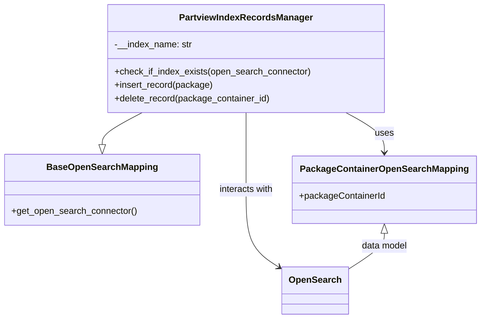

# Diagram: partview_core/partview_service/partview_service/persistence/open_search/PartviewIndexRecordsManager.py


> Auto-generated by Obscura crawlers

## Diagram 1



### SVG

<svg id="container" width="841.0859375" xmlns="http://www.w3.org/2000/svg" class="classDiagram" height="566" viewBox="0 0 841.0859375 566" role="graphics-document document" aria-roledescription="class"><style>#container{font-family:"trebuchet ms",verdana,arial,sans-serif;font-size:16px;fill:#333;}@keyframes edge-animation-frame{from{stroke-dashoffset:0;}}@keyframes dash{to{stroke-dashoffset:0;}}#container .edge-animation-slow{stroke-dasharray:9,5!important;stroke-dashoffset:900;animation:dash 50s linear infinite;stroke-linecap:round;}#container .edge-animation-fast{stroke-dasharray:9,5!important;stroke-dashoffset:900;animation:dash 20s linear infinite;stroke-linecap:round;}#container .error-icon{fill:#552222;}#container .error-text{fill:#552222;stroke:#552222;}#container .edge-thickness-normal{stroke-width:1px;}#container .edge-thickness-thick{stroke-width:3.5px;}#container .edge-pattern-solid{stroke-dasharray:0;}#container .edge-thickness-invisible{stroke-width:0;fill:none;}#container .edge-pattern-dashed{stroke-dasharray:3;}#container .edge-pattern-dotted{stroke-dasharray:2;}#container .marker{fill:#333333;stroke:#333333;}#container .marker.cross{stroke:#333333;}#container svg{font-family:"trebuchet ms",verdana,arial,sans-serif;font-size:16px;}#container p{margin:0;}#container g.classGroup text{fill:#9370DB;stroke:none;font-family:"trebuchet ms",verdana,arial,sans-serif;font-size:10px;}#container g.classGroup text .title{font-weight:bolder;}#container .nodeLabel,#container .edgeLabel{color:#131300;}#container .edgeLabel .label rect{fill:#ECECFF;}#container .label text{fill:#131300;}#container .labelBkg{background:#ECECFF;}#container .edgeLabel .label span{background:#ECECFF;}#container .classTitle{font-weight:bolder;}#container .node rect,#container .node circle,#container .node ellipse,#container .node polygon,#container .node path{fill:#ECECFF;stroke:#9370DB;stroke-width:1px;}#container .divider{stroke:#9370DB;stroke-width:1;}#container g.clickable{cursor:pointer;}#container g.classGroup rect{fill:#ECECFF;stroke:#9370DB;}#container g.classGroup line{stroke:#9370DB;stroke-width:1;}#container .classLabel .box{stroke:none;stroke-width:0;fill:#ECECFF;opacity:0.5;}#container .classLabel .label{fill:#9370DB;font-size:10px;}#container .relation{stroke:#333333;stroke-width:1;fill:none;}#container .dashed-line{stroke-dasharray:3;}#container .dotted-line{stroke-dasharray:1 2;}#container #compositionStart,#container .composition{fill:#333333!important;stroke:#333333!important;stroke-width:1;}#container #compositionEnd,#container .composition{fill:#333333!important;stroke:#333333!important;stroke-width:1;}#container #dependencyStart,#container .dependency{fill:#333333!important;stroke:#333333!important;stroke-width:1;}#container #dependencyStart,#container .dependency{fill:#333333!important;stroke:#333333!important;stroke-width:1;}#container #extensionStart,#container .extension{fill:transparent!important;stroke:#333333!important;stroke-width:1;}#container #extensionEnd,#container .extension{fill:transparent!important;stroke:#333333!important;stroke-width:1;}#container #aggregationStart,#container .aggregation{fill:transparent!important;stroke:#333333!important;stroke-width:1;}#container #aggregationEnd,#container .aggregation{fill:transparent!important;stroke:#333333!important;stroke-width:1;}#container #lollipopStart,#container .lollipop{fill:#ECECFF!important;stroke:#333333!important;stroke-width:1;}#container #lollipopEnd,#container .lollipop{fill:#ECECFF!important;stroke:#333333!important;stroke-width:1;}#container .edgeTerminals{font-size:11px;line-height:initial;}#container .classTitleText{text-anchor:middle;font-size:18px;fill:#333;}#container .label-icon{display:inline-block;height:1em;overflow:visible;vertical-align:-0.125em;}#container .node .label-icon path{fill:currentColor;stroke:revert;stroke-width:revert;}#container :root{--mermaid-font-family:"trebuchet ms",verdana,arial,sans-serif;}</style><g><defs><marker id="container_class-aggregationStart" class="marker aggregation class" refX="18" refY="7" markerWidth="190" markerHeight="240" orient="auto"><path d="M 18,7 L9,13 L1,7 L9,1 Z"></path></marker></defs><defs><marker id="container_class-aggregationEnd" class="marker aggregation class" refX="1" refY="7" markerWidth="20" markerHeight="28" orient="auto"><path d="M 18,7 L9,13 L1,7 L9,1 Z"></path></marker></defs><defs><marker id="container_class-extensionStart" class="marker extension class" refX="18" refY="7" markerWidth="190" markerHeight="240" orient="auto"><path d="M 1,7 L18,13 V 1 Z"></path></marker></defs><defs><marker id="container_class-extensionEnd" class="marker extension class" refX="1" refY="7" markerWidth="20" markerHeight="28" orient="auto"><path d="M 1,1 V 13 L18,7 Z"></path></marker></defs><defs><marker id="container_class-compositionStart" class="marker composition class" refX="18" refY="7" markerWidth="190" markerHeight="240" orient="auto"><path d="M 18,7 L9,13 L1,7 L9,1 Z"></path></marker></defs><defs><marker id="container_class-compositionEnd" class="marker composition class" refX="1" refY="7" markerWidth="20" markerHeight="28" orient="auto"><path d="M 18,7 L9,13 L1,7 L9,1 Z"></path></marker></defs><defs><marker id="container_class-dependencyStart" class="marker dependency class" refX="6" refY="7" markerWidth="190" markerHeight="240" orient="auto"><path d="M 5,7 L9,13 L1,7 L9,1 Z"></path></marker></defs><defs><marker id="container_class-dependencyEnd" class="marker dependency class" refX="13" refY="7" markerWidth="20" markerHeight="28" orient="auto"><path d="M 18,7 L9,13 L14,7 L9,1 Z"></path></marker></defs><defs><marker id="container_class-lollipopStart" class="marker lollipop class" refX="13" refY="7" markerWidth="190" markerHeight="240" orient="auto"><circle stroke="black" fill="transparent" cx="7" cy="7" r="6"></circle></marker></defs><defs><marker id="container_class-lollipopEnd" class="marker lollipop class" refX="1" refY="7" markerWidth="190" markerHeight="240" orient="auto"><circle stroke="black" fill="transparent" cx="7" cy="7" r="6"></circle></marker></defs><g class="root"><g class="clusters"></g><g class="edgePaths"><path d="M248.486,200L236.702,206.167C224.918,212.333,201.35,224.667,189.565,234.125C177.781,243.583,177.781,250.167,177.781,253.458L177.781,256.75" id="id_PartviewIndexRecordsManager_BaseOpenSearchMapping_1" class="edge-thickness-normal edge-pattern-solid relation" style=";;;" data-edge="true" data-et="edge" data-id="id_PartviewIndexRecordsManager_BaseOpenSearchMapping_1" data-points="W3sieCI6MjQ4LjQ4NjM3MjE4MDQ1MTEzLCJ5IjoyMDB9LHsieCI6MTc3Ljc4MTI1LCJ5IjoyMzd9LHsieCI6MTc3Ljc4MTI1LCJ5IjoyNzR9XQ==" marker-end="url(#container_class-extensionEnd)"></path><path d="M607.164,200L618.42,206.167C629.676,212.333,652.187,224.667,663.443,236.5C674.699,248.333,674.699,259.667,674.699,265.333L674.699,271" id="id_PartviewIndexRecordsManager_PackageContainerOpenSearchMapping_2" class="edge-thickness-normal edge-pattern-solid relation" style=";;;" data-edge="true" data-et="edge" data-id="id_PartviewIndexRecordsManager_PackageContainerOpenSearchMapping_2" data-points="W3sieCI6NjA3LjE2NDAwMzc1OTM5ODUsInkiOjIwMH0seyJ4Ijo2NzQuNjk5MjE4NzUsInkiOjIzN30seyJ4Ijo2NzQuNjk5MjE4NzUsInkiOjI3N31d" marker-end="url(#container_class-dependencyEnd)"></path><path d="M431.938,200L431.938,206.167C431.938,212.333,431.938,224.667,431.938,247.5C431.938,270.333,431.938,303.667,431.938,337C431.938,370.333,431.938,403.667,441.987,426.874C452.037,450.081,472.136,463.163,482.185,469.704L492.235,476.244" id="id_PartviewIndexRecordsManager_OpenSearch_3" class="edge-thickness-normal edge-pattern-solid relation" style=";;;" data-edge="true" data-et="edge" data-id="id_PartviewIndexRecordsManager_OpenSearch_3" data-points="W3sieCI6NDMxLjkzNzUsInkiOjIwMH0seyJ4Ijo0MzEuOTM3NSwieSI6MjM3fSx7IngiOjQzMS45Mzc1LCJ5IjozMzd9LHsieCI6NDMxLjkzNzUsInkiOjQzN30seyJ4Ijo0OTcuMjYzNjcxODc1LCJ5Ijo0NzkuNTE3MTQ0ODM0MDIyNn1d" marker-end="url(#container_class-dependencyEnd)"></path><path d="M674.699,414.25L674.699,418.042C674.699,421.833,674.699,429.417,663.812,440.295C652.924,451.172,631.148,465.345,620.261,472.431L609.373,479.517" id="id_PackageContainerOpenSearchMapping_OpenSearch_4" class="edge-thickness-normal edge-pattern-solid relation" style=";;;" data-edge="true" data-et="edge" data-id="id_PackageContainerOpenSearchMapping_OpenSearch_4" data-points="W3sieCI6Njc0LjY5OTIxODc1LCJ5IjozOTd9LHsieCI6Njc0LjY5OTIxODc1LCJ5Ijo0Mzd9LHsieCI6NjA5LjM3MzA0Njg3NSwieSI6NDc5LjUxNzE0NDgzNDAyMjZ9XQ==" marker-start="url(#container_class-extensionStart)"></path></g><g class="edgeLabels"><g class="edgeLabel"><g class="label" data-id="id_PartviewIndexRecordsManager_BaseOpenSearchMapping_1" transform="translate(0, 0)"><foreignObject width="0" height="0"><div xmlns="http://www.w3.org/1999/xhtml" class="labelBkg" style="display: table-cell; white-space: nowrap; line-height: 1.5; max-width: 200px; text-align: center;"><span class="edgeLabel"></span></div></foreignObject></g></g><g class="edgeLabel" transform="translate(674.69921875, 237)"><g class="label" data-id="id_PartviewIndexRecordsManager_PackageContainerOpenSearchMapping_2" transform="translate(-16.4921875, -12)"><foreignObject width="32.984375" height="24"><div xmlns="http://www.w3.org/1999/xhtml" class="labelBkg" style="display: table-cell; white-space: nowrap; line-height: 1.5; max-width: 200px; text-align: center;"><span class="edgeLabel"><p>uses</p></span></div></foreignObject></g></g><g class="edgeLabel" transform="translate(431.9375, 337)"><g class="label" data-id="id_PartviewIndexRecordsManager_OpenSearch_3" transform="translate(-49.375, -12)"><foreignObject width="98.75" height="24"><div xmlns="http://www.w3.org/1999/xhtml" class="labelBkg" style="display: table-cell; white-space: nowrap; line-height: 1.5; max-width: 200px; text-align: center;"><span class="edgeLabel"><p>interacts with</p></span></div></foreignObject></g></g><g class="edgeLabel" transform="translate(674.69921875, 437)"><g class="label" data-id="id_PackageContainerOpenSearchMapping_OpenSearch_4" transform="translate(-41.4609375, -12)"><foreignObject width="82.921875" height="24"><div xmlns="http://www.w3.org/1999/xhtml" class="labelBkg" style="display: table-cell; white-space: nowrap; line-height: 1.5; max-width: 200px; text-align: center;"><span class="edgeLabel"><p>data model</p></span></div></foreignObject></g></g></g><g class="nodes"><g class="node default" id="classId-BaseOpenSearchMapping-0" transform="translate(177.78125, 337)"><g class="basic label-container"><path d="M-169.78125 -63 L169.78125 -63 L169.78125 63 L-169.78125 63" stroke="none" stroke-width="0" fill="#ECECFF" style=""></path><path d="M-169.78125 -63 C-64.76674739237163 -63, 40.247755215256745 -63, 169.78125 -63 M-169.78125 -63 C-46.056888895869605 -63, 77.66747220826079 -63, 169.78125 -63 M169.78125 -63 C169.78125 -36.580352400161956, 169.78125 -10.16070480032392, 169.78125 63 M169.78125 -63 C169.78125 -33.62492711045018, 169.78125 -4.24985422090036, 169.78125 63 M169.78125 63 C39.62099477240929 63, -90.53926045518142 63, -169.78125 63 M169.78125 63 C51.753036139055865 63, -66.27517772188827 63, -169.78125 63 M-169.78125 63 C-169.78125 20.578113705351186, -169.78125 -21.84377258929763, -169.78125 -63 M-169.78125 63 C-169.78125 32.818387153627654, -169.78125 2.6367743072553154, -169.78125 -63" stroke="#9370DB" stroke-width="1.3" fill="none" stroke-dasharray="0 0" style=""></path></g><g class="annotation-group text" transform="translate(0, -39)"></g><g class="label-group text" transform="translate(-93.078125, -39)"><g class="label" style="font-weight: bolder" transform="translate(0,-12)"><foreignObject width="186.15625" height="24"><div xmlns="http://www.w3.org/1999/xhtml" style="display: table-cell; white-space: nowrap; line-height: 1.5; max-width: 235px; text-align: center;"><span class="nodeLabel markdown-node-label" style=""><p>BaseOpenSearchMapping</p></span></div></foreignObject></g></g><g class="members-group text" transform="translate(-157.78125, 9)"></g><g class="methods-group text" transform="translate(-157.78125, 39)"><g class="label" style="" transform="translate(0,-12)"><foreignObject width="222.484375" height="24"><div xmlns="http://www.w3.org/1999/xhtml" style="display: table-cell; white-space: nowrap; line-height: 1.5; max-width: 280px; text-align: center;"><span class="nodeLabel markdown-node-label" style=""><p>+get_open_search_connector()</p></span></div></foreignObject></g></g><g class="divider" style=""><path d="M-169.78125 -15 C-84.03811235482297 -15, 1.7050252903540581 -15, 169.78125 -15 M-169.78125 -15 C-67.43054191411741 -15, 34.920166171765175 -15, 169.78125 -15" stroke="#9370DB" stroke-width="1.3" fill="none" stroke-dasharray="0 0" style=""></path></g><g class="divider" style=""><path d="M-169.78125 9 C-35.97235510499175 9, 97.8365397900165 9, 169.78125 9 M-169.78125 9 C-101.56084379633667 9, -33.34043759267334 9, 169.78125 9" stroke="#9370DB" stroke-width="1.3" fill="none" stroke-dasharray="0 0" style=""></path></g></g><g class="node default" id="classId-PartviewIndexRecordsManager-1" transform="translate(431.9375, 104)"><g class="basic label-container"><path d="M-242.76171875 -96 L242.76171875 -96 L242.76171875 96 L-242.76171875 96" stroke="none" stroke-width="0" fill="#ECECFF" style=""></path><path d="M-242.76171875 -96 C-97.32639420210847 -96, 48.10893034578305 -96, 242.76171875 -96 M-242.76171875 -96 C-132.82971789441643 -96, -22.897717038832894 -96, 242.76171875 -96 M242.76171875 -96 C242.76171875 -49.88400143336528, 242.76171875 -3.768002866730555, 242.76171875 96 M242.76171875 -96 C242.76171875 -54.03433636970709, 242.76171875 -12.068672739414183, 242.76171875 96 M242.76171875 96 C68.53348746423694 96, -105.69474382152612 96, -242.76171875 96 M242.76171875 96 C81.36649717279894 96, -80.02872440440211 96, -242.76171875 96 M-242.76171875 96 C-242.76171875 39.07150519200794, -242.76171875 -17.85698961598412, -242.76171875 -96 M-242.76171875 96 C-242.76171875 39.35477742681785, -242.76171875 -17.290445146364306, -242.76171875 -96" stroke="#9370DB" stroke-width="1.3" fill="none" stroke-dasharray="0 0" style=""></path></g><g class="annotation-group text" transform="translate(0, -72)"></g><g class="label-group text" transform="translate(-112.6171875, -72)"><g class="label" style="font-weight: bolder" transform="translate(0,-12)"><foreignObject width="225.234375" height="24"><div xmlns="http://www.w3.org/1999/xhtml" style="display: table-cell; white-space: nowrap; line-height: 1.5; max-width: 272px; text-align: center;"><span class="nodeLabel markdown-node-label" style=""><p>PartviewIndexRecordsManager</p></span></div></foreignObject></g></g><g class="members-group text" transform="translate(-230.76171875, -24)"><g class="label" style="" transform="translate(0,-12)"><foreignObject width="137.78125" height="24"><div xmlns="http://www.w3.org/1999/xhtml" style="display: table-cell; white-space: nowrap; line-height: 1.5; max-width: 196px; text-align: center;"><span class="nodeLabel markdown-node-label" style=""><p>-__index_name: str</p></span></div></foreignObject></g></g><g class="methods-group text" transform="translate(-230.76171875, 24)"><g class="label" style="" transform="translate(0,-12)"><foreignObject width="348.90625" height="24"><div xmlns="http://www.w3.org/1999/xhtml" style="display: table-cell; white-space: nowrap; line-height: 1.5; max-width: 406px; text-align: center;"><span class="nodeLabel markdown-node-label" style=""><p>+check_if_index_exists(open_search_connector)</p></span></div></foreignObject></g><g class="label" style="" transform="translate(0,12)"><foreignObject width="174.046875" height="24"><div xmlns="http://www.w3.org/1999/xhtml" style="display: table-cell; white-space: nowrap; line-height: 1.5; max-width: 231px; text-align: center;"><span class="nodeLabel markdown-node-label" style=""><p>+insert_record(package)</p></span></div></foreignObject></g><g class="label" style="" transform="translate(0,36)"><foreignObject width="275.5625" height="24"><div xmlns="http://www.w3.org/1999/xhtml" style="display: table-cell; white-space: nowrap; line-height: 1.5; max-width: 333px; text-align: center;"><span class="nodeLabel markdown-node-label" style=""><p>+delete_record(package_container_id)</p></span></div></foreignObject></g></g><g class="divider" style=""><path d="M-242.76171875 -48 C-63.808021856740794 -48, 115.14567503651841 -48, 242.76171875 -48 M-242.76171875 -48 C-115.33198969633384 -48, 12.09773935733233 -48, 242.76171875 -48" stroke="#9370DB" stroke-width="1.3" fill="none" stroke-dasharray="0 0" style=""></path></g><g class="divider" style=""><path d="M-242.76171875 0 C-87.18960687969894 0, 68.38250499060211 0, 242.76171875 0 M-242.76171875 0 C-84.45732119671231 0, 73.84707635657537 0, 242.76171875 0" stroke="#9370DB" stroke-width="1.3" fill="none" stroke-dasharray="0 0" style=""></path></g></g><g class="node default" id="classId-PackageContainerOpenSearchMapping-2" transform="translate(674.69921875, 337)"><g class="basic label-container"><path d="M-158.38671875 -60 L158.38671875 -60 L158.38671875 60 L-158.38671875 60" stroke="none" stroke-width="0" fill="#ECECFF" style=""></path><path d="M-158.38671875 -60 C-76.84034899824562 -60, 4.706020753508767 -60, 158.38671875 -60 M-158.38671875 -60 C-84.59674084381638 -60, -10.806762937632755 -60, 158.38671875 -60 M158.38671875 -60 C158.38671875 -18.08695018035872, 158.38671875 23.82609963928256, 158.38671875 60 M158.38671875 -60 C158.38671875 -13.66911753788331, 158.38671875 32.66176492423338, 158.38671875 60 M158.38671875 60 C32.3060393421237 60, -93.7746400657526 60, -158.38671875 60 M158.38671875 60 C39.51616724640613 60, -79.35438425718775 60, -158.38671875 60 M-158.38671875 60 C-158.38671875 34.71484291220338, -158.38671875 9.429685824406754, -158.38671875 -60 M-158.38671875 60 C-158.38671875 12.14850295690178, -158.38671875 -35.70299408619644, -158.38671875 -60" stroke="#9370DB" stroke-width="1.3" fill="none" stroke-dasharray="0 0" style=""></path></g><g class="annotation-group text" transform="translate(0, -36)"></g><g class="label-group text" transform="translate(-141.0078125, -36)"><g class="label" style="font-weight: bolder" transform="translate(0,-12)"><foreignObject width="282.015625" height="24"><div xmlns="http://www.w3.org/1999/xhtml" style="display: table-cell; white-space: nowrap; line-height: 1.5; max-width: 329px; text-align: center;"><span class="nodeLabel markdown-node-label" style=""><p>PackageContainerOpenSearchMapping</p></span></div></foreignObject></g></g><g class="members-group text" transform="translate(-146.38671875, 12)"><g class="label" style="" transform="translate(0,-12)"><foreignObject width="151.765625" height="24"><div xmlns="http://www.w3.org/1999/xhtml" style="display: table-cell; white-space: nowrap; line-height: 1.5; max-width: 209px; text-align: center;"><span class="nodeLabel markdown-node-label" style=""><p>+packageContainerId</p></span></div></foreignObject></g></g><g class="methods-group text" transform="translate(-146.38671875, 60)"></g><g class="divider" style=""><path d="M-158.38671875 -12 C-59.330855389064766 -12, 39.72500797187047 -12, 158.38671875 -12 M-158.38671875 -12 C-71.0088976989019 -12, 16.36892335219619 -12, 158.38671875 -12" stroke="#9370DB" stroke-width="1.3" fill="none" stroke-dasharray="0 0" style=""></path></g><g class="divider" style=""><path d="M-158.38671875 36 C-86.46093401085042 36, -14.535149271700845 36, 158.38671875 36 M-158.38671875 36 C-67.49409830019658 36, 23.398522149606833 36, 158.38671875 36" stroke="#9370DB" stroke-width="1.3" fill="none" stroke-dasharray="0 0" style=""></path></g></g><g class="node default" id="classId-OpenSearch-3" transform="translate(553.318359375, 516)"><g class="basic label-container"><path d="M-56.0546875 -42 L56.0546875 -42 L56.0546875 42 L-56.0546875 42" stroke="none" stroke-width="0" fill="#ECECFF" style=""></path><path d="M-56.0546875 -42 C-20.632647168277494 -42, 14.789393163445013 -42, 56.0546875 -42 M-56.0546875 -42 C-27.861609973558874 -42, 0.33146755288225194 -42, 56.0546875 -42 M56.0546875 -42 C56.0546875 -11.341847908442993, 56.0546875 19.316304183114013, 56.0546875 42 M56.0546875 -42 C56.0546875 -23.64785787165008, 56.0546875 -5.295715743300157, 56.0546875 42 M56.0546875 42 C16.350143246034484 42, -23.35440100793103 42, -56.0546875 42 M56.0546875 42 C29.449691436570394 42, 2.8446953731407874 42, -56.0546875 42 M-56.0546875 42 C-56.0546875 15.815350863020402, -56.0546875 -10.369298273959195, -56.0546875 -42 M-56.0546875 42 C-56.0546875 20.665368253533583, -56.0546875 -0.6692634929328349, -56.0546875 -42" stroke="#9370DB" stroke-width="1.3" fill="none" stroke-dasharray="0 0" style=""></path></g><g class="annotation-group text" transform="translate(0, -18)"></g><g class="label-group text" transform="translate(-44.0546875, -18)"><g class="label" style="font-weight: bolder" transform="translate(0,-12)"><foreignObject width="88.109375" height="24"><div xmlns="http://www.w3.org/1999/xhtml" style="display: table-cell; white-space: nowrap; line-height: 1.5; max-width: 137px; text-align: center;"><span class="nodeLabel markdown-node-label" style=""><p>OpenSearch</p></span></div></foreignObject></g></g><g class="members-group text" transform="translate(-44.0546875, 30)"></g><g class="methods-group text" transform="translate(-44.0546875, 60)"></g><g class="divider" style=""><path d="M-56.0546875 6 C-18.22025277933875 6, 19.6141819413225 6, 56.0546875 6 M-56.0546875 6 C-25.55657666895515 6, 4.941534162089702 6, 56.0546875 6" stroke="#9370DB" stroke-width="1.3" fill="none" stroke-dasharray="0 0" style=""></path></g><g class="divider" style=""><path d="M-56.0546875 24 C-20.682738002875126 24, 14.689211494249747 24, 56.0546875 24 M-56.0546875 24 C-22.50168307911681 24, 11.051321341766382 24, 56.0546875 24" stroke="#9370DB" stroke-width="1.3" fill="none" stroke-dasharray="0 0" style=""></path></g></g></g></g></g></svg>

## Diagram 2

```mermaid
flowchart TD
    A[Start: insert/delete call] --> B[get_open_search_connector()]
    B --> C[check_if_index_exists(index="partview_search")]
    C -->|exists| D{Operation?}
    C -->|missing| E[Raise ValueError and log error]
    D -->|insert| F[index document: body=asdict(package), id=package.packageContainerId]
    D -->|delete| G[delete document: id=package_container_id]
    F --> H[log info "Document insertion response"]
    G --> I[log info "Document deletion response"]
    E --> J[log info "Index already there" or exception path]
    H --> K[End]
    I --> K
    J --> K
```

> SVG rendering failed for this diagram.
