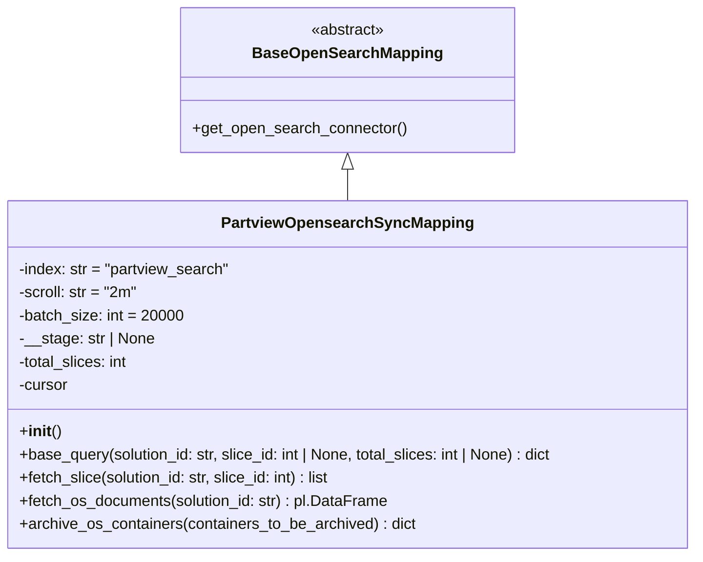

# Diagram: partview_core/partview_service/partview_service/persistence/open_search/PartviewOpensearchSyncMapping.py


> Auto-generated by Obscura crawlers

## Diagram 1



### SVG

<svg id="container" width="728.9296875" xmlns="http://www.w3.org/2000/svg" class="classDiagram" height="576" viewBox="0 0 728.9296875 576" role="graphics-document document" aria-roledescription="class"><style>#container{font-family:"trebuchet ms",verdana,arial,sans-serif;font-size:16px;fill:#333;}@keyframes edge-animation-frame{from{stroke-dashoffset:0;}}@keyframes dash{to{stroke-dashoffset:0;}}#container .edge-animation-slow{stroke-dasharray:9,5!important;stroke-dashoffset:900;animation:dash 50s linear infinite;stroke-linecap:round;}#container .edge-animation-fast{stroke-dasharray:9,5!important;stroke-dashoffset:900;animation:dash 20s linear infinite;stroke-linecap:round;}#container .error-icon{fill:#552222;}#container .error-text{fill:#552222;stroke:#552222;}#container .edge-thickness-normal{stroke-width:1px;}#container .edge-thickness-thick{stroke-width:3.5px;}#container .edge-pattern-solid{stroke-dasharray:0;}#container .edge-thickness-invisible{stroke-width:0;fill:none;}#container .edge-pattern-dashed{stroke-dasharray:3;}#container .edge-pattern-dotted{stroke-dasharray:2;}#container .marker{fill:#333333;stroke:#333333;}#container .marker.cross{stroke:#333333;}#container svg{font-family:"trebuchet ms",verdana,arial,sans-serif;font-size:16px;}#container p{margin:0;}#container g.classGroup text{fill:#9370DB;stroke:none;font-family:"trebuchet ms",verdana,arial,sans-serif;font-size:10px;}#container g.classGroup text .title{font-weight:bolder;}#container .nodeLabel,#container .edgeLabel{color:#131300;}#container .edgeLabel .label rect{fill:#ECECFF;}#container .label text{fill:#131300;}#container .labelBkg{background:#ECECFF;}#container .edgeLabel .label span{background:#ECECFF;}#container .classTitle{font-weight:bolder;}#container .node rect,#container .node circle,#container .node ellipse,#container .node polygon,#container .node path{fill:#ECECFF;stroke:#9370DB;stroke-width:1px;}#container .divider{stroke:#9370DB;stroke-width:1;}#container g.clickable{cursor:pointer;}#container g.classGroup rect{fill:#ECECFF;stroke:#9370DB;}#container g.classGroup line{stroke:#9370DB;stroke-width:1;}#container .classLabel .box{stroke:none;stroke-width:0;fill:#ECECFF;opacity:0.5;}#container .classLabel .label{fill:#9370DB;font-size:10px;}#container .relation{stroke:#333333;stroke-width:1;fill:none;}#container .dashed-line{stroke-dasharray:3;}#container .dotted-line{stroke-dasharray:1 2;}#container #compositionStart,#container .composition{fill:#333333!important;stroke:#333333!important;stroke-width:1;}#container #compositionEnd,#container .composition{fill:#333333!important;stroke:#333333!important;stroke-width:1;}#container #dependencyStart,#container .dependency{fill:#333333!important;stroke:#333333!important;stroke-width:1;}#container #dependencyStart,#container .dependency{fill:#333333!important;stroke:#333333!important;stroke-width:1;}#container #extensionStart,#container .extension{fill:transparent!important;stroke:#333333!important;stroke-width:1;}#container #extensionEnd,#container .extension{fill:transparent!important;stroke:#333333!important;stroke-width:1;}#container #aggregationStart,#container .aggregation{fill:transparent!important;stroke:#333333!important;stroke-width:1;}#container #aggregationEnd,#container .aggregation{fill:transparent!important;stroke:#333333!important;stroke-width:1;}#container #lollipopStart,#container .lollipop{fill:#ECECFF!important;stroke:#333333!important;stroke-width:1;}#container #lollipopEnd,#container .lollipop{fill:#ECECFF!important;stroke:#333333!important;stroke-width:1;}#container .edgeTerminals{font-size:11px;line-height:initial;}#container .classTitleText{text-anchor:middle;font-size:18px;fill:#333;}#container .label-icon{display:inline-block;height:1em;overflow:visible;vertical-align:-0.125em;}#container .node .label-icon path{fill:currentColor;stroke:revert;stroke-width:revert;}#container :root{--mermaid-font-family:"trebuchet ms",verdana,arial,sans-serif;}</style><g><defs><marker id="container_class-aggregationStart" class="marker aggregation class" refX="18" refY="7" markerWidth="190" markerHeight="240" orient="auto"><path d="M 18,7 L9,13 L1,7 L9,1 Z"></path></marker></defs><defs><marker id="container_class-aggregationEnd" class="marker aggregation class" refX="1" refY="7" markerWidth="20" markerHeight="28" orient="auto"><path d="M 18,7 L9,13 L1,7 L9,1 Z"></path></marker></defs><defs><marker id="container_class-extensionStart" class="marker extension class" refX="18" refY="7" markerWidth="190" markerHeight="240" orient="auto"><path d="M 1,7 L18,13 V 1 Z"></path></marker></defs><defs><marker id="container_class-extensionEnd" class="marker extension class" refX="1" refY="7" markerWidth="20" markerHeight="28" orient="auto"><path d="M 1,1 V 13 L18,7 Z"></path></marker></defs><defs><marker id="container_class-compositionStart" class="marker composition class" refX="18" refY="7" markerWidth="190" markerHeight="240" orient="auto"><path d="M 18,7 L9,13 L1,7 L9,1 Z"></path></marker></defs><defs><marker id="container_class-compositionEnd" class="marker composition class" refX="1" refY="7" markerWidth="20" markerHeight="28" orient="auto"><path d="M 18,7 L9,13 L1,7 L9,1 Z"></path></marker></defs><defs><marker id="container_class-dependencyStart" class="marker dependency class" refX="6" refY="7" markerWidth="190" markerHeight="240" orient="auto"><path d="M 5,7 L9,13 L1,7 L9,1 Z"></path></marker></defs><defs><marker id="container_class-dependencyEnd" class="marker dependency class" refX="13" refY="7" markerWidth="20" markerHeight="28" orient="auto"><path d="M 18,7 L9,13 L14,7 L9,1 Z"></path></marker></defs><defs><marker id="container_class-lollipopStart" class="marker lollipop class" refX="13" refY="7" markerWidth="190" markerHeight="240" orient="auto"><circle stroke="black" fill="transparent" cx="7" cy="7" r="6"></circle></marker></defs><defs><marker id="container_class-lollipopEnd" class="marker lollipop class" refX="1" refY="7" markerWidth="190" markerHeight="240" orient="auto"><circle stroke="black" fill="transparent" cx="7" cy="7" r="6"></circle></marker></defs><g class="root"><g class="clusters"></g><g class="edgePaths"><path d="M364.465,175.25L364.465,176.542C364.465,177.833,364.465,180.417,364.465,185.875C364.465,191.333,364.465,199.667,364.465,203.833L364.465,208" id="id_BaseOpenSearchMapping_PartviewOpensearchSyncMapping_1" class="edge-thickness-normal edge-pattern-solid relation" style=";;;" data-edge="true" data-et="edge" data-id="id_BaseOpenSearchMapping_PartviewOpensearchSyncMapping_1" data-points="W3sieCI6MzY0LjQ2NDg0Mzc1LCJ5IjoxNTh9LHsieCI6MzY0LjQ2NDg0Mzc1LCJ5IjoxODN9LHsieCI6MzY0LjQ2NDg0Mzc1LCJ5IjoyMDh9XQ==" marker-start="url(#container_class-extensionStart)"></path></g><g class="edgeLabels"><g class="edgeLabel"><g class="label" data-id="id_BaseOpenSearchMapping_PartviewOpensearchSyncMapping_1" transform="translate(0, 0)"><foreignObject width="0" height="0"><div xmlns="http://www.w3.org/1999/xhtml" class="labelBkg" style="display: table-cell; white-space: nowrap; line-height: 1.5; max-width: 200px; text-align: center;"><span class="edgeLabel"></span></div></foreignObject></g></g></g><g class="nodes"><g class="node default" id="classId-BaseOpenSearchMapping-0" transform="translate(364.46484375, 83)"><g class="basic label-container"><path d="M-169.78125 -75 L169.78125 -75 L169.78125 75 L-169.78125 75" stroke="none" stroke-width="0" fill="#ECECFF" style=""></path><path d="M-169.78125 -75 C-82.13369494174201 -75, 5.5138601165159855 -75, 169.78125 -75 M-169.78125 -75 C-69.11626058561366 -75, 31.54872882877268 -75, 169.78125 -75 M169.78125 -75 C169.78125 -26.385845283486333, 169.78125 22.228309433027334, 169.78125 75 M169.78125 -75 C169.78125 -33.97237673962675, 169.78125 7.055246520746493, 169.78125 75 M169.78125 75 C79.39216698943584 75, -10.996916021128328 75, -169.78125 75 M169.78125 75 C57.57723977934717 75, -54.626770441305666 75, -169.78125 75 M-169.78125 75 C-169.78125 28.687605387934184, -169.78125 -17.624789224131632, -169.78125 -75 M-169.78125 75 C-169.78125 23.156224390059307, -169.78125 -28.687551219881385, -169.78125 -75" stroke="#9370DB" stroke-width="1.3" fill="none" stroke-dasharray="0 0" style=""></path></g><g class="annotation-group text" transform="translate(-38.609375, -51)"><g class="label" style="" transform="translate(0,-12)"><foreignObject width="77.21875" height="24"><div xmlns="http://www.w3.org/1999/xhtml" style="display: table-cell; white-space: nowrap; line-height: 1.5; max-width: 127px; text-align: center;"><span class="nodeLabel markdown-node-label" style=""><p>«abstract»</p></span></div></foreignObject></g></g><g class="label-group text" transform="translate(-93.078125, -27)"><g class="label" style="font-weight: bolder" transform="translate(0,-12)"><foreignObject width="186.15625" height="24"><div xmlns="http://www.w3.org/1999/xhtml" style="display: table-cell; white-space: nowrap; line-height: 1.5; max-width: 235px; text-align: center;"><span class="nodeLabel markdown-node-label" style=""><p>BaseOpenSearchMapping</p></span></div></foreignObject></g></g><g class="members-group text" transform="translate(-157.78125, 21)"></g><g class="methods-group text" transform="translate(-157.78125, 51)"><g class="label" style="" transform="translate(0,-12)"><foreignObject width="222.484375" height="24"><div xmlns="http://www.w3.org/1999/xhtml" style="display: table-cell; white-space: nowrap; line-height: 1.5; max-width: 280px; text-align: center;"><span class="nodeLabel markdown-node-label" style=""><p>+get_open_search_connector()</p></span></div></foreignObject></g></g><g class="divider" style=""><path d="M-169.78125 -3 C-90.71338630785502 -3, -11.645522615710036 -3, 169.78125 -3 M-169.78125 -3 C-56.5260334056922 -3, 56.72918318861559 -3, 169.78125 -3" stroke="#9370DB" stroke-width="1.3" fill="none" stroke-dasharray="0 0" style=""></path></g><g class="divider" style=""><path d="M-169.78125 21 C-66.02629477716896 21, 37.728660445662086 21, 169.78125 21 M-169.78125 21 C-77.01251708038265 21, 15.756215839234699 21, 169.78125 21" stroke="#9370DB" stroke-width="1.3" fill="none" stroke-dasharray="0 0" style=""></path></g></g><g class="node default" id="classId-PartviewOpensearchSyncMapping-1" transform="translate(364.46484375, 388)"><g class="basic label-container"><path d="M-356.46484375 -180 L356.46484375 -180 L356.46484375 180 L-356.46484375 180" stroke="none" stroke-width="0" fill="#ECECFF" style=""></path><path d="M-356.46484375 -180 C-82.05216470518207 -180, 192.36051433963587 -180, 356.46484375 -180 M-356.46484375 -180 C-109.72666920774344 -180, 137.01150533451312 -180, 356.46484375 -180 M356.46484375 -180 C356.46484375 -100.28747477044095, 356.46484375 -20.574949540881903, 356.46484375 180 M356.46484375 -180 C356.46484375 -50.24858196323299, 356.46484375 79.50283607353401, 356.46484375 180 M356.46484375 180 C111.84546528781732 180, -132.77391317436536 180, -356.46484375 180 M356.46484375 180 C210.81210331233083 180, 65.15936287466167 180, -356.46484375 180 M-356.46484375 180 C-356.46484375 70.80094383482074, -356.46484375 -38.398112330358515, -356.46484375 -180 M-356.46484375 180 C-356.46484375 73.43230857455315, -356.46484375 -33.135382850893706, -356.46484375 -180" stroke="#9370DB" stroke-width="1.3" fill="none" stroke-dasharray="0 0" style=""></path></g><g class="annotation-group text" transform="translate(0, -156)"></g><g class="label-group text" transform="translate(-123.7265625, -156)"><g class="label" style="font-weight: bolder" transform="translate(0,-12)"><foreignObject width="247.453125" height="24"><div xmlns="http://www.w3.org/1999/xhtml" style="display: table-cell; white-space: nowrap; line-height: 1.5; max-width: 294px; text-align: center;"><span class="nodeLabel markdown-node-label" style=""><p>PartviewOpensearchSyncMapping</p></span></div></foreignObject></g></g><g class="members-group text" transform="translate(-344.46484375, -108)"><g class="label" style="" transform="translate(0,-12)"><foreignObject width="220.859375" height="24"><div xmlns="http://www.w3.org/1999/xhtml" style="display: table-cell; white-space: nowrap; line-height: 1.5; max-width: 278px; text-align: center;"><span class="nodeLabel markdown-node-label" style=""><p>-index: str = "partview_search"</p></span></div></foreignObject></g><g class="label" style="" transform="translate(0,12)"><foreignObject width="124.375" height="24"><div xmlns="http://www.w3.org/1999/xhtml" style="display: table-cell; white-space: nowrap; line-height: 1.5; max-width: 182px; text-align: center;"><span class="nodeLabel markdown-node-label" style=""><p>-scroll: str = "2m"</p></span></div></foreignObject></g><g class="label" style="" transform="translate(0,36)"><foreignObject width="170.828125" height="24"><div xmlns="http://www.w3.org/1999/xhtml" style="display: table-cell; white-space: nowrap; line-height: 1.5; max-width: 228px; text-align: center;"><span class="nodeLabel markdown-node-label" style=""><p>-batch_size: int = 20000</p></span></div></foreignObject></g><g class="label" style="" transform="translate(0,60)"><foreignObject width="140.921875" height="24"><div xmlns="http://www.w3.org/1999/xhtml" style="display: table-cell; white-space: nowrap; line-height: 1.5; max-width: 198px; text-align: center;"><span class="nodeLabel markdown-node-label" style=""><p>-__stage: str | None</p></span></div></foreignObject></g><g class="label" style="" transform="translate(0,84)"><foreignObject width="116.40625" height="24"><div xmlns="http://www.w3.org/1999/xhtml" style="display: table-cell; white-space: nowrap; line-height: 1.5; max-width: 174px; text-align: center;"><span class="nodeLabel markdown-node-label" style=""><p>-total_slices: int</p></span></div></foreignObject></g><g class="label" style="" transform="translate(0,108)"><foreignObject width="52.1875" height="24"><div xmlns="http://www.w3.org/1999/xhtml" style="display: table-cell; white-space: nowrap; line-height: 1.5; max-width: 110px; text-align: center;"><span class="nodeLabel markdown-node-label" style=""><p>-cursor</p></span></div></foreignObject></g></g><g class="methods-group text" transform="translate(-344.46484375, 60)"><g class="label" style="" transform="translate(0,-12)"><foreignObject width="42.796875" height="24"><div xmlns="http://www.w3.org/1999/xhtml" style="display: table-cell; white-space: nowrap; line-height: 1.5; max-width: 132px; text-align: center;"><span class="nodeLabel markdown-node-label" style=""><p>+<strong>init</strong>()</p></span></div></foreignObject></g><g class="label" style="" transform="translate(0,12)"><foreignObject width="565.203125" height="24"><div xmlns="http://www.w3.org/1999/xhtml" style="display: table-cell; white-space: nowrap; line-height: 1.5; max-width: 623px; text-align: center;"><span class="nodeLabel markdown-node-label" style=""><p>+base_query(solution_id: str, slice_id: int | None, total_slices: int | None) : dict</p></span></div></foreignObject></g><g class="label" style="" transform="translate(0,36)"><foreignObject width="329.484375" height="24"><div xmlns="http://www.w3.org/1999/xhtml" style="display: table-cell; white-space: nowrap; line-height: 1.5; max-width: 387px; text-align: center;"><span class="nodeLabel markdown-node-label" style=""><p>+fetch_slice(solution_id: str, slice_id: int) : list</p></span></div></foreignObject></g><g class="label" style="" transform="translate(0,60)"><foreignObject width="385.265625" height="24"><div xmlns="http://www.w3.org/1999/xhtml" style="display: table-cell; white-space: nowrap; line-height: 1.5; max-width: 443px; text-align: center;"><span class="nodeLabel markdown-node-label" style=""><p>+fetch_os_documents(solution_id: str) : pl.DataFrame</p></span></div></foreignObject></g><g class="label" style="" transform="translate(0,84)"><foreignObject width="413.9375" height="24"><div xmlns="http://www.w3.org/1999/xhtml" style="display: table-cell; white-space: nowrap; line-height: 1.5; max-width: 472px; text-align: center;"><span class="nodeLabel markdown-node-label" style=""><p>+archive_os_containers(containers_to_be_archived) : dict</p></span></div></foreignObject></g></g><g class="divider" style=""><path d="M-356.46484375 -132 C-204.82233271066966 -132, -53.17982167133931 -132, 356.46484375 -132 M-356.46484375 -132 C-98.16671443503066 -132, 160.1314148799387 -132, 356.46484375 -132" stroke="#9370DB" stroke-width="1.3" fill="none" stroke-dasharray="0 0" style=""></path></g><g class="divider" style=""><path d="M-356.46484375 36 C-206.35487801078273 36, -56.244912271565454 36, 356.46484375 36 M-356.46484375 36 C-187.79126606299678 36, -19.117688375993566 36, 356.46484375 36" stroke="#9370DB" stroke-width="1.3" fill="none" stroke-dasharray="0 0" style=""></path></g></g></g></g></g></svg>

## Diagram 2

```mermaid
flowchart LR
    A[fetch_os_documents(solution_id)] --> B[Create ThreadPoolExecutor(max_workers = total_slices + 1)]
    B --> C[Submit fetch_slice for each slice_id -> futures]
    C --> D[as_completed over futures]
    D --> E{future.result()}
    E -->|success| F[extend all_records with records from slice]
    E -->|exception| G[raise Exception("An error occurred in slice ...")]
    F --> H[pl.from_dicts(all_records)]
    H --> I[Return DataFrame]
    subgraph fetch_slice_flow
        FS1[base_query(solution_id, slice_id, total_slices)] --> FS2[cursor.search(index, body=query, params={scroll,size})]
        FS2 --> FS3[extract _scroll_id and hits]
        FS3 --> FS4{while hits}
        FS4 --> FS5[map hits to records and extend records list]
        FS5 --> FS6[response = cursor.scroll(scroll_id=scroll_id)]
        FS6 --> FS3
        FS4 --> FS7[return records]
    end
    D --> fetch_slice_flow
```

> SVG rendering failed for this diagram.

## Diagram 3

```mermaid
flowchart LR
    X[archive_os_containers(containers)] --> Y[results = {success_count:0, failed_ids:[], error_messages:[]}]
    Y --> Z[for each batch of 100 in containers]
    Z --> O[build operations list: update + doc with status ARCHIVED and modified timestamp]
    O --> P[cursor.bulk(body=operations, params={refresh:false, timeout:20})]
    P --> Q[for item in response["items"]]
    Q --> R{item["update"] contains "error"?}
    R -->|yes| S[append id to failed_ids and reason to error_messages]
    R -->|no| T[increment success_count]
    P --> U[except Exception -> extend failed_ids with batch and append error_messages]
    U --> V[continue]
    T --> W[after all batches return results]
    S --> W
    W --> RETURN[return results]
```

> SVG rendering failed for this diagram.
