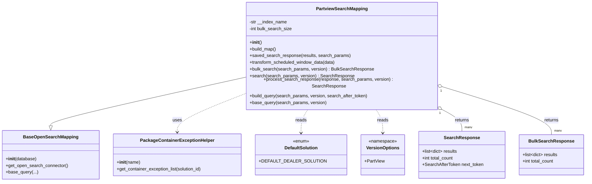

# Diagram: partview_core/partview_service/partview_service/persistence/open_search/PartviewSearchMapping.py


> Auto-generated by Obscura crawlers

## Diagram 1



### SVG

<svg id="container" width="2037.6484375" xmlns="http://www.w3.org/2000/svg" class="classDiagram" height="624" viewBox="0 0 2037.6484375 624" role="graphics-document document" aria-roledescription="class"><style>#container{font-family:"trebuchet ms",verdana,arial,sans-serif;font-size:16px;fill:#333;}@keyframes edge-animation-frame{from{stroke-dashoffset:0;}}@keyframes dash{to{stroke-dashoffset:0;}}#container .edge-animation-slow{stroke-dasharray:9,5!important;stroke-dashoffset:900;animation:dash 50s linear infinite;stroke-linecap:round;}#container .edge-animation-fast{stroke-dasharray:9,5!important;stroke-dashoffset:900;animation:dash 20s linear infinite;stroke-linecap:round;}#container .error-icon{fill:#552222;}#container .error-text{fill:#552222;stroke:#552222;}#container .edge-thickness-normal{stroke-width:1px;}#container .edge-thickness-thick{stroke-width:3.5px;}#container .edge-pattern-solid{stroke-dasharray:0;}#container .edge-thickness-invisible{stroke-width:0;fill:none;}#container .edge-pattern-dashed{stroke-dasharray:3;}#container .edge-pattern-dotted{stroke-dasharray:2;}#container .marker{fill:#333333;stroke:#333333;}#container .marker.cross{stroke:#333333;}#container svg{font-family:"trebuchet ms",verdana,arial,sans-serif;font-size:16px;}#container p{margin:0;}#container g.classGroup text{fill:#9370DB;stroke:none;font-family:"trebuchet ms",verdana,arial,sans-serif;font-size:10px;}#container g.classGroup text .title{font-weight:bolder;}#container .nodeLabel,#container .edgeLabel{color:#131300;}#container .edgeLabel .label rect{fill:#ECECFF;}#container .label text{fill:#131300;}#container .labelBkg{background:#ECECFF;}#container .edgeLabel .label span{background:#ECECFF;}#container .classTitle{font-weight:bolder;}#container .node rect,#container .node circle,#container .node ellipse,#container .node polygon,#container .node path{fill:#ECECFF;stroke:#9370DB;stroke-width:1px;}#container .divider{stroke:#9370DB;stroke-width:1;}#container g.clickable{cursor:pointer;}#container g.classGroup rect{fill:#ECECFF;stroke:#9370DB;}#container g.classGroup line{stroke:#9370DB;stroke-width:1;}#container .classLabel .box{stroke:none;stroke-width:0;fill:#ECECFF;opacity:0.5;}#container .classLabel .label{fill:#9370DB;font-size:10px;}#container .relation{stroke:#333333;stroke-width:1;fill:none;}#container .dashed-line{stroke-dasharray:3;}#container .dotted-line{stroke-dasharray:1 2;}#container #compositionStart,#container .composition{fill:#333333!important;stroke:#333333!important;stroke-width:1;}#container #compositionEnd,#container .composition{fill:#333333!important;stroke:#333333!important;stroke-width:1;}#container #dependencyStart,#container .dependency{fill:#333333!important;stroke:#333333!important;stroke-width:1;}#container #dependencyStart,#container .dependency{fill:#333333!important;stroke:#333333!important;stroke-width:1;}#container #extensionStart,#container .extension{fill:transparent!important;stroke:#333333!important;stroke-width:1;}#container #extensionEnd,#container .extension{fill:transparent!important;stroke:#333333!important;stroke-width:1;}#container #aggregationStart,#container .aggregation{fill:transparent!important;stroke:#333333!important;stroke-width:1;}#container #aggregationEnd,#container .aggregation{fill:transparent!important;stroke:#333333!important;stroke-width:1;}#container #lollipopStart,#container .lollipop{fill:#ECECFF!important;stroke:#333333!important;stroke-width:1;}#container #lollipopEnd,#container .lollipop{fill:#ECECFF!important;stroke:#333333!important;stroke-width:1;}#container .edgeTerminals{font-size:11px;line-height:initial;}#container .classTitleText{text-anchor:middle;font-size:18px;fill:#333;}#container .label-icon{display:inline-block;height:1em;overflow:visible;vertical-align:-0.125em;}#container .node .label-icon path{fill:currentColor;stroke:revert;stroke-width:revert;}#container :root{--mermaid-font-family:"trebuchet ms",verdana,arial,sans-serif;}</style><g><defs><marker id="container_class-aggregationStart" class="marker aggregation class" refX="18" refY="7" markerWidth="190" markerHeight="240" orient="auto"><path d="M 18,7 L9,13 L1,7 L9,1 Z"></path></marker></defs><defs><marker id="container_class-aggregationEnd" class="marker aggregation class" refX="1" refY="7" markerWidth="20" markerHeight="28" orient="auto"><path d="M 18,7 L9,13 L1,7 L9,1 Z"></path></marker></defs><defs><marker id="container_class-extensionStart" class="marker extension class" refX="18" refY="7" markerWidth="190" markerHeight="240" orient="auto"><path d="M 1,7 L18,13 V 1 Z"></path></marker></defs><defs><marker id="container_class-extensionEnd" class="marker extension class" refX="1" refY="7" markerWidth="20" markerHeight="28" orient="auto"><path d="M 1,1 V 13 L18,7 Z"></path></marker></defs><defs><marker id="container_class-compositionStart" class="marker composition class" refX="18" refY="7" markerWidth="190" markerHeight="240" orient="auto"><path d="M 18,7 L9,13 L1,7 L9,1 Z"></path></marker></defs><defs><marker id="container_class-compositionEnd" class="marker composition class" refX="1" refY="7" markerWidth="20" markerHeight="28" orient="auto"><path d="M 18,7 L9,13 L1,7 L9,1 Z"></path></marker></defs><defs><marker id="container_class-dependencyStart" class="marker dependency class" refX="6" refY="7" markerWidth="190" markerHeight="240" orient="auto"><path d="M 5,7 L9,13 L1,7 L9,1 Z"></path></marker></defs><defs><marker id="container_class-dependencyEnd" class="marker dependency class" refX="13" refY="7" markerWidth="20" markerHeight="28" orient="auto"><path d="M 18,7 L9,13 L14,7 L9,1 Z"></path></marker></defs><defs><marker id="container_class-lollipopStart" class="marker lollipop class" refX="13" refY="7" markerWidth="190" markerHeight="240" orient="auto"><circle stroke="black" fill="transparent" cx="7" cy="7" r="6"></circle></marker></defs><defs><marker id="container_class-lollipopEnd" class="marker lollipop class" refX="1" refY="7" markerWidth="190" markerHeight="240" orient="auto"><circle stroke="black" fill="transparent" cx="7" cy="7" r="6"></circle></marker></defs><g class="root"><g class="clusters"></g><g class="edgePaths"><path d="M841.992,262.302L731.29,286.085C620.589,309.868,399.185,357.434,288.483,384.509C177.781,411.583,177.781,418.167,177.781,421.458L177.781,424.75" id="id_PartviewSearchMapping_BaseOpenSearchMapping_1" class="edge-thickness-normal edge-pattern-solid relation" style=";;;" data-edge="true" data-et="edge" data-id="id_PartviewSearchMapping_BaseOpenSearchMapping_1" data-points="W3sieCI6ODQxLjk5MjE4NzUsInkiOjI2Mi4zMDIxMjM5NDAzNTAyfSx7IngiOjE3Ny43ODEyNSwieSI6NDA1fSx7IngiOjE3Ny43ODEyNSwieSI6NDQyfV0=" marker-end="url(#container_class-extensionEnd)"></path><path d="M841.992,321.723L806.095,335.602C770.198,349.482,698.404,377.241,662.507,398.287C626.609,419.333,626.609,433.667,626.609,440.833L626.609,448" id="id_PartviewSearchMapping_PackageContainerExceptionHelper_2" class="edge-thickness-normal edge-pattern-dashed relation" style=";;;" data-edge="true" data-et="edge" data-id="id_PartviewSearchMapping_PackageContainerExceptionHelper_2" data-points="W3sieCI6ODQxLjk5MjE4NzUsInkiOjMyMS43MjI3MjMzNDk3NTkyfSx7IngiOjYyNi42MDkzNzUsInkiOjQwNX0seyJ4Ijo2MjYuNjA5Mzc1LCJ5Ijo0NTR9XQ==" marker-end="url(#container_class-dependencyEnd)"></path><path d="M1075.153,368L1071.292,374.167C1067.431,380.333,1059.71,392.667,1055.849,406.5C1051.988,420.333,1051.988,435.667,1051.988,443.333L1051.988,451" id="id_PartviewSearchMapping_DefaultSolution_3" class="edge-thickness-normal edge-pattern-dashed relation" style=";;;" data-edge="true" data-et="edge" data-id="id_PartviewSearchMapping_DefaultSolution_3" data-points="W3sieCI6MTA3NS4xNTI1Nzc3NjQ5NzcsInkiOjM2OH0seyJ4IjoxMDUxLjk4ODI4MTI1LCJ5Ijo0MDV9LHsieCI6MTA1MS45ODgyODEyNSwieSI6NDU3fV0=" marker-end="url(#container_class-dependencyEnd)"></path><path d="M1300.535,368L1304.396,374.167C1308.256,380.333,1315.978,392.667,1319.839,406.5C1323.699,420.333,1323.699,435.667,1323.699,443.333L1323.699,451" id="id_PartviewSearchMapping_VersionOptions_4" class="edge-thickness-normal edge-pattern-dashed relation" style=";;;" data-edge="true" data-et="edge" data-id="id_PartviewSearchMapping_VersionOptions_4" data-points="W3sieCI6MTMwMC41MzQ5MjIyMzUwMjMsInkiOjM2OH0seyJ4IjoxMzIzLjY5OTIxODc1LCJ5Ijo0MDV9LHsieCI6MTMyMy42OTkyMTg3NSwieSI6NDU3fV0=" marker-end="url(#container_class-dependencyEnd)"></path><path d="M1545.387,376.029L1554.569,380.858C1563.75,385.686,1582.113,395.343,1591.295,406.838C1600.477,418.333,1600.477,431.667,1600.477,438.333L1600.477,445" id="id_PartviewSearchMapping_SearchResponse_5" class="edge-thickness-normal edge-pattern-solid relation" style=";;;" data-edge="true" data-et="edge" data-id="id_PartviewSearchMapping_SearchResponse_5" data-points="W3sieCI6MTUzMC4xMTk4MTU2NjgyMDI4LCJ5IjozNjh9LHsieCI6MTYwMC40NzY1NjI1LCJ5Ijo0MDV9LHsieCI6MTYwMC40NzY1NjI1LCJ5Ijo0NDV9XQ==" marker-start="url(#container_class-aggregationStart)"></path><path d="M1550.226,296.03L1611.149,314.192C1672.071,332.353,1793.917,368.677,1854.839,395.505C1915.762,422.333,1915.762,439.667,1915.762,448.333L1915.762,457" id="id_PartviewSearchMapping_BulkSearchResponse_6" class="edge-thickness-normal edge-pattern-solid relation" style=";;;" data-edge="true" data-et="edge" data-id="id_PartviewSearchMapping_BulkSearchResponse_6" data-points="W3sieCI6MTUzMy42OTUzMTI1LCJ5IjoyOTEuMTAxOTg3MTUyOTk5NX0seyJ4IjoxOTE1Ljc2MTcxODc1LCJ5Ijo0MDV9LHsieCI6MTkxNS43NjE3MTg3NSwieSI6NDU3fV0=" marker-start="url(#container_class-aggregationStart)"></path></g><g class="edgeLabels"><g class="edgeLabel"><g class="label" data-id="id_PartviewSearchMapping_BaseOpenSearchMapping_1" transform="translate(0, 0)"><foreignObject width="0" height="0"><div xmlns="http://www.w3.org/1999/xhtml" class="labelBkg" style="display: table-cell; white-space: nowrap; line-height: 1.5; max-width: 200px; text-align: center;"><span class="edgeLabel"></span></div></foreignObject></g></g><g class="edgeLabel" transform="translate(626.609375, 405)"><g class="label" data-id="id_PartviewSearchMapping_PackageContainerExceptionHelper_2" transform="translate(-16.4921875, -12)"><foreignObject width="32.984375" height="24"><div xmlns="http://www.w3.org/1999/xhtml" class="labelBkg" style="display: table-cell; white-space: nowrap; line-height: 1.5; max-width: 200px; text-align: center;"><span class="edgeLabel"><p>uses</p></span></div></foreignObject></g></g><g class="edgeLabel" transform="translate(1051.98828125, 405)"><g class="label" data-id="id_PartviewSearchMapping_DefaultSolution_3" transform="translate(-20.0078125, -12)"><foreignObject width="40.015625" height="24"><div xmlns="http://www.w3.org/1999/xhtml" class="labelBkg" style="display: table-cell; white-space: nowrap; line-height: 1.5; max-width: 200px; text-align: center;"><span class="edgeLabel"><p>reads</p></span></div></foreignObject></g></g><g class="edgeLabel" transform="translate(1323.69921875, 405)"><g class="label" data-id="id_PartviewSearchMapping_VersionOptions_4" transform="translate(-20.0078125, -12)"><foreignObject width="40.015625" height="24"><div xmlns="http://www.w3.org/1999/xhtml" class="labelBkg" style="display: table-cell; white-space: nowrap; line-height: 1.5; max-width: 200px; text-align: center;"><span class="edgeLabel"><p>reads</p></span></div></foreignObject></g></g><g class="edgeLabel" transform="translate(1600.4765625, 405)"><g class="label" data-id="id_PartviewSearchMapping_SearchResponse_5" transform="translate(-26.265625, -12)"><foreignObject width="52.53125" height="24"><div xmlns="http://www.w3.org/1999/xhtml" class="labelBkg" style="display: table-cell; white-space: nowrap; line-height: 1.5; max-width: 200px; text-align: center;"><span class="edgeLabel"><p>returns</p></span></div></foreignObject></g></g><g class="edgeLabel" transform="translate(1915.76171875, 405)"><g class="label" data-id="id_PartviewSearchMapping_BulkSearchResponse_6" transform="translate(-26.265625, -12)"><foreignObject width="52.53125" height="24"><div xmlns="http://www.w3.org/1999/xhtml" class="labelBkg" style="display: table-cell; white-space: nowrap; line-height: 1.5; max-width: 200px; text-align: center;"><span class="edgeLabel"><p>returns</p></span></div></foreignObject></g></g><g class="edgeTerminals" transform="translate(1538.6268085896174, 389.4215096352261)"><g class="inner" transform="translate(0, 0)"><foreignObject style="width: 9px; height: 12px;"><div xmlns="http://www.w3.org/1999/xhtml" style="display: inline-block; padding-right: 1px; white-space: nowrap;"><span class="edgeLabel">1</span></div></foreignObject></g></g><g class="edgeTerminals" transform="translate(1546.180670336085, 310.47634601674014)"><g class="inner" transform="translate(0, 0)"><foreignObject style="width: 9px; height: 12px;"><div xmlns="http://www.w3.org/1999/xhtml" style="display: inline-block; padding-right: 1px; white-space: nowrap;"><span class="edgeLabel">1</span></div></foreignObject></g></g><g class="edgeTerminals" transform="translate(1610.47656125, 422.4999989285715)"><g class="inner" transform="translate(0, 0)"></g><foreignObject style="width: 36px; height: 12px;"><div xmlns="http://www.w3.org/1999/xhtml" style="display: inline-block; padding-right: 1px; white-space: nowrap;"><span class="edgeLabel">many</span></div></foreignObject></g><g class="edgeTerminals" transform="translate(1925.761719375, 434.50000053571426)"><g class="inner" transform="translate(0, 0)"></g><foreignObject style="width: 36px; height: 12px;"><div xmlns="http://www.w3.org/1999/xhtml" style="display: inline-block; padding-right: 1px; white-space: nowrap;"><span class="edgeLabel">many</span></div></foreignObject></g></g><g class="nodes"><g class="node default" id="classId-SearchResponse-0" transform="translate(1600.4765625, 529)"><g class="basic label-container"><path d="M-151.3984375 -84 L151.3984375 -84 L151.3984375 84 L-151.3984375 84" stroke="none" stroke-width="0" fill="#ECECFF" style=""></path><path d="M-151.3984375 -84 C-88.73037350818484 -84, -26.062309516369666 -84, 151.3984375 -84 M-151.3984375 -84 C-61.77474715468503 -84, 27.84894319062994 -84, 151.3984375 -84 M151.3984375 -84 C151.3984375 -23.897846873125445, 151.3984375 36.20430625374911, 151.3984375 84 M151.3984375 -84 C151.3984375 -25.772058657950794, 151.3984375 32.45588268409841, 151.3984375 84 M151.3984375 84 C31.89982014572253 84, -87.59879720855494 84, -151.3984375 84 M151.3984375 84 C59.70977306102445 84, -31.9788913779511 84, -151.3984375 84 M-151.3984375 84 C-151.3984375 23.767132798351412, -151.3984375 -36.465734403297176, -151.3984375 -84 M-151.3984375 84 C-151.3984375 44.1324113143188, -151.3984375 4.264822628637603, -151.3984375 -84" stroke="#9370DB" stroke-width="1.3" fill="none" stroke-dasharray="0 0" style=""></path></g><g class="annotation-group text" transform="translate(0, -60)"></g><g class="label-group text" transform="translate(-60.15625, -60)"><g class="label" style="font-weight: bolder" transform="translate(0,-12)"><foreignObject width="120.3125" height="24"><div xmlns="http://www.w3.org/1999/xhtml" style="display: table-cell; white-space: nowrap; line-height: 1.5; max-width: 169px; text-align: center;"><span class="nodeLabel markdown-node-label" style=""><p>SearchResponse</p></span></div></foreignObject></g></g><g class="members-group text" transform="translate(-139.3984375, -12)"><g class="label" style="" transform="translate(0,-12)"><foreignObject width="127.3125" height="24"><div xmlns="http://www.w3.org/1999/xhtml" style="display: table-cell; white-space: nowrap; line-height: 1.5; max-width: 224px; text-align: center;"><span class="nodeLabel markdown-node-label" style=""><p>+list&lt;dict&gt; results</p></span></div></foreignObject></g><g class="label" style="" transform="translate(0,12)"><foreignObject width="114.8125" height="24"><div xmlns="http://www.w3.org/1999/xhtml" style="display: table-cell; white-space: nowrap; line-height: 1.5; max-width: 172px; text-align: center;"><span class="nodeLabel markdown-node-label" style=""><p>+int total_count</p></span></div></foreignObject></g><g class="label" style="" transform="translate(0,36)"><foreignObject width="218.640625" height="24"><div xmlns="http://www.w3.org/1999/xhtml" style="display: table-cell; white-space: nowrap; line-height: 1.5; max-width: 276px; text-align: center;"><span class="nodeLabel markdown-node-label" style=""><p>+SearchAfterToken next_token</p></span></div></foreignObject></g></g><g class="methods-group text" transform="translate(-139.3984375, 84)"></g><g class="divider" style=""><path d="M-151.3984375 -36 C-70.15344731471139 -36, 11.091542870577229 -36, 151.3984375 -36 M-151.3984375 -36 C-47.80333298094479 -36, 55.791771538110424 -36, 151.3984375 -36" stroke="#9370DB" stroke-width="1.3" fill="none" stroke-dasharray="0 0" style=""></path></g><g class="divider" style=""><path d="M-151.3984375 60 C-35.78245988378825 60, 79.8335177324235 60, 151.3984375 60 M-151.3984375 60 C-31.55162706883023 60, 88.29518336233954 60, 151.3984375 60" stroke="#9370DB" stroke-width="1.3" fill="none" stroke-dasharray="0 0" style=""></path></g></g><g class="node default" id="classId-BulkSearchResponse-1" transform="translate(1915.76171875, 529)"><g class="basic label-container"><path d="M-113.88671875 -72 L113.88671875 -72 L113.88671875 72 L-113.88671875 72" stroke="none" stroke-width="0" fill="#ECECFF" style=""></path><path d="M-113.88671875 -72 C-45.65675093643898 -72, 22.573216877122036 -72, 113.88671875 -72 M-113.88671875 -72 C-42.6749920241935 -72, 28.536734701613 -72, 113.88671875 -72 M113.88671875 -72 C113.88671875 -31.18729074477732, 113.88671875 9.625418510445357, 113.88671875 72 M113.88671875 -72 C113.88671875 -34.49982990306333, 113.88671875 3.000340193873342, 113.88671875 72 M113.88671875 72 C54.370004996817585 72, -5.146708756364831 72, -113.88671875 72 M113.88671875 72 C41.30855068828296 72, -31.269617373434073 72, -113.88671875 72 M-113.88671875 72 C-113.88671875 14.456646492394825, -113.88671875 -43.08670701521035, -113.88671875 -72 M-113.88671875 72 C-113.88671875 39.18257564441821, -113.88671875 6.365151288836415, -113.88671875 -72" stroke="#9370DB" stroke-width="1.3" fill="none" stroke-dasharray="0 0" style=""></path></g><g class="annotation-group text" transform="translate(0, -48)"></g><g class="label-group text" transform="translate(-76.4609375, -48)"><g class="label" style="font-weight: bolder" transform="translate(0,-12)"><foreignObject width="152.921875" height="24"><div xmlns="http://www.w3.org/1999/xhtml" style="display: table-cell; white-space: nowrap; line-height: 1.5; max-width: 201px; text-align: center;"><span class="nodeLabel markdown-node-label" style=""><p>BulkSearchResponse</p></span></div></foreignObject></g></g><g class="members-group text" transform="translate(-101.88671875, 0)"><g class="label" style="" transform="translate(0,-12)"><foreignObject width="127.3125" height="24"><div xmlns="http://www.w3.org/1999/xhtml" style="display: table-cell; white-space: nowrap; line-height: 1.5; max-width: 224px; text-align: center;"><span class="nodeLabel markdown-node-label" style=""><p>+list&lt;dict&gt; results</p></span></div></foreignObject></g><g class="label" style="" transform="translate(0,12)"><foreignObject width="114.8125" height="24"><div xmlns="http://www.w3.org/1999/xhtml" style="display: table-cell; white-space: nowrap; line-height: 1.5; max-width: 172px; text-align: center;"><span class="nodeLabel markdown-node-label" style=""><p>+int total_count</p></span></div></foreignObject></g></g><g class="methods-group text" transform="translate(-101.88671875, 72)"></g><g class="divider" style=""><path d="M-113.88671875 -24 C-52.74288977008725 -24, 8.400939209825495 -24, 113.88671875 -24 M-113.88671875 -24 C-45.22198827207151 -24, 23.442742205856973 -24, 113.88671875 -24" stroke="#9370DB" stroke-width="1.3" fill="none" stroke-dasharray="0 0" style=""></path></g><g class="divider" style=""><path d="M-113.88671875 48 C-51.69990939800403 48, 10.486899953991937 48, 113.88671875 48 M-113.88671875 48 C-52.23295417060624 48, 9.420810408787517 48, 113.88671875 48" stroke="#9370DB" stroke-width="1.3" fill="none" stroke-dasharray="0 0" style=""></path></g></g><g class="node default" id="classId-PartviewSearchMapping-2" transform="translate(1187.84375, 188)"><g class="basic label-container"><path d="M-345.8515625 -180 L345.8515625 -180 L345.8515625 180 L-345.8515625 180" stroke="none" stroke-width="0" fill="#ECECFF" style=""></path><path d="M-345.8515625 -180 C-119.33980596666615 -180, 107.1719505666677 -180, 345.8515625 -180 M-345.8515625 -180 C-194.69083136345975 -180, -43.5301002269195 -180, 345.8515625 -180 M345.8515625 -180 C345.8515625 -52.22450674724435, 345.8515625 75.5509865055113, 345.8515625 180 M345.8515625 -180 C345.8515625 -87.12313124888831, 345.8515625 5.753737502223373, 345.8515625 180 M345.8515625 180 C163.5534021251617 180, -18.74475824967658 180, -345.8515625 180 M345.8515625 180 C123.45970116714935 180, -98.9321601657013 180, -345.8515625 180 M-345.8515625 180 C-345.8515625 56.91933481164955, -345.8515625 -66.1613303767009, -345.8515625 -180 M-345.8515625 180 C-345.8515625 92.0580801969445, -345.8515625 4.116160393889004, -345.8515625 -180" stroke="#9370DB" stroke-width="1.3" fill="none" stroke-dasharray="0 0" style=""></path></g><g class="annotation-group text" transform="translate(0, -156)"></g><g class="label-group text" transform="translate(-88.015625, -156)"><g class="label" style="font-weight: bolder" transform="translate(0,-12)"><foreignObject width="176.03125" height="24"><div xmlns="http://www.w3.org/1999/xhtml" style="display: table-cell; white-space: nowrap; line-height: 1.5; max-width: 223px; text-align: center;"><span class="nodeLabel markdown-node-label" style=""><p>PartviewSearchMapping</p></span></div></foreignObject></g></g><g class="members-group text" transform="translate(-333.8515625, -108)"><g class="label" style="" transform="translate(0,-12)"><foreignObject width="135.21875" height="24"><div xmlns="http://www.w3.org/1999/xhtml" style="display: table-cell; white-space: nowrap; line-height: 1.5; max-width: 193px; text-align: center;"><span class="nodeLabel markdown-node-label" style=""><p>-str __index_name</p></span></div></foreignObject></g><g class="label" style="" transform="translate(0,12)"><foreignObject width="153.734375" height="24"><div xmlns="http://www.w3.org/1999/xhtml" style="display: table-cell; white-space: nowrap; line-height: 1.5; max-width: 211px; text-align: center;"><span class="nodeLabel markdown-node-label" style=""><p>-int bulk_search_size</p></span></div></foreignObject></g></g><g class="methods-group text" transform="translate(-333.8515625, -36)"><g class="label" style="" transform="translate(0,-12)"><foreignObject width="42.796875" height="24"><div xmlns="http://www.w3.org/1999/xhtml" style="display: table-cell; white-space: nowrap; line-height: 1.5; max-width: 132px; text-align: center;"><span class="nodeLabel markdown-node-label" style=""><p>+<strong>init</strong>()</p></span></div></foreignObject></g><g class="label" style="" transform="translate(0,12)"><foreignObject width="96.109375" height="24"><div xmlns="http://www.w3.org/1999/xhtml" style="display: table-cell; white-space: nowrap; line-height: 1.5; max-width: 153px; text-align: center;"><span class="nodeLabel markdown-node-label" style=""><p>+build_map()</p></span></div></foreignObject></g><g class="label" style="" transform="translate(0,36)"><foreignObject width="357.171875" height="24"><div xmlns="http://www.w3.org/1999/xhtml" style="display: table-cell; white-space: nowrap; line-height: 1.5; max-width: 415px; text-align: center;"><span class="nodeLabel markdown-node-label" style=""><p>+saved_search_response(results, search_params)</p></span></div></foreignObject></g><g class="label" style="" transform="translate(0,60)"><foreignObject width="309.671875" height="24"><div xmlns="http://www.w3.org/1999/xhtml" style="display: table-cell; white-space: nowrap; line-height: 1.5; max-width: 367px; text-align: center;"><span class="nodeLabel markdown-node-label" style=""><p>+transform_scheduled_window_data(data)</p></span></div></foreignObject></g><g class="label" style="" transform="translate(0,84)"><foreignObject width="439.40625" height="24"><div xmlns="http://www.w3.org/1999/xhtml" style="display: table-cell; white-space: nowrap; line-height: 1.5; max-width: 497px; text-align: center;"><span class="nodeLabel markdown-node-label" style=""><p>+bulk_search(search_params, version) : BulkSearchResponse</p></span></div></foreignObject></g><g class="label" style="" transform="translate(0,108)"><foreignObject width="367.46875" height="24"><div xmlns="http://www.w3.org/1999/xhtml" style="display: table-cell; white-space: nowrap; line-height: 1.5; max-width: 425px; text-align: center;"><span class="nodeLabel markdown-node-label" style=""><p>+search(search_params, version) : SearchResponse</p></span></div></foreignObject></g><g class="label" style="" transform="translate(0,132)"><foreignObject width="579.6875" height="24"><div xmlns="http://www.w3.org/1999/xhtml" style="display: table-cell; white-space: nowrap; line-height: 1.5; max-width: 637px; text-align: center;"><span class="nodeLabel markdown-node-label" style=""><p>+process_search_response(response, search_params, version) : SearchResponse</p></span></div></foreignObject></g><g class="label" style="" transform="translate(0,156)"><foreignObject width="421.859375" height="24"><div xmlns="http://www.w3.org/1999/xhtml" style="display: table-cell; white-space: nowrap; line-height: 1.5; max-width: 479px; text-align: center;"><span class="nodeLabel markdown-node-label" style=""><p>+build_query(search_params, version, search_after_token)</p></span></div></foreignObject></g><g class="label" style="" transform="translate(0,180)"><foreignObject width="272.34375" height="24"><div xmlns="http://www.w3.org/1999/xhtml" style="display: table-cell; white-space: nowrap; line-height: 1.5; max-width: 330px; text-align: center;"><span class="nodeLabel markdown-node-label" style=""><p>+base_query(search_params, version)</p></span></div></foreignObject></g></g><g class="divider" style=""><path d="M-345.8515625 -132 C-103.34138250711288 -132, 139.16879748577423 -132, 345.8515625 -132 M-345.8515625 -132 C-132.8280528147032 -132, 80.1954568705936 -132, 345.8515625 -132" stroke="#9370DB" stroke-width="1.3" fill="none" stroke-dasharray="0 0" style=""></path></g><g class="divider" style=""><path d="M-345.8515625 -60 C-91.1800945290062 -60, 163.4913734419876 -60, 345.8515625 -60 M-345.8515625 -60 C-128.56865913511373 -60, 88.71424422977253 -60, 345.8515625 -60" stroke="#9370DB" stroke-width="1.3" fill="none" stroke-dasharray="0 0" style=""></path></g></g><g class="node default" id="classId-BaseOpenSearchMapping-3" transform="translate(177.78125, 529)"><g class="basic label-container"><path d="M-169.78125 -87 L169.78125 -87 L169.78125 87 L-169.78125 87" stroke="none" stroke-width="0" fill="#ECECFF" style=""></path><path d="M-169.78125 -87 C-49.166175719004755 -87, 71.44889856199049 -87, 169.78125 -87 M-169.78125 -87 C-99.78838698072326 -87, -29.79552396144652 -87, 169.78125 -87 M169.78125 -87 C169.78125 -25.798800114714226, 169.78125 35.40239977057155, 169.78125 87 M169.78125 -87 C169.78125 -45.354197246331545, 169.78125 -3.708394492663089, 169.78125 87 M169.78125 87 C55.39659815562979 87, -58.98805368874042 87, -169.78125 87 M169.78125 87 C51.9152046529958 87, -65.9508406940084 87, -169.78125 87 M-169.78125 87 C-169.78125 17.52225729519823, -169.78125 -51.95548540960354, -169.78125 -87 M-169.78125 87 C-169.78125 19.80817540041747, -169.78125 -47.38364919916506, -169.78125 -87" stroke="#9370DB" stroke-width="1.3" fill="none" stroke-dasharray="0 0" style=""></path></g><g class="annotation-group text" transform="translate(0, -63)"></g><g class="label-group text" transform="translate(-93.078125, -63)"><g class="label" style="font-weight: bolder" transform="translate(0,-12)"><foreignObject width="186.15625" height="24"><div xmlns="http://www.w3.org/1999/xhtml" style="display: table-cell; white-space: nowrap; line-height: 1.5; max-width: 235px; text-align: center;"><span class="nodeLabel markdown-node-label" style=""><p>BaseOpenSearchMapping</p></span></div></foreignObject></g></g><g class="members-group text" transform="translate(-157.78125, -15)"></g><g class="methods-group text" transform="translate(-157.78125, 15)"><g class="label" style="" transform="translate(0,-12)"><foreignObject width="109.515625" height="24"><div xmlns="http://www.w3.org/1999/xhtml" style="display: table-cell; white-space: nowrap; line-height: 1.5; max-width: 198px; text-align: center;"><span class="nodeLabel markdown-node-label" style=""><p>+<strong>init</strong>(database)</p></span></div></foreignObject></g><g class="label" style="" transform="translate(0,12)"><foreignObject width="222.484375" height="24"><div xmlns="http://www.w3.org/1999/xhtml" style="display: table-cell; white-space: nowrap; line-height: 1.5; max-width: 280px; text-align: center;"><span class="nodeLabel markdown-node-label" style=""><p>+get_open_search_connector()</p></span></div></foreignObject></g><g class="label" style="" transform="translate(0,36)"><foreignObject width="113.28125" height="24"><div xmlns="http://www.w3.org/1999/xhtml" style="display: table-cell; white-space: nowrap; line-height: 1.5; max-width: 171px; text-align: center;"><span class="nodeLabel markdown-node-label" style=""><p>+base_query(...)</p></span></div></foreignObject></g></g><g class="divider" style=""><path d="M-169.78125 -39 C-35.13719737418481 -39, 99.50685525163038 -39, 169.78125 -39 M-169.78125 -39 C-94.72915691245879 -39, -19.67706382491758 -39, 169.78125 -39" stroke="#9370DB" stroke-width="1.3" fill="none" stroke-dasharray="0 0" style=""></path></g><g class="divider" style=""><path d="M-169.78125 -15 C-45.67819298102529 -15, 78.42486403794942 -15, 169.78125 -15 M-169.78125 -15 C-72.77341131897342 -15, 24.234427362053168 -15, 169.78125 -15" stroke="#9370DB" stroke-width="1.3" fill="none" stroke-dasharray="0 0" style=""></path></g></g><g class="node default" id="classId-PackageContainerExceptionHelper-4" transform="translate(626.609375, 529)"><g class="basic label-container"><path d="M-229.046875 -75 L229.046875 -75 L229.046875 75 L-229.046875 75" stroke="none" stroke-width="0" fill="#ECECFF" style=""></path><path d="M-229.046875 -75 C-122.69042971434253 -75, -16.333984428685056 -75, 229.046875 -75 M-229.046875 -75 C-49.1162029229925 -75, 130.814469154015 -75, 229.046875 -75 M229.046875 -75 C229.046875 -26.849321077677843, 229.046875 21.301357844644315, 229.046875 75 M229.046875 -75 C229.046875 -21.32253001266203, 229.046875 32.35493997467594, 229.046875 75 M229.046875 75 C132.9704259231308 75, 36.89397684626161 75, -229.046875 75 M229.046875 75 C64.82721499723576 75, -99.39244500552849 75, -229.046875 75 M-229.046875 75 C-229.046875 33.14976207360303, -229.046875 -8.700475852793943, -229.046875 -75 M-229.046875 75 C-229.046875 34.592026476784454, -229.046875 -5.815947046431091, -229.046875 -75" stroke="#9370DB" stroke-width="1.3" fill="none" stroke-dasharray="0 0" style=""></path></g><g class="annotation-group text" transform="translate(0, -51)"></g><g class="label-group text" transform="translate(-125.671875, -51)"><g class="label" style="font-weight: bolder" transform="translate(0,-12)"><foreignObject width="251.34375" height="24"><div xmlns="http://www.w3.org/1999/xhtml" style="display: table-cell; white-space: nowrap; line-height: 1.5; max-width: 299px; text-align: center;"><span class="nodeLabel markdown-node-label" style=""><p>PackageContainerExceptionHelper</p></span></div></foreignObject></g></g><g class="members-group text" transform="translate(-217.046875, -3)"></g><g class="methods-group text" transform="translate(-217.046875, 27)"><g class="label" style="" transform="translate(0,-12)"><foreignObject width="83.3125" height="24"><div xmlns="http://www.w3.org/1999/xhtml" style="display: table-cell; white-space: nowrap; line-height: 1.5; max-width: 172px; text-align: center;"><span class="nodeLabel markdown-node-label" style=""><p>+<strong>init</strong>(name)</p></span></div></foreignObject></g><g class="label" style="" transform="translate(0,12)"><foreignObject width="308.421875" height="24"><div xmlns="http://www.w3.org/1999/xhtml" style="display: table-cell; white-space: nowrap; line-height: 1.5; max-width: 366px; text-align: center;"><span class="nodeLabel markdown-node-label" style=""><p>+get_container_exception_list(solution_id)</p></span></div></foreignObject></g></g><g class="divider" style=""><path d="M-229.046875 -27 C-113.46925763520431 -27, 2.1083597295913705 -27, 229.046875 -27 M-229.046875 -27 C-84.17186644770075 -27, 60.7031421045985 -27, 229.046875 -27" stroke="#9370DB" stroke-width="1.3" fill="none" stroke-dasharray="0 0" style=""></path></g><g class="divider" style=""><path d="M-229.046875 -3 C-117.79651129083082 -3, -6.546147581661643 -3, 229.046875 -3 M-229.046875 -3 C-81.19103897073862 -3, 66.66479705852277 -3, 229.046875 -3" stroke="#9370DB" stroke-width="1.3" fill="none" stroke-dasharray="0 0" style=""></path></g></g><g class="node default" id="classId-DefaultSolution-5" transform="translate(1051.98828125, 529)"><g class="basic label-container"><path d="M-146.33203125 -72 L146.33203125 -72 L146.33203125 72 L-146.33203125 72" stroke="none" stroke-width="0" fill="#ECECFF" style=""></path><path d="M-146.33203125 -72 C-55.557986090263384 -72, 35.21605906947323 -72, 146.33203125 -72 M-146.33203125 -72 C-35.2639761890603 -72, 75.8040788718794 -72, 146.33203125 -72 M146.33203125 -72 C146.33203125 -27.972377983021545, 146.33203125 16.05524403395691, 146.33203125 72 M146.33203125 -72 C146.33203125 -17.426617452366997, 146.33203125 37.146765095266005, 146.33203125 72 M146.33203125 72 C70.96235484964664 72, -4.407321550706712 72, -146.33203125 72 M146.33203125 72 C82.71670301796499 72, 19.10137478592999 72, -146.33203125 72 M-146.33203125 72 C-146.33203125 24.46478085779931, -146.33203125 -23.070438284401376, -146.33203125 -72 M-146.33203125 72 C-146.33203125 14.633698730800688, -146.33203125 -42.73260253839862, -146.33203125 -72" stroke="#9370DB" stroke-width="1.3" fill="none" stroke-dasharray="0 0" style=""></path></g><g class="annotation-group text" transform="translate(-29.53125, -48)"><g class="label" style="" transform="translate(0,-12)"><foreignObject width="59.0625" height="24"><div xmlns="http://www.w3.org/1999/xhtml" style="display: table-cell; white-space: nowrap; line-height: 1.5; max-width: 109px; text-align: center;"><span class="nodeLabel markdown-node-label" style=""><p>«enum»</p></span></div></foreignObject></g></g><g class="label-group text" transform="translate(-57.5390625, -24)"><g class="label" style="font-weight: bolder" transform="translate(0,-12)"><foreignObject width="115.078125" height="24"><div xmlns="http://www.w3.org/1999/xhtml" style="display: table-cell; white-space: nowrap; line-height: 1.5; max-width: 164px; text-align: center;"><span class="nodeLabel markdown-node-label" style=""><p>DefaultSolution</p></span></div></foreignObject></g></g><g class="members-group text" transform="translate(-134.33203125, 24)"><g class="label" style="" transform="translate(0,-12)"><foreignObject width="211.125" height="24"><div xmlns="http://www.w3.org/1999/xhtml" style="display: table-cell; white-space: nowrap; line-height: 1.5; max-width: 268px; text-align: center;"><span class="nodeLabel markdown-node-label" style=""><p>+DEFAULT_DEALER_SOLUTION</p></span></div></foreignObject></g></g><g class="methods-group text" transform="translate(-134.33203125, 72)"></g><g class="divider" style=""><path d="M-146.33203125 0 C-37.783247881897225 0, 70.76553548620555 0, 146.33203125 0 M-146.33203125 0 C-75.10973068989694 0, -3.88743012979387 0, 146.33203125 0" stroke="#9370DB" stroke-width="1.3" fill="none" stroke-dasharray="0 0" style=""></path></g><g class="divider" style=""><path d="M-146.33203125 48 C-56.832214956126535 48, 32.66760133774693 48, 146.33203125 48 M-146.33203125 48 C-35.63568137902749 48, 75.06066849194502 48, 146.33203125 48" stroke="#9370DB" stroke-width="1.3" fill="none" stroke-dasharray="0 0" style=""></path></g></g><g class="node default" id="classId-VersionOptions-6" transform="translate(1323.69921875, 529)"><g class="basic label-container"><path d="M-75.37890625 -72 L75.37890625 -72 L75.37890625 72 L-75.37890625 72" stroke="none" stroke-width="0" fill="#ECECFF" style=""></path><path d="M-75.37890625 -72 C-33.778378220948376 -72, 7.822149808103248 -72, 75.37890625 -72 M-75.37890625 -72 C-44.53602627308872 -72, -13.693146296177453 -72, 75.37890625 -72 M75.37890625 -72 C75.37890625 -15.759076479732592, 75.37890625 40.48184704053482, 75.37890625 72 M75.37890625 -72 C75.37890625 -26.843276128961946, 75.37890625 18.313447742076107, 75.37890625 72 M75.37890625 72 C44.55541839989077 72, 13.731930549781538 72, -75.37890625 72 M75.37890625 72 C41.37840696124616 72, 7.377907672492313 72, -75.37890625 72 M-75.37890625 72 C-75.37890625 40.74985921137814, -75.37890625 9.499718422756267, -75.37890625 -72 M-75.37890625 72 C-75.37890625 35.18971032555201, -75.37890625 -1.620579348895987, -75.37890625 -72" stroke="#9370DB" stroke-width="1.3" fill="none" stroke-dasharray="0 0" style=""></path></g><g class="annotation-group text" transform="translate(-50.015625, -48)"><g class="label" style="" transform="translate(0,-12)"><foreignObject width="100.03125" height="24"><div xmlns="http://www.w3.org/1999/xhtml" style="display: table-cell; white-space: nowrap; line-height: 1.5; max-width: 150px; text-align: center;"><span class="nodeLabel markdown-node-label" style=""><p>«namespace»</p></span></div></foreignObject></g></g><g class="label-group text" transform="translate(-56.1015625, -24)"><g class="label" style="font-weight: bolder" transform="translate(0,-12)"><foreignObject width="112.203125" height="24"><div xmlns="http://www.w3.org/1999/xhtml" style="display: table-cell; white-space: nowrap; line-height: 1.5; max-width: 161px; text-align: center;"><span class="nodeLabel markdown-node-label" style=""><p>VersionOptions</p></span></div></foreignObject></g></g><g class="members-group text" transform="translate(-63.37890625, 24)"><g class="label" style="" transform="translate(0,-12)"><foreignObject width="70.65625" height="24"><div xmlns="http://www.w3.org/1999/xhtml" style="display: table-cell; white-space: nowrap; line-height: 1.5; max-width: 129px; text-align: center;"><span class="nodeLabel markdown-node-label" style=""><p>+PartView</p></span></div></foreignObject></g></g><g class="methods-group text" transform="translate(-63.37890625, 72)"></g><g class="divider" style=""><path d="M-75.37890625 0 C-22.207282518228375 0, 30.96434121354325 0, 75.37890625 0 M-75.37890625 0 C-16.31847686204094 0, 42.74195252591812 0, 75.37890625 0" stroke="#9370DB" stroke-width="1.3" fill="none" stroke-dasharray="0 0" style=""></path></g><g class="divider" style=""><path d="M-75.37890625 48 C-19.142222623251477 48, 37.094461003497045 48, 75.37890625 48 M-75.37890625 48 C-34.10067267353734 48, 7.177560902925322 48, 75.37890625 48" stroke="#9370DB" stroke-width="1.3" fill="none" stroke-dasharray="0 0" style=""></path></g></g></g></g></g></svg>

## Diagram 2

```mermaid
flowchart LR
    A[build_query(search_params, version, token)] --> B[get_open_search_connector()]
    B --> C{bulk_search?}
    C -->|yes| D[execute initial search with page_size=bulk_search_size]
    D --> E[process_search_response(response)]
    E --> F[collect results into all_results]
    F --> G[calculate total_pages]
    G --> H{has search_after_token and pages remaining}
    H -->|yes| I[loop: build_query with search_after_token & search again]
    I --> E
    H -->|no| J[return BulkSearchResponse(results, total_count)]
    C -->|no| K[search: build_query with search_after]
    K --> L[execute search]
    L --> E
    E --> M{version == OPENSEARCH_SAVED_SEARCH}
    M -->|yes| N[create saved_search_response -> SearchResponse(results=[active,delivered,exceptions])]
    M -->|no| O[transform_scheduled_window_data(response) -> SearchResponse(results, next_token)]
    N --> J
    O --> J
```

> SVG rendering failed for this diagram.
