# Diagram: partview_core/partview_service/partview_service/persistence/open_search/open_search_mapping/main_search_mapping.py

> Auto-generated by Obscura crawlers

## Mermaid

```mermaid
classDiagram
    class PackageContainerOpenSearchMapping {
        +String? packageContainerId
        +String? trackingNumber
        +Date? destinationEta
        +Date? modified
        +String? destinationEtaDisplay
        +String? lifecycleState
        +String? ownerSolutionId
        +String[]? visibleTo
        +String? trailerEquipmentNumber
        +OrderPriority orderPriority
        +String? status
        +ActiveException[] activeExceptions
        +Location finalMileOriginLocation
        +String? billOfLading
        +OriginDetail originDetail
        +DestinationDetail destinationDetail
        +EventDetail lastMilestone
        +EventDetail lastUpdate
        +Part[] partsV1
        +Order[] ordersV1
        +CreatorShipmentId[] creatorShipmentIdV1
        +String[]? watchingUserIds
        +CarrierDetails? carrier
        +CompletionSuggest? trackingNumberSuggest
        +CompletionSuggest? billOfLadingSuggest
    }

    class OrderPriority {
        +String? code
        +String? name
    }

    class ActiveException {
        +String? categoryCode
        +String? name
        +String? reasonCode
    }

    class Location {
        +String? code
        +String? name
    }

    class OriginDetail {
        +String? name
        +String? code
        +String? address
        +ScheduledDetail? scheduledPickupWindow
        +Date? arrivalTs
        +Date? departureTs
    }

    class DestinationDetail {
        +String? name
        +String? code
        +String? address
        +ScheduledDetail? scheduledDeliveryWindow
        +Date? arrivalTs
        +Date? departureTs
    }

    class ScheduledDetail {
        +Date? gte
        +Date? lte
    }

    class EventDetail {
        +String? eventCode
        +Date? eventTs
        +Date? receivedTs
        +Location? location
    }

    class Part {
        +String externalId
        +String? lifecycleState
        +String? name
    }

    class Order {
        +String? externalId
        +Date? receivedTs
    }

    class CreatorShipmentId {
        +String value
    }

    class CarrierDetails {
        +String? fvid
        +String? name
        +String? scac
    }

    class CompletionSuggest {
        +String[] input
        +Map contexts
        +String? output
    }

    PackageContainerOpenSearchMapping "1" o-- "1" OrderPriority : has
    PackageContainerOpenSearchMapping "1" o-- "0..*" ActiveException : contains
    PackageContainerOpenSearchMapping "1" o-- "1" Location : finalMileOriginLocation
    PackageContainerOpenSearchMapping "1" o-- "1" OriginDetail : originDetail
    PackageContainerOpenSearchMapping "1" o-- "1" DestinationDetail : destinationDetail
    PackageContainerOpenSearchMapping "1" o-- "1" EventDetail : lastMilestone
    PackageContainerOpenSearchMapping "1" o-- "1" EventDetail : lastUpdate
    PackageContainerOpenSearchMapping "1" o-- "0..*" Part : partsV1
    PackageContainerOpenSearchMapping "1" o-- "0..*" Order : ordersV1
    PackageContainerOpenSearchMapping "1" o-- "0..*" CreatorShipmentId : creatorShipmentIdV1
    PackageContainerOpenSearchMapping "1" o-- "0..1" CarrierDetails : carrier
    PackageContainerOpenSearchMapping "1" o-- "0..1" CompletionSuggest : trackingNumberSuggest
    PackageContainerOpenSearchMapping "1" o-- "0..1" CompletionSuggest : billOfLadingSuggest
```

### SVG

<svg id="container" width="3062.164306640625" xmlns="http://www.w3.org/2000/svg" class="classDiagram" height="1026" viewBox="0 0 3062.164306640625 1026" role="graphics-document document" aria-roledescription="class"><g><defs><marker id="container_class-aggregationStart" class="marker aggregation class" refX="18" refY="7" markerWidth="190" markerHeight="240" orient="auto"><path d="M 18,7 L9,13 L1,7 L9,1 Z"></path></marker></defs><defs><marker id="container_class-aggregationEnd" class="marker aggregation class" refX="1" refY="7" markerWidth="20" markerHeight="28" orient="auto"><path d="M 18,7 L9,13 L1,7 L9,1 Z"></path></marker></defs><defs><marker id="container_class-extensionStart" class="marker extension class" refX="18" refY="7" markerWidth="190" markerHeight="240" orient="auto"><path d="M 1,7 L18,13 V 1 Z"></path></marker></defs><defs><marker id="container_class-extensionEnd" class="marker extension class" refX="1" refY="7" markerWidth="20" markerHeight="28" orient="auto"><path d="M 1,1 V 13 L18,7 Z"></path></marker></defs><defs><marker id="container_class-compositionStart" class="marker composition class" refX="18" refY="7" markerWidth="190" markerHeight="240" orient="auto"><path d="M 18,7 L9,13 L1,7 L9,1 Z"></path></marker></defs><defs><marker id="container_class-compositionEnd" class="marker composition class" refX="1" refY="7" markerWidth="20" markerHeight="28" orient="auto"><path d="M 18,7 L9,13 L1,7 L9,1 Z"></path></marker></defs><defs><marker id="container_class-dependencyStart" class="marker dependency class" refX="6" refY="7" markerWidth="190" markerHeight="240" orient="auto"><path d="M 5,7 L9,13 L1,7 L9,1 Z"></path></marker></defs><defs><marker id="container_class-dependencyEnd" class="marker dependency class" refX="13" refY="7" markerWidth="20" markerHeight="28" orient="auto"><path d="M 18,7 L9,13 L14,7 L9,1 Z"></path></marker></defs><defs><marker id="container_class-lollipopStart" class="marker lollipop class" refX="13" refY="7" markerWidth="190" markerHeight="240" orient="auto"><circle stroke="black" fill="transparent" cx="7" cy="7" r="6"></circle></marker></defs><defs><marker id="container_class-lollipopEnd" class="marker lollipop class" refX="1" refY="7" markerWidth="190" markerHeight="240" orient="auto"><circle stroke="black" fill="transparent" cx="7" cy="7" r="6"></circle></marker></defs><g class="root"><g class="clusters"></g><g class="edgePaths"><path d="M1526.521,416.196L1287.966,470.33C1049.41,524.464,572.299,632.732,333.743,701.033C95.188,769.333,95.188,797.667,95.188,811.833L95.188,826" id="id_PackageContainerOpenSearchMapping_OrderPriority_1" class="edge-thickness-normal edge-pattern-solid relation" style=";;;" data-edge="true" data-et="edge" data-id="id_PackageContainerOpenSearchMapping_OrderPriority_1" data-points="W3sieCI6MTU0My4zNDM3NSwieSI6NDEyLjM3OTAxNzM4NTM1ODE3fSx7IngiOjk1LjE4NzUsInkiOjc0MX0seyJ4Ijo5NS4xODc1LCJ5Ijo4MjZ9XQ==" marker-start="url(#container_class-aggregationStart)"></path><path d="M1526.68,426.952L1331.107,479.293C1135.533,531.635,744.386,636.317,548.812,700.825C353.238,765.333,353.238,789.667,353.238,801.833L353.238,814" id="id_PackageContainerOpenSearchMapping_ActiveException_2" class="edge-thickness-normal edge-pattern-solid relation" style=";;;" data-edge="true" data-et="edge" data-id="id_PackageContainerOpenSearchMapping_ActiveException_2" data-points="W3sieCI6MTU0My4zNDM3NSwieSI6NDIyLjQ5MjM5Njg4MjcyMTl9LHsieCI6MzUzLjIzODI4MTI1LCJ5Ijo3NDF9LHsieCI6MzUzLjIzODI4MTI1LCJ5Ijo4MTR9XQ==" marker-start="url(#container_class-aggregationStart)"></path><path d="M1526.933,441.762L1372.908,491.635C1218.883,541.508,910.834,641.254,756.81,705.294C602.785,769.333,602.785,797.667,602.785,811.833L602.785,826" id="id_PackageContainerOpenSearchMapping_Location_3" class="edge-thickness-normal edge-pattern-solid relation" style=";;;" data-edge="true" data-et="edge" data-id="id_PackageContainerOpenSearchMapping_Location_3" data-points="W3sieCI6MTU0My4zNDM3NSwieSI6NDM2LjQ0NzcwNDU1OTM0MjR9LHsieCI6NjAyLjc4NTE1NjI1LCJ5Ijo3NDF9LHsieCI6NjAyLjc4NTE1NjI1LCJ5Ijo4MjZ9XQ==" marker-start="url(#container_class-aggregationStart)"></path><path d="M1527.578,473.302L1427.082,517.918C1326.586,562.534,1125.594,651.767,1025.098,702.55C924.602,753.333,924.602,765.667,924.602,771.833L924.602,778" id="id_PackageContainerOpenSearchMapping_OriginDetail_4" class="edge-thickness-normal edge-pattern-solid relation" style=";;;" data-edge="true" data-et="edge" data-id="id_PackageContainerOpenSearchMapping_OriginDetail_4" data-points="W3sieCI6MTU0My4zNDM3NSwieSI6NDY2LjMwMjAwMzE0NDEyOTk3fSx7IngiOjkyNC42MDE1NjI1LCJ5Ijo3NDF9LHsieCI6OTI0LjYwMTU2MjUsInkiOjc3OH1d" marker-start="url(#container_class-aggregationStart)"></path><path d="M1530.689,597.878L1504.94,621.732C1479.19,645.585,1427.691,693.293,1401.941,723.313C1376.191,753.333,1376.191,765.667,1376.191,771.833L1376.191,778" id="id_PackageContainerOpenSearchMapping_DestinationDetail_5" class="edge-thickness-normal edge-pattern-solid relation" style=";;;" data-edge="true" data-et="edge" data-id="id_PackageContainerOpenSearchMapping_DestinationDetail_5" data-points="W3sieCI6MTU0My4zNDM3NSwieSI6NTg2LjE1NTQxMjg5OTIyMzZ9LHsieCI6MTM3Ni4xOTE0MDYyNSwieSI6NzQxfSx7IngiOjEzNzYuMTkxNDA2MjUsInkiOjc3OH1d" marker-start="url(#container_class-aggregationStart)"></path><path d="M1632.004,719.794L1630.452,723.328C1628.899,726.862,1625.794,733.931,1631.693,747.632C1637.591,761.333,1652.493,781.667,1659.944,791.833L1667.395,802" id="id_PackageContainerOpenSearchMapping_EventDetail_6" class="edge-thickness-normal edge-pattern-solid relation" style=";;;" data-edge="true" data-et="edge" data-id="id_PackageContainerOpenSearchMapping_EventDetail_6" data-points="W3sieCI6MTYzOC45NDA5NTk4MjE0Mjg2LCJ5Ijo3MDR9LHsieCI6MTYyMi42ODk0NTMxMjUsInkiOjc0MX0seyJ4IjoxNjY3LjM5NDUwNjM2OTQyNjgsInkiOjgwMn1d" marker-start="url(#container_class-aggregationStart)"></path><path d="M1791.793,721.25L1791.793,724.542C1791.793,727.833,1791.793,734.417,1788.293,747.875C1784.794,761.333,1777.795,781.667,1774.295,791.833L1770.795,802" id="id_PackageContainerOpenSearchMapping_EventDetail_7" class="edge-thickness-normal edge-pattern-solid relation" style=";;;" data-edge="true" data-et="edge" data-id="id_PackageContainerOpenSearchMapping_EventDetail_7" data-points="W3sieCI6MTc5MS43OTI5Njg3NSwieSI6NzA0fSx7IngiOjE3OTEuNzkyOTY4NzUsInkiOjc0MX0seyJ4IjoxNzcwLjc5NTM4MjE2NTYwNTEsInkiOjgwMn1d" marker-start="url(#container_class-aggregationStart)"></path><path d="M1978.456,719.344L1980.311,722.953C1982.165,726.562,1985.873,733.781,1987.728,749.557C1989.582,765.333,1989.582,789.667,1989.582,801.833L1989.582,814" id="id_PackageContainerOpenSearchMapping_Part_8" class="edge-thickness-normal edge-pattern-solid relation" style=";;;" data-edge="true" data-et="edge" data-id="id_PackageContainerOpenSearchMapping_Part_8" data-points="W3sieCI6MTk3MC41NzM3MzE3MzcwMTMsInkiOjcwNH0seyJ4IjoxOTg5LjU4MjAzMTI1LCJ5Ijo3NDF9LHsieCI6MTk4OS41ODIwMzEyNSwieSI6ODE0fV0=" marker-start="url(#container_class-aggregationStart)"></path><path d="M2053.18,586.516L2082.375,612.264C2111.57,638.011,2169.961,689.505,2199.156,729.419C2228.352,769.333,2228.352,797.667,2228.352,811.833L2228.352,826" id="id_PackageContainerOpenSearchMapping_Order_9" class="edge-thickness-normal edge-pattern-solid relation" style=";;;" data-edge="true" data-et="edge" data-id="id_PackageContainerOpenSearchMapping_Order_9" data-points="W3sieCI6MjA0MC4yNDIxODc1LCJ5Ijo1NzUuMTA2NzgzMzQ2MzA3N30seyJ4IjoyMjI4LjM1MTU2MjUsInkiOjc0MX0seyJ4IjoyMjI4LjM1MTU2MjUsInkiOjgyNn1d" marker-start="url(#container_class-aggregationStart)"></path><path d="M2055.198,507.38L2122.949,546.317C2190.7,585.253,2326.201,663.127,2393.952,718.23C2461.703,773.333,2461.703,805.667,2461.703,821.833L2461.703,838" id="id_PackageContainerOpenSearchMapping_CreatorShipmentId_10" class="edge-thickness-normal edge-pattern-solid relation" style=";;;" data-edge="true" data-et="edge" data-id="id_PackageContainerOpenSearchMapping_CreatorShipmentId_10" data-points="W3sieCI6MjA0MC4yNDIxODc1LCJ5Ijo0OTguNzg0NzQyNTkwMjQ5NH0seyJ4IjoyNDYxLjcwMzEyNSwieSI6NzQxfSx7IngiOjI0NjEuNzAzMTI1LCJ5Ijo4Mzh9XQ==" marker-start="url(#container_class-aggregationStart)"></path><path d="M2056.106,468.869L2162.318,514.224C2268.529,559.579,2480.952,650.29,2587.164,707.811C2693.375,765.333,2693.375,789.667,2693.375,801.833L2693.375,814" id="id_PackageContainerOpenSearchMapping_CarrierDetails_11" class="edge-thickness-normal edge-pattern-solid relation" style=";;;" data-edge="true" data-et="edge" data-id="id_PackageContainerOpenSearchMapping_CarrierDetails_11" data-points="W3sieCI6MjA0MC4yNDIxODc1LCJ5Ijo0NjIuMDk0NTYwMzQzMTQ2OH0seyJ4IjoyNjkzLjM3NSwieSI6NzQxfSx7IngiOjI2OTMuMzc1LCJ5Ijo4MTR9XQ==" marker-start="url(#container_class-aggregationStart)"></path><path d="M2056.503,449.722L2193.618,498.268C2330.733,546.815,2604.963,643.907,2746.371,704.62C2887.779,765.333,2896.365,789.667,2900.658,801.833L2904.951,814" id="id_PackageContainerOpenSearchMapping_CompletionSuggest_12" class="edge-thickness-normal edge-pattern-solid relation" style=";;;" data-edge="true" data-et="edge" data-id="id_PackageContainerOpenSearchMapping_CompletionSuggest_12" data-points="W3sieCI6MjA0MC4yNDIxODc1LCJ5Ijo0NDMuOTY0NzkyMDMzNzUzMX0seyJ4IjoyODc5LjE5MzM1OTM3NSwieSI6NzQxfSx7IngiOjI5MDQuOTUwOTYwMzkwMTI3NCwieSI6ODE0fV0=" marker-start="url(#container_class-aggregationStart)"></path><path d="M2056.746,436.568L2223.603,487.307C2390.46,538.045,2724.174,639.523,2881.477,702.428C3038.779,765.333,3019.669,789.667,3010.114,801.833L3000.559,814" id="id_PackageContainerOpenSearchMapping_CompletionSuggest_13" class="edge-thickness-normal edge-pattern-solid relation" style=";;;" data-edge="true" data-et="edge" data-id="id_PackageContainerOpenSearchMapping_CompletionSuggest_13" data-points="W3sieCI6MjA0MC4yNDIxODc1LCJ5Ijo0MzEuNTQ5NTQwOTg4NjEzOH0seyJ4IjozMDU3Ljg4ODY3MTg3NSwieSI6NzQxfSx7IngiOjMwMDAuNTU4NjQzNTExMTQ2MywieSI6ODE0fV0=" marker-start="url(#container_class-aggregationStart)"></path></g><g class="edgeLabels"><g class="edgeLabel" transform="translate(95.1875, 741)"><g class="label" data-id="id_PackageContainerOpenSearchMapping_OrderPriority_1" transform="translate(-12.703125, -12)"><foreignObject width="25.40625" height="24">

has

</foreignObject></g></g><g class="edgeLabel" transform="translate(353.23828125, 741)"><g class="label" data-id="id_PackageContainerOpenSearchMapping_ActiveException_2" transform="translate(-30.890625, -12)"><foreignObject width="61.78125" height="24">

contains

</foreignObject></g></g><g class="edgeLabel" transform="translate(602.78515625, 741)"><g class="label" data-id="id_PackageContainerOpenSearchMapping_Location_3" transform="translate(-84.09375, -12)"><foreignObject width="168.1875" height="24">

finalMileOriginLocation

</foreignObject></g></g><g class="edgeLabel" transform="translate(924.6015625, 741)"><g class="label" data-id="id_PackageContainerOpenSearchMapping_OriginDetail_4" transform="translate(-42.421875, -12)"><foreignObject width="84.84375" height="24">

originDetail

</foreignObject></g></g><g class="edgeLabel" transform="translate(1376.19140625, 741)"><g class="label" data-id="id_PackageContainerOpenSearchMapping_DestinationDetail_5" transform="translate(-62.8671875, -12)"><foreignObject width="125.734375" height="24">

destinationDetail

</foreignObject></g></g><g class="edgeLabel" transform="translate(1633.09787, 755.20227)"><g class="label" data-id="id_PackageContainerOpenSearchMapping_EventDetail_6" transform="translate(-48.5703125, -12)"><foreignObject width="97.140625" height="24">

lastMilestone

</foreignObject></g></g><g class="edgeLabel" transform="translate(1791.79296875, 741)"><g class="label" data-id="id_PackageContainerOpenSearchMapping_EventDetail_7" transform="translate(-39.515625, -12)"><foreignObject width="79.03125" height="24">

lastUpdate

</foreignObject></g></g><g class="edgeLabel" transform="translate(1989.58203125, 741)"><g class="label" data-id="id_PackageContainerOpenSearchMapping_Part_8" transform="translate(-26.4921875, -12)"><foreignObject width="52.984375" height="24">

partsV1

</foreignObject></g></g><g class="edgeLabel" transform="translate(2228.3515625, 741)"><g class="label" data-id="id_PackageContainerOpenSearchMapping_Order_9" transform="translate(-31.125, -12)"><foreignObject width="62.25" height="24">

ordersV1

</foreignObject></g></g><g class="edgeLabel" transform="translate(2461.703125, 741)"><g class="label" data-id="id_PackageContainerOpenSearchMapping_CreatorShipmentId_10" transform="translate(-75.578125, -12)"><foreignObject width="151.15625" height="24">

creatorShipmentIdV1

</foreignObject></g></g><g class="edgeLabel" transform="translate(2693.375, 741)"><g class="label" data-id="id_PackageContainerOpenSearchMapping_CarrierDetails_11" transform="translate(-23.9765625, -12)"><foreignObject width="47.953125" height="24">

carrier

</foreignObject></g></g><g class="edgeLabel" transform="translate(2496.20388, 605.4005)"><g class="label" data-id="id_PackageContainerOpenSearchMapping_CompletionSuggest_12" transform="translate(-86.4453125, -12)"><foreignObject width="172.890625" height="24">

trackingNumberSuggest

</foreignObject></g></g><g class="edgeLabel" transform="translate(2593.46838, 599.77702)"><g class="label" data-id="id_PackageContainerOpenSearchMapping_CompletionSuggest_13" transform="translate(-72.25, -12)"><foreignObject width="144.5" height="24">

billOfLadingSuggest

</foreignObject></g></g><g class="edgeTerminals" transform="translate(1522.9581772594222, 401.6236285633085)"><g class="inner" transform="translate(0, 0)"><foreignObject style="width: 9px; height: 12px;">
1
</foreignObject></g></g><g class="edgeTerminals" transform="translate(1522.5607313619516, 412.5266499893105)"><g class="inner" transform="translate(0, 0)"><foreignObject style="width: 9px; height: 12px;">
1
</foreignObject></g></g><g class="edgeTerminals" transform="translate(1522.0739984696265, 427.56808819970547)"><g class="inner" transform="translate(0, 0)"><foreignObject style="width: 9px; height: 12px;">
1
</foreignObject></g></g><g class="edgeTerminals" transform="translate(1521.2626321032403, 459.69335452261737)"><g class="inner" transform="translate(0, 0)"><foreignObject style="width: 9px; height: 12px;">
1
</foreignObject></g></g><g class="edgeTerminals" transform="translate(1520.3120308464388, 587.0441216227797)"><g class="inner" transform="translate(0, 0)"><foreignObject style="width: 9px; height: 12px;">
1
</foreignObject></g></g><g class="edgeTerminals" transform="translate(1618.169752733618, 713.9903446609417)"><g class="inner" transform="translate(0, 0)"><foreignObject style="width: 9px; height: 12px;">
1
</foreignObject></g></g><g class="edgeTerminals" transform="translate(1776.792969375, 721.5000005357143)"><g class="inner" transform="translate(0, 0)"><foreignObject style="width: 9px; height: 12px;">
1
</foreignObject></g></g><g class="edgeTerminals" transform="translate(1965.2282864724152, 726.4204425167438)"><g class="inner" transform="translate(0, 0)"><foreignObject style="width: 9px; height: 12px;">
1
</foreignObject></g></g><g class="edgeTerminals" transform="translate(2043.4458692810595, 597.9319101015082)"><g class="inner" transform="translate(0, 0)"><foreignObject style="width: 9px; height: 12px;">
1
</foreignObject></g></g><g class="edgeTerminals" transform="translate(2047.940815672042, 520.5098693394978)"><g class="inner" transform="translate(0, 0)"><foreignObject style="width: 9px; height: 12px;">
1
</foreignObject></g></g><g class="edgeTerminals" transform="translate(2050.445421198494, 482.762021830066)"><g class="inner" transform="translate(0, 0)"><foreignObject style="width: 9px; height: 12px;">
1
</foreignObject></g></g><g class="edgeTerminals" transform="translate(2051.732435229018, 463.9453896584415)"><g class="inner" transform="translate(0, 0)"><foreignObject style="width: 9px; height: 12px;">
1
</foreignObject></g></g><g class="edgeTerminals" transform="translate(2052.62124231812, 450.9919956209804)"><g class="inner" transform="translate(0, 0)"><foreignObject style="width: 9px; height: 12px;">
1
</foreignObject></g></g><g class="edgeTerminals" transform="translate(105.1875, 803.5)"><g class="inner" transform="translate(0, 0)"></g><foreignObject style="width: 9px; height: 12px;">
1
</foreignObject></g><g class="edgeTerminals" transform="translate(363.238280625, 791.4999994642857)"><g class="inner" transform="translate(0, 0)"></g><foreignObject style="width: 36px; height: 12px;">
0..*
</foreignObject></g><g class="edgeTerminals" transform="translate(612.7851581249998, 803.5000016071428)"><g class="inner" transform="translate(0, 0)"></g><foreignObject style="width: 9px; height: 12px;">
1
</foreignObject></g><g class="edgeTerminals" transform="translate(934.60156125, 755.4999989285714)"><g class="inner" transform="translate(0, 0)"></g><foreignObject style="width: 9px; height: 12px;">
1
</foreignObject></g><g class="edgeTerminals" transform="translate(1386.191408125, 755.5000016071428)"><g class="inner" transform="translate(0, 0)"></g><foreignObject style="width: 9px; height: 12px;">
1
</foreignObject></g><g class="edgeTerminals" transform="translate(1664.1486466967094, 774.0179869811309)"><g class="inner" transform="translate(0, 0)"></g><foreignObject style="width: 9px; height: 12px;">
1
</foreignObject></g><g class="edgeTerminals" transform="translate(1785.6745082277635, 785.335080501179)"><g class="inner" transform="translate(0, 0)"></g><foreignObject style="width: 9px; height: 12px;">
1
</foreignObject></g><g class="edgeTerminals" transform="translate(1999.582030625, 791.4999994642857)"><g class="inner" transform="translate(0, 0)"></g><foreignObject style="width: 36px; height: 12px;">
0..*
</foreignObject></g><g class="edgeTerminals" transform="translate(2238.35156125, 803.4999989285715)"><g class="inner" transform="translate(0, 0)"></g><foreignObject style="width: 36px; height: 12px;">
0..*
</foreignObject></g><g class="edgeTerminals" transform="translate(2471.7031275, 815.500002142857)"><g class="inner" transform="translate(0, 0)"></g><foreignObject style="width: 36px; height: 12px;">
0..*
</foreignObject></g><g class="edgeTerminals" transform="translate(2703.375, 791.5)"><g class="inner" transform="translate(0, 0)"></g><foreignObject style="width: 36px; height: 12px;">
0..1
</foreignObject></g><g class="edgeTerminals" transform="translate(2908.273321856068, 787.5060864313926)"><g class="inner" transform="translate(0, 0)"></g><foreignObject style="width: 36px; height: 12px;">
0..1
</foreignObject></g><g class="edgeTerminals" transform="translate(3018.164264634896, 804.5015595335805)"><g class="inner" transform="translate(0, 0)"></g><foreignObject style="width: 36px; height: 12px;">
0..1
</foreignObject></g></g><g class="nodes"><g class="node default" id="classId-PackageContainerOpenSearchMapping-0" transform="translate(1791.79296875, 356)"><g class="basic label-container"><path d="M-248.44921875 -348 L248.44921875 -348 L248.44921875 348 L-248.44921875 348" stroke="none" stroke-width="0" fill="#ECECFF" style=""></path><path d="M-248.44921875 -348 C-79.10704666134473 -348, 90.23512542731055 -348, 248.44921875 -348 M-248.44921875 -348 C-146.0494931082302 -348, -43.64976746646042 -348, 248.44921875 -348 M248.44921875 -348 C248.44921875 -119.96366373693405, 248.44921875 108.0726725261319, 248.44921875 348 M248.44921875 -348 C248.44921875 -190.46048031281555, 248.44921875 -32.920960625631096, 248.44921875 348 M248.44921875 348 C126.15118542473859 348, 3.853152099477171 348, -248.44921875 348 M248.44921875 348 C117.36041387760127 348, -13.72839099479745 348, -248.44921875 348 M-248.44921875 348 C-248.44921875 156.4292533223032, -248.44921875 -35.14149335539361, -248.44921875 -348 M-248.44921875 348 C-248.44921875 168.5805379573356, -248.44921875 -10.838924085328813, -248.44921875 -348" stroke="#9370DB" stroke-width="1.3" fill="none" stroke-dasharray="0 0" style=""></path></g><g class="annotation-group text" transform="translate(0, -324)"></g><g class="label-group text" transform="translate(-141.0078125, -324)"><g class="label" style="font-weight: bolder" transform="translate(0,-12)"><foreignObject width="282.015625" height="24">

PackageContainerOpenSearchMapping

</foreignObject></g></g><g class="members-group text" transform="translate(-236.44921875, -276)"><g class="label" style="" transform="translate(0,-12)"><foreignObject width="205.265625" height="24">

+String? packageContainerId

</foreignObject></g><g class="label" style="" transform="translate(0,12)"><foreignObject width="177.984375" height="24">

+String? trackingNumber

</foreignObject></g><g class="label" style="" transform="translate(0,36)"><foreignObject width="157.875" height="24">

+Date? destinationEta

</foreignObject></g><g class="label" style="" transform="translate(0,60)"><foreignObject width="116.65625" height="24">

+Date? modified

</foreignObject></g><g class="label" style="" transform="translate(0,84)"><foreignObject width="220.078125" height="24">

+String? destinationEtaDisplay

</foreignObject></g><g class="label" style="" transform="translate(0,108)"><foreignObject width="158.390625" height="24">

+String? lifecycleState

</foreignObject></g><g class="label" style="" transform="translate(0,132)"><foreignObject width="181.9375" height="24">

+String? ownerSolutionId

</foreignObject></g><g class="label" style="" transform="translate(0,156)"><foreignObject width="136.0625" height="24">

+String[]? visibleTo

</foreignObject></g><g class="label" style="" transform="translate(0,180)"><foreignObject width="242.6875" height="24">

+String? trailerEquipmentNumber

</foreignObject></g><g class="label" style="" transform="translate(0,204)"><foreignObject width="199.5" height="24">

+OrderPriority orderPriority

</foreignObject></g><g class="label" style="" transform="translate(0,228)"><foreignObject width="105.890625" height="24">

+String? status

</foreignObject></g><g class="label" style="" transform="translate(0,252)"><foreignObject width="258.125" height="24">

+ActiveException[] activeExceptions

</foreignObject></g><g class="label" style="" transform="translate(0,276)"><foreignObject width="242.515625" height="24">

+Location finalMileOriginLocation

</foreignObject></g><g class="label" style="" transform="translate(0,300)"><foreignObject width="149.609375" height="24">

+String? billOfLading

</foreignObject></g><g class="label" style="" transform="translate(0,324)"><foreignObject width="183.625" height="24">

+OriginDetail originDetail

</foreignObject></g><g class="label" style="" transform="translate(0,348)"><foreignObject width="264.421875" height="24">

+DestinationDetail destinationDetail

</foreignObject></g><g class="label" style="" transform="translate(0,372)"><foreignObject width="191.875" height="24">

+EventDetail lastMilestone

</foreignObject></g><g class="label" style="" transform="translate(0,396)"><foreignObject width="173.765625" height="24">

+EventDetail lastUpdate

</foreignObject></g><g class="label" style="" transform="translate(0,420)"><foreignObject width="104.578125" height="24">

+Part[] partsV1

</foreignObject></g><g class="label" style="" transform="translate(0,444)"><foreignObject width="126.015625" height="24">

+Order[] ordersV1

</foreignObject></g><g class="label" style="" transform="translate(0,468)"><foreignObject width="310.40625" height="24">

+CreatorShipmentId[] creatorShipmentIdV1

</foreignObject></g><g class="label" style="" transform="translate(0,492)"><foreignObject width="191.515625" height="24">

+String[]? watchingUserIds

</foreignObject></g><g class="label" style="" transform="translate(0,516)"><foreignObject width="166.375" height="24">

+CarrierDetails? carrier

</foreignObject></g><g class="label" style="" transform="translate(0,540)"><foreignObject width="331.890625" height="24">

+CompletionSuggest? trackingNumberSuggest

</foreignObject></g><g class="label" style="" transform="translate(0,564)"><foreignObject width="303.515625" height="24">

+CompletionSuggest? billOfLadingSuggest

</foreignObject></g></g><g class="methods-group text" transform="translate(-236.44921875, 348)"></g><g class="divider" style=""><path d="M-248.44921875 -300 C-121.07462592301604 -300, 6.299966903967913 -300, 248.44921875 -300 M-248.44921875 -300 C-87.60028886921549 -300, 73.24864101156902 -300, 248.44921875 -300" stroke="#9370DB" stroke-width="1.3" fill="none" stroke-dasharray="0 0" style=""></path></g><g class="divider" style=""><path d="M-248.44921875 324 C-74.89692718413244 324, 98.65536438173513 324, 248.44921875 324 M-248.44921875 324 C-95.75068132924034 324, 56.94785609151933 324, 248.44921875 324" stroke="#9370DB" stroke-width="1.3" fill="none" stroke-dasharray="0 0" style=""></path></g></g><g class="node default" id="classId-OrderPriority-1" transform="translate(95.1875, 898)"><g class="basic label-container"><path d="M-87.1875 -72 L87.1875 -72 L87.1875 72 L-87.1875 72" stroke="none" stroke-width="0" fill="#ECECFF" style=""></path><path d="M-87.1875 -72 C-18.255080668866924 -72, 50.67733866226615 -72, 87.1875 -72 M-87.1875 -72 C-43.369324175444866 -72, 0.4488516491102672 -72, 87.1875 -72 M87.1875 -72 C87.1875 -40.830017821298874, 87.1875 -9.660035642597748, 87.1875 72 M87.1875 -72 C87.1875 -18.95848203450359, 87.1875 34.08303593099282, 87.1875 72 M87.1875 72 C43.617856623225464 72, 0.04821324645092773 72, -87.1875 72 M87.1875 72 C19.42804483212244 72, -48.33141033575512 72, -87.1875 72 M-87.1875 72 C-87.1875 36.78287104391437, -87.1875 1.5657420878287382, -87.1875 -72 M-87.1875 72 C-87.1875 38.39749790911565, -87.1875 4.7949958182313, -87.1875 -72" stroke="#9370DB" stroke-width="1.3" fill="none" stroke-dasharray="0 0" style=""></path></g><g class="annotation-group text" transform="translate(0, -48)"></g><g class="label-group text" transform="translate(-48.359375, -48)"><g class="label" style="font-weight: bolder" transform="translate(0,-12)"><foreignObject width="96.71875" height="24">

OrderPriority

</foreignObject></g></g><g class="members-group text" transform="translate(-75.1875, 0)"><g class="label" style="" transform="translate(0,-12)"><foreignObject width="96.453125" height="24">

+String? code

</foreignObject></g><g class="label" style="" transform="translate(0,12)"><foreignObject width="102.015625" height="24">

+String? name

</foreignObject></g></g><g class="methods-group text" transform="translate(-75.1875, 72)"></g><g class="divider" style=""><path d="M-87.1875 -24 C-40.99456379406427 -24, 5.1983724118714605 -24, 87.1875 -24 M-87.1875 -24 C-45.542440797470604 -24, -3.8973815949412085 -24, 87.1875 -24" stroke="#9370DB" stroke-width="1.3" fill="none" stroke-dasharray="0 0" style=""></path></g><g class="divider" style=""><path d="M-87.1875 48 C-23.995240737910315 48, 39.19701852417937 48, 87.1875 48 M-87.1875 48 C-28.43367496860437 48, 30.320150062791257 48, 87.1875 48" stroke="#9370DB" stroke-width="1.3" fill="none" stroke-dasharray="0 0" style=""></path></g></g><g class="node default" id="classId-ActiveException-2" transform="translate(353.23828125, 898)"><g class="basic label-container"><path d="M-120.86328125 -84 L120.86328125 -84 L120.86328125 84 L-120.86328125 84" stroke="none" stroke-width="0" fill="#ECECFF" style=""></path><path d="M-120.86328125 -84 C-43.421036430765255 -84, 34.02120838846949 -84, 120.86328125 -84 M-120.86328125 -84 C-33.13126136827832 -84, 54.60075851344337 -84, 120.86328125 -84 M120.86328125 -84 C120.86328125 -20.33649184670709, 120.86328125 43.32701630658582, 120.86328125 84 M120.86328125 -84 C120.86328125 -44.715738272925705, 120.86328125 -5.43147654585141, 120.86328125 84 M120.86328125 84 C50.07268220861761 84, -20.717916832764786 84, -120.86328125 84 M120.86328125 84 C31.296650582928052 84, -58.269980084143896 84, -120.86328125 84 M-120.86328125 84 C-120.86328125 44.061784344499436, -120.86328125 4.123568688998873, -120.86328125 -84 M-120.86328125 84 C-120.86328125 23.98346650376112, -120.86328125 -36.03306699247776, -120.86328125 -84" stroke="#9370DB" stroke-width="1.3" fill="none" stroke-dasharray="0 0" style=""></path></g><g class="annotation-group text" transform="translate(0, -60)"></g><g class="label-group text" transform="translate(-58.0546875, -60)"><g class="label" style="font-weight: bolder" transform="translate(0,-12)"><foreignObject width="116.109375" height="24">

ActiveException

</foreignObject></g></g><g class="members-group text" transform="translate(-108.86328125, -12)"><g class="label" style="" transform="translate(0,-12)"><foreignObject width="159.671875" height="24">

+String? categoryCode

</foreignObject></g><g class="label" style="" transform="translate(0,12)"><foreignObject width="102.015625" height="24">

+String? name

</foreignObject></g><g class="label" style="" transform="translate(0,36)"><foreignObject width="146.765625" height="24">

+String? reasonCode

</foreignObject></g></g><g class="methods-group text" transform="translate(-108.86328125, 84)"></g><g class="divider" style=""><path d="M-120.86328125 -36 C-40.83852926571238 -36, 39.18622271857524 -36, 120.86328125 -36 M-120.86328125 -36 C-64.9653094810256 -36, -9.067337712051213 -36, 120.86328125 -36" stroke="#9370DB" stroke-width="1.3" fill="none" stroke-dasharray="0 0" style=""></path></g><g class="divider" style=""><path d="M-120.86328125 60 C-57.762088208678634 60, 5.339104832642732 60, 120.86328125 60 M-120.86328125 60 C-57.65914043808942 60, 5.5450003738211535 60, 120.86328125 60" stroke="#9370DB" stroke-width="1.3" fill="none" stroke-dasharray="0 0" style=""></path></g></g><g class="node default" id="classId-Location-3" transform="translate(602.78515625, 898)"><g class="basic label-container"><path d="M-78.68359375 -72 L78.68359375 -72 L78.68359375 72 L-78.68359375 72" stroke="none" stroke-width="0" fill="#ECECFF" style=""></path><path d="M-78.68359375 -72 C-17.941106532477377 -72, 42.801380685045245 -72, 78.68359375 -72 M-78.68359375 -72 C-41.59447991577899 -72, -4.50536608155798 -72, 78.68359375 -72 M78.68359375 -72 C78.68359375 -35.44862942203612, 78.68359375 1.1027411559277596, 78.68359375 72 M78.68359375 -72 C78.68359375 -33.575905103294474, 78.68359375 4.848189793411052, 78.68359375 72 M78.68359375 72 C17.130279440137485 72, -44.42303486972503 72, -78.68359375 72 M78.68359375 72 C22.804771468171552 72, -33.074050813656896 72, -78.68359375 72 M-78.68359375 72 C-78.68359375 18.89352283126476, -78.68359375 -34.21295433747048, -78.68359375 -72 M-78.68359375 72 C-78.68359375 27.452924994376588, -78.68359375 -17.094150011246825, -78.68359375 -72" stroke="#9370DB" stroke-width="1.3" fill="none" stroke-dasharray="0 0" style=""></path></g><g class="annotation-group text" transform="translate(0, -48)"></g><g class="label-group text" transform="translate(-31.3515625, -48)"><g class="label" style="font-weight: bolder" transform="translate(0,-12)"><foreignObject width="62.703125" height="24">

Location

</foreignObject></g></g><g class="members-group text" transform="translate(-66.68359375, 0)"><g class="label" style="" transform="translate(0,-12)"><foreignObject width="96.453125" height="24">

+String? code

</foreignObject></g><g class="label" style="" transform="translate(0,12)"><foreignObject width="102.015625" height="24">

+String? name

</foreignObject></g></g><g class="methods-group text" transform="translate(-66.68359375, 72)"></g><g class="divider" style=""><path d="M-78.68359375 -24 C-33.41886211109097 -24, 11.845869527818067 -24, 78.68359375 -24 M-78.68359375 -24 C-32.81311349778959 -24, 13.057366754420826 -24, 78.68359375 -24" stroke="#9370DB" stroke-width="1.3" fill="none" stroke-dasharray="0 0" style=""></path></g><g class="divider" style=""><path d="M-78.68359375 48 C-46.469096599907694 48, -14.254599449815387 48, 78.68359375 48 M-78.68359375 48 C-28.161964470201184 48, 22.359664809597632 48, 78.68359375 48" stroke="#9370DB" stroke-width="1.3" fill="none" stroke-dasharray="0 0" style=""></path></g></g><g class="node default" id="classId-OriginDetail-4" transform="translate(924.6015625, 898)"><g class="basic label-container"><path d="M-193.1328125 -120 L193.1328125 -120 L193.1328125 120 L-193.1328125 120" stroke="none" stroke-width="0" fill="#ECECFF" style=""></path><path d="M-193.1328125 -120 C-51.43792954870733 -120, 90.25695340258534 -120, 193.1328125 -120 M-193.1328125 -120 C-47.115726106775355 -120, 98.90136028644929 -120, 193.1328125 -120 M193.1328125 -120 C193.1328125 -26.957537982514765, 193.1328125 66.08492403497047, 193.1328125 120 M193.1328125 -120 C193.1328125 -50.057403520012144, 193.1328125 19.88519295997571, 193.1328125 120 M193.1328125 120 C91.13791055328085 120, -10.856991393438307 120, -193.1328125 120 M193.1328125 120 C99.88068082848477 120, 6.628549156969541 120, -193.1328125 120 M-193.1328125 120 C-193.1328125 57.00064732441783, -193.1328125 -5.998705351164347, -193.1328125 -120 M-193.1328125 120 C-193.1328125 48.699205948239396, -193.1328125 -22.60158810352121, -193.1328125 -120" stroke="#9370DB" stroke-width="1.3" fill="none" stroke-dasharray="0 0" style=""></path></g><g class="annotation-group text" transform="translate(0, -96)"></g><g class="label-group text" transform="translate(-43.90625, -96)"><g class="label" style="font-weight: bolder" transform="translate(0,-12)"><foreignObject width="87.8125" height="24">

OriginDetail

</foreignObject></g></g><g class="members-group text" transform="translate(-181.1328125, -48)"><g class="label" style="" transform="translate(0,-12)"><foreignObject width="102.015625" height="24">

+String? name

</foreignObject></g><g class="label" style="" transform="translate(0,12)"><foreignObject width="96.453125" height="24">

+String? code

</foreignObject></g><g class="label" style="" transform="translate(0,36)"><foreignObject width="118.53125" height="24">

+String? address

</foreignObject></g><g class="label" style="" transform="translate(0,60)"><foreignObject width="318.359375" height="24">

+ScheduledDetail? scheduledPickupWindow

</foreignObject></g><g class="label" style="" transform="translate(0,84)"><foreignObject width="113.40625" height="24">

+Date? arrivalTs

</foreignObject></g><g class="label" style="" transform="translate(0,108)"><foreignObject width="139" height="24">

+Date? departureTs

</foreignObject></g></g><g class="methods-group text" transform="translate(-181.1328125, 120)"></g><g class="divider" style=""><path d="M-193.1328125 -72 C-94.84735443161757 -72, 3.4381036367648505 -72, 193.1328125 -72 M-193.1328125 -72 C-43.39234235622661 -72, 106.34812778754679 -72, 193.1328125 -72" stroke="#9370DB" stroke-width="1.3" fill="none" stroke-dasharray="0 0" style=""></path></g><g class="divider" style=""><path d="M-193.1328125 96 C-110.17161885409165 96, -27.210425208183295 96, 193.1328125 96 M-193.1328125 96 C-110.81044803906553 96, -28.488083578131068 96, 193.1328125 96" stroke="#9370DB" stroke-width="1.3" fill="none" stroke-dasharray="0 0" style=""></path></g></g><g class="node default" id="classId-DestinationDetail-5" transform="translate(1376.19140625, 898)"><g class="basic label-container"><path d="M-208.45703125 -120 L208.45703125 -120 L208.45703125 120 L-208.45703125 120" stroke="none" stroke-width="0" fill="#ECECFF" style=""></path><path d="M-208.45703125 -120 C-60.70256954929755 -120, 87.0518921514049 -120, 208.45703125 -120 M-208.45703125 -120 C-76.09986317123915 -120, 56.2573049075217 -120, 208.45703125 -120 M208.45703125 -120 C208.45703125 -38.30393819827357, 208.45703125 43.39212360345286, 208.45703125 120 M208.45703125 -120 C208.45703125 -49.36741781396735, 208.45703125 21.2651643720653, 208.45703125 120 M208.45703125 120 C120.87334008290023 120, 33.289648915800456 120, -208.45703125 120 M208.45703125 120 C56.26772278133768 120, -95.92158568732464 120, -208.45703125 120 M-208.45703125 120 C-208.45703125 56.396261383096856, -208.45703125 -7.207477233806287, -208.45703125 -120 M-208.45703125 120 C-208.45703125 52.44343331181366, -208.45703125 -15.113133376372673, -208.45703125 -120" stroke="#9370DB" stroke-width="1.3" fill="none" stroke-dasharray="0 0" style=""></path></g><g class="annotation-group text" transform="translate(0, -96)"></g><g class="label-group text" transform="translate(-64.1015625, -96)"><g class="label" style="font-weight: bolder" transform="translate(0,-12)"><foreignObject width="128.203125" height="24">

DestinationDetail

</foreignObject></g></g><g class="members-group text" transform="translate(-196.45703125, -48)"><g class="label" style="" transform="translate(0,-12)"><foreignObject width="102.015625" height="24">

+String? name

</foreignObject></g><g class="label" style="" transform="translate(0,12)"><foreignObject width="96.453125" height="24">

+String? code

</foreignObject></g><g class="label" style="" transform="translate(0,36)"><foreignObject width="118.53125" height="24">

+String? address

</foreignObject></g><g class="label" style="" transform="translate(0,60)"><foreignObject width="328.8125" height="24">

+ScheduledDetail? scheduledDeliveryWindow

</foreignObject></g><g class="label" style="" transform="translate(0,84)"><foreignObject width="113.40625" height="24">

+Date? arrivalTs

</foreignObject></g><g class="label" style="" transform="translate(0,108)"><foreignObject width="139" height="24">

+Date? departureTs

</foreignObject></g></g><g class="methods-group text" transform="translate(-196.45703125, 120)"></g><g class="divider" style=""><path d="M-208.45703125 -72 C-84.77449771694677 -72, 38.90803581610646 -72, 208.45703125 -72 M-208.45703125 -72 C-59.248529945892386 -72, 89.95997135821523 -72, 208.45703125 -72" stroke="#9370DB" stroke-width="1.3" fill="none" stroke-dasharray="0 0" style=""></path></g><g class="divider" style=""><path d="M-208.45703125 96 C-49.121553213405605 96, 110.21392482318879 96, 208.45703125 96 M-208.45703125 96 C-84.46187120089931 96, 39.53328884820138 96, 208.45703125 96" stroke="#9370DB" stroke-width="1.3" fill="none" stroke-dasharray="0 0" style=""></path></g></g><g class="node default" id="classId-ScheduledDetail-6" transform="translate(2169.55078125, 356)"><g class="basic label-container"><path d="M-79.30859375 -72 L79.30859375 -72 L79.30859375 72 L-79.30859375 72" stroke="none" stroke-width="0" fill="#ECECFF" style=""></path><path d="M-79.30859375 -72 C-37.00291306712555 -72, 5.302767615748905 -72, 79.30859375 -72 M-79.30859375 -72 C-30.012120608796685 -72, 19.28435253240663 -72, 79.30859375 -72 M79.30859375 -72 C79.30859375 -15.962656947828556, 79.30859375 40.07468610434289, 79.30859375 72 M79.30859375 -72 C79.30859375 -17.5173491020146, 79.30859375 36.9653017959708, 79.30859375 72 M79.30859375 72 C46.60458556056315 72, 13.900577371126303 72, -79.30859375 72 M79.30859375 72 C30.735047062371834 72, -17.838499625256333 72, -79.30859375 72 M-79.30859375 72 C-79.30859375 37.699677732731, -79.30859375 3.399355465461994, -79.30859375 -72 M-79.30859375 72 C-79.30859375 19.579388533552375, -79.30859375 -32.84122293289525, -79.30859375 -72" stroke="#9370DB" stroke-width="1.3" fill="none" stroke-dasharray="0 0" style=""></path></g><g class="annotation-group text" transform="translate(0, -48)"></g><g class="label-group text" transform="translate(-60.0078125, -48)"><g class="label" style="font-weight: bolder" transform="translate(0,-12)"><foreignObject width="120.015625" height="24">

ScheduledDetail

</foreignObject></g></g><g class="members-group text" transform="translate(-67.30859375, 0)"><g class="label" style="" transform="translate(0,-12)"><foreignObject width="74.609375" height="24">

+Date? gte

</foreignObject></g><g class="label" style="" transform="translate(0,12)"><foreignObject width="70.984375" height="24">

+Date? lte

</foreignObject></g></g><g class="methods-group text" transform="translate(-67.30859375, 72)"></g><g class="divider" style=""><path d="M-79.30859375 -24 C-15.992702759279354 -24, 47.32318823144129 -24, 79.30859375 -24 M-79.30859375 -24 C-45.502029570419246 -24, -11.695465390838493 -24, 79.30859375 -24" stroke="#9370DB" stroke-width="1.3" fill="none" stroke-dasharray="0 0" style=""></path></g><g class="divider" style=""><path d="M-79.30859375 48 C-19.475295059885497 48, 40.35800363022901 48, 79.30859375 48 M-79.30859375 48 C-45.3090714587812 48, -11.309549167562395 48, 79.30859375 48" stroke="#9370DB" stroke-width="1.3" fill="none" stroke-dasharray="0 0" style=""></path></g></g><g class="node default" id="classId-EventDetail-7" transform="translate(1737.75, 898)"><g class="basic label-container"><path d="M-103.1015625 -96 L103.1015625 -96 L103.1015625 96 L-103.1015625 96" stroke="none" stroke-width="0" fill="#ECECFF" style=""></path><path d="M-103.1015625 -96 C-53.16520882906446 -96, -3.2288551581289227 -96, 103.1015625 -96 M-103.1015625 -96 C-39.701573347608324 -96, 23.69841580478335 -96, 103.1015625 -96 M103.1015625 -96 C103.1015625 -41.79534000460322, 103.1015625 12.409319990793563, 103.1015625 96 M103.1015625 -96 C103.1015625 -20.39689545135161, 103.1015625 55.20620909729678, 103.1015625 96 M103.1015625 96 C33.8405639729295 96, -35.420434554140996 96, -103.1015625 96 M103.1015625 96 C50.509485949254575 96, -2.0825906014908497 96, -103.1015625 96 M-103.1015625 96 C-103.1015625 47.62370837213501, -103.1015625 -0.7525832557299736, -103.1015625 -96 M-103.1015625 96 C-103.1015625 49.81854727646463, -103.1015625 3.6370945529292555, -103.1015625 -96" stroke="#9370DB" stroke-width="1.3" fill="none" stroke-dasharray="0 0" style=""></path></g><g class="annotation-group text" transform="translate(0, -72)"></g><g class="label-group text" transform="translate(-41.84375, -72)"><g class="label" style="font-weight: bolder" transform="translate(0,-12)"><foreignObject width="83.6875" height="24">

EventDetail

</foreignObject></g></g><g class="members-group text" transform="translate(-91.1015625, -24)"><g class="label" style="" transform="translate(0,-12)"><foreignObject width="138.109375" height="24">

+String? eventCode

</foreignObject></g><g class="label" style="" transform="translate(0,12)"><foreignObject width="107.3125" height="24">

+Date? eventTs

</foreignObject></g><g class="label" style="" transform="translate(0,36)"><foreignObject width="128.0625" height="24">

+Date? receivedTs

</foreignObject></g><g class="label" style="" transform="translate(0,60)"><foreignObject width="140.359375" height="24">

+Location? location

</foreignObject></g></g><g class="methods-group text" transform="translate(-91.1015625, 96)"></g><g class="divider" style=""><path d="M-103.1015625 -48 C-34.23699451628805 -48, 34.6275734674239 -48, 103.1015625 -48 M-103.1015625 -48 C-58.4376713137179 -48, -13.7737801274358 -48, 103.1015625 -48" stroke="#9370DB" stroke-width="1.3" fill="none" stroke-dasharray="0 0" style=""></path></g><g class="divider" style=""><path d="M-103.1015625 72 C-48.02544624722426 72, 7.050670005551481 72, 103.1015625 72 M-103.1015625 72 C-54.95902073818629 72, -6.816478976372579 72, 103.1015625 72" stroke="#9370DB" stroke-width="1.3" fill="none" stroke-dasharray="0 0" style=""></path></g></g><g class="node default" id="classId-Part-8" transform="translate(1989.58203125, 898)"><g class="basic label-container"><path d="M-98.73046875 -84 L98.73046875 -84 L98.73046875 84 L-98.73046875 84" stroke="none" stroke-width="0" fill="#ECECFF" style=""></path><path d="M-98.73046875 -84 C-25.61187679730463 -84, 47.50671515539074 -84, 98.73046875 -84 M-98.73046875 -84 C-20.998703734098257 -84, 56.73306128180349 -84, 98.73046875 -84 M98.73046875 -84 C98.73046875 -36.40177954564257, 98.73046875 11.196440908714862, 98.73046875 84 M98.73046875 -84 C98.73046875 -29.701026336610646, 98.73046875 24.59794732677871, 98.73046875 84 M98.73046875 84 C45.111790411973956 84, -8.506887926052087 84, -98.73046875 84 M98.73046875 84 C39.270134328856315 84, -20.19020009228737 84, -98.73046875 84 M-98.73046875 84 C-98.73046875 18.87635199166337, -98.73046875 -46.24729601667326, -98.73046875 -84 M-98.73046875 84 C-98.73046875 37.115461638321314, -98.73046875 -9.769076723357372, -98.73046875 -84" stroke="#9370DB" stroke-width="1.3" fill="none" stroke-dasharray="0 0" style=""></path></g><g class="annotation-group text" transform="translate(0, -60)"></g><g class="label-group text" transform="translate(-15.0703125, -60)"><g class="label" style="font-weight: bolder" transform="translate(0,-12)"><foreignObject width="30.140625" height="24">

Part

</foreignObject></g></g><g class="members-group text" transform="translate(-86.73046875, -12)"><g class="label" style="" transform="translate(0,-12)"><foreignObject width="128.140625" height="24">

+String externalId

</foreignObject></g><g class="label" style="" transform="translate(0,12)"><foreignObject width="158.390625" height="24">

+String? lifecycleState

</foreignObject></g><g class="label" style="" transform="translate(0,36)"><foreignObject width="102.015625" height="24">

+String? name

</foreignObject></g></g><g class="methods-group text" transform="translate(-86.73046875, 84)"></g><g class="divider" style=""><path d="M-98.73046875 -36 C-48.084463640613805 -36, 2.56154146877239 -36, 98.73046875 -36 M-98.73046875 -36 C-52.32871837171296 -36, -5.926967993425919 -36, 98.73046875 -36" stroke="#9370DB" stroke-width="1.3" fill="none" stroke-dasharray="0 0" style=""></path></g><g class="divider" style=""><path d="M-98.73046875 60 C-29.69676265779819 60, 39.33694343440362 60, 98.73046875 60 M-98.73046875 60 C-27.75640844337299 60, 43.21765186325402 60, 98.73046875 60" stroke="#9370DB" stroke-width="1.3" fill="none" stroke-dasharray="0 0" style=""></path></g></g><g class="node default" id="classId-Order-9" transform="translate(2228.3515625, 898)"><g class="basic label-container"><path d="M-90.0390625 -72 L90.0390625 -72 L90.0390625 72 L-90.0390625 72" stroke="none" stroke-width="0" fill="#ECECFF" style=""></path><path d="M-90.0390625 -72 C-24.608352408248066 -72, 40.82235768350387 -72, 90.0390625 -72 M-90.0390625 -72 C-47.50367114446677 -72, -4.968279788933543 -72, 90.0390625 -72 M90.0390625 -72 C90.0390625 -29.1836681239906, 90.0390625 13.6326637520188, 90.0390625 72 M90.0390625 -72 C90.0390625 -28.332851544386187, 90.0390625 15.334296911227625, 90.0390625 72 M90.0390625 72 C45.62446112469305 72, 1.2098597493860979 72, -90.0390625 72 M90.0390625 72 C29.02758818547828 72, -31.98388612904344 72, -90.0390625 72 M-90.0390625 72 C-90.0390625 22.344010757185274, -90.0390625 -27.311978485629453, -90.0390625 -72 M-90.0390625 72 C-90.0390625 27.580524612728453, -90.0390625 -16.838950774543093, -90.0390625 -72" stroke="#9370DB" stroke-width="1.3" fill="none" stroke-dasharray="0 0" style=""></path></g><g class="annotation-group text" transform="translate(0, -48)"></g><g class="label-group text" transform="translate(-20.921875, -48)"><g class="label" style="font-weight: bolder" transform="translate(0,-12)"><foreignObject width="41.84375" height="24">

Order

</foreignObject></g></g><g class="members-group text" transform="translate(-78.0390625, 0)"><g class="label" style="" transform="translate(0,-12)"><foreignObject width="135.15625" height="24">

+String? externalId

</foreignObject></g><g class="label" style="" transform="translate(0,12)"><foreignObject width="128.0625" height="24">

+Date? receivedTs

</foreignObject></g></g><g class="methods-group text" transform="translate(-78.0390625, 72)"></g><g class="divider" style=""><path d="M-90.0390625 -24 C-35.01046542772825 -24, 20.0181316445435 -24, 90.0390625 -24 M-90.0390625 -24 C-31.96446707736876 -24, 26.11012834526248 -24, 90.0390625 -24" stroke="#9370DB" stroke-width="1.3" fill="none" stroke-dasharray="0 0" style=""></path></g><g class="divider" style=""><path d="M-90.0390625 48 C-44.69023869161284 48, 0.6585851167743186 48, 90.0390625 48 M-90.0390625 48 C-44.22230664423055 48, 1.594449211538901 48, 90.0390625 48" stroke="#9370DB" stroke-width="1.3" fill="none" stroke-dasharray="0 0" style=""></path></g></g><g class="node default" id="classId-CreatorShipmentId-10" transform="translate(2461.703125, 898)"><g class="basic label-container"><path d="M-93.3125 -60 L93.3125 -60 L93.3125 60 L-93.3125 60" stroke="none" stroke-width="0" fill="#ECECFF" style=""></path><path d="M-93.3125 -60 C-52.070228513584375 -60, -10.82795702716875 -60, 93.3125 -60 M-93.3125 -60 C-41.81457509782325 -60, 9.683349804353497 -60, 93.3125 -60 M93.3125 -60 C93.3125 -34.48128430913769, 93.3125 -8.962568618275384, 93.3125 60 M93.3125 -60 C93.3125 -34.032553722627, 93.3125 -8.065107445254, 93.3125 60 M93.3125 60 C22.395894017192248 60, -48.520711965615504 60, -93.3125 60 M93.3125 60 C29.36784931269184 60, -34.57680137461632 60, -93.3125 60 M-93.3125 60 C-93.3125 29.416326140229415, -93.3125 -1.1673477195411692, -93.3125 -60 M-93.3125 60 C-93.3125 26.0087163340024, -93.3125 -7.982567331995199, -93.3125 -60" stroke="#9370DB" stroke-width="1.3" fill="none" stroke-dasharray="0 0" style=""></path></g><g class="annotation-group text" transform="translate(0, -36)"></g><g class="label-group text" transform="translate(-69.265625, -36)"><g class="label" style="font-weight: bolder" transform="translate(0,-12)"><foreignObject width="138.53125" height="24">

CreatorShipmentId

</foreignObject></g></g><g class="members-group text" transform="translate(-81.3125, 12)"><g class="label" style="" transform="translate(0,-12)"><foreignObject width="93.359375" height="24">

+String value

</foreignObject></g></g><g class="methods-group text" transform="translate(-81.3125, 60)"></g><g class="divider" style=""><path d="M-93.3125 -12 C-48.390258817180985 -12, -3.4680176343619706 -12, 93.3125 -12 M-93.3125 -12 C-23.23406760590666 -12, 46.84436478818668 -12, 93.3125 -12" stroke="#9370DB" stroke-width="1.3" fill="none" stroke-dasharray="0 0" style=""></path></g><g class="divider" style=""><path d="M-93.3125 36 C-44.37281128171417 36, 4.566877436571659 36, 93.3125 36 M-93.3125 36 C-20.024283248528263 36, 53.26393350294347 36, 93.3125 36" stroke="#9370DB" stroke-width="1.3" fill="none" stroke-dasharray="0 0" style=""></path></g></g><g class="node default" id="classId-CarrierDetails-11" transform="translate(2693.375, 898)"><g class="basic label-container"><path d="M-88.359375 -84 L88.359375 -84 L88.359375 84 L-88.359375 84" stroke="none" stroke-width="0" fill="#ECECFF" style=""></path><path d="M-88.359375 -84 C-25.733253470828913 -84, 36.892868058342174 -84, 88.359375 -84 M-88.359375 -84 C-51.57426694269645 -84, -14.789158885392894 -84, 88.359375 -84 M88.359375 -84 C88.359375 -17.896560501583096, 88.359375 48.20687899683381, 88.359375 84 M88.359375 -84 C88.359375 -24.681695691392243, 88.359375 34.636608617215515, 88.359375 84 M88.359375 84 C41.47476629371852 84, -5.409842412562966 84, -88.359375 84 M88.359375 84 C50.180967723982654 84, 12.002560447965308 84, -88.359375 84 M-88.359375 84 C-88.359375 33.09426311274761, -88.359375 -17.811473774504776, -88.359375 -84 M-88.359375 84 C-88.359375 48.746440564886704, -88.359375 13.492881129773409, -88.359375 -84" stroke="#9370DB" stroke-width="1.3" fill="none" stroke-dasharray="0 0" style=""></path></g><g class="annotation-group text" transform="translate(0, -60)"></g><g class="label-group text" transform="translate(-50.703125, -60)"><g class="label" style="font-weight: bolder" transform="translate(0,-12)"><foreignObject width="101.40625" height="24">

CarrierDetails

</foreignObject></g></g><g class="members-group text" transform="translate(-76.359375, -12)"><g class="label" style="" transform="translate(0,-12)"><foreignObject width="88.8125" height="24">

+String? fvid

</foreignObject></g><g class="label" style="" transform="translate(0,12)"><foreignObject width="102.015625" height="24">

+String? name

</foreignObject></g><g class="label" style="" transform="translate(0,36)"><foreignObject width="92.8125" height="24">

+String? scac

</foreignObject></g></g><g class="methods-group text" transform="translate(-76.359375, 84)"></g><g class="divider" style=""><path d="M-88.359375 -36 C-18.600241291062858 -36, 51.158892417874284 -36, 88.359375 -36 M-88.359375 -36 C-38.73468710700831 -36, 10.890000785983375 -36, 88.359375 -36" stroke="#9370DB" stroke-width="1.3" fill="none" stroke-dasharray="0 0" style=""></path></g><g class="divider" style=""><path d="M-88.359375 60 C-46.3776300518849 60, -4.3958851037698 60, 88.359375 60 M-88.359375 60 C-19.34747745521257 60, 49.66442008957486 60, 88.359375 60" stroke="#9370DB" stroke-width="1.3" fill="none" stroke-dasharray="0 0" style=""></path></g></g><g class="node default" id="classId-CompletionSuggest-12" transform="translate(2934.58984375, 898)"><g class="basic label-container"><path d="M-102.85546875 -84 L102.85546875 -84 L102.85546875 84 L-102.85546875 84" stroke="none" stroke-width="0" fill="#ECECFF" style=""></path><path d="M-102.85546875 -84 C-22.89719164554272 -84, 57.06108545891456 -84, 102.85546875 -84 M-102.85546875 -84 C-39.99512182030327 -84, 22.865225109393464 -84, 102.85546875 -84 M102.85546875 -84 C102.85546875 -33.72859293379432, 102.85546875 16.542814132411365, 102.85546875 84 M102.85546875 -84 C102.85546875 -39.12581603632445, 102.85546875 5.748367927351097, 102.85546875 84 M102.85546875 84 C45.02434249279717 84, -12.806783764405665 84, -102.85546875 84 M102.85546875 84 C32.423713747903705 84, -38.00804125419259 84, -102.85546875 84 M-102.85546875 84 C-102.85546875 24.12398263226443, -102.85546875 -35.75203473547114, -102.85546875 -84 M-102.85546875 84 C-102.85546875 29.806883185457934, -102.85546875 -24.38623362908413, -102.85546875 -84" stroke="#9370DB" stroke-width="1.3" fill="none" stroke-dasharray="0 0" style=""></path></g><g class="annotation-group text" transform="translate(0, -60)"></g><g class="label-group text" transform="translate(-71.1953125, -60)"><g class="label" style="font-weight: bolder" transform="translate(0,-12)"><foreignObject width="142.390625" height="24">

CompletionSuggest

</foreignObject></g></g><g class="members-group text" transform="translate(-90.85546875, -12)"><g class="label" style="" transform="translate(0,-12)"><foreignObject width="103.25" height="24">

+String[] input

</foreignObject></g><g class="label" style="" transform="translate(0,12)"><foreignObject width="104.0625" height="24">

+Map contexts

</foreignObject></g><g class="label" style="" transform="translate(0,36)"><foreignObject width="110.515625" height="24">

+String? output

</foreignObject></g></g><g class="methods-group text" transform="translate(-90.85546875, 84)"></g><g class="divider" style=""><path d="M-102.85546875 -36 C-45.853842262595435 -36, 11.14778422480913 -36, 102.85546875 -36 M-102.85546875 -36 C-47.62665226098105 -36, 7.602164228037907 -36, 102.85546875 -36" stroke="#9370DB" stroke-width="1.3" fill="none" stroke-dasharray="0 0" style=""></path></g><g class="divider" style=""><path d="M-102.85546875 60 C-36.514142235486375 60, 29.82718427902725 60, 102.85546875 60 M-102.85546875 60 C-32.628553355059026 60, 37.59836203988195 60, 102.85546875 60" stroke="#9370DB" stroke-width="1.3" fill="none" stroke-dasharray="0 0" style=""></path></g></g></g></g></g></svg>
