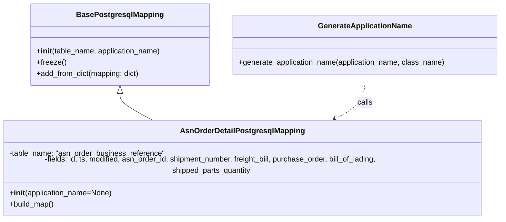

# Diagram: partview_core/partview_service/partview_service/persistence/sql/postgresql/AsnOrderDetailPostgresMapping.py

> Auto-generated by Obscura crawlers

## Mermaid

### SVG

<svg id="container" width="1083.462890625" xmlns="http://www.w3.org/2000/svg" class="classDiagram" height="456" viewBox="0 0 1083.462890625 456" role="graphics-document document" aria-roledescription="class"><g><defs><marker id="container_class-aggregationStart" class="marker aggregation class" refX="18" refY="7" markerWidth="190" markerHeight="240" orient="auto"><path d="M 18,7 L9,13 L1,7 L9,1 Z"></path></marker></defs><defs><marker id="container_class-aggregationEnd" class="marker aggregation class" refX="1" refY="7" markerWidth="20" markerHeight="28" orient="auto"><path d="M 18,7 L9,13 L1,7 L9,1 Z"></path></marker></defs><defs><marker id="container_class-extensionStart" class="marker extension class" refX="18" refY="7" markerWidth="190" markerHeight="240" orient="auto"><path d="M 1,7 L18,13 V 1 Z"></path></marker></defs><defs><marker id="container_class-extensionEnd" class="marker extension class" refX="1" refY="7" markerWidth="20" markerHeight="28" orient="auto"><path d="M 1,1 V 13 L18,7 Z"></path></marker></defs><defs><marker id="container_class-compositionStart" class="marker composition class" refX="18" refY="7" markerWidth="190" markerHeight="240" orient="auto"><path d="M 18,7 L9,13 L1,7 L9,1 Z"></path></marker></defs><defs><marker id="container_class-compositionEnd" class="marker composition class" refX="1" refY="7" markerWidth="20" markerHeight="28" orient="auto"><path d="M 18,7 L9,13 L1,7 L9,1 Z"></path></marker></defs><defs><marker id="container_class-dependencyStart" class="marker dependency class" refX="6" refY="7" markerWidth="190" markerHeight="240" orient="auto"><path d="M 5,7 L9,13 L1,7 L9,1 Z"></path></marker></defs><defs><marker id="container_class-dependencyEnd" class="marker dependency class" refX="13" refY="7" markerWidth="20" markerHeight="28" orient="auto"><path d="M 18,7 L9,13 L14,7 L9,1 Z"></path></marker></defs><defs><marker id="container_class-lollipopStart" class="marker lollipop class" refX="13" refY="7" markerWidth="190" markerHeight="240" orient="auto"><circle stroke="black" fill="transparent" cx="7" cy="7" r="6"></circle></marker></defs><defs><marker id="container_class-lollipopEnd" class="marker lollipop class" refX="1" refY="7" markerWidth="190" markerHeight="240" orient="auto"><circle stroke="black" fill="transparent" cx="7" cy="7" r="6"></circle></marker></defs><g class="root"><g class="clusters"></g><g class="edgePaths"><path d="M272.588,199.25L272.588,202.542C272.588,205.833,272.588,212.417,284.672,221.875C296.757,231.333,320.925,243.667,333.01,249.833L345.094,256" id="id_BasePostgresqlMapping_AsnOrderDetailPostgresqlMapping_1" class="edge-thickness-normal edge-pattern-solid relation" style=";;;" data-edge="true" data-et="edge" data-id="id_BasePostgresqlMapping_AsnOrderDetailPostgresqlMapping_1" data-points="W3sieCI6MjcyLjU4Nzg5MDYyNSwieSI6MTgyfSx7IngiOjI3Mi41ODc4OTA2MjUsInkiOjIxOX0seyJ4IjozNDUuMDk0MjE5OTI0ODEyLCJ5IjoyNTZ9XQ==" marker-start="url(#container_class-extensionStart)"></path><path d="M793.85,158L793.85,168.167C793.85,178.333,793.85,198.667,782.656,214.545C771.462,230.424,749.075,241.849,737.881,247.561L726.688,253.273" id="id_GenerateApplicationName_AsnOrderDetailPostgresqlMapping_2" class="edge-thickness-normal edge-pattern-dashed relation" style=";;;" data-edge="true" data-et="edge" data-id="id_GenerateApplicationName_AsnOrderDetailPostgresqlMapping_2" data-points="W3sieCI6NzkzLjg0OTYwOTM3NSwieSI6MTU4fSx7IngiOjc5My44NDk2MDkzNzUsInkiOjIxOX0seyJ4Ijo3MjEuMzQzMjgwMDc1MTg4LCJ5IjoyNTZ9XQ==" marker-end="url(#container_class-dependencyEnd)"></path></g><g class="edgeLabels"><g class="edgeLabel"><g class="label" data-id="id_BasePostgresqlMapping_AsnOrderDetailPostgresqlMapping_1" transform="translate(0, 0)"><foreignObject width="0" height="0">

</foreignObject></g></g><g class="edgeLabel" transform="translate(793.849609375, 219)"><g class="label" data-id="id_GenerateApplicationName_AsnOrderDetailPostgresqlMapping_2" transform="translate(-16.4453125, -12)"><foreignObject width="32.890625" height="24">

calls

</foreignObject></g></g></g><g class="nodes"><g class="node default" id="classId-BasePostgresqlMapping-0" transform="translate(272.587890625, 95)"><g class="basic label-container"><path d="M-189.6484375 -87 L189.6484375 -87 L189.6484375 87 L-189.6484375 87" stroke="none" stroke-width="0" fill="#ECECFF" style=""></path><path d="M-189.6484375 -87 C-81.8948964600575 -87, 25.85864457988501 -87, 189.6484375 -87 M-189.6484375 -87 C-87.58004609651103 -87, 14.488345306977948 -87, 189.6484375 -87 M189.6484375 -87 C189.6484375 -38.4383100639545, 189.6484375 10.123379872090993, 189.6484375 87 M189.6484375 -87 C189.6484375 -37.65864890974089, 189.6484375 11.68270218051822, 189.6484375 87 M189.6484375 87 C82.52114361100507 87, -24.606150277989855 87, -189.6484375 87 M189.6484375 87 C38.534187445279116 87, -112.58006260944177 87, -189.6484375 87 M-189.6484375 87 C-189.6484375 41.36101807787979, -189.6484375 -4.277963844240418, -189.6484375 -87 M-189.6484375 87 C-189.6484375 47.74654254727214, -189.6484375 8.493085094544284, -189.6484375 -87" stroke="#9370DB" stroke-width="1.3" fill="none" stroke-dasharray="0 0" style=""></path></g><g class="annotation-group text" transform="translate(0, -63)"></g><g class="label-group text" transform="translate(-87.921875, -63)"><g class="label" style="font-weight: bolder" transform="translate(0,-12)"><foreignObject width="175.84375" height="24">

BasePostgresqlMapping

</foreignObject></g></g><g class="members-group text" transform="translate(-177.6484375, -15)"></g><g class="methods-group text" transform="translate(-177.6484375, 15)"><g class="label" style="" transform="translate(0,-12)"><foreignObject width="267.375" height="24">

+<strong>init</strong>(table_name, application_name)

</foreignObject></g><g class="label" style="" transform="translate(0,12)"><foreignObject width="62.109375" height="24">

+freeze()

</foreignObject></g><g class="label" style="" transform="translate(0,36)"><foreignObject width="222.796875" height="24">

+add_from_dict(mapping: dict)

</foreignObject></g></g><g class="divider" style=""><path d="M-189.6484375 -39 C-85.90753952996619 -39, 17.833358440067627 -39, 189.6484375 -39 M-189.6484375 -39 C-92.58776675407314 -39, 4.472903991853713 -39, 189.6484375 -39" stroke="#9370DB" stroke-width="1.3" fill="none" stroke-dasharray="0 0" style=""></path></g><g class="divider" style=""><path d="M-189.6484375 -15 C-85.4289266344855 -15, 18.790584231028987 -15, 189.6484375 -15 M-189.6484375 -15 C-49.89989035237136 -15, 89.84865679525728 -15, 189.6484375 -15" stroke="#9370DB" stroke-width="1.3" fill="none" stroke-dasharray="0 0" style=""></path></g></g><g class="node default" id="classId-AsnOrderDetailPostgresqlMapping-1" transform="translate(533.21875, 352)"><g class="basic label-container"><path d="M-525.21875 -96 L525.21875 -96 L525.21875 96 L-525.21875 96" stroke="none" stroke-width="0" fill="#ECECFF" style=""></path><path d="M-525.21875 -96 C-261.376949662809 -96, 2.464850674381978 -96, 525.21875 -96 M-525.21875 -96 C-144.54354260211431 -96, 236.13166479577137 -96, 525.21875 -96 M525.21875 -96 C525.21875 -53.5914802306453, 525.21875 -11.182960461290605, 525.21875 96 M525.21875 -96 C525.21875 -43.57141696778636, 525.21875 8.857166064427275, 525.21875 96 M525.21875 96 C194.74220333493923 96, -135.73434333012153 96, -525.21875 96 M525.21875 96 C265.08637223383835 96, 4.953994467676694 96, -525.21875 96 M-525.21875 96 C-525.21875 54.00183293299647, -525.21875 12.003665865992943, -525.21875 -96 M-525.21875 96 C-525.21875 31.700819722815183, -525.21875 -32.598360554369634, -525.21875 -96" stroke="#9370DB" stroke-width="1.3" fill="none" stroke-dasharray="0 0" style=""></path></g><g class="annotation-group text" transform="translate(0, -72)"></g><g class="label-group text" transform="translate(-126.15625, -72)"><g class="label" style="font-weight: bolder" transform="translate(0,-12)"><foreignObject width="252.3125" height="24">

AsnOrderDetailPostgresqlMapping

</foreignObject></g></g><g class="members-group text" transform="translate(-513.21875, -24)"><g class="label" style="" transform="translate(0,-12)"><foreignObject width="332.328125" height="24">

-table_name: "asn_order_business_reference"

</foreignObject></g><g class="label" style="" transform="translate(0,12)"><foreignObject width="900.28125" height="24">

-fields: id, ts, modified, asn_order_id, shipment_number, freight_bill, purchase_order, bill_of_lading, shipped_parts_quantity

</foreignObject></g></g><g class="methods-group text" transform="translate(-513.21875, 48)"><g class="label" style="" transform="translate(0,-12)"><foreignObject width="220.109375" height="24">

+<strong>init</strong>(application_name=None)

</foreignObject></g><g class="label" style="" transform="translate(0,12)"><foreignObject width="96.109375" height="24">

+build_map()

</foreignObject></g></g><g class="divider" style=""><path d="M-525.21875 -48 C-208.97541846608226 -48, 107.26791306783548 -48, 525.21875 -48 M-525.21875 -48 C-233.60852731851736 -48, 58.00169536296528 -48, 525.21875 -48" stroke="#9370DB" stroke-width="1.3" fill="none" stroke-dasharray="0 0" style=""></path></g><g class="divider" style=""><path d="M-525.21875 24 C-285.66124187321884 24, -46.10373374643768 24, 525.21875 24 M-525.21875 24 C-148.0572565468987 24, 229.10423690620257 24, 525.21875 24" stroke="#9370DB" stroke-width="1.3" fill="none" stroke-dasharray="0 0" style=""></path></g></g><g class="node default" id="classId-GenerateApplicationName-2" transform="translate(793.849609375, 95)"><g class="basic label-container"><path d="M-281.61328125 -63 L281.61328125 -63 L281.61328125 63 L-281.61328125 63" stroke="none" stroke-width="0" fill="#ECECFF" style=""></path><path d="M-281.61328125 -63 C-132.19209787720882 -63, 17.229085495582353 -63, 281.61328125 -63 M-281.61328125 -63 C-166.30848715155904 -63, -51.00369305311807 -63, 281.61328125 -63 M281.61328125 -63 C281.61328125 -27.381140567432084, 281.61328125 8.237718865135832, 281.61328125 63 M281.61328125 -63 C281.61328125 -14.128837105288447, 281.61328125 34.742325789423106, 281.61328125 63 M281.61328125 63 C116.72060452682933 63, -48.17207219634133 63, -281.61328125 63 M281.61328125 63 C139.56760886881847 63, -2.4780635123630645 63, -281.61328125 63 M-281.61328125 63 C-281.61328125 35.006172163583514, -281.61328125 7.012344327167028, -281.61328125 -63 M-281.61328125 63 C-281.61328125 21.73589985362063, -281.61328125 -19.52820029275874, -281.61328125 -63" stroke="#9370DB" stroke-width="1.3" fill="none" stroke-dasharray="0 0" style=""></path></g><g class="annotation-group text" transform="translate(0, -39)"></g><g class="label-group text" transform="translate(-95.8203125, -39)"><g class="label" style="font-weight: bolder" transform="translate(0,-12)"><foreignObject width="191.640625" height="24">

GenerateApplicationName

</foreignObject></g></g><g class="members-group text" transform="translate(-269.61328125, 9)"></g><g class="methods-group text" transform="translate(-269.61328125, 39)"><g class="label" style="" transform="translate(0,-12)"><foreignObject width="443.40625" height="24">

+generate_application_name(application_name, class_name)

</foreignObject></g></g><g class="divider" style=""><path d="M-281.61328125 -15 C-70.94532359574967 -15, 139.72263405850066 -15, 281.61328125 -15 M-281.61328125 -15 C-91.76498094839076 -15, 98.08331935321849 -15, 281.61328125 -15" stroke="#9370DB" stroke-width="1.3" fill="none" stroke-dasharray="0 0" style=""></path></g><g class="divider" style=""><path d="M-281.61328125 9 C-129.8854496496301 9, 21.84238195073982 9, 281.61328125 9 M-281.61328125 9 C-159.47783867739162 9, -37.34239610478326 9, 281.61328125 9" stroke="#9370DB" stroke-width="1.3" fill="none" stroke-dasharray="0 0" style=""></path></g></g></g></g></g></svg>
