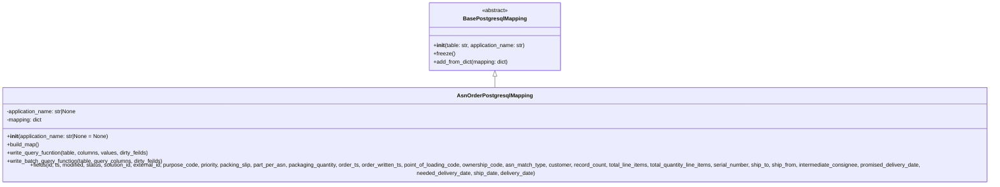

# Diagram: partview_core/partview_service/partview_service/persistence/sql/postgresql/AsnOrderPostgresqlMapping.py


> Auto-generated by Obscura crawlers

## Diagram 1



### SVG

<svg id="container" width="3156.9609375" xmlns="http://www.w3.org/2000/svg" class="classDiagram" height="528" viewBox="0 0 3156.9609375 528" role="graphics-document document" aria-roledescription="class"><style>#container{font-family:"trebuchet ms",verdana,arial,sans-serif;font-size:16px;fill:#333;}@keyframes edge-animation-frame{from{stroke-dashoffset:0;}}@keyframes dash{to{stroke-dashoffset:0;}}#container .edge-animation-slow{stroke-dasharray:9,5!important;stroke-dashoffset:900;animation:dash 50s linear infinite;stroke-linecap:round;}#container .edge-animation-fast{stroke-dasharray:9,5!important;stroke-dashoffset:900;animation:dash 20s linear infinite;stroke-linecap:round;}#container .error-icon{fill:#552222;}#container .error-text{fill:#552222;stroke:#552222;}#container .edge-thickness-normal{stroke-width:1px;}#container .edge-thickness-thick{stroke-width:3.5px;}#container .edge-pattern-solid{stroke-dasharray:0;}#container .edge-thickness-invisible{stroke-width:0;fill:none;}#container .edge-pattern-dashed{stroke-dasharray:3;}#container .edge-pattern-dotted{stroke-dasharray:2;}#container .marker{fill:#333333;stroke:#333333;}#container .marker.cross{stroke:#333333;}#container svg{font-family:"trebuchet ms",verdana,arial,sans-serif;font-size:16px;}#container p{margin:0;}#container g.classGroup text{fill:#9370DB;stroke:none;font-family:"trebuchet ms",verdana,arial,sans-serif;font-size:10px;}#container g.classGroup text .title{font-weight:bolder;}#container .nodeLabel,#container .edgeLabel{color:#131300;}#container .edgeLabel .label rect{fill:#ECECFF;}#container .label text{fill:#131300;}#container .labelBkg{background:#ECECFF;}#container .edgeLabel .label span{background:#ECECFF;}#container .classTitle{font-weight:bolder;}#container .node rect,#container .node circle,#container .node ellipse,#container .node polygon,#container .node path{fill:#ECECFF;stroke:#9370DB;stroke-width:1px;}#container .divider{stroke:#9370DB;stroke-width:1;}#container g.clickable{cursor:pointer;}#container g.classGroup rect{fill:#ECECFF;stroke:#9370DB;}#container g.classGroup line{stroke:#9370DB;stroke-width:1;}#container .classLabel .box{stroke:none;stroke-width:0;fill:#ECECFF;opacity:0.5;}#container .classLabel .label{fill:#9370DB;font-size:10px;}#container .relation{stroke:#333333;stroke-width:1;fill:none;}#container .dashed-line{stroke-dasharray:3;}#container .dotted-line{stroke-dasharray:1 2;}#container #compositionStart,#container .composition{fill:#333333!important;stroke:#333333!important;stroke-width:1;}#container #compositionEnd,#container .composition{fill:#333333!important;stroke:#333333!important;stroke-width:1;}#container #dependencyStart,#container .dependency{fill:#333333!important;stroke:#333333!important;stroke-width:1;}#container #dependencyStart,#container .dependency{fill:#333333!important;stroke:#333333!important;stroke-width:1;}#container #extensionStart,#container .extension{fill:transparent!important;stroke:#333333!important;stroke-width:1;}#container #extensionEnd,#container .extension{fill:transparent!important;stroke:#333333!important;stroke-width:1;}#container #aggregationStart,#container .aggregation{fill:transparent!important;stroke:#333333!important;stroke-width:1;}#container #aggregationEnd,#container .aggregation{fill:transparent!important;stroke:#333333!important;stroke-width:1;}#container #lollipopStart,#container .lollipop{fill:#ECECFF!important;stroke:#333333!important;stroke-width:1;}#container #lollipopEnd,#container .lollipop{fill:#ECECFF!important;stroke:#333333!important;stroke-width:1;}#container .edgeTerminals{font-size:11px;line-height:initial;}#container .classTitleText{text-anchor:middle;font-size:18px;fill:#333;}#container .label-icon{display:inline-block;height:1em;overflow:visible;vertical-align:-0.125em;}#container .node .label-icon path{fill:currentColor;stroke:revert;stroke-width:revert;}#container :root{--mermaid-font-family:"trebuchet ms",verdana,arial,sans-serif;}</style><g><defs><marker id="container_class-aggregationStart" class="marker aggregation class" refX="18" refY="7" markerWidth="190" markerHeight="240" orient="auto"><path d="M 18,7 L9,13 L1,7 L9,1 Z"></path></marker></defs><defs><marker id="container_class-aggregationEnd" class="marker aggregation class" refX="1" refY="7" markerWidth="20" markerHeight="28" orient="auto"><path d="M 18,7 L9,13 L1,7 L9,1 Z"></path></marker></defs><defs><marker id="container_class-extensionStart" class="marker extension class" refX="18" refY="7" markerWidth="190" markerHeight="240" orient="auto"><path d="M 1,7 L18,13 V 1 Z"></path></marker></defs><defs><marker id="container_class-extensionEnd" class="marker extension class" refX="1" refY="7" markerWidth="20" markerHeight="28" orient="auto"><path d="M 1,1 V 13 L18,7 Z"></path></marker></defs><defs><marker id="container_class-compositionStart" class="marker composition class" refX="18" refY="7" markerWidth="190" markerHeight="240" orient="auto"><path d="M 18,7 L9,13 L1,7 L9,1 Z"></path></marker></defs><defs><marker id="container_class-compositionEnd" class="marker composition class" refX="1" refY="7" markerWidth="20" markerHeight="28" orient="auto"><path d="M 18,7 L9,13 L1,7 L9,1 Z"></path></marker></defs><defs><marker id="container_class-dependencyStart" class="marker dependency class" refX="6" refY="7" markerWidth="190" markerHeight="240" orient="auto"><path d="M 5,7 L9,13 L1,7 L9,1 Z"></path></marker></defs><defs><marker id="container_class-dependencyEnd" class="marker dependency class" refX="13" refY="7" markerWidth="20" markerHeight="28" orient="auto"><path d="M 18,7 L9,13 L14,7 L9,1 Z"></path></marker></defs><defs><marker id="container_class-lollipopStart" class="marker lollipop class" refX="13" refY="7" markerWidth="190" markerHeight="240" orient="auto"><circle stroke="black" fill="transparent" cx="7" cy="7" r="6"></circle></marker></defs><defs><marker id="container_class-lollipopEnd" class="marker lollipop class" refX="1" refY="7" markerWidth="190" markerHeight="240" orient="auto"><circle stroke="black" fill="transparent" cx="7" cy="7" r="6"></circle></marker></defs><g class="root"><g class="clusters"></g><g class="edgePaths"><path d="M1578.48,223.25L1578.48,224.542C1578.48,225.833,1578.48,228.417,1578.48,233.875C1578.48,239.333,1578.48,247.667,1578.48,251.833L1578.48,256" id="id_BasePostgresqlMapping_AsnOrderPostgresqlMapping_1" class="edge-thickness-normal edge-pattern-solid relation" style=";;;" data-edge="true" data-et="edge" data-id="id_BasePostgresqlMapping_AsnOrderPostgresqlMapping_1" data-points="W3sieCI6MTU3OC40ODA0Njg3NSwieSI6MjA2fSx7IngiOjE1NzguNDgwNDY4NzUsInkiOjIzMX0seyJ4IjoxNTc4LjQ4MDQ2ODc1LCJ5IjoyNTZ9XQ==" marker-start="url(#container_class-extensionStart)"></path></g><g class="edgeLabels"><g class="edgeLabel"><g class="label" data-id="id_BasePostgresqlMapping_AsnOrderPostgresqlMapping_1" transform="translate(0, 0)"><foreignObject width="0" height="0"><div xmlns="http://www.w3.org/1999/xhtml" class="labelBkg" style="display: table-cell; white-space: nowrap; line-height: 1.5; max-width: 200px; text-align: center;"><span class="edgeLabel"></span></div></foreignObject></g></g></g><g class="nodes"><g class="node default" id="classId-BasePostgresqlMapping-0" transform="translate(1578.48046875, 107)"><g class="basic label-container"><path d="M-192.3359375 -99 L192.3359375 -99 L192.3359375 99 L-192.3359375 99" stroke="none" stroke-width="0" fill="#ECECFF" style=""></path><path d="M-192.3359375 -99 C-53.72420800110652 -99, 84.88752149778696 -99, 192.3359375 -99 M-192.3359375 -99 C-58.47475580127241 -99, 75.38642589745518 -99, 192.3359375 -99 M192.3359375 -99 C192.3359375 -51.892560603832834, 192.3359375 -4.785121207665668, 192.3359375 99 M192.3359375 -99 C192.3359375 -35.58120701836573, 192.3359375 27.837585963268538, 192.3359375 99 M192.3359375 99 C53.38789604233935 99, -85.5601454153213 99, -192.3359375 99 M192.3359375 99 C60.43093589508521 99, -71.47406570982957 99, -192.3359375 99 M-192.3359375 99 C-192.3359375 51.07692615439512, -192.3359375 3.153852308790235, -192.3359375 -99 M-192.3359375 99 C-192.3359375 51.01144529532214, -192.3359375 3.0228905906442805, -192.3359375 -99" stroke="#9370DB" stroke-width="1.3" fill="none" stroke-dasharray="0 0" style=""></path></g><g class="annotation-group text" transform="translate(-38.609375, -75)"><g class="label" style="" transform="translate(0,-12)"><foreignObject width="77.21875" height="24"><div xmlns="http://www.w3.org/1999/xhtml" style="display: table-cell; white-space: nowrap; line-height: 1.5; max-width: 127px; text-align: center;"><span class="nodeLabel markdown-node-label" style=""><p>«abstract»</p></span></div></foreignObject></g></g><g class="label-group text" transform="translate(-87.921875, -51)"><g class="label" style="font-weight: bolder" transform="translate(0,-12)"><foreignObject width="175.84375" height="24"><div xmlns="http://www.w3.org/1999/xhtml" style="display: table-cell; white-space: nowrap; line-height: 1.5; max-width: 223px; text-align: center;"><span class="nodeLabel markdown-node-label" style=""><p>BasePostgresqlMapping</p></span></div></foreignObject></g></g><g class="members-group text" transform="translate(-180.3359375, -3)"></g><g class="methods-group text" transform="translate(-180.3359375, 27)"><g class="label" style="" transform="translate(0,-12)"><foreignObject width="272.75" height="24"><div xmlns="http://www.w3.org/1999/xhtml" style="display: table-cell; white-space: nowrap; line-height: 1.5; max-width: 362px; text-align: center;"><span class="nodeLabel markdown-node-label" style=""><p>+<strong>init</strong>(table: str, application_name: str)</p></span></div></foreignObject></g><g class="label" style="" transform="translate(0,12)"><foreignObject width="62.109375" height="24"><div xmlns="http://www.w3.org/1999/xhtml" style="display: table-cell; white-space: nowrap; line-height: 1.5; max-width: 119px; text-align: center;"><span class="nodeLabel markdown-node-label" style=""><p>+freeze()</p></span></div></foreignObject></g><g class="label" style="" transform="translate(0,36)"><foreignObject width="222.796875" height="24"><div xmlns="http://www.w3.org/1999/xhtml" style="display: table-cell; white-space: nowrap; line-height: 1.5; max-width: 280px; text-align: center;"><span class="nodeLabel markdown-node-label" style=""><p>+add_from_dict(mapping: dict)</p></span></div></foreignObject></g></g><g class="divider" style=""><path d="M-192.3359375 -27 C-88.12727091542699 -27, 16.08139566914602 -27, 192.3359375 -27 M-192.3359375 -27 C-50.69892360441517 -27, 90.93809029116966 -27, 192.3359375 -27" stroke="#9370DB" stroke-width="1.3" fill="none" stroke-dasharray="0 0" style=""></path></g><g class="divider" style=""><path d="M-192.3359375 -3 C-105.18010999484325 -3, -18.0242824896865 -3, 192.3359375 -3 M-192.3359375 -3 C-48.747930268622554 -3, 94.84007696275489 -3, 192.3359375 -3" stroke="#9370DB" stroke-width="1.3" fill="none" stroke-dasharray="0 0" style=""></path></g></g><g class="node default" id="classId-AsnOrderPostgresqlMapping-1" transform="translate(1578.48046875, 388)"><g class="basic label-container"><path d="M-1570.48046875 -132 L1570.48046875 -132 L1570.48046875 132 L-1570.48046875 132" stroke="none" stroke-width="0" fill="#ECECFF" style=""></path><path d="M-1570.48046875 -132 C-892.8411995813268 -132, -215.2019304126536 -132, 1570.48046875 -132 M-1570.48046875 -132 C-338.7558540668697 -132, 892.9687606162606 -132, 1570.48046875 -132 M1570.48046875 -132 C1570.48046875 -53.850259050632204, 1570.48046875 24.299481898735593, 1570.48046875 132 M1570.48046875 -132 C1570.48046875 -69.18529135001233, 1570.48046875 -6.37058270002467, 1570.48046875 132 M1570.48046875 132 C852.7166365920059 132, 134.9528044340118 132, -1570.48046875 132 M1570.48046875 132 C641.7891693575697 132, -286.90213003486065 132, -1570.48046875 132 M-1570.48046875 132 C-1570.48046875 59.473122359213946, -1570.48046875 -13.053755281572109, -1570.48046875 -132 M-1570.48046875 132 C-1570.48046875 59.55943598503974, -1570.48046875 -12.881128029920518, -1570.48046875 -132" stroke="#9370DB" stroke-width="1.3" fill="none" stroke-dasharray="0 0" style=""></path></g><g class="annotation-group text" transform="translate(0, -108)"></g><g class="label-group text" transform="translate(-104.5234375, -108)"><g class="label" style="font-weight: bolder" transform="translate(0,-12)"><foreignObject width="209.046875" height="24"><div xmlns="http://www.w3.org/1999/xhtml" style="display: table-cell; white-space: nowrap; line-height: 1.5; max-width: 256px; text-align: center;"><span class="nodeLabel markdown-node-label" style=""><p>AsnOrderPostgresqlMapping</p></span></div></foreignObject></g></g><g class="members-group text" transform="translate(-1558.48046875, -60)"><g class="label" style="" transform="translate(0,-12)"><foreignObject width="209.484375" height="24"><div xmlns="http://www.w3.org/1999/xhtml" style="display: table-cell; white-space: nowrap; line-height: 1.5; max-width: 267px; text-align: center;"><span class="nodeLabel markdown-node-label" style=""><p>-application_name: str|None</p></span></div></foreignObject></g><g class="label" style="" transform="translate(0,12)"><foreignObject width="105.671875" height="24"><div xmlns="http://www.w3.org/1999/xhtml" style="display: table-cell; white-space: nowrap; line-height: 1.5; max-width: 163px; text-align: center;"><span class="nodeLabel markdown-node-label" style=""><p>-mapping: dict</p></span></div></foreignObject></g></g><g class="methods-group text" transform="translate(-1558.48046875, 12)"><g class="label" style="" transform="translate(0,-12)"><foreignObject width="300.90625" height="24"><div xmlns="http://www.w3.org/1999/xhtml" style="display: table-cell; white-space: nowrap; line-height: 1.5; max-width: 390px; text-align: center;"><span class="nodeLabel markdown-node-label" style=""><p>+<strong>init</strong>(application_name: str|None = None)</p></span></div></foreignObject></g><g class="label" style="" transform="translate(0,12)"><foreignObject width="96.109375" height="24"><div xmlns="http://www.w3.org/1999/xhtml" style="display: table-cell; white-space: nowrap; line-height: 1.5; max-width: 153px; text-align: center;"><span class="nodeLabel markdown-node-label" style=""><p>+build_map()</p></span></div></foreignObject></g><g class="label" style="" transform="translate(0,36)"><foreignObject width="422.609375" height="24"><div xmlns="http://www.w3.org/1999/xhtml" style="display: table-cell; white-space: nowrap; line-height: 1.5; max-width: 480px; text-align: center;"><span class="nodeLabel markdown-node-label" style=""><p>+write_query_fucntion(table, columns, values, dirty_feilds)</p></span></div></foreignObject></g><g class="label" style="" transform="translate(0,60)"><foreignObject width="466.28125" height="24"><div xmlns="http://www.w3.org/1999/xhtml" style="display: table-cell; white-space: nowrap; line-height: 1.5; max-width: 524px; text-align: center;"><span class="nodeLabel markdown-node-label" style=""><p>+write_batch_query_function(table, query_columns, dirty_feilds)</p></span></div></foreignObject></g><g class="label" style="" transform="translate(0,84)"><foreignObject width="3012.4375" height="24"><div xmlns="http://www.w3.org/1999/xhtml" style="display: table-cell; white-space: nowrap; line-height: 1.5; max-width: 3070px; text-align: center;"><span class="nodeLabel markdown-node-label" style=""><p>+fields(id, ts, modified, status, solution_id, external_id, purpose_code, priority, packing_slip, part_per_asn, packaging_quantity, order_ts, order_written_ts, point_of_loading_code, ownership_code, asn_match_type, customer, record_count, total_line_items, total_quantity_line_items, serial_number, ship_to, ship_from, intermediate_consignee, promised_delivery_date, needed_delivery_date, ship_date, delivery_date)</p></span></div></foreignObject></g></g><g class="divider" style=""><path d="M-1570.48046875 -84 C-747.4872149365219 -84, 75.50603887695615 -84, 1570.48046875 -84 M-1570.48046875 -84 C-609.1164516356699 -84, 352.24756547866014 -84, 1570.48046875 -84" stroke="#9370DB" stroke-width="1.3" fill="none" stroke-dasharray="0 0" style=""></path></g><g class="divider" style=""><path d="M-1570.48046875 -12 C-449.53917000930824 -12, 671.4021287313835 -12, 1570.48046875 -12 M-1570.48046875 -12 C-374.2527882345396 -12, 821.9748922809208 -12, 1570.48046875 -12" stroke="#9370DB" stroke-width="1.3" fill="none" stroke-dasharray="0 0" style=""></path></g></g></g></g></g></svg>

## Diagram 2

```mermaid
flowchart LR
    A[Caller provides application_name?] -->|maybe None| B[generate_application_name(application_name, className)]
    B --> C[AsnOrderPostgresqlMapping.__init__]
    C --> D[super().__init__("asn_order", application_name)]
    D --> E[super().freeze()]
    C --> F[build_map()]
    F --> G[add_from_dict(mapping of columns -> names)]
    H[Insert operation requested] --> I{single or batch}
    I -->|single| J[write_query_fucntion(table, columns, values, dirty_feilds)]
    I -->|batch| K[write_batch_query_function(table, query_columns, dirty_feilds)]
    J --> L[SQL: INSERT INTO {table} ({columns}) VALUES ({values}) ON CONFLICT (external_id, solution_id) DO UPDATE set external_id = EXCLUDED.external_id returning *]
    K --> M[SQL: INSERT INTO {table} ({query_columns}) VALUES %s ON CONFLICT (external_id, solution_id) DO UPDATE set external_id = EXCLUDED.external_id returning *]
```

> SVG rendering failed for this diagram.
