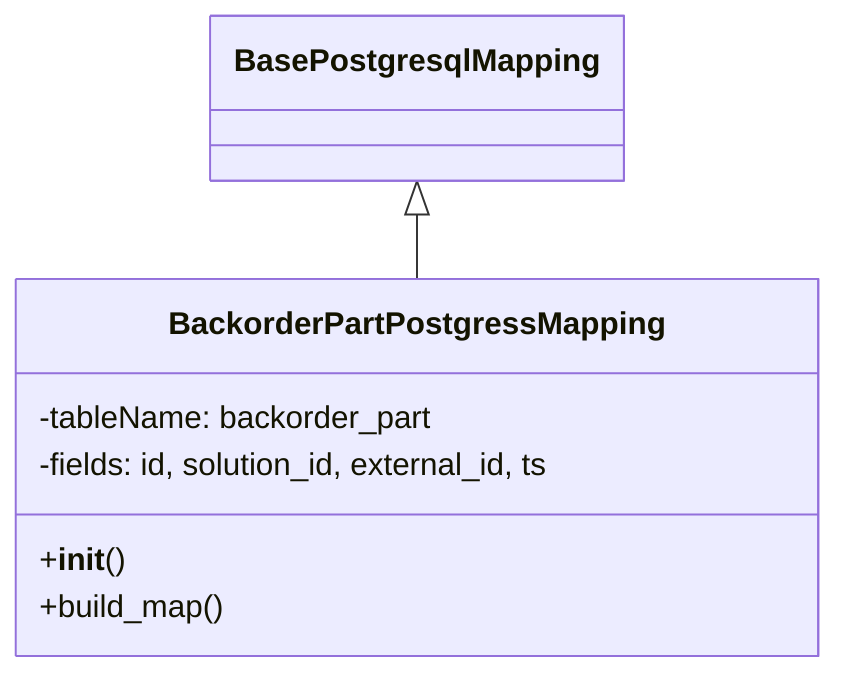

# Diagram: partview_core/partview_service/partview_service/persistence/sql/postgresql/BackorderPartPostgressMapping.py

> Auto-generated by Obscura crawlers

## Mermaid

### SVG

<svg id="container" width="429.0625" xmlns="http://www.w3.org/2000/svg" class="classDiagram" height="342" viewBox="0 0 429.0625 342" role="graphics-document document" aria-roledescription="class"><g><defs><marker id="container_class-aggregationStart" class="marker aggregation class" refX="18" refY="7" markerWidth="190" markerHeight="240" orient="auto"><path d="M 18,7 L9,13 L1,7 L9,1 Z"></path></marker></defs><defs><marker id="container_class-aggregationEnd" class="marker aggregation class" refX="1" refY="7" markerWidth="20" markerHeight="28" orient="auto"><path d="M 18,7 L9,13 L1,7 L9,1 Z"></path></marker></defs><defs><marker id="container_class-extensionStart" class="marker extension class" refX="18" refY="7" markerWidth="190" markerHeight="240" orient="auto"><path d="M 1,7 L18,13 V 1 Z"></path></marker></defs><defs><marker id="container_class-extensionEnd" class="marker extension class" refX="1" refY="7" markerWidth="20" markerHeight="28" orient="auto"><path d="M 1,1 V 13 L18,7 Z"></path></marker></defs><defs><marker id="container_class-compositionStart" class="marker composition class" refX="18" refY="7" markerWidth="190" markerHeight="240" orient="auto"><path d="M 18,7 L9,13 L1,7 L9,1 Z"></path></marker></defs><defs><marker id="container_class-compositionEnd" class="marker composition class" refX="1" refY="7" markerWidth="20" markerHeight="28" orient="auto"><path d="M 18,7 L9,13 L1,7 L9,1 Z"></path></marker></defs><defs><marker id="container_class-dependencyStart" class="marker dependency class" refX="6" refY="7" markerWidth="190" markerHeight="240" orient="auto"><path d="M 5,7 L9,13 L1,7 L9,1 Z"></path></marker></defs><defs><marker id="container_class-dependencyEnd" class="marker dependency class" refX="13" refY="7" markerWidth="20" markerHeight="28" orient="auto"><path d="M 18,7 L9,13 L14,7 L9,1 Z"></path></marker></defs><defs><marker id="container_class-lollipopStart" class="marker lollipop class" refX="13" refY="7" markerWidth="190" markerHeight="240" orient="auto"><circle stroke="black" fill="transparent" cx="7" cy="7" r="6"></circle></marker></defs><defs><marker id="container_class-lollipopEnd" class="marker lollipop class" refX="1" refY="7" markerWidth="190" markerHeight="240" orient="auto"><circle stroke="black" fill="transparent" cx="7" cy="7" r="6"></circle></marker></defs><g class="root"><g class="clusters"></g><g class="edgePaths"><path d="M214.531,109.25L214.531,110.542C214.531,111.833,214.531,114.417,214.531,119.875C214.531,125.333,214.531,133.667,214.531,137.833L214.531,142" id="id_BasePostgresqlMapping_BackorderPartPostgressMapping_1" class="edge-thickness-normal edge-pattern-solid relation" style=";;;" data-edge="true" data-et="edge" data-id="id_BasePostgresqlMapping_BackorderPartPostgressMapping_1" data-points="W3sieCI6MjE0LjUzMTI1LCJ5Ijo5Mn0seyJ4IjoyMTQuNTMxMjUsInkiOjExN30seyJ4IjoyMTQuNTMxMjUsInkiOjE0Mn1d" marker-start="url(#container_class-extensionStart)"></path></g><g class="edgeLabels"><g class="edgeLabel"><g class="label" data-id="id_BasePostgresqlMapping_BackorderPartPostgressMapping_1" transform="translate(0, 0)"><foreignObject width="0" height="0">

</foreignObject></g></g></g><g class="nodes"><g class="node default" id="classId-BasePostgresqlMapping-0" transform="translate(214.53125, 50)"><g class="basic label-container"><path d="M-99.921875 -42 L99.921875 -42 L99.921875 42 L-99.921875 42" stroke="none" stroke-width="0" fill="#ECECFF" style=""></path><path d="M-99.921875 -42 C-30.85270774022068 -42, 38.21645951955864 -42, 99.921875 -42 M-99.921875 -42 C-55.78364552273424 -42, -11.64541604546848 -42, 99.921875 -42 M99.921875 -42 C99.921875 -10.669528372654906, 99.921875 20.66094325469019, 99.921875 42 M99.921875 -42 C99.921875 -13.220277708422493, 99.921875 15.559444583155013, 99.921875 42 M99.921875 42 C20.127454238013726 42, -59.66696652397255 42, -99.921875 42 M99.921875 42 C23.815250760539243 42, -52.291373478921514 42, -99.921875 42 M-99.921875 42 C-99.921875 21.768977163617894, -99.921875 1.5379543272357878, -99.921875 -42 M-99.921875 42 C-99.921875 24.12358061530257, -99.921875 6.247161230605137, -99.921875 -42" stroke="#9370DB" stroke-width="1.3" fill="none" stroke-dasharray="0 0" style=""></path></g><g class="annotation-group text" transform="translate(0, -18)"></g><g class="label-group text" transform="translate(-87.921875, -18)"><g class="label" style="font-weight: bolder" transform="translate(0,-12)"><foreignObject width="175.84375" height="24">

BasePostgresqlMapping

</foreignObject></g></g><g class="members-group text" transform="translate(-87.921875, 30)"></g><g class="methods-group text" transform="translate(-87.921875, 60)"></g><g class="divider" style=""><path d="M-99.921875 6 C-23.5624257066558 6, 52.7970235866884 6, 99.921875 6 M-99.921875 6 C-42.208166840480956 6, 15.505541319038088 6, 99.921875 6" stroke="#9370DB" stroke-width="1.3" fill="none" stroke-dasharray="0 0" style=""></path></g><g class="divider" style=""><path d="M-99.921875 24 C-39.72972206800062 24, 20.46243086399876 24, 99.921875 24 M-99.921875 24 C-38.8244534593046 24, 22.2729680813908 24, 99.921875 24" stroke="#9370DB" stroke-width="1.3" fill="none" stroke-dasharray="0 0" style=""></path></g></g><g class="node default" id="classId-BackorderPartPostgressMapping-1" transform="translate(214.53125, 238)"><g class="basic label-container"><path d="M-206.53125 -96 L206.53125 -96 L206.53125 96 L-206.53125 96" stroke="none" stroke-width="0" fill="#ECECFF" style=""></path><path d="M-206.53125 -96 C-76.52346955862257 -96, 53.48431088275487 -96, 206.53125 -96 M-206.53125 -96 C-81.28037958513009 -96, 43.970490829739816 -96, 206.53125 -96 M206.53125 -96 C206.53125 -25.11912641582518, 206.53125 45.76174716834964, 206.53125 96 M206.53125 -96 C206.53125 -30.918465527564308, 206.53125 34.163068944871384, 206.53125 96 M206.53125 96 C105.25225904920757 96, 3.973268098415133 96, -206.53125 96 M206.53125 96 C49.169185456468625 96, -108.19287908706275 96, -206.53125 96 M-206.53125 96 C-206.53125 28.01723776869217, -206.53125 -39.96552446261566, -206.53125 -96 M-206.53125 96 C-206.53125 37.32021570360991, -206.53125 -21.359568592780178, -206.53125 -96" stroke="#9370DB" stroke-width="1.3" fill="none" stroke-dasharray="0 0" style=""></path></g><g class="annotation-group text" transform="translate(0, -72)"></g><g class="label-group text" transform="translate(-119.625, -72)"><g class="label" style="font-weight: bolder" transform="translate(0,-12)"><foreignObject width="239.25" height="24">

BackorderPartPostgressMapping

</foreignObject></g></g><g class="members-group text" transform="translate(-194.53125, -24)"><g class="label" style="" transform="translate(0,-12)"><foreignObject width="204.015625" height="24">

-tableName: backorder_part

</foreignObject></g><g class="label" style="" transform="translate(0,12)"><foreignObject width="269.4375" height="24">

-fields: id, solution_id, external_id, ts

</foreignObject></g></g><g class="methods-group text" transform="translate(-194.53125, 48)"><g class="label" style="" transform="translate(0,-12)"><foreignObject width="42.796875" height="24">

+<strong>init</strong>()

</foreignObject></g><g class="label" style="" transform="translate(0,12)"><foreignObject width="96.109375" height="24">

+build_map()

</foreignObject></g></g><g class="divider" style=""><path d="M-206.53125 -48 C-52.60103833555033 -48, 101.32917332889934 -48, 206.53125 -48 M-206.53125 -48 C-56.748846527296905 -48, 93.03355694540619 -48, 206.53125 -48" stroke="#9370DB" stroke-width="1.3" fill="none" stroke-dasharray="0 0" style=""></path></g><g class="divider" style=""><path d="M-206.53125 24 C-83.16679568327433 24, 40.19765863345134 24, 206.53125 24 M-206.53125 24 C-112.59126522514454 24, -18.65128045028908 24, 206.53125 24" stroke="#9370DB" stroke-width="1.3" fill="none" stroke-dasharray="0 0" style=""></path></g></g></g></g></g></svg>
