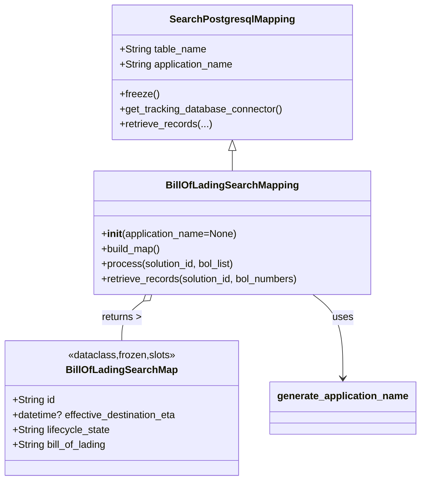
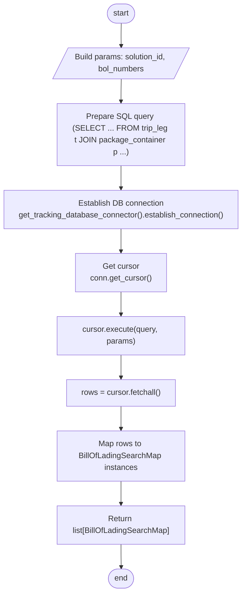

# Diagram: partview_core/partview_service/partview_service/persistence/sql/postgresql/BillOfLadingSearchMapping.py

> Auto-generated by Obscura crawlers

## Diagram 1

### SVG

<svg id="container" width="673.09375" xmlns="http://www.w3.org/2000/svg" class="classDiagram" height="770" viewBox="0 0 673.09375 770" role="graphics-document document" aria-roledescription="class"><g><defs><marker id="container_class-aggregationStart" class="marker aggregation class" refX="18" refY="7" markerWidth="190" markerHeight="240" orient="auto"><path d="M 18,7 L9,13 L1,7 L9,1 Z"></path></marker></defs><defs><marker id="container_class-aggregationEnd" class="marker aggregation class" refX="1" refY="7" markerWidth="20" markerHeight="28" orient="auto"><path d="M 18,7 L9,13 L1,7 L9,1 Z"></path></marker></defs><defs><marker id="container_class-extensionStart" class="marker extension class" refX="18" refY="7" markerWidth="190" markerHeight="240" orient="auto"><path d="M 1,7 L18,13 V 1 Z"></path></marker></defs><defs><marker id="container_class-extensionEnd" class="marker extension class" refX="1" refY="7" markerWidth="20" markerHeight="28" orient="auto"><path d="M 1,1 V 13 L18,7 Z"></path></marker></defs><defs><marker id="container_class-compositionStart" class="marker composition class" refX="18" refY="7" markerWidth="190" markerHeight="240" orient="auto"><path d="M 18,7 L9,13 L1,7 L9,1 Z"></path></marker></defs><defs><marker id="container_class-compositionEnd" class="marker composition class" refX="1" refY="7" markerWidth="20" markerHeight="28" orient="auto"><path d="M 18,7 L9,13 L1,7 L9,1 Z"></path></marker></defs><defs><marker id="container_class-dependencyStart" class="marker dependency class" refX="6" refY="7" markerWidth="190" markerHeight="240" orient="auto"><path d="M 5,7 L9,13 L1,7 L9,1 Z"></path></marker></defs><defs><marker id="container_class-dependencyEnd" class="marker dependency class" refX="13" refY="7" markerWidth="20" markerHeight="28" orient="auto"><path d="M 18,7 L9,13 L14,7 L9,1 Z"></path></marker></defs><defs><marker id="container_class-lollipopStart" class="marker lollipop class" refX="13" refY="7" markerWidth="190" markerHeight="240" orient="auto"><circle stroke="black" fill="transparent" cx="7" cy="7" r="6"></circle></marker></defs><defs><marker id="container_class-lollipopEnd" class="marker lollipop class" refX="1" refY="7" markerWidth="190" markerHeight="240" orient="auto"><circle stroke="black" fill="transparent" cx="7" cy="7" r="6"></circle></marker></defs><g class="root"><g class="clusters"></g><g class="edgePaths"><path d="M374.453,241.25L374.453,242.542C374.453,243.833,374.453,246.417,374.453,251.875C374.453,257.333,374.453,265.667,374.453,269.833L374.453,274" id="id_SearchPostgresqlMapping_BillOfLadingSearchMapping_1" class="edge-thickness-normal edge-pattern-solid relation" style=";;;" data-edge="true" data-et="edge" data-id="id_SearchPostgresqlMapping_BillOfLadingSearchMapping_1" data-points="W3sieCI6Mzc0LjQ1MzEyNSwieSI6MjI0fSx7IngiOjM3NC40NTMxMjUsInkiOjI0OX0seyJ4IjozNzQuNDUzMTI1LCJ5IjoyNzR9XQ==" marker-start="url(#container_class-extensionStart)"></path><path d="M232.1,482.519L226.364,486.932C220.627,491.346,209.153,500.173,203.416,510.753C197.68,521.333,197.68,533.667,197.68,539.833L197.68,546" id="id_BillOfLadingSearchMapping_BillOfLadingSearchMap_2" class="edge-thickness-normal edge-pattern-solid relation" style=";;;" data-edge="true" data-et="edge" data-id="id_BillOfLadingSearchMapping_BillOfLadingSearchMap_2" data-points="W3sieCI6MjQ1Ljc3MjQ2MDkzNzUsInkiOjQ3Mn0seyJ4IjoxOTcuNjc5Njg3NSwieSI6NTA5fSx7IngiOjE5Ny42Nzk2ODc1LCJ5Ijo1NDZ9XQ==" marker-start="url(#container_class-aggregationStart)"></path><path d="M503.134,472L511.149,478.167C519.165,484.333,535.196,496.667,543.211,519C551.227,541.333,551.227,573.667,551.227,589.833L551.227,606" id="id_BillOfLadingSearchMapping_generate_application_name_3" class="edge-thickness-normal edge-pattern-solid relation" style=";;;" data-edge="true" data-et="edge" data-id="id_BillOfLadingSearchMapping_generate_application_name_3" data-points="W3sieCI6NTAzLjEzMzc4OTA2MjUsInkiOjQ3Mn0seyJ4Ijo1NTEuMjI2NTYyNSwieSI6NTA5fSx7IngiOjU1MS4yMjY1NjI1LCJ5Ijo2MTJ9XQ==" marker-end="url(#container_class-dependencyEnd)"></path></g><g class="edgeLabels"><g class="edgeLabel"><g class="label" data-id="id_SearchPostgresqlMapping_BillOfLadingSearchMapping_1" transform="translate(0, 0)"><foreignObject width="0" height="0">

</foreignObject></g></g><g class="edgeLabel" transform="translate(197.6796875, 509)"><g class="label" data-id="id_BillOfLadingSearchMapping_BillOfLadingSearchMap_2" transform="translate(-32.390625, -12)"><foreignObject width="64.78125" height="24">

returns &gt;

</foreignObject></g></g><g class="edgeLabel" transform="translate(551.2265625, 509)"><g class="label" data-id="id_BillOfLadingSearchMapping_generate_application_name_3" transform="translate(-16.4921875, -12)"><foreignObject width="32.984375" height="24">

uses

</foreignObject></g></g></g><g class="nodes"><g class="node default" id="classId-BillOfLadingSearchMap-0" transform="translate(197.6796875, 654)"><g class="basic label-container"><path d="M-189.6796875 -108 L189.6796875 -108 L189.6796875 108 L-189.6796875 108" stroke="none" stroke-width="0" fill="#ECECFF" style=""></path><path d="M-189.6796875 -108 C-48.494807305737766 -108, 92.69007288852447 -108, 189.6796875 -108 M-189.6796875 -108 C-72.96590514812009 -108, 43.74787720375983 -108, 189.6796875 -108 M189.6796875 -108 C189.6796875 -27.91382400783634, 189.6796875 52.17235198432732, 189.6796875 108 M189.6796875 -108 C189.6796875 -63.783794895794465, 189.6796875 -19.56758979158893, 189.6796875 108 M189.6796875 108 C74.5980769138973 108, -40.4835336722054 108, -189.6796875 108 M189.6796875 108 C58.396266064759715 108, -72.88715537048057 108, -189.6796875 108 M-189.6796875 108 C-189.6796875 25.451399946622914, -189.6796875 -57.09720010675417, -189.6796875 -108 M-189.6796875 108 C-189.6796875 51.30250970185788, -189.6796875 -5.394980596284242, -189.6796875 -108" stroke="#9370DB" stroke-width="1.3" fill="none" stroke-dasharray="0 0" style=""></path></g><g class="annotation-group text" transform="translate(-86.8125, -84)"><g class="label" style="" transform="translate(0,-12)"><foreignObject width="173.625" height="24">

«dataclass,frozen,slots»

</foreignObject></g></g><g class="label-group text" transform="translate(-84.96875, -60)"><g class="label" style="font-weight: bolder" transform="translate(0,-12)"><foreignObject width="169.9375" height="24">

BillOfLadingSearchMap

</foreignObject></g></g><g class="members-group text" transform="translate(-177.6796875, -12)"><g class="label" style="" transform="translate(0,-12)"><foreignObject width="68.546875" height="24">

+String id

</foreignObject></g><g class="label" style="" transform="translate(0,12)"><foreignObject width="268.546875" height="24">

+datetime? effective_destination_eta

</foreignObject></g><g class="label" style="" transform="translate(0,36)"><foreignObject width="158.125" height="24">

+String lifecycle_state

</foreignObject></g><g class="label" style="" transform="translate(0,60)"><foreignObject width="153.34375" height="24">

+String bill_of_lading

</foreignObject></g></g><g class="methods-group text" transform="translate(-177.6796875, 108)"></g><g class="divider" style=""><path d="M-189.6796875 -36 C-82.3351942855386 -36, 25.00929892892279 -36, 189.6796875 -36 M-189.6796875 -36 C-99.25275760117411 -36, -8.82582770234822 -36, 189.6796875 -36" stroke="#9370DB" stroke-width="1.3" fill="none" stroke-dasharray="0 0" style=""></path></g><g class="divider" style=""><path d="M-189.6796875 84 C-104.9835473455838 84, -20.287407191167603 84, 189.6796875 84 M-189.6796875 84 C-96.0769029993799 84, -2.4741184987597933 84, 189.6796875 84" stroke="#9370DB" stroke-width="1.3" fill="none" stroke-dasharray="0 0" style=""></path></g></g><g class="node default" id="classId-SearchPostgresqlMapping-1" transform="translate(374.453125, 116)"><g class="basic label-container"><path d="M-190.74609375 -108 L190.74609375 -108 L190.74609375 108 L-190.74609375 108" stroke="none" stroke-width="0" fill="#ECECFF" style=""></path><path d="M-190.74609375 -108 C-112.79540315956332 -108, -34.84471256912664 -108, 190.74609375 -108 M-190.74609375 -108 C-56.16460955615244 -108, 78.41687463769512 -108, 190.74609375 -108 M190.74609375 -108 C190.74609375 -34.240475164769975, 190.74609375 39.51904967046005, 190.74609375 108 M190.74609375 -108 C190.74609375 -32.580277493153346, 190.74609375 42.83944501369331, 190.74609375 108 M190.74609375 108 C109.40987567092304 108, 28.073657591846086 108, -190.74609375 108 M190.74609375 108 C68.72741779645166 108, -53.29125815709668 108, -190.74609375 108 M-190.74609375 108 C-190.74609375 32.30743582287769, -190.74609375 -43.385128354244614, -190.74609375 -108 M-190.74609375 108 C-190.74609375 43.94615856515219, -190.74609375 -20.107682869695623, -190.74609375 -108" stroke="#9370DB" stroke-width="1.3" fill="none" stroke-dasharray="0 0" style=""></path></g><g class="annotation-group text" transform="translate(0, -84)"></g><g class="label-group text" transform="translate(-95.1171875, -84)"><g class="label" style="font-weight: bolder" transform="translate(0,-12)"><foreignObject width="190.234375" height="24">

SearchPostgresqlMapping

</foreignObject></g></g><g class="members-group text" transform="translate(-178.74609375, -36)"><g class="label" style="" transform="translate(0,-12)"><foreignObject width="140.1875" height="24">

+String table_name

</foreignObject></g><g class="label" style="" transform="translate(0,12)"><foreignObject width="185.421875" height="24">

+String application_name

</foreignObject></g></g><g class="methods-group text" transform="translate(-178.74609375, 36)"><g class="label" style="" transform="translate(0,-12)"><foreignObject width="62.109375" height="24">

+freeze()

</foreignObject></g><g class="label" style="" transform="translate(0,12)"><foreignObject width="262.375" height="24">

+get_tracking_database_connector()

</foreignObject></g><g class="label" style="" transform="translate(0,36)"><foreignObject width="147.765625" height="24">

+retrieve_records(...)

</foreignObject></g></g><g class="divider" style=""><path d="M-190.74609375 -60 C-94.36307516836916 -60, 2.0199434132616716 -60, 190.74609375 -60 M-190.74609375 -60 C-72.71492226978842 -60, 45.316249210423166 -60, 190.74609375 -60" stroke="#9370DB" stroke-width="1.3" fill="none" stroke-dasharray="0 0" style=""></path></g><g class="divider" style=""><path d="M-190.74609375 12 C-76.60784900320412 12, 37.530395743591754 12, 190.74609375 12 M-190.74609375 12 C-47.18369631583167 12, 96.37870111833666 12, 190.74609375 12" stroke="#9370DB" stroke-width="1.3" fill="none" stroke-dasharray="0 0" style=""></path></g></g><g class="node default" id="classId-BillOfLadingSearchMapping-2" transform="translate(374.453125, 373)"><g class="basic label-container"><path d="M-223.734375 -99 L223.734375 -99 L223.734375 99 L-223.734375 99" stroke="none" stroke-width="0" fill="#ECECFF" style=""></path><path d="M-223.734375 -99 C-74.12219796989206 -99, 75.48997906021589 -99, 223.734375 -99 M-223.734375 -99 C-106.41229327662921 -99, 10.909788446741572 -99, 223.734375 -99 M223.734375 -99 C223.734375 -53.49358145395334, 223.734375 -7.987162907906679, 223.734375 99 M223.734375 -99 C223.734375 -35.97765330892514, 223.734375 27.044693382149717, 223.734375 99 M223.734375 99 C134.19417676648948 99, 44.653978532978925 99, -223.734375 99 M223.734375 99 C116.34933973462712 99, 8.964304469254245 99, -223.734375 99 M-223.734375 99 C-223.734375 52.40702281714927, -223.734375 5.814045634298537, -223.734375 -99 M-223.734375 99 C-223.734375 33.63996329260223, -223.734375 -31.720073414795536, -223.734375 -99" stroke="#9370DB" stroke-width="1.3" fill="none" stroke-dasharray="0 0" style=""></path></g><g class="annotation-group text" transform="translate(0, -75)"></g><g class="label-group text" transform="translate(-101.03125, -75)"><g class="label" style="font-weight: bolder" transform="translate(0,-12)"><foreignObject width="202.0625" height="24">

BillOfLadingSearchMapping

</foreignObject></g></g><g class="members-group text" transform="translate(-211.734375, -27)"></g><g class="methods-group text" transform="translate(-211.734375, 3)"><g class="label" style="" transform="translate(0,-12)"><foreignObject width="220.109375" height="24">

+<strong>init</strong>(application_name=None)

</foreignObject></g><g class="label" style="" transform="translate(0,12)"><foreignObject width="96.109375" height="24">

+build_map()

</foreignObject></g><g class="label" style="" transform="translate(0,36)"><foreignObject width="218.1875" height="24">

+process(solution_id, bol_list)

</foreignObject></g><g class="label" style="" transform="translate(0,60)"><foreignObject width="322.4375" height="24">

+retrieve_records(solution_id, bol_numbers)

</foreignObject></g></g><g class="divider" style=""><path d="M-223.734375 -51 C-133.88446154840204 -51, -44.03454809680406 -51, 223.734375 -51 M-223.734375 -51 C-69.58260646060069 -51, 84.56916207879863 -51, 223.734375 -51" stroke="#9370DB" stroke-width="1.3" fill="none" stroke-dasharray="0 0" style=""></path></g><g class="divider" style=""><path d="M-223.734375 -27 C-99.99921803786825 -27, 23.735938924263507 -27, 223.734375 -27 M-223.734375 -27 C-63.195801659019565 -27, 97.34277168196087 -27, 223.734375 -27" stroke="#9370DB" stroke-width="1.3" fill="none" stroke-dasharray="0 0" style=""></path></g></g><g class="node default" id="classId-generate_application_name-3" transform="translate(551.2265625, 654)"><g class="basic label-container"><path d="M-113.8671875 -42 L113.8671875 -42 L113.8671875 42 L-113.8671875 42" stroke="none" stroke-width="0" fill="#ECECFF" style=""></path><path d="M-113.8671875 -42 C-39.759632588803385 -42, 34.34792232239323 -42, 113.8671875 -42 M-113.8671875 -42 C-35.656460314419064 -42, 42.55426687116187 -42, 113.8671875 -42 M113.8671875 -42 C113.8671875 -20.671549402072245, 113.8671875 0.6569011958555109, 113.8671875 42 M113.8671875 -42 C113.8671875 -18.20708797038338, 113.8671875 5.585824059233239, 113.8671875 42 M113.8671875 42 C58.25512894163961 42, 2.6430703832792233 42, -113.8671875 42 M113.8671875 42 C24.012296500905876 42, -65.84259449818825 42, -113.8671875 42 M-113.8671875 42 C-113.8671875 16.85804890021536, -113.8671875 -8.283902199569283, -113.8671875 -42 M-113.8671875 42 C-113.8671875 8.762683565804018, -113.8671875 -24.474632868391964, -113.8671875 -42" stroke="#9370DB" stroke-width="1.3" fill="none" stroke-dasharray="0 0" style=""></path></g><g class="annotation-group text" transform="translate(0, -18)"></g><g class="label-group text" transform="translate(-101.8671875, -18)"><g class="label" style="font-weight: bolder" transform="translate(0,-12)"><foreignObject width="203.734375" height="24">

generate_application_name

</foreignObject></g></g><g class="members-group text" transform="translate(-101.8671875, 30)"></g><g class="methods-group text" transform="translate(-101.8671875, 60)"></g><g class="divider" style=""><path d="M-113.8671875 6 C-48.534106448122145 6, 16.79897460375571 6, 113.8671875 6 M-113.8671875 6 C-43.42162467573441 6, 27.023938148531187 6, 113.8671875 6" stroke="#9370DB" stroke-width="1.3" fill="none" stroke-dasharray="0 0" style=""></path></g><g class="divider" style=""><path d="M-113.8671875 24 C-48.63794535016437 24, 16.591296799671255 24, 113.8671875 24 M-113.8671875 24 C-32.97517807462418 24, 47.916831350751636 24, 113.8671875 24" stroke="#9370DB" stroke-width="1.3" fill="none" stroke-dasharray="0 0" style=""></path></g></g></g></g></g></svg>

## Diagram 2

### SVG

<svg id="container" width="597.28125" xmlns="http://www.w3.org/2000/svg" class="flowchart" height="1177" viewBox="0 0 597.28125 1177" role="graphics-document document" aria-roledescription="flowchart-v2"><g><marker id="container_flowchart-v2-pointEnd" class="marker flowchart-v2" viewBox="0 0 10 10" refX="5" refY="5" markerUnits="userSpaceOnUse" markerWidth="8" markerHeight="8" orient="auto"><path d="M 0 0 L 10 5 L 0 10 z" class="arrowMarkerPath" style="stroke-width: 1; stroke-dasharray: 1, 0;"></path></marker><marker id="container_flowchart-v2-pointStart" class="marker flowchart-v2" viewBox="0 0 10 10" refX="4.5" refY="5" markerUnits="userSpaceOnUse" markerWidth="8" markerHeight="8" orient="auto"><path d="M 0 5 L 10 10 L 10 0 z" class="arrowMarkerPath" style="stroke-width: 1; stroke-dasharray: 1, 0;"></path></marker><marker id="container_flowchart-v2-circleEnd" class="marker flowchart-v2" viewBox="0 0 10 10" refX="11" refY="5" markerUnits="userSpaceOnUse" markerWidth="11" markerHeight="11" orient="auto"><circle cx="5" cy="5" r="5" class="arrowMarkerPath" style="stroke-width: 1; stroke-dasharray: 1, 0;"></circle></marker><marker id="container_flowchart-v2-circleStart" class="marker flowchart-v2" viewBox="0 0 10 10" refX="-1" refY="5" markerUnits="userSpaceOnUse" markerWidth="11" markerHeight="11" orient="auto"><circle cx="5" cy="5" r="5" class="arrowMarkerPath" style="stroke-width: 1; stroke-dasharray: 1, 0;"></circle></marker><marker id="container_flowchart-v2-crossEnd" class="marker cross flowchart-v2" viewBox="0 0 11 11" refX="12" refY="5.2" markerUnits="userSpaceOnUse" markerWidth="11" markerHeight="11" orient="auto"><path d="M 1,1 l 9,9 M 10,1 l -9,9" class="arrowMarkerPath" style="stroke-width: 2; stroke-dasharray: 1, 0;"></path></marker><marker id="container_flowchart-v2-crossStart" class="marker cross flowchart-v2" viewBox="0 0 11 11" refX="-1" refY="5.2" markerUnits="userSpaceOnUse" markerWidth="11" markerHeight="11" orient="auto"><path d="M 1,1 l 9,9 M 10,1 l -9,9" class="arrowMarkerPath" style="stroke-width: 2; stroke-dasharray: 1, 0;"></path></marker><g class="root"><g class="clusters"></g><g class="edgePaths"><path d="M299.141,47.5L299.057,51.583C298.974,55.667,298.807,63.833,298.794,71.5C298.781,79.167,298.922,86.334,298.992,89.917L299.062,93.501" id="L_Start_Params_0" class="edge-thickness-normal edge-pattern-solid edge-thickness-normal edge-pattern-solid flowchart-link" style=";" data-edge="true" data-et="edge" data-id="L_Start_Params_0" data-points="W3sieCI6Mjk5LjE0MDYyNSwieSI6NDcuNX0seyJ4IjoyOTguNjQwNjI1LCJ5Ijo3Mn0seyJ4IjoyOTkuMTQwNjI1LCJ5Ijo5Ny41fV0=" marker-end="url(#container_flowchart-v2-pointEnd)"></path><path d="M299.141,160.5L299.057,164.583C298.974,168.667,298.807,176.833,298.724,184.417C298.641,192,298.641,199,298.641,202.5L298.641,206" id="L_Params_Query_0" class="edge-thickness-normal edge-pattern-solid edge-thickness-normal edge-pattern-solid flowchart-link" style=";" data-edge="true" data-et="edge" data-id="L_Params_Query_0" data-points="W3sieCI6Mjk5LjE0MDYyNSwieSI6MTYwLjV9LHsieCI6Mjk4LjY0MDYyNSwieSI6MTg1fSx7IngiOjI5OC42NDA2MjUsInkiOjIxMH1d" marker-end="url(#container_flowchart-v2-pointEnd)"></path><path d="M298.641,312L298.641,316.167C298.641,320.333,298.641,328.667,298.641,336.333C298.641,344,298.641,351,298.641,354.5L298.641,358" id="L_Query_Connect_0" class="edge-thickness-normal edge-pattern-solid edge-thickness-normal edge-pattern-solid flowchart-link" style=";" data-edge="true" data-et="edge" data-id="L_Query_Connect_0" data-points="W3sieCI6Mjk4LjY0MDYyNSwieSI6MzEyfSx7IngiOjI5OC42NDA2MjUsInkiOjMzN30seyJ4IjoyOTguNjQwNjI1LCJ5IjozNjJ9XQ==" marker-end="url(#container_flowchart-v2-pointEnd)"></path><path d="M298.641,440L298.641,444.167C298.641,448.333,298.641,456.667,298.641,464.333C298.641,472,298.641,479,298.641,482.5L298.641,486" id="L_Connect_Cursor_0" class="edge-thickness-normal edge-pattern-solid edge-thickness-normal edge-pattern-solid flowchart-link" style=";" data-edge="true" data-et="edge" data-id="L_Connect_Cursor_0" data-points="W3sieCI6Mjk4LjY0MDYyNSwieSI6NDQwfSx7IngiOjI5OC42NDA2MjUsInkiOjQ2NX0seyJ4IjoyOTguNjQwNjI1LCJ5Ijo0OTB9XQ==" marker-end="url(#container_flowchart-v2-pointEnd)"></path><path d="M298.641,568L298.641,572.167C298.641,576.333,298.641,584.667,298.641,592.333C298.641,600,298.641,607,298.641,610.5L298.641,614" id="L_Cursor_Execute_0" class="edge-thickness-normal edge-pattern-solid edge-thickness-normal edge-pattern-solid flowchart-link" style=";" data-edge="true" data-et="edge" data-id="L_Cursor_Execute_0" data-points="W3sieCI6Mjk4LjY0MDYyNSwieSI6NTY4fSx7IngiOjI5OC42NDA2MjUsInkiOjU5M30seyJ4IjoyOTguNjQwNjI1LCJ5Ijo2MTh9XQ==" marker-end="url(#container_flowchart-v2-pointEnd)"></path><path d="M298.641,696L298.641,700.167C298.641,704.333,298.641,712.667,298.641,720.333C298.641,728,298.641,735,298.641,738.5L298.641,742" id="L_Execute_Fetch_0" class="edge-thickness-normal edge-pattern-solid edge-thickness-normal edge-pattern-solid flowchart-link" style=";" data-edge="true" data-et="edge" data-id="L_Execute_Fetch_0" data-points="W3sieCI6Mjk4LjY0MDYyNSwieSI6Njk2fSx7IngiOjI5OC42NDA2MjUsInkiOjcyMX0seyJ4IjoyOTguNjQwNjI1LCJ5Ijo3NDZ9XQ==" marker-end="url(#container_flowchart-v2-pointEnd)"></path><path d="M298.641,800L298.641,804.167C298.641,808.333,298.641,816.667,298.641,824.333C298.641,832,298.641,839,298.641,842.5L298.641,846" id="L_Fetch_Map_0" class="edge-thickness-normal edge-pattern-solid edge-thickness-normal edge-pattern-solid flowchart-link" style=";" data-edge="true" data-et="edge" data-id="L_Fetch_Map_0" data-points="W3sieCI6Mjk4LjY0MDYyNSwieSI6ODAwfSx7IngiOjI5OC42NDA2MjUsInkiOjgyNX0seyJ4IjoyOTguNjQwNjI1LCJ5Ijo4NTB9XQ==" marker-end="url(#container_flowchart-v2-pointEnd)"></path><path d="M298.641,952L298.641,956.167C298.641,960.333,298.641,968.667,298.641,976.333C298.641,984,298.641,991,298.641,994.5L298.641,998" id="L_Map_Return_0" class="edge-thickness-normal edge-pattern-solid edge-thickness-normal edge-pattern-solid flowchart-link" style=";" data-edge="true" data-et="edge" data-id="L_Map_Return_0" data-points="W3sieCI6Mjk4LjY0MDYyNSwieSI6OTUyfSx7IngiOjI5OC42NDA2MjUsInkiOjk3N30seyJ4IjoyOTguNjQwNjI1LCJ5IjoxMDAyfV0=" marker-end="url(#container_flowchart-v2-pointEnd)"></path><path d="M298.641,1080L298.641,1084.167C298.641,1088.333,298.641,1096.667,298.711,1104.417C298.781,1112.167,298.922,1119.334,298.992,1122.917L299.062,1126.501" id="L_Return_End_0" class="edge-thickness-normal edge-pattern-solid edge-thickness-normal edge-pattern-solid flowchart-link" style=";" data-edge="true" data-et="edge" data-id="L_Return_End_0" data-points="W3sieCI6Mjk4LjY0MDYyNSwieSI6MTA4MH0seyJ4IjoyOTguNjQwNjI1LCJ5IjoxMTA1fSx7IngiOjI5OS4xNDA2MjUsInkiOjExMzAuNX1d" marker-end="url(#container_flowchart-v2-pointEnd)"></path></g><g class="edgeLabels"><g class="edgeLabel"><g class="label" data-id="L_Start_Params_0" transform="translate(0, 0)"><foreignObject width="0" height="0">

</foreignObject></g></g><g class="edgeLabel"><g class="label" data-id="L_Params_Query_0" transform="translate(0, 0)"><foreignObject width="0" height="0">

</foreignObject></g></g><g class="edgeLabel"><g class="label" data-id="L_Query_Connect_0" transform="translate(0, 0)"><foreignObject width="0" height="0">

</foreignObject></g></g><g class="edgeLabel"><g class="label" data-id="L_Connect_Cursor_0" transform="translate(0, 0)"><foreignObject width="0" height="0">

</foreignObject></g></g><g class="edgeLabel"><g class="label" data-id="L_Cursor_Execute_0" transform="translate(0, 0)"><foreignObject width="0" height="0">

</foreignObject></g></g><g class="edgeLabel"><g class="label" data-id="L_Execute_Fetch_0" transform="translate(0, 0)"><foreignObject width="0" height="0">

</foreignObject></g></g><g class="edgeLabel"><g class="label" data-id="L_Fetch_Map_0" transform="translate(0, 0)"><foreignObject width="0" height="0">

</foreignObject></g></g><g class="edgeLabel"><g class="label" data-id="L_Map_Return_0" transform="translate(0, 0)"><foreignObject width="0" height="0">

</foreignObject></g></g><g class="edgeLabel"><g class="label" data-id="L_Return_End_0" transform="translate(0, 0)"><foreignObject width="0" height="0">

</foreignObject></g></g></g><g class="nodes"><g class="node default" id="flowchart-Start-0" transform="translate(298.640625, 27.5)"><g class="basic label-container outer-path"><path d="M-9.7734375 -19.5 C-5.4030802777798375 -19.5, -1.032723055559675 -19.5, 9.7734375 -19.5 C9.7734375 -19.5, 9.773437499999998 -19.5, 9.773437499999998 -19.5 C10.21344332434314 -19.485889869632697, 10.653449148686283 -19.471779739265394, 11.0228067896239 -19.45993515863156 C11.432333966164249 -19.4204285644392, 11.841861142704596 -19.380921970246842, 12.267042152847864 -19.3399052695533 C12.593597225517795 -19.287110377876438, 12.920152298187725 -19.234315486199574, 13.501030759676757 -19.140403561325776 C13.843807162422083 -19.062167084224225, 14.186583565167409 -18.983930607122673, 14.71970188623539 -18.862249829261074 C15.092400212100516 -18.751634922477738, 15.465098537965645 -18.641020015694405, 15.918047751460602 -18.50658706670804 C16.22097895388322 -18.395105583951178, 16.52391015630584 -18.283624101194317, 17.091144095147794 -18.074876768247425 C17.404298634841506 -17.936252542924386, 17.71745317453522 -17.797628317601347, 18.23417041279238 -17.568892924097174 C18.53808482590516 -17.41034096944271, 18.84199923901794 -17.251789014788244, 19.342429764076783 -16.990714730406097 C19.699006477537388 -16.774555831228916, 20.055583190997993 -16.558396932051732, 20.411368073605697 -16.342718045390892 C20.762840164479694 -16.097546329778783, 21.11431225535369 -15.852374614166678, 21.436592844578712 -15.627565626425154 C21.79087919787949 -15.345031687623594, 22.145165551180266 -15.062497748822034, 22.41389120850187 -14.848196188198123 C22.637612883310783 -14.645018082487812, 22.861334558119697 -14.441839976777503, 23.339247236767985 -14.007812326905688 C23.539294484980903 -13.801247118941323, 23.73934173319382 -13.59468191097696, 24.208858442968648 -13.10986736009568 C24.411649757817177 -12.871657142521897, 24.614441072665702 -12.633446924948114, 25.019151408126582 -12.158051136245305 C25.268565581930194 -11.823858865447136, 25.517979755733805 -11.489666594648968, 25.766796464640635 -11.156274872382312 C26.01146883682682 -10.780392404973014, 26.256141209013002 -10.404509937563716, 26.448721378604247 -10.108655082055241 C26.6667027387771 -9.721607104062107, 26.884684098949954 -9.334559126068974, 27.0621239742735 -9.019496659696287 C27.210740249420265 -8.710891784475146, 27.359356524567033 -8.402286909254007, 27.60448364880834 -7.893275190886684 C27.729871641879022 -7.583564423790176, 27.8552596349497 -7.273853656693668, 28.073571729970325 -6.734618561215508 C28.216063381449352 -6.305456409922219, 28.35855503292838 -5.87629425862893, 28.46746063421488 -5.548287939305138 C28.549325683164906 -5.236101027122036, 28.631190732114934 -4.923914114938933, 28.78453178754556 -4.339158212148133 C28.86068866990063 -3.9481087170176488, 28.936845552255694 -3.5570592218871644, 29.023482276581777 -3.1121979531509023 C29.06605785702536 -2.781990158729801, 29.10863343746894 -2.4517823643086993, 29.183330202509367 -1.872449005199798 C29.211650456103037 -1.431338195781109, 29.23997070969671 -0.9902273863624202, 29.263418715913414 -0.6250057626472757 C29.263418715913414 -0.18965255737469172, 29.263418715913414 0.24570064789789225, 29.263418715913414 0.625005762647271 C29.243469135633788 0.9357365785138277, 29.223519555354162 1.2464673943803843, 29.183330202509367 1.8724490051997846 C29.12079059484923 2.357493852369412, 29.058250987189094 2.842538699539039, 29.023482276581777 3.1121979531508885 C28.94508018500788 3.5147761230949413, 28.86667809343398 3.9173542930389935, 28.78453178754556 4.339158212148129 C28.694813710900025 4.68129212245794, 28.60509563425449 5.023426032767752, 28.467460634214884 5.548287939305125 C28.328718325621498 5.966157667203525, 28.189976017028112 6.384027395101925, 28.07357172997033 6.734618561215495 C27.95942982815663 7.016551265478879, 27.84528792634293 7.298483969742263, 27.604483648808344 7.893275190886679 C27.42300011013316 8.27012964207136, 27.24151657145798 8.646984093256041, 27.062123974273504 9.019496659696284 C26.901092180099067 9.305424916490344, 26.74006038592463 9.591353173284405, 26.44872137860425 10.108655082055236 C26.23410036506035 10.4383705926703, 26.01947935151645 10.768086103285361, 25.76679646464064 11.156274872382301 C25.52962004529212 11.474069667093016, 25.292443625943598 11.79186446180373, 25.019151408126582 12.158051136245302 C24.811160270886482 12.402369361078506, 24.60316913364638 12.646687585911708, 24.20885844296866 13.10986736009567 C23.87963344694695 13.449819198362945, 23.550408450925243 13.789771036630219, 23.33924723676799 14.007812326905684 C23.104597242488094 14.220915243212053, 22.8699472482082 14.434018159518422, 22.413891208501887 14.848196188198111 C22.060030582713956 15.130390620637261, 21.706169956926026 15.41258505307641, 21.436592844578715 15.627565626425152 C21.070394357971775 15.883009838205167, 20.70419587136483 16.13845404998518, 20.411368073605708 16.34271804539089 C20.06702637183776 16.551460008579074, 19.722684670069807 16.760201971767255, 19.342429764076787 16.990714730406093 C19.106501019120113 17.113798605530416, 18.87057227416344 17.23688248065474, 18.234170412792388 17.56889292409717 C17.937038772729753 17.700424287055963, 17.639907132667116 17.831955650014752, 17.091144095147804 18.07487676824742 C16.679185517677364 18.226481332859887, 16.26722694020693 18.378085897472353, 15.918047751460616 18.506587066708033 C15.526859438981445 18.6226897044625, 15.135671126502272 18.738792342216964, 14.719701886235413 18.86224982926107 C14.368712282415329 18.942360915911788, 14.017722678595243 19.022472002562505, 13.501030759676766 19.140403561325773 C13.116540158745078 19.202565019915266, 12.732049557813388 19.26472647850476, 12.267042152847878 19.3399052695533 C11.924117571080291 19.372986791529268, 11.581192989312704 19.406068313505237, 11.0228067896239 19.45993515863156 C10.670528440604512 19.471232039616403, 10.318250091585126 19.482528920601244, 9.773437500000004 19.5 C9.773437500000002 19.5, 9.773437500000002 19.5, 9.7734375 19.5 C5.06786792969666 19.5, 0.36229835939331956 19.5, -9.773437499999996 19.5 C-10.14941236011618 19.487943218026743, -10.525387220232364 19.47588643605349, -11.022806789623893 19.45993515863156 C-11.442415702895405 19.41945599142181, -11.862024616166915 19.378976824212057, -12.267042152847871 19.3399052695533 C-12.517436554972006 19.299423444455456, -12.767830957096141 19.258941619357618, -13.501030759676759 19.140403561325773 C-13.796372507377962 19.07299373469799, -14.091714255079166 19.00558390807021, -14.719701886235388 18.862249829261074 C-15.115550963726868 18.744763900915814, -15.511400041218348 18.627277972570553, -15.918047751460593 18.506587066708043 C-16.31345118601417 18.361074947723043, -16.70885462056775 18.215562828738047, -17.091144095147797 18.074876768247425 C-17.390724273696183 17.942261509934305, -17.690304452244572 17.809646251621185, -18.23417041279238 17.568892924097174 C-18.556645684772704 17.400657781260307, -18.87912095675303 17.232422638423444, -19.34242976407678 16.990714730406097 C-19.65063104994583 16.803881299720484, -19.958832335814876 16.617047869034874, -20.411368073605686 16.3427180453909 C-20.621569116483936 16.19609089733552, -20.83177015936219 16.049463749280143, -21.436592844578712 15.627565626425156 C-21.70994215191474 15.409576827955236, -21.983291459250765 15.191588029485319, -22.41389120850187 14.848196188198125 C-22.681733109430656 14.604949260482961, -22.949575010359442 14.361702332767795, -23.339247236767974 14.007812326905697 C-23.546945140382213 13.793347189108978, -23.754643043996456 13.57888205131226, -24.208858442968655 13.109867360095677 C-24.432682003869566 12.846951469540059, -24.656505564770477 12.58403557898444, -25.01915140812658 12.158051136245307 C-25.223504927496425 11.884236037278317, -25.42785844686627 11.610420938311327, -25.766796464640635 11.156274872382316 C-25.98289823871832 10.824284515947479, -26.19900001279601 10.492294159512642, -26.448721378604244 10.108655082055249 C-26.59419301098413 9.850355468164649, -26.73966464336402 9.592055854274049, -27.0621239742735 9.019496659696289 C-27.21461699057895 8.702841648510168, -27.3671100068844 8.386186637324048, -27.60448364880834 7.893275190886686 C-27.747762672282068 7.539373232795114, -27.891041695755792 7.185471274703543, -28.073571729970325 6.73461856121551 C-28.225766325142366 6.276232689472993, -28.377960920314408 5.817846817730475, -28.46746063421488 5.5482879393051325 C-28.540765941925883 5.268743030281739, -28.61407124963689 4.989198121258344, -28.784531787545557 4.339158212148136 C-28.838693667174283 4.061048407371953, -28.892855546803005 3.7829386025957685, -29.023482276581777 3.112197953150904 C-29.076758331047305 2.6989993952631735, -29.130034385512833 2.2858008373754433, -29.183330202509364 1.872449005199809 C-29.206704219958624 1.5083798162602746, -29.230078237407884 1.1443106273207402, -29.263418715913414 0.6250057626472781 C-29.263418715913414 0.13786606322765443, -29.263418715913414 -0.3492736361919693, -29.263418715913414 -0.6250057626472687 C-29.24572495959508 -0.9006002994483404, -29.22803120327675 -1.1761948362494121, -29.183330202509367 -1.8724490051997822 C-29.13639790615513 -2.2364466278930912, -29.089465609800886 -2.6004442505864, -29.023482276581777 -3.112197953150895 C-28.949339174338096 -3.49290711302199, -28.875196072094415 -3.873616272893085, -28.78453178754556 -4.339158212148126 C-28.66269948018817 -4.80375760255788, -28.54086717283078 -5.268356992967635, -28.467460634214884 -5.548287939305123 C-28.325075986981002 -5.977127810860851, -28.18269133974712 -6.405967682416579, -28.073571729970332 -6.734618561215485 C-27.97905037826156 -6.968088127382165, -27.88452902655279 -7.201557693548846, -27.604483648808344 -7.893275190886676 C-27.38811116005037 -8.342577293422217, -27.171738671292395 -8.791879395957757, -27.062123974273504 -9.019496659696282 C-26.81942290961778 -9.45043697614026, -26.57672184496206 -9.881377292584238, -26.448721378604247 -10.108655082055243 C-26.210313273182145 -10.47491395352376, -25.971905167760042 -10.84117282499228, -25.76679646464064 -11.156274872382308 C-25.61099095020533 -11.36504006755126, -25.455185435770016 -11.573805262720212, -25.019151408126586 -12.158051136245302 C-24.75925899666452 -12.463335551045791, -24.499366585202456 -12.768619965846279, -24.208858442968662 -13.10986736009567 C-23.9654010085035 -13.361257149408052, -23.72194357403833 -13.612646938720435, -23.339247236767996 -14.007812326905677 C-22.975665746528733 -14.338007416501895, -22.61208425628947 -14.668202506098112, -22.413891208501887 -14.848196188198107 C-22.090225760652597 -15.106310769758622, -21.76656031280331 -15.364425351319136, -21.43659284457872 -15.627565626425149 C-21.113316684486445 -15.853069081306097, -20.790040524394175 -16.078572536187046, -20.41136807360571 -16.342718045390885 C-20.168767777703444 -16.489783770444426, -19.92616748180118 -16.636849495497966, -19.34242976407679 -16.99071473040609 C-18.910832930366766 -17.215878522101644, -18.479236096656738 -17.4410423137972, -18.234170412792388 -17.56889292409717 C-17.98372266128332 -17.67975871442165, -17.733274909774252 -17.790624504746127, -17.091144095147804 -18.07487676824742 C-16.838054752132425 -18.168015986009323, -16.584965409117043 -18.26115520377122, -15.918047751460618 -18.506587066708033 C-15.580387842737847 -18.606802755203923, -15.242727934015075 -18.707018443699813, -14.719701886235413 -18.862249829261067 C-14.297798940316063 -18.95854642349314, -13.875895994396714 -19.05484301772521, -13.501030759676768 -19.140403561325773 C-13.172680365202432 -19.193488706709044, -12.844329970728095 -19.246573852092315, -12.26704215284788 -19.3399052695533 C-11.925720855868505 -19.372832124573982, -11.58439955888913 -19.405758979594665, -11.022806789623903 -19.45993515863156 C-10.552642111475445 -19.475012424739752, -10.082477433326984 -19.49008969084794, -9.773437500000005 -19.5 C-9.773437500000004 -19.5, -9.773437500000002 -19.5, -9.7734375 -19.5" stroke="none" stroke-width="0" fill="#ECECFF" style=""></path><path d="M-9.7734375 -19.5 C-3.6002361648001857 -19.5, 2.5729651703996286 -19.5, 9.7734375 -19.5 M-9.7734375 -19.5 C-3.8764023418997775 -19.5, 2.020632816200445 -19.5, 9.7734375 -19.5 M9.7734375 -19.5 C9.7734375 -19.5, 9.773437499999998 -19.5, 9.773437499999998 -19.5 M9.7734375 -19.5 C9.7734375 -19.5, 9.773437499999998 -19.5, 9.773437499999998 -19.5 M9.773437499999998 -19.5 C10.241794466519268 -19.48498070368526, 10.710151433038536 -19.46996140737052, 11.0228067896239 -19.45993515863156 M9.773437499999998 -19.5 C10.24341774571479 -19.48492864828098, 10.713397991429582 -19.46985729656196, 11.0228067896239 -19.45993515863156 M11.0228067896239 -19.45993515863156 C11.398994826387545 -19.423644751157276, 11.77518286315119 -19.387354343682997, 12.267042152847864 -19.3399052695533 M11.0228067896239 -19.45993515863156 C11.360204201821224 -19.427386836056638, 11.697601614018549 -19.39483851348172, 12.267042152847864 -19.3399052695533 M12.267042152847864 -19.3399052695533 C12.583032022252066 -19.288818478006064, 12.899021891656268 -19.23773168645883, 13.501030759676757 -19.140403561325776 M12.267042152847864 -19.3399052695533 C12.675194983381294 -19.27391828518513, 13.083347813914724 -19.20793130081696, 13.501030759676757 -19.140403561325776 M13.501030759676757 -19.140403561325776 C13.880747855992427 -19.05373561197735, 14.260464952308094 -18.96706766262892, 14.71970188623539 -18.862249829261074 M13.501030759676757 -19.140403561325776 C13.758490446465423 -19.08164006789773, 14.015950133254089 -19.022876574469684, 14.71970188623539 -18.862249829261074 M14.71970188623539 -18.862249829261074 C15.182534380852236 -18.724883574316134, 15.64536687546908 -18.587517319371198, 15.918047751460602 -18.50658706670804 M14.71970188623539 -18.862249829261074 C15.004596822249772 -18.77769450769604, 15.289491758264154 -18.69313918613101, 15.918047751460602 -18.50658706670804 M15.918047751460602 -18.50658706670804 C16.18834158573726 -18.407116437125417, 16.458635420013913 -18.30764580754279, 17.091144095147794 -18.074876768247425 M15.918047751460602 -18.50658706670804 C16.321320213553552 -18.35817907284806, 16.7245926756465 -18.209771078988076, 17.091144095147794 -18.074876768247425 M17.091144095147794 -18.074876768247425 C17.529534896790747 -17.880814164761173, 17.9679256984337 -17.68675156127492, 18.23417041279238 -17.568892924097174 M17.091144095147794 -18.074876768247425 C17.521433056938506 -17.88440060893122, 17.951722018729217 -17.693924449615015, 18.23417041279238 -17.568892924097174 M18.23417041279238 -17.568892924097174 C18.659639436728696 -17.346926006835517, 19.08510846066501 -17.12495908957386, 19.342429764076783 -16.990714730406097 M18.23417041279238 -17.568892924097174 C18.604966335080103 -17.375448928945794, 18.975762257367826 -17.182004933794413, 19.342429764076783 -16.990714730406097 M19.342429764076783 -16.990714730406097 C19.57267510386025 -16.851138652357555, 19.802920443643714 -16.711562574309013, 20.411368073605697 -16.342718045390892 M19.342429764076783 -16.990714730406097 C19.559478419618326 -16.859138559897332, 19.776527075159866 -16.72756238938857, 20.411368073605697 -16.342718045390892 M20.411368073605697 -16.342718045390892 C20.810603174308348 -16.064228921749688, 21.209838275010995 -15.785739798108482, 21.436592844578712 -15.627565626425154 M20.411368073605697 -16.342718045390892 C20.77918840186831 -16.086142507080275, 21.14700873013092 -15.829566968769662, 21.436592844578712 -15.627565626425154 M21.436592844578712 -15.627565626425154 C21.740469991786195 -15.385231688037686, 22.044347138993675 -15.142897749650217, 22.41389120850187 -14.848196188198123 M21.436592844578712 -15.627565626425154 C21.636140103886124 -15.468431997303075, 21.83568736319354 -15.309298368180997, 22.41389120850187 -14.848196188198123 M22.41389120850187 -14.848196188198123 C22.67861039421271 -14.60778522782138, 22.943329579923553 -14.367374267444635, 23.339247236767985 -14.007812326905688 M22.41389120850187 -14.848196188198123 C22.637343120444644 -14.645263073985305, 22.860795032387422 -14.442329959772488, 23.339247236767985 -14.007812326905688 M23.339247236767985 -14.007812326905688 C23.545678792345043 -13.794654797426464, 23.752110347922105 -13.58149726794724, 24.208858442968648 -13.10986736009568 M23.339247236767985 -14.007812326905688 C23.5250838877774 -13.81592072726567, 23.710920538786812 -13.624029127625652, 24.208858442968648 -13.10986736009568 M24.208858442968648 -13.10986736009568 C24.475569836742405 -12.796572980660793, 24.742281230516166 -12.483278601225907, 25.019151408126582 -12.158051136245305 M24.208858442968648 -13.10986736009568 C24.506007272327416 -12.76081943688349, 24.803156101686188 -12.411771513671303, 25.019151408126582 -12.158051136245305 M25.019151408126582 -12.158051136245305 C25.31610054860799 -11.760166340623435, 25.613049689089404 -11.362281545001565, 25.766796464640635 -11.156274872382312 M25.019151408126582 -12.158051136245305 C25.314180480441784 -11.762739057044346, 25.60920955275699 -11.367426977843385, 25.766796464640635 -11.156274872382312 M25.766796464640635 -11.156274872382312 C25.919837549277812 -10.92116266909422, 26.07287863391499 -10.686050465806128, 26.448721378604247 -10.108655082055241 M25.766796464640635 -11.156274872382312 C25.962851676002607 -10.855081419534633, 26.158906887364576 -10.553887966686952, 26.448721378604247 -10.108655082055241 M26.448721378604247 -10.108655082055241 C26.586050330662623 -9.864813621611276, 26.723379282720998 -9.620972161167312, 27.0621239742735 -9.019496659696287 M26.448721378604247 -10.108655082055241 C26.62928792401326 -9.788040896336135, 26.80985446942227 -9.467426710617028, 27.0621239742735 -9.019496659696287 M27.0621239742735 -9.019496659696287 C27.176335589296187 -8.782333797364593, 27.290547204318877 -8.545170935032901, 27.60448364880834 -7.893275190886684 M27.0621239742735 -9.019496659696287 C27.177957527304724 -8.778965808385953, 27.29379108033595 -8.53843495707562, 27.60448364880834 -7.893275190886684 M27.60448364880834 -7.893275190886684 C27.71687389474684 -7.615669110501009, 27.82926414068534 -7.338063030115333, 28.073571729970325 -6.734618561215508 M27.60448364880834 -7.893275190886684 C27.766998259795624 -7.49186095974184, 27.929512870782908 -7.090446728596995, 28.073571729970325 -6.734618561215508 M28.073571729970325 -6.734618561215508 C28.192134511791267 -6.377526352784747, 28.310697293612208 -6.020434144353985, 28.46746063421488 -5.548287939305138 M28.073571729970325 -6.734618561215508 C28.17490342336211 -6.429423645732259, 28.276235116753895 -6.12422873024901, 28.46746063421488 -5.548287939305138 M28.46746063421488 -5.548287939305138 C28.580068622408927 -5.118864875710439, 28.692676610602973 -4.689441812115739, 28.78453178754556 -4.339158212148133 M28.46746063421488 -5.548287939305138 C28.555252259214594 -5.213500424050265, 28.64304388421431 -4.878712908795392, 28.78453178754556 -4.339158212148133 M28.78453178754556 -4.339158212148133 C28.8617386363027 -3.942717361453486, 28.93894548505984 -3.5462765107588385, 29.023482276581777 -3.1121979531509023 M28.78453178754556 -4.339158212148133 C28.851987710966263 -3.992786302197292, 28.919443634386965 -3.646414392246451, 29.023482276581777 -3.1121979531509023 M29.023482276581777 -3.1121979531509023 C29.082733316797356 -2.6526585856801863, 29.14198435701293 -2.1931192182094703, 29.183330202509367 -1.872449005199798 M29.023482276581777 -3.1121979531509023 C29.083117141663802 -2.649681715810805, 29.14275200674583 -2.1871654784707077, 29.183330202509367 -1.872449005199798 M29.183330202509367 -1.872449005199798 C29.207465526640206 -1.4965218501789692, 29.231600850771045 -1.1205946951581405, 29.263418715913414 -0.6250057626472757 M29.183330202509367 -1.872449005199798 C29.20701344770681 -1.5035633444781475, 29.230696692904257 -1.1346776837564974, 29.263418715913414 -0.6250057626472757 M29.263418715913414 -0.6250057626472757 C29.263418715913414 -0.36889347439798437, 29.263418715913414 -0.11278118614869304, 29.263418715913414 0.625005762647271 M29.263418715913414 -0.6250057626472757 C29.263418715913414 -0.2661525862385378, 29.263418715913414 0.09270059017020005, 29.263418715913414 0.625005762647271 M29.263418715913414 0.625005762647271 C29.242840468758196 0.9455285725519486, 29.222262221602975 1.266051382456626, 29.183330202509367 1.8724490051997846 M29.263418715913414 0.625005762647271 C29.234523631873465 1.075070020261526, 29.205628547833516 1.525134277875781, 29.183330202509367 1.8724490051997846 M29.183330202509367 1.8724490051997846 C29.135215608643996 2.2456162939183684, 29.087101014778625 2.6187835826369517, 29.023482276581777 3.1121979531508885 M29.183330202509367 1.8724490051997846 C29.119525324567906 2.3673070388154747, 29.05572044662645 2.862165072431165, 29.023482276581777 3.1121979531508885 M29.023482276581777 3.1121979531508885 C28.937304902596317 3.5547005549717925, 28.851127528610856 3.997203156792697, 28.78453178754556 4.339158212148129 M29.023482276581777 3.1121979531508885 C28.962762688052763 3.4239802071578023, 28.90204309952375 3.735762461164716, 28.78453178754556 4.339158212148129 M28.78453178754556 4.339158212148129 C28.686757411778128 4.712014282631859, 28.588983036010696 5.08487035311559, 28.467460634214884 5.548287939305125 M28.78453178754556 4.339158212148129 C28.676505151887813 4.751110592951176, 28.568478516230066 5.163062973754222, 28.467460634214884 5.548287939305125 M28.467460634214884 5.548287939305125 C28.326801522442743 5.971930772976827, 28.186142410670602 6.3955736066485285, 28.07357172997033 6.734618561215495 M28.467460634214884 5.548287939305125 C28.311347812031585 6.018474886520859, 28.15523498984828 6.488661833736592, 28.07357172997033 6.734618561215495 M28.07357172997033 6.734618561215495 C27.886161735491044 7.197524870905082, 27.69875174101176 7.66043118059467, 27.604483648808344 7.893275190886679 M28.07357172997033 6.734618561215495 C27.91594351189027 7.123963307407519, 27.75831529381021 7.513308053599544, 27.604483648808344 7.893275190886679 M27.604483648808344 7.893275190886679 C27.45421023591376 8.205321148098234, 27.303936823019175 8.51736710530979, 27.062123974273504 9.019496659696284 M27.604483648808344 7.893275190886679 C27.49054381413735 8.12987369550291, 27.376603979466356 8.366472200119142, 27.062123974273504 9.019496659696284 M27.062123974273504 9.019496659696284 C26.866031563222094 9.367678592027843, 26.669939152170688 9.715860524359405, 26.44872137860425 10.108655082055236 M27.062123974273504 9.019496659696284 C26.8798691778992 9.34310850595822, 26.697614381524893 9.666720352220155, 26.44872137860425 10.108655082055236 M26.44872137860425 10.108655082055236 C26.19654818953445 10.496060818449127, 25.94437500046465 10.883466554843018, 25.76679646464064 11.156274872382301 M26.44872137860425 10.108655082055236 C26.246375173198484 10.41951319112262, 26.04402896779272 10.730371300190004, 25.76679646464064 11.156274872382301 M25.76679646464064 11.156274872382301 C25.481452875189724 11.53860928691076, 25.196109285738803 11.920943701439217, 25.019151408126582 12.158051136245302 M25.76679646464064 11.156274872382301 C25.581693391843068 11.40429612669421, 25.396590319045494 11.652317381006117, 25.019151408126582 12.158051136245302 M25.019151408126582 12.158051136245302 C24.736063878830663 12.490581856293028, 24.452976349534744 12.823112576340755, 24.20885844296866 13.10986736009567 M25.019151408126582 12.158051136245302 C24.85241451036569 12.3539097839535, 24.6856776126048 12.549768431661697, 24.20885844296866 13.10986736009567 M24.20885844296866 13.10986736009567 C23.96720043585999 13.359399092926736, 23.725542428751325 13.6089308257578, 23.33924723676799 14.007812326905684 M24.20885844296866 13.10986736009567 C23.988284677449595 13.33762788243704, 23.767710911930536 13.56538840477841, 23.33924723676799 14.007812326905684 M23.33924723676799 14.007812326905684 C23.0497319405818 14.270742458747007, 22.760216644395612 14.533672590588331, 22.413891208501887 14.848196188198111 M23.33924723676799 14.007812326905684 C23.05174073062119 14.268918128782905, 22.76423422447439 14.530023930660128, 22.413891208501887 14.848196188198111 M22.413891208501887 14.848196188198111 C22.041734720712792 15.144981083709855, 21.669578232923698 15.441765979221596, 21.436592844578715 15.627565626425152 M22.413891208501887 14.848196188198111 C22.113777255290795 15.087529079516257, 21.813663302079703 15.3268619708344, 21.436592844578715 15.627565626425152 M21.436592844578715 15.627565626425152 C21.191494661861523 15.798535508559343, 20.946396479144326 15.969505390693534, 20.411368073605708 16.34271804539089 M21.436592844578715 15.627565626425152 C21.101564277195543 15.861267051878723, 20.766535709812366 16.094968477332294, 20.411368073605708 16.34271804539089 M20.411368073605708 16.34271804539089 C20.035933148131868 16.57030890351365, 19.66049822265803 16.797899761636405, 19.342429764076787 16.990714730406093 M20.411368073605708 16.34271804539089 C20.05289218350113 16.560028236610446, 19.694416293396554 16.777338427830006, 19.342429764076787 16.990714730406093 M19.342429764076787 16.990714730406093 C18.906662043651643 17.218054471029344, 18.4708943232265 17.445394211652598, 18.234170412792388 17.56889292409717 M19.342429764076787 16.990714730406093 C18.993577534560284 17.172710715094336, 18.64472530504378 17.35470669978258, 18.234170412792388 17.56889292409717 M18.234170412792388 17.56889292409717 C17.796276959248022 17.762735366333484, 17.358383505703653 17.9565778085698, 17.091144095147804 18.07487676824742 M18.234170412792388 17.56889292409717 C17.976056683016452 17.683152215597225, 17.717942953240513 17.79741150709728, 17.091144095147804 18.07487676824742 M17.091144095147804 18.07487676824742 C16.766188558082668 18.194463409743445, 16.44123302101753 18.314050051239473, 15.918047751460616 18.506587066708033 M17.091144095147804 18.07487676824742 C16.84785436168352 18.16440963910792, 16.604564628219237 18.253942509968418, 15.918047751460616 18.506587066708033 M15.918047751460616 18.506587066708033 C15.581751231710834 18.606398108513314, 15.245454711961052 18.706209150318596, 14.719701886235413 18.86224982926107 M15.918047751460616 18.506587066708033 C15.646512347632486 18.587177349245803, 15.374976943804356 18.667767631783573, 14.719701886235413 18.86224982926107 M14.719701886235413 18.86224982926107 C14.325412658218966 18.952243772578154, 13.93112343020252 19.042237715895237, 13.501030759676766 19.140403561325773 M14.719701886235413 18.86224982926107 C14.402198242679152 18.934717963997883, 14.084694599122889 19.007186098734696, 13.501030759676766 19.140403561325773 M13.501030759676766 19.140403561325773 C13.035564821800925 19.21565648441928, 12.570098883925084 19.290909407512785, 12.267042152847878 19.3399052695533 M13.501030759676766 19.140403561325773 C13.196908237581185 19.189571732192803, 12.892785715485605 19.238739903059834, 12.267042152847878 19.3399052695533 M12.267042152847878 19.3399052695533 C11.942283948088273 19.371234302987574, 11.617525743328667 19.402563336421846, 11.0228067896239 19.45993515863156 M12.267042152847878 19.3399052695533 C11.96262795686582 19.369271740928053, 11.65821376088376 19.398638212302806, 11.0228067896239 19.45993515863156 M11.0228067896239 19.45993515863156 C10.648000247021836 19.47195447493613, 10.273193704419771 19.4839737912407, 9.773437500000004 19.5 M11.0228067896239 19.45993515863156 C10.576723316342907 19.474240187370874, 10.130639843061914 19.488545216110186, 9.773437500000004 19.5 M9.773437500000004 19.5 C9.773437500000004 19.5, 9.773437500000002 19.5, 9.7734375 19.5 M9.773437500000004 19.5 C9.773437500000002 19.5, 9.773437500000002 19.5, 9.7734375 19.5 M9.7734375 19.5 C2.726204888012421 19.5, -4.321027723975158 19.5, -9.773437499999996 19.5 M9.7734375 19.5 C4.178029867671847 19.5, -1.4173777646563064 19.5, -9.773437499999996 19.5 M-9.773437499999996 19.5 C-10.194712205932774 19.486490540142206, -10.61598691186555 19.472981080284413, -11.022806789623893 19.45993515863156 M-9.773437499999996 19.5 C-10.045505212618277 19.491275318004007, -10.317572925236558 19.482550636008018, -11.022806789623893 19.45993515863156 M-11.022806789623893 19.45993515863156 C-11.352586515784584 19.428121705066985, -11.682366241945276 19.39630825150241, -12.267042152847871 19.3399052695533 M-11.022806789623893 19.45993515863156 C-11.28150685697203 19.434978674266837, -11.540206924320167 19.41002218990211, -12.267042152847871 19.3399052695533 M-12.267042152847871 19.3399052695533 C-12.723324311216281 19.26613710870928, -13.179606469584689 19.192368947865262, -13.501030759676759 19.140403561325773 M-12.267042152847871 19.3399052695533 C-12.730766703424901 19.264933880453604, -13.19449125400193 19.18996249135391, -13.501030759676759 19.140403561325773 M-13.501030759676759 19.140403561325773 C-13.926002434989107 19.04340654963508, -14.350974110301456 18.946409537944387, -14.719701886235388 18.862249829261074 M-13.501030759676759 19.140403561325773 C-13.983431412128782 19.030298760362047, -14.465832064580804 18.920193959398325, -14.719701886235388 18.862249829261074 M-14.719701886235388 18.862249829261074 C-15.012828545913717 18.775251375321783, -15.305955205592044 18.68825292138249, -15.918047751460593 18.506587066708043 M-14.719701886235388 18.862249829261074 C-15.135868496385562 18.73873376387162, -15.552035106535737 18.615217698482162, -15.918047751460593 18.506587066708043 M-15.918047751460593 18.506587066708043 C-16.381704840091135 18.33595697209286, -16.84536192872168 18.16532687747768, -17.091144095147797 18.074876768247425 M-15.918047751460593 18.506587066708043 C-16.353075508512156 18.346492830760564, -16.78810326556372 18.186398594813085, -17.091144095147797 18.074876768247425 M-17.091144095147797 18.074876768247425 C-17.354647150292408 17.958231782275313, -17.61815020543702 17.841586796303204, -18.23417041279238 17.568892924097174 M-17.091144095147797 18.074876768247425 C-17.404664214235122 17.93609071177136, -17.718184333322448 17.797304655295296, -18.23417041279238 17.568892924097174 M-18.23417041279238 17.568892924097174 C-18.5938036186161 17.381272510975002, -18.95343682443982 17.19365209785283, -19.34242976407678 16.990714730406097 M-18.23417041279238 17.568892924097174 C-18.589084211152446 17.383734622825866, -18.943998009512512 17.198576321554558, -19.34242976407678 16.990714730406097 M-19.34242976407678 16.990714730406097 C-19.652057069676538 16.803016838179506, -19.9616843752763 16.615318945952914, -20.411368073605686 16.3427180453909 M-19.34242976407678 16.990714730406097 C-19.762066273764162 16.736328612175747, -20.18170278345155 16.481942493945393, -20.411368073605686 16.3427180453909 M-20.411368073605686 16.3427180453909 C-20.74082012858685 16.112906553585642, -21.07027218356802 15.88309506178038, -21.436592844578712 15.627565626425156 M-20.411368073605686 16.3427180453909 C-20.813894123464245 16.061933298081424, -21.216420173322806 15.781148550771952, -21.436592844578712 15.627565626425156 M-21.436592844578712 15.627565626425156 C-21.761786166482917 15.368232605964282, -22.086979488387122 15.108899585503409, -22.41389120850187 14.848196188198125 M-21.436592844578712 15.627565626425156 C-21.72052406512929 15.40113803376317, -22.004455285679867 15.174710441101183, -22.41389120850187 14.848196188198125 M-22.41389120850187 14.848196188198125 C-22.639116286364168 14.643652731612598, -22.864341364226465 14.439109275027068, -23.339247236767974 14.007812326905697 M-22.41389120850187 14.848196188198125 C-22.6636414726 14.621379606374084, -22.913391736698127 14.394563024550042, -23.339247236767974 14.007812326905697 M-23.339247236767974 14.007812326905697 C-23.628257578781646 13.70938542058622, -23.917267920795318 13.410958514266742, -24.208858442968655 13.109867360095677 M-23.339247236767974 14.007812326905697 C-23.664198270754845 13.672273705338204, -23.989149304741712 13.336735083770712, -24.208858442968655 13.109867360095677 M-24.208858442968655 13.109867360095677 C-24.408924232255433 12.874858699933522, -24.60899002154221 12.639850039771366, -25.01915140812658 12.158051136245307 M-24.208858442968655 13.109867360095677 C-24.509714190772875 12.756465079547823, -24.8105699385771 12.403062798999969, -25.01915140812658 12.158051136245307 M-25.01915140812658 12.158051136245307 C-25.22111466219108 11.887438775029826, -25.423077916255586 11.616826413814346, -25.766796464640635 11.156274872382316 M-25.01915140812658 12.158051136245307 C-25.206844686264088 11.906559242750447, -25.394537964401596 11.655067349255589, -25.766796464640635 11.156274872382316 M-25.766796464640635 11.156274872382316 C-25.991231255635366 10.811482764234544, -26.215666046630098 10.466690656086774, -26.448721378604244 10.108655082055249 M-25.766796464640635 11.156274872382316 C-26.031712234017252 10.749293110775236, -26.29662800339387 10.342311349168156, -26.448721378604244 10.108655082055249 M-26.448721378604244 10.108655082055249 C-26.58238706873048 9.871318114117296, -26.716052758856712 9.633981146179343, -27.0621239742735 9.019496659696289 M-26.448721378604244 10.108655082055249 C-26.628091941216912 9.790164484897439, -26.80746250382958 9.471673887739627, -27.0621239742735 9.019496659696289 M-27.0621239742735 9.019496659696289 C-27.189096273317855 8.75583596395871, -27.316068572362205 8.49217526822113, -27.60448364880834 7.893275190886686 M-27.0621239742735 9.019496659696289 C-27.23740149691821 8.65552913358636, -27.41267901956292 8.291561607476432, -27.60448364880834 7.893275190886686 M-27.60448364880834 7.893275190886686 C-27.725554288416756 7.594228370312326, -27.846624928025168 7.295181549737966, -28.073571729970325 6.73461856121551 M-27.60448364880834 7.893275190886686 C-27.730203297788982 7.582745227280447, -27.85592294676962 7.272215263674208, -28.073571729970325 6.73461856121551 M-28.073571729970325 6.73461856121551 C-28.16901063098532 6.447171797482192, -28.264449532000313 6.159725033748876, -28.46746063421488 5.5482879393051325 M-28.073571729970325 6.73461856121551 C-28.22585255820112 6.275972969239398, -28.378133386431916 5.817327377263287, -28.46746063421488 5.5482879393051325 M-28.46746063421488 5.5482879393051325 C-28.5630749737745 5.183669023047399, -28.658689313334122 4.819050106789664, -28.784531787545557 4.339158212148136 M-28.46746063421488 5.5482879393051325 C-28.568868302706832 5.161576548983777, -28.670275971198784 4.774865158662421, -28.784531787545557 4.339158212148136 M-28.784531787545557 4.339158212148136 C-28.862622737031995 3.938177691063296, -28.940713686518436 3.5371971699784557, -29.023482276581777 3.112197953150904 M-28.784531787545557 4.339158212148136 C-28.835466017763196 4.077621704933928, -28.886400247980838 3.81608519771972, -29.023482276581777 3.112197953150904 M-29.023482276581777 3.112197953150904 C-29.073683237260795 2.7228492154253994, -29.123884197939812 2.3335004776998947, -29.183330202509364 1.872449005199809 M-29.023482276581777 3.112197953150904 C-29.086911386832917 2.620254299537622, -29.150340497084052 2.1283106459243397, -29.183330202509364 1.872449005199809 M-29.183330202509364 1.872449005199809 C-29.199904079958976 1.6142974857290282, -29.216477957408586 1.3561459662582473, -29.263418715913414 0.6250057626472781 M-29.183330202509364 1.872449005199809 C-29.202552030434077 1.5730535196921582, -29.22177385835879 1.2736580341845074, -29.263418715913414 0.6250057626472781 M-29.263418715913414 0.6250057626472781 C-29.263418715913414 0.2015157580385506, -29.263418715913414 -0.22197424657017695, -29.263418715913414 -0.6250057626472687 M-29.263418715913414 0.6250057626472781 C-29.263418715913414 0.34185668017046533, -29.263418715913414 0.058707597693652525, -29.263418715913414 -0.6250057626472687 M-29.263418715913414 -0.6250057626472687 C-29.23781630735631 -1.0237839418163448, -29.212213898799213 -1.422562120985421, -29.183330202509367 -1.8724490051997822 M-29.263418715913414 -0.6250057626472687 C-29.239126301409257 -1.003379727033593, -29.214833886905097 -1.381753691419917, -29.183330202509367 -1.8724490051997822 M-29.183330202509367 -1.8724490051997822 C-29.119848791699933 -2.3647982916152857, -29.0563673808905 -2.857147578030789, -29.023482276581777 -3.112197953150895 M-29.183330202509367 -1.8724490051997822 C-29.14262556819243 -2.188146110922761, -29.101920933875487 -2.50384321664574, -29.023482276581777 -3.112197953150895 M-29.023482276581777 -3.112197953150895 C-28.947886220721898 -3.500367722759315, -28.87229016486202 -3.8885374923677345, -28.78453178754556 -4.339158212148126 M-29.023482276581777 -3.112197953150895 C-28.9471818782101 -3.503984372694551, -28.870881479838424 -3.895770792238207, -28.78453178754556 -4.339158212148126 M-28.78453178754556 -4.339158212148126 C-28.713211092710313 -4.611134932139602, -28.641890397875063 -4.8831116521310785, -28.467460634214884 -5.548287939305123 M-28.78453178754556 -4.339158212148126 C-28.71425538682676 -4.607152586073653, -28.64397898610796 -4.875146959999179, -28.467460634214884 -5.548287939305123 M-28.467460634214884 -5.548287939305123 C-28.320647650179072 -5.990465255748605, -28.17383466614326 -6.432642572192087, -28.073571729970332 -6.734618561215485 M-28.467460634214884 -5.548287939305123 C-28.314754517367433 -6.008214432834059, -28.162048400519986 -6.468140926362995, -28.073571729970332 -6.734618561215485 M-28.073571729970332 -6.734618561215485 C-27.92774664983947 -7.094809328474843, -27.781921569708608 -7.455000095734199, -27.604483648808344 -7.893275190886676 M-28.073571729970332 -6.734618561215485 C-27.89237088355759 -7.182188155135001, -27.711170037144846 -7.629757749054518, -27.604483648808344 -7.893275190886676 M-27.604483648808344 -7.893275190886676 C-27.44350351016215 -8.22755389320868, -27.282523371515953 -8.561832595530687, -27.062123974273504 -9.019496659696282 M-27.604483648808344 -7.893275190886676 C-27.429375821646627 -8.256890340695277, -27.254267994484906 -8.620505490503877, -27.062123974273504 -9.019496659696282 M-27.062123974273504 -9.019496659696282 C-26.819008678169215 -9.451172486022676, -26.575893382064923 -9.882848312349068, -26.448721378604247 -10.108655082055243 M-27.062123974273504 -9.019496659696282 C-26.823353316125253 -9.443458141389426, -26.584582657977005 -9.867419623082569, -26.448721378604247 -10.108655082055243 M-26.448721378604247 -10.108655082055243 C-26.254319993797445 -10.407307813199575, -26.059918608990642 -10.705960544343906, -25.76679646464064 -11.156274872382308 M-26.448721378604247 -10.108655082055243 C-26.24454986662342 -10.42231735218537, -26.040378354642588 -10.735979622315497, -25.76679646464064 -11.156274872382308 M-25.76679646464064 -11.156274872382308 C-25.50410401979228 -11.508258816705066, -25.241411574943914 -11.860242761027823, -25.019151408126586 -12.158051136245302 M-25.76679646464064 -11.156274872382308 C-25.60831199381115 -11.368629625061514, -25.449827522981657 -11.580984377740718, -25.019151408126586 -12.158051136245302 M-25.019151408126586 -12.158051136245302 C-24.85155729329213 -12.35491671990514, -24.683963178457677 -12.551782303564979, -24.208858442968662 -13.10986736009567 M-25.019151408126586 -12.158051136245302 C-24.775651138905932 -12.44408040802971, -24.53215086968528 -12.730109679814118, -24.208858442968662 -13.10986736009567 M-24.208858442968662 -13.10986736009567 C-23.96000087433666 -13.366833231294569, -23.711143305704663 -13.623799102493468, -23.339247236767996 -14.007812326905677 M-24.208858442968662 -13.10986736009567 C-23.98790382098365 -13.33802114800703, -23.76694919899864 -13.56617493591839, -23.339247236767996 -14.007812326905677 M-23.339247236767996 -14.007812326905677 C-23.11275086059072 -14.21351034298416, -22.886254484413442 -14.419208359062644, -22.413891208501887 -14.848196188198107 M-23.339247236767996 -14.007812326905677 C-23.123286140483636 -14.203942480533644, -22.907325044199276 -14.40007263416161, -22.413891208501887 -14.848196188198107 M-22.413891208501887 -14.848196188198107 C-22.077381745334307 -15.116553530181358, -21.740872282166727 -15.384910872164609, -21.43659284457872 -15.627565626425149 M-22.413891208501887 -14.848196188198107 C-22.06675273531824 -15.125029882819337, -21.719614262134588 -15.401863577440567, -21.43659284457872 -15.627565626425149 M-21.43659284457872 -15.627565626425149 C-21.049990333441468 -15.897242802441522, -20.663387822304216 -16.166919978457894, -20.41136807360571 -16.342718045390885 M-21.43659284457872 -15.627565626425149 C-21.1740370781796 -15.81071316320923, -20.911481311780484 -15.993860699993315, -20.41136807360571 -16.342718045390885 M-20.41136807360571 -16.342718045390885 C-20.05964969959914 -16.55593179064026, -19.707931325592572 -16.76914553588963, -19.34242976407679 -16.99071473040609 M-20.41136807360571 -16.342718045390885 C-20.111371683428956 -16.524577620090508, -19.8113752932522 -16.706437194790134, -19.34242976407679 -16.99071473040609 M-19.34242976407679 -16.99071473040609 C-18.902014715812417 -17.220478978986314, -18.46159966754804 -17.450243227566535, -18.234170412792388 -17.56889292409717 M-19.34242976407679 -16.99071473040609 C-18.958611527050106 -17.190952458815598, -18.57479329002342 -17.391190187225106, -18.234170412792388 -17.56889292409717 M-18.234170412792388 -17.56889292409717 C-17.822468674927613 -17.75114107075177, -17.41076693706284 -17.93338921740637, -17.091144095147804 -18.07487676824742 M-18.234170412792388 -17.56889292409717 C-17.984635311507798 -17.67935471124008, -17.73510021022321 -17.789816498382987, -17.091144095147804 -18.07487676824742 M-17.091144095147804 -18.07487676824742 C-16.845318640352463 -18.1653428079977, -16.59949318555712 -18.255808847747982, -15.918047751460618 -18.506587066708033 M-17.091144095147804 -18.07487676824742 C-16.78548428636547 -18.18736240336762, -16.479824477583133 -18.299848038487816, -15.918047751460618 -18.506587066708033 M-15.918047751460618 -18.506587066708033 C-15.668363724569172 -18.58069197527121, -15.418679697677726 -18.65479688383439, -14.719701886235413 -18.862249829261067 M-15.918047751460618 -18.506587066708033 C-15.500409220862217 -18.630539990360255, -15.082770690263816 -18.75449291401248, -14.719701886235413 -18.862249829261067 M-14.719701886235413 -18.862249829261067 C-14.409857637867718 -18.932969757028314, -14.100013389500022 -19.003689684795564, -13.501030759676768 -19.140403561325773 M-14.719701886235413 -18.862249829261067 C-14.431734529332283 -18.927976499311587, -14.143767172429154 -18.993703169362107, -13.501030759676768 -19.140403561325773 M-13.501030759676768 -19.140403561325773 C-13.166686564567357 -19.194457737913105, -12.832342369457946 -19.248511914500437, -12.26704215284788 -19.3399052695533 M-13.501030759676768 -19.140403561325773 C-13.043875671156586 -19.214312850747056, -12.586720582636406 -19.28822214016834, -12.26704215284788 -19.3399052695533 M-12.26704215284788 -19.3399052695533 C-11.880640208865278 -19.37718100037297, -11.494238264882677 -19.414456731192647, -11.022806789623903 -19.45993515863156 M-12.26704215284788 -19.3399052695533 C-11.877869247261543 -19.377448311706317, -11.488696341675206 -19.41499135385933, -11.022806789623903 -19.45993515863156 M-11.022806789623903 -19.45993515863156 C-10.697444398493575 -19.470368897235634, -10.372082007363245 -19.48080263583971, -9.773437500000005 -19.5 M-11.022806789623903 -19.45993515863156 C-10.650265142705702 -19.4718818441399, -10.277723495787502 -19.48382852964824, -9.773437500000005 -19.5 M-9.773437500000005 -19.5 C-9.773437500000004 -19.5, -9.773437500000002 -19.5, -9.7734375 -19.5 M-9.773437500000005 -19.5 C-9.773437500000004 -19.5, -9.773437500000002 -19.5, -9.7734375 -19.5" stroke="#9370DB" stroke-width="1.3" fill="none" stroke-dasharray="0 0" style=""></path></g><g class="label" style="" transform="translate(-16.8984375, -12)"><rect></rect><foreignObject width="33.796875" height="24">

start

</foreignObject></g></g><g class="node default" id="flowchart-Params-1" transform="translate(298.640625, 128.5)"><polygon points="-31.5,0 215,0 246.5,-63 0,-63" class="label-container" transform="translate(-107.5,31.5)"></polygon><g class="label" style="" transform="translate(-100, -24)"><rect></rect><foreignObject width="200" height="48">

Build params: solution_id, bol_numbers

</foreignObject></g></g><g class="node default" id="flowchart-Query-3" transform="translate(298.640625, 261)"><rect class="basic label-container" style="" x="-130" y="-51" width="260" height="102"></rect><g class="label" style="" transform="translate(-100, -36)"><rect></rect><foreignObject width="200" height="72">

Prepare SQL query (SELECT ... FROM trip_leg t JOIN package_container p ...)

</foreignObject></g></g><g class="node default" id="flowchart-Connect-5" transform="translate(298.640625, 401)"><rect class="basic label-container" style="" x="-290.640625" y="-39" width="581.28125" height="78"></rect><g class="label" style="" transform="translate(-260.640625, -24)"><rect></rect><foreignObject width="521.28125" height="48">

Establish DB connection\nget_tracking_database_connector().establish_connection()

</foreignObject></g></g><g class="node default" id="flowchart-Cursor-7" transform="translate(298.640625, 529)"><rect class="basic label-container" style="" x="-130" y="-39" width="260" height="78"></rect><g class="label" style="" transform="translate(-100, -24)"><rect></rect><foreignObject width="200" height="48">

Get cursor\nconn.get_cursor()

</foreignObject></g></g><g class="node default" id="flowchart-Execute-9" transform="translate(298.640625, 657)"><rect class="basic label-container" style="" x="-130" y="-39" width="260" height="78"></rect><g class="label" style="" transform="translate(-100, -24)"><rect></rect><foreignObject width="200" height="48">

cursor.execute(query, params)

</foreignObject></g></g><g class="node default" id="flowchart-Fetch-11" transform="translate(298.640625, 773)"><rect class="basic label-container" style="" x="-111.6484375" y="-27" width="223.296875" height="54"></rect><g class="label" style="" transform="translate(-81.6484375, -12)"><rect></rect><foreignObject width="163.296875" height="24">

rows = cursor.fetchall()

</foreignObject></g></g><g class="node default" id="flowchart-Map-13" transform="translate(298.640625, 901)"><rect class="basic label-container" style="" x="-130" y="-51" width="260" height="102"></rect><g class="label" style="" transform="translate(-100, -36)"><rect></rect><foreignObject width="200" height="72">

Map rows to BillOfLadingSearchMap instances

</foreignObject></g></g><g class="node default" id="flowchart-Return-15" transform="translate(298.640625, 1041)"><rect class="basic label-container" style="" x="-130.2265625" y="-39" width="260.453125" height="78"></rect><g class="label" style="" transform="translate(-100.2265625, -24)"><rect></rect><foreignObject width="200.453125" height="48">

Return list[BillOfLadingSearchMap]

</foreignObject></g></g><g class="node default" id="flowchart-End-17" transform="translate(298.640625, 1149.5)"><g class="basic label-container outer-path"><path d="M-6.7109375 -19.5 C-3.229993502563576 -19.5, 0.25095049487284804 -19.5, 6.7109375 -19.5 C6.7109375 -19.5, 6.710937499999999 -19.5, 6.710937499999999 -19.5 C7.124375344496836 -19.486741853034932, 7.537813188993673 -19.473483706069864, 7.9603067896239 -19.45993515863156 C8.23076298277542 -19.433844574949394, 8.501219175926941 -19.407753991267228, 9.204542152847864 -19.3399052695533 C9.562480093540307 -19.282036639152334, 9.92041803423275 -19.224168008751366, 10.438530759676757 -19.140403561325776 C10.697394353887246 -19.081319635190052, 10.956257948097734 -19.02223570905433, 11.65720188623539 -18.862249829261074 C12.003366966728914 -18.759509850428184, 12.34953204722244 -18.656769871595294, 12.855547751460602 -18.50658706670804 C13.207170289427607 -18.37718672237307, 13.55879282739461 -18.247786378038104, 14.028644095147794 -18.074876768247425 C14.384470718558697 -17.917362877285175, 14.740297341969601 -17.759848986322922, 15.171670412792382 -17.568892924097174 C15.496778316082061 -17.399284339192498, 15.821886219371741 -17.229675754287825, 16.279929764076783 -16.990714730406097 C16.704061542541666 -16.73360355382569, 17.12819332100655 -16.47649237724529, 17.348868073605697 -16.342718045390892 C17.665377593558013 -16.121934705748448, 17.981887113510325 -15.901151366106005, 18.374092844578712 -15.627565626425154 C18.643739476581874 -15.412529613000865, 18.913386108585037 -15.197493599576578, 19.35139120850187 -14.848196188198123 C19.613311493499758 -14.610327115394027, 19.87523177849765 -14.372458042589932, 20.276747236767985 -14.007812326905688 C20.548926247733036 -13.726765151771886, 20.821105258698086 -13.445717976638086, 21.146358442968648 -13.10986736009568 C21.457892618693787 -12.743921590492157, 21.769426794418926 -12.377975820888635, 21.956651408126582 -12.158051136245305 C22.180378610856376 -11.858277066554844, 22.40410581358617 -11.558502996864384, 22.704296464640635 -11.156274872382312 C22.910233739342786 -10.839899916538554, 23.116171014044937 -10.523524960694797, 23.386221378604247 -10.108655082055241 C23.57424762689214 -9.774795438497849, 23.762273875180036 -9.440935794940454, 23.9996239742735 -9.019496659696287 C24.15905602502598 -8.688432595009358, 24.31848807577846 -8.357368530322427, 24.54198364880834 -7.893275190886684 C24.70597291765098 -7.488218526328549, 24.869962186493613 -7.083161861770414, 25.011071729970325 -6.734618561215508 C25.139740700721855 -6.34708812192835, 25.268409671473385 -5.959557682641192, 25.40496063421488 -5.548287939305138 C25.507562985185466 -5.1570207069141025, 25.610165336156047 -4.765753474523067, 25.72203178754556 -4.339158212148133 C25.807415868228553 -3.900729003772814, 25.892799948911545 -3.462299795397495, 25.960982276581777 -3.1121979531509023 C25.99616229218271 -2.8393486992299244, 26.031342307783643 -2.566499445308947, 26.120830202509367 -1.872449005199798 C26.14581008040463 -1.4833672435865308, 26.170789958299896 -1.0942854819732637, 26.200918715913414 -0.6250057626472757 C26.200918715913414 -0.29231691648846725, 26.200918715913414 0.0403719296703412, 26.200918715913414 0.625005762647271 C26.169997798203603 1.1066240148931326, 26.139076880493793 1.588242267138994, 26.120830202509367 1.8724490051997846 C26.070024911112608 2.266484812633504, 26.019219619715845 2.6605206200672242, 25.960982276581777 3.1121979531508885 C25.904005765605213 3.4047602950256883, 25.847029254628648 3.6973226369004886, 25.72203178754556 4.339158212148129 C25.599932116999728 4.804777174271345, 25.477832446453895 5.270396136394561, 25.404960634214884 5.548287939305125 C25.26239738062228 5.977665744756264, 25.119834127029673 6.407043550207402, 25.01107172997033 6.734618561215495 C24.9117830117396 6.979863614862174, 24.81249429350887 7.225108668508853, 24.541983648808344 7.893275190886679 C24.37100348932793 8.248319150437112, 24.200023329847514 8.603363109987546, 23.999623974273504 9.019496659696284 C23.827711686852698 9.324744334018687, 23.65579939943189 9.629992008341091, 23.38622137860425 10.108655082055236 C23.22398681804463 10.35789093315415, 23.061752257485008 10.607126784253063, 22.70429646464064 11.156274872382301 C22.42653823680098 11.528445593392334, 22.148780008961317 11.900616314402368, 21.956651408126582 12.158051136245302 C21.646542146922805 12.5223231201721, 21.33643288571903 12.8865951040989, 21.14635844296866 13.10986736009567 C20.872660306339718 13.392483157199973, 20.59896216971078 13.675098954304273, 20.27674723676799 14.007812326905684 C20.03400266184395 14.228266527182196, 19.79125808691991 14.44872072745871, 19.351391208501887 14.848196188198111 C19.073761761609433 15.069598284064984, 18.796132314716978 15.291000379931859, 18.374092844578715 15.627565626425152 C18.154693514693523 15.780609101309146, 17.93529418480833 15.933652576193142, 17.348868073605708 16.34271804539089 C17.085481959564387 16.50238425555135, 16.822095845523066 16.66205046571181, 16.279929764076787 16.990714730406093 C15.966866570927134 17.154039597745722, 15.653803377777484 17.317364465085348, 15.171670412792386 17.56889292409717 C14.918859121038777 17.680804983575978, 14.666047829285167 17.792717043054783, 14.028644095147804 18.07487676824742 C13.614949320897674 18.22712026932404, 13.201254546647544 18.37936377040066, 12.855547751460616 18.506587066708033 C12.438985561267883 18.63022053817768, 12.022423371075151 18.75385400964733, 11.657201886235413 18.86224982926107 C11.21659662349918 18.96281510526257, 10.775991360762946 19.063380381264075, 10.438530759676766 19.140403561325773 C9.991884108878594 19.21261392803031, 9.545237458080422 19.284824294734854, 9.204542152847878 19.3399052695533 C8.792293087946893 19.37967444104226, 8.38004402304591 19.419443612531218, 7.960306789623901 19.45993515863156 C7.541060909035854 19.473379558009416, 7.121815028447806 19.486823957387273, 6.7109375000000036 19.5 C6.710937500000003 19.5, 6.710937500000001 19.5, 6.7109375 19.5 C2.654622472809704 19.5, -1.4016925543805918 19.5, -6.7109374999999964 19.5 C-7.108286887815523 19.48725777852642, -7.50563627563105 19.47451555705284, -7.9603067896238935 19.45993515863156 C-8.418671093167944 19.415717305532393, -8.877035396711996 19.371499452433223, -9.204542152847871 19.3399052695533 C-9.684768375564841 19.262266018074396, -10.164994598281814 19.184626766595496, -10.438530759676759 19.140403561325773 C-10.759899184698682 19.06705331543948, -11.081267609720605 18.993703069553185, -11.657201886235388 18.862249829261074 C-12.045798930148703 18.746916266415113, -12.434395974062017 18.631582703569148, -12.855547751460593 18.506587066708043 C-13.198872331242788 18.38024044769057, -13.542196911024982 18.253893828673096, -14.028644095147797 18.074876768247425 C-14.427293167417224 17.898406649458316, -14.82594223968665 17.72193653066921, -15.17167041279238 17.568892924097174 C-15.607839791530331 17.341343638589404, -16.044009170268282 17.113794353081637, -16.27992976407678 16.990714730406097 C-16.683627403480838 16.7459908490087, -17.087325042884892 16.501266967611297, -17.348868073605686 16.3427180453909 C-17.595668190230796 16.17056096783808, -17.842468306855906 15.99840389028526, -18.374092844578712 15.627565626425156 C-18.680666413472938 15.383081363497306, -18.98723998236716 15.138597100569454, -19.35139120850187 14.848196188198125 C-19.7183804168788 14.514906299152557, -20.085369625255733 14.181616410106987, -20.276747236767974 14.007812326905697 C-20.479166953425466 13.79879735048903, -20.681586670082954 13.589782374072366, -21.146358442968655 13.109867360095677 C-21.39179967969072 12.821558117439931, -21.637240916412786 12.533248874784183, -21.95665140812658 12.158051136245307 C-22.16346578486243 11.880938712596583, -22.370280161598288 11.603826288947861, -22.704296464640635 11.156274872382316 C-22.894524601502273 10.864033370755742, -23.08475273836391 10.57179186912917, -23.386221378604244 10.108655082055249 C-23.60996038798532 9.71138381486771, -23.8336993973664 9.314112547680173, -23.9996239742735 9.019496659696289 C-24.139348742881893 8.729355188049842, -24.279073511490285 8.439213716403398, -24.54198364880834 7.893275190886686 C-24.64823524095671 7.630831704045429, -24.75448683310508 7.368388217204171, -25.011071729970325 6.73461856121551 C-25.091974608856223 6.490951980134428, -25.172877487742117 6.247285399053345, -25.40496063421488 5.5482879393051325 C-25.47845565216475 5.268019582920009, -25.55195067011462 4.987751226534885, -25.722031787545557 4.339158212148136 C-25.802497315785477 3.9259847310315648, -25.8829628440254 3.5128112499149937, -25.960982276581777 3.112197953150904 C-25.999939436067415 2.810053917141584, -26.038896595553048 2.507909881132264, -26.120830202509364 1.872449005199809 C-26.15003612915205 1.4175431231403346, -26.17924205579473 0.9626372410808604, -26.200918715913414 0.6250057626472781 C-26.200918715913414 0.28528657192342766, -26.200918715913414 -0.05443261880042283, -26.200918715913414 -0.6250057626472687 C-26.17140907885556 -1.0846421795736525, -26.141899441797708 -1.5442785965000363, -26.120830202509367 -1.8724490051997822 C-26.07541998742238 -2.22464166615322, -26.030009772335394 -2.5768343271066576, -25.960982276581777 -3.112197953150895 C-25.900012786964687 -3.4252633964284644, -25.839043297347594 -3.7383288397060337, -25.72203178754556 -4.339158212148126 C-25.65111858219454 -4.609580998129172, -25.580205376843523 -4.880003784110218, -25.404960634214884 -5.548287939305123 C-25.25224840635021 -6.0082328382442896, -25.09953617848553 -6.468177737183456, -25.011071729970332 -6.734618561215485 C-24.841215420677145 -7.154166929117992, -24.67135911138396 -7.573715297020499, -24.541983648808344 -7.893275190886676 C-24.42072654415462 -8.14506816318655, -24.29946943950089 -8.396861135486427, -23.999623974273504 -9.019496659696282 C-23.814478439832342 -9.348241304114891, -23.62933290539118 -9.676985948533503, -23.386221378604247 -10.108655082055243 C-23.233582975653462 -10.343148658137865, -23.080944572702677 -10.577642234220487, -22.70429646464064 -11.156274872382308 C-22.447337804756142 -11.500576067212048, -22.19037914487164 -11.844877262041788, -21.956651408126586 -12.158051136245302 C-21.76376838041932 -12.384622515945447, -21.57088535271206 -12.611193895645593, -21.146358442968662 -13.10986736009567 C-20.9026444223826 -13.36152209564399, -20.65893040179654 -13.613176831192309, -20.276747236767996 -14.007812326905677 C-19.92648832366399 -14.32590820444373, -19.576229410559982 -14.644004081981782, -19.351391208501887 -14.848196188198107 C-19.045728397938323 -15.091954145593554, -18.740065587374758 -15.335712102989001, -18.37409284457872 -15.627565626425149 C-17.980475378533452 -15.90213613131285, -17.58685791248818 -16.176706636200553, -17.34886807360571 -16.342718045390885 C-17.020860777427323 -16.541557995919057, -16.69285348124893 -16.740397946447228, -16.27992976407679 -16.99071473040609 C-15.895204577017047 -17.191425614066915, -15.510479389957306 -17.39213649772774, -15.17167041279239 -17.56889292409717 C-14.771709359161942 -17.745943818116256, -14.371748305531495 -17.922994712135345, -14.028644095147806 -18.07487676824742 C-13.629529365821725 -18.221754678015532, -13.230414636495642 -18.368632587783644, -12.855547751460618 -18.506587066708033 C-12.505921297640066 -18.610354362975265, -12.156294843819516 -18.7141216592425, -11.657201886235413 -18.862249829261067 C-11.322749387178536 -18.938586429664277, -10.98829688812166 -19.01492303006749, -10.438530759676768 -19.140403561325773 C-10.131655206240785 -19.190016820949843, -9.824779652804802 -19.239630080573914, -9.20454215284788 -19.3399052695533 C-8.821163440341163 -19.37688935286846, -8.437784727834446 -19.413873436183625, -7.960306789623903 -19.45993515863156 C-7.604196088244821 -19.471354935697356, -7.248085386865739 -19.482774712763153, -6.710937500000006 -19.5 C-6.710937500000004 -19.5, -6.7109375000000036 -19.5, -6.7109375 -19.5" stroke="none" stroke-width="0" fill="#ECECFF" style=""></path><path d="M-6.7109375 -19.5 C-2.212193005416786 -19.5, 2.2865514891664276 -19.5, 6.7109375 -19.5 M-6.7109375 -19.5 C-2.0385389465858355 -19.5, 2.633859606828329 -19.5, 6.7109375 -19.5 M6.7109375 -19.5 C6.7109375 -19.5, 6.710937499999999 -19.5, 6.710937499999999 -19.5 M6.7109375 -19.5 C6.7109375 -19.5, 6.710937499999999 -19.5, 6.710937499999999 -19.5 M6.710937499999999 -19.5 C7.101073614202617 -19.4874890941714, 7.491209728405234 -19.474978188342803, 7.9603067896239 -19.45993515863156 M6.710937499999999 -19.5 C7.062656823786975 -19.488721045866285, 7.414376147573951 -19.47744209173257, 7.9603067896239 -19.45993515863156 M7.9603067896239 -19.45993515863156 C8.428388971896883 -19.41477983345887, 8.896471154169868 -19.369624508286183, 9.204542152847864 -19.3399052695533 M7.9603067896239 -19.45993515863156 C8.314798931652863 -19.4257377280292, 8.669291073681826 -19.391540297426843, 9.204542152847864 -19.3399052695533 M9.204542152847864 -19.3399052695533 C9.470779868558667 -19.2968620203815, 9.737017584269468 -19.253818771209698, 10.438530759676757 -19.140403561325776 M9.204542152847864 -19.3399052695533 C9.671705941836898 -19.264377851058846, 10.138869730825931 -19.18885043256439, 10.438530759676757 -19.140403561325776 M10.438530759676757 -19.140403561325776 C10.719679879057972 -19.076233109496478, 11.000828998439188 -19.012062657667176, 11.65720188623539 -18.862249829261074 M10.438530759676757 -19.140403561325776 C10.905846684907596 -19.03374175091324, 11.373162610138433 -18.927079940500708, 11.65720188623539 -18.862249829261074 M11.65720188623539 -18.862249829261074 C11.903365333683434 -18.7891898101968, 12.149528781131478 -18.716129791132524, 12.855547751460602 -18.50658706670804 M11.65720188623539 -18.862249829261074 C12.03631963079617 -18.749729672705087, 12.41543737535695 -18.637209516149095, 12.855547751460602 -18.50658706670804 M12.855547751460602 -18.50658706670804 C13.234650621553508 -18.367073706125336, 13.613753491646413 -18.227560345542628, 14.028644095147794 -18.074876768247425 M12.855547751460602 -18.50658706670804 C13.120654307034146 -18.40902540363884, 13.38576086260769 -18.31146374056964, 14.028644095147794 -18.074876768247425 M14.028644095147794 -18.074876768247425 C14.291989383211115 -17.958301621082207, 14.555334671274435 -17.84172647391699, 15.171670412792382 -17.568892924097174 M14.028644095147794 -18.074876768247425 C14.430653131364279 -17.896919293088743, 14.832662167580764 -17.718961817930065, 15.171670412792382 -17.568892924097174 M15.171670412792382 -17.568892924097174 C15.469253600080226 -17.413643965900235, 15.766836787368069 -17.258395007703296, 16.279929764076783 -16.990714730406097 M15.171670412792382 -17.568892924097174 C15.521202514587365 -17.38654225047673, 15.870734616382348 -17.20419157685628, 16.279929764076783 -16.990714730406097 M16.279929764076783 -16.990714730406097 C16.546843689516077 -16.82890994024446, 16.81375761495537 -16.66710515008283, 17.348868073605697 -16.342718045390892 M16.279929764076783 -16.990714730406097 C16.70005391990991 -16.73603299821647, 17.120178075743034 -16.48135126602684, 17.348868073605697 -16.342718045390892 M17.348868073605697 -16.342718045390892 C17.644346479790016 -16.13660510029076, 17.939824885974335 -15.930492155190628, 18.374092844578712 -15.627565626425154 M17.348868073605697 -16.342718045390892 C17.649055090978138 -16.13332057695842, 17.94924210835058 -15.923923108525944, 18.374092844578712 -15.627565626425154 M18.374092844578712 -15.627565626425154 C18.70504552664612 -15.363639669497136, 19.03599820871353 -15.09971371256912, 19.35139120850187 -14.848196188198123 M18.374092844578712 -15.627565626425154 C18.61610455086863 -15.434567730860918, 18.858116257158553 -15.241569835296682, 19.35139120850187 -14.848196188198123 M19.35139120850187 -14.848196188198123 C19.617379495652507 -14.60663266347234, 19.883367782803145 -14.365069138746556, 20.276747236767985 -14.007812326905688 M19.35139120850187 -14.848196188198123 C19.69773731670051 -14.53365381654798, 20.04408342489915 -14.219111444897836, 20.276747236767985 -14.007812326905688 M20.276747236767985 -14.007812326905688 C20.621731065036222 -13.651588200519683, 20.96671489330446 -13.295364074133676, 21.146358442968648 -13.10986736009568 M20.276747236767985 -14.007812326905688 C20.602937279384403 -13.670994327203685, 20.92912732200082 -13.334176327501682, 21.146358442968648 -13.10986736009568 M21.146358442968648 -13.10986736009568 C21.4340689596678 -12.771906215988682, 21.721779476366954 -12.433945071881682, 21.956651408126582 -12.158051136245305 M21.146358442968648 -13.10986736009568 C21.355633483119806 -12.864040989847005, 21.564908523270965 -12.618214619598332, 21.956651408126582 -12.158051136245305 M21.956651408126582 -12.158051136245305 C22.166246601614446 -11.877212671486502, 22.37584179510231 -11.5963742067277, 22.704296464640635 -11.156274872382312 M21.956651408126582 -12.158051136245305 C22.122327760448815 -11.93605991755971, 22.28800411277105 -11.714068698874115, 22.704296464640635 -11.156274872382312 M22.704296464640635 -11.156274872382312 C22.943891461454104 -10.788192617011696, 23.18348645826757 -10.420110361641077, 23.386221378604247 -10.108655082055241 M22.704296464640635 -11.156274872382312 C22.950817285664748 -10.77755269117994, 23.197338106688864 -10.398830509977566, 23.386221378604247 -10.108655082055241 M23.386221378604247 -10.108655082055241 C23.628510620326075 -9.678445998931988, 23.870799862047903 -9.248236915808732, 23.9996239742735 -9.019496659696287 M23.386221378604247 -10.108655082055241 C23.529070827038478 -9.85501142128507, 23.67192027547271 -9.601367760514899, 23.9996239742735 -9.019496659696287 M23.9996239742735 -9.019496659696287 C24.130317739219738 -8.74810826038683, 24.261011504165975 -8.476719861077374, 24.54198364880834 -7.893275190886684 M23.9996239742735 -9.019496659696287 C24.151549238113084 -8.704020598653498, 24.303474501952664 -8.38854453761071, 24.54198364880834 -7.893275190886684 M24.54198364880834 -7.893275190886684 C24.70387377124663 -7.493403458531523, 24.865763893684917 -7.09353172617636, 25.011071729970325 -6.734618561215508 M24.54198364880834 -7.893275190886684 C24.684720322023104 -7.540712848420381, 24.827456995237867 -7.188150505954077, 25.011071729970325 -6.734618561215508 M25.011071729970325 -6.734618561215508 C25.10286138352298 -6.458162749410131, 25.194651037075637 -6.181706937604755, 25.40496063421488 -5.548287939305138 M25.011071729970325 -6.734618561215508 C25.113076843415378 -6.427395411826734, 25.215081956860427 -6.1201722624379595, 25.40496063421488 -5.548287939305138 M25.40496063421488 -5.548287939305138 C25.487824641532626 -5.232291565914621, 25.570688648850375 -4.916295192524105, 25.72203178754556 -4.339158212148133 M25.40496063421488 -5.548287939305138 C25.5236098648909 -5.095826999835609, 25.642259095566924 -4.643366060366079, 25.72203178754556 -4.339158212148133 M25.72203178754556 -4.339158212148133 C25.77475073204931 -4.068457574274255, 25.827469676553058 -3.7977569364003765, 25.960982276581777 -3.1121979531509023 M25.72203178754556 -4.339158212148133 C25.814318618679383 -3.86528483910462, 25.906605449813206 -3.3914114660611063, 25.960982276581777 -3.1121979531509023 M25.960982276581777 -3.1121979531509023 C26.023003865423547 -2.6311707576421393, 26.085025454265317 -2.1501435621333767, 26.120830202509367 -1.872449005199798 M25.960982276581777 -3.1121979531509023 C26.013651376311522 -2.7037068163371405, 26.066320476041266 -2.2952156795233787, 26.120830202509367 -1.872449005199798 M26.120830202509367 -1.872449005199798 C26.138063662579174 -1.6040239540139383, 26.15529712264898 -1.3355989028280786, 26.200918715913414 -0.6250057626472757 M26.120830202509367 -1.872449005199798 C26.15203573099628 -1.3863977103668945, 26.183241259483193 -0.9003464155339911, 26.200918715913414 -0.6250057626472757 M26.200918715913414 -0.6250057626472757 C26.200918715913414 -0.2249090151232283, 26.200918715913414 0.17518773240081909, 26.200918715913414 0.625005762647271 M26.200918715913414 -0.6250057626472757 C26.200918715913414 -0.2309786352024213, 26.200918715913414 0.16304849224243312, 26.200918715913414 0.625005762647271 M26.200918715913414 0.625005762647271 C26.18196176563473 0.9202755650126553, 26.163004815356043 1.2155453673780394, 26.120830202509367 1.8724490051997846 M26.200918715913414 0.625005762647271 C26.176525779459393 1.0049454375425948, 26.15213284300537 1.3848851124379185, 26.120830202509367 1.8724490051997846 M26.120830202509367 1.8724490051997846 C26.07107593100769 2.258333309874576, 26.021321659506018 2.6442176145493677, 25.960982276581777 3.1121979531508885 M26.120830202509367 1.8724490051997846 C26.060902030990924 2.33724006934084, 26.000973859472477 2.8020311334818957, 25.960982276581777 3.1121979531508885 M25.960982276581777 3.1121979531508885 C25.890627846058045 3.4734530844761067, 25.82027341553431 3.8347082158013244, 25.72203178754556 4.339158212148129 M25.960982276581777 3.1121979531508885 C25.879177260068882 3.5322494234482438, 25.797372243555987 3.952300893745599, 25.72203178754556 4.339158212148129 M25.72203178754556 4.339158212148129 C25.631875622117285 4.682962744855414, 25.54171945668901 5.026767277562699, 25.404960634214884 5.548287939305125 M25.72203178754556 4.339158212148129 C25.62461602431855 4.710646737591575, 25.52720026109154 5.082135263035021, 25.404960634214884 5.548287939305125 M25.404960634214884 5.548287939305125 C25.289907951337764 5.894808288975421, 25.17485526846064 6.241328638645716, 25.01107172997033 6.734618561215495 M25.404960634214884 5.548287939305125 C25.309752557186854 5.835039497966512, 25.214544480158825 6.121791056627899, 25.01107172997033 6.734618561215495 M25.01107172997033 6.734618561215495 C24.85907127765235 7.110062617169727, 24.707070825334373 7.485506673123959, 24.541983648808344 7.893275190886679 M25.01107172997033 6.734618561215495 C24.884094430770684 7.048254945177688, 24.757117131571043 7.3618913291398815, 24.541983648808344 7.893275190886679 M24.541983648808344 7.893275190886679 C24.334931589132523 8.323223223007894, 24.127879529456703 8.75317125512911, 23.999623974273504 9.019496659696284 M24.541983648808344 7.893275190886679 C24.376260188509796 8.237403502110622, 24.210536728211245 8.581531813334566, 23.999623974273504 9.019496659696284 M23.999623974273504 9.019496659696284 C23.79388411628113 9.38480861098146, 23.588144258288757 9.750120562266638, 23.38622137860425 10.108655082055236 M23.999623974273504 9.019496659696284 C23.832169694483333 9.31682869004827, 23.664715414693163 9.614160720400257, 23.38622137860425 10.108655082055236 M23.38622137860425 10.108655082055236 C23.240436091440234 10.332620431970126, 23.094650804276213 10.556585781885014, 22.70429646464064 11.156274872382301 M23.38622137860425 10.108655082055236 C23.113952681365337 10.526932915396394, 22.841683984126423 10.945210748737551, 22.70429646464064 11.156274872382301 M22.70429646464064 11.156274872382301 C22.549947737200476 11.363088105693784, 22.39559900976031 11.569901339005266, 21.956651408126582 12.158051136245302 M22.70429646464064 11.156274872382301 C22.46723916970961 11.473910051226035, 22.230181874778584 11.791545230069767, 21.956651408126582 12.158051136245302 M21.956651408126582 12.158051136245302 C21.75456967979272 12.395427833122342, 21.55248795145886 12.632804529999385, 21.14635844296866 13.10986736009567 M21.956651408126582 12.158051136245302 C21.748939087881098 12.40204184677149, 21.541226767635614 12.64603255729768, 21.14635844296866 13.10986736009567 M21.14635844296866 13.10986736009567 C20.895664025787575 13.368729928229572, 20.644969608606488 13.627592496363475, 20.27674723676799 14.007812326905684 M21.14635844296866 13.10986736009567 C20.956082726367207 13.306342659413529, 20.76580700976576 13.502817958731388, 20.27674723676799 14.007812326905684 M20.27674723676799 14.007812326905684 C19.999509369677888 14.259592422484916, 19.722271502587784 14.511372518064146, 19.351391208501887 14.848196188198111 M20.27674723676799 14.007812326905684 C20.06106607216823 14.203688253984282, 19.845384907568473 14.399564181062882, 19.351391208501887 14.848196188198111 M19.351391208501887 14.848196188198111 C19.152458535476924 15.006839701114762, 18.953525862451965 15.165483214031415, 18.374092844578715 15.627565626425152 M19.351391208501887 14.848196188198111 C19.015004424842402 15.116455696538294, 18.678617641182914 15.384715204878477, 18.374092844578715 15.627565626425152 M18.374092844578715 15.627565626425152 C18.07032982996342 15.839457555731816, 17.766566815348124 16.05134948503848, 17.348868073605708 16.34271804539089 M18.374092844578715 15.627565626425152 C18.083263615209745 15.830435507038517, 17.792434385840778 16.033305387651883, 17.348868073605708 16.34271804539089 M17.348868073605708 16.34271804539089 C16.94472114467362 16.5877142887405, 16.54057421574153 16.83271053209011, 16.279929764076787 16.990714730406093 M17.348868073605708 16.34271804539089 C16.933117899823845 16.59474824395667, 16.517367726041986 16.846778442522446, 16.279929764076787 16.990714730406093 M16.279929764076787 16.990714730406093 C16.05271435126673 17.10925286573068, 15.825498938456676 17.22779100105527, 15.171670412792386 17.56889292409717 M16.279929764076787 16.990714730406093 C15.936393061295306 17.169937608201433, 15.592856358513822 17.34916048599677, 15.171670412792386 17.56889292409717 M15.171670412792386 17.56889292409717 C14.73107706351334 17.763930530085666, 14.290483714234291 17.958968136074162, 14.028644095147804 18.07487676824742 M15.171670412792386 17.56889292409717 C14.773968966294749 17.744943557067426, 14.37626751979711 17.920994190037682, 14.028644095147804 18.07487676824742 M14.028644095147804 18.07487676824742 C13.597839042180253 18.233417010057735, 13.167033989212701 18.391957251868046, 12.855547751460616 18.506587066708033 M14.028644095147804 18.07487676824742 C13.569425318791385 18.243873522918417, 13.110206542434966 18.412870277589413, 12.855547751460616 18.506587066708033 M12.855547751460616 18.506587066708033 C12.586878090686623 18.586326811749927, 12.318208429912628 18.666066556791822, 11.657201886235413 18.86224982926107 M12.855547751460616 18.506587066708033 C12.406607045061989 18.63983031182929, 11.95766633866336 18.77307355695055, 11.657201886235413 18.86224982926107 M11.657201886235413 18.86224982926107 C11.25266101301615 18.95458364369746, 10.848120139796888 19.046917458133848, 10.438530759676766 19.140403561325773 M11.657201886235413 18.86224982926107 C11.347232586186232 18.93299829925858, 11.037263286137053 19.003746769256086, 10.438530759676766 19.140403561325773 M10.438530759676766 19.140403561325773 C9.992731688556548 19.21247689792106, 9.546932617436331 19.284550234516345, 9.204542152847878 19.3399052695533 M10.438530759676766 19.140403561325773 C10.014976560080466 19.208880519604627, 9.591422360484165 19.277357477883484, 9.204542152847878 19.3399052695533 M9.204542152847878 19.3399052695533 C8.921265455676268 19.36723263183937, 8.63798875850466 19.394559994125444, 7.960306789623901 19.45993515863156 M9.204542152847878 19.3399052695533 C8.935921831048097 19.36581874893412, 8.667301509248313 19.391732228314943, 7.960306789623901 19.45993515863156 M7.960306789623901 19.45993515863156 C7.660905161895302 19.4695363860829, 7.361503534166703 19.479137613534242, 6.7109375000000036 19.5 M7.960306789623901 19.45993515863156 C7.664906976090408 19.46940805569072, 7.369507162556916 19.478880952749886, 6.7109375000000036 19.5 M6.7109375000000036 19.5 C6.710937500000002 19.5, 6.710937500000001 19.5, 6.7109375 19.5 M6.7109375000000036 19.5 C6.710937500000003 19.5, 6.710937500000002 19.5, 6.7109375 19.5 M6.7109375 19.5 C1.4610419644786923 19.5, -3.7888535710426154 19.5, -6.7109374999999964 19.5 M6.7109375 19.5 C3.754477004457614 19.5, 0.7980165089152278 19.5, -6.7109374999999964 19.5 M-6.7109374999999964 19.5 C-7.116801766764458 19.486984722931734, -7.522666033528919 19.47396944586347, -7.9603067896238935 19.45993515863156 M-6.7109374999999964 19.5 C-7.161660909173289 19.485546177547707, -7.612384318346582 19.471092355095415, -7.9603067896238935 19.45993515863156 M-7.9603067896238935 19.45993515863156 C-8.298824819317465 19.427278731434516, -8.637342849011036 19.394622304237473, -9.204542152847871 19.3399052695533 M-7.9603067896238935 19.45993515863156 C-8.227337840256194 19.434174994328885, -8.494368890888493 19.408414830026214, -9.204542152847871 19.3399052695533 M-9.204542152847871 19.3399052695533 C-9.515609260561469 19.289614351939612, -9.826676368275065 19.23932343432593, -10.438530759676759 19.140403561325773 M-9.204542152847871 19.3399052695533 C-9.64211378883783 19.269162080865158, -10.07968542482779 19.19841889217702, -10.438530759676759 19.140403561325773 M-10.438530759676759 19.140403561325773 C-10.90840075085581 19.033158802027398, -11.378270742034859 18.925914042729023, -11.657201886235388 18.862249829261074 M-10.438530759676759 19.140403561325773 C-10.897541969164914 19.03563724808817, -11.356553178653067 18.93087093485057, -11.657201886235388 18.862249829261074 M-11.657201886235388 18.862249829261074 C-12.11338671103437 18.72685656782375, -12.569571535833349 18.59146330638642, -12.855547751460593 18.506587066708043 M-11.657201886235388 18.862249829261074 C-11.999684104714925 18.7606029045422, -12.342166323194462 18.65895597982332, -12.855547751460593 18.506587066708043 M-12.855547751460593 18.506587066708043 C-13.221655588617818 18.371855998370435, -13.587763425775043 18.23712493003283, -14.028644095147797 18.074876768247425 M-12.855547751460593 18.506587066708043 C-13.240099305600783 18.365068540028854, -13.624650859740973 18.223550013349666, -14.028644095147797 18.074876768247425 M-14.028644095147797 18.074876768247425 C-14.418340868261096 17.902369566734215, -14.808037641374394 17.729862365221006, -15.17167041279238 17.568892924097174 M-14.028644095147797 18.074876768247425 C-14.460712038311435 17.883613106649033, -14.892779981475075 17.69234944505064, -15.17167041279238 17.568892924097174 M-15.17167041279238 17.568892924097174 C-15.452323084753314 17.42247660490177, -15.732975756714247 17.276060285706368, -16.27992976407678 16.990714730406097 M-15.17167041279238 17.568892924097174 C-15.493752995513892 17.4008626469951, -15.815835578235403 17.23283236989303, -16.27992976407678 16.990714730406097 M-16.27992976407678 16.990714730406097 C-16.634468722450066 16.775791130338025, -16.989007680823352 16.560867530269956, -17.348868073605686 16.3427180453909 M-16.27992976407678 16.990714730406097 C-16.525895107228962 16.841609093934444, -16.77186045038114 16.692503457462795, -17.348868073605686 16.3427180453909 M-17.348868073605686 16.3427180453909 C-17.683692809096165 16.109158804241932, -18.018517544586647 15.875599563092969, -18.374092844578712 15.627565626425156 M-17.348868073605686 16.3427180453909 C-17.667327499439516 16.120574535815575, -17.98578692527335 15.898431026240251, -18.374092844578712 15.627565626425156 M-18.374092844578712 15.627565626425156 C-18.671880779932163 15.390087672450543, -18.969668715285618 15.152609718475931, -19.35139120850187 14.848196188198125 M-18.374092844578712 15.627565626425156 C-18.59698029275784 15.449818817786394, -18.81986774093697 15.272072009147632, -19.35139120850187 14.848196188198125 M-19.35139120850187 14.848196188198125 C-19.555475809843248 14.662851953042535, -19.75956041118463 14.477507717886947, -20.276747236767974 14.007812326905697 M-19.35139120850187 14.848196188198125 C-19.580888619671608 14.639772711542525, -19.810386030841343 14.431349234886923, -20.276747236767974 14.007812326905697 M-20.276747236767974 14.007812326905697 C-20.55083753240101 13.724791593432814, -20.82492782803405 13.441770859959929, -21.146358442968655 13.109867360095677 M-20.276747236767974 14.007812326905697 C-20.533660239630986 13.742528558499828, -20.790573242494 13.477244790093957, -21.146358442968655 13.109867360095677 M-21.146358442968655 13.109867360095677 C-21.42338652384338 12.784454412955865, -21.70041460471811 12.459041465816052, -21.95665140812658 12.158051136245307 M-21.146358442968655 13.109867360095677 C-21.40602111394297 12.804852811544706, -21.665683784917285 12.499838262993732, -21.95665140812658 12.158051136245307 M-21.95665140812658 12.158051136245307 C-22.248988275529914 11.76634636636134, -22.54132514293325 11.374641596477373, -22.704296464640635 11.156274872382316 M-21.95665140812658 12.158051136245307 C-22.23481912298542 11.785331739934607, -22.512986837844267 11.412612343623906, -22.704296464640635 11.156274872382316 M-22.704296464640635 11.156274872382316 C-22.910172159332905 10.83999451997028, -23.11604785402518 10.523714167558243, -23.386221378604244 10.108655082055249 M-22.704296464640635 11.156274872382316 C-22.84161545300055 10.945316030950078, -22.97893444136047 10.734357189517842, -23.386221378604244 10.108655082055249 M-23.386221378604244 10.108655082055249 C-23.62959207666823 9.676525763687163, -23.872962774732216 9.244396445319078, -23.9996239742735 9.019496659696289 M-23.386221378604244 10.108655082055249 C-23.571410442050755 9.779833147479847, -23.75659950549727 9.451011212904447, -23.9996239742735 9.019496659696289 M-23.9996239742735 9.019496659696289 C-24.108992767864578 8.792390019687112, -24.21836156145566 8.565283379677934, -24.54198364880834 7.893275190886686 M-23.9996239742735 9.019496659696289 C-24.150409911349083 8.706386435056636, -24.301195848424662 8.393276210416982, -24.54198364880834 7.893275190886686 M-24.54198364880834 7.893275190886686 C-24.66059499106259 7.60030288232439, -24.779206333316843 7.307330573762093, -25.011071729970325 6.73461856121551 M-24.54198364880834 7.893275190886686 C-24.707647460499658 7.484082373117225, -24.873311272190975 7.074889555347764, -25.011071729970325 6.73461856121551 M-25.011071729970325 6.73461856121551 C-25.107754047520835 6.443426824988736, -25.204436365071345 6.152235088761962, -25.40496063421488 5.5482879393051325 M-25.011071729970325 6.73461856121551 C-25.152234220731113 6.309459630232554, -25.2933967114919 5.884300699249598, -25.40496063421488 5.5482879393051325 M-25.40496063421488 5.5482879393051325 C-25.523216235808615 5.097328078126283, -25.64147183740235 4.646368216947433, -25.722031787545557 4.339158212148136 M-25.40496063421488 5.5482879393051325 C-25.502396372083293 5.176723241896961, -25.599832109951702 4.80515854448879, -25.722031787545557 4.339158212148136 M-25.722031787545557 4.339158212148136 C-25.809874353815413 3.8881051998853837, -25.89771692008527 3.4370521876226316, -25.960982276581777 3.112197953150904 M-25.722031787545557 4.339158212148136 C-25.813115556302268 3.8714623101437824, -25.904199325058975 3.403766408139429, -25.960982276581777 3.112197953150904 M-25.960982276581777 3.112197953150904 C-26.006343456447617 2.7603855996895774, -26.05170463631346 2.4085732462282503, -26.120830202509364 1.872449005199809 M-25.960982276581777 3.112197953150904 C-26.02248066016488 2.635228634309801, -26.08397904374798 2.158259315468697, -26.120830202509364 1.872449005199809 M-26.120830202509364 1.872449005199809 C-26.148705830717287 1.438263595059292, -26.176581458925213 1.0040781849187748, -26.200918715913414 0.6250057626472781 M-26.120830202509364 1.872449005199809 C-26.139387125749074 1.5834099468624725, -26.157944048988785 1.2943708885251362, -26.200918715913414 0.6250057626472781 M-26.200918715913414 0.6250057626472781 C-26.200918715913414 0.2418434098444091, -26.200918715913414 -0.14131894295845993, -26.200918715913414 -0.6250057626472687 M-26.200918715913414 0.6250057626472781 C-26.200918715913414 0.23650857626833188, -26.200918715913414 -0.15198861011061437, -26.200918715913414 -0.6250057626472687 M-26.200918715913414 -0.6250057626472687 C-26.172540693391856 -1.0670163697480435, -26.144162670870298 -1.5090269768488183, -26.120830202509367 -1.8724490051997822 M-26.200918715913414 -0.6250057626472687 C-26.18466337456349 -0.8781958252477275, -26.168408033213563 -1.1313858878481864, -26.120830202509367 -1.8724490051997822 M-26.120830202509367 -1.8724490051997822 C-26.064168570810274 -2.3119054315531846, -26.007506939111185 -2.7513618579065877, -25.960982276581777 -3.112197953150895 M-26.120830202509367 -1.8724490051997822 C-26.083690044785943 -2.160500734348963, -26.046549887062522 -2.4485524634981433, -25.960982276581777 -3.112197953150895 M-25.960982276581777 -3.112197953150895 C-25.868055834874333 -3.589355591308216, -25.775129393166885 -4.066513229465537, -25.72203178754556 -4.339158212148126 M-25.960982276581777 -3.112197953150895 C-25.90384360494324 -3.4055929557522493, -25.846704933304707 -3.698987958353603, -25.72203178754556 -4.339158212148126 M-25.72203178754556 -4.339158212148126 C-25.635024164808826 -4.670955986985531, -25.54801654207209 -5.002753761822936, -25.404960634214884 -5.548287939305123 M-25.72203178754556 -4.339158212148126 C-25.637904909897145 -4.6599704574409495, -25.55377803224873 -4.980782702733773, -25.404960634214884 -5.548287939305123 M-25.404960634214884 -5.548287939305123 C-25.29915806648546 -5.866948415956253, -25.193355498756038 -6.185608892607383, -25.011071729970332 -6.734618561215485 M-25.404960634214884 -5.548287939305123 C-25.317864202051794 -5.810608516048414, -25.2307677698887 -6.072929092791706, -25.011071729970332 -6.734618561215485 M-25.011071729970332 -6.734618561215485 C-24.833975463215772 -7.172049764022636, -24.656879196461215 -7.609480966829787, -24.541983648808344 -7.893275190886676 M-25.011071729970332 -6.734618561215485 C-24.842471661713283 -7.151063989470963, -24.673871593456234 -7.567509417726441, -24.541983648808344 -7.893275190886676 M-24.541983648808344 -7.893275190886676 C-24.327504868147145 -8.338644968040402, -24.113026087485945 -8.784014745194128, -23.999623974273504 -9.019496659696282 M-24.541983648808344 -7.893275190886676 C-24.37822036391257 -8.233333155945726, -24.214457079016793 -8.573391121004775, -23.999623974273504 -9.019496659696282 M-23.999623974273504 -9.019496659696282 C-23.841346314988424 -9.300534671107886, -23.683068655703348 -9.581572682519493, -23.386221378604247 -10.108655082055243 M-23.999623974273504 -9.019496659696282 C-23.784476452766867 -9.401512870180266, -23.56932893126023 -9.78352908066425, -23.386221378604247 -10.108655082055243 M-23.386221378604247 -10.108655082055243 C-23.1834077487683 -10.420231280568421, -22.980594118932352 -10.7318074790816, -22.70429646464064 -11.156274872382308 M-23.386221378604247 -10.108655082055243 C-23.177543865398693 -10.4292397800973, -22.968866352193135 -10.749824478139354, -22.70429646464064 -11.156274872382308 M-22.70429646464064 -11.156274872382308 C-22.444583044128898 -11.504267195488698, -22.184869623617153 -11.852259518595087, -21.956651408126586 -12.158051136245302 M-22.70429646464064 -11.156274872382308 C-22.41631387049127 -11.542145312788419, -22.128331276341896 -11.928015753194531, -21.956651408126586 -12.158051136245302 M-21.956651408126586 -12.158051136245302 C-21.70931368495186 -12.448588099801484, -21.461975961777128 -12.739125063357664, -21.146358442968662 -13.10986736009567 M-21.956651408126586 -12.158051136245302 C-21.69258056078864 -12.468243779585336, -21.428509713450694 -12.778436422925369, -21.146358442968662 -13.10986736009567 M-21.146358442968662 -13.10986736009567 C-20.873671855959444 -13.391438649167842, -20.60098526895022 -13.673009938240014, -20.276747236767996 -14.007812326905677 M-21.146358442968662 -13.10986736009567 C-20.801902741078052 -13.465546152636792, -20.457447039187443 -13.821224945177914, -20.276747236767996 -14.007812326905677 M-20.276747236767996 -14.007812326905677 C-19.93089301198962 -14.321907983048057, -19.585038787211246 -14.636003639190438, -19.351391208501887 -14.848196188198107 M-20.276747236767996 -14.007812326905677 C-19.940114147290036 -14.31353359194609, -19.60348105781208 -14.619254856986505, -19.351391208501887 -14.848196188198107 M-19.351391208501887 -14.848196188198107 C-18.985201656248677 -15.140222611406806, -18.61901210399547 -15.432249034615504, -18.37409284457872 -15.627565626425149 M-19.351391208501887 -14.848196188198107 C-19.105423739772068 -15.044348699040905, -18.859456271042248 -15.240501209883702, -18.37409284457872 -15.627565626425149 M-18.37409284457872 -15.627565626425149 C-18.0934874019016 -15.823303836022871, -17.812881959224484 -16.019042045620594, -17.34886807360571 -16.342718045390885 M-18.37409284457872 -15.627565626425149 C-17.966399790908344 -15.911954651917757, -17.55870673723797 -16.196343677410365, -17.34886807360571 -16.342718045390885 M-17.34886807360571 -16.342718045390885 C-17.087606398653623 -16.501096408090863, -16.826344723701535 -16.65947477079084, -16.27992976407679 -16.99071473040609 M-17.34886807360571 -16.342718045390885 C-17.11816230370832 -16.482573238880274, -16.887456533810933 -16.622428432369666, -16.27992976407679 -16.99071473040609 M-16.27992976407679 -16.99071473040609 C-15.906325655705283 -17.185623754438655, -15.532721547333775 -17.380532778471217, -15.17167041279239 -17.56889292409717 M-16.27992976407679 -16.99071473040609 C-15.955032407406016 -17.160213473274545, -15.630135050735243 -17.329712216142998, -15.17167041279239 -17.56889292409717 M-15.17167041279239 -17.56889292409717 C-14.810613693125097 -17.72872202352683, -14.449556973457804 -17.888551122956493, -14.028644095147806 -18.07487676824742 M-15.17167041279239 -17.56889292409717 C-14.933041336808598 -17.67452693735516, -14.694412260824805 -17.780160950613155, -14.028644095147806 -18.07487676824742 M-14.028644095147806 -18.07487676824742 C-13.594636353784558 -18.23459562899268, -13.160628612421311 -18.394314489737933, -12.855547751460618 -18.506587066708033 M-14.028644095147806 -18.07487676824742 C-13.702968292491876 -18.19472847413892, -13.377292489835948 -18.31458018003042, -12.855547751460618 -18.506587066708033 M-12.855547751460618 -18.506587066708033 C-12.393086987967365 -18.643842993806746, -11.930626224474112 -18.78109892090546, -11.657201886235413 -18.862249829261067 M-12.855547751460618 -18.506587066708033 C-12.570438345925794 -18.59120604170096, -12.28532894039097 -18.675825016693885, -11.657201886235413 -18.862249829261067 M-11.657201886235413 -18.862249829261067 C-11.351441717739041 -18.932037592448797, -11.045681549242667 -19.001825355636527, -10.438530759676768 -19.140403561325773 M-11.657201886235413 -18.862249829261067 C-11.285335164529286 -18.94712598183335, -10.91346844282316 -19.03200213440563, -10.438530759676768 -19.140403561325773 M-10.438530759676768 -19.140403561325773 C-10.028106874622347 -19.206757712176607, -9.617682989567927 -19.27311186302744, -9.20454215284788 -19.3399052695533 M-10.438530759676768 -19.140403561325773 C-10.007161252374013 -19.21014403794599, -9.575791745071257 -19.27988451456621, -9.20454215284788 -19.3399052695533 M-9.20454215284788 -19.3399052695533 C-8.872338557535546 -19.371952550859802, -8.540134962223213 -19.403999832166306, -7.960306789623903 -19.45993515863156 M-9.20454215284788 -19.3399052695533 C-8.73971138756486 -19.384746934439367, -8.274880622281842 -19.429588599325434, -7.960306789623903 -19.45993515863156 M-7.960306789623903 -19.45993515863156 C-7.649873647778594 -19.469890145269083, -7.339440505933284 -19.479845131906607, -6.710937500000006 -19.5 M-7.960306789623903 -19.45993515863156 C-7.643693526220653 -19.47008832973857, -7.327080262817403 -19.48024150084558, -6.710937500000006 -19.5 M-6.710937500000006 -19.5 C-6.710937500000004 -19.5, -6.710937500000003 -19.5, -6.7109375 -19.5 M-6.710937500000006 -19.5 C-6.710937500000004 -19.5, -6.710937500000003 -19.5, -6.7109375 -19.5" stroke="#9370DB" stroke-width="1.3" fill="none" stroke-dasharray="0 0" style=""></path></g><g class="label" style="" transform="translate(-13.8359375, -12)"><rect></rect><foreignObject width="27.671875" height="24">

end

</foreignObject></g></g></g></g></g></svg>
