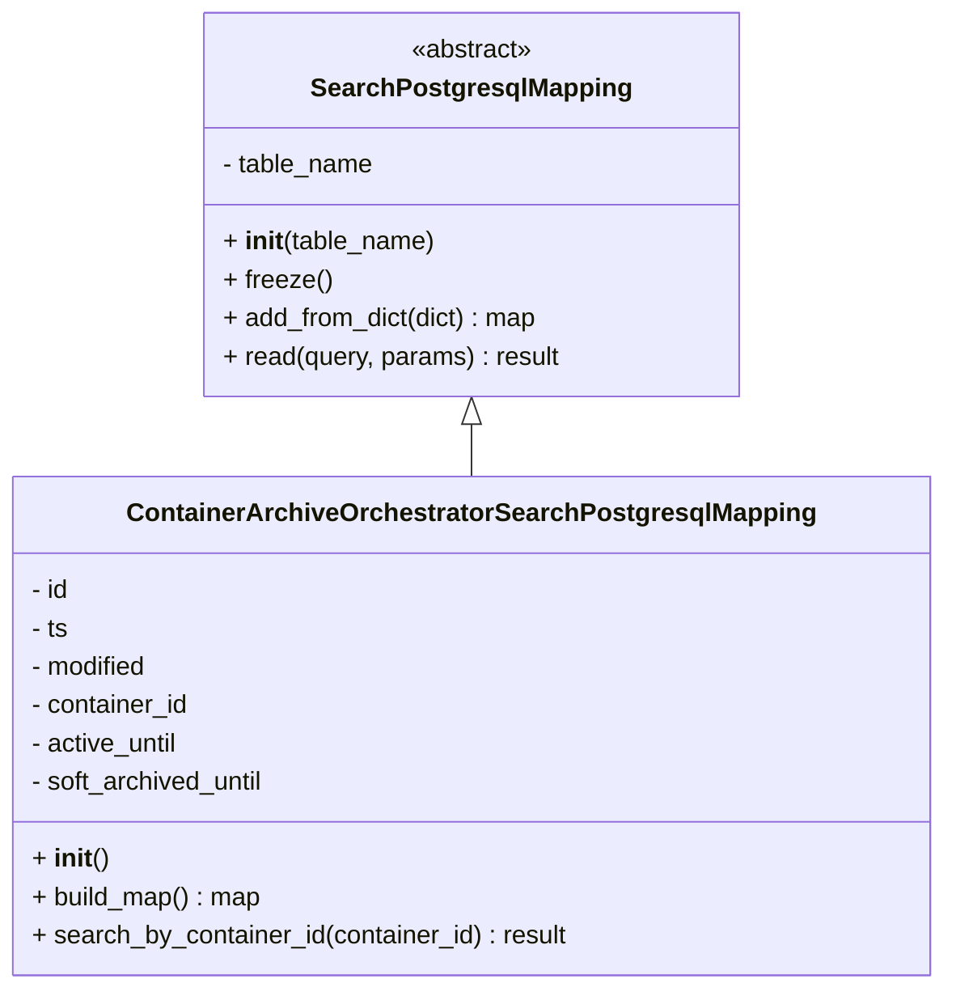

# Diagram: partview_core/partview_service/partview_service/persistence/sql/postgresql/ContainerArchiveOrchestratorSearchPostgresqlMapping.py

> Auto-generated by Obscura crawlers

## Mermaid

### SVG

<svg id="container" width="581.84375" xmlns="http://www.w3.org/2000/svg" class="classDiagram" height="618" viewBox="0 0 581.84375 618" role="graphics-document document" aria-roledescription="class"><g><defs><marker id="container_class-aggregationStart" class="marker aggregation class" refX="18" refY="7" markerWidth="190" markerHeight="240" orient="auto"><path d="M 18,7 L9,13 L1,7 L9,1 Z"></path></marker></defs><defs><marker id="container_class-aggregationEnd" class="marker aggregation class" refX="1" refY="7" markerWidth="20" markerHeight="28" orient="auto"><path d="M 18,7 L9,13 L1,7 L9,1 Z"></path></marker></defs><defs><marker id="container_class-extensionStart" class="marker extension class" refX="18" refY="7" markerWidth="190" markerHeight="240" orient="auto"><path d="M 1,7 L18,13 V 1 Z"></path></marker></defs><defs><marker id="container_class-extensionEnd" class="marker extension class" refX="1" refY="7" markerWidth="20" markerHeight="28" orient="auto"><path d="M 1,1 V 13 L18,7 Z"></path></marker></defs><defs><marker id="container_class-compositionStart" class="marker composition class" refX="18" refY="7" markerWidth="190" markerHeight="240" orient="auto"><path d="M 18,7 L9,13 L1,7 L9,1 Z"></path></marker></defs><defs><marker id="container_class-compositionEnd" class="marker composition class" refX="1" refY="7" markerWidth="20" markerHeight="28" orient="auto"><path d="M 18,7 L9,13 L1,7 L9,1 Z"></path></marker></defs><defs><marker id="container_class-dependencyStart" class="marker dependency class" refX="6" refY="7" markerWidth="190" markerHeight="240" orient="auto"><path d="M 5,7 L9,13 L1,7 L9,1 Z"></path></marker></defs><defs><marker id="container_class-dependencyEnd" class="marker dependency class" refX="13" refY="7" markerWidth="20" markerHeight="28" orient="auto"><path d="M 18,7 L9,13 L14,7 L9,1 Z"></path></marker></defs><defs><marker id="container_class-lollipopStart" class="marker lollipop class" refX="13" refY="7" markerWidth="190" markerHeight="240" orient="auto"><circle stroke="black" fill="transparent" cx="7" cy="7" r="6"></circle></marker></defs><defs><marker id="container_class-lollipopEnd" class="marker lollipop class" refX="1" refY="7" markerWidth="190" markerHeight="240" orient="auto"><circle stroke="black" fill="transparent" cx="7" cy="7" r="6"></circle></marker></defs><g class="root"><g class="clusters"></g><g class="edgePaths"><path d="M290.922,265.25L290.922,266.542C290.922,267.833,290.922,270.417,290.922,275.875C290.922,281.333,290.922,289.667,290.922,293.833L290.922,298" id="id_SearchPostgresqlMapping_ContainerArchiveOrchestratorSearchPostgresqlMapping_1" class="edge-thickness-normal edge-pattern-solid relation" style=";;;" data-edge="true" data-et="edge" data-id="id_SearchPostgresqlMapping_ContainerArchiveOrchestratorSearchPostgresqlMapping_1" data-points="W3sieCI6MjkwLjkyMTg3NSwieSI6MjQ4fSx7IngiOjI5MC45MjE4NzUsInkiOjI3M30seyJ4IjoyOTAuOTIxODc1LCJ5IjoyOTh9XQ==" marker-start="url(#container_class-extensionStart)"></path></g><g class="edgeLabels"><g class="edgeLabel"><g class="label" data-id="id_SearchPostgresqlMapping_ContainerArchiveOrchestratorSearchPostgresqlMapping_1" transform="translate(0, 0)"><foreignObject width="0" height="0">

</foreignObject></g></g></g><g class="nodes"><g class="node default" id="classId-SearchPostgresqlMapping-0" transform="translate(290.921875, 128)"><g class="basic label-container"><path d="M-165.43359375 -120 L165.43359375 -120 L165.43359375 120 L-165.43359375 120" stroke="none" stroke-width="0" fill="#ECECFF" style=""></path><path d="M-165.43359375 -120 C-55.22598790715365 -120, 54.9816179356927 -120, 165.43359375 -120 M-165.43359375 -120 C-42.19525118829969 -120, 81.04309137340061 -120, 165.43359375 -120 M165.43359375 -120 C165.43359375 -56.88856997818177, 165.43359375 6.222860043636459, 165.43359375 120 M165.43359375 -120 C165.43359375 -48.12202415111071, 165.43359375 23.755951697778585, 165.43359375 120 M165.43359375 120 C81.84261834702221 120, -1.74835705595558 120, -165.43359375 120 M165.43359375 120 C83.93205560495284 120, 2.4305174599056727 120, -165.43359375 120 M-165.43359375 120 C-165.43359375 33.381938371778844, -165.43359375 -53.23612325644231, -165.43359375 -120 M-165.43359375 120 C-165.43359375 57.0905510379455, -165.43359375 -5.818897924108995, -165.43359375 -120" stroke="#9370DB" stroke-width="1.3" fill="none" stroke-dasharray="0 0" style=""></path></g><g class="annotation-group text" transform="translate(-38.609375, -96)"><g class="label" style="" transform="translate(0,-12)"><foreignObject width="77.21875" height="24">

«abstract»

</foreignObject></g></g><g class="label-group text" transform="translate(-95.1171875, -72)"><g class="label" style="font-weight: bolder" transform="translate(0,-12)"><foreignObject width="190.234375" height="24">

SearchPostgresqlMapping

</foreignObject></g></g><g class="members-group text" transform="translate(-153.43359375, -24)"><g class="label" style="" transform="translate(0,-12)"><foreignObject width="96.40625" height="24">

- table_name

</foreignObject></g></g><g class="methods-group text" transform="translate(-153.43359375, 24)"><g class="label" style="" transform="translate(0,-12)"><foreignObject width="132.765625" height="24">

+ <strong>init</strong>(table_name)

</foreignObject></g><g class="label" style="" transform="translate(0,12)"><foreignObject width="66.578125" height="24">

+ freeze()

</foreignObject></g><g class="label" style="" transform="translate(0,36)"><foreignObject width="199.796875" height="24">

+ add_from_dict(dict) : map

</foreignObject></g><g class="label" style="" transform="translate(0,60)"><foreignObject width="211.75" height="24">

+ read(query, params) : result

</foreignObject></g></g><g class="divider" style=""><path d="M-165.43359375 -48 C-89.3020810390675 -48, -13.170568328135005 -48, 165.43359375 -48 M-165.43359375 -48 C-90.33029426051294 -48, -15.226994771025886 -48, 165.43359375 -48" stroke="#9370DB" stroke-width="1.3" fill="none" stroke-dasharray="0 0" style=""></path></g><g class="divider" style=""><path d="M-165.43359375 0 C-42.242186518615 0, 80.94922071277 0, 165.43359375 0 M-165.43359375 0 C-61.280596855199846 0, 42.87240003960031 0, 165.43359375 0" stroke="#9370DB" stroke-width="1.3" fill="none" stroke-dasharray="0 0" style=""></path></g></g><g class="node default" id="classId-ContainerArchiveOrchestratorSearchPostgresqlMapping-1" transform="translate(290.921875, 454)"><g class="basic label-container"><path d="M-282.921875 -156 L282.921875 -156 L282.921875 156 L-282.921875 156" stroke="none" stroke-width="0" fill="#ECECFF" style=""></path><path d="M-282.921875 -156 C-103.65011586733249 -156, 75.62164326533502 -156, 282.921875 -156 M-282.921875 -156 C-136.06095910399173 -156, 10.79995679201653 -156, 282.921875 -156 M282.921875 -156 C282.921875 -35.49217272464659, 282.921875 85.01565455070681, 282.921875 156 M282.921875 -156 C282.921875 -67.42342789533677, 282.921875 21.153144209326456, 282.921875 156 M282.921875 156 C100.81680970512207 156, -81.28825558975586 156, -282.921875 156 M282.921875 156 C146.63344284970384 156, 10.34501069940768 156, -282.921875 156 M-282.921875 156 C-282.921875 38.49253896029546, -282.921875 -79.01492207940908, -282.921875 -156 M-282.921875 156 C-282.921875 84.53061350016858, -282.921875 13.061227000337169, -282.921875 -156" stroke="#9370DB" stroke-width="1.3" fill="none" stroke-dasharray="0 0" style=""></path></g><g class="annotation-group text" transform="translate(0, -132)"></g><g class="label-group text" transform="translate(-204.015625, -132)"><g class="label" style="font-weight: bolder" transform="translate(0,-12)"><foreignObject width="408.03125" height="24">

ContainerArchiveOrchestratorSearchPostgresqlMapping

</foreignObject></g></g><g class="members-group text" transform="translate(-270.921875, -84)"><g class="label" style="" transform="translate(0,-12)"><foreignObject width="24.78125" height="24">

- id

</foreignObject></g><g class="label" style="" transform="translate(0,12)"><foreignObject width="23.9375" height="24">

- ts

</foreignObject></g><g class="label" style="" transform="translate(0,36)"><foreignObject width="75.3125" height="24">

- modified

</foreignObject></g><g class="label" style="" transform="translate(0,60)"><foreignObject width="101.015625" height="24">

- container_id

</foreignObject></g><g class="label" style="" transform="translate(0,84)"><foreignObject width="95.203125" height="24">

- active_until

</foreignObject></g><g class="label" style="" transform="translate(0,108)"><foreignObject width="150.34375" height="24">

- soft_archived_until

</foreignObject></g></g><g class="methods-group text" transform="translate(-270.921875, 84)"><g class="label" style="" transform="translate(0,-12)"><foreignObject width="47.046875" height="24">

+ <strong>init</strong>()

</foreignObject></g><g class="label" style="" transform="translate(0,12)"><foreignObject width="144.578125" height="24">

+ build_map() : map

</foreignObject></g><g class="label" style="" transform="translate(0,36)"><foreignObject width="337.828125" height="24">

+ search_by_container_id(container_id) : result

</foreignObject></g></g><g class="divider" style=""><path d="M-282.921875 -108 C-151.54394138897845 -108, -20.166007777956906 -108, 282.921875 -108 M-282.921875 -108 C-84.81422476028936 -108, 113.29342547942127 -108, 282.921875 -108" stroke="#9370DB" stroke-width="1.3" fill="none" stroke-dasharray="0 0" style=""></path></g><g class="divider" style=""><path d="M-282.921875 60 C-161.94221072975645 60, -40.96254645951291 60, 282.921875 60 M-282.921875 60 C-107.6849843293844 60, 67.55190634123119 60, 282.921875 60" stroke="#9370DB" stroke-width="1.3" fill="none" stroke-dasharray="0 0" style=""></path></g></g></g></g></g></svg>
