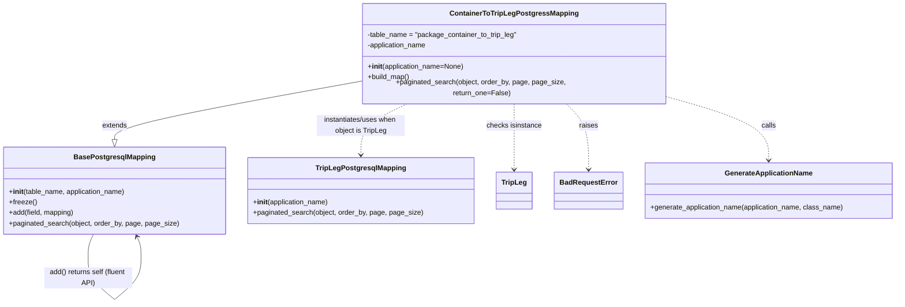

# Diagram: partview_core/partview_service/partview_service/persistence/sql/postgresql/ContainerToTripLegPostgressMapping.py

> Auto-generated by Obscura crawlers

## Mermaid

### SVG

<svg id="container" width="2008.3046875" xmlns="http://www.w3.org/2000/svg" class="classDiagram" height="676.25" viewBox="0 0 2008.3046875 676.25" role="graphics-document document" aria-roledescription="class"><g><defs><marker id="container_class-aggregationStart" class="marker aggregation class" refX="18" refY="7" markerWidth="190" markerHeight="240" orient="auto"><path d="M 18,7 L9,13 L1,7 L9,1 Z"></path></marker></defs><defs><marker id="container_class-aggregationEnd" class="marker aggregation class" refX="1" refY="7" markerWidth="20" markerHeight="28" orient="auto"><path d="M 18,7 L9,13 L1,7 L9,1 Z"></path></marker></defs><defs><marker id="container_class-extensionStart" class="marker extension class" refX="18" refY="7" markerWidth="190" markerHeight="240" orient="auto"><path d="M 1,7 L18,13 V 1 Z"></path></marker></defs><defs><marker id="container_class-extensionEnd" class="marker extension class" refX="1" refY="7" markerWidth="20" markerHeight="28" orient="auto"><path d="M 1,1 V 13 L18,7 Z"></path></marker></defs><defs><marker id="container_class-compositionStart" class="marker composition class" refX="18" refY="7" markerWidth="190" markerHeight="240" orient="auto"><path d="M 18,7 L9,13 L1,7 L9,1 Z"></path></marker></defs><defs><marker id="container_class-compositionEnd" class="marker composition class" refX="1" refY="7" markerWidth="20" markerHeight="28" orient="auto"><path d="M 18,7 L9,13 L1,7 L9,1 Z"></path></marker></defs><defs><marker id="container_class-dependencyStart" class="marker dependency class" refX="6" refY="7" markerWidth="190" markerHeight="240" orient="auto"><path d="M 5,7 L9,13 L1,7 L9,1 Z"></path></marker></defs><defs><marker id="container_class-dependencyEnd" class="marker dependency class" refX="13" refY="7" markerWidth="20" markerHeight="28" orient="auto"><path d="M 18,7 L9,13 L14,7 L9,1 Z"></path></marker></defs><defs><marker id="container_class-lollipopStart" class="marker lollipop class" refX="13" refY="7" markerWidth="190" markerHeight="240" orient="auto"><circle stroke="black" fill="transparent" cx="7" cy="7" r="6"></circle></marker></defs><defs><marker id="container_class-lollipopEnd" class="marker lollipop class" refX="1" refY="7" markerWidth="190" markerHeight="240" orient="auto"><circle stroke="black" fill="transparent" cx="7" cy="7" r="6"></circle></marker></defs><g class="root"><g class="clusters"></g><g class="edgePaths"><path d="M809.719,175.715L717.469,191.929C625.219,208.143,440.719,240.572,348.469,262.077C256.219,283.583,256.219,294.167,256.219,299.458L256.219,304.75" id="id_ContainerToTripLegPostgressMapping_BasePostgresqlMapping_1" class="edge-thickness-normal edge-pattern-solid relation" style=";;;" data-edge="true" data-et="edge" data-id="id_ContainerToTripLegPostgressMapping_BasePostgresqlMapping_1" data-points="W3sieCI6ODA5LjcxODc1LCJ5IjoxNzUuNzE0NTE0MzY1Njc5OH0seyJ4IjoyNTYuMjE4NzUsInkiOjI3M30seyJ4IjoyNTYuMjE4NzUsInkiOjMyMn1d" marker-end="url(#container_class-extensionEnd)"></path><path d="M914.173,224L896.381,232.167C878.589,240.333,843.006,256.667,825.214,276C807.422,295.333,807.422,317.667,807.422,328.833L807.422,340" id="id_ContainerToTripLegPostgressMapping_TripLegPostgresqlMapping_2" class="edge-thickness-normal edge-pattern-dashed relation" style=";;;" data-edge="true" data-et="edge" data-id="id_ContainerToTripLegPostgressMapping_TripLegPostgresqlMapping_2" data-points="W3sieCI6OTE0LjE3MjkxOTk4NDA3NjQsInkiOjIyNH0seyJ4Ijo4MDcuNDIxODc1LCJ5IjoyNzN9LHsieCI6ODA3LjQyMTg3NSwieSI6MzQ2fV0=" marker-end="url(#container_class-dependencyEnd)"></path><path d="M1149.461,224L1149.461,232.167C1149.461,240.333,1149.461,256.667,1149.461,281.5C1149.461,306.333,1149.461,339.667,1149.461,356.333L1149.461,373" id="id_ContainerToTripLegPostgressMapping_TripLeg_3" class="edge-thickness-normal edge-pattern-dashed relation" style=";;;" data-edge="true" data-et="edge" data-id="id_ContainerToTripLegPostgressMapping_TripLeg_3" data-points="W3sieCI6MTE0OS40NjA5Mzc1LCJ5IjoyMjR9LHsieCI6MTE0OS40NjA5Mzc1LCJ5IjoyNzN9LHsieCI6MTE0OS40NjA5Mzc1LCJ5IjozNzl9XQ==" marker-end="url(#container_class-dependencyEnd)"></path><path d="M1261.819,224L1270.316,232.167C1278.812,240.333,1295.804,256.667,1304.301,281.5C1312.797,306.333,1312.797,339.667,1312.797,356.333L1312.797,373" id="id_ContainerToTripLegPostgressMapping_BadRequestError_4" class="edge-thickness-normal edge-pattern-dashed relation" style=";;;" data-edge="true" data-et="edge" data-id="id_ContainerToTripLegPostgressMapping_BadRequestError_4" data-points="W3sieCI6MTI2MS44MTk0MTY3OTkzNjMxLCJ5IjoyMjR9LHsieCI6MTMxMi43OTY4NzUsInkiOjI3M30seyJ4IjoxMzEyLjc5Njg3NSwieSI6Mzc5fV0=" marker-end="url(#container_class-dependencyEnd)"></path><path d="M1489.203,209.705L1527.451,220.254C1565.699,230.803,1642.195,251.902,1680.443,275.617C1718.691,299.333,1718.691,325.667,1718.691,338.833L1718.691,352" id="id_ContainerToTripLegPostgressMapping_GenerateApplicationName_5" class="edge-thickness-normal edge-pattern-dashed relation" style=";;;" data-edge="true" data-et="edge" data-id="id_ContainerToTripLegPostgressMapping_GenerateApplicationName_5" data-points="W3sieCI6MTQ4OS4yMDMxMjUsInkiOjIwOS43MDQ2MTc2NjUwMjJ9LHsieCI6MTcxOC42OTE0MDYyNSwieSI6MjczfSx7IngiOjE3MTguNjkxNDA2MjUsInkiOjM1OH1d" marker-end="url(#container_class-dependencyEnd)"></path><path d="M208.316,520L206.299,524.167C204.283,528.333,200.251,536.667,198.235,545C196.219,553.333,196.219,561.667,196.219,565.833L196.219,570" id="BasePostgresqlMapping-cyclic-special-1" class="edge-thickness-normal edge-pattern-solid relation" style=";;;" data-edge="true" data-et="edge" data-id="BasePostgresqlMapping-cyclic-special-1" data-points="W3sieCI6MjA4LjMxNTUyNDE5MzU0ODM4LCJ5Ijo1MjB9LHsieCI6MTk2LjIxODc1LCJ5Ijo1NDV9LHsieCI6MTk2LjIxODc1LCJ5Ijo1NzB9XQ=="></path><path d="M196.219,570.1L196.219,578.267C196.219,586.433,196.219,602.767,206.21,619.102C216.202,635.436,236.185,651.773,246.177,659.941L256.169,668.109" id="BasePostgresqlMapping-cyclic-special-mid" class="edge-thickness-normal edge-pattern-solid relation" style=";;;" data-edge="true" data-et="edge" data-id="BasePostgresqlMapping-cyclic-special-mid" data-points="W3sieCI6MTk2LjIxODc1LCJ5Ijo1NzAuMTAwMDAwMDAxNDkwMX0seyJ4IjoxOTYuMjE4NzUsInkiOjYxOS4xMDAwMDAwMDE0OTAxfSx7IngiOjI1Ni4xNjg3NDk5OTkyNTQ5NCwieSI6NjY4LjEwOTEyNTAwMTYyNTR9XQ=="></path><path d="M256.269,668.109L266.26,659.941C276.252,651.773,296.235,635.436,306.227,619.093C316.219,602.75,316.219,586.4,316.219,574.05C316.219,561.7,316.219,553.35,314.638,545.908C313.058,538.467,309.896,531.934,308.316,528.667L306.735,525.401" id="BasePostgresqlMapping-cyclic-special-2" class="edge-thickness-normal edge-pattern-solid relation" style=";;;" data-edge="true" data-et="edge" data-id="BasePostgresqlMapping-cyclic-special-2" data-points="W3sieCI6MjU2LjI2ODc1MDAwMDc0NTA2LCJ5Ijo2NjguMTA5MTI1MDAxNjI1NH0seyJ4IjozMTYuMjE4NzUsInkiOjYxOS4xMDAwMDAwMDE0OTAxfSx7IngiOjMxNi4yMTg3NSwieSI6NTcwLjA1MDAwMDAwMDc0NTF9LHsieCI6MzE2LjIxODc1LCJ5Ijo1NDV9LHsieCI6MzA0LjEyMTk3NTgwNjQ1MTYsInkiOjUyMH1d" marker-end="url(#container_class-dependencyEnd)"></path></g><g class="edgeLabels"><g class="edgeLabel" transform="translate(256.21875, 273)"><g class="label" data-id="id_ContainerToTripLegPostgressMapping_BasePostgresqlMapping_1" transform="translate(-28.5078125, -12)"><foreignObject width="57.015625" height="24">

extends

</foreignObject></g></g><g class="edgeLabel" transform="translate(807.421875, 273)"><g class="label" data-id="id_ContainerToTripLegPostgressMapping_TripLegPostgresqlMapping_2" transform="translate(-100, -24)"><foreignObject width="200" height="48">

instantiates/uses when object is TripLeg

</foreignObject></g></g><g class="edgeLabel" transform="translate(1149.4609375, 273)"><g class="label" data-id="id_ContainerToTripLegPostgressMapping_TripLeg_3" transform="translate(-63.1796875, -12)"><foreignObject width="126.359375" height="24">

checks isinstance

</foreignObject></g></g><g class="edgeLabel" transform="translate(1312.796875, 273)"><g class="label" data-id="id_ContainerToTripLegPostgressMapping_BadRequestError_4" transform="translate(-21.25, -12)"><foreignObject width="42.5" height="24">

raises

</foreignObject></g></g><g class="edgeLabel" transform="translate(1718.69140625, 273)"><g class="label" data-id="id_ContainerToTripLegPostgressMapping_GenerateApplicationName_5" transform="translate(-16.4453125, -12)"><foreignObject width="32.890625" height="24">

calls

</foreignObject></g></g><g class="edgeLabel"><g class="label" data-id="BasePostgresqlMapping-cyclic-special-1" transform="translate(0, 0)"><foreignObject width="0" height="0">

</foreignObject></g></g><g class="edgeLabel" transform="translate(196.21875, 619.1000000014901)"><g class="label" data-id="BasePostgresqlMapping-cyclic-special-mid" transform="translate(-100, -24)"><foreignObject width="200" height="48">

add() returns self (fluent API)

</foreignObject></g></g><g class="edgeLabel"><g class="label" data-id="BasePostgresqlMapping-cyclic-special-2" transform="translate(0, 0)"><foreignObject width="0" height="0">

</foreignObject></g></g></g><g class="nodes"><g class="node default" id="classId-BasePostgresqlMapping-0" transform="translate(256.21875, 421)"><g class="basic label-container"><path d="M-248.21875 -99 L248.21875 -99 L248.21875 99 L-248.21875 99" stroke="none" stroke-width="0" fill="#ECECFF" style=""></path><path d="M-248.21875 -99 C-78.16903683130607 -99, 91.88067633738785 -99, 248.21875 -99 M-248.21875 -99 C-81.79362536716096 -99, 84.63149926567809 -99, 248.21875 -99 M248.21875 -99 C248.21875 -30.898527077368712, 248.21875 37.202945845262576, 248.21875 99 M248.21875 -99 C248.21875 -21.73073504287146, 248.21875 55.53852991425708, 248.21875 99 M248.21875 99 C142.7317320405327 99, 37.24471408106541 99, -248.21875 99 M248.21875 99 C101.1982338712113 99, -45.8222822575774 99, -248.21875 99 M-248.21875 99 C-248.21875 48.836715671112756, -248.21875 -1.3265686577744873, -248.21875 -99 M-248.21875 99 C-248.21875 20.581394141660383, -248.21875 -57.837211716679235, -248.21875 -99" stroke="#9370DB" stroke-width="1.3" fill="none" stroke-dasharray="0 0" style=""></path></g><g class="annotation-group text" transform="translate(0, -75)"></g><g class="label-group text" transform="translate(-87.921875, -75)"><g class="label" style="font-weight: bolder" transform="translate(0,-12)"><foreignObject width="175.84375" height="24">

BasePostgresqlMapping

</foreignObject></g></g><g class="members-group text" transform="translate(-236.21875, -27)"></g><g class="methods-group text" transform="translate(-236.21875, 3)"><g class="label" style="" transform="translate(0,-12)"><foreignObject width="267.375" height="24">

+<strong>init</strong>(table_name, application_name)

</foreignObject></g><g class="label" style="" transform="translate(0,12)"><foreignObject width="62.109375" height="24">

+freeze()

</foreignObject></g><g class="label" style="" transform="translate(0,36)"><foreignObject width="149.765625" height="24">

+add(field, mapping)

</foreignObject></g><g class="label" style="" transform="translate(0,60)"><foreignObject width="384.515625" height="24">

+paginated_search(object, order_by, page, page_size)

</foreignObject></g></g><g class="divider" style=""><path d="M-248.21875 -51 C-106.04358066259957 -51, 36.13158867480087 -51, 248.21875 -51 M-248.21875 -51 C-114.88393046578534 -51, 18.45088906842932 -51, 248.21875 -51" stroke="#9370DB" stroke-width="1.3" fill="none" stroke-dasharray="0 0" style=""></path></g><g class="divider" style=""><path d="M-248.21875 -27 C-67.76017264320899 -27, 112.69840471358202 -27, 248.21875 -27 M-248.21875 -27 C-80.10156872000047 -27, 88.01561255999906 -27, 248.21875 -27" stroke="#9370DB" stroke-width="1.3" fill="none" stroke-dasharray="0 0" style=""></path></g></g><g class="node default" id="classId-ContainerToTripLegPostgressMapping-1" transform="translate(1149.4609375, 116)"><g class="basic label-container"><path d="M-339.7421875 -108 L339.7421875 -108 L339.7421875 108 L-339.7421875 108" stroke="none" stroke-width="0" fill="#ECECFF" style=""></path><path d="M-339.7421875 -108 C-94.10428458123926 -108, 151.5336183375215 -108, 339.7421875 -108 M-339.7421875 -108 C-84.61361055038796 -108, 170.51496639922408 -108, 339.7421875 -108 M339.7421875 -108 C339.7421875 -41.69034244784444, 339.7421875 24.619315104311113, 339.7421875 108 M339.7421875 -108 C339.7421875 -48.69954811998007, 339.7421875 10.600903760039856, 339.7421875 108 M339.7421875 108 C132.92826192799484 108, -73.88566364401032 108, -339.7421875 108 M339.7421875 108 C158.82630382064525 108, -22.0895798587095 108, -339.7421875 108 M-339.7421875 108 C-339.7421875 24.61776483315836, -339.7421875 -58.76447033368328, -339.7421875 -108 M-339.7421875 108 C-339.7421875 62.52719557572372, -339.7421875 17.054391151447433, -339.7421875 -108" stroke="#9370DB" stroke-width="1.3" fill="none" stroke-dasharray="0 0" style=""></path></g><g class="annotation-group text" transform="translate(0, -84)"></g><g class="label-group text" transform="translate(-138.234375, -84)"><g class="label" style="font-weight: bolder" transform="translate(0,-12)"><foreignObject width="276.46875" height="24">

ContainerToTripLegPostgressMapping

</foreignObject></g></g><g class="members-group text" transform="translate(-327.7421875, -36)"><g class="label" style="" transform="translate(0,-12)"><foreignObject width="341.921875" height="24">

-table_name = "package_container_to_trip_leg"

</foreignObject></g><g class="label" style="" transform="translate(0,12)"><foreignObject width="137.15625" height="24">

-application_name

</foreignObject></g></g><g class="methods-group text" transform="translate(-327.7421875, 36)"><g class="label" style="" transform="translate(0,-12)"><foreignObject width="220.109375" height="24">

+<strong>init</strong>(application_name=None)

</foreignObject></g><g class="label" style="" transform="translate(0,12)"><foreignObject width="96.109375" height="24">

+build_map()

</foreignObject></g><g class="label" style="" transform="translate(0,36)"><foreignObject width="517.25" height="24">

+paginated_search(object, order_by, page, page_size, return_one=False)

</foreignObject></g></g><g class="divider" style=""><path d="M-339.7421875 -60 C-130.68326837293458 -60, 78.37565075413085 -60, 339.7421875 -60 M-339.7421875 -60 C-125.11594317831833 -60, 89.51030114336334 -60, 339.7421875 -60" stroke="#9370DB" stroke-width="1.3" fill="none" stroke-dasharray="0 0" style=""></path></g><g class="divider" style=""><path d="M-339.7421875 12 C-168.14529418785108 12, 3.451599124297843 12, 339.7421875 12 M-339.7421875 12 C-201.1575498544051 12, -62.57291220881018 12, 339.7421875 12" stroke="#9370DB" stroke-width="1.3" fill="none" stroke-dasharray="0 0" style=""></path></g></g><g class="node default" id="classId-TripLegPostgresqlMapping-2" transform="translate(807.421875, 421)"><g class="basic label-container"><path d="M-252.984375 -75 L252.984375 -75 L252.984375 75 L-252.984375 75" stroke="none" stroke-width="0" fill="#ECECFF" style=""></path><path d="M-252.984375 -75 C-120.72123239029202 -75, 11.541910219415968 -75, 252.984375 -75 M-252.984375 -75 C-127.12256613861035 -75, -1.260757277220705 -75, 252.984375 -75 M252.984375 -75 C252.984375 -16.3115887110351, 252.984375 42.3768225779298, 252.984375 75 M252.984375 -75 C252.984375 -25.58530734197854, 252.984375 23.829385316042917, 252.984375 75 M252.984375 75 C112.78531206229212 75, -27.413750875415758 75, -252.984375 75 M252.984375 75 C74.0752464374323 75, -104.8338821251354 75, -252.984375 75 M-252.984375 75 C-252.984375 39.14060763637002, -252.984375 3.2812152727400417, -252.984375 -75 M-252.984375 75 C-252.984375 26.98695470741348, -252.984375 -21.026090585173037, -252.984375 -75" stroke="#9370DB" stroke-width="1.3" fill="none" stroke-dasharray="0 0" style=""></path></g><g class="annotation-group text" transform="translate(0, -51)"></g><g class="label-group text" transform="translate(-97.453125, -51)"><g class="label" style="font-weight: bolder" transform="translate(0,-12)"><foreignObject width="194.90625" height="24">

TripLegPostgresqlMapping

</foreignObject></g></g><g class="members-group text" transform="translate(-240.984375, -3)"></g><g class="methods-group text" transform="translate(-240.984375, 27)"><g class="label" style="" transform="translate(0,-12)"><foreignObject width="173.734375" height="24">

+<strong>init</strong>(application_name)

</foreignObject></g><g class="label" style="" transform="translate(0,12)"><foreignObject width="384.515625" height="24">

+paginated_search(object, order_by, page, page_size)

</foreignObject></g></g><g class="divider" style=""><path d="M-252.984375 -27 C-88.0267441057249 -27, 76.9308867885502 -27, 252.984375 -27 M-252.984375 -27 C-89.09478478289515 -27, 74.7948054342097 -27, 252.984375 -27" stroke="#9370DB" stroke-width="1.3" fill="none" stroke-dasharray="0 0" style=""></path></g><g class="divider" style=""><path d="M-252.984375 -3 C-108.76415651020952 -3, 35.456061979580966 -3, 252.984375 -3 M-252.984375 -3 C-54.69955205000312 -3, 143.58527089999376 -3, 252.984375 -3" stroke="#9370DB" stroke-width="1.3" fill="none" stroke-dasharray="0 0" style=""></path></g></g><g class="node default" id="classId-TripLeg-3" transform="translate(1149.4609375, 421)"><g class="basic label-container"><path d="M-39.0546875 -42 L39.0546875 -42 L39.0546875 42 L-39.0546875 42" stroke="none" stroke-width="0" fill="#ECECFF" style=""></path><path d="M-39.0546875 -42 C-13.930814850333455 -42, 11.19305779933309 -42, 39.0546875 -42 M-39.0546875 -42 C-23.21707338820147 -42, -7.379459276402937 -42, 39.0546875 -42 M39.0546875 -42 C39.0546875 -21.104130636633784, 39.0546875 -0.20826127326756705, 39.0546875 42 M39.0546875 -42 C39.0546875 -10.23382965487145, 39.0546875 21.5323406902571, 39.0546875 42 M39.0546875 42 C22.92985334106396 42, 6.805019182127921 42, -39.0546875 42 M39.0546875 42 C9.070523350735737 42, -20.913640798528526 42, -39.0546875 42 M-39.0546875 42 C-39.0546875 21.707349705002635, -39.0546875 1.4146994100052694, -39.0546875 -42 M-39.0546875 42 C-39.0546875 13.241579674143892, -39.0546875 -15.516840651712215, -39.0546875 -42" stroke="#9370DB" stroke-width="1.3" fill="none" stroke-dasharray="0 0" style=""></path></g><g class="annotation-group text" transform="translate(0, -18)"></g><g class="label-group text" transform="translate(-27.0546875, -18)"><g class="label" style="font-weight: bolder" transform="translate(0,-12)"><foreignObject width="54.109375" height="24">

TripLeg

</foreignObject></g></g><g class="members-group text" transform="translate(-27.0546875, 30)"></g><g class="methods-group text" transform="translate(-27.0546875, 60)"></g><g class="divider" style=""><path d="M-39.0546875 6 C-19.725014252818884 6, -0.39534100563776775 6, 39.0546875 6 M-39.0546875 6 C-21.87115342116602 6, -4.687619342332042 6, 39.0546875 6" stroke="#9370DB" stroke-width="1.3" fill="none" stroke-dasharray="0 0" style=""></path></g><g class="divider" style=""><path d="M-39.0546875 24 C-20.361735336260942 24, -1.6687831725218842 24, 39.0546875 24 M-39.0546875 24 C-13.995282177161506 24, 11.064123145676987 24, 39.0546875 24" stroke="#9370DB" stroke-width="1.3" fill="none" stroke-dasharray="0 0" style=""></path></g></g><g class="node default" id="classId-BadRequestError-4" transform="translate(1312.796875, 421)"><g class="basic label-container"><path d="M-74.28125 -42 L74.28125 -42 L74.28125 42 L-74.28125 42" stroke="none" stroke-width="0" fill="#ECECFF" style=""></path><path d="M-74.28125 -42 C-23.651205815372343 -42, 26.978838369255314 -42, 74.28125 -42 M-74.28125 -42 C-30.663175040646486 -42, 12.954899918707028 -42, 74.28125 -42 M74.28125 -42 C74.28125 -20.07135839258776, 74.28125 1.8572832148244771, 74.28125 42 M74.28125 -42 C74.28125 -16.196636662671462, 74.28125 9.606726674657075, 74.28125 42 M74.28125 42 C24.31769488643458 42, -25.64586022713084 42, -74.28125 42 M74.28125 42 C41.39291203959875 42, 8.504574079197496 42, -74.28125 42 M-74.28125 42 C-74.28125 8.512958862830587, -74.28125 -24.974082274338826, -74.28125 -42 M-74.28125 42 C-74.28125 13.17178696062328, -74.28125 -15.65642607875344, -74.28125 -42" stroke="#9370DB" stroke-width="1.3" fill="none" stroke-dasharray="0 0" style=""></path></g><g class="annotation-group text" transform="translate(0, -18)"></g><g class="label-group text" transform="translate(-62.28125, -18)"><g class="label" style="font-weight: bolder" transform="translate(0,-12)"><foreignObject width="124.5625" height="24">

BadRequestError

</foreignObject></g></g><g class="members-group text" transform="translate(-62.28125, 30)"></g><g class="methods-group text" transform="translate(-62.28125, 60)"></g><g class="divider" style=""><path d="M-74.28125 6 C-26.272684323529433 6, 21.735881352941135 6, 74.28125 6 M-74.28125 6 C-15.776286575994327 6, 42.72867684801135 6, 74.28125 6" stroke="#9370DB" stroke-width="1.3" fill="none" stroke-dasharray="0 0" style=""></path></g><g class="divider" style=""><path d="M-74.28125 24 C-36.418943166694696 24, 1.4433636666106082 24, 74.28125 24 M-74.28125 24 C-23.641976019002627 24, 26.997297961994747 24, 74.28125 24" stroke="#9370DB" stroke-width="1.3" fill="none" stroke-dasharray="0 0" style=""></path></g></g><g class="node default" id="classId-GenerateApplicationName-5" transform="translate(1718.69140625, 421)"><g class="basic label-container"><path d="M-281.61328125 -63 L281.61328125 -63 L281.61328125 63 L-281.61328125 63" stroke="none" stroke-width="0" fill="#ECECFF" style=""></path><path d="M-281.61328125 -63 C-166.88366795655324 -63, -52.15405466310648 -63, 281.61328125 -63 M-281.61328125 -63 C-141.00014026911745 -63, -0.3869992882349038 -63, 281.61328125 -63 M281.61328125 -63 C281.61328125 -27.21608690332642, 281.61328125 8.567826193347159, 281.61328125 63 M281.61328125 -63 C281.61328125 -27.95347987783569, 281.61328125 7.09304024432862, 281.61328125 63 M281.61328125 63 C89.74585686257893 63, -102.12156752484213 63, -281.61328125 63 M281.61328125 63 C124.45818933505231 63, -32.69690257989538 63, -281.61328125 63 M-281.61328125 63 C-281.61328125 30.20759638445991, -281.61328125 -2.584807231080177, -281.61328125 -63 M-281.61328125 63 C-281.61328125 14.354957111247892, -281.61328125 -34.29008577750422, -281.61328125 -63" stroke="#9370DB" stroke-width="1.3" fill="none" stroke-dasharray="0 0" style=""></path></g><g class="annotation-group text" transform="translate(0, -39)"></g><g class="label-group text" transform="translate(-95.8203125, -39)"><g class="label" style="font-weight: bolder" transform="translate(0,-12)"><foreignObject width="191.640625" height="24">

GenerateApplicationName

</foreignObject></g></g><g class="members-group text" transform="translate(-269.61328125, 9)"></g><g class="methods-group text" transform="translate(-269.61328125, 39)"><g class="label" style="" transform="translate(0,-12)"><foreignObject width="443.40625" height="24">

+generate_application_name(application_name, class_name)

</foreignObject></g></g><g class="divider" style=""><path d="M-281.61328125 -15 C-64.02779550422605 -15, 153.5576902415479 -15, 281.61328125 -15 M-281.61328125 -15 C-86.80682279771884 -15, 107.99963565456233 -15, 281.61328125 -15" stroke="#9370DB" stroke-width="1.3" fill="none" stroke-dasharray="0 0" style=""></path></g><g class="divider" style=""><path d="M-281.61328125 9 C-85.13916581092093 9, 111.33494962815814 9, 281.61328125 9 M-281.61328125 9 C-117.35104999062429 9, 46.91118126875142 9, 281.61328125 9" stroke="#9370DB" stroke-width="1.3" fill="none" stroke-dasharray="0 0" style=""></path></g></g><g class="label edgeLabel" id="BasePostgresqlMapping---BasePostgresqlMapping---1" transform="translate(196.21875, 570.0500000007451)"><rect width="0.1" height="0.1"></rect><g class="label" style="" transform="translate(0, 0)"><rect></rect><foreignObject width="0" height="0">

</foreignObject></g></g><g class="label edgeLabel" id="BasePostgresqlMapping---BasePostgresqlMapping---2" transform="translate(256.21875, 668.1500000022352)"><rect width="0.1" height="0.1"></rect><g class="label" style="" transform="translate(0, 0)"><rect></rect><foreignObject width="0" height="0">

</foreignObject></g></g></g></g></g></svg>
