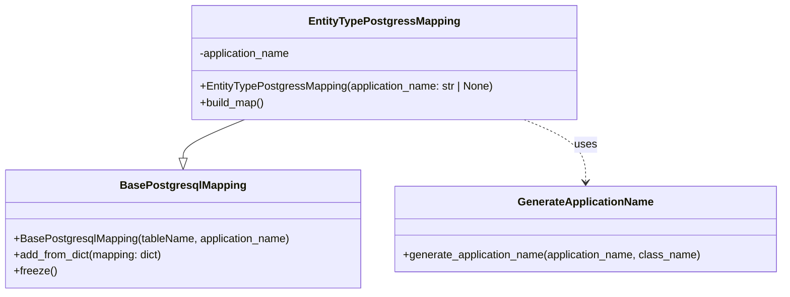

# Diagram: partview_core/partview_service/partview_service/persistence/sql/postgresql/EntityTypePostgressMapping.py

> Auto-generated by Obscura crawlers

## Mermaid

### SVG

<svg id="container" width="1150.1015625" xmlns="http://www.w3.org/2000/svg" class="classDiagram" height="432" viewBox="0 0 1150.1015625 432" role="graphics-document document" aria-roledescription="class"><g><defs><marker id="container_class-aggregationStart" class="marker aggregation class" refX="18" refY="7" markerWidth="190" markerHeight="240" orient="auto"><path d="M 18,7 L9,13 L1,7 L9,1 Z"></path></marker></defs><defs><marker id="container_class-aggregationEnd" class="marker aggregation class" refX="1" refY="7" markerWidth="20" markerHeight="28" orient="auto"><path d="M 18,7 L9,13 L1,7 L9,1 Z"></path></marker></defs><defs><marker id="container_class-extensionStart" class="marker extension class" refX="18" refY="7" markerWidth="190" markerHeight="240" orient="auto"><path d="M 1,7 L18,13 V 1 Z"></path></marker></defs><defs><marker id="container_class-extensionEnd" class="marker extension class" refX="1" refY="7" markerWidth="20" markerHeight="28" orient="auto"><path d="M 1,1 V 13 L18,7 Z"></path></marker></defs><defs><marker id="container_class-compositionStart" class="marker composition class" refX="18" refY="7" markerWidth="190" markerHeight="240" orient="auto"><path d="M 18,7 L9,13 L1,7 L9,1 Z"></path></marker></defs><defs><marker id="container_class-compositionEnd" class="marker composition class" refX="1" refY="7" markerWidth="20" markerHeight="28" orient="auto"><path d="M 18,7 L9,13 L1,7 L9,1 Z"></path></marker></defs><defs><marker id="container_class-dependencyStart" class="marker dependency class" refX="6" refY="7" markerWidth="190" markerHeight="240" orient="auto"><path d="M 5,7 L9,13 L1,7 L9,1 Z"></path></marker></defs><defs><marker id="container_class-dependencyEnd" class="marker dependency class" refX="13" refY="7" markerWidth="20" markerHeight="28" orient="auto"><path d="M 18,7 L9,13 L14,7 L9,1 Z"></path></marker></defs><defs><marker id="container_class-lollipopStart" class="marker lollipop class" refX="13" refY="7" markerWidth="190" markerHeight="240" orient="auto"><circle stroke="black" fill="transparent" cx="7" cy="7" r="6"></circle></marker></defs><defs><marker id="container_class-lollipopEnd" class="marker lollipop class" refX="1" refY="7" markerWidth="190" markerHeight="240" orient="auto"><circle stroke="black" fill="transparent" cx="7" cy="7" r="6"></circle></marker></defs><g class="root"><g class="clusters"></g><g class="edgePaths"><path d="M358.958,176L343.871,182.167C328.784,188.333,298.611,200.667,283.524,210.125C268.438,219.583,268.438,226.167,268.438,229.458L268.438,232.75" id="id_EntityTypePostgressMapping_BasePostgresqlMapping_1" class="edge-thickness-normal edge-pattern-solid relation" style=";;;" data-edge="true" data-et="edge" data-id="id_EntityTypePostgressMapping_BasePostgresqlMapping_1" data-points="W3sieCI6MzU4Ljk1NzY2MDc2OTYyODEsInkiOjE3Nn0seyJ4IjoyNjguNDM3NSwieSI6MjEzfSx7IngiOjI2OC40Mzc1LCJ5IjoyNTB9XQ==" marker-end="url(#container_class-extensionEnd)"></path><path d="M769.968,176L785.055,182.167C800.142,188.333,830.315,200.667,845.402,216C860.488,231.333,860.488,249.667,860.488,258.833L860.488,268" id="id_EntityTypePostgressMapping_GenerateApplicationName_2" class="edge-thickness-normal edge-pattern-dashed relation" style=";;;" data-edge="true" data-et="edge" data-id="id_EntityTypePostgressMapping_GenerateApplicationName_2" data-points="W3sieCI6NzY5Ljk2ODEyMDQ4MDM3MTksInkiOjE3Nn0seyJ4Ijo4NjAuNDg4MjgxMjUsInkiOjIxM30seyJ4Ijo4NjAuNDg4MjgxMjUsInkiOjI3NH1d" marker-end="url(#container_class-dependencyEnd)"></path></g><g class="edgeLabels"><g class="edgeLabel"><g class="label" data-id="id_EntityTypePostgressMapping_BasePostgresqlMapping_1" transform="translate(0, 0)"><foreignObject width="0" height="0">

</foreignObject></g></g><g class="edgeLabel" transform="translate(860.48828125, 213)"><g class="label" data-id="id_EntityTypePostgressMapping_GenerateApplicationName_2" transform="translate(-16.4921875, -12)"><foreignObject width="32.984375" height="24">

uses

</foreignObject></g></g></g><g class="nodes"><g class="node default" id="classId-BasePostgresqlMapping-0" transform="translate(268.4375, 337)"><g class="basic label-container"><path d="M-260.4375 -87 L260.4375 -87 L260.4375 87 L-260.4375 87" stroke="none" stroke-width="0" fill="#ECECFF" style=""></path><path d="M-260.4375 -87 C-111.41260553196457 -87, 37.612288936070854 -87, 260.4375 -87 M-260.4375 -87 C-57.25901588205275 -87, 145.9194682358945 -87, 260.4375 -87 M260.4375 -87 C260.4375 -46.54820898471585, 260.4375 -6.096417969431698, 260.4375 87 M260.4375 -87 C260.4375 -29.168395680072173, 260.4375 28.663208639855654, 260.4375 87 M260.4375 87 C70.36822805421195 87, -119.70104389157609 87, -260.4375 87 M260.4375 87 C152.26786911371616 87, 44.09823822743232 87, -260.4375 87 M-260.4375 87 C-260.4375 28.957014873714698, -260.4375 -29.085970252570604, -260.4375 -87 M-260.4375 87 C-260.4375 20.292196234867774, -260.4375 -46.41560753026445, -260.4375 -87" stroke="#9370DB" stroke-width="1.3" fill="none" stroke-dasharray="0 0" style=""></path></g><g class="annotation-group text" transform="translate(0, -63)"></g><g class="label-group text" transform="translate(-87.921875, -63)"><g class="label" style="font-weight: bolder" transform="translate(0,-12)"><foreignObject width="175.84375" height="24">

BasePostgresqlMapping

</foreignObject></g></g><g class="members-group text" transform="translate(-248.4375, -15)"></g><g class="methods-group text" transform="translate(-248.4375, 15)"><g class="label" style="" transform="translate(0,-12)"><foreignObject width="408.953125" height="24">

+BasePostgresqlMapping(tableName, application_name)

</foreignObject></g><g class="label" style="" transform="translate(0,12)"><foreignObject width="222.796875" height="24">

+add_from_dict(mapping: dict)

</foreignObject></g><g class="label" style="" transform="translate(0,36)"><foreignObject width="62.109375" height="24">

+freeze()

</foreignObject></g></g><g class="divider" style=""><path d="M-260.4375 -39 C-74.0006167441243 -39, 112.4362665117514 -39, 260.4375 -39 M-260.4375 -39 C-61.597934976558435 -39, 137.24163004688313 -39, 260.4375 -39" stroke="#9370DB" stroke-width="1.3" fill="none" stroke-dasharray="0 0" style=""></path></g><g class="divider" style=""><path d="M-260.4375 -15 C-83.00909156939343 -15, 94.41931686121313 -15, 260.4375 -15 M-260.4375 -15 C-137.1362517816529 -15, -13.835003563305776 -15, 260.4375 -15" stroke="#9370DB" stroke-width="1.3" fill="none" stroke-dasharray="0 0" style=""></path></g></g><g class="node default" id="classId-EntityTypePostgressMapping-1" transform="translate(564.462890625, 92)"><g class="basic label-container"><path d="M-283.08203125 -84 L283.08203125 -84 L283.08203125 84 L-283.08203125 84" stroke="none" stroke-width="0" fill="#ECECFF" style=""></path><path d="M-283.08203125 -84 C-72.53782179941834 -84, 138.00638765116332 -84, 283.08203125 -84 M-283.08203125 -84 C-106.0674851291823 -84, 70.9470609916354 -84, 283.08203125 -84 M283.08203125 -84 C283.08203125 -48.681352437485835, 283.08203125 -13.36270487497167, 283.08203125 84 M283.08203125 -84 C283.08203125 -31.611810655272407, 283.08203125 20.776378689455186, 283.08203125 84 M283.08203125 84 C152.69122077882452 84, 22.30041030764903 84, -283.08203125 84 M283.08203125 84 C108.24215315664784 84, -66.59772493670431 84, -283.08203125 84 M-283.08203125 84 C-283.08203125 26.222395307913636, -283.08203125 -31.555209384172727, -283.08203125 -84 M-283.08203125 84 C-283.08203125 22.086449841585143, -283.08203125 -39.827100316829714, -283.08203125 -84" stroke="#9370DB" stroke-width="1.3" fill="none" stroke-dasharray="0 0" style=""></path></g><g class="annotation-group text" transform="translate(0, -60)"></g><g class="label-group text" transform="translate(-105.6484375, -60)"><g class="label" style="font-weight: bolder" transform="translate(0,-12)"><foreignObject width="211.296875" height="24">

EntityTypePostgressMapping

</foreignObject></g></g><g class="members-group text" transform="translate(-271.08203125, -12)"><g class="label" style="" transform="translate(0,-12)"><foreignObject width="137.15625" height="24">

-application_name

</foreignObject></g></g><g class="methods-group text" transform="translate(-271.08203125, 36)"><g class="label" style="" transform="translate(0,-12)"><foreignObject width="436.515625" height="24">

+EntityTypePostgressMapping(application_name: str | None)

</foreignObject></g><g class="label" style="" transform="translate(0,12)"><foreignObject width="96.109375" height="24">

+build_map()

</foreignObject></g></g><g class="divider" style=""><path d="M-283.08203125 -36 C-136.7962578353774 -36, 9.489515579245221 -36, 283.08203125 -36 M-283.08203125 -36 C-147.38010827769114 -36, -11.678185305382272 -36, 283.08203125 -36" stroke="#9370DB" stroke-width="1.3" fill="none" stroke-dasharray="0 0" style=""></path></g><g class="divider" style=""><path d="M-283.08203125 12 C-57.13782313574717 12, 168.80638497850566 12, 283.08203125 12 M-283.08203125 12 C-134.9378352337866 12, 13.206360782426827 12, 283.08203125 12" stroke="#9370DB" stroke-width="1.3" fill="none" stroke-dasharray="0 0" style=""></path></g></g><g class="node default" id="classId-GenerateApplicationName-2" transform="translate(860.48828125, 337)"><g class="basic label-container"><path d="M-281.61328125 -63 L281.61328125 -63 L281.61328125 63 L-281.61328125 63" stroke="none" stroke-width="0" fill="#ECECFF" style=""></path><path d="M-281.61328125 -63 C-91.75198226135174 -63, 98.10931672729652 -63, 281.61328125 -63 M-281.61328125 -63 C-80.42417193886422 -63, 120.76493737227156 -63, 281.61328125 -63 M281.61328125 -63 C281.61328125 -18.789964243476632, 281.61328125 25.420071513046736, 281.61328125 63 M281.61328125 -63 C281.61328125 -22.65417060167769, 281.61328125 17.691658796644617, 281.61328125 63 M281.61328125 63 C64.29698616639536 63, -153.0193089172093 63, -281.61328125 63 M281.61328125 63 C69.34238303680314 63, -142.92851517639372 63, -281.61328125 63 M-281.61328125 63 C-281.61328125 33.02815923470483, -281.61328125 3.0563184694096535, -281.61328125 -63 M-281.61328125 63 C-281.61328125 24.06182382428559, -281.61328125 -14.876352351428821, -281.61328125 -63" stroke="#9370DB" stroke-width="1.3" fill="none" stroke-dasharray="0 0" style=""></path></g><g class="annotation-group text" transform="translate(0, -39)"></g><g class="label-group text" transform="translate(-95.8203125, -39)"><g class="label" style="font-weight: bolder" transform="translate(0,-12)"><foreignObject width="191.640625" height="24">

GenerateApplicationName

</foreignObject></g></g><g class="members-group text" transform="translate(-269.61328125, 9)"></g><g class="methods-group text" transform="translate(-269.61328125, 39)"><g class="label" style="" transform="translate(0,-12)"><foreignObject width="443.40625" height="24">

+generate_application_name(application_name, class_name)

</foreignObject></g></g><g class="divider" style=""><path d="M-281.61328125 -15 C-60.100471768488944 -15, 161.4123377130221 -15, 281.61328125 -15 M-281.61328125 -15 C-125.85944850532076 -15, 29.894384239358487 -15, 281.61328125 -15" stroke="#9370DB" stroke-width="1.3" fill="none" stroke-dasharray="0 0" style=""></path></g><g class="divider" style=""><path d="M-281.61328125 9 C-130.92774319176172 9, 19.75779486647656 9, 281.61328125 9 M-281.61328125 9 C-153.87833163490623 9, -26.143382019812464 9, 281.61328125 9" stroke="#9370DB" stroke-width="1.3" fill="none" stroke-dasharray="0 0" style=""></path></g></g></g></g></g></svg>
