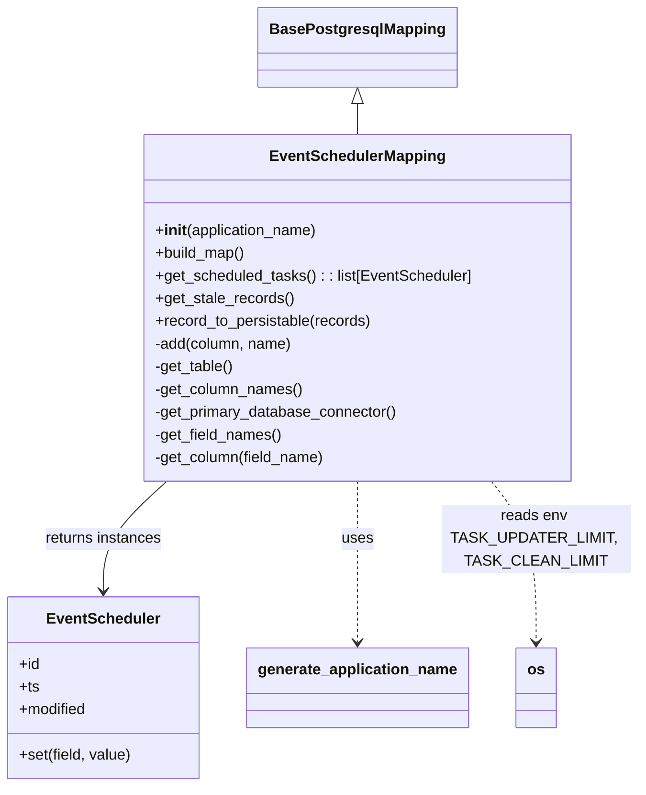

# Diagram: partview_core/partview_service/partview_service/persistence/sql/postgresql/EventSchedulerMapping.py


> Auto-generated by Obscura crawlers

## Diagram 1



### SVG

<svg id="container" width="664.6484375" xmlns="http://www.w3.org/2000/svg" class="classDiagram" height="830" viewBox="0 0 664.6484375 830" role="graphics-document document" aria-roledescription="class"><style>#container{font-family:"trebuchet ms",verdana,arial,sans-serif;font-size:16px;fill:#333;}@keyframes edge-animation-frame{from{stroke-dashoffset:0;}}@keyframes dash{to{stroke-dashoffset:0;}}#container .edge-animation-slow{stroke-dasharray:9,5!important;stroke-dashoffset:900;animation:dash 50s linear infinite;stroke-linecap:round;}#container .edge-animation-fast{stroke-dasharray:9,5!important;stroke-dashoffset:900;animation:dash 20s linear infinite;stroke-linecap:round;}#container .error-icon{fill:#552222;}#container .error-text{fill:#552222;stroke:#552222;}#container .edge-thickness-normal{stroke-width:1px;}#container .edge-thickness-thick{stroke-width:3.5px;}#container .edge-pattern-solid{stroke-dasharray:0;}#container .edge-thickness-invisible{stroke-width:0;fill:none;}#container .edge-pattern-dashed{stroke-dasharray:3;}#container .edge-pattern-dotted{stroke-dasharray:2;}#container .marker{fill:#333333;stroke:#333333;}#container .marker.cross{stroke:#333333;}#container svg{font-family:"trebuchet ms",verdana,arial,sans-serif;font-size:16px;}#container p{margin:0;}#container g.classGroup text{fill:#9370DB;stroke:none;font-family:"trebuchet ms",verdana,arial,sans-serif;font-size:10px;}#container g.classGroup text .title{font-weight:bolder;}#container .nodeLabel,#container .edgeLabel{color:#131300;}#container .edgeLabel .label rect{fill:#ECECFF;}#container .label text{fill:#131300;}#container .labelBkg{background:#ECECFF;}#container .edgeLabel .label span{background:#ECECFF;}#container .classTitle{font-weight:bolder;}#container .node rect,#container .node circle,#container .node ellipse,#container .node polygon,#container .node path{fill:#ECECFF;stroke:#9370DB;stroke-width:1px;}#container .divider{stroke:#9370DB;stroke-width:1;}#container g.clickable{cursor:pointer;}#container g.classGroup rect{fill:#ECECFF;stroke:#9370DB;}#container g.classGroup line{stroke:#9370DB;stroke-width:1;}#container .classLabel .box{stroke:none;stroke-width:0;fill:#ECECFF;opacity:0.5;}#container .classLabel .label{fill:#9370DB;font-size:10px;}#container .relation{stroke:#333333;stroke-width:1;fill:none;}#container .dashed-line{stroke-dasharray:3;}#container .dotted-line{stroke-dasharray:1 2;}#container #compositionStart,#container .composition{fill:#333333!important;stroke:#333333!important;stroke-width:1;}#container #compositionEnd,#container .composition{fill:#333333!important;stroke:#333333!important;stroke-width:1;}#container #dependencyStart,#container .dependency{fill:#333333!important;stroke:#333333!important;stroke-width:1;}#container #dependencyStart,#container .dependency{fill:#333333!important;stroke:#333333!important;stroke-width:1;}#container #extensionStart,#container .extension{fill:transparent!important;stroke:#333333!important;stroke-width:1;}#container #extensionEnd,#container .extension{fill:transparent!important;stroke:#333333!important;stroke-width:1;}#container #aggregationStart,#container .aggregation{fill:transparent!important;stroke:#333333!important;stroke-width:1;}#container #aggregationEnd,#container .aggregation{fill:transparent!important;stroke:#333333!important;stroke-width:1;}#container #lollipopStart,#container .lollipop{fill:#ECECFF!important;stroke:#333333!important;stroke-width:1;}#container #lollipopEnd,#container .lollipop{fill:#ECECFF!important;stroke:#333333!important;stroke-width:1;}#container .edgeTerminals{font-size:11px;line-height:initial;}#container .classTitleText{text-anchor:middle;font-size:18px;fill:#333;}#container .label-icon{display:inline-block;height:1em;overflow:visible;vertical-align:-0.125em;}#container .node .label-icon path{fill:currentColor;stroke:revert;stroke-width:revert;}#container :root{--mermaid-font-family:"trebuchet ms",verdana,arial,sans-serif;}</style><g><defs><marker id="container_class-aggregationStart" class="marker aggregation class" refX="18" refY="7" markerWidth="190" markerHeight="240" orient="auto"><path d="M 18,7 L9,13 L1,7 L9,1 Z"></path></marker></defs><defs><marker id="container_class-aggregationEnd" class="marker aggregation class" refX="1" refY="7" markerWidth="20" markerHeight="28" orient="auto"><path d="M 18,7 L9,13 L1,7 L9,1 Z"></path></marker></defs><defs><marker id="container_class-extensionStart" class="marker extension class" refX="18" refY="7" markerWidth="190" markerHeight="240" orient="auto"><path d="M 1,7 L18,13 V 1 Z"></path></marker></defs><defs><marker id="container_class-extensionEnd" class="marker extension class" refX="1" refY="7" markerWidth="20" markerHeight="28" orient="auto"><path d="M 1,1 V 13 L18,7 Z"></path></marker></defs><defs><marker id="container_class-compositionStart" class="marker composition class" refX="18" refY="7" markerWidth="190" markerHeight="240" orient="auto"><path d="M 18,7 L9,13 L1,7 L9,1 Z"></path></marker></defs><defs><marker id="container_class-compositionEnd" class="marker composition class" refX="1" refY="7" markerWidth="20" markerHeight="28" orient="auto"><path d="M 18,7 L9,13 L1,7 L9,1 Z"></path></marker></defs><defs><marker id="container_class-dependencyStart" class="marker dependency class" refX="6" refY="7" markerWidth="190" markerHeight="240" orient="auto"><path d="M 5,7 L9,13 L1,7 L9,1 Z"></path></marker></defs><defs><marker id="container_class-dependencyEnd" class="marker dependency class" refX="13" refY="7" markerWidth="20" markerHeight="28" orient="auto"><path d="M 18,7 L9,13 L14,7 L9,1 Z"></path></marker></defs><defs><marker id="container_class-lollipopStart" class="marker lollipop class" refX="13" refY="7" markerWidth="190" markerHeight="240" orient="auto"><circle stroke="black" fill="transparent" cx="7" cy="7" r="6"></circle></marker></defs><defs><marker id="container_class-lollipopEnd" class="marker lollipop class" refX="1" refY="7" markerWidth="190" markerHeight="240" orient="auto"><circle stroke="black" fill="transparent" cx="7" cy="7" r="6"></circle></marker></defs><g class="root"><g class="clusters"></g><g class="edgePaths"><path d="M372.242,109.25L372.242,110.542C372.242,111.833,372.242,114.417,372.242,119.875C372.242,125.333,372.242,133.667,372.242,137.833L372.242,142" id="id_BasePostgresqlMapping_EventSchedulerMapping_1" class="edge-thickness-normal edge-pattern-solid relation" style=";;;" data-edge="true" data-et="edge" data-id="id_BasePostgresqlMapping_EventSchedulerMapping_1" data-points="W3sieCI6MzcyLjI0MjE4NzUsInkiOjkyfSx7IngiOjM3Mi4yNDIxODc1LCJ5IjoxMTd9LHsieCI6MzcyLjI0MjE4NzUsInkiOjE0Mn1d" marker-start="url(#container_class-extensionStart)"></path><path d="M174.201,508L163.199,518.167C152.197,528.333,130.192,548.667,119.19,568C108.188,587.333,108.188,605.667,108.188,614.833L108.188,624" id="id_EventSchedulerMapping_EventScheduler_2" class="edge-thickness-normal edge-pattern-solid relation" style=";;;" data-edge="true" data-et="edge" data-id="id_EventSchedulerMapping_EventScheduler_2" data-points="W3sieCI6MTc0LjIwMTE3MTg3NSwieSI6NTA4fSx7IngiOjEwOC4xODc1LCJ5Ijo1Njl9LHsieCI6MTA4LjE4NzUsInkiOjYzMH1d" marker-end="url(#container_class-dependencyEnd)"></path><path d="M372.242,508L372.242,518.167C372.242,528.333,372.242,548.667,372.242,577C372.242,605.333,372.242,641.667,372.242,659.833L372.242,678" id="id_EventSchedulerMapping_generate_application_name_3" class="edge-thickness-normal edge-pattern-dashed relation" style=";;;" data-edge="true" data-et="edge" data-id="id_EventSchedulerMapping_generate_application_name_3" data-points="W3sieCI6MzcyLjI0MjE4NzUsInkiOjUwOH0seyJ4IjozNzIuMjQyMTg3NSwieSI6NTY5fSx7IngiOjM3Mi4yNDIxODc1LCJ5Ijo2ODR9XQ==" marker-end="url(#container_class-dependencyEnd)"></path><path d="M510.547,508L518.23,518.167C525.914,528.333,541.281,548.667,548.965,577C556.648,605.333,556.648,641.667,556.648,659.833L556.648,678" id="id_EventSchedulerMapping_os_4" class="edge-thickness-normal edge-pattern-dashed relation" style=";;;" data-edge="true" data-et="edge" data-id="id_EventSchedulerMapping_os_4" data-points="W3sieCI6NTEwLjU0Njg3NSwieSI6NTA4fSx7IngiOjU1Ni42NDg0Mzc1LCJ5Ijo1Njl9LHsieCI6NTU2LjY0ODQzNzUsInkiOjY4NH1d" marker-end="url(#container_class-dependencyEnd)"></path></g><g class="edgeLabels"><g class="edgeLabel"><g class="label" data-id="id_BasePostgresqlMapping_EventSchedulerMapping_1" transform="translate(0, 0)"><foreignObject width="0" height="0"><div xmlns="http://www.w3.org/1999/xhtml" class="labelBkg" style="display: table-cell; white-space: nowrap; line-height: 1.5; max-width: 200px; text-align: center;"><span class="edgeLabel"></span></div></foreignObject></g></g><g class="edgeLabel" transform="translate(108.1875, 569)"><g class="label" data-id="id_EventSchedulerMapping_EventScheduler_2" transform="translate(-62.703125, -12)"><foreignObject width="125.40625" height="24"><div xmlns="http://www.w3.org/1999/xhtml" class="labelBkg" style="display: table-cell; white-space: nowrap; line-height: 1.5; max-width: 200px; text-align: center;"><span class="edgeLabel"><p>returns instances</p></span></div></foreignObject></g></g><g class="edgeLabel" transform="translate(372.2421875, 569)"><g class="label" data-id="id_EventSchedulerMapping_generate_application_name_3" transform="translate(-16.4921875, -12)"><foreignObject width="32.984375" height="24"><div xmlns="http://www.w3.org/1999/xhtml" class="labelBkg" style="display: table-cell; white-space: nowrap; line-height: 1.5; max-width: 200px; text-align: center;"><span class="edgeLabel"><p>uses</p></span></div></foreignObject></g></g><g class="edgeLabel" transform="translate(556.6484375, 569)"><g class="label" data-id="id_EventSchedulerMapping_os_4" transform="translate(-100, -36)"><foreignObject width="200" height="72"><div xmlns="http://www.w3.org/1999/xhtml" class="labelBkg" style="display: table; white-space: break-spaces; line-height: 1.5; max-width: 200px; text-align: center; width: 200px;"><span class="edgeLabel"><p>reads env TASK_UPDATER_LIMIT, TASK_CLEAN_LIMIT</p></span></div></foreignObject></g></g></g><g class="nodes"><g class="node default" id="classId-BasePostgresqlMapping-0" transform="translate(372.2421875, 50)"><g class="basic label-container"><path d="M-99.921875 -42 L99.921875 -42 L99.921875 42 L-99.921875 42" stroke="none" stroke-width="0" fill="#ECECFF" style=""></path><path d="M-99.921875 -42 C-36.81424765002283 -42, 26.293379699954343 -42, 99.921875 -42 M-99.921875 -42 C-58.69249086306797 -42, -17.463106726135933 -42, 99.921875 -42 M99.921875 -42 C99.921875 -19.332205123606837, 99.921875 3.3355897527863263, 99.921875 42 M99.921875 -42 C99.921875 -18.521577824201444, 99.921875 4.956844351597113, 99.921875 42 M99.921875 42 C34.23793184518924 42, -31.446011309621525 42, -99.921875 42 M99.921875 42 C34.30184809614049 42, -31.318178807719022 42, -99.921875 42 M-99.921875 42 C-99.921875 9.25157335525305, -99.921875 -23.4968532894939, -99.921875 -42 M-99.921875 42 C-99.921875 23.745631798358076, -99.921875 5.491263596716152, -99.921875 -42" stroke="#9370DB" stroke-width="1.3" fill="none" stroke-dasharray="0 0" style=""></path></g><g class="annotation-group text" transform="translate(0, -18)"></g><g class="label-group text" transform="translate(-87.921875, -18)"><g class="label" style="font-weight: bolder" transform="translate(0,-12)"><foreignObject width="175.84375" height="24"><div xmlns="http://www.w3.org/1999/xhtml" style="display: table-cell; white-space: nowrap; line-height: 1.5; max-width: 223px; text-align: center;"><span class="nodeLabel markdown-node-label" style=""><p>BasePostgresqlMapping</p></span></div></foreignObject></g></g><g class="members-group text" transform="translate(-87.921875, 30)"></g><g class="methods-group text" transform="translate(-87.921875, 60)"></g><g class="divider" style=""><path d="M-99.921875 6 C-51.27187770378411 6, -2.621880407568213 6, 99.921875 6 M-99.921875 6 C-45.70260743469601 6, 8.516660130607974 6, 99.921875 6" stroke="#9370DB" stroke-width="1.3" fill="none" stroke-dasharray="0 0" style=""></path></g><g class="divider" style=""><path d="M-99.921875 24 C-30.24626083054416 24, 39.42935333891168 24, 99.921875 24 M-99.921875 24 C-35.683122223225126 24, 28.555630553549747 24, 99.921875 24" stroke="#9370DB" stroke-width="1.3" fill="none" stroke-dasharray="0 0" style=""></path></g></g><g class="node default" id="classId-EventSchedulerMapping-1" transform="translate(372.2421875, 325)"><g class="basic label-container"><path d="M-223.95703125 -183 L223.95703125 -183 L223.95703125 183 L-223.95703125 183" stroke="none" stroke-width="0" fill="#ECECFF" style=""></path><path d="M-223.95703125 -183 C-91.13555671352682 -183, 41.68591782294635 -183, 223.95703125 -183 M-223.95703125 -183 C-49.757451035855524 -183, 124.44212917828895 -183, 223.95703125 -183 M223.95703125 -183 C223.95703125 -54.78372996799325, 223.95703125 73.4325400640135, 223.95703125 183 M223.95703125 -183 C223.95703125 -38.01538837083902, 223.95703125 106.96922325832196, 223.95703125 183 M223.95703125 183 C126.3831386009701 183, 28.8092459519402 183, -223.95703125 183 M223.95703125 183 C97.02043109913059 183, -29.91616905173882 183, -223.95703125 183 M-223.95703125 183 C-223.95703125 105.51805464814986, -223.95703125 28.036109296299713, -223.95703125 -183 M-223.95703125 183 C-223.95703125 105.63135794331001, -223.95703125 28.262715886620015, -223.95703125 -183" stroke="#9370DB" stroke-width="1.3" fill="none" stroke-dasharray="0 0" style=""></path></g><g class="annotation-group text" transform="translate(0, -159)"></g><g class="label-group text" transform="translate(-88.4921875, -159)"><g class="label" style="font-weight: bolder" transform="translate(0,-12)"><foreignObject width="176.984375" height="24"><div xmlns="http://www.w3.org/1999/xhtml" style="display: table-cell; white-space: nowrap; line-height: 1.5; max-width: 226px; text-align: center;"><span class="nodeLabel markdown-node-label" style=""><p>EventSchedulerMapping</p></span></div></foreignObject></g></g><g class="members-group text" transform="translate(-211.95703125, -111)"></g><g class="methods-group text" transform="translate(-211.95703125, -81)"><g class="label" style="" transform="translate(0,-12)"><foreignObject width="173.734375" height="24"><div xmlns="http://www.w3.org/1999/xhtml" style="display: table-cell; white-space: nowrap; line-height: 1.5; max-width: 263px; text-align: center;"><span class="nodeLabel markdown-node-label" style=""><p>+<strong>init</strong>(application_name)</p></span></div></foreignObject></g><g class="label" style="" transform="translate(0,12)"><foreignObject width="96.109375" height="24"><div xmlns="http://www.w3.org/1999/xhtml" style="display: table-cell; white-space: nowrap; line-height: 1.5; max-width: 153px; text-align: center;"><span class="nodeLabel markdown-node-label" style=""><p>+build_map()</p></span></div></foreignObject></g><g class="label" style="" transform="translate(0,36)"><foreignObject width="335.421875" height="24"><div xmlns="http://www.w3.org/1999/xhtml" style="display: table-cell; white-space: nowrap; line-height: 1.5; max-width: 393px; text-align: center;"><span class="nodeLabel markdown-node-label" style=""><p>+get_scheduled_tasks() : : list[EventScheduler]</p></span></div></foreignObject></g><g class="label" style="" transform="translate(0,60)"><foreignObject width="146.078125" height="24"><div xmlns="http://www.w3.org/1999/xhtml" style="display: table-cell; white-space: nowrap; line-height: 1.5; max-width: 203px; text-align: center;"><span class="nodeLabel markdown-node-label" style=""><p>+get_stale_records()</p></span></div></foreignObject></g><g class="label" style="" transform="translate(0,84)"><foreignObject width="230.234375" height="24"><div xmlns="http://www.w3.org/1999/xhtml" style="display: table-cell; white-space: nowrap; line-height: 1.5; max-width: 288px; text-align: center;"><span class="nodeLabel markdown-node-label" style=""><p>+record_to_persistable(records)</p></span></div></foreignObject></g><g class="label" style="" transform="translate(0,108)"><foreignObject width="146.78125" height="24"><div xmlns="http://www.w3.org/1999/xhtml" style="display: table-cell; white-space: nowrap; line-height: 1.5; max-width: 204px; text-align: center;"><span class="nodeLabel markdown-node-label" style=""><p>-add(column, name)</p></span></div></foreignObject></g><g class="label" style="" transform="translate(0,132)"><foreignObject width="84.578125" height="24"><div xmlns="http://www.w3.org/1999/xhtml" style="display: table-cell; white-space: nowrap; line-height: 1.5; max-width: 142px; text-align: center;"><span class="nodeLabel markdown-node-label" style=""><p>-get_table()</p></span></div></foreignObject></g><g class="label" style="" transform="translate(0,156)"><foreignObject width="157.453125" height="24"><div xmlns="http://www.w3.org/1999/xhtml" style="display: table-cell; white-space: nowrap; line-height: 1.5; max-width: 215px; text-align: center;"><span class="nodeLabel markdown-node-label" style=""><p>-get_column_names()</p></span></div></foreignObject></g><g class="label" style="" transform="translate(0,180)"><foreignObject width="259.125" height="24"><div xmlns="http://www.w3.org/1999/xhtml" style="display: table-cell; white-space: nowrap; line-height: 1.5; max-width: 316px; text-align: center;"><span class="nodeLabel markdown-node-label" style=""><p>-get_primary_database_connector()</p></span></div></foreignObject></g><g class="label" style="" transform="translate(0,204)"><foreignObject width="135.78125" height="24"><div xmlns="http://www.w3.org/1999/xhtml" style="display: table-cell; white-space: nowrap; line-height: 1.5; max-width: 193px; text-align: center;"><span class="nodeLabel markdown-node-label" style=""><p>-get_field_names()</p></span></div></foreignObject></g><g class="label" style="" transform="translate(0,228)"><foreignObject width="182.078125" height="24"><div xmlns="http://www.w3.org/1999/xhtml" style="display: table-cell; white-space: nowrap; line-height: 1.5; max-width: 239px; text-align: center;"><span class="nodeLabel markdown-node-label" style=""><p>-get_column(field_name)</p></span></div></foreignObject></g></g><g class="divider" style=""><path d="M-223.95703125 -135 C-82.29733359897335 -135, 59.362364052053294 -135, 223.95703125 -135 M-223.95703125 -135 C-61.71164268146768 -135, 100.53374588706464 -135, 223.95703125 -135" stroke="#9370DB" stroke-width="1.3" fill="none" stroke-dasharray="0 0" style=""></path></g><g class="divider" style=""><path d="M-223.95703125 -111 C-121.54469789738258 -111, -19.132364544765153 -111, 223.95703125 -111 M-223.95703125 -111 C-111.16907850919951 -111, 1.6188742316009836 -111, 223.95703125 -111" stroke="#9370DB" stroke-width="1.3" fill="none" stroke-dasharray="0 0" style=""></path></g></g><g class="node default" id="classId-EventScheduler-2" transform="translate(108.1875, 726)"><g class="basic label-container"><path d="M-100.1875 -96 L100.1875 -96 L100.1875 96 L-100.1875 96" stroke="none" stroke-width="0" fill="#ECECFF" style=""></path><path d="M-100.1875 -96 C-30.17434067126095 -96, 39.8388186574781 -96, 100.1875 -96 M-100.1875 -96 C-33.02510683968812 -96, 34.13728632062376 -96, 100.1875 -96 M100.1875 -96 C100.1875 -41.810572181552, 100.1875 12.378855636896006, 100.1875 96 M100.1875 -96 C100.1875 -19.713659321291203, 100.1875 56.57268135741759, 100.1875 96 M100.1875 96 C26.12826515550549 96, -47.93096968898902 96, -100.1875 96 M100.1875 96 C53.34492528111415 96, 6.502350562228301 96, -100.1875 96 M-100.1875 96 C-100.1875 47.146962208370525, -100.1875 -1.7060755832589507, -100.1875 -96 M-100.1875 96 C-100.1875 21.529411411668235, -100.1875 -52.94117717666353, -100.1875 -96" stroke="#9370DB" stroke-width="1.3" fill="none" stroke-dasharray="0 0" style=""></path></g><g class="annotation-group text" transform="translate(0, -72)"></g><g class="label-group text" transform="translate(-56.984375, -72)"><g class="label" style="font-weight: bolder" transform="translate(0,-12)"><foreignObject width="113.96875" height="24"><div xmlns="http://www.w3.org/1999/xhtml" style="display: table-cell; white-space: nowrap; line-height: 1.5; max-width: 164px; text-align: center;"><span class="nodeLabel markdown-node-label" style=""><p>EventScheduler</p></span></div></foreignObject></g></g><g class="members-group text" transform="translate(-88.1875, -24)"><g class="label" style="" transform="translate(0,-12)"><foreignObject width="22.078125" height="24"><div xmlns="http://www.w3.org/1999/xhtml" style="display: table-cell; white-space: nowrap; line-height: 1.5; max-width: 79px; text-align: center;"><span class="nodeLabel markdown-node-label" style=""><p>+id</p></span></div></foreignObject></g><g class="label" style="" transform="translate(0,12)"><foreignObject width="21.15625" height="24"><div xmlns="http://www.w3.org/1999/xhtml" style="display: table-cell; white-space: nowrap; line-height: 1.5; max-width: 79px; text-align: center;"><span class="nodeLabel markdown-node-label" style=""><p>+ts</p></span></div></foreignObject></g><g class="label" style="" transform="translate(0,36)"><foreignObject width="72.609375" height="24"><div xmlns="http://www.w3.org/1999/xhtml" style="display: table-cell; white-space: nowrap; line-height: 1.5; max-width: 130px; text-align: center;"><span class="nodeLabel markdown-node-label" style=""><p>+modified</p></span></div></foreignObject></g></g><g class="methods-group text" transform="translate(-88.1875, 72)"><g class="label" style="" transform="translate(0,-12)"><foreignObject width="119.390625" height="24"><div xmlns="http://www.w3.org/1999/xhtml" style="display: table-cell; white-space: nowrap; line-height: 1.5; max-width: 177px; text-align: center;"><span class="nodeLabel markdown-node-label" style=""><p>+set(field, value)</p></span></div></foreignObject></g></g><g class="divider" style=""><path d="M-100.1875 -48 C-34.3099552564978 -48, 31.567589487004398 -48, 100.1875 -48 M-100.1875 -48 C-35.28852845851243 -48, 29.610443082975138 -48, 100.1875 -48" stroke="#9370DB" stroke-width="1.3" fill="none" stroke-dasharray="0 0" style=""></path></g><g class="divider" style=""><path d="M-100.1875 48 C-51.78259232246131 48, -3.377684644922624 48, 100.1875 48 M-100.1875 48 C-37.83035534669683 48, 24.526789306606346 48, 100.1875 48" stroke="#9370DB" stroke-width="1.3" fill="none" stroke-dasharray="0 0" style=""></path></g></g><g class="node default" id="classId-generate_application_name-3" transform="translate(372.2421875, 726)"><g class="basic label-container"><path d="M-113.8671875 -42 L113.8671875 -42 L113.8671875 42 L-113.8671875 42" stroke="none" stroke-width="0" fill="#ECECFF" style=""></path><path d="M-113.8671875 -42 C-63.84963478177173 -42, -13.832082063543453 -42, 113.8671875 -42 M-113.8671875 -42 C-61.75410131450805 -42, -9.641015129016097 -42, 113.8671875 -42 M113.8671875 -42 C113.8671875 -21.675257058610082, 113.8671875 -1.3505141172201647, 113.8671875 42 M113.8671875 -42 C113.8671875 -21.471866990382203, 113.8671875 -0.9437339807644065, 113.8671875 42 M113.8671875 42 C60.38495963236898 42, 6.902731764737965 42, -113.8671875 42 M113.8671875 42 C46.057475448455506 42, -21.75223660308899 42, -113.8671875 42 M-113.8671875 42 C-113.8671875 20.894494315061305, -113.8671875 -0.2110113698773901, -113.8671875 -42 M-113.8671875 42 C-113.8671875 24.13264019764886, -113.8671875 6.265280395297722, -113.8671875 -42" stroke="#9370DB" stroke-width="1.3" fill="none" stroke-dasharray="0 0" style=""></path></g><g class="annotation-group text" transform="translate(0, -18)"></g><g class="label-group text" transform="translate(-101.8671875, -18)"><g class="label" style="font-weight: bolder" transform="translate(0,-12)"><foreignObject width="203.734375" height="24"><div xmlns="http://www.w3.org/1999/xhtml" style="display: table-cell; white-space: nowrap; line-height: 1.5; max-width: 252px; text-align: center;"><span class="nodeLabel markdown-node-label" style=""><p>generate_application_name</p></span></div></foreignObject></g></g><g class="members-group text" transform="translate(-101.8671875, 30)"></g><g class="methods-group text" transform="translate(-101.8671875, 60)"></g><g class="divider" style=""><path d="M-113.8671875 6 C-53.38875535448897 6, 7.0896767910220575 6, 113.8671875 6 M-113.8671875 6 C-32.58296575676772 6, 48.70125598646456 6, 113.8671875 6" stroke="#9370DB" stroke-width="1.3" fill="none" stroke-dasharray="0 0" style=""></path></g><g class="divider" style=""><path d="M-113.8671875 24 C-38.536657874279996 24, 36.79387175144001 24, 113.8671875 24 M-113.8671875 24 C-67.49489708677163 24, -21.122606673543245 24, 113.8671875 24" stroke="#9370DB" stroke-width="1.3" fill="none" stroke-dasharray="0 0" style=""></path></g></g><g class="node default" id="classId-os-4" transform="translate(556.6484375, 726)"><g class="basic label-container"><path d="M-20.5390625 -42 L20.5390625 -42 L20.5390625 42 L-20.5390625 42" stroke="none" stroke-width="0" fill="#ECECFF" style=""></path><path d="M-20.5390625 -42 C-6.231256285838965 -42, 8.07654992832207 -42, 20.5390625 -42 M-20.5390625 -42 C-4.673367074344192 -42, 11.192328351311616 -42, 20.5390625 -42 M20.5390625 -42 C20.5390625 -21.760965575045542, 20.5390625 -1.5219311500910848, 20.5390625 42 M20.5390625 -42 C20.5390625 -20.422595382241948, 20.5390625 1.1548092355161046, 20.5390625 42 M20.5390625 42 C6.71723876331148 42, -7.10458497337704 42, -20.5390625 42 M20.5390625 42 C8.843419811495203 42, -2.852222877009595 42, -20.5390625 42 M-20.5390625 42 C-20.5390625 9.338547441295589, -20.5390625 -23.322905117408823, -20.5390625 -42 M-20.5390625 42 C-20.5390625 21.34591955481695, -20.5390625 0.6918391096338965, -20.5390625 -42" stroke="#9370DB" stroke-width="1.3" fill="none" stroke-dasharray="0 0" style=""></path></g><g class="annotation-group text" transform="translate(0, -18)"></g><g class="label-group text" transform="translate(-8.5390625, -18)"><g class="label" style="font-weight: bolder" transform="translate(0,-12)"><foreignObject width="17.078125" height="24"><div xmlns="http://www.w3.org/1999/xhtml" style="display: table-cell; white-space: nowrap; line-height: 1.5; max-width: 67px; text-align: center;"><span class="nodeLabel markdown-node-label" style=""><p>os</p></span></div></foreignObject></g></g><g class="members-group text" transform="translate(-8.5390625, 30)"></g><g class="methods-group text" transform="translate(-8.5390625, 60)"></g><g class="divider" style=""><path d="M-20.5390625 6 C-5.261309258305955 6, 10.01644398338809 6, 20.5390625 6 M-20.5390625 6 C-10.93531810982984 6, -1.33157371965968 6, 20.5390625 6" stroke="#9370DB" stroke-width="1.3" fill="none" stroke-dasharray="0 0" style=""></path></g><g class="divider" style=""><path d="M-20.5390625 24 C-6.2322546357044235 24, 8.074553228591153 24, 20.5390625 24 M-20.5390625 24 C-7.344091568148354 24, 5.850879363703292 24, 20.5390625 24" stroke="#9370DB" stroke-width="1.3" fill="none" stroke-dasharray="0 0" style=""></path></g></g></g></g></g></svg>

## Diagram 2

```mermaid
flowchart TD
    A[Start get_scheduled_tasks] --> B[Build RETURN column list]
    B --> C[Compose UPDATE ... RETURNING query]
    C --> D[establish_connection() -> get_cursor()]
    D --> E[cursor.execute(query)]
    E --> F[cursor.fetchall() -> records]
    F --> G[record_to_persistable(records)]
    G --> H[return list[EventScheduler]]
    H --> I[End]
```

> SVG rendering failed for this diagram.
