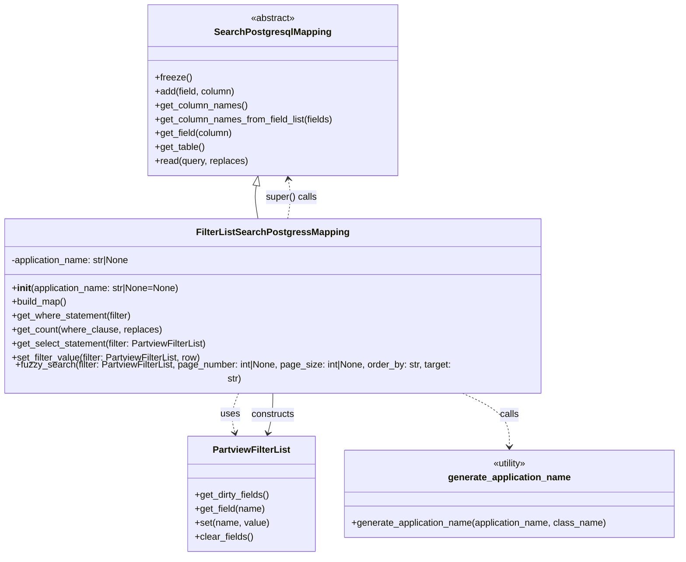

# Diagram: partview_core/partview_service/partview_service/persistence/sql/postgresql/FilterListSearchPostgresqlMapping.py

> Auto-generated by Obscura crawlers

## Mermaid

### SVG

<svg id="container" width="1173.15234375" xmlns="http://www.w3.org/2000/svg" class="classDiagram" height="944" viewBox="0 0 1173.15234375 944" role="graphics-document document" aria-roledescription="class"><g><defs><marker id="container_class-aggregationStart" class="marker aggregation class" refX="18" refY="7" markerWidth="190" markerHeight="240" orient="auto"><path d="M 18,7 L9,13 L1,7 L9,1 Z"></path></marker></defs><defs><marker id="container_class-aggregationEnd" class="marker aggregation class" refX="1" refY="7" markerWidth="20" markerHeight="28" orient="auto"><path d="M 18,7 L9,13 L1,7 L9,1 Z"></path></marker></defs><defs><marker id="container_class-extensionStart" class="marker extension class" refX="18" refY="7" markerWidth="190" markerHeight="240" orient="auto"><path d="M 1,7 L18,13 V 1 Z"></path></marker></defs><defs><marker id="container_class-extensionEnd" class="marker extension class" refX="1" refY="7" markerWidth="20" markerHeight="28" orient="auto"><path d="M 1,1 V 13 L18,7 Z"></path></marker></defs><defs><marker id="container_class-compositionStart" class="marker composition class" refX="18" refY="7" markerWidth="190" markerHeight="240" orient="auto"><path d="M 18,7 L9,13 L1,7 L9,1 Z"></path></marker></defs><defs><marker id="container_class-compositionEnd" class="marker composition class" refX="1" refY="7" markerWidth="20" markerHeight="28" orient="auto"><path d="M 18,7 L9,13 L1,7 L9,1 Z"></path></marker></defs><defs><marker id="container_class-dependencyStart" class="marker dependency class" refX="6" refY="7" markerWidth="190" markerHeight="240" orient="auto"><path d="M 5,7 L9,13 L1,7 L9,1 Z"></path></marker></defs><defs><marker id="container_class-dependencyEnd" class="marker dependency class" refX="13" refY="7" markerWidth="20" markerHeight="28" orient="auto"><path d="M 18,7 L9,13 L14,7 L9,1 Z"></path></marker></defs><defs><marker id="container_class-lollipopStart" class="marker lollipop class" refX="13" refY="7" markerWidth="190" markerHeight="240" orient="auto"><circle stroke="black" fill="transparent" cx="7" cy="7" r="6"></circle></marker></defs><defs><marker id="container_class-lollipopEnd" class="marker lollipop class" refX="1" refY="7" markerWidth="190" markerHeight="240" orient="auto"><circle stroke="black" fill="transparent" cx="7" cy="7" r="6"></circle></marker></defs><g class="root"><g class="clusters"></g><g class="edgePaths"><path d="M445.475,318.992L444.892,322.327C444.309,325.661,443.143,332.331,443.656,341.832C444.169,351.333,446.361,363.667,447.457,369.833L448.553,376" id="id_SearchPostgresqlMapping_FilterListSearchPostgressMapping_1" class="edge-thickness-normal edge-pattern-solid relation" style=";;;" data-edge="true" data-et="edge" data-id="id_SearchPostgresqlMapping_FilterListSearchPostgressMapping_1" data-points="W3sieCI6NDQ4LjQ0NTkwNjkyOTM0NzgsInkiOjMwMn0seyJ4Ijo0NDEuOTc2NTYyNSwieSI6MzM5fSx7IngiOjQ0OC41NTMxMzM2MzI1OTY2NSwieSI6Mzc2fV0=" marker-start="url(#container_class-extensionStart)"></path><path d="M415.008,664L412.476,670.167C409.943,676.333,404.878,688.667,403.767,700.035C402.656,711.404,405.499,721.808,406.921,727.01L408.343,732.212" id="id_FilterListSearchPostgressMapping_PartviewFilterList_2" class="edge-thickness-normal edge-pattern-dashed relation" style=";;;" data-edge="true" data-et="edge" data-id="id_FilterListSearchPostgressMapping_PartviewFilterList_2" data-points="W3sieCI6NDE1LjAwODI0NDEyOTgzNDIsInkiOjY2NH0seyJ4IjozOTkuODEyNSwieSI6NzAxfSx7IngiOjQwOS45MjQzNzM4NTExMDI5LCJ5Ijo3Mzh9XQ==" marker-end="url(#container_class-dependencyEnd)"></path><path d="M797.446,664L811.291,670.167C825.136,676.333,852.826,688.667,866.671,704C880.516,719.333,880.516,737.667,880.516,746.833L880.516,756" id="id_FilterListSearchPostgressMapping_generate_application_name_3" class="edge-thickness-normal edge-pattern-dashed relation" style=";;;" data-edge="true" data-et="edge" data-id="id_FilterListSearchPostgressMapping_generate_application_name_3" data-points="W3sieCI6Nzk3LjQ0NjA4OTQzMzcwMTcsInkiOjY2NH0seyJ4Ijo4ODAuNTE1NjI1LCJ5Ijo3MDF9LHsieCI6ODgwLjUxNTYyNSwieSI6NzYyfV0=" marker-end="url(#container_class-dependencyEnd)"></path><path d="M499.744,376L500.84,369.833C501.936,363.667,504.128,351.333,504.318,339.985C504.508,328.637,502.696,318.274,501.79,313.092L500.884,307.91" id="id_FilterListSearchPostgressMapping_SearchPostgresqlMapping_4" class="edge-thickness-normal edge-pattern-dashed relation" style=";;;" data-edge="true" data-et="edge" data-id="id_FilterListSearchPostgressMapping_SearchPostgresqlMapping_4" data-points="W3sieCI6NDk5Ljc0Mzc0MTM2NzQwMzM1LCJ5IjozNzZ9LHsieCI6NTA2LjMyMDMxMjUsInkiOjMzOX0seyJ4Ijo0OTkuODUwOTY4MDcwNjUyMiwieSI6MzAyfV0=" marker-end="url(#container_class-dependencyEnd)"></path><path d="M465.618,732.212L467.04,727.01C468.462,721.808,471.305,711.404,472.727,700.035C474.148,688.667,474.148,676.333,474.148,670.167L474.148,664" id="id_PartviewFilterList_FilterListSearchPostgressMapping_5" class="edge-thickness-normal edge-pattern-solid relation" style=";;;" data-edge="true" data-et="edge" data-id="id_PartviewFilterList_FilterListSearchPostgressMapping_5" data-points="W3sieCI6NDY0LjAzNjU2MzY0ODg5NzEsInkiOjczOH0seyJ4Ijo0NzQuMTQ4NDM3NSwieSI6NzAxfSx7IngiOjQ3NC4xNDg0Mzc1LCJ5Ijo2NjR9XQ==" marker-start="url(#container_class-dependencyStart)"></path></g><g class="edgeLabels"><g class="edgeLabel"><g class="label" data-id="id_SearchPostgresqlMapping_FilterListSearchPostgressMapping_1" transform="translate(0, 0)"><foreignObject width="0" height="0">

</foreignObject></g></g><g class="edgeLabel" transform="translate(400.1244, 700.24055)"><g class="label" data-id="id_FilterListSearchPostgressMapping_PartviewFilterList_2" transform="translate(-16.4921875, -12)"><foreignObject width="32.984375" height="24">

uses

</foreignObject></g></g><g class="edgeLabel" transform="translate(880.515625, 701)"><g class="label" data-id="id_FilterListSearchPostgressMapping_generate_application_name_3" transform="translate(-16.4453125, -12)"><foreignObject width="32.890625" height="24">

calls

</foreignObject></g></g><g class="edgeLabel" transform="translate(506.31868, 339.00916)"><g class="label" data-id="id_FilterListSearchPostgressMapping_SearchPostgresqlMapping_4" transform="translate(-44.34375, -12)"><foreignObject width="88.6875" height="24">

super() calls

</foreignObject></g></g><g class="edgeLabel" transform="translate(474.1484375, 701)"><g class="label" data-id="id_PartviewFilterList_FilterListSearchPostgressMapping_5" transform="translate(-37.84375, -12)"><foreignObject width="75.6875" height="24">

constructs

</foreignObject></g></g></g><g class="nodes"><g class="node default" id="classId-SearchPostgresqlMapping-0" transform="translate(474.1484375, 155)"><g class="basic label-container"><path d="M-215.08203125 -147 L215.08203125 -147 L215.08203125 147 L-215.08203125 147" stroke="none" stroke-width="0" fill="#ECECFF" style=""></path><path d="M-215.08203125 -147 C-94.69014309488128 -147, 25.701745060237442 -147, 215.08203125 -147 M-215.08203125 -147 C-96.00041485396419 -147, 23.081201542071625 -147, 215.08203125 -147 M215.08203125 -147 C215.08203125 -47.856108926225886, 215.08203125 51.28778214754823, 215.08203125 147 M215.08203125 -147 C215.08203125 -48.5753831065355, 215.08203125 49.849233786929005, 215.08203125 147 M215.08203125 147 C83.56221753403801 147, -47.957596181923975 147, -215.08203125 147 M215.08203125 147 C55.771839180368005 147, -103.53835288926399 147, -215.08203125 147 M-215.08203125 147 C-215.08203125 54.784332107840825, -215.08203125 -37.43133578431835, -215.08203125 -147 M-215.08203125 147 C-215.08203125 45.8253889255876, -215.08203125 -55.34922214882479, -215.08203125 -147" stroke="#9370DB" stroke-width="1.3" fill="none" stroke-dasharray="0 0" style=""></path></g><g class="annotation-group text" transform="translate(-38.609375, -123)"><g class="label" style="" transform="translate(0,-12)"><foreignObject width="77.21875" height="24">

«abstract»

</foreignObject></g></g><g class="label-group text" transform="translate(-95.1171875, -99)"><g class="label" style="font-weight: bolder" transform="translate(0,-12)"><foreignObject width="190.234375" height="24">

SearchPostgresqlMapping

</foreignObject></g></g><g class="members-group text" transform="translate(-203.08203125, -51)"></g><g class="methods-group text" transform="translate(-203.08203125, -21)"><g class="label" style="" transform="translate(0,-12)"><foreignObject width="62.109375" height="24">

+freeze()

</foreignObject></g><g class="label" style="" transform="translate(0,12)"><foreignObject width="139.890625" height="24">

+add(field, column)

</foreignObject></g><g class="label" style="" transform="translate(0,36)"><foreignObject width="158.984375" height="24">

+get_column_names()

</foreignObject></g><g class="label" style="" transform="translate(0,60)"><foreignObject width="311.046875" height="24">

+get_column_names_from_field_list(fields)

</foreignObject></g><g class="label" style="" transform="translate(0,84)"><foreignObject width="134.78125" height="24">

+get_field(column)

</foreignObject></g><g class="label" style="" transform="translate(0,108)"><foreignObject width="86.125" height="24">

+get_table()

</foreignObject></g><g class="label" style="" transform="translate(0,132)"><foreignObject width="160.734375" height="24">

+read(query, replaces)

</foreignObject></g></g><g class="divider" style=""><path d="M-215.08203125 -75 C-102.79165163101509 -75, 9.49872798796983 -75, 215.08203125 -75 M-215.08203125 -75 C-56.64904675745916 -75, 101.78393773508168 -75, 215.08203125 -75" stroke="#9370DB" stroke-width="1.3" fill="none" stroke-dasharray="0 0" style=""></path></g><g class="divider" style=""><path d="M-215.08203125 -51 C-109.13970730348534 -51, -3.1973833569706755 -51, 215.08203125 -51 M-215.08203125 -51 C-81.6790868522508 -51, 51.72385754549839 -51, 215.08203125 -51" stroke="#9370DB" stroke-width="1.3" fill="none" stroke-dasharray="0 0" style=""></path></g></g><g class="node default" id="classId-FilterListSearchPostgressMapping-1" transform="translate(474.1484375, 520)"><g class="basic label-container"><path d="M-466.1484375 -144 L466.1484375 -144 L466.1484375 144 L-466.1484375 144" stroke="none" stroke-width="0" fill="#ECECFF" style=""></path><path d="M-466.1484375 -144 C-239.87418026845495 -144, -13.5999230369099 -144, 466.1484375 -144 M-466.1484375 -144 C-174.17958142868588 -144, 117.78927464262824 -144, 466.1484375 -144 M466.1484375 -144 C466.1484375 -83.27179203569713, 466.1484375 -22.543584071394278, 466.1484375 144 M466.1484375 -144 C466.1484375 -41.40352795538715, 466.1484375 61.192944089225705, 466.1484375 144 M466.1484375 144 C193.43960731782397 144, -79.26922286435206 144, -466.1484375 144 M466.1484375 144 C200.6770042116102 144, -64.79442907677958 144, -466.1484375 144 M-466.1484375 144 C-466.1484375 46.38220088887172, -466.1484375 -51.235598222256556, -466.1484375 -144 M-466.1484375 144 C-466.1484375 64.41783723420495, -466.1484375 -15.164325531590094, -466.1484375 -144" stroke="#9370DB" stroke-width="1.3" fill="none" stroke-dasharray="0 0" style=""></path></g><g class="annotation-group text" transform="translate(0, -120)"></g><g class="label-group text" transform="translate(-123.921875, -120)"><g class="label" style="font-weight: bolder" transform="translate(0,-12)"><foreignObject width="247.84375" height="24">

FilterListSearchPostgressMapping

</foreignObject></g></g><g class="members-group text" transform="translate(-454.1484375, -72)"><g class="label" style="" transform="translate(0,-12)"><foreignObject width="209.484375" height="24">

-application_name: str|None

</foreignObject></g></g><g class="methods-group text" transform="translate(-454.1484375, -24)"><g class="label" style="" transform="translate(0,-12)"><foreignObject width="292.4375" height="24">

+<strong>init</strong>(application_name: str|None=None)

</foreignObject></g><g class="label" style="" transform="translate(0,12)"><foreignObject width="96.109375" height="24">

+build_map()

</foreignObject></g><g class="label" style="" transform="translate(0,36)"><foreignObject width="208.90625" height="24">

+get_where_statement(filter)

</foreignObject></g><g class="label" style="" transform="translate(0,60)"><foreignObject width="256.859375" height="24">

+get_count(where_clause, replaces)

</foreignObject></g><g class="label" style="" transform="translate(0,84)"><foreignObject width="340.96875" height="24">

+get_select_statement(filter: PartviewFilterList)

</foreignObject></g><g class="label" style="" transform="translate(0,108)"><foreignObject width="329.53125" height="24">

+set_filter_value(filter: PartviewFilterList, row)

</foreignObject></g><g class="label" style="" transform="translate(0,132)"><foreignObject width="784.375" height="24">

+fuzzy_search(filter: PartviewFilterList, page_number: int|None, page_size: int|None, order_by: str, target: str)

</foreignObject></g></g><g class="divider" style=""><path d="M-466.1484375 -96 C-129.7706979018006 -96, 206.60704169639882 -96, 466.1484375 -96 M-466.1484375 -96 C-98.27048737329983 -96, 269.60746275340034 -96, 466.1484375 -96" stroke="#9370DB" stroke-width="1.3" fill="none" stroke-dasharray="0 0" style=""></path></g><g class="divider" style=""><path d="M-466.1484375 -48 C-236.63253685099474 -48, -7.116636201989479 -48, 466.1484375 -48 M-466.1484375 -48 C-149.512515708945 -48, 167.12340608211002 -48, 466.1484375 -48" stroke="#9370DB" stroke-width="1.3" fill="none" stroke-dasharray="0 0" style=""></path></g></g><g class="node default" id="classId-PartviewFilterList-2" transform="translate(436.98046875, 837)"><g class="basic label-container"><path d="M-108.8984375 -99 L108.8984375 -99 L108.8984375 99 L-108.8984375 99" stroke="none" stroke-width="0" fill="#ECECFF" style=""></path><path d="M-108.8984375 -99 C-47.5720392608437 -99, 13.754358978312595 -99, 108.8984375 -99 M-108.8984375 -99 C-25.06106821492756 -99, 58.77630107014488 -99, 108.8984375 -99 M108.8984375 -99 C108.8984375 -50.63103022373579, 108.8984375 -2.2620604474715833, 108.8984375 99 M108.8984375 -99 C108.8984375 -37.285848882454744, 108.8984375 24.428302235090513, 108.8984375 99 M108.8984375 99 C31.735856347303837 99, -45.426724805392325 99, -108.8984375 99 M108.8984375 99 C58.169880186819256 99, 7.441322873638512 99, -108.8984375 99 M-108.8984375 99 C-108.8984375 37.9031783363939, -108.8984375 -23.1936433272122, -108.8984375 -99 M-108.8984375 99 C-108.8984375 44.31499310631676, -108.8984375 -10.370013787366474, -108.8984375 -99" stroke="#9370DB" stroke-width="1.3" fill="none" stroke-dasharray="0 0" style=""></path></g><g class="annotation-group text" transform="translate(0, -75)"></g><g class="label-group text" transform="translate(-63.96875, -75)"><g class="label" style="font-weight: bolder" transform="translate(0,-12)"><foreignObject width="127.9375" height="24">

PartviewFilterList

</foreignObject></g></g><g class="members-group text" transform="translate(-96.8984375, -27)"></g><g class="methods-group text" transform="translate(-96.8984375, 3)"><g class="label" style="" transform="translate(0,-12)"><foreignObject width="129.828125" height="24">

+get_dirty_fields()

</foreignObject></g><g class="label" style="" transform="translate(0,12)"><foreignObject width="121.53125" height="24">

+get_field(name)

</foreignObject></g><g class="label" style="" transform="translate(0,36)"><foreignObject width="127.640625" height="24">

+set(name, value)

</foreignObject></g><g class="label" style="" transform="translate(0,60)"><foreignObject width="100.34375" height="24">

+clear_fields()

</foreignObject></g></g><g class="divider" style=""><path d="M-108.8984375 -51 C-46.613331162216745 -51, 15.67177517556651 -51, 108.8984375 -51 M-108.8984375 -51 C-36.82847251362462 -51, 35.241492472750764 -51, 108.8984375 -51" stroke="#9370DB" stroke-width="1.3" fill="none" stroke-dasharray="0 0" style=""></path></g><g class="divider" style=""><path d="M-108.8984375 -27 C-48.21446934130349 -27, 12.469498817393017 -27, 108.8984375 -27 M-108.8984375 -27 C-29.29673311319729 -27, 50.30497127360542 -27, 108.8984375 -27" stroke="#9370DB" stroke-width="1.3" fill="none" stroke-dasharray="0 0" style=""></path></g></g><g class="node default" id="classId-generate_application_name-3" transform="translate(880.515625, 837)"><g class="basic label-container"><path d="M-284.63671875 -75 L284.63671875 -75 L284.63671875 75 L-284.63671875 75" stroke="none" stroke-width="0" fill="#ECECFF" style=""></path><path d="M-284.63671875 -75 C-78.95455237528273 -75, 126.72761399943454 -75, 284.63671875 -75 M-284.63671875 -75 C-144.0812036714891 -75, -3.525688592978213 -75, 284.63671875 -75 M284.63671875 -75 C284.63671875 -44.497073178256585, 284.63671875 -13.99414635651317, 284.63671875 75 M284.63671875 -75 C284.63671875 -25.85844196775456, 284.63671875 23.283116064490883, 284.63671875 75 M284.63671875 75 C119.06517976803451 75, -46.50635921393098 75, -284.63671875 75 M284.63671875 75 C98.5334122784574 75, -87.56989419308519 75, -284.63671875 75 M-284.63671875 75 C-284.63671875 40.79175288133798, -284.63671875 6.583505762675955, -284.63671875 -75 M-284.63671875 75 C-284.63671875 43.896927349215346, -284.63671875 12.793854698430692, -284.63671875 -75" stroke="#9370DB" stroke-width="1.3" fill="none" stroke-dasharray="0 0" style=""></path></g><g class="annotation-group text" transform="translate(-30.3125, -51)"><g class="label" style="" transform="translate(0,-12)"><foreignObject width="60.625" height="24">

«utility»

</foreignObject></g></g><g class="label-group text" transform="translate(-101.8671875, -27)"><g class="label" style="font-weight: bolder" transform="translate(0,-12)"><foreignObject width="203.734375" height="24">

generate_application_name

</foreignObject></g></g><g class="members-group text" transform="translate(-272.63671875, 21)"></g><g class="methods-group text" transform="translate(-272.63671875, 51)"><g class="label" style="" transform="translate(0,-12)"><foreignObject width="443.40625" height="24">

+generate_application_name(application_name, class_name)

</foreignObject></g></g><g class="divider" style=""><path d="M-284.63671875 -3 C-92.72989189442694 -3, 99.17693496114612 -3, 284.63671875 -3 M-284.63671875 -3 C-130.56989242932366 -3, 23.496933891352683 -3, 284.63671875 -3" stroke="#9370DB" stroke-width="1.3" fill="none" stroke-dasharray="0 0" style=""></path></g><g class="divider" style=""><path d="M-284.63671875 21 C-168.42329020712748 21, -52.20986166425499 21, 284.63671875 21 M-284.63671875 21 C-140.586810850156 21, 3.463097049687974 21, 284.63671875 21" stroke="#9370DB" stroke-width="1.3" fill="none" stroke-dasharray="0 0" style=""></path></g></g></g></g></g></svg>
