# Diagram: partview_core/partview_service/partview_service/persistence/sql/postgresql/OpensearchContainerPostgresqlMapping.py

> Auto-generated by Obscura crawlers

## Mermaid

```mermaid
classDiagram
    class BasePostgresqlMapping {
        <<abstract>>
        +freeze()
        +build_map()
        +get_tracking_database_connector()
        +retrieve_data_for_indexing(query)
    }

    class OpensearchContainerPostgresqlMapping {
        -__timezone: str = "EST"
        +__init__(application_name)
        +build_map()
        +is_pending_dispatch(event_code)
        +get_carrier_details(carrier_organization_fv_id)
        +format_destination_eta(response)
        +map_to_index_format(output)
        +prepare_container_for_opensearch_indexing(container_id)
        +retrieve_pg_data(solution_id)
        +retrieve_data_for_indexing(query)
        +build_suggest_for_single_value(original_value, visible_to_solutions)
        +container_data_query(container_id)
        +retrieve_pg_active_packages(solution_id)
    }

    BasePostgresqlMapping <|-- OpensearchContainerPostgresqlMapping

    class PackageContainerOpenSearchMapping {
        +packageContainerId
        +trackingNumber
        +destinationEta
        +modified
        +destinationEtaDisplay
        +lifecycleState
        +ownerSolutionId
        +visibleTo
        +trailerEquipmentNumber
        +orderPriority
        +status
        +activeExceptions
        +finalMileOriginLocation
        +billOfLading
        +originDetail
        +destinationDetail
        +lastMilestone
        +lastUpdate
        +watchingUserIds
        +carrier
        +trackingNumberSuggest
        +billOfLadingSuggest
        +partsV1
        +ordersV1
        +creatorShipmentIdV1
    }

    class CarrierDetails {
        +fvid
        +name
        +scac
    }

    class Location {
        +name
        +code
        +address
    }

    class OriginDetail {
        +name
        +code
        +address
        +scheduledPickupWindow
        +arrivalTs
        +departureTs
    }

    class DestinationDetail {
        +name
        +code
        +address
        +scheduledDeliveryWindow
        +arrivalTs
        +departureTs
    }

    class EventDetail {
        +eventCode
        +eventTs
        +receivedTs
        +location: Location
    }

    class Order {
        +externalId
        +receivedTs
    }

    class Part {
        +externalId
        +name
        +lifecycleState
    }

    class ScheduledDetail {
        +gte
        +lte
    }

    class CreatorShipmentId {
        +value
    }

    class OrderPriority {
        +code
        +name
    }

    class PackageContainerSearchDisplayLogic {
        +eta_display_logic(lifecycle_state, effective_eta, active_exceptions, last_milestone_event_code)
    }

    class PackageContainerExceptionHelper {
        +get_delay_exceptions()
    }

    class InvokeOrganization {
        +invoke_get_organization_from_fv_id(fv_id)
    }

    class NormalizeTime {
        +return_tz_aware_ts(value)
    }

    class Datetime {
        +__init__(value, keep_time)
        +change_time_to_midnight()
        +to_timezone_ISO_string(tz)
    }

    class PackageEventCodes {
        <<enumeration>>
        +ARRIVED
    }

    OpensearchContainerPostgresqlMapping *-- PackageContainerOpenSearchMapping : returns
    OpensearchContainerPostgresqlMapping o-- CarrierDetails : uses
    OpensearchContainerPostgresqlMapping o-- Location : composes
    OpensearchContainerPostgresqlMapping o-- OriginDetail : composes
    OpensearchContainerPostgresqlMapping o-- DestinationDetail : composes
    OpensearchContainerPostgresqlMapping o-- EventDetail : composes
    OpensearchContainerPostgresqlMapping o-- Order : composes
    OpensearchContainerPostgresqlMapping o-- Part : composes
    OpensearchContainerPostgresqlMapping o-- ScheduledDetail : composes
    OpensearchContainerPostgresqlMapping o-- CreatorShipmentId : composes
    OpensearchContainerPostgresqlMapping o-- OrderPriority : composes

    OpensearchContainerPostgresqlMapping ..> PackageContainerSearchDisplayLogic : calls
    OpensearchContainerPostgresqlMapping ..> PackageContainerExceptionHelper : queries
    OpensearchContainerPostgresqlMapping ..> InvokeOrganization : calls
    OpensearchContainerPostgresqlMapping ..> NormalizeTime : uses
    OpensearchContainerPostgresqlMapping ..> Datetime : constructs
    OpensearchContainerPostgresqlMapping ..> PackageEventCodes : checks

    CarrierDetails <|-- PackageContainerOpenSearchMapping : has
    Location <|-- OriginDetail
    Location <|-- DestinationDetail
    EventDetail --> Location : contains
    OrderPriority --> PackageContainerOpenSearchMapping : used by
    Part --> PackageContainerOpenSearchMapping : listed in partsV1
    Order --> PackageContainerOpenSearchMapping : listed in ordersV1
```

### SVG

<svg id="container" width="4427.50390625" xmlns="http://www.w3.org/2000/svg" class="classDiagram" height="2022" viewBox="0 0 4427.50390625 2022" role="graphics-document document" aria-roledescription="class"><g><defs><marker id="container_class-aggregationStart" class="marker aggregation class" refX="18" refY="7" markerWidth="190" markerHeight="240" orient="auto"><path d="M 18,7 L9,13 L1,7 L9,1 Z"></path></marker></defs><defs><marker id="container_class-aggregationEnd" class="marker aggregation class" refX="1" refY="7" markerWidth="20" markerHeight="28" orient="auto"><path d="M 18,7 L9,13 L1,7 L9,1 Z"></path></marker></defs><defs><marker id="container_class-extensionStart" class="marker extension class" refX="18" refY="7" markerWidth="190" markerHeight="240" orient="auto"><path d="M 1,7 L18,13 V 1 Z"></path></marker></defs><defs><marker id="container_class-extensionEnd" class="marker extension class" refX="1" refY="7" markerWidth="20" markerHeight="28" orient="auto"><path d="M 1,1 V 13 L18,7 Z"></path></marker></defs><defs><marker id="container_class-compositionStart" class="marker composition class" refX="18" refY="7" markerWidth="190" markerHeight="240" orient="auto"><path d="M 18,7 L9,13 L1,7 L9,1 Z"></path></marker></defs><defs><marker id="container_class-compositionEnd" class="marker composition class" refX="1" refY="7" markerWidth="20" markerHeight="28" orient="auto"><path d="M 18,7 L9,13 L1,7 L9,1 Z"></path></marker></defs><defs><marker id="container_class-dependencyStart" class="marker dependency class" refX="6" refY="7" markerWidth="190" markerHeight="240" orient="auto"><path d="M 5,7 L9,13 L1,7 L9,1 Z"></path></marker></defs><defs><marker id="container_class-dependencyEnd" class="marker dependency class" refX="13" refY="7" markerWidth="20" markerHeight="28" orient="auto"><path d="M 18,7 L9,13 L14,7 L9,1 Z"></path></marker></defs><defs><marker id="container_class-lollipopStart" class="marker lollipop class" refX="13" refY="7" markerWidth="190" markerHeight="240" orient="auto"><circle stroke="black" fill="transparent" cx="7" cy="7" r="6"></circle></marker></defs><defs><marker id="container_class-lollipopEnd" class="marker lollipop class" refX="1" refY="7" markerWidth="190" markerHeight="240" orient="auto"><circle stroke="black" fill="transparent" cx="7" cy="7" r="6"></circle></marker></defs><g class="root"><g class="clusters"></g><g class="edgePaths"><path d="M2284.406,247.25L2284.406,248.542C2284.406,249.833,2284.406,252.417,2284.406,257.875C2284.406,263.333,2284.406,271.667,2284.406,275.833L2284.406,280" id="id_BasePostgresqlMapping_OpensearchContainerPostgresqlMapping_1" class="edge-thickness-normal edge-pattern-solid relation" style=";;;" data-edge="true" data-et="edge" data-id="id_BasePostgresqlMapping_OpensearchContainerPostgresqlMapping_1" data-points="W3sieCI6MjI4NC40MDYyNSwieSI6MjMwfSx7IngiOjIyODQuNDA2MjUsInkiOjI1NX0seyJ4IjoyMjg0LjQwNjI1LCJ5IjoyODB9XQ==" marker-start="url(#container_class-extensionStart)"></path><path d="M1930.754,521.878L1614.673,555.731C1298.591,589.585,666.429,657.293,350.347,713.313C34.266,769.333,34.266,813.667,34.266,858C34.266,902.333,34.266,946.667,54.274,994.761C74.283,1042.856,114.299,1094.712,134.308,1120.64L154.316,1146.568" id="id_OpensearchContainerPostgresqlMapping_PackageContainerOpenSearchMapping_2" class="edge-thickness-normal edge-pattern-solid relation" style=";;;" data-edge="true" data-et="edge" data-id="id_OpensearchContainerPostgresqlMapping_PackageContainerOpenSearchMapping_2" data-points="W3sieCI6MTk0Ny45MDYyNSwieSI6NTIwLjA0MDYzNjM0OTExNzF9LHsieCI6MzQuMjY1NjI1LCJ5Ijo3MjV9LHsieCI6MzQuMjY1NjI1LCJ5Ijo4NTh9LHsieCI6MzQuMjY1NjI1LCJ5Ijo5OTF9LHsieCI6MTU0LjMxNjQwNjI1LCJ5IjoxMTQ2LjU2ODE4NDgwNjMzMn1d" marker-start="url(#container_class-compositionStart)"></path><path d="M1930.766,524.085L1635.344,557.571C1339.922,591.057,749.078,658.028,453.656,699.681C158.234,741.333,158.234,757.667,158.234,765.833L158.234,774" id="id_OpensearchContainerPostgresqlMapping_CarrierDetails_3" class="edge-thickness-normal edge-pattern-solid relation" style=";;;" data-edge="true" data-et="edge" data-id="id_OpensearchContainerPostgresqlMapping_CarrierDetails_3" data-points="W3sieCI6MTk0Ny45MDYyNSwieSI6NTIyLjE0MjAyNDYxODc3NjR9LHsieCI6MTU4LjIzNDM3NSwieSI6NzI1fSx7IngiOjE1OC4yMzQzNzUsInkiOjc3NH1d" marker-start="url(#container_class-aggregationStart)"></path><path d="M2637.961,537.621L2843.876,568.851C3049.791,600.081,3461.621,662.54,3667.536,715.937C3873.451,769.333,3873.451,813.667,3873.451,858C3873.451,902.333,3873.451,946.667,3884.725,1019C3896,1091.333,3918.548,1191.667,3929.823,1241.833L3941.097,1292" id="id_OpensearchContainerPostgresqlMapping_Location_4" class="edge-thickness-normal edge-pattern-solid relation" style=";;;" data-edge="true" data-et="edge" data-id="id_OpensearchContainerPostgresqlMapping_Location_4" data-points="W3sieCI6MjYyMC45MDYyNSwieSI6NTM1LjAzNDc0MzUwMTM0MTZ9LHsieCI6Mzg3My40NTExNzE4NzUsInkiOjcyNX0seyJ4IjozODczLjQ1MTE3MTg3NSwieSI6ODU4fSx7IngiOjM4NzMuNDUxMTcxODc1LCJ5Ijo5OTF9LHsieCI6Mzk0MS4wOTY3Njg0NjU5MDksInkiOjEyOTJ9XQ==" marker-start="url(#container_class-aggregationStart)"></path><path d="M2637.942,540.303L2831.233,571.086C3024.524,601.869,3411.106,663.434,3604.397,716.384C3797.688,769.333,3797.688,813.667,3797.688,858C3797.688,902.333,3797.688,946.667,3797.688,1033C3797.688,1119.333,3797.688,1247.667,3797.688,1374C3797.688,1500.333,3797.688,1624.667,3800.985,1691C3804.282,1757.333,3810.877,1765.667,3814.175,1769.833L3817.472,1774" id="id_OpensearchContainerPostgresqlMapping_OriginDetail_5" class="edge-thickness-normal edge-pattern-solid relation" style=";;;" data-edge="true" data-et="edge" data-id="id_OpensearchContainerPostgresqlMapping_OriginDetail_5" data-points="W3sieCI6MjYyMC45MDYyNSwieSI6NTM3LjU4OTgzOTk1ODY5OX0seyJ4IjozNzk3LjY4NzUsInkiOjcyNX0seyJ4IjozNzk3LjY4NzUsInkiOjg1OH0seyJ4IjozNzk3LjY4NzUsInkiOjk5MX0seyJ4IjozNzk3LjY4NzUsInkiOjEzNzZ9LHsieCI6Mzc5Ny42ODc1LCJ5IjoxNzQ5fSx7IngiOjM4MTcuNDcxOTgyNzU4NjIwNSwieSI6MTc3NH1d" marker-start="url(#container_class-aggregationStart)"></path><path d="M2638.019,528.884L2895.531,561.57C3153.043,594.256,3668.068,659.628,3925.58,714.481C4183.092,769.333,4183.092,813.667,4183.092,858C4183.092,902.333,4183.092,946.667,4183.092,1033C4183.092,1119.333,4183.092,1247.667,4183.092,1374C4183.092,1500.333,4183.092,1624.667,4185.756,1691C4188.421,1757.333,4193.75,1765.667,4196.415,1769.833L4199.079,1774" id="id_OpensearchContainerPostgresqlMapping_DestinationDetail_6" class="edge-thickness-normal edge-pattern-solid relation" style=";;;" data-edge="true" data-et="edge" data-id="id_OpensearchContainerPostgresqlMapping_DestinationDetail_6" data-points="W3sieCI6MjYyMC45MDYyNSwieSI6NTI2LjcxMTkxNzI3MDA2ODZ9LHsieCI6NDE4My4wOTE3OTY4NzUsInkiOjcyNX0seyJ4Ijo0MTgzLjA5MTc5Njg3NSwieSI6ODU4fSx7IngiOjQxODMuMDkxNzk2ODc1LCJ5Ijo5OTF9LHsieCI6NDE4My4wOTE3OTY4NzUsInkiOjEzNzZ9LHsieCI6NDE4My4wOTE3OTY4NzUsInkiOjE3NDl9LHsieCI6NDE5OS4wNzk0NzE5ODI3NTksInkiOjE3NzR9XQ==" marker-start="url(#container_class-aggregationStart)"></path><path d="M2637.997,532.36L2872.747,564.467C3107.497,596.574,3576.998,660.787,3811.748,699.06C4046.498,737.333,4046.498,749.667,4046.498,755.833L4046.498,762" id="id_OpensearchContainerPostgresqlMapping_EventDetail_7" class="edge-thickness-normal edge-pattern-solid relation" style=";;;" data-edge="true" data-et="edge" data-id="id_OpensearchContainerPostgresqlMapping_EventDetail_7" data-points="W3sieCI6MjYyMC45MDYyNSwieSI6NTMwLjAyMjg1NzY4NzU2Mjh9LHsieCI6NDA0Ni40OTgwNDY4NzUsInkiOjcyNX0seyJ4Ijo0MDQ2LjQ5ODA0Njg3NSwieSI6NzYyfV0=" marker-start="url(#container_class-aggregationStart)"></path><path d="M1931.007,556.322L1793.634,584.435C1656.262,612.548,1381.518,668.774,1244.146,707.054C1106.773,745.333,1106.773,765.667,1106.773,775.833L1106.773,786" id="id_OpensearchContainerPostgresqlMapping_Order_8" class="edge-thickness-normal edge-pattern-solid relation" style=";;;" data-edge="true" data-et="edge" data-id="id_OpensearchContainerPostgresqlMapping_Order_8" data-points="W3sieCI6MTk0Ny45MDYyNSwieSI6NTUyLjg2Mzk5NDkwNTAzMzJ9LHsieCI6MTEwNi43NzM0Mzc1LCJ5Ijo3MjV9LHsieCI6MTEwNi43NzM0Mzc1LCJ5Ijo3ODZ9XQ==" marker-start="url(#container_class-aggregationStart)"></path><path d="M1930.814,532.127L1694.641,564.273C1458.468,596.418,986.123,660.709,749.95,701.021C513.777,741.333,513.777,757.667,513.777,765.833L513.777,774" id="id_OpensearchContainerPostgresqlMapping_Part_9" class="edge-thickness-normal edge-pattern-solid relation" style=";;;" data-edge="true" data-et="edge" data-id="id_OpensearchContainerPostgresqlMapping_Part_9" data-points="W3sieCI6MTk0Ny45MDYyNSwieSI6NTI5LjgwMDk1NzkwNDY5OTN9LHsieCI6NTEzLjc3NzM0Mzc1LCJ5Ijo3MjV9LHsieCI6NTEzLjc3NzM0Mzc1LCJ5Ijo3NzR9XQ==" marker-start="url(#container_class-aggregationStart)"></path><path d="M1930.854,538.043L1727.006,569.202C1523.158,600.362,1115.462,662.681,911.614,704.007C707.766,745.333,707.766,765.667,707.766,775.833L707.766,786" id="id_OpensearchContainerPostgresqlMapping_ScheduledDetail_10" class="edge-thickness-normal edge-pattern-solid relation" style=";;;" data-edge="true" data-et="edge" data-id="id_OpensearchContainerPostgresqlMapping_ScheduledDetail_10" data-points="W3sieCI6MTk0Ny45MDYyNSwieSI6NTM1LjQzNjI2MTgzMDQzNDV9LHsieCI6NzA3Ljc2NTYyNSwieSI6NzI1fSx7IngiOjcwNy43NjU2MjUsInkiOjc4Nn1d" marker-start="url(#container_class-aggregationStart)"></path><path d="M1930.916,546.031L1760.936,575.859C1590.957,605.687,1250.998,665.344,1081.019,707.338C911.039,749.333,911.039,773.667,911.039,785.833L911.039,798" id="id_OpensearchContainerPostgresqlMapping_CreatorShipmentId_11" class="edge-thickness-normal edge-pattern-solid relation" style=";;;" data-edge="true" data-et="edge" data-id="id_OpensearchContainerPostgresqlMapping_CreatorShipmentId_11" data-points="W3sieCI6MTk0Ny45MDYyNSwieSI6NTQzLjA0OTM5Mzg4MjUwODJ9LHsieCI6OTExLjAzOTA2MjUsInkiOjcyNX0seyJ4Ijo5MTEuMDM5MDYyNSwieSI6Nzk4fV0=" marker-start="url(#container_class-aggregationStart)"></path><path d="M1930.786,527.636L1664.216,560.53C1397.646,593.424,864.507,659.212,597.937,702.273C331.367,745.333,331.367,765.667,331.367,775.833L331.367,786" id="id_OpensearchContainerPostgresqlMapping_OrderPriority_12" class="edge-thickness-normal edge-pattern-solid relation" style=";;;" data-edge="true" data-et="edge" data-id="id_OpensearchContainerPostgresqlMapping_OrderPriority_12" data-points="W3sieCI6MTk0Ny45MDYyNSwieSI6NTI1LjUyMzIzNTAyMjM0MDl9LHsieCI6MzMxLjM2NzE4NzUsInkiOjcyNX0seyJ4IjozMzEuMzY3MTg3NSwieSI6Nzg2fV0=" marker-start="url(#container_class-aggregationStart)"></path><path d="M1947.906,611.216L1897.744,630.18C1847.582,649.144,1747.258,687.072,1697.096,716.703C1646.934,746.333,1646.934,767.667,1646.934,778.333L1646.934,789" id="id_OpensearchContainerPostgresqlMapping_PackageContainerSearchDisplayLogic_13" class="edge-thickness-normal edge-pattern-dashed relation" style=";;;" data-edge="true" data-et="edge" data-id="id_OpensearchContainerPostgresqlMapping_PackageContainerSearchDisplayLogic_13" data-points="W3sieCI6MTk0Ny45MDYyNSwieSI6NjExLjIxNTY1MjYzMjE1OTV9LHsieCI6MTY0Ni45MzM1OTM3NSwieSI6NzI1fSx7IngiOjE2NDYuOTMzNTkzNzUsInkiOjc5NX1d" marker-end="url(#container_class-dependencyEnd)"></path><path d="M2284.406,688L2284.406,694.167C2284.406,700.333,2284.406,712.667,2284.406,729.5C2284.406,746.333,2284.406,767.667,2284.406,778.333L2284.406,789" id="id_OpensearchContainerPostgresqlMapping_PackageContainerExceptionHelper_14" class="edge-thickness-normal edge-pattern-dashed relation" style=";;;" data-edge="true" data-et="edge" data-id="id_OpensearchContainerPostgresqlMapping_PackageContainerExceptionHelper_14" data-points="W3sieCI6MjI4NC40MDYyNSwieSI6Njg4fSx7IngiOjIyODQuNDA2MjUsInkiOjcyNX0seyJ4IjoyMjg0LjQwNjI1LCJ5Ijo3OTV9XQ==" marker-end="url(#container_class-dependencyEnd)"></path><path d="M2620.906,678.443L2634.335,686.203C2647.763,693.962,2674.62,709.481,2688.048,727.907C2701.477,746.333,2701.477,767.667,2701.477,778.333L2701.477,789" id="id_OpensearchContainerPostgresqlMapping_InvokeOrganization_15" class="edge-thickness-normal edge-pattern-dashed relation" style=";;;" data-edge="true" data-et="edge" data-id="id_OpensearchContainerPostgresqlMapping_InvokeOrganization_15" data-points="W3sieCI6MjYyMC45MDYyNSwieSI6Njc4LjQ0MzIzMzExNzkxNzF9LHsieCI6MjcwMS40NzY1NjI1LCJ5Ijo3MjV9LHsieCI6MjcwMS40NzY1NjI1LCJ5Ijo3OTV9XQ==" marker-end="url(#container_class-dependencyEnd)"></path><path d="M2620.906,584.219L2699.688,607.683C2778.47,631.146,2936.034,678.073,3014.816,712.203C3093.598,746.333,3093.598,767.667,3093.598,778.333L3093.598,789" id="id_OpensearchContainerPostgresqlMapping_NormalizeTime_16" class="edge-thickness-normal edge-pattern-dashed relation" style=";;;" data-edge="true" data-et="edge" data-id="id_OpensearchContainerPostgresqlMapping_NormalizeTime_16" data-points="W3sieCI6MjYyMC45MDYyNSwieSI6NTg0LjIxOTE4MDk5MTgyNzN9LHsieCI6MzA5My41OTc2NTYyNSwieSI6NzI1fSx7IngiOjMwOTMuNTk3NjU2MjUsInkiOjc5NX1d" marker-end="url(#container_class-dependencyEnd)"></path><path d="M2620.906,555.9L2752.807,584.084C2884.707,612.267,3148.508,668.633,3280.408,703.483C3412.309,738.333,3412.309,751.667,3412.309,758.333L3412.309,765" id="id_OpensearchContainerPostgresqlMapping_Datetime_17" class="edge-thickness-normal edge-pattern-dashed relation" style=";;;" data-edge="true" data-et="edge" data-id="id_OpensearchContainerPostgresqlMapping_Datetime_17" data-points="W3sieCI6MjYyMC45MDYyNSwieSI6NTU1LjkwMDI4NTAyODU1NDh9LHsieCI6MzQxMi4zMDg1OTM3NSwieSI6NzI1fSx7IngiOjM0MTIuMzA4NTkzNzUsInkiOjc3MX1d" marker-end="url(#container_class-dependencyEnd)"></path><path d="M2620.906,542.174L2797.161,572.645C2973.417,603.116,3325.927,664.058,3502.182,703.696C3678.438,743.333,3678.438,761.667,3678.438,770.833L3678.438,780" id="id_OpensearchContainerPostgresqlMapping_PackageEventCodes_18" class="edge-thickness-normal edge-pattern-dashed relation" style=";;;" data-edge="true" data-et="edge" data-id="id_OpensearchContainerPostgresqlMapping_PackageEventCodes_18" data-points="W3sieCI6MjYyMC45MDYyNSwieSI6NTQyLjE3NDA5MDQzMDE4MjJ9LHsieCI6MzY3OC40Mzc1LCJ5Ijo3MjV9LHsieCI6MzY3OC40Mzc1LCJ5Ijo3ODZ9XQ==" marker-end="url(#container_class-dependencyEnd)"></path><path d="M158.234,959.25L158.234,964.542C158.234,969.833,158.234,980.417,161.007,991.875C163.781,1003.333,169.327,1015.667,172.1,1021.833L174.873,1028" id="id_CarrierDetails_PackageContainerOpenSearchMapping_19" class="edge-thickness-normal edge-pattern-solid relation" style=";;;" data-edge="true" data-et="edge" data-id="id_CarrierDetails_PackageContainerOpenSearchMapping_19" data-points="W3sieCI6MTU4LjIzNDM3NSwieSI6OTQyfSx7IngiOjE1OC4yMzQzNzUsInkiOjk5MX0seyJ4IjoxNzQuODczMTEyODI0Njc1MzMsInkiOjEwMjh9XQ==" marker-start="url(#container_class-extensionStart)"></path><path d="M3959.975,1477.25L3959.975,1522.542C3959.975,1567.833,3959.975,1658.417,3958.609,1707.875C3957.243,1757.333,3954.511,1765.667,3953.145,1769.833L3951.779,1774" id="id_Location_OriginDetail_20" class="edge-thickness-normal edge-pattern-solid relation" style=";;;" data-edge="true" data-et="edge" data-id="id_Location_OriginDetail_20" data-points="W3sieCI6Mzk1OS45NzQ2MDkzNzUsInkiOjE0NjB9LHsieCI6Mzk1OS45NzQ2MDkzNzUsInkiOjE3NDl9LHsieCI6Mzk1MS43Nzg1NTYwMzQ0ODMsInkiOjE3NzR9XQ==" marker-start="url(#container_class-extensionStart)"></path><path d="M4031.398,1457.759L4073.801,1506.299C4116.205,1554.839,4201.013,1651.92,4243.129,1704.626C4285.246,1757.333,4284.671,1765.667,4284.384,1769.833L4284.096,1774" id="id_Location_DestinationDetail_21" class="edge-thickness-normal edge-pattern-solid relation" style=";;;" data-edge="true" data-et="edge" data-id="id_Location_DestinationDetail_21" data-points="W3sieCI6NDAyMC4wNDg4MjgxMjUsInkiOjE0NDQuNzY3NzczNzYxNzg1N30seyJ4Ijo0Mjg1LjgyMDMxMjUsInkiOjE3NDl9LHsieCI6NDI4NC4wOTYxNzQ1Njg5NjYsInkiOjE3NzR9XQ==" marker-start="url(#container_class-extensionStart)"></path><path d="M4046.498,954L4046.498,960.167C4046.498,966.333,4046.498,978.667,4035.443,1034.024C4024.388,1089.382,4002.278,1187.764,3991.223,1236.955L3980.168,1286.146" id="id_EventDetail_Location_22" class="edge-thickness-normal edge-pattern-solid relation" style=";;;" data-edge="true" data-et="edge" data-id="id_EventDetail_Location_22" data-points="W3sieCI6NDA0Ni40OTgwNDY4NzUsInkiOjk1NH0seyJ4Ijo0MDQ2LjQ5ODA0Njg3NSwieSI6OTkxfSx7IngiOjM5NzguODUyNDUwMjg0MDkxLCJ5IjoxMjkyfV0=" marker-end="url(#container_class-dependencyEnd)"></path><path d="M331.367,930L331.367,940.167C331.367,950.333,331.367,970.667,331.367,986C331.367,1001.333,331.367,1011.667,331.367,1016.833L331.367,1022" id="id_OrderPriority_PackageContainerOpenSearchMapping_23" class="edge-thickness-normal edge-pattern-solid relation" style=";;;" data-edge="true" data-et="edge" data-id="id_OrderPriority_PackageContainerOpenSearchMapping_23" data-points="W3sieCI6MzMxLjM2NzE4NzUsInkiOjkzMH0seyJ4IjozMzEuMzY3MTg3NSwieSI6OTkxfSx7IngiOjMzMS4zNjcxODc1LCJ5IjoxMDI4fV0=" marker-end="url(#container_class-dependencyEnd)"></path><path d="M513.777,942L513.777,950.167C513.777,958.333,513.777,974.667,511.284,988.096C508.79,1001.526,503.803,1012.052,501.31,1017.315L498.816,1022.578" id="id_Part_PackageContainerOpenSearchMapping_24" class="edge-thickness-normal edge-pattern-solid relation" style=";;;" data-edge="true" data-et="edge" data-id="id_Part_PackageContainerOpenSearchMapping_24" data-points="W3sieCI6NTEzLjc3NzM0Mzc1LCJ5Ijo5NDJ9LHsieCI6NTEzLjc3NzM0Mzc1LCJ5Ijo5OTF9LHsieCI6NDk2LjI0NzAxNzA0NTQ1NDUsInkiOjEwMjh9XQ==" marker-end="url(#container_class-dependencyEnd)"></path><path d="M1106.773,930L1106.773,940.167C1106.773,950.333,1106.773,970.667,1007.943,1029.904C909.113,1089.141,711.452,1187.282,612.622,1236.353L513.792,1285.424" id="id_Order_PackageContainerOpenSearchMapping_25" class="edge-thickness-normal edge-pattern-solid relation" style=";;;" data-edge="true" data-et="edge" data-id="id_Order_PackageContainerOpenSearchMapping_25" data-points="W3sieCI6MTEwNi43NzM0Mzc1LCJ5Ijo5MzB9LHsieCI6MTEwNi43NzM0Mzc1LCJ5Ijo5OTF9LHsieCI6NTA4LjQxNzk2ODc1LCJ5IjoxMjg4LjA5MTgyMTgyNzI2OH1d" marker-end="url(#container_class-dependencyEnd)"></path></g><g class="edgeLabels"><g class="edgeLabel"><g class="label" data-id="id_BasePostgresqlMapping_OpensearchContainerPostgresqlMapping_1" transform="translate(0, 0)"><foreignObject width="0" height="0">

</foreignObject></g></g><g class="edgeLabel" transform="translate(34.265625, 858)"><g class="label" data-id="id_OpensearchContainerPostgresqlMapping_PackageContainerOpenSearchMapping_2" transform="translate(-26.265625, -12)"><foreignObject width="52.53125" height="24">

returns

</foreignObject></g></g><g class="edgeLabel" transform="translate(158.234375, 725)"><g class="label" data-id="id_OpensearchContainerPostgresqlMapping_CarrierDetails_3" transform="translate(-16.4921875, -12)"><foreignObject width="32.984375" height="24">

uses

</foreignObject></g></g><g class="edgeLabel" transform="translate(3873.451171875, 858)"><g class="label" data-id="id_OpensearchContainerPostgresqlMapping_Location_4" transform="translate(-36.453125, -12)"><foreignObject width="72.90625" height="24">

composes

</foreignObject></g></g><g class="edgeLabel" transform="translate(3797.6875, 991)"><g class="label" data-id="id_OpensearchContainerPostgresqlMapping_OriginDetail_5" transform="translate(-36.453125, -12)"><foreignObject width="72.90625" height="24">

composes

</foreignObject></g></g><g class="edgeLabel" transform="translate(4183.091796875, 991)"><g class="label" data-id="id_OpensearchContainerPostgresqlMapping_DestinationDetail_6" transform="translate(-36.453125, -12)"><foreignObject width="72.90625" height="24">

composes

</foreignObject></g></g><g class="edgeLabel" transform="translate(4046.498046875, 725)"><g class="label" data-id="id_OpensearchContainerPostgresqlMapping_EventDetail_7" transform="translate(-36.453125, -12)"><foreignObject width="72.90625" height="24">

composes

</foreignObject></g></g><g class="edgeLabel" transform="translate(1106.7734375, 725)"><g class="label" data-id="id_OpensearchContainerPostgresqlMapping_Order_8" transform="translate(-36.453125, -12)"><foreignObject width="72.90625" height="24">

composes

</foreignObject></g></g><g class="edgeLabel" transform="translate(513.77734375, 725)"><g class="label" data-id="id_OpensearchContainerPostgresqlMapping_Part_9" transform="translate(-36.453125, -12)"><foreignObject width="72.90625" height="24">

composes

</foreignObject></g></g><g class="edgeLabel" transform="translate(707.765625, 725)"><g class="label" data-id="id_OpensearchContainerPostgresqlMapping_ScheduledDetail_10" transform="translate(-36.453125, -12)"><foreignObject width="72.90625" height="24">

composes

</foreignObject></g></g><g class="edgeLabel" transform="translate(911.0390625, 725)"><g class="label" data-id="id_OpensearchContainerPostgresqlMapping_CreatorShipmentId_11" transform="translate(-36.453125, -12)"><foreignObject width="72.90625" height="24">

composes

</foreignObject></g></g><g class="edgeLabel" transform="translate(331.3671875, 725)"><g class="label" data-id="id_OpensearchContainerPostgresqlMapping_OrderPriority_12" transform="translate(-36.453125, -12)"><foreignObject width="72.90625" height="24">

composes

</foreignObject></g></g><g class="edgeLabel" transform="translate(1646.93359375, 725)"><g class="label" data-id="id_OpensearchContainerPostgresqlMapping_PackageContainerSearchDisplayLogic_13" transform="translate(-16.4453125, -12)"><foreignObject width="32.890625" height="24">

calls

</foreignObject></g></g><g class="edgeLabel" transform="translate(2284.40625, 725)"><g class="label" data-id="id_OpensearchContainerPostgresqlMapping_PackageContainerExceptionHelper_14" transform="translate(-27.2421875, -12)"><foreignObject width="54.484375" height="24">

queries

</foreignObject></g></g><g class="edgeLabel" transform="translate(2701.4765625, 725)"><g class="label" data-id="id_OpensearchContainerPostgresqlMapping_InvokeOrganization_15" transform="translate(-16.4453125, -12)"><foreignObject width="32.890625" height="24">

calls

</foreignObject></g></g><g class="edgeLabel" transform="translate(3093.59765625, 725)"><g class="label" data-id="id_OpensearchContainerPostgresqlMapping_NormalizeTime_16" transform="translate(-16.4921875, -12)"><foreignObject width="32.984375" height="24">

uses

</foreignObject></g></g><g class="edgeLabel" transform="translate(3412.30859375, 725)"><g class="label" data-id="id_OpensearchContainerPostgresqlMapping_Datetime_17" transform="translate(-37.84375, -12)"><foreignObject width="75.6875" height="24">

constructs

</foreignObject></g></g><g class="edgeLabel" transform="translate(3678.4375, 725)"><g class="label" data-id="id_OpensearchContainerPostgresqlMapping_PackageEventCodes_18" transform="translate(-24.4921875, -12)"><foreignObject width="48.984375" height="24">

checks

</foreignObject></g></g><g class="edgeLabel" transform="translate(158.234375, 991)"><g class="label" data-id="id_CarrierDetails_PackageContainerOpenSearchMapping_19" transform="translate(-12.703125, -12)"><foreignObject width="25.40625" height="24">

has

</foreignObject></g></g><g class="edgeLabel"><g class="label" data-id="id_Location_OriginDetail_20" transform="translate(0, 0)"><foreignObject width="0" height="0">

</foreignObject></g></g><g class="edgeLabel"><g class="label" data-id="id_Location_DestinationDetail_21" transform="translate(0, 0)"><foreignObject width="0" height="0">

</foreignObject></g></g><g class="edgeLabel" transform="translate(4046.498046875, 991)"><g class="label" data-id="id_EventDetail_Location_22" transform="translate(-30.890625, -12)"><foreignObject width="61.78125" height="24">

contains

</foreignObject></g></g><g class="edgeLabel" transform="translate(331.3671875, 991)"><g class="label" data-id="id_OrderPriority_PackageContainerOpenSearchMapping_23" transform="translate(-28.3125, -12)"><foreignObject width="56.625" height="24">

used by

</foreignObject></g></g><g class="edgeLabel" transform="translate(513.77734375, 991)"><g class="label" data-id="id_Part_PackageContainerOpenSearchMapping_24" transform="translate(-57.921875, -12)"><foreignObject width="115.84375" height="24">

listed in partsV1

</foreignObject></g></g><g class="edgeLabel" transform="translate(1106.7734375, 991)"><g class="label" data-id="id_Order_PackageContainerOpenSearchMapping_25" transform="translate(-62.5546875, -12)"><foreignObject width="125.109375" height="24">

listed in ordersV1

</foreignObject></g></g></g><g class="nodes"><g class="node default" id="classId-BasePostgresqlMapping-0" transform="translate(2284.40625, 119)"><g class="basic label-container"><path d="M-187.1484375 -111 L187.1484375 -111 L187.1484375 111 L-187.1484375 111" stroke="none" stroke-width="0" fill="#ECECFF" style=""></path><path d="M-187.1484375 -111 C-98.68930179701084 -111, -10.230166094021683 -111, 187.1484375 -111 M-187.1484375 -111 C-69.43971152440987 -111, 48.269014451180254 -111, 187.1484375 -111 M187.1484375 -111 C187.1484375 -43.12862128484943, 187.1484375 24.74275743030114, 187.1484375 111 M187.1484375 -111 C187.1484375 -47.97032718397203, 187.1484375 15.059345632055937, 187.1484375 111 M187.1484375 111 C71.20600805580844 111, -44.73642138838312 111, -187.1484375 111 M187.1484375 111 C77.71026226584225 111, -31.727912968315508 111, -187.1484375 111 M-187.1484375 111 C-187.1484375 38.777931953397214, -187.1484375 -33.44413609320557, -187.1484375 -111 M-187.1484375 111 C-187.1484375 56.92496752414475, -187.1484375 2.8499350482894954, -187.1484375 -111" stroke="#9370DB" stroke-width="1.3" fill="none" stroke-dasharray="0 0" style=""></path></g><g class="annotation-group text" transform="translate(-38.609375, -87)"><g class="label" style="" transform="translate(0,-12)"><foreignObject width="77.21875" height="24">

«abstract»

</foreignObject></g></g><g class="label-group text" transform="translate(-87.921875, -63)"><g class="label" style="font-weight: bolder" transform="translate(0,-12)"><foreignObject width="175.84375" height="24">

BasePostgresqlMapping

</foreignObject></g></g><g class="members-group text" transform="translate(-175.1484375, -15)"></g><g class="methods-group text" transform="translate(-175.1484375, 15)"><g class="label" style="" transform="translate(0,-12)"><foreignObject width="62.109375" height="24">

+freeze()

</foreignObject></g><g class="label" style="" transform="translate(0,12)"><foreignObject width="96.109375" height="24">

+build_map()

</foreignObject></g><g class="label" style="" transform="translate(0,36)"><foreignObject width="262.375" height="24">

+get_tracking_database_connector()

</foreignObject></g><g class="label" style="" transform="translate(0,60)"><foreignObject width="254.15625" height="24">

+retrieve_data_for_indexing(query)

</foreignObject></g></g><g class="divider" style=""><path d="M-187.1484375 -39 C-43.230092428139386 -39, 100.68825264372123 -39, 187.1484375 -39 M-187.1484375 -39 C-74.7800081461161 -39, 37.588421207767794 -39, 187.1484375 -39" stroke="#9370DB" stroke-width="1.3" fill="none" stroke-dasharray="0 0" style=""></path></g><g class="divider" style=""><path d="M-187.1484375 -15 C-97.68348538409414 -15, -8.218533268188281 -15, 187.1484375 -15 M-187.1484375 -15 C-68.07413120734981 -15, 51.000175085300384 -15, 187.1484375 -15" stroke="#9370DB" stroke-width="1.3" fill="none" stroke-dasharray="0 0" style=""></path></g></g><g class="node default" id="classId-OpensearchContainerPostgresqlMapping-1" transform="translate(2284.40625, 484)"><g class="basic label-container"><path d="M-336.5 -204 L336.5 -204 L336.5 204 L-336.5 204" stroke="none" stroke-width="0" fill="#ECECFF" style=""></path><path d="M-336.5 -204 C-191.40708372776032 -204, -46.314167455520646 -204, 336.5 -204 M-336.5 -204 C-87.52751751343428 -204, 161.44496497313145 -204, 336.5 -204 M336.5 -204 C336.5 -88.52624713029782, 336.5 26.947505739404363, 336.5 204 M336.5 -204 C336.5 -90.17596770505777, 336.5 23.648064589884456, 336.5 204 M336.5 204 C156.5117433634348 204, -23.476513273130422 204, -336.5 204 M336.5 204 C86.313772305264 204, -163.872455389472 204, -336.5 204 M-336.5 204 C-336.5 98.35567120164299, -336.5 -7.2886575967140175, -336.5 -204 M-336.5 204 C-336.5 96.83066163064017, -336.5 -10.33867673871967, -336.5 -204" stroke="#9370DB" stroke-width="1.3" fill="none" stroke-dasharray="0 0" style=""></path></g><g class="annotation-group text" transform="translate(0, -180)"></g><g class="label-group text" transform="translate(-149.34375, -180)"><g class="label" style="font-weight: bolder" transform="translate(0,-12)"><foreignObject width="298.6875" height="24">

OpensearchContainerPostgresqlMapping

</foreignObject></g></g><g class="members-group text" transform="translate(-324.5, -132)"><g class="label" style="" transform="translate(0,-12)"><foreignObject width="170.21875" height="24">

-__timezone: str = "EST"

</foreignObject></g></g><g class="methods-group text" transform="translate(-324.5, -84)"><g class="label" style="" transform="translate(0,-12)"><foreignObject width="173.734375" height="24">

+<strong>init</strong>(application_name)

</foreignObject></g><g class="label" style="" transform="translate(0,12)"><foreignObject width="96.109375" height="24">

+build_map()

</foreignObject></g><g class="label" style="" transform="translate(0,36)"><foreignObject width="251.234375" height="24">

+is_pending_dispatch(event_code)

</foreignObject></g><g class="label" style="" transform="translate(0,60)"><foreignObject width="341.09375" height="24">

+get_carrier_details(carrier_organization_fv_id)

</foreignObject></g><g class="label" style="" transform="translate(0,84)"><foreignObject width="255.5625" height="24">

+format_destination_eta(response)

</foreignObject></g><g class="label" style="" transform="translate(0,108)"><foreignObject width="226.5625" height="24">

+map_to_index_format(output)

</foreignObject></g><g class="label" style="" transform="translate(0,132)"><foreignObject width="430.828125" height="24">

+prepare_container_for_opensearch_indexing(container_id)

</foreignObject></g><g class="label" style="" transform="translate(0,156)"><foreignObject width="223.171875" height="24">

+retrieve_pg_data(solution_id)

</foreignObject></g><g class="label" style="" transform="translate(0,180)"><foreignObject width="254.15625" height="24">

+retrieve_data_for_indexing(query)

</foreignObject></g><g class="label" style="" transform="translate(0,204)"><foreignObject width="499.65625" height="24">

+build_suggest_for_single_value(original_value, visible_to_solutions)

</foreignObject></g><g class="label" style="" transform="translate(0,228)"><foreignObject width="266.890625" height="24">

+container_data_query(container_id)

</foreignObject></g><g class="label" style="" transform="translate(0,252)"><foreignObject width="308.15625" height="24">

+retrieve_pg_active_packages(solution_id)

</foreignObject></g></g><g class="divider" style=""><path d="M-336.5 -156 C-197.90771774982605 -156, -59.3154354996521 -156, 336.5 -156 M-336.5 -156 C-188.39500557701007 -156, -40.290011154020135 -156, 336.5 -156" stroke="#9370DB" stroke-width="1.3" fill="none" stroke-dasharray="0 0" style=""></path></g><g class="divider" style=""><path d="M-336.5 -108 C-87.21273941532218 -108, 162.07452116935565 -108, 336.5 -108 M-336.5 -108 C-84.21757113982724 -108, 168.06485772034551 -108, 336.5 -108" stroke="#9370DB" stroke-width="1.3" fill="none" stroke-dasharray="0 0" style=""></path></g></g><g class="node default" id="classId-PackageContainerOpenSearchMapping-2" transform="translate(331.3671875, 1376)"><g class="basic label-container"><path d="M-177.05078125 -348 L177.05078125 -348 L177.05078125 348 L-177.05078125 348" stroke="none" stroke-width="0" fill="#ECECFF" style=""></path><path d="M-177.05078125 -348 C-78.14322369168684 -348, 20.764333866626316 -348, 177.05078125 -348 M-177.05078125 -348 C-47.62268347077506 -348, 81.80541430844988 -348, 177.05078125 -348 M177.05078125 -348 C177.05078125 -109.69278891997234, 177.05078125 128.6144221600553, 177.05078125 348 M177.05078125 -348 C177.05078125 -137.59316369747773, 177.05078125 72.81367260504453, 177.05078125 348 M177.05078125 348 C46.24282695994529 348, -84.56512733010942 348, -177.05078125 348 M177.05078125 348 C64.37485508155115 348, -48.30107108689771 348, -177.05078125 348 M-177.05078125 348 C-177.05078125 123.53806541683772, -177.05078125 -100.92386916632455, -177.05078125 -348 M-177.05078125 348 C-177.05078125 81.12502326070461, -177.05078125 -185.74995347859078, -177.05078125 -348" stroke="#9370DB" stroke-width="1.3" fill="none" stroke-dasharray="0 0" style=""></path></g><g class="annotation-group text" transform="translate(0, -324)"></g><g class="label-group text" transform="translate(-141.0078125, -324)"><g class="label" style="font-weight: bolder" transform="translate(0,-12)"><foreignObject width="282.015625" height="24">

PackageContainerOpenSearchMapping

</foreignObject></g></g><g class="members-group text" transform="translate(-165.05078125, -276)"><g class="label" style="" transform="translate(0,-12)"><foreignObject width="151.765625" height="24">

+packageContainerId

</foreignObject></g><g class="label" style="" transform="translate(0,12)"><foreignObject width="124.40625" height="24">

+trackingNumber

</foreignObject></g><g class="label" style="" transform="translate(0,36)"><foreignObject width="113.828125" height="24">

+destinationEta

</foreignObject></g><g class="label" style="" transform="translate(0,60)"><foreignObject width="72.609375" height="24">

+modified

</foreignObject></g><g class="label" style="" transform="translate(0,84)"><foreignObject width="166.5625" height="24">

+destinationEtaDisplay

</foreignObject></g><g class="label" style="" transform="translate(0,108)"><foreignObject width="104.890625" height="24">

+lifecycleState

</foreignObject></g><g class="label" style="" transform="translate(0,132)"><foreignObject width="128.4375" height="24">

+ownerSolutionId

</foreignObject></g><g class="label" style="" transform="translate(0,156)"><foreignObject width="71.765625" height="24">

+visibleTo

</foreignObject></g><g class="label" style="" transform="translate(0,180)"><foreignObject width="189.09375" height="24">

+trailerEquipmentNumber

</foreignObject></g><g class="label" style="" transform="translate(0,204)"><foreignObject width="100.765625" height="24">

+orderPriority

</foreignObject></g><g class="label" style="" transform="translate(0,228)"><foreignObject width="52.390625" height="24">

+status

</foreignObject></g><g class="label" style="" transform="translate(0,252)"><foreignObject width="129.125" height="24">

+activeExceptions

</foreignObject></g><g class="label" style="" transform="translate(0,276)"><foreignObject width="175.921875" height="24">

+finalMileOriginLocation

</foreignObject></g><g class="label" style="" transform="translate(0,300)"><foreignObject width="96.109375" height="24">

+billOfLading

</foreignObject></g><g class="label" style="" transform="translate(0,324)"><foreignObject width="92.828125" height="24">

+originDetail

</foreignObject></g><g class="label" style="" transform="translate(0,348)"><foreignObject width="133.71875" height="24">

+destinationDetail

</foreignObject></g><g class="label" style="" transform="translate(0,372)"><foreignObject width="105.125" height="24">

+lastMilestone

</foreignObject></g><g class="label" style="" transform="translate(0,396)"><foreignObject width="87.015625" height="24">

+lastUpdate

</foreignObject></g><g class="label" style="" transform="translate(0,420)"><foreignObject width="127.390625" height="24">

+watchingUserIds

</foreignObject></g><g class="label" style="" transform="translate(0,444)"><foreignObject width="55.9375" height="24">

+carrier

</foreignObject></g><g class="label" style="" transform="translate(0,468)"><foreignObject width="180.796875" height="24">

+trackingNumberSuggest

</foreignObject></g><g class="label" style="" transform="translate(0,492)"><foreignObject width="152.484375" height="24">

+billOfLadingSuggest

</foreignObject></g><g class="label" style="" transform="translate(0,516)"><foreignObject width="60.96875" height="24">

+partsV1

</foreignObject></g><g class="label" style="" transform="translate(0,540)"><foreignObject width="70.234375" height="24">

+ordersV1

</foreignObject></g><g class="label" style="" transform="translate(0,564)"><foreignObject width="159.140625" height="24">

+creatorShipmentIdV1

</foreignObject></g></g><g class="methods-group text" transform="translate(-165.05078125, 348)"></g><g class="divider" style=""><path d="M-177.05078125 -300 C-74.21227010263289 -300, 28.62624104473423 -300, 177.05078125 -300 M-177.05078125 -300 C-75.47763023626145 -300, 26.095520777477105 -300, 177.05078125 -300" stroke="#9370DB" stroke-width="1.3" fill="none" stroke-dasharray="0 0" style=""></path></g><g class="divider" style=""><path d="M-177.05078125 324 C-63.06530347067695 324, 50.9201743086461 324, 177.05078125 324 M-177.05078125 324 C-61.84014354040255 324, 53.3704941691949 324, 177.05078125 324" stroke="#9370DB" stroke-width="1.3" fill="none" stroke-dasharray="0 0" style=""></path></g></g><g class="node default" id="classId-CarrierDetails-3" transform="translate(158.234375, 858)"><g class="basic label-container"><path d="M-62.703125 -84 L62.703125 -84 L62.703125 84 L-62.703125 84" stroke="none" stroke-width="0" fill="#ECECFF" style=""></path><path d="M-62.703125 -84 C-30.098517628004984 -84, 2.5060897439900316 -84, 62.703125 -84 M-62.703125 -84 C-37.40813961270919 -84, -12.113154225418384 -84, 62.703125 -84 M62.703125 -84 C62.703125 -38.31530102269496, 62.703125 7.369397954610079, 62.703125 84 M62.703125 -84 C62.703125 -37.41315493971975, 62.703125 9.173690120560494, 62.703125 84 M62.703125 84 C23.200159461819332 84, -16.302806076361335 84, -62.703125 84 M62.703125 84 C21.99328577169434 84, -18.716553456611322 84, -62.703125 84 M-62.703125 84 C-62.703125 21.933767687646395, -62.703125 -40.13246462470721, -62.703125 -84 M-62.703125 84 C-62.703125 41.63754616701147, -62.703125 -0.7249076659770566, -62.703125 -84" stroke="#9370DB" stroke-width="1.3" fill="none" stroke-dasharray="0 0" style=""></path></g><g class="annotation-group text" transform="translate(0, -60)"></g><g class="label-group text" transform="translate(-50.703125, -60)"><g class="label" style="font-weight: bolder" transform="translate(0,-12)"><foreignObject width="101.40625" height="24">

CarrierDetails

</foreignObject></g></g><g class="members-group text" transform="translate(-50.703125, -12)"><g class="label" style="" transform="translate(0,-12)"><foreignObject width="35.0625" height="24">

+fvid

</foreignObject></g><g class="label" style="" transform="translate(0,12)"><foreignObject width="48.5" height="24">

+name

</foreignObject></g><g class="label" style="" transform="translate(0,36)"><foreignObject width="39.296875" height="24">

+scac

</foreignObject></g></g><g class="methods-group text" transform="translate(-50.703125, 84)"></g><g class="divider" style=""><path d="M-62.703125 -36 C-14.772077977214877 -36, 33.158969045570245 -36, 62.703125 -36 M-62.703125 -36 C-18.762454439796635 -36, 25.17821612040673 -36, 62.703125 -36" stroke="#9370DB" stroke-width="1.3" fill="none" stroke-dasharray="0 0" style=""></path></g><g class="divider" style=""><path d="M-62.703125 60 C-18.850185265172215 60, 25.00275446965557 60, 62.703125 60 M-62.703125 60 C-18.837397765206084 60, 25.02832946958783 60, 62.703125 60" stroke="#9370DB" stroke-width="1.3" fill="none" stroke-dasharray="0 0" style=""></path></g></g><g class="node default" id="classId-Location-4" transform="translate(3959.974609375, 1376)"><g class="basic label-container"><path d="M-60.07421875 -84 L60.07421875 -84 L60.07421875 84 L-60.07421875 84" stroke="none" stroke-width="0" fill="#ECECFF" style=""></path><path d="M-60.07421875 -84 C-12.936634215967047 -84, 34.20095031806591 -84, 60.07421875 -84 M-60.07421875 -84 C-25.483610140057394 -84, 9.106998469885212 -84, 60.07421875 -84 M60.07421875 -84 C60.07421875 -24.085864881324603, 60.07421875 35.82827023735079, 60.07421875 84 M60.07421875 -84 C60.07421875 -18.172930770302273, 60.07421875 47.654138459395455, 60.07421875 84 M60.07421875 84 C31.435635295220564 84, 2.797051840441128 84, -60.07421875 84 M60.07421875 84 C18.726120403689194 84, -22.621977942621612 84, -60.07421875 84 M-60.07421875 84 C-60.07421875 43.644946400690024, -60.07421875 3.2898928013800486, -60.07421875 -84 M-60.07421875 84 C-60.07421875 39.795630711315646, -60.07421875 -4.408738577368709, -60.07421875 -84" stroke="#9370DB" stroke-width="1.3" fill="none" stroke-dasharray="0 0" style=""></path></g><g class="annotation-group text" transform="translate(0, -60)"></g><g class="label-group text" transform="translate(-31.3515625, -60)"><g class="label" style="font-weight: bolder" transform="translate(0,-12)"><foreignObject width="62.703125" height="24">

Location

</foreignObject></g></g><g class="members-group text" transform="translate(-48.07421875, -12)"><g class="label" style="" transform="translate(0,-12)"><foreignObject width="48.5" height="24">

+name

</foreignObject></g><g class="label" style="" transform="translate(0,12)"><foreignObject width="42.953125" height="24">

+code

</foreignObject></g><g class="label" style="" transform="translate(0,36)"><foreignObject width="64.796875" height="24">

+address

</foreignObject></g></g><g class="methods-group text" transform="translate(-48.07421875, 84)"></g><g class="divider" style=""><path d="M-60.07421875 -36 C-31.846618966271166 -36, -3.6190191825423312 -36, 60.07421875 -36 M-60.07421875 -36 C-20.72738854708058 -36, 18.61944165583884 -36, 60.07421875 -36" stroke="#9370DB" stroke-width="1.3" fill="none" stroke-dasharray="0 0" style=""></path></g><g class="divider" style=""><path d="M-60.07421875 60 C-16.0364623794351 60, 28.0012939911298 60, 60.07421875 60 M-60.07421875 60 C-14.738197026617136 60, 30.597824696765727 60, 60.07421875 60" stroke="#9370DB" stroke-width="1.3" fill="none" stroke-dasharray="0 0" style=""></path></g></g><g class="node default" id="classId-OriginDetail-5" transform="translate(3912.4375, 1894)"><g class="basic label-container"><path d="M-128.3671875 -120 L128.3671875 -120 L128.3671875 120 L-128.3671875 120" stroke="none" stroke-width="0" fill="#ECECFF" style=""></path><path d="M-128.3671875 -120 C-49.140407276725654 -120, 30.086372946548693 -120, 128.3671875 -120 M-128.3671875 -120 C-58.962279267857525 -120, 10.44262896428495 -120, 128.3671875 -120 M128.3671875 -120 C128.3671875 -41.37500081077829, 128.3671875 37.24999837844342, 128.3671875 120 M128.3671875 -120 C128.3671875 -65.77929383858178, 128.3671875 -11.558587677163558, 128.3671875 120 M128.3671875 120 C54.439078111026305 120, -19.48903127794739 120, -128.3671875 120 M128.3671875 120 C75.47461870612854 120, 22.582049912257077 120, -128.3671875 120 M-128.3671875 120 C-128.3671875 63.2969671719842, -128.3671875 6.5939343439683995, -128.3671875 -120 M-128.3671875 120 C-128.3671875 38.190738831476125, -128.3671875 -43.61852233704775, -128.3671875 -120" stroke="#9370DB" stroke-width="1.3" fill="none" stroke-dasharray="0 0" style=""></path></g><g class="annotation-group text" transform="translate(0, -96)"></g><g class="label-group text" transform="translate(-43.90625, -96)"><g class="label" style="font-weight: bolder" transform="translate(0,-12)"><foreignObject width="87.8125" height="24">

OriginDetail

</foreignObject></g></g><g class="members-group text" transform="translate(-116.3671875, -48)"><g class="label" style="" transform="translate(0,-12)"><foreignObject width="48.5" height="24">

+name

</foreignObject></g><g class="label" style="" transform="translate(0,12)"><foreignObject width="42.953125" height="24">

+code

</foreignObject></g><g class="label" style="" transform="translate(0,36)"><foreignObject width="64.796875" height="24">

+address

</foreignObject></g><g class="label" style="" transform="translate(0,60)"><foreignObject width="188.828125" height="24">

+scheduledPickupWindow

</foreignObject></g><g class="label" style="" transform="translate(0,84)"><foreignObject width="69.109375" height="24">

+arrivalTs

</foreignObject></g><g class="label" style="" transform="translate(0,108)"><foreignObject width="94.953125" height="24">

+departureTs

</foreignObject></g></g><g class="methods-group text" transform="translate(-116.3671875, 120)"></g><g class="divider" style=""><path d="M-128.3671875 -72 C-74.51866995955854 -72, -20.670152419117088 -72, 128.3671875 -72 M-128.3671875 -72 C-29.47246780396206 -72, 69.42225189207588 -72, 128.3671875 -72" stroke="#9370DB" stroke-width="1.3" fill="none" stroke-dasharray="0 0" style=""></path></g><g class="divider" style=""><path d="M-128.3671875 96 C-30.410833036893052 96, 67.5455214262139 96, 128.3671875 96 M-128.3671875 96 C-53.810550359351964 96, 20.74608678129607 96, 128.3671875 96" stroke="#9370DB" stroke-width="1.3" fill="none" stroke-dasharray="0 0" style=""></path></g></g><g class="node default" id="classId-DestinationDetail-6" transform="translate(4275.8203125, 1894)"><g class="basic label-container"><path d="M-143.68359375 -120 L143.68359375 -120 L143.68359375 120 L-143.68359375 120" stroke="none" stroke-width="0" fill="#ECECFF" style=""></path><path d="M-143.68359375 -120 C-78.78366832812057 -120, -13.883742906241139 -120, 143.68359375 -120 M-143.68359375 -120 C-48.503752070343694 -120, 46.67608960931261 -120, 143.68359375 -120 M143.68359375 -120 C143.68359375 -50.19951904929388, 143.68359375 19.600961901412234, 143.68359375 120 M143.68359375 -120 C143.68359375 -50.49739370532076, 143.68359375 19.00521258935848, 143.68359375 120 M143.68359375 120 C83.7140077554725 120, 23.744421760944974 120, -143.68359375 120 M143.68359375 120 C83.39881060845812 120, 23.11402746691624 120, -143.68359375 120 M-143.68359375 120 C-143.68359375 44.55076888702435, -143.68359375 -30.898462225951306, -143.68359375 -120 M-143.68359375 120 C-143.68359375 63.34376767863633, -143.68359375 6.687535357272665, -143.68359375 -120" stroke="#9370DB" stroke-width="1.3" fill="none" stroke-dasharray="0 0" style=""></path></g><g class="annotation-group text" transform="translate(0, -96)"></g><g class="label-group text" transform="translate(-64.1015625, -96)"><g class="label" style="font-weight: bolder" transform="translate(0,-12)"><foreignObject width="128.203125" height="24">

DestinationDetail

</foreignObject></g></g><g class="members-group text" transform="translate(-131.68359375, -48)"><g class="label" style="" transform="translate(0,-12)"><foreignObject width="48.5" height="24">

+name

</foreignObject></g><g class="label" style="" transform="translate(0,12)"><foreignObject width="42.953125" height="24">

+code

</foreignObject></g><g class="label" style="" transform="translate(0,36)"><foreignObject width="64.796875" height="24">

+address

</foreignObject></g><g class="label" style="" transform="translate(0,60)"><foreignObject width="199.265625" height="24">

+scheduledDeliveryWindow

</foreignObject></g><g class="label" style="" transform="translate(0,84)"><foreignObject width="69.109375" height="24">

+arrivalTs

</foreignObject></g><g class="label" style="" transform="translate(0,108)"><foreignObject width="94.953125" height="24">

+departureTs

</foreignObject></g></g><g class="methods-group text" transform="translate(-131.68359375, 120)"></g><g class="divider" style=""><path d="M-143.68359375 -72 C-85.17658796185255 -72, -26.669582173705095 -72, 143.68359375 -72 M-143.68359375 -72 C-70.96368946748733 -72, 1.756214815025345 -72, 143.68359375 -72" stroke="#9370DB" stroke-width="1.3" fill="none" stroke-dasharray="0 0" style=""></path></g><g class="divider" style=""><path d="M-143.68359375 96 C-55.56354667618997 96, 32.556500397620056 96, 143.68359375 96 M-143.68359375 96 C-82.98543287262825 96, -22.28727199525649 96, 143.68359375 96" stroke="#9370DB" stroke-width="1.3" fill="none" stroke-dasharray="0 0" style=""></path></g></g><g class="node default" id="classId-EventDetail-7" transform="translate(4046.498046875, 858)"><g class="basic label-container"><path d="M-101.59375 -96 L101.59375 -96 L101.59375 96 L-101.59375 96" stroke="none" stroke-width="0" fill="#ECECFF" style=""></path><path d="M-101.59375 -96 C-32.213907615541345 -96, 37.16593476891731 -96, 101.59375 -96 M-101.59375 -96 C-47.42853529871331 -96, 6.736679402573387 -96, 101.59375 -96 M101.59375 -96 C101.59375 -48.25128302742485, 101.59375 -0.5025660548496944, 101.59375 96 M101.59375 -96 C101.59375 -27.92854800344901, 101.59375 40.14290399310198, 101.59375 96 M101.59375 96 C29.333643372469368 96, -42.926463255061265 96, -101.59375 96 M101.59375 96 C58.710596844956655 96, 15.82744368991331 96, -101.59375 96 M-101.59375 96 C-101.59375 20.366637146214288, -101.59375 -55.266725707571425, -101.59375 -96 M-101.59375 96 C-101.59375 35.28481299506001, -101.59375 -25.430374009879984, -101.59375 -96" stroke="#9370DB" stroke-width="1.3" fill="none" stroke-dasharray="0 0" style=""></path></g><g class="annotation-group text" transform="translate(0, -72)"></g><g class="label-group text" transform="translate(-41.84375, -72)"><g class="label" style="font-weight: bolder" transform="translate(0,-12)"><foreignObject width="83.6875" height="24">

EventDetail

</foreignObject></g></g><g class="members-group text" transform="translate(-89.59375, -24)"><g class="label" style="" transform="translate(0,-12)"><foreignObject width="84.59375" height="24">

+eventCode

</foreignObject></g><g class="label" style="" transform="translate(0,12)"><foreignObject width="63.265625" height="24">

+eventTs

</foreignObject></g><g class="label" style="" transform="translate(0,36)"><foreignObject width="84.015625" height="24">

+receivedTs

</foreignObject></g><g class="label" style="" transform="translate(0,60)"><foreignObject width="137.34375" height="24">

+location: Location

</foreignObject></g></g><g class="methods-group text" transform="translate(-89.59375, 96)"></g><g class="divider" style=""><path d="M-101.59375 -48 C-52.33273040735245 -48, -3.0717108147049004 -48, 101.59375 -48 M-101.59375 -48 C-42.76952820349853 -48, 16.054693593002938 -48, 101.59375 -48" stroke="#9370DB" stroke-width="1.3" fill="none" stroke-dasharray="0 0" style=""></path></g><g class="divider" style=""><path d="M-101.59375 72 C-22.21395600562279 72, 57.16583798875442 72, 101.59375 72 M-101.59375 72 C-31.14590466591099 72, 39.30194066817802 72, 101.59375 72" stroke="#9370DB" stroke-width="1.3" fill="none" stroke-dasharray="0 0" style=""></path></g></g><g class="node default" id="classId-Order-8" transform="translate(1106.7734375, 858)"><g class="basic label-container"><path d="M-64.46875 -72 L64.46875 -72 L64.46875 72 L-64.46875 72" stroke="none" stroke-width="0" fill="#ECECFF" style=""></path><path d="M-64.46875 -72 C-32.1755791333793 -72, 0.11759173324139738 -72, 64.46875 -72 M-64.46875 -72 C-25.338811200197583 -72, 13.791127599604835 -72, 64.46875 -72 M64.46875 -72 C64.46875 -38.57899724001415, 64.46875 -5.157994480028293, 64.46875 72 M64.46875 -72 C64.46875 -17.107287906263423, 64.46875 37.785424187473154, 64.46875 72 M64.46875 72 C36.81454202813147 72, 9.16033405626294 72, -64.46875 72 M64.46875 72 C24.42620699240029 72, -15.616336015199423 72, -64.46875 72 M-64.46875 72 C-64.46875 17.077069500489486, -64.46875 -37.84586099902103, -64.46875 -72 M-64.46875 72 C-64.46875 33.76761804229435, -64.46875 -4.464763915411297, -64.46875 -72" stroke="#9370DB" stroke-width="1.3" fill="none" stroke-dasharray="0 0" style=""></path></g><g class="annotation-group text" transform="translate(0, -48)"></g><g class="label-group text" transform="translate(-20.921875, -48)"><g class="label" style="font-weight: bolder" transform="translate(0,-12)"><foreignObject width="41.84375" height="24">

Order

</foreignObject></g></g><g class="members-group text" transform="translate(-52.46875, 0)"><g class="label" style="" transform="translate(0,-12)"><foreignObject width="81.65625" height="24">

+externalId

</foreignObject></g><g class="label" style="" transform="translate(0,12)"><foreignObject width="84.015625" height="24">

+receivedTs

</foreignObject></g></g><g class="methods-group text" transform="translate(-52.46875, 72)"></g><g class="divider" style=""><path d="M-64.46875 -24 C-12.907620821232292 -24, 38.653508357535415 -24, 64.46875 -24 M-64.46875 -24 C-15.068294146003986 -24, 34.33216170799203 -24, 64.46875 -24" stroke="#9370DB" stroke-width="1.3" fill="none" stroke-dasharray="0 0" style=""></path></g><g class="divider" style=""><path d="M-64.46875 48 C-17.917053665052357 48, 28.634642669895285 48, 64.46875 48 M-64.46875 48 C-30.090543551197847 48, 4.2876628976043065 48, 64.46875 48" stroke="#9370DB" stroke-width="1.3" fill="none" stroke-dasharray="0 0" style=""></path></g></g><g class="node default" id="classId-Part-9" transform="translate(513.77734375, 858)"><g class="basic label-container"><path d="M-71.98046875 -84 L71.98046875 -84 L71.98046875 84 L-71.98046875 84" stroke="none" stroke-width="0" fill="#ECECFF" style=""></path><path d="M-71.98046875 -84 C-18.772368723613866 -84, 34.43573130277227 -84, 71.98046875 -84 M-71.98046875 -84 C-42.300670938690686 -84, -12.620873127381365 -84, 71.98046875 -84 M71.98046875 -84 C71.98046875 -43.21176848874993, 71.98046875 -2.4235369774998645, 71.98046875 84 M71.98046875 -84 C71.98046875 -17.60071336739992, 71.98046875 48.79857326520016, 71.98046875 84 M71.98046875 84 C41.3605492401723 84, 10.740629730344594 84, -71.98046875 84 M71.98046875 84 C17.404397580918108 84, -37.171673588163785 84, -71.98046875 84 M-71.98046875 84 C-71.98046875 23.719269022109046, -71.98046875 -36.56146195578191, -71.98046875 -84 M-71.98046875 84 C-71.98046875 30.450034598523274, -71.98046875 -23.099930802953452, -71.98046875 -84" stroke="#9370DB" stroke-width="1.3" fill="none" stroke-dasharray="0 0" style=""></path></g><g class="annotation-group text" transform="translate(0, -60)"></g><g class="label-group text" transform="translate(-15.0703125, -60)"><g class="label" style="font-weight: bolder" transform="translate(0,-12)"><foreignObject width="30.140625" height="24">

Part

</foreignObject></g></g><g class="members-group text" transform="translate(-59.98046875, -12)"><g class="label" style="" transform="translate(0,-12)"><foreignObject width="81.65625" height="24">

+externalId

</foreignObject></g><g class="label" style="" transform="translate(0,12)"><foreignObject width="48.5" height="24">

+name

</foreignObject></g><g class="label" style="" transform="translate(0,36)"><foreignObject width="104.890625" height="24">

+lifecycleState

</foreignObject></g></g><g class="methods-group text" transform="translate(-59.98046875, 84)"></g><g class="divider" style=""><path d="M-71.98046875 -36 C-27.728405247235536 -36, 16.52365825552893 -36, 71.98046875 -36 M-71.98046875 -36 C-29.074050522496705 -36, 13.83236770500659 -36, 71.98046875 -36" stroke="#9370DB" stroke-width="1.3" fill="none" stroke-dasharray="0 0" style=""></path></g><g class="divider" style=""><path d="M-71.98046875 60 C-30.236986367910042 60, 11.506496014179916 60, 71.98046875 60 M-71.98046875 60 C-33.57468863215867 60, 4.831091485682663 60, 71.98046875 60" stroke="#9370DB" stroke-width="1.3" fill="none" stroke-dasharray="0 0" style=""></path></g></g><g class="node default" id="classId-ScheduledDetail-10" transform="translate(707.765625, 858)"><g class="basic label-container"><path d="M-72.0078125 -72 L72.0078125 -72 L72.0078125 72 L-72.0078125 72" stroke="none" stroke-width="0" fill="#ECECFF" style=""></path><path d="M-72.0078125 -72 C-31.32675449989417 -72, 9.354303500211657 -72, 72.0078125 -72 M-72.0078125 -72 C-20.116931765183615 -72, 31.77394896963277 -72, 72.0078125 -72 M72.0078125 -72 C72.0078125 -18.28229047877683, 72.0078125 35.43541904244634, 72.0078125 72 M72.0078125 -72 C72.0078125 -39.99929206733638, 72.0078125 -7.998584134672754, 72.0078125 72 M72.0078125 72 C32.878091751890786 72, -6.251628996218429 72, -72.0078125 72 M72.0078125 72 C21.804273486022346 72, -28.399265527955308 72, -72.0078125 72 M-72.0078125 72 C-72.0078125 43.031452542185804, -72.0078125 14.062905084371614, -72.0078125 -72 M-72.0078125 72 C-72.0078125 30.705037884486146, -72.0078125 -10.589924231027709, -72.0078125 -72" stroke="#9370DB" stroke-width="1.3" fill="none" stroke-dasharray="0 0" style=""></path></g><g class="annotation-group text" transform="translate(0, -48)"></g><g class="label-group text" transform="translate(-60.0078125, -48)"><g class="label" style="font-weight: bolder" transform="translate(0,-12)"><foreignObject width="120.015625" height="24">

ScheduledDetail

</foreignObject></g></g><g class="members-group text" transform="translate(-60.0078125, 0)"><g class="label" style="" transform="translate(0,-12)"><foreignObject width="30.5625" height="24">

+gte

</foreignObject></g><g class="label" style="" transform="translate(0,12)"><foreignObject width="26.9375" height="24">

+lte

</foreignObject></g></g><g class="methods-group text" transform="translate(-60.0078125, 72)"></g><g class="divider" style=""><path d="M-72.0078125 -24 C-23.689266573279177 -24, 24.629279353441646 -24, 72.0078125 -24 M-72.0078125 -24 C-27.305887773204844 -24, 17.39603695359031 -24, 72.0078125 -24" stroke="#9370DB" stroke-width="1.3" fill="none" stroke-dasharray="0 0" style=""></path></g><g class="divider" style=""><path d="M-72.0078125 48 C-16.35641206037303 48, 39.29498837925394 48, 72.0078125 48 M-72.0078125 48 C-39.60054048405218 48, -7.193268468104364 48, 72.0078125 48" stroke="#9370DB" stroke-width="1.3" fill="none" stroke-dasharray="0 0" style=""></path></g></g><g class="node default" id="classId-CreatorShipmentId-11" transform="translate(911.0390625, 858)"><g class="basic label-container"><path d="M-81.265625 -60 L81.265625 -60 L81.265625 60 L-81.265625 60" stroke="none" stroke-width="0" fill="#ECECFF" style=""></path><path d="M-81.265625 -60 C-21.927453363074257 -60, 37.41071827385149 -60, 81.265625 -60 M-81.265625 -60 C-35.93906935066339 -60, 9.387486298673224 -60, 81.265625 -60 M81.265625 -60 C81.265625 -31.886377502001878, 81.265625 -3.7727550040037556, 81.265625 60 M81.265625 -60 C81.265625 -35.840774746854095, 81.265625 -11.681549493708197, 81.265625 60 M81.265625 60 C44.707841118402634 60, 8.150057236805267 60, -81.265625 60 M81.265625 60 C36.11797125084421 60, -9.029682498311587 60, -81.265625 60 M-81.265625 60 C-81.265625 26.19162415056725, -81.265625 -7.6167516988654995, -81.265625 -60 M-81.265625 60 C-81.265625 32.87508093662356, -81.265625 5.75016187324713, -81.265625 -60" stroke="#9370DB" stroke-width="1.3" fill="none" stroke-dasharray="0 0" style=""></path></g><g class="annotation-group text" transform="translate(0, -36)"></g><g class="label-group text" transform="translate(-69.265625, -36)"><g class="label" style="font-weight: bolder" transform="translate(0,-12)"><foreignObject width="138.53125" height="24">

CreatorShipmentId

</foreignObject></g></g><g class="members-group text" transform="translate(-69.265625, 12)"><g class="label" style="" transform="translate(0,-12)"><foreignObject width="46.71875" height="24">

+value

</foreignObject></g></g><g class="methods-group text" transform="translate(-69.265625, 60)"></g><g class="divider" style=""><path d="M-81.265625 -12 C-39.40086456095465 -12, 2.463895878090696 -12, 81.265625 -12 M-81.265625 -12 C-26.786911705663485 -12, 27.69180158867303 -12, 81.265625 -12" stroke="#9370DB" stroke-width="1.3" fill="none" stroke-dasharray="0 0" style=""></path></g><g class="divider" style=""><path d="M-81.265625 36 C-44.542194046587554 36, -7.818763093175107 36, 81.265625 36 M-81.265625 36 C-47.69949646984607 36, -14.133367939692135 36, 81.265625 36" stroke="#9370DB" stroke-width="1.3" fill="none" stroke-dasharray="0 0" style=""></path></g></g><g class="node default" id="classId-OrderPriority-12" transform="translate(331.3671875, 858)"><g class="basic label-container"><path d="M-60.4296875 -72 L60.4296875 -72 L60.4296875 72 L-60.4296875 72" stroke="none" stroke-width="0" fill="#ECECFF" style=""></path><path d="M-60.4296875 -72 C-24.43094737245925 -72, 11.567792755081499 -72, 60.4296875 -72 M-60.4296875 -72 C-14.76829213530042 -72, 30.89310322939916 -72, 60.4296875 -72 M60.4296875 -72 C60.4296875 -15.582980136226851, 60.4296875 40.8340397275463, 60.4296875 72 M60.4296875 -72 C60.4296875 -30.217952395450602, 60.4296875 11.564095209098795, 60.4296875 72 M60.4296875 72 C18.515448214550133 72, -23.398791070899733 72, -60.4296875 72 M60.4296875 72 C26.354051776891097 72, -7.721583946217805 72, -60.4296875 72 M-60.4296875 72 C-60.4296875 33.06291200766953, -60.4296875 -5.874175984660937, -60.4296875 -72 M-60.4296875 72 C-60.4296875 28.57280685749671, -60.4296875 -14.854386285006584, -60.4296875 -72" stroke="#9370DB" stroke-width="1.3" fill="none" stroke-dasharray="0 0" style=""></path></g><g class="annotation-group text" transform="translate(0, -48)"></g><g class="label-group text" transform="translate(-48.359375, -48)"><g class="label" style="font-weight: bolder" transform="translate(0,-12)"><foreignObject width="96.71875" height="24">

OrderPriority

</foreignObject></g></g><g class="members-group text" transform="translate(-48.4296875, 0)"><g class="label" style="" transform="translate(0,-12)"><foreignObject width="42.953125" height="24">

+code

</foreignObject></g><g class="label" style="" transform="translate(0,12)"><foreignObject width="48.5" height="24">

+name

</foreignObject></g></g><g class="methods-group text" transform="translate(-48.4296875, 72)"></g><g class="divider" style=""><path d="M-60.4296875 -24 C-33.96752559836074 -24, -7.505363696721467 -24, 60.4296875 -24 M-60.4296875 -24 C-21.89918572651967 -24, 16.631316046960663 -24, 60.4296875 -24" stroke="#9370DB" stroke-width="1.3" fill="none" stroke-dasharray="0 0" style=""></path></g><g class="divider" style=""><path d="M-60.4296875 48 C-13.414133429116347 48, 33.601420641767305 48, 60.4296875 48 M-60.4296875 48 C-35.79404700549212 48, -11.158406510984229 48, 60.4296875 48" stroke="#9370DB" stroke-width="1.3" fill="none" stroke-dasharray="0 0" style=""></path></g></g><g class="node default" id="classId-PackageContainerSearchDisplayLogic-13" transform="translate(1646.93359375, 858)"><g class="basic label-container"><path d="M-425.69140625 -63 L425.69140625 -63 L425.69140625 63 L-425.69140625 63" stroke="none" stroke-width="0" fill="#ECECFF" style=""></path><path d="M-425.69140625 -63 C-115.28691272271328 -63, 195.11758080457344 -63, 425.69140625 -63 M-425.69140625 -63 C-143.9531359138868 -63, 137.7851344222264 -63, 425.69140625 -63 M425.69140625 -63 C425.69140625 -13.248160853965949, 425.69140625 36.5036782920681, 425.69140625 63 M425.69140625 -63 C425.69140625 -24.141924996221938, 425.69140625 14.716150007556124, 425.69140625 63 M425.69140625 63 C150.12239345035056 63, -125.44661934929889 63, -425.69140625 63 M425.69140625 63 C131.54901973349195 63, -162.5933667830161 63, -425.69140625 63 M-425.69140625 63 C-425.69140625 12.84892254057408, -425.69140625 -37.30215491885184, -425.69140625 -63 M-425.69140625 63 C-425.69140625 21.72032340038897, -425.69140625 -19.55935319922206, -425.69140625 -63" stroke="#9370DB" stroke-width="1.3" fill="none" stroke-dasharray="0 0" style=""></path></g><g class="annotation-group text" transform="translate(0, -39)"></g><g class="label-group text" transform="translate(-136.0859375, -39)"><g class="label" style="font-weight: bolder" transform="translate(0,-12)"><foreignObject width="272.171875" height="24">

PackageContainerSearchDisplayLogic

</foreignObject></g></g><g class="members-group text" transform="translate(-413.69140625, 9)"></g><g class="methods-group text" transform="translate(-413.69140625, 39)"><g class="label" style="" transform="translate(0,-12)"><foreignObject width="691.296875" height="24">

+eta_display_logic(lifecycle_state, effective_eta, active_exceptions, last_milestone_event_code)

</foreignObject></g></g><g class="divider" style=""><path d="M-425.69140625 -15 C-141.09399486417465 -15, 143.5034165216507 -15, 425.69140625 -15 M-425.69140625 -15 C-183.69868868820612 -15, 58.29402887358776 -15, 425.69140625 -15" stroke="#9370DB" stroke-width="1.3" fill="none" stroke-dasharray="0 0" style=""></path></g><g class="divider" style=""><path d="M-425.69140625 9 C-93.30834857867336 9, 239.07470909265328 9, 425.69140625 9 M-425.69140625 9 C-190.04392463393867 9, 45.603556982122655 9, 425.69140625 9" stroke="#9370DB" stroke-width="1.3" fill="none" stroke-dasharray="0 0" style=""></path></g></g><g class="node default" id="classId-PackageContainerExceptionHelper-14" transform="translate(2284.40625, 858)"><g class="basic label-container"><path d="M-161.78125 -63 L161.78125 -63 L161.78125 63 L-161.78125 63" stroke="none" stroke-width="0" fill="#ECECFF" style=""></path><path d="M-161.78125 -63 C-87.33422846214485 -63, -12.8872069242897 -63, 161.78125 -63 M-161.78125 -63 C-89.83918606346968 -63, -17.897122126939365 -63, 161.78125 -63 M161.78125 -63 C161.78125 -27.903026384827008, 161.78125 7.193947230345984, 161.78125 63 M161.78125 -63 C161.78125 -29.08999050136773, 161.78125 4.82001899726454, 161.78125 63 M161.78125 63 C57.4614168955071 63, -46.8584162089858 63, -161.78125 63 M161.78125 63 C55.74645318976803 63, -50.288343620463934 63, -161.78125 63 M-161.78125 63 C-161.78125 34.815504126049596, -161.78125 6.631008252099193, -161.78125 -63 M-161.78125 63 C-161.78125 35.09961946934674, -161.78125 7.199238938693483, -161.78125 -63" stroke="#9370DB" stroke-width="1.3" fill="none" stroke-dasharray="0 0" style=""></path></g><g class="annotation-group text" transform="translate(0, -39)"></g><g class="label-group text" transform="translate(-125.671875, -39)"><g class="label" style="font-weight: bolder" transform="translate(0,-12)"><foreignObject width="251.34375" height="24">

PackageContainerExceptionHelper

</foreignObject></g></g><g class="members-group text" transform="translate(-149.78125, 9)"></g><g class="methods-group text" transform="translate(-149.78125, 39)"><g class="label" style="" transform="translate(0,-12)"><foreignObject width="173.890625" height="24">

+get_delay_exceptions()

</foreignObject></g></g><g class="divider" style=""><path d="M-161.78125 -15 C-62.47522361708005 -15, 36.830802765839906 -15, 161.78125 -15 M-161.78125 -15 C-91.08378346344095 -15, -20.386316926881904 -15, 161.78125 -15" stroke="#9370DB" stroke-width="1.3" fill="none" stroke-dasharray="0 0" style=""></path></g><g class="divider" style=""><path d="M-161.78125 9 C-51.69353186853576 9, 58.394186262928486 9, 161.78125 9 M-161.78125 9 C-82.08548377286183 9, -2.38971754572367 9, 161.78125 9" stroke="#9370DB" stroke-width="1.3" fill="none" stroke-dasharray="0 0" style=""></path></g></g><g class="node default" id="classId-InvokeOrganization-15" transform="translate(2701.4765625, 858)"><g class="basic label-container"><path d="M-205.2890625 -63 L205.2890625 -63 L205.2890625 63 L-205.2890625 63" stroke="none" stroke-width="0" fill="#ECECFF" style=""></path><path d="M-205.2890625 -63 C-115.18072485375063 -63, -25.072387207501265 -63, 205.2890625 -63 M-205.2890625 -63 C-90.70832651292885 -63, 23.8724094741423 -63, 205.2890625 -63 M205.2890625 -63 C205.2890625 -29.3923676919597, 205.2890625 4.215264616080603, 205.2890625 63 M205.2890625 -63 C205.2890625 -20.27243660786673, 205.2890625 22.45512678426654, 205.2890625 63 M205.2890625 63 C70.4766324305335 63, -64.335797638933 63, -205.2890625 63 M205.2890625 63 C54.72400215270952 63, -95.84105819458097 63, -205.2890625 63 M-205.2890625 63 C-205.2890625 36.56216675212998, -205.2890625 10.124333504259972, -205.2890625 -63 M-205.2890625 63 C-205.2890625 20.110185110727592, -205.2890625 -22.779629778544816, -205.2890625 -63" stroke="#9370DB" stroke-width="1.3" fill="none" stroke-dasharray="0 0" style=""></path></g><g class="annotation-group text" transform="translate(0, -39)"></g><g class="label-group text" transform="translate(-71.046875, -39)"><g class="label" style="font-weight: bolder" transform="translate(0,-12)"><foreignObject width="142.09375" height="24">

InvokeOrganization

</foreignObject></g></g><g class="members-group text" transform="translate(-193.2890625, 9)"></g><g class="methods-group text" transform="translate(-193.2890625, 39)"><g class="label" style="" transform="translate(0,-12)"><foreignObject width="315.53125" height="24">

+invoke_get_organization_from_fv_id(fv_id)

</foreignObject></g></g><g class="divider" style=""><path d="M-205.2890625 -15 C-54.60585807698948 -15, 96.07734634602105 -15, 205.2890625 -15 M-205.2890625 -15 C-47.70789937710893 -15, 109.87326374578214 -15, 205.2890625 -15" stroke="#9370DB" stroke-width="1.3" fill="none" stroke-dasharray="0 0" style=""></path></g><g class="divider" style=""><path d="M-205.2890625 9 C-83.58403401079377 9, 38.120994478412456 9, 205.2890625 9 M-205.2890625 9 C-58.970676573334316 9, 87.34770935333137 9, 205.2890625 9" stroke="#9370DB" stroke-width="1.3" fill="none" stroke-dasharray="0 0" style=""></path></g></g><g class="node default" id="classId-NormalizeTime-16" transform="translate(3093.59765625, 858)"><g class="basic label-container"><path d="M-136.83203125 -63 L136.83203125 -63 L136.83203125 63 L-136.83203125 63" stroke="none" stroke-width="0" fill="#ECECFF" style=""></path><path d="M-136.83203125 -63 C-54.4598013840297 -63, 27.912428481940594 -63, 136.83203125 -63 M-136.83203125 -63 C-38.707072140226245 -63, 59.41788696954751 -63, 136.83203125 -63 M136.83203125 -63 C136.83203125 -33.34162085232368, 136.83203125 -3.683241704647358, 136.83203125 63 M136.83203125 -63 C136.83203125 -28.832767107658007, 136.83203125 5.334465784683985, 136.83203125 63 M136.83203125 63 C64.58729247685937 63, -7.65744629628125 63, -136.83203125 63 M136.83203125 63 C53.912259741925254 63, -29.00751176614949 63, -136.83203125 63 M-136.83203125 63 C-136.83203125 13.620430141181686, -136.83203125 -35.75913971763663, -136.83203125 -63 M-136.83203125 63 C-136.83203125 32.078142133398416, -136.83203125 1.1562842667968312, -136.83203125 -63" stroke="#9370DB" stroke-width="1.3" fill="none" stroke-dasharray="0 0" style=""></path></g><g class="annotation-group text" transform="translate(0, -39)"></g><g class="label-group text" transform="translate(-54.6484375, -39)"><g class="label" style="font-weight: bolder" transform="translate(0,-12)"><foreignObject width="109.296875" height="24">

NormalizeTime

</foreignObject></g></g><g class="members-group text" transform="translate(-124.83203125, 9)"></g><g class="methods-group text" transform="translate(-124.83203125, 39)"><g class="label" style="" transform="translate(0,-12)"><foreignObject width="195.015625" height="24">

+return_tz_aware_ts(value)

</foreignObject></g></g><g class="divider" style=""><path d="M-136.83203125 -15 C-60.20963059367426 -15, 16.412770062651475 -15, 136.83203125 -15 M-136.83203125 -15 C-39.9756597214772 -15, 56.8807118070456 -15, 136.83203125 -15" stroke="#9370DB" stroke-width="1.3" fill="none" stroke-dasharray="0 0" style=""></path></g><g class="divider" style=""><path d="M-136.83203125 9 C-49.336339977555355 9, 38.15935129488929 9, 136.83203125 9 M-136.83203125 9 C-60.96625960894052 9, 14.899512032118963 9, 136.83203125 9" stroke="#9370DB" stroke-width="1.3" fill="none" stroke-dasharray="0 0" style=""></path></g></g><g class="node default" id="classId-Datetime-17" transform="translate(3412.30859375, 858)"><g class="basic label-container"><path d="M-131.87890625 -87 L131.87890625 -87 L131.87890625 87 L-131.87890625 87" stroke="none" stroke-width="0" fill="#ECECFF" style=""></path><path d="M-131.87890625 -87 C-56.30062441465574 -87, 19.277657420688513 -87, 131.87890625 -87 M-131.87890625 -87 C-62.07694704735819 -87, 7.725012155283622 -87, 131.87890625 -87 M131.87890625 -87 C131.87890625 -29.76031593867981, 131.87890625 27.47936812264038, 131.87890625 87 M131.87890625 -87 C131.87890625 -44.77211396052431, 131.87890625 -2.5442279210486163, 131.87890625 87 M131.87890625 87 C73.7022658802621 87, 15.525625510524222 87, -131.87890625 87 M131.87890625 87 C62.51625898870499 87, -6.846388272590019 87, -131.87890625 87 M-131.87890625 87 C-131.87890625 36.29615584941857, -131.87890625 -14.407688301162864, -131.87890625 -87 M-131.87890625 87 C-131.87890625 22.730779827640845, -131.87890625 -41.53844034471831, -131.87890625 -87" stroke="#9370DB" stroke-width="1.3" fill="none" stroke-dasharray="0 0" style=""></path></g><g class="annotation-group text" transform="translate(0, -63)"></g><g class="label-group text" transform="translate(-33.3984375, -63)"><g class="label" style="font-weight: bolder" transform="translate(0,-12)"><foreignObject width="66.796875" height="24">

Datetime

</foreignObject></g></g><g class="members-group text" transform="translate(-119.87890625, -15)"></g><g class="methods-group text" transform="translate(-119.87890625, 15)"><g class="label" style="" transform="translate(0,-12)"><foreignObject width="164.984375" height="24">

+<strong>init</strong>(value, keep_time)

</foreignObject></g><g class="label" style="" transform="translate(0,12)"><foreignObject width="206.359375" height="24">

+change_time_to_midnight()

</foreignObject></g><g class="label" style="" transform="translate(0,36)"><foreignObject width="202.359375" height="24">

+to_timezone_ISO_string(tz)

</foreignObject></g></g><g class="divider" style=""><path d="M-131.87890625 -39 C-46.75767421232014 -39, 38.36355782535972 -39, 131.87890625 -39 M-131.87890625 -39 C-56.235768092254176 -39, 19.407370065491648 -39, 131.87890625 -39" stroke="#9370DB" stroke-width="1.3" fill="none" stroke-dasharray="0 0" style=""></path></g><g class="divider" style=""><path d="M-131.87890625 -15 C-29.95079433262768 -15, 71.97731758474464 -15, 131.87890625 -15 M-131.87890625 -15 C-45.75458911541307 -15, 40.36972801917386 -15, 131.87890625 -15" stroke="#9370DB" stroke-width="1.3" fill="none" stroke-dasharray="0 0" style=""></path></g></g><g class="node default" id="classId-PackageEventCodes-18" transform="translate(3678.4375, 858)"><g class="basic label-container"><path d="M-84.25 -72 L84.25 -72 L84.25 72 L-84.25 72" stroke="none" stroke-width="0" fill="#ECECFF" style=""></path><path d="M-84.25 -72 C-40.591467051438705 -72, 3.067065897122589 -72, 84.25 -72 M-84.25 -72 C-20.470962949736183 -72, 43.308074100527634 -72, 84.25 -72 M84.25 -72 C84.25 -14.722970962089278, 84.25 42.554058075821445, 84.25 72 M84.25 -72 C84.25 -28.025931484310213, 84.25 15.948137031379574, 84.25 72 M84.25 72 C42.179845392249604 72, 0.10969078449920744 72, -84.25 72 M84.25 72 C41.387307405861804 72, -1.475385188276391 72, -84.25 72 M-84.25 72 C-84.25 16.63027097434165, -84.25 -38.7394580513167, -84.25 -72 M-84.25 72 C-84.25 15.708853433317756, -84.25 -40.58229313336449, -84.25 -72" stroke="#9370DB" stroke-width="1.3" fill="none" stroke-dasharray="0 0" style=""></path></g><g class="annotation-group text" transform="translate(-55.5546875, -48)"><g class="label" style="" transform="translate(0,-12)"><foreignObject width="111.109375" height="24">

«enumeration»

</foreignObject></g></g><g class="label-group text" transform="translate(-72.25, -24)"><g class="label" style="font-weight: bolder" transform="translate(0,-12)"><foreignObject width="144.5" height="24">

PackageEventCodes

</foreignObject></g></g><g class="members-group text" transform="translate(-72.25, 24)"><g class="label" style="" transform="translate(0,-12)"><foreignObject width="68.84375" height="24">

+ARRIVED

</foreignObject></g></g><g class="methods-group text" transform="translate(-72.25, 72)"></g><g class="divider" style=""><path d="M-84.25 0 C-19.124194240359003 0, 46.001611519281994 0, 84.25 0 M-84.25 0 C-42.84402354330004 0, -1.4380470866000792 0, 84.25 0" stroke="#9370DB" stroke-width="1.3" fill="none" stroke-dasharray="0 0" style=""></path></g><g class="divider" style=""><path d="M-84.25 48 C-33.27320115078957 48, 17.703597698420865 48, 84.25 48 M-84.25 48 C-25.63653721997472 48, 32.97692556005056 48, 84.25 48" stroke="#9370DB" stroke-width="1.3" fill="none" stroke-dasharray="0 0" style=""></path></g></g></g></g></g></svg>
