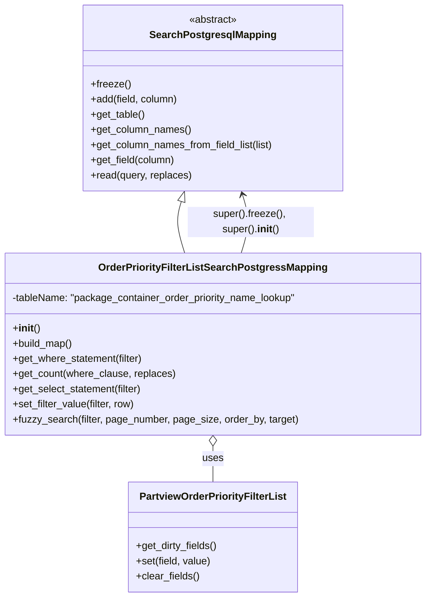

# Diagram: partview_core/partview_service/partview_service/persistence/sql/postgresql/OrderPriorityFilterListSearchPostgresqlMapping.py

> Auto-generated by Obscura crawlers

## Mermaid

### SVG

<svg id="container" width="667.8984375" xmlns="http://www.w3.org/2000/svg" class="classDiagram" height="944" viewBox="0 0 667.8984375 944" role="graphics-document document" aria-roledescription="class"><g><defs><marker id="container_class-aggregationStart" class="marker aggregation class" refX="18" refY="7" markerWidth="190" markerHeight="240" orient="auto"><path d="M 18,7 L9,13 L1,7 L9,1 Z"></path></marker></defs><defs><marker id="container_class-aggregationEnd" class="marker aggregation class" refX="1" refY="7" markerWidth="20" markerHeight="28" orient="auto"><path d="M 18,7 L9,13 L1,7 L9,1 Z"></path></marker></defs><defs><marker id="container_class-extensionStart" class="marker extension class" refX="18" refY="7" markerWidth="190" markerHeight="240" orient="auto"><path d="M 1,7 L18,13 V 1 Z"></path></marker></defs><defs><marker id="container_class-extensionEnd" class="marker extension class" refX="1" refY="7" markerWidth="20" markerHeight="28" orient="auto"><path d="M 1,1 V 13 L18,7 Z"></path></marker></defs><defs><marker id="container_class-compositionStart" class="marker composition class" refX="18" refY="7" markerWidth="190" markerHeight="240" orient="auto"><path d="M 18,7 L9,13 L1,7 L9,1 Z"></path></marker></defs><defs><marker id="container_class-compositionEnd" class="marker composition class" refX="1" refY="7" markerWidth="20" markerHeight="28" orient="auto"><path d="M 18,7 L9,13 L1,7 L9,1 Z"></path></marker></defs><defs><marker id="container_class-dependencyStart" class="marker dependency class" refX="6" refY="7" markerWidth="190" markerHeight="240" orient="auto"><path d="M 5,7 L9,13 L1,7 L9,1 Z"></path></marker></defs><defs><marker id="container_class-dependencyEnd" class="marker dependency class" refX="13" refY="7" markerWidth="20" markerHeight="28" orient="auto"><path d="M 18,7 L9,13 L14,7 L9,1 Z"></path></marker></defs><defs><marker id="container_class-lollipopStart" class="marker lollipop class" refX="13" refY="7" markerWidth="190" markerHeight="240" orient="auto"><circle stroke="black" fill="transparent" cx="7" cy="7" r="6"></circle></marker></defs><defs><marker id="container_class-lollipopEnd" class="marker lollipop class" refX="1" refY="7" markerWidth="190" markerHeight="240" orient="auto"><circle stroke="black" fill="transparent" cx="7" cy="7" r="6"></circle></marker></defs><g class="root"><g class="clusters"></g><g class="edgePaths"><path d="M283.9,318.494L282.241,323.912C280.583,329.33,277.266,340.165,278.147,353.749C279.027,367.333,284.105,383.667,286.644,391.833L289.182,400" id="id_SearchPostgresqlMapping_OrderPriorityFilterListSearchPostgressMapping_1" class="edge-thickness-normal edge-pattern-solid relation" style=";;;" data-edge="true" data-et="edge" data-id="id_SearchPostgresqlMapping_OrderPriorityFilterListSearchPostgressMapping_1" data-points="W3sieCI6Mjg4Ljk0OTIxODc1LCJ5IjozMDJ9LHsieCI6MjczLjk0OTIxODc1LCJ5IjozNTF9LHsieCI6Mjg5LjE4MjM3OTM3MTc2MTY3LCJ5Ijo0MDB9XQ==" marker-start="url(#container_class-extensionStart)"></path><path d="M333.949,705.25L333.949,708.542C333.949,711.833,333.949,718.417,333.949,727.875C333.949,737.333,333.949,749.667,333.949,755.833L333.949,762" id="id_OrderPriorityFilterListSearchPostgressMapping_PartviewOrderPriorityFilterList_2" class="edge-thickness-normal edge-pattern-solid relation" style=";;;" data-edge="true" data-et="edge" data-id="id_OrderPriorityFilterListSearchPostgressMapping_PartviewOrderPriorityFilterList_2" data-points="W3sieCI6MzMzLjk0OTIxODc1LCJ5Ijo2ODh9LHsieCI6MzMzLjk0OTIxODc1LCJ5Ijo3MjV9LHsieCI6MzMzLjk0OTIxODc1LCJ5Ijo3NjJ9XQ==" marker-start="url(#container_class-aggregationStart)"></path><path d="M378.716,400L381.255,391.833C383.794,383.667,388.871,367.333,389.203,351.956C389.535,336.579,385.12,322.158,382.913,314.948L380.706,307.737" id="id_OrderPriorityFilterListSearchPostgressMapping_SearchPostgresqlMapping_3" class="edge-thickness-normal edge-pattern-solid relation" style=";;;" data-edge="true" data-et="edge" data-id="id_OrderPriorityFilterListSearchPostgressMapping_SearchPostgresqlMapping_3" data-points="W3sieCI6Mzc4LjcxNjA1ODEyODIzODMzLCJ5Ijo0MDB9LHsieCI6MzkzLjk0OTIxODc1LCJ5IjozNTF9LHsieCI6Mzc4Ljk0OTIxODc1LCJ5IjozMDJ9XQ==" marker-end="url(#container_class-dependencyEnd)"></path></g><g class="edgeLabels"><g class="edgeLabel"><g class="label" data-id="id_SearchPostgresqlMapping_OrderPriorityFilterListSearchPostgressMapping_1" transform="translate(0, 0)"><foreignObject width="0" height="0">

</foreignObject></g></g><g class="edgeLabel" transform="translate(333.94921875, 725)"><g class="label" data-id="id_OrderPriorityFilterListSearchPostgressMapping_PartviewOrderPriorityFilterList_2" transform="translate(-16.4921875, -12)"><foreignObject width="32.984375" height="24">

uses

</foreignObject></g></g><g class="edgeLabel" transform="translate(393.93902, 351.03282)"><g class="label" data-id="id_OrderPriorityFilterListSearchPostgressMapping_SearchPostgresqlMapping_3" transform="translate(-100, -24)"><foreignObject width="200" height="48">

super().freeze(), super().<strong>init</strong>()

</foreignObject></g></g></g><g class="nodes"><g class="node default" id="classId-SearchPostgresqlMapping-0" transform="translate(333.94921875, 155)"><g class="basic label-container"><path d="M-206.51953125 -147 L206.51953125 -147 L206.51953125 147 L-206.51953125 147" stroke="none" stroke-width="0" fill="#ECECFF" style=""></path><path d="M-206.51953125 -147 C-71.97005314975448 -147, 62.579424950491045 -147, 206.51953125 -147 M-206.51953125 -147 C-54.967075045718644 -147, 96.58538115856271 -147, 206.51953125 -147 M206.51953125 -147 C206.51953125 -71.56780332416716, 206.51953125 3.864393351665683, 206.51953125 147 M206.51953125 -147 C206.51953125 -76.36310947030827, 206.51953125 -5.726218940616548, 206.51953125 147 M206.51953125 147 C44.514544452090576 147, -117.49044234581885 147, -206.51953125 147 M206.51953125 147 C81.71263440163676 147, -43.094262446726475 147, -206.51953125 147 M-206.51953125 147 C-206.51953125 61.39654102205786, -206.51953125 -24.20691795588428, -206.51953125 -147 M-206.51953125 147 C-206.51953125 35.086288488908394, -206.51953125 -76.82742302218321, -206.51953125 -147" stroke="#9370DB" stroke-width="1.3" fill="none" stroke-dasharray="0 0" style=""></path></g><g class="annotation-group text" transform="translate(-38.609375, -123)"><g class="label" style="" transform="translate(0,-12)"><foreignObject width="77.21875" height="24">

«abstract»

</foreignObject></g></g><g class="label-group text" transform="translate(-95.1171875, -99)"><g class="label" style="font-weight: bolder" transform="translate(0,-12)"><foreignObject width="190.234375" height="24">

SearchPostgresqlMapping

</foreignObject></g></g><g class="members-group text" transform="translate(-194.51953125, -51)"></g><g class="methods-group text" transform="translate(-194.51953125, -21)"><g class="label" style="" transform="translate(0,-12)"><foreignObject width="62.109375" height="24">

+freeze()

</foreignObject></g><g class="label" style="" transform="translate(0,12)"><foreignObject width="139.890625" height="24">

+add(field, column)

</foreignObject></g><g class="label" style="" transform="translate(0,36)"><foreignObject width="86.125" height="24">

+get_table()

</foreignObject></g><g class="label" style="" transform="translate(0,60)"><foreignObject width="158.984375" height="24">

+get_column_names()

</foreignObject></g><g class="label" style="" transform="translate(0,84)"><foreignObject width="293.921875" height="24">

+get_column_names_from_field_list(list)

</foreignObject></g><g class="label" style="" transform="translate(0,108)"><foreignObject width="134.78125" height="24">

+get_field(column)

</foreignObject></g><g class="label" style="" transform="translate(0,132)"><foreignObject width="160.734375" height="24">

+read(query, replaces)

</foreignObject></g></g><g class="divider" style=""><path d="M-206.51953125 -75 C-118.51536707940619 -75, -30.51120290881238 -75, 206.51953125 -75 M-206.51953125 -75 C-113.77547800020415 -75, -21.03142475040829 -75, 206.51953125 -75" stroke="#9370DB" stroke-width="1.3" fill="none" stroke-dasharray="0 0" style=""></path></g><g class="divider" style=""><path d="M-206.51953125 -51 C-123.68760116655433 -51, -40.85567108310866 -51, 206.51953125 -51 M-206.51953125 -51 C-98.0675232158284 -51, 10.384484818343196 -51, 206.51953125 -51" stroke="#9370DB" stroke-width="1.3" fill="none" stroke-dasharray="0 0" style=""></path></g></g><g class="node default" id="classId-PartviewOrderPriorityFilterList-1" transform="translate(333.94921875, 849)"><g class="basic label-container"><path d="M-133.07421875 -87 L133.07421875 -87 L133.07421875 87 L-133.07421875 87" stroke="none" stroke-width="0" fill="#ECECFF" style=""></path><path d="M-133.07421875 -87 C-41.85352292433295 -87, 49.3671729013341 -87, 133.07421875 -87 M-133.07421875 -87 C-46.856244633262975 -87, 39.36172948347405 -87, 133.07421875 -87 M133.07421875 -87 C133.07421875 -36.99948328737681, 133.07421875 13.001033425246376, 133.07421875 87 M133.07421875 -87 C133.07421875 -22.6659349481196, 133.07421875 41.6681301037608, 133.07421875 87 M133.07421875 87 C78.25386559972131 87, 23.433512449442603 87, -133.07421875 87 M133.07421875 87 C31.121734402306032 87, -70.83074994538794 87, -133.07421875 87 M-133.07421875 87 C-133.07421875 43.56639008679883, -133.07421875 0.13278017359766636, -133.07421875 -87 M-133.07421875 87 C-133.07421875 20.228120126645834, -133.07421875 -46.54375974670833, -133.07421875 -87" stroke="#9370DB" stroke-width="1.3" fill="none" stroke-dasharray="0 0" style=""></path></g><g class="annotation-group text" transform="translate(0, -63)"></g><g class="label-group text" transform="translate(-112.3203125, -63)"><g class="label" style="font-weight: bolder" transform="translate(0,-12)"><foreignObject width="224.640625" height="24">

PartviewOrderPriorityFilterList

</foreignObject></g></g><g class="members-group text" transform="translate(-121.07421875, -15)"></g><g class="methods-group text" transform="translate(-121.07421875, 15)"><g class="label" style="" transform="translate(0,-12)"><foreignObject width="129.828125" height="24">

+get_dirty_fields()

</foreignObject></g><g class="label" style="" transform="translate(0,12)"><foreignObject width="119.390625" height="24">

+set(field, value)

</foreignObject></g><g class="label" style="" transform="translate(0,36)"><foreignObject width="100.34375" height="24">

+clear_fields()

</foreignObject></g></g><g class="divider" style=""><path d="M-133.07421875 -39 C-66.55661245186178 -39, -0.03900615372356242 -39, 133.07421875 -39 M-133.07421875 -39 C-78.23620689043997 -39, -23.398195030879947 -39, 133.07421875 -39" stroke="#9370DB" stroke-width="1.3" fill="none" stroke-dasharray="0 0" style=""></path></g><g class="divider" style=""><path d="M-133.07421875 -15 C-71.34551750364199 -15, -9.616816257283972 -15, 133.07421875 -15 M-133.07421875 -15 C-53.826081485405794 -15, 25.422055779188412 -15, 133.07421875 -15" stroke="#9370DB" stroke-width="1.3" fill="none" stroke-dasharray="0 0" style=""></path></g></g><g class="node default" id="classId-OrderPriorityFilterListSearchPostgressMapping-2" transform="translate(333.94921875, 544)"><g class="basic label-container"><path d="M-325.94921875 -144 L325.94921875 -144 L325.94921875 144 L-325.94921875 144" stroke="none" stroke-width="0" fill="#ECECFF" style=""></path><path d="M-325.94921875 -144 C-164.2707529018634 -144, -2.592287053726807 -144, 325.94921875 -144 M-325.94921875 -144 C-133.17620534801392 -144, 59.596808053972154 -144, 325.94921875 -144 M325.94921875 -144 C325.94921875 -84.00488003968145, 325.94921875 -24.009760079362906, 325.94921875 144 M325.94921875 -144 C325.94921875 -78.47021167741524, 325.94921875 -12.940423354830472, 325.94921875 144 M325.94921875 144 C79.529969405799 144, -166.889279938402 144, -325.94921875 144 M325.94921875 144 C121.42138873770017 144, -83.10644127459966 144, -325.94921875 144 M-325.94921875 144 C-325.94921875 69.12138052684293, -325.94921875 -5.757238946314146, -325.94921875 -144 M-325.94921875 144 C-325.94921875 84.77599638889772, -325.94921875 25.551992777795448, -325.94921875 -144" stroke="#9370DB" stroke-width="1.3" fill="none" stroke-dasharray="0 0" style=""></path></g><g class="annotation-group text" transform="translate(0, -120)"></g><g class="label-group text" transform="translate(-172.2734375, -120)"><g class="label" style="font-weight: bolder" transform="translate(0,-12)"><foreignObject width="344.546875" height="24">

OrderPriorityFilterListSearchPostgressMapping

</foreignObject></g></g><g class="members-group text" transform="translate(-313.94921875, -72)"><g class="label" style="" transform="translate(0,-12)"><foreignObject width="455.625" height="24">

-tableName: "package_container_order_priority_name_lookup"

</foreignObject></g></g><g class="methods-group text" transform="translate(-313.94921875, -24)"><g class="label" style="" transform="translate(0,-12)"><foreignObject width="42.796875" height="24">

+<strong>init</strong>()

</foreignObject></g><g class="label" style="" transform="translate(0,12)"><foreignObject width="96.109375" height="24">

+build_map()

</foreignObject></g><g class="label" style="" transform="translate(0,36)"><foreignObject width="208.90625" height="24">

+get_where_statement(filter)

</foreignObject></g><g class="label" style="" transform="translate(0,60)"><foreignObject width="256.859375" height="24">

+get_count(where_clause, replaces)

</foreignObject></g><g class="label" style="" transform="translate(0,84)"><foreignObject width="208.5" height="24">

+get_select_statement(filter)

</foreignObject></g><g class="label" style="" transform="translate(0,108)"><foreignObject width="195.71875" height="24">

+set_filter_value(filter, row)

</foreignObject></g><g class="label" style="" transform="translate(0,132)"><foreignObject width="449.671875" height="24">

+fuzzy_search(filter, page_number, page_size, order_by, target)

</foreignObject></g></g><g class="divider" style=""><path d="M-325.94921875 -96 C-150.49442566239563 -96, 24.960367425208744 -96, 325.94921875 -96 M-325.94921875 -96 C-69.65860271426976 -96, 186.63201332146048 -96, 325.94921875 -96" stroke="#9370DB" stroke-width="1.3" fill="none" stroke-dasharray="0 0" style=""></path></g><g class="divider" style=""><path d="M-325.94921875 -48 C-90.6643672307471 -48, 144.6204842885058 -48, 325.94921875 -48 M-325.94921875 -48 C-138.16953034682183 -48, 49.61015805635634 -48, 325.94921875 -48" stroke="#9370DB" stroke-width="1.3" fill="none" stroke-dasharray="0 0" style=""></path></g></g></g></g></g></svg>
