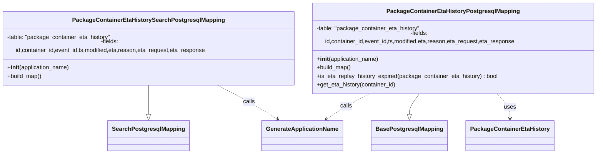

# Diagram: partview_core/partview_service/partview_service/persistence/sql/postgresql/PackageContainerEtaHistoryPostgresqlMapping.py

> Auto-generated by Obscura crawlers

## Mermaid

### SVG

<svg id="container" width="1655.8203125" xmlns="http://www.w3.org/2000/svg" class="classDiagram" height="414" viewBox="0 0 1655.8203125 414" role="graphics-document document" aria-roledescription="class"><g><defs><marker id="container_class-aggregationStart" class="marker aggregation class" refX="18" refY="7" markerWidth="190" markerHeight="240" orient="auto"><path d="M 18,7 L9,13 L1,7 L9,1 Z"></path></marker></defs><defs><marker id="container_class-aggregationEnd" class="marker aggregation class" refX="1" refY="7" markerWidth="20" markerHeight="28" orient="auto"><path d="M 18,7 L9,13 L1,7 L9,1 Z"></path></marker></defs><defs><marker id="container_class-extensionStart" class="marker extension class" refX="18" refY="7" markerWidth="190" markerHeight="240" orient="auto"><path d="M 1,7 L18,13 V 1 Z"></path></marker></defs><defs><marker id="container_class-extensionEnd" class="marker extension class" refX="1" refY="7" markerWidth="20" markerHeight="28" orient="auto"><path d="M 1,1 V 13 L18,7 Z"></path></marker></defs><defs><marker id="container_class-compositionStart" class="marker composition class" refX="18" refY="7" markerWidth="190" markerHeight="240" orient="auto"><path d="M 18,7 L9,13 L1,7 L9,1 Z"></path></marker></defs><defs><marker id="container_class-compositionEnd" class="marker composition class" refX="1" refY="7" markerWidth="20" markerHeight="28" orient="auto"><path d="M 18,7 L9,13 L1,7 L9,1 Z"></path></marker></defs><defs><marker id="container_class-dependencyStart" class="marker dependency class" refX="6" refY="7" markerWidth="190" markerHeight="240" orient="auto"><path d="M 5,7 L9,13 L1,7 L9,1 Z"></path></marker></defs><defs><marker id="container_class-dependencyEnd" class="marker dependency class" refX="13" refY="7" markerWidth="20" markerHeight="28" orient="auto"><path d="M 18,7 L9,13 L14,7 L9,1 Z"></path></marker></defs><defs><marker id="container_class-lollipopStart" class="marker lollipop class" refX="13" refY="7" markerWidth="190" markerHeight="240" orient="auto"><circle stroke="black" fill="transparent" cx="7" cy="7" r="6"></circle></marker></defs><defs><marker id="container_class-lollipopEnd" class="marker lollipop class" refX="1" refY="7" markerWidth="190" markerHeight="240" orient="auto"><circle stroke="black" fill="transparent" cx="7" cy="7" r="6"></circle></marker></defs><g class="root"><g class="clusters"></g><g class="edgePaths"><path d="M411.633,224L411.633,234.167C411.633,244.333,411.633,264.667,411.633,278.125C411.633,291.583,411.633,298.167,411.633,301.458L411.633,304.75" id="id_PackageContainerEtaHistorySearchPostgresqlMapping_SearchPostgresqlMapping_1" class="edge-thickness-normal edge-pattern-solid relation" style=";;;" data-edge="true" data-et="edge" data-id="id_PackageContainerEtaHistorySearchPostgresqlMapping_SearchPostgresqlMapping_1" data-points="W3sieCI6NDExLjYzMjgxMjUsInkiOjIyNH0seyJ4Ijo0MTEuNjMyODEyNSwieSI6Mjg1fSx7IngiOjQxMS42MzI4MTI1LCJ5IjozMjJ9XQ==" marker-end="url(#container_class-extensionEnd)"></path><path d="M1169.111,248L1164.618,254.167C1160.125,260.333,1151.138,272.667,1146.645,282.125C1142.152,291.583,1142.152,298.167,1142.152,301.458L1142.152,304.75" id="id_PackageContainerEtaHistoryPostgresqlMapping_BasePostgresqlMapping_2" class="edge-thickness-normal edge-pattern-solid relation" style=";;;" data-edge="true" data-et="edge" data-id="id_PackageContainerEtaHistoryPostgresqlMapping_BasePostgresqlMapping_2" data-points="W3sieCI6MTE2OS4xMTA2NDM5MDkyMzU3LCJ5IjoyNDh9LHsieCI6MTE0Mi4xNTIzNDM3NSwieSI6Mjg1fSx7IngiOjExNDIuMTUyMzQzNzUsInkiOjMyMn1d" marker-end="url(#container_class-extensionEnd)"></path><path d="M1371.832,248L1377.756,254.167C1383.681,260.333,1395.53,272.667,1401.454,284C1407.379,295.333,1407.379,305.667,1407.379,310.833L1407.379,316" id="id_PackageContainerEtaHistoryPostgresqlMapping_PackageContainerEtaHistory_3" class="edge-thickness-normal edge-pattern-dashed relation" style=";;;" data-edge="true" data-et="edge" data-id="id_PackageContainerEtaHistoryPostgresqlMapping_PackageContainerEtaHistory_3" data-points="W3sieCI6MTM3MS44MzE1ODMzOTk2ODE0LCJ5IjoyNDh9LHsieCI6MTQwNy4zNzg5MDYyNSwieSI6Mjg1fSx7IngiOjE0MDcuMzc4OTA2MjUsInkiOjMyMn1d" marker-end="url(#container_class-dependencyEnd)"></path><path d="M602.292,224L622.483,234.167C642.674,244.333,683.057,264.667,711.344,280.431C739.63,296.196,755.821,307.392,763.917,312.99L772.012,318.587" id="id_PackageContainerEtaHistorySearchPostgresqlMapping_GenerateApplicationName_4" class="edge-thickness-normal edge-pattern-dashed relation" style=";;;" data-edge="true" data-et="edge" data-id="id_PackageContainerEtaHistorySearchPostgresqlMapping_GenerateApplicationName_4" data-points="W3sieCI6NjAyLjI5MTY1MDA3OTYxNzksInkiOjIyNH0seyJ4Ijo3MjMuNDM5NDUzMTI1LCJ5IjoyODV9LHsieCI6Nzc2Ljk0NzExNzI4NjM5MjQsInkiOjMyMn1d" marker-end="url(#container_class-dependencyEnd)"></path><path d="M1020.969,248L1008.863,254.167C996.757,260.333,972.546,272.667,952.617,284.419C932.687,296.171,917.041,307.342,909.218,312.928L901.394,318.514" id="id_PackageContainerEtaHistoryPostgresqlMapping_GenerateApplicationName_5" class="edge-thickness-normal edge-pattern-dashed relation" style=";;;" data-edge="true" data-et="edge" data-id="id_PackageContainerEtaHistoryPostgresqlMapping_GenerateApplicationName_5" data-points="W3sieCI6MTAyMC45NjkyMjI3MzA4OTE3LCJ5IjoyNDh9LHsieCI6OTQ4LjMzMzk4NDM3NSwieSI6Mjg1fSx7IngiOjg5Ni41MTEyOTg0NTcyNzg1LCJ5IjozMjJ9XQ==" marker-end="url(#container_class-dependencyEnd)"></path></g><g class="edgeLabels"><g class="edgeLabel"><g class="label" data-id="id_PackageContainerEtaHistorySearchPostgresqlMapping_SearchPostgresqlMapping_1" transform="translate(0, 0)"><foreignObject width="0" height="0">

</foreignObject></g></g><g class="edgeLabel"><g class="label" data-id="id_PackageContainerEtaHistoryPostgresqlMapping_BasePostgresqlMapping_2" transform="translate(0, 0)"><foreignObject width="0" height="0">

</foreignObject></g></g><g class="edgeLabel" transform="translate(1407.37890625, 285)"><g class="label" data-id="id_PackageContainerEtaHistoryPostgresqlMapping_PackageContainerEtaHistory_3" transform="translate(-16.4921875, -12)"><foreignObject width="32.984375" height="24">

uses

</foreignObject></g></g><g class="edgeLabel" transform="translate(691.91776, 269.12829)"><g class="label" data-id="id_PackageContainerEtaHistorySearchPostgresqlMapping_GenerateApplicationName_4" transform="translate(-16.4453125, -12)"><foreignObject width="32.890625" height="24">

calls

</foreignObject></g></g><g class="edgeLabel" transform="translate(956.28238, 280.95113)"><g class="label" data-id="id_PackageContainerEtaHistoryPostgresqlMapping_GenerateApplicationName_5" transform="translate(-16.4453125, -12)"><foreignObject width="32.890625" height="24">

calls

</foreignObject></g></g></g><g class="nodes"><g class="node default" id="classId-SearchPostgresqlMapping-0" transform="translate(411.6328125, 364)"><g class="basic label-container"><path d="M-107.1171875 -42 L107.1171875 -42 L107.1171875 42 L-107.1171875 42" stroke="none" stroke-width="0" fill="#ECECFF" style=""></path><path d="M-107.1171875 -42 C-47.91307292422209 -42, 11.291041651555815 -42, 107.1171875 -42 M-107.1171875 -42 C-21.96079101292139 -42, 63.19560547415722 -42, 107.1171875 -42 M107.1171875 -42 C107.1171875 -17.955775635171296, 107.1171875 6.088448729657408, 107.1171875 42 M107.1171875 -42 C107.1171875 -22.36445233299594, 107.1171875 -2.7289046659918768, 107.1171875 42 M107.1171875 42 C59.27702581577225 42, 11.436864131544496 42, -107.1171875 42 M107.1171875 42 C47.69803843663814 42, -11.721110626723714 42, -107.1171875 42 M-107.1171875 42 C-107.1171875 19.896780626148107, -107.1171875 -2.2064387477037855, -107.1171875 -42 M-107.1171875 42 C-107.1171875 14.56474557128039, -107.1171875 -12.87050885743922, -107.1171875 -42" stroke="#9370DB" stroke-width="1.3" fill="none" stroke-dasharray="0 0" style=""></path></g><g class="annotation-group text" transform="translate(0, -18)"></g><g class="label-group text" transform="translate(-95.1171875, -18)"><g class="label" style="font-weight: bolder" transform="translate(0,-12)"><foreignObject width="190.234375" height="24">

SearchPostgresqlMapping

</foreignObject></g></g><g class="members-group text" transform="translate(-95.1171875, 30)"></g><g class="methods-group text" transform="translate(-95.1171875, 60)"></g><g class="divider" style=""><path d="M-107.1171875 6 C-22.87686904449994 6, 61.36344941100012 6, 107.1171875 6 M-107.1171875 6 C-41.337346296196955 6, 24.44249490760609 6, 107.1171875 6" stroke="#9370DB" stroke-width="1.3" fill="none" stroke-dasharray="0 0" style=""></path></g><g class="divider" style=""><path d="M-107.1171875 24 C-55.275291243534554 24, -3.433394987069107 24, 107.1171875 24 M-107.1171875 24 C-34.6956801330591 24, 37.7258272338818 24, 107.1171875 24" stroke="#9370DB" stroke-width="1.3" fill="none" stroke-dasharray="0 0" style=""></path></g></g><g class="node default" id="classId-BasePostgresqlMapping-1" transform="translate(1142.15234375, 364)"><g class="basic label-container"><path d="M-99.921875 -42 L99.921875 -42 L99.921875 42 L-99.921875 42" stroke="none" stroke-width="0" fill="#ECECFF" style=""></path><path d="M-99.921875 -42 C-42.094239760024244 -42, 15.733395479951511 -42, 99.921875 -42 M-99.921875 -42 C-42.63081728892425 -42, 14.660240422151503 -42, 99.921875 -42 M99.921875 -42 C99.921875 -23.086340580693935, 99.921875 -4.172681161387871, 99.921875 42 M99.921875 -42 C99.921875 -17.180371157137294, 99.921875 7.639257685725411, 99.921875 42 M99.921875 42 C30.95282454578289 42, -38.01622590843422 42, -99.921875 42 M99.921875 42 C29.089446430765335 42, -41.74298213846933 42, -99.921875 42 M-99.921875 42 C-99.921875 20.723328047485282, -99.921875 -0.5533439050294362, -99.921875 -42 M-99.921875 42 C-99.921875 16.23492479305187, -99.921875 -9.530150413896258, -99.921875 -42" stroke="#9370DB" stroke-width="1.3" fill="none" stroke-dasharray="0 0" style=""></path></g><g class="annotation-group text" transform="translate(0, -18)"></g><g class="label-group text" transform="translate(-87.921875, -18)"><g class="label" style="font-weight: bolder" transform="translate(0,-12)"><foreignObject width="175.84375" height="24">

BasePostgresqlMapping

</foreignObject></g></g><g class="members-group text" transform="translate(-87.921875, 30)"></g><g class="methods-group text" transform="translate(-87.921875, 60)"></g><g class="divider" style=""><path d="M-99.921875 6 C-37.88513022606231 6, 24.151614547875383 6, 99.921875 6 M-99.921875 6 C-34.77589818905682 6, 30.370078621886364 6, 99.921875 6" stroke="#9370DB" stroke-width="1.3" fill="none" stroke-dasharray="0 0" style=""></path></g><g class="divider" style=""><path d="M-99.921875 24 C-33.201457913834176 24, 33.51895917233165 24, 99.921875 24 M-99.921875 24 C-21.879251501114084 24, 56.16337199777183 24, 99.921875 24" stroke="#9370DB" stroke-width="1.3" fill="none" stroke-dasharray="0 0" style=""></path></g></g><g class="node default" id="classId-PackageContainerEtaHistorySearchPostgresqlMapping-2" transform="translate(411.6328125, 128)"><g class="basic label-container"><path d="M-403.6328125 -96 L403.6328125 -96 L403.6328125 96 L-403.6328125 96" stroke="none" stroke-width="0" fill="#ECECFF" style=""></path><path d="M-403.6328125 -96 C-185.01657426226848 -96, 33.599663975463045 -96, 403.6328125 -96 M-403.6328125 -96 C-121.17360004964075 -96, 161.2856124007185 -96, 403.6328125 -96 M403.6328125 -96 C403.6328125 -24.747629516741455, 403.6328125 46.50474096651709, 403.6328125 96 M403.6328125 -96 C403.6328125 -22.67654453047375, 403.6328125 50.6469109390525, 403.6328125 96 M403.6328125 96 C91.88011855843644 96, -219.87257538312713 96, -403.6328125 96 M403.6328125 96 C100.92646412169955 96, -201.7798842566009 96, -403.6328125 96 M-403.6328125 96 C-403.6328125 25.907848110035133, -403.6328125 -44.184303779929735, -403.6328125 -96 M-403.6328125 96 C-403.6328125 51.23517294632382, -403.6328125 6.470345892647643, -403.6328125 -96" stroke="#9370DB" stroke-width="1.3" fill="none" stroke-dasharray="0 0" style=""></path></g><g class="annotation-group text" transform="translate(0, -72)"></g><g class="label-group text" transform="translate(-198.421875, -72)"><g class="label" style="font-weight: bolder" transform="translate(0,-12)"><foreignObject width="396.84375" height="24">

PackageContainerEtaHistorySearchPostgresqlMapping

</foreignObject></g></g><g class="members-group text" transform="translate(-391.6328125, -24)"><g class="label" style="" transform="translate(0,-12)"><foreignObject width="288.703125" height="24">

-table: "package_container_eta_history"

</foreignObject></g><g class="label" style="" transform="translate(0,12)"><foreignObject width="584.84375" height="24">

-fields: id,container_id,event_id,ts,modified,eta,reason,eta_request,eta_response

</foreignObject></g></g><g class="methods-group text" transform="translate(-391.6328125, 48)"><g class="label" style="" transform="translate(0,-12)"><foreignObject width="173.734375" height="24">

+<strong>init</strong>(application_name)

</foreignObject></g><g class="label" style="" transform="translate(0,12)"><foreignObject width="96.109375" height="24">

+build_map()

</foreignObject></g></g><g class="divider" style=""><path d="M-403.6328125 -48 C-159.586643005701 -48, 84.45952648859799 -48, 403.6328125 -48 M-403.6328125 -48 C-230.93424894648862 -48, -58.235685392977246 -48, 403.6328125 -48" stroke="#9370DB" stroke-width="1.3" fill="none" stroke-dasharray="0 0" style=""></path></g><g class="divider" style=""><path d="M-403.6328125 24 C-83.79698157631407 24, 236.03884934737187 24, 403.6328125 24 M-403.6328125 24 C-129.82860002135305 24, 143.9756124572939 24, 403.6328125 24" stroke="#9370DB" stroke-width="1.3" fill="none" stroke-dasharray="0 0" style=""></path></g></g><g class="node default" id="classId-PackageContainerEtaHistoryPostgresqlMapping-3" transform="translate(1256.54296875, 128)"><g class="basic label-container"><path d="M-391.27734375 -120 L391.27734375 -120 L391.27734375 120 L-391.27734375 120" stroke="none" stroke-width="0" fill="#ECECFF" style=""></path><path d="M-391.27734375 -120 C-234.3860373727967 -120, -77.49473099559339 -120, 391.27734375 -120 M-391.27734375 -120 C-136.56316772605518 -120, 118.15100829788963 -120, 391.27734375 -120 M391.27734375 -120 C391.27734375 -25.63666337147093, 391.27734375 68.72667325705814, 391.27734375 120 M391.27734375 -120 C391.27734375 -55.53859395865783, 391.27734375 8.922812082684345, 391.27734375 120 M391.27734375 120 C195.9543210448088 120, 0.6312983396176151 120, -391.27734375 120 M391.27734375 120 C94.22527203861586 120, -202.8267996727683 120, -391.27734375 120 M-391.27734375 120 C-391.27734375 43.557491560208774, -391.27734375 -32.88501687958245, -391.27734375 -120 M-391.27734375 120 C-391.27734375 37.7183722175604, -391.27734375 -44.5632555648792, -391.27734375 -120" stroke="#9370DB" stroke-width="1.3" fill="none" stroke-dasharray="0 0" style=""></path></g><g class="annotation-group text" transform="translate(0, -96)"></g><g class="label-group text" transform="translate(-173.7109375, -96)"><g class="label" style="font-weight: bolder" transform="translate(0,-12)"><foreignObject width="347.421875" height="24">

PackageContainerEtaHistoryPostgresqlMapping

</foreignObject></g></g><g class="members-group text" transform="translate(-379.27734375, -48)"><g class="label" style="" transform="translate(0,-12)"><foreignObject width="288.703125" height="24">

-table: "package_container_eta_history"

</foreignObject></g><g class="label" style="" transform="translate(0,12)"><foreignObject width="584.84375" height="24">

-fields: id,container_id,event_id,ts,modified,eta,reason,eta_request,eta_response

</foreignObject></g></g><g class="methods-group text" transform="translate(-379.27734375, 24)"><g class="label" style="" transform="translate(0,-12)"><foreignObject width="173.734375" height="24">

+<strong>init</strong>(application_name)

</foreignObject></g><g class="label" style="" transform="translate(0,12)"><foreignObject width="96.109375" height="24">

+build_map()

</foreignObject></g><g class="label" style="" transform="translate(0,36)"><foreignObject width="503.75" height="24">

+is_eta_replay_history_expired(package_container_eta_history) : bool

</foreignObject></g><g class="label" style="" transform="translate(0,60)"><foreignObject width="220.9375" height="24">

+get_eta_history(container_id)

</foreignObject></g></g><g class="divider" style=""><path d="M-391.27734375 -72 C-109.4602190857334 -72, 172.3569055785332 -72, 391.27734375 -72 M-391.27734375 -72 C-173.8695714903854 -72, 43.538200769229206 -72, 391.27734375 -72" stroke="#9370DB" stroke-width="1.3" fill="none" stroke-dasharray="0 0" style=""></path></g><g class="divider" style=""><path d="M-391.27734375 0 C-136.6571737711275 0, 117.962996207745 0, 391.27734375 0 M-391.27734375 0 C-214.02746616303784 0, -36.777588576075686 0, 391.27734375 0" stroke="#9370DB" stroke-width="1.3" fill="none" stroke-dasharray="0 0" style=""></path></g></g><g class="node default" id="classId-PackageContainerEtaHistory-4" transform="translate(1407.37890625, 364)"><g class="basic label-container"><path d="M-115.3046875 -42 L115.3046875 -42 L115.3046875 42 L-115.3046875 42" stroke="none" stroke-width="0" fill="#ECECFF" style=""></path><path d="M-115.3046875 -42 C-28.6858831307796 -42, 57.9329212384408 -42, 115.3046875 -42 M-115.3046875 -42 C-48.19507704662058 -42, 18.914533406758835 -42, 115.3046875 -42 M115.3046875 -42 C115.3046875 -20.527428915104817, 115.3046875 0.9451421697903655, 115.3046875 42 M115.3046875 -42 C115.3046875 -10.259275866424854, 115.3046875 21.48144826715029, 115.3046875 42 M115.3046875 42 C38.15953933056777 42, -38.985608838864465 42, -115.3046875 42 M115.3046875 42 C52.689469306537354 42, -9.925748886925291 42, -115.3046875 42 M-115.3046875 42 C-115.3046875 11.16675628115392, -115.3046875 -19.66648743769216, -115.3046875 -42 M-115.3046875 42 C-115.3046875 11.188264266495622, -115.3046875 -19.623471467008756, -115.3046875 -42" stroke="#9370DB" stroke-width="1.3" fill="none" stroke-dasharray="0 0" style=""></path></g><g class="annotation-group text" transform="translate(0, -18)"></g><g class="label-group text" transform="translate(-103.3046875, -18)"><g class="label" style="font-weight: bolder" transform="translate(0,-12)"><foreignObject width="206.609375" height="24">

PackageContainerEtaHistory

</foreignObject></g></g><g class="members-group text" transform="translate(-103.3046875, 30)"></g><g class="methods-group text" transform="translate(-103.3046875, 60)"></g><g class="divider" style=""><path d="M-115.3046875 6 C-46.88850079347297 6, 21.527685913054057 6, 115.3046875 6 M-115.3046875 6 C-25.403525554097456 6, 64.49763639180509 6, 115.3046875 6" stroke="#9370DB" stroke-width="1.3" fill="none" stroke-dasharray="0 0" style=""></path></g><g class="divider" style=""><path d="M-115.3046875 24 C-48.14863517026396 24, 19.007417159472084 24, 115.3046875 24 M-115.3046875 24 C-42.68259911361298 24, 29.93948927277404 24, 115.3046875 24" stroke="#9370DB" stroke-width="1.3" fill="none" stroke-dasharray="0 0" style=""></path></g></g><g class="node default" id="classId-GenerateApplicationName-5" transform="translate(837.685546875, 364)"><g class="basic label-container"><path d="M-107.8203125 -42 L107.8203125 -42 L107.8203125 42 L-107.8203125 42" stroke="none" stroke-width="0" fill="#ECECFF" style=""></path><path d="M-107.8203125 -42 C-61.24984360034305 -42, -14.679374700686097 -42, 107.8203125 -42 M-107.8203125 -42 C-50.43793913925459 -42, 6.944434221490823 -42, 107.8203125 -42 M107.8203125 -42 C107.8203125 -10.458381643904445, 107.8203125 21.08323671219111, 107.8203125 42 M107.8203125 -42 C107.8203125 -24.32531624276965, 107.8203125 -6.6506324855392975, 107.8203125 42 M107.8203125 42 C38.69837412859307 42, -30.423564242813853 42, -107.8203125 42 M107.8203125 42 C27.29744473617977 42, -53.22542302764046 42, -107.8203125 42 M-107.8203125 42 C-107.8203125 23.741196412689707, -107.8203125 5.482392825379414, -107.8203125 -42 M-107.8203125 42 C-107.8203125 21.114652959429247, -107.8203125 0.22930591885849338, -107.8203125 -42" stroke="#9370DB" stroke-width="1.3" fill="none" stroke-dasharray="0 0" style=""></path></g><g class="annotation-group text" transform="translate(0, -18)"></g><g class="label-group text" transform="translate(-95.8203125, -18)"><g class="label" style="font-weight: bolder" transform="translate(0,-12)"><foreignObject width="191.640625" height="24">

GenerateApplicationName

</foreignObject></g></g><g class="members-group text" transform="translate(-95.8203125, 30)"></g><g class="methods-group text" transform="translate(-95.8203125, 60)"></g><g class="divider" style=""><path d="M-107.8203125 6 C-63.81378349472985 6, -19.807254489459694 6, 107.8203125 6 M-107.8203125 6 C-43.32866356289415 6, 21.1629853742117 6, 107.8203125 6" stroke="#9370DB" stroke-width="1.3" fill="none" stroke-dasharray="0 0" style=""></path></g><g class="divider" style=""><path d="M-107.8203125 24 C-22.535591100089576 24, 62.74913029982085 24, 107.8203125 24 M-107.8203125 24 C-62.65487827814605 24, -17.4894440562921 24, 107.8203125 24" stroke="#9370DB" stroke-width="1.3" fill="none" stroke-dasharray="0 0" style=""></path></g></g></g></g></g></svg>
