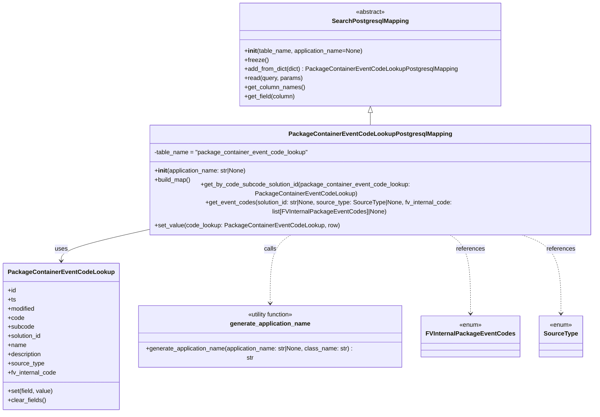

# Diagram: partview_core/partview_service/partview_service/persistence/sql/postgresql/PackageContainerEventCodeLookupPostgresqlMapping.py

> Auto-generated by Obscura crawlers

## Mermaid

### SVG

<svg id="container" width="1553.607421875" xmlns="http://www.w3.org/2000/svg" class="classDiagram" height="1034" viewBox="0 0 1553.607421875 1034" role="graphics-document document" aria-roledescription="class"><g><defs><marker id="container_class-aggregationStart" class="marker aggregation class" refX="18" refY="7" markerWidth="190" markerHeight="240" orient="auto"><path d="M 18,7 L9,13 L1,7 L9,1 Z"></path></marker></defs><defs><marker id="container_class-aggregationEnd" class="marker aggregation class" refX="1" refY="7" markerWidth="20" markerHeight="28" orient="auto"><path d="M 18,7 L9,13 L1,7 L9,1 Z"></path></marker></defs><defs><marker id="container_class-extensionStart" class="marker extension class" refX="18" refY="7" markerWidth="190" markerHeight="240" orient="auto"><path d="M 1,7 L18,13 V 1 Z"></path></marker></defs><defs><marker id="container_class-extensionEnd" class="marker extension class" refX="1" refY="7" markerWidth="20" markerHeight="28" orient="auto"><path d="M 1,1 V 13 L18,7 Z"></path></marker></defs><defs><marker id="container_class-compositionStart" class="marker composition class" refX="18" refY="7" markerWidth="190" markerHeight="240" orient="auto"><path d="M 18,7 L9,13 L1,7 L9,1 Z"></path></marker></defs><defs><marker id="container_class-compositionEnd" class="marker composition class" refX="1" refY="7" markerWidth="20" markerHeight="28" orient="auto"><path d="M 18,7 L9,13 L1,7 L9,1 Z"></path></marker></defs><defs><marker id="container_class-dependencyStart" class="marker dependency class" refX="6" refY="7" markerWidth="190" markerHeight="240" orient="auto"><path d="M 5,7 L9,13 L1,7 L9,1 Z"></path></marker></defs><defs><marker id="container_class-dependencyEnd" class="marker dependency class" refX="13" refY="7" markerWidth="20" markerHeight="28" orient="auto"><path d="M 18,7 L9,13 L14,7 L9,1 Z"></path></marker></defs><defs><marker id="container_class-lollipopStart" class="marker lollipop class" refX="13" refY="7" markerWidth="190" markerHeight="240" orient="auto"><circle stroke="black" fill="transparent" cx="7" cy="7" r="6"></circle></marker></defs><defs><marker id="container_class-lollipopEnd" class="marker lollipop class" refX="1" refY="7" markerWidth="190" markerHeight="240" orient="auto"><circle stroke="black" fill="transparent" cx="7" cy="7" r="6"></circle></marker></defs><g class="root"><g class="clusters"></g><g class="edgePaths"><path d="M955.252,295.25L955.252,296.542C955.252,297.833,955.252,300.417,955.252,305.875C955.252,311.333,955.252,319.667,955.252,323.833L955.252,328" id="id_SearchPostgresqlMapping_PackageContainerEventCodeLookupPostgresqlMapping_1" class="edge-thickness-normal edge-pattern-solid relation" style=";;;" data-edge="true" data-et="edge" data-id="id_SearchPostgresqlMapping_PackageContainerEventCodeLookupPostgresqlMapping_1" data-points="W3sieCI6OTU1LjI1MTk1MzEyNSwieSI6Mjc4fSx7IngiOjk1NS4yNTE5NTMxMjUsInkiOjMwM30seyJ4Ijo5NTUuMjUxOTUzMTI1LCJ5IjozMjh9XQ==" marker-start="url(#container_class-extensionStart)"></path><path d="M364.896,563.235L329.235,570.196C293.574,577.156,222.252,591.078,186.591,603.206C150.93,615.333,150.93,625.667,150.93,630.833L150.93,636" id="id_PackageContainerEventCodeLookupPostgresqlMapping_PackageContainerEventCodeLookup_2" class="edge-thickness-normal edge-pattern-solid relation" style=";;;" data-edge="true" data-et="edge" data-id="id_PackageContainerEventCodeLookupPostgresqlMapping_PackageContainerEventCodeLookup_2" data-points="W3sieCI6MzY0Ljg5NjQ4NDM3NSwieSI6NTYzLjIzNDY2NzE5MTE3NjZ9LHsieCI6MTUwLjkyOTY4NzUsInkiOjYwNX0seyJ4IjoxNTAuOTI5Njg3NSwieSI6NjQyfV0=" marker-end="url(#container_class-dependencyEnd)"></path><path d="M755.781,568L745.53,574.167C735.28,580.333,714.779,592.667,704.528,623.5C694.277,654.333,694.277,703.667,694.277,728.333L694.277,753" id="id_PackageContainerEventCodeLookupPostgresqlMapping_generate_application_name_3" class="edge-thickness-normal edge-pattern-dashed relation" style=";;;" data-edge="true" data-et="edge" data-id="id_PackageContainerEventCodeLookupPostgresqlMapping_generate_application_name_3" data-points="W3sieCI6NzU1Ljc4MDkxNDExMjI2MTEsInkiOjU2OH0seyJ4Ijo2OTQuMjc3MzQzNzUsInkiOjYwNX0seyJ4Ijo2OTQuMjc3MzQzNzUsInkiOjc1OX1d" marker-end="url(#container_class-dependencyEnd)"></path><path d="M1154.723,568L1164.974,574.167C1175.224,580.333,1195.725,592.667,1205.976,627C1216.227,661.333,1216.227,717.667,1216.227,745.833L1216.227,774" id="id_PackageContainerEventCodeLookupPostgresqlMapping_FVInternalPackageEventCodes_4" class="edge-thickness-normal edge-pattern-dashed relation" style=";;;" data-edge="true" data-et="edge" data-id="id_PackageContainerEventCodeLookupPostgresqlMapping_FVInternalPackageEventCodes_4" data-points="W3sieCI6MTE1NC43MjI5OTIxMzc3Mzg5LCJ5Ijo1Njh9LHsieCI6MTIxNi4yMjY1NjI1LCJ5Ijo2MDV9LHsieCI6MTIxNi4yMjY1NjI1LCJ5Ijo3ODB9XQ==" marker-end="url(#container_class-dependencyEnd)"></path><path d="M1327.271,568L1346.388,574.167C1365.506,580.333,1403.741,592.667,1422.859,627C1441.977,661.333,1441.977,717.667,1441.977,745.833L1441.977,774" id="id_PackageContainerEventCodeLookupPostgresqlMapping_SourceType_5" class="edge-thickness-normal edge-pattern-dashed relation" style=";;;" data-edge="true" data-et="edge" data-id="id_PackageContainerEventCodeLookupPostgresqlMapping_SourceType_5" data-points="W3sieCI6MTMyNy4yNzA3NjI4MzgzNzU3LCJ5Ijo1Njh9LHsieCI6MTQ0MS45NzY1NjI1LCJ5Ijo2MDV9LHsieCI6MTQ0MS45NzY1NjI1LCJ5Ijo3ODB9XQ==" marker-end="url(#container_class-dependencyEnd)"></path></g><g class="edgeLabels"><g class="edgeLabel"><g class="label" data-id="id_SearchPostgresqlMapping_PackageContainerEventCodeLookupPostgresqlMapping_1" transform="translate(0, 0)"><foreignObject width="0" height="0">

</foreignObject></g></g><g class="edgeLabel" transform="translate(150.9296875, 605)"><g class="label" data-id="id_PackageContainerEventCodeLookupPostgresqlMapping_PackageContainerEventCodeLookup_2" transform="translate(-16.4921875, -12)"><foreignObject width="32.984375" height="24">

uses

</foreignObject></g></g><g class="edgeLabel" transform="translate(694.27734375, 605)"><g class="label" data-id="id_PackageContainerEventCodeLookupPostgresqlMapping_generate_application_name_3" transform="translate(-16.4453125, -12)"><foreignObject width="32.890625" height="24">

calls

</foreignObject></g></g><g class="edgeLabel" transform="translate(1216.2265625, 605)"><g class="label" data-id="id_PackageContainerEventCodeLookupPostgresqlMapping_FVInternalPackageEventCodes_4" transform="translate(-37.828125, -12)"><foreignObject width="75.65625" height="24">

references

</foreignObject></g></g><g class="edgeLabel" transform="translate(1441.9765625, 605)"><g class="label" data-id="id_PackageContainerEventCodeLookupPostgresqlMapping_SourceType_5" transform="translate(-37.828125, -12)"><foreignObject width="75.65625" height="24">

references

</foreignObject></g></g></g><g class="nodes"><g class="node default" id="classId-SearchPostgresqlMapping-0" transform="translate(955.251953125, 143)"><g class="basic label-container"><path d="M-339.21484375 -135 L339.21484375 -135 L339.21484375 135 L-339.21484375 135" stroke="none" stroke-width="0" fill="#ECECFF" style=""></path><path d="M-339.21484375 -135 C-192.0289387304521 -135, -44.843033710904194 -135, 339.21484375 -135 M-339.21484375 -135 C-78.34536700434944 -135, 182.52410974130112 -135, 339.21484375 -135 M339.21484375 -135 C339.21484375 -71.02445061457985, 339.21484375 -7.048901229159711, 339.21484375 135 M339.21484375 -135 C339.21484375 -67.06323132791897, 339.21484375 0.8735373441620595, 339.21484375 135 M339.21484375 135 C188.40315962514248 135, 37.59147550028496 135, -339.21484375 135 M339.21484375 135 C130.61389240425888 135, -77.98705894148225 135, -339.21484375 135 M-339.21484375 135 C-339.21484375 46.137889002129526, -339.21484375 -42.72422199574095, -339.21484375 -135 M-339.21484375 135 C-339.21484375 64.64119033866696, -339.21484375 -5.717619322666081, -339.21484375 -135" stroke="#9370DB" stroke-width="1.3" fill="none" stroke-dasharray="0 0" style=""></path></g><g class="annotation-group text" transform="translate(-38.609375, -111)"><g class="label" style="" transform="translate(0,-12)"><foreignObject width="77.21875" height="24">

«abstract»

</foreignObject></g></g><g class="label-group text" transform="translate(-95.1171875, -87)"><g class="label" style="font-weight: bolder" transform="translate(0,-12)"><foreignObject width="190.234375" height="24">

SearchPostgresqlMapping

</foreignObject></g></g><g class="members-group text" transform="translate(-327.21484375, -39)"></g><g class="methods-group text" transform="translate(-327.21484375, -9)"><g class="label" style="" transform="translate(0,-12)"><foreignObject width="313.75" height="24">

+<strong>init</strong>(table_name, application_name=None)

</foreignObject></g><g class="label" style="" transform="translate(0,12)"><foreignObject width="62.109375" height="24">

+freeze()

</foreignObject></g><g class="label" style="" transform="translate(0,36)"><foreignObject width="559.3125" height="24">

+add_from_dict(dict) : PackageContainerEventCodeLookupPostgresqlMapping

</foreignObject></g><g class="label" style="" transform="translate(0,60)"><foreignObject width="153.53125" height="24">

+read(query, params)

</foreignObject></g><g class="label" style="" transform="translate(0,84)"><foreignObject width="158.984375" height="24">

+get_column_names()

</foreignObject></g><g class="label" style="" transform="translate(0,108)"><foreignObject width="134.78125" height="24">

+get_field(column)

</foreignObject></g></g><g class="divider" style=""><path d="M-339.21484375 -63 C-147.59203982472033 -63, 44.03076410055934 -63, 339.21484375 -63 M-339.21484375 -63 C-135.99168740475037 -63, 67.23146894049927 -63, 339.21484375 -63" stroke="#9370DB" stroke-width="1.3" fill="none" stroke-dasharray="0 0" style=""></path></g><g class="divider" style=""><path d="M-339.21484375 -39 C-130.60000484602244 -39, 78.01483405795511 -39, 339.21484375 -39 M-339.21484375 -39 C-129.71708564937092 -39, 79.78067245125817 -39, 339.21484375 -39" stroke="#9370DB" stroke-width="1.3" fill="none" stroke-dasharray="0 0" style=""></path></g></g><g class="node default" id="classId-PackageContainerEventCodeLookupPostgresqlMapping-1" transform="translate(955.251953125, 448)"><g class="basic label-container"><path d="M-590.35546875 -120 L590.35546875 -120 L590.35546875 120 L-590.35546875 120" stroke="none" stroke-width="0" fill="#ECECFF" style=""></path><path d="M-590.35546875 -120 C-353.51530216238655 -120, -116.67513557477304 -120, 590.35546875 -120 M-590.35546875 -120 C-152.82212594452233 -120, 284.71121686095535 -120, 590.35546875 -120 M590.35546875 -120 C590.35546875 -59.89594326641478, 590.35546875 0.20811346717043477, 590.35546875 120 M590.35546875 -120 C590.35546875 -55.434925528465044, 590.35546875 9.130148943069912, 590.35546875 120 M590.35546875 120 C175.0565336721039 120, -240.24240140579218 120, -590.35546875 120 M590.35546875 120 C220.78896979975883 120, -148.77752915048234 120, -590.35546875 120 M-590.35546875 120 C-590.35546875 71.74036744510161, -590.35546875 23.480734890203223, -590.35546875 -120 M-590.35546875 120 C-590.35546875 24.31831034225337, -590.35546875 -71.36337931549326, -590.35546875 -120" stroke="#9370DB" stroke-width="1.3" fill="none" stroke-dasharray="0 0" style=""></path></g><g class="annotation-group text" transform="translate(0, -96)"></g><g class="label-group text" transform="translate(-201.3359375, -96)"><g class="label" style="font-weight: bolder" transform="translate(0,-12)"><foreignObject width="402.671875" height="24">

PackageContainerEventCodeLookupPostgresqlMapping

</foreignObject></g></g><g class="members-group text" transform="translate(-578.35546875, -48)"><g class="label" style="" transform="translate(0,-12)"><foreignObject width="405.078125" height="24">

-table_name = "package_container_event_code_lookup"

</foreignObject></g></g><g class="methods-group text" transform="translate(-578.35546875, 0)"><g class="label" style="" transform="translate(0,-12)"><foreignObject width="246.0625" height="24">

+<strong>init</strong>(application_name: str|None)

</foreignObject></g><g class="label" style="" transform="translate(0,12)"><foreignObject width="96.109375" height="24">

+build_map()

</foreignObject></g><g class="label" style="" transform="translate(0,36)"><foreignObject width="818.390625" height="24">

+get_by_code_subcode_solution_id(package_container_event_code_lookup: PackageContainerEventCodeLookup)

</foreignObject></g><g class="label" style="" transform="translate(0,60)"><foreignObject width="955.375" height="24">

+get_event_codes(solution_id: str|None, source_type: SourceType|None, fv_internal_code: list[FVInternalPackageEventCodes]|None)

</foreignObject></g><g class="label" style="" transform="translate(0,84)"><foreignObject width="480.453125" height="24">

+set_value(code_lookup: PackageContainerEventCodeLookup, row)

</foreignObject></g></g><g class="divider" style=""><path d="M-590.35546875 -72 C-215.75205823952808 -72, 158.85135227094383 -72, 590.35546875 -72 M-590.35546875 -72 C-121.42483261928754 -72, 347.5058035114249 -72, 590.35546875 -72" stroke="#9370DB" stroke-width="1.3" fill="none" stroke-dasharray="0 0" style=""></path></g><g class="divider" style=""><path d="M-590.35546875 -24 C-170.28845097448743 -24, 249.77856680102514 -24, 590.35546875 -24 M-590.35546875 -24 C-327.74952614256915 -24, -65.1435835351383 -24, 590.35546875 -24" stroke="#9370DB" stroke-width="1.3" fill="none" stroke-dasharray="0 0" style=""></path></g></g><g class="node default" id="classId-PackageContainerEventCodeLookup-2" transform="translate(150.9296875, 834)"><g class="basic label-container"><path d="M-142.9296875 -192 L142.9296875 -192 L142.9296875 192 L-142.9296875 192" stroke="none" stroke-width="0" fill="#ECECFF" style=""></path><path d="M-142.9296875 -192 C-78.89518116894837 -192, -14.860674837896738 -192, 142.9296875 -192 M-142.9296875 -192 C-70.7541020197938 -192, 1.4214834604123894 -192, 142.9296875 -192 M142.9296875 -192 C142.9296875 -75.79347508650328, 142.9296875 40.41304982699344, 142.9296875 192 M142.9296875 -192 C142.9296875 -113.61843498897277, 142.9296875 -35.23686997794553, 142.9296875 192 M142.9296875 192 C59.52802729518022 192, -23.873632909639554 192, -142.9296875 192 M142.9296875 192 C54.63176161197531 192, -33.666164276049386 192, -142.9296875 192 M-142.9296875 192 C-142.9296875 84.28877906072572, -142.9296875 -23.422441878548568, -142.9296875 -192 M-142.9296875 192 C-142.9296875 76.35345378554356, -142.9296875 -39.29309242891287, -142.9296875 -192" stroke="#9370DB" stroke-width="1.3" fill="none" stroke-dasharray="0 0" style=""></path></g><g class="annotation-group text" transform="translate(0, -168)"></g><g class="label-group text" transform="translate(-130.9296875, -168)"><g class="label" style="font-weight: bolder" transform="translate(0,-12)"><foreignObject width="261.859375" height="24">

PackageContainerEventCodeLookup

</foreignObject></g></g><g class="members-group text" transform="translate(-130.9296875, -120)"><g class="label" style="" transform="translate(0,-12)"><foreignObject width="22.078125" height="24">

+id

</foreignObject></g><g class="label" style="" transform="translate(0,12)"><foreignObject width="21.15625" height="24">

+ts

</foreignObject></g><g class="label" style="" transform="translate(0,36)"><foreignObject width="72.609375" height="24">

+modified

</foreignObject></g><g class="label" style="" transform="translate(0,60)"><foreignObject width="42.953125" height="24">

+code

</foreignObject></g><g class="label" style="" transform="translate(0,84)"><foreignObject width="69.234375" height="24">

+subcode

</foreignObject></g><g class="label" style="" transform="translate(0,108)"><foreignObject width="90.21875" height="24">

+solution_id

</foreignObject></g><g class="label" style="" transform="translate(0,132)"><foreignObject width="48.5" height="24">

+name

</foreignObject></g><g class="label" style="" transform="translate(0,156)"><foreignObject width="90.59375" height="24">

+description

</foreignObject></g><g class="label" style="" transform="translate(0,180)"><foreignObject width="95.34375" height="24">

+source_type

</foreignObject></g><g class="label" style="" transform="translate(0,204)"><foreignObject width="128.71875" height="24">

+fv_internal_code

</foreignObject></g></g><g class="methods-group text" transform="translate(-130.9296875, 144)"><g class="label" style="" transform="translate(0,-12)"><foreignObject width="119.390625" height="24">

+set(field, value)

</foreignObject></g><g class="label" style="" transform="translate(0,12)"><foreignObject width="100.34375" height="24">

+clear_fields()

</foreignObject></g></g><g class="divider" style=""><path d="M-142.9296875 -144 C-35.597830045269475 -144, 71.73402740946105 -144, 142.9296875 -144 M-142.9296875 -144 C-30.56795065019901 -144, 81.79378619960198 -144, 142.9296875 -144" stroke="#9370DB" stroke-width="1.3" fill="none" stroke-dasharray="0 0" style=""></path></g><g class="divider" style=""><path d="M-142.9296875 120 C-35.16251009677012 120, 72.60466730645976 120, 142.9296875 120 M-142.9296875 120 C-85.56404276086701 120, -28.198398021734036 120, 142.9296875 120" stroke="#9370DB" stroke-width="1.3" fill="none" stroke-dasharray="0 0" style=""></path></g></g><g class="node default" id="classId-generate_application_name-3" transform="translate(694.27734375, 834)"><g class="basic label-container"><path d="M-350.41796875 -75 L350.41796875 -75 L350.41796875 75 L-350.41796875 75" stroke="none" stroke-width="0" fill="#ECECFF" style=""></path><path d="M-350.41796875 -75 C-195.12109592974926 -75, -39.82422310949852 -75, 350.41796875 -75 M-350.41796875 -75 C-70.64744660697642 -75, 209.12307553604717 -75, 350.41796875 -75 M350.41796875 -75 C350.41796875 -34.769843658724426, 350.41796875 5.460312682551148, 350.41796875 75 M350.41796875 -75 C350.41796875 -43.28772175236547, 350.41796875 -11.575443504730934, 350.41796875 75 M350.41796875 75 C166.3117479068062 75, -17.794472936387592 75, -350.41796875 75 M350.41796875 75 C132.24892657128044 75, -85.92011560743913 75, -350.41796875 75 M-350.41796875 75 C-350.41796875 22.80744783218227, -350.41796875 -29.38510433563546, -350.41796875 -75 M-350.41796875 75 C-350.41796875 26.730668218782938, -350.41796875 -21.538663562434124, -350.41796875 -75" stroke="#9370DB" stroke-width="1.3" fill="none" stroke-dasharray="0 0" style=""></path></g><g class="annotation-group text" transform="translate(-62.7890625, -51)"><g class="label" style="" transform="translate(0,-12)"><foreignObject width="125.578125" height="24">

«utility function»

</foreignObject></g></g><g class="label-group text" transform="translate(-101.8671875, -27)"><g class="label" style="font-weight: bolder" transform="translate(0,-12)"><foreignObject width="203.734375" height="24">

generate_application_name

</foreignObject></g></g><g class="members-group text" transform="translate(-338.41796875, 21)"></g><g class="methods-group text" transform="translate(-338.41796875, 51)"><g class="label" style="" transform="translate(0,-12)"><foreignObject width="574.96875" height="24">

+generate_application_name(application_name: str|None, class_name: str) : str

</foreignObject></g></g><g class="divider" style=""><path d="M-350.41796875 -3 C-163.8814407666724 -3, 22.655087216655204 -3, 350.41796875 -3 M-350.41796875 -3 C-117.02260807783617 -3, 116.37275259432766 -3, 350.41796875 -3" stroke="#9370DB" stroke-width="1.3" fill="none" stroke-dasharray="0 0" style=""></path></g><g class="divider" style=""><path d="M-350.41796875 21 C-182.65984609430868 21, -14.901723438617353 21, 350.41796875 21 M-350.41796875 21 C-133.1439065309319 21, 84.1301556881362 21, 350.41796875 21" stroke="#9370DB" stroke-width="1.3" fill="none" stroke-dasharray="0 0" style=""></path></g></g><g class="node default" id="classId-FVInternalPackageEventCodes-4" transform="translate(1216.2265625, 834)"><g class="basic label-container"><path d="M-121.53125 -54 L121.53125 -54 L121.53125 54 L-121.53125 54" stroke="none" stroke-width="0" fill="#ECECFF" style=""></path><path d="M-121.53125 -54 C-71.38728647672116 -54, -21.243322953442302 -54, 121.53125 -54 M-121.53125 -54 C-54.20156141579527 -54, 13.128127168409463 -54, 121.53125 -54 M121.53125 -54 C121.53125 -20.4198297333283, 121.53125 13.160340533343401, 121.53125 54 M121.53125 -54 C121.53125 -29.49389854529044, 121.53125 -4.987797090580877, 121.53125 54 M121.53125 54 C27.064872945774795 54, -67.40150410845041 54, -121.53125 54 M121.53125 54 C42.95583048139298 54, -35.61958903721404 54, -121.53125 54 M-121.53125 54 C-121.53125 29.574872322356153, -121.53125 5.149744644712307, -121.53125 -54 M-121.53125 54 C-121.53125 12.908722079373781, -121.53125 -28.182555841252437, -121.53125 -54" stroke="#9370DB" stroke-width="1.3" fill="none" stroke-dasharray="0 0" style=""></path></g><g class="annotation-group text" transform="translate(-29.53125, -30)"><g class="label" style="" transform="translate(0,-12)"><foreignObject width="59.0625" height="24">

«enum»

</foreignObject></g></g><g class="label-group text" transform="translate(-109.53125, -6)"><g class="label" style="font-weight: bolder" transform="translate(0,-12)"><foreignObject width="219.0625" height="24">

FVInternalPackageEventCodes

</foreignObject></g></g><g class="members-group text" transform="translate(-109.53125, 42)"></g><g class="methods-group text" transform="translate(-109.53125, 72)"></g><g class="divider" style=""><path d="M-121.53125 18 C-53.75699582586945 18, 14.017258348261095 18, 121.53125 18 M-121.53125 18 C-42.12948840582163 18, 37.272273188356735 18, 121.53125 18" stroke="#9370DB" stroke-width="1.3" fill="none" stroke-dasharray="0 0" style=""></path></g><g class="divider" style=""><path d="M-121.53125 36 C-60.18808390899173 36, 1.1550821820165424 36, 121.53125 36 M-121.53125 36 C-61.133645596788256 36, -0.7360411935765114 36, 121.53125 36" stroke="#9370DB" stroke-width="1.3" fill="none" stroke-dasharray="0 0" style=""></path></g></g><g class="node default" id="classId-SourceType-5" transform="translate(1441.9765625, 834)"><g class="basic label-container"><path d="M-54.21875 -54 L54.21875 -54 L54.21875 54 L-54.21875 54" stroke="none" stroke-width="0" fill="#ECECFF" style=""></path><path d="M-54.21875 -54 C-27.546521158135768 -54, -0.8742923162715357 -54, 54.21875 -54 M-54.21875 -54 C-16.47654359448901 -54, 21.265662811021983 -54, 54.21875 -54 M54.21875 -54 C54.21875 -23.571234498201807, 54.21875 6.857531003596385, 54.21875 54 M54.21875 -54 C54.21875 -18.92904200971529, 54.21875 16.141915980569422, 54.21875 54 M54.21875 54 C14.915090715583261 54, -24.388568568833477 54, -54.21875 54 M54.21875 54 C16.025370614492964 54, -22.168008771014073 54, -54.21875 54 M-54.21875 54 C-54.21875 22.751545023070438, -54.21875 -8.496909953859124, -54.21875 -54 M-54.21875 54 C-54.21875 26.946632581040276, -54.21875 -0.10673483791944705, -54.21875 -54" stroke="#9370DB" stroke-width="1.3" fill="none" stroke-dasharray="0 0" style=""></path></g><g class="annotation-group text" transform="translate(-29.53125, -30)"><g class="label" style="" transform="translate(0,-12)"><foreignObject width="59.0625" height="24">

«enum»

</foreignObject></g></g><g class="label-group text" transform="translate(-42.21875, -6)"><g class="label" style="font-weight: bolder" transform="translate(0,-12)"><foreignObject width="84.4375" height="24">

SourceType

</foreignObject></g></g><g class="members-group text" transform="translate(-42.21875, 42)"></g><g class="methods-group text" transform="translate(-42.21875, 72)"></g><g class="divider" style=""><path d="M-54.21875 18 C-18.143643103811556 18, 17.93146379237689 18, 54.21875 18 M-54.21875 18 C-13.8022776678498 18, 26.6141946643004 18, 54.21875 18" stroke="#9370DB" stroke-width="1.3" fill="none" stroke-dasharray="0 0" style=""></path></g><g class="divider" style=""><path d="M-54.21875 36 C-13.809404103033863 36, 26.599941793932274 36, 54.21875 36 M-54.21875 36 C-15.615967105294011 36, 22.986815789411978 36, 54.21875 36" stroke="#9370DB" stroke-width="1.3" fill="none" stroke-dasharray="0 0" style=""></path></g></g></g></g></g></svg>
