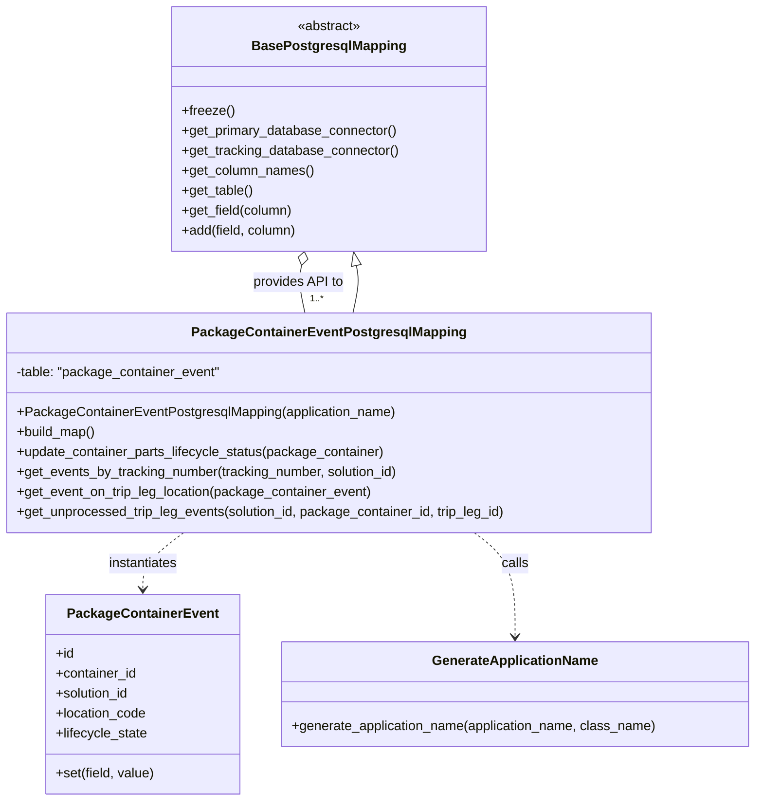

# Diagram: partview_core/partview_service/partview_service/persistence/sql/postgresql/PackageContainerEventPostgresqlMapping.py

> Auto-generated by Obscura crawlers

## Mermaid

### SVG

<svg id="container" width="907.650390625" xmlns="http://www.w3.org/2000/svg" class="classDiagram" height="962" viewBox="0 0 907.650390625 962" role="graphics-document document" aria-roledescription="class"><g><defs><marker id="container_class-aggregationStart" class="marker aggregation class" refX="18" refY="7" markerWidth="190" markerHeight="240" orient="auto"><path d="M 18,7 L9,13 L1,7 L9,1 Z"></path></marker></defs><defs><marker id="container_class-aggregationEnd" class="marker aggregation class" refX="1" refY="7" markerWidth="20" markerHeight="28" orient="auto"><path d="M 18,7 L9,13 L1,7 L9,1 Z"></path></marker></defs><defs><marker id="container_class-extensionStart" class="marker extension class" refX="18" refY="7" markerWidth="190" markerHeight="240" orient="auto"><path d="M 1,7 L18,13 V 1 Z"></path></marker></defs><defs><marker id="container_class-extensionEnd" class="marker extension class" refX="1" refY="7" markerWidth="20" markerHeight="28" orient="auto"><path d="M 1,1 V 13 L18,7 Z"></path></marker></defs><defs><marker id="container_class-compositionStart" class="marker composition class" refX="18" refY="7" markerWidth="190" markerHeight="240" orient="auto"><path d="M 18,7 L9,13 L1,7 L9,1 Z"></path></marker></defs><defs><marker id="container_class-compositionEnd" class="marker composition class" refX="1" refY="7" markerWidth="20" markerHeight="28" orient="auto"><path d="M 18,7 L9,13 L1,7 L9,1 Z"></path></marker></defs><defs><marker id="container_class-dependencyStart" class="marker dependency class" refX="6" refY="7" markerWidth="190" markerHeight="240" orient="auto"><path d="M 5,7 L9,13 L1,7 L9,1 Z"></path></marker></defs><defs><marker id="container_class-dependencyEnd" class="marker dependency class" refX="13" refY="7" markerWidth="20" markerHeight="28" orient="auto"><path d="M 18,7 L9,13 L14,7 L9,1 Z"></path></marker></defs><defs><marker id="container_class-lollipopStart" class="marker lollipop class" refX="13" refY="7" markerWidth="190" markerHeight="240" orient="auto"><circle stroke="black" fill="transparent" cx="7" cy="7" r="6"></circle></marker></defs><defs><marker id="container_class-lollipopEnd" class="marker lollipop class" refX="1" refY="7" markerWidth="190" markerHeight="240" orient="auto"><circle stroke="black" fill="transparent" cx="7" cy="7" r="6"></circle></marker></defs><g class="root"><g class="clusters"></g><g class="edgePaths"><path d="M424.097,376L425.458,369.833C426.819,363.667,429.54,351.333,430.222,341.818C430.904,332.302,429.547,325.604,428.868,322.255L428.189,318.906" id="id_PackageContainerEventPostgresqlMapping_BasePostgresqlMapping_1" class="edge-thickness-normal edge-pattern-solid relation" style=";;;" data-edge="true" data-et="edge" data-id="id_PackageContainerEventPostgresqlMapping_BasePostgresqlMapping_1" data-points="W3sieCI6NDI0LjA5Njk4NTk0Njc0NTYsInkiOjM3Nn0seyJ4Ijo0MzIuMjYxNzE4NzUsInkiOjMzOX0seyJ4Ijo0MjQuNzYyNTg5MTY0NDAyMiwieSI6MzAyfV0=" marker-end="url(#container_class-extensionEnd)"></path><path d="M220.738,640L212.598,646.167C204.459,652.333,188.18,664.667,180.04,676C171.9,687.333,171.9,697.667,171.9,702.833L171.9,708" id="id_PackageContainerEventPostgresqlMapping_PackageContainerEvent_2" class="edge-thickness-normal edge-pattern-dashed relation" style=";;;" data-edge="true" data-et="edge" data-id="id_PackageContainerEventPostgresqlMapping_PackageContainerEvent_2" data-points="W3sieCI6MjIwLjczNzg0MjA4NTc5ODgsInkiOjY0MH0seyJ4IjoxNzEuOTAwMzkwNjI1LCJ5Ijo2Nzd9LHsieCI6MTcxLjkwMDM5MDYyNSwieSI6NzE0fV0=" marker-end="url(#container_class-dependencyEnd)"></path><path d="M569.2,640L577.339,646.167C585.479,652.333,601.758,664.667,609.898,685.5C618.037,706.333,618.037,735.667,618.037,750.333L618.037,765" id="id_PackageContainerEventPostgresqlMapping_GenerateApplicationName_3" class="edge-thickness-normal edge-pattern-dashed relation" style=";;;" data-edge="true" data-et="edge" data-id="id_PackageContainerEventPostgresqlMapping_GenerateApplicationName_3" data-points="W3sieCI6NTY5LjE5OTY1NzkxNDIwMTIsInkiOjY0MH0seyJ4Ijo2MTguMDM3MTA5Mzc1LCJ5Ijo2Nzd9LHsieCI6NjE4LjAzNzEwOTM3NSwieSI6NzcxfV0=" marker-end="url(#container_class-dependencyEnd)"></path><path d="M361.748,318.906L361.07,322.255C360.391,325.604,359.033,332.302,359.715,341.818C360.397,351.333,363.119,363.667,364.48,369.833L365.841,376" id="id_BasePostgresqlMapping_PackageContainerEventPostgresqlMapping_4" class="edge-thickness-normal edge-pattern-solid relation" style=";;;" data-edge="true" data-et="edge" data-id="id_BasePostgresqlMapping_PackageContainerEventPostgresqlMapping_4" data-points="W3sieCI6MzY1LjE3NDkxMDgzNTU5NzgsInkiOjMwMn0seyJ4IjozNTcuNjc1NzgxMjUsInkiOjMzOX0seyJ4IjozNjUuODQwNTE0MDUzMjU0NCwieSI6Mzc2fV0=" marker-start="url(#container_class-aggregationStart)"></path></g><g class="edgeLabels"><g class="edgeLabel"><g class="label" data-id="id_PackageContainerEventPostgresqlMapping_BasePostgresqlMapping_1" transform="translate(0, 0)"><foreignObject width="0" height="0">

</foreignObject></g></g><g class="edgeLabel" transform="translate(171.900390625, 677)"><g class="label" data-id="id_PackageContainerEventPostgresqlMapping_PackageContainerEvent_2" transform="translate(-42.9140625, -12)"><foreignObject width="85.828125" height="24">

instantiates

</foreignObject></g></g><g class="edgeLabel" transform="translate(618.037109375, 677)"><g class="label" data-id="id_PackageContainerEventPostgresqlMapping_GenerateApplicationName_3" transform="translate(-16.4453125, -12)"><foreignObject width="32.890625" height="24">

calls

</foreignObject></g></g><g class="edgeLabel" transform="translate(357.69063, 339.0673)"><g class="label" data-id="id_BasePostgresqlMapping_PackageContainerEventPostgresqlMapping_4" transform="translate(-54.5859375, -12)"><foreignObject width="109.171875" height="24">

provides API to

</foreignObject></g></g><g class="edgeTerminals" transform="translate(371.71714636531976, 350.67885443834706)"><g class="inner" transform="translate(0, 0)"></g><foreignObject style="width: 36px; height: 12px;">
1..*
</foreignObject></g></g><g class="nodes"><g class="node default" id="classId-BasePostgresqlMapping-0" transform="translate(394.96875, 155)"><g class="basic label-container"><path d="M-187.1484375 -147 L187.1484375 -147 L187.1484375 147 L-187.1484375 147" stroke="none" stroke-width="0" fill="#ECECFF" style=""></path><path d="M-187.1484375 -147 C-106.61914423735114 -147, -26.089850974702273 -147, 187.1484375 -147 M-187.1484375 -147 C-70.51302804288228 -147, 46.122381414235434 -147, 187.1484375 -147 M187.1484375 -147 C187.1484375 -76.37569814753368, 187.1484375 -5.751396295067366, 187.1484375 147 M187.1484375 -147 C187.1484375 -82.19818429997876, 187.1484375 -17.396368599957526, 187.1484375 147 M187.1484375 147 C100.90626380795898 147, 14.664090115917958 147, -187.1484375 147 M187.1484375 147 C80.00310027222771 147, -27.142236955544575 147, -187.1484375 147 M-187.1484375 147 C-187.1484375 31.717310035534467, -187.1484375 -83.56537992893107, -187.1484375 -147 M-187.1484375 147 C-187.1484375 68.52919162831202, -187.1484375 -9.94161674337596, -187.1484375 -147" stroke="#9370DB" stroke-width="1.3" fill="none" stroke-dasharray="0 0" style=""></path></g><g class="annotation-group text" transform="translate(-38.609375, -123)"><g class="label" style="" transform="translate(0,-12)"><foreignObject width="77.21875" height="24">

«abstract»

</foreignObject></g></g><g class="label-group text" transform="translate(-87.921875, -99)"><g class="label" style="font-weight: bolder" transform="translate(0,-12)"><foreignObject width="175.84375" height="24">

BasePostgresqlMapping

</foreignObject></g></g><g class="members-group text" transform="translate(-175.1484375, -51)"></g><g class="methods-group text" transform="translate(-175.1484375, -21)"><g class="label" style="" transform="translate(0,-12)"><foreignObject width="62.109375" height="24">

+freeze()

</foreignObject></g><g class="label" style="" transform="translate(0,12)"><foreignObject width="260.671875" height="24">

+get_primary_database_connector()

</foreignObject></g><g class="label" style="" transform="translate(0,36)"><foreignObject width="262.375" height="24">

+get_tracking_database_connector()

</foreignObject></g><g class="label" style="" transform="translate(0,60)"><foreignObject width="158.984375" height="24">

+get_column_names()

</foreignObject></g><g class="label" style="" transform="translate(0,84)"><foreignObject width="86.125" height="24">

+get_table()

</foreignObject></g><g class="label" style="" transform="translate(0,108)"><foreignObject width="134.78125" height="24">

+get_field(column)

</foreignObject></g><g class="label" style="" transform="translate(0,132)"><foreignObject width="139.890625" height="24">

+add(field, column)

</foreignObject></g></g><g class="divider" style=""><path d="M-187.1484375 -75 C-59.70322198616718 -75, 67.74199352766564 -75, 187.1484375 -75 M-187.1484375 -75 C-78.90503620866141 -75, 29.33836508267717 -75, 187.1484375 -75" stroke="#9370DB" stroke-width="1.3" fill="none" stroke-dasharray="0 0" style=""></path></g><g class="divider" style=""><path d="M-187.1484375 -51 C-95.41454897777265 -51, -3.6806604555453077 -51, 187.1484375 -51 M-187.1484375 -51 C-61.10309910811803 -51, 64.94223928376394 -51, 187.1484375 -51" stroke="#9370DB" stroke-width="1.3" fill="none" stroke-dasharray="0 0" style=""></path></g></g><g class="node default" id="classId-PackageContainerEventPostgresqlMapping-1" transform="translate(394.96875, 508)"><g class="basic label-container"><path d="M-386.96875 -132 L386.96875 -132 L386.96875 132 L-386.96875 132" stroke="none" stroke-width="0" fill="#ECECFF" style=""></path><path d="M-386.96875 -132 C-137.79201608721758 -132, 111.38471782556485 -132, 386.96875 -132 M-386.96875 -132 C-138.95445092842297 -132, 109.05984814315406 -132, 386.96875 -132 M386.96875 -132 C386.96875 -54.937297548297565, 386.96875 22.12540490340487, 386.96875 132 M386.96875 -132 C386.96875 -55.10206118935952, 386.96875 21.795877621280965, 386.96875 132 M386.96875 132 C89.24246051923404 132, -208.4838289615319 132, -386.96875 132 M386.96875 132 C154.7789761730218 132, -77.41079765395642 132, -386.96875 132 M-386.96875 132 C-386.96875 49.10581784096604, -386.96875 -33.78836431806792, -386.96875 -132 M-386.96875 132 C-386.96875 78.45856782326828, -386.96875 24.91713564653658, -386.96875 -132" stroke="#9370DB" stroke-width="1.3" fill="none" stroke-dasharray="0 0" style=""></path></g><g class="annotation-group text" transform="translate(0, -108)"></g><g class="label-group text" transform="translate(-156.0625, -108)"><g class="label" style="font-weight: bolder" transform="translate(0,-12)"><foreignObject width="312.125" height="24">

PackageContainerEventPostgresqlMapping

</foreignObject></g></g><g class="members-group text" transform="translate(-374.96875, -60)"><g class="label" style="" transform="translate(0,-12)"><foreignObject width="247.09375" height="24">

-table: "package_container_event"

</foreignObject></g></g><g class="methods-group text" transform="translate(-374.96875, -12)"><g class="label" style="" transform="translate(0,-12)"><foreignObject width="455.78125" height="24">

+PackageContainerEventPostgresqlMapping(application_name)

</foreignObject></g><g class="label" style="" transform="translate(0,12)"><foreignObject width="96.109375" height="24">

+build_map()

</foreignObject></g><g class="label" style="" transform="translate(0,36)"><foreignObject width="446.75" height="24">

+update_container_parts_lifecycle_status(package_container)

</foreignObject></g><g class="label" style="" transform="translate(0,60)"><foreignObject width="465.234375" height="24">

+get_events_by_tracking_number(tracking_number, solution_id)

</foreignObject></g><g class="label" style="" transform="translate(0,84)"><foreignObject width="429.71875" height="24">

+get_event_on_trip_leg_location(package_container_event)

</foreignObject></g><g class="label" style="" transform="translate(0,108)"><foreignObject width="593.875" height="24">

+get_unprocessed_trip_leg_events(solution_id, package_container_id, trip_leg_id)

</foreignObject></g></g><g class="divider" style=""><path d="M-386.96875 -84 C-132.99965236355285 -84, 120.96944527289429 -84, 386.96875 -84 M-386.96875 -84 C-138.34019135394476 -84, 110.28836729211048 -84, 386.96875 -84" stroke="#9370DB" stroke-width="1.3" fill="none" stroke-dasharray="0 0" style=""></path></g><g class="divider" style=""><path d="M-386.96875 -36 C-201.75361921065692 -36, -16.538488421313843 -36, 386.96875 -36 M-386.96875 -36 C-230.67020479437173 -36, -74.37165958874346 -36, 386.96875 -36" stroke="#9370DB" stroke-width="1.3" fill="none" stroke-dasharray="0 0" style=""></path></g></g><g class="node default" id="classId-PackageContainerEvent-2" transform="translate(171.900390625, 834)"><g class="basic label-container"><path d="M-114.5234375 -120 L114.5234375 -120 L114.5234375 120 L-114.5234375 120" stroke="none" stroke-width="0" fill="#ECECFF" style=""></path><path d="M-114.5234375 -120 C-59.76021333168474 -120, -4.996989163369477 -120, 114.5234375 -120 M-114.5234375 -120 C-30.442978577199284 -120, 53.63748034560143 -120, 114.5234375 -120 M114.5234375 -120 C114.5234375 -63.04249549375152, 114.5234375 -6.0849909875030335, 114.5234375 120 M114.5234375 -120 C114.5234375 -55.70038001402784, 114.5234375 8.599239971944314, 114.5234375 120 M114.5234375 120 C37.38550227983677 120, -39.75243294032646 120, -114.5234375 120 M114.5234375 120 C32.2149938951581 120, -50.093449709683796 120, -114.5234375 120 M-114.5234375 120 C-114.5234375 52.06984893797116, -114.5234375 -15.860302124057682, -114.5234375 -120 M-114.5234375 120 C-114.5234375 35.04140820931323, -114.5234375 -49.917183581373536, -114.5234375 -120" stroke="#9370DB" stroke-width="1.3" fill="none" stroke-dasharray="0 0" style=""></path></g><g class="annotation-group text" transform="translate(0, -96)"></g><g class="label-group text" transform="translate(-85.65625, -96)"><g class="label" style="font-weight: bolder" transform="translate(0,-12)"><foreignObject width="171.3125" height="24">

PackageContainerEvent

</foreignObject></g></g><g class="members-group text" transform="translate(-102.5234375, -48)"><g class="label" style="" transform="translate(0,-12)"><foreignObject width="22.078125" height="24">

+id

</foreignObject></g><g class="label" style="" transform="translate(0,12)"><foreignObject width="98.3125" height="24">

+container_id

</foreignObject></g><g class="label" style="" transform="translate(0,36)"><foreignObject width="90.21875" height="24">

+solution_id

</foreignObject></g><g class="label" style="" transform="translate(0,60)"><foreignObject width="110.109375" height="24">

+location_code

</foreignObject></g><g class="label" style="" transform="translate(0,84)"><foreignObject width="111.640625" height="24">

+lifecycle_state

</foreignObject></g></g><g class="methods-group text" transform="translate(-102.5234375, 96)"><g class="label" style="" transform="translate(0,-12)"><foreignObject width="119.390625" height="24">

+set(field, value)

</foreignObject></g></g><g class="divider" style=""><path d="M-114.5234375 -72 C-53.99321570568883 -72, 6.537006088622334 -72, 114.5234375 -72 M-114.5234375 -72 C-25.426877748439694 -72, 63.66968200312061 -72, 114.5234375 -72" stroke="#9370DB" stroke-width="1.3" fill="none" stroke-dasharray="0 0" style=""></path></g><g class="divider" style=""><path d="M-114.5234375 72 C-41.35235556743261 72, 31.81872636513478 72, 114.5234375 72 M-114.5234375 72 C-31.247594695095657 72, 52.028248109808686 72, 114.5234375 72" stroke="#9370DB" stroke-width="1.3" fill="none" stroke-dasharray="0 0" style=""></path></g></g><g class="node default" id="classId-GenerateApplicationName-3" transform="translate(618.037109375, 834)"><g class="basic label-container"><path d="M-281.61328125 -63 L281.61328125 -63 L281.61328125 63 L-281.61328125 63" stroke="none" stroke-width="0" fill="#ECECFF" style=""></path><path d="M-281.61328125 -63 C-107.19536527510712 -63, 67.22255069978576 -63, 281.61328125 -63 M-281.61328125 -63 C-160.03648626084097 -63, -38.45969127168195 -63, 281.61328125 -63 M281.61328125 -63 C281.61328125 -17.60560981559638, 281.61328125 27.788780368807238, 281.61328125 63 M281.61328125 -63 C281.61328125 -29.676192894110976, 281.61328125 3.6476142117780483, 281.61328125 63 M281.61328125 63 C66.6418026368595 63, -148.329675976281 63, -281.61328125 63 M281.61328125 63 C80.82200579091926 63, -119.96926966816147 63, -281.61328125 63 M-281.61328125 63 C-281.61328125 35.52522400893325, -281.61328125 8.050448017866493, -281.61328125 -63 M-281.61328125 63 C-281.61328125 12.960135386647764, -281.61328125 -37.07972922670447, -281.61328125 -63" stroke="#9370DB" stroke-width="1.3" fill="none" stroke-dasharray="0 0" style=""></path></g><g class="annotation-group text" transform="translate(0, -39)"></g><g class="label-group text" transform="translate(-95.8203125, -39)"><g class="label" style="font-weight: bolder" transform="translate(0,-12)"><foreignObject width="191.640625" height="24">

GenerateApplicationName

</foreignObject></g></g><g class="members-group text" transform="translate(-269.61328125, 9)"></g><g class="methods-group text" transform="translate(-269.61328125, 39)"><g class="label" style="" transform="translate(0,-12)"><foreignObject width="443.40625" height="24">

+generate_application_name(application_name, class_name)

</foreignObject></g></g><g class="divider" style=""><path d="M-281.61328125 -15 C-60.34578748236953 -15, 160.92170628526094 -15, 281.61328125 -15 M-281.61328125 -15 C-129.54834363292323 -15, 22.51659398415353 -15, 281.61328125 -15" stroke="#9370DB" stroke-width="1.3" fill="none" stroke-dasharray="0 0" style=""></path></g><g class="divider" style=""><path d="M-281.61328125 9 C-65.96691798314208 9, 149.67944528371584 9, 281.61328125 9 M-281.61328125 9 C-121.96436400178399 9, 37.68455324643202 9, 281.61328125 9" stroke="#9370DB" stroke-width="1.3" fill="none" stroke-dasharray="0 0" style=""></path></g></g></g></g></g></svg>
