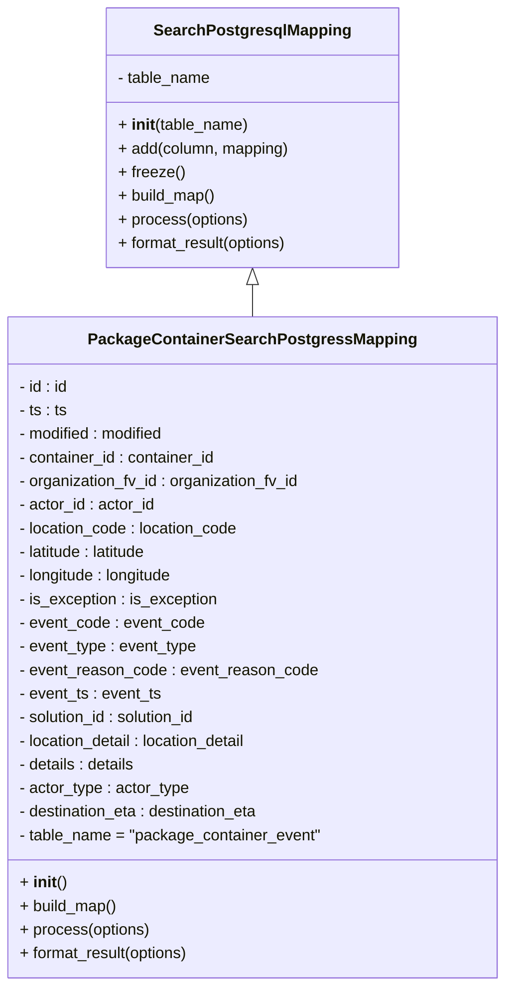

# Diagram: partview_core/partview_service/partview_service/persistence/sql/postgresql/PackageContainerEventSearchPostgressMapping.py

> Auto-generated by Obscura crawlers

## Mermaid

### SVG

<svg id="container" width="505.5234375" xmlns="http://www.w3.org/2000/svg" class="classDiagram" height="1002" viewBox="0 0 505.5234375 1002" role="graphics-document document" aria-roledescription="class"><g><defs><marker id="container_class-aggregationStart" class="marker aggregation class" refX="18" refY="7" markerWidth="190" markerHeight="240" orient="auto"><path d="M 18,7 L9,13 L1,7 L9,1 Z"></path></marker></defs><defs><marker id="container_class-aggregationEnd" class="marker aggregation class" refX="1" refY="7" markerWidth="20" markerHeight="28" orient="auto"><path d="M 18,7 L9,13 L1,7 L9,1 Z"></path></marker></defs><defs><marker id="container_class-extensionStart" class="marker extension class" refX="18" refY="7" markerWidth="190" markerHeight="240" orient="auto"><path d="M 1,7 L18,13 V 1 Z"></path></marker></defs><defs><marker id="container_class-extensionEnd" class="marker extension class" refX="1" refY="7" markerWidth="20" markerHeight="28" orient="auto"><path d="M 1,1 V 13 L18,7 Z"></path></marker></defs><defs><marker id="container_class-compositionStart" class="marker composition class" refX="18" refY="7" markerWidth="190" markerHeight="240" orient="auto"><path d="M 18,7 L9,13 L1,7 L9,1 Z"></path></marker></defs><defs><marker id="container_class-compositionEnd" class="marker composition class" refX="1" refY="7" markerWidth="20" markerHeight="28" orient="auto"><path d="M 18,7 L9,13 L1,7 L9,1 Z"></path></marker></defs><defs><marker id="container_class-dependencyStart" class="marker dependency class" refX="6" refY="7" markerWidth="190" markerHeight="240" orient="auto"><path d="M 5,7 L9,13 L1,7 L9,1 Z"></path></marker></defs><defs><marker id="container_class-dependencyEnd" class="marker dependency class" refX="13" refY="7" markerWidth="20" markerHeight="28" orient="auto"><path d="M 18,7 L9,13 L14,7 L9,1 Z"></path></marker></defs><defs><marker id="container_class-lollipopStart" class="marker lollipop class" refX="13" refY="7" markerWidth="190" markerHeight="240" orient="auto"><circle stroke="black" fill="transparent" cx="7" cy="7" r="6"></circle></marker></defs><defs><marker id="container_class-lollipopEnd" class="marker lollipop class" refX="1" refY="7" markerWidth="190" markerHeight="240" orient="auto"><circle stroke="black" fill="transparent" cx="7" cy="7" r="6"></circle></marker></defs><g class="root"><g class="clusters"></g><g class="edgePaths"><path d="M252.762,289.25L252.762,290.542C252.762,291.833,252.762,294.417,252.762,299.875C252.762,305.333,252.762,313.667,252.762,317.833L252.762,322" id="id_SearchPostgresqlMapping_PackageContainerSearchPostgressMapping_1" class="edge-thickness-normal edge-pattern-solid relation" style=";;;" data-edge="true" data-et="edge" data-id="id_SearchPostgresqlMapping_PackageContainerSearchPostgressMapping_1" data-points="W3sieCI6MjUyLjc2MTcxODc1LCJ5IjoyNzJ9LHsieCI6MjUyLjc2MTcxODc1LCJ5IjoyOTd9LHsieCI6MjUyLjc2MTcxODc1LCJ5IjozMjJ9XQ==" marker-start="url(#container_class-extensionStart)"></path></g><g class="edgeLabels"><g class="edgeLabel"><g class="label" data-id="id_SearchPostgresqlMapping_PackageContainerSearchPostgressMapping_1" transform="translate(0, 0)"><foreignObject width="0" height="0">

</foreignObject></g></g></g><g class="nodes"><g class="node default" id="classId-SearchPostgresqlMapping-0" transform="translate(252.76171875, 140)"><g class="basic label-container"><path d="M-147.97265625 -132 L147.97265625 -132 L147.97265625 132 L-147.97265625 132" stroke="none" stroke-width="0" fill="#ECECFF" style=""></path><path d="M-147.97265625 -132 C-46.67650024745758 -132, 54.619655755084835 -132, 147.97265625 -132 M-147.97265625 -132 C-55.96285849399858 -132, 36.04693926200284 -132, 147.97265625 -132 M147.97265625 -132 C147.97265625 -62.716504706528596, 147.97265625 6.566990586942808, 147.97265625 132 M147.97265625 -132 C147.97265625 -68.57058986621269, 147.97265625 -5.141179732425371, 147.97265625 132 M147.97265625 132 C66.7577881541712 132, -14.45707994165761 132, -147.97265625 132 M147.97265625 132 C42.73361714243667 132, -62.50542196512666 132, -147.97265625 132 M-147.97265625 132 C-147.97265625 30.392181534441036, -147.97265625 -71.21563693111793, -147.97265625 -132 M-147.97265625 132 C-147.97265625 34.76770785651179, -147.97265625 -62.46458428697642, -147.97265625 -132" stroke="#9370DB" stroke-width="1.3" fill="none" stroke-dasharray="0 0" style=""></path></g><g class="annotation-group text" transform="translate(0, -108)"></g><g class="label-group text" transform="translate(-95.1171875, -108)"><g class="label" style="font-weight: bolder" transform="translate(0,-12)"><foreignObject width="190.234375" height="24">

SearchPostgresqlMapping

</foreignObject></g></g><g class="members-group text" transform="translate(-135.97265625, -60)"><g class="label" style="" transform="translate(0,-12)"><foreignObject width="96.40625" height="24">

- table_name

</foreignObject></g></g><g class="methods-group text" transform="translate(-135.97265625, -12)"><g class="label" style="" transform="translate(0,-12)"><foreignObject width="132.765625" height="24">

+ <strong>init</strong>(table_name)

</foreignObject></g><g class="label" style="" transform="translate(0,12)"><foreignObject width="175.90625" height="24">

+ add(column, mapping)

</foreignObject></g><g class="label" style="" transform="translate(0,36)"><foreignObject width="66.578125" height="24">

+ freeze()

</foreignObject></g><g class="label" style="" transform="translate(0,60)"><foreignObject width="100.34375" height="24">

+ build_map()

</foreignObject></g><g class="label" style="" transform="translate(0,84)"><foreignObject width="133.296875" height="24">

+ process(options)

</foreignObject></g><g class="label" style="" transform="translate(0,108)"><foreignObject width="176.828125" height="24">

+ format_result(options)

</foreignObject></g></g><g class="divider" style=""><path d="M-147.97265625 -84 C-41.6866638688022 -84, 64.5993285123956 -84, 147.97265625 -84 M-147.97265625 -84 C-52.34123273595216 -84, 43.29019077809568 -84, 147.97265625 -84" stroke="#9370DB" stroke-width="1.3" fill="none" stroke-dasharray="0 0" style=""></path></g><g class="divider" style=""><path d="M-147.97265625 -36 C-66.17434774284999 -36, 15.623960764300023 -36, 147.97265625 -36 M-147.97265625 -36 C-72.91213407451893 -36, 2.148388100962137 -36, 147.97265625 -36" stroke="#9370DB" stroke-width="1.3" fill="none" stroke-dasharray="0 0" style=""></path></g></g><g class="node default" id="classId-PackageContainerSearchPostgressMapping-1" transform="translate(252.76171875, 658)"><g class="basic label-container"><path d="M-244.76171875 -336 L244.76171875 -336 L244.76171875 336 L-244.76171875 336" stroke="none" stroke-width="0" fill="#ECECFF" style=""></path><path d="M-244.76171875 -336 C-77.1762378231353 -336, 90.40924310372941 -336, 244.76171875 -336 M-244.76171875 -336 C-88.21366186239564 -336, 68.33439502520872 -336, 244.76171875 -336 M244.76171875 -336 C244.76171875 -146.80226027740903, 244.76171875 42.395479445181934, 244.76171875 336 M244.76171875 -336 C244.76171875 -119.57907840200346, 244.76171875 96.84184319599308, 244.76171875 336 M244.76171875 336 C114.5164007135505 336, -15.728917322899008 336, -244.76171875 336 M244.76171875 336 C132.9186612361528 336, 21.075603722305573 336, -244.76171875 336 M-244.76171875 336 C-244.76171875 78.48518668640685, -244.76171875 -179.0296266271863, -244.76171875 -336 M-244.76171875 336 C-244.76171875 163.55869668960403, -244.76171875 -8.882606620791933, -244.76171875 -336" stroke="#9370DB" stroke-width="1.3" fill="none" stroke-dasharray="0 0" style=""></path></g><g class="annotation-group text" transform="translate(0, -312)"></g><g class="label-group text" transform="translate(-157.1953125, -312)"><g class="label" style="font-weight: bolder" transform="translate(0,-12)"><foreignObject width="314.390625" height="24">

PackageContainerSearchPostgressMapping

</foreignObject></g></g><g class="members-group text" transform="translate(-232.76171875, -264)"><g class="label" style="" transform="translate(0,-12)"><foreignObject width="51.171875" height="24">

- id : id

</foreignObject></g><g class="label" style="" transform="translate(0,12)"><foreignObject width="49.515625" height="24">

- ts : ts

</foreignObject></g><g class="label" style="" transform="translate(0,36)"><foreignObject width="152.265625" height="24">

- modified : modified

</foreignObject></g><g class="label" style="" transform="translate(0,60)"><foreignObject width="203.65625" height="24">

- container_id : container_id

</foreignObject></g><g class="label" style="" transform="translate(0,84)"><foreignObject width="290.03125" height="24">

- organization_fv_id : organization_fv_id

</foreignObject></g><g class="label" style="" transform="translate(0,108)"><foreignObject width="140.078125" height="24">

- actor_id : actor_id

</foreignObject></g><g class="label" style="" transform="translate(0,132)"><foreignObject width="227.234375" height="24">

- location_code : location_code

</foreignObject></g><g class="label" style="" transform="translate(0,156)"><foreignObject width="136.96875" height="24">

- latitude : latitude

</foreignObject></g><g class="label" style="" transform="translate(0,180)"><foreignObject width="162.09375" height="24">

- longitude : longitude

</foreignObject></g><g class="label" style="" transform="translate(0,204)"><foreignObject width="203.84375" height="24">

- is_exception : is_exception

</foreignObject></g><g class="label" style="" transform="translate(0,228)"><foreignObject width="189.609375" height="24">

- event_code : event_code

</foreignObject></g><g class="label" style="" transform="translate(0,252)"><foreignObject width="183.265625" height="24">

- event_type : event_type

</foreignObject></g><g class="label" style="" transform="translate(0,276)"><foreignObject width="304.234375" height="24">

- event_reason_code : event_reason_code

</foreignObject></g><g class="label" style="" transform="translate(0,300)"><foreignObject width="146.1875" height="24">

- event_ts : event_ts

</foreignObject></g><g class="label" style="" transform="translate(0,324)"><foreignObject width="187.46875" height="24">

- solution_id : solution_id

</foreignObject></g><g class="label" style="" transform="translate(0,348)"><foreignObject width="241.03125" height="24">

- location_detail : location_detail

</foreignObject></g><g class="label" style="" transform="translate(0,372)"><foreignObject width="121.671875" height="24">

- details : details

</foreignObject></g><g class="label" style="" transform="translate(0,396)"><foreignObject width="174.859375" height="24">

- actor_type : actor_type

</foreignObject></g><g class="label" style="" transform="translate(0,420)"><foreignObject width="251.46875" height="24">

- destination_eta : destination_eta

</foreignObject></g><g class="label" style="" transform="translate(0,444)"><foreignObject width="308.328125" height="24">

- table_name = "package_container_event"

</foreignObject></g></g><g class="methods-group text" transform="translate(-232.76171875, 240)"><g class="label" style="" transform="translate(0,-12)"><foreignObject width="47.046875" height="24">

+ <strong>init</strong>()

</foreignObject></g><g class="label" style="" transform="translate(0,12)"><foreignObject width="100.34375" height="24">

+ build_map()

</foreignObject></g><g class="label" style="" transform="translate(0,36)"><foreignObject width="133.296875" height="24">

+ process(options)

</foreignObject></g><g class="label" style="" transform="translate(0,60)"><foreignObject width="176.828125" height="24">

+ format_result(options)

</foreignObject></g></g><g class="divider" style=""><path d="M-244.76171875 -288 C-134.80462949581505 -288, -24.84754024163007 -288, 244.76171875 -288 M-244.76171875 -288 C-95.86672314987607 -288, 53.02827245024787 -288, 244.76171875 -288" stroke="#9370DB" stroke-width="1.3" fill="none" stroke-dasharray="0 0" style=""></path></g><g class="divider" style=""><path d="M-244.76171875 216 C-130.72387572294997 216, -16.686032695899968 216, 244.76171875 216 M-244.76171875 216 C-139.11452184300003 216, -33.4673249360001 216, 244.76171875 216" stroke="#9370DB" stroke-width="1.3" fill="none" stroke-dasharray="0 0" style=""></path></g></g></g></g></g></svg>
