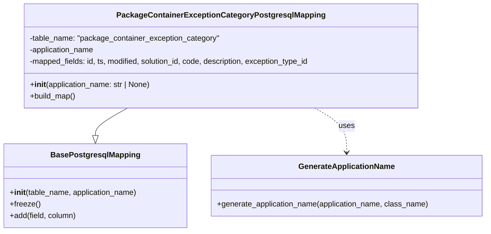

# Diagram: partview_core/partview_service/partview_service/persistence/sql/postgresql/PackageContainerExceptionCategoryPostgresqlMapping.py

> Auto-generated by Obscura crawlers

## Mermaid

### SVG

<svg id="container" width="1008.5234375" xmlns="http://www.w3.org/2000/svg" class="classDiagram" height="480" viewBox="0 0 1008.5234375 480" role="graphics-document document" aria-roledescription="class"><g><defs><marker id="container_class-aggregationStart" class="marker aggregation class" refX="18" refY="7" markerWidth="190" markerHeight="240" orient="auto"><path d="M 18,7 L9,13 L1,7 L9,1 Z"></path></marker></defs><defs><marker id="container_class-aggregationEnd" class="marker aggregation class" refX="1" refY="7" markerWidth="20" markerHeight="28" orient="auto"><path d="M 18,7 L9,13 L1,7 L9,1 Z"></path></marker></defs><defs><marker id="container_class-extensionStart" class="marker extension class" refX="18" refY="7" markerWidth="190" markerHeight="240" orient="auto"><path d="M 1,7 L18,13 V 1 Z"></path></marker></defs><defs><marker id="container_class-extensionEnd" class="marker extension class" refX="1" refY="7" markerWidth="20" markerHeight="28" orient="auto"><path d="M 1,1 V 13 L18,7 Z"></path></marker></defs><defs><marker id="container_class-compositionStart" class="marker composition class" refX="18" refY="7" markerWidth="190" markerHeight="240" orient="auto"><path d="M 18,7 L9,13 L1,7 L9,1 Z"></path></marker></defs><defs><marker id="container_class-compositionEnd" class="marker composition class" refX="1" refY="7" markerWidth="20" markerHeight="28" orient="auto"><path d="M 18,7 L9,13 L1,7 L9,1 Z"></path></marker></defs><defs><marker id="container_class-dependencyStart" class="marker dependency class" refX="6" refY="7" markerWidth="190" markerHeight="240" orient="auto"><path d="M 5,7 L9,13 L1,7 L9,1 Z"></path></marker></defs><defs><marker id="container_class-dependencyEnd" class="marker dependency class" refX="13" refY="7" markerWidth="20" markerHeight="28" orient="auto"><path d="M 18,7 L9,13 L14,7 L9,1 Z"></path></marker></defs><defs><marker id="container_class-lollipopStart" class="marker lollipop class" refX="13" refY="7" markerWidth="190" markerHeight="240" orient="auto"><circle stroke="black" fill="transparent" cx="7" cy="7" r="6"></circle></marker></defs><defs><marker id="container_class-lollipopEnd" class="marker lollipop class" refX="1" refY="7" markerWidth="190" markerHeight="240" orient="auto"><circle stroke="black" fill="transparent" cx="7" cy="7" r="6"></circle></marker></defs><g class="root"><g class="clusters"></g><g class="edgePaths"><path d="M264.154,224L253.07,230.167C241.986,236.333,219.817,248.667,208.733,258.125C197.648,267.583,197.648,274.167,197.648,277.458L197.648,280.75" id="id_PackageContainerExceptionCategoryPostgresqlMapping_BasePostgresqlMapping_1" class="edge-thickness-normal edge-pattern-solid relation" style=";;;" data-edge="true" data-et="edge" data-id="id_PackageContainerExceptionCategoryPostgresqlMapping_BasePostgresqlMapping_1" data-points="W3sieCI6MjY0LjE1NDI0Mjk5NTY4OTYzLCJ5IjoyMjR9LHsieCI6MTk3LjY0ODQzNzUsInkiOjI2MX0seyJ4IjoxOTcuNjQ4NDM3NSwieSI6Mjk4fV0=" marker-end="url(#container_class-extensionEnd)"></path><path d="M652.404,224L663.489,230.167C674.573,236.333,696.742,248.667,707.826,264C718.91,279.333,718.91,297.667,718.91,306.833L718.91,316" id="id_PackageContainerExceptionCategoryPostgresqlMapping_GenerateApplicationName_2" class="edge-thickness-normal edge-pattern-dashed relation" style=";;;" data-edge="true" data-et="edge" data-id="id_PackageContainerExceptionCategoryPostgresqlMapping_GenerateApplicationName_2" data-points="W3sieCI6NjUyLjQwNDM1MDc1NDMxMDQsInkiOjIyNH0seyJ4Ijo3MTguOTEwMTU2MjUsInkiOjI2MX0seyJ4Ijo3MTguOTEwMTU2MjUsInkiOjMyMn1d" marker-end="url(#container_class-dependencyEnd)"></path></g><g class="edgeLabels"><g class="edgeLabel"><g class="label" data-id="id_PackageContainerExceptionCategoryPostgresqlMapping_BasePostgresqlMapping_1" transform="translate(0, 0)"><foreignObject width="0" height="0">

</foreignObject></g></g><g class="edgeLabel" transform="translate(718.91015625, 261)"><g class="label" data-id="id_PackageContainerExceptionCategoryPostgresqlMapping_GenerateApplicationName_2" transform="translate(-16.4921875, -12)"><foreignObject width="32.984375" height="24">

uses

</foreignObject></g></g></g><g class="nodes"><g class="node default" id="classId-BasePostgresqlMapping-0" transform="translate(197.6484375, 385)"><g class="basic label-container"><path d="M-189.6484375 -87 L189.6484375 -87 L189.6484375 87 L-189.6484375 87" stroke="none" stroke-width="0" fill="#ECECFF" style=""></path><path d="M-189.6484375 -87 C-38.470564582205725 -87, 112.70730833558855 -87, 189.6484375 -87 M-189.6484375 -87 C-69.81179287274314 -87, 50.02485175451372 -87, 189.6484375 -87 M189.6484375 -87 C189.6484375 -42.279473976048806, 189.6484375 2.4410520479023887, 189.6484375 87 M189.6484375 -87 C189.6484375 -27.79767528536088, 189.6484375 31.404649429278237, 189.6484375 87 M189.6484375 87 C40.79519947210389 87, -108.05803855579222 87, -189.6484375 87 M189.6484375 87 C77.72436916556103 87, -34.19969916887794 87, -189.6484375 87 M-189.6484375 87 C-189.6484375 27.64608679970444, -189.6484375 -31.707826400591117, -189.6484375 -87 M-189.6484375 87 C-189.6484375 35.850859576952736, -189.6484375 -15.298280846094528, -189.6484375 -87" stroke="#9370DB" stroke-width="1.3" fill="none" stroke-dasharray="0 0" style=""></path></g><g class="annotation-group text" transform="translate(0, -63)"></g><g class="label-group text" transform="translate(-87.921875, -63)"><g class="label" style="font-weight: bolder" transform="translate(0,-12)"><foreignObject width="175.84375" height="24">

BasePostgresqlMapping

</foreignObject></g></g><g class="members-group text" transform="translate(-177.6484375, -15)"></g><g class="methods-group text" transform="translate(-177.6484375, 15)"><g class="label" style="" transform="translate(0,-12)"><foreignObject width="267.375" height="24">

+<strong>init</strong>(table_name, application_name)

</foreignObject></g><g class="label" style="" transform="translate(0,12)"><foreignObject width="62.109375" height="24">

+freeze()

</foreignObject></g><g class="label" style="" transform="translate(0,36)"><foreignObject width="139.890625" height="24">

+add(field, column)

</foreignObject></g></g><g class="divider" style=""><path d="M-189.6484375 -39 C-75.74777022848163 -39, 38.152897043036745 -39, 189.6484375 -39 M-189.6484375 -39 C-41.0816531369195 -39, 107.485131226161 -39, 189.6484375 -39" stroke="#9370DB" stroke-width="1.3" fill="none" stroke-dasharray="0 0" style=""></path></g><g class="divider" style=""><path d="M-189.6484375 -15 C-55.83580216495906 -15, 77.97683317008187 -15, 189.6484375 -15 M-189.6484375 -15 C-86.25849789985644 -15, 17.131441700287127 -15, 189.6484375 -15" stroke="#9370DB" stroke-width="1.3" fill="none" stroke-dasharray="0 0" style=""></path></g></g><g class="node default" id="classId-PackageContainerExceptionCategoryPostgresqlMapping-1" transform="translate(458.279296875, 116)"><g class="basic label-container"><path d="M-411.28515625 -108 L411.28515625 -108 L411.28515625 108 L-411.28515625 108" stroke="none" stroke-width="0" fill="#ECECFF" style=""></path><path d="M-411.28515625 -108 C-226.350239807183 -108, -41.415323364365975 -108, 411.28515625 -108 M-411.28515625 -108 C-112.8184949856439 -108, 185.6481662787122 -108, 411.28515625 -108 M411.28515625 -108 C411.28515625 -22.987872370941048, 411.28515625 62.024255258117904, 411.28515625 108 M411.28515625 -108 C411.28515625 -63.776462758293796, 411.28515625 -19.552925516587592, 411.28515625 108 M411.28515625 108 C95.05041269270197 108, -221.18433086459606 108, -411.28515625 108 M411.28515625 108 C112.93332043099872 108, -185.41851538800256 108, -411.28515625 108 M-411.28515625 108 C-411.28515625 62.129863218848136, -411.28515625 16.259726437696273, -411.28515625 -108 M-411.28515625 108 C-411.28515625 23.093604111153738, -411.28515625 -61.812791777692524, -411.28515625 -108" stroke="#9370DB" stroke-width="1.3" fill="none" stroke-dasharray="0 0" style=""></path></g><g class="annotation-group text" transform="translate(0, -84)"></g><g class="label-group text" transform="translate(-204.0703125, -84)"><g class="label" style="font-weight: bolder" transform="translate(0,-12)"><foreignObject width="408.140625" height="24">

PackageContainerExceptionCategoryPostgresqlMapping

</foreignObject></g></g><g class="members-group text" transform="translate(-399.28515625, -36)"><g class="label" style="" transform="translate(0,-12)"><foreignObject width="396.171875" height="24">

-table_name: "package_container_exception_category"

</foreignObject></g><g class="label" style="" transform="translate(0,12)"><foreignObject width="137.15625" height="24">

-application_name

</foreignObject></g><g class="label" style="" transform="translate(0,36)"><foreignObject width="594.5" height="24">

-mapped_fields: id, ts, modified, solution_id, code, description, exception_type_id

</foreignObject></g></g><g class="methods-group text" transform="translate(-399.28515625, 60)"><g class="label" style="" transform="translate(0,-12)"><foreignObject width="254.546875" height="24">

+<strong>init</strong>(application_name: str | None)

</foreignObject></g><g class="label" style="" transform="translate(0,12)"><foreignObject width="96.109375" height="24">

+build_map()

</foreignObject></g></g><g class="divider" style=""><path d="M-411.28515625 -60 C-153.84579354192107 -60, 103.59356916615786 -60, 411.28515625 -60 M-411.28515625 -60 C-201.2028375223476 -60, 8.879481205304785 -60, 411.28515625 -60" stroke="#9370DB" stroke-width="1.3" fill="none" stroke-dasharray="0 0" style=""></path></g><g class="divider" style=""><path d="M-411.28515625 36 C-192.7949497074611 36, 25.695256835077828 36, 411.28515625 36 M-411.28515625 36 C-138.3827751731148 36, 134.5196059037704 36, 411.28515625 36" stroke="#9370DB" stroke-width="1.3" fill="none" stroke-dasharray="0 0" style=""></path></g></g><g class="node default" id="classId-GenerateApplicationName-2" transform="translate(718.91015625, 385)"><g class="basic label-container"><path d="M-281.61328125 -63 L281.61328125 -63 L281.61328125 63 L-281.61328125 63" stroke="none" stroke-width="0" fill="#ECECFF" style=""></path><path d="M-281.61328125 -63 C-101.8281010151349 -63, 77.95707921973019 -63, 281.61328125 -63 M-281.61328125 -63 C-146.85469750310995 -63, -12.096113756219893 -63, 281.61328125 -63 M281.61328125 -63 C281.61328125 -18.44731510469188, 281.61328125 26.105369790616237, 281.61328125 63 M281.61328125 -63 C281.61328125 -32.023507487633736, 281.61328125 -1.0470149752674658, 281.61328125 63 M281.61328125 63 C57.399288439153736 63, -166.81470437169253 63, -281.61328125 63 M281.61328125 63 C104.94592781215974 63, -71.72142562568052 63, -281.61328125 63 M-281.61328125 63 C-281.61328125 16.73826501625625, -281.61328125 -29.5234699674875, -281.61328125 -63 M-281.61328125 63 C-281.61328125 24.612989888741886, -281.61328125 -13.774020222516228, -281.61328125 -63" stroke="#9370DB" stroke-width="1.3" fill="none" stroke-dasharray="0 0" style=""></path></g><g class="annotation-group text" transform="translate(0, -39)"></g><g class="label-group text" transform="translate(-95.8203125, -39)"><g class="label" style="font-weight: bolder" transform="translate(0,-12)"><foreignObject width="191.640625" height="24">

GenerateApplicationName

</foreignObject></g></g><g class="members-group text" transform="translate(-269.61328125, 9)"></g><g class="methods-group text" transform="translate(-269.61328125, 39)"><g class="label" style="" transform="translate(0,-12)"><foreignObject width="443.40625" height="24">

+generate_application_name(application_name, class_name)

</foreignObject></g></g><g class="divider" style=""><path d="M-281.61328125 -15 C-83.13232331018534 -15, 115.34863462962932 -15, 281.61328125 -15 M-281.61328125 -15 C-145.1572713856361 -15, -8.701261521272215 -15, 281.61328125 -15" stroke="#9370DB" stroke-width="1.3" fill="none" stroke-dasharray="0 0" style=""></path></g><g class="divider" style=""><path d="M-281.61328125 9 C-109.43843983615764 9, 62.73640157768472 9, 281.61328125 9 M-281.61328125 9 C-59.87874690095373 9, 161.85578744809254 9, 281.61328125 9" stroke="#9370DB" stroke-width="1.3" fill="none" stroke-dasharray="0 0" style=""></path></g></g></g></g></g></svg>
