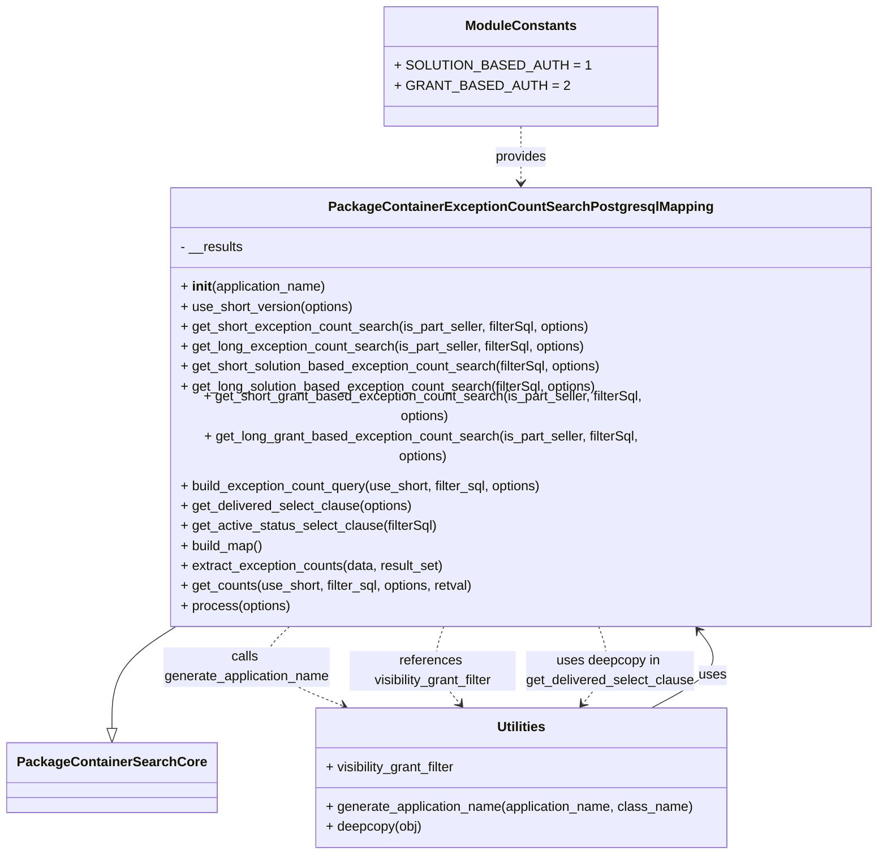

# Diagram: partview_core/partview_service/partview_service/persistence/sql/postgresql/PackageContainerExceptionCountSearchPostgresqlMapping.py

> Auto-generated by Obscura crawlers

## Mermaid

### SVG

<svg id="container" width="1046.3671875" xmlns="http://www.w3.org/2000/svg" class="classDiagram" height="980" viewBox="0 0 1046.3671875 980" role="graphics-document document" aria-roledescription="class"><g><defs><marker id="container_class-aggregationStart" class="marker aggregation class" refX="18" refY="7" markerWidth="190" markerHeight="240" orient="auto"><path d="M 18,7 L9,13 L1,7 L9,1 Z"></path></marker></defs><defs><marker id="container_class-aggregationEnd" class="marker aggregation class" refX="1" refY="7" markerWidth="20" markerHeight="28" orient="auto"><path d="M 18,7 L9,13 L1,7 L9,1 Z"></path></marker></defs><defs><marker id="container_class-extensionStart" class="marker extension class" refX="18" refY="7" markerWidth="190" markerHeight="240" orient="auto"><path d="M 1,7 L18,13 V 1 Z"></path></marker></defs><defs><marker id="container_class-extensionEnd" class="marker extension class" refX="1" refY="7" markerWidth="20" markerHeight="28" orient="auto"><path d="M 1,1 V 13 L18,7 Z"></path></marker></defs><defs><marker id="container_class-compositionStart" class="marker composition class" refX="18" refY="7" markerWidth="190" markerHeight="240" orient="auto"><path d="M 18,7 L9,13 L1,7 L9,1 Z"></path></marker></defs><defs><marker id="container_class-compositionEnd" class="marker composition class" refX="1" refY="7" markerWidth="20" markerHeight="28" orient="auto"><path d="M 18,7 L9,13 L1,7 L9,1 Z"></path></marker></defs><defs><marker id="container_class-dependencyStart" class="marker dependency class" refX="6" refY="7" markerWidth="190" markerHeight="240" orient="auto"><path d="M 5,7 L9,13 L1,7 L9,1 Z"></path></marker></defs><defs><marker id="container_class-dependencyEnd" class="marker dependency class" refX="13" refY="7" markerWidth="20" markerHeight="28" orient="auto"><path d="M 18,7 L9,13 L14,7 L9,1 Z"></path></marker></defs><defs><marker id="container_class-lollipopStart" class="marker lollipop class" refX="13" refY="7" markerWidth="190" markerHeight="240" orient="auto"><circle stroke="black" fill="transparent" cx="7" cy="7" r="6"></circle></marker></defs><defs><marker id="container_class-lollipopEnd" class="marker lollipop class" refX="1" refY="7" markerWidth="190" markerHeight="240" orient="auto"><circle stroke="black" fill="transparent" cx="7" cy="7" r="6"></circle></marker></defs><g class="root"><g class="clusters"></g><g class="edgePaths"><path d="M209.905,706L196.031,714.167C182.156,722.333,154.406,738.667,140.531,759.125C126.656,779.583,126.656,804.167,126.656,816.458L126.656,828.75" id="id_PackageContainerExceptionCountSearchPostgresqlMapping_PackageContainerSearchCore_1" class="edge-thickness-normal edge-pattern-solid relation" style=";;;" data-edge="true" data-et="edge" data-id="id_PackageContainerExceptionCountSearchPostgresqlMapping_PackageContainerSearchCore_1" data-points="W3sieCI6MjA5LjkwNTM4NDk0ODA5Njg3LCJ5Ijo3MDZ9LHsieCI6MTI2LjY1NjI1LCJ5Ijo3NTV9LHsieCI6MTI2LjY1NjI1LCJ5Ijo4NDZ9XQ==" marker-end="url(#container_class-extensionEnd)"></path><path d="M775.914,804L791.247,795.833C806.58,787.667,837.245,771.333,846.16,755.756C855.076,740.179,842.242,725.357,835.824,717.946L829.407,710.536" id="id_Utilities_PackageContainerExceptionCountSearchPostgresqlMapping_2" class="edge-thickness-normal edge-pattern-solid relation" style=";;;" data-edge="true" data-et="edge" data-id="id_Utilities_PackageContainerExceptionCountSearchPostgresqlMapping_2" data-points="W3sieCI6Nzc1LjkxNDI2ODA5MjEwNTIsInkiOjgwNH0seyJ4Ijo4NjcuOTEwMTU2MjUsInkiOjc1NX0seyJ4Ijo4MjUuNDc5NTYzMTQ4Nzg4OSwieSI6NzA2fV0=" marker-end="url(#container_class-dependencyEnd)"></path><path d="M617.656,152L617.656,158.167C617.656,164.333,617.656,176.667,617.656,188C617.656,199.333,617.656,209.667,617.656,214.833L617.656,220" id="id_ModuleConstants_PackageContainerExceptionCountSearchPostgresqlMapping_3" class="edge-thickness-normal edge-pattern-dashed relation" style=";;;" data-edge="true" data-et="edge" data-id="id_ModuleConstants_PackageContainerExceptionCountSearchPostgresqlMapping_3" data-points="W3sieCI6NjE3LjY1NjI1LCJ5IjoxNTJ9LHsieCI6NjE3LjY1NjI1LCJ5IjoxODl9LHsieCI6NjE3LjY1NjI1LCJ5IjoyMjZ9XQ==" marker-end="url(#container_class-dependencyEnd)"></path><path d="M342.313,706L332.944,714.167C323.575,722.333,304.836,738.667,314.931,754.628C325.026,770.59,363.955,786.18,383.419,793.974L402.884,801.769" id="id_PackageContainerExceptionCountSearchPostgresqlMapping_Utilities_4" class="edge-thickness-normal edge-pattern-dashed relation" style=";;;" data-edge="true" data-et="edge" data-id="id_PackageContainerExceptionCountSearchPostgresqlMapping_Utilities_4" data-points="W3sieCI6MzQyLjMxMzQ3MzE4MzM5MSwieSI6NzA2fSx7IngiOjI4Ni4wOTc2NTYyNSwieSI6NzU1fSx7IngiOjQwOC40NTM3NDE3NzYzMTU4LCJ5Ijo4MDR9XQ==" marker-end="url(#container_class-dependencyEnd)"></path><path d="M525.875,706L522.752,714.167C519.629,722.333,513.383,738.667,516.439,754.232C519.495,769.798,531.853,784.596,538.032,791.996L544.211,799.395" id="id_PackageContainerExceptionCountSearchPostgresqlMapping_Utilities_5" class="edge-thickness-normal edge-pattern-dashed relation" style=";;;" data-edge="true" data-et="edge" data-id="id_PackageContainerExceptionCountSearchPostgresqlMapping_Utilities_5" data-points="W3sieCI6NTI1Ljg3NTMyNDM5NDQ2MzYsInkiOjcwNn0seyJ4Ijo1MDcuMTM2NzE4NzUsInkiOjc1NX0seyJ4Ijo1NDguMDU3MzYwMTk3MzY4NCwieSI6ODA0fV0=" marker-end="url(#container_class-dependencyEnd)"></path><path d="M710.352,706L713.506,714.167C716.66,722.333,722.969,738.667,719.944,754.232C716.919,769.798,704.561,784.596,698.382,791.996L692.203,799.395" id="id_PackageContainerExceptionCountSearchPostgresqlMapping_Utilities_6" class="edge-thickness-normal edge-pattern-dashed relation" style=";;;" data-edge="true" data-et="edge" data-id="id_PackageContainerExceptionCountSearchPostgresqlMapping_Utilities_6" data-points="W3sieCI6NzEwLjM1MTk2Nzk5MzA3OTYsInkiOjcwNn0seyJ4Ijo3MjkuMjc3MzQzNzUsInkiOjc1NX0seyJ4Ijo2ODguMzU2NzAyMzAyNjMxNiwieSI6ODA0fV0=" marker-end="url(#container_class-dependencyEnd)"></path></g><g class="edgeLabels"><g class="edgeLabel"><g class="label" data-id="id_PackageContainerExceptionCountSearchPostgresqlMapping_PackageContainerSearchCore_1" transform="translate(0, 0)"><foreignObject width="0" height="0">

</foreignObject></g></g><g class="edgeLabel" transform="translate(850.51665, 764.26435)"><g class="label" data-id="id_Utilities_PackageContainerExceptionCountSearchPostgresqlMapping_2" transform="translate(-16.4921875, -12)"><foreignObject width="32.984375" height="24">

uses

</foreignObject></g></g><g class="edgeLabel" transform="translate(617.65625, 189)"><g class="label" data-id="id_ModuleConstants_PackageContainerExceptionCountSearchPostgresqlMapping_3" transform="translate(-31.3125, -12)"><foreignObject width="62.625" height="24">

provides

</foreignObject></g></g><g class="edgeLabel" transform="translate(286.09765625, 755)"><g class="label" data-id="id_PackageContainerExceptionCountSearchPostgresqlMapping_Utilities_4" transform="translate(-101.0390625, -24)"><foreignObject width="202.078125" height="48">

calls generate_application_name

</foreignObject></g></g><g class="edgeLabel" transform="translate(510.78359, 759.3669)"><g class="label" data-id="id_PackageContainerExceptionCountSearchPostgresqlMapping_Utilities_5" transform="translate(-100, -24)"><foreignObject width="200" height="48">

references visibility_grant_filter

</foreignObject></g></g><g class="edgeLabel" transform="translate(725.65195, 759.34119)"><g class="label" data-id="id_PackageContainerExceptionCountSearchPostgresqlMapping_Utilities_6" transform="translate(-102.140625, -24)"><foreignObject width="204.28125" height="48">

uses deepcopy in get_delivered_select_clause

</foreignObject></g></g></g><g class="nodes"><g class="node default" id="classId-PackageContainerSearchCore-0" transform="translate(126.65625, 888)"><g class="basic label-container"><path d="M-118.65625 -42 L118.65625 -42 L118.65625 42 L-118.65625 42" stroke="none" stroke-width="0" fill="#ECECFF" style=""></path><path d="M-118.65625 -42 C-47.43650203699468 -42, 23.783245926010636 -42, 118.65625 -42 M-118.65625 -42 C-56.72228021591082 -42, 5.2116895681783575 -42, 118.65625 -42 M118.65625 -42 C118.65625 -24.915322461518915, 118.65625 -7.8306449230378306, 118.65625 42 M118.65625 -42 C118.65625 -15.60166250971471, 118.65625 10.796674980570579, 118.65625 42 M118.65625 42 C40.90339937062973 42, -36.849451258740544 42, -118.65625 42 M118.65625 42 C33.99315619189787 42, -50.669937616204265 42, -118.65625 42 M-118.65625 42 C-118.65625 12.21796928203321, -118.65625 -17.56406143593358, -118.65625 -42 M-118.65625 42 C-118.65625 23.10428486550803, -118.65625 4.208569731016063, -118.65625 -42" stroke="#9370DB" stroke-width="1.3" fill="none" stroke-dasharray="0 0" style=""></path></g><g class="annotation-group text" transform="translate(0, -18)"></g><g class="label-group text" transform="translate(-106.65625, -18)"><g class="label" style="font-weight: bolder" transform="translate(0,-12)"><foreignObject width="213.3125" height="24">

PackageContainerSearchCore

</foreignObject></g></g><g class="members-group text" transform="translate(-106.65625, 30)"></g><g class="methods-group text" transform="translate(-106.65625, 60)"></g><g class="divider" style=""><path d="M-118.65625 6 C-26.533969146699647 6, 65.5883117066007 6, 118.65625 6 M-118.65625 6 C-65.2347450142237 6, -11.813240028447396 6, 118.65625 6" stroke="#9370DB" stroke-width="1.3" fill="none" stroke-dasharray="0 0" style=""></path></g><g class="divider" style=""><path d="M-118.65625 24 C-36.52349784949382 24, 45.609254301012356 24, 118.65625 24 M-118.65625 24 C-44.35230249450956 24, 29.951645010980883 24, 118.65625 24" stroke="#9370DB" stroke-width="1.3" fill="none" stroke-dasharray="0 0" style=""></path></g></g><g class="node default" id="classId-PackageContainerExceptionCountSearchPostgresqlMapping-1" transform="translate(617.65625, 466)"><g class="basic label-container"><path d="M-420.7109375 -240 L420.7109375 -240 L420.7109375 240 L-420.7109375 240" stroke="none" stroke-width="0" fill="#ECECFF" style=""></path><path d="M-420.7109375 -240 C-96.74455135341333 -240, 227.22183479317334 -240, 420.7109375 -240 M-420.7109375 -240 C-116.38630253219264 -240, 187.9383324356147 -240, 420.7109375 -240 M420.7109375 -240 C420.7109375 -117.85890446463311, 420.7109375 4.282191070733774, 420.7109375 240 M420.7109375 -240 C420.7109375 -141.6936195248939, 420.7109375 -43.38723904978778, 420.7109375 240 M420.7109375 240 C210.70743682884196 240, 0.7039361576839269 240, -420.7109375 240 M420.7109375 240 C222.51767118090171 240, 24.32440486180343 240, -420.7109375 240 M-420.7109375 240 C-420.7109375 51.17710212109557, -420.7109375 -137.64579575780886, -420.7109375 -240 M-420.7109375 240 C-420.7109375 130.7339622764432, -420.7109375 21.467924552886416, -420.7109375 -240" stroke="#9370DB" stroke-width="1.3" fill="none" stroke-dasharray="0 0" style=""></path></g><g class="annotation-group text" transform="translate(0, -216)"></g><g class="label-group text" transform="translate(-217.65625, -216)"><g class="label" style="font-weight: bolder" transform="translate(0,-12)"><foreignObject width="435.3125" height="24">

PackageContainerExceptionCountSearchPostgresqlMapping

</foreignObject></g></g><g class="members-group text" transform="translate(-408.7109375, -168)"><g class="label" style="" transform="translate(0,-12)"><foreignObject width="76.3125" height="24">

- __results

</foreignObject></g></g><g class="methods-group text" transform="translate(-408.7109375, -120)"><g class="label" style="" transform="translate(0,-12)"><foreignObject width="177.984375" height="24">

+ <strong>init</strong>(application_name)

</foreignObject></g><g class="label" style="" transform="translate(0,12)"><foreignObject width="210.578125" height="24">

+ use_short_version(options)

</foreignObject></g><g class="label" style="" transform="translate(0,36)"><foreignObject width="501.546875" height="24">

+ get_short_exception_count_search(is_part_seller, filterSql, options)

</foreignObject></g><g class="label" style="" transform="translate(0,60)"><foreignObject width="494.953125" height="24">

+ get_long_exception_count_search(is_part_seller, filterSql, options)

</foreignObject></g><g class="label" style="" transform="translate(0,84)"><foreignObject width="516.171875" height="24">

+ get_short_solution_based_exception_count_search(filterSql, options)

</foreignObject></g><g class="label" style="" transform="translate(0,108)"><foreignObject width="509.578125" height="24">

+ get_long_solution_based_exception_count_search(filterSql, options)

</foreignObject></g><g class="label" style="" transform="translate(0,132)"><foreignObject width="599.765625" height="24">

+ get_short_grant_based_exception_count_search(is_part_seller, filterSql, options)

</foreignObject></g><g class="label" style="" transform="translate(0,156)"><foreignObject width="593.171875" height="24">

+ get_long_grant_based_exception_count_search(is_part_seller, filterSql, options)

</foreignObject></g><g class="label" style="" transform="translate(0,180)"><foreignObject width="444" height="24">

+ build_exception_count_query(use_short, filter_sql, options)

</foreignObject></g><g class="label" style="" transform="translate(0,204)"><foreignObject width="282.21875" height="24">

+ get_delivered_select_clause(options)

</foreignObject></g><g class="label" style="" transform="translate(0,228)"><foreignObject width="311.4375" height="24">

+ get_active_status_select_clause(filterSql)

</foreignObject></g><g class="label" style="" transform="translate(0,252)"><foreignObject width="100.34375" height="24">

+ build_map()

</foreignObject></g><g class="label" style="" transform="translate(0,276)"><foreignObject width="320.484375" height="24">

+ extract_exception_counts(data, result_set)

</foreignObject></g><g class="label" style="" transform="translate(0,300)"><foreignObject width="357.15625" height="24">

+ get_counts(use_short, filter_sql, options, retval)

</foreignObject></g><g class="label" style="" transform="translate(0,324)"><foreignObject width="133.296875" height="24">

+ process(options)

</foreignObject></g></g><g class="divider" style=""><path d="M-420.7109375 -192 C-217.74786293461443 -192, -14.784788369228863 -192, 420.7109375 -192 M-420.7109375 -192 C-187.30933317643783 -192, 46.092271147124336 -192, 420.7109375 -192" stroke="#9370DB" stroke-width="1.3" fill="none" stroke-dasharray="0 0" style=""></path></g><g class="divider" style=""><path d="M-420.7109375 -144 C-174.80174078397772 -144, 71.10745593204456 -144, 420.7109375 -144 M-420.7109375 -144 C-195.62504538921334 -144, 29.46084672157332 -144, 420.7109375 -144" stroke="#9370DB" stroke-width="1.3" fill="none" stroke-dasharray="0 0" style=""></path></g></g><g class="node default" id="classId-ModuleConstants-2" transform="translate(617.65625, 80)"><g class="basic label-container"><path d="M-148.6796875 -72 L148.6796875 -72 L148.6796875 72 L-148.6796875 72" stroke="none" stroke-width="0" fill="#ECECFF" style=""></path><path d="M-148.6796875 -72 C-57.7453426869059 -72, 33.1890021261882 -72, 148.6796875 -72 M-148.6796875 -72 C-62.57285819920847 -72, 23.533971101583063 -72, 148.6796875 -72 M148.6796875 -72 C148.6796875 -16.283511264823026, 148.6796875 39.43297747035395, 148.6796875 72 M148.6796875 -72 C148.6796875 -38.883418300322944, 148.6796875 -5.766836600645888, 148.6796875 72 M148.6796875 72 C88.34739968134497 72, 28.015111862689935 72, -148.6796875 72 M148.6796875 72 C79.19601347574473 72, 9.71233945148947 72, -148.6796875 72 M-148.6796875 72 C-148.6796875 35.79177219002163, -148.6796875 -0.41645561995673575, -148.6796875 -72 M-148.6796875 72 C-148.6796875 38.673899568868464, -148.6796875 5.347799137736928, -148.6796875 -72" stroke="#9370DB" stroke-width="1.3" fill="none" stroke-dasharray="0 0" style=""></path></g><g class="annotation-group text" transform="translate(0, -48)"></g><g class="label-group text" transform="translate(-63.625, -48)"><g class="label" style="font-weight: bolder" transform="translate(0,-12)"><foreignObject width="127.25" height="24">

ModuleConstants

</foreignObject></g></g><g class="members-group text" transform="translate(-136.6796875, 0)"><g class="label" style="" transform="translate(0,-12)"><foreignObject width="209.734375" height="24">

+ SOLUTION_BASED_AUTH = 1

</foreignObject></g><g class="label" style="" transform="translate(0,12)"><foreignObject width="185.125" height="24">

+ GRANT_BASED_AUTH = 2

</foreignObject></g></g><g class="methods-group text" transform="translate(-136.6796875, 72)"></g><g class="divider" style=""><path d="M-148.6796875 -24 C-66.83132167788695 -24, 15.017044144226105 -24, 148.6796875 -24 M-148.6796875 -24 C-37.479695756079124 -24, 73.72029598784175 -24, 148.6796875 -24" stroke="#9370DB" stroke-width="1.3" fill="none" stroke-dasharray="0 0" style=""></path></g><g class="divider" style=""><path d="M-148.6796875 48 C-67.4620866999723 48, 13.755514100055393 48, 148.6796875 48 M-148.6796875 48 C-38.20234579402117 48, 72.27499591195766 48, 148.6796875 48" stroke="#9370DB" stroke-width="1.3" fill="none" stroke-dasharray="0 0" style=""></path></g></g><g class="node default" id="classId-Utilities-3" transform="translate(618.20703125, 888)"><g class="basic label-container"><path d="M-250.2265625 -84 L250.2265625 -84 L250.2265625 84 L-250.2265625 84" stroke="none" stroke-width="0" fill="#ECECFF" style=""></path><path d="M-250.2265625 -84 C-50.55947888028294 -84, 149.10760473943412 -84, 250.2265625 -84 M-250.2265625 -84 C-84.27311372188268 -84, 81.68033505623464 -84, 250.2265625 -84 M250.2265625 -84 C250.2265625 -46.96437185244604, 250.2265625 -9.928743704892085, 250.2265625 84 M250.2265625 -84 C250.2265625 -46.886278750635725, 250.2265625 -9.77255750127145, 250.2265625 84 M250.2265625 84 C79.21286760448376 84, -91.80082729103248 84, -250.2265625 84 M250.2265625 84 C83.2723196434286 84, -83.6819232131428 84, -250.2265625 84 M-250.2265625 84 C-250.2265625 42.345979527707, -250.2265625 0.6919590554140029, -250.2265625 -84 M-250.2265625 84 C-250.2265625 17.06379413068892, -250.2265625 -49.87241173862216, -250.2265625 -84" stroke="#9370DB" stroke-width="1.3" fill="none" stroke-dasharray="0 0" style=""></path></g><g class="annotation-group text" transform="translate(0, -60)"></g><g class="label-group text" transform="translate(-28.8125, -60)"><g class="label" style="font-weight: bolder" transform="translate(0,-12)"><foreignObject width="57.625" height="24">

Utilities

</foreignObject></g></g><g class="members-group text" transform="translate(-238.2265625, -12)"><g class="label" style="" transform="translate(0,-12)"><foreignObject width="161.484375" height="24">

+ visibility_grant_filter

</foreignObject></g></g><g class="methods-group text" transform="translate(-238.2265625, 36)"><g class="label" style="" transform="translate(0,-12)"><foreignObject width="447.640625" height="24">

+ generate_application_name(application_name, class_name)

</foreignObject></g><g class="label" style="" transform="translate(0,12)"><foreignObject width="116.421875" height="24">

+ deepcopy(obj)

</foreignObject></g></g><g class="divider" style=""><path d="M-250.2265625 -36 C-140.79405521405218 -36, -31.361547928104358 -36, 250.2265625 -36 M-250.2265625 -36 C-103.83530475467109 -36, 42.55595299065783 -36, 250.2265625 -36" stroke="#9370DB" stroke-width="1.3" fill="none" stroke-dasharray="0 0" style=""></path></g><g class="divider" style=""><path d="M-250.2265625 12 C-130.5723578255434 12, -10.918153151086813 12, 250.2265625 12 M-250.2265625 12 C-122.92830871710336 12, 4.369945065793274 12, 250.2265625 12" stroke="#9370DB" stroke-width="1.3" fill="none" stroke-dasharray="0 0" style=""></path></g></g></g></g></g></svg>
