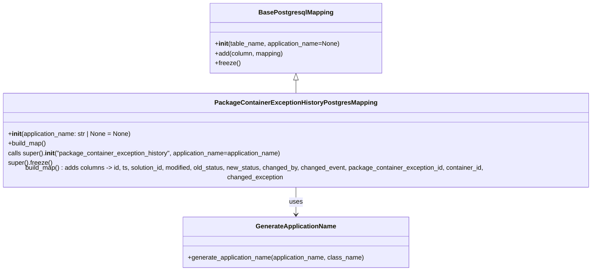

# Diagram: partview_core/partview_service/partview_service/persistence/sql/postgresql/PackageContainerExceptionHistoryPostgresMapping.py

> Auto-generated by Obscura crawlers

## Mermaid

### SVG

<svg id="container" width="1530.6953125" xmlns="http://www.w3.org/2000/svg" class="classDiagram" height="662" viewBox="0 0 1530.6953125 662" role="graphics-document document" aria-roledescription="class"><g><defs><marker id="container_class-aggregationStart" class="marker aggregation class" refX="18" refY="7" markerWidth="190" markerHeight="240" orient="auto"><path d="M 18,7 L9,13 L1,7 L9,1 Z"></path></marker></defs><defs><marker id="container_class-aggregationEnd" class="marker aggregation class" refX="1" refY="7" markerWidth="20" markerHeight="28" orient="auto"><path d="M 18,7 L9,13 L1,7 L9,1 Z"></path></marker></defs><defs><marker id="container_class-extensionStart" class="marker extension class" refX="18" refY="7" markerWidth="190" markerHeight="240" orient="auto"><path d="M 1,7 L18,13 V 1 Z"></path></marker></defs><defs><marker id="container_class-extensionEnd" class="marker extension class" refX="1" refY="7" markerWidth="20" markerHeight="28" orient="auto"><path d="M 1,1 V 13 L18,7 Z"></path></marker></defs><defs><marker id="container_class-compositionStart" class="marker composition class" refX="18" refY="7" markerWidth="190" markerHeight="240" orient="auto"><path d="M 18,7 L9,13 L1,7 L9,1 Z"></path></marker></defs><defs><marker id="container_class-compositionEnd" class="marker composition class" refX="1" refY="7" markerWidth="20" markerHeight="28" orient="auto"><path d="M 18,7 L9,13 L1,7 L9,1 Z"></path></marker></defs><defs><marker id="container_class-dependencyStart" class="marker dependency class" refX="6" refY="7" markerWidth="190" markerHeight="240" orient="auto"><path d="M 5,7 L9,13 L1,7 L9,1 Z"></path></marker></defs><defs><marker id="container_class-dependencyEnd" class="marker dependency class" refX="13" refY="7" markerWidth="20" markerHeight="28" orient="auto"><path d="M 18,7 L9,13 L14,7 L9,1 Z"></path></marker></defs><defs><marker id="container_class-lollipopStart" class="marker lollipop class" refX="13" refY="7" markerWidth="190" markerHeight="240" orient="auto"><circle stroke="black" fill="transparent" cx="7" cy="7" r="6"></circle></marker></defs><defs><marker id="container_class-lollipopEnd" class="marker lollipop class" refX="1" refY="7" markerWidth="190" markerHeight="240" orient="auto"><circle stroke="black" fill="transparent" cx="7" cy="7" r="6"></circle></marker></defs><g class="root"><g class="clusters"></g><g class="edgePaths"><path d="M765.348,199.25L765.348,200.542C765.348,201.833,765.348,204.417,765.348,209.875C765.348,215.333,765.348,223.667,765.348,227.833L765.348,232" id="id_BasePostgresqlMapping_PackageContainerExceptionHistoryPostgresMapping_1" class="edge-thickness-normal edge-pattern-solid relation" style=";;;" data-edge="true" data-et="edge" data-id="id_BasePostgresqlMapping_PackageContainerExceptionHistoryPostgresMapping_1" data-points="W3sieCI6NzY1LjM0NzY1NjI1LCJ5IjoxODJ9LHsieCI6NzY1LjM0NzY1NjI1LCJ5IjoyMDd9LHsieCI6NzY1LjM0NzY1NjI1LCJ5IjoyMzJ9XQ==" marker-start="url(#container_class-extensionStart)"></path><path d="M765.348,454L765.348,460.167C765.348,466.333,765.348,478.667,765.348,490C765.348,501.333,765.348,511.667,765.348,516.833L765.348,522" id="id_PackageContainerExceptionHistoryPostgresMapping_GenerateApplicationName_2" class="edge-thickness-normal edge-pattern-solid relation" style=";;;" data-edge="true" data-et="edge" data-id="id_PackageContainerExceptionHistoryPostgresMapping_GenerateApplicationName_2" data-points="W3sieCI6NzY1LjM0NzY1NjI1LCJ5Ijo0NTR9LHsieCI6NzY1LjM0NzY1NjI1LCJ5Ijo0OTF9LHsieCI6NzY1LjM0NzY1NjI1LCJ5Ijo1Mjh9XQ==" marker-end="url(#container_class-dependencyEnd)"></path></g><g class="edgeLabels"><g class="edgeLabel"><g class="label" data-id="id_BasePostgresqlMapping_PackageContainerExceptionHistoryPostgresMapping_1" transform="translate(0, 0)"><foreignObject width="0" height="0">

</foreignObject></g></g><g class="edgeLabel" transform="translate(765.34765625, 491)"><g class="label" data-id="id_PackageContainerExceptionHistoryPostgresMapping_GenerateApplicationName_2" transform="translate(-16.4921875, -12)"><foreignObject width="32.984375" height="24">

uses

</foreignObject></g></g></g><g class="nodes"><g class="node default" id="classId-BasePostgresqlMapping-0" transform="translate(765.34765625, 95)"><g class="basic label-container"><path d="M-212.8359375 -87 L212.8359375 -87 L212.8359375 87 L-212.8359375 87" stroke="none" stroke-width="0" fill="#ECECFF" style=""></path><path d="M-212.8359375 -87 C-79.25161405512154 -87, 54.33270938975693 -87, 212.8359375 -87 M-212.8359375 -87 C-67.01166840490774 -87, 78.81260069018452 -87, 212.8359375 -87 M212.8359375 -87 C212.8359375 -32.20019023903862, 212.8359375 22.59961952192276, 212.8359375 87 M212.8359375 -87 C212.8359375 -48.44997227870095, 212.8359375 -9.899944557401895, 212.8359375 87 M212.8359375 87 C76.80844658378135 87, -59.219044332437306 87, -212.8359375 87 M212.8359375 87 C107.40451980394685 87, 1.973102107893709 87, -212.8359375 87 M-212.8359375 87 C-212.8359375 34.745498449108865, -212.8359375 -17.50900310178227, -212.8359375 -87 M-212.8359375 87 C-212.8359375 37.70760032508932, -212.8359375 -11.584799349821367, -212.8359375 -87" stroke="#9370DB" stroke-width="1.3" fill="none" stroke-dasharray="0 0" style=""></path></g><g class="annotation-group text" transform="translate(0, -63)"></g><g class="label-group text" transform="translate(-87.921875, -63)"><g class="label" style="font-weight: bolder" transform="translate(0,-12)"><foreignObject width="175.84375" height="24">

BasePostgresqlMapping

</foreignObject></g></g><g class="members-group text" transform="translate(-200.8359375, -15)"></g><g class="methods-group text" transform="translate(-200.8359375, 15)"><g class="label" style="" transform="translate(0,-12)"><foreignObject width="313.75" height="24">

+<strong>init</strong>(table_name, application_name=None)

</foreignObject></g><g class="label" style="" transform="translate(0,12)"><foreignObject width="171.4375" height="24">

+add(column, mapping)

</foreignObject></g><g class="label" style="" transform="translate(0,36)"><foreignObject width="62.109375" height="24">

+freeze()

</foreignObject></g></g><g class="divider" style=""><path d="M-212.8359375 -39 C-74.01082560125349 -39, 64.81428629749303 -39, 212.8359375 -39 M-212.8359375 -39 C-117.40972700517044 -39, -21.983516510340877 -39, 212.8359375 -39" stroke="#9370DB" stroke-width="1.3" fill="none" stroke-dasharray="0 0" style=""></path></g><g class="divider" style=""><path d="M-212.8359375 -15 C-105.74224198738736 -15, 1.3514535252252813 -15, 212.8359375 -15 M-212.8359375 -15 C-116.70038000438383 -15, -20.564822508767662 -15, 212.8359375 -15" stroke="#9370DB" stroke-width="1.3" fill="none" stroke-dasharray="0 0" style=""></path></g></g><g class="node default" id="classId-PackageContainerExceptionHistoryPostgresMapping-1" transform="translate(765.34765625, 343)"><g class="basic label-container"><path d="M-757.34765625 -111 L757.34765625 -111 L757.34765625 111 L-757.34765625 111" stroke="none" stroke-width="0" fill="#ECECFF" style=""></path><path d="M-757.34765625 -111 C-191.5637787692291 -111, 374.2200987115418 -111, 757.34765625 -111 M-757.34765625 -111 C-440.700864160857 -111, -124.05407207171402 -111, 757.34765625 -111 M757.34765625 -111 C757.34765625 -38.83099365545458, 757.34765625 33.338012689090846, 757.34765625 111 M757.34765625 -111 C757.34765625 -64.56122435192006, 757.34765625 -18.122448703840135, 757.34765625 111 M757.34765625 111 C255.69932074588365 111, -245.9490147582327 111, -757.34765625 111 M757.34765625 111 C422.7634861511718 111, 88.17931605234355 111, -757.34765625 111 M-757.34765625 111 C-757.34765625 25.92058782180601, -757.34765625 -59.15882435638798, -757.34765625 -111 M-757.34765625 111 C-757.34765625 23.959157209606303, -757.34765625 -63.08168558078739, -757.34765625 -111" stroke="#9370DB" stroke-width="1.3" fill="none" stroke-dasharray="0 0" style=""></path></g><g class="annotation-group text" transform="translate(0, -87)"></g><g class="label-group text" transform="translate(-190.7890625, -87)"><g class="label" style="font-weight: bolder" transform="translate(0,-12)"><foreignObject width="381.578125" height="24">

PackageContainerExceptionHistoryPostgresMapping

</foreignObject></g></g><g class="members-group text" transform="translate(-745.34765625, -39)"></g><g class="methods-group text" transform="translate(-745.34765625, -9)"><g class="label" style="" transform="translate(0,-12)"><foreignObject width="309.390625" height="24">

+<strong>init</strong>(application_name: str | None = None)

</foreignObject></g><g class="label" style="" transform="translate(0,12)"><foreignObject width="96.109375" height="24">

+build_map()

</foreignObject></g><g class="label" style="" transform="translate(0,36)"><foreignObject width="688.40625" height="24">

calls super().<strong>init</strong>("package_container_exception_history", application_name=application_name)

</foreignObject></g><g class="label" style="" transform="translate(0,60)"><foreignObject width="109.53125" height="24">

super().freeze()

</foreignObject></g><g class="label" style="" transform="translate(0,84)"><foreignObject width="1299.90625" height="24">

build_map() : adds columns -&gt; id, ts, solution_id, modified, old_status, new_status, changed_by, changed_event, package_container_exception_id, container_id, changed_exception

</foreignObject></g></g><g class="divider" style=""><path d="M-757.34765625 -63 C-400.34587561617366 -63, -43.344094982347315 -63, 757.34765625 -63 M-757.34765625 -63 C-412.40035151224873 -63, -67.45304677449747 -63, 757.34765625 -63" stroke="#9370DB" stroke-width="1.3" fill="none" stroke-dasharray="0 0" style=""></path></g><g class="divider" style=""><path d="M-757.34765625 -39 C-163.19924514890306 -39, 430.9491659521939 -39, 757.34765625 -39 M-757.34765625 -39 C-413.7487558860542 -39, -70.1498555221084 -39, 757.34765625 -39" stroke="#9370DB" stroke-width="1.3" fill="none" stroke-dasharray="0 0" style=""></path></g></g><g class="node default" id="classId-GenerateApplicationName-2" transform="translate(765.34765625, 591)"><g class="basic label-container"><path d="M-281.61328125 -63 L281.61328125 -63 L281.61328125 63 L-281.61328125 63" stroke="none" stroke-width="0" fill="#ECECFF" style=""></path><path d="M-281.61328125 -63 C-87.86168630351375 -63, 105.8899086429725 -63, 281.61328125 -63 M-281.61328125 -63 C-132.19894660861266 -63, 17.215388032774683 -63, 281.61328125 -63 M281.61328125 -63 C281.61328125 -18.390166878497595, 281.61328125 26.21966624300481, 281.61328125 63 M281.61328125 -63 C281.61328125 -14.722552322215556, 281.61328125 33.55489535556889, 281.61328125 63 M281.61328125 63 C110.01345077762457 63, -61.58637969475086 63, -281.61328125 63 M281.61328125 63 C126.517240431396 63, -28.57880038720799 63, -281.61328125 63 M-281.61328125 63 C-281.61328125 17.01748365915531, -281.61328125 -28.96503268168938, -281.61328125 -63 M-281.61328125 63 C-281.61328125 17.02244655404901, -281.61328125 -28.955106891901977, -281.61328125 -63" stroke="#9370DB" stroke-width="1.3" fill="none" stroke-dasharray="0 0" style=""></path></g><g class="annotation-group text" transform="translate(0, -39)"></g><g class="label-group text" transform="translate(-95.8203125, -39)"><g class="label" style="font-weight: bolder" transform="translate(0,-12)"><foreignObject width="191.640625" height="24">

GenerateApplicationName

</foreignObject></g></g><g class="members-group text" transform="translate(-269.61328125, 9)"></g><g class="methods-group text" transform="translate(-269.61328125, 39)"><g class="label" style="" transform="translate(0,-12)"><foreignObject width="443.40625" height="24">

+generate_application_name(application_name, class_name)

</foreignObject></g></g><g class="divider" style=""><path d="M-281.61328125 -15 C-72.76193456332214 -15, 136.08941212335571 -15, 281.61328125 -15 M-281.61328125 -15 C-69.15220604143738 -15, 143.30886916712524 -15, 281.61328125 -15" stroke="#9370DB" stroke-width="1.3" fill="none" stroke-dasharray="0 0" style=""></path></g><g class="divider" style=""><path d="M-281.61328125 9 C-138.8586406721735 9, 3.8959999056530137 9, 281.61328125 9 M-281.61328125 9 C-60.63193519803238 9, 160.34941085393524 9, 281.61328125 9" stroke="#9370DB" stroke-width="1.3" fill="none" stroke-dasharray="0 0" style=""></path></g></g></g></g></g></svg>
