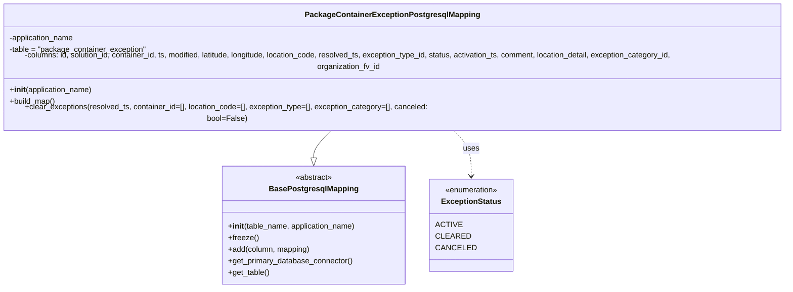

# Diagram: partview_core/partview_service/partview_service/persistence/sql/postgresql/PackageContainerExceptionPostgresqlMapping.py

> Auto-generated by Obscura crawlers

## Mermaid

### SVG

<svg id="container" width="1727.6875" xmlns="http://www.w3.org/2000/svg" class="classDiagram" height="576" viewBox="0 0 1727.6875 576" role="graphics-document document" aria-roledescription="class"><g><defs><marker id="container_class-aggregationStart" class="marker aggregation class" refX="18" refY="7" markerWidth="190" markerHeight="240" orient="auto"><path d="M 18,7 L9,13 L1,7 L9,1 Z"></path></marker></defs><defs><marker id="container_class-aggregationEnd" class="marker aggregation class" refX="1" refY="7" markerWidth="20" markerHeight="28" orient="auto"><path d="M 18,7 L9,13 L1,7 L9,1 Z"></path></marker></defs><defs><marker id="container_class-extensionStart" class="marker extension class" refX="18" refY="7" markerWidth="190" markerHeight="240" orient="auto"><path d="M 1,7 L18,13 V 1 Z"></path></marker></defs><defs><marker id="container_class-extensionEnd" class="marker extension class" refX="1" refY="7" markerWidth="20" markerHeight="28" orient="auto"><path d="M 1,1 V 13 L18,7 Z"></path></marker></defs><defs><marker id="container_class-compositionStart" class="marker composition class" refX="18" refY="7" markerWidth="190" markerHeight="240" orient="auto"><path d="M 18,7 L9,13 L1,7 L9,1 Z"></path></marker></defs><defs><marker id="container_class-compositionEnd" class="marker composition class" refX="1" refY="7" markerWidth="20" markerHeight="28" orient="auto"><path d="M 18,7 L9,13 L1,7 L9,1 Z"></path></marker></defs><defs><marker id="container_class-dependencyStart" class="marker dependency class" refX="6" refY="7" markerWidth="190" markerHeight="240" orient="auto"><path d="M 5,7 L9,13 L1,7 L9,1 Z"></path></marker></defs><defs><marker id="container_class-dependencyEnd" class="marker dependency class" refX="13" refY="7" markerWidth="20" markerHeight="28" orient="auto"><path d="M 18,7 L9,13 L14,7 L9,1 Z"></path></marker></defs><defs><marker id="container_class-lollipopStart" class="marker lollipop class" refX="13" refY="7" markerWidth="190" markerHeight="240" orient="auto"><circle stroke="black" fill="transparent" cx="7" cy="7" r="6"></circle></marker></defs><defs><marker id="container_class-lollipopEnd" class="marker lollipop class" refX="1" refY="7" markerWidth="190" markerHeight="240" orient="auto"><circle stroke="black" fill="transparent" cx="7" cy="7" r="6"></circle></marker></defs><g class="root"><g class="clusters"></g><g class="edgePaths"><path d="M742.334,248L736.09,254.167C729.846,260.333,717.358,272.667,711.113,282.125C704.869,291.583,704.869,298.167,704.869,301.458L704.869,304.75" id="id_PackageContainerExceptionPostgresqlMapping_BasePostgresqlMapping_1" class="edge-thickness-normal edge-pattern-solid relation" style=";;;" data-edge="true" data-et="edge" data-id="id_PackageContainerExceptionPostgresqlMapping_BasePostgresqlMapping_1" data-points="W3sieCI6NzQyLjMzNDQ5NDQyNjc1MTYsInkiOjI0OH0seyJ4Ijo3MDQuODY5MTQwNjI1LCJ5IjoyODV9LHsieCI6NzA0Ljg2OTE0MDYyNSwieSI6MzIyfV0=" marker-end="url(#container_class-extensionEnd)"></path><path d="M985.353,248L991.597,254.167C997.841,260.333,1010.33,272.667,1016.574,288.5C1022.818,304.333,1022.818,323.667,1022.818,333.333L1022.818,343" id="id_PackageContainerExceptionPostgresqlMapping_ExceptionStatus_2" class="edge-thickness-normal edge-pattern-dashed relation" style=";;;" data-edge="true" data-et="edge" data-id="id_PackageContainerExceptionPostgresqlMapping_ExceptionStatus_2" data-points="W3sieCI6OTg1LjM1MzAwNTU3MzI0ODQsInkiOjI0OH0seyJ4IjoxMDIyLjgxODM1OTM3NSwieSI6Mjg1fSx7IngiOjEwMjIuODE4MzU5Mzc1LCJ5IjozNDl9XQ==" marker-end="url(#container_class-dependencyEnd)"></path></g><g class="edgeLabels"><g class="edgeLabel"><g class="label" data-id="id_PackageContainerExceptionPostgresqlMapping_BasePostgresqlMapping_1" transform="translate(0, 0)"><foreignObject width="0" height="0">

</foreignObject></g></g><g class="edgeLabel" transform="translate(1022.818359375, 285)"><g class="label" data-id="id_PackageContainerExceptionPostgresqlMapping_ExceptionStatus_2" transform="translate(-16.4921875, -12)"><foreignObject width="32.984375" height="24">

uses

</foreignObject></g></g></g><g class="nodes"><g class="node default" id="classId-BasePostgresqlMapping-0" transform="translate(704.869140625, 445)"><g class="basic label-container"><path d="M-189.6484375 -123 L189.6484375 -123 L189.6484375 123 L-189.6484375 123" stroke="none" stroke-width="0" fill="#ECECFF" style=""></path><path d="M-189.6484375 -123 C-95.03746664206982 -123, -0.4264957841396324 -123, 189.6484375 -123 M-189.6484375 -123 C-86.23078508552483 -123, 17.186867328950342 -123, 189.6484375 -123 M189.6484375 -123 C189.6484375 -31.845529084790854, 189.6484375 59.30894183041829, 189.6484375 123 M189.6484375 -123 C189.6484375 -63.852614567454786, 189.6484375 -4.7052291349095725, 189.6484375 123 M189.6484375 123 C61.25294692083747 123, -67.14254365832505 123, -189.6484375 123 M189.6484375 123 C109.64976688741652 123, 29.651096274833037 123, -189.6484375 123 M-189.6484375 123 C-189.6484375 25.90742500475173, -189.6484375 -71.18514999049654, -189.6484375 -123 M-189.6484375 123 C-189.6484375 54.0870235202309, -189.6484375 -14.8259529595382, -189.6484375 -123" stroke="#9370DB" stroke-width="1.3" fill="none" stroke-dasharray="0 0" style=""></path></g><g class="annotation-group text" transform="translate(-38.609375, -99)"><g class="label" style="" transform="translate(0,-12)"><foreignObject width="77.21875" height="24">

«abstract»

</foreignObject></g></g><g class="label-group text" transform="translate(-87.921875, -75)"><g class="label" style="font-weight: bolder" transform="translate(0,-12)"><foreignObject width="175.84375" height="24">

BasePostgresqlMapping

</foreignObject></g></g><g class="members-group text" transform="translate(-177.6484375, -27)"></g><g class="methods-group text" transform="translate(-177.6484375, 3)"><g class="label" style="" transform="translate(0,-12)"><foreignObject width="267.375" height="24">

+<strong>init</strong>(table_name, application_name)

</foreignObject></g><g class="label" style="" transform="translate(0,12)"><foreignObject width="62.109375" height="24">

+freeze()

</foreignObject></g><g class="label" style="" transform="translate(0,36)"><foreignObject width="171.4375" height="24">

+add(column, mapping)

</foreignObject></g><g class="label" style="" transform="translate(0,60)"><foreignObject width="260.671875" height="24">

+get_primary_database_connector()

</foreignObject></g><g class="label" style="" transform="translate(0,84)"><foreignObject width="86.125" height="24">

+get_table()

</foreignObject></g></g><g class="divider" style=""><path d="M-189.6484375 -51 C-77.49064219042779 -51, 34.667153119144416 -51, 189.6484375 -51 M-189.6484375 -51 C-104.31385551356993 -51, -18.979273527139867 -51, 189.6484375 -51" stroke="#9370DB" stroke-width="1.3" fill="none" stroke-dasharray="0 0" style=""></path></g><g class="divider" style=""><path d="M-189.6484375 -27 C-75.71180293207698 -27, 38.224831635846044 -27, 189.6484375 -27 M-189.6484375 -27 C-90.4198333401348 -27, 8.808770819730398 -27, 189.6484375 -27" stroke="#9370DB" stroke-width="1.3" fill="none" stroke-dasharray="0 0" style=""></path></g></g><g class="node default" id="classId-PackageContainerExceptionPostgresqlMapping-1" transform="translate(863.84375, 128)"><g class="basic label-container"><path d="M-855.84375 -120 L855.84375 -120 L855.84375 120 L-855.84375 120" stroke="none" stroke-width="0" fill="#ECECFF" style=""></path><path d="M-855.84375 -120 C-442.9349821103161 -120, -30.026214220632255 -120, 855.84375 -120 M-855.84375 -120 C-396.4996427961366 -120, 62.84446440772683 -120, 855.84375 -120 M855.84375 -120 C855.84375 -41.218013482878064, 855.84375 37.56397303424387, 855.84375 120 M855.84375 -120 C855.84375 -57.57532591752798, 855.84375 4.849348164944047, 855.84375 120 M855.84375 120 C235.09089008783837 120, -385.66196982432325 120, -855.84375 120 M855.84375 120 C216.0942859738309 120, -423.6551780523382 120, -855.84375 120 M-855.84375 120 C-855.84375 39.72028930925529, -855.84375 -40.559421381489415, -855.84375 -120 M-855.84375 120 C-855.84375 41.97958307522862, -855.84375 -36.040833849542764, -855.84375 -120" stroke="#9370DB" stroke-width="1.3" fill="none" stroke-dasharray="0 0" style=""></path></g><g class="annotation-group text" transform="translate(0, -96)"></g><g class="label-group text" transform="translate(-171.546875, -96)"><g class="label" style="font-weight: bolder" transform="translate(0,-12)"><foreignObject width="343.09375" height="24">

PackageContainerExceptionPostgresqlMapping

</foreignObject></g></g><g class="members-group text" transform="translate(-843.84375, -48)"><g class="label" style="" transform="translate(0,-12)"><foreignObject width="137.15625" height="24">

-application_name

</foreignObject></g><g class="label" style="" transform="translate(0,12)"><foreignObject width="286" height="24">

-table = "package_container_exception"

</foreignObject></g><g class="label" style="" transform="translate(0,36)"><foreignObject width="1516.140625" height="24">

-columns: id, solution_id, container_id, ts, modified, latitude, longitude, location_code, resolved_ts, exception_type_id, status, activation_ts, comment, location_detail, exception_category_id, organization_fv_id

</foreignObject></g></g><g class="methods-group text" transform="translate(-843.84375, 48)"><g class="label" style="" transform="translate(0,-12)"><foreignObject width="173.734375" height="24">

+<strong>init</strong>(application_name)

</foreignObject></g><g class="label" style="" transform="translate(0,12)"><foreignObject width="96.109375" height="24">

+build_map()

</foreignObject></g><g class="label" style="" transform="translate(0,36)"><foreignObject width="929.140625" height="24">

+clear_exceptions(resolved_ts, container_id=[], location_code=[], exception_type=[], exception_category=[], canceled: bool=False)

</foreignObject></g></g><g class="divider" style=""><path d="M-855.84375 -72 C-196.08064206003678 -72, 463.68246587992644 -72, 855.84375 -72 M-855.84375 -72 C-321.80925355603574 -72, 212.22524288792852 -72, 855.84375 -72" stroke="#9370DB" stroke-width="1.3" fill="none" stroke-dasharray="0 0" style=""></path></g><g class="divider" style=""><path d="M-855.84375 24 C-209.89338015266355 24, 436.0569896946729 24, 855.84375 24 M-855.84375 24 C-479.6798029277221 24, -103.51585585544422 24, 855.84375 24" stroke="#9370DB" stroke-width="1.3" fill="none" stroke-dasharray="0 0" style=""></path></g></g><g class="node default" id="classId-ExceptionStatus-2" transform="translate(1022.818359375, 445)"><g class="basic label-container"><path d="M-78.30078125 -96 L78.30078125 -96 L78.30078125 96 L-78.30078125 96" stroke="none" stroke-width="0" fill="#ECECFF" style=""></path><path d="M-78.30078125 -96 C-25.546742574738552 -96, 27.207296100522896 -96, 78.30078125 -96 M-78.30078125 -96 C-34.62218786015364 -96, 9.056405529692725 -96, 78.30078125 -96 M78.30078125 -96 C78.30078125 -27.522311727151134, 78.30078125 40.95537654569773, 78.30078125 96 M78.30078125 -96 C78.30078125 -28.553644677170354, 78.30078125 38.89271064565929, 78.30078125 96 M78.30078125 96 C33.978494868284066 96, -10.343791513431867 96, -78.30078125 96 M78.30078125 96 C37.667804250326206 96, -2.9651727493475875 96, -78.30078125 96 M-78.30078125 96 C-78.30078125 36.772654573223875, -78.30078125 -22.45469085355225, -78.30078125 -96 M-78.30078125 96 C-78.30078125 31.748591947375928, -78.30078125 -32.502816105248144, -78.30078125 -96" stroke="#9370DB" stroke-width="1.3" fill="none" stroke-dasharray="0 0" style=""></path></g><g class="annotation-group text" transform="translate(-55.5546875, -72)"><g class="label" style="" transform="translate(0,-12)"><foreignObject width="111.109375" height="24">

«enumeration»

</foreignObject></g></g><g class="label-group text" transform="translate(-59.1796875, -48)"><g class="label" style="font-weight: bolder" transform="translate(0,-12)"><foreignObject width="118.359375" height="24">

ExceptionStatus

</foreignObject></g></g><g class="members-group text" transform="translate(-66.30078125, 0)"><g class="label" style="" transform="translate(0,-12)"><foreignObject width="48.265625" height="24">

ACTIVE

</foreignObject></g><g class="label" style="" transform="translate(0,12)"><foreignObject width="63.203125" height="24">

CLEARED

</foreignObject></g><g class="label" style="" transform="translate(0,36)"><foreignObject width="73.421875" height="24">

CANCELED

</foreignObject></g></g><g class="methods-group text" transform="translate(-66.30078125, 96)"></g><g class="divider" style=""><path d="M-78.30078125 -24 C-32.37005283825451 -24, 13.560675573490983 -24, 78.30078125 -24 M-78.30078125 -24 C-26.61341120247674 -24, 25.07395884504652 -24, 78.30078125 -24" stroke="#9370DB" stroke-width="1.3" fill="none" stroke-dasharray="0 0" style=""></path></g><g class="divider" style=""><path d="M-78.30078125 72 C-37.19533843241617 72, 3.9101043851676565 72, 78.30078125 72 M-78.30078125 72 C-30.050175967872015 72, 18.20042931425597 72, 78.30078125 72" stroke="#9370DB" stroke-width="1.3" fill="none" stroke-dasharray="0 0" style=""></path></g></g></g></g></g></svg>
