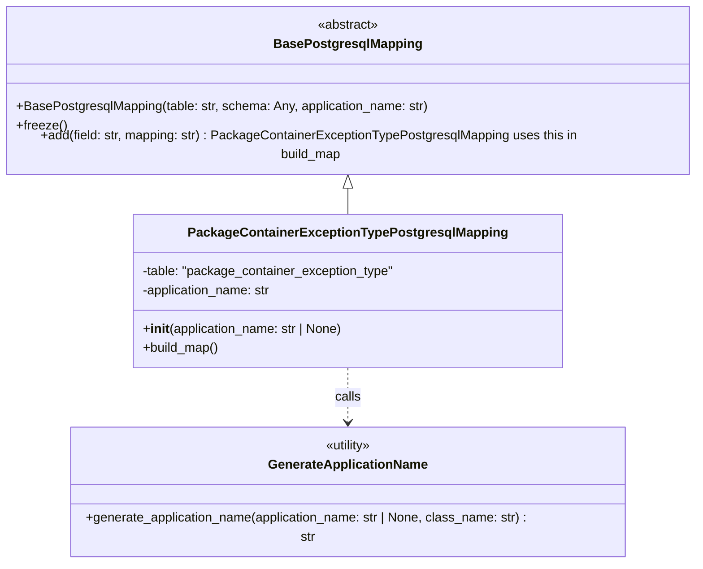

# Diagram: partview_core/partview_service/partview_service/persistence/sql/postgresql/PackageContainerExceptionTypePostgresqlMapping.py

> Auto-generated by Obscura crawlers

## Mermaid

### SVG

<svg id="container" width="883.46875" xmlns="http://www.w3.org/2000/svg" class="classDiagram" height="680" viewBox="0 0 883.46875 680" role="graphics-document document" aria-roledescription="class"><g><defs><marker id="container_class-aggregationStart" class="marker aggregation class" refX="18" refY="7" markerWidth="190" markerHeight="240" orient="auto"><path d="M 18,7 L9,13 L1,7 L9,1 Z"></path></marker></defs><defs><marker id="container_class-aggregationEnd" class="marker aggregation class" refX="1" refY="7" markerWidth="20" markerHeight="28" orient="auto"><path d="M 18,7 L9,13 L1,7 L9,1 Z"></path></marker></defs><defs><marker id="container_class-extensionStart" class="marker extension class" refX="18" refY="7" markerWidth="190" markerHeight="240" orient="auto"><path d="M 1,7 L18,13 V 1 Z"></path></marker></defs><defs><marker id="container_class-extensionEnd" class="marker extension class" refX="1" refY="7" markerWidth="20" markerHeight="28" orient="auto"><path d="M 1,1 V 13 L18,7 Z"></path></marker></defs><defs><marker id="container_class-compositionStart" class="marker composition class" refX="18" refY="7" markerWidth="190" markerHeight="240" orient="auto"><path d="M 18,7 L9,13 L1,7 L9,1 Z"></path></marker></defs><defs><marker id="container_class-compositionEnd" class="marker composition class" refX="1" refY="7" markerWidth="20" markerHeight="28" orient="auto"><path d="M 18,7 L9,13 L1,7 L9,1 Z"></path></marker></defs><defs><marker id="container_class-dependencyStart" class="marker dependency class" refX="6" refY="7" markerWidth="190" markerHeight="240" orient="auto"><path d="M 5,7 L9,13 L1,7 L9,1 Z"></path></marker></defs><defs><marker id="container_class-dependencyEnd" class="marker dependency class" refX="13" refY="7" markerWidth="20" markerHeight="28" orient="auto"><path d="M 18,7 L9,13 L14,7 L9,1 Z"></path></marker></defs><defs><marker id="container_class-lollipopStart" class="marker lollipop class" refX="13" refY="7" markerWidth="190" markerHeight="240" orient="auto"><circle stroke="black" fill="transparent" cx="7" cy="7" r="6"></circle></marker></defs><defs><marker id="container_class-lollipopEnd" class="marker lollipop class" refX="1" refY="7" markerWidth="190" markerHeight="240" orient="auto"><circle stroke="black" fill="transparent" cx="7" cy="7" r="6"></circle></marker></defs><g class="root"><g class="clusters"></g><g class="edgePaths"><path d="M441.734,223.25L441.734,224.542C441.734,225.833,441.734,228.417,441.734,233.875C441.734,239.333,441.734,247.667,441.734,251.833L441.734,256" id="id_BasePostgresqlMapping_PackageContainerExceptionTypePostgresqlMapping_1" class="edge-thickness-normal edge-pattern-solid relation" style=";;;" data-edge="true" data-et="edge" data-id="id_BasePostgresqlMapping_PackageContainerExceptionTypePostgresqlMapping_1" data-points="W3sieCI6NDQxLjczNDM3NSwieSI6MjA2fSx7IngiOjQ0MS43MzQzNzUsInkiOjIzMX0seyJ4Ijo0NDEuNzM0Mzc1LCJ5IjoyNTZ9XQ==" marker-start="url(#container_class-extensionStart)"></path><path d="M441.734,448L441.734,454.167C441.734,460.333,441.734,472.667,441.734,484C441.734,495.333,441.734,505.667,441.734,510.833L441.734,516" id="id_PackageContainerExceptionTypePostgresqlMapping_GenerateApplicationName_2" class="edge-thickness-normal edge-pattern-dashed relation" style=";;;" data-edge="true" data-et="edge" data-id="id_PackageContainerExceptionTypePostgresqlMapping_GenerateApplicationName_2" data-points="W3sieCI6NDQxLjczNDM3NSwieSI6NDQ4fSx7IngiOjQ0MS43MzQzNzUsInkiOjQ4NX0seyJ4Ijo0NDEuNzM0Mzc1LCJ5Ijo1MjJ9XQ==" marker-end="url(#container_class-dependencyEnd)"></path></g><g class="edgeLabels"><g class="edgeLabel"><g class="label" data-id="id_BasePostgresqlMapping_PackageContainerExceptionTypePostgresqlMapping_1" transform="translate(0, 0)"><foreignObject width="0" height="0">

</foreignObject></g></g><g class="edgeLabel" transform="translate(441.734375, 485)"><g class="label" data-id="id_PackageContainerExceptionTypePostgresqlMapping_GenerateApplicationName_2" transform="translate(-16.4453125, -12)"><foreignObject width="32.890625" height="24">

calls

</foreignObject></g></g></g><g class="nodes"><g class="node default" id="classId-BasePostgresqlMapping-0" transform="translate(441.734375, 107)"><g class="basic label-container"><path d="M-433.734375 -99 L433.734375 -99 L433.734375 99 L-433.734375 99" stroke="none" stroke-width="0" fill="#ECECFF" style=""></path><path d="M-433.734375 -99 C-201.6744748421347 -99, 30.385425315730572 -99, 433.734375 -99 M-433.734375 -99 C-160.51144754419062 -99, 112.71147991161877 -99, 433.734375 -99 M433.734375 -99 C433.734375 -24.723141595180962, 433.734375 49.553716809638075, 433.734375 99 M433.734375 -99 C433.734375 -38.34160132765588, 433.734375 22.31679734468824, 433.734375 99 M433.734375 99 C149.92233039459126 99, -133.8897142108175 99, -433.734375 99 M433.734375 99 C214.78259546465486 99, -4.169184070690278 99, -433.734375 99 M-433.734375 99 C-433.734375 33.10671670654598, -433.734375 -32.78656658690804, -433.734375 -99 M-433.734375 99 C-433.734375 41.13158303689475, -433.734375 -16.736833926210494, -433.734375 -99" stroke="#9370DB" stroke-width="1.3" fill="none" stroke-dasharray="0 0" style=""></path></g><g class="annotation-group text" transform="translate(-38.609375, -75)"><g class="label" style="" transform="translate(0,-12)"><foreignObject width="77.21875" height="24">

«abstract»

</foreignObject></g></g><g class="label-group text" transform="translate(-87.921875, -51)"><g class="label" style="font-weight: bolder" transform="translate(0,-12)"><foreignObject width="175.84375" height="24">

BasePostgresqlMapping

</foreignObject></g></g><g class="members-group text" transform="translate(-421.734375, -3)"></g><g class="methods-group text" transform="translate(-421.734375, 27)"><g class="label" style="" transform="translate(0,-12)"><foreignObject width="518.234375" height="24">

+BasePostgresqlMapping(table: str, schema: Any, application_name: str)

</foreignObject></g><g class="label" style="" transform="translate(0,12)"><foreignObject width="62.109375" height="24">

+freeze()

</foreignObject></g><g class="label" style="" transform="translate(0,36)"><foreignObject width="755.546875" height="24">

+add(field: str, mapping: str) : PackageContainerExceptionTypePostgresqlMapping uses this in build_map

</foreignObject></g></g><g class="divider" style=""><path d="M-433.734375 -27 C-167.82519089287985 -27, 98.08399321424031 -27, 433.734375 -27 M-433.734375 -27 C-100.99846074600947 -27, 231.73745350798106 -27, 433.734375 -27" stroke="#9370DB" stroke-width="1.3" fill="none" stroke-dasharray="0 0" style=""></path></g><g class="divider" style=""><path d="M-433.734375 -3 C-124.15467778984515 -3, 185.4250194203097 -3, 433.734375 -3 M-433.734375 -3 C-196.8985590719753 -3, 39.93725685604937 -3, 433.734375 -3" stroke="#9370DB" stroke-width="1.3" fill="none" stroke-dasharray="0 0" style=""></path></g></g><g class="node default" id="classId-PackageContainerExceptionTypePostgresqlMapping-1" transform="translate(441.734375, 352)"><g class="basic label-container"><path d="M-265.13671875 -96 L265.13671875 -96 L265.13671875 96 L-265.13671875 96" stroke="none" stroke-width="0" fill="#ECECFF" style=""></path><path d="M-265.13671875 -96 C-57.29859773963241 -96, 150.53952327073517 -96, 265.13671875 -96 M-265.13671875 -96 C-135.51935576914414 -96, -5.9019927882882826 -96, 265.13671875 -96 M265.13671875 -96 C265.13671875 -42.93376111646596, 265.13671875 10.132477767068082, 265.13671875 96 M265.13671875 -96 C265.13671875 -54.75329972348308, 265.13671875 -13.506599446966163, 265.13671875 96 M265.13671875 96 C81.67308306244607 96, -101.79055262510786 96, -265.13671875 96 M265.13671875 96 C155.76910399005607 96, 46.401489230112134 96, -265.13671875 96 M-265.13671875 96 C-265.13671875 45.071071874782255, -265.13671875 -5.857856250435489, -265.13671875 -96 M-265.13671875 96 C-265.13671875 47.558574626278784, -265.13671875 -0.8828507474424327, -265.13671875 -96" stroke="#9370DB" stroke-width="1.3" fill="none" stroke-dasharray="0 0" style=""></path></g><g class="annotation-group text" transform="translate(0, -72)"></g><g class="label-group text" transform="translate(-188.8828125, -72)"><g class="label" style="font-weight: bolder" transform="translate(0,-12)"><foreignObject width="377.765625" height="24">

PackageContainerExceptionTypePostgresqlMapping

</foreignObject></g></g><g class="members-group text" transform="translate(-253.13671875, -24)"><g class="label" style="" transform="translate(0,-12)"><foreignObject width="317.390625" height="24">

-table: "package_container_exception_type"

</foreignObject></g><g class="label" style="" transform="translate(0,12)"><foreignObject width="164.671875" height="24">

-application_name: str

</foreignObject></g></g><g class="methods-group text" transform="translate(-253.13671875, 48)"><g class="label" style="" transform="translate(0,-12)"><foreignObject width="254.546875" height="24">

+<strong>init</strong>(application_name: str | None)

</foreignObject></g><g class="label" style="" transform="translate(0,12)"><foreignObject width="96.109375" height="24">

+build_map()

</foreignObject></g></g><g class="divider" style=""><path d="M-265.13671875 -48 C-150.25530064543182 -48, -35.37388254086363 -48, 265.13671875 -48 M-265.13671875 -48 C-129.00806475742144 -48, 7.1205892351571265 -48, 265.13671875 -48" stroke="#9370DB" stroke-width="1.3" fill="none" stroke-dasharray="0 0" style=""></path></g><g class="divider" style=""><path d="M-265.13671875 24 C-60.89501088372066 24, 143.34669698255868 24, 265.13671875 24 M-265.13671875 24 C-137.7631190124544 24, -10.389519274908821 24, 265.13671875 24" stroke="#9370DB" stroke-width="1.3" fill="none" stroke-dasharray="0 0" style=""></path></g></g><g class="node default" id="classId-GenerateApplicationName-2" transform="translate(441.734375, 597)"><g class="basic label-container"><path d="M-351.63671875 -75 L351.63671875 -75 L351.63671875 75 L-351.63671875 75" stroke="none" stroke-width="0" fill="#ECECFF" style=""></path><path d="M-351.63671875 -75 C-119.71939001083572 -75, 112.19793872832855 -75, 351.63671875 -75 M-351.63671875 -75 C-109.5329705283784 -75, 132.5707776932432 -75, 351.63671875 -75 M351.63671875 -75 C351.63671875 -34.44079365444653, 351.63671875 6.11841269110694, 351.63671875 75 M351.63671875 -75 C351.63671875 -40.45869435504835, 351.63671875 -5.917388710096702, 351.63671875 75 M351.63671875 75 C201.6633555065611 75, 51.68999226312218 75, -351.63671875 75 M351.63671875 75 C121.07566529884508 75, -109.48538815230984 75, -351.63671875 75 M-351.63671875 75 C-351.63671875 33.03093020687222, -351.63671875 -8.93813958625556, -351.63671875 -75 M-351.63671875 75 C-351.63671875 24.7745871161205, -351.63671875 -25.450825767759, -351.63671875 -75" stroke="#9370DB" stroke-width="1.3" fill="none" stroke-dasharray="0 0" style=""></path></g><g class="annotation-group text" transform="translate(-30.3125, -51)"><g class="label" style="" transform="translate(0,-12)"><foreignObject width="60.625" height="24">

«utility»

</foreignObject></g></g><g class="label-group text" transform="translate(-95.8203125, -27)"><g class="label" style="font-weight: bolder" transform="translate(0,-12)"><foreignObject width="191.640625" height="24">

GenerateApplicationName

</foreignObject></g></g><g class="members-group text" transform="translate(-339.63671875, 21)"></g><g class="methods-group text" transform="translate(-339.63671875, 51)"><g class="label" style="" transform="translate(0,-12)"><foreignObject width="583.453125" height="24">

+generate_application_name(application_name: str | None, class_name: str) : str

</foreignObject></g></g><g class="divider" style=""><path d="M-351.63671875 -3 C-189.44414561958692 -3, -27.25157248917384 -3, 351.63671875 -3 M-351.63671875 -3 C-128.3828561931122 -3, 94.87100636377562 -3, 351.63671875 -3" stroke="#9370DB" stroke-width="1.3" fill="none" stroke-dasharray="0 0" style=""></path></g><g class="divider" style=""><path d="M-351.63671875 21 C-183.97886702466707 21, -16.321015299334135 21, 351.63671875 21 M-351.63671875 21 C-72.15835564706498 21, 207.32000745587004 21, 351.63671875 21" stroke="#9370DB" stroke-width="1.3" fill="none" stroke-dasharray="0 0" style=""></path></g></g></g></g></g></svg>
