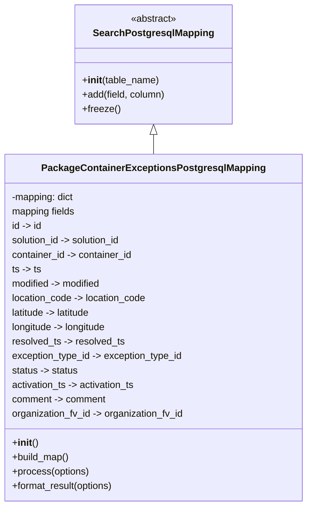

# Diagram: partview_core/partview_service/partview_service/persistence/sql/postgresql/PackageContainerExceptionsPostgresqlMapping.py

> Auto-generated by Obscura crawlers

## Mermaid

### SVG

<svg id="container" width="505.3515625" xmlns="http://www.w3.org/2000/svg" class="classDiagram" height="840" viewBox="0 0 505.3515625 840" role="graphics-document document" aria-roledescription="class"><g><defs><marker id="container_class-aggregationStart" class="marker aggregation class" refX="18" refY="7" markerWidth="190" markerHeight="240" orient="auto"><path d="M 18,7 L9,13 L1,7 L9,1 Z"></path></marker></defs><defs><marker id="container_class-aggregationEnd" class="marker aggregation class" refX="1" refY="7" markerWidth="20" markerHeight="28" orient="auto"><path d="M 18,7 L9,13 L1,7 L9,1 Z"></path></marker></defs><defs><marker id="container_class-extensionStart" class="marker extension class" refX="18" refY="7" markerWidth="190" markerHeight="240" orient="auto"><path d="M 1,7 L18,13 V 1 Z"></path></marker></defs><defs><marker id="container_class-extensionEnd" class="marker extension class" refX="1" refY="7" markerWidth="20" markerHeight="28" orient="auto"><path d="M 1,1 V 13 L18,7 Z"></path></marker></defs><defs><marker id="container_class-compositionStart" class="marker composition class" refX="18" refY="7" markerWidth="190" markerHeight="240" orient="auto"><path d="M 18,7 L9,13 L1,7 L9,1 Z"></path></marker></defs><defs><marker id="container_class-compositionEnd" class="marker composition class" refX="1" refY="7" markerWidth="20" markerHeight="28" orient="auto"><path d="M 18,7 L9,13 L1,7 L9,1 Z"></path></marker></defs><defs><marker id="container_class-dependencyStart" class="marker dependency class" refX="6" refY="7" markerWidth="190" markerHeight="240" orient="auto"><path d="M 5,7 L9,13 L1,7 L9,1 Z"></path></marker></defs><defs><marker id="container_class-dependencyEnd" class="marker dependency class" refX="13" refY="7" markerWidth="20" markerHeight="28" orient="auto"><path d="M 18,7 L9,13 L14,7 L9,1 Z"></path></marker></defs><defs><marker id="container_class-lollipopStart" class="marker lollipop class" refX="13" refY="7" markerWidth="190" markerHeight="240" orient="auto"><circle stroke="black" fill="transparent" cx="7" cy="7" r="6"></circle></marker></defs><defs><marker id="container_class-lollipopEnd" class="marker lollipop class" refX="1" refY="7" markerWidth="190" markerHeight="240" orient="auto"><circle stroke="black" fill="transparent" cx="7" cy="7" r="6"></circle></marker></defs><g class="root"><g class="clusters"></g><g class="edgePaths"><path d="M252.676,223.25L252.676,224.542C252.676,225.833,252.676,228.417,252.676,233.875C252.676,239.333,252.676,247.667,252.676,251.833L252.676,256" id="id_SearchPostgresqlMapping_PackageContainerExceptionsPostgresqlMapping_1" class="edge-thickness-normal edge-pattern-solid relation" style=";;;" data-edge="true" data-et="edge" data-id="id_SearchPostgresqlMapping_PackageContainerExceptionsPostgresqlMapping_1" data-points="W3sieCI6MjUyLjY3NTc4MTI1LCJ5IjoyMDZ9LHsieCI6MjUyLjY3NTc4MTI1LCJ5IjoyMzF9LHsieCI6MjUyLjY3NTc4MTI1LCJ5IjoyNTZ9XQ==" marker-start="url(#container_class-extensionStart)"></path></g><g class="edgeLabels"><g class="edgeLabel"><g class="label" data-id="id_SearchPostgresqlMapping_PackageContainerExceptionsPostgresqlMapping_1" transform="translate(0, 0)"><foreignObject width="0" height="0">

</foreignObject></g></g></g><g class="nodes"><g class="node default" id="classId-SearchPostgresqlMapping-0" transform="translate(252.67578125, 107)"><g class="basic label-container"><path d="M-129.50390625 -99 L129.50390625 -99 L129.50390625 99 L-129.50390625 99" stroke="none" stroke-width="0" fill="#ECECFF" style=""></path><path d="M-129.50390625 -99 C-53.22441941511278 -99, 23.055067419774446 -99, 129.50390625 -99 M-129.50390625 -99 C-46.00889994858652 -99, 37.486106352826965 -99, 129.50390625 -99 M129.50390625 -99 C129.50390625 -34.294441923176095, 129.50390625 30.41111615364781, 129.50390625 99 M129.50390625 -99 C129.50390625 -36.06087719497751, 129.50390625 26.878245610044985, 129.50390625 99 M129.50390625 99 C59.475817361230725 99, -10.55227152753855 99, -129.50390625 99 M129.50390625 99 C49.468162528142315 99, -30.56758119371537 99, -129.50390625 99 M-129.50390625 99 C-129.50390625 49.797592670162174, -129.50390625 0.595185340324349, -129.50390625 -99 M-129.50390625 99 C-129.50390625 55.3659809277091, -129.50390625 11.731961855418206, -129.50390625 -99" stroke="#9370DB" stroke-width="1.3" fill="none" stroke-dasharray="0 0" style=""></path></g><g class="annotation-group text" transform="translate(-38.609375, -75)"><g class="label" style="" transform="translate(0,-12)"><foreignObject width="77.21875" height="24">

«abstract»

</foreignObject></g></g><g class="label-group text" transform="translate(-95.1171875, -51)"><g class="label" style="font-weight: bolder" transform="translate(0,-12)"><foreignObject width="190.234375" height="24">

SearchPostgresqlMapping

</foreignObject></g></g><g class="members-group text" transform="translate(-117.50390625, -3)"></g><g class="methods-group text" transform="translate(-117.50390625, 27)"><g class="label" style="" transform="translate(0,-12)"><foreignObject width="128.515625" height="24">

+<strong>init</strong>(table_name)

</foreignObject></g><g class="label" style="" transform="translate(0,12)"><foreignObject width="139.890625" height="24">

+add(field, column)

</foreignObject></g><g class="label" style="" transform="translate(0,36)"><foreignObject width="62.109375" height="24">

+freeze()

</foreignObject></g></g><g class="divider" style=""><path d="M-129.50390625 -27 C-70.83124011992368 -27, -12.158573989847355 -27, 129.50390625 -27 M-129.50390625 -27 C-76.65611253888855 -27, -23.8083188277771 -27, 129.50390625 -27" stroke="#9370DB" stroke-width="1.3" fill="none" stroke-dasharray="0 0" style=""></path></g><g class="divider" style=""><path d="M-129.50390625 -3 C-49.49935040633876 -3, 30.505205437322473 -3, 129.50390625 -3 M-129.50390625 -3 C-62.22284282552636 -3, 5.058220598947287 -3, 129.50390625 -3" stroke="#9370DB" stroke-width="1.3" fill="none" stroke-dasharray="0 0" style=""></path></g></g><g class="node default" id="classId-PackageContainerExceptionsPostgresqlMapping-1" transform="translate(252.67578125, 544)"><g class="basic label-container"><path d="M-244.67578125 -288 L244.67578125 -288 L244.67578125 288 L-244.67578125 288" stroke="none" stroke-width="0" fill="#ECECFF" style=""></path><path d="M-244.67578125 -288 C-88.03097465996564 -288, 68.61383193006873 -288, 244.67578125 -288 M-244.67578125 -288 C-126.26970418979857 -288, -7.863627129597148 -288, 244.67578125 -288 M244.67578125 -288 C244.67578125 -106.30418857386297, 244.67578125 75.39162285227405, 244.67578125 288 M244.67578125 -288 C244.67578125 -87.68346353407466, 244.67578125 112.63307293185068, 244.67578125 288 M244.67578125 288 C72.15733702875522 288, -100.36110719248956 288, -244.67578125 288 M244.67578125 288 C143.12312549801212 288, 41.57046974602423 288, -244.67578125 288 M-244.67578125 288 C-244.67578125 126.88041140983785, -244.67578125 -34.239177180324305, -244.67578125 -288 M-244.67578125 288 C-244.67578125 129.84342656822915, -244.67578125 -28.313146863541704, -244.67578125 -288" stroke="#9370DB" stroke-width="1.3" fill="none" stroke-dasharray="0 0" style=""></path></g><g class="annotation-group text" transform="translate(0, -264)"></g><g class="label-group text" transform="translate(-175.4140625, -264)"><g class="label" style="font-weight: bolder" transform="translate(0,-12)"><foreignObject width="350.828125" height="24">

PackageContainerExceptionsPostgresqlMapping

</foreignObject></g></g><g class="members-group text" transform="translate(-232.67578125, -216)"><g class="label" style="" transform="translate(0,-12)"><foreignObject width="105.671875" height="24">

-mapping: dict

</foreignObject></g><g class="label" style="" transform="translate(0,12)"><foreignObject width="107.453125" height="24">

mapping fields

</foreignObject></g><g class="label" style="" transform="translate(0,36)"><foreignObject width="51.09375" height="24">

id -&gt; id

</foreignObject></g><g class="label" style="" transform="translate(0,60)"><foreignObject width="187.390625" height="24">

solution_id -&gt; solution_id

</foreignObject></g><g class="label" style="" transform="translate(0,84)"><foreignObject width="203.578125" height="24">

container_id -&gt; container_id

</foreignObject></g><g class="label" style="" transform="translate(0,108)"><foreignObject width="49.4375" height="24">

ts -&gt; ts

</foreignObject></g><g class="label" style="" transform="translate(0,132)"><foreignObject width="152.1875" height="24">

modified -&gt; modified

</foreignObject></g><g class="label" style="" transform="translate(0,156)"><foreignObject width="227.15625" height="24">

location_code -&gt; location_code

</foreignObject></g><g class="label" style="" transform="translate(0,180)"><foreignObject width="136.890625" height="24">

latitude -&gt; latitude

</foreignObject></g><g class="label" style="" transform="translate(0,204)"><foreignObject width="162.015625" height="24">

longitude -&gt; longitude

</foreignObject></g><g class="label" style="" transform="translate(0,228)"><foreignObject width="189.140625" height="24">

resolved_ts -&gt; resolved_ts

</foreignObject></g><g class="label" style="" transform="translate(0,252)"><foreignObject width="288.1875" height="24">

exception_type_id -&gt; exception_type_id

</foreignObject></g><g class="label" style="" transform="translate(0,276)"><foreignObject width="111.734375" height="24">

status -&gt; status

</foreignObject></g><g class="label" style="" transform="translate(0,300)"><foreignObject width="209.375" height="24">

activation_ts -&gt; activation_ts

</foreignObject></g><g class="label" style="" transform="translate(0,324)"><foreignObject width="158.875" height="24">

comment -&gt; comment

</foreignObject></g><g class="label" style="" transform="translate(0,348)"><foreignObject width="289.9375" height="24">

organization_fv_id -&gt; organization_fv_id

</foreignObject></g></g><g class="methods-group text" transform="translate(-232.67578125, 192)"><g class="label" style="" transform="translate(0,-12)"><foreignObject width="42.796875" height="24">

+<strong>init</strong>()

</foreignObject></g><g class="label" style="" transform="translate(0,12)"><foreignObject width="96.109375" height="24">

+build_map()

</foreignObject></g><g class="label" style="" transform="translate(0,36)"><foreignObject width="129.0625" height="24">

+process(options)

</foreignObject></g><g class="label" style="" transform="translate(0,60)"><foreignObject width="172.34375" height="24">

+format_result(options)

</foreignObject></g></g><g class="divider" style=""><path d="M-244.67578125 -240 C-101.03820693829863 -240, 42.59936737340274 -240, 244.67578125 -240 M-244.67578125 -240 C-71.7686110045272 -240, 101.1385592409456 -240, 244.67578125 -240" stroke="#9370DB" stroke-width="1.3" fill="none" stroke-dasharray="0 0" style=""></path></g><g class="divider" style=""><path d="M-244.67578125 168 C-86.83715854513196 168, 71.00146415973609 168, 244.67578125 168 M-244.67578125 168 C-122.80362645265426 168, -0.9314716553085134 168, 244.67578125 168" stroke="#9370DB" stroke-width="1.3" fill="none" stroke-dasharray="0 0" style=""></path></g></g></g></g></g></svg>
