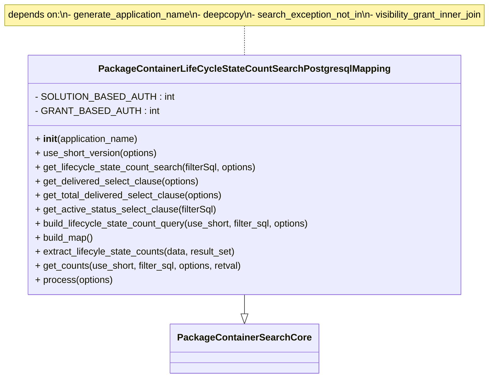

# Diagram: partview_core/partview_service/partview_service/persistence/sql/postgresql/PackageContainerLifeCycleStateCountSearchPostgresqlMapping.py

> Auto-generated by Obscura crawlers

## Mermaid

### SVG

<svg id="container" width="871.34375" xmlns="http://www.w3.org/2000/svg" class="classDiagram" height="644" viewBox="0 0 871.34375 644" role="graphics-document document" aria-roledescription="class"><g><defs><marker id="container_class-aggregationStart" class="marker aggregation class" refX="18" refY="7" markerWidth="190" markerHeight="240" orient="auto"><path d="M 18,7 L9,13 L1,7 L9,1 Z"></path></marker></defs><defs><marker id="container_class-aggregationEnd" class="marker aggregation class" refX="1" refY="7" markerWidth="20" markerHeight="28" orient="auto"><path d="M 18,7 L9,13 L1,7 L9,1 Z"></path></marker></defs><defs><marker id="container_class-extensionStart" class="marker extension class" refX="18" refY="7" markerWidth="190" markerHeight="240" orient="auto"><path d="M 1,7 L18,13 V 1 Z"></path></marker></defs><defs><marker id="container_class-extensionEnd" class="marker extension class" refX="1" refY="7" markerWidth="20" markerHeight="28" orient="auto"><path d="M 1,1 V 13 L18,7 Z"></path></marker></defs><defs><marker id="container_class-compositionStart" class="marker composition class" refX="18" refY="7" markerWidth="190" markerHeight="240" orient="auto"><path d="M 18,7 L9,13 L1,7 L9,1 Z"></path></marker></defs><defs><marker id="container_class-compositionEnd" class="marker composition class" refX="1" refY="7" markerWidth="20" markerHeight="28" orient="auto"><path d="M 18,7 L9,13 L1,7 L9,1 Z"></path></marker></defs><defs><marker id="container_class-dependencyStart" class="marker dependency class" refX="6" refY="7" markerWidth="190" markerHeight="240" orient="auto"><path d="M 5,7 L9,13 L1,7 L9,1 Z"></path></marker></defs><defs><marker id="container_class-dependencyEnd" class="marker dependency class" refX="13" refY="7" markerWidth="20" markerHeight="28" orient="auto"><path d="M 18,7 L9,13 L14,7 L9,1 Z"></path></marker></defs><defs><marker id="container_class-lollipopStart" class="marker lollipop class" refX="13" refY="7" markerWidth="190" markerHeight="240" orient="auto"><circle stroke="black" fill="transparent" cx="7" cy="7" r="6"></circle></marker></defs><defs><marker id="container_class-lollipopEnd" class="marker lollipop class" refX="1" refY="7" markerWidth="190" markerHeight="240" orient="auto"><circle stroke="black" fill="transparent" cx="7" cy="7" r="6"></circle></marker></defs><g class="root"><g class="clusters"></g><g class="edgePaths"><path d="M435.672,44L435.672,48.167C435.672,52.333,435.672,60.667,435.672,69C435.672,77.333,435.672,85.667,435.672,89.833L435.672,94" id="edgeNote1" class="edge-thickness-normal edge-pattern-dotted relation" style="fill: none;;;fill: none" data-edge="true" data-et="edge" data-id="edgeNote1" data-points="W3sieCI6NDM1LjY3MTg3NSwieSI6NDR9LHsieCI6NDM1LjY3MTg3NSwieSI6Njl9LHsieCI6NDM1LjY3MTg3NSwieSI6OTR9XQ=="></path><path d="M435.672,502L435.672,506.167C435.672,510.333,435.672,518.667,435.672,524.125C435.672,529.583,435.672,532.167,435.672,533.458L435.672,534.75" id="id_PackageContainerLifeCycleStateCountSearchPostgresqlMapping_PackageContainerSearchCore_1" class="edge-thickness-normal edge-pattern-solid relation" style=";;;" data-edge="true" data-et="edge" data-id="id_PackageContainerLifeCycleStateCountSearchPostgresqlMapping_PackageContainerSearchCore_1" data-points="W3sieCI6NDM1LjY3MTg3NSwieSI6NTAyfSx7IngiOjQzNS42NzE4NzUsInkiOjUyN30seyJ4Ijo0MzUuNjcxODc1LCJ5Ijo1NTJ9XQ==" marker-end="url(#container_class-extensionEnd)"></path></g><g class="edgeLabels"><g class="edgeLabel"><g class="label" data-id="edgeNote1" transform="translate(0, 0)"><foreignObject width="0" height="0">

</foreignObject></g></g><g class="edgeLabel"><g class="label" data-id="id_PackageContainerLifeCycleStateCountSearchPostgresqlMapping_PackageContainerSearchCore_1" transform="translate(0, 0)"><foreignObject width="0" height="0">

</foreignObject></g></g></g><g class="nodes"><g class="node default" id="classId-PackageContainerSearchCore-0" transform="translate(435.671875, 594)"><g class="basic label-container"><path d="M-118.65625 -42 L118.65625 -42 L118.65625 42 L-118.65625 42" stroke="none" stroke-width="0" fill="#ECECFF" style=""></path><path d="M-118.65625 -42 C-54.779322755931176 -42, 9.097604488137648 -42, 118.65625 -42 M-118.65625 -42 C-55.292747327212375 -42, 8.07075534557525 -42, 118.65625 -42 M118.65625 -42 C118.65625 -22.496272200780652, 118.65625 -2.992544401561304, 118.65625 42 M118.65625 -42 C118.65625 -20.684894450151013, 118.65625 0.6302110996979735, 118.65625 42 M118.65625 42 C59.18771851047635 42, -0.2808129790472975 42, -118.65625 42 M118.65625 42 C52.781736616335806 42, -13.092776767328388 42, -118.65625 42 M-118.65625 42 C-118.65625 12.844175429027587, -118.65625 -16.311649141944827, -118.65625 -42 M-118.65625 42 C-118.65625 20.690535561845902, -118.65625 -0.6189288763081962, -118.65625 -42" stroke="#9370DB" stroke-width="1.3" fill="none" stroke-dasharray="0 0" style=""></path></g><g class="annotation-group text" transform="translate(0, -18)"></g><g class="label-group text" transform="translate(-106.65625, -18)"><g class="label" style="font-weight: bolder" transform="translate(0,-12)"><foreignObject width="213.3125" height="24">

PackageContainerSearchCore

</foreignObject></g></g><g class="members-group text" transform="translate(-106.65625, 30)"></g><g class="methods-group text" transform="translate(-106.65625, 60)"></g><g class="divider" style=""><path d="M-118.65625 6 C-28.561267007125636 6, 61.53371598574873 6, 118.65625 6 M-118.65625 6 C-45.15814668978035 6, 28.339956620439295 6, 118.65625 6" stroke="#9370DB" stroke-width="1.3" fill="none" stroke-dasharray="0 0" style=""></path></g><g class="divider" style=""><path d="M-118.65625 24 C-60.38732939211493 24, -2.1184087842298567 24, 118.65625 24 M-118.65625 24 C-31.150343389774633 24, 56.35556322045073 24, 118.65625 24" stroke="#9370DB" stroke-width="1.3" fill="none" stroke-dasharray="0 0" style=""></path></g></g><g class="node default" id="classId-PackageContainerLifeCycleStateCountSearchPostgresqlMapping-1" transform="translate(435.671875, 298)"><g class="basic label-container"><path d="M-367.20703125 -204 L367.20703125 -204 L367.20703125 204 L-367.20703125 204" stroke="none" stroke-width="0" fill="#ECECFF" style=""></path><path d="M-367.20703125 -204 C-121.01937940184314 -204, 125.16827244631372 -204, 367.20703125 -204 M-367.20703125 -204 C-152.63683929693562 -204, 61.93335265612876 -204, 367.20703125 -204 M367.20703125 -204 C367.20703125 -42.88104782618322, 367.20703125 118.23790434763356, 367.20703125 204 M367.20703125 -204 C367.20703125 -85.34016780073387, 367.20703125 33.31966439853227, 367.20703125 204 M367.20703125 204 C203.52180601482482 204, 39.83658077964964 204, -367.20703125 204 M367.20703125 204 C116.17189749145263 204, -134.86323626709475 204, -367.20703125 204 M-367.20703125 204 C-367.20703125 108.20859625627452, -367.20703125 12.417192512549036, -367.20703125 -204 M-367.20703125 204 C-367.20703125 43.91974179571537, -367.20703125 -116.16051640856926, -367.20703125 -204" stroke="#9370DB" stroke-width="1.3" fill="none" stroke-dasharray="0 0" style=""></path></g><g class="annotation-group text" transform="translate(0, -180)"></g><g class="label-group text" transform="translate(-233.6796875, -180)"><g class="label" style="font-weight: bolder" transform="translate(0,-12)"><foreignObject width="467.359375" height="24">

PackageContainerLifeCycleStateCountSearchPostgresqlMapping

</foreignObject></g></g><g class="members-group text" transform="translate(-355.20703125, -132)"><g class="label" style="" transform="translate(0,-12)"><foreignObject width="216.78125" height="24">

- SOLUTION_BASED_AUTH : int

</foreignObject></g><g class="label" style="" transform="translate(0,12)"><foreignObject width="191.171875" height="24">

- GRANT_BASED_AUTH : int

</foreignObject></g></g><g class="methods-group text" transform="translate(-355.20703125, -60)"><g class="label" style="" transform="translate(0,-12)"><foreignObject width="177.984375" height="24">

+ <strong>init</strong>(application_name)

</foreignObject></g><g class="label" style="" transform="translate(0,12)"><foreignObject width="210.578125" height="24">

+ use_short_version(options)

</foreignObject></g><g class="label" style="" transform="translate(0,36)"><foreignObject width="382.328125" height="24">

+ get_lifecycle_state_count_search(filterSql, options)

</foreignObject></g><g class="label" style="" transform="translate(0,60)"><foreignObject width="282.21875" height="24">

+ get_delivered_select_clause(options)

</foreignObject></g><g class="label" style="" transform="translate(0,84)"><foreignObject width="324" height="24">

+ get_total_delivered_select_clause(options)

</foreignObject></g><g class="label" style="" transform="translate(0,108)"><foreignObject width="311.4375" height="24">

+ get_active_status_select_clause(filterSql)

</foreignObject></g><g class="label" style="" transform="translate(0,132)"><foreignObject width="476.734375" height="24">

+ build_lifecycle_state_count_query(use_short, filter_sql, options)

</foreignObject></g><g class="label" style="" transform="translate(0,156)"><foreignObject width="100.34375" height="24">

+ build_map()

</foreignObject></g><g class="label" style="" transform="translate(0,180)"><foreignObject width="345.640625" height="24">

+ extract_lifecyle_state_counts(data, result_set)

</foreignObject></g><g class="label" style="" transform="translate(0,204)"><foreignObject width="357.15625" height="24">

+ get_counts(use_short, filter_sql, options, retval)

</foreignObject></g><g class="label" style="" transform="translate(0,228)"><foreignObject width="133.296875" height="24">

+ process(options)

</foreignObject></g></g><g class="divider" style=""><path d="M-367.20703125 -156 C-127.60492758951418 -156, 111.99717607097165 -156, 367.20703125 -156 M-367.20703125 -156 C-202.57382705777408 -156, -37.940622865548164 -156, 367.20703125 -156" stroke="#9370DB" stroke-width="1.3" fill="none" stroke-dasharray="0 0" style=""></path></g><g class="divider" style=""><path d="M-367.20703125 -84 C-194.88212800032107 -84, -22.55722475064215 -84, 367.20703125 -84 M-367.20703125 -84 C-186.11828961780344 -84, -5.029547985606882 -84, 367.20703125 -84" stroke="#9370DB" stroke-width="1.3" fill="none" stroke-dasharray="0 0" style=""></path></g></g><g class="node undefined" id="note0" transform="translate(435.671875, 26)"><g class="basic label-container"><path d="M-427.671875 -18 L427.671875 -18 L427.671875 18 L-427.671875 18" stroke="none" stroke-width="0" fill="#fff5ad" style="fill:#fff5ad !important;stroke:#aaaa33 !important"></path><path d="M-427.671875 -18 C-132.28006891923218 -18, 163.11173716153564 -18, 427.671875 -18 M-427.671875 -18 C-184.21468771899282 -18, 59.24249956201436 -18, 427.671875 -18 M427.671875 -18 C427.671875 -4.5488348217400585, 427.671875 8.902330356519883, 427.671875 18 M427.671875 -18 C427.671875 -9.944265119790177, 427.671875 -1.888530239580355, 427.671875 18 M427.671875 18 C115.42654832522834 18, -196.81877834954332 18, -427.671875 18 M427.671875 18 C204.78143550340346 18, -18.109003993193085 18, -427.671875 18 M-427.671875 18 C-427.671875 4.084046673231155, -427.671875 -9.83190665353769, -427.671875 -18 M-427.671875 18 C-427.671875 5.768279228563868, -427.671875 -6.463441542872264, -427.671875 -18" stroke="#aaaa33" stroke-width="1.3" fill="none" stroke-dasharray="0 0" style="fill:#fff5ad !important;stroke:#aaaa33 !important"></path></g><g class="label" style="text-align:left !important;white-space:nowrap !important" transform="translate(-421.671875, -12)"><rect></rect><foreignObject width="843.34375" height="24">

depends on:\n- generate_application_name\n- deepcopy\n- search_exception_not_in\n- visibility_grant_inner_join

</foreignObject></g></g></g></g></g></svg>
