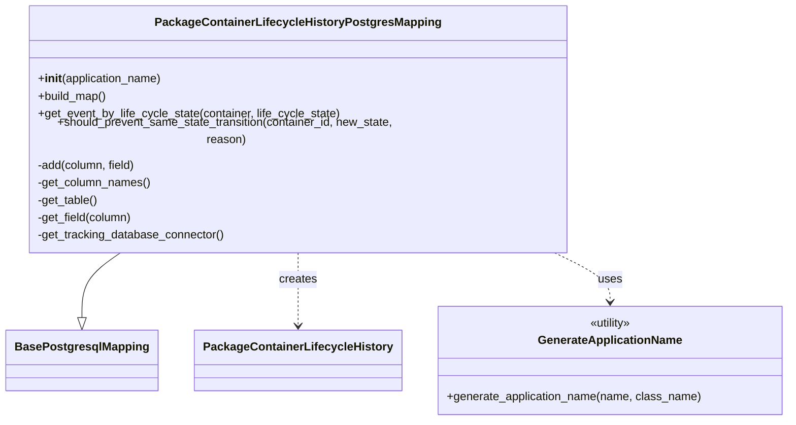
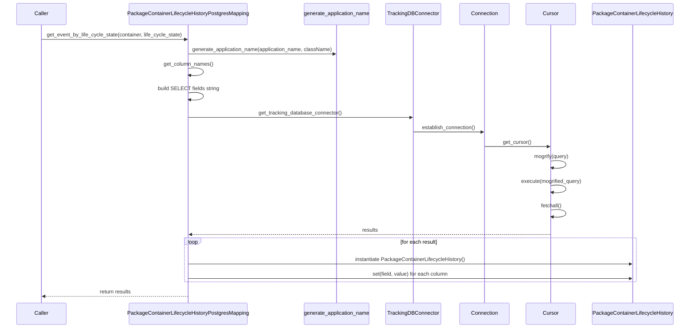
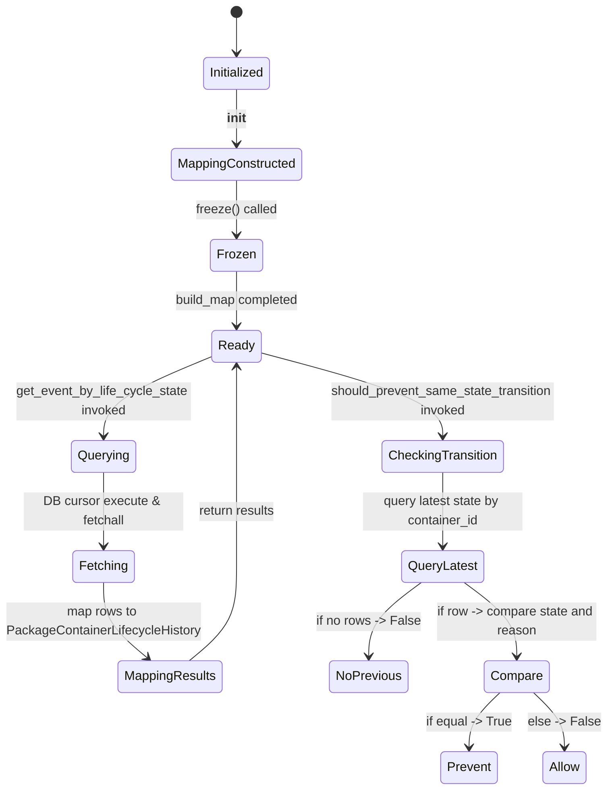

# Diagram: partview_core/partview_service/partview_service/persistence/sql/postgresql/PackageContainerLifecycleHistoryPostgresMapping.py

> Auto-generated by Obscura crawlers

## Diagram 1

> SVG rendering failed for this diagram.

## Diagram 2

### SVG

<svg id="container" width="2228.5" xmlns="http://www.w3.org/2000/svg" height="1048" viewBox="-50 -10 2228.5 1048" role="graphics-document document" aria-roledescription="sequence"><g><rect x="1865.5" y="962" fill="#eaeaea" stroke="#666" width="263" height="65" name="Model" rx="3" ry="3" class="actor actor-bottom"></rect><text x="1997" y="994.5" dominant-baseline="central" alignment-baseline="central" class="actor actor-box" style="text-anchor: middle; font-size: 16px; font-weight: 400;"><tspan x="1997" dy="0">PackageContainerLifecycleHistory</tspan></text></g><g><rect x="1665.5" y="962" fill="#eaeaea" stroke="#666" width="150" height="65" name="Cursor" rx="3" ry="3" class="actor actor-bottom"></rect><text x="1740.5" y="994.5" dominant-baseline="central" alignment-baseline="central" class="actor actor-box" style="text-anchor: middle; font-size: 16px; font-weight: 400;"><tspan x="1740.5" dy="0">Cursor</tspan></text></g><g><rect x="1465.5" y="962" fill="#eaeaea" stroke="#666" width="150" height="65" name="Connection" rx="3" ry="3" class="actor actor-bottom"></rect><text x="1540.5" y="994.5" dominant-baseline="central" alignment-baseline="central" class="actor actor-box" style="text-anchor: middle; font-size: 16px; font-weight: 400;"><tspan x="1540.5" dy="0">Connection</tspan></text></g><g><rect x="1218" y="962" fill="#eaeaea" stroke="#666" width="175" height="65" name="Connector" rx="3" ry="3" class="actor actor-bottom"></rect><text x="1305.5" y="994.5" dominant-baseline="central" alignment-baseline="central" class="actor actor-box" style="text-anchor: middle; font-size: 16px; font-weight: 400;"><tspan x="1305.5" dy="0">TrackingDBConnector</tspan></text></g><g><rect x="946" y="962" fill="#eaeaea" stroke="#666" width="222" height="65" name="Utility" rx="3" ry="3" class="actor actor-bottom"></rect><text x="1057" y="994.5" dominant-baseline="central" alignment-baseline="central" class="actor actor-box" style="text-anchor: middle; font-size: 16px; font-weight: 400;"><tspan x="1057" dy="0">generate_application_name</tspan></text></g><g><rect x="364" y="962" fill="#eaeaea" stroke="#666" width="388" height="65" name="Mapping" rx="3" ry="3" class="actor actor-bottom"></rect><text x="558" y="994.5" dominant-baseline="central" alignment-baseline="central" class="actor actor-box" style="text-anchor: middle; font-size: 16px; font-weight: 400;"><tspan x="558" dy="0">PackageContainerLifecycleHistoryPostgresMapping</tspan></text></g><g><rect x="0" y="962" fill="#eaeaea" stroke="#666" width="150" height="65" name="Caller" rx="3" ry="3" class="actor actor-bottom"></rect><text x="75" y="994.5" dominant-baseline="central" alignment-baseline="central" class="actor actor-box" style="text-anchor: middle; font-size: 16px; font-weight: 400;"><tspan x="75" dy="0">Caller</tspan></text></g><g><line id="actor6" x1="1997" y1="65" x2="1997" y2="962" class="actor-line 200" stroke-width="0.5px" stroke="#999" name="Model"></line><g id="root-6"><rect x="1865.5" y="0" fill="#eaeaea" stroke="#666" width="263" height="65" name="Model" rx="3" ry="3" class="actor actor-top"></rect><text x="1997" y="32.5" dominant-baseline="central" alignment-baseline="central" class="actor actor-box" style="text-anchor: middle; font-size: 16px; font-weight: 400;"><tspan x="1997" dy="0">PackageContainerLifecycleHistory</tspan></text></g></g><g><line id="actor5" x1="1740.5" y1="65" x2="1740.5" y2="962" class="actor-line 200" stroke-width="0.5px" stroke="#999" name="Cursor"></line><g id="root-5"><rect x="1665.5" y="0" fill="#eaeaea" stroke="#666" width="150" height="65" name="Cursor" rx="3" ry="3" class="actor actor-top"></rect><text x="1740.5" y="32.5" dominant-baseline="central" alignment-baseline="central" class="actor actor-box" style="text-anchor: middle; font-size: 16px; font-weight: 400;"><tspan x="1740.5" dy="0">Cursor</tspan></text></g></g><g><line id="actor4" x1="1540.5" y1="65" x2="1540.5" y2="962" class="actor-line 200" stroke-width="0.5px" stroke="#999" name="Connection"></line><g id="root-4"><rect x="1465.5" y="0" fill="#eaeaea" stroke="#666" width="150" height="65" name="Connection" rx="3" ry="3" class="actor actor-top"></rect><text x="1540.5" y="32.5" dominant-baseline="central" alignment-baseline="central" class="actor actor-box" style="text-anchor: middle; font-size: 16px; font-weight: 400;"><tspan x="1540.5" dy="0">Connection</tspan></text></g></g><g><line id="actor3" x1="1305.5" y1="65" x2="1305.5" y2="962" class="actor-line 200" stroke-width="0.5px" stroke="#999" name="Connector"></line><g id="root-3"><rect x="1218" y="0" fill="#eaeaea" stroke="#666" width="175" height="65" name="Connector" rx="3" ry="3" class="actor actor-top"></rect><text x="1305.5" y="32.5" dominant-baseline="central" alignment-baseline="central" class="actor actor-box" style="text-anchor: middle; font-size: 16px; font-weight: 400;"><tspan x="1305.5" dy="0">TrackingDBConnector</tspan></text></g></g><g><line id="actor2" x1="1057" y1="65" x2="1057" y2="962" class="actor-line 200" stroke-width="0.5px" stroke="#999" name="Utility"></line><g id="root-2"><rect x="946" y="0" fill="#eaeaea" stroke="#666" width="222" height="65" name="Utility" rx="3" ry="3" class="actor actor-top"></rect><text x="1057" y="32.5" dominant-baseline="central" alignment-baseline="central" class="actor actor-box" style="text-anchor: middle; font-size: 16px; font-weight: 400;"><tspan x="1057" dy="0">generate_application_name</tspan></text></g></g><g><line id="actor1" x1="558" y1="65" x2="558" y2="962" class="actor-line 200" stroke-width="0.5px" stroke="#999" name="Mapping"></line><g id="root-1"><rect x="364" y="0" fill="#eaeaea" stroke="#666" width="388" height="65" name="Mapping" rx="3" ry="3" class="actor actor-top"></rect><text x="558" y="32.5" dominant-baseline="central" alignment-baseline="central" class="actor actor-box" style="text-anchor: middle; font-size: 16px; font-weight: 400;"><tspan x="558" dy="0">PackageContainerLifecycleHistoryPostgresMapping</tspan></text></g></g><g><line id="actor0" x1="75" y1="65" x2="75" y2="962" class="actor-line 200" stroke-width="0.5px" stroke="#999" name="Caller"></line><g id="root-0"><rect x="0" y="0" fill="#eaeaea" stroke="#666" width="150" height="65" name="Caller" rx="3" ry="3" class="actor actor-top"></rect><text x="75" y="32.5" dominant-baseline="central" alignment-baseline="central" class="actor actor-box" style="text-anchor: middle; font-size: 16px; font-weight: 400;"><tspan x="75" dy="0">Caller</tspan></text></g></g><g></g><defs><symbol id="computer" width="24" height="24"><path transform="scale(.5)" d="M2 2v13h20v-13h-20zm18 11h-16v-9h16v9zm-10.228 6l.466-1h3.524l.467 1h-4.457zm14.228 3h-24l2-6h2.104l-1.33 4h18.45l-1.297-4h2.073l2 6zm-5-10h-14v-7h14v7z"></path></symbol></defs><defs><symbol id="database" fill-rule="evenodd" clip-rule="evenodd"><path transform="scale(.5)" d="M12.258.001l.256.004.255.005.253.008.251.01.249.012.247.015.246.016.242.019.241.02.239.023.236.024.233.027.231.028.229.031.225.032.223.034.22.036.217.038.214.04.211.041.208.043.205.045.201.046.198.048.194.05.191.051.187.053.183.054.18.056.175.057.172.059.168.06.163.061.16.063.155.064.15.066.074.033.073.033.071.034.07.034.069.035.068.035.067.035.066.035.064.036.064.036.062.036.06.036.06.037.058.037.058.037.055.038.055.038.053.038.052.038.051.039.05.039.048.039.047.039.045.04.044.04.043.04.041.04.04.041.039.041.037.041.036.041.034.041.033.042.032.042.03.042.029.042.027.042.026.043.024.043.023.043.021.043.02.043.018.044.017.043.015.044.013.044.012.044.011.045.009.044.007.045.006.045.004.045.002.045.001.045v17l-.001.045-.002.045-.004.045-.006.045-.007.045-.009.044-.011.045-.012.044-.013.044-.015.044-.017.043-.018.044-.02.043-.021.043-.023.043-.024.043-.026.043-.027.042-.029.042-.03.042-.032.042-.033.042-.034.041-.036.041-.037.041-.039.041-.04.041-.041.04-.043.04-.044.04-.045.04-.047.039-.048.039-.05.039-.051.039-.052.038-.053.038-.055.038-.055.038-.058.037-.058.037-.06.037-.06.036-.062.036-.064.036-.064.036-.066.035-.067.035-.068.035-.069.035-.07.034-.071.034-.073.033-.074.033-.15.066-.155.064-.16.063-.163.061-.168.06-.172.059-.175.057-.18.056-.183.054-.187.053-.191.051-.194.05-.198.048-.201.046-.205.045-.208.043-.211.041-.214.04-.217.038-.22.036-.223.034-.225.032-.229.031-.231.028-.233.027-.236.024-.239.023-.241.02-.242.019-.246.016-.247.015-.249.012-.251.01-.253.008-.255.005-.256.004-.258.001-.258-.001-.256-.004-.255-.005-.253-.008-.251-.01-.249-.012-.247-.015-.245-.016-.243-.019-.241-.02-.238-.023-.236-.024-.234-.027-.231-.028-.228-.031-.226-.032-.223-.034-.22-.036-.217-.038-.214-.04-.211-.041-.208-.043-.204-.045-.201-.046-.198-.048-.195-.05-.19-.051-.187-.053-.184-.054-.179-.056-.176-.057-.172-.059-.167-.06-.164-.061-.159-.063-.155-.064-.151-.066-.074-.033-.072-.033-.072-.034-.07-.034-.069-.035-.068-.035-.067-.035-.066-.035-.064-.036-.063-.036-.062-.036-.061-.036-.06-.037-.058-.037-.057-.037-.056-.038-.055-.038-.053-.038-.052-.038-.051-.039-.049-.039-.049-.039-.046-.039-.046-.04-.044-.04-.043-.04-.041-.04-.04-.041-.039-.041-.037-.041-.036-.041-.034-.041-.033-.042-.032-.042-.03-.042-.029-.042-.027-.042-.026-.043-.024-.043-.023-.043-.021-.043-.02-.043-.018-.044-.017-.043-.015-.044-.013-.044-.012-.044-.011-.045-.009-.044-.007-.045-.006-.045-.004-.045-.002-.045-.001-.045v-17l.001-.045.002-.045.004-.045.006-.045.007-.045.009-.044.011-.045.012-.044.013-.044.015-.044.017-.043.018-.044.02-.043.021-.043.023-.043.024-.043.026-.043.027-.042.029-.042.03-.042.032-.042.033-.042.034-.041.036-.041.037-.041.039-.041.04-.041.041-.04.043-.04.044-.04.046-.04.046-.039.049-.039.049-.039.051-.039.052-.038.053-.038.055-.038.056-.038.057-.037.058-.037.06-.037.061-.036.062-.036.063-.036.064-.036.066-.035.067-.035.068-.035.069-.035.07-.034.072-.034.072-.033.074-.033.151-.066.155-.064.159-.063.164-.061.167-.06.172-.059.176-.057.179-.056.184-.054.187-.053.19-.051.195-.05.198-.048.201-.046.204-.045.208-.043.211-.041.214-.04.217-.038.22-.036.223-.034.226-.032.228-.031.231-.028.234-.027.236-.024.238-.023.241-.02.243-.019.245-.016.247-.015.249-.012.251-.01.253-.008.255-.005.256-.004.258-.001.258.001zm-9.258 20.499v.01l.001.021.003.021.004.022.005.021.006.022.007.022.009.023.01.022.011.023.012.023.013.023.015.023.016.024.017.023.018.024.019.024.021.024.022.025.023.024.024.025.052.049.056.05.061.051.066.051.07.051.075.051.079.052.084.052.088.052.092.052.097.052.102.051.105.052.11.052.114.051.119.051.123.051.127.05.131.05.135.05.139.048.144.049.147.047.152.047.155.047.16.045.163.045.167.043.171.043.176.041.178.041.183.039.187.039.19.037.194.035.197.035.202.033.204.031.209.03.212.029.216.027.219.025.222.024.226.021.23.02.233.018.236.016.24.015.243.012.246.01.249.008.253.005.256.004.259.001.26-.001.257-.004.254-.005.25-.008.247-.011.244-.012.241-.014.237-.016.233-.018.231-.021.226-.021.224-.024.22-.026.216-.027.212-.028.21-.031.205-.031.202-.034.198-.034.194-.036.191-.037.187-.039.183-.04.179-.04.175-.042.172-.043.168-.044.163-.045.16-.046.155-.046.152-.047.148-.048.143-.049.139-.049.136-.05.131-.05.126-.05.123-.051.118-.052.114-.051.11-.052.106-.052.101-.052.096-.052.092-.052.088-.053.083-.051.079-.052.074-.052.07-.051.065-.051.06-.051.056-.05.051-.05.023-.024.023-.025.021-.024.02-.024.019-.024.018-.024.017-.024.015-.023.014-.024.013-.023.012-.023.01-.023.01-.022.008-.022.006-.022.006-.022.004-.022.004-.021.001-.021.001-.021v-4.127l-.077.055-.08.053-.083.054-.085.053-.087.052-.09.052-.093.051-.095.05-.097.05-.1.049-.102.049-.105.048-.106.047-.109.047-.111.046-.114.045-.115.045-.118.044-.12.043-.122.042-.124.042-.126.041-.128.04-.13.04-.132.038-.134.038-.135.037-.138.037-.139.035-.142.035-.143.034-.144.033-.147.032-.148.031-.15.03-.151.03-.153.029-.154.027-.156.027-.158.026-.159.025-.161.024-.162.023-.163.022-.165.021-.166.02-.167.019-.169.018-.169.017-.171.016-.173.015-.173.014-.175.013-.175.012-.177.011-.178.01-.179.008-.179.008-.181.006-.182.005-.182.004-.184.003-.184.002h-.37l-.184-.002-.184-.003-.182-.004-.182-.005-.181-.006-.179-.008-.179-.008-.178-.01-.176-.011-.176-.012-.175-.013-.173-.014-.172-.015-.171-.016-.17-.017-.169-.018-.167-.019-.166-.02-.165-.021-.163-.022-.162-.023-.161-.024-.159-.025-.157-.026-.156-.027-.155-.027-.153-.029-.151-.03-.15-.03-.148-.031-.146-.032-.145-.033-.143-.034-.141-.035-.14-.035-.137-.037-.136-.037-.134-.038-.132-.038-.13-.04-.128-.04-.126-.041-.124-.042-.122-.042-.12-.044-.117-.043-.116-.045-.113-.045-.112-.046-.109-.047-.106-.047-.105-.048-.102-.049-.1-.049-.097-.05-.095-.05-.093-.052-.09-.051-.087-.052-.085-.053-.083-.054-.08-.054-.077-.054v4.127zm0-5.654v.011l.001.021.003.021.004.021.005.022.006.022.007.022.009.022.01.022.011.023.012.023.013.023.015.024.016.023.017.024.018.024.019.024.021.024.022.024.023.025.024.024.052.05.056.05.061.05.066.051.07.051.075.052.079.051.084.052.088.052.092.052.097.052.102.052.105.052.11.051.114.051.119.052.123.05.127.051.131.05.135.049.139.049.144.048.147.048.152.047.155.046.16.045.163.045.167.044.171.042.176.042.178.04.183.04.187.038.19.037.194.036.197.034.202.033.204.032.209.03.212.028.216.027.219.025.222.024.226.022.23.02.233.018.236.016.24.014.243.012.246.01.249.008.253.006.256.003.259.001.26-.001.257-.003.254-.006.25-.008.247-.01.244-.012.241-.015.237-.016.233-.018.231-.02.226-.022.224-.024.22-.025.216-.027.212-.029.21-.03.205-.032.202-.033.198-.035.194-.036.191-.037.187-.039.183-.039.179-.041.175-.042.172-.043.168-.044.163-.045.16-.045.155-.047.152-.047.148-.048.143-.048.139-.05.136-.049.131-.05.126-.051.123-.051.118-.051.114-.052.11-.052.106-.052.101-.052.096-.052.092-.052.088-.052.083-.052.079-.052.074-.051.07-.052.065-.051.06-.05.056-.051.051-.049.023-.025.023-.024.021-.025.02-.024.019-.024.018-.024.017-.024.015-.023.014-.023.013-.024.012-.022.01-.023.01-.023.008-.022.006-.022.006-.022.004-.021.004-.022.001-.021.001-.021v-4.139l-.077.054-.08.054-.083.054-.085.052-.087.053-.09.051-.093.051-.095.051-.097.05-.1.049-.102.049-.105.048-.106.047-.109.047-.111.046-.114.045-.115.044-.118.044-.12.044-.122.042-.124.042-.126.041-.128.04-.13.039-.132.039-.134.038-.135.037-.138.036-.139.036-.142.035-.143.033-.144.033-.147.033-.148.031-.15.03-.151.03-.153.028-.154.028-.156.027-.158.026-.159.025-.161.024-.162.023-.163.022-.165.021-.166.02-.167.019-.169.018-.169.017-.171.016-.173.015-.173.014-.175.013-.175.012-.177.011-.178.009-.179.009-.179.007-.181.007-.182.005-.182.004-.184.003-.184.002h-.37l-.184-.002-.184-.003-.182-.004-.182-.005-.181-.007-.179-.007-.179-.009-.178-.009-.176-.011-.176-.012-.175-.013-.173-.014-.172-.015-.171-.016-.17-.017-.169-.018-.167-.019-.166-.02-.165-.021-.163-.022-.162-.023-.161-.024-.159-.025-.157-.026-.156-.027-.155-.028-.153-.028-.151-.03-.15-.03-.148-.031-.146-.033-.145-.033-.143-.033-.141-.035-.14-.036-.137-.036-.136-.037-.134-.038-.132-.039-.13-.039-.128-.04-.126-.041-.124-.042-.122-.043-.12-.043-.117-.044-.116-.044-.113-.046-.112-.046-.109-.046-.106-.047-.105-.048-.102-.049-.1-.049-.097-.05-.095-.051-.093-.051-.09-.051-.087-.053-.085-.052-.083-.054-.08-.054-.077-.054v4.139zm0-5.666v.011l.001.02.003.022.004.021.005.022.006.021.007.022.009.023.01.022.011.023.012.023.013.023.015.023.016.024.017.024.018.023.019.024.021.025.022.024.023.024.024.025.052.05.056.05.061.05.066.051.07.051.075.052.079.051.084.052.088.052.092.052.097.052.102.052.105.051.11.052.114.051.119.051.123.051.127.05.131.05.135.05.139.049.144.048.147.048.152.047.155.046.16.045.163.045.167.043.171.043.176.042.178.04.183.04.187.038.19.037.194.036.197.034.202.033.204.032.209.03.212.028.216.027.219.025.222.024.226.021.23.02.233.018.236.017.24.014.243.012.246.01.249.008.253.006.256.003.259.001.26-.001.257-.003.254-.006.25-.008.247-.01.244-.013.241-.014.237-.016.233-.018.231-.02.226-.022.224-.024.22-.025.216-.027.212-.029.21-.03.205-.032.202-.033.198-.035.194-.036.191-.037.187-.039.183-.039.179-.041.175-.042.172-.043.168-.044.163-.045.16-.045.155-.047.152-.047.148-.048.143-.049.139-.049.136-.049.131-.051.126-.05.123-.051.118-.052.114-.051.11-.052.106-.052.101-.052.096-.052.092-.052.088-.052.083-.052.079-.052.074-.052.07-.051.065-.051.06-.051.056-.05.051-.049.023-.025.023-.025.021-.024.02-.024.019-.024.018-.024.017-.024.015-.023.014-.024.013-.023.012-.023.01-.022.01-.023.008-.022.006-.022.006-.022.004-.022.004-.021.001-.021.001-.021v-4.153l-.077.054-.08.054-.083.053-.085.053-.087.053-.09.051-.093.051-.095.051-.097.05-.1.049-.102.048-.105.048-.106.048-.109.046-.111.046-.114.046-.115.044-.118.044-.12.043-.122.043-.124.042-.126.041-.128.04-.13.039-.132.039-.134.038-.135.037-.138.036-.139.036-.142.034-.143.034-.144.033-.147.032-.148.032-.15.03-.151.03-.153.028-.154.028-.156.027-.158.026-.159.024-.161.024-.162.023-.163.023-.165.021-.166.02-.167.019-.169.018-.169.017-.171.016-.173.015-.173.014-.175.013-.175.012-.177.01-.178.01-.179.009-.179.007-.181.006-.182.006-.182.004-.184.003-.184.001-.185.001-.185-.001-.184-.001-.184-.003-.182-.004-.182-.006-.181-.006-.179-.007-.179-.009-.178-.01-.176-.01-.176-.012-.175-.013-.173-.014-.172-.015-.171-.016-.17-.017-.169-.018-.167-.019-.166-.02-.165-.021-.163-.023-.162-.023-.161-.024-.159-.024-.157-.026-.156-.027-.155-.028-.153-.028-.151-.03-.15-.03-.148-.032-.146-.032-.145-.033-.143-.034-.141-.034-.14-.036-.137-.036-.136-.037-.134-.038-.132-.039-.13-.039-.128-.041-.126-.041-.124-.041-.122-.043-.12-.043-.117-.044-.116-.044-.113-.046-.112-.046-.109-.046-.106-.048-.105-.048-.102-.048-.1-.05-.097-.049-.095-.051-.093-.051-.09-.052-.087-.052-.085-.053-.083-.053-.08-.054-.077-.054v4.153zm8.74-8.179l-.257.004-.254.005-.25.008-.247.011-.244.012-.241.014-.237.016-.233.018-.231.021-.226.022-.224.023-.22.026-.216.027-.212.028-.21.031-.205.032-.202.033-.198.034-.194.036-.191.038-.187.038-.183.04-.179.041-.175.042-.172.043-.168.043-.163.045-.16.046-.155.046-.152.048-.148.048-.143.048-.139.049-.136.05-.131.05-.126.051-.123.051-.118.051-.114.052-.11.052-.106.052-.101.052-.096.052-.092.052-.088.052-.083.052-.079.052-.074.051-.07.052-.065.051-.06.05-.056.05-.051.05-.023.025-.023.024-.021.024-.02.025-.019.024-.018.024-.017.023-.015.024-.014.023-.013.023-.012.023-.01.023-.01.022-.008.022-.006.023-.006.021-.004.022-.004.021-.001.021-.001.021.001.021.001.021.004.021.004.022.006.021.006.023.008.022.01.022.01.023.012.023.013.023.014.023.015.024.017.023.018.024.019.024.02.025.021.024.023.024.023.025.051.05.056.05.06.05.065.051.07.052.074.051.079.052.083.052.088.052.092.052.096.052.101.052.106.052.11.052.114.052.118.051.123.051.126.051.131.05.136.05.139.049.143.048.148.048.152.048.155.046.16.046.163.045.168.043.172.043.175.042.179.041.183.04.187.038.191.038.194.036.198.034.202.033.205.032.21.031.212.028.216.027.22.026.224.023.226.022.231.021.233.018.237.016.241.014.244.012.247.011.25.008.254.005.257.004.26.001.26-.001.257-.004.254-.005.25-.008.247-.011.244-.012.241-.014.237-.016.233-.018.231-.021.226-.022.224-.023.22-.026.216-.027.212-.028.21-.031.205-.032.202-.033.198-.034.194-.036.191-.038.187-.038.183-.04.179-.041.175-.042.172-.043.168-.043.163-.045.16-.046.155-.046.152-.048.148-.048.143-.048.139-.049.136-.05.131-.05.126-.051.123-.051.118-.051.114-.052.11-.052.106-.052.101-.052.096-.052.092-.052.088-.052.083-.052.079-.052.074-.051.07-.052.065-.051.06-.05.056-.05.051-.05.023-.025.023-.024.021-.024.02-.025.019-.024.018-.024.017-.023.015-.024.014-.023.013-.023.012-.023.01-.023.01-.022.008-.022.006-.023.006-.021.004-.022.004-.021.001-.021.001-.021-.001-.021-.001-.021-.004-.021-.004-.022-.006-.021-.006-.023-.008-.022-.01-.022-.01-.023-.012-.023-.013-.023-.014-.023-.015-.024-.017-.023-.018-.024-.019-.024-.02-.025-.021-.024-.023-.024-.023-.025-.051-.05-.056-.05-.06-.05-.065-.051-.07-.052-.074-.051-.079-.052-.083-.052-.088-.052-.092-.052-.096-.052-.101-.052-.106-.052-.11-.052-.114-.052-.118-.051-.123-.051-.126-.051-.131-.05-.136-.05-.139-.049-.143-.048-.148-.048-.152-.048-.155-.046-.16-.046-.163-.045-.168-.043-.172-.043-.175-.042-.179-.041-.183-.04-.187-.038-.191-.038-.194-.036-.198-.034-.202-.033-.205-.032-.21-.031-.212-.028-.216-.027-.22-.026-.224-.023-.226-.022-.231-.021-.233-.018-.237-.016-.241-.014-.244-.012-.247-.011-.25-.008-.254-.005-.257-.004-.26-.001-.26.001z"></path></symbol></defs><defs><symbol id="clock" width="24" height="24"><path transform="scale(.5)" d="M12 2c5.514 0 10 4.486 10 10s-4.486 10-10 10-10-4.486-10-10 4.486-10 10-10zm0-2c-6.627 0-12 5.373-12 12s5.373 12 12 12 12-5.373 12-12-5.373-12-12-12zm5.848 12.459c.202.038.202.333.001.372-1.907.361-6.045 1.111-6.547 1.111-.719 0-1.301-.582-1.301-1.301 0-.512.77-5.447 1.125-7.445.034-.192.312-.181.343.014l.985 6.238 5.394 1.011z"></path></symbol></defs><defs><marker id="arrowhead" refX="7.9" refY="5" markerUnits="userSpaceOnUse" markerWidth="12" markerHeight="12" orient="auto-start-reverse"><path d="M -1 0 L 10 5 L 0 10 z"></path></marker></defs><defs><marker id="crosshead" markerWidth="15" markerHeight="8" orient="auto" refX="4" refY="4.5"><path fill="none" stroke="#000000" stroke-width="1pt" d="M 1,2 L 6,7 M 6,2 L 1,7" style="stroke-dasharray: 0, 0;"></path></marker></defs><defs><marker id="filled-head" refX="15.5" refY="7" markerWidth="20" markerHeight="28" orient="auto"><path d="M 18,7 L9,13 L14,7 L9,1 Z"></path></marker></defs><defs><marker id="sequencenumber" refX="15" refY="15" markerWidth="60" markerHeight="40" orient="auto"><circle cx="15" cy="15" r="6"></circle></marker></defs><g><line x1="547" y1="753" x2="2008" y2="753" class="loopLine"></line><line x1="2008" y1="753" x2="2008" y2="894" class="loopLine"></line><line x1="547" y1="894" x2="2008" y2="894" class="loopLine"></line><line x1="547" y1="753" x2="547" y2="894" class="loopLine"></line><polygon points="547,753 597,753 597,766 588.6,773 547,773" class="labelBox"></polygon><text x="572" y="766" text-anchor="middle" dominant-baseline="middle" alignment-baseline="middle" class="labelText" style="font-size: 16px; font-weight: 400;">loop</text><text x="1302.5" y="771" text-anchor="middle" class="loopText" style="font-size: 16px; font-weight: 400;"><tspan x="1302.5">[for each result]</tspan></text></g><text x="315" y="80" text-anchor="middle" dominant-baseline="middle" alignment-baseline="middle" class="messageText" dy="1em" style="font-size: 16px; font-weight: 400;">get_event_by_life_cycle_state(container, life_cycle_state)</text><line x1="76" y1="113" x2="554" y2="113" class="messageLine0" stroke-width="2" stroke="none" marker-end="url(#arrowhead)" style="fill: none;"></line><text x="806" y="128" text-anchor="middle" dominant-baseline="middle" alignment-baseline="middle" class="messageText" dy="1em" style="font-size: 16px; font-weight: 400;">generate_application_name(application_name, className)</text><line x1="559" y1="161" x2="1053" y2="161" class="messageLine0" stroke-width="2" stroke="none" marker-end="url(#arrowhead)" style="fill: none;"></line><text x="559" y="176" text-anchor="middle" dominant-baseline="middle" alignment-baseline="middle" class="messageText" dy="1em" style="font-size: 16px; font-weight: 400;">get_column_names()</text><path d="M 559,209 C 619,199 619,239 559,229" class="messageLine0" stroke-width="2" stroke="none" marker-end="url(#arrowhead)" style="fill: none;"></path><text x="559" y="254" text-anchor="middle" dominant-baseline="middle" alignment-baseline="middle" class="messageText" dy="1em" style="font-size: 16px; font-weight: 400;">build SELECT fields string</text><path d="M 559,287 C 619,277 619,317 559,307" class="messageLine0" stroke-width="2" stroke="none" marker-end="url(#arrowhead)" style="fill: none;"></path><text x="930" y="332" text-anchor="middle" dominant-baseline="middle" alignment-baseline="middle" class="messageText" dy="1em" style="font-size: 16px; font-weight: 400;">get_tracking_database_connector()</text><line x1="559" y1="365" x2="1301.5" y2="365" class="messageLine0" stroke-width="2" stroke="none" marker-end="url(#arrowhead)" style="fill: none;"></line><text x="1422" y="380" text-anchor="middle" dominant-baseline="middle" alignment-baseline="middle" class="messageText" dy="1em" style="font-size: 16px; font-weight: 400;">establish_connection()</text><line x1="1306.5" y1="413" x2="1536.5" y2="413" class="messageLine0" stroke-width="2" stroke="none" marker-end="url(#arrowhead)" style="fill: none;"></line><text x="1639" y="428" text-anchor="middle" dominant-baseline="middle" alignment-baseline="middle" class="messageText" dy="1em" style="font-size: 16px; font-weight: 400;">get_cursor()</text><line x1="1541.5" y1="461" x2="1736.5" y2="461" class="messageLine0" stroke-width="2" stroke="none" marker-end="url(#arrowhead)" style="fill: none;"></line><text x="1742" y="476" text-anchor="middle" dominant-baseline="middle" alignment-baseline="middle" class="messageText" dy="1em" style="font-size: 16px; font-weight: 400;">mogrify(query)</text><path d="M 1741.5,509 C 1801.5,499 1801.5,539 1741.5,529" class="messageLine0" stroke-width="2" stroke="none" marker-end="url(#arrowhead)" style="fill: none;"></path><text x="1742" y="554" text-anchor="middle" dominant-baseline="middle" alignment-baseline="middle" class="messageText" dy="1em" style="font-size: 16px; font-weight: 400;">execute(mogrified_query)</text><path d="M 1741.5,587 C 1801.5,577 1801.5,617 1741.5,607" class="messageLine0" stroke-width="2" stroke="none" marker-end="url(#arrowhead)" style="fill: none;"></path><text x="1742" y="632" text-anchor="middle" dominant-baseline="middle" alignment-baseline="middle" class="messageText" dy="1em" style="font-size: 16px; font-weight: 400;">fetchall()</text><path d="M 1741.5,665 C 1801.5,655 1801.5,695 1741.5,685" class="messageLine0" stroke-width="2" stroke="none" marker-end="url(#arrowhead)" style="fill: none;"></path><text x="1151" y="710" text-anchor="middle" dominant-baseline="middle" alignment-baseline="middle" class="messageText" dy="1em" style="font-size: 16px; font-weight: 400;">results</text><line x1="1739.5" y1="743" x2="562" y2="743" class="messageLine1" stroke-width="2" stroke="none" marker-end="url(#arrowhead)" style="stroke-dasharray: 3, 3; fill: none;"></line><text x="1276" y="803" text-anchor="middle" dominant-baseline="middle" alignment-baseline="middle" class="messageText" dy="1em" style="font-size: 16px; font-weight: 400;">instantiate PackageContainerLifecycleHistory()</text><line x1="559" y1="836" x2="1993" y2="836" class="messageLine0" stroke-width="2" stroke="none" marker-end="url(#arrowhead)" style="fill: none;"></line><text x="1276" y="851" text-anchor="middle" dominant-baseline="middle" alignment-baseline="middle" class="messageText" dy="1em" style="font-size: 16px; font-weight: 400;">set(field, value) for each column</text><line x1="559" y1="884" x2="1993" y2="884" class="messageLine0" stroke-width="2" stroke="none" marker-end="url(#arrowhead)" style="fill: none;"></line><text x="318" y="909" text-anchor="middle" dominant-baseline="middle" alignment-baseline="middle" class="messageText" dy="1em" style="font-size: 16px; font-weight: 400;">return results</text><line x1="557" y1="942" x2="79" y2="942" class="messageLine1" stroke-width="2" stroke="none" marker-end="url(#arrowhead)" style="stroke-dasharray: 3, 3; fill: none;"></line></svg>

## Diagram 3

### SVG

<svg id="container" width="763.03515625" xmlns="http://www.w3.org/2000/svg" class="statediagram" height="990" viewBox="0 0 763.03515625 990" role="graphics-document document" aria-roledescription="stateDiagram"><g><defs><marker id="container_stateDiagram-barbEnd" refX="19" refY="7" markerWidth="20" markerHeight="14" markerUnits="userSpaceOnUse" orient="auto"><path d="M 19,7 L9,13 L14,7 L9,1 Z"></path></marker></defs><g class="root"><g class="clusters"></g><g class="edgePaths"><path d="M298.813,22L298.813,26.167C298.813,30.333,298.813,38.667,298.896,47.083C298.979,55.5,299.146,64,299.229,68.25L299.313,72.5" id="edge0" class="edge-thickness-normal edge-pattern-solid transition" style="fill:none;;;fill:none" data-edge="true" data-et="edge" data-id="edge0" data-points="W3sieCI6Mjk4LjgxMjUsInkiOjIyfSx7IngiOjI5OC44MTI1LCJ5Ijo0N30seyJ4IjoyOTkuMzEyNSwieSI6NzIuNX1d" marker-end="url(#container_stateDiagram-barbEnd)"></path><path d="M299.313,112.5L299.229,118.583C299.146,124.667,298.979,136.833,298.979,149.167C298.979,161.5,299.146,174,299.229,180.25L299.313,186.5" id="edge1" class="edge-thickness-normal edge-pattern-solid transition" style="fill:none;;;fill:none" data-edge="true" data-et="edge" data-id="edge1" data-points="W3sieCI6Mjk5LjMxMjUsInkiOjExMi41fSx7IngiOjI5OC44MTI1LCJ5IjoxNDl9LHsieCI6Mjk5LjMxMjUsInkiOjE4Ni41fV0=" marker-end="url(#container_stateDiagram-barbEnd)"></path><path d="M299.313,226.5L299.229,232.583C299.146,238.667,298.979,250.833,298.979,263.167C298.979,275.5,299.146,288,299.229,294.25L299.313,300.5" id="edge2" class="edge-thickness-normal edge-pattern-solid transition" style="fill:none;;;fill:none" data-edge="true" data-et="edge" data-id="edge2" data-points="W3sieCI6Mjk5LjMxMjUsInkiOjIyNi41fSx7IngiOjI5OC44MTI1LCJ5IjoyNjN9LHsieCI6Mjk5LjMxMjUsInkiOjMwMC41fV0=" marker-end="url(#container_stateDiagram-barbEnd)"></path><path d="M299.313,340.5L299.229,346.583C299.146,352.667,298.979,364.833,298.979,377.167C298.979,389.5,299.146,402,299.229,408.25L299.313,414.5" id="edge3" class="edge-thickness-normal edge-pattern-solid transition" style="fill:none;;;fill:none" data-edge="true" data-et="edge" data-id="edge3" data-points="W3sieCI6Mjk5LjMxMjUsInkiOjM0MC41fSx7IngiOjI5OC44MTI1LCJ5IjozNzd9LHsieCI6Mjk5LjMxMjUsInkiOjQxNC41fV0=" marker-end="url(#container_stateDiagram-barbEnd)"></path><path d="M269.234,446.765L245.961,456.137C222.688,465.51,176.141,484.255,152.951,501.877C129.76,519.5,129.927,536,130.01,544.25L130.094,552.5" id="edge4" class="edge-thickness-normal edge-pattern-solid transition" style="fill:none;;;fill:none" data-edge="true" data-et="edge" data-id="edge4" data-points="W3sieCI6MjY5LjIzNDM3NSwieSI6NDQ2Ljc2NDU0MjkzNjI4ODF9LHsieCI6MTI5LjU5Mzc1LCJ5Ijo1MDN9LHsieCI6MTMwLjA5Mzc1LCJ5Ijo1NTIuNX1d" marker-end="url(#container_stateDiagram-barbEnd)"></path><path d="M130.094,592.5L130.01,600.583C129.927,608.667,129.76,624.833,129.76,641.167C129.76,657.5,129.927,674,130.01,682.25L130.094,690.5" id="edge5" class="edge-thickness-normal edge-pattern-solid transition" style="fill:none;;;fill:none" data-edge="true" data-et="edge" data-id="edge5" data-points="W3sieCI6MTMwLjA5Mzc1LCJ5Ijo1OTIuNX0seyJ4IjoxMjkuNTkzNzUsInkiOjY0MX0seyJ4IjoxMzAuMDkzNzUsInkiOjY5MC41fV0=" marker-end="url(#container_stateDiagram-barbEnd)"></path><path d="M130.094,730.5L130.01,738.583C129.927,746.667,129.76,762.833,139.775,779.167C149.789,795.5,169.984,812,180.081,820.25L190.179,828.5" id="edge6" class="edge-thickness-normal edge-pattern-solid transition" style="fill:none;;;fill:none" data-edge="true" data-et="edge" data-id="edge6" data-points="W3sieCI6MTMwLjA5Mzc1LCJ5Ijo3MzAuNX0seyJ4IjoxMjkuNTkzNzUsInkiOjc3OX0seyJ4IjoxOTAuMTc4NjY4NDc4MjYwODcsInkiOjgyOC41fV0=" marker-end="url(#container_stateDiagram-barbEnd)"></path><path d="M239.228,828.5L249.158,820.25C259.089,812,278.951,795.5,288.882,775.75C298.813,756,298.813,733,298.813,710C298.813,687,298.813,664,298.813,641C298.813,618,298.813,595,298.813,572C298.813,549,298.813,526,298.896,506.417C298.979,486.833,299.146,470.667,299.229,462.583L299.313,454.5" id="edge7" class="edge-thickness-normal edge-pattern-solid transition" style="fill:none;;;fill:none" data-edge="true" data-et="edge" data-id="edge7" data-points="W3sieCI6MjM5LjIyNzU4MTUyMTczOTEzLCJ5Ijo4MjguNX0seyJ4IjoyOTguODEyNSwieSI6Nzc5fSx7IngiOjI5OC44MTI1LCJ5Ijo3MTB9LHsieCI6Mjk4LjgxMjUsInkiOjY0MX0seyJ4IjoyOTguODEyNSwieSI6NTcyfSx7IngiOjI5OC44MTI1LCJ5Ijo1MDN9LHsieCI6Mjk5LjMxMjUsInkiOjQ1NC41fV0=" marker-end="url(#container_stateDiagram-barbEnd)"></path><path d="M329.391,442.497L367.549,452.581C405.708,462.664,482.026,482.832,520.268,501.166C558.51,519.5,558.677,536,558.76,544.25L558.844,552.5" id="edge8" class="edge-thickness-normal edge-pattern-solid transition" style="fill:none;;;fill:none" data-edge="true" data-et="edge" data-id="edge8" data-points="W3sieCI6MzI5LjM5MDYyNSwieSI6NDQyLjQ5NjY4ODc0MTcyMTg3fSx7IngiOjU1OC4zNDM3NSwieSI6NTAzfSx7IngiOjU1OC44NDM3NSwieSI6NTUyLjV9XQ==" marker-end="url(#container_stateDiagram-barbEnd)"></path><path d="M558.844,592.5L558.76,600.583C558.677,608.667,558.51,624.833,558.51,641.167C558.51,657.5,558.677,674,558.76,682.25L558.844,690.5" id="edge9" class="edge-thickness-normal edge-pattern-solid transition" style="fill:none;;;fill:none" data-edge="true" data-et="edge" data-id="edge9" data-points="W3sieCI6NTU4Ljg0Mzc1LCJ5Ijo1OTIuNX0seyJ4Ijo1NTguMzQzNzUsInkiOjY0MX0seyJ4Ijo1NTguODQzNzUsInkiOjY5MC41fV0=" marker-end="url(#container_stateDiagram-barbEnd)"></path><path d="M532.01,730.5L520.969,738.583C509.928,746.667,487.847,762.833,476.89,779.167C465.932,795.5,466.099,812,466.182,820.25L466.266,828.5" id="edge10" class="edge-thickness-normal edge-pattern-solid transition" style="fill:none;;;fill:none" data-edge="true" data-et="edge" data-id="edge10" data-points="W3sieCI6NTMyLjAwOTUxMDg2OTU2NTIsInkiOjczMC41fSx7IngiOjQ2NS43NjU2MjUsInkiOjc3OX0seyJ4Ijo0NjYuMjY1NjI1LCJ5Ijo4MjguNX1d" marker-end="url(#container_stateDiagram-barbEnd)"></path><path d="M585.678,730.5L596.552,738.583C607.426,746.667,629.174,762.833,640.131,779.167C651.089,795.5,651.255,812,651.339,820.25L651.422,828.5" id="edge11" class="edge-thickness-normal edge-pattern-solid transition" style="fill:none;;;fill:none" data-edge="true" data-et="edge" data-id="edge11" data-points="W3sieCI6NTg1LjY3Nzk4OTEzMDQzNDgsInkiOjczMC41fSx7IngiOjY1MC45MjE4NzUsInkiOjc3OX0seyJ4Ijo2NTEuNDIxODc1LCJ5Ijo4MjguNX1d" marker-end="url(#container_stateDiagram-barbEnd)"></path><path d="M630.48,868.5L623.94,874.583C617.4,880.667,604.319,892.833,597.862,905.167C591.405,917.5,591.572,930,591.655,936.25L591.738,942.5" id="edge12" class="edge-thickness-normal edge-pattern-solid transition" style="fill:none;;;fill:none" data-edge="true" data-et="edge" data-id="edge12" data-points="W3sieCI6NjMwLjQ4MDI2MzE1Nzg5NDcsInkiOjg2OC41fSx7IngiOjU5MS4yMzgyODEyNSwieSI6OTA1fSx7IngiOjU5MS43MzgyODEyNSwieSI6OTQyLjV9XQ==" marker-end="url(#container_stateDiagram-barbEnd)"></path><path d="M672.363,868.5L678.737,874.583C685.111,880.667,697.858,892.833,704.315,905.167C710.772,917.5,710.939,930,711.022,936.25L711.105,942.5" id="edge13" class="edge-thickness-normal edge-pattern-solid transition" style="fill:none;;;fill:none" data-edge="true" data-et="edge" data-id="edge13" data-points="W3sieCI6NjcyLjM2MzQ4Njg0MjEwNTMsInkiOjg2OC41fSx7IngiOjcxMC42MDU0Njg3NSwieSI6OTA1fSx7IngiOjcxMS4xMDU0Njg3NSwieSI6OTQyLjV9XQ==" marker-end="url(#container_stateDiagram-barbEnd)"></path></g><g class="edgeLabels"><g class="edgeLabel"><g class="label" data-id="edge0" transform="translate(0, 0)"><foreignObject width="0" height="0">

</foreignObject></g></g><g class="edgeLabel" transform="translate(298.8125, 149)"><g class="label" data-id="edge1" transform="translate(-12.21875, -12)"><foreignObject width="24.4375" height="24">

<strong>init</strong>

</foreignObject></g></g><g class="edgeLabel" transform="translate(298.8125, 263)"><g class="label" data-id="edge2" transform="translate(-51.109375, -12)"><foreignObject width="102.21875" height="24">

freeze() called

</foreignObject></g></g><g class="edgeLabel" transform="translate(298.8125, 377)"><g class="label" data-id="edge3" transform="translate(-79.515625, -12)"><foreignObject width="159.03125" height="24">

build_map completed

</foreignObject></g></g><g class="edgeLabel" transform="translate(129.59375, 503)"><g class="label" data-id="edge4" transform="translate(-109.890625, -24)"><foreignObject width="219.78125" height="48">

get_event_by_life_cycle_state invoked

</foreignObject></g></g><g class="edgeLabel" transform="translate(129.59375, 641)"><g class="label" data-id="edge5" transform="translate(-100, -24)"><foreignObject width="200" height="48">

DB cursor execute &amp; fetchall

</foreignObject></g></g><g class="edgeLabel" transform="translate(129.59375, 779)"><g class="label" data-id="edge6" transform="translate(-121.59375, -24)"><foreignObject width="243.1875" height="48">

map rows to PackageContainerLifecycleHistory

</foreignObject></g></g><g class="edgeLabel" transform="translate(298.8125, 641)"><g class="label" data-id="edge7" transform="translate(-49.21875, -12)"><foreignObject width="98.4375" height="24">

return results

</foreignObject></g></g><g class="edgeLabel" transform="translate(467.797, 479.07205)"><g class="label" data-id="edge8" transform="translate(-143.3984375, -24)"><foreignObject width="286.796875" height="48">

should_prevent_same_state_transition invoked

</foreignObject></g></g><g class="edgeLabel" transform="translate(558.34375, 641)"><g class="label" data-id="edge9" transform="translate(-100, -24)"><foreignObject width="200" height="48">

query latest state by container_id

</foreignObject></g></g><g class="edgeLabel" transform="translate(465.765625, 779)"><g class="label" data-id="edge10" transform="translate(-65.15625, -12)"><foreignObject width="130.3125" height="24">

if no rows -&gt; False

</foreignObject></g></g><g class="edgeLabel" transform="translate(650.921875, 779)"><g class="label" data-id="edge11" transform="translate(-100, -24)"><foreignObject width="200" height="48">

if row -&gt; compare state and reason

</foreignObject></g></g><g class="edgeLabel" transform="translate(591.23828125, 905)"><g class="label" data-id="edge12" transform="translate(-54.9375, -12)"><foreignObject width="109.875" height="24">

if equal -&gt; True

</foreignObject></g></g><g class="edgeLabel" transform="translate(710.60546875, 905)"><g class="label" data-id="edge13" transform="translate(-44.4296875, -12)"><foreignObject width="88.859375" height="24">

else -&gt; False

</foreignObject></g></g></g><g class="nodes"><g class="node default" id="state-root_start-0" transform="translate(298.8125, 15)"><circle class="state-start" r="7" width="14" height="14"></circle></g><g class="node  statediagram-state" id="state-Initialized-1" transform="translate(298.8125, 92)"><g class="basic label-container outer-path"><path d="M-38.90625 -20 C-12.85606197969095 -20, 13.194126040618102 -20, 38.90625 -20 C38.90625 -20, 38.90625 -20, 38.90625 -20 C39.01390209777402 -19.995547476300633, 39.12155419554805 -19.991094952601262, 39.31914672736166 -19.982922465033347 C39.4520060477662 -19.966361568015724, 39.58486536817073 -19.9498006709981, 39.72922295140367 -19.931806517013612 C39.8260852149969 -19.91149663610778, 39.92294747859014 -19.89118675520195, 40.133677435703994 -19.847001329696653 C40.22913483928496 -19.818582429349018, 40.324592242865926 -19.790163529001383, 40.52974734602342 -19.729086208503173 C40.64967483958667 -19.68229035530198, 40.76960233314993 -19.635494502100787, 40.914727123264846 -19.578866633275286 C41.03337333625834 -19.520864034098853, 41.15201954925184 -19.46286143492242, 41.285986965185366 -19.397368756032446 C41.382193228170706 -19.340042266351013, 41.47839949115605 -19.282715776669583, 41.640990790612136 -19.185832391312644 C41.743719072026344 -19.112485808158834, 41.84644735344055 -19.03913922500502, 41.97731356344834 -18.94570254698197 C42.066576302545315 -18.870100863429787, 42.15583904164228 -18.794499179877608, 42.292657858128706 -18.678619553365657 C42.35140171092728 -18.619875700567086, 42.41014556372585 -18.561131847768515, 42.58486955336566 -18.386407858128706 C42.68314711502387 -18.270371760343544, 42.781424676682086 -18.15433566255838, 42.85195254698197 -18.07106356344834 C42.92703513180172 -17.965903860419022, 43.002117716621484 -17.860744157389703, 43.092082391312644 -17.734740790612136 C43.1397728630446 -17.654705852299394, 43.18746333477656 -17.57467091398665, 43.30361875603245 -17.37973696518537 C43.36450254014454 -17.25519719420648, 43.42538632425663 -17.130657423227593, 43.48511663327529 -17.008477123264846 C43.522367247334365 -16.91301198111666, 43.55961786139345 -16.817546838968475, 43.635336208503176 -16.623497346023417 C43.66569631529079 -16.52151954494965, 43.6960564220784 -16.419541743875882, 43.75325132969665 -16.227427435703994 C43.783061587786456 -16.085255795689722, 43.81287184587625 -15.94308415567545, 43.83805651701361 -15.82297295140367 C43.85834365445182 -15.660219974307916, 43.87863079189004 -15.49746699721216, 43.88917246503335 -15.412896727361662 C43.894457549101354 -15.285115175763542, 43.89974263316935 -15.157333624165423, 43.90625 -15 C43.90625 -15, 43.90625 -15, 43.90625 -15 C43.90625 -3.9844689655896204, 43.90625 7.031062068820759, 43.90625 15 C43.90625 15, 43.90625 15, 43.90625 15 C43.90171416043463 15.10966648969159, 43.897178320869266 15.219332979383177, 43.88917246503335 15.412896727361662 C43.87440617011816 15.531358903971855, 43.85963987520297 15.649821080582049, 43.83805651701361 15.822972951403669 C43.81852638218258 15.916116435444055, 43.79899624735156 16.00925991948444, 43.75325132969665 16.227427435703994 C43.70730158702804 16.381769900637686, 43.66135184435944 16.536112365571377, 43.635336208503176 16.623497346023417 C43.597965353877015 16.71927063833552, 43.56059449925086 16.81504393064762, 43.48511663327529 17.008477123264846 C43.44301938604755 17.09458841882643, 43.40092213881982 17.18069971438801, 43.30361875603245 17.379736965185366 C43.26043051454445 17.452216186249803, 43.21724227305645 17.524695407314244, 43.092082391312644 17.734740790612133 C43.00910487274341 17.850958036352917, 42.92612735417416 17.967175282093706, 42.85195254698197 18.07106356344834 C42.766722382996186 18.171694627911396, 42.6814922190104 18.272325692374455, 42.58486955336566 18.386407858128706 C42.50185392432135 18.469423487173014, 42.41883829527704 18.55243911621732, 42.292657858128706 18.678619553365657 C42.21211670274957 18.746834432311797, 42.13157554737043 18.815049311257937, 41.97731356344834 18.94570254698197 C41.903133795220754 18.99866588350171, 41.828954026993166 19.051629220021454, 41.640990790612136 19.185832391312644 C41.556606200164936 19.236114693144494, 41.47222160971774 19.28639699497634, 41.285986965185366 19.397368756032446 C41.14691610888226 19.46535635489255, 41.00784525257916 19.533343953752652, 40.914727123264846 19.578866633275286 C40.777409804921334 19.632448017162, 40.64009248657783 19.686029401048714, 40.52974734602342 19.729086208503173 C40.37361313599486 19.77556937679818, 40.21747892596629 19.82205254509319, 40.133677435703994 19.847001329696653 C39.982198452748264 19.87876313237852, 39.83071946979253 19.910524935060387, 39.72922295140367 19.931806517013612 C39.57715280540433 19.95076204094435, 39.425082659404985 19.969717564875094, 39.31914672736166 19.982922465033347 C39.1885772439998 19.988322858812047, 39.05800776063794 19.993723252590748, 38.90625 20 C38.90625 20, 38.90625 20, 38.90625 20 C18.052814345255438 20, -2.8006213094891237 20, -38.90625 20 C-38.90625 20, -38.90625 20, -38.90625 20 C-39.0310017049518 19.99484023131625, -39.155753409903596 19.9896804626325, -39.31914672736166 19.982922465033347 C-39.43363918558389 19.96865099499918, -39.54813164380612 19.954379524965017, -39.72922295140367 19.931806517013612 C-39.84720201985761 19.90706890774461, -39.96518108831156 19.88233129847561, -40.133677435703994 19.847001329696653 C-40.219128709074184 19.821561383381475, -40.30457998244437 19.7961214370663, -40.52974734602342 19.729086208503173 C-40.648822554218526 19.68262291808461, -40.76789776241363 19.636159627666053, -40.914727123264846 19.578866633275286 C-40.997190089221114 19.538552945711377, -41.079653055177374 19.498239258147464, -41.285986965185366 19.397368756032446 C-41.42039674291714 19.317277912701403, -41.554806520648924 19.237187069370357, -41.640990790612136 19.185832391312644 C-41.76615251119223 19.096468640456273, -41.891314231772334 19.007104889599905, -41.97731356344834 18.94570254698197 C-42.07737466031378 18.860955120926775, -42.17743575717921 18.776207694871577, -42.292657858128706 18.67861955336566 C-42.375061511299094 18.596215900195272, -42.45746516446948 18.51381224702488, -42.58486955336566 18.386407858128706 C-42.64939433118086 18.31022359692197, -42.71391910899606 18.23403933571523, -42.85195254698197 18.07106356344834 C-42.9050086648241 17.996753846893416, -42.958064782666234 17.92244413033849, -43.092082391312644 17.734740790612133 C-43.14221927488174 17.650600243498253, -43.192356158450835 17.566459696384374, -43.30361875603244 17.37973696518537 C-43.36355979951813 17.257125600980416, -43.42350084300382 17.134514236775466, -43.48511663327528 17.00847712326485 C-43.52863141494972 16.896958295373604, -43.57214619662416 16.78543946748236, -43.635336208503176 16.623497346023417 C-43.676653728870406 16.484714241525573, -43.717971249237635 16.34593113702773, -43.75325132969665 16.227427435703994 C-43.78685336366198 16.06717198731857, -43.82045539762731 15.906916538933148, -43.83805651701361 15.82297295140367 C-43.85606674295425 15.678486431364433, -43.874076968894876 15.533999911325195, -43.88917246503335 15.412896727361664 C-43.89260553923964 15.329892645839635, -43.89603861344593 15.246888564317606, -43.90625 15 C-43.90625 15, -43.90625 15, -43.90625 15 C-43.90625 6.010916350074071, -43.90625 -2.978167299851858, -43.90625 -15 C-43.90625 -15, -43.90625 -15, -43.90625 -15 C-43.90143974310641 -15.116301288974652, -43.896629486212824 -15.232602577949306, -43.88917246503335 -15.41289672736166 C-43.86884025618393 -15.576011288558538, -43.84850804733452 -15.739125849755414, -43.83805651701361 -15.822972951403669 C-43.817984365244456 -15.918701432755297, -43.79791221347529 -16.014429914106923, -43.75325132969665 -16.227427435703994 C-43.71882820733898 -16.343052665505912, -43.684405084981314 -16.45867789530783, -43.635336208503176 -16.623497346023417 C-43.5976850427441 -16.71998901420195, -43.560033876985024 -16.816480682380487, -43.48511663327529 -17.008477123264846 C-43.44186126239087 -17.096957398630686, -43.398605891506456 -17.185437673996528, -43.30361875603245 -17.379736965185366 C-43.26063882658632 -17.4518665935363, -43.2176588971402 -17.523996221887238, -43.092082391312644 -17.734740790612133 C-43.003304503529954 -17.859081958903147, -42.91452661574726 -17.98342312719416, -42.85195254698197 -18.07106356344834 C-42.76864502780946 -18.169424565469928, -42.685337508636955 -18.267785567491515, -42.58486955336566 -18.386407858128706 C-42.4896660038555 -18.481611407638862, -42.394462454345344 -18.576814957149022, -42.292657858128706 -18.678619553365657 C-42.16784321367749 -18.784332164786054, -42.04302856922628 -18.89004477620645, -41.97731356344834 -18.945702546981966 C-41.876634888841025 -19.017585739003128, -41.77595621423371 -19.08946893102429, -41.640990790612136 -19.185832391312644 C-41.52838188236769 -19.252932736094728, -41.41577297412325 -19.32003308087681, -41.285986965185366 -19.397368756032446 C-41.1398539042706 -19.468808856350933, -40.993720843355845 -19.54024895666942, -40.914727123264846 -19.578866633275286 C-40.8373119724036 -19.60907411887858, -40.75989682154234 -19.639281604481877, -40.52974734602342 -19.729086208503173 C-40.41285448576872 -19.763886720797753, -40.295961625514025 -19.798687233092338, -40.133677435703994 -19.847001329696653 C-40.00044636342472 -19.87493694786795, -39.867215291145456 -19.902872566039246, -39.72922295140367 -19.931806517013612 C-39.6040829588736 -19.947405200815144, -39.478942966343524 -19.963003884616676, -39.31914672736166 -19.982922465033347 C-39.19763199671036 -19.9879483514697, -39.07611726605906 -19.99297423790605, -38.90625 -20 C-38.90625 -20, -38.90625 -20, -38.90625 -20" stroke="none" stroke-width="0" fill="#ECECFF" style=""></path><path d="M-38.90625 -20 C-13.636127888308234 -20, 11.633994223383532 -20, 38.90625 -20 M-38.90625 -20 C-16.662011096139125 -20, 5.58222780772175 -20, 38.90625 -20 M38.90625 -20 C38.90625 -20, 38.90625 -20, 38.90625 -20 M38.90625 -20 C38.90625 -20, 38.90625 -20, 38.90625 -20 M38.90625 -20 C39.00379040122338 -19.995965699163573, 39.10133080244675 -19.991931398327143, 39.31914672736166 -19.982922465033347 M38.90625 -20 C39.050739071446586 -19.99402388779951, 39.19522814289318 -19.98804777559902, 39.31914672736166 -19.982922465033347 M39.31914672736166 -19.982922465033347 C39.43436832942167 -19.968560107314588, 39.54958993148168 -19.954197749595824, 39.72922295140367 -19.931806517013612 M39.31914672736166 -19.982922465033347 C39.41123883437445 -19.971443195865547, 39.50333094138723 -19.959963926697746, 39.72922295140367 -19.931806517013612 M39.72922295140367 -19.931806517013612 C39.82644935488255 -19.911420284002883, 39.92367575836143 -19.891034050992154, 40.133677435703994 -19.847001329696653 M39.72922295140367 -19.931806517013612 C39.835826616280755 -19.909454079052107, 39.94243028115784 -19.887101641090602, 40.133677435703994 -19.847001329696653 M40.133677435703994 -19.847001329696653 C40.255677319732804 -19.810680390549205, 40.37767720376161 -19.774359451401754, 40.52974734602342 -19.729086208503173 M40.133677435703994 -19.847001329696653 C40.28255143735662 -19.802679619084326, 40.431425439009246 -19.758357908472, 40.52974734602342 -19.729086208503173 M40.52974734602342 -19.729086208503173 C40.67587591563545 -19.67206666370248, 40.82200448524748 -19.61504711890179, 40.914727123264846 -19.578866633275286 M40.52974734602342 -19.729086208503173 C40.625597773949096 -19.6916852554672, 40.72144820187477 -19.654284302431225, 40.914727123264846 -19.578866633275286 M40.914727123264846 -19.578866633275286 C41.03283262385936 -19.521128372283417, 41.15093812445387 -19.463390111291545, 41.285986965185366 -19.397368756032446 M40.914727123264846 -19.578866633275286 C41.02363023672394 -19.525627145223698, 41.13253335018303 -19.47238765717211, 41.285986965185366 -19.397368756032446 M41.285986965185366 -19.397368756032446 C41.40310060728826 -19.327584172500817, 41.52021424939116 -19.25779958896919, 41.640990790612136 -19.185832391312644 M41.285986965185366 -19.397368756032446 C41.36316200182342 -19.351382415806658, 41.44033703846148 -19.30539607558087, 41.640990790612136 -19.185832391312644 M41.640990790612136 -19.185832391312644 C41.747573852730405 -19.109733547636626, 41.85415691484868 -19.03363470396061, 41.97731356344834 -18.94570254698197 M41.640990790612136 -19.185832391312644 C41.72944806358144 -19.12267511234248, 41.81790533655074 -19.059517833372322, 41.97731356344834 -18.94570254698197 M41.97731356344834 -18.94570254698197 C42.0869116023414 -18.85287774305867, 42.196509641234464 -18.76005293913537, 42.292657858128706 -18.678619553365657 M41.97731356344834 -18.94570254698197 C42.07548944757913 -18.862551814665228, 42.17366533170991 -18.779401082348485, 42.292657858128706 -18.678619553365657 M42.292657858128706 -18.678619553365657 C42.37663444792018 -18.59464296357418, 42.46061103771166 -18.5106663737827, 42.58486955336566 -18.386407858128706 M42.292657858128706 -18.678619553365657 C42.3710703412089 -18.600207070285467, 42.449482824289085 -18.521794587205274, 42.58486955336566 -18.386407858128706 M42.58486955336566 -18.386407858128706 C42.67898149459802 -18.275290099086533, 42.77309343583039 -18.164172340044356, 42.85195254698197 -18.07106356344834 M42.58486955336566 -18.386407858128706 C42.67618252480522 -18.278594836476177, 42.767495496244784 -18.17078181482365, 42.85195254698197 -18.07106356344834 M42.85195254698197 -18.07106356344834 C42.94191290840552 -17.94506623777794, 43.03187326982906 -17.819068912107536, 43.092082391312644 -17.734740790612136 M42.85195254698197 -18.07106356344834 C42.94456017822757 -17.941358505698737, 43.037167809473175 -17.81165344794913, 43.092082391312644 -17.734740790612136 M43.092082391312644 -17.734740790612136 C43.140931016265306 -17.652762220412157, 43.18977964121796 -17.570783650212174, 43.30361875603245 -17.37973696518537 M43.092082391312644 -17.734740790612136 C43.17473617913528 -17.596029837051436, 43.257389966957916 -17.457318883490736, 43.30361875603245 -17.37973696518537 M43.30361875603245 -17.37973696518537 C43.35305512707569 -17.27861325190865, 43.402491498118934 -17.17748953863193, 43.48511663327529 -17.008477123264846 M43.30361875603245 -17.37973696518537 C43.35260393081355 -17.279536188614586, 43.40158910559465 -17.1793354120438, 43.48511663327529 -17.008477123264846 M43.48511663327529 -17.008477123264846 C43.543293316870056 -16.85938306107634, 43.60147000046482 -16.710288998887833, 43.635336208503176 -16.623497346023417 M43.48511663327529 -17.008477123264846 C43.517969154851 -16.92428332615917, 43.55082167642672 -16.84008952905349, 43.635336208503176 -16.623497346023417 M43.635336208503176 -16.623497346023417 C43.670851947334505 -16.50420208218043, 43.70636768616584 -16.38490681833744, 43.75325132969665 -16.227427435703994 M43.635336208503176 -16.623497346023417 C43.67059503846339 -16.50506502386692, 43.705853868423596 -16.38663270171042, 43.75325132969665 -16.227427435703994 M43.75325132969665 -16.227427435703994 C43.77555428004912 -16.12105978805683, 43.79785723040158 -16.01469214040966, 43.83805651701361 -15.82297295140367 M43.75325132969665 -16.227427435703994 C43.78173787803929 -16.0915688569551, 43.81022442638192 -15.955710278206203, 43.83805651701361 -15.82297295140367 M43.83805651701361 -15.82297295140367 C43.853321886234006 -15.700506965522136, 43.8685872554544 -15.578040979640601, 43.88917246503335 -15.412896727361662 M43.83805651701361 -15.82297295140367 C43.84884539124883 -15.736419517897259, 43.859634265484054 -15.649866084390847, 43.88917246503335 -15.412896727361662 M43.88917246503335 -15.412896727361662 C43.892908539689635 -15.322566770387674, 43.896644614345924 -15.232236813413685, 43.90625 -15 M43.88917246503335 -15.412896727361662 C43.89584608208378 -15.25154354347603, 43.90251969913421 -15.090190359590396, 43.90625 -15 M43.90625 -15 C43.90625 -15, 43.90625 -15, 43.90625 -15 M43.90625 -15 C43.90625 -15, 43.90625 -15, 43.90625 -15 M43.90625 -15 C43.90625 -7.1726508152992405, 43.90625 0.6546983694015189, 43.90625 15 M43.90625 -15 C43.90625 -5.437978309386708, 43.90625 4.124043381226585, 43.90625 15 M43.90625 15 C43.90625 15, 43.90625 15, 43.90625 15 M43.90625 15 C43.90625 15, 43.90625 15, 43.90625 15 M43.90625 15 C43.901112542070194 15.124212280655161, 43.89597508414038 15.248424561310324, 43.88917246503335 15.412896727361662 M43.90625 15 C43.90282795924297 15.082737317314026, 43.89940591848593 15.165474634628051, 43.88917246503335 15.412896727361662 M43.88917246503335 15.412896727361662 C43.86966363721362 15.569405737909802, 43.85015480939389 15.725914748457942, 43.83805651701361 15.822972951403669 M43.88917246503335 15.412896727361662 C43.87395103020841 15.53501025081823, 43.858729595383465 15.657123774274798, 43.83805651701361 15.822972951403669 M43.83805651701361 15.822972951403669 C43.813979528276676 15.937801376069563, 43.78990253953974 16.052629800735456, 43.75325132969665 16.227427435703994 M43.83805651701361 15.822972951403669 C43.82051205998897 15.906646303738947, 43.80296760296432 15.990319656074226, 43.75325132969665 16.227427435703994 M43.75325132969665 16.227427435703994 C43.70975911576343 16.373515207126122, 43.666266901830205 16.519602978548246, 43.635336208503176 16.623497346023417 M43.75325132969665 16.227427435703994 C43.720885471064186 16.336142438463803, 43.68851961243172 16.44485744122361, 43.635336208503176 16.623497346023417 M43.635336208503176 16.623497346023417 C43.582665693145984 16.75848030838796, 43.52999517778879 16.893463270752502, 43.48511663327529 17.008477123264846 M43.635336208503176 16.623497346023417 C43.59112123473201 16.73681061246914, 43.54690626096084 16.850123878914857, 43.48511663327529 17.008477123264846 M43.48511663327529 17.008477123264846 C43.43001490940979 17.121189500966548, 43.3749131855443 17.23390187866825, 43.30361875603245 17.379736965185366 M43.48511663327529 17.008477123264846 C43.434058078629484 17.112919066137426, 43.382999523983685 17.217361009010006, 43.30361875603245 17.379736965185366 M43.30361875603245 17.379736965185366 C43.23881515899426 17.48849143338494, 43.17401156195606 17.597245901584515, 43.092082391312644 17.734740790612133 M43.30361875603245 17.379736965185366 C43.226709895733556 17.508806686372473, 43.14980103543466 17.637876407559578, 43.092082391312644 17.734740790612133 M43.092082391312644 17.734740790612133 C43.00081511881573 17.862568559130118, 42.90954784631881 17.9903963276481, 42.85195254698197 18.07106356344834 M43.092082391312644 17.734740790612133 C43.02287055154848 17.831678003591474, 42.953658711784314 17.928615216570815, 42.85195254698197 18.07106356344834 M42.85195254698197 18.07106356344834 C42.79078164247354 18.143287913924517, 42.7296107379651 18.215512264400697, 42.58486955336566 18.386407858128706 M42.85195254698197 18.07106356344834 C42.74847245225394 18.19324228042178, 42.64499235752592 18.31542099739522, 42.58486955336566 18.386407858128706 M42.58486955336566 18.386407858128706 C42.5067477278024 18.464529683691964, 42.42862590223914 18.542651509255222, 42.292657858128706 18.678619553365657 M42.58486955336566 18.386407858128706 C42.50410780477821 18.46716960671615, 42.423346056190766 18.547931355303596, 42.292657858128706 18.678619553365657 M42.292657858128706 18.678619553365657 C42.2149753121883 18.744413313619127, 42.137292766247896 18.8102070738726, 41.97731356344834 18.94570254698197 M42.292657858128706 18.678619553365657 C42.19001509555586 18.765553538738033, 42.08737233298301 18.85248752411041, 41.97731356344834 18.94570254698197 M41.97731356344834 18.94570254698197 C41.848811310662455 19.037451391989986, 41.72030905787658 19.129200236998, 41.640990790612136 19.185832391312644 M41.97731356344834 18.94570254698197 C41.86560570506815 19.025460424859634, 41.75389784668796 19.1052183027373, 41.640990790612136 19.185832391312644 M41.640990790612136 19.185832391312644 C41.52834919222939 19.2529522151891, 41.415707593846655 19.320072039065558, 41.285986965185366 19.397368756032446 M41.640990790612136 19.185832391312644 C41.50997811168177 19.263899003129616, 41.37896543275141 19.341965614946588, 41.285986965185366 19.397368756032446 M41.285986965185366 19.397368756032446 C41.21078569194879 19.43413241834451, 41.13558441871222 19.470896080656576, 40.914727123264846 19.578866633275286 M41.285986965185366 19.397368756032446 C41.17078899702514 19.453685611029773, 41.05559102886492 19.510002466027103, 40.914727123264846 19.578866633275286 M40.914727123264846 19.578866633275286 C40.771857146061976 19.634614671372297, 40.628987168859105 19.690362709469305, 40.52974734602342 19.729086208503173 M40.914727123264846 19.578866633275286 C40.81870202424673 19.61633574318303, 40.72267692522861 19.653804853090772, 40.52974734602342 19.729086208503173 M40.52974734602342 19.729086208503173 C40.44753596137555 19.75356159815451, 40.36532457672769 19.77803698780584, 40.133677435703994 19.847001329696653 M40.52974734602342 19.729086208503173 C40.374391613934144 19.775337613874097, 40.21903588184487 19.821589019245017, 40.133677435703994 19.847001329696653 M40.133677435703994 19.847001329696653 C40.01495125589167 19.871895591744035, 39.89622507607935 19.896789853791418, 39.72922295140367 19.931806517013612 M40.133677435703994 19.847001329696653 C40.048558039504485 19.864848990235004, 39.96343864330498 19.882696650773354, 39.72922295140367 19.931806517013612 M39.72922295140367 19.931806517013612 C39.60594800173094 19.947172723465417, 39.4826730520582 19.962538929917226, 39.31914672736166 19.982922465033347 M39.72922295140367 19.931806517013612 C39.59248925287145 19.94885035476121, 39.455755554339234 19.965894192508806, 39.31914672736166 19.982922465033347 M39.31914672736166 19.982922465033347 C39.16361075712275 19.989355480347612, 39.00807478688383 19.995788495661877, 38.90625 20 M39.31914672736166 19.982922465033347 C39.17729949629438 19.988789309907496, 39.0354522652271 19.994656154781644, 38.90625 20 M38.90625 20 C38.90625 20, 38.90625 20, 38.90625 20 M38.90625 20 C38.90625 20, 38.90625 20, 38.90625 20 M38.90625 20 C12.314319336167621 20, -14.277611327664758 20, -38.90625 20 M38.90625 20 C16.211569922982875 20, -6.48311015403425 20, -38.90625 20 M-38.90625 20 C-38.90625 20, -38.90625 20, -38.90625 20 M-38.90625 20 C-38.90625 20, -38.90625 20, -38.90625 20 M-38.90625 20 C-39.048512629211 19.99411597413154, -39.190775258421986 19.988231948263078, -39.31914672736166 19.982922465033347 M-38.90625 20 C-39.004177220820985 19.99594970018667, -39.10210444164197 19.99189940037334, -39.31914672736166 19.982922465033347 M-39.31914672736166 19.982922465033347 C-39.456488549557825 19.965802824750092, -39.59383037175399 19.948683184466837, -39.72922295140367 19.931806517013612 M-39.31914672736166 19.982922465033347 C-39.403192432812766 19.972446178774234, -39.48723813826387 19.96196989251512, -39.72922295140367 19.931806517013612 M-39.72922295140367 19.931806517013612 C-39.84529264789116 19.907469260945177, -39.96136234437865 19.88313200487674, -40.133677435703994 19.847001329696653 M-39.72922295140367 19.931806517013612 C-39.88292348506121 19.899578904133776, -40.03662401871875 19.867351291253943, -40.133677435703994 19.847001329696653 M-40.133677435703994 19.847001329696653 C-40.27041471801897 19.806292876982248, -40.40715200033394 19.765584424267843, -40.52974734602342 19.729086208503173 M-40.133677435703994 19.847001329696653 C-40.226428203452954 19.819388229749002, -40.31917897120192 19.79177512980135, -40.52974734602342 19.729086208503173 M-40.52974734602342 19.729086208503173 C-40.64478675822731 19.684197690567082, -40.759826170431204 19.639309172630988, -40.914727123264846 19.578866633275286 M-40.52974734602342 19.729086208503173 C-40.651808697108194 19.68145772151333, -40.77387004819297 19.633829234523482, -40.914727123264846 19.578866633275286 M-40.914727123264846 19.578866633275286 C-41.055887951953665 19.509857309174066, -41.19704878064249 19.440847985072843, -41.285986965185366 19.397368756032446 M-40.914727123264846 19.578866633275286 C-41.055333848007095 19.510128194087322, -41.19594057274934 19.441389754899358, -41.285986965185366 19.397368756032446 M-41.285986965185366 19.397368756032446 C-41.358742584961696 19.354015816660823, -41.43149820473803 19.310662877289197, -41.640990790612136 19.185832391312644 M-41.285986965185366 19.397368756032446 C-41.39595710217344 19.33184077762762, -41.505927239161515 19.266312799222796, -41.640990790612136 19.185832391312644 M-41.640990790612136 19.185832391312644 C-41.77549081098585 19.089801222556368, -41.909990831359565 18.993770053800088, -41.97731356344834 18.94570254698197 M-41.640990790612136 19.185832391312644 C-41.71110887235296 19.13576904320452, -41.78122695409378 19.08570569509639, -41.97731356344834 18.94570254698197 M-41.97731356344834 18.94570254698197 C-42.08525793816338 18.85427832517337, -42.19320231287842 18.762854103364774, -42.292657858128706 18.67861955336566 M-41.97731356344834 18.94570254698197 C-42.08195716694955 18.857073935786612, -42.18660077045075 18.768445324591255, -42.292657858128706 18.67861955336566 M-42.292657858128706 18.67861955336566 C-42.35837321273699 18.612904198757374, -42.42408856734527 18.54718884414909, -42.58486955336566 18.386407858128706 M-42.292657858128706 18.67861955336566 C-42.3988383939457 18.572439017548664, -42.50501892976269 18.466258481731668, -42.58486955336566 18.386407858128706 M-42.58486955336566 18.386407858128706 C-42.65817617492503 18.29985489360618, -42.731482796484414 18.213301929083656, -42.85195254698197 18.07106356344834 M-42.58486955336566 18.386407858128706 C-42.66350889471746 18.293558563244964, -42.74214823606926 18.200709268361226, -42.85195254698197 18.07106356344834 M-42.85195254698197 18.07106356344834 C-42.94619221747276 17.939072692513577, -43.040431887963564 17.807081821578812, -43.092082391312644 17.734740790612133 M-42.85195254698197 18.07106356344834 C-42.9408184513248 17.94659912029474, -43.029684355667634 17.82213467714114, -43.092082391312644 17.734740790612133 M-43.092082391312644 17.734740790612133 C-43.1755384153556 17.594683510960003, -43.25899443939855 17.45462623130787, -43.30361875603244 17.37973696518537 M-43.092082391312644 17.734740790612133 C-43.1556354303256 17.62808502957085, -43.21918846933856 17.521429268529566, -43.30361875603244 17.37973696518537 M-43.30361875603244 17.37973696518537 C-43.35592862559579 17.272735416737582, -43.40823849515913 17.16573386828979, -43.48511663327528 17.00847712326485 M-43.30361875603244 17.37973696518537 C-43.37089172493922 17.242127907816403, -43.438164693846005 17.10451885044744, -43.48511663327528 17.00847712326485 M-43.48511663327528 17.00847712326485 C-43.523875058111436 16.909147793268975, -43.56263348294759 16.809818463273103, -43.635336208503176 16.623497346023417 M-43.48511663327528 17.00847712326485 C-43.52218389061326 16.913481884120557, -43.55925114795125 16.818486644976264, -43.635336208503176 16.623497346023417 M-43.635336208503176 16.623497346023417 C-43.67646596899673 16.48534491582397, -43.717595729490284 16.34719248562452, -43.75325132969665 16.227427435703994 M-43.635336208503176 16.623497346023417 C-43.67010443168033 16.506712943002313, -43.70487265485748 16.38992853998121, -43.75325132969665 16.227427435703994 M-43.75325132969665 16.227427435703994 C-43.78580758013527 16.072159557659113, -43.81836383057389 15.916891679614228, -43.83805651701361 15.82297295140367 M-43.75325132969665 16.227427435703994 C-43.775155344500945 16.122962398928983, -43.797059359305244 16.018497362153973, -43.83805651701361 15.82297295140367 M-43.83805651701361 15.82297295140367 C-43.85146679368604 15.715389392177396, -43.86487707035847 15.607805832951124, -43.88917246503335 15.412896727361664 M-43.83805651701361 15.82297295140367 C-43.84834481920289 15.740435342750578, -43.85863312139218 15.657897734097487, -43.88917246503335 15.412896727361664 M-43.88917246503335 15.412896727361664 C-43.89323587803219 15.314652458945927, -43.89729929103104 15.21640819053019, -43.90625 15 M-43.88917246503335 15.412896727361664 C-43.89371180430288 15.303145622624603, -43.89825114357242 15.193394517887544, -43.90625 15 M-43.90625 15 C-43.90625 15, -43.90625 15, -43.90625 15 M-43.90625 15 C-43.90625 15, -43.90625 15, -43.90625 15 M-43.90625 15 C-43.90625 7.264147686440992, -43.90625 -0.4717046271180152, -43.90625 -15 M-43.90625 15 C-43.90625 6.953160684445088, -43.90625 -1.0936786311098246, -43.90625 -15 M-43.90625 -15 C-43.90625 -15, -43.90625 -15, -43.90625 -15 M-43.90625 -15 C-43.90625 -15, -43.90625 -15, -43.90625 -15 M-43.90625 -15 C-43.89986231231895 -15.154440049109224, -43.893474624637896 -15.308880098218449, -43.88917246503335 -15.41289672736166 M-43.90625 -15 C-43.899896965420425 -15.153602214361909, -43.893543930840856 -15.307204428723818, -43.88917246503335 -15.41289672736166 M-43.88917246503335 -15.41289672736166 C-43.86946340989946 -15.571012055783646, -43.849754354765565 -15.729127384205631, -43.83805651701361 -15.822972951403669 M-43.88917246503335 -15.41289672736166 C-43.87783802781535 -15.503826924219283, -43.86650359059735 -15.594757121076903, -43.83805651701361 -15.822972951403669 M-43.83805651701361 -15.822972951403669 C-43.80563179406455 -15.977613546087206, -43.77320707111549 -16.13225414077074, -43.75325132969665 -16.227427435703994 M-43.83805651701361 -15.822972951403669 C-43.815280643617214 -15.931596072470567, -43.79250477022081 -16.040219193537464, -43.75325132969665 -16.227427435703994 M-43.75325132969665 -16.227427435703994 C-43.71007340998084 -16.372459511459237, -43.66689549026503 -16.51749158721448, -43.635336208503176 -16.623497346023417 M-43.75325132969665 -16.227427435703994 C-43.70763706137638 -16.380643062165095, -43.66202279305611 -16.5338586886262, -43.635336208503176 -16.623497346023417 M-43.635336208503176 -16.623497346023417 C-43.593501680360305 -16.730710053162355, -43.55166715221743 -16.837922760301293, -43.48511663327529 -17.008477123264846 M-43.635336208503176 -16.623497346023417 C-43.578908633883024 -16.768108826082422, -43.52248105926287 -16.912720306141427, -43.48511663327529 -17.008477123264846 M-43.48511663327529 -17.008477123264846 C-43.43787801666105 -17.105105258002098, -43.390639400046815 -17.20173339273935, -43.30361875603245 -17.379736965185366 M-43.48511663327529 -17.008477123264846 C-43.43840951368076 -17.104018063471134, -43.39170239408624 -17.199559003677425, -43.30361875603245 -17.379736965185366 M-43.30361875603245 -17.379736965185366 C-43.25120952333548 -17.467691006183227, -43.19880029063852 -17.555645047181088, -43.092082391312644 -17.734740790612133 M-43.30361875603245 -17.379736965185366 C-43.225549222767114 -17.51075454693868, -43.14747968950178 -17.641772128691997, -43.092082391312644 -17.734740790612133 M-43.092082391312644 -17.734740790612133 C-43.036699990233636 -17.81230866956169, -42.981317589154635 -17.88987654851125, -42.85195254698197 -18.07106356344834 M-43.092082391312644 -17.734740790612133 C-43.01012750092414 -17.84952575646999, -42.92817261053563 -17.964310722327852, -42.85195254698197 -18.07106356344834 M-42.85195254698197 -18.07106356344834 C-42.75860537960467 -18.181278355706112, -42.665258212227364 -18.29149314796388, -42.58486955336566 -18.386407858128706 M-42.85195254698197 -18.07106356344834 C-42.745857098588324 -18.196330222659725, -42.639761650194686 -18.321596881871105, -42.58486955336566 -18.386407858128706 M-42.58486955336566 -18.386407858128706 C-42.504352699282414 -18.466924712211945, -42.42383584519918 -18.547441566295184, -42.292657858128706 -18.678619553365657 M-42.58486955336566 -18.386407858128706 C-42.48003888058759 -18.491238530906767, -42.375208207809536 -18.596069203684827, -42.292657858128706 -18.678619553365657 M-42.292657858128706 -18.678619553365657 C-42.18274359656736 -18.771712184227063, -42.07282933500602 -18.86480481508847, -41.97731356344834 -18.945702546981966 M-42.292657858128706 -18.678619553365657 C-42.175602057057674 -18.777760759652253, -42.058546255986634 -18.87690196593885, -41.97731356344834 -18.945702546981966 M-41.97731356344834 -18.945702546981966 C-41.85951453350969 -19.02980943776111, -41.74171550357104 -19.113916328540252, -41.640990790612136 -19.185832391312644 M-41.97731356344834 -18.945702546981966 C-41.90364998964548 -18.99829732776637, -41.82998641584262 -19.050892108550773, -41.640990790612136 -19.185832391312644 M-41.640990790612136 -19.185832391312644 C-41.568247039584946 -19.22917825844485, -41.49550328855776 -19.272524125577057, -41.285986965185366 -19.397368756032446 M-41.640990790612136 -19.185832391312644 C-41.511478028043435 -19.26300524697319, -41.38196526547473 -19.340178102633736, -41.285986965185366 -19.397368756032446 M-41.285986965185366 -19.397368756032446 C-41.175004617538065 -19.45162471974027, -41.06402226989076 -19.505880683448094, -40.914727123264846 -19.578866633275286 M-41.285986965185366 -19.397368756032446 C-41.1699515586609 -19.45409500969957, -41.05391615213643 -19.5108212633667, -40.914727123264846 -19.578866633275286 M-40.914727123264846 -19.578866633275286 C-40.81270077609958 -19.618677437476585, -40.710674428934325 -19.658488241677887, -40.52974734602342 -19.729086208503173 M-40.914727123264846 -19.578866633275286 C-40.828857140537586 -19.61237320451013, -40.742987157810326 -19.645879775744977, -40.52974734602342 -19.729086208503173 M-40.52974734602342 -19.729086208503173 C-40.42331609383411 -19.76077216513279, -40.31688484164479 -19.7924581217624, -40.133677435703994 -19.847001329696653 M-40.52974734602342 -19.729086208503173 C-40.38110725947323 -19.77333827957224, -40.23246717292305 -19.817590350641307, -40.133677435703994 -19.847001329696653 M-40.133677435703994 -19.847001329696653 C-40.04505303182006 -19.865583913062572, -39.956428627936134 -19.88416649642849, -39.72922295140367 -19.931806517013612 M-40.133677435703994 -19.847001329696653 C-40.045333001114265 -19.865525209674775, -39.95698856652454 -19.884049089652898, -39.72922295140367 -19.931806517013612 M-39.72922295140367 -19.931806517013612 C-39.573250892131824 -19.95124841392655, -39.41727883285998 -19.970690310839483, -39.31914672736166 -19.982922465033347 M-39.72922295140367 -19.931806517013612 C-39.59518497372135 -19.948514333507692, -39.46114699603904 -19.965222150001775, -39.31914672736166 -19.982922465033347 M-39.31914672736166 -19.982922465033347 C-39.198206919943566 -19.98792457246888, -39.07726711252546 -19.99292667990441, -38.90625 -20 M-39.31914672736166 -19.982922465033347 C-39.17349133425562 -19.9889468166545, -39.02783594114959 -19.994971168275654, -38.90625 -20 M-38.90625 -20 C-38.90625 -20, -38.90625 -20, -38.90625 -20 M-38.90625 -20 C-38.90625 -20, -38.90625 -20, -38.90625 -20" stroke="#9370DB" stroke-width="1.3" fill="none" stroke-dasharray="0 0" style=""></path></g><g class="label" style="" transform="translate(-35.90625, -12)"><rect></rect><foreignObject width="71.8125" height="24">

Initialized

</foreignObject></g></g><g class="node  statediagram-state" id="state-MappingConstructed-2" transform="translate(298.8125, 206)"><g class="basic label-container outer-path"><path d="M-77.96875 -20 C-37.03065897316553 -20, 3.9074320536689413 -20, 77.96875 -20 C77.96875 -20, 77.96875 -20, 77.96875 -20 C78.10794696614673 -19.994242770893795, 78.24714393229347 -19.988485541787593, 78.38164672736166 -19.982922465033347 C78.49639818445962 -19.96861871082299, 78.61114964155759 -19.95431495661263, 78.79172295140367 -19.931806517013612 C78.9266725873527 -19.90351055393433, 79.06162222330173 -19.875214590855045, 79.196177435704 -19.847001329696653 C79.3264379556772 -19.808221092674913, 79.4566984756504 -19.769440855653176, 79.59224734602341 -19.729086208503173 C79.71842655532357 -19.679850928251625, 79.84460576462374 -19.630615648000074, 79.97722712326485 -19.578866633275286 C80.06923354731488 -19.533887433339736, 80.16123997136489 -19.488908233404185, 80.34848696518537 -19.397368756032446 C80.42113975481969 -19.354077090125685, 80.49379254445402 -19.310785424218924, 80.70349079061214 -19.185832391312644 C80.80718791776333 -19.111794065598428, 80.91088504491452 -19.03775573988421, 81.03981356344833 -18.94570254698197 C81.13915964052214 -18.86156071179893, 81.23850571759594 -18.77741887661589, 81.3551578581287 -18.678619553365657 C81.4238668383137 -18.609910573180667, 81.4925758184987 -18.541201592995677, 81.64736955336566 -18.386407858128706 C81.73807661119017 -18.27931023732963, 81.82878366901468 -18.17221261653055, 81.91445254698196 -18.07106356344834 C82.00783303795248 -17.940276048303986, 82.101213528923 -17.809488533159634, 82.15458239131264 -17.734740790612136 C82.2045297440664 -17.650918317246802, 82.25447709682017 -17.567095843881468, 82.36611875603245 -17.37973696518537 C82.41061007428895 -17.28872851906099, 82.45510139254544 -17.197720072936608, 82.54761663327528 -17.008477123264846 C82.60678301236145 -16.85684668890754, 82.66594939144763 -16.705216254550237, 82.69783620850318 -16.623497346023417 C82.7288758482421 -16.51923703400141, 82.75991548798103 -16.414976721979407, 82.81575132969665 -16.227427435703994 C82.84761955717494 -16.07544088962016, 82.87948778465324 -15.923454343536328, 82.90055651701361 -15.82297295140367 C82.91548170413877 -15.70323606660513, 82.93040689126394 -15.58349918180659, 82.95167246503335 -15.412896727361662 C82.95534290642084 -15.324153636521915, 82.95901334780832 -15.23541054568217, 82.96875 -15 C82.96875 -15, 82.96875 -15, 82.96875 -15 C82.96875 -4.419227073610724, 82.96875 6.161545852778552, 82.96875 15 C82.96875 15, 82.96875 15, 82.96875 15 C82.96306445563478 15.137463788904734, 82.95737891126956 15.274927577809468, 82.95167246503335 15.412896727361662 C82.93428292062117 15.55240384767577, 82.91689337620899 15.691910967989879, 82.90055651701361 15.822972951403669 C82.87735735728239 15.933614817569516, 82.85415819755117 16.044256683735362, 82.81575132969665 16.227427435703994 C82.78956508417602 16.315385483916863, 82.76337883865537 16.403343532129732, 82.69783620850318 16.623497346023417 C82.64671837997118 16.754501113085464, 82.59560055143918 16.88550488014751, 82.54761663327528 17.008477123264846 C82.49214919267047 17.121937586513823, 82.43668175206567 17.235398049762797, 82.36611875603245 17.379736965185366 C82.28296064075836 17.519294289415093, 82.19980252548429 17.65885161364482, 82.15458239131264 17.734740790612133 C82.10162997403502 17.808905265489578, 82.04867755675741 17.883069740367027, 81.91445254698196 18.07106356344834 C81.81265111314663 18.191260289251012, 81.71084967931128 18.311457015053684, 81.64736955336566 18.386407858128706 C81.58415930477177 18.44961810672259, 81.5209490561779 18.512828355316472, 81.3551578581287 18.678619553365657 C81.25001211986238 18.767673451013092, 81.14486638159605 18.856727348660524, 81.03981356344833 18.94570254698197 C80.91688598338929 19.033471152166197, 80.79395840333025 19.121239757350423, 80.70349079061214 19.185832391312644 C80.59106206962605 19.252825367793683, 80.47863334863996 19.319818344274726, 80.34848696518537 19.397368756032446 C80.24465943274109 19.448126943722546, 80.14083190029682 19.49888513141265, 79.97722712326485 19.578866633275286 C79.87908411683041 19.617162153221322, 79.78094111039596 19.65545767316736, 79.59224734602341 19.729086208503173 C79.50866131410703 19.75397084837787, 79.42507528219063 19.77885548825257, 79.196177435704 19.847001329696653 C79.07178226616193 19.87308425389167, 78.94738709661986 19.899167178086685, 78.79172295140367 19.931806517013612 C78.64052714399291 19.950653054752944, 78.48933133658215 19.969499592492273, 78.38164672736166 19.982922465033347 C78.25066872697063 19.98833975520136, 78.1196907265796 19.993757045369367, 77.96875 20 C77.96875 20, 77.96875 20, 77.96875 20 C20.540926525687752 20, -36.886896948624496 20, -77.96875 20 C-77.96875 20, -77.96875 20, -77.96875 20 C-78.12160197662239 19.993677995482866, -78.27445395324476 19.987355990965728, -78.38164672736166 19.982922465033347 C-78.49125568757454 19.969259722391225, -78.60086464778742 19.955596979749107, -78.79172295140367 19.931806517013612 C-78.91414473062267 19.90613736925697, -79.03656650984165 19.880468221500326, -79.196177435704 19.847001329696653 C-79.32439673842539 19.808828789380364, -79.45261604114678 19.77065624906408, -79.59224734602341 19.729086208503173 C-79.6957841126711 19.688686036790955, -79.7993208793188 19.648285865078737, -79.97722712326485 19.578866633275286 C-80.05636359099243 19.540179171602208, -80.13550005872001 19.50149170992913, -80.34848696518537 19.397368756032446 C-80.43335829592364 19.346796419940794, -80.5182296266619 19.29622408384914, -80.70349079061214 19.185832391312644 C-80.8349456453171 19.091975429053985, -80.96640050002206 18.998118466795326, -81.03981356344833 18.94570254698197 C-81.10667931760916 18.889070142042506, -81.17354507177001 18.832437737103042, -81.3551578581287 18.67861955336566 C-81.45588251394328 18.577894897551083, -81.55660716975787 18.477170241736506, -81.64736955336566 18.386407858128706 C-81.74841359619998 18.26710538219115, -81.84945763903428 18.147802906253595, -81.91445254698196 18.07106356344834 C-81.96748365905738 17.996788869648803, -82.0205147711328 17.922514175849265, -82.15458239131264 17.734740790612133 C-82.20006392158349 17.658412934388444, -82.24554545185434 17.582085078164756, -82.36611875603245 17.37973696518537 C-82.40635815407096 17.297425960882197, -82.44659755210945 17.215114956579022, -82.54761663327528 17.00847712326485 C-82.58024324783302 16.924862276228243, -82.61286986239078 16.84124742919164, -82.69783620850318 16.623497346023417 C-82.73139862218437 16.510763185703112, -82.76496103586557 16.398029025382804, -82.81575132969665 16.227427435703994 C-82.8377439766126 16.122539693005642, -82.85973662352853 16.017651950307293, -82.90055651701361 15.82297295140367 C-82.91567470163083 15.701687749771317, -82.93079288624807 15.580402548138965, -82.95167246503335 15.412896727361664 C-82.9573398001601 15.275873197252334, -82.96300713528684 15.138849667143003, -82.96875 15 C-82.96875 15, -82.96875 15, -82.96875 15 C-82.96875 7.08486232984069, -82.96875 -0.8302753403186198, -82.96875 -15 C-82.96875 -15, -82.96875 -15, -82.96875 -15 C-82.96442828664392 -15.104489395267379, -82.96010657328783 -15.208978790534758, -82.95167246503335 -15.41289672736166 C-82.93182241677029 -15.572143169110609, -82.91197236850724 -15.731389610859559, -82.90055651701361 -15.822972951403669 C-82.87458404722754 -15.946841339714272, -82.84861157744147 -16.070709728024877, -82.81575132969665 -16.227427435703994 C-82.78609395075016 -16.32704481556807, -82.75643657180366 -16.426662195432144, -82.69783620850318 -16.623497346023417 C-82.64876151508292 -16.749265006546068, -82.59968682166269 -16.87503266706872, -82.54761663327528 -17.008477123264846 C-82.48840620796028 -17.129593984114322, -82.42919578264527 -17.250710844963802, -82.36611875603245 -17.379736965185366 C-82.2899142734524 -17.507624588036506, -82.21370979087233 -17.63551221088765, -82.15458239131264 -17.734740790612133 C-82.09353843482728 -17.820238171278312, -82.03249447834192 -17.905735551944492, -81.91445254698196 -18.07106356344834 C-81.85404265093716 -18.14238939292939, -81.79363275489234 -18.213715222410436, -81.64736955336566 -18.386407858128706 C-81.54045790304755 -18.493319508446817, -81.43354625272944 -18.600231158764927, -81.3551578581287 -18.678619553365657 C-81.26307516907171 -18.756609612702263, -81.1709924800147 -18.834599672038873, -81.03981356344833 -18.945702546981966 C-80.91216263504248 -19.036843558065666, -80.78451170663662 -19.127984569149366, -80.70349079061214 -19.185832391312644 C-80.60712639160774 -19.24325310960855, -80.51076199260334 -19.300673827904454, -80.34848696518537 -19.397368756032446 C-80.2355872464256 -19.452562065360524, -80.12268752766582 -19.507755374688607, -79.97722712326485 -19.578866633275286 C-79.90003215574515 -19.6089882030721, -79.82283718822544 -19.63910977286892, -79.59224734602341 -19.729086208503173 C-79.45084568346351 -19.771183307382167, -79.3094440209036 -19.81328040626116, -79.196177435704 -19.847001329696653 C-79.04214402421117 -19.87929873971874, -78.88811061271832 -19.91159614974083, -78.79172295140367 -19.931806517013612 C-78.65726423044201 -19.94856677910277, -78.52280550948034 -19.96532704119193, -78.38164672736167 -19.982922465033347 C-78.2989481442613 -19.986342903731455, -78.21624956116094 -19.98976334242956, -77.96875 -20 C-77.96875 -20, -77.96875 -20, -77.96875 -20" stroke="none" stroke-width="0" fill="#ECECFF" style=""></path><path d="M-77.96875 -20 C-16.26509858619655 -20, 45.4385528276069 -20, 77.96875 -20 M-77.96875 -20 C-31.287448762373465 -20, 15.39385247525307 -20, 77.96875 -20 M77.96875 -20 C77.96875 -20, 77.96875 -20, 77.96875 -20 M77.96875 -20 C77.96875 -20, 77.96875 -20, 77.96875 -20 M77.96875 -20 C78.1097353642411 -19.994168802201465, 78.2507207284822 -19.98833760440293, 78.38164672736166 -19.982922465033347 M77.96875 -20 C78.11549237422658 -19.99393069050715, 78.26223474845314 -19.987861381014294, 78.38164672736166 -19.982922465033347 M78.38164672736166 -19.982922465033347 C78.51997645327428 -19.965679682680257, 78.65830617918691 -19.948436900327167, 78.79172295140367 -19.931806517013612 M78.38164672736166 -19.982922465033347 C78.48384706122393 -19.97018320670276, 78.58604739508618 -19.957443948372173, 78.79172295140367 -19.931806517013612 M78.79172295140367 -19.931806517013612 C78.87542505980493 -19.91425603047599, 78.9591271682062 -19.89670554393837, 79.196177435704 -19.847001329696653 M78.79172295140367 -19.931806517013612 C78.94715351654892 -19.899216154677227, 79.10258408169419 -19.866625792340837, 79.196177435704 -19.847001329696653 M79.196177435704 -19.847001329696653 C79.35260677866609 -19.800430296520425, 79.50903612162817 -19.7538592633442, 79.59224734602341 -19.729086208503173 M79.196177435704 -19.847001329696653 C79.3281784512444 -19.80770292469397, 79.4601794667848 -19.768404519691288, 79.59224734602341 -19.729086208503173 M79.59224734602341 -19.729086208503173 C79.74528853224696 -19.66936935233061, 79.8983297184705 -19.609652496158045, 79.97722712326485 -19.578866633275286 M79.59224734602341 -19.729086208503173 C79.68998153715506 -19.690950208783295, 79.78771572828671 -19.65281420906342, 79.97722712326485 -19.578866633275286 M79.97722712326485 -19.578866633275286 C80.05335650602011 -19.541649245867024, 80.12948588877536 -19.50443185845876, 80.34848696518537 -19.397368756032446 M79.97722712326485 -19.578866633275286 C80.05867530650035 -19.539049042754165, 80.14012348973583 -19.499231452233044, 80.34848696518537 -19.397368756032446 M80.34848696518537 -19.397368756032446 C80.43937845603563 -19.343209183145273, 80.53026994688588 -19.289049610258104, 80.70349079061214 -19.185832391312644 M80.34848696518537 -19.397368756032446 C80.48082698099644 -19.318511223108736, 80.61316699680751 -19.239653690185023, 80.70349079061214 -19.185832391312644 M80.70349079061214 -19.185832391312644 C80.79659526815522 -19.11935707205201, 80.8896997456983 -19.05288175279138, 81.03981356344833 -18.94570254698197 M80.70349079061214 -19.185832391312644 C80.81752766691861 -19.104411626597535, 80.93156454322508 -19.022990861882423, 81.03981356344833 -18.94570254698197 M81.03981356344833 -18.94570254698197 C81.14031162213836 -18.860585033139635, 81.24080968082836 -18.7754675192973, 81.3551578581287 -18.678619553365657 M81.03981356344833 -18.94570254698197 C81.1557898771385 -18.847475619869332, 81.27176619082867 -18.74924869275669, 81.3551578581287 -18.678619553365657 M81.3551578581287 -18.678619553365657 C81.45020584029571 -18.58357157119866, 81.5452538224627 -18.488523589031665, 81.64736955336566 -18.386407858128706 M81.3551578581287 -18.678619553365657 C81.42346480419225 -18.61031260730212, 81.49177175025578 -18.542005661238584, 81.64736955336566 -18.386407858128706 M81.64736955336566 -18.386407858128706 C81.7309722250407 -18.28769837020588, 81.81457489671575 -18.188988882283052, 81.91445254698196 -18.07106356344834 M81.64736955336566 -18.386407858128706 C81.74975029368044 -18.26552714645825, 81.85213103399519 -18.144646434787795, 81.91445254698196 -18.07106356344834 M81.91445254698196 -18.07106356344834 C81.98893853807162 -17.96673944192753, 82.06342452916128 -17.86241532040672, 82.15458239131264 -17.734740790612136 M81.91445254698196 -18.07106356344834 C81.99712213487672 -17.955277601451456, 82.07979172277147 -17.83949163945457, 82.15458239131264 -17.734740790612136 M82.15458239131264 -17.734740790612136 C82.21170792518446 -17.638871774989674, 82.26883345905628 -17.543002759367216, 82.36611875603245 -17.37973696518537 M82.15458239131264 -17.734740790612136 C82.20775152625397 -17.645511469101354, 82.26092066119531 -17.556282147590572, 82.36611875603245 -17.37973696518537 M82.36611875603245 -17.37973696518537 C82.42495644229555 -17.259382554253136, 82.48379412855867 -17.139028143320903, 82.54761663327528 -17.008477123264846 M82.36611875603245 -17.37973696518537 C82.40677629727251 -17.29657063529233, 82.44743383851258 -17.213404305399294, 82.54761663327528 -17.008477123264846 M82.54761663327528 -17.008477123264846 C82.60260338078538 -16.867558166627166, 82.6575901282955 -16.726639209989486, 82.69783620850318 -16.623497346023417 M82.54761663327528 -17.008477123264846 C82.59933762583496 -16.875927579278162, 82.65105861839464 -16.74337803529148, 82.69783620850318 -16.623497346023417 M82.69783620850318 -16.623497346023417 C82.73371734693715 -16.502974726550505, 82.76959848537113 -16.382452107077594, 82.81575132969665 -16.227427435703994 M82.69783620850318 -16.623497346023417 C82.73366813475639 -16.50314002735186, 82.76950006100958 -16.382782708680303, 82.81575132969665 -16.227427435703994 M82.81575132969665 -16.227427435703994 C82.8429088144479 -16.097907451874413, 82.87006629919914 -15.96838746804483, 82.90055651701361 -15.82297295140367 M82.81575132969665 -16.227427435703994 C82.84497786205186 -16.088039711372577, 82.87420439440706 -15.948651987041158, 82.90055651701361 -15.82297295140367 M82.90055651701361 -15.82297295140367 C82.91846424259397 -15.679308737559095, 82.93637196817434 -15.535644523714518, 82.95167246503335 -15.412896727361662 M82.90055651701361 -15.82297295140367 C82.92082820624552 -15.660343907099115, 82.94109989547742 -15.49771486279456, 82.95167246503335 -15.412896727361662 M82.95167246503335 -15.412896727361662 C82.95557702087163 -15.31849327097431, 82.95948157670992 -15.224089814586959, 82.96875 -15 M82.95167246503335 -15.412896727361662 C82.9582295622223 -15.254360733988207, 82.96478665941125 -15.095824740614752, 82.96875 -15 M82.96875 -15 C82.96875 -15, 82.96875 -15, 82.96875 -15 M82.96875 -15 C82.96875 -15, 82.96875 -15, 82.96875 -15 M82.96875 -15 C82.96875 -5.68662449164982, 82.96875 3.6267510167003607, 82.96875 15 M82.96875 -15 C82.96875 -4.244415916736644, 82.96875 6.511168166526712, 82.96875 15 M82.96875 15 C82.96875 15, 82.96875 15, 82.96875 15 M82.96875 15 C82.96875 15, 82.96875 15, 82.96875 15 M82.96875 15 C82.96358436551238 15.124893527013935, 82.95841873102475 15.249787054027868, 82.95167246503335 15.412896727361662 M82.96875 15 C82.96423224381904 15.10922927376698, 82.95971448763808 15.218458547533958, 82.95167246503335 15.412896727361662 M82.95167246503335 15.412896727361662 C82.9384412506923 15.51904376418017, 82.92521003635127 15.625190800998675, 82.90055651701361 15.822972951403669 M82.95167246503335 15.412896727361662 C82.93658758597667 15.53391473609173, 82.92150270691997 15.654932744821798, 82.90055651701361 15.822972951403669 M82.90055651701361 15.822972951403669 C82.87216802647727 15.9583638710302, 82.84377953594091 16.09375479065673, 82.81575132969665 16.227427435703994 M82.90055651701361 15.822972951403669 C82.87322793961825 15.953308913469206, 82.84589936222288 16.083644875534745, 82.81575132969665 16.227427435703994 M82.81575132969665 16.227427435703994 C82.77217009324228 16.373814228503647, 82.7285888567879 16.5202010213033, 82.69783620850318 16.623497346023417 M82.81575132969665 16.227427435703994 C82.78797094259069 16.320740111112656, 82.76019055548471 16.414052786521314, 82.69783620850318 16.623497346023417 M82.69783620850318 16.623497346023417 C82.6477788734176 16.75178330130797, 82.597721538332 16.88006925659252, 82.54761663327528 17.008477123264846 M82.69783620850318 16.623497346023417 C82.64694568118544 16.7539185899975, 82.59605515386771 16.884339833971588, 82.54761663327528 17.008477123264846 M82.54761663327528 17.008477123264846 C82.50530888294979 17.095019009795223, 82.4630011326243 17.181560896325603, 82.36611875603245 17.379736965185366 M82.54761663327528 17.008477123264846 C82.50178929240103 17.102218447334717, 82.45596195152677 17.195959771404585, 82.36611875603245 17.379736965185366 M82.36611875603245 17.379736965185366 C82.29124707695662 17.50538785515528, 82.2163753978808 17.631038745125196, 82.15458239131264 17.734740790612133 M82.36611875603245 17.379736965185366 C82.29734668025279 17.495151400035187, 82.22857460447311 17.61056583488501, 82.15458239131264 17.734740790612133 M82.15458239131264 17.734740790612133 C82.08194697736045 17.836473017585416, 82.00931156340826 17.9382052445587, 81.91445254698196 18.07106356344834 M82.15458239131264 17.734740790612133 C82.08230944053628 17.83596535632122, 82.0100364897599 17.937189922030306, 81.91445254698196 18.07106356344834 M81.91445254698196 18.07106356344834 C81.85321419020379 18.14336755466892, 81.79197583342561 18.2156715458895, 81.64736955336566 18.386407858128706 M81.91445254698196 18.07106356344834 C81.8081109706068 18.19662082541837, 81.70176939423165 18.3221780873884, 81.64736955336566 18.386407858128706 M81.64736955336566 18.386407858128706 C81.58655420620524 18.44722320528913, 81.52573885904481 18.508038552449555, 81.3551578581287 18.678619553365657 M81.64736955336566 18.386407858128706 C81.58833606629624 18.445441345198127, 81.52930257922682 18.50447483226755, 81.3551578581287 18.678619553365657 M81.3551578581287 18.678619553365657 C81.27863859966789 18.74342805938201, 81.20211934120708 18.808236565398357, 81.03981356344833 18.94570254698197 M81.3551578581287 18.678619553365657 C81.25916553200217 18.75992090639015, 81.16317320587564 18.841222259414643, 81.03981356344833 18.94570254698197 M81.03981356344833 18.94570254698197 C80.92212090939034 19.02973348684215, 80.80442825533237 19.113764426702332, 80.70349079061214 19.185832391312644 M81.03981356344833 18.94570254698197 C80.9596654931395 19.002927169282643, 80.87951742283065 19.060151791583316, 80.70349079061214 19.185832391312644 M80.70349079061214 19.185832391312644 C80.58920602333416 19.25393133132764, 80.47492125605619 19.322030271342634, 80.34848696518537 19.397368756032446 M80.70349079061214 19.185832391312644 C80.61805291518796 19.23674231476174, 80.53261503976378 19.287652238210843, 80.34848696518537 19.397368756032446 M80.34848696518537 19.397368756032446 C80.24392550193244 19.44848574063181, 80.13936403867949 19.499602725231178, 79.97722712326485 19.578866633275286 M80.34848696518537 19.397368756032446 C80.27068425862986 19.435404181599957, 80.19288155207434 19.473439607167467, 79.97722712326485 19.578866633275286 M79.97722712326485 19.578866633275286 C79.84241385718751 19.631470932935738, 79.70760059111016 19.68407523259619, 79.59224734602341 19.729086208503173 M79.97722712326485 19.578866633275286 C79.88721974359764 19.613987621805823, 79.79721236393041 19.649108610336356, 79.59224734602341 19.729086208503173 M79.59224734602341 19.729086208503173 C79.4825142647026 19.761755162255408, 79.3727811833818 19.794424116007644, 79.196177435704 19.847001329696653 M79.59224734602341 19.729086208503173 C79.44868181227622 19.77182751974632, 79.30511627852903 19.814568830989465, 79.196177435704 19.847001329696653 M79.196177435704 19.847001329696653 C79.09136836003417 19.868977481871287, 78.98655928436433 19.890953634045925, 78.79172295140367 19.931806517013612 M79.196177435704 19.847001329696653 C79.05750215783661 19.876078477737476, 78.91882687996923 19.9051556257783, 78.79172295140367 19.931806517013612 M78.79172295140367 19.931806517013612 C78.62969023218972 19.952003874400486, 78.46765751297578 19.972201231787363, 78.38164672736166 19.982922465033347 M78.79172295140367 19.931806517013612 C78.69132074144783 19.944321639433007, 78.590918531492 19.956836761852404, 78.38164672736166 19.982922465033347 M78.38164672736166 19.982922465033347 C78.28603697399943 19.98687691368357, 78.1904272206372 19.990831362333793, 77.96875 20 M78.38164672736166 19.982922465033347 C78.22279608592848 19.98949257616231, 78.06394544449529 19.996062687291268, 77.96875 20 M77.96875 20 C77.96875 20, 77.96875 20, 77.96875 20 M77.96875 20 C77.96875 20, 77.96875 20, 77.96875 20 M77.96875 20 C38.377909046625824 20, -1.2129319067483522 20, -77.96875 20 M77.96875 20 C46.09383729307649 20, 14.218924586152973 20, -77.96875 20 M-77.96875 20 C-77.96875 20, -77.96875 20, -77.96875 20 M-77.96875 20 C-77.96875 20, -77.96875 20, -77.96875 20 M-77.96875 20 C-78.06695572550905 19.995938181147565, -78.16516145101811 19.99187636229513, -78.38164672736166 19.982922465033347 M-77.96875 20 C-78.11275368006214 19.994043963735674, -78.2567573601243 19.988087927471344, -78.38164672736166 19.982922465033347 M-78.38164672736166 19.982922465033347 C-78.53512550607766 19.963791355217587, -78.68860428479366 19.944660245401828, -78.79172295140367 19.931806517013612 M-78.38164672736166 19.982922465033347 C-78.46570930901457 19.97244407515787, -78.5497718906675 19.961965685282394, -78.79172295140367 19.931806517013612 M-78.79172295140367 19.931806517013612 C-78.92092964703042 19.904714721890638, -79.05013634265718 19.877622926767668, -79.196177435704 19.847001329696653 M-78.79172295140367 19.931806517013612 C-78.87452453912556 19.914444849806376, -78.95732612684746 19.89708318259914, -79.196177435704 19.847001329696653 M-79.196177435704 19.847001329696653 C-79.31050166491842 19.812965531995438, -79.42482589413285 19.778929734294223, -79.59224734602341 19.729086208503173 M-79.196177435704 19.847001329696653 C-79.31126063474449 19.812739576888298, -79.42634383378495 19.778477824079943, -79.59224734602341 19.729086208503173 M-79.59224734602341 19.729086208503173 C-79.70462656191971 19.685235702387374, -79.81700577781601 19.641385196271575, -79.97722712326485 19.578866633275286 M-79.59224734602341 19.729086208503173 C-79.6742813044103 19.697076458610745, -79.75631526279719 19.66506670871832, -79.97722712326485 19.578866633275286 M-79.97722712326485 19.578866633275286 C-80.1239270920474 19.50714938858788, -80.27062706082994 19.43543214390047, -80.34848696518537 19.397368756032446 M-79.97722712326485 19.578866633275286 C-80.10380969742296 19.516984183542007, -80.23039227158107 19.455101733808732, -80.34848696518537 19.397368756032446 M-80.34848696518537 19.397368756032446 C-80.4490736854556 19.337432080365716, -80.54966040572585 19.277495404698982, -80.70349079061214 19.185832391312644 M-80.34848696518537 19.397368756032446 C-80.43124335529251 19.34805665101625, -80.51399974539963 19.29874454600005, -80.70349079061214 19.185832391312644 M-80.70349079061214 19.185832391312644 C-80.77796377923303 19.132659699456042, -80.85243676785394 19.07948700759944, -81.03981356344833 18.94570254698197 M-80.70349079061214 19.185832391312644 C-80.82753672843583 19.09726529403207, -80.95158266625953 19.008698196751496, -81.03981356344833 18.94570254698197 M-81.03981356344833 18.94570254698197 C-81.10831799696462 18.887682251425137, -81.17682243048088 18.829661955868303, -81.3551578581287 18.67861955336566 M-81.03981356344833 18.94570254698197 C-81.11315168337 18.88358832787195, -81.18648980329166 18.821474108761933, -81.3551578581287 18.67861955336566 M-81.3551578581287 18.67861955336566 C-81.44149285284155 18.592284558652814, -81.5278278475544 18.505949563939968, -81.64736955336566 18.386407858128706 M-81.3551578581287 18.67861955336566 C-81.4355352367225 18.59824217477186, -81.51591261531631 18.51786479617806, -81.64736955336566 18.386407858128706 M-81.64736955336566 18.386407858128706 C-81.7435129286109 18.272891589479812, -81.83965630385613 18.15937532083092, -81.91445254698196 18.07106356344834 M-81.64736955336566 18.386407858128706 C-81.73913351267899 18.27806235609981, -81.83089747199232 18.169716854070916, -81.91445254698196 18.07106356344834 M-81.91445254698196 18.07106356344834 C-81.96423908854331 18.001333173398287, -82.01402563010465 17.931602783348232, -82.15458239131264 17.734740790612133 M-81.91445254698196 18.07106356344834 C-81.97316522506931 17.988831341335274, -82.03187790315665 17.90659911922221, -82.15458239131264 17.734740790612133 M-82.15458239131264 17.734740790612133 C-82.22415888888521 17.617976361806825, -82.29373538645778 17.501211933001517, -82.36611875603245 17.37973696518537 M-82.15458239131264 17.734740790612133 C-82.20889504557388 17.643592396068442, -82.2632076998351 17.55244400152475, -82.36611875603245 17.37973696518537 M-82.36611875603245 17.37973696518537 C-82.4192309129038 17.27109431181851, -82.47234306977515 17.162451658451648, -82.54761663327528 17.00847712326485 M-82.36611875603245 17.37973696518537 C-82.4280609815389 17.253032117728864, -82.49000320704536 17.126327270272363, -82.54761663327528 17.00847712326485 M-82.54761663327528 17.00847712326485 C-82.60715082856083 16.855904056775294, -82.66668502384638 16.70333099028574, -82.69783620850318 16.623497346023417 M-82.54761663327528 17.00847712326485 C-82.59516594471702 16.886618681719824, -82.64271525615878 16.764760240174795, -82.69783620850318 16.623497346023417 M-82.69783620850318 16.623497346023417 C-82.7365746985533 16.493377051656044, -82.7753131886034 16.36325675728867, -82.81575132969665 16.227427435703994 M-82.69783620850318 16.623497346023417 C-82.72970564218134 16.516449805291696, -82.76157507585953 16.409402264559976, -82.81575132969665 16.227427435703994 M-82.81575132969665 16.227427435703994 C-82.83667840187684 16.127621651950257, -82.85760547405702 16.02781586819652, -82.90055651701361 15.82297295140367 M-82.81575132969665 16.227427435703994 C-82.83865180646123 16.11821005392485, -82.8615522832258 16.008992672145713, -82.90055651701361 15.82297295140367 M-82.90055651701361 15.82297295140367 C-82.91110696073927 15.738332319808306, -82.92165740446494 15.653691688212941, -82.95167246503335 15.412896727361664 M-82.90055651701361 15.82297295140367 C-82.92052786290833 15.66275340289052, -82.94049920880306 15.502533854377367, -82.95167246503335 15.412896727361664 M-82.95167246503335 15.412896727361664 C-82.9583076583341 15.252472544091487, -82.96494285163486 15.09204836082131, -82.96875 15 M-82.95167246503335 15.412896727361664 C-82.95513588197547 15.32915902612563, -82.95859929891756 15.245421324889596, -82.96875 15 M-82.96875 15 C-82.96875 15, -82.96875 15, -82.96875 15 M-82.96875 15 C-82.96875 15, -82.96875 15, -82.96875 15 M-82.96875 15 C-82.96875 4.614344029790283, -82.96875 -5.771311940419434, -82.96875 -15 M-82.96875 15 C-82.96875 5.675628366001032, -82.96875 -3.6487432679979364, -82.96875 -15 M-82.96875 -15 C-82.96875 -15, -82.96875 -15, -82.96875 -15 M-82.96875 -15 C-82.96875 -15, -82.96875 -15, -82.96875 -15 M-82.96875 -15 C-82.96229428546303 -15.15608478684444, -82.95583857092605 -15.31216957368888, -82.95167246503335 -15.41289672736166 M-82.96875 -15 C-82.96306991650661 -15.137331757196842, -82.95738983301322 -15.274663514393685, -82.95167246503335 -15.41289672736166 M-82.95167246503335 -15.41289672736166 C-82.93449834274881 -15.550675629847445, -82.91732422046427 -15.68845453233323, -82.90055651701361 -15.822972951403669 M-82.95167246503335 -15.41289672736166 C-82.94059868140609 -15.501735838278165, -82.92952489777882 -15.59057494919467, -82.90055651701361 -15.822972951403669 M-82.90055651701361 -15.822972951403669 C-82.8796209035879 -15.922819470225157, -82.85868529016221 -16.022665989046644, -82.81575132969665 -16.227427435703994 M-82.90055651701361 -15.822972951403669 C-82.87273227835016 -15.955672830452547, -82.8449080396867 -16.088372709501428, -82.81575132969665 -16.227427435703994 M-82.81575132969665 -16.227427435703994 C-82.77442931531992 -16.366225635313683, -82.73310730094317 -16.50502383492337, -82.69783620850318 -16.623497346023417 M-82.81575132969665 -16.227427435703994 C-82.78332556654833 -16.336343654185615, -82.7508998034 -16.445259872667233, -82.69783620850318 -16.623497346023417 M-82.69783620850318 -16.623497346023417 C-82.66740052062924 -16.70149732918221, -82.63696483275531 -16.779497312341, -82.54761663327528 -17.008477123264846 M-82.69783620850318 -16.623497346023417 C-82.65956732318506 -16.721572093756503, -82.62129843786694 -16.819646841489586, -82.54761663327528 -17.008477123264846 M-82.54761663327528 -17.008477123264846 C-82.48941055794005 -17.12753955339378, -82.4312044826048 -17.246601983522712, -82.36611875603245 -17.379736965185366 M-82.54761663327528 -17.008477123264846 C-82.48612705628562 -17.134256063381034, -82.42463747929595 -17.260035003497222, -82.36611875603245 -17.379736965185366 M-82.36611875603245 -17.379736965185366 C-82.29616488355576 -17.49713471079536, -82.22621101107909 -17.614532456405357, -82.15458239131264 -17.734740790612133 M-82.36611875603245 -17.379736965185366 C-82.3043883465867 -17.48333395914631, -82.24265793714098 -17.586930953107256, -82.15458239131264 -17.734740790612133 M-82.15458239131264 -17.734740790612133 C-82.07581260716073 -17.84506473762306, -81.99704282300883 -17.955388684633984, -81.91445254698196 -18.07106356344834 M-82.15458239131264 -17.734740790612133 C-82.09659224477252 -17.815961044329086, -82.0386020982324 -17.89718129804604, -81.91445254698196 -18.07106356344834 M-81.91445254698196 -18.07106356344834 C-81.84108251961692 -18.157691391064162, -81.76771249225187 -18.24431921867998, -81.64736955336566 -18.386407858128706 M-81.91445254698196 -18.07106356344834 C-81.81052767989436 -18.19376742215442, -81.70660281280676 -18.316471280860497, -81.64736955336566 -18.386407858128706 M-81.64736955336566 -18.386407858128706 C-81.54622444793743 -18.487552963556933, -81.4450793425092 -18.588698068985163, -81.3551578581287 -18.678619553365657 M-81.64736955336566 -18.386407858128706 C-81.56260162258785 -18.471175788906518, -81.47783369181003 -18.555943719684333, -81.3551578581287 -18.678619553365657 M-81.3551578581287 -18.678619553365657 C-81.26966672656351 -18.75102684828508, -81.18417559499831 -18.823434143204498, -81.03981356344833 -18.945702546981966 M-81.3551578581287 -18.678619553365657 C-81.25457819710363 -18.763806180860286, -81.15399853607855 -18.84899280835491, -81.03981356344833 -18.945702546981966 M-81.03981356344833 -18.945702546981966 C-80.95692109917944 -19.004886628907844, -80.87402863491054 -19.064070710833725, -80.70349079061214 -19.185832391312644 M-81.03981356344833 -18.945702546981966 C-80.96052012103324 -19.002316976694857, -80.88122667861815 -19.058931406407748, -80.70349079061214 -19.185832391312644 M-80.70349079061214 -19.185832391312644 C-80.59725163174224 -19.249137189313654, -80.49101247287234 -19.312441987314667, -80.34848696518537 -19.397368756032446 M-80.70349079061214 -19.185832391312644 C-80.61678592470643 -19.237497277219614, -80.53008105880072 -19.289162163126583, -80.34848696518537 -19.397368756032446 M-80.34848696518537 -19.397368756032446 C-80.22327710189276 -19.458580128315315, -80.09806723860014 -19.51979150059818, -79.97722712326485 -19.578866633275286 M-80.34848696518537 -19.397368756032446 C-80.23238201604467 -19.454129007013044, -80.11627706690396 -19.510889257993643, -79.97722712326485 -19.578866633275286 M-79.97722712326485 -19.578866633275286 C-79.84127838844014 -19.631913994215832, -79.70532965361542 -19.684961355156375, -79.59224734602341 -19.729086208503173 M-79.97722712326485 -19.578866633275286 C-79.83867868856599 -19.632928400254542, -79.70013025386712 -19.686990167233798, -79.59224734602341 -19.729086208503173 M-79.59224734602341 -19.729086208503173 C-79.47448931665136 -19.764144292803778, -79.35673128727932 -19.799202377104383, -79.196177435704 -19.847001329696653 M-79.59224734602341 -19.729086208503173 C-79.45194265855415 -19.770856723747844, -79.31163797108488 -19.812627238992516, -79.196177435704 -19.847001329696653 M-79.196177435704 -19.847001329696653 C-79.08183076384401 -19.870977305492627, -78.96748409198402 -19.8949532812886, -78.79172295140367 -19.931806517013612 M-79.196177435704 -19.847001329696653 C-79.11370193089344 -19.864294624507366, -79.03122642608288 -19.881587919318076, -78.79172295140367 -19.931806517013612 M-78.79172295140367 -19.931806517013612 C-78.68482414378005 -19.945131439487785, -78.57792533615641 -19.958456361961957, -78.38164672736167 -19.982922465033347 M-78.79172295140367 -19.931806517013612 C-78.63587872161018 -19.951232479998687, -78.4800344918167 -19.970658442983765, -78.38164672736167 -19.982922465033347 M-78.38164672736167 -19.982922465033347 C-78.24907811726099 -19.988405543305586, -78.11650950716032 -19.993888621577824, -77.96875 -20 M-78.38164672736167 -19.982922465033347 C-78.265316873293 -19.987733903387962, -78.14898701922434 -19.992545341742577, -77.96875 -20 M-77.96875 -20 C-77.96875 -20, -77.96875 -20, -77.96875 -20 M-77.96875 -20 C-77.96875 -20, -77.96875 -20, -77.96875 -20" stroke="#9370DB" stroke-width="1.3" fill="none" stroke-dasharray="0 0" style=""></path></g><g class="label" style="" transform="translate(-74.96875, -12)"><rect></rect><foreignObject width="149.9375" height="24">

MappingConstructed

</foreignObject></g></g><g class="node  statediagram-state" id="state-Frozen-3" transform="translate(298.8125, 320)"><g class="basic label-container outer-path"><path d="M-26.6015625 -20 C-8.685379143282624 -20, 9.230804213434752 -20, 26.6015625 -20 C26.6015625 -20, 26.6015625 -20, 26.6015625 -20 C26.732503220452063 -19.99458425174167, 26.863443940904123 -19.98916850348334, 27.014459227361662 -19.982922465033347 C27.102287102497225 -19.971974731814722, 27.19011497763279 -19.961026998596097, 27.42453545140367 -19.931806517013612 C27.54769179818724 -19.905983346635566, 27.67084814497081 -19.880160176257515, 27.828989935703998 -19.847001329696653 C27.968958323816157 -19.805330935108508, 28.108926711928316 -19.763660540520362, 28.225059846023417 -19.729086208503173 C28.363041391324295 -19.675245642453422, 28.501022936625176 -19.621405076403672, 28.610039623264846 -19.578866633275286 C28.743111358998686 -19.51381182575349, 28.87618309473252 -19.448757018231696, 28.98129946518537 -19.397368756032446 C29.069669279341888 -19.344711776307896, 29.158039093498402 -19.29205479658335, 29.336303290612136 -19.185832391312644 C29.43235021792222 -19.11725620329863, 29.528397145232308 -19.048680015284614, 29.67262606344834 -18.94570254698197 C29.76071479401381 -18.87109519793469, 29.848803524579278 -18.79648784888741, 29.987970358128706 -18.678619553365657 C30.085100790684734 -18.58148912080963, 30.18223122324076 -18.484358688253604, 30.280182053365657 -18.386407858128706 C30.370829497549533 -18.279380623022124, 30.461476941733412 -18.172353387915546, 30.54726504698197 -18.07106356344834 C30.61878205280183 -17.970897764526836, 30.690299058621694 -17.870731965605327, 30.787394891312644 -17.734740790612136 C30.8586001459997 -17.615242954682724, 30.92980540068675 -17.495745118753312, 30.998931256032446 -17.37973696518537 C31.066441492141124 -17.241642569997538, 31.133951728249805 -17.103548174809703, 31.180429133275286 -17.008477123264846 C31.229658023949554 -16.882314289047855, 31.278886914623822 -16.756151454830864, 31.330648708503173 -16.623497346023417 C31.36590111388419 -16.505086603648035, 31.401153519265208 -16.38667586127265, 31.448563829696653 -16.227427435703994 C31.476288893862556 -16.095200541522345, 31.504013958028462 -15.9629736473407, 31.533369017013612 -15.82297295140367 C31.54876200660476 -15.699483134765254, 31.56415499619591 -15.575993318126837, 31.584484965033347 -15.412896727361662 C31.589324029955726 -15.295898924467831, 31.594163094878105 -15.178901121574, 31.6015625 -15 C31.6015625 -15, 31.6015625 -15, 31.6015625 -15 C31.6015625 -5.303636309623881, 31.6015625 4.392727380752238, 31.6015625 15 C31.6015625 15, 31.6015625 15, 31.6015625 15 C31.59573597525369 15.14087238025515, 31.58990945050738 15.2817447605103, 31.584484965033347 15.412896727361662 C31.56895198851704 15.537509585084305, 31.553419012000727 15.662122442806949, 31.533369017013612 15.822972951403669 C31.510601096817073 15.931558141921148, 31.487833176620533 16.040143332438625, 31.448563829696653 16.227427435703994 C31.422861095703645 16.31376139732432, 31.397158361710638 16.40009535894465, 31.330648708503173 16.623497346023417 C31.28283519752922 16.746032872940987, 31.235021686555267 16.86856839985856, 31.180429133275286 17.008477123264846 C31.114969569137614 17.14237680188986, 31.04951000499994 17.276276480514873, 30.998931256032446 17.379736965185366 C30.944567879554516 17.47097048259191, 30.890204503076582 17.562203999998456, 30.787394891312644 17.734740790612133 C30.694938288108577 17.864234320428398, 30.602481684904507 17.99372785024466, 30.54726504698197 18.07106356344834 C30.462920096004726 18.17064945888719, 30.37857514502748 18.27023535432604, 30.280182053365657 18.386407858128706 C30.185375899095934 18.48121401239843, 30.09056974482621 18.57602016666815, 29.987970358128706 18.678619553365657 C29.914363144163406 18.74096168350483, 29.84075593019811 18.803303813643996, 29.67262606344834 18.94570254698197 C29.598767519281132 18.998436533930867, 29.524908975113927 19.051170520879765, 29.336303290612136 19.185832391312644 C29.22199813419158 19.25394348061954, 29.107692977771023 19.32205456992644, 28.98129946518537 19.397368756032446 C28.878540366509586 19.44760461828074, 28.775781267833803 19.49784048052903, 28.610039623264846 19.578866633275286 C28.46145035734552 19.63684634475459, 28.312861091426193 19.694826056233893, 28.225059846023417 19.729086208503173 C28.12186822120975 19.759807686275224, 28.018676596396084 19.79052916404727, 27.828989935703998 19.847001329696653 C27.72238382259284 19.86935428099886, 27.615777709481677 19.89170723230107, 27.42453545140367 19.931806517013612 C27.340044414094617 19.94233831383093, 27.255553376785567 19.952870110648245, 27.014459227361662 19.982922465033347 C26.891205075762137 19.98802029445228, 26.767950924162616 19.993118123871216, 26.6015625 20 C26.6015625 20, 26.6015625 20, 26.6015625 20 C10.54533742771127 20, -5.510887644577458 20, -26.6015625 20 C-26.6015625 20, -26.6015625 20, -26.6015625 20 C-26.714173048531798 19.995342393260284, -26.8267835970636 19.99068478652057, -27.014459227361662 19.982922465033347 C-27.154560330119242 19.965458880786798, -27.294661432876822 19.94799529654025, -27.42453545140367 19.931806517013612 C-27.535154995051254 19.90861203782227, -27.645774538698834 19.885417558630923, -27.828989935703994 19.847001329696653 C-27.944092045118825 19.81273394702593, -28.05919415453366 19.778466564355202, -28.225059846023417 19.729086208503173 C-28.327283316163843 19.68919848667828, -28.42950678630427 19.649310764853386, -28.610039623264846 19.578866633275286 C-28.744618713313265 19.513074925131722, -28.879197803361684 19.447283216988158, -28.98129946518537 19.397368756032446 C-29.117109074774113 19.316443793965114, -29.252918684362857 19.23551883189778, -29.336303290612133 19.185832391312644 C-29.430275674415203 19.118737398892957, -29.524248058218273 19.05164240647327, -29.67262606344834 18.94570254698197 C-29.796250226457367 18.840998221910134, -29.919874389466393 18.7362938968383, -29.987970358128706 18.67861955336566 C-30.0671902706802 18.599399640814163, -30.146410183231698 18.52017972826267, -30.280182053365657 18.386407858128706 C-30.38374824062839 18.264127491891614, -30.487314427891125 18.14184712565452, -30.547265046981966 18.07106356344834 C-30.614383562201585 17.9770582339141, -30.681502077421207 17.883052904379856, -30.787394891312644 17.734740790612133 C-30.830122315038636 17.663034921536386, -30.87284973876463 17.59132905246064, -30.998931256032446 17.37973696518537 C-31.039638519598526 17.296468926648814, -31.080345783164606 17.213200888112258, -31.180429133275286 17.00847712326485 C-31.22542051151951 16.893174102683343, -31.270411889763732 16.777871082101836, -31.330648708503173 16.623497346023417 C-31.369254428197006 16.493823019421452, -31.40786014789084 16.364148692819484, -31.448563829696653 16.227427435703994 C-31.469347587798023 16.12830514813337, -31.490131345899393 16.02918286056275, -31.533369017013612 15.82297295140367 C-31.54676188118544 15.715529083463071, -31.56015474535727 15.608085215522474, -31.584484965033347 15.412896727361664 C-31.589882420268125 15.282398291441423, -31.595279875502907 15.15189985552118, -31.6015625 15 C-31.6015625 15, -31.6015625 15, -31.6015625 15 C-31.6015625 6.450583215542798, -31.6015625 -2.0988335689144044, -31.6015625 -15 C-31.6015625 -15, -31.6015625 -15, -31.6015625 -15 C-31.597052075283315 -15.109052015303531, -31.59254165056663 -15.218104030607062, -31.584484965033347 -15.41289672736166 C-31.572066920849114 -15.512520129965713, -31.559648876664877 -15.612143532569764, -31.533369017013612 -15.822972951403669 C-31.509136414254463 -15.938543533372615, -31.484903811495315 -16.054114115341562, -31.448563829696653 -16.227427435703994 C-31.422464108238923 -16.315094854712644, -31.396364386781194 -16.402762273721297, -31.330648708503173 -16.623497346023417 C-31.29917227027511 -16.70416454375054, -31.267695832047053 -16.784831741477664, -31.18042913327529 -17.008477123264846 C-31.13725471778327 -17.096791801728724, -31.09408030229125 -17.1851064801926, -30.998931256032446 -17.379736965185366 C-30.9184858179568 -17.51474182968143, -30.83804037988115 -17.649746694177495, -30.787394891312644 -17.734740790612133 C-30.696043194471525 -17.86268680278124, -30.604691497630405 -17.99063281495035, -30.54726504698197 -18.07106356344834 C-30.490026415367414 -18.13864508809192, -30.432787783752858 -18.2062266127355, -30.28018205336566 -18.386407858128706 C-30.184189005387747 -18.48240090610662, -30.08819595740983 -18.578393954084532, -29.987970358128706 -18.678619553365657 C-29.92179407179533 -18.73466800884269, -29.855617785461952 -18.79071646431972, -29.67262606344834 -18.945702546981966 C-29.540425363125674 -19.040092032776165, -29.408224662803008 -19.134481518570364, -29.336303290612136 -19.185832391312644 C-29.252521140642866 -19.23575571653767, -29.168738990673592 -19.285679041762695, -28.981299465185366 -19.397368756032446 C-28.85054599574345 -19.461290232223035, -28.719792526301536 -19.525211708413625, -28.61003962326485 -19.578866633275286 C-28.511833126094203 -19.617186927383464, -28.41362662892356 -19.655507221491646, -28.22505984602342 -19.729086208503173 C-28.07792490352801 -19.772890178772336, -27.9307899610326 -19.8166941490415, -27.828989935703994 -19.847001329696653 C-27.68786109417063 -19.87659293593825, -27.546732252637266 -19.906184542179844, -27.424535451403674 -19.931806517013612 C-27.331579906403892 -19.94339341361425, -27.238624361404113 -19.95498031021489, -27.014459227361662 -19.982922465033347 C-26.8940071548639 -19.987904399603355, -26.773555082366137 -19.992886334173363, -26.6015625 -20 C-26.6015625 -20, -26.6015625 -20, -26.6015625 -20" stroke="none" stroke-width="0" fill="#ECECFF" style=""></path><path d="M-26.6015625 -20 C-9.867228445752676 -20, 6.867105608494647 -20, 26.6015625 -20 M-26.6015625 -20 C-13.679769030479076 -20, -0.7579755609581511 -20, 26.6015625 -20 M26.6015625 -20 C26.6015625 -20, 26.6015625 -20, 26.6015625 -20 M26.6015625 -20 C26.6015625 -20, 26.6015625 -20, 26.6015625 -20 M26.6015625 -20 C26.717654920802307 -19.995198381957923, 26.833747341604614 -19.990396763915843, 27.014459227361662 -19.982922465033347 M26.6015625 -20 C26.68823564042709 -19.996415172394872, 26.774908780854183 -19.992830344789745, 27.014459227361662 -19.982922465033347 M27.014459227361662 -19.982922465033347 C27.167449888410736 -19.963852199021318, 27.320440549459814 -19.94478193300929, 27.42453545140367 -19.931806517013612 M27.014459227361662 -19.982922465033347 C27.150541477662912 -19.965959830223056, 27.286623727964166 -19.948997195412765, 27.42453545140367 -19.931806517013612 M27.42453545140367 -19.931806517013612 C27.506798775307306 -19.91455771186059, 27.589062099210942 -19.89730890670756, 27.828989935703998 -19.847001329696653 M27.42453545140367 -19.931806517013612 C27.56569647680268 -19.90220816252503, 27.706857502201693 -19.87260980803645, 27.828989935703998 -19.847001329696653 M27.828989935703998 -19.847001329696653 C27.918849908454874 -19.82024885670819, 28.008709881205753 -19.79349638371973, 28.225059846023417 -19.729086208503173 M27.828989935703998 -19.847001329696653 C27.948605536474634 -19.811390222429942, 28.06822113724527 -19.775779115163235, 28.225059846023417 -19.729086208503173 M28.225059846023417 -19.729086208503173 C28.373906158738258 -19.671006197053018, 28.522752471453103 -19.61292618560286, 28.610039623264846 -19.578866633275286 M28.225059846023417 -19.729086208503173 C28.350809265291772 -19.68001863284244, 28.47655868456013 -19.630951057181708, 28.610039623264846 -19.578866633275286 M28.610039623264846 -19.578866633275286 C28.745334653356686 -19.512724923371653, 28.880629683448525 -19.446583213468024, 28.98129946518537 -19.397368756032446 M28.610039623264846 -19.578866633275286 C28.705565724383 -19.532166768068908, 28.801091825501153 -19.48546690286253, 28.98129946518537 -19.397368756032446 M28.98129946518537 -19.397368756032446 C29.095730628464615 -19.329182582935154, 29.21016179174386 -19.260996409837865, 29.336303290612136 -19.185832391312644 M28.98129946518537 -19.397368756032446 C29.095924003550095 -19.32906735639482, 29.210548541914825 -19.26076595675719, 29.336303290612136 -19.185832391312644 M29.336303290612136 -19.185832391312644 C29.434633994730703 -19.115625617998436, 29.532964698849266 -19.04541884468423, 29.67262606344834 -18.94570254698197 M29.336303290612136 -19.185832391312644 C29.436394829929217 -19.11436840583125, 29.5364863692463 -19.042904420349856, 29.67262606344834 -18.94570254698197 M29.67262606344834 -18.94570254698197 C29.762917089147294 -18.86922994910349, 29.85320811484625 -18.792757351225013, 29.987970358128706 -18.678619553365657 M29.67262606344834 -18.94570254698197 C29.74327899260651 -18.885862568438988, 29.81393192176468 -18.826022589896002, 29.987970358128706 -18.678619553365657 M29.987970358128706 -18.678619553365657 C30.101545102497663 -18.5650448089967, 30.21511984686662 -18.451470064627742, 30.280182053365657 -18.386407858128706 M29.987970358128706 -18.678619553365657 C30.095821643344724 -18.57076826814964, 30.203672928560746 -18.462916982933617, 30.280182053365657 -18.386407858128706 M30.280182053365657 -18.386407858128706 C30.35132059207008 -18.302414744195865, 30.422459130774506 -18.218421630263027, 30.54726504698197 -18.07106356344834 M30.280182053365657 -18.386407858128706 C30.377125136285276 -18.271947376412882, 30.474068219204895 -18.15748689469706, 30.54726504698197 -18.07106356344834 M30.54726504698197 -18.07106356344834 C30.59752422591972 -18.00067120356517, 30.647783404857467 -17.930278843682, 30.787394891312644 -17.734740790612136 M30.54726504698197 -18.07106356344834 C30.629739716040703 -17.95555060226729, 30.712214385099433 -17.840037641086237, 30.787394891312644 -17.734740790612136 M30.787394891312644 -17.734740790612136 C30.852663519000373 -17.62520590028635, 30.917932146688102 -17.51567100996056, 30.998931256032446 -17.37973696518537 M30.787394891312644 -17.734740790612136 C30.856434953140692 -17.618876617144263, 30.925475014968743 -17.503012443676393, 30.998931256032446 -17.37973696518537 M30.998931256032446 -17.37973696518537 C31.05981411034588 -17.25519909614003, 31.120696964659317 -17.13066122709469, 31.180429133275286 -17.008477123264846 M30.998931256032446 -17.37973696518537 C31.053544065156597 -17.268024678572015, 31.108156874280745 -17.15631239195866, 31.180429133275286 -17.008477123264846 M31.180429133275286 -17.008477123264846 C31.224367805009656 -16.895871958252755, 31.268306476744026 -16.783266793240664, 31.330648708503173 -16.623497346023417 M31.180429133275286 -17.008477123264846 C31.21140088483086 -16.92910332663047, 31.242372636386428 -16.849729529996093, 31.330648708503173 -16.623497346023417 M31.330648708503173 -16.623497346023417 C31.36737197714888 -16.50014606103194, 31.404095245794586 -16.376794776040462, 31.448563829696653 -16.227427435703994 M31.330648708503173 -16.623497346023417 C31.362952310793087 -16.514991458632032, 31.395255913083005 -16.406485571240648, 31.448563829696653 -16.227427435703994 M31.448563829696653 -16.227427435703994 C31.46674398407343 -16.14072230367619, 31.484924138450207 -16.054017171648383, 31.533369017013612 -15.82297295140367 M31.448563829696653 -16.227427435703994 C31.47967787848504 -16.079037732723094, 31.51079192727343 -15.930648029742194, 31.533369017013612 -15.82297295140367 M31.533369017013612 -15.82297295140367 C31.545456513607476 -15.726001357344252, 31.55754401020134 -15.629029763284834, 31.584484965033347 -15.412896727361662 M31.533369017013612 -15.82297295140367 C31.54581501949544 -15.72312525416063, 31.55826102197727 -15.62327755691759, 31.584484965033347 -15.412896727361662 M31.584484965033347 -15.412896727361662 C31.59116334530631 -15.251428379373042, 31.597841725579276 -15.089960031384422, 31.6015625 -15 M31.584484965033347 -15.412896727361662 C31.588294324873463 -15.320794898005284, 31.592103684713575 -15.228693068648907, 31.6015625 -15 M31.6015625 -15 C31.6015625 -15, 31.6015625 -15, 31.6015625 -15 M31.6015625 -15 C31.6015625 -15, 31.6015625 -15, 31.6015625 -15 M31.6015625 -15 C31.6015625 -3.6654606201630138, 31.6015625 7.6690787596739725, 31.6015625 15 M31.6015625 -15 C31.6015625 -6.620810839453476, 31.6015625 1.7583783210930477, 31.6015625 15 M31.6015625 15 C31.6015625 15, 31.6015625 15, 31.6015625 15 M31.6015625 15 C31.6015625 15, 31.6015625 15, 31.6015625 15 M31.6015625 15 C31.595471305322953 15.147271509195374, 31.589380110645905 15.294543018390746, 31.584484965033347 15.412896727361662 M31.6015625 15 C31.595940485478707 15.13592777889519, 31.590318470957413 15.271855557790381, 31.584484965033347 15.412896727361662 M31.584484965033347 15.412896727361662 C31.567916952648456 15.545813130595626, 31.551348940263566 15.678729533829591, 31.533369017013612 15.822972951403669 M31.584484965033347 15.412896727361662 C31.56769199210627 15.54761787008052, 31.550899019179187 15.682339012799378, 31.533369017013612 15.822972951403669 M31.533369017013612 15.822972951403669 C31.509016083831526 15.939117415474579, 31.48466315064944 16.05526187954549, 31.448563829696653 16.227427435703994 M31.533369017013612 15.822972951403669 C31.50114034439614 15.976678539181751, 31.468911671778667 16.130384126959832, 31.448563829696653 16.227427435703994 M31.448563829696653 16.227427435703994 C31.42433520703017 16.308809944660855, 31.400106584363684 16.39019245361771, 31.330648708503173 16.623497346023417 M31.448563829696653 16.227427435703994 C31.414960554820713 16.340298846358053, 31.381357279944773 16.453170257012115, 31.330648708503173 16.623497346023417 M31.330648708503173 16.623497346023417 C31.293016881849827 16.71993945232158, 31.255385055196484 16.816381558619746, 31.180429133275286 17.008477123264846 M31.330648708503173 16.623497346023417 C31.28273465353762 16.746290545108085, 31.234820598572067 16.86908374419275, 31.180429133275286 17.008477123264846 M31.180429133275286 17.008477123264846 C31.139881881756494 17.091417851927126, 31.099334630237703 17.174358580589406, 30.998931256032446 17.379736965185366 M31.180429133275286 17.008477123264846 C31.111262221309634 17.149960303082647, 31.042095309343985 17.291443482900448, 30.998931256032446 17.379736965185366 M30.998931256032446 17.379736965185366 C30.919074132632705 17.51375451026343, 30.839217009232964 17.64777205534149, 30.787394891312644 17.734740790612133 M30.998931256032446 17.379736965185366 C30.955581867596266 17.452486625723115, 30.91223247916008 17.525236286260863, 30.787394891312644 17.734740790612133 M30.787394891312644 17.734740790612133 C30.718422038390678 17.831343281692735, 30.649449185468708 17.927945772773334, 30.54726504698197 18.07106356344834 M30.787394891312644 17.734740790612133 C30.696916474153422 17.861463698485743, 30.606438056994204 17.988186606359353, 30.54726504698197 18.07106356344834 M30.54726504698197 18.07106356344834 C30.49294530162512 18.135198765599704, 30.438625556268267 18.199333967751066, 30.280182053365657 18.386407858128706 M30.54726504698197 18.07106356344834 C30.490253101666028 18.1383774400849, 30.433241156350086 18.20569131672146, 30.280182053365657 18.386407858128706 M30.280182053365657 18.386407858128706 C30.21020183641911 18.456388075075253, 30.14022161947256 18.526368292021804, 29.987970358128706 18.678619553365657 M30.280182053365657 18.386407858128706 C30.164902701529304 18.50168720996506, 30.049623349692947 18.616966561801416, 29.987970358128706 18.678619553365657 M29.987970358128706 18.678619553365657 C29.91305167592074 18.742072440446346, 29.838132993712776 18.805525327527032, 29.67262606344834 18.94570254698197 M29.987970358128706 18.678619553365657 C29.90731132407606 18.746934270455487, 29.82665229002341 18.815248987545317, 29.67262606344834 18.94570254698197 M29.67262606344834 18.94570254698197 C29.600701075862098 18.99705600106693, 29.528776088275855 19.048409455151887, 29.336303290612136 19.185832391312644 M29.67262606344834 18.94570254698197 C29.57966681051567 19.01207417786374, 29.486707557582992 19.078445808745514, 29.336303290612136 19.185832391312644 M29.336303290612136 19.185832391312644 C29.202094931520474 19.265803215185123, 29.06788657242881 19.3457740390576, 28.98129946518537 19.397368756032446 M29.336303290612136 19.185832391312644 C29.242202614143334 19.241904223761082, 29.148101937674532 19.297976056209524, 28.98129946518537 19.397368756032446 M28.98129946518537 19.397368756032446 C28.847493252864684 19.4627826272782, 28.713687040543995 19.52819649852396, 28.610039623264846 19.578866633275286 M28.98129946518537 19.397368756032446 C28.86020433891539 19.456568555958988, 28.739109212645413 19.51576835588553, 28.610039623264846 19.578866633275286 M28.610039623264846 19.578866633275286 C28.496155351809698 19.62330441389253, 28.382271080354553 19.66774219450977, 28.225059846023417 19.729086208503173 M28.610039623264846 19.578866633275286 C28.525585993137074 19.611820542010836, 28.441132363009302 19.64477445074639, 28.225059846023417 19.729086208503173 M28.225059846023417 19.729086208503173 C28.130859382831858 19.757130901483652, 28.0366589196403 19.785175594464132, 27.828989935703998 19.847001329696653 M28.225059846023417 19.729086208503173 C28.102006176766636 19.765720873105728, 27.97895250750986 19.80235553770828, 27.828989935703998 19.847001329696653 M27.828989935703998 19.847001329696653 C27.67820265189817 19.87861809831844, 27.527415368092345 19.910234866940232, 27.42453545140367 19.931806517013612 M27.828989935703998 19.847001329696653 C27.692559491519432 19.875607785611766, 27.55612904733487 19.904214241526883, 27.42453545140367 19.931806517013612 M27.42453545140367 19.931806517013612 C27.333951870365336 19.943097748614797, 27.243368289327 19.954388980215978, 27.014459227361662 19.982922465033347 M27.42453545140367 19.931806517013612 C27.3067174450492 19.946492516190162, 27.188899438694726 19.961178515366715, 27.014459227361662 19.982922465033347 M27.014459227361662 19.982922465033347 C26.890051487644314 19.98806800720977, 26.765643747926962 19.993213549386187, 26.6015625 20 M27.014459227361662 19.982922465033347 C26.91444809489313 19.98705895606998, 26.814436962424605 19.99119544710661, 26.6015625 20 M26.6015625 20 C26.6015625 20, 26.6015625 20, 26.6015625 20 M26.6015625 20 C26.6015625 20, 26.6015625 20, 26.6015625 20 M26.6015625 20 C14.376089730292355 20, 2.15061696058471 20, -26.6015625 20 M26.6015625 20 C9.560287238689408 20, -7.480988022621183 20, -26.6015625 20 M-26.6015625 20 C-26.6015625 20, -26.6015625 20, -26.6015625 20 M-26.6015625 20 C-26.6015625 20, -26.6015625 20, -26.6015625 20 M-26.6015625 20 C-26.71624752764913 19.99525659216932, -26.83093255529826 19.99051318433864, -27.014459227361662 19.982922465033347 M-26.6015625 20 C-26.754937849574812 19.99365634861743, -26.908313199149624 19.98731269723486, -27.014459227361662 19.982922465033347 M-27.014459227361662 19.982922465033347 C-27.123627816026953 19.969314614647388, -27.23279640469224 19.95570676426143, -27.42453545140367 19.931806517013612 M-27.014459227361662 19.982922465033347 C-27.156450205066154 19.965223308120336, -27.29844118277065 19.947524151207325, -27.42453545140367 19.931806517013612 M-27.42453545140367 19.931806517013612 C-27.521862739767545 19.911399130666965, -27.61919002813142 19.89099174432032, -27.828989935703994 19.847001329696653 M-27.42453545140367 19.931806517013612 C-27.577092642902688 19.899818637774235, -27.729649834401705 19.867830758534858, -27.828989935703994 19.847001329696653 M-27.828989935703994 19.847001329696653 C-27.93217239896458 19.816282579437132, -28.03535486222516 19.785563829177608, -28.225059846023417 19.729086208503173 M-27.828989935703994 19.847001329696653 C-27.954302649932316 19.809694118266734, -28.079615364160638 19.77238690683681, -28.225059846023417 19.729086208503173 M-28.225059846023417 19.729086208503173 C-28.32865439553615 19.68866348984705, -28.432248945048887 19.648240771190927, -28.610039623264846 19.578866633275286 M-28.225059846023417 19.729086208503173 C-28.365395049314586 19.67432724225571, -28.50573025260576 19.61956827600825, -28.610039623264846 19.578866633275286 M-28.610039623264846 19.578866633275286 C-28.687843935455025 19.54083042276082, -28.765648247645206 19.50279421224635, -28.98129946518537 19.397368756032446 M-28.610039623264846 19.578866633275286 C-28.724689052625173 19.522817942556788, -28.8393384819855 19.466769251838286, -28.98129946518537 19.397368756032446 M-28.98129946518537 19.397368756032446 C-29.109805121744177 19.320796005297428, -29.23831077830298 19.24422325456241, -29.336303290612133 19.185832391312644 M-28.98129946518537 19.397368756032446 C-29.079627650325794 19.338777875190257, -29.177955835466218 19.280186994348067, -29.336303290612133 19.185832391312644 M-29.336303290612133 19.185832391312644 C-29.436395810287756 19.11436770586871, -29.536488329963376 19.04290302042477, -29.67262606344834 18.94570254698197 M-29.336303290612133 19.185832391312644 C-29.452473554328673 19.102888417263966, -29.568643818045217 19.019944443215284, -29.67262606344834 18.94570254698197 M-29.67262606344834 18.94570254698197 C-29.79581098774661 18.841370238121495, -29.918995912044878 18.737037929261025, -29.987970358128706 18.67861955336566 M-29.67262606344834 18.94570254698197 C-29.759610919965404 18.872030131562468, -29.846595776482463 18.798357716142963, -29.987970358128706 18.67861955336566 M-29.987970358128706 18.67861955336566 C-30.10331262799491 18.563277283499453, -30.218654897861118 18.447935013633245, -30.280182053365657 18.386407858128706 M-29.987970358128706 18.67861955336566 C-30.064916406459446 18.60167350503492, -30.141862454790186 18.524727456704177, -30.280182053365657 18.386407858128706 M-30.280182053365657 18.386407858128706 C-30.344097310558837 18.310943256560503, -30.408012567752017 18.235478654992303, -30.547265046981966 18.07106356344834 M-30.280182053365657 18.386407858128706 C-30.355825508199924 18.29709579977217, -30.43146896303419 18.207783741415632, -30.547265046981966 18.07106356344834 M-30.547265046981966 18.07106356344834 C-30.62034216497636 17.968712691472142, -30.69341928297076 17.866361819495943, -30.787394891312644 17.734740790612133 M-30.547265046981966 18.07106356344834 C-30.604183064271382 17.991344920176516, -30.661101081560798 17.911626276904695, -30.787394891312644 17.734740790612133 M-30.787394891312644 17.734740790612133 C-30.83400762608104 17.65651452829406, -30.88062036084943 17.578288265975985, -30.998931256032446 17.37973696518537 M-30.787394891312644 17.734740790612133 C-30.86653475499499 17.60192696265305, -30.945674618677337 17.469113134693966, -30.998931256032446 17.37973696518537 M-30.998931256032446 17.37973696518537 C-31.0643882120845 17.245842621484766, -31.129845168136548 17.11194827778416, -31.180429133275286 17.00847712326485 M-30.998931256032446 17.37973696518537 C-31.06903831238327 17.236330689289947, -31.1391453687341 17.09292441339452, -31.180429133275286 17.00847712326485 M-31.180429133275286 17.00847712326485 C-31.232204485836508 16.875788266533775, -31.28397983839773 16.7430994098027, -31.330648708503173 16.623497346023417 M-31.180429133275286 17.00847712326485 C-31.212201195508573 16.927052306142876, -31.24397325774186 16.8456274890209, -31.330648708503173 16.623497346023417 M-31.330648708503173 16.623497346023417 C-31.37154657919398 16.486123819941184, -31.41244444988478 16.34875029385895, -31.448563829696653 16.227427435703994 M-31.330648708503173 16.623497346023417 C-31.368281805578853 16.497090001206715, -31.405914902654537 16.370682656390017, -31.448563829696653 16.227427435703994 M-31.448563829696653 16.227427435703994 C-31.46974118694298 16.126427987735156, -31.490918544189306 16.025428539766313, -31.533369017013612 15.82297295140367 M-31.448563829696653 16.227427435703994 C-31.479105284723932 16.081768557589943, -31.509646739751215 15.93610967947589, -31.533369017013612 15.82297295140367 M-31.533369017013612 15.82297295140367 C-31.546124800572542 15.720640044371919, -31.558880584131472 15.61830713734017, -31.584484965033347 15.412896727361664 M-31.533369017013612 15.82297295140367 C-31.5488142713167 15.699063842615663, -31.56425952561979 15.575154733827658, -31.584484965033347 15.412896727361664 M-31.584484965033347 15.412896727361664 C-31.58991054651237 15.281718261552822, -31.59533612799139 15.15053979574398, -31.6015625 15 M-31.584484965033347 15.412896727361664 C-31.589894761657153 15.28209990416538, -31.595304558280958 15.151303080969095, -31.6015625 15 M-31.6015625 15 C-31.6015625 15, -31.6015625 15, -31.6015625 15 M-31.6015625 15 C-31.6015625 15, -31.6015625 15, -31.6015625 15 M-31.6015625 15 C-31.6015625 4.56102332330879, -31.6015625 -5.87795335338242, -31.6015625 -15 M-31.6015625 15 C-31.6015625 6.35975257419115, -31.6015625 -2.2804948516177, -31.6015625 -15 M-31.6015625 -15 C-31.6015625 -15, -31.6015625 -15, -31.6015625 -15 M-31.6015625 -15 C-31.6015625 -15, -31.6015625 -15, -31.6015625 -15 M-31.6015625 -15 C-31.595791161134827 -15.13953810866609, -31.59001982226965 -15.279076217332179, -31.584484965033347 -15.41289672736166 M-31.6015625 -15 C-31.596963305208664 -15.111198277828143, -31.59236411041733 -15.222396555656285, -31.584484965033347 -15.41289672736166 M-31.584484965033347 -15.41289672736166 C-31.570170434998676 -15.527734633200504, -31.555855904964005 -15.642572539039346, -31.533369017013612 -15.822972951403669 M-31.584484965033347 -15.41289672736166 C-31.567977831363834 -15.545324732851007, -31.55147069769432 -15.677752738340352, -31.533369017013612 -15.822972951403669 M-31.533369017013612 -15.822972951403669 C-31.501504225133495 -15.974943112368488, -31.469639433253377 -16.126913273333304, -31.448563829696653 -16.227427435703994 M-31.533369017013612 -15.822972951403669 C-31.50367168486699 -15.964606022899236, -31.473974352720365 -16.1062390943948, -31.448563829696653 -16.227427435703994 M-31.448563829696653 -16.227427435703994 C-31.407804322413057 -16.364336207293928, -31.36704481512946 -16.50124497888386, -31.330648708503173 -16.623497346023417 M-31.448563829696653 -16.227427435703994 C-31.41015938283594 -16.3564256987769, -31.371754935975225 -16.485423961849804, -31.330648708503173 -16.623497346023417 M-31.330648708503173 -16.623497346023417 C-31.28651656356979 -16.73659834035033, -31.242384418636405 -16.849699334677247, -31.18042913327529 -17.008477123264846 M-31.330648708503173 -16.623497346023417 C-31.28086869413596 -16.7510725892172, -31.231088679768753 -16.87864783241098, -31.18042913327529 -17.008477123264846 M-31.18042913327529 -17.008477123264846 C-31.133893672846693 -17.103666929034876, -31.087358212418096 -17.19885673480491, -30.998931256032446 -17.379736965185366 M-31.18042913327529 -17.008477123264846 C-31.116180018063314 -17.13990078903707, -31.051930902851336 -17.271324454809296, -30.998931256032446 -17.379736965185366 M-30.998931256032446 -17.379736965185366 C-30.94793566309151 -17.465318612567454, -30.89694007015057 -17.550900259949543, -30.787394891312644 -17.734740790612133 M-30.998931256032446 -17.379736965185366 C-30.95430780323124 -17.454624781609564, -30.909684350430034 -17.52951259803376, -30.787394891312644 -17.734740790612133 M-30.787394891312644 -17.734740790612133 C-30.71651291531505 -17.834017174928576, -30.64563093931746 -17.93329355924502, -30.54726504698197 -18.07106356344834 M-30.787394891312644 -17.734740790612133 C-30.73708204330231 -17.805208318708395, -30.68676919529197 -17.87567584680466, -30.54726504698197 -18.07106356344834 M-30.54726504698197 -18.07106356344834 C-30.447230868246265 -18.189173695097747, -30.34719668951056 -18.307283826747156, -30.28018205336566 -18.386407858128706 M-30.54726504698197 -18.07106356344834 C-30.48337752428922 -18.146495418953762, -30.419490001596472 -18.221927274459183, -30.28018205336566 -18.386407858128706 M-30.28018205336566 -18.386407858128706 C-30.187364727763025 -18.47922518373134, -30.09454740216039 -18.572042509333976, -29.987970358128706 -18.678619553365657 M-30.28018205336566 -18.386407858128706 C-30.208741864731717 -18.45784804676265, -30.137301676097774 -18.529288235396592, -29.987970358128706 -18.678619553365657 M-29.987970358128706 -18.678619553365657 C-29.9115094996709 -18.743378597102545, -29.835048641213096 -18.80813764083943, -29.67262606344834 -18.945702546981966 M-29.987970358128706 -18.678619553365657 C-29.91750282105791 -18.738302512820223, -29.847035283987115 -18.797985472274785, -29.67262606344834 -18.945702546981966 M-29.67262606344834 -18.945702546981966 C-29.54013776225788 -19.040297375848922, -29.407649461067425 -19.134892204715875, -29.336303290612136 -19.185832391312644 M-29.67262606344834 -18.945702546981966 C-29.591691944205174 -19.003488397434523, -29.510757824962006 -19.06127424788708, -29.336303290612136 -19.185832391312644 M-29.336303290612136 -19.185832391312644 C-29.24452285575427 -19.24052165985474, -29.152742420896402 -19.295210928396834, -28.981299465185366 -19.397368756032446 M-29.336303290612136 -19.185832391312644 C-29.21807054654339 -19.2562838148743, -29.099837802474642 -19.326735238435955, -28.981299465185366 -19.397368756032446 M-28.981299465185366 -19.397368756032446 C-28.864540126577207 -19.45444891853005, -28.74778078796905 -19.511529081027657, -28.61003962326485 -19.578866633275286 M-28.981299465185366 -19.397368756032446 C-28.85990048920615 -19.456717099030445, -28.738501513226932 -19.51606544202845, -28.61003962326485 -19.578866633275286 M-28.61003962326485 -19.578866633275286 C-28.478157497103492 -19.630327198591385, -28.346275370942138 -19.681787763907483, -28.22505984602342 -19.729086208503173 M-28.61003962326485 -19.578866633275286 C-28.47785589163452 -19.630444885410572, -28.345672160004188 -19.682023137545862, -28.22505984602342 -19.729086208503173 M-28.22505984602342 -19.729086208503173 C-28.101655337526005 -19.765825322473127, -27.97825082902859 -19.80256443644308, -27.828989935703994 -19.847001329696653 M-28.22505984602342 -19.729086208503173 C-28.111702881261596 -19.762834039100138, -27.99834591649977 -19.796581869697107, -27.828989935703994 -19.847001329696653 M-27.828989935703994 -19.847001329696653 C-27.74267583975714 -19.865099492429426, -27.656361743810287 -19.8831976551622, -27.424535451403674 -19.931806517013612 M-27.828989935703994 -19.847001329696653 C-27.71985891808837 -19.86988369780043, -27.61072790047275 -19.89276606590421, -27.424535451403674 -19.931806517013612 M-27.424535451403674 -19.931806517013612 C-27.286420604033687 -19.949022514784296, -27.1483057566637 -19.96623851255498, -27.014459227361662 -19.982922465033347 M-27.424535451403674 -19.931806517013612 C-27.323086620899094 -19.944452100548354, -27.221637790394514 -19.9570976840831, -27.014459227361662 -19.982922465033347 M-27.014459227361662 -19.982922465033347 C-26.91184213631807 -19.987166739313917, -26.809225045274484 -19.99141101359449, -26.6015625 -20 M-27.014459227361662 -19.982922465033347 C-26.865937366121774 -19.989065374653492, -26.717415504881888 -19.995208284273637, -26.6015625 -20 M-26.6015625 -20 C-26.6015625 -20, -26.6015625 -20, -26.6015625 -20 M-26.6015625 -20 C-26.6015625 -20, -26.6015625 -20, -26.6015625 -20" stroke="#9370DB" stroke-width="1.3" fill="none" stroke-dasharray="0 0" style=""></path></g><g class="label" style="" transform="translate(-23.6015625, -12)"><rect></rect><foreignObject width="47.203125" height="24">

Frozen

</foreignObject></g></g><g class="node  statediagram-state" id="state-Ready-8" transform="translate(298.8125, 434)"><g class="basic label-container outer-path"><path d="M-25.078125 -20 C-13.311038172091562 -20, -1.5439513441831245 -20, 25.078125 -20 C25.078125 -20, 25.078125 -20, 25.078125 -20 C25.196387955265656 -19.995108607988456, 25.314650910531313 -19.990217215976916, 25.491021727361662 -19.982922465033347 C25.61099342337492 -19.967968008720792, 25.730965119388184 -19.95301355240824, 25.90109795140367 -19.931806517013612 C26.001143995892186 -19.910829067454987, 26.101190040380704 -19.889851617896365, 26.305552435703998 -19.847001329696653 C26.40983366501635 -19.815955462610575, 26.514114894328706 -19.784909595524496, 26.701622346023417 -19.729086208503173 C26.827722479855787 -19.679881783594904, 26.953822613688157 -19.630677358686633, 27.086602123264846 -19.578866633275286 C27.16413187122762 -19.540964649032595, 27.241661619190392 -19.503062664789905, 27.45786196518537 -19.397368756032446 C27.52890058330096 -19.355038927578274, 27.59993920141655 -19.3127090991241, 27.812865790612136 -19.185832391312644 C27.881135065421855 -19.137089065981506, 27.94940434023157 -19.088345740650368, 28.14918856344834 -18.94570254698197 C28.252929916953256 -18.85783810255311, 28.35667127045817 -18.76997365812425, 28.464532858128706 -18.678619553365657 C28.542403679571212 -18.60074873192315, 28.620274501013718 -18.522877910480645, 28.756744553365657 -18.386407858128706 C28.832617092955658 -18.296825319912184, 28.908489632545656 -18.207242781695662, 29.02382754698197 -18.07106356344834 C29.10746687152295 -17.953919400771785, 29.191106196063924 -17.83677523809523, 29.263957391312644 -17.734740790612136 C29.31427744321717 -17.650292847368707, 29.364597495121693 -17.565844904125274, 29.475493756032446 -17.37973696518537 C29.544326677684364 -17.238936973474026, 29.61315959933628 -17.098136981762682, 29.656991633275286 -17.008477123264846 C29.715130047045633 -16.859481138230773, 29.773268460815984 -16.7104851531967, 29.807211208503173 -16.623497346023417 C29.843615326806418 -16.501218068135337, 29.880019445109664 -16.378938790247258, 29.925126329696653 -16.227427435703994 C29.95183253505065 -16.100059702009847, 29.978538740404645 -15.972691968315699, 30.009931517013612 -15.82297295140367 C30.021061896101127 -15.733679805033725, 30.032192275188645 -15.644386658663779, 30.061047465033347 -15.412896727361662 C30.065460448674685 -15.306200620050722, 30.06987343231602 -15.199504512739782, 30.078125 -15 C30.078125 -15, 30.078125 -15, 30.078125 -15 C30.078125 -8.215135512609471, 30.078125 -1.4302710252189446, 30.078125 15 C30.078125 15, 30.078125 15, 30.078125 15 C30.072831107944186 15.127994509109202, 30.06753721588837 15.255989018218404, 30.061047465033347 15.412896727361662 C30.050174610996855 15.500123886410393, 30.039301756960366 15.587351045459123, 30.009931517013612 15.822972951403669 C29.98437195529439 15.944872090844914, 29.958812393575165 16.066771230286157, 29.925126329696653 16.227427435703994 C29.88774125092421 16.353001701725308, 29.85035617215177 16.47857596774662, 29.807211208503173 16.623497346023417 C29.750079815316614 16.76991255848217, 29.69294842213005 16.91632777094092, 29.656991633275286 17.008477123264846 C29.615646375009003 17.09305020081972, 29.574301116742717 17.177623278374593, 29.475493756032446 17.379736965185366 C29.42302698637974 17.467787565653836, 29.370560216727032 17.555838166122307, 29.263957391312644 17.734740790612133 C29.214016127019406 17.804687883331344, 29.164074862726167 17.874634976050558, 29.02382754698197 18.07106356344834 C28.951572161006755 18.15637533646203, 28.879316775031537 18.241687109475723, 28.756744553365657 18.386407858128706 C28.648809491373452 18.49434292012091, 28.540874429381244 18.60227798211312, 28.464532858128706 18.678619553365657 C28.346967302331176 18.778192499882408, 28.229401746533643 18.877765446399156, 28.14918856344834 18.94570254698197 C28.057138804009018 19.011424811990786, 27.96508904456969 19.0771470769996, 27.812865790612136 19.185832391312644 C27.697511065186834 19.254568887997955, 27.582156339761532 19.323305384683263, 27.45786196518537 19.397368756032446 C27.344061914090286 19.453002211019225, 27.230261862995206 19.508635666006004, 27.086602123264846 19.578866633275286 C26.94212734014619 19.635240868583796, 26.79765255702753 19.691615103892303, 26.701622346023417 19.729086208503173 C26.583044228504725 19.764388443623318, 26.464466110986034 19.799690678743463, 26.305552435703998 19.847001329696653 C26.20811990801843 19.86743078240858, 26.11068738033286 19.887860235120502, 25.90109795140367 19.931806517013612 C25.74501316755059 19.951262465030947, 25.58892838369751 19.970718413048278, 25.491021727361662 19.982922465033347 C25.402580548045734 19.98658041926784, 25.314139368729805 19.99023837350233, 25.078125 20 C25.078125 20, 25.078125 20, 25.078125 20 C11.470230598681667 20, -2.1376638026366663 20, -25.078125 20 C-25.078125 20, -25.078125 20, -25.078125 20 C-25.185884013081346 19.99554305425081, -25.293643026162687 19.991086108501623, -25.491021727361662 19.982922465033347 C-25.642513360603147 19.964039052642672, -25.794004993844634 19.945155640251993, -25.90109795140367 19.931806517013612 C-26.041512950162677 19.902364587861886, -26.181927948921683 19.87292265871016, -26.305552435703994 19.847001329696653 C-26.40198262253478 19.81829281922765, -26.49841280936557 19.78958430875865, -26.701622346023417 19.729086208503173 C-26.8315345754642 19.678394299272668, -26.961446804904988 19.627702390042163, -27.086602123264846 19.578866633275286 C-27.18738853915178 19.52959515687815, -27.288174955038713 19.480323680481007, -27.45786196518537 19.397368756032446 C-27.56097899722277 19.335924341816163, -27.664096029260172 19.27447992759988, -27.812865790612133 19.185832391312644 C-27.918914040502905 19.11011539622765, -28.024962290393677 19.034398401142653, -28.14918856344834 18.94570254698197 C-28.25156752694723 18.858991988028194, -28.35394649044612 18.77228142907442, -28.464532858128706 18.67861955336566 C-28.549342517718795 18.59380989377557, -28.634152177308884 18.509000234185482, -28.756744553365657 18.386407858128706 C-28.829485282022574 18.300523042093566, -28.90222601067949 18.214638226058423, -29.023827546981966 18.07106356344834 C-29.114371769111187 17.944248489979746, -29.20491599124041 17.817433416511147, -29.263957391312644 17.734740790612133 C-29.33680447898716 17.61248760341235, -29.409651566661672 17.49023441621257, -29.475493756032446 17.37973696518537 C-29.531919601155725 17.26431605415911, -29.588345446279007 17.14889514313285, -29.656991633275286 17.00847712326485 C-29.713699137690654 16.86314824462418, -29.770406642106025 16.717819365983516, -29.807211208503173 16.623497346023417 C-29.84971727865899 16.480721973159902, -29.892223348814806 16.337946600296387, -29.925126329696653 16.227427435703994 C-29.949980531627606 16.108892311347642, -29.97483473355856 15.990357186991288, -30.009931517013612 15.82297295140367 C-30.02316038056118 15.716844773758229, -30.036389244108747 15.61071659611279, -30.061047465033347 15.412896727361664 C-30.066733013723283 15.275432833895, -30.072418562413215 15.137968940428333, -30.078125 15 C-30.078125 15, -30.078125 15, -30.078125 15 C-30.078125 6.708938018684179, -30.078125 -1.5821239626316412, -30.078125 -15 C-30.078125 -15, -30.078125 -15, -30.078125 -15 C-30.073156642226266 -15.120123815828395, -30.06818828445253 -15.24024763165679, -30.061047465033347 -15.41289672736166 C-30.0492517382334 -15.507527606634106, -30.03745601143346 -15.602158485906553, -30.009931517013612 -15.822972951403669 C-29.976015078468834 -15.984727863985398, -29.942098639924055 -16.146482776567126, -29.925126329696653 -16.227427435703994 C-29.892026731524226 -16.33860702613372, -29.858927133351795 -16.449786616563443, -29.807211208503173 -16.623497346023417 C-29.76895246757021 -16.72154609592546, -29.730693726637245 -16.81959484582751, -29.65699163327529 -17.008477123264846 C-29.602358946209755 -17.1202300708572, -29.547726259144223 -17.231983018449558, -29.475493756032446 -17.379736965185366 C-29.425400286217442 -17.4638046546192, -29.37530681640244 -17.54787234405303, -29.263957391312644 -17.734740790612133 C-29.194842120950895 -17.83154274972796, -29.125726850589142 -17.928344708843788, -29.02382754698197 -18.07106356344834 C-28.95093996955106 -18.1571217635033, -28.878052392120154 -18.243179963558266, -28.75674455336566 -18.386407858128706 C-28.645653092011948 -18.49749931948242, -28.534561630658235 -18.60859078083613, -28.464532858128706 -18.678619553365657 C-28.381926612249842 -18.74858347474592, -28.299320366370974 -18.81854739612619, -28.14918856344834 -18.945702546981966 C-28.043926785475822 -19.02085801191036, -27.938665007503303 -19.096013476838753, -27.812865790612136 -19.185832391312644 C-27.740634565592188 -19.228872859233263, -27.668403340572244 -19.27191332715388, -27.457861965185366 -19.397368756032446 C-27.368829998767808 -19.440893832237705, -27.27979803235025 -19.48441890844296, -27.08660212326485 -19.578866633275286 C-26.956408179268802 -19.629668467866367, -26.82621423527275 -19.680470302457444, -26.70162234602342 -19.729086208503173 C-26.56409401156629 -19.77003016764405, -26.426565677109156 -19.81097412678493, -26.305552435703994 -19.847001329696653 C-26.19122923599498 -19.870972383900117, -26.07690603628597 -19.89494343810358, -25.901097951403674 -19.931806517013612 C-25.79462531713922 -19.945078317033964, -25.688152682874772 -19.958350117054312, -25.491021727361662 -19.982922465033347 C-25.347545735255622 -19.988856675962367, -25.204069743149585 -19.994790886891387, -25.078125 -20 C-25.078125 -20, -25.078125 -20, -25.078125 -20" stroke="none" stroke-width="0" fill="#ECECFF" style=""></path><path d="M-25.078125 -20 C-14.956064783386642 -20, -4.8340045667732845 -20, 25.078125 -20 M-25.078125 -20 C-5.623739562191098 -20, 13.830645875617805 -20, 25.078125 -20 M25.078125 -20 C25.078125 -20, 25.078125 -20, 25.078125 -20 M25.078125 -20 C25.078125 -20, 25.078125 -20, 25.078125 -20 M25.078125 -20 C25.178530365286722 -19.995847203373394, 25.278935730573448 -19.99169440674679, 25.491021727361662 -19.982922465033347 M25.078125 -20 C25.205240119884635 -19.994742479751554, 25.33235523976927 -19.989484959503113, 25.491021727361662 -19.982922465033347 M25.491021727361662 -19.982922465033347 C25.60123322400109 -19.969184616303984, 25.711444720640518 -19.955446767574617, 25.90109795140367 -19.931806517013612 M25.491021727361662 -19.982922465033347 C25.608026991525918 -19.968337774065155, 25.725032255690174 -19.953753083096966, 25.90109795140367 -19.931806517013612 M25.90109795140367 -19.931806517013612 C26.041780286242588 -19.90230853338057, 26.18246262108151 -19.872810549747527, 26.305552435703998 -19.847001329696653 M25.90109795140367 -19.931806517013612 C26.0539283726319 -19.899761347524613, 26.206758793860132 -19.867716178035614, 26.305552435703998 -19.847001329696653 M26.305552435703998 -19.847001329696653 C26.451549595644266 -19.803536091970372, 26.597546755584535 -19.76007085424409, 26.701622346023417 -19.729086208503173 M26.305552435703998 -19.847001329696653 C26.414318444466332 -19.814620285919307, 26.523084453228666 -19.782239242141966, 26.701622346023417 -19.729086208503173 M26.701622346023417 -19.729086208503173 C26.822744896096015 -19.681824042805015, 26.94386744616861 -19.634561877106858, 27.086602123264846 -19.578866633275286 M26.701622346023417 -19.729086208503173 C26.782318271153333 -19.69759856080776, 26.86301419628325 -19.666110913112345, 27.086602123264846 -19.578866633275286 M27.086602123264846 -19.578866633275286 C27.16541703014488 -19.54033637312159, 27.24423193702491 -19.50180611296789, 27.45786196518537 -19.397368756032446 M27.086602123264846 -19.578866633275286 C27.16431193025975 -19.54087662353557, 27.24202173725465 -19.50288661379586, 27.45786196518537 -19.397368756032446 M27.45786196518537 -19.397368756032446 C27.588579352370026 -19.31947809990368, 27.719296739554682 -19.24158744377491, 27.812865790612136 -19.185832391312644 M27.45786196518537 -19.397368756032446 C27.53721342294312 -19.35008555031174, 27.616564880700867 -19.302802344591036, 27.812865790612136 -19.185832391312644 M27.812865790612136 -19.185832391312644 C27.905524890034226 -19.11967506591832, 27.998183989456315 -19.053517740523993, 28.14918856344834 -18.94570254698197 M27.812865790612136 -19.185832391312644 C27.915801302601768 -19.112337848371876, 28.018736814591403 -19.038843305431108, 28.14918856344834 -18.94570254698197 M28.14918856344834 -18.94570254698197 C28.231302409189375 -18.876155667245037, 28.313416254930406 -18.806608787508104, 28.464532858128706 -18.678619553365657 M28.14918856344834 -18.94570254698197 C28.241709452156222 -18.86734135147282, 28.334230340864103 -18.788980155963674, 28.464532858128706 -18.678619553365657 M28.464532858128706 -18.678619553365657 C28.581097677964422 -18.56205473352994, 28.697662497800142 -18.44548991369422, 28.756744553365657 -18.386407858128706 M28.464532858128706 -18.678619553365657 C28.53975553167142 -18.60339687982294, 28.61497820521414 -18.528174206280223, 28.756744553365657 -18.386407858128706 M28.756744553365657 -18.386407858128706 C28.840853969477433 -18.287100058180016, 28.924963385589212 -18.18779225823133, 29.02382754698197 -18.07106356344834 M28.756744553365657 -18.386407858128706 C28.824014688291754 -18.306982159906237, 28.891284823217852 -18.227556461683765, 29.02382754698197 -18.07106356344834 M29.02382754698197 -18.07106356344834 C29.074522240959855 -18.00006122679898, 29.12521693493774 -17.92905889014962, 29.263957391312644 -17.734740790612136 M29.02382754698197 -18.07106356344834 C29.09008583308363 -17.97826305975752, 29.156344119185288 -17.885462556066702, 29.263957391312644 -17.734740790612136 M29.263957391312644 -17.734740790612136 C29.310509307724068 -17.656616594666474, 29.357061224135496 -17.578492398720808, 29.475493756032446 -17.37973696518537 M29.263957391312644 -17.734740790612136 C29.31613595210244 -17.647173867023483, 29.368314512892233 -17.55960694343483, 29.475493756032446 -17.37973696518537 M29.475493756032446 -17.37973696518537 C29.521841560382498 -17.284931016059357, 29.56818936473255 -17.190125066933344, 29.656991633275286 -17.008477123264846 M29.475493756032446 -17.37973696518537 C29.525892205415953 -17.276645289208766, 29.576290654799458 -17.173553613232166, 29.656991633275286 -17.008477123264846 M29.656991633275286 -17.008477123264846 C29.690601984380546 -16.922341175523812, 29.724212335485806 -16.83620522778278, 29.807211208503173 -16.623497346023417 M29.656991633275286 -17.008477123264846 C29.714657556497666 -16.860692027727893, 29.772323479720047 -16.712906932190943, 29.807211208503173 -16.623497346023417 M29.807211208503173 -16.623497346023417 C29.8404003891344 -16.512016853418785, 29.87358956976562 -16.40053636081415, 29.925126329696653 -16.227427435703994 M29.807211208503173 -16.623497346023417 C29.833928579180203 -16.533755279858223, 29.860645949857233 -16.444013213693026, 29.925126329696653 -16.227427435703994 M29.925126329696653 -16.227427435703994 C29.956883883663906 -16.075968715797412, 29.988641437631156 -15.92450999589083, 30.009931517013612 -15.82297295140367 M29.925126329696653 -16.227427435703994 C29.9522260745995 -16.098182825838485, 29.97932581950235 -15.968938215972976, 30.009931517013612 -15.82297295140367 M30.009931517013612 -15.82297295140367 C30.028426465009712 -15.674597762604169, 30.046921413005812 -15.526222573804665, 30.061047465033347 -15.412896727361662 M30.009931517013612 -15.82297295140367 C30.026170397472768 -15.692696999585468, 30.042409277931927 -15.562421047767266, 30.061047465033347 -15.412896727361662 M30.061047465033347 -15.412896727361662 C30.065051262934617 -15.316093819115297, 30.069055060835883 -15.219290910868931, 30.078125 -15 M30.061047465033347 -15.412896727361662 C30.067015227417922 -15.268609535850992, 30.0729829898025 -15.12432234434032, 30.078125 -15 M30.078125 -15 C30.078125 -15, 30.078125 -15, 30.078125 -15 M30.078125 -15 C30.078125 -15, 30.078125 -15, 30.078125 -15 M30.078125 -15 C30.078125 -3.7479577584851764, 30.078125 7.504084483029647, 30.078125 15 M30.078125 -15 C30.078125 -5.694933599294188, 30.078125 3.6101328014116234, 30.078125 15 M30.078125 15 C30.078125 15, 30.078125 15, 30.078125 15 M30.078125 15 C30.078125 15, 30.078125 15, 30.078125 15 M30.078125 15 C30.07385292770314 15.103289185111942, 30.06958085540628 15.206578370223884, 30.061047465033347 15.412896727361662 M30.078125 15 C30.07229664854475 15.140916546005384, 30.066468297089497 15.281833092010766, 30.061047465033347 15.412896727361662 M30.061047465033347 15.412896727361662 C30.048600475935476 15.512752339703558, 30.036153486837605 15.612607952045455, 30.009931517013612 15.822972951403669 M30.061047465033347 15.412896727361662 C30.04240714738804 15.562438139994377, 30.02376682974273 15.711979552627094, 30.009931517013612 15.822972951403669 M30.009931517013612 15.822972951403669 C29.988936148319052 15.923104456170183, 29.967940779624495 16.023235960936695, 29.925126329696653 16.227427435703994 M30.009931517013612 15.822972951403669 C29.9835850749999 15.948624895051609, 29.957238632986193 16.074276838699546, 29.925126329696653 16.227427435703994 M29.925126329696653 16.227427435703994 C29.900996206808376 16.308479089738036, 29.876866083920103 16.389530743772077, 29.807211208503173 16.623497346023417 M29.925126329696653 16.227427435703994 C29.892278760946667 16.337760474226425, 29.859431192196684 16.448093512748855, 29.807211208503173 16.623497346023417 M29.807211208503173 16.623497346023417 C29.772935081023846 16.711339532380762, 29.738658953544522 16.79918171873811, 29.656991633275286 17.008477123264846 M29.807211208503173 16.623497346023417 C29.75837227828056 16.74866079725331, 29.70953334805795 16.873824248483206, 29.656991633275286 17.008477123264846 M29.656991633275286 17.008477123264846 C29.618575024352953 17.087059552835328, 29.580158415430624 17.16564198240581, 29.475493756032446 17.379736965185366 M29.656991633275286 17.008477123264846 C29.616265327044513 17.091784114194624, 29.575539020813743 17.1750911051244, 29.475493756032446 17.379736965185366 M29.475493756032446 17.379736965185366 C29.426904369876482 17.46128047654973, 29.378314983720518 17.542823987914097, 29.263957391312644 17.734740790612133 M29.475493756032446 17.379736965185366 C29.395783146997896 17.513508627432874, 29.316072537963343 17.64728028968038, 29.263957391312644 17.734740790612133 M29.263957391312644 17.734740790612133 C29.171529177344482 17.864194558829563, 29.079100963376316 17.993648327046998, 29.02382754698197 18.07106356344834 M29.263957391312644 17.734740790612133 C29.18819650107683 17.840850519486818, 29.11243561084102 17.946960248361506, 29.02382754698197 18.07106356344834 M29.02382754698197 18.07106356344834 C28.94106483148178 18.16878131698952, 28.858302115981587 18.266499070530703, 28.756744553365657 18.386407858128706 M29.02382754698197 18.07106356344834 C28.93641413118015 18.17427238845959, 28.849000715378327 18.27748121347084, 28.756744553365657 18.386407858128706 M28.756744553365657 18.386407858128706 C28.690778384843757 18.452374026650606, 28.624812216321853 18.51834019517251, 28.464532858128706 18.678619553365657 M28.756744553365657 18.386407858128706 C28.676386843831803 18.46676556766256, 28.59602913429795 18.547123277196413, 28.464532858128706 18.678619553365657 M28.464532858128706 18.678619553365657 C28.393033861173862 18.73917611477933, 28.321534864219018 18.799732676193006, 28.14918856344834 18.94570254698197 M28.464532858128706 18.678619553365657 C28.374813157722663 18.754608263404293, 28.28509345731662 18.830596973442933, 28.14918856344834 18.94570254698197 M28.14918856344834 18.94570254698197 C28.073515766341632 18.99973188563205, 27.997842969234927 19.053761224282123, 27.812865790612136 19.185832391312644 M28.14918856344834 18.94570254698197 C28.07127033306366 19.00133509417766, 27.993352102678976 19.05696764137335, 27.812865790612136 19.185832391312644 M27.812865790612136 19.185832391312644 C27.6766765211252 19.266983581575115, 27.540487251638258 19.348134771837586, 27.45786196518537 19.397368756032446 M27.812865790612136 19.185832391312644 C27.67228039160551 19.269603106185347, 27.531694992598883 19.35337382105805, 27.45786196518537 19.397368756032446 M27.45786196518537 19.397368756032446 C27.381520940364673 19.434689608941888, 27.30517991554398 19.472010461851333, 27.086602123264846 19.578866633275286 M27.45786196518537 19.397368756032446 C27.343846538494397 19.453107501732223, 27.229831111803428 19.508846247432, 27.086602123264846 19.578866633275286 M27.086602123264846 19.578866633275286 C27.00351459168267 19.61128748870422, 26.920427060100494 19.643708344133156, 26.701622346023417 19.729086208503173 M27.086602123264846 19.578866633275286 C26.9704825189235 19.62417664349135, 26.854362914582154 19.669486653707416, 26.701622346023417 19.729086208503173 M26.701622346023417 19.729086208503173 C26.58612541817676 19.7634711337138, 26.470628490330107 19.797856058924427, 26.305552435703998 19.847001329696653 M26.701622346023417 19.729086208503173 C26.574456694810465 19.766945063174386, 26.447291043597513 19.804803917845597, 26.305552435703998 19.847001329696653 M26.305552435703998 19.847001329696653 C26.193294280278767 19.87053938964711, 26.08103612485354 19.89407744959757, 25.90109795140367 19.931806517013612 M26.305552435703998 19.847001329696653 C26.212137046470076 19.866588477051376, 26.118721657236154 19.8861756244061, 25.90109795140367 19.931806517013612 M25.90109795140367 19.931806517013612 C25.799013789498574 19.94453129452484, 25.696929627593477 19.95725607203607, 25.491021727361662 19.982922465033347 M25.90109795140367 19.931806517013612 C25.807631866757507 19.943457052314805, 25.714165782111348 19.955107587616, 25.491021727361662 19.982922465033347 M25.491021727361662 19.982922465033347 C25.406709554135958 19.986409642312704, 25.322397380910257 19.98989681959206, 25.078125 20 M25.491021727361662 19.982922465033347 C25.351276217958663 19.988702382056452, 25.211530708555667 19.99448229907956, 25.078125 20 M25.078125 20 C25.078125 20, 25.078125 20, 25.078125 20 M25.078125 20 C25.078125 20, 25.078125 20, 25.078125 20 M25.078125 20 C7.051349444979834 20, -10.975426110040331 20, -25.078125 20 M25.078125 20 C11.10973369682114 20, -2.8586576063577205 20, -25.078125 20 M-25.078125 20 C-25.078125 20, -25.078125 20, -25.078125 20 M-25.078125 20 C-25.078125 20, -25.078125 20, -25.078125 20 M-25.078125 20 C-25.2137204127417 19.994391732244498, -25.3493158254834 19.988783464489, -25.491021727361662 19.982922465033347 M-25.078125 20 C-25.168832556612834 19.996248307707127, -25.259540113225672 19.992496615414254, -25.491021727361662 19.982922465033347 M-25.491021727361662 19.982922465033347 C-25.577461435210342 19.97214776668658, -25.66390114305902 19.96137306833981, -25.90109795140367 19.931806517013612 M-25.491021727361662 19.982922465033347 C-25.60603541456005 19.96858602387506, -25.721049101758435 19.954249582716773, -25.90109795140367 19.931806517013612 M-25.90109795140367 19.931806517013612 C-26.032802844070595 19.904190905055444, -26.16450773673752 19.87657529309728, -26.305552435703994 19.847001329696653 M-25.90109795140367 19.931806517013612 C-26.043340882327755 19.901981310791957, -26.185583813251842 19.8721561045703, -26.305552435703994 19.847001329696653 M-26.305552435703994 19.847001329696653 C-26.401573761442283 19.81841454244877, -26.497595087180574 19.78982775520089, -26.701622346023417 19.729086208503173 M-26.305552435703994 19.847001329696653 C-26.409928905260745 19.81592710836132, -26.514305374817493 19.784852887025984, -26.701622346023417 19.729086208503173 M-26.701622346023417 19.729086208503173 C-26.823346822991063 19.681589170201732, -26.94507129995871 19.634092131900292, -27.086602123264846 19.578866633275286 M-26.701622346023417 19.729086208503173 C-26.843996809219774 19.673531520571494, -26.986371272416132 19.617976832639812, -27.086602123264846 19.578866633275286 M-27.086602123264846 19.578866633275286 C-27.2228384361204 19.51226475826838, -27.35907474897596 19.44566288326147, -27.45786196518537 19.397368756032446 M-27.086602123264846 19.578866633275286 C-27.196624003205578 19.525080213617798, -27.30664588314631 19.471293793960314, -27.45786196518537 19.397368756032446 M-27.45786196518537 19.397368756032446 C-27.55246029083979 19.341000389033976, -27.647058616494213 19.284632022035506, -27.812865790612133 19.185832391312644 M-27.45786196518537 19.397368756032446 C-27.539030695877972 19.349002690683733, -27.620199426570576 19.30063662533502, -27.812865790612133 19.185832391312644 M-27.812865790612133 19.185832391312644 C-27.88169298655901 19.13669071794612, -27.950520182505883 19.0875490445796, -28.14918856344834 18.94570254698197 M-27.812865790612133 19.185832391312644 C-27.931047120881306 19.10145254334395, -28.04922845115048 19.01707269537526, -28.14918856344834 18.94570254698197 M-28.14918856344834 18.94570254698197 C-28.24368301114224 18.865669832276325, -28.338177458836142 18.78563711757068, -28.464532858128706 18.67861955336566 M-28.14918856344834 18.94570254698197 C-28.238257634682938 18.87026489174209, -28.327326705917535 18.79482723650221, -28.464532858128706 18.67861955336566 M-28.464532858128706 18.67861955336566 C-28.55826321004176 18.584889201452608, -28.65199356195481 18.491158849539556, -28.756744553365657 18.386407858128706 M-28.464532858128706 18.67861955336566 C-28.546600473937335 18.59655193755703, -28.628668089745965 18.514484321748398, -28.756744553365657 18.386407858128706 M-28.756744553365657 18.386407858128706 C-28.85353151426976 18.272131709328278, -28.95031847517387 18.15785556052785, -29.023827546981966 18.07106356344834 M-28.756744553365657 18.386407858128706 C-28.845249712281852 18.281910014458077, -28.933754871198044 18.177412170787445, -29.023827546981966 18.07106356344834 M-29.023827546981966 18.07106356344834 C-29.079329662301223 17.993328014272944, -29.13483177762048 17.91559246509755, -29.263957391312644 17.734740790612133 M-29.023827546981966 18.07106356344834 C-29.08362422682922 17.987313102406386, -29.14342090667647 17.90356264136443, -29.263957391312644 17.734740790612133 M-29.263957391312644 17.734740790612133 C-29.339305361154842 17.608290581601725, -29.41465333099704 17.481840372591318, -29.475493756032446 17.37973696518537 M-29.263957391312644 17.734740790612133 C-29.332265450236463 17.6201050765232, -29.400573509160278 17.505469362434262, -29.475493756032446 17.37973696518537 M-29.475493756032446 17.37973696518537 C-29.519841323768627 17.289022565450185, -29.56418889150481 17.198308165715, -29.656991633275286 17.00847712326485 M-29.475493756032446 17.37973696518537 C-29.521591962577794 17.285441576529408, -29.567690169123143 17.191146187873446, -29.656991633275286 17.00847712326485 M-29.656991633275286 17.00847712326485 C-29.698716503372644 16.90154544561139, -29.74044137347 16.79461376795793, -29.807211208503173 16.623497346023417 M-29.656991633275286 17.00847712326485 C-29.71288016372979 16.86524709500731, -29.768768694184292 16.722017066749768, -29.807211208503173 16.623497346023417 M-29.807211208503173 16.623497346023417 C-29.831568295664255 16.5416833324356, -29.855925382825337 16.459869318847783, -29.925126329696653 16.227427435703994 M-29.807211208503173 16.623497346023417 C-29.836372076599076 16.52554771670802, -29.865532944694984 16.42759808739262, -29.925126329696653 16.227427435703994 M-29.925126329696653 16.227427435703994 C-29.956273263017547 16.078880899196093, -29.987420196338437 15.930334362688194, -30.009931517013612 15.82297295140367 M-29.925126329696653 16.227427435703994 C-29.946206711573087 16.12689048448165, -29.96728709344952 16.026353533259304, -30.009931517013612 15.82297295140367 M-30.009931517013612 15.82297295140367 C-30.02214920486309 15.72495690173747, -30.034366892712566 15.626940852071266, -30.061047465033347 15.412896727361664 M-30.009931517013612 15.82297295140367 C-30.029901759250556 15.662762256953318, -30.0498720014875 15.502551562502964, -30.061047465033347 15.412896727361664 M-30.061047465033347 15.412896727361664 C-30.06774016426317 15.251082178915095, -30.07443286349299 15.089267630468525, -30.078125 15 M-30.061047465033347 15.412896727361664 C-30.066276087714346 15.286480286241256, -30.071504710395345 15.160063845120847, -30.078125 15 M-30.078125 15 C-30.078125 15, -30.078125 15, -30.078125 15 M-30.078125 15 C-30.078125 15, -30.078125 15, -30.078125 15 M-30.078125 15 C-30.078125 3.7531675402368325, -30.078125 -7.493664919526335, -30.078125 -15 M-30.078125 15 C-30.078125 8.549723338124801, -30.078125 2.0994466762496025, -30.078125 -15 M-30.078125 -15 C-30.078125 -15, -30.078125 -15, -30.078125 -15 M-30.078125 -15 C-30.078125 -15, -30.078125 -15, -30.078125 -15 M-30.078125 -15 C-30.07351640801828 -15.111425480944016, -30.06890781603656 -15.222850961888032, -30.061047465033347 -15.41289672736166 M-30.078125 -15 C-30.074336378348427 -15.091600426185689, -30.07054775669685 -15.183200852371378, -30.061047465033347 -15.41289672736166 M-30.061047465033347 -15.41289672736166 C-30.043227869207588 -15.555853922782557, -30.02540827338183 -15.698811118203452, -30.009931517013612 -15.822972951403669 M-30.061047465033347 -15.41289672736166 C-30.047427350902637 -15.522163701566795, -30.033807236771924 -15.631430675771927, -30.009931517013612 -15.822972951403669 M-30.009931517013612 -15.822972951403669 C-29.990378431574975 -15.9162258919108, -29.970825346136337 -16.00947883241793, -29.925126329696653 -16.227427435703994 M-30.009931517013612 -15.822972951403669 C-29.988163597373074 -15.926788920580178, -29.96639567773253 -16.030604889756688, -29.925126329696653 -16.227427435703994 M-29.925126329696653 -16.227427435703994 C-29.878572688085388 -16.383798361429132, -29.832019046474123 -16.540169287154274, -29.807211208503173 -16.623497346023417 M-29.925126329696653 -16.227427435703994 C-29.884989634848797 -16.362244217199077, -29.844852940000944 -16.49706099869416, -29.807211208503173 -16.623497346023417 M-29.807211208503173 -16.623497346023417 C-29.771420458986714 -16.715221175991967, -29.735629709470253 -16.80694500596052, -29.65699163327529 -17.008477123264846 M-29.807211208503173 -16.623497346023417 C-29.761989616344575 -16.739390354303524, -29.71676802418598 -16.85528336258363, -29.65699163327529 -17.008477123264846 M-29.65699163327529 -17.008477123264846 C-29.617547869899546 -17.089160630852295, -29.578104106523806 -17.16984413843974, -29.475493756032446 -17.379736965185366 M-29.65699163327529 -17.008477123264846 C-29.59414068053018 -17.137040801998577, -29.531289727785072 -17.265604480732307, -29.475493756032446 -17.379736965185366 M-29.475493756032446 -17.379736965185366 C-29.406929385009107 -17.494802826478324, -29.33836501398577 -17.609868687771282, -29.263957391312644 -17.734740790612133 M-29.475493756032446 -17.379736965185366 C-29.409879483262415 -17.489851922804167, -29.344265210492384 -17.59996688042297, -29.263957391312644 -17.734740790612133 M-29.263957391312644 -17.734740790612133 C-29.177157158165894 -17.85631208124498, -29.09035692501914 -17.977883371877827, -29.02382754698197 -18.07106356344834 M-29.263957391312644 -17.734740790612133 C-29.194073676780867 -17.832619022753303, -29.124189962249094 -17.930497254894473, -29.02382754698197 -18.07106356344834 M-29.02382754698197 -18.07106356344834 C-28.929151946875223 -18.182846833265934, -28.83447634676848 -18.294630103083524, -28.75674455336566 -18.386407858128706 M-29.02382754698197 -18.07106356344834 C-28.93413839145618 -18.176959349274334, -28.84444923593039 -18.282855135100327, -28.75674455336566 -18.386407858128706 M-28.75674455336566 -18.386407858128706 C-28.67558935025422 -18.467563061240146, -28.59443414714278 -18.54871826435158, -28.464532858128706 -18.678619553365657 M-28.75674455336566 -18.386407858128706 C-28.658560071413678 -18.484592340080688, -28.560375589461692 -18.58277682203267, -28.464532858128706 -18.678619553365657 M-28.464532858128706 -18.678619553365657 C-28.40095742641537 -18.73246519734554, -28.337381994702035 -18.786310841325427, -28.14918856344834 -18.945702546981966 M-28.464532858128706 -18.678619553365657 C-28.3709807081529 -18.75785418261464, -28.27742855817709 -18.837088811863623, -28.14918856344834 -18.945702546981966 M-28.14918856344834 -18.945702546981966 C-28.01851534878772 -19.03900142897568, -27.887842134127098 -19.1323003109694, -27.812865790612136 -19.185832391312644 M-28.14918856344834 -18.945702546981966 C-28.077298027749055 -18.997031402892432, -28.00540749204977 -19.0483602588029, -27.812865790612136 -19.185832391312644 M-27.812865790612136 -19.185832391312644 C-27.736796771403316 -19.23115968819991, -27.660727752194493 -19.27648698508718, -27.457861965185366 -19.397368756032446 M-27.812865790612136 -19.185832391312644 C-27.72596843748554 -19.237611974707484, -27.63907108435895 -19.289391558102324, -27.457861965185366 -19.397368756032446 M-27.457861965185366 -19.397368756032446 C-27.334001240758653 -19.45792057451332, -27.210140516331943 -19.51847239299419, -27.08660212326485 -19.578866633275286 M-27.457861965185366 -19.397368756032446 C-27.34131812414172 -19.454343568190225, -27.224774283098075 -19.51131838034801, -27.08660212326485 -19.578866633275286 M-27.08660212326485 -19.578866633275286 C-26.969943972065618 -19.62438678512739, -26.85328582086639 -19.669906936979494, -26.70162234602342 -19.729086208503173 M-27.08660212326485 -19.578866633275286 C-26.959296303250337 -19.628541518391717, -26.831990483235824 -19.678216403508152, -26.70162234602342 -19.729086208503173 M-26.70162234602342 -19.729086208503173 C-26.54368052619574 -19.77610752555167, -26.385738706368063 -19.823128842600166, -26.305552435703994 -19.847001329696653 M-26.70162234602342 -19.729086208503173 C-26.583826600997376 -19.76415552124046, -26.466030855971333 -19.799224833977753, -26.305552435703994 -19.847001329696653 M-26.305552435703994 -19.847001329696653 C-26.19342741569365 -19.870511474086186, -26.081302395683306 -19.89402161847572, -25.901097951403674 -19.931806517013612 M-26.305552435703994 -19.847001329696653 C-26.15237788468723 -19.8791186556144, -25.999203333670465 -19.911235981532148, -25.901097951403674 -19.931806517013612 M-25.901097951403674 -19.931806517013612 C-25.807999909551093 -19.943411175828427, -25.714901867698515 -19.955015834643245, -25.491021727361662 -19.982922465033347 M-25.901097951403674 -19.931806517013612 C-25.782909835312008 -19.946538650320793, -25.664721719220346 -19.961270783627974, -25.491021727361662 -19.982922465033347 M-25.491021727361662 -19.982922465033347 C-25.34569613796646 -19.98893317587212, -25.200370548571257 -19.99494388671089, -25.078125 -20 M-25.491021727361662 -19.982922465033347 C-25.3649824413064 -19.988135488465463, -25.238943155251132 -19.99334851189758, -25.078125 -20 M-25.078125 -20 C-25.078125 -20, -25.078125 -20, -25.078125 -20 M-25.078125 -20 C-25.078125 -20, -25.078125 -20, -25.078125 -20" stroke="#9370DB" stroke-width="1.3" fill="none" stroke-dasharray="0 0" style=""></path></g><g class="label" style="" transform="translate(-22.078125, -12)"><rect></rect><foreignObject width="44.15625" height="24">

Ready

</foreignObject></g></g><g class="node  statediagram-state" id="state-Querying-5" transform="translate(129.59375, 572)"><g class="basic label-container outer-path"><path d="M-35.6796875 -20 C-10.012073146790637 -20, 15.655541206418725 -20, 35.6796875 -20 C35.6796875 -20, 35.6796875 -20, 35.6796875 -20 C35.81944175581777 -19.994219721222503, 35.95919601163554 -19.988439442445006, 36.09258422736166 -19.982922465033347 C36.233563213624805 -19.96534945272195, 36.37454219988795 -19.94777644041055, 36.50266045140367 -19.931806517013612 C36.61130122047559 -19.90902694321969, 36.71994198954751 -19.886247369425764, 36.907114935703994 -19.847001329696653 C37.02042880674531 -19.813266328656148, 37.13374267778663 -19.77953132761564, 37.30318484602342 -19.729086208503173 C37.40360710859501 -19.68990132005261, 37.5040293711666 -19.650716431602046, 37.688164623264846 -19.578866633275286 C37.829093908840655 -19.509970503704572, 37.97002319441646 -19.44107437413386, 38.059424465185366 -19.397368756032446 C38.14655079198716 -19.34545273394202, 38.23367711878896 -19.293536711851598, 38.414428290612136 -19.185832391312644 C38.52738120326277 -19.105185561772196, 38.6403341159134 -19.024538732231747, 38.75075106344834 -18.94570254698197 C38.873585204332834 -18.841667336517887, 38.99641934521733 -18.737632126053807, 39.066095358128706 -18.678619553365657 C39.13924945983716 -18.605465451657206, 39.21240356154561 -18.532311349948756, 39.35830705336566 -18.386407858128706 C39.434382975290525 -18.296585186843163, 39.5104588972154 -18.20676251555762, 39.62539004698197 -18.07106356344834 C39.68214868662932 -17.991568142453026, 39.73890732627666 -17.91207272145771, 39.865519891312644 -17.734740790612136 C39.9103155031093 -17.659564054114792, 39.95511111490596 -17.584387317617452, 40.07705625603245 -17.37973696518537 C40.13502482418554 -17.261160363762738, 40.19299339233864 -17.14258376234011, 40.25855413327529 -17.008477123264846 C40.29178458715052 -16.923314768684158, 40.32501504102575 -16.83815241410347, 40.408773708503176 -16.623497346023417 C40.451620864663234 -16.479576285467402, 40.49446802082329 -16.33565522491139, 40.52668882969665 -16.227427435703994 C40.559873412638375 -16.069162902542235, 40.59305799558009 -15.910898369380476, 40.61149401701361 -15.82297295140367 C40.62446181412586 -15.718939171733183, 40.637429611238105 -15.614905392062694, 40.66260996503335 -15.412896727361662 C40.66832627100187 -15.274689191460952, 40.674042576970386 -15.13648165556024, 40.6796875 -15 C40.6796875 -15, 40.6796875 -15, 40.6796875 -15 C40.6796875 -5.657098948369578, 40.6796875 3.685802103260844, 40.6796875 15 C40.6796875 15, 40.6796875 15, 40.6796875 15 C40.673650064352316 15.145971735701442, 40.66761262870464 15.291943471402883, 40.66260996503335 15.412896727361662 C40.64517108978138 15.55279960292029, 40.627732214529416 15.69270247847892, 40.61149401701361 15.822972951403669 C40.58706415066767 15.939484326557457, 40.56263428432173 16.055995701711247, 40.52668882969665 16.227427435703994 C40.497482763978056 16.32552888115787, 40.46827669825945 16.423630326611743, 40.408773708503176 16.623497346023417 C40.371206252311154 16.719774484967477, 40.333638796119125 16.816051623911534, 40.25855413327529 17.008477123264846 C40.20589838865656 17.116186170446714, 40.153242644037825 17.22389521762858, 40.07705625603245 17.379736965185366 C39.997634864635984 17.513023257609877, 39.91821347323952 17.64630955003439, 39.865519891312644 17.734740790612133 C39.80428238693471 17.820509251968378, 39.743044882556774 17.906277713324624, 39.62539004698197 18.07106356344834 C39.52870044948204 18.185224755494687, 39.4320108519821 18.299385947541033, 39.35830705336566 18.386407858128706 C39.29341398176358 18.45130092973078, 39.22852091016151 18.516194001332856, 39.066095358128706 18.678619553365657 C38.99721104477909 18.73696159072919, 38.92832673142948 18.795303628092725, 38.75075106344834 18.94570254698197 C38.64560215434153 19.020777425089182, 38.54045324523473 19.095852303196395, 38.414428290612136 19.185832391312644 C38.33545190957368 19.232892099820063, 38.25647552853521 19.27995180832748, 38.059424465185366 19.397368756032446 C37.969196421784424 19.441478558644903, 37.87896837838348 19.485588361257356, 37.688164623264846 19.578866633275286 C37.549228472689286 19.63307968745909, 37.41029232211373 19.687292741642892, 37.30318484602342 19.729086208503173 C37.20049227379616 19.75965911188299, 37.09779970156889 19.790232015262806, 36.907114935703994 19.847001329696653 C36.74633632361083 19.88071305955597, 36.585557711517666 19.914424789415285, 36.50266045140367 19.931806517013612 C36.34910588190986 19.950947074139975, 36.195551312416036 19.970087631266335, 36.09258422736166 19.982922465033347 C35.92970503384972 19.989659198308793, 35.76682584033778 19.996395931584242, 35.6796875 20 C35.6796875 20, 35.6796875 20, 35.6796875 20 C8.718581520644097 20, -18.242524458711806 20, -35.6796875 20 C-35.6796875 20, -35.6796875 20, -35.6796875 20 C-35.79413928737834 19.995266239058278, -35.908591074756686 19.990532478116556, -36.09258422736166 19.982922465033347 C-36.21817927721893 19.967267058395137, -36.34377432707619 19.951611651756924, -36.50266045140367 19.931806517013612 C-36.664253748658666 19.897923965639304, -36.825847045913655 19.864041414264996, -36.907114935703994 19.847001329696653 C-37.042952175832305 19.80656083115083, -37.178789415960615 19.766120332605006, -37.30318484602342 19.729086208503173 C-37.38448984679955 19.69736089875311, -37.46579484757569 19.66563558900305, -37.688164623264846 19.578866633275286 C-37.79380213786968 19.52722359922451, -37.89943965247452 19.475580565173733, -38.059424465185366 19.397368756032446 C-38.149393916281895 19.343758599584365, -38.23936336737843 19.290148443136285, -38.414428290612136 19.185832391312644 C-38.52825804132845 19.10455951142645, -38.64208779204477 19.023286631540255, -38.75075106344834 18.94570254698197 C-38.86061786263876 18.852650114698196, -38.970484661829175 18.759597682414427, -39.066095358128706 18.67861955336566 C-39.14901147702747 18.59570343446689, -39.231927595926244 18.512787315568122, -39.35830705336566 18.386407858128706 C-39.43715093506431 18.29331706291379, -39.515994816762955 18.200226267698874, -39.62539004698197 18.07106356344834 C-39.687040922323874 17.984716140034298, -39.74869179766578 17.898368716620258, -39.865519891312644 17.734740790612133 C-39.91494534688237 17.651794173731606, -39.96437080245209 17.568847556851082, -40.07705625603244 17.37973696518537 C-40.141020930881446 17.248895131475294, -40.20498560573046 17.11805329776522, -40.25855413327528 17.00847712326485 C-40.30712823520171 16.883992368791485, -40.35570233712813 16.759507614318117, -40.408773708503176 16.623497346023417 C-40.43631999931469 16.53097098620696, -40.463866290126205 16.438444626390503, -40.52668882969665 16.227427435703994 C-40.552917051549564 16.10233930985639, -40.579145273402474 15.977251184008784, -40.61149401701361 15.82297295140367 C-40.62852575345742 15.686336335233378, -40.645557489901215 15.549699719063085, -40.66260996503335 15.412896727361664 C-40.66602956435506 15.330218438511451, -40.66944916367677 15.247540149661239, -40.6796875 15 C-40.6796875 15, -40.6796875 15, -40.6796875 15 C-40.6796875 3.312431674323472, -40.6796875 -8.375136651353056, -40.6796875 -15 C-40.6796875 -15, -40.6796875 -15, -40.6796875 -15 C-40.675069490628886 -15.111653172426916, -40.67045148125777 -15.223306344853832, -40.66260996503335 -15.41289672736166 C-40.65040918116909 -15.510777165292232, -40.63820839730483 -15.608657603222804, -40.61149401701361 -15.822972951403669 C-40.58364361556489 -15.955797606496992, -40.55579321411617 -16.088622261590316, -40.52668882969665 -16.227427435703994 C-40.502951868040356 -16.30715848443895, -40.47921490638406 -16.386889533173907, -40.408773708503176 -16.623497346023417 C-40.3742411493157 -16.711996710526368, -40.339708590128225 -16.80049607502932, -40.25855413327529 -17.008477123264846 C-40.21670210861149 -17.09408680805441, -40.174850083947696 -17.179696492843973, -40.07705625603245 -17.379736965185366 C-40.028975663868195 -17.460426610058974, -39.980895071703934 -17.541116254932582, -39.865519891312644 -17.734740790612133 C-39.780703518976665 -17.85353351129813, -39.69588714664068 -17.972326231984127, -39.62539004698197 -18.07106356344834 C-39.547440755773934 -18.163098117666888, -39.4694914645659 -18.25513267188543, -39.35830705336566 -18.386407858128706 C-39.26755540795189 -18.477159503542474, -39.17680376253812 -18.56791114895624, -39.066095358128706 -18.678619553365657 C-38.97277723805945 -18.757655969394705, -38.87945911799019 -18.83669238542375, -38.75075106344834 -18.945702546981966 C-38.62253665391673 -19.037245875856602, -38.49432224438513 -19.128789204731238, -38.414428290612136 -19.185832391312644 C-38.32916601098068 -19.236637682380366, -38.24390373134922 -19.287442973448087, -38.059424465185366 -19.397368756032446 C-37.979213051834336 -19.436581726599233, -37.899001638483305 -19.475794697166023, -37.688164623264846 -19.578866633275286 C-37.58945319334003 -19.617383952755535, -37.49074176341521 -19.655901272235788, -37.30318484602342 -19.729086208503173 C-37.17462896286265 -19.767358953157803, -37.04607307970188 -19.80563169781243, -36.907114935703994 -19.847001329696653 C-36.81140458722676 -19.867069679401872, -36.71569423874952 -19.887138029107092, -36.50266045140367 -19.931806517013612 C-36.41087992716468 -19.943246947429163, -36.31909940292568 -19.954687377844714, -36.09258422736166 -19.982922465033347 C-35.99884195514578 -19.986799674092012, -35.905099682929894 -19.99067688315068, -35.6796875 -20 C-35.6796875 -20, -35.6796875 -20, -35.6796875 -20" stroke="none" stroke-width="0" fill="#ECECFF" style=""></path><path d="M-35.6796875 -20 C-16.871268708398496 -20, 1.937150083203008 -20, 35.6796875 -20 M-35.6796875 -20 C-8.251288865686789 -20, 19.177109768626423 -20, 35.6796875 -20 M35.6796875 -20 C35.6796875 -20, 35.6796875 -20, 35.6796875 -20 M35.6796875 -20 C35.6796875 -20, 35.6796875 -20, 35.6796875 -20 M35.6796875 -20 C35.81182309368726 -19.9945348314191, 35.94395868737451 -19.989069662838197, 36.09258422736166 -19.982922465033347 M35.6796875 -20 C35.84149307324605 -19.993307671987218, 36.00329864649209 -19.986615343974435, 36.09258422736166 -19.982922465033347 M36.09258422736166 -19.982922465033347 C36.24048482005721 -19.96448667537991, 36.38838541275277 -19.946050885726475, 36.50266045140367 -19.931806517013612 M36.09258422736166 -19.982922465033347 C36.19570815672987 -19.970068080643006, 36.29883208609807 -19.957213696252662, 36.50266045140367 -19.931806517013612 M36.50266045140367 -19.931806517013612 C36.59948826934576 -19.911503858601314, 36.696316087287855 -19.891201200189016, 36.907114935703994 -19.847001329696653 M36.50266045140367 -19.931806517013612 C36.61102435225412 -19.90908499638091, 36.719388253104576 -19.886363475748208, 36.907114935703994 -19.847001329696653 M36.907114935703994 -19.847001329696653 C37.00656474220411 -19.817393839502124, 37.10601454870424 -19.7877863493076, 37.30318484602342 -19.729086208503173 M36.907114935703994 -19.847001329696653 C37.00546892013156 -19.817720079868092, 37.10382290455913 -19.788438830039535, 37.30318484602342 -19.729086208503173 M37.30318484602342 -19.729086208503173 C37.41685983488956 -19.68473009020557, 37.53053482375569 -19.640373971907966, 37.688164623264846 -19.578866633275286 M37.30318484602342 -19.729086208503173 C37.42785530177352 -19.680439645713715, 37.55252575752362 -19.631793082924254, 37.688164623264846 -19.578866633275286 M37.688164623264846 -19.578866633275286 C37.81578391700109 -19.51647736222313, 37.94340321073734 -19.454088091170977, 38.059424465185366 -19.397368756032446 M37.688164623264846 -19.578866633275286 C37.79504665387839 -19.526615192420785, 37.90192868449193 -19.474363751566283, 38.059424465185366 -19.397368756032446 M38.059424465185366 -19.397368756032446 C38.13727940420018 -19.350977281926845, 38.21513434321499 -19.30458580782124, 38.414428290612136 -19.185832391312644 M38.059424465185366 -19.397368756032446 C38.17835013076569 -19.326504440870483, 38.297275796346014 -19.25564012570852, 38.414428290612136 -19.185832391312644 M38.414428290612136 -19.185832391312644 C38.52416821784152 -19.107479589270053, 38.6339081450709 -19.029126787227458, 38.75075106344834 -18.94570254698197 M38.414428290612136 -19.185832391312644 C38.5089195589467 -19.118366922458303, 38.60341082728126 -19.050901453603963, 38.75075106344834 -18.94570254698197 M38.75075106344834 -18.94570254698197 C38.8474782856325 -18.863778768746755, 38.944205507816655 -18.78185499051154, 39.066095358128706 -18.678619553365657 M38.75075106344834 -18.94570254698197 C38.87053339860652 -18.844252084119383, 38.9903157337647 -18.742801621256792, 39.066095358128706 -18.678619553365657 M39.066095358128706 -18.678619553365657 C39.16552235657502 -18.57919255491935, 39.26494935502132 -18.479765556473037, 39.35830705336566 -18.386407858128706 M39.066095358128706 -18.678619553365657 C39.16157469857332 -18.583140212921045, 39.25705403901793 -18.487660872476436, 39.35830705336566 -18.386407858128706 M39.35830705336566 -18.386407858128706 C39.44494261119951 -18.28411744828478, 39.53157816903336 -18.18182703844085, 39.62539004698197 -18.07106356344834 M39.35830705336566 -18.386407858128706 C39.43883559354217 -18.291327990407574, 39.51936413371869 -18.19624812268644, 39.62539004698197 -18.07106356344834 M39.62539004698197 -18.07106356344834 C39.690336145088935 -17.980100893393267, 39.7552822431959 -17.889138223338197, 39.865519891312644 -17.734740790612136 M39.62539004698197 -18.07106356344834 C39.69410936269427 -17.974816173324104, 39.76282867840657 -17.878568783199864, 39.865519891312644 -17.734740790612136 M39.865519891312644 -17.734740790612136 C39.948408149374124 -17.595636345219198, 40.031296407435605 -17.456531899826263, 40.07705625603245 -17.37973696518537 M39.865519891312644 -17.734740790612136 C39.913489257222324 -17.654237807478292, 39.96145862313201 -17.573734824344445, 40.07705625603245 -17.37973696518537 M40.07705625603245 -17.37973696518537 C40.144637189530975 -17.24149795617517, 40.21221812302951 -17.10325894716497, 40.25855413327529 -17.008477123264846 M40.07705625603245 -17.37973696518537 C40.12334543660823 -17.28505093290632, 40.16963461718401 -17.19036490062727, 40.25855413327529 -17.008477123264846 M40.25855413327529 -17.008477123264846 C40.30503278733808 -16.88936254142404, 40.351511441400866 -16.77024795958323, 40.408773708503176 -16.623497346023417 M40.25855413327529 -17.008477123264846 C40.302644931046416 -16.89548209263335, 40.34673572881754 -16.78248706200186, 40.408773708503176 -16.623497346023417 M40.408773708503176 -16.623497346023417 C40.44064186167359 -16.516454106441426, 40.47251001484401 -16.40941086685944, 40.52668882969665 -16.227427435703994 M40.408773708503176 -16.623497346023417 C40.43913040459593 -16.52153100127173, 40.46948710068868 -16.41956465652004, 40.52668882969665 -16.227427435703994 M40.52668882969665 -16.227427435703994 C40.56025768832034 -16.067330207777964, 40.59382654694402 -15.907232979851933, 40.61149401701361 -15.82297295140367 M40.52668882969665 -16.227427435703994 C40.55383565027019 -16.097958311670045, 40.58098247084372 -15.968489187636097, 40.61149401701361 -15.82297295140367 M40.61149401701361 -15.82297295140367 C40.62850530444951 -15.686500386811637, 40.64551659188541 -15.550027822219603, 40.66260996503335 -15.412896727361662 M40.61149401701361 -15.82297295140367 C40.63065083833204 -15.669287902896397, 40.64980765965047 -15.51560285438912, 40.66260996503335 -15.412896727361662 M40.66260996503335 -15.412896727361662 C40.66888702436232 -15.261131425200219, 40.675164083691286 -15.109366123038775, 40.6796875 -15 M40.66260996503335 -15.412896727361662 C40.668453411042556 -15.271615228689381, 40.674296857051765 -15.1303337300171, 40.6796875 -15 M40.6796875 -15 C40.6796875 -15, 40.6796875 -15, 40.6796875 -15 M40.6796875 -15 C40.6796875 -15, 40.6796875 -15, 40.6796875 -15 M40.6796875 -15 C40.6796875 -6.554848325680917, 40.6796875 1.8903033486381666, 40.6796875 15 M40.6796875 -15 C40.6796875 -7.734770088896066, 40.6796875 -0.46954017779213153, 40.6796875 15 M40.6796875 15 C40.6796875 15, 40.6796875 15, 40.6796875 15 M40.6796875 15 C40.6796875 15, 40.6796875 15, 40.6796875 15 M40.6796875 15 C40.67457766235022 15.123544483853566, 40.669467824700426 15.247088967707132, 40.66260996503335 15.412896727361662 M40.6796875 15 C40.67604053107541 15.088175579010333, 40.672393562150816 15.176351158020665, 40.66260996503335 15.412896727361662 M40.66260996503335 15.412896727361662 C40.64421465351914 15.560472585348482, 40.62581934200494 15.708048443335302, 40.61149401701361 15.822972951403669 M40.66260996503335 15.412896727361662 C40.64928075707171 15.519829915185342, 40.63595154911007 15.62676310300902, 40.61149401701361 15.822972951403669 M40.61149401701361 15.822972951403669 C40.578272057474386 15.981415741732787, 40.54505009793517 16.139858532061908, 40.52668882969665 16.227427435703994 M40.61149401701361 15.822972951403669 C40.57887934804985 15.978519440170476, 40.546264679086086 16.134065928937286, 40.52668882969665 16.227427435703994 M40.52668882969665 16.227427435703994 C40.500736738991634 16.31459897175554, 40.47478464828661 16.401770507807086, 40.408773708503176 16.623497346023417 M40.52668882969665 16.227427435703994 C40.49085837523069 16.347779810729367, 40.45502792076472 16.46813218575474, 40.408773708503176 16.623497346023417 M40.408773708503176 16.623497346023417 C40.35061795837017 16.772537760347237, 40.29246220823716 16.921578174671062, 40.25855413327529 17.008477123264846 M40.408773708503176 16.623497346023417 C40.36864875584879 16.726328786674706, 40.32852380319441 16.829160227325996, 40.25855413327529 17.008477123264846 M40.25855413327529 17.008477123264846 C40.2146574164785 17.098269292663065, 40.17076069968171 17.18806146206128, 40.07705625603245 17.379736965185366 M40.25855413327529 17.008477123264846 C40.21983517117916 17.08767802613768, 40.18111620908303 17.166878929010515, 40.07705625603245 17.379736965185366 M40.07705625603245 17.379736965185366 C40.027979674225286 17.462098096348278, 39.97890309241812 17.54445922751119, 39.865519891312644 17.734740790612133 M40.07705625603245 17.379736965185366 C40.007212314716995 17.49695022250266, 39.93736837340155 17.614163479819958, 39.865519891312644 17.734740790612133 M39.865519891312644 17.734740790612133 C39.80617124424621 17.817863742701235, 39.746822597179765 17.900986694790337, 39.62539004698197 18.07106356344834 M39.865519891312644 17.734740790612133 C39.814296791577924 17.80648320557128, 39.7630736918432 17.878225620530426, 39.62539004698197 18.07106356344834 M39.62539004698197 18.07106356344834 C39.550059156030784 18.160006578325472, 39.474728265079605 18.248949593202603, 39.35830705336566 18.386407858128706 M39.62539004698197 18.07106356344834 C39.545719114267015 18.165130855952995, 39.46604818155206 18.25919814845765, 39.35830705336566 18.386407858128706 M39.35830705336566 18.386407858128706 C39.29865317972948 18.44606173176489, 39.23899930609329 18.50571560540107, 39.066095358128706 18.678619553365657 M39.35830705336566 18.386407858128706 C39.282780479265675 18.461934432228688, 39.20725390516569 18.53746100632867, 39.066095358128706 18.678619553365657 M39.066095358128706 18.678619553365657 C38.96310864623837 18.76584484895013, 38.86012193434803 18.853070144534602, 38.75075106344834 18.94570254698197 M39.066095358128706 18.678619553365657 C38.969746767540414 18.760222646997388, 38.873398176952115 18.84182574062912, 38.75075106344834 18.94570254698197 M38.75075106344834 18.94570254698197 C38.65923839566522 19.011041335918954, 38.5677257278821 19.076380124855937, 38.414428290612136 19.185832391312644 M38.75075106344834 18.94570254698197 C38.67123133004605 19.00247854535425, 38.59171159664375 19.059254543726535, 38.414428290612136 19.185832391312644 M38.414428290612136 19.185832391312644 C38.29198099776312 19.258795140849003, 38.169533704914095 19.33175789038536, 38.059424465185366 19.397368756032446 M38.414428290612136 19.185832391312644 C38.325977481667515 19.238537633455255, 38.23752667272289 19.291242875597867, 38.059424465185366 19.397368756032446 M38.059424465185366 19.397368756032446 C37.954216134344236 19.448801974926116, 37.84900780350311 19.500235193819783, 37.688164623264846 19.578866633275286 M38.059424465185366 19.397368756032446 C37.95495872732102 19.448438943340893, 37.850492989456676 19.499509130649344, 37.688164623264846 19.578866633275286 M37.688164623264846 19.578866633275286 C37.58064397732191 19.62082131951234, 37.47312333137897 19.6627760057494, 37.30318484602342 19.729086208503173 M37.688164623264846 19.578866633275286 C37.55430174320049 19.631100091162708, 37.42043886313613 19.683333549050133, 37.30318484602342 19.729086208503173 M37.30318484602342 19.729086208503173 C37.16963343440472 19.768846186416866, 37.03608202278602 19.808606164330563, 36.907114935703994 19.847001329696653 M37.30318484602342 19.729086208503173 C37.20450610313758 19.758464143113805, 37.105827360251745 19.78784207772444, 36.907114935703994 19.847001329696653 M36.907114935703994 19.847001329696653 C36.80315173594296 19.8688001203444, 36.69918853618193 19.890598910992143, 36.50266045140367 19.931806517013612 M36.907114935703994 19.847001329696653 C36.75319191687972 19.879275592810252, 36.59926889805544 19.911549855923855, 36.50266045140367 19.931806517013612 M36.50266045140367 19.931806517013612 C36.39497688075269 19.94522926009713, 36.2872933101017 19.95865200318065, 36.09258422736166 19.982922465033347 M36.50266045140367 19.931806517013612 C36.39105804128124 19.945717742927823, 36.27945563115882 19.959628968842036, 36.09258422736166 19.982922465033347 M36.09258422736166 19.982922465033347 C35.96471765053056 19.988211065771, 35.83685107369946 19.993499666508654, 35.6796875 20 M36.09258422736166 19.982922465033347 C35.95111420860786 19.988773708290804, 35.80964418985407 19.99462495154826, 35.6796875 20 M35.6796875 20 C35.6796875 20, 35.6796875 20, 35.6796875 20 M35.6796875 20 C35.6796875 20, 35.6796875 20, 35.6796875 20 M35.6796875 20 C19.455372069357857 20, 3.231056638715714 20, -35.6796875 20 M35.6796875 20 C18.073185747771298 20, 0.46668399554259565 20, -35.6796875 20 M-35.6796875 20 C-35.6796875 20, -35.6796875 20, -35.6796875 20 M-35.6796875 20 C-35.6796875 20, -35.6796875 20, -35.6796875 20 M-35.6796875 20 C-35.81099254574151 19.994569183136235, -35.942297591483026 19.98913836627247, -36.09258422736166 19.982922465033347 M-35.6796875 20 C-35.83520240217591 19.993567856067266, -35.99071730435181 19.987135712134535, -36.09258422736166 19.982922465033347 M-36.09258422736166 19.982922465033347 C-36.19818282746871 19.9697596132571, -36.303781427575764 19.95659676148085, -36.50266045140367 19.931806517013612 M-36.09258422736166 19.982922465033347 C-36.23415746658007 19.965275379168325, -36.375730705798475 19.947628293303303, -36.50266045140367 19.931806517013612 M-36.50266045140367 19.931806517013612 C-36.59873217573911 19.911662394759105, -36.69480390007455 19.891518272504594, -36.907114935703994 19.847001329696653 M-36.50266045140367 19.931806517013612 C-36.64937030531125 19.901044695535976, -36.79608015921883 19.87028287405834, -36.907114935703994 19.847001329696653 M-36.907114935703994 19.847001329696653 C-37.029787851149024 19.810480020415188, -37.152460766594054 19.773958711133723, -37.30318484602342 19.729086208503173 M-36.907114935703994 19.847001329696653 C-37.00200599175399 19.818751038314286, -37.09689704780398 19.790500746931915, -37.30318484602342 19.729086208503173 M-37.30318484602342 19.729086208503173 C-37.402717130627956 19.690248590532974, -37.5022494152325 19.651410972562775, -37.688164623264846 19.578866633275286 M-37.30318484602342 19.729086208503173 C-37.43665208804629 19.677007129058595, -37.570119330069154 19.624928049614013, -37.688164623264846 19.578866633275286 M-37.688164623264846 19.578866633275286 C-37.762890006998575 19.542335619164874, -37.8376153907323 19.505804605054458, -38.059424465185366 19.397368756032446 M-37.688164623264846 19.578866633275286 C-37.82269787884918 19.513097332235844, -37.95723113443353 19.447328031196403, -38.059424465185366 19.397368756032446 M-38.059424465185366 19.397368756032446 C-38.185450219686395 19.32227370618004, -38.31147597418742 19.247178656327637, -38.414428290612136 19.185832391312644 M-38.059424465185366 19.397368756032446 C-38.193394576826385 19.31753989682627, -38.327364688467405 19.237711037620095, -38.414428290612136 19.185832391312644 M-38.414428290612136 19.185832391312644 C-38.54115699407252 19.095349836183996, -38.66788569753292 19.004867281055347, -38.75075106344834 18.94570254698197 M-38.414428290612136 19.185832391312644 C-38.48535966248866 19.135188365208688, -38.55629103436519 19.08454433910473, -38.75075106344834 18.94570254698197 M-38.75075106344834 18.94570254698197 C-38.8207859117052 18.886386056259138, -38.89082075996206 18.827069565536306, -39.066095358128706 18.67861955336566 M-38.75075106344834 18.94570254698197 C-38.86826408210991 18.846174097149596, -38.98577710077147 18.74664564731722, -39.066095358128706 18.67861955336566 M-39.066095358128706 18.67861955336566 C-39.15613021095717 18.58858470053719, -39.24616506378565 18.49854984770872, -39.35830705336566 18.386407858128706 M-39.066095358128706 18.67861955336566 C-39.15523663584467 18.58947827564969, -39.24437791356065 18.50033699793372, -39.35830705336566 18.386407858128706 M-39.35830705336566 18.386407858128706 C-39.459944419010384 18.26640484727265, -39.56158178465511 18.14640183641659, -39.62539004698197 18.07106356344834 M-39.35830705336566 18.386407858128706 C-39.44197191332623 18.287624944635905, -39.525636773286806 18.188842031143103, -39.62539004698197 18.07106356344834 M-39.62539004698197 18.07106356344834 C-39.678919427406626 17.996091001404643, -39.73244880783128 17.921118439360946, -39.865519891312644 17.734740790612133 M-39.62539004698197 18.07106356344834 C-39.6772443738213 17.998437059921596, -39.72909870066063 17.92581055639485, -39.865519891312644 17.734740790612133 M-39.865519891312644 17.734740790612133 C-39.924893978228276 17.635098216087457, -39.984268065143915 17.535455641562784, -40.07705625603244 17.37973696518537 M-39.865519891312644 17.734740790612133 C-39.91879637227092 17.645331319240547, -39.97207285322919 17.555921847868966, -40.07705625603244 17.37973696518537 M-40.07705625603244 17.37973696518537 C-40.139937086779334 17.251112170022143, -40.20281791752622 17.122487374858917, -40.25855413327528 17.00847712326485 M-40.07705625603244 17.37973696518537 C-40.12037662439729 17.291123735348233, -40.16369699276214 17.202510505511093, -40.25855413327528 17.00847712326485 M-40.25855413327528 17.00847712326485 C-40.30925600750207 16.878539355727295, -40.35995788172886 16.748601588189743, -40.408773708503176 16.623497346023417 M-40.25855413327528 17.00847712326485 C-40.312184795329436 16.871033515801592, -40.3658154573836 16.733589908338335, -40.408773708503176 16.623497346023417 M-40.408773708503176 16.623497346023417 C-40.44456486910142 16.50327695677314, -40.48035602969966 16.38305656752286, -40.52668882969665 16.227427435703994 M-40.408773708503176 16.623497346023417 C-40.4511078048982 16.481299622839803, -40.49344190129323 16.339101899656193, -40.52668882969665 16.227427435703994 M-40.52668882969665 16.227427435703994 C-40.544276486271905 16.1435480552646, -40.56186414284715 16.059668674825204, -40.61149401701361 15.82297295140367 M-40.52668882969665 16.227427435703994 C-40.55796456866177 16.078266596910392, -40.58924030762688 15.92910575811679, -40.61149401701361 15.82297295140367 M-40.61149401701361 15.82297295140367 C-40.62997291809088 15.67472649854938, -40.64845181916814 15.526480045695086, -40.66260996503335 15.412896727361664 M-40.61149401701361 15.82297295140367 C-40.63009788427074 15.673723960962644, -40.64870175152787 15.524474970521617, -40.66260996503335 15.412896727361664 M-40.66260996503335 15.412896727361664 C-40.668430163202395 15.272177309641956, -40.67425036137144 15.131457891922246, -40.6796875 15 M-40.66260996503335 15.412896727361664 C-40.66719376085871 15.302070762204382, -40.67177755668408 15.1912447970471, -40.6796875 15 M-40.6796875 15 C-40.6796875 15, -40.6796875 15, -40.6796875 15 M-40.6796875 15 C-40.6796875 15, -40.6796875 15, -40.6796875 15 M-40.6796875 15 C-40.6796875 5.98070775482862, -40.6796875 -3.0385844903427603, -40.6796875 -15 M-40.6796875 15 C-40.6796875 5.777488252241952, -40.6796875 -3.4450234955160965, -40.6796875 -15 M-40.6796875 -15 C-40.6796875 -15, -40.6796875 -15, -40.6796875 -15 M-40.6796875 -15 C-40.6796875 -15, -40.6796875 -15, -40.6796875 -15 M-40.6796875 -15 C-40.673404821724695 -15.151901155758361, -40.6671221434494 -15.303802311516725, -40.66260996503335 -15.41289672736166 M-40.6796875 -15 C-40.675134480104624 -15.11008187177384, -40.670581460209256 -15.220163743547678, -40.66260996503335 -15.41289672736166 M-40.66260996503335 -15.41289672736166 C-40.64714620274106 -15.536954315961108, -40.63168244044878 -15.661011904560555, -40.61149401701361 -15.822972951403669 M-40.66260996503335 -15.41289672736166 C-40.651302430814376 -15.503611095682711, -40.639994896595404 -15.594325464003761, -40.61149401701361 -15.822972951403669 M-40.61149401701361 -15.822972951403669 C-40.58719214078764 -15.938873913685253, -40.562890264561666 -16.054774875966835, -40.52668882969665 -16.227427435703994 M-40.61149401701361 -15.822972951403669 C-40.58545473417722 -15.94715998576257, -40.559415451340826 -16.071347020121472, -40.52668882969665 -16.227427435703994 M-40.52668882969665 -16.227427435703994 C-40.488127657865 -16.356952128674582, -40.44956648603335 -16.486476821645166, -40.408773708503176 -16.623497346023417 M-40.52668882969665 -16.227427435703994 C-40.48486114201125 -16.36792416201652, -40.443033454325835 -16.508420888329045, -40.408773708503176 -16.623497346023417 M-40.408773708503176 -16.623497346023417 C-40.3734858293593 -16.713932429676934, -40.33819795021544 -16.804367513330455, -40.25855413327529 -17.008477123264846 M-40.408773708503176 -16.623497346023417 C-40.349640879383124 -16.775041799186447, -40.29050805026308 -16.926586252349477, -40.25855413327529 -17.008477123264846 M-40.25855413327529 -17.008477123264846 C-40.19385750412816 -17.140816193422765, -40.12916087498103 -17.273155263580684, -40.07705625603245 -17.379736965185366 M-40.25855413327529 -17.008477123264846 C-40.21025112652256 -17.10728250283031, -40.16194811976983 -17.206087882395767, -40.07705625603245 -17.379736965185366 M-40.07705625603245 -17.379736965185366 C-40.0310071655336 -17.457017310369356, -39.98495807503476 -17.534297655553345, -39.865519891312644 -17.734740790612133 M-40.07705625603245 -17.379736965185366 C-40.022715458401 -17.470932590398355, -39.968374660769555 -17.56212821561134, -39.865519891312644 -17.734740790612133 M-39.865519891312644 -17.734740790612133 C-39.80523220877141 -17.819178943714903, -39.74494452623017 -17.90361709681767, -39.62539004698197 -18.07106356344834 M-39.865519891312644 -17.734740790612133 C-39.81047876636954 -17.81183068259322, -39.75543764142645 -17.888920574574314, -39.62539004698197 -18.07106356344834 M-39.62539004698197 -18.07106356344834 C-39.522806201890745 -18.192184080475215, -39.42022235679951 -18.31330459750209, -39.35830705336566 -18.386407858128706 M-39.62539004698197 -18.07106356344834 C-39.562110540357466 -18.14577753573851, -39.49883103373297 -18.22049150802868, -39.35830705336566 -18.386407858128706 M-39.35830705336566 -18.386407858128706 C-39.265787234159696 -18.478927677334667, -39.173267414953735 -18.571447496540625, -39.066095358128706 -18.678619553365657 M-39.35830705336566 -18.386407858128706 C-39.27473416594166 -18.4699807455527, -39.19116127851767 -18.553553632976698, -39.066095358128706 -18.678619553365657 M-39.066095358128706 -18.678619553365657 C-38.959733586058356 -18.768703379108178, -38.853371813988005 -18.858787204850703, -38.75075106344834 -18.945702546981966 M-39.066095358128706 -18.678619553365657 C-38.98299012716694 -18.74900609355323, -38.89988489620519 -18.819392633740804, -38.75075106344834 -18.945702546981966 M-38.75075106344834 -18.945702546981966 C-38.648151277819025 -19.018957385908756, -38.545551492189716 -19.09221222483555, -38.414428290612136 -19.185832391312644 M-38.75075106344834 -18.945702546981966 C-38.655824758710196 -19.01347862585831, -38.56089845397205 -19.081254704734654, -38.414428290612136 -19.185832391312644 M-38.414428290612136 -19.185832391312644 C-38.29760404916539 -19.255444529483505, -38.18077980771864 -19.32505666765437, -38.059424465185366 -19.397368756032446 M-38.414428290612136 -19.185832391312644 C-38.27991843599013 -19.26598286752659, -38.14540858136813 -19.34613334374053, -38.059424465185366 -19.397368756032446 M-38.059424465185366 -19.397368756032446 C-37.91258423769237 -19.46915456902522, -37.76574401019938 -19.540940382018, -37.688164623264846 -19.578866633275286 M-38.059424465185366 -19.397368756032446 C-37.95304745840322 -19.449373305779954, -37.84667045162107 -19.50137785552746, -37.688164623264846 -19.578866633275286 M-37.688164623264846 -19.578866633275286 C-37.56239038854157 -19.627943891956576, -37.4366161538183 -19.677021150637863, -37.30318484602342 -19.729086208503173 M-37.688164623264846 -19.578866633275286 C-37.571446592279024 -19.624410150292622, -37.45472856129321 -19.669953667309958, -37.30318484602342 -19.729086208503173 M-37.30318484602342 -19.729086208503173 C-37.19557471641007 -19.76112313214822, -37.08796458679672 -19.79316005579327, -36.907114935703994 -19.847001329696653 M-37.30318484602342 -19.729086208503173 C-37.21822068792336 -19.75438113431915, -37.133256529823306 -19.779676060135124, -36.907114935703994 -19.847001329696653 M-36.907114935703994 -19.847001329696653 C-36.7997249941558 -19.869518632539037, -36.69233505260762 -19.892035935381426, -36.50266045140367 -19.931806517013612 M-36.907114935703994 -19.847001329696653 C-36.78451066290053 -19.87270874233406, -36.66190639009706 -19.898416154971464, -36.50266045140367 -19.931806517013612 M-36.50266045140367 -19.931806517013612 C-36.39654009991837 -19.945034405031336, -36.29041974843306 -19.95826229304906, -36.09258422736166 -19.982922465033347 M-36.50266045140367 -19.931806517013612 C-36.35353664123522 -19.950394780566036, -36.204412831066776 -19.968983044118456, -36.09258422736166 -19.982922465033347 M-36.09258422736166 -19.982922465033347 C-36.00209383912833 -19.986665175175602, -35.911603450894994 -19.990407885317858, -35.6796875 -20 M-36.09258422736166 -19.982922465033347 C-35.9873194671016 -19.987276247722747, -35.88205470684154 -19.99163003041215, -35.6796875 -20 M-35.6796875 -20 C-35.6796875 -20, -35.6796875 -20, -35.6796875 -20 M-35.6796875 -20 C-35.6796875 -20, -35.6796875 -20, -35.6796875 -20" stroke="#9370DB" stroke-width="1.3" fill="none" stroke-dasharray="0 0" style=""></path></g><g class="label" style="" transform="translate(-32.6796875, -12)"><rect></rect><foreignObject width="65.359375" height="24">

Querying

</foreignObject></g></g><g class="node  statediagram-state" id="state-Fetching-6" transform="translate(129.59375, 710)"><g class="basic label-container outer-path"><path d="M-33.3984375 -20 C-16.3439195572112 -20, 0.7105983855775975 -20, 33.3984375 -20 C33.3984375 -20, 33.3984375 -20, 33.3984375 -20 C33.53134302824874 -19.99450298669008, 33.66424855649748 -19.98900597338016, 33.81133422736166 -19.982922465033347 C33.91128767705604 -19.970463280522207, 34.01124112675041 -19.958004096011067, 34.22141045140367 -19.931806517013612 C34.31824165665151 -19.911503148357987, 34.41507286189934 -19.891199779702365, 34.625864935703994 -19.847001329696653 C34.743922877105746 -19.811853957716252, 34.8619808185075 -19.776706585735855, 35.02193484602342 -19.729086208503173 C35.17399988378513 -19.669750246642373, 35.326064921546845 -19.61041428478157, 35.406914623264846 -19.578866633275286 C35.534588224206914 -19.516450813047967, 35.66226182514898 -19.454034992820645, 35.778174465185366 -19.397368756032446 C35.873445390243276 -19.340599606781684, 35.968716315301194 -19.28383045753092, 36.133178290612136 -19.185832391312644 C36.22877120549632 -19.117580361940153, 36.32436412038051 -19.04932833256766, 36.46950106344834 -18.94570254698197 C36.572064197914024 -18.85883600317615, 36.67462733237971 -18.771969459370332, 36.784845358128706 -18.678619553365657 C36.850307608951695 -18.61315730254267, 36.91576985977468 -18.547695051719685, 37.07705705336566 -18.386407858128706 C37.1479984559532 -18.302647502369247, 37.218939858540736 -18.218887146609788, 37.34414004698197 -18.07106356344834 C37.404141627327526 -17.987026121402682, 37.46414320767308 -17.902988679357023, 37.584269891312644 -17.734740790612136 C37.62847648844964 -17.66055254825711, 37.672683085586634 -17.58636430590209, 37.79580625603245 -17.37973696518537 C37.84853592856605 -17.27187669603658, 37.90126560109966 -17.16401642688779, 37.97730413327529 -17.008477123264846 C38.030343597814934 -16.872548625181285, 38.08338306235458 -16.736620127097723, 38.127523708503176 -16.623497346023417 C38.15296127973384 -16.538054050421483, 38.1783988509645 -16.45261075481955, 38.24543882969665 -16.227427435703994 C38.27503394924348 -16.086281838449644, 38.30462906879031 -15.945136241195291, 38.33024401701361 -15.82297295140367 C38.34844980555854 -15.676917535991468, 38.36665559410346 -15.530862120579267, 38.38135996503335 -15.412896727361662 C38.387785471209575 -15.257542311341556, 38.394210977385804 -15.10218789532145, 38.3984375 -15 C38.3984375 -15, 38.3984375 -15, 38.3984375 -15 C38.3984375 -8.205858849491829, 38.3984375 -1.4117176989836597, 38.3984375 15 C38.3984375 15, 38.3984375 15, 38.3984375 15 C38.392962722775046 15.132367909281477, 38.38748794555009 15.264735818562956, 38.38135996503335 15.412896727361662 C38.367929755321654 15.520640198822626, 38.354499545609954 15.628383670283588, 38.33024401701361 15.822972951403669 C38.30268428799757 15.95441132609858, 38.27512455898153 16.085849700793492, 38.24543882969665 16.227427435703994 C38.20177032465292 16.3741073585281, 38.158101819609186 16.52078728135221, 38.127523708503176 16.623497346023417 C38.09254288345132 16.713145517480136, 38.05756205839946 16.802793688936852, 37.97730413327529 17.008477123264846 C37.90817819837705 17.149876483151527, 37.83905226347881 17.291275843038207, 37.79580625603245 17.379736965185366 C37.73888314408744 17.475266272982825, 37.681960032142435 17.570795580780285, 37.584269891312644 17.734740790612133 C37.4905428208349 17.866013720558655, 37.396815750357156 17.997286650505178, 37.34414004698197 18.07106356344834 C37.28113881747173 18.14544897457056, 37.21813758796149 18.219834385692778, 37.07705705336566 18.386407858128706 C37.01242363820135 18.45104127329301, 36.947790223037046 18.515674688457317, 36.784845358128706 18.678619553365657 C36.69283908062441 18.756544895418376, 36.600832803120106 18.8344702374711, 36.46950106344834 18.94570254698197 C36.38416587531293 19.00663070022619, 36.29883068717752 19.06755885347041, 36.133178290612136 19.185832391312644 C36.05977111080243 19.229573576193147, 35.986363930992724 19.273314761073646, 35.778174465185366 19.397368756032446 C35.66008078694909 19.455101237425552, 35.54198710871281 19.512833718818655, 35.406914623264846 19.578866633275286 C35.32800652188375 19.609656669979145, 35.24909842050266 19.640446706683004, 35.02193484602342 19.729086208503173 C34.93076580029609 19.756228409402407, 34.83959675456877 19.783370610301642, 34.625864935703994 19.847001329696653 C34.48575142593716 19.876380043254418, 34.345637916170325 19.905758756812183, 34.22141045140367 19.931806517013612 C34.07384583353859 19.950200427448106, 33.92628121567351 19.968594337882596, 33.81133422736166 19.982922465033347 C33.6676646177194 19.988864684042902, 33.52399500807714 19.994806903052456, 33.3984375 20 C33.3984375 20, 33.3984375 20, 33.3984375 20 C9.225972853995223 20, -14.946491792009553 20, -33.3984375 20 C-33.3984375 20, -33.3984375 20, -33.3984375 20 C-33.49470307565543 19.996018426339088, -33.59096865131086 19.992036852678172, -33.81133422736166 19.982922465033347 C-33.905604854611575 19.97117164360118, -33.99987548186149 19.959420822169015, -34.22141045140367 19.931806517013612 C-34.32809931566705 19.909436214619408, -34.434788179930436 19.887065912225207, -34.625864935703994 19.847001329696653 C-34.74659138737076 19.81105950778934, -34.86731783903753 19.775117685882027, -35.02193484602342 19.729086208503173 C-35.16535166531138 19.673124791962426, -35.30876848459933 19.61716337542168, -35.406914623264846 19.578866633275286 C-35.49760794615182 19.534529369382337, -35.58830126903879 19.49019210548939, -35.778174465185366 19.397368756032446 C-35.9044283580247 19.322137765237205, -36.03068225086404 19.246906774441964, -36.133178290612136 19.185832391312644 C-36.23317854544202 19.11443358170238, -36.33317880027191 19.043034772092113, -36.46950106344834 18.94570254698197 C-36.55932309613393 18.869627165923667, -36.64914512881953 18.793551784865368, -36.784845358128706 18.67861955336566 C-36.846419241027604 18.61704567046676, -36.90799312392651 18.555471787567857, -37.07705705336566 18.386407858128706 C-37.16917211061309 18.277647815552342, -37.26128716786052 18.168887772975975, -37.34414004698197 18.07106356344834 C-37.416143521628754 17.970216422541935, -37.48814699627554 17.86936928163553, -37.584269891312644 17.734740790612133 C-37.646377251826294 17.630511191135415, -37.708484612339944 17.526281591658698, -37.79580625603244 17.37973696518537 C-37.858712461409006 17.25106026538752, -37.92161866678558 17.12238356558967, -37.97730413327528 17.00847712326485 C-38.01791055827496 16.90441177474264, -38.05851698327465 16.800346426220433, -38.127523708503176 16.623497346023417 C-38.16837564866663 16.486278097862982, -38.20922758883009 16.34905884970255, -38.24543882969665 16.227427435703994 C-38.275453174212466 16.084282462892546, -38.30546751872828 15.941137490081097, -38.33024401701361 15.82297295140367 C-38.34780084481354 15.682123804918701, -38.36535767261346 15.541274658433732, -38.38135996503335 15.412896727361664 C-38.38510901251328 15.322253116430097, -38.38885805999321 15.231609505498529, -38.3984375 15 C-38.3984375 15, -38.3984375 15, -38.3984375 15 C-38.3984375 7.565705461025622, -38.3984375 0.13141092205124316, -38.3984375 -15 C-38.3984375 -15, -38.3984375 -15, -38.3984375 -15 C-38.39195493080743 -15.156734072554094, -38.38547236161486 -15.313468145108187, -38.38135996503335 -15.41289672736166 C-38.36906349796606 -15.511544781038829, -38.35676703089877 -15.610192834715997, -38.33024401701361 -15.822972951403669 C-38.30539999940225 -15.941459504512693, -38.28055598179089 -16.05994605762172, -38.24543882969665 -16.227427435703994 C-38.20694533343901 -16.35672481042857, -38.16845183718136 -16.486022185153146, -38.127523708503176 -16.623497346023417 C-38.07445123928465 -16.75951042784984, -38.02137877006612 -16.89552350967626, -37.97730413327529 -17.008477123264846 C-37.90988554558835 -17.146384048609583, -37.842466957901415 -17.28429097395432, -37.79580625603245 -17.379736965185366 C-37.71444269011996 -17.5162826470002, -37.63307912420747 -17.652828328815033, -37.584269891312644 -17.734740790612133 C-37.52112495096334 -17.823180782267688, -37.45798001061404 -17.91162077392324, -37.34414004698197 -18.07106356344834 C-37.26874132978253 -18.160086660625467, -37.19334261258309 -18.24910975780259, -37.07705705336566 -18.386407858128706 C-36.990311455158476 -18.473153456335886, -36.903565856951296 -18.55989905454307, -36.784845358128706 -18.678619553365657 C-36.69976517302521 -18.750678794386342, -36.61468498792172 -18.822738035407028, -36.46950106344834 -18.945702546981966 C-36.39926774014439 -18.99584817598467, -36.32903441684043 -19.045993804987376, -36.133178290612136 -19.185832391312644 C-36.021713828696306 -19.252250794102466, -35.910249366780484 -19.318669196892287, -35.778174465185366 -19.397368756032446 C-35.68571470566813 -19.44256957817349, -35.59325494615089 -19.487770400314535, -35.406914623264846 -19.578866633275286 C-35.32250116785416 -19.611804865787583, -35.23808771244348 -19.644743098299884, -35.02193484602342 -19.729086208503173 C-34.92698290239408 -19.7573546269033, -34.83203095876474 -19.785623045303424, -34.625864935703994 -19.847001329696653 C-34.539799309305764 -19.86504739384372, -34.45373368290753 -19.88309345799079, -34.22141045140367 -19.931806517013612 C-34.13734431059814 -19.942285350537, -34.053278169792605 -19.952764184060385, -33.81133422736166 -19.982922465033347 C-33.6598364596274 -19.98918845905656, -33.508338691893144 -19.99545445307977, -33.3984375 -20 C-33.3984375 -20, -33.3984375 -20, -33.3984375 -20" stroke="none" stroke-width="0" fill="#ECECFF" style=""></path><path d="M-33.3984375 -20 C-16.651640682939078 -20, 0.09515613412184365 -20, 33.3984375 -20 M-33.3984375 -20 C-10.09773567312487 -20, 13.20296615375026 -20, 33.3984375 -20 M33.3984375 -20 C33.3984375 -20, 33.3984375 -20, 33.3984375 -20 M33.3984375 -20 C33.3984375 -20, 33.3984375 -20, 33.3984375 -20 M33.3984375 -20 C33.50877657653546 -19.995436342036996, 33.61911565307092 -19.99087268407399, 33.81133422736166 -19.982922465033347 M33.3984375 -20 C33.539986769490085 -19.994145478907843, 33.68153603898016 -19.98829095781569, 33.81133422736166 -19.982922465033347 M33.81133422736166 -19.982922465033347 C33.93859858814468 -19.96705897900524, 34.065862948927695 -19.95119549297713, 34.22141045140367 -19.931806517013612 M33.81133422736166 -19.982922465033347 C33.92804668419684 -19.96837427246066, 34.044759141032024 -19.95382607988798, 34.22141045140367 -19.931806517013612 M34.22141045140367 -19.931806517013612 C34.31124626203062 -19.91296992836466, 34.40108207265758 -19.894133339715705, 34.625864935703994 -19.847001329696653 M34.22141045140367 -19.931806517013612 C34.307363625945115 -19.913784031541397, 34.393316800486566 -19.89576154606918, 34.625864935703994 -19.847001329696653 M34.625864935703994 -19.847001329696653 C34.70847676113469 -19.822406723659, 34.79108858656538 -19.797812117621348, 35.02193484602342 -19.729086208503173 M34.625864935703994 -19.847001329696653 C34.76050232765107 -19.80691804143118, 34.895139719598134 -19.76683475316571, 35.02193484602342 -19.729086208503173 M35.02193484602342 -19.729086208503173 C35.17423498895443 -19.669658508320637, 35.32653513188545 -19.6102308081381, 35.406914623264846 -19.578866633275286 M35.02193484602342 -19.729086208503173 C35.10584265841845 -19.69634527850783, 35.189750470813486 -19.663604348512493, 35.406914623264846 -19.578866633275286 M35.406914623264846 -19.578866633275286 C35.528652127784675 -19.51935279375822, 35.650389632304496 -19.459838954241153, 35.778174465185366 -19.397368756032446 M35.406914623264846 -19.578866633275286 C35.55005773390194 -19.50888823057982, 35.69320084453903 -19.438909827884356, 35.778174465185366 -19.397368756032446 M35.778174465185366 -19.397368756032446 C35.86082405741858 -19.348120288736155, 35.9434736496518 -19.298871821439864, 36.133178290612136 -19.185832391312644 M35.778174465185366 -19.397368756032446 C35.86296955394634 -19.346841850298325, 35.94776464270732 -19.29631494456421, 36.133178290612136 -19.185832391312644 M36.133178290612136 -19.185832391312644 C36.20936628136811 -19.13143521146717, 36.28555427212409 -19.077038031621697, 36.46950106344834 -18.94570254698197 M36.133178290612136 -19.185832391312644 C36.26631494848922 -19.090774644669064, 36.3994516063663 -18.995716898025485, 36.46950106344834 -18.94570254698197 M36.46950106344834 -18.94570254698197 C36.53522450107317 -18.890037634796425, 36.600947938698006 -18.83437272261088, 36.784845358128706 -18.678619553365657 M36.46950106344834 -18.94570254698197 C36.571340249525356 -18.85944915618425, 36.673179435602364 -18.77319576538653, 36.784845358128706 -18.678619553365657 M36.784845358128706 -18.678619553365657 C36.86667208119999 -18.596792830294376, 36.94849880427127 -18.514966107223096, 37.07705705336566 -18.386407858128706 M36.784845358128706 -18.678619553365657 C36.896684626053165 -18.566780285441197, 37.008523893977625 -18.45494101751674, 37.07705705336566 -18.386407858128706 M37.07705705336566 -18.386407858128706 C37.15428854440933 -18.295220808962753, 37.23152003545301 -18.204033759796797, 37.34414004698197 -18.07106356344834 M37.07705705336566 -18.386407858128706 C37.14442751060733 -18.306863709572063, 37.211797967849 -18.22731956101542, 37.34414004698197 -18.07106356344834 M37.34414004698197 -18.07106356344834 C37.41779699016264 -17.967900595770526, 37.49145393334332 -17.864737628092712, 37.584269891312644 -17.734740790612136 M37.34414004698197 -18.07106356344834 C37.42724559315352 -17.954667003893693, 37.510351139325074 -17.83827044433904, 37.584269891312644 -17.734740790612136 M37.584269891312644 -17.734740790612136 C37.66233529716184 -17.60373013555684, 37.740400703011034 -17.472719480501546, 37.79580625603245 -17.37973696518537 M37.584269891312644 -17.734740790612136 C37.652869967361774 -17.619615008554444, 37.72147004341091 -17.50448922649675, 37.79580625603245 -17.37973696518537 M37.79580625603245 -17.37973696518537 C37.83723319672483 -17.294996803557332, 37.878660137417214 -17.21025664192929, 37.97730413327529 -17.008477123264846 M37.79580625603245 -17.37973696518537 C37.85509378280086 -17.25846239079215, 37.914381309569265 -17.137187816398935, 37.97730413327529 -17.008477123264846 M37.97730413327529 -17.008477123264846 C38.03566423481069 -16.858913001180206, 38.094024336346095 -16.709348879095565, 38.127523708503176 -16.623497346023417 M37.97730413327529 -17.008477123264846 C38.009073982991744 -16.92705797633755, 38.040843832708205 -16.845638829410255, 38.127523708503176 -16.623497346023417 M38.127523708503176 -16.623497346023417 C38.157450966295364 -16.52297345909623, 38.18737822408755 -16.42244957216905, 38.24543882969665 -16.227427435703994 M38.127523708503176 -16.623497346023417 C38.158020567282804 -16.52106020310557, 38.18851742606243 -16.418623060187723, 38.24543882969665 -16.227427435703994 M38.24543882969665 -16.227427435703994 C38.269371823281624 -16.113285755408036, 38.29330481686659 -15.99914407511208, 38.33024401701361 -15.82297295140367 M38.24543882969665 -16.227427435703994 C38.26313571858529 -16.1430271024741, 38.28083260747393 -16.05862676924421, 38.33024401701361 -15.82297295140367 M38.33024401701361 -15.82297295140367 C38.34997172923997 -15.664707946993568, 38.36969944146632 -15.506442942583464, 38.38135996503335 -15.412896727361662 M38.33024401701361 -15.82297295140367 C38.34538327645169 -15.701518677626682, 38.360522535889764 -15.580064403849693, 38.38135996503335 -15.412896727361662 M38.38135996503335 -15.412896727361662 C38.38555921947542 -15.311368115657626, 38.389758473917496 -15.20983950395359, 38.3984375 -15 M38.38135996503335 -15.412896727361662 C38.38587472602891 -15.303739870501097, 38.390389487024464 -15.194583013640532, 38.3984375 -15 M38.3984375 -15 C38.3984375 -15, 38.3984375 -15, 38.3984375 -15 M38.3984375 -15 C38.3984375 -15, 38.3984375 -15, 38.3984375 -15 M38.3984375 -15 C38.3984375 -3.178828282073903, 38.3984375 8.642343435852194, 38.3984375 15 M38.3984375 -15 C38.3984375 -6.999446106135853, 38.3984375 1.0011077877282943, 38.3984375 15 M38.3984375 15 C38.3984375 15, 38.3984375 15, 38.3984375 15 M38.3984375 15 C38.3984375 15, 38.3984375 15, 38.3984375 15 M38.3984375 15 C38.39366474821638 15.115394499019633, 38.388891996432754 15.230788998039268, 38.38135996503335 15.412896727361662 M38.3984375 15 C38.39462531393402 15.092170161197728, 38.39081312786804 15.184340322395459, 38.38135996503335 15.412896727361662 M38.38135996503335 15.412896727361662 C38.37027861045918 15.501796575982123, 38.35919725588501 15.590696424602584, 38.33024401701361 15.822972951403669 M38.38135996503335 15.412896727361662 C38.36384504269012 15.553409688524505, 38.3463301203469 15.693922649687348, 38.33024401701361 15.822972951403669 M38.33024401701361 15.822972951403669 C38.30735977129183 15.93211292379019, 38.284475525570045 16.04125289617671, 38.24543882969665 16.227427435703994 M38.33024401701361 15.822972951403669 C38.300038700953806 15.967028709271837, 38.26983338489401 16.111084467140003, 38.24543882969665 16.227427435703994 M38.24543882969665 16.227427435703994 C38.2028920266216 16.370339628031434, 38.16034522354654 16.513251820358875, 38.127523708503176 16.623497346023417 M38.24543882969665 16.227427435703994 C38.2178488667483 16.320100487642264, 38.19025890379994 16.412773539580538, 38.127523708503176 16.623497346023417 M38.127523708503176 16.623497346023417 C38.07422151625599 16.760099157516184, 38.020919324008794 16.896700969008954, 37.97730413327529 17.008477123264846 M38.127523708503176 16.623497346023417 C38.07737407460952 16.752019842880625, 38.02722444071587 16.880542339737836, 37.97730413327529 17.008477123264846 M37.97730413327529 17.008477123264846 C37.93398714794363 17.09708343299698, 37.89067016261198 17.18568974272911, 37.79580625603245 17.379736965185366 M37.97730413327529 17.008477123264846 C37.93063890219638 17.103932379142915, 37.88397367111747 17.199387635020983, 37.79580625603245 17.379736965185366 M37.79580625603245 17.379736965185366 C37.723561212893436 17.50097979128972, 37.65131616975443 17.622222617394076, 37.584269891312644 17.734740790612133 M37.79580625603245 17.379736965185366 C37.743496820490215 17.46752352494783, 37.69118738494797 17.55531008471029, 37.584269891312644 17.734740790612133 M37.584269891312644 17.734740790612133 C37.50135644731664 17.85086829432939, 37.41844300332064 17.966995798046653, 37.34414004698197 18.07106356344834 M37.584269891312644 17.734740790612133 C37.50904469464181 17.84010023396664, 37.43381949797097 17.94545967732115, 37.34414004698197 18.07106356344834 M37.34414004698197 18.07106356344834 C37.244584834223225 18.188608181037356, 37.14502962146449 18.306152798626375, 37.07705705336566 18.386407858128706 M37.34414004698197 18.07106356344834 C37.26396362428052 18.165727686852257, 37.18378720157908 18.260391810256177, 37.07705705336566 18.386407858128706 M37.07705705336566 18.386407858128706 C37.00943988927921 18.454025022215156, 36.94182272519276 18.521642186301605, 36.784845358128706 18.678619553365657 M37.07705705336566 18.386407858128706 C36.98697182304199 18.476493088452376, 36.89688659271832 18.566578318776042, 36.784845358128706 18.678619553365657 M36.784845358128706 18.678619553365657 C36.67604083164462 18.77077228656107, 36.567236305160534 18.86292501975648, 36.46950106344834 18.94570254698197 M36.784845358128706 18.678619553365657 C36.6595640147875 18.784727438582856, 36.53428267144629 18.890835323800058, 36.46950106344834 18.94570254698197 M36.46950106344834 18.94570254698197 C36.360043243524544 19.023853928279834, 36.25058542360075 19.102005309577695, 36.133178290612136 19.185832391312644 M36.46950106344834 18.94570254698197 C36.36112501837113 19.023081555884936, 36.25274897329393 19.100460564787905, 36.133178290612136 19.185832391312644 M36.133178290612136 19.185832391312644 C35.998299052564924 19.26620297227296, 35.86341981451771 19.346573553233277, 35.778174465185366 19.397368756032446 M36.133178290612136 19.185832391312644 C36.00660566706371 19.261253304386734, 35.88003304351529 19.33667421746082, 35.778174465185366 19.397368756032446 M35.778174465185366 19.397368756032446 C35.64525842566885 19.462347448311633, 35.51234238615233 19.527326140590823, 35.406914623264846 19.578866633275286 M35.778174465185366 19.397368756032446 C35.65838775840958 19.45592890864483, 35.5386010516338 19.514489061257212, 35.406914623264846 19.578866633275286 M35.406914623264846 19.578866633275286 C35.32274860333773 19.611708316162293, 35.23858258341062 19.644549999049296, 35.02193484602342 19.729086208503173 M35.406914623264846 19.578866633275286 C35.32961842581507 19.60902770311339, 35.252322228365294 19.639188772951496, 35.02193484602342 19.729086208503173 M35.02193484602342 19.729086208503173 C34.89917007572667 19.765634864158827, 34.77640530542992 19.802183519814484, 34.625864935703994 19.847001329696653 M35.02193484602342 19.729086208503173 C34.915795005270624 19.76068540818923, 34.809655164517835 19.79228460787529, 34.625864935703994 19.847001329696653 M34.625864935703994 19.847001329696653 C34.49067745279715 19.875347164038573, 34.355489969890314 19.90369299838049, 34.22141045140367 19.931806517013612 M34.625864935703994 19.847001329696653 C34.52765833791178 19.867593087842042, 34.42945174011957 19.88818484598743, 34.22141045140367 19.931806517013612 M34.22141045140367 19.931806517013612 C34.12295668452061 19.94407876625727, 34.024502917637555 19.95635101550093, 33.81133422736166 19.982922465033347 M34.22141045140367 19.931806517013612 C34.08321009517235 19.949033173452747, 33.945009738941025 19.966259829891882, 33.81133422736166 19.982922465033347 M33.81133422736166 19.982922465033347 C33.70038520121631 19.987511350698828, 33.589436175070944 19.99210023636431, 33.3984375 20 M33.81133422736166 19.982922465033347 C33.660519221286016 19.98916021982547, 33.50970421521037 19.995397974617596, 33.3984375 20 M33.3984375 20 C33.3984375 20, 33.3984375 20, 33.3984375 20 M33.3984375 20 C33.3984375 20, 33.3984375 20, 33.3984375 20 M33.3984375 20 C18.596687076619027 20, 3.7949366532380537 20, -33.3984375 20 M33.3984375 20 C6.994968943261302 20, -19.408499613477396 20, -33.3984375 20 M-33.3984375 20 C-33.3984375 20, -33.3984375 20, -33.3984375 20 M-33.3984375 20 C-33.3984375 20, -33.3984375 20, -33.3984375 20 M-33.3984375 20 C-33.505152075001845 19.995586252529318, -33.61186665000369 19.991172505058636, -33.81133422736166 19.982922465033347 M-33.3984375 20 C-33.56158258937296 19.993252269190393, -33.72472767874592 19.986504538380785, -33.81133422736166 19.982922465033347 M-33.81133422736166 19.982922465033347 C-33.911504394342685 19.9704362667406, -34.01167456132371 19.95795006844785, -34.22141045140367 19.931806517013612 M-33.81133422736166 19.982922465033347 C-33.94791685401013 19.96589745837642, -34.08449948065861 19.948872451719495, -34.22141045140367 19.931806517013612 M-34.22141045140367 19.931806517013612 C-34.33619416920856 19.90773890231966, -34.45097788701346 19.88367128762571, -34.625864935703994 19.847001329696653 M-34.22141045140367 19.931806517013612 C-34.38105003860805 19.89833361555848, -34.54068962581243 19.864860714103354, -34.625864935703994 19.847001329696653 M-34.625864935703994 19.847001329696653 C-34.70939983410072 19.822131912930328, -34.79293473249745 19.797262496164, -35.02193484602342 19.729086208503173 M-34.625864935703994 19.847001329696653 C-34.767156771250384 19.804936927736236, -34.908448606796775 19.762872525775823, -35.02193484602342 19.729086208503173 M-35.02193484602342 19.729086208503173 C-35.143107921484344 19.68180432773731, -35.26428099694527 19.634522446971452, -35.406914623264846 19.578866633275286 M-35.02193484602342 19.729086208503173 C-35.122719397882925 19.68975995433379, -35.22350394974244 19.65043370016441, -35.406914623264846 19.578866633275286 M-35.406914623264846 19.578866633275286 C-35.50996366817773 19.528489024948893, -35.61301271309062 19.4781114166225, -35.778174465185366 19.397368756032446 M-35.406914623264846 19.578866633275286 C-35.505154143397725 19.530840258342742, -35.603393663530596 19.482813883410195, -35.778174465185366 19.397368756032446 M-35.778174465185366 19.397368756032446 C-35.85963217793564 19.348830494753525, -35.9410898906859 19.3002922334746, -36.133178290612136 19.185832391312644 M-35.778174465185366 19.397368756032446 C-35.90229516381064 19.323408873087214, -36.026415862435925 19.249448990141982, -36.133178290612136 19.185832391312644 M-36.133178290612136 19.185832391312644 C-36.219508209344795 19.124194014073023, -36.30583812807746 19.062555636833398, -36.46950106344834 18.94570254698197 M-36.133178290612136 19.185832391312644 C-36.221943192429556 19.122455469566624, -36.310708094246976 19.059078547820604, -36.46950106344834 18.94570254698197 M-36.46950106344834 18.94570254698197 C-36.55352465914132 18.87453819154363, -36.63754825483429 18.803373836105287, -36.784845358128706 18.67861955336566 M-36.46950106344834 18.94570254698197 C-36.53287952725101 18.892023726312715, -36.596257991053676 18.838344905643464, -36.784845358128706 18.67861955336566 M-36.784845358128706 18.67861955336566 C-36.84676090777197 18.616704003722393, -36.90867645741524 18.554788454079123, -37.07705705336566 18.386407858128706 M-36.784845358128706 18.67861955336566 C-36.90005922956296 18.5634056819314, -37.01527310099722 18.448191810497143, -37.07705705336566 18.386407858128706 M-37.07705705336566 18.386407858128706 C-37.164730530766384 18.282891978967843, -37.25240400816712 18.17937609980698, -37.34414004698197 18.07106356344834 M-37.07705705336566 18.386407858128706 C-37.17803091515006 18.267188244800202, -37.279004776934464 18.147968631471702, -37.34414004698197 18.07106356344834 M-37.34414004698197 18.07106356344834 C-37.417029187300514 17.968975970588282, -37.48991832761905 17.866888377728223, -37.584269891312644 17.734740790612133 M-37.34414004698197 18.07106356344834 C-37.40766002380221 17.982098300533096, -37.471180000622454 17.893133037617854, -37.584269891312644 17.734740790612133 M-37.584269891312644 17.734740790612133 C-37.63998111152116 17.64124529956778, -37.69569233172967 17.547749808523427, -37.79580625603244 17.37973696518537 M-37.584269891312644 17.734740790612133 C-37.64116828037299 17.63925297316856, -37.698066669433324 17.543765155724987, -37.79580625603244 17.37973696518537 M-37.79580625603244 17.37973696518537 C-37.85817660642019 17.252156374286777, -37.92054695680793 17.124575783388188, -37.97730413327528 17.00847712326485 M-37.79580625603244 17.37973696518537 C-37.8557908627313 17.257036491003603, -37.915775469430145 17.134336016821837, -37.97730413327528 17.00847712326485 M-37.97730413327528 17.00847712326485 C-38.03381860796401 16.86364293741672, -38.09033308265274 16.718808751568595, -38.127523708503176 16.623497346023417 M-37.97730413327528 17.00847712326485 C-38.0167219445638 16.90745793061851, -38.056139755852314 16.806438737972165, -38.127523708503176 16.623497346023417 M-38.127523708503176 16.623497346023417 C-38.157793008412824 16.52182455987604, -38.18806230832247 16.420151773728666, -38.24543882969665 16.227427435703994 M-38.127523708503176 16.623497346023417 C-38.16303575317054 16.504214490658473, -38.198547797837904 16.384931635293526, -38.24543882969665 16.227427435703994 M-38.24543882969665 16.227427435703994 C-38.27859059755597 16.06931940484653, -38.31174236541528 15.911211373989069, -38.33024401701361 15.82297295140367 M-38.24543882969665 16.227427435703994 C-38.26460146411244 16.13603664151231, -38.28376409852822 16.044645847320627, -38.33024401701361 15.82297295140367 M-38.33024401701361 15.82297295140367 C-38.34449473421091 15.708646982218838, -38.358745451408204 15.594321013034003, -38.38135996503335 15.412896727361664 M-38.33024401701361 15.82297295140367 C-38.34428267873839 15.710348191153184, -38.35832134046316 15.597723430902697, -38.38135996503335 15.412896727361664 M-38.38135996503335 15.412896727361664 C-38.38483752753574 15.328817018010307, -38.388315090038134 15.24473730865895, -38.3984375 15 M-38.38135996503335 15.412896727361664 C-38.38540103777121 15.315192596657143, -38.389442110509066 15.217488465952622, -38.3984375 15 M-38.3984375 15 C-38.3984375 15, -38.3984375 15, -38.3984375 15 M-38.3984375 15 C-38.3984375 15, -38.3984375 15, -38.3984375 15 M-38.3984375 15 C-38.3984375 5.037093339698735, -38.3984375 -4.925813320602529, -38.3984375 -15 M-38.3984375 15 C-38.3984375 8.882619266882978, -38.3984375 2.765238533765956, -38.3984375 -15 M-38.3984375 -15 C-38.3984375 -15, -38.3984375 -15, -38.3984375 -15 M-38.3984375 -15 C-38.3984375 -15, -38.3984375 -15, -38.3984375 -15 M-38.3984375 -15 C-38.39453094872092 -15.094451701697722, -38.39062439744184 -15.188903403395443, -38.38135996503335 -15.41289672736166 M-38.3984375 -15 C-38.39243960472924 -15.145015737528345, -38.38644170945848 -15.290031475056692, -38.38135996503335 -15.41289672736166 M-38.38135996503335 -15.41289672736166 C-38.36651286634393 -15.532007149928495, -38.35166576765452 -15.65111757249533, -38.33024401701361 -15.822972951403669 M-38.38135996503335 -15.41289672736166 C-38.363239031214064 -15.558271398175904, -38.34511809739478 -15.703646068990148, -38.33024401701361 -15.822972951403669 M-38.33024401701361 -15.822972951403669 C-38.311160722092566 -15.913985358194267, -38.29207742717151 -16.004997764984868, -38.24543882969665 -16.227427435703994 M-38.33024401701361 -15.822972951403669 C-38.31005224735327 -15.919271916637511, -38.289860477692926 -16.01557088187135, -38.24543882969665 -16.227427435703994 M-38.24543882969665 -16.227427435703994 C-38.217938234303496 -16.319800307315816, -38.190437638910346 -16.412173178927638, -38.127523708503176 -16.623497346023417 M-38.24543882969665 -16.227427435703994 C-38.20693351650442 -16.356764502812165, -38.16842820331219 -16.486101569920336, -38.127523708503176 -16.623497346023417 M-38.127523708503176 -16.623497346023417 C-38.09346416574644 -16.710784473307204, -38.0594046229897 -16.79807160059099, -37.97730413327529 -17.008477123264846 M-38.127523708503176 -16.623497346023417 C-38.091680472859686 -16.715355686407552, -38.055837237216195 -16.807214026791687, -37.97730413327529 -17.008477123264846 M-37.97730413327529 -17.008477123264846 C-37.91346412448301 -17.139063948479958, -37.84962411569074 -17.269650773695073, -37.79580625603245 -17.379736965185366 M-37.97730413327529 -17.008477123264846 C-37.91318955509679 -17.13962558913644, -37.849074976918295 -17.270774055008033, -37.79580625603245 -17.379736965185366 M-37.79580625603245 -17.379736965185366 C-37.72251876026348 -17.50272925253224, -37.64923126449451 -17.625721539879116, -37.584269891312644 -17.734740790612133 M-37.79580625603245 -17.379736965185366 C-37.745320546253396 -17.464462918213297, -37.69483483647434 -17.549188871241228, -37.584269891312644 -17.734740790612133 M-37.584269891312644 -17.734740790612133 C-37.52251297393584 -17.82123673513697, -37.460756056559035 -17.907732679661805, -37.34414004698197 -18.07106356344834 M-37.584269891312644 -17.734740790612133 C-37.50530647965243 -17.845335929821893, -37.42634306799222 -17.955931069031653, -37.34414004698197 -18.07106356344834 M-37.34414004698197 -18.07106356344834 C-37.270505096902 -18.1580041847226, -37.196870146822036 -18.24494480599686, -37.07705705336566 -18.386407858128706 M-37.34414004698197 -18.07106356344834 C-37.25311498529814 -18.178536650694625, -37.16208992361431 -18.286009737940905, -37.07705705336566 -18.386407858128706 M-37.07705705336566 -18.386407858128706 C-37.007431707859176 -18.456033203635183, -36.9378063623527 -18.52565854914166, -36.784845358128706 -18.678619553365657 M-37.07705705336566 -18.386407858128706 C-36.96249382238466 -18.5009710891097, -36.84793059140367 -18.6155343200907, -36.784845358128706 -18.678619553365657 M-36.784845358128706 -18.678619553365657 C-36.684986292532734 -18.763195867664074, -36.58512722693676 -18.847772181962494, -36.46950106344834 -18.945702546981966 M-36.784845358128706 -18.678619553365657 C-36.66509169100962 -18.78004573563769, -36.54533802389054 -18.88147191790972, -36.46950106344834 -18.945702546981966 M-36.46950106344834 -18.945702546981966 C-36.35059168298607 -19.03060221279725, -36.2316823025238 -19.115501878612527, -36.133178290612136 -19.185832391312644 M-36.46950106344834 -18.945702546981966 C-36.375284807380645 -19.012971660851854, -36.28106855131295 -19.08024077472174, -36.133178290612136 -19.185832391312644 M-36.133178290612136 -19.185832391312644 C-36.02518468797323 -19.250182610884973, -35.91719108533432 -19.3145328304573, -35.778174465185366 -19.397368756032446 M-36.133178290612136 -19.185832391312644 C-36.04822409317711 -19.23645410523781, -35.96326989574209 -19.287075819162975, -35.778174465185366 -19.397368756032446 M-35.778174465185366 -19.397368756032446 C-35.70079641536298 -19.435196579573244, -35.62341836554059 -19.473024403114042, -35.406914623264846 -19.578866633275286 M-35.778174465185366 -19.397368756032446 C-35.677268225062136 -19.44669881092926, -35.57636198493891 -19.496028865826077, -35.406914623264846 -19.578866633275286 M-35.406914623264846 -19.578866633275286 C-35.298275151373076 -19.621257886752293, -35.189635679481306 -19.663649140229303, -35.02193484602342 -19.729086208503173 M-35.406914623264846 -19.578866633275286 C-35.26123872851031 -19.63570954379847, -35.11556283375577 -19.692552454321653, -35.02193484602342 -19.729086208503173 M-35.02193484602342 -19.729086208503173 C-34.9201569657692 -19.759386796284033, -34.818379085514984 -19.789687384064894, -34.625864935703994 -19.847001329696653 M-35.02193484602342 -19.729086208503173 C-34.930741052573964 -19.756235777118505, -34.839547259124515 -19.783385345733837, -34.625864935703994 -19.847001329696653 M-34.625864935703994 -19.847001329696653 C-34.47574331477005 -19.87847852349178, -34.32562169383611 -19.909955717286902, -34.22141045140367 -19.931806517013612 M-34.625864935703994 -19.847001329696653 C-34.52913587891415 -19.867283280072964, -34.43240682212431 -19.887565230449276, -34.22141045140367 -19.931806517013612 M-34.22141045140367 -19.931806517013612 C-34.088429609413915 -19.948382561681036, -33.955448767424166 -19.96495860634846, -33.81133422736166 -19.982922465033347 M-34.22141045140367 -19.931806517013612 C-34.11161858311341 -19.9454920591238, -34.00182671482316 -19.95917760123399, -33.81133422736166 -19.982922465033347 M-33.81133422736166 -19.982922465033347 C-33.7113003874377 -19.987059895257282, -33.61126654751375 -19.991197325481217, -33.3984375 -20 M-33.81133422736166 -19.982922465033347 C-33.71993165166414 -19.9867029035282, -33.62852907596662 -19.99048334202305, -33.3984375 -20 M-33.3984375 -20 C-33.3984375 -20, -33.3984375 -20, -33.3984375 -20 M-33.3984375 -20 C-33.3984375 -20, -33.3984375 -20, -33.3984375 -20" stroke="#9370DB" stroke-width="1.3" fill="none" stroke-dasharray="0 0" style=""></path></g><g class="label" style="" transform="translate(-30.3984375, -12)"><rect></rect><foreignObject width="60.796875" height="24">

Fetching

</foreignObject></g></g><g class="node  statediagram-state" id="state-MappingResults-7" transform="translate(214.203125, 848)"><g class="basic label-container outer-path"><path d="M-60.625 -20 C-19.631713282238714 -20, 21.361573435522573 -20, 60.625 -20 C60.625 -20, 60.625 -20, 60.625 -20 C60.70885657864357 -19.996531666251947, 60.79271315728713 -19.993063332503894, 61.03789672736166 -19.982922465033347 C61.13794211222016 -19.97045182081595, 61.23798749707866 -19.957981176598555, 61.44797295140367 -19.931806517013612 C61.574634365854656 -19.905248411230883, 61.70129578030564 -19.878690305448156, 61.852427435703994 -19.847001329696653 C61.94421066577391 -19.819676278196287, 62.03599389584382 -19.792351226695924, 62.24849734602342 -19.729086208503173 C62.38366144939598 -19.67634501170532, 62.51882555276853 -19.623603814907465, 62.633477123264846 -19.578866633275286 C62.766511805592174 -19.51382994006015, 62.899546487919494 -19.44879324684501, 63.004736965185366 -19.397368756032446 C63.08606244961612 -19.3489092857299, 63.16738793404687 -19.300449815427356, 63.359740790612136 -19.185832391312644 C63.476734124554966 -19.102300756417677, 63.59372745849779 -19.018769121522705, 63.69606356344834 -18.94570254698197 C63.76443746002866 -18.88779281057024, 63.83281135660898 -18.829883074158506, 64.0114078581287 -18.678619553365657 C64.08021292271164 -18.609814488782728, 64.14901798729457 -18.541009424199796, 64.30361955336566 -18.386407858128706 C64.41025097712114 -18.260508374003408, 64.51688240087661 -18.134608889878105, 64.57070254698196 -18.07106356344834 C64.62064008993413 -18.0011216827916, 64.67057763288629 -17.931179802134857, 64.81083239131264 -17.734740790612136 C64.86197569169302 -17.648911258162574, 64.91311899207338 -17.563081725713015, 65.02236875603245 -17.37973696518537 C65.07144167536732 -17.27935670426105, 65.1205145947022 -17.178976443336737, 65.20386663327528 -17.008477123264846 C65.23831343736803 -16.920197530234525, 65.27276024146079 -16.831917937204203, 65.35408620850318 -16.623497346023417 C65.39975438802618 -16.4701006350244, 65.4454225675492 -16.31670392402539, 65.47200132969665 -16.227427435703994 C65.49039416404729 -16.139707986370055, 65.50878699839791 -16.05198853703612, 65.55680651701361 -15.82297295140367 C65.5704304831943 -15.713675074238331, 65.58405444937499 -15.604377197072994, 65.60792246503335 -15.412896727361662 C65.61388523711535 -15.268730190243291, 65.61984800919734 -15.12456365312492, 65.625 -15 C65.625 -15, 65.625 -15, 65.625 -15 C65.625 -3.1600806290555816, 65.625 8.679838741888837, 65.625 15 C65.625 15, 65.625 15, 65.625 15 C65.62113057110814 15.093554165125632, 65.61726114221628 15.187108330251263, 65.60792246503335 15.412896727361662 C65.59540821361529 15.513291949734349, 65.58289396219722 15.613687172107037, 65.55680651701361 15.822972951403669 C65.52363730217662 15.981164190713162, 65.49046808733962 16.139355430022654, 65.47200132969665 16.227427435703994 C65.43785780751094 16.342113505083496, 65.40371428532521 16.456799574463002, 65.35408620850318 16.623497346023417 C65.29756206140239 16.76835632013921, 65.2410379143016 16.913215294255004, 65.20386663327528 17.008477123264846 C65.16502827310066 17.087922258810924, 65.12618991292604 17.167367394356997, 65.02236875603245 17.379736965185366 C64.97474274995773 17.459663716166077, 64.927116743883 17.539590467146787, 64.81083239131264 17.734740790612133 C64.75913857159468 17.8071424899282, 64.7074447518767 17.879544189244267, 64.57070254698196 18.07106356344834 C64.47535210936071 18.183643612413704, 64.38000167173945 18.29622366137907, 64.30361955336566 18.386407858128706 C64.19655422753063 18.49347318396374, 64.08948890169559 18.60053850979877, 64.0114078581287 18.678619553365657 C63.93720895547161 18.741462818263756, 63.863010052814516 18.804306083161855, 63.69606356344834 18.94570254698197 C63.60942220384653 19.007563288728154, 63.52278084424472 19.069424030474337, 63.359740790612136 19.185832391312644 C63.234425600720584 19.260504036560306, 63.109110410829025 19.33517568180797, 63.004736965185366 19.397368756032446 C62.888892880043095 19.454001478375094, 62.77304879490083 19.510634200717742, 62.633477123264846 19.578866633275286 C62.48186489043128 19.63802591010485, 62.33025265759771 19.697185186934416, 62.24849734602342 19.729086208503173 C62.16924962859916 19.752679276193803, 62.0900019111749 19.776272343884433, 61.852427435703994 19.847001329696653 C61.74242848833987 19.870065683531227, 61.63242954097574 19.8931300373658, 61.44797295140367 19.931806517013612 C61.3084923002936 19.94919276204295, 61.16901164918353 19.966579007072294, 61.03789672736166 19.982922465033347 C60.894582309579874 19.988849993198883, 60.75126789179809 19.99477752136442, 60.625 20 C60.625 20, 60.625 20, 60.625 20 C25.225030787581964 20, -10.174938424836071 20, -60.625 20 C-60.625 20, -60.625 20, -60.625 20 C-60.713092170742826 19.99635648086687, -60.801184341485644 19.99271296173374, -61.03789672736166 19.982922465033347 C-61.17518554547678 19.965809431701903, -61.312474363591896 19.948696398370462, -61.44797295140367 19.931806517013612 C-61.56312419817584 19.907661839599072, -61.67827544494801 19.883517162184532, -61.852427435703994 19.847001329696653 C-61.946059166054155 19.81912595581912, -62.03969089640432 19.791250581941586, -62.24849734602342 19.729086208503173 C-62.350247848484706 19.689383039239367, -62.451998350946 19.64967986997556, -62.633477123264846 19.578866633275286 C-62.76824777878594 19.51298127447868, -62.90301843430704 19.44709591568207, -63.004736965185366 19.397368756032446 C-63.12174250846644 19.327648585417414, -63.238748051747514 19.257928414802382, -63.359740790612136 19.185832391312644 C-63.43251408956134 19.133873254556203, -63.505287388510546 19.081914117799762, -63.69606356344834 18.94570254698197 C-63.79476250718961 18.86210880577316, -63.89346145093087 18.77851506456435, -64.0114078581287 18.67861955336566 C-64.07621369610237 18.613813715392, -64.14101953407604 18.549007877418337, -64.30361955336566 18.386407858128706 C-64.35975611132598 18.320127549389873, -64.41589266928631 18.253847240651037, -64.57070254698196 18.07106356344834 C-64.63548791752004 17.980326006359924, -64.70027328805813 17.889588449271507, -64.81083239131264 17.734740790612133 C-64.85621362001119 17.658581262145756, -64.90159484870975 17.58242173367938, -65.02236875603245 17.37973696518537 C-65.08395404216172 17.25376224889493, -65.145539328291 17.12778753260449, -65.20386663327528 17.00847712326485 C-65.23601597974903 16.926085409500878, -65.26816532622279 16.843693695736906, -65.35408620850318 16.623497346023417 C-65.38188525845595 16.530121983217374, -65.40968430840871 16.43674662041133, -65.47200132969665 16.227427435703994 C-65.49447225198993 16.120258693137412, -65.51694317428321 16.013089950570834, -65.55680651701361 15.82297295140367 C-65.57471810411745 15.679277758597964, -65.5926296912213 15.535582565792257, -65.60792246503335 15.412896727361664 C-65.61286702792566 15.293348218724343, -65.61781159081795 15.173799710087023, -65.625 15 C-65.625 15, -65.625 15, -65.625 15 C-65.625 5.933690291199177, -65.625 -3.1326194176016458, -65.625 -15 C-65.625 -15, -65.625 -15, -65.625 -15 C-65.61898509649045 -15.145426958828612, -65.61297019298091 -15.290853917657223, -65.60792246503335 -15.41289672736166 C-65.59751408140986 -15.496397685869907, -65.58710569778636 -15.579898644378153, -65.55680651701361 -15.822972951403669 C-65.52313095151634 -15.983579087745497, -65.48945538601906 -16.144185224087323, -65.47200132969665 -16.227427435703994 C-65.44079170145483 -16.332258729042184, -65.409582073213 -16.437090022380374, -65.35408620850318 -16.623497346023417 C-65.31732488727029 -16.717708538125823, -65.2805635660374 -16.811919730228226, -65.20386663327528 -17.008477123264846 C-65.15219369280177 -17.11417581243518, -65.10052075232825 -17.219874501605513, -65.02236875603245 -17.379736965185366 C-64.95715276217302 -17.489183524550086, -64.8919367683136 -17.59863008391481, -64.81083239131264 -17.734740790612133 C-64.73913342921654 -17.83516143515491, -64.66743446712042 -17.93558207969768, -64.57070254698196 -18.07106356344834 C-64.50238813109725 -18.15172224186878, -64.43407371521255 -18.232380920289216, -64.30361955336566 -18.386407858128706 C-64.21665336876272 -18.47337404273165, -64.12968718415976 -18.560340227334596, -64.0114078581287 -18.678619553365657 C-63.92940308495652 -18.748074053349093, -63.84739831178434 -18.817528553332526, -63.69606356344834 -18.945702546981966 C-63.561905806470875 -19.041489344370326, -63.4277480494934 -19.137276141758683, -63.359740790612136 -19.185832391312644 C-63.26749245842704 -19.24080046614519, -63.17524412624196 -19.295768540977736, -63.004736965185366 -19.397368756032446 C-62.865241731191354 -19.46556382050383, -62.72574649719734 -19.53375888497522, -62.633477123264846 -19.578866633275286 C-62.49099409261885 -19.634463684357275, -62.34851106197285 -19.69006073543926, -62.24849734602342 -19.729086208503173 C-62.09694392984959 -19.774205615380133, -61.94539051367575 -19.819325022257097, -61.852427435703994 -19.847001329696653 C-61.697193595326084 -19.87955044318702, -61.54195975494818 -19.91209955667739, -61.44797295140367 -19.931806517013612 C-61.28698311320371 -19.95187387941766, -61.12599327500375 -19.97194124182171, -61.03789672736166 -19.982922465033347 C-60.9031131660461 -19.988497154365483, -60.76832960473054 -19.99407184369762, -60.625 -20 C-60.625 -20, -60.625 -20, -60.625 -20" stroke="none" stroke-width="0" fill="#ECECFF" style=""></path><path d="M-60.625 -20 C-13.328581278567839 -20, 33.96783744286432 -20, 60.625 -20 M-60.625 -20 C-35.39756096878696 -20, -10.170121937573924 -20, 60.625 -20 M60.625 -20 C60.625 -20, 60.625 -20, 60.625 -20 M60.625 -20 C60.625 -20, 60.625 -20, 60.625 -20 M60.625 -20 C60.72124140736047 -19.99601942594716, 60.81748281472095 -19.99203885189432, 61.03789672736166 -19.982922465033347 M60.625 -20 C60.74751666355981 -19.994932673312018, 60.87003332711961 -19.989865346624036, 61.03789672736166 -19.982922465033347 M61.03789672736166 -19.982922465033347 C61.127663435286905 -19.971733056559522, 61.21743014321214 -19.9605436480857, 61.44797295140367 -19.931806517013612 M61.03789672736166 -19.982922465033347 C61.12847125470064 -19.971632361974613, 61.21904578203962 -19.960342258915876, 61.44797295140367 -19.931806517013612 M61.44797295140367 -19.931806517013612 C61.55632815461357 -19.909086820084354, 61.66468335782347 -19.886367123155097, 61.852427435703994 -19.847001329696653 M61.44797295140367 -19.931806517013612 C61.57692501994836 -19.904768111575333, 61.70587708849305 -19.877729706137057, 61.852427435703994 -19.847001329696653 M61.852427435703994 -19.847001329696653 C61.96877048403533 -19.81236450350366, 62.08511353236668 -19.77772767731066, 62.24849734602342 -19.729086208503173 M61.852427435703994 -19.847001329696653 C61.98552121406964 -19.807377595105386, 62.11861499243528 -19.767753860514123, 62.24849734602342 -19.729086208503173 M62.24849734602342 -19.729086208503173 C62.35254694394337 -19.688485929407562, 62.456596541863334 -19.64788565031195, 62.633477123264846 -19.578866633275286 M62.24849734602342 -19.729086208503173 C62.35301073386365 -19.688304958019096, 62.45752412170388 -19.64752370753502, 62.633477123264846 -19.578866633275286 M62.633477123264846 -19.578866633275286 C62.742550325387136 -19.52554399394304, 62.851623527509425 -19.47222135461079, 63.004736965185366 -19.397368756032446 M62.633477123264846 -19.578866633275286 C62.71617003697103 -19.53844053110636, 62.79886295067721 -19.498014428937438, 63.004736965185366 -19.397368756032446 M63.004736965185366 -19.397368756032446 C63.11211515266252 -19.333385244300388, 63.21949334013968 -19.26940173256833, 63.359740790612136 -19.185832391312644 M63.004736965185366 -19.397368756032446 C63.13571418103342 -19.31932327562583, 63.266691396881484 -19.24127779521921, 63.359740790612136 -19.185832391312644 M63.359740790612136 -19.185832391312644 C63.47008951689799 -19.10704491509849, 63.58043824318385 -19.02825743888434, 63.69606356344834 -18.94570254698197 M63.359740790612136 -19.185832391312644 C63.433593577180616 -19.133102515210222, 63.507446363749104 -19.0803726391078, 63.69606356344834 -18.94570254698197 M63.69606356344834 -18.94570254698197 C63.774749428821046 -18.879059018516255, 63.85343529419375 -18.812415490050537, 64.0114078581287 -18.678619553365657 M63.69606356344834 -18.94570254698197 C63.80516642545137 -18.853297136491154, 63.914269287454395 -18.760891726000338, 64.0114078581287 -18.678619553365657 M64.0114078581287 -18.678619553365657 C64.08961309764403 -18.600414313850333, 64.16781833715936 -18.52220907433501, 64.30361955336566 -18.386407858128706 M64.0114078581287 -18.678619553365657 C64.12733089753979 -18.562696513954574, 64.24325393695088 -18.446773474543495, 64.30361955336566 -18.386407858128706 M64.30361955336566 -18.386407858128706 C64.40103752367371 -18.271386677932874, 64.49845549398175 -18.156365497737042, 64.57070254698196 -18.07106356344834 M64.30361955336566 -18.386407858128706 C64.38393988402757 -18.291573822916945, 64.46426021468946 -18.196739787705187, 64.57070254698196 -18.07106356344834 M64.57070254698196 -18.07106356344834 C64.65760195558993 -17.94935336893954, 64.74450136419789 -17.82764317443074, 64.81083239131264 -17.734740790612136 M64.57070254698196 -18.07106356344834 C64.65987421482046 -17.946170871873647, 64.74904588265895 -17.821278180298954, 64.81083239131264 -17.734740790612136 M64.81083239131264 -17.734740790612136 C64.86958951772485 -17.63613360940693, 64.92834664413705 -17.537526428201723, 65.02236875603245 -17.37973696518537 M64.81083239131264 -17.734740790612136 C64.88674667633518 -17.607340182100984, 64.96266096135773 -17.479939573589835, 65.02236875603245 -17.37973696518537 M65.02236875603245 -17.37973696518537 C65.07089435165483 -17.280476272809548, 65.11941994727722 -17.181215580433726, 65.20386663327528 -17.008477123264846 M65.02236875603245 -17.37973696518537 C65.0782898117965 -17.265348617297356, 65.13421086756054 -17.150960269409342, 65.20386663327528 -17.008477123264846 M65.20386663327528 -17.008477123264846 C65.26027012464914 -16.86392736327648, 65.316673616023 -16.719377603288116, 65.35408620850318 -16.623497346023417 M65.20386663327528 -17.008477123264846 C65.23598392733534 -16.926167552797228, 65.26810122139538 -16.84385798232961, 65.35408620850318 -16.623497346023417 M65.35408620850318 -16.623497346023417 C65.40010145835882 -16.46893484632715, 65.44611670821448 -16.314372346630883, 65.47200132969665 -16.227427435703994 M65.35408620850318 -16.623497346023417 C65.37837606543339 -16.541909154800408, 65.40266592236358 -16.4603209635774, 65.47200132969665 -16.227427435703994 M65.47200132969665 -16.227427435703994 C65.50225944601395 -16.083119861861, 65.53251756233125 -15.938812288018005, 65.55680651701361 -15.82297295140367 M65.47200132969665 -16.227427435703994 C65.50531787523036 -16.068533544082214, 65.53863442076407 -15.909639652460438, 65.55680651701361 -15.82297295140367 M65.55680651701361 -15.82297295140367 C65.5697249914036 -15.719334861855069, 65.5826434657936 -15.615696772306467, 65.60792246503335 -15.412896727361662 M65.55680651701361 -15.82297295140367 C65.5686035653157 -15.728331470418262, 65.58040061361778 -15.63368998943285, 65.60792246503335 -15.412896727361662 M65.60792246503335 -15.412896727361662 C65.61378664853925 -15.27111384224604, 65.61965083204515 -15.129330957130415, 65.625 -15 M65.60792246503335 -15.412896727361662 C65.61244732708882 -15.3034956493891, 65.61697218914429 -15.194094571416539, 65.625 -15 M65.625 -15 C65.625 -15, 65.625 -15, 65.625 -15 M65.625 -15 C65.625 -15, 65.625 -15, 65.625 -15 M65.625 -15 C65.625 -5.197121824882188, 65.625 4.605756350235623, 65.625 15 M65.625 -15 C65.625 -6.2461622661269764, 65.625 2.507675467746047, 65.625 15 M65.625 15 C65.625 15, 65.625 15, 65.625 15 M65.625 15 C65.625 15, 65.625 15, 65.625 15 M65.625 15 C65.62032254190873 15.113090509960967, 65.61564508381747 15.226181019921935, 65.60792246503335 15.412896727361662 M65.625 15 C65.61975566871999 15.126796240027963, 65.61451133743998 15.253592480055925, 65.60792246503335 15.412896727361662 M65.60792246503335 15.412896727361662 C65.59017514842934 15.55527406480329, 65.57242783182531 15.697651402244917, 65.55680651701361 15.822972951403669 M65.60792246503335 15.412896727361662 C65.5924374463564 15.537124844696233, 65.57695242767944 15.661352962030804, 65.55680651701361 15.822972951403669 M65.55680651701361 15.822972951403669 C65.52457851499177 15.976675340964519, 65.49235051296994 16.130377730525367, 65.47200132969665 16.227427435703994 M65.55680651701361 15.822972951403669 C65.53592579030676 15.922557703459832, 65.51504506359991 16.022142455515997, 65.47200132969665 16.227427435703994 M65.47200132969665 16.227427435703994 C65.42922275826743 16.37111812421003, 65.38644418683822 16.51480881271607, 65.35408620850318 16.623497346023417 M65.47200132969665 16.227427435703994 C65.4461752551878 16.314175690814047, 65.42034918067894 16.4009239459241, 65.35408620850318 16.623497346023417 M65.35408620850318 16.623497346023417 C65.30313299666243 16.754079236662037, 65.25217978482166 16.88466112730066, 65.20386663327528 17.008477123264846 M65.35408620850318 16.623497346023417 C65.31098337948274 16.733960429743288, 65.26788055046231 16.84442351346316, 65.20386663327528 17.008477123264846 M65.20386663327528 17.008477123264846 C65.14197322582338 17.13508211179466, 65.08007981837149 17.261687100324473, 65.02236875603245 17.379736965185366 M65.20386663327528 17.008477123264846 C65.16314187646387 17.091780944806676, 65.12241711965245 17.175084766348505, 65.02236875603245 17.379736965185366 M65.02236875603245 17.379736965185366 C64.97739604896135 17.45521090590088, 64.93242334189024 17.5306848466164, 64.81083239131264 17.734740790612133 M65.02236875603245 17.379736965185366 C64.94959829433664 17.501861557400535, 64.87682783264083 17.623986149615707, 64.81083239131264 17.734740790612133 M64.81083239131264 17.734740790612133 C64.75574754314974 17.811891920772762, 64.70066269498685 17.88904305093339, 64.57070254698196 18.07106356344834 M64.81083239131264 17.734740790612133 C64.75117575943221 17.818295102272216, 64.6915191275518 17.9018494139323, 64.57070254698196 18.07106356344834 M64.57070254698196 18.07106356344834 C64.49986296993967 18.15470369401371, 64.42902339289738 18.238343824579076, 64.30361955336566 18.386407858128706 M64.57070254698196 18.07106356344834 C64.50251124247812 18.151576884536066, 64.43431993797427 18.23209020562379, 64.30361955336566 18.386407858128706 M64.30361955336566 18.386407858128706 C64.21246037154184 18.477567039952525, 64.12130118971803 18.56872622177634, 64.0114078581287 18.678619553365657 M64.30361955336566 18.386407858128706 C64.20024824921637 18.48977916227799, 64.0968769450671 18.593150466427275, 64.0114078581287 18.678619553365657 M64.0114078581287 18.678619553365657 C63.88786692891988 18.783253383004716, 63.764325999711055 18.887887212643776, 63.69606356344834 18.94570254698197 M64.0114078581287 18.678619553365657 C63.886382141335105 18.784510933940997, 63.7613564245415 18.890402314516336, 63.69606356344834 18.94570254698197 M63.69606356344834 18.94570254698197 C63.61429552674121 19.004083803059657, 63.53252749003407 19.06246505913735, 63.359740790612136 19.185832391312644 M63.69606356344834 18.94570254698197 C63.62508609509756 18.996379485335947, 63.55410862674678 19.04705642368992, 63.359740790612136 19.185832391312644 M63.359740790612136 19.185832391312644 C63.259151997832184 19.245770301927113, 63.15856320505224 19.305708212541578, 63.004736965185366 19.397368756032446 M63.359740790612136 19.185832391312644 C63.28144971849049 19.23248374434164, 63.20315864636885 19.279135097370634, 63.004736965185366 19.397368756032446 M63.004736965185366 19.397368756032446 C62.856530185669094 19.46982263560114, 62.708323406152815 19.54227651516983, 62.633477123264846 19.578866633275286 M63.004736965185366 19.397368756032446 C62.886974675230555 19.454939231566478, 62.76921238527574 19.51250970710051, 62.633477123264846 19.578866633275286 M62.633477123264846 19.578866633275286 C62.5159581078978 19.62472269536804, 62.39843909253075 19.670578757460795, 62.24849734602342 19.729086208503173 M62.633477123264846 19.578866633275286 C62.54415573912063 19.613719945522117, 62.45483435497641 19.64857325776895, 62.24849734602342 19.729086208503173 M62.24849734602342 19.729086208503173 C62.159078250202406 19.75570742674276, 62.069659154381384 19.782328644982343, 61.852427435703994 19.847001329696653 M62.24849734602342 19.729086208503173 C62.13645412762991 19.762442919860327, 62.0244109092364 19.795799631217477, 61.852427435703994 19.847001329696653 M61.852427435703994 19.847001329696653 C61.737820527136336 19.87103187139212, 61.62321361856868 19.89506241308759, 61.44797295140367 19.931806517013612 M61.852427435703994 19.847001329696653 C61.70385096036519 19.87815454053025, 61.555274485026374 19.909307751363844, 61.44797295140367 19.931806517013612 M61.44797295140367 19.931806517013612 C61.32061140039429 19.9476821177908, 61.19324984938491 19.96355771856799, 61.03789672736166 19.982922465033347 M61.44797295140367 19.931806517013612 C61.29030285717888 19.9514600737627, 61.13263276295408 19.971113630511788, 61.03789672736166 19.982922465033347 M61.03789672736166 19.982922465033347 C60.94414977472861 19.9867998676755, 60.85040282209555 19.99067727031765, 60.625 20 M61.03789672736166 19.982922465033347 C60.896059964628144 19.98878887693401, 60.754223201894625 19.994655288834668, 60.625 20 M60.625 20 C60.625 20, 60.625 20, 60.625 20 M60.625 20 C60.625 20, 60.625 20, 60.625 20 M60.625 20 C21.07003713952085 20, -18.4849257209583 20, -60.625 20 M60.625 20 C30.1927383094972 20, -0.239523381005597 20, -60.625 20 M-60.625 20 C-60.625 20, -60.625 20, -60.625 20 M-60.625 20 C-60.625 20, -60.625 20, -60.625 20 M-60.625 20 C-60.713099797875635 19.996356165406322, -60.80119959575127 19.992712330812648, -61.03789672736166 19.982922465033347 M-60.625 20 C-60.762485396036126 19.994313561957213, -60.89997079207225 19.98862712391443, -61.03789672736166 19.982922465033347 M-61.03789672736166 19.982922465033347 C-61.19892818559894 19.96284991469706, -61.359959643836206 19.94277736436077, -61.44797295140367 19.931806517013612 M-61.03789672736166 19.982922465033347 C-61.14876240075091 19.969103073257156, -61.25962807414015 19.955283681480964, -61.44797295140367 19.931806517013612 M-61.44797295140367 19.931806517013612 C-61.576098286686054 19.904941459311342, -61.70422362196843 19.87807640160907, -61.852427435703994 19.847001329696653 M-61.44797295140367 19.931806517013612 C-61.58841331130508 19.902359270189525, -61.728853671206494 19.872912023365437, -61.852427435703994 19.847001329696653 M-61.852427435703994 19.847001329696653 C-61.967324853095725 19.81279488648152, -62.082222270487456 19.778588443266386, -62.24849734602342 19.729086208503173 M-61.852427435703994 19.847001329696653 C-61.95615905640105 19.81611908818473, -62.0598906770981 19.785236846672813, -62.24849734602342 19.729086208503173 M-62.24849734602342 19.729086208503173 C-62.371866113725886 19.680947565966033, -62.49523488142835 19.632808923428893, -62.633477123264846 19.578866633275286 M-62.24849734602342 19.729086208503173 C-62.36696117358434 19.682861479548354, -62.485425001145266 19.636636750593535, -62.633477123264846 19.578866633275286 M-62.633477123264846 19.578866633275286 C-62.72790171075311 19.532705265269534, -62.82232629824137 19.486543897263783, -63.004736965185366 19.397368756032446 M-62.633477123264846 19.578866633275286 C-62.76694249633832 19.51361938818422, -62.90040786941179 19.448372143093152, -63.004736965185366 19.397368756032446 M-63.004736965185366 19.397368756032446 C-63.10498003512908 19.337636851513516, -63.2052231050728 19.27790494699459, -63.359740790612136 19.185832391312644 M-63.004736965185366 19.397368756032446 C-63.12575515310641 19.325257568196594, -63.246773341027456 19.25314638036074, -63.359740790612136 19.185832391312644 M-63.359740790612136 19.185832391312644 C-63.48813078532127 19.094163697030876, -63.61652078003039 19.002495002749104, -63.69606356344834 18.94570254698197 M-63.359740790612136 19.185832391312644 C-63.4448220694581 19.12508552581661, -63.52990334830405 19.06433866032057, -63.69606356344834 18.94570254698197 M-63.69606356344834 18.94570254698197 C-63.771629990361994 18.881701048120405, -63.84719641727565 18.817699549258837, -64.0114078581287 18.67861955336566 M-63.69606356344834 18.94570254698197 C-63.7646097365962 18.887646899760483, -63.83315590974406 18.829591252538997, -64.0114078581287 18.67861955336566 M-64.0114078581287 18.67861955336566 C-64.0839158232279 18.606111588266476, -64.15642378832707 18.53360362316729, -64.30361955336566 18.386407858128706 M-64.0114078581287 18.67861955336566 C-64.12562279987968 18.564404611614687, -64.23983774163065 18.450189669863715, -64.30361955336566 18.386407858128706 M-64.30361955336566 18.386407858128706 C-64.37098702707954 18.30686723221668, -64.43835450079341 18.22732660630465, -64.57070254698196 18.07106356344834 M-64.30361955336566 18.386407858128706 C-64.40183273289438 18.2704477761802, -64.50004591242309 18.154487694231698, -64.57070254698196 18.07106356344834 M-64.57070254698196 18.07106356344834 C-64.61956002740646 18.002634404482457, -64.66841750783095 17.934205245516573, -64.81083239131264 17.734740790612133 M-64.57070254698196 18.07106356344834 C-64.658389208848 17.948250752147278, -64.74607587071404 17.825437940846214, -64.81083239131264 17.734740790612133 M-64.81083239131264 17.734740790612133 C-64.89413055500177 17.594948434816335, -64.97742871869087 17.45515607902054, -65.02236875603245 17.37973696518537 M-64.81083239131264 17.734740790612133 C-64.87959782186827 17.619337507887195, -64.94836325242389 17.50393422516226, -65.02236875603245 17.37973696518537 M-65.02236875603245 17.37973696518537 C-65.063389905323 17.295826863137, -65.10441105461355 17.211916761088627, -65.20386663327528 17.00847712326485 M-65.02236875603245 17.37973696518537 C-65.07639245688748 17.26922971879724, -65.13041615774249 17.158722472409114, -65.20386663327528 17.00847712326485 M-65.20386663327528 17.00847712326485 C-65.24421619029981 16.905070070944745, -65.28456574732435 16.801663018624637, -65.35408620850318 16.623497346023417 M-65.20386663327528 17.00847712326485 C-65.26174927649184 16.86013662198299, -65.31963191970839 16.711796120701123, -65.35408620850318 16.623497346023417 M-65.35408620850318 16.623497346023417 C-65.38816166396548 16.509039908737645, -65.42223711942778 16.39458247145187, -65.47200132969665 16.227427435703994 M-65.35408620850318 16.623497346023417 C-65.39694779041642 16.479527830216604, -65.43980937232966 16.33555831440979, -65.47200132969665 16.227427435703994 M-65.47200132969665 16.227427435703994 C-65.49710042412995 16.1077243654486, -65.52219951856324 15.988021295193207, -65.55680651701361 15.82297295140367 M-65.47200132969665 16.227427435703994 C-65.50339429885015 16.077707500505007, -65.53478726800364 15.927987565306017, -65.55680651701361 15.82297295140367 M-65.55680651701361 15.82297295140367 C-65.57274630200835 15.695096484353476, -65.5886860870031 15.567220017303281, -65.60792246503335 15.412896727361664 M-65.55680651701361 15.82297295140367 C-65.56961752407885 15.720197015379533, -65.5824285311441 15.617421079355395, -65.60792246503335 15.412896727361664 M-65.60792246503335 15.412896727361664 C-65.61390938086745 15.26814644813717, -65.61989629670154 15.123396168912675, -65.625 15 M-65.60792246503335 15.412896727361664 C-65.61321709690122 15.284884331246065, -65.61851172876909 15.156871935130466, -65.625 15 M-65.625 15 C-65.625 15, -65.625 15, -65.625 15 M-65.625 15 C-65.625 15, -65.625 15, -65.625 15 M-65.625 15 C-65.625 3.8161810586902707, -65.625 -7.367637882619459, -65.625 -15 M-65.625 15 C-65.625 7.1504361800282625, -65.625 -0.6991276399434749, -65.625 -15 M-65.625 -15 C-65.625 -15, -65.625 -15, -65.625 -15 M-65.625 -15 C-65.625 -15, -65.625 -15, -65.625 -15 M-65.625 -15 C-65.61838597417572 -15.159912400874042, -65.61177194835146 -15.319824801748085, -65.60792246503335 -15.41289672736166 M-65.625 -15 C-65.61949702613695 -15.133049641136472, -65.61399405227391 -15.266099282272945, -65.60792246503335 -15.41289672736166 M-65.60792246503335 -15.41289672736166 C-65.58830020650184 -15.570315732535313, -65.56867794797034 -15.727734737708966, -65.55680651701361 -15.822972951403669 M-65.60792246503335 -15.41289672736166 C-65.59229789811143 -15.53824436648127, -65.5766733311895 -15.66359200560088, -65.55680651701361 -15.822972951403669 M-65.55680651701361 -15.822972951403669 C-65.52906757502919 -15.9552660319368, -65.50132863304475 -16.08755911246993, -65.47200132969665 -16.227427435703994 M-65.55680651701361 -15.822972951403669 C-65.52588691756715 -15.970435282948904, -65.4949673181207 -16.117897614494137, -65.47200132969665 -16.227427435703994 M-65.47200132969665 -16.227427435703994 C-65.42666907760587 -16.379695786348503, -65.38133682551506 -16.53196413699301, -65.35408620850318 -16.623497346023417 M-65.47200132969665 -16.227427435703994 C-65.43854314270986 -16.339811504729074, -65.40508495572307 -16.452195573754153, -65.35408620850318 -16.623497346023417 M-65.35408620850318 -16.623497346023417 C-65.32318629298501 -16.70268704267189, -65.29228637746687 -16.781876739320364, -65.20386663327528 -17.008477123264846 M-65.35408620850318 -16.623497346023417 C-65.29524760790403 -16.77428775611141, -65.23640900730487 -16.925078166199402, -65.20386663327528 -17.008477123264846 M-65.20386663327528 -17.008477123264846 C-65.14909857083535 -17.120506985611588, -65.09433050839543 -17.232536847958333, -65.02236875603245 -17.379736965185366 M-65.20386663327528 -17.008477123264846 C-65.14221870462151 -17.134579976887217, -65.08057077596776 -17.26068283050959, -65.02236875603245 -17.379736965185366 M-65.02236875603245 -17.379736965185366 C-64.97423679436024 -17.460512819216717, -64.92610483268803 -17.541288673248072, -64.81083239131264 -17.734740790612133 M-65.02236875603245 -17.379736965185366 C-64.9461697828222 -17.50761534212098, -64.86997080961196 -17.635493719056598, -64.81083239131264 -17.734740790612133 M-64.81083239131264 -17.734740790612133 C-64.75443462434072 -17.813730777977664, -64.69803685736879 -17.892720765343196, -64.57070254698196 -18.07106356344834 M-64.81083239131264 -17.734740790612133 C-64.76266980192449 -17.802196694126117, -64.71450721253632 -17.8696525976401, -64.57070254698196 -18.07106356344834 M-64.57070254698196 -18.07106356344834 C-64.505349379314 -18.148225902706034, -64.43999621164603 -18.225388241963724, -64.30361955336566 -18.386407858128706 M-64.57070254698196 -18.07106356344834 C-64.47308252207775 -18.18632330905508, -64.37546249717352 -18.301583054661823, -64.30361955336566 -18.386407858128706 M-64.30361955336566 -18.386407858128706 C-64.22556179458127 -18.464465616913106, -64.14750403579686 -18.542523375697503, -64.0114078581287 -18.678619553365657 M-64.30361955336566 -18.386407858128706 C-64.19573375716033 -18.494293654334044, -64.08784796095499 -18.60217945053938, -64.0114078581287 -18.678619553365657 M-64.0114078581287 -18.678619553365657 C-63.90199541534704 -18.77128716540101, -63.79258297256537 -18.86395477743636, -63.69606356344834 -18.945702546981966 M-64.0114078581287 -18.678619553365657 C-63.945156252763134 -18.734731800808913, -63.878904647397555 -18.790844048252172, -63.69606356344834 -18.945702546981966 M-63.69606356344834 -18.945702546981966 C-63.59753601294153 -19.01604986591599, -63.499008462434716 -19.086397184850014, -63.359740790612136 -19.185832391312644 M-63.69606356344834 -18.945702546981966 C-63.57248693002144 -19.033934567363655, -63.44891029659455 -19.122166587745344, -63.359740790612136 -19.185832391312644 M-63.359740790612136 -19.185832391312644 C-63.23362851638468 -19.260978995731776, -63.10751624215722 -19.336125600150904, -63.004736965185366 -19.397368756032446 M-63.359740790612136 -19.185832391312644 C-63.22998653142169 -19.26314914772523, -63.100232272231246 -19.340465904137815, -63.004736965185366 -19.397368756032446 M-63.004736965185366 -19.397368756032446 C-62.894798938929405 -19.451114182121366, -62.78486091267345 -19.50485960821029, -62.633477123264846 -19.578866633275286 M-63.004736965185366 -19.397368756032446 C-62.85830959942882 -19.468952733221023, -62.711882233672284 -19.5405367104096, -62.633477123264846 -19.578866633275286 M-62.633477123264846 -19.578866633275286 C-62.54054981758578 -19.615126980471203, -62.447622511906715 -19.651387327667123, -62.24849734602342 -19.729086208503173 M-62.633477123264846 -19.578866633275286 C-62.51883400980804 -19.623600514960412, -62.40419089635124 -19.668334396645534, -62.24849734602342 -19.729086208503173 M-62.24849734602342 -19.729086208503173 C-62.0956692809827 -19.774585094789455, -61.942841215941975 -19.820083981075737, -61.852427435703994 -19.847001329696653 M-62.24849734602342 -19.729086208503173 C-62.11456973334508 -19.768958186324927, -61.98064212066674 -19.80883016414668, -61.852427435703994 -19.847001329696653 M-61.852427435703994 -19.847001329696653 C-61.738358551277884 -19.87091905959283, -61.62428966685177 -19.89483678948901, -61.44797295140367 -19.931806517013612 M-61.852427435703994 -19.847001329696653 C-61.709517238332666 -19.876966446979367, -61.56660704096134 -19.90693156426208, -61.44797295140367 -19.931806517013612 M-61.44797295140367 -19.931806517013612 C-61.28827918441145 -19.951712324310098, -61.12858541741923 -19.97161813160658, -61.03789672736166 -19.982922465033347 M-61.44797295140367 -19.931806517013612 C-61.36380292863559 -19.942298299410126, -61.279632905867516 -19.95279008180664, -61.03789672736166 -19.982922465033347 M-61.03789672736166 -19.982922465033347 C-60.95484237521683 -19.98635761844798, -60.87178802307199 -19.989792771862607, -60.625 -20 M-61.03789672736166 -19.982922465033347 C-60.903124222678585 -19.98849669705978, -60.768351717995515 -19.994070929086213, -60.625 -20 M-60.625 -20 C-60.625 -20, -60.625 -20, -60.625 -20 M-60.625 -20 C-60.625 -20, -60.625 -20, -60.625 -20" stroke="#9370DB" stroke-width="1.3" fill="none" stroke-dasharray="0 0" style=""></path></g><g class="label" style="" transform="translate(-57.625, -12)"><rect></rect><foreignObject width="115.25" height="24">

MappingResults

</foreignObject></g></g><g class="node  statediagram-state" id="state-CheckingTransition-9" transform="translate(558.34375, 572)"><g class="basic label-container outer-path"><path d="M-71.71875 -20 C-28.146233460626803 -20, 15.426283078746394 -20, 71.71875 -20 C71.71875 -20, 71.71875 -20, 71.71875 -20 C71.87602456877278 -19.99349507571846, 72.03329913754557 -19.986990151436924, 72.13164672736166 -19.982922465033347 C72.25318512525189 -19.96777271953549, 72.37472352314211 -19.952622974037634, 72.54172295140367 -19.931806517013612 C72.64402102873159 -19.910356865824884, 72.74631910605952 -19.888907214636156, 72.946177435704 -19.847001329696653 C73.03891892129204 -19.81939099316804, 73.13166040688007 -19.791780656639425, 73.34224734602341 -19.729086208503173 C73.42567954504091 -19.69653086342364, 73.5091117440584 -19.66397551834411, 73.72722712326485 -19.578866633275286 C73.85778459491144 -19.51504097456825, 73.98834206655802 -19.45121531586122, 74.09848696518537 -19.397368756032446 C74.17885405940712 -19.34948036233887, 74.25922115362886 -19.301591968645297, 74.45349079061214 -19.185832391312644 C74.57294160065146 -19.100546152209574, 74.69239241069079 -19.015259913106505, 74.78981356344833 -18.94570254698197 C74.85672216024416 -18.889033856181616, 74.92363075703999 -18.832365165381265, 75.1051578581287 -18.678619553365657 C75.2098366658574 -18.573940745636975, 75.31451547358607 -18.469261937908293, 75.39736955336566 -18.386407858128706 C75.4843722032716 -18.283684023494263, 75.57137485317756 -18.180960188859817, 75.66445254698196 -18.07106356344834 C75.755269198159 -17.943866929357764, 75.84608584933602 -17.816670295267187, 75.90458239131264 -17.734740790612136 C75.94732067015862 -17.66301670429452, 75.99005894900459 -17.591292617976908, 76.11611875603245 -17.37973696518537 C76.1633231496569 -17.28317883469263, 76.21052754328136 -17.186620704199893, 76.29761663327528 -17.008477123264846 C76.33039759922954 -16.924466707500578, 76.36317856518379 -16.84045629173631, 76.44783620850318 -16.623497346023417 C76.4934280674704 -16.470356991252345, 76.53901992643762 -16.31721663648127, 76.56575132969665 -16.227427435703994 C76.58686025435989 -16.126754357689368, 76.60796917902313 -16.02608127967474, 76.65055651701361 -15.82297295140367 C76.66486060366059 -15.708218827342481, 76.67916469030757 -15.593464703281294, 76.70167246503335 -15.412896727361662 C76.70849267422558 -15.24799927226114, 76.7153128834178 -15.083101817160617, 76.71875 -15 C76.71875 -15, 76.71875 -15, 76.71875 -15 C76.71875 -4.552705950941526, 76.71875 5.894588098116948, 76.71875 15 C76.71875 15, 76.71875 15, 76.71875 15 C76.71511605262435 15.087860746983756, 76.71148210524869 15.175721493967512, 76.70167246503335 15.412896727361662 C76.68566898243245 15.541284206626798, 76.66966549983154 15.669671685891934, 76.65055651701361 15.822972951403669 C76.62799281740647 15.930584169269451, 76.60542911779933 16.038195387135232, 76.56575132969665 16.227427435703994 C76.53390722070472 16.33438991231412, 76.50206311171279 16.441352388924244, 76.44783620850318 16.623497346023417 C76.39575296565356 16.756975257938958, 76.34366972280394 16.8904531698545, 76.29761663327528 17.008477123264846 C76.2470981485228 17.111814335513237, 76.1965796637703 17.21515154776163, 76.11611875603245 17.379736965185366 C76.03165660655715 17.52148274117624, 75.94719445708186 17.66322851716711, 75.90458239131264 17.734740790612133 C75.82265251049063 17.849490728392688, 75.74072262966861 17.964240666173243, 75.66445254698196 18.07106356344834 C75.6012865341147 18.14564353391255, 75.53812052124745 18.22022350437676, 75.39736955336566 18.386407858128706 C75.29877492645116 18.485002485043214, 75.20018029953664 18.583597111957722, 75.1051578581287 18.678619553365657 C75.00884471554384 18.76019262406996, 74.91253157295898 18.84176569477426, 74.78981356344833 18.94570254698197 C74.71758860090348 18.997270179070718, 74.64536363835863 19.048837811159466, 74.45349079061214 19.185832391312644 C74.34384359589512 19.251167937892397, 74.23419640117811 19.316503484472154, 74.09848696518537 19.397368756032446 C73.98308504918157 19.453785315055093, 73.86768313317776 19.51020187407774, 73.72722712326485 19.578866633275286 C73.58074918043049 19.636022503930366, 73.43427123759612 19.693178374585447, 73.34224734602341 19.729086208503173 C73.20358655676239 19.770367314046666, 73.06492576750135 19.811648419590163, 72.946177435704 19.847001329696653 C72.85624014040808 19.865859197442997, 72.76630284511215 19.884717065189342, 72.54172295140367 19.931806517013612 C72.40762710627229 19.948521546677696, 72.2735312611409 19.965236576341784, 72.13164672736166 19.982922465033347 C72.03180548800569 19.987051929238866, 71.93196424864973 19.991181393444382, 71.71875 20 C71.71875 20, 71.71875 20, 71.71875 20 C14.85262063675578 20, -42.01350872648844 20, -71.71875 20 C-71.71875 20, -71.71875 20, -71.71875 20 C-71.88338867540749 19.993190494015053, -72.04802735081499 19.986380988030103, -72.13164672736166 19.982922465033347 C-72.29042731517114 19.963130485403283, -72.44920790298063 19.94333850577322, -72.54172295140367 19.931806517013612 C-72.64256889688623 19.910661345853995, -72.7434148423688 19.889516174694382, -72.946177435704 19.847001329696653 C-73.03801516146318 19.819660054126658, -73.12985288722236 19.79231877855666, -73.34224734602341 19.729086208503173 C-73.42697601753623 19.696024978286143, -73.51170468904905 19.662963748069117, -73.72722712326485 19.578866633275286 C-73.8693637158986 19.509380287248458, -74.01150030853233 19.43989394122163, -74.09848696518537 19.397368756032446 C-74.20019719195464 19.33676261580358, -74.30190741872391 19.276156475574716, -74.45349079061214 19.185832391312644 C-74.5714895358542 19.10158290654763, -74.68948828109626 19.017333421782617, -74.78981356344833 18.94570254698197 C-74.87488643355539 18.87364950144724, -74.95995930366243 18.80159645591251, -75.1051578581287 18.67861955336566 C-75.19016713267598 18.59361027881838, -75.27517640722327 18.5086010042711, -75.39736955336566 18.386407858128706 C-75.45105602695624 18.323020358538898, -75.50474250054683 18.259632858949093, -75.66445254698196 18.07106356344834 C-75.71899735914619 17.994668800764696, -75.77354217131041 17.91827403808105, -75.90458239131264 17.734740790612133 C-75.9768426150452 17.61347248818464, -76.04910283877777 17.49220418575715, -76.11611875603245 17.37973696518537 C-76.17211696950166 17.26519078868879, -76.22811518297088 17.150644612192217, -76.29761663327528 17.00847712326485 C-76.33377655871739 16.91580717648427, -76.3699364841595 16.823137229703693, -76.44783620850318 16.623497346023417 C-76.47374267422003 16.536479061605647, -76.49964913993689 16.44946077718788, -76.56575132969665 16.227427435703994 C-76.58724323985327 16.12492781611668, -76.60873515000986 16.022428196529365, -76.65055651701361 15.82297295140367 C-76.66843932121976 15.679508668567559, -76.68632212542592 15.536044385731445, -76.70167246503335 15.412896727361664 C-76.70580307125711 15.313027876550501, -76.70993367748086 15.21315902573934, -76.71875 15 C-76.71875 15, -76.71875 15, -76.71875 15 C-76.71875 5.668745023863176, -76.71875 -3.6625099522736484, -76.71875 -15 C-76.71875 -15, -76.71875 -15, -76.71875 -15 C-76.71222554686962 -15.157746732805336, -76.70570109373925 -15.31549346561067, -76.70167246503335 -15.41289672736166 C-76.69095333282786 -15.498890657438835, -76.68023420062235 -15.58488458751601, -76.65055651701361 -15.822972951403669 C-76.63303272672577 -15.906547739551524, -76.61550893643793 -15.99012252769938, -76.56575132969665 -16.227427435703994 C-76.53196204541764 -16.340923640929315, -76.49817276113863 -16.454419846154636, -76.44783620850318 -16.623497346023417 C-76.41495479505741 -16.707765186646252, -76.38207338161165 -16.79203302726909, -76.29761663327528 -17.008477123264846 C-76.2387383815827 -17.128914512109333, -76.17986012989012 -17.249351900953815, -76.11611875603245 -17.379736965185366 C-76.0480032031245 -17.49404961249502, -75.97988765021655 -17.60836225980467, -75.90458239131264 -17.734740790612133 C-75.85132157922689 -17.809337199293093, -75.79806076714115 -17.883933607974054, -75.66445254698196 -18.07106356344834 C-75.59797490389141 -18.149553568328702, -75.53149726080085 -18.228043573209064, -75.39736955336566 -18.386407858128706 C-75.31698476890685 -18.466792642587524, -75.23659998444802 -18.547177427046343, -75.1051578581287 -18.678619553365657 C-74.98206977847988 -18.78286983899208, -74.85898169883104 -18.8871201246185, -74.78981356344833 -18.945702546981966 C-74.7107368969402 -19.00216220167218, -74.63166023043206 -19.058621856362397, -74.45349079061214 -19.185832391312644 C-74.31948548873814 -19.26568221934627, -74.18548018686413 -19.345532047379898, -74.09848696518537 -19.397368756032446 C-73.95156160831807 -19.469196186240396, -73.80463625145077 -19.54102361644835, -73.72722712326485 -19.578866633275286 C-73.64426514234643 -19.611238498683203, -73.561303161428 -19.64361036409112, -73.34224734602341 -19.729086208503173 C-73.24904260849375 -19.756834461110277, -73.15583787096409 -19.78458271371738, -72.946177435704 -19.847001329696653 C-72.8196114820487 -19.873539419455394, -72.69304552839338 -19.900077509214135, -72.54172295140367 -19.931806517013612 C-72.41082963112589 -19.948122352371, -72.27993631084813 -19.96443818772839, -72.13164672736167 -19.982922465033347 C-71.99140649928033 -19.988722843772344, -71.85116627119899 -19.994523222511344, -71.71875 -20 C-71.71875 -20, -71.71875 -20, -71.71875 -20" stroke="none" stroke-width="0" fill="#ECECFF" style=""></path><path d="M-71.71875 -20 C-27.3933535992306 -20, 16.9320428015388 -20, 71.71875 -20 M-71.71875 -20 C-25.678117526390125 -20, 20.36251494721975 -20, 71.71875 -20 M71.71875 -20 C71.71875 -20, 71.71875 -20, 71.71875 -20 M71.71875 -20 C71.71875 -20, 71.71875 -20, 71.71875 -20 M71.71875 -20 C71.81047293151222 -19.996206311490642, 71.90219586302445 -19.99241262298128, 72.13164672736166 -19.982922465033347 M71.71875 -20 C71.84386963497585 -19.994825013617888, 71.96898926995169 -19.98965002723578, 72.13164672736166 -19.982922465033347 M72.13164672736166 -19.982922465033347 C72.29519015458344 -19.96253679808968, 72.4587335818052 -19.942151131146012, 72.54172295140367 -19.931806517013612 M72.13164672736166 -19.982922465033347 C72.25392436722034 -19.96768057312022, 72.376202007079 -19.95243868120709, 72.54172295140367 -19.931806517013612 M72.54172295140367 -19.931806517013612 C72.64332262899457 -19.910503304850337, 72.74492230658547 -19.88920009268706, 72.946177435704 -19.847001329696653 M72.54172295140367 -19.931806517013612 C72.6267412246909 -19.913980059720252, 72.71175949797812 -19.896153602426892, 72.946177435704 -19.847001329696653 M72.946177435704 -19.847001329696653 C73.0971714103765 -19.802048475770853, 73.248165385049 -19.75709562184505, 73.34224734602341 -19.729086208503173 M72.946177435704 -19.847001329696653 C73.048639216729 -19.816497135834716, 73.151100997754 -19.785992941972783, 73.34224734602341 -19.729086208503173 M73.34224734602341 -19.729086208503173 C73.4310025345043 -19.694453826489745, 73.51975772298519 -19.659821444476314, 73.72722712326485 -19.578866633275286 M73.34224734602341 -19.729086208503173 C73.43605334488342 -19.692482994164095, 73.52985934374344 -19.655879779825018, 73.72722712326485 -19.578866633275286 M73.72722712326485 -19.578866633275286 C73.83069439128754 -19.52828456812897, 73.93416165931023 -19.477702502982655, 74.09848696518537 -19.397368756032446 M73.72722712326485 -19.578866633275286 C73.86962558809915 -19.509252265730524, 74.01202405293347 -19.439637898185758, 74.09848696518537 -19.397368756032446 M74.09848696518537 -19.397368756032446 C74.21525213768284 -19.327791815315532, 74.33201731018032 -19.258214874598618, 74.45349079061214 -19.185832391312644 M74.09848696518537 -19.397368756032446 C74.18274880850299 -19.347159595614045, 74.26701065182061 -19.296950435195644, 74.45349079061214 -19.185832391312644 M74.45349079061214 -19.185832391312644 C74.55135439281521 -19.115959122355893, 74.64921799501829 -19.046085853399138, 74.78981356344833 -18.94570254698197 M74.45349079061214 -19.185832391312644 C74.54433808064384 -19.120968672958963, 74.63518537067554 -19.05610495460528, 74.78981356344833 -18.94570254698197 M74.78981356344833 -18.94570254698197 C74.91424668270712 -18.84031307091633, 75.03867980196591 -18.734923594850695, 75.1051578581287 -18.678619553365657 M74.78981356344833 -18.94570254698197 C74.89824280660851 -18.853867662548357, 75.0066720497687 -18.76203277811474, 75.1051578581287 -18.678619553365657 M75.1051578581287 -18.678619553365657 C75.18854836285794 -18.595229048636423, 75.27193886758718 -18.511838543907185, 75.39736955336566 -18.386407858128706 M75.1051578581287 -18.678619553365657 C75.21419246801271 -18.569584943481654, 75.32322707789672 -18.460550333597652, 75.39736955336566 -18.386407858128706 M75.39736955336566 -18.386407858128706 C75.49721049024987 -18.268525886702214, 75.59705142713409 -18.15064391527572, 75.66445254698196 -18.07106356344834 M75.39736955336566 -18.386407858128706 C75.47721111186196 -18.292139108144696, 75.55705267035826 -18.19787035816068, 75.66445254698196 -18.07106356344834 M75.66445254698196 -18.07106356344834 C75.7325334515926 -17.97571032370562, 75.80061435620323 -17.880357083962902, 75.90458239131264 -17.734740790612136 M75.66445254698196 -18.07106356344834 C75.72912731174763 -17.9804809193828, 75.7938020765133 -17.889898275317258, 75.90458239131264 -17.734740790612136 M75.90458239131264 -17.734740790612136 C75.95702203289848 -17.646735716914108, 76.00946167448431 -17.558730643216077, 76.11611875603245 -17.37973696518537 M75.90458239131264 -17.734740790612136 C75.97458424605828 -17.61726252036489, 76.04458610080394 -17.499784250117642, 76.11611875603245 -17.37973696518537 M76.11611875603245 -17.37973696518537 C76.15428446045331 -17.301667768975886, 76.19245016487417 -17.223598572766402, 76.29761663327528 -17.008477123264846 M76.11611875603245 -17.37973696518537 C76.15908191460049 -17.29185441966648, 76.20204507316852 -17.203971874147587, 76.29761663327528 -17.008477123264846 M76.29761663327528 -17.008477123264846 C76.32830893631092 -16.929819491809308, 76.35900123934654 -16.85116186035377, 76.44783620850318 -16.623497346023417 M76.29761663327528 -17.008477123264846 C76.33052255097208 -16.924146483628718, 76.36342846866887 -16.83981584399259, 76.44783620850318 -16.623497346023417 M76.44783620850318 -16.623497346023417 C76.49160006290062 -16.476497150365876, 76.53536391729804 -16.329496954708336, 76.56575132969665 -16.227427435703994 M76.44783620850318 -16.623497346023417 C76.4942511923327 -16.4675921635772, 76.54066617616222 -16.311686981130986, 76.56575132969665 -16.227427435703994 M76.56575132969665 -16.227427435703994 C76.59916526591967 -16.068069066586606, 76.6325792021427 -15.90871069746922, 76.65055651701361 -15.82297295140367 M76.56575132969665 -16.227427435703994 C76.58653253529812 -16.128317321563614, 76.60731374089958 -16.029207207423234, 76.65055651701361 -15.82297295140367 M76.65055651701361 -15.82297295140367 C76.6693609281507 -15.67211510344882, 76.68816533928779 -15.521257255493973, 76.70167246503335 -15.412896727361662 M76.65055651701361 -15.82297295140367 C76.66472884959602 -15.70927582053926, 76.67890118217842 -15.595578689674847, 76.70167246503335 -15.412896727361662 M76.70167246503335 -15.412896727361662 C76.70712620959333 -15.281037341034782, 76.7125799541533 -15.149177954707902, 76.71875 -15 M76.70167246503335 -15.412896727361662 C76.70702733297647 -15.283427957221141, 76.71238220091958 -15.15395918708062, 76.71875 -15 M76.71875 -15 C76.71875 -15, 76.71875 -15, 76.71875 -15 M76.71875 -15 C76.71875 -15, 76.71875 -15, 76.71875 -15 M76.71875 -15 C76.71875 -7.900566063194328, 76.71875 -0.8011321263886568, 76.71875 15 M76.71875 -15 C76.71875 -8.172980189033073, 76.71875 -1.3459603780661453, 76.71875 15 M76.71875 15 C76.71875 15, 76.71875 15, 76.71875 15 M76.71875 15 C76.71875 15, 76.71875 15, 76.71875 15 M76.71875 15 C76.71423788078182 15.109092984572428, 76.70972576156365 15.218185969144857, 76.70167246503335 15.412896727361662 M76.71875 15 C76.71272806841888 15.145596881932754, 76.70670613683775 15.291193763865506, 76.70167246503335 15.412896727361662 M76.70167246503335 15.412896727361662 C76.6867729797348 15.532427419994828, 76.67187349443624 15.651958112627995, 76.65055651701361 15.822972951403669 M76.70167246503335 15.412896727361662 C76.69049119829339 15.502598118460977, 76.67930993155342 15.592299509560293, 76.65055651701361 15.822972951403669 M76.65055651701361 15.822972951403669 C76.61899739114227 15.973485324326772, 76.58743826527092 16.123997697249877, 76.56575132969665 16.227427435703994 M76.65055651701361 15.822972951403669 C76.63217100175599 15.910657494382468, 76.61378548649836 15.998342037361269, 76.56575132969665 16.227427435703994 M76.56575132969665 16.227427435703994 C76.5349712427602 16.33081592523067, 76.50419115582373 16.434204414757346, 76.44783620850318 16.623497346023417 M76.56575132969665 16.227427435703994 C76.53982549156815 16.314510790905427, 76.51389965343965 16.401594146106856, 76.44783620850318 16.623497346023417 M76.44783620850318 16.623497346023417 C76.41153892661342 16.716519307210504, 76.37524164472364 16.809541268397595, 76.29761663327528 17.008477123264846 M76.44783620850318 16.623497346023417 C76.39789957078948 16.75147398045366, 76.34796293307578 16.879450614883908, 76.29761663327528 17.008477123264846 M76.29761663327528 17.008477123264846 C76.22971432597595 17.14737351289182, 76.16181201867661 17.286269902518793, 76.11611875603245 17.379736965185366 M76.29761663327528 17.008477123264846 C76.2468271481525 17.11236867563093, 76.19603766302973 17.21626022799701, 76.11611875603245 17.379736965185366 M76.11611875603245 17.379736965185366 C76.04598422510983 17.497437894786867, 75.9758496941872 17.615138824388364, 75.90458239131264 17.734740790612133 M76.11611875603245 17.379736965185366 C76.06089061987937 17.472421736579168, 76.0056624837263 17.565106507972974, 75.90458239131264 17.734740790612133 M75.90458239131264 17.734740790612133 C75.84954598978153 17.81182406704312, 75.7945095882504 17.88890734347411, 75.66445254698196 18.07106356344834 M75.90458239131264 17.734740790612133 C75.81287004157404 17.863191928592848, 75.72115769183546 17.991643066573562, 75.66445254698196 18.07106356344834 M75.66445254698196 18.07106356344834 C75.57141792986803 18.18090932830747, 75.4783833127541 18.290755093166602, 75.39736955336566 18.386407858128706 M75.66445254698196 18.07106356344834 C75.57670017730563 18.174672590543004, 75.48894780762929 18.278281617637667, 75.39736955336566 18.386407858128706 M75.39736955336566 18.386407858128706 C75.28438454367084 18.499392867823527, 75.17139953397601 18.612377877518348, 75.1051578581287 18.678619553365657 M75.39736955336566 18.386407858128706 C75.30917273413314 18.474604677361228, 75.22097591490062 18.56280149659375, 75.1051578581287 18.678619553365657 M75.1051578581287 18.678619553365657 C74.99733928282348 18.76993722850912, 74.88952070751824 18.861254903652586, 74.78981356344833 18.94570254698197 M75.1051578581287 18.678619553365657 C75.03562301624127 18.737512560295617, 74.96608817435383 18.796405567225573, 74.78981356344833 18.94570254698197 M74.78981356344833 18.94570254698197 C74.70854760602558 19.003725325340824, 74.62728164860282 19.061748103699678, 74.45349079061214 19.185832391312644 M74.78981356344833 18.94570254698197 C74.6664748393072 19.033764703398536, 74.54313611516606 19.121826859815105, 74.45349079061214 19.185832391312644 M74.45349079061214 19.185832391312644 C74.37378748210263 19.233325254573977, 74.2940841735931 19.28081811783531, 74.09848696518537 19.397368756032446 M74.45349079061214 19.185832391312644 C74.3157285754899 19.26792085373322, 74.17796636036766 19.35000931615379, 74.09848696518537 19.397368756032446 M74.09848696518537 19.397368756032446 C73.9792559537546 19.45565724574428, 73.86002494232383 19.513945735456115, 73.72722712326485 19.578866633275286 M74.09848696518537 19.397368756032446 C73.97501783162575 19.45772913740351, 73.85154869806613 19.518089518774577, 73.72722712326485 19.578866633275286 M73.72722712326485 19.578866633275286 C73.57608938456933 19.63784076191765, 73.4249516458738 19.696814890560013, 73.34224734602341 19.729086208503173 M73.72722712326485 19.578866633275286 C73.63972338738371 19.613010696968985, 73.55221965150258 19.647154760662684, 73.34224734602341 19.729086208503173 M73.34224734602341 19.729086208503173 C73.1905135374098 19.774259320536334, 73.03877972879619 19.819432432569492, 72.946177435704 19.847001329696653 M73.34224734602341 19.729086208503173 C73.23013888954644 19.762462342079278, 73.11803043306946 19.79583847565538, 72.946177435704 19.847001329696653 M72.946177435704 19.847001329696653 C72.80320481783336 19.87697953518173, 72.6602321999627 19.906957740666805, 72.54172295140367 19.931806517013612 M72.946177435704 19.847001329696653 C72.83733581235859 19.86982301820298, 72.72849418901318 19.89264470670931, 72.54172295140367 19.931806517013612 M72.54172295140367 19.931806517013612 C72.4454239865726 19.9438101704616, 72.34912502174153 19.955813823909587, 72.13164672736166 19.982922465033347 M72.54172295140367 19.931806517013612 C72.45851059809398 19.94217892603663, 72.37529824478428 19.952551335059646, 72.13164672736166 19.982922465033347 M72.13164672736166 19.982922465033347 C72.04609177183326 19.986461044168966, 71.96053681630485 19.98999962330458, 71.71875 20 M72.13164672736166 19.982922465033347 C72.03395656423461 19.98696296006793, 71.93626640110759 19.99100345510251, 71.71875 20 M71.71875 20 C71.71875 20, 71.71875 20, 71.71875 20 M71.71875 20 C71.71875 20, 71.71875 20, 71.71875 20 M71.71875 20 C29.516905754509445 20, -12.68493849098111 20, -71.71875 20 M71.71875 20 C40.165597517830605 20, 8.61244503566121 20, -71.71875 20 M-71.71875 20 C-71.71875 20, -71.71875 20, -71.71875 20 M-71.71875 20 C-71.71875 20, -71.71875 20, -71.71875 20 M-71.71875 20 C-71.8328785891277 19.995279606636803, -71.94700717825542 19.99055921327361, -72.13164672736166 19.982922465033347 M-71.71875 20 C-71.88198082190036 19.99324872326683, -72.0452116438007 19.98649744653366, -72.13164672736166 19.982922465033347 M-72.13164672736166 19.982922465033347 C-72.21925112402607 19.972002588377098, -72.3068555206905 19.96108271172085, -72.54172295140367 19.931806517013612 M-72.13164672736166 19.982922465033347 C-72.24033133041637 19.969374943390832, -72.3490159334711 19.955827421748314, -72.54172295140367 19.931806517013612 M-72.54172295140367 19.931806517013612 C-72.67365366533731 19.904143555315073, -72.80558437927094 19.876480593616535, -72.946177435704 19.847001329696653 M-72.54172295140367 19.931806517013612 C-72.66126000206003 19.906742233229576, -72.78079705271641 19.881677949445535, -72.946177435704 19.847001329696653 M-72.946177435704 19.847001329696653 C-73.04609678485157 19.817254050599363, -73.14601613399914 19.787506771502077, -73.34224734602341 19.729086208503173 M-72.946177435704 19.847001329696653 C-73.08986347360083 19.804224142813784, -73.23354951149764 19.761446955930914, -73.34224734602341 19.729086208503173 M-73.34224734602341 19.729086208503173 C-73.48304289935582 19.67414761311221, -73.62383845268823 19.61920901772125, -73.72722712326485 19.578866633275286 M-73.34224734602341 19.729086208503173 C-73.45053481856343 19.686832305599435, -73.55882229110345 19.644578402695693, -73.72722712326485 19.578866633275286 M-73.72722712326485 19.578866633275286 C-73.81993872184766 19.533542694517127, -73.91265032043046 19.488218755758968, -74.09848696518537 19.397368756032446 M-73.72722712326485 19.578866633275286 C-73.81729769318243 19.534833814757867, -73.90736826309998 19.490800996240452, -74.09848696518537 19.397368756032446 M-74.09848696518537 19.397368756032446 C-74.1835302256265 19.34669397207481, -74.26857348606762 19.296019188117175, -74.45349079061214 19.185832391312644 M-74.09848696518537 19.397368756032446 C-74.18401924279814 19.34640258108867, -74.26955152041091 19.295436406144898, -74.45349079061214 19.185832391312644 M-74.45349079061214 19.185832391312644 C-74.53706493189918 19.1261616013507, -74.62063907318623 19.06649081138875, -74.78981356344833 18.94570254698197 M-74.45349079061214 19.185832391312644 C-74.5267690237411 19.133512738481244, -74.60004725687006 19.081193085649844, -74.78981356344833 18.94570254698197 M-74.78981356344833 18.94570254698197 C-74.90350719933629 18.849408949348128, -75.01720083522426 18.753115351714285, -75.1051578581287 18.67861955336566 M-74.78981356344833 18.94570254698197 C-74.86371365768476 18.883112359906608, -74.93761375192119 18.82052217283125, -75.1051578581287 18.67861955336566 M-75.1051578581287 18.67861955336566 C-75.1775601742049 18.60621723728947, -75.24996249028109 18.53381492121328, -75.39736955336566 18.386407858128706 M-75.1051578581287 18.67861955336566 C-75.2185981710762 18.565179240418168, -75.3320384840237 18.451738927470675, -75.39736955336566 18.386407858128706 M-75.39736955336566 18.386407858128706 C-75.46779610882221 18.303255381228137, -75.53822266427876 18.220102904327568, -75.66445254698196 18.07106356344834 M-75.39736955336566 18.386407858128706 C-75.49856797828258 18.26692310361066, -75.59976640319948 18.14743834909262, -75.66445254698196 18.07106356344834 M-75.66445254698196 18.07106356344834 C-75.7160366956291 17.998815468024148, -75.76762084427624 17.926567372599955, -75.90458239131264 17.734740790612133 M-75.66445254698196 18.07106356344834 C-75.73840078196841 17.967492616212237, -75.81234901695487 17.863921668976136, -75.90458239131264 17.734740790612133 M-75.90458239131264 17.734740790612133 C-75.98405106410621 17.60137514976512, -76.06351973689978 17.468009508918108, -76.11611875603245 17.37973696518537 M-75.90458239131264 17.734740790612133 C-75.96569305949609 17.632183856686154, -76.02680372767955 17.52962692276018, -76.11611875603245 17.37973696518537 M-76.11611875603245 17.37973696518537 C-76.17348732722101 17.262387677170413, -76.23085589840957 17.145038389155452, -76.29761663327528 17.00847712326485 M-76.11611875603245 17.37973696518537 C-76.1759493400974 17.25735154933695, -76.23577992416237 17.13496613348853, -76.29761663327528 17.00847712326485 M-76.29761663327528 17.00847712326485 C-76.33114210191854 16.92255871063044, -76.36466757056179 16.83664029799603, -76.44783620850318 16.623497346023417 M-76.29761663327528 17.00847712326485 C-76.35540730862208 16.86037231543347, -76.41319798396886 16.71226750760209, -76.44783620850318 16.623497346023417 M-76.44783620850318 16.623497346023417 C-76.48042890539554 16.514020406979725, -76.5130216022879 16.404543467936037, -76.56575132969665 16.227427435703994 M-76.44783620850318 16.623497346023417 C-76.49244987035888 16.473642697430762, -76.53706353221457 16.323788048838107, -76.56575132969665 16.227427435703994 M-76.56575132969665 16.227427435703994 C-76.59873176756956 16.070136515019758, -76.63171220544245 15.912845594335524, -76.65055651701361 15.82297295140367 M-76.56575132969665 16.227427435703994 C-76.59313931029767 16.096808166759857, -76.62052729089869 15.966188897815716, -76.65055651701361 15.82297295140367 M-76.65055651701361 15.82297295140367 C-76.66403704011795 15.714825842196117, -76.6775175632223 15.606678732988565, -76.70167246503335 15.412896727361664 M-76.65055651701361 15.82297295140367 C-76.66579702516391 15.700706412742496, -76.68103753331422 15.57843987408132, -76.70167246503335 15.412896727361664 M-76.70167246503335 15.412896727361664 C-76.70767357766888 15.267803201124908, -76.71367469030443 15.12270967488815, -76.71875 15 M-76.70167246503335 15.412896727361664 C-76.70617132532863 15.304124313989352, -76.71067018562388 15.19535190061704, -76.71875 15 M-76.71875 15 C-76.71875 15, -76.71875 15, -76.71875 15 M-76.71875 15 C-76.71875 15, -76.71875 15, -76.71875 15 M-76.71875 15 C-76.71875 6.3650336744401645, -76.71875 -2.269932651119671, -76.71875 -15 M-76.71875 15 C-76.71875 8.623567575817326, -76.71875 2.2471351516346516, -76.71875 -15 M-76.71875 -15 C-76.71875 -15, -76.71875 -15, -76.71875 -15 M-76.71875 -15 C-76.71875 -15, -76.71875 -15, -76.71875 -15 M-76.71875 -15 C-76.71339471165525 -15.129478934514815, -76.70803942331052 -15.25895786902963, -76.70167246503335 -15.41289672736166 M-76.71875 -15 C-76.71515030690429 -15.08703255485205, -76.7115506138086 -15.174065109704097, -76.70167246503335 -15.41289672736166 M-76.70167246503335 -15.41289672736166 C-76.68658227776307 -15.533957321082767, -76.67149209049278 -15.655017914803873, -76.65055651701361 -15.822972951403669 M-76.70167246503335 -15.41289672736166 C-76.68126413193697 -15.576621993142155, -76.6608557988406 -15.74034725892265, -76.65055651701361 -15.822972951403669 M-76.65055651701361 -15.822972951403669 C-76.61957523025349 -15.970729483238154, -76.58859394349336 -16.118486015072637, -76.56575132969665 -16.227427435703994 M-76.65055651701361 -15.822972951403669 C-76.62293439461862 -15.954708893767556, -76.59531227222364 -16.086444836131445, -76.56575132969665 -16.227427435703994 M-76.56575132969665 -16.227427435703994 C-76.52843348649961 -16.35277586140857, -76.49111564330256 -16.47812428711315, -76.44783620850318 -16.623497346023417 M-76.56575132969665 -16.227427435703994 C-76.53368721552621 -16.33512889668218, -76.50162310135578 -16.442830357660366, -76.44783620850318 -16.623497346023417 M-76.44783620850318 -16.623497346023417 C-76.40304796212953 -16.738279784236294, -76.35825971575589 -16.85306222244917, -76.29761663327528 -17.008477123264846 M-76.44783620850318 -16.623497346023417 C-76.40409270331809 -16.73560234203588, -76.360349198133 -16.84770733804834, -76.29761663327528 -17.008477123264846 M-76.29761663327528 -17.008477123264846 C-76.23573409328465 -17.13505988204732, -76.17385155329403 -17.261642640829795, -76.11611875603245 -17.379736965185366 M-76.29761663327528 -17.008477123264846 C-76.23117950321374 -17.14437644494838, -76.1647423731522 -17.280275766631913, -76.11611875603245 -17.379736965185366 M-76.11611875603245 -17.379736965185366 C-76.0662065657017 -17.463500428390912, -76.01629437537096 -17.547263891596458, -75.90458239131264 -17.734740790612133 M-76.11611875603245 -17.379736965185366 C-76.0512241345492 -17.488644192113888, -75.98632951306595 -17.597551419042407, -75.90458239131264 -17.734740790612133 M-75.90458239131264 -17.734740790612133 C-75.85419575272611 -17.80531166884076, -75.80380911413957 -17.875882547069384, -75.66445254698196 -18.07106356344834 M-75.90458239131264 -17.734740790612133 C-75.85093658249353 -17.80987642076828, -75.79729077367443 -17.885012050924423, -75.66445254698196 -18.07106356344834 M-75.66445254698196 -18.07106356344834 C-75.56772913878882 -18.185264675704726, -75.47100573059569 -18.299465787961108, -75.39736955336566 -18.386407858128706 M-75.66445254698196 -18.07106356344834 C-75.59688786445707 -18.15083703336355, -75.52932318193218 -18.230610503278758, -75.39736955336566 -18.386407858128706 M-75.39736955336566 -18.386407858128706 C-75.29797091611987 -18.485806495374504, -75.19857227887405 -18.585205132620306, -75.1051578581287 -18.678619553365657 M-75.39736955336566 -18.386407858128706 C-75.30939199711642 -18.474385414377952, -75.22141444086716 -18.562362970627195, -75.1051578581287 -18.678619553365657 M-75.1051578581287 -18.678619553365657 C-75.00168402684398 -18.766257418031913, -74.89821019555924 -18.85389528269817, -74.78981356344833 -18.945702546981966 M-75.1051578581287 -18.678619553365657 C-75.03094987814985 -18.741470506363104, -74.95674189817102 -18.804321459360555, -74.78981356344833 -18.945702546981966 M-74.78981356344833 -18.945702546981966 C-74.6601640789729 -19.038270499672464, -74.53051459449746 -19.130838452362962, -74.45349079061214 -19.185832391312644 M-74.78981356344833 -18.945702546981966 C-74.67177079701179 -19.02998346227573, -74.55372803057523 -19.114264377569494, -74.45349079061214 -19.185832391312644 M-74.45349079061214 -19.185832391312644 C-74.38011243271049 -19.229556402063693, -74.30673407480883 -19.273280412814746, -74.09848696518537 -19.397368756032446 M-74.45349079061214 -19.185832391312644 C-74.33383947975926 -19.257129097204047, -74.2141881689064 -19.32842580309545, -74.09848696518537 -19.397368756032446 M-74.09848696518537 -19.397368756032446 C-74.0061603647511 -19.44250448066451, -73.91383376431682 -19.48764020529658, -73.72722712326485 -19.578866633275286 M-74.09848696518537 -19.397368756032446 C-74.01608566658213 -19.437652296264478, -73.93368436797887 -19.47793583649651, -73.72722712326485 -19.578866633275286 M-73.72722712326485 -19.578866633275286 C-73.61291609115347 -19.62347093641733, -73.49860505904208 -19.66807523955938, -73.34224734602341 -19.729086208503173 M-73.72722712326485 -19.578866633275286 C-73.6239994461077 -19.619146197894036, -73.52077176895054 -19.65942576251279, -73.34224734602341 -19.729086208503173 M-73.34224734602341 -19.729086208503173 C-73.22313417922642 -19.76454773469505, -73.10402101242943 -19.800009260886927, -72.946177435704 -19.847001329696653 M-73.34224734602341 -19.729086208503173 C-73.24851530063839 -19.756991447460546, -73.15478325525336 -19.784896686417916, -72.946177435704 -19.847001329696653 M-72.946177435704 -19.847001329696653 C-72.8168687870659 -19.874114502118086, -72.6875601384278 -19.901227674539523, -72.54172295140367 -19.931806517013612 M-72.946177435704 -19.847001329696653 C-72.78885491430692 -19.879988393542256, -72.63153239290986 -19.91297545738786, -72.54172295140367 -19.931806517013612 M-72.54172295140367 -19.931806517013612 C-72.42242493166277 -19.94667699966639, -72.30312691192186 -19.96154748231917, -72.13164672736167 -19.982922465033347 M-72.54172295140367 -19.931806517013612 C-72.43937191396344 -19.944564560525603, -72.33702087652321 -19.957322604037593, -72.13164672736167 -19.982922465033347 M-72.13164672736167 -19.982922465033347 C-72.00281648047121 -19.988250923459482, -71.87398623358075 -19.99357938188562, -71.71875 -20 M-72.13164672736167 -19.982922465033347 C-71.99695793614619 -19.988493234645148, -71.8622691449307 -19.99406400425695, -71.71875 -20 M-71.71875 -20 C-71.71875 -20, -71.71875 -20, -71.71875 -20 M-71.71875 -20 C-71.71875 -20, -71.71875 -20, -71.71875 -20" stroke="#9370DB" stroke-width="1.3" fill="none" stroke-dasharray="0 0" style=""></path></g><g class="label" style="" transform="translate(-68.71875, -12)"><rect></rect><foreignObject width="137.4375" height="24">

CheckingTransition

</foreignObject></g></g><g class="node  statediagram-state" id="state-QueryLatest-11" transform="translate(558.34375, 710)"><g class="basic label-container outer-path"><path d="M-46.578125 -20 C-10.49168464670592 -20, 25.59475570658816 -20, 46.578125 -20 C46.578125 -20, 46.578125 -20, 46.578125 -20 C46.70467656704439 -19.994765788469444, 46.83122813408877 -19.989531576938887, 46.99102172736166 -19.982922465033347 C47.07342860609842 -19.97265045831114, 47.15583548483518 -19.962378451588933, 47.40109795140367 -19.931806517013612 C47.498952256598294 -19.911288626858045, 47.59680656179292 -19.890770736702475, 47.805552435703994 -19.847001329696653 C47.928069670935564 -19.810526368422845, 48.05058690616714 -19.77405140714904, 48.20162234602342 -19.729086208503173 C48.2934346445629 -19.693260938443213, 48.38524694310239 -19.657435668383254, 48.586602123264846 -19.578866633275286 C48.671713982979114 -19.537257980461074, 48.75682584269338 -19.495649327646863, 48.957861965185366 -19.397368756032446 C49.074486252463444 -19.327875764684578, 49.191110539741516 -19.258382773336713, 49.312865790612136 -19.185832391312644 C49.443603194952566 -19.092487678768443, 49.574340599292995 -18.99914296622424, 49.64918856344834 -18.94570254698197 C49.76332215190087 -18.849036328533426, 49.8774557403534 -18.752370110084886, 49.964532858128706 -18.678619553365657 C50.05298980777805 -18.590162603716312, 50.141446757427396 -18.501705654066967, 50.25674455336566 -18.386407858128706 C50.34493753989143 -18.282278595702966, 50.43313052641721 -18.178149333277226, 50.52382754698197 -18.07106356344834 C50.58015226558547 -17.992175886688504, 50.63647698418897 -17.91328820992867, 50.763957391312644 -17.734740790612136 C50.83308757444774 -17.61872537407646, 50.90221775758283 -17.502709957540784, 50.97549375603245 -17.37973696518537 C51.03894421265162 -17.249946981676626, 51.1023946692708 -17.120156998167886, 51.15699163327529 -17.008477123264846 C51.19908193357071 -16.900608928276448, 51.24117223386613 -16.79274073328805, 51.307211208503176 -16.623497346023417 C51.35286271892365 -16.47015662555284, 51.39851422934412 -16.316815905082258, 51.42512632969665 -16.227427435703994 C51.45507735467258 -16.084584447625573, 51.485028379648504 -15.941741459547154, 51.50993151701361 -15.82297295140367 C51.52974436671625 -15.664024934036684, 51.5495572164189 -15.505076916669697, 51.56104746503335 -15.412896727361662 C51.564860596821966 -15.320703700698727, 51.56867372861058 -15.22851067403579, 51.578125 -15 C51.578125 -15, 51.578125 -15, 51.578125 -15 C51.578125 -4.686363827067662, 51.578125 5.627272345864675, 51.578125 15 C51.578125 15, 51.578125 15, 51.578125 15 C51.57143357100071 15.161783837103728, 51.56474214200143 15.323567674207457, 51.56104746503335 15.412896727361662 C51.54219591683878 15.564132731005596, 51.5233443686442 15.71536873464953, 51.50993151701361 15.822972951403669 C51.49169985987875 15.909923711347876, 51.47346820274389 15.996874471292083, 51.42512632969665 16.227427435703994 C51.393606681421815 16.333300067976765, 51.36208703314697 16.439172700249532, 51.307211208503176 16.623497346023417 C51.24870020743871 16.773448190457643, 51.190189206374235 16.92339903489187, 51.15699163327529 17.008477123264846 C51.09041241147619 17.144667098243197, 51.023833189677084 17.280857073221544, 50.97549375603245 17.379736965185366 C50.894264990078526 17.51605642348056, 50.8130362241246 17.652375881775757, 50.763957391312644 17.734740790612133 C50.70730361257674 17.814089344762994, 50.65064983384082 17.893437898913852, 50.52382754698197 18.07106356344834 C50.44532559524291 18.163750642722835, 50.36682364350386 18.25643772199733, 50.25674455336566 18.386407858128706 C50.17962240252039 18.463530008973976, 50.10250025167512 18.540652159819242, 49.964532858128706 18.678619553365657 C49.858661693015435 18.768287856211472, 49.752790527902164 18.857956159057288, 49.64918856344834 18.94570254698197 C49.515266479421896 19.041321077117516, 49.38134439539546 19.136939607253062, 49.312865790612136 19.185832391312644 C49.1839923053761 19.262624320365322, 49.05511882014006 19.339416249418, 48.957861965185366 19.397368756032446 C48.82487524960279 19.46238199973496, 48.691888534020215 19.527395243437468, 48.586602123264846 19.578866633275286 C48.44647663781179 19.633543767368383, 48.30635115235873 19.688220901461477, 48.20162234602342 19.729086208503173 C48.057440077046145 19.772011129779557, 47.91325780806887 19.814936051055945, 47.805552435703994 19.847001329696653 C47.69149656120606 19.870916331697757, 47.577440686708115 19.894831333698857, 47.40109795140367 19.931806517013612 C47.272506568470924 19.94783541618018, 47.14391518553818 19.963864315346747, 46.99102172736166 19.982922465033347 C46.84602277492571 19.988919666067552, 46.701023822489745 19.994916867101757, 46.578125 20 C46.578125 20, 46.578125 20, 46.578125 20 C19.53215777281407 20, -7.513809454371859 20, -46.578125 20 C-46.578125 20, -46.578125 20, -46.578125 20 C-46.73858971061551 19.993363130475846, -46.89905442123102 19.986726260951688, -46.99102172736166 19.982922465033347 C-47.079565347031206 19.9718855143516, -47.16810896670076 19.960848563669856, -47.40109795140367 19.931806517013612 C-47.489194270336334 19.913334661417938, -47.57729058926899 19.89486280582226, -47.805552435703994 19.847001329696653 C-47.88954056807772 19.82199697932913, -47.97352870045144 19.7969926289616, -48.20162234602342 19.729086208503173 C-48.285458335781954 19.69637330378756, -48.36929432554049 19.66366039907195, -48.586602123264846 19.578866633275286 C-48.67192015833138 19.537157187473113, -48.75723819339792 19.495447741670944, -48.957861965185366 19.397368756032446 C-49.08043829058323 19.324329119785695, -49.203014615981104 19.251289483538944, -49.312865790612136 19.185832391312644 C-49.393966011780805 19.127927946364757, -49.475066232949466 19.07002350141687, -49.64918856344834 18.94570254698197 C-49.75080401564623 18.85963864911378, -49.85241946784412 18.77357475124559, -49.964532858128706 18.67861955336566 C-50.0457875338627 18.597364877631666, -50.12704220959669 18.516110201897675, -50.25674455336566 18.386407858128706 C-50.33084722275794 18.29891500170591, -50.40494989215023 18.211422145283116, -50.52382754698197 18.07106356344834 C-50.60271211220034 17.96057885555137, -50.6815966774187 17.850094147654396, -50.763957391312644 17.734740790612133 C-50.84358219915411 17.601113121345737, -50.92320700699558 17.467485452079337, -50.97549375603244 17.37973696518537 C-51.041790967961504 17.24412385061642, -51.108088179890565 17.10851073604747, -51.15699163327528 17.00847712326485 C-51.209318112013584 16.874375851190695, -51.261644590751885 16.74027457911654, -51.307211208503176 16.623497346023417 C-51.352918389692455 16.469969630736685, -51.39862557088174 16.316441915449957, -51.42512632969665 16.227427435703994 C-51.446684270794705 16.124612900116666, -51.46824221189276 16.02179836452934, -51.50993151701361 15.82297295140367 C-51.52945046710024 15.666382735260221, -51.54896941718686 15.509792519116774, -51.56104746503335 15.412896727361664 C-51.56653440386473 15.280234777546562, -51.57202134269611 15.147572827731459, -51.578125 15 C-51.578125 15, -51.578125 15, -51.578125 15 C-51.578125 4.625346138884538, -51.578125 -5.749307722230924, -51.578125 -15 C-51.578125 -15, -51.578125 -15, -51.578125 -15 C-51.573540545400256 -15.110841892853262, -51.56895609080052 -15.221683785706524, -51.56104746503335 -15.41289672736166 C-51.54905879675414 -15.509075474106819, -51.53707012847494 -15.605254220851979, -51.50993151701361 -15.822972951403669 C-51.49073333628676 -15.91453327372643, -51.47153515555991 -16.006093596049194, -51.42512632969665 -16.227427435703994 C-51.39215645215931 -16.33817130220123, -51.35918657462198 -16.448915168698463, -51.307211208503176 -16.623497346023417 C-51.2670888641954 -16.726322102055235, -51.226966519887625 -16.829146858087057, -51.15699163327529 -17.008477123264846 C-51.12034717444561 -17.08343456188087, -51.083702715615935 -17.158392000496896, -50.97549375603245 -17.379736965185366 C-50.90007512038713 -17.50630576671517, -50.8246564847418 -17.632874568244972, -50.763957391312644 -17.734740790612133 C-50.68425085169379 -17.846376745287042, -50.604544312074935 -17.958012699961948, -50.52382754698197 -18.07106356344834 C-50.45171467790478 -18.156207067078498, -50.379601808827594 -18.24135057070865, -50.25674455336566 -18.386407858128706 C-50.14683188066923 -18.49632053082513, -50.03691920797281 -18.60623320352155, -49.964532858128706 -18.678619553365657 C-49.85194204197819 -18.773979110327556, -49.73935122582768 -18.869338667289455, -49.64918856344834 -18.945702546981966 C-49.529290060715226 -19.03130843252456, -49.409391557982104 -19.11691431806716, -49.312865790612136 -19.185832391312644 C-49.18038364758493 -19.26477461367482, -49.04790150455773 -19.343716836036997, -48.957861965185366 -19.397368756032446 C-48.86431915354593 -19.443099050092957, -48.77077634190649 -19.48882934415347, -48.586602123264846 -19.578866633275286 C-48.4946962070526 -19.614728433064517, -48.40279029084034 -19.650590232853745, -48.20162234602342 -19.729086208503173 C-48.070946123856984 -19.767990205429964, -47.94026990169055 -19.806894202356755, -47.805552435703994 -19.847001329696653 C-47.66413725294157 -19.876652975380285, -47.52272207017915 -19.906304621063917, -47.40109795140367 -19.931806517013612 C-47.28207601746802 -19.946642585606654, -47.16305408353237 -19.961478654199695, -46.99102172736166 -19.982922465033347 C-46.9061358757567 -19.986433369825985, -46.821250024151745 -19.98994427461862, -46.578125 -20 C-46.578125 -20, -46.578125 -20, -46.578125 -20" stroke="none" stroke-width="0" fill="#ECECFF" style=""></path><path d="M-46.578125 -20 C-23.197035582971274 -20, 0.18405383405745113 -20, 46.578125 -20 M-46.578125 -20 C-10.578842063202671 -20, 25.420440873594657 -20, 46.578125 -20 M46.578125 -20 C46.578125 -20, 46.578125 -20, 46.578125 -20 M46.578125 -20 C46.578125 -20, 46.578125 -20, 46.578125 -20 M46.578125 -20 C46.67126649932114 -19.99614763909206, 46.76440799864229 -19.992295278184127, 46.99102172736166 -19.982922465033347 M46.578125 -20 C46.68662029013809 -19.995512601606485, 46.795115580276175 -19.99102520321297, 46.99102172736166 -19.982922465033347 M46.99102172736166 -19.982922465033347 C47.11287849667202 -19.967733034579357, 47.23473526598238 -19.952543604125367, 47.40109795140367 -19.931806517013612 M46.99102172736166 -19.982922465033347 C47.10334617762593 -19.968921236909317, 47.215670627890205 -19.954920008785283, 47.40109795140367 -19.931806517013612 M47.40109795140367 -19.931806517013612 C47.53416905216072 -19.903904441343222, 47.66724015291777 -19.876002365672836, 47.805552435703994 -19.847001329696653 M47.40109795140367 -19.931806517013612 C47.536018737510354 -19.90351660311014, 47.67093952361703 -19.875226689206674, 47.805552435703994 -19.847001329696653 M47.805552435703994 -19.847001329696653 C47.94250254368303 -19.806229516036826, 48.079452651662066 -19.765457702377, 48.20162234602342 -19.729086208503173 M47.805552435703994 -19.847001329696653 C47.95580022189749 -19.80227062570611, 48.10604800809099 -19.757539921715573, 48.20162234602342 -19.729086208503173 M48.20162234602342 -19.729086208503173 C48.33270717702549 -19.677936748723624, 48.46379200802756 -19.626787288944072, 48.586602123264846 -19.578866633275286 M48.20162234602342 -19.729086208503173 C48.308140895875816 -19.687522541374022, 48.41465944572821 -19.64595887424487, 48.586602123264846 -19.578866633275286 M48.586602123264846 -19.578866633275286 C48.71496470063694 -19.51611399299527, 48.84332727800903 -19.453361352715252, 48.957861965185366 -19.397368756032446 M48.586602123264846 -19.578866633275286 C48.67874020657492 -19.5338230690495, 48.77087828988499 -19.488779504823714, 48.957861965185366 -19.397368756032446 M48.957861965185366 -19.397368756032446 C49.06367696734805 -19.334316700569655, 49.16949196951073 -19.27126464510686, 49.312865790612136 -19.185832391312644 M48.957861965185366 -19.397368756032446 C49.09352884695614 -19.316528841284597, 49.229195728726914 -19.235688926536746, 49.312865790612136 -19.185832391312644 M49.312865790612136 -19.185832391312644 C49.38678385862132 -19.133055905157438, 49.460701926630506 -19.080279419002235, 49.64918856344834 -18.94570254698197 M49.312865790612136 -19.185832391312644 C49.41613109228478 -19.112102383064023, 49.51939639395742 -19.038372374815403, 49.64918856344834 -18.94570254698197 M49.64918856344834 -18.94570254698197 C49.7229615230789 -18.883220037425115, 49.79673448270947 -18.820737527868257, 49.964532858128706 -18.678619553365657 M49.64918856344834 -18.94570254698197 C49.71358326901401 -18.891163013444654, 49.777977974579684 -18.83662347990734, 49.964532858128706 -18.678619553365657 M49.964532858128706 -18.678619553365657 C50.05718106493526 -18.58597134655911, 50.1498292717418 -18.49332313975256, 50.25674455336566 -18.386407858128706 M49.964532858128706 -18.678619553365657 C50.03585855744553 -18.60729385404883, 50.10718425676236 -18.535968154732007, 50.25674455336566 -18.386407858128706 M50.25674455336566 -18.386407858128706 C50.3184330144072 -18.31357242980859, 50.380121475448746 -18.240737001488476, 50.52382754698197 -18.07106356344834 M50.25674455336566 -18.386407858128706 C50.354362838193765 -18.27115016702596, 50.451981123021866 -18.155892475923213, 50.52382754698197 -18.07106356344834 M50.52382754698197 -18.07106356344834 C50.585854556294365 -17.98418933163085, 50.64788156560675 -17.897315099813362, 50.763957391312644 -17.734740790612136 M50.52382754698197 -18.07106356344834 C50.61199199356276 -17.94758157301824, 50.70015644014356 -17.82409958258814, 50.763957391312644 -17.734740790612136 M50.763957391312644 -17.734740790612136 C50.837614184926984 -17.61112874151412, 50.911270978541324 -17.4875166924161, 50.97549375603245 -17.37973696518537 M50.763957391312644 -17.734740790612136 C50.8436395650074 -17.60101684902211, 50.92332173870216 -17.46729290743208, 50.97549375603245 -17.37973696518537 M50.97549375603245 -17.37973696518537 C51.028412292283676 -17.27149036912734, 51.0813308285349 -17.163243773069308, 51.15699163327529 -17.008477123264846 M50.97549375603245 -17.37973696518537 C51.04439579012455 -17.238795601718024, 51.113297824216644 -17.09785423825068, 51.15699163327529 -17.008477123264846 M51.15699163327529 -17.008477123264846 C51.20908203814822 -16.874980856656627, 51.261172443021145 -16.741484590048405, 51.307211208503176 -16.623497346023417 M51.15699163327529 -17.008477123264846 C51.20313644102479 -16.890218116199353, 51.24928124877428 -16.77195910913386, 51.307211208503176 -16.623497346023417 M51.307211208503176 -16.623497346023417 C51.33865435337356 -16.51788168415644, 51.37009749824394 -16.41226602228946, 51.42512632969665 -16.227427435703994 M51.307211208503176 -16.623497346023417 C51.34017115791351 -16.51278682751695, 51.373131107323836 -16.402076309010482, 51.42512632969665 -16.227427435703994 M51.42512632969665 -16.227427435703994 C51.45439529508474 -16.08783733895913, 51.483664260472814 -15.948247242214265, 51.50993151701361 -15.82297295140367 M51.42512632969665 -16.227427435703994 C51.44695133021329 -16.123339235346407, 51.46877633072992 -16.019251034988816, 51.50993151701361 -15.82297295140367 M51.50993151701361 -15.82297295140367 C51.52144744967922 -15.730586712533313, 51.53296338234483 -15.638200473662957, 51.56104746503335 -15.412896727361662 M51.50993151701361 -15.82297295140367 C51.52477435621695 -15.703896700441502, 51.539617195420284 -15.584820449479334, 51.56104746503335 -15.412896727361662 M51.56104746503335 -15.412896727361662 C51.567457112940325 -15.257925728941796, 51.57386676084731 -15.10295473052193, 51.578125 -15 M51.56104746503335 -15.412896727361662 C51.56487559025895 -15.320341192814736, 51.56870371548455 -15.227785658267807, 51.578125 -15 M51.578125 -15 C51.578125 -15, 51.578125 -15, 51.578125 -15 M51.578125 -15 C51.578125 -15, 51.578125 -15, 51.578125 -15 M51.578125 -15 C51.578125 -8.436237698630789, 51.578125 -1.872475397261578, 51.578125 15 M51.578125 -15 C51.578125 -8.608169842246287, 51.578125 -2.2163396844925742, 51.578125 15 M51.578125 15 C51.578125 15, 51.578125 15, 51.578125 15 M51.578125 15 C51.578125 15, 51.578125 15, 51.578125 15 M51.578125 15 C51.574260011416655 15.093446808363666, 51.57039502283332 15.186893616727334, 51.56104746503335 15.412896727361662 M51.578125 15 C51.573711607266304 15.106705998252309, 51.56929821453261 15.21341199650462, 51.56104746503335 15.412896727361662 M51.56104746503335 15.412896727361662 C51.54570358377778 15.535992573789166, 51.530359702522205 15.65908842021667, 51.50993151701361 15.822972951403669 M51.56104746503335 15.412896727361662 C51.549345439685986 15.506775889423524, 51.537643414338625 15.600655051485388, 51.50993151701361 15.822972951403669 M51.50993151701361 15.822972951403669 C51.489042661714834 15.92259647049235, 51.46815380641606 16.022219989581032, 51.42512632969665 16.227427435703994 M51.50993151701361 15.822972951403669 C51.48683385712298 15.933130742632805, 51.46373619723235 16.043288533861944, 51.42512632969665 16.227427435703994 M51.42512632969665 16.227427435703994 C51.384330545904874 16.364458057936986, 51.343534762113094 16.501488680169977, 51.307211208503176 16.623497346023417 M51.42512632969665 16.227427435703994 C51.393567618488504 16.333431278056825, 51.362008907280355 16.43943512040965, 51.307211208503176 16.623497346023417 M51.307211208503176 16.623497346023417 C51.27635248343922 16.702581480584804, 51.24549375837526 16.781665615146192, 51.15699163327529 17.008477123264846 M51.307211208503176 16.623497346023417 C51.26638165805872 16.728134516053547, 51.22555210761426 16.832771686083678, 51.15699163327529 17.008477123264846 M51.15699163327529 17.008477123264846 C51.09766542841936 17.12983081495065, 51.03833922356343 17.251184506636456, 50.97549375603245 17.379736965185366 M51.15699163327529 17.008477123264846 C51.11179611855633 17.100926026276692, 51.06660060383736 17.193374929288538, 50.97549375603245 17.379736965185366 M50.97549375603245 17.379736965185366 C50.909256001658406 17.490898259942462, 50.84301824728437 17.602059554699558, 50.763957391312644 17.734740790612133 M50.97549375603245 17.379736965185366 C50.90797491258828 17.493048204805188, 50.8404560691441 17.606359444425014, 50.763957391312644 17.734740790612133 M50.763957391312644 17.734740790612133 C50.67865803663186 17.854209970160987, 50.59335868195108 17.973679149709845, 50.52382754698197 18.07106356344834 M50.763957391312644 17.734740790612133 C50.709715113182426 17.81071182801716, 50.6554728350522 17.886682865422184, 50.52382754698197 18.07106356344834 M50.52382754698197 18.07106356344834 C50.46036960905708 18.14598820917678, 50.396911671132194 18.220912854905222, 50.25674455336566 18.386407858128706 M50.52382754698197 18.07106356344834 C50.42943081012351 18.182517580050842, 50.33503407326505 18.293971596653346, 50.25674455336566 18.386407858128706 M50.25674455336566 18.386407858128706 C50.19174579998037 18.451406611514, 50.12674704659507 18.516405364899292, 49.964532858128706 18.678619553365657 M50.25674455336566 18.386407858128706 C50.16361568329295 18.47953672820141, 50.07048681322025 18.572665598274114, 49.964532858128706 18.678619553365657 M49.964532858128706 18.678619553365657 C49.88255634939848 18.748050114587876, 49.80057984066825 18.8174806758101, 49.64918856344834 18.94570254698197 M49.964532858128706 18.678619553365657 C49.89912247353227 18.734019323161135, 49.83371208893584 18.789419092956614, 49.64918856344834 18.94570254698197 M49.64918856344834 18.94570254698197 C49.56870381180824 19.003167555132762, 49.48821906016814 19.06063256328356, 49.312865790612136 19.185832391312644 M49.64918856344834 18.94570254698197 C49.560140581593366 19.00928158399, 49.47109259973839 19.07286062099803, 49.312865790612136 19.185832391312644 M49.312865790612136 19.185832391312644 C49.21661663203405 19.243184441219356, 49.12036747345595 19.300536491126064, 48.957861965185366 19.397368756032446 M49.312865790612136 19.185832391312644 C49.17748657889814 19.26650089191312, 49.042107367184144 19.3471693925136, 48.957861965185366 19.397368756032446 M48.957861965185366 19.397368756032446 C48.84934167252311 19.45042109440032, 48.740821379860854 19.503473432768196, 48.586602123264846 19.578866633275286 M48.957861965185366 19.397368756032446 C48.8807689418524 19.43505723861323, 48.80367591851944 19.472745721194013, 48.586602123264846 19.578866633275286 M48.586602123264846 19.578866633275286 C48.497607783001904 19.61359233260365, 48.40861344273897 19.648318031932007, 48.20162234602342 19.729086208503173 M48.586602123264846 19.578866633275286 C48.45821820860071 19.6289621922294, 48.32983429393658 19.679057751183514, 48.20162234602342 19.729086208503173 M48.20162234602342 19.729086208503173 C48.090403708613096 19.76219743146539, 47.97918507120278 19.795308654427608, 47.805552435703994 19.847001329696653 M48.20162234602342 19.729086208503173 C48.05536465798069 19.7726290088061, 47.909106969937966 19.816171809109026, 47.805552435703994 19.847001329696653 M47.805552435703994 19.847001329696653 C47.66308693391301 19.87687320412151, 47.52062143212202 19.906745078546365, 47.40109795140367 19.931806517013612 M47.805552435703994 19.847001329696653 C47.67624264879861 19.874114740787636, 47.54693286189323 19.901228151878623, 47.40109795140367 19.931806517013612 M47.40109795140367 19.931806517013612 C47.28583406856343 19.94617414502613, 47.1705701857232 19.960541773038653, 46.99102172736166 19.982922465033347 M47.40109795140367 19.931806517013612 C47.313037099855265 19.942783290711812, 47.22497624830685 19.953760064410016, 46.99102172736166 19.982922465033347 M46.99102172736166 19.982922465033347 C46.86948417754954 19.987949295277172, 46.74794662773742 19.992976125520997, 46.578125 20 M46.99102172736166 19.982922465033347 C46.881595637281514 19.987448361597238, 46.77216954720136 19.99197425816113, 46.578125 20 M46.578125 20 C46.578125 20, 46.578125 20, 46.578125 20 M46.578125 20 C46.578125 20, 46.578125 20, 46.578125 20 M46.578125 20 C23.45856907549849 20, 0.33901315099698337 20, -46.578125 20 M46.578125 20 C27.6259638095024 20, 8.673802619004803 20, -46.578125 20 M-46.578125 20 C-46.578125 20, -46.578125 20, -46.578125 20 M-46.578125 20 C-46.578125 20, -46.578125 20, -46.578125 20 M-46.578125 20 C-46.6715163288633 19.996137306065766, -46.76490765772659 19.99227461213153, -46.99102172736166 19.982922465033347 M-46.578125 20 C-46.66814537481145 19.99627672975667, -46.7581657496229 19.992553459513342, -46.99102172736166 19.982922465033347 M-46.99102172736166 19.982922465033347 C-47.13693110045378 19.964734880644635, -47.282840473545896 19.946547296255922, -47.40109795140367 19.931806517013612 M-46.99102172736166 19.982922465033347 C-47.08245260483569 19.971525618041596, -47.17388348230972 19.96012877104985, -47.40109795140367 19.931806517013612 M-47.40109795140367 19.931806517013612 C-47.50621196487354 19.909766426106053, -47.611325978343416 19.88772633519849, -47.805552435703994 19.847001329696653 M-47.40109795140367 19.931806517013612 C-47.52757517410539 19.90528703217936, -47.65405239680711 19.878767547345106, -47.805552435703994 19.847001329696653 M-47.805552435703994 19.847001329696653 C-47.937778845485894 19.807635821920925, -48.070005255267795 19.768270314145195, -48.20162234602342 19.729086208503173 M-47.805552435703994 19.847001329696653 C-47.94825360653939 19.804517350441735, -48.09095477737478 19.76203337118682, -48.20162234602342 19.729086208503173 M-48.20162234602342 19.729086208503173 C-48.33321710791286 19.677737773073925, -48.464811869802304 19.62638933764468, -48.586602123264846 19.578866633275286 M-48.20162234602342 19.729086208503173 C-48.336445396832424 19.676478090828578, -48.47126844764143 19.623869973153983, -48.586602123264846 19.578866633275286 M-48.586602123264846 19.578866633275286 C-48.69310865901194 19.52679876067536, -48.79961519475904 19.47473088807543, -48.957861965185366 19.397368756032446 M-48.586602123264846 19.578866633275286 C-48.72145456048092 19.5129412938442, -48.856306997697 19.447015954413114, -48.957861965185366 19.397368756032446 M-48.957861965185366 19.397368756032446 C-49.0597724291995 19.336643300303788, -49.16168289321363 19.27591784457513, -49.312865790612136 19.185832391312644 M-48.957861965185366 19.397368756032446 C-49.03883217765236 19.34912098187039, -49.11980239011935 19.30087320770833, -49.312865790612136 19.185832391312644 M-49.312865790612136 19.185832391312644 C-49.414944267125286 19.112949759940687, -49.517022743638435 19.04006712856873, -49.64918856344834 18.94570254698197 M-49.312865790612136 19.185832391312644 C-49.43515965832023 19.09851624805034, -49.55745352602833 19.011200104788035, -49.64918856344834 18.94570254698197 M-49.64918856344834 18.94570254698197 C-49.75733461123204 18.854107516797203, -49.86548065901573 18.762512486612437, -49.964532858128706 18.67861955336566 M-49.64918856344834 18.94570254698197 C-49.73696424623988 18.871360335874453, -49.82473992903141 18.797018124766936, -49.964532858128706 18.67861955336566 M-49.964532858128706 18.67861955336566 C-50.048597354635035 18.594555056859335, -50.13266185114136 18.510490560353006, -50.25674455336566 18.386407858128706 M-49.964532858128706 18.67861955336566 C-50.0251505339111 18.618001877583264, -50.0857682096935 18.55738420180087, -50.25674455336566 18.386407858128706 M-50.25674455336566 18.386407858128706 C-50.32833855361997 18.301876981760078, -50.399932553874294 18.21734610539145, -50.52382754698197 18.07106356344834 M-50.25674455336566 18.386407858128706 C-50.3158312149569 18.316644368614746, -50.374917876548146 18.246880879100786, -50.52382754698197 18.07106356344834 M-50.52382754698197 18.07106356344834 C-50.58180117895227 17.989866439825562, -50.63977481092256 17.908669316202786, -50.763957391312644 17.734740790612133 M-50.52382754698197 18.07106356344834 C-50.6186693478544 17.93822935644211, -50.71351114872682 17.80539514943588, -50.763957391312644 17.734740790612133 M-50.763957391312644 17.734740790612133 C-50.84506654517461 17.598622067307673, -50.92617569903657 17.462503344003213, -50.97549375603244 17.37973696518537 M-50.763957391312644 17.734740790612133 C-50.84122185698516 17.605074286606406, -50.918486322657664 17.47540778260068, -50.97549375603244 17.37973696518537 M-50.97549375603244 17.37973696518537 C-51.0434171994308 17.240797340976812, -51.111340642829155 17.101857716768258, -51.15699163327528 17.00847712326485 M-50.97549375603244 17.37973696518537 C-51.01387454966465 17.301227796961804, -51.05225534329686 17.222718628738242, -51.15699163327528 17.00847712326485 M-51.15699163327528 17.00847712326485 C-51.21272130289942 16.865654220423536, -51.268450972523546 16.722831317582223, -51.307211208503176 16.623497346023417 M-51.15699163327528 17.00847712326485 C-51.2053093043561 16.884649544726585, -51.25362697543691 16.760821966188324, -51.307211208503176 16.623497346023417 M-51.307211208503176 16.623497346023417 C-51.340788826244065 16.51071211616682, -51.37436644398496 16.397926886310227, -51.42512632969665 16.227427435703994 M-51.307211208503176 16.623497346023417 C-51.3448235528939 16.49715970824672, -51.38243589728462 16.370822070470027, -51.42512632969665 16.227427435703994 M-51.42512632969665 16.227427435703994 C-51.446152788001385 16.127147657787603, -51.46717924630612 16.02686787987121, -51.50993151701361 15.82297295140367 M-51.42512632969665 16.227427435703994 C-51.44935336008265 16.11188342960126, -51.47358039046863 15.99633942349853, -51.50993151701361 15.82297295140367 M-51.50993151701361 15.82297295140367 C-51.526839826654665 15.687326523211434, -51.543748136295726 15.551680095019195, -51.56104746503335 15.412896727361664 M-51.50993151701361 15.82297295140367 C-51.526328243882254 15.691430681301478, -51.5427249707509 15.559888411199285, -51.56104746503335 15.412896727361664 M-51.56104746503335 15.412896727361664 C-51.56478290377945 15.322582145278409, -51.56851834252555 15.232267563195153, -51.578125 15 M-51.56104746503335 15.412896727361664 C-51.56653868645555 15.280131234047065, -51.57202990787775 15.147365740732466, -51.578125 15 M-51.578125 15 C-51.578125 15, -51.578125 15, -51.578125 15 M-51.578125 15 C-51.578125 15, -51.578125 15, -51.578125 15 M-51.578125 15 C-51.578125 8.137863325672155, -51.578125 1.2757266513443106, -51.578125 -15 M-51.578125 15 C-51.578125 4.167480860993466, -51.578125 -6.665038278013068, -51.578125 -15 M-51.578125 -15 C-51.578125 -15, -51.578125 -15, -51.578125 -15 M-51.578125 -15 C-51.578125 -15, -51.578125 -15, -51.578125 -15 M-51.578125 -15 C-51.573316185256225 -15.11626642100698, -51.56850737051244 -15.23253284201396, -51.56104746503335 -15.41289672736166 M-51.578125 -15 C-51.574342802448726 -15.091445105760712, -51.570560604897445 -15.182890211521427, -51.56104746503335 -15.41289672736166 M-51.56104746503335 -15.41289672736166 C-51.54270545129702 -15.56004500545713, -51.52436343756068 -15.707193283552602, -51.50993151701361 -15.822972951403669 M-51.56104746503335 -15.41289672736166 C-51.54776070357185 -15.519489389357702, -51.53447394211037 -15.626082051353743, -51.50993151701361 -15.822972951403669 M-51.50993151701361 -15.822972951403669 C-51.479617236079406 -15.96754838658731, -51.4493029551452 -16.11212382177095, -51.42512632969665 -16.227427435703994 M-51.50993151701361 -15.822972951403669 C-51.48170647656757 -15.95758434180477, -51.45348143612152 -16.09219573220587, -51.42512632969665 -16.227427435703994 M-51.42512632969665 -16.227427435703994 C-51.38516268167386 -16.361662963159816, -51.34519903365107 -16.495898490615637, -51.307211208503176 -16.623497346023417 M-51.42512632969665 -16.227427435703994 C-51.39518748793889 -16.327990232485647, -51.36524864618113 -16.428553029267302, -51.307211208503176 -16.623497346023417 M-51.307211208503176 -16.623497346023417 C-51.247734941205316 -16.77592195580377, -51.18825867390746 -16.928346565584125, -51.15699163327529 -17.008477123264846 M-51.307211208503176 -16.623497346023417 C-51.25632321173565 -16.75391210475314, -51.20543521496812 -16.884326863482862, -51.15699163327529 -17.008477123264846 M-51.15699163327529 -17.008477123264846 C-51.100557934512494 -17.123914099167504, -51.0441242357497 -17.239351075070157, -50.97549375603245 -17.379736965185366 M-51.15699163327529 -17.008477123264846 C-51.09706607727888 -17.13105680730412, -51.03714052128247 -17.253636491343393, -50.97549375603245 -17.379736965185366 M-50.97549375603245 -17.379736965185366 C-50.91199125459683 -17.48630791322863, -50.8484887531612 -17.592878861271892, -50.763957391312644 -17.734740790612133 M-50.97549375603245 -17.379736965185366 C-50.92564967506753 -17.46338612612687, -50.87580559410261 -17.54703528706838, -50.763957391312644 -17.734740790612133 M-50.763957391312644 -17.734740790612133 C-50.67875484018385 -17.854074388350586, -50.59355228905506 -17.97340798608904, -50.52382754698197 -18.07106356344834 M-50.763957391312644 -17.734740790612133 C-50.68200196297323 -17.849526509917116, -50.60004653463382 -17.9643122292221, -50.52382754698197 -18.07106356344834 M-50.52382754698197 -18.07106356344834 C-50.455113302105644 -18.152194319067124, -50.386399057229326 -18.233325074685904, -50.25674455336566 -18.386407858128706 M-50.52382754698197 -18.07106356344834 C-50.430846758385314 -18.18084577309722, -50.33786596978865 -18.290627982746106, -50.25674455336566 -18.386407858128706 M-50.25674455336566 -18.386407858128706 C-50.14512482879665 -18.498027582697716, -50.033505104227636 -18.609647307266723, -49.964532858128706 -18.678619553365657 M-50.25674455336566 -18.386407858128706 C-50.159957856432634 -18.48319455506173, -50.06317115949961 -18.579981251994752, -49.964532858128706 -18.678619553365657 M-49.964532858128706 -18.678619553365657 C-49.860115299497814 -18.767056714321793, -49.755697740866914 -18.855493875277926, -49.64918856344834 -18.945702546981966 M-49.964532858128706 -18.678619553365657 C-49.89804274704289 -18.73493380484967, -49.83155263595709 -18.791248056333682, -49.64918856344834 -18.945702546981966 M-49.64918856344834 -18.945702546981966 C-49.55698018449975 -19.01153806414361, -49.46477180555115 -19.077373581305256, -49.312865790612136 -19.185832391312644 M-49.64918856344834 -18.945702546981966 C-49.5619981057097 -19.00795533726238, -49.47480764797106 -19.0702081275428, -49.312865790612136 -19.185832391312644 M-49.312865790612136 -19.185832391312644 C-49.18791344118377 -19.260287830573052, -49.0629610917554 -19.334743269833464, -48.957861965185366 -19.397368756032446 M-49.312865790612136 -19.185832391312644 C-49.22864589132114 -19.236016558516102, -49.14442599203016 -19.286200725719556, -48.957861965185366 -19.397368756032446 M-48.957861965185366 -19.397368756032446 C-48.8387133119244 -19.455616983288433, -48.719564658663444 -19.513865210544417, -48.586602123264846 -19.578866633275286 M-48.957861965185366 -19.397368756032446 C-48.85186564131826 -19.449187201242964, -48.74586931745115 -19.501005646453486, -48.586602123264846 -19.578866633275286 M-48.586602123264846 -19.578866633275286 C-48.494970719699346 -19.614621317897363, -48.403339316133845 -19.65037600251944, -48.20162234602342 -19.729086208503173 M-48.586602123264846 -19.578866633275286 C-48.49034850079769 -19.61642491330955, -48.39409487833052 -19.653983193343816, -48.20162234602342 -19.729086208503173 M-48.20162234602342 -19.729086208503173 C-48.120773801870286 -19.753155862959996, -48.03992525771715 -19.777225517416817, -47.805552435703994 -19.847001329696653 M-48.20162234602342 -19.729086208503173 C-48.11529049642108 -19.754788313721182, -48.02895864681875 -19.780490418939188, -47.805552435703994 -19.847001329696653 M-47.805552435703994 -19.847001329696653 C-47.71556928873268 -19.86586881152832, -47.62558614176137 -19.884736293359982, -47.40109795140367 -19.931806517013612 M-47.805552435703994 -19.847001329696653 C-47.66682422860538 -19.8760895758302, -47.52809602150676 -19.905177821963743, -47.40109795140367 -19.931806517013612 M-47.40109795140367 -19.931806517013612 C-47.259733088330094 -19.94942762881927, -47.11836822525652 -19.967048740624925, -46.99102172736166 -19.982922465033347 M-47.40109795140367 -19.931806517013612 C-47.30679288572868 -19.94356163119099, -47.21248782005369 -19.95531674536836, -46.99102172736166 -19.982922465033347 M-46.99102172736166 -19.982922465033347 C-46.874011483834586 -19.987762044504123, -46.7570012403075 -19.9926016239749, -46.578125 -20 M-46.99102172736166 -19.982922465033347 C-46.855865107696395 -19.988512584172963, -46.72070848803112 -19.994102703312574, -46.578125 -20 M-46.578125 -20 C-46.578125 -20, -46.578125 -20, -46.578125 -20 M-46.578125 -20 C-46.578125 -20, -46.578125 -20, -46.578125 -20" stroke="#9370DB" stroke-width="1.3" fill="none" stroke-dasharray="0 0" style=""></path></g><g class="label" style="" transform="translate(-43.578125, -12)"><rect></rect><foreignObject width="87.15625" height="24">

QueryLatest

</foreignObject></g></g><g class="node  statediagram-state" id="state-NoPrevious-10" transform="translate(465.765625, 848)"><g class="basic label-container outer-path"><path d="M-44.0625 -20 C-14.551129255859575 -20, 14.96024148828085 -20, 44.0625 -20 C44.0625 -20, 44.0625 -20, 44.0625 -20 C44.156321106509196 -19.996119530330844, 44.2501422130184 -19.99223906066169, 44.47539672736166 -19.982922465033347 C44.592686847149544 -19.9683022668487, 44.709976966937425 -19.953682068664055, 44.88547295140367 -19.931806517013612 C45.03010496761124 -19.901480372286276, 45.174736983818796 -19.87115422755894, 45.289927435703994 -19.847001329696653 C45.42267972883062 -19.807479259665847, 45.55543202195726 -19.76795718963504, 45.68599734602342 -19.729086208503173 C45.777405029632405 -19.693418819679017, 45.8688127132414 -19.65775143085486, 46.070977123264846 -19.578866633275286 C46.14852069180848 -19.540957892562314, 46.22606426035212 -19.50304915184934, 46.442236965185366 -19.397368756032446 C46.55800068940657 -19.328388548963577, 46.67376441362777 -19.25940834189471, 46.797240790612136 -19.185832391312644 C46.884373194899794 -19.123621050399542, 46.97150559918745 -19.06140970948644, 47.13356356344834 -18.94570254698197 C47.25026492504408 -18.846861535617922, 47.366966286639816 -18.748020524253874, 47.448907858128706 -18.678619553365657 C47.51693725561836 -18.610590155876, 47.58496665310802 -18.542560758386344, 47.74111955336566 -18.386407858128706 C47.800610459978714 -18.31616707741939, 47.86010136659178 -18.245926296710078, 48.00820254698197 -18.07106356344834 C48.07321816081902 -17.98000353055542, 48.13823377465606 -17.8889434976625, 48.248332391312644 -17.734740790612136 C48.31929362742136 -17.615652470696197, 48.39025486353008 -17.496564150780255, 48.45986875603245 -17.37973696518537 C48.50262476758333 -17.292278145662696, 48.5453807791342 -17.20481932614002, 48.64136663327529 -17.008477123264846 C48.697639978690745 -16.86426089878274, 48.7539133241062 -16.72004467430063, 48.791586208503176 -16.623497346023417 C48.82180122525245 -16.522006893797638, 48.85201624200172 -16.42051644157186, 48.90950132969665 -16.227427435703994 C48.93240317958847 -16.11820350518075, 48.955305029480286 -16.00897957465751, 48.99430651701361 -15.82297295140367 C49.012071470893765 -15.680454119421112, 49.02983642477392 -15.537935287438556, 49.04542246503335 -15.412896727361662 C49.04896283281584 -15.327298526338975, 49.05250320059833 -15.241700325316287, 49.0625 -15 C49.0625 -15, 49.0625 -15, 49.0625 -15 C49.0625 -6.106509611453696, 49.0625 2.7869807770926087, 49.0625 15 C49.0625 15, 49.0625 15, 49.0625 15 C49.05745456290633 15.121987421964192, 49.05240912581266 15.243974843928385, 49.04542246503335 15.412896727361662 C49.02924511641822 15.542679041729452, 49.01306776780308 15.67246135609724, 48.99430651701361 15.822972951403669 C48.974882831914414 15.915608753393547, 48.955459146815215 16.008244555383428, 48.90950132969665 16.227427435703994 C48.86879923759555 16.364143353095486, 48.82809714549445 16.50085927048698, 48.791586208503176 16.623497346023417 C48.745613244914914 16.741315954247334, 48.69964028132665 16.85913456247125, 48.64136663327529 17.008477123264846 C48.58450967834187 17.124779883502757, 48.52765272340845 17.241082643740665, 48.45986875603245 17.379736965185366 C48.41612625496071 17.453146353848975, 48.37238375388896 17.52655574251258, 48.248332391312644 17.734740790612133 C48.15599910775159 17.8640616005218, 48.06366582419054 17.99338241043147, 48.00820254698197 18.07106356344834 C47.92682388469558 18.16714716844791, 47.8454452224092 18.263230773447482, 47.74111955336566 18.386407858128706 C47.62706905981079 18.50045835168357, 47.51301856625593 18.614508845238433, 47.448907858128706 18.678619553365657 C47.38002956784613 18.73695648945163, 47.31115127756355 18.7952934255376, 47.13356356344834 18.94570254698197 C47.02005573159552 19.026745581217433, 46.90654789974269 19.1077886154529, 46.797240790612136 19.185832391312644 C46.687731508258764 19.25108575996088, 46.57822222590539 19.316339128609112, 46.442236965185366 19.397368756032446 C46.31070837817262 19.46166916411341, 46.179179791159875 19.525969572194374, 46.070977123264846 19.578866633275286 C45.97621716631305 19.61584208321687, 45.88145720936125 19.65281753315845, 45.68599734602342 19.729086208503173 C45.57774697778733 19.761313739444624, 45.469496609551236 19.793541270386076, 45.289927435703994 19.847001329696653 C45.1626769584181 19.87368294896729, 45.035426481132205 19.900364568237926, 44.88547295140367 19.931806517013612 C44.72636396687172 19.951639431252442, 44.56725498233977 19.97147234549127, 44.47539672736166 19.982922465033347 C44.343138594798674 19.988392701859638, 44.21088046223569 19.99386293868593, 44.0625 20 C44.0625 20, 44.0625 20, 44.0625 20 C23.821082193024598 20, 3.5796643860491955 20, -44.0625 20 C-44.0625 20, -44.0625 20, -44.0625 20 C-44.15965948899466 19.99598145380989, -44.256818977989326 19.99196290761978, -44.47539672736166 19.982922465033347 C-44.60867230695614 19.96630968136181, -44.74194788655061 19.94969689769027, -44.88547295140367 19.931806517013612 C-44.996297200608325 19.908569115580615, -45.10712144981297 19.885331714147622, -45.289927435703994 19.847001329696653 C-45.38826494162612 19.81772498573172, -45.486602447548236 19.788448641766788, -45.68599734602342 19.729086208503173 C-45.76468773748423 19.69838112247382, -45.84337812894505 19.667676036444465, -46.070977123264846 19.578866633275286 C-46.171013196143676 19.529961977222815, -46.271049269022505 19.481057321170343, -46.442236965185366 19.397368756032446 C-46.524002507028456 19.348647068427983, -46.60576804887155 19.299925380823517, -46.797240790612136 19.185832391312644 C-46.890530226775084 19.119225014135672, -46.98381966293804 19.052617636958704, -47.13356356344834 18.94570254698197 C-47.237274650840305 18.85786373664318, -47.34098573823226 18.77002492630439, -47.448907858128706 18.67861955336566 C-47.54304497709059 18.58448243440378, -47.63718209605246 18.4903453154419, -47.74111955336566 18.386407858128706 C-47.81607689403065 18.297905893241058, -47.891034234695645 18.20940392835341, -48.00820254698197 18.07106356344834 C-48.06492549842507 17.991618126893083, -48.12164844986817 17.912172690337822, -48.248332391312644 17.734740790612133 C-48.29608627461996 17.654599433944984, -48.34384015792728 17.574458077277836, -48.45986875603244 17.37973696518537 C-48.52379951533107 17.24896450684245, -48.5877302746297 17.118192048499534, -48.64136663327528 17.00847712326485 C-48.696136122395 16.86811495216333, -48.75090561151471 16.727752781061817, -48.791586208503176 16.623497346023417 C-48.833396751621954 16.483058207295073, -48.875207294740726 16.342619068566734, -48.90950132969665 16.227427435703994 C-48.92788752935695 16.139739628659193, -48.94627372901724 16.052051821614388, -48.99430651701361 15.82297295140367 C-49.00517551183628 15.735776752786961, -49.01604450665894 15.648580554170254, -49.04542246503335 15.412896727361664 C-49.049035521009024 15.325541087859522, -49.0526485769847 15.23818544835738, -49.0625 15 C-49.0625 15, -49.0625 15, -49.0625 15 C-49.0625 8.291831892689853, -49.0625 1.5836637853797075, -49.0625 -15 C-49.0625 -15, -49.0625 -15, -49.0625 -15 C-49.057069131479054 -15.13130629469695, -49.051638262958114 -15.262612589393902, -49.04542246503335 -15.41289672736166 C-49.02903140372385 -15.544393545678444, -49.01264034241434 -15.67589036399523, -48.99430651701361 -15.822972951403669 C-48.96554760476918 -15.96013049316333, -48.93678869252474 -16.09728803492299, -48.90950132969665 -16.227427435703994 C-48.88489139990767 -16.310090732708076, -48.86028147011869 -16.39275402971216, -48.791586208503176 -16.623497346023417 C-48.749465199222335 -16.731444241396566, -48.70734418994149 -16.839391136769716, -48.64136663327529 -17.008477123264846 C-48.57360746464764 -17.147080718059012, -48.505848296019984 -17.28568431285318, -48.45986875603245 -17.379736965185366 C-48.417088413539915 -17.451531643410235, -48.37430807104738 -17.523326321635103, -48.248332391312644 -17.734740790612133 C-48.183705146496436 -17.825256878847384, -48.11907790168022 -17.915772967082635, -48.00820254698197 -18.07106356344834 C-47.91641736623095 -18.179434121581362, -47.82463218547994 -18.287804679714387, -47.74111955336566 -18.386407858128706 C-47.655529248334894 -18.47199816315947, -47.56993894330413 -18.557588468190236, -47.448907858128706 -18.678619553365657 C-47.34758096585969 -18.764439053440892, -47.24625407359067 -18.850258553516124, -47.13356356344834 -18.945702546981966 C-47.05591229085373 -19.0011444899791, -46.97826101825912 -19.056586432976232, -46.797240790612136 -19.185832391312644 C-46.66659834604472 -19.26367839133441, -46.53595590147731 -19.341524391356174, -46.442236965185366 -19.397368756032446 C-46.304809404287454 -19.464552996721135, -46.167381843389535 -19.531737237409825, -46.070977123264846 -19.578866633275286 C-45.96694522607906 -19.61946000552299, -45.862913328893285 -19.660053377770694, -45.68599734602342 -19.729086208503173 C-45.55311405650072 -19.768647277850807, -45.420230766978015 -19.80820834719844, -45.289927435703994 -19.847001329696653 C-45.153504992831884 -19.875606107912972, -45.017082549959774 -19.90421088612929, -44.88547295140367 -19.931806517013612 C-44.735058564648774 -19.95055565076977, -44.58464417789387 -19.969304784525928, -44.47539672736166 -19.982922465033347 C-44.37624282112191 -19.987023500930892, -44.27708891488216 -19.99112453682844, -44.0625 -20 C-44.0625 -20, -44.0625 -20, -44.0625 -20" stroke="none" stroke-width="0" fill="#ECECFF" style=""></path><path d="M-44.0625 -20 C-15.68362143616244 -20, 12.69525712767512 -20, 44.0625 -20 M-44.0625 -20 C-22.5542331288163 -20, -1.0459662576325996 -20, 44.0625 -20 M44.0625 -20 C44.0625 -20, 44.0625 -20, 44.0625 -20 M44.0625 -20 C44.0625 -20, 44.0625 -20, 44.0625 -20 M44.0625 -20 C44.17442912134368 -19.995370577297265, 44.28635824268736 -19.990741154594527, 44.47539672736166 -19.982922465033347 M44.0625 -20 C44.16164880470235 -19.995899175103602, 44.2607976094047 -19.9917983502072, 44.47539672736166 -19.982922465033347 M44.47539672736166 -19.982922465033347 C44.624379320164486 -19.96435180420719, 44.77336191296732 -19.945781143381037, 44.88547295140367 -19.931806517013612 M44.47539672736166 -19.982922465033347 C44.62542957388575 -19.964220890217362, 44.77546242040983 -19.945519315401377, 44.88547295140367 -19.931806517013612 M44.88547295140367 -19.931806517013612 C44.976361840721005 -19.9127491209832, 45.06725073003834 -19.89369172495279, 45.289927435703994 -19.847001329696653 M44.88547295140367 -19.931806517013612 C45.028892027070725 -19.901734699172824, 45.17231110273778 -19.871662881332032, 45.289927435703994 -19.847001329696653 M45.289927435703994 -19.847001329696653 C45.43464351313697 -19.80391748675743, 45.579359590569936 -19.76083364381821, 45.68599734602342 -19.729086208503173 M45.289927435703994 -19.847001329696653 C45.39008200967373 -19.81718402113565, 45.49023658364347 -19.787366712574645, 45.68599734602342 -19.729086208503173 M45.68599734602342 -19.729086208503173 C45.76444179851774 -19.698477088156338, 45.842886251012054 -19.667867967809503, 46.070977123264846 -19.578866633275286 M45.68599734602342 -19.729086208503173 C45.79384957462409 -19.687002138311577, 45.90170180322476 -19.644918068119978, 46.070977123264846 -19.578866633275286 M46.070977123264846 -19.578866633275286 C46.14853847543349 -19.540949198677804, 46.226099827602134 -19.50303176408032, 46.442236965185366 -19.397368756032446 M46.070977123264846 -19.578866633275286 C46.16179231570802 -19.534469790986687, 46.252607508151186 -19.49007294869809, 46.442236965185366 -19.397368756032446 M46.442236965185366 -19.397368756032446 C46.58389098768541 -19.31296127977054, 46.72554501018544 -19.22855380350864, 46.797240790612136 -19.185832391312644 M46.442236965185366 -19.397368756032446 C46.52925057416455 -19.34551989918568, 46.616264183143734 -19.29367104233891, 46.797240790612136 -19.185832391312644 M46.797240790612136 -19.185832391312644 C46.88929159993501 -19.120109376701386, 46.98134240925788 -19.054386362090124, 47.13356356344834 -18.94570254698197 M46.797240790612136 -19.185832391312644 C46.897513377542836 -19.114239140319704, 46.99778596447354 -19.042645889326767, 47.13356356344834 -18.94570254698197 M47.13356356344834 -18.94570254698197 C47.259486062961976 -18.839051630186916, 47.38540856247561 -18.73240071339186, 47.448907858128706 -18.678619553365657 M47.13356356344834 -18.94570254698197 C47.21087677328887 -18.880221598448482, 47.28818998312939 -18.814740649915, 47.448907858128706 -18.678619553365657 M47.448907858128706 -18.678619553365657 C47.56271394241653 -18.564813469077837, 47.676520026704345 -18.451007384790017, 47.74111955336566 -18.386407858128706 M47.448907858128706 -18.678619553365657 C47.522332830921 -18.605194580573365, 47.59575780371329 -18.53176960778107, 47.74111955336566 -18.386407858128706 M47.74111955336566 -18.386407858128706 C47.822285134710896 -18.290575837320954, 47.90345071605613 -18.1947438165132, 48.00820254698197 -18.07106356344834 M47.74111955336566 -18.386407858128706 C47.816676395206386 -18.2971980635404, 47.89223323704712 -18.20798826895209, 48.00820254698197 -18.07106356344834 M48.00820254698197 -18.07106356344834 C48.06049948040675 -17.997817150828208, 48.11279641383153 -17.92457073820808, 48.248332391312644 -17.734740790612136 M48.00820254698197 -18.07106356344834 C48.063138349612466 -17.99412118454425, 48.11807415224296 -17.917178805640166, 48.248332391312644 -17.734740790612136 M48.248332391312644 -17.734740790612136 C48.30132187719878 -17.645812959116622, 48.35431136308492 -17.556885127621104, 48.45986875603245 -17.37973696518537 M48.248332391312644 -17.734740790612136 C48.30550039507398 -17.63880050131877, 48.36266839883531 -17.542860212025406, 48.45986875603245 -17.37973696518537 M48.45986875603245 -17.37973696518537 C48.5268147525274 -17.242796740575073, 48.593760749022344 -17.10585651596478, 48.64136663327529 -17.008477123264846 M48.45986875603245 -17.37973696518537 C48.50783000431517 -17.281630663744007, 48.555791252597885 -17.18352436230265, 48.64136663327529 -17.008477123264846 M48.64136663327529 -17.008477123264846 C48.679861766289235 -16.909822552380145, 48.71835689930319 -16.811167981495444, 48.791586208503176 -16.623497346023417 M48.64136663327529 -17.008477123264846 C48.678501276133204 -16.91330918983346, 48.71563591899111 -16.818141256402072, 48.791586208503176 -16.623497346023417 M48.791586208503176 -16.623497346023417 C48.834568925100115 -16.479120945986466, 48.87755164169705 -16.33474454594952, 48.90950132969665 -16.227427435703994 M48.791586208503176 -16.623497346023417 C48.81666594601378 -16.53925599269978, 48.84174568352438 -16.455014639376145, 48.90950132969665 -16.227427435703994 M48.90950132969665 -16.227427435703994 C48.938822745931276 -16.087587189401525, 48.968144162165906 -15.947746943099053, 48.99430651701361 -15.82297295140367 M48.90950132969665 -16.227427435703994 C48.93859682323113 -16.0886646641654, 48.96769231676561 -15.949901892626807, 48.99430651701361 -15.82297295140367 M48.99430651701361 -15.82297295140367 C49.010311199282334 -15.694575847837935, 49.026315881551064 -15.5661787442722, 49.04542246503335 -15.412896727361662 M48.99430651701361 -15.82297295140367 C49.01436193610376 -15.662078928096227, 49.034417355193916 -15.501184904788781, 49.04542246503335 -15.412896727361662 M49.04542246503335 -15.412896727361662 C49.05110493607039 -15.275507244681478, 49.05678740710743 -15.138117762001293, 49.0625 -15 M49.04542246503335 -15.412896727361662 C49.05024307503447 -15.296345123325246, 49.0550636850356 -15.17979351928883, 49.0625 -15 M49.0625 -15 C49.0625 -15, 49.0625 -15, 49.0625 -15 M49.0625 -15 C49.0625 -15, 49.0625 -15, 49.0625 -15 M49.0625 -15 C49.0625 -8.879073643102853, 49.0625 -2.7581472862057055, 49.0625 15 M49.0625 -15 C49.0625 -3.7169148369911387, 49.0625 7.566170326017723, 49.0625 15 M49.0625 15 C49.0625 15, 49.0625 15, 49.0625 15 M49.0625 15 C49.0625 15, 49.0625 15, 49.0625 15 M49.0625 15 C49.05799887627118 15.108827138150117, 49.05349775254236 15.217654276300232, 49.04542246503335 15.412896727361662 M49.0625 15 C49.05712003741939 15.130075502535922, 49.05174007483878 15.260151005071844, 49.04542246503335 15.412896727361662 M49.04542246503335 15.412896727361662 C49.03261065936184 15.515679070181571, 49.01979885369035 15.618461413001478, 48.99430651701361 15.822972951403669 M49.04542246503335 15.412896727361662 C49.026699477305556 15.563101358355375, 49.007976489577764 15.713305989349088, 48.99430651701361 15.822972951403669 M48.99430651701361 15.822972951403669 C48.97183618268943 15.930138889817028, 48.94936584836525 16.03730482823039, 48.90950132969665 16.227427435703994 M48.99430651701361 15.822972951403669 C48.96548122236958 15.960447085344093, 48.93665592772556 16.09792121928452, 48.90950132969665 16.227427435703994 M48.90950132969665 16.227427435703994 C48.884755843340756 16.31054605919003, 48.86001035698486 16.393664682676068, 48.791586208503176 16.623497346023417 M48.90950132969665 16.227427435703994 C48.8632294838216 16.382851826236365, 48.816957637946544 16.538276216768736, 48.791586208503176 16.623497346023417 M48.791586208503176 16.623497346023417 C48.75179337200121 16.72547764592169, 48.71200053549924 16.827457945819962, 48.64136663327529 17.008477123264846 M48.791586208503176 16.623497346023417 C48.74226524074416 16.749896153584903, 48.692944272985144 16.876294961146385, 48.64136663327529 17.008477123264846 M48.64136663327529 17.008477123264846 C48.59845375363963 17.09625682158369, 48.55554087400398 17.184036519902538, 48.45986875603245 17.379736965185366 M48.64136663327529 17.008477123264846 C48.599248658382564 17.094630817942857, 48.55713068348984 17.180784512620864, 48.45986875603245 17.379736965185366 M48.45986875603245 17.379736965185366 C48.40684114834967 17.468728773310414, 48.3538135406669 17.557720581435465, 48.248332391312644 17.734740790612133 M48.45986875603245 17.379736965185366 C48.37708781495887 17.518661309434517, 48.2943068738853 17.657585653683665, 48.248332391312644 17.734740790612133 M48.248332391312644 17.734740790612133 C48.182111318301885 17.827489174126256, 48.115890245291126 17.920237557640377, 48.00820254698197 18.07106356344834 M48.248332391312644 17.734740790612133 C48.17171902221121 17.842044490426456, 48.09510565310977 17.94934819024078, 48.00820254698197 18.07106356344834 M48.00820254698197 18.07106356344834 C47.928879100672475 18.164720579529334, 47.84955565436298 18.258377595610327, 47.74111955336566 18.386407858128706 M48.00820254698197 18.07106356344834 C47.93323568962048 18.159576764678306, 47.85826883225899 18.24808996590827, 47.74111955336566 18.386407858128706 M47.74111955336566 18.386407858128706 C47.67432778622128 18.45319962527308, 47.60753601907691 18.51999139241745, 47.448907858128706 18.678619553365657 M47.74111955336566 18.386407858128706 C47.63106671315306 18.496460698341306, 47.52101387294046 18.606513538553905, 47.448907858128706 18.678619553365657 M47.448907858128706 18.678619553365657 C47.35116412118893 18.761404275681883, 47.25342038424916 18.844188997998106, 47.13356356344834 18.94570254698197 M47.448907858128706 18.678619553365657 C47.376424111401455 18.74001015529192, 47.30394036467421 18.80140075721818, 47.13356356344834 18.94570254698197 M47.13356356344834 18.94570254698197 C47.03271193367874 19.017709226615477, 46.93186030390913 19.089715906248987, 46.797240790612136 19.185832391312644 M47.13356356344834 18.94570254698197 C47.045676208908716 19.00845291201453, 46.95778885436909 19.07120327704709, 46.797240790612136 19.185832391312644 M46.797240790612136 19.185832391312644 C46.707373747375605 19.23938152592132, 46.617506704139075 19.292930660529997, 46.442236965185366 19.397368756032446 M46.797240790612136 19.185832391312644 C46.69394724254034 19.247381986255316, 46.59065369446855 19.308931581197992, 46.442236965185366 19.397368756032446 M46.442236965185366 19.397368756032446 C46.36486251686492 19.43519481890623, 46.28748806854448 19.473020881780013, 46.070977123264846 19.578866633275286 M46.442236965185366 19.397368756032446 C46.33107802315253 19.45171105147478, 46.2199190811197 19.506053346917117, 46.070977123264846 19.578866633275286 M46.070977123264846 19.578866633275286 C45.984235521885616 19.612713311163517, 45.89749392050639 19.646559989051752, 45.68599734602342 19.729086208503173 M46.070977123264846 19.578866633275286 C45.97349244407029 19.616905273135192, 45.87600776487573 19.654943912995098, 45.68599734602342 19.729086208503173 M45.68599734602342 19.729086208503173 C45.560728122678015 19.766380472136262, 45.43545889933261 19.80367473576935, 45.289927435703994 19.847001329696653 M45.68599734602342 19.729086208503173 C45.60499052804912 19.753202983118126, 45.52398371007482 19.777319757733075, 45.289927435703994 19.847001329696653 M45.289927435703994 19.847001329696653 C45.14712400913922 19.876944059495482, 45.00432058257445 19.90688678929431, 44.88547295140367 19.931806517013612 M45.289927435703994 19.847001329696653 C45.19877598723146 19.8661137785926, 45.10762453875892 19.88522622748854, 44.88547295140367 19.931806517013612 M44.88547295140367 19.931806517013612 C44.75593342337217 19.94795360234349, 44.62639389534067 19.964100687673362, 44.47539672736166 19.982922465033347 M44.88547295140367 19.931806517013612 C44.76704103823703 19.946569039594497, 44.648609125070394 19.961331562175378, 44.47539672736166 19.982922465033347 M44.47539672736166 19.982922465033347 C44.3636734010266 19.987543375991564, 44.25195007469154 19.992164286949784, 44.0625 20 M44.47539672736166 19.982922465033347 C44.348495324659645 19.988171145873732, 44.22159392195762 19.993419826714117, 44.0625 20 M44.0625 20 C44.0625 20, 44.0625 20, 44.0625 20 M44.0625 20 C44.0625 20, 44.0625 20, 44.0625 20 M44.0625 20 C10.915465798261565 20, -22.23156840347687 20, -44.0625 20 M44.0625 20 C11.786417667803313 20, -20.489664664393374 20, -44.0625 20 M-44.0625 20 C-44.0625 20, -44.0625 20, -44.0625 20 M-44.0625 20 C-44.0625 20, -44.0625 20, -44.0625 20 M-44.0625 20 C-44.20604646324047 19.9940628743633, -44.34959292648094 19.9881257487266, -44.47539672736166 19.982922465033347 M-44.0625 20 C-44.202361042466435 19.994215304494045, -44.34222208493287 19.988430608988086, -44.47539672736166 19.982922465033347 M-44.47539672736166 19.982922465033347 C-44.58343496147436 19.96945551319543, -44.69147319558706 19.955988561357515, -44.88547295140367 19.931806517013612 M-44.47539672736166 19.982922465033347 C-44.61449871795768 19.96558341998786, -44.7536007085537 19.948244374942373, -44.88547295140367 19.931806517013612 M-44.88547295140367 19.931806517013612 C-45.019479590212896 19.90370827964188, -45.15348622902213 19.875610042270146, -45.289927435703994 19.847001329696653 M-44.88547295140367 19.931806517013612 C-45.01149173238633 19.90538315729941, -45.137510513368994 19.878959797585207, -45.289927435703994 19.847001329696653 M-45.289927435703994 19.847001329696653 C-45.416690680236385 19.809262276684873, -45.54345392476878 19.771523223673093, -45.68599734602342 19.729086208503173 M-45.289927435703994 19.847001329696653 C-45.38022066059126 19.820119871958685, -45.470513885478525 19.793238414220717, -45.68599734602342 19.729086208503173 M-45.68599734602342 19.729086208503173 C-45.799626998836146 19.684747780388506, -45.91325665164887 19.640409352273835, -46.070977123264846 19.578866633275286 M-45.68599734602342 19.729086208503173 C-45.83152892590699 19.672299609817383, -45.97706050579056 19.615513011131597, -46.070977123264846 19.578866633275286 M-46.070977123264846 19.578866633275286 C-46.18127009799342 19.52494768345168, -46.291563072721985 19.471028733628067, -46.442236965185366 19.397368756032446 M-46.070977123264846 19.578866633275286 C-46.21076643918759 19.51052780090936, -46.35055575511033 19.442188968543434, -46.442236965185366 19.397368756032446 M-46.442236965185366 19.397368756032446 C-46.52420656770765 19.348525474655837, -46.60617617022994 19.29968219327923, -46.797240790612136 19.185832391312644 M-46.442236965185366 19.397368756032446 C-46.550120203070996 19.33308429957879, -46.65800344095663 19.268799843125137, -46.797240790612136 19.185832391312644 M-46.797240790612136 19.185832391312644 C-46.904873850610315 19.10898386355986, -47.01250691060849 19.03213533580708, -47.13356356344834 18.94570254698197 M-46.797240790612136 19.185832391312644 C-46.92165289972614 19.097003852755886, -47.04606500884014 19.00817531419913, -47.13356356344834 18.94570254698197 M-47.13356356344834 18.94570254698197 C-47.215028730781995 18.87670506983091, -47.29649389811565 18.807707592679844, -47.448907858128706 18.67861955336566 M-47.13356356344834 18.94570254698197 C-47.203305539647396 18.886634106239, -47.27304751584645 18.827565665496028, -47.448907858128706 18.67861955336566 M-47.448907858128706 18.67861955336566 C-47.52958391797643 18.59794349351793, -47.610259977824164 18.517267433670202, -47.74111955336566 18.386407858128706 M-47.448907858128706 18.67861955336566 C-47.540885201859744 18.586642209634622, -47.632862545590775 18.494664865903584, -47.74111955336566 18.386407858128706 M-47.74111955336566 18.386407858128706 C-47.79608770867143 18.321507079797307, -47.8510558639772 18.256606301465904, -48.00820254698197 18.07106356344834 M-47.74111955336566 18.386407858128706 C-47.815132820624164 18.299020558605797, -47.88914608788268 18.211633259082888, -48.00820254698197 18.07106356344834 M-48.00820254698197 18.07106356344834 C-48.08911417179007 17.957739781950067, -48.170025796598175 17.844416000451794, -48.248332391312644 17.734740790612133 M-48.00820254698197 18.07106356344834 C-48.09892347120974 17.944001003292218, -48.189644395437504 17.816938443136095, -48.248332391312644 17.734740790612133 M-48.248332391312644 17.734740790612133 C-48.30316068233953 17.642727045921287, -48.35798897336642 17.55071330123044, -48.45986875603244 17.37973696518537 M-48.248332391312644 17.734740790612133 C-48.326791351437166 17.603069666263817, -48.40525031156169 17.4713985419155, -48.45986875603244 17.37973696518537 M-48.45986875603244 17.37973696518537 C-48.53200425912782 17.232181435154494, -48.60413976222319 17.08462590512362, -48.64136663327528 17.00847712326485 M-48.45986875603244 17.37973696518537 C-48.50025990064565 17.297115558302334, -48.540651045258855 17.2144941514193, -48.64136663327528 17.00847712326485 M-48.64136663327528 17.00847712326485 C-48.694063480231335 16.873426678795877, -48.74676032718739 16.738376234326907, -48.791586208503176 16.623497346023417 M-48.64136663327528 17.00847712326485 C-48.67346152493803 16.92622496522108, -48.70555641660078 16.843972807177316, -48.791586208503176 16.623497346023417 M-48.791586208503176 16.623497346023417 C-48.82364652163973 16.515808652492982, -48.85570683477629 16.408119958962548, -48.90950132969665 16.227427435703994 M-48.791586208503176 16.623497346023417 C-48.83756276727809 16.469064807376437, -48.883539326053 16.314632268729454, -48.90950132969665 16.227427435703994 M-48.90950132969665 16.227427435703994 C-48.92860733931701 16.136306697544924, -48.94771334893737 16.04518595938585, -48.99430651701361 15.82297295140367 M-48.90950132969665 16.227427435703994 C-48.93618531469614 16.10016567573986, -48.962869299695626 15.972903915775722, -48.99430651701361 15.82297295140367 M-48.99430651701361 15.82297295140367 C-49.01271994382328 15.675251763979634, -49.031133370632936 15.527530576555597, -49.04542246503335 15.412896727361664 M-48.99430651701361 15.82297295140367 C-49.011633878101364 15.683964695022802, -49.02896123918912 15.544956438641934, -49.04542246503335 15.412896727361664 M-49.04542246503335 15.412896727361664 C-49.049027511301816 15.325734744725132, -49.052632557570284 15.238572762088598, -49.0625 15 M-49.04542246503335 15.412896727361664 C-49.052069069793944 15.252196640430126, -49.05871567455454 15.09149655349859, -49.0625 15 M-49.0625 15 C-49.0625 15, -49.0625 15, -49.0625 15 M-49.0625 15 C-49.0625 15, -49.0625 15, -49.0625 15 M-49.0625 15 C-49.0625 7.7494447564464375, -49.0625 0.498889512892875, -49.0625 -15 M-49.0625 15 C-49.0625 3.6226762171292233, -49.0625 -7.7546475657415534, -49.0625 -15 M-49.0625 -15 C-49.0625 -15, -49.0625 -15, -49.0625 -15 M-49.0625 -15 C-49.0625 -15, -49.0625 -15, -49.0625 -15 M-49.0625 -15 C-49.05637926748042 -15.14798566838381, -49.050258534960854 -15.295971336767622, -49.04542246503335 -15.41289672736166 M-49.0625 -15 C-49.056940939876355 -15.134405681893861, -49.05138187975271 -15.268811363787721, -49.04542246503335 -15.41289672736166 M-49.04542246503335 -15.41289672736166 C-49.02729483421521 -15.55832512465671, -49.009167203397084 -15.703753521951759, -48.99430651701361 -15.822972951403669 M-49.04542246503335 -15.41289672736166 C-49.02575878397524 -15.5706480435646, -49.006095102917136 -15.728399359767538, -48.99430651701361 -15.822972951403669 M-48.99430651701361 -15.822972951403669 C-48.97726663488663 -15.904239875706875, -48.96022675275965 -15.985506800010079, -48.90950132969665 -16.227427435703994 M-48.99430651701361 -15.822972951403669 C-48.97195277014655 -15.92958285873761, -48.94959902327948 -16.036192766071554, -48.90950132969665 -16.227427435703994 M-48.90950132969665 -16.227427435703994 C-48.8713067339632 -16.35572082126575, -48.833112138229744 -16.484014206827506, -48.791586208503176 -16.623497346023417 M-48.90950132969665 -16.227427435703994 C-48.884449167729485 -16.311576164409985, -48.85939700576232 -16.395724893115975, -48.791586208503176 -16.623497346023417 M-48.791586208503176 -16.623497346023417 C-48.74831590830993 -16.73438962157603, -48.70504560811668 -16.845281897128647, -48.64136663327529 -17.008477123264846 M-48.791586208503176 -16.623497346023417 C-48.74342286286429 -16.746929422349893, -48.69525951722541 -16.87036149867637, -48.64136663327529 -17.008477123264846 M-48.64136663327529 -17.008477123264846 C-48.60269996716581 -17.087571052987176, -48.56403330105634 -17.16666498270951, -48.45986875603245 -17.379736965185366 M-48.64136663327529 -17.008477123264846 C-48.58116026725143 -17.131631213396282, -48.52095390122756 -17.25478530352772, -48.45986875603245 -17.379736965185366 M-48.45986875603245 -17.379736965185366 C-48.4091729810735 -17.464815453072013, -48.358477206114564 -17.54989394095866, -48.248332391312644 -17.734740790612133 M-48.45986875603245 -17.379736965185366 C-48.4078544642604 -17.467028209791934, -48.35584017248836 -17.554319454398506, -48.248332391312644 -17.734740790612133 M-48.248332391312644 -17.734740790612133 C-48.186722251485406 -17.821031160388035, -48.12511211165816 -17.90732153016394, -48.00820254698197 -18.07106356344834 M-48.248332391312644 -17.734740790612133 C-48.17223218963681 -17.841325754727492, -48.09613198796097 -17.947910718842852, -48.00820254698197 -18.07106356344834 M-48.00820254698197 -18.07106356344834 C-47.91926490577252 -18.176072037997713, -47.830327264563074 -18.281080512547085, -47.74111955336566 -18.386407858128706 M-48.00820254698197 -18.07106356344834 C-47.92808418247002 -18.165659137677444, -47.847965817958084 -18.260254711906548, -47.74111955336566 -18.386407858128706 M-47.74111955336566 -18.386407858128706 C-47.645327173469624 -18.48220023802474, -47.54953479357359 -18.577992617920774, -47.448907858128706 -18.678619553365657 M-47.74111955336566 -18.386407858128706 C-47.66352553879304 -18.464001872701328, -47.58593152422041 -18.54159588727395, -47.448907858128706 -18.678619553365657 M-47.448907858128706 -18.678619553365657 C-47.380359479286334 -18.7366770687151, -47.31181110044397 -18.794734584064546, -47.13356356344834 -18.945702546981966 M-47.448907858128706 -18.678619553365657 C-47.38031157355574 -18.736717642799224, -47.31171528898277 -18.79481573223279, -47.13356356344834 -18.945702546981966 M-47.13356356344834 -18.945702546981966 C-47.05248176887235 -19.003593835595563, -46.971399974296354 -19.061485124209156, -46.797240790612136 -19.185832391312644 M-47.13356356344834 -18.945702546981966 C-46.999706995922054 -19.04127429923551, -46.86585042839577 -19.13684605148905, -46.797240790612136 -19.185832391312644 M-46.797240790612136 -19.185832391312644 C-46.65880441499837 -19.268322566192072, -46.52036803938461 -19.350812741071504, -46.442236965185366 -19.397368756032446 M-46.797240790612136 -19.185832391312644 C-46.705090165401984 -19.24074224542528, -46.61293954019183 -19.29565209953792, -46.442236965185366 -19.397368756032446 M-46.442236965185366 -19.397368756032446 C-46.30541712878303 -19.464255898318772, -46.16859729238069 -19.5311430406051, -46.070977123264846 -19.578866633275286 M-46.442236965185366 -19.397368756032446 C-46.353029114670626 -19.4409798167334, -46.26382126415589 -19.48459087743435, -46.070977123264846 -19.578866633275286 M-46.070977123264846 -19.578866633275286 C-45.97240459742816 -19.617329752212157, -45.873832071591465 -19.655792871149032, -45.68599734602342 -19.729086208503173 M-46.070977123264846 -19.578866633275286 C-45.93264929320785 -19.63284232005617, -45.79432146315085 -19.68681800683705, -45.68599734602342 -19.729086208503173 M-45.68599734602342 -19.729086208503173 C-45.53176515058818 -19.77500312251973, -45.377532955152944 -19.820920036536286, -45.289927435703994 -19.847001329696653 M-45.68599734602342 -19.729086208503173 C-45.55805930059771 -19.767175014894605, -45.43012125517201 -19.80526382128604, -45.289927435703994 -19.847001329696653 M-45.289927435703994 -19.847001329696653 C-45.15006453549555 -19.876327495955852, -45.0102016352871 -19.90565366221505, -44.88547295140367 -19.931806517013612 M-45.289927435703994 -19.847001329696653 C-45.18351329861919 -19.869314027859122, -45.07709916153438 -19.891626726021588, -44.88547295140367 -19.931806517013612 M-44.88547295140367 -19.931806517013612 C-44.75816716461791 -19.947675166787576, -44.63086137783215 -19.963543816561543, -44.47539672736166 -19.982922465033347 M-44.88547295140367 -19.931806517013612 C-44.79020411753423 -19.943681764771142, -44.6949352836648 -19.955557012528672, -44.47539672736166 -19.982922465033347 M-44.47539672736166 -19.982922465033347 C-44.31037213062815 -19.98974793284241, -44.14534753389464 -19.99657340065147, -44.0625 -20 M-44.47539672736166 -19.982922465033347 C-44.31234388912331 -19.989666380307803, -44.14929105088497 -19.99641029558226, -44.0625 -20 M-44.0625 -20 C-44.0625 -20, -44.0625 -20, -44.0625 -20 M-44.0625 -20 C-44.0625 -20, -44.0625 -20, -44.0625 -20" stroke="#9370DB" stroke-width="1.3" fill="none" stroke-dasharray="0 0" style=""></path></g><g class="label" style="" transform="translate(-41.0625, -12)"><rect></rect><foreignObject width="82.125" height="24">

NoPrevious

</foreignObject></g></g><g class="node  statediagram-state" id="state-Compare-13" transform="translate(650.921875, 848)"><g class="basic label-container outer-path"><path d="M-35.0859375 -20 C-11.109697024927168 -20, 12.866543450145663 -20, 35.0859375 -20 C35.0859375 -20, 35.0859375 -20, 35.0859375 -20 C35.17174434672003 -19.996451002567632, 35.25755119344007 -19.992902005135264, 35.49883422736166 -19.982922465033347 C35.63436582476311 -19.966028469035436, 35.76989742216455 -19.949134473037528, 35.90891045140367 -19.931806517013612 C35.996820820616065 -19.91337365097417, 36.08473118982846 -19.894940784934725, 36.313364935703994 -19.847001329696653 C36.43145105234207 -19.811845569584968, 36.549537168980144 -19.776689809473282, 36.70943484602342 -19.729086208503173 C36.847320442729874 -19.675283081711143, 36.98520603943633 -19.621479954919117, 37.094414623264846 -19.578866633275286 C37.23798332119048 -19.50868017363229, 37.38155201911611 -19.438493713989292, 37.465674465185366 -19.397368756032446 C37.57338739373705 -19.333185781914477, 37.68110032228873 -19.269002807796507, 37.820678290612136 -19.185832391312644 C37.90230575436312 -19.127551502396514, 37.98393321811411 -19.06927061348038, 38.15700106344834 -18.94570254698197 C38.28088366412737 -18.84077933636905, 38.40476626480641 -18.735856125756126, 38.472345358128706 -18.678619553365657 C38.57685207209962 -18.574112839394747, 38.681358786070525 -18.469606125423834, 38.76455705336566 -18.386407858128706 C38.83701820141891 -18.30085314228855, 38.909479349472164 -18.21529842644839, 39.03164004698197 -18.07106356344834 C39.09088251520771 -17.988089324078476, 39.15012498343345 -17.905115084708612, 39.271769891312644 -17.734740790612136 C39.33903334165905 -17.621858155912403, 39.40629679200544 -17.50897552121267, 39.48330625603245 -17.37973696518537 C39.53874323620125 -17.26633880975415, 39.59418021637005 -17.152940654322933, 39.66480413327529 -17.008477123264846 C39.70495524185316 -16.90557865072652, 39.74510635043103 -16.802680178188197, 39.815023708503176 -16.623497346023417 C39.8590357116938 -16.47566363326248, 39.903047714884416 -16.327829920501546, 39.93293882969665 -16.227427435703994 C39.96564118255127 -16.07146276328617, 39.99834353540589 -15.915498090868347, 40.01774401701361 -15.82297295140367 C40.03568428344143 -15.679047679545528, 40.05362454986925 -15.535122407687386, 40.06885996503335 -15.412896727361662 C40.07304034073063 -15.311824561623494, 40.07722071642791 -15.210752395885326, 40.0859375 -15 C40.0859375 -15, 40.0859375 -15, 40.0859375 -15 C40.0859375 -4.865558014386096, 40.0859375 5.268883971227808, 40.0859375 15 C40.0859375 15, 40.0859375 15, 40.0859375 15 C40.08198899338621 15.095466088166939, 40.078040486772416 15.190932176333877, 40.06885996503335 15.412896727361662 C40.04894821991203 15.572638130383, 40.02903647479071 15.732379533404336, 40.01774401701361 15.822972951403669 C39.987393284958394 15.96772222995488, 39.957042552903175 16.11247150850609, 39.93293882969665 16.227427435703994 C39.90105896515955 16.334510013073253, 39.869179100622446 16.44159259044251, 39.815023708503176 16.623497346023417 C39.77095377661458 16.736438901980936, 39.72688384472599 16.849380457938455, 39.66480413327529 17.008477123264846 C39.60506371990739 17.130678092004317, 39.545323306539494 17.252879060743787, 39.48330625603245 17.379736965185366 C39.412801834292765 17.4980586516729, 39.34229741255309 17.616380338160432, 39.271769891312644 17.734740790612133 C39.196454669920385 17.840226321434095, 39.12113944852813 17.94571185225606, 39.03164004698197 18.07106356344834 C38.96516437260394 18.149551243874217, 38.8986886982259 18.228038924300094, 38.76455705336566 18.386407858128706 C38.69885581907163 18.452109092422727, 38.633154584777614 18.517810326716752, 38.472345358128706 18.678619553365657 C38.388550237008744 18.749590400711558, 38.30475511588879 18.820561248057455, 38.15700106344834 18.94570254698197 C38.0890861510476 18.99419286241613, 38.02117123864687 19.042683177850297, 37.820678290612136 19.185832391312644 C37.728700995537345 19.24063896308266, 37.636723700462554 19.29544553485267, 37.465674465185366 19.397368756032446 C37.36408170852305 19.447034428414554, 37.262488951860746 19.496700100796662, 37.094414623264846 19.578866633275286 C36.986579057673474 19.62094420154048, 36.8787434920821 19.66302176980567, 36.70943484602342 19.729086208503173 C36.60806678928949 19.759264786535745, 36.50669873255556 19.789443364568317, 36.313364935703994 19.847001329696653 C36.22186911719943 19.86618598539511, 36.13037329869486 19.885370641093562, 35.90891045140367 19.931806517013612 C35.78077445013554 19.94777865291488, 35.65263844886741 19.963750788816153, 35.49883422736166 19.982922465033347 C35.35428942186104 19.988900882411365, 35.209744616360425 19.99487929978938, 35.0859375 20 C35.0859375 20, 35.0859375 20, 35.0859375 20 C14.287124392332437 20, -6.511688715335126 20, -35.0859375 20 C-35.0859375 20, -35.0859375 20, -35.0859375 20 C-35.19505225542849 19.99548698033255, -35.30416701085699 19.990973960665105, -35.49883422736166 19.982922465033347 C-35.60163454016171 19.97010841940616, -35.70443485296177 19.957294373778968, -35.90891045140367 19.931806517013612 C-36.032346235339176 19.905924754826266, -36.15578201927468 19.88004299263892, -36.313364935703994 19.847001329696653 C-36.44319000860071 19.808350730886403, -36.57301508149742 19.769700132076153, -36.70943484602342 19.729086208503173 C-36.818134046275894 19.686671648947495, -36.92683324652837 19.64425708939182, -37.094414623264846 19.578866633275286 C-37.212747715835505 19.521017109346026, -37.33108080840616 19.463167585416763, -37.465674465185366 19.397368756032446 C-37.58313406272412 19.327378027805985, -37.70059366026288 19.25738729957952, -37.820678290612136 19.185832391312644 C-37.944610466460254 19.097346518521437, -38.06854264230837 19.008860645730234, -38.15700106344834 18.94570254698197 C-38.26453747920012 18.854623848789995, -38.37207389495191 18.763545150598016, -38.472345358128706 18.67861955336566 C-38.542522227263916 18.608442684230447, -38.612699096399126 18.538265815095237, -38.76455705336566 18.386407858128706 C-38.8497080113506 18.285870312014126, -38.93485896933555 18.185332765899545, -39.03164004698197 18.07106356344834 C-39.085727039239856 17.99531001743973, -39.13981403149775 17.91955647143112, -39.271769891312644 17.734740790612133 C-39.355184587924384 17.59475286733849, -39.438599284536124 17.45476494406485, -39.48330625603244 17.37973696518537 C-39.550096681744144 17.243114965698545, -39.61688710745585 17.106492966211718, -39.66480413327528 17.00847712326485 C-39.72357565848098 16.857858612677898, -39.78234718368668 16.707240102090942, -39.815023708503176 16.623497346023417 C-39.83900871528502 16.542933128398538, -39.86299372206686 16.46236891077366, -39.93293882969665 16.227427435703994 C-39.95579556542268 16.118418664503356, -39.97865230114872 16.009409893302717, -40.01774401701361 15.82297295140367 C-40.02959910096631 15.72786588107906, -40.041454184919004 15.632758810754451, -40.06885996503335 15.412896727361664 C-40.07568562032076 15.2478675978196, -40.08251127560817 15.082838468277535, -40.0859375 15 C-40.0859375 15, -40.0859375 15, -40.0859375 15 C-40.0859375 6.552522689688363, -40.0859375 -1.894954620623274, -40.0859375 -15 C-40.0859375 -15, -40.0859375 -15, -40.0859375 -15 C-40.081016860466306 -15.11897009515459, -40.07609622093261 -15.237940190309178, -40.06885996503335 -15.41289672736166 C-40.05498820302013 -15.524182539472474, -40.041116441006906 -15.635468351583286, -40.01774401701361 -15.822972951403669 C-39.99664106577096 -15.923617540869182, -39.97553811452831 -16.024262130334698, -39.93293882969665 -16.227427435703994 C-39.89829800566312 -16.343783912544996, -39.863657181629584 -16.460140389385995, -39.815023708503176 -16.623497346023417 C-39.76903602874086 -16.741353668569193, -39.723048348978544 -16.859209991114966, -39.66480413327529 -17.008477123264846 C-39.602081650791135 -17.136778011879507, -39.53935916830697 -17.265078900494167, -39.48330625603245 -17.379736965185366 C-39.416707304373915 -17.491504427198386, -39.350108352715374 -17.603271889211406, -39.271769891312644 -17.734740790612133 C-39.2104004316136 -17.820694066894696, -39.14903097191455 -17.90664734317726, -39.03164004698197 -18.07106356344834 C-38.97325086362887 -18.14000354196265, -38.91486168027577 -18.208943520476957, -38.76455705336566 -18.386407858128706 C-38.69618745119548 -18.45477746029888, -38.627817849025305 -18.523147062469057, -38.472345358128706 -18.678619553365657 C-38.37461872331447 -18.761389790920422, -38.27689208850023 -18.844160028475187, -38.15700106344834 -18.945702546981966 C-38.04374989620562 -19.026562326208115, -37.9304987289629 -19.107422105434264, -37.820678290612136 -19.185832391312644 C-37.73971761263729 -19.234074484150547, -37.65875693466245 -19.28231657698845, -37.465674465185366 -19.397368756032446 C-37.38521544760921 -19.436702772929006, -37.30475643003306 -19.476036789825567, -37.094414623264846 -19.578866633275286 C-36.94134390799571 -19.638595011717197, -36.78827319272657 -19.69832339015911, -36.70943484602342 -19.729086208503173 C-36.57056092746186 -19.770430765388582, -36.4316870089003 -19.811775322273988, -36.313364935703994 -19.847001329696653 C-36.15323235205554 -19.880577601635753, -35.993099768407085 -19.91415387357485, -35.90891045140367 -19.931806517013612 C-35.80000723568812 -19.945381288695884, -35.69110401997257 -19.958956060378153, -35.49883422736166 -19.982922465033347 C-35.39380594862597 -19.98726646677455, -35.288777669890266 -19.991610468515756, -35.0859375 -20 C-35.0859375 -20, -35.0859375 -20, -35.0859375 -20" stroke="none" stroke-width="0" fill="#ECECFF" style=""></path><path d="M-35.0859375 -20 C-11.318938240931296 -20, 12.448061018137409 -20, 35.0859375 -20 M-35.0859375 -20 C-8.306483449404325 -20, 18.47297060119135 -20, 35.0859375 -20 M35.0859375 -20 C35.0859375 -20, 35.0859375 -20, 35.0859375 -20 M35.0859375 -20 C35.0859375 -20, 35.0859375 -20, 35.0859375 -20 M35.0859375 -20 C35.240480060174946 -19.993608072429907, 35.3950226203499 -19.987216144859815, 35.49883422736166 -19.982922465033347 M35.0859375 -20 C35.25068556531475 -19.99318596961502, 35.415433630629494 -19.98637193923004, 35.49883422736166 -19.982922465033347 M35.49883422736166 -19.982922465033347 C35.610253932339916 -19.969034013291605, 35.72167363731817 -19.955145561549866, 35.90891045140367 -19.931806517013612 M35.49883422736166 -19.982922465033347 C35.61683153818328 -19.968214115578274, 35.7348288490049 -19.953505766123204, 35.90891045140367 -19.931806517013612 M35.90891045140367 -19.931806517013612 C36.04479216547128 -19.903315117704768, 36.18067387953889 -19.874823718395927, 36.313364935703994 -19.847001329696653 M35.90891045140367 -19.931806517013612 C36.00331124294017 -19.91201275252372, 36.09771203447667 -19.892218988033825, 36.313364935703994 -19.847001329696653 M36.313364935703994 -19.847001329696653 C36.41836098370856 -19.815742651865484, 36.52335703171312 -19.784483974034316, 36.70943484602342 -19.729086208503173 M36.313364935703994 -19.847001329696653 C36.46401311588375 -19.802151423251736, 36.61466129606351 -19.757301516806816, 36.70943484602342 -19.729086208503173 M36.70943484602342 -19.729086208503173 C36.8239267921965 -19.684411312475195, 36.938418738369585 -19.63973641644722, 37.094414623264846 -19.578866633275286 M36.70943484602342 -19.729086208503173 C36.82057054113804 -19.685720925702086, 36.93170623625266 -19.642355642901, 37.094414623264846 -19.578866633275286 M37.094414623264846 -19.578866633275286 C37.22762196821977 -19.513745530444968, 37.3608293131747 -19.44862442761465, 37.465674465185366 -19.397368756032446 M37.094414623264846 -19.578866633275286 C37.19102034654221 -19.53163897295617, 37.287626069819574 -19.484411312637054, 37.465674465185366 -19.397368756032446 M37.465674465185366 -19.397368756032446 C37.58290251041481 -19.327516003033985, 37.70013055564425 -19.257663250035524, 37.820678290612136 -19.185832391312644 M37.465674465185366 -19.397368756032446 C37.55967076502404 -19.341359118555776, 37.6536670648627 -19.285349481079106, 37.820678290612136 -19.185832391312644 M37.820678290612136 -19.185832391312644 C37.941847335512605 -19.09931935609865, 38.063016380413075 -19.012806320884657, 38.15700106344834 -18.94570254698197 M37.820678290612136 -19.185832391312644 C37.94671014401457 -19.09584737756226, 38.072741997417 -19.005862363811882, 38.15700106344834 -18.94570254698197 M38.15700106344834 -18.94570254698197 C38.23837512594984 -18.876782231687695, 38.31974918845133 -18.807861916393424, 38.472345358128706 -18.678619553365657 M38.15700106344834 -18.94570254698197 C38.23086550423586 -18.88314255683748, 38.304729945023375 -18.820582566692988, 38.472345358128706 -18.678619553365657 M38.472345358128706 -18.678619553365657 C38.571768901168 -18.579196010326367, 38.671192444207286 -18.479772467287074, 38.76455705336566 -18.386407858128706 M38.472345358128706 -18.678619553365657 C38.57677183876203 -18.574193072732335, 38.68119831939535 -18.469766592099013, 38.76455705336566 -18.386407858128706 M38.76455705336566 -18.386407858128706 C38.8300729000647 -18.30905344410197, 38.895588746763735 -18.231699030075237, 39.03164004698197 -18.07106356344834 M38.76455705336566 -18.386407858128706 C38.85348300504665 -18.2814131853795, 38.94240895672765 -18.176418512630292, 39.03164004698197 -18.07106356344834 M39.03164004698197 -18.07106356344834 C39.11278299347503 -17.957415795772015, 39.19392593996808 -17.843768028095692, 39.271769891312644 -17.734740790612136 M39.03164004698197 -18.07106356344834 C39.09042365126481 -17.98873200301771, 39.14920725554764 -17.906400442587078, 39.271769891312644 -17.734740790612136 M39.271769891312644 -17.734740790612136 C39.31975501289592 -17.65421136604631, 39.3677401344792 -17.57368194148049, 39.48330625603245 -17.37973696518537 M39.271769891312644 -17.734740790612136 C39.348898092412206 -17.605302968066127, 39.42602629351177 -17.475865145520117, 39.48330625603245 -17.37973696518537 M39.48330625603245 -17.37973696518537 C39.53835642508742 -17.267130044534166, 39.59340659414239 -17.154523123882964, 39.66480413327529 -17.008477123264846 M39.48330625603245 -17.37973696518537 C39.528179052453304 -17.287948193003484, 39.573051848874165 -17.196159420821594, 39.66480413327529 -17.008477123264846 M39.66480413327529 -17.008477123264846 C39.721682600455814 -16.862710104607167, 39.77856106763634 -16.716943085949488, 39.815023708503176 -16.623497346023417 M39.66480413327529 -17.008477123264846 C39.71003977494153 -16.89254810918247, 39.755275416607766 -16.776619095100095, 39.815023708503176 -16.623497346023417 M39.815023708503176 -16.623497346023417 C39.86185299290554 -16.466200552483812, 39.9086822773079 -16.30890375894421, 39.93293882969665 -16.227427435703994 M39.815023708503176 -16.623497346023417 C39.860963333423356 -16.46918886600763, 39.90690295834353 -16.314880385991845, 39.93293882969665 -16.227427435703994 M39.93293882969665 -16.227427435703994 C39.957644145185036 -16.10960238335213, 39.98234946067342 -15.991777331000264, 40.01774401701361 -15.82297295140367 M39.93293882969665 -16.227427435703994 C39.954928494207564 -16.12255391674746, 39.976918158718476 -16.017680397790922, 40.01774401701361 -15.82297295140367 M40.01774401701361 -15.82297295140367 C40.031762385427434 -15.710510993657149, 40.04578075384125 -15.598049035910627, 40.06885996503335 -15.412896727361662 M40.01774401701361 -15.82297295140367 C40.03432886730133 -15.689921466578152, 40.05091371758905 -15.556869981752634, 40.06885996503335 -15.412896727361662 M40.06885996503335 -15.412896727361662 C40.07405214715641 -15.287361337701345, 40.07924432927946 -15.16182594804103, 40.0859375 -15 M40.06885996503335 -15.412896727361662 C40.072444184649804 -15.326238286745447, 40.07602840426625 -15.239579846129233, 40.0859375 -15 M40.0859375 -15 C40.0859375 -15, 40.0859375 -15, 40.0859375 -15 M40.0859375 -15 C40.0859375 -15, 40.0859375 -15, 40.0859375 -15 M40.0859375 -15 C40.0859375 -8.177371960478096, 40.0859375 -1.3547439209561922, 40.0859375 15 M40.0859375 -15 C40.0859375 -8.939441901186747, 40.0859375 -2.8788838023734957, 40.0859375 15 M40.0859375 15 C40.0859375 15, 40.0859375 15, 40.0859375 15 M40.0859375 15 C40.0859375 15, 40.0859375 15, 40.0859375 15 M40.0859375 15 C40.0794933351031 15.155805542293065, 40.073049170206204 15.31161108458613, 40.06885996503335 15.412896727361662 M40.0859375 15 C40.08046414038917 15.13233363453206, 40.074990780778336 15.264667269064121, 40.06885996503335 15.412896727361662 M40.06885996503335 15.412896727361662 C40.055628278288765 15.519047554023993, 40.04239659154419 15.625198380686324, 40.01774401701361 15.822972951403669 M40.06885996503335 15.412896727361662 C40.04970706282029 15.56655033495871, 40.03055416060724 15.720203942555758, 40.01774401701361 15.822972951403669 M40.01774401701361 15.822972951403669 C39.9952857032535 15.930081561118204, 39.97282738949339 16.037190170832737, 39.93293882969665 16.227427435703994 M40.01774401701361 15.822972951403669 C39.99534224309548 15.929811910247164, 39.972940469177345 16.036650869090657, 39.93293882969665 16.227427435703994 M39.93293882969665 16.227427435703994 C39.89506388570011 16.35464713000809, 39.85718894170356 16.481866824312185, 39.815023708503176 16.623497346023417 M39.93293882969665 16.227427435703994 C39.901289001797075 16.33373733362831, 39.86963917389749 16.44004723155263, 39.815023708503176 16.623497346023417 M39.815023708503176 16.623497346023417 C39.78159063993834 16.7091789575515, 39.7481575713735 16.79486056907958, 39.66480413327529 17.008477123264846 M39.815023708503176 16.623497346023417 C39.76274081932151 16.75748690763789, 39.71045793013984 16.89147646925236, 39.66480413327529 17.008477123264846 M39.66480413327529 17.008477123264846 C39.59263208705935 17.156107403443603, 39.52046004084341 17.303737683622362, 39.48330625603245 17.379736965185366 M39.66480413327529 17.008477123264846 C39.61314682752067 17.1141438311065, 39.561489521766056 17.21981053894815, 39.48330625603245 17.379736965185366 M39.48330625603245 17.379736965185366 C39.43668827800054 17.457972026834987, 39.39007029996862 17.536207088484606, 39.271769891312644 17.734740790612133 M39.48330625603245 17.379736965185366 C39.42604762264515 17.475829350615765, 39.368788989257844 17.571921736046164, 39.271769891312644 17.734740790612133 M39.271769891312644 17.734740790612133 C39.20332973502889 17.83059719362966, 39.134889578745124 17.92645359664719, 39.03164004698197 18.07106356344834 M39.271769891312644 17.734740790612133 C39.21741638947361 17.810867606513817, 39.16306288763458 17.8869944224155, 39.03164004698197 18.07106356344834 M39.03164004698197 18.07106356344834 C38.95900966893519 18.156818088764293, 38.88637929088841 18.242572614080245, 38.76455705336566 18.386407858128706 M39.03164004698197 18.07106356344834 C38.945548918064404 18.172711167285474, 38.85945778914683 18.27435877112261, 38.76455705336566 18.386407858128706 M38.76455705336566 18.386407858128706 C38.6840113023002 18.466953609194164, 38.60346555123474 18.54749936025962, 38.472345358128706 18.678619553365657 M38.76455705336566 18.386407858128706 C38.654385384976834 18.49657952651753, 38.54421371658801 18.60675119490635, 38.472345358128706 18.678619553365657 M38.472345358128706 18.678619553365657 C38.40434660784795 18.736211557069296, 38.33634785756718 18.79380356077294, 38.15700106344834 18.94570254698197 M38.472345358128706 18.678619553365657 C38.39406163046017 18.744922488569696, 38.315777902791645 18.811225423773735, 38.15700106344834 18.94570254698197 M38.15700106344834 18.94570254698197 C38.08104476986867 18.999934298223224, 38.00508847628899 19.05416604946448, 37.820678290612136 19.185832391312644 M38.15700106344834 18.94570254698197 C38.07640877797772 19.00324433281203, 37.9958164925071 19.060786118642092, 37.820678290612136 19.185832391312644 M37.820678290612136 19.185832391312644 C37.69373440417625 19.261474529049526, 37.56679051774035 19.337116666786407, 37.465674465185366 19.397368756032446 M37.820678290612136 19.185832391312644 C37.73287421211881 19.23815226575265, 37.64507013362549 19.290472140192655, 37.465674465185366 19.397368756032446 M37.465674465185366 19.397368756032446 C37.32639621271649 19.46545774469986, 37.18711796024761 19.53354673336728, 37.094414623264846 19.578866633275286 M37.465674465185366 19.397368756032446 C37.341334447835884 19.45815488654559, 37.2169944304864 19.51894101705873, 37.094414623264846 19.578866633275286 M37.094414623264846 19.578866633275286 C36.971635236599205 19.626775298618213, 36.84885584993356 19.674683963961137, 36.70943484602342 19.729086208503173 M37.094414623264846 19.578866633275286 C36.94154170984139 19.638517829197507, 36.78866879641793 19.69816902511973, 36.70943484602342 19.729086208503173 M36.70943484602342 19.729086208503173 C36.57775778878069 19.768288166941915, 36.446080731537954 19.807490125380653, 36.313364935703994 19.847001329696653 M36.70943484602342 19.729086208503173 C36.57170796104525 19.77008927869526, 36.43398107606708 19.81109234888735, 36.313364935703994 19.847001329696653 M36.313364935703994 19.847001329696653 C36.15851083402361 19.87947082035522, 36.00365673234323 19.911940311013783, 35.90891045140367 19.931806517013612 M36.313364935703994 19.847001329696653 C36.198030865301625 19.871184341195267, 36.082696794899256 19.895367352693878, 35.90891045140367 19.931806517013612 M35.90891045140367 19.931806517013612 C35.794170764370456 19.94610880408693, 35.67943107733724 19.960411091160246, 35.49883422736166 19.982922465033347 M35.90891045140367 19.931806517013612 C35.81396343835259 19.94364164984797, 35.7190164253015 19.955476782682325, 35.49883422736166 19.982922465033347 M35.49883422736166 19.982922465033347 C35.36587496274792 19.988421700895763, 35.23291569813417 19.99392093675818, 35.0859375 20 M35.49883422736166 19.982922465033347 C35.387670415454096 19.987520234303663, 35.27650660354653 19.99211800357398, 35.0859375 20 M35.0859375 20 C35.0859375 20, 35.0859375 20, 35.0859375 20 M35.0859375 20 C35.0859375 20, 35.0859375 20, 35.0859375 20 M35.0859375 20 C13.244767026678403 20, -8.596403446643194 20, -35.0859375 20 M35.0859375 20 C20.5240934457036 20, 5.962249391407195 20, -35.0859375 20 M-35.0859375 20 C-35.0859375 20, -35.0859375 20, -35.0859375 20 M-35.0859375 20 C-35.0859375 20, -35.0859375 20, -35.0859375 20 M-35.0859375 20 C-35.216690161575244 19.99459202991435, -35.34744282315049 19.989184059828702, -35.49883422736166 19.982922465033347 M-35.0859375 20 C-35.24382857594773 19.99346957679309, -35.401719651895455 19.98693915358618, -35.49883422736166 19.982922465033347 M-35.49883422736166 19.982922465033347 C-35.6023082893515 19.970024436657233, -35.705782351341334 19.95712640828112, -35.90891045140367 19.931806517013612 M-35.49883422736166 19.982922465033347 C-35.6436672342328 19.96486904955416, -35.78850024110395 19.94681563407497, -35.90891045140367 19.931806517013612 M-35.90891045140367 19.931806517013612 C-36.00748190222266 19.911138257233358, -36.106053353041645 19.8904699974531, -36.313364935703994 19.847001329696653 M-35.90891045140367 19.931806517013612 C-35.99166361748845 19.914455002756004, -36.074416783573234 19.89710348849839, -36.313364935703994 19.847001329696653 M-36.313364935703994 19.847001329696653 C-36.4272003145731 19.813111069048905, -36.541035693442204 19.779220808401153, -36.70943484602342 19.729086208503173 M-36.313364935703994 19.847001329696653 C-36.39893499888776 19.82152601812171, -36.48450506207153 19.796050706546765, -36.70943484602342 19.729086208503173 M-36.70943484602342 19.729086208503173 C-36.84376017439813 19.676672302725102, -36.978085502772835 19.62425839694703, -37.094414623264846 19.578866633275286 M-36.70943484602342 19.729086208503173 C-36.82399474739514 19.684384796274404, -36.93855464876687 19.639683384045632, -37.094414623264846 19.578866633275286 M-37.094414623264846 19.578866633275286 C-37.211208256648305 19.521769705083642, -37.328001890031764 19.464672776892, -37.465674465185366 19.397368756032446 M-37.094414623264846 19.578866633275286 C-37.23274260680898 19.511242202777577, -37.37107059035313 19.44361777227987, -37.465674465185366 19.397368756032446 M-37.465674465185366 19.397368756032446 C-37.586660435428975 19.3252767657654, -37.70764640567259 19.25318477549835, -37.820678290612136 19.185832391312644 M-37.465674465185366 19.397368756032446 C-37.54565931055912 19.349708133213245, -37.625644155932875 19.30204751039404, -37.820678290612136 19.185832391312644 M-37.820678290612136 19.185832391312644 C-37.91535845767994 19.11823205135509, -38.01003862474774 19.05063171139754, -38.15700106344834 18.94570254698197 M-37.820678290612136 19.185832391312644 C-37.94892019800118 19.09426942934516, -38.07716210539023 19.002706467377678, -38.15700106344834 18.94570254698197 M-38.15700106344834 18.94570254698197 C-38.281252858455595 18.840466644723534, -38.405504653462856 18.7352307424651, -38.472345358128706 18.67861955336566 M-38.15700106344834 18.94570254698197 C-38.2289458454072 18.884768424929366, -38.30089062736607 18.823834302876758, -38.472345358128706 18.67861955336566 M-38.472345358128706 18.67861955336566 C-38.57226883798166 18.578696073512706, -38.67219231783461 18.478772593659755, -38.76455705336566 18.386407858128706 M-38.472345358128706 18.67861955336566 C-38.58044969711217 18.57051521438219, -38.688554036095645 18.46241087539872, -38.76455705336566 18.386407858128706 M-38.76455705336566 18.386407858128706 C-38.8583999433979 18.275607767238238, -38.95224283343015 18.164807676347774, -39.03164004698197 18.07106356344834 M-38.76455705336566 18.386407858128706 C-38.85174544570684 18.283464717815388, -38.93893383804802 18.180521577502073, -39.03164004698197 18.07106356344834 M-39.03164004698197 18.07106356344834 C-39.106677729201635 17.965966750423437, -39.1817154114213 17.860869937398537, -39.271769891312644 17.734740790612133 M-39.03164004698197 18.07106356344834 C-39.0896978440481 17.989748559274368, -39.14775564111424 17.908433555100395, -39.271769891312644 17.734740790612133 M-39.271769891312644 17.734740790612133 C-39.35275021534165 17.598838271663787, -39.43373053937066 17.462935752715442, -39.48330625603244 17.37973696518537 M-39.271769891312644 17.734740790612133 C-39.31698617173576 17.658858081069315, -39.362202452158876 17.5829753715265, -39.48330625603244 17.37973696518537 M-39.48330625603244 17.37973696518537 C-39.521455564924736 17.30170130656563, -39.55960487381703 17.223665647945886, -39.66480413327528 17.00847712326485 M-39.48330625603244 17.37973696518537 C-39.528556865952204 17.287175363138978, -39.57380747587196 17.194613761092583, -39.66480413327528 17.00847712326485 M-39.66480413327528 17.00847712326485 C-39.714776239723875 16.880409590257397, -39.76474834617247 16.752342057249944, -39.815023708503176 16.623497346023417 M-39.66480413327528 17.00847712326485 C-39.70282914369151 16.911027373340882, -39.740854154107744 16.81357762341691, -39.815023708503176 16.623497346023417 M-39.815023708503176 16.623497346023417 C-39.861255204687495 16.46820848771312, -39.90748670087181 16.312919629402824, -39.93293882969665 16.227427435703994 M-39.815023708503176 16.623497346023417 C-39.845336319209224 16.52167908147537, -39.87564892991527 16.419860816927326, -39.93293882969665 16.227427435703994 M-39.93293882969665 16.227427435703994 C-39.965358275056765 16.072812010996323, -39.99777772041687 15.91819658628865, -40.01774401701361 15.82297295140367 M-39.93293882969665 16.227427435703994 C-39.953398278897765 16.12985184820158, -39.97385772809888 16.032276260699167, -40.01774401701361 15.82297295140367 M-40.01774401701361 15.82297295140367 C-40.03065127535461 15.719424842285791, -40.04355853369561 15.615876733167912, -40.06885996503335 15.412896727361664 M-40.01774401701361 15.82297295140367 C-40.0323638924483 15.70568542086803, -40.046983767883 15.588397890332388, -40.06885996503335 15.412896727361664 M-40.06885996503335 15.412896727361664 C-40.0743643556011 15.279812833463547, -40.07986874616884 15.146728939565431, -40.0859375 15 M-40.06885996503335 15.412896727361664 C-40.0746793111851 15.27219790952075, -40.08049865733686 15.131499091679835, -40.0859375 15 M-40.0859375 15 C-40.0859375 15, -40.0859375 15, -40.0859375 15 M-40.0859375 15 C-40.0859375 15, -40.0859375 15, -40.0859375 15 M-40.0859375 15 C-40.0859375 8.414654418925188, -40.0859375 1.8293088378503786, -40.0859375 -15 M-40.0859375 15 C-40.0859375 5.903482983173161, -40.0859375 -3.193034033653678, -40.0859375 -15 M-40.0859375 -15 C-40.0859375 -15, -40.0859375 -15, -40.0859375 -15 M-40.0859375 -15 C-40.0859375 -15, -40.0859375 -15, -40.0859375 -15 M-40.0859375 -15 C-40.08101266114767 -15.119071625318487, -40.07608782229533 -15.238143250636975, -40.06885996503335 -15.41289672736166 M-40.0859375 -15 C-40.081324674072505 -15.111527848314743, -40.07671184814502 -15.223055696629485, -40.06885996503335 -15.41289672736166 M-40.06885996503335 -15.41289672736166 C-40.05633980635155 -15.513339340587864, -40.04381964766976 -15.613781953814067, -40.01774401701361 -15.822972951403669 M-40.06885996503335 -15.41289672736166 C-40.054044241325315 -15.531755445041968, -40.03922851761729 -15.650614162722276, -40.01774401701361 -15.822972951403669 M-40.01774401701361 -15.822972951403669 C-39.98435535233081 -15.982210795019148, -39.950966687648005 -16.141448638634625, -39.93293882969665 -16.227427435703994 M-40.01774401701361 -15.822972951403669 C-39.9967476390497 -15.923109269596443, -39.97575126108579 -16.02324558778922, -39.93293882969665 -16.227427435703994 M-39.93293882969665 -16.227427435703994 C-39.887898230737434 -16.378716140748356, -39.842857631778216 -16.530004845792718, -39.815023708503176 -16.623497346023417 M-39.93293882969665 -16.227427435703994 C-39.88950333073624 -16.373324704890543, -39.846067831775834 -16.51922197407709, -39.815023708503176 -16.623497346023417 M-39.815023708503176 -16.623497346023417 C-39.75627333589475 -16.77406164714951, -39.69752296328631 -16.9246259482756, -39.66480413327529 -17.008477123264846 M-39.815023708503176 -16.623497346023417 C-39.77925316831672 -16.715169383917914, -39.74348262813027 -16.806841421812408, -39.66480413327529 -17.008477123264846 M-39.66480413327529 -17.008477123264846 C-39.60231515321411 -17.136300375039017, -39.539826173152925 -17.264123626813188, -39.48330625603245 -17.379736965185366 M-39.66480413327529 -17.008477123264846 C-39.60341149753083 -17.134057766894504, -39.54201886178637 -17.259638410524165, -39.48330625603245 -17.379736965185366 M-39.48330625603245 -17.379736965185366 C-39.41794136751855 -17.48943340202148, -39.35257647900466 -17.599129838857593, -39.271769891312644 -17.734740790612133 M-39.48330625603245 -17.379736965185366 C-39.42549352315388 -17.476759249545083, -39.36768079027532 -17.5737815339048, -39.271769891312644 -17.734740790612133 M-39.271769891312644 -17.734740790612133 C-39.18769395856255 -17.852496461133303, -39.10361802581245 -17.970252131654473, -39.03164004698197 -18.07106356344834 M-39.271769891312644 -17.734740790612133 C-39.17652308494569 -17.8681422431072, -39.08127627857874 -18.001543695602273, -39.03164004698197 -18.07106356344834 M-39.03164004698197 -18.07106356344834 C-38.92576940803344 -18.196064790649448, -38.81989876908491 -18.321066017850555, -38.76455705336566 -18.386407858128706 M-39.03164004698197 -18.07106356344834 C-38.92530950743096 -18.196607794264718, -38.81897896787996 -18.322152025081092, -38.76455705336566 -18.386407858128706 M-38.76455705336566 -18.386407858128706 C-38.6824009407895 -18.468563970704864, -38.60024482821334 -18.550720083281025, -38.472345358128706 -18.678619553365657 M-38.76455705336566 -18.386407858128706 C-38.68107999772762 -18.46988491376674, -38.59760294208959 -18.553361969404776, -38.472345358128706 -18.678619553365657 M-38.472345358128706 -18.678619553365657 C-38.38290714109859 -18.754369859145946, -38.293468924068485 -18.830120164926235, -38.15700106344834 -18.945702546981966 M-38.472345358128706 -18.678619553365657 C-38.38616417040353 -18.751611296039734, -38.299982982678365 -18.82460303871381, -38.15700106344834 -18.945702546981966 M-38.15700106344834 -18.945702546981966 C-38.03103129646244 -19.035643231882982, -37.905061529476534 -19.125583916783995, -37.820678290612136 -19.185832391312644 M-38.15700106344834 -18.945702546981966 C-38.04548401191383 -19.025324191390332, -37.93396696037931 -19.104945835798695, -37.820678290612136 -19.185832391312644 M-37.820678290612136 -19.185832391312644 C-37.73558275985858 -19.236538321615985, -37.650487229105025 -19.287244251919326, -37.465674465185366 -19.397368756032446 M-37.820678290612136 -19.185832391312644 C-37.70506699323572 -19.254721771696495, -37.5894556958593 -19.323611152080346, -37.465674465185366 -19.397368756032446 M-37.465674465185366 -19.397368756032446 C-37.34490594009229 -19.456408890372735, -37.22413741499921 -19.515449024713025, -37.094414623264846 -19.578866633275286 M-37.465674465185366 -19.397368756032446 C-37.35588456983621 -19.45104176533371, -37.246094674487054 -19.50471477463497, -37.094414623264846 -19.578866633275286 M-37.094414623264846 -19.578866633275286 C-36.97071555588555 -19.627134159146262, -36.847016488506256 -19.675401685017242, -36.70943484602342 -19.729086208503173 M-37.094414623264846 -19.578866633275286 C-36.95926126484522 -19.6316036373795, -36.82410790642558 -19.684340641483708, -36.70943484602342 -19.729086208503173 M-36.70943484602342 -19.729086208503173 C-36.5905060907039 -19.76449283301949, -36.471577335384374 -19.79989945753581, -36.313364935703994 -19.847001329696653 M-36.70943484602342 -19.729086208503173 C-36.58541405126132 -19.76600879884358, -36.461393256499214 -19.802931389183982, -36.313364935703994 -19.847001329696653 M-36.313364935703994 -19.847001329696653 C-36.20444296042008 -19.86983986623276, -36.09552098513616 -19.89267840276887, -35.90891045140367 -19.931806517013612 M-36.313364935703994 -19.847001329696653 C-36.177028684608246 -19.875588035397957, -36.0406924335125 -19.904174741099265, -35.90891045140367 -19.931806517013612 M-35.90891045140367 -19.931806517013612 C-35.77475528700392 -19.94852894081679, -35.64060012260416 -19.965251364619967, -35.49883422736166 -19.982922465033347 M-35.90891045140367 -19.931806517013612 C-35.747508794566876 -19.951925212557207, -35.58610713773009 -19.972043908100805, -35.49883422736166 -19.982922465033347 M-35.49883422736166 -19.982922465033347 C-35.40532693194641 -19.98678995537965, -35.31181963653116 -19.99065744572595, -35.0859375 -20 M-35.49883422736166 -19.982922465033347 C-35.35620413506757 -19.98882168928735, -35.21357404277349 -19.994720913541347, -35.0859375 -20 M-35.0859375 -20 C-35.0859375 -20, -35.0859375 -20, -35.0859375 -20 M-35.0859375 -20 C-35.0859375 -20, -35.0859375 -20, -35.0859375 -20" stroke="#9370DB" stroke-width="1.3" fill="none" stroke-dasharray="0 0" style=""></path></g><g class="label" style="" transform="translate(-32.0859375, -12)"><rect></rect><foreignObject width="64.171875" height="24">

Compare

</foreignObject></g></g><g class="node  statediagram-state" id="state-Prevent-12" transform="translate(591.23828125, 962)"><g class="basic label-container outer-path"><path d="M-30.5078125 -20 C-16.786807481280302 -20, -3.0658024625606046 -20, 30.5078125 -20 C30.5078125 -20, 30.5078125 -20, 30.5078125 -20 C30.6693985185535 -19.993316752836474, 30.830984537107003 -19.986633505672945, 30.920709227361662 -19.982922465033347 C31.04171704736802 -19.96783885599974, 31.162724867374383 -19.952755246966138, 31.33078545140367 -19.931806517013612 C31.491292430350985 -19.89815174263559, 31.651799409298302 -19.86449696825757, 31.735239935703998 -19.847001329696653 C31.875793409594138 -19.805156747525405, 32.016346883484275 -19.763312165354154, 32.13130984602342 -19.729086208503173 C32.22088825367891 -19.694132605371028, 32.310466661334395 -19.659179002238886, 32.516289623264846 -19.578866633275286 C32.652647805214805 -19.512205180098487, 32.789005987164764 -19.445543726921688, 32.887549465185366 -19.397368756032446 C32.96006442702626 -19.354159217664293, 33.03257938886716 -19.310949679296144, 33.242553290612136 -19.185832391312644 C33.36409798789711 -19.099051145451323, 33.485642685182086 -19.012269899590002, 33.57887606344834 -18.94570254698197 C33.701509039562396 -18.84183771438743, 33.82414201567644 -18.737972881792892, 33.894220358128706 -18.678619553365657 C33.999801507857676 -18.57303840363669, 34.10538265758664 -18.467457253907725, 34.18643205336566 -18.386407858128706 C34.2522917284449 -18.308647486700572, 34.31815140352414 -18.23088711527244, 34.45351504698197 -18.07106356344834 C34.533509761099396 -17.95902399527553, 34.61350447521683 -17.84698442710272, 34.693644891312644 -17.734740790612136 C34.75774503098129 -17.62716687620313, 34.821845170649944 -17.519592961794125, 34.90518125603245 -17.37973696518537 C34.96917798624182 -17.248829561187627, 35.03317471645119 -17.117922157189884, 35.08667913327529 -17.008477123264846 C35.12832769596582 -16.90174100473501, 35.16997625865635 -16.795004886205167, 35.236898708503176 -16.623497346023417 C35.26456516659394 -16.530567351431078, 35.2922316246847 -16.43763735683874, 35.35481382969665 -16.227427435703994 C35.37691954920642 -16.122000425077918, 35.399025268716194 -16.01657341445184, 35.43961901701361 -15.82297295140367 C35.45104145813742 -15.731336745740759, 35.462463899261216 -15.639700540077847, 35.49073496503335 -15.412896727361662 C35.49467544129207 -15.31762479527968, 35.49861591755078 -15.222352863197697, 35.5078125 -15 C35.5078125 -15, 35.5078125 -15, 35.5078125 -15 C35.5078125 -6.348598881886458, 35.5078125 2.302802236227084, 35.5078125 15 C35.5078125 15, 35.5078125 15, 35.5078125 15 C35.502281512863654 15.133726939639516, 35.49675052572731 15.26745387927903, 35.49073496503335 15.412896727361662 C35.475484661876436 15.535241846181854, 35.46023435871953 15.657586965002046, 35.43961901701361 15.822972951403669 C35.40750918772314 15.976111749365515, 35.375399358432674 16.129250547327363, 35.35481382969665 16.227427435703994 C35.31148579158427 16.37296375026481, 35.268157753471876 16.51850006482562, 35.236898708503176 16.623497346023417 C35.18115107732096 16.766366280393044, 35.12540344613875 16.909235214762667, 35.08667913327529 17.008477123264846 C35.01520226615123 17.15468539188249, 34.943725399027166 17.300893660500133, 34.90518125603245 17.379736965185366 C34.85664589495247 17.461189810773803, 34.808110533872494 17.542642656362244, 34.693644891312644 17.734740790612133 C34.60045189375909 17.86526570488713, 34.507258896205535 17.995790619162126, 34.45351504698197 18.07106356344834 C34.35432288694509 18.188179525498654, 34.255130726908206 18.305295487548968, 34.18643205336566 18.386407858128706 C34.10468636855228 18.468153542942083, 34.0229406837389 18.54989922775546, 33.894220358128706 18.678619553365657 C33.7802924439998 18.775111574547942, 33.66636452987089 18.87160359573023, 33.57887606344834 18.94570254698197 C33.47690157653425 19.01851093120728, 33.374927089620165 19.09131931543259, 33.242553290612136 19.185832391312644 C33.10446453699638 19.26811542844175, 32.96637578338063 19.35039846557085, 32.887549465185366 19.397368756032446 C32.786196599000874 19.446917153106053, 32.684843732816375 19.496465550179664, 32.516289623264846 19.578866633275286 C32.363761597557954 19.6383832535929, 32.21123357185106 19.69789987391051, 32.13130984602342 19.729086208503173 C32.03419777837255 19.75799772368787, 31.937085710721682 19.786909238872568, 31.735239935703998 19.847001329696653 C31.620707987305043 19.871016153897582, 31.506176038906087 19.89503097809851, 31.33078545140367 19.931806517013612 C31.209632908234376 19.946908165770665, 31.088480365065077 19.962009814527715, 30.920709227361662 19.982922465033347 C30.756631428386594 19.989708772997453, 30.59255362941153 19.996495080961562, 30.5078125 20 C30.5078125 20, 30.5078125 20, 30.5078125 20 C18.143438825773412 20, 5.779065151546824 20, -30.5078125 20 C-30.5078125 20, -30.5078125 20, -30.5078125 20 C-30.59174746459941 19.99652842418483, -30.675682429198822 19.993056848369662, -30.920709227361662 19.982922465033347 C-31.026940204191465 19.969680787580813, -31.133171181021268 19.956439110128276, -31.33078545140367 19.931806517013612 C-31.432752524724567 19.910426270066665, -31.534719598045466 19.889046023119718, -31.735239935703994 19.847001329696653 C-31.86883066003043 19.80722964788277, -32.002421384356865 19.767457966068893, -32.13130984602342 19.729086208503173 C-32.28126730651852 19.67057262584374, -32.431224767013624 19.612059043184306, -32.516289623264846 19.578866633275286 C-32.62251304521451 19.526937166577238, -32.728736467164175 19.47500769987919, -32.887549465185366 19.397368756032446 C-33.006272059203624 19.32662544525675, -33.12499465322188 19.255882134481052, -33.242553290612136 19.185832391312644 C-33.37384602046727 19.092091183971874, -33.505138750322395 18.998349976631104, -33.57887606344834 18.94570254698197 C-33.66297003259062 18.87447858827245, -33.7470640017329 18.803254629562925, -33.894220358128706 18.67861955336566 C-33.985170901802796 18.58766900969157, -34.076121445476886 18.496718466017477, -34.18643205336566 18.386407858128706 C-34.278531384795684 18.277666382989867, -34.37063071622571 18.16892490785103, -34.45351504698197 18.07106356344834 C-34.50331049352026 18.001320701202065, -34.55310594005854 17.93157783895579, -34.693644891312644 17.734740790612133 C-34.7746188822781 17.598848899915772, -34.85559287324355 17.462957009219416, -34.90518125603244 17.37973696518537 C-34.94165989502728 17.30511871646295, -34.97813853402211 17.23050046774053, -35.08667913327528 17.00847712326485 C-35.14179917034059 16.86721657477275, -35.196919207405905 16.72595602628065, -35.236898708503176 16.623497346023417 C-35.268095298215236 16.518709848334687, -35.299291887927296 16.413922350645958, -35.35481382969665 16.227427435703994 C-35.38377117674928 16.08932351494852, -35.4127285238019 15.951219594193047, -35.43961901701361 15.82297295140367 C-35.45098727719463 15.73177141079727, -35.462355537375636 15.640569870190872, -35.49073496503335 15.412896727361664 C-35.49616235571169 15.281674519146137, -35.50158974639004 15.150452310930609, -35.5078125 15 C-35.5078125 15, -35.5078125 15, -35.5078125 15 C-35.5078125 8.769927815083921, -35.5078125 2.5398556301678408, -35.5078125 -15 C-35.5078125 -15, -35.5078125 -15, -35.5078125 -15 C-35.50142373529882 -15.154466089054994, -35.49503497059765 -15.30893217810999, -35.49073496503335 -15.41289672736166 C-35.47833602415051 -15.512366874279257, -35.46593708326767 -15.611837021196854, -35.43961901701361 -15.822972951403669 C-35.406837616903914 -15.97931461746776, -35.374056216794216 -16.13565628353185, -35.35481382969665 -16.227427435703994 C-35.31141575081395 -16.373199013065168, -35.26801767193125 -16.518970590426346, -35.236898708503176 -16.623497346023417 C-35.18465760343503 -16.75737982413235, -35.13241649836689 -16.891262302241284, -35.08667913327529 -17.008477123264846 C-35.029687500330716 -17.125055371777833, -34.972695867386136 -17.241633620290823, -34.90518125603245 -17.379736965185366 C-34.851269796549175 -17.470212068018178, -34.797358337065894 -17.56068717085099, -34.693644891312644 -17.734740790612133 C-34.60080997726835 -17.86476417772762, -34.50797506322405 -17.994787564843108, -34.45351504698197 -18.07106356344834 C-34.39995084073037 -18.134306702263796, -34.346386634478776 -18.19754984107925, -34.18643205336566 -18.386407858128706 C-34.086139567119076 -18.486700344375286, -33.985847080872496 -18.586992830621867, -33.894220358128706 -18.678619553365657 C-33.79258099818438 -18.76470370006218, -33.69094163824005 -18.850787846758706, -33.57887606344834 -18.945702546981966 C-33.49286048047823 -19.007116492800872, -33.40684489750811 -19.068530438619774, -33.242553290612136 -19.185832391312644 C-33.13697208159421 -19.248745136299334, -33.03139087257628 -19.311657881286028, -32.887549465185366 -19.397368756032446 C-32.747786605356204 -19.46569465480232, -32.60802374552705 -19.534020553572194, -32.516289623264846 -19.578866633275286 C-32.37532733288184 -19.633870289665285, -32.23436504249883 -19.688873946055285, -32.13130984602342 -19.729086208503173 C-31.990369615857524 -19.77104593300647, -31.84942938569163 -19.813005657509766, -31.735239935703994 -19.847001329696653 C-31.649970362494578 -19.864880479042647, -31.56470078928516 -19.882759628388637, -31.330785451403674 -19.931806517013612 C-31.225637656435733 -19.94491317598787, -31.120489861467792 -19.958019834962133, -30.920709227361662 -19.982922465033347 C-30.79289951356194 -19.988208713898626, -30.665089799762224 -19.993494962763904, -30.5078125 -20 C-30.5078125 -20, -30.5078125 -20, -30.5078125 -20" stroke="none" stroke-width="0" fill="#ECECFF" style=""></path><path d="M-30.5078125 -20 C-11.63086099522734 -20, 7.2460905095453185 -20, 30.5078125 -20 M-30.5078125 -20 C-17.432358779207824 -20, -4.356905058415652 -20, 30.5078125 -20 M30.5078125 -20 C30.5078125 -20, 30.5078125 -20, 30.5078125 -20 M30.5078125 -20 C30.5078125 -20, 30.5078125 -20, 30.5078125 -20 M30.5078125 -20 C30.66947448886696 -19.993313610681064, 30.83113647773392 -19.98662722136213, 30.920709227361662 -19.982922465033347 M30.5078125 -20 C30.592602258989835 -19.996493069627324, 30.67739201797967 -19.992986139254647, 30.920709227361662 -19.982922465033347 M30.920709227361662 -19.982922465033347 C31.02533843056942 -19.96988044845458, 31.129967633777177 -19.956838431875813, 31.33078545140367 -19.931806517013612 M30.920709227361662 -19.982922465033347 C31.08023722971276 -19.96303732027783, 31.23976523206386 -19.943152175522314, 31.33078545140367 -19.931806517013612 M31.33078545140367 -19.931806517013612 C31.421367531584192 -19.912813452094188, 31.511949611764713 -19.89382038717476, 31.735239935703998 -19.847001329696653 M31.33078545140367 -19.931806517013612 C31.428992984395983 -19.911214562777385, 31.527200517388295 -19.890622608541157, 31.735239935703998 -19.847001329696653 M31.735239935703998 -19.847001329696653 C31.848631899448772 -19.813243079451013, 31.962023863193547 -19.77948482920537, 32.13130984602342 -19.729086208503173 M31.735239935703998 -19.847001329696653 C31.84741211923539 -19.813606223754437, 31.959584302766782 -19.780211117812218, 32.13130984602342 -19.729086208503173 M32.13130984602342 -19.729086208503173 C32.27030841699028 -19.6748487978071, 32.409306987957144 -19.62061138711103, 32.516289623264846 -19.578866633275286 M32.13130984602342 -19.729086208503173 C32.26421302158568 -19.677227228474514, 32.39711619714794 -19.62536824844586, 32.516289623264846 -19.578866633275286 M32.516289623264846 -19.578866633275286 C32.64495118895336 -19.515967826513943, 32.773612754641874 -19.4530690197526, 32.887549465185366 -19.397368756032446 M32.516289623264846 -19.578866633275286 C32.600427173364324 -19.537734291408004, 32.684564723463794 -19.49660194954072, 32.887549465185366 -19.397368756032446 M32.887549465185366 -19.397368756032446 C32.97709219753107 -19.34401286876921, 33.066634929876784 -19.29065698150597, 33.242553290612136 -19.185832391312644 M32.887549465185366 -19.397368756032446 C33.002096621902 -19.329113465848753, 33.11664377861863 -19.260858175665057, 33.242553290612136 -19.185832391312644 M33.242553290612136 -19.185832391312644 C33.332388291227204 -19.121691433710442, 33.42222329184227 -19.05755047610824, 33.57887606344834 -18.94570254698197 M33.242553290612136 -19.185832391312644 C33.32847192170268 -19.12448766780525, 33.41439055279322 -19.06314294429786, 33.57887606344834 -18.94570254698197 M33.57887606344834 -18.94570254698197 C33.70432697730366 -18.83945104286536, 33.829777891158976 -18.733199538748746, 33.894220358128706 -18.678619553365657 M33.57887606344834 -18.94570254698197 C33.64640318089374 -18.88850999591369, 33.71393029833914 -18.831317444845407, 33.894220358128706 -18.678619553365657 M33.894220358128706 -18.678619553365657 C33.9702499755365 -18.602589935957866, 34.04627959294429 -18.52656031855007, 34.18643205336566 -18.386407858128706 M33.894220358128706 -18.678619553365657 C33.961929334964694 -18.61091057652967, 34.02963831180068 -18.543201599693678, 34.18643205336566 -18.386407858128706 M34.18643205336566 -18.386407858128706 C34.26486562813479 -18.293801511390043, 34.34329920290392 -18.201195164651384, 34.45351504698197 -18.07106356344834 M34.18643205336566 -18.386407858128706 C34.28161700038993 -18.274023203541983, 34.3768019474142 -18.16163854895526, 34.45351504698197 -18.07106356344834 M34.45351504698197 -18.07106356344834 C34.54084904418716 -17.948744689737364, 34.628183041392354 -17.82642581602639, 34.693644891312644 -17.734740790612136 M34.45351504698197 -18.07106356344834 C34.534457722840074 -17.957696292248635, 34.61540039869818 -17.844329021048924, 34.693644891312644 -17.734740790612136 M34.693644891312644 -17.734740790612136 C34.73602450159757 -17.663618627804947, 34.77840411188249 -17.592496464997758, 34.90518125603245 -17.37973696518537 M34.693644891312644 -17.734740790612136 C34.74834299679202 -17.64294552546, 34.803041102271386 -17.551150260307864, 34.90518125603245 -17.37973696518537 M34.90518125603245 -17.37973696518537 C34.94262562159918 -17.303143291185986, 34.980069987165905 -17.226549617186606, 35.08667913327529 -17.008477123264846 M34.90518125603245 -17.37973696518537 C34.962196654781515 -17.263110102942274, 35.01921205353059 -17.14648324069918, 35.08667913327529 -17.008477123264846 M35.08667913327529 -17.008477123264846 C35.14102911421795 -16.86919005948078, 35.19537909516062 -16.729902995696712, 35.236898708503176 -16.623497346023417 M35.08667913327529 -17.008477123264846 C35.12855868270494 -16.90114903645631, 35.1704382321346 -16.793820949647774, 35.236898708503176 -16.623497346023417 M35.236898708503176 -16.623497346023417 C35.27818337840615 -16.484824584289935, 35.31946804830912 -16.346151822556454, 35.35481382969665 -16.227427435703994 M35.236898708503176 -16.623497346023417 C35.27450912078282 -16.49716619809345, 35.31211953306246 -16.370835050163482, 35.35481382969665 -16.227427435703994 M35.35481382969665 -16.227427435703994 C35.384411931097034 -16.08626761733794, 35.41401003249742 -15.945107798971883, 35.43961901701361 -15.82297295140367 M35.35481382969665 -16.227427435703994 C35.38371002859382 -16.089615143874347, 35.41260622749098 -15.951802852044699, 35.43961901701361 -15.82297295140367 M35.43961901701361 -15.82297295140367 C35.45178498752466 -15.725371802598776, 35.46395095803571 -15.627770653793881, 35.49073496503335 -15.412896727361662 M35.43961901701361 -15.82297295140367 C35.45976460380607 -15.661355560295647, 35.47991019059853 -15.499738169187621, 35.49073496503335 -15.412896727361662 M35.49073496503335 -15.412896727361662 C35.49710731563112 -15.258827494737659, 35.50347966622889 -15.104758262113656, 35.5078125 -15 M35.49073496503335 -15.412896727361662 C35.4955867300959 -15.295591863388754, 35.500438495158456 -15.178286999415846, 35.5078125 -15 M35.5078125 -15 C35.5078125 -15, 35.5078125 -15, 35.5078125 -15 M35.5078125 -15 C35.5078125 -15, 35.5078125 -15, 35.5078125 -15 M35.5078125 -15 C35.5078125 -7.630971557856195, 35.5078125 -0.2619431157123895, 35.5078125 15 M35.5078125 -15 C35.5078125 -7.307930910671987, 35.5078125 0.3841381786560252, 35.5078125 15 M35.5078125 15 C35.5078125 15, 35.5078125 15, 35.5078125 15 M35.5078125 15 C35.5078125 15, 35.5078125 15, 35.5078125 15 M35.5078125 15 C35.50220288677628 15.135627943163922, 35.49659327355257 15.271255886327841, 35.49073496503335 15.412896727361662 M35.5078125 15 C35.50113029238744 15.161560884528422, 35.49444808477488 15.323121769056842, 35.49073496503335 15.412896727361662 M35.49073496503335 15.412896727361662 C35.47524116998875 15.537195252853474, 35.45974737494415 15.661493778345283, 35.43961901701361 15.822972951403669 M35.49073496503335 15.412896727361662 C35.47462699208289 15.542122477453306, 35.458519019132424 15.671348227544952, 35.43961901701361 15.822972951403669 M35.43961901701361 15.822972951403669 C35.405912374779824 15.983727299498074, 35.372205732546036 16.144481647592478, 35.35481382969665 16.227427435703994 M35.43961901701361 15.822972951403669 C35.41673764724542 15.93209920773856, 35.39385627747723 16.04122546407345, 35.35481382969665 16.227427435703994 M35.35481382969665 16.227427435703994 C35.31000718639554 16.377930297545344, 35.265200543094416 16.528433159386697, 35.236898708503176 16.623497346023417 M35.35481382969665 16.227427435703994 C35.32182000875371 16.338251726682955, 35.28882618781078 16.449076017661913, 35.236898708503176 16.623497346023417 M35.236898708503176 16.623497346023417 C35.18097552102503 16.76681619262052, 35.12505233354688 16.910135039217625, 35.08667913327529 17.008477123264846 M35.236898708503176 16.623497346023417 C35.20178051255608 16.713497568912643, 35.16666231660898 16.80349779180187, 35.08667913327529 17.008477123264846 M35.08667913327529 17.008477123264846 C35.04949600666616 17.08453642443532, 35.01231288005704 17.160595725605795, 34.90518125603245 17.379736965185366 M35.08667913327529 17.008477123264846 C35.01952846481574 17.145836011070415, 34.952377796356195 17.283194898875983, 34.90518125603245 17.379736965185366 M34.90518125603245 17.379736965185366 C34.83604263830121 17.495766536799774, 34.766904020569974 17.611796108414186, 34.693644891312644 17.734740790612133 M34.90518125603245 17.379736965185366 C34.852220312116295 17.46861689707486, 34.79925936820014 17.557496828964357, 34.693644891312644 17.734740790612133 M34.693644891312644 17.734740790612133 C34.59789316765704 17.868849423770417, 34.50214144400144 18.0029580569287, 34.45351504698197 18.07106356344834 M34.693644891312644 17.734740790612133 C34.62568595403131 17.829923204481467, 34.55772701674997 17.9251056183508, 34.45351504698197 18.07106356344834 M34.45351504698197 18.07106356344834 C34.3705824519414 18.16898189338383, 34.287649856900835 18.26690022331932, 34.18643205336566 18.386407858128706 M34.45351504698197 18.07106356344834 C34.36652081101715 18.173777463761265, 34.27952657505233 18.276491364074186, 34.18643205336566 18.386407858128706 M34.18643205336566 18.386407858128706 C34.11161434251082 18.461225568983544, 34.03679663165598 18.53604327983838, 33.894220358128706 18.678619553365657 M34.18643205336566 18.386407858128706 C34.07479863383512 18.498041277659237, 33.963165214304595 18.60967469718977, 33.894220358128706 18.678619553365657 M33.894220358128706 18.678619553365657 C33.77028799528163 18.783584910385013, 33.64635563243454 18.88855026740437, 33.57887606344834 18.94570254698197 M33.894220358128706 18.678619553365657 C33.829516982493615 18.733420517116144, 33.76481360685852 18.78822148086663, 33.57887606344834 18.94570254698197 M33.57887606344834 18.94570254698197 C33.478945964069915 19.01705126656266, 33.37901586469148 19.08839998614335, 33.242553290612136 19.185832391312644 M33.57887606344834 18.94570254698197 C33.45142688136624 19.03669951395914, 33.32397769928414 19.127696480936308, 33.242553290612136 19.185832391312644 M33.242553290612136 19.185832391312644 C33.16271940075066 19.233403064170705, 33.08288551088919 19.280973737028766, 32.887549465185366 19.397368756032446 M33.242553290612136 19.185832391312644 C33.138408551411366 19.24788918607743, 33.0342638122106 19.309945980842212, 32.887549465185366 19.397368756032446 M32.887549465185366 19.397368756032446 C32.80514343617709 19.43765460881858, 32.72273740716882 19.477940461604714, 32.516289623264846 19.578866633275286 M32.887549465185366 19.397368756032446 C32.79886005496784 19.44072636671593, 32.71017064475031 19.484083977399408, 32.516289623264846 19.578866633275286 M32.516289623264846 19.578866633275286 C32.40496902494653 19.622304065530344, 32.29364842662822 19.665741497785397, 32.13130984602342 19.729086208503173 M32.516289623264846 19.578866633275286 C32.37569353763341 19.633727396127806, 32.23509745200198 19.688588158980323, 32.13130984602342 19.729086208503173 M32.13130984602342 19.729086208503173 C32.01682147550439 19.76317087318802, 31.902333104985374 19.797255537872864, 31.735239935703998 19.847001329696653 M32.13130984602342 19.729086208503173 C32.04400051132367 19.755079323643226, 31.95669117662392 19.78107243878328, 31.735239935703998 19.847001329696653 M31.735239935703998 19.847001329696653 C31.59002330004261 19.87745005623286, 31.444806664381225 19.907898782769063, 31.33078545140367 19.931806517013612 M31.735239935703998 19.847001329696653 C31.647237452240105 19.865453510063556, 31.559234968776213 19.883905690430463, 31.33078545140367 19.931806517013612 M31.33078545140367 19.931806517013612 C31.246139081000802 19.94235767608088, 31.16149271059793 19.95290883514815, 30.920709227361662 19.982922465033347 M31.33078545140367 19.931806517013612 C31.1850489559602 19.949972552225894, 31.03931246051673 19.968138587438176, 30.920709227361662 19.982922465033347 M30.920709227361662 19.982922465033347 C30.78222750270473 19.98865011153271, 30.64374577804779 19.994377758032073, 30.5078125 20 M30.920709227361662 19.982922465033347 C30.837774482324505 19.98635267146141, 30.754839737287348 19.989782877889475, 30.5078125 20 M30.5078125 20 C30.5078125 20, 30.5078125 20, 30.5078125 20 M30.5078125 20 C30.5078125 20, 30.5078125 20, 30.5078125 20 M30.5078125 20 C11.362009808167901 20, -7.783792883664198 20, -30.5078125 20 M30.5078125 20 C17.01437409949846 20, 3.520935698996926 20, -30.5078125 20 M-30.5078125 20 C-30.5078125 20, -30.5078125 20, -30.5078125 20 M-30.5078125 20 C-30.5078125 20, -30.5078125 20, -30.5078125 20 M-30.5078125 20 C-30.628037610746954 19.995027452637444, -30.74826272149391 19.990054905274885, -30.920709227361662 19.982922465033347 M-30.5078125 20 C-30.6649717252064 19.993499846363655, -30.822130950412795 19.986999692727313, -30.920709227361662 19.982922465033347 M-30.920709227361662 19.982922465033347 C-31.05963470357453 19.965605422482774, -31.1985601797874 19.9482883799322, -31.33078545140367 19.931806517013612 M-30.920709227361662 19.982922465033347 C-31.042964834713608 19.96768331946932, -31.16522044206555 19.952444173905292, -31.33078545140367 19.931806517013612 M-31.33078545140367 19.931806517013612 C-31.44977407727321 19.90685722581485, -31.568762703142752 19.881907934616088, -31.735239935703994 19.847001329696653 M-31.33078545140367 19.931806517013612 C-31.41977823570345 19.913146692397113, -31.508771020003234 19.894486867780614, -31.735239935703994 19.847001329696653 M-31.735239935703994 19.847001329696653 C-31.85336366744311 19.811834371084192, -31.971487399182223 19.776667412471735, -32.13130984602342 19.729086208503173 M-31.735239935703994 19.847001329696653 C-31.887389755247312 19.801704365843612, -32.03953957479063 19.756407401990568, -32.13130984602342 19.729086208503173 M-32.13130984602342 19.729086208503173 C-32.24305709921347 19.685482295000554, -32.35480435240353 19.641878381497932, -32.516289623264846 19.578866633275286 M-32.13130984602342 19.729086208503173 C-32.22579667765178 19.692217332393508, -32.32028350928013 19.655348456283843, -32.516289623264846 19.578866633275286 M-32.516289623264846 19.578866633275286 C-32.61071876224745 19.532703040179534, -32.705147901230056 19.486539447083782, -32.887549465185366 19.397368756032446 M-32.516289623264846 19.578866633275286 C-32.59251851616442 19.541600598321775, -32.668747409064 19.504334563368268, -32.887549465185366 19.397368756032446 M-32.887549465185366 19.397368756032446 C-32.975832204968455 19.344763661372497, -33.06411494475155 19.292158566712548, -33.242553290612136 19.185832391312644 M-32.887549465185366 19.397368756032446 C-33.00735632615294 19.325979362391113, -33.1271631871205 19.254589968749784, -33.242553290612136 19.185832391312644 M-33.242553290612136 19.185832391312644 C-33.32280297855268 19.12853521541747, -33.403052666493224 19.0712380395223, -33.57887606344834 18.94570254698197 M-33.242553290612136 19.185832391312644 C-33.312913306673785 19.1355963054196, -33.38327332273543 19.085360219526553, -33.57887606344834 18.94570254698197 M-33.57887606344834 18.94570254698197 C-33.68452115141185 18.85622572171468, -33.79016623937535 18.76674889644739, -33.894220358128706 18.67861955336566 M-33.57887606344834 18.94570254698197 C-33.68907040202849 18.852372702985942, -33.79926474060864 18.75904285898991, -33.894220358128706 18.67861955336566 M-33.894220358128706 18.67861955336566 C-33.966792094520464 18.606047816973902, -34.039363830912215 18.533476080582147, -34.18643205336566 18.386407858128706 M-33.894220358128706 18.67861955336566 C-33.96259492911039 18.61024498238398, -34.03096950009207 18.541870411402293, -34.18643205336566 18.386407858128706 M-34.18643205336566 18.386407858128706 C-34.27827899713463 18.27796437653818, -34.3701259409036 18.169520894947656, -34.45351504698197 18.07106356344834 M-34.18643205336566 18.386407858128706 C-34.273116372785196 18.28405987558935, -34.359800692204736 18.181711893049993, -34.45351504698197 18.07106356344834 M-34.45351504698197 18.07106356344834 C-34.529696229692604 17.96436517833674, -34.605877412403245 17.85766679322514, -34.693644891312644 17.734740790612133 M-34.45351504698197 18.07106356344834 C-34.528680129101446 17.965788315761632, -34.60384521122092 17.860513068074923, -34.693644891312644 17.734740790612133 M-34.693644891312644 17.734740790612133 C-34.75647506274445 17.62929815789952, -34.81930523417626 17.523855525186907, -34.90518125603244 17.37973696518537 M-34.693644891312644 17.734740790612133 C-34.75346212380912 17.634354521845435, -34.8132793563056 17.533968253078736, -34.90518125603244 17.37973696518537 M-34.90518125603244 17.37973696518537 C-34.95938476563103 17.268861914133485, -35.013588275229615 17.157986863081604, -35.08667913327528 17.00847712326485 M-34.90518125603244 17.37973696518537 C-34.95169317410329 17.28459531607782, -34.99820509217414 17.18945366697027, -35.08667913327528 17.00847712326485 M-35.08667913327528 17.00847712326485 C-35.13641766864773 16.88100818162425, -35.18615620402018 16.753539239983652, -35.236898708503176 16.623497346023417 M-35.08667913327528 17.00847712326485 C-35.12720944032254 16.90460684833625, -35.167739747369794 16.80073657340765, -35.236898708503176 16.623497346023417 M-35.236898708503176 16.623497346023417 C-35.27469636680647 16.496537249786858, -35.31249402510976 16.369577153550303, -35.35481382969665 16.227427435703994 M-35.236898708503176 16.623497346023417 C-35.27169866188882 16.506606363110752, -35.306498615274464 16.389715380198087, -35.35481382969665 16.227427435703994 M-35.35481382969665 16.227427435703994 C-35.37841294582963 16.114878089991993, -35.40201206196261 16.002328744279993, -35.43961901701361 15.82297295140367 M-35.35481382969665 16.227427435703994 C-35.38503646208796 16.083289092463996, -35.41525909447927 15.939150749223998, -35.43961901701361 15.82297295140367 M-35.43961901701361 15.82297295140367 C-35.456469050502065 15.687794041970959, -35.473319083990525 15.552615132538246, -35.49073496503335 15.412896727361664 M-35.43961901701361 15.82297295140367 C-35.45693875894717 15.684025819468426, -35.474258500880715 15.545078687533179, -35.49073496503335 15.412896727361664 M-35.49073496503335 15.412896727361664 C-35.49495247290599 15.310926788395717, -35.499169980778646 15.208956849429768, -35.5078125 15 M-35.49073496503335 15.412896727361664 C-35.49742274597663 15.251201092120054, -35.504110526919916 15.089505456878442, -35.5078125 15 M-35.5078125 15 C-35.5078125 15, -35.5078125 15, -35.5078125 15 M-35.5078125 15 C-35.5078125 15, -35.5078125 15, -35.5078125 15 M-35.5078125 15 C-35.5078125 3.7382648082443684, -35.5078125 -7.523470383511263, -35.5078125 -15 M-35.5078125 15 C-35.5078125 8.898419164617334, -35.5078125 2.796838329234669, -35.5078125 -15 M-35.5078125 -15 C-35.5078125 -15, -35.5078125 -15, -35.5078125 -15 M-35.5078125 -15 C-35.5078125 -15, -35.5078125 -15, -35.5078125 -15 M-35.5078125 -15 C-35.50387164244537 -15.095281150967171, -35.49993078489074 -15.19056230193434, -35.49073496503335 -15.41289672736166 M-35.5078125 -15 C-35.50321174457461 -15.111236010480779, -35.49861098914921 -15.222472020961556, -35.49073496503335 -15.41289672736166 M-35.49073496503335 -15.41289672736166 C-35.47962417011445 -15.502032760301676, -35.46851337519555 -15.59116879324169, -35.43961901701361 -15.822972951403669 M-35.49073496503335 -15.41289672736166 C-35.47654974107964 -15.526697278881946, -35.46236451712593 -15.640497830402232, -35.43961901701361 -15.822972951403669 M-35.43961901701361 -15.822972951403669 C-35.417469641092694 -15.928608169001688, -35.39532026517178 -16.03424338659971, -35.35481382969665 -16.227427435703994 M-35.43961901701361 -15.822972951403669 C-35.41905572090835 -15.921043807502196, -35.39849242480308 -16.019114663600725, -35.35481382969665 -16.227427435703994 M-35.35481382969665 -16.227427435703994 C-35.32788313460984 -16.317886045930674, -35.30095243952304 -16.40834465615735, -35.236898708503176 -16.623497346023417 M-35.35481382969665 -16.227427435703994 C-35.3303195886687 -16.30970214100974, -35.30582534764074 -16.391976846315483, -35.236898708503176 -16.623497346023417 M-35.236898708503176 -16.623497346023417 C-35.17981389158046 -16.7697931937479, -35.12272907465774 -16.916089041472386, -35.08667913327529 -17.008477123264846 M-35.236898708503176 -16.623497346023417 C-35.19435852557646 -16.732518491384084, -35.15181834264974 -16.84153963674475, -35.08667913327529 -17.008477123264846 M-35.08667913327529 -17.008477123264846 C-35.041616892839 -17.100653409374118, -34.99655465240271 -17.19282969548339, -34.90518125603245 -17.379736965185366 M-35.08667913327529 -17.008477123264846 C-35.04699759371771 -17.089647009806264, -35.007316054160135 -17.170816896347677, -34.90518125603245 -17.379736965185366 M-34.90518125603245 -17.379736965185366 C-34.84841461290942 -17.475003684418265, -34.7916479697864 -17.57027040365116, -34.693644891312644 -17.734740790612133 M-34.90518125603245 -17.379736965185366 C-34.84805944956093 -17.475599725423006, -34.790937643089414 -17.571462485660646, -34.693644891312644 -17.734740790612133 M-34.693644891312644 -17.734740790612133 C-34.64301540028796 -17.805651804843496, -34.59238590926328 -17.876562819074863, -34.45351504698197 -18.07106356344834 M-34.693644891312644 -17.734740790612133 C-34.59821213572143 -17.86840268120012, -34.502779380130214 -18.002064571788107, -34.45351504698197 -18.07106356344834 M-34.45351504698197 -18.07106356344834 C-34.38382285555844 -18.153348978373533, -34.31413066413492 -18.23563439329872, -34.18643205336566 -18.386407858128706 M-34.45351504698197 -18.07106356344834 C-34.36577085408178 -18.174662936241646, -34.278026661181585 -18.278262309034954, -34.18643205336566 -18.386407858128706 M-34.18643205336566 -18.386407858128706 C-34.112937454930275 -18.459902456564087, -34.039442856494894 -18.53339705499947, -33.894220358128706 -18.678619553365657 M-34.18643205336566 -18.386407858128706 C-34.11132928039172 -18.46151063110264, -34.03622650741779 -18.536613404076576, -33.894220358128706 -18.678619553365657 M-33.894220358128706 -18.678619553365657 C-33.82735318645101 -18.73525315888066, -33.76048601477331 -18.791886764395663, -33.57887606344834 -18.945702546981966 M-33.894220358128706 -18.678619553365657 C-33.80239088143177 -18.756395152772953, -33.71056140473484 -18.83417075218025, -33.57887606344834 -18.945702546981966 M-33.57887606344834 -18.945702546981966 C-33.4816815183754 -19.0150981183295, -33.384486973302465 -19.084493689677036, -33.242553290612136 -19.185832391312644 M-33.57887606344834 -18.945702546981966 C-33.50561042589234 -18.998013206747125, -33.432344788336344 -19.050323866512283, -33.242553290612136 -19.185832391312644 M-33.242553290612136 -19.185832391312644 C-33.16151659546554 -19.23411978055305, -33.080479900318956 -19.282407169793462, -32.887549465185366 -19.397368756032446 M-33.242553290612136 -19.185832391312644 C-33.1566800275523 -19.23700174948074, -33.07080676449245 -19.288171107648832, -32.887549465185366 -19.397368756032446 M-32.887549465185366 -19.397368756032446 C-32.77504680348958 -19.452367955989885, -32.6625441417938 -19.507367155947325, -32.516289623264846 -19.578866633275286 M-32.887549465185366 -19.397368756032446 C-32.80626932374614 -19.437104195925176, -32.72498918230691 -19.476839635817907, -32.516289623264846 -19.578866633275286 M-32.516289623264846 -19.578866633275286 C-32.3951259552889 -19.626144843229117, -32.27396228731295 -19.67342305318295, -32.13130984602342 -19.729086208503173 M-32.516289623264846 -19.578866633275286 C-32.42251664913009 -19.615456961326583, -32.32874367499532 -19.652047289377883, -32.13130984602342 -19.729086208503173 M-32.13130984602342 -19.729086208503173 C-32.036774433921146 -19.757230620094866, -31.942239021818867 -19.785375031686563, -31.735239935703994 -19.847001329696653 M-32.13130984602342 -19.729086208503173 C-31.98578119030644 -19.772411966478963, -31.840252534589464 -19.81573772445475, -31.735239935703994 -19.847001329696653 M-31.735239935703994 -19.847001329696653 C-31.61268065111636 -19.872699309297168, -31.49012136652873 -19.898397288897684, -31.330785451403674 -19.931806517013612 M-31.735239935703994 -19.847001329696653 C-31.63032192787915 -19.869000322542288, -31.525403920054305 -19.890999315387926, -31.330785451403674 -19.931806517013612 M-31.330785451403674 -19.931806517013612 C-31.22737569798317 -19.94469652933492, -31.123965944562663 -19.957586541656223, -30.920709227361662 -19.982922465033347 M-31.330785451403674 -19.931806517013612 C-31.17610277037399 -19.951087693096273, -31.021420089344304 -19.970368869178934, -30.920709227361662 -19.982922465033347 M-30.920709227361662 -19.982922465033347 C-30.79330769776944 -19.98819183127492, -30.665906168177212 -19.993461197516496, -30.5078125 -20 M-30.920709227361662 -19.982922465033347 C-30.79162297921269 -19.988261511749858, -30.66253673106372 -19.99360055846637, -30.5078125 -20 M-30.5078125 -20 C-30.5078125 -20, -30.5078125 -20, -30.5078125 -20 M-30.5078125 -20 C-30.5078125 -20, -30.5078125 -20, -30.5078125 -20" stroke="#9370DB" stroke-width="1.3" fill="none" stroke-dasharray="0 0" style=""></path></g><g class="label" style="" transform="translate(-27.5078125, -12)"><rect></rect><foreignObject width="55.015625" height="24">

Prevent

</foreignObject></g></g><g class="node  statediagram-state" id="state-Allow-13" transform="translate(710.60546875, 962)"><g class="basic label-container outer-path"><path d="M-22.640625 -20 C-4.847171453094436 -20, 12.946282093811128 -20, 22.640625 -20 C22.640625 -20, 22.640625 -20, 22.640625 -20 C22.755685200018018 -19.99524107492536, 22.87074540003604 -19.99048214985072, 23.053521727361662 -19.982922465033347 C23.140509627500197 -19.97207943458891, 23.22749752763873 -19.961236404144472, 23.46359795140367 -19.931806517013612 C23.588928216164476 -19.90552752396966, 23.71425848092528 -19.879248530925704, 23.868052435703998 -19.847001329696653 C23.964972597952006 -19.818146947225767, 24.061892760200013 -19.78929256475488, 24.264122346023417 -19.729086208503173 C24.396099564572065 -19.677588538022412, 24.528076783120717 -19.62609086754165, 24.649102123264846 -19.578866633275286 C24.778043904849227 -19.515830837309814, 24.906985686433607 -19.452795041344345, 25.02036196518537 -19.397368756032446 C25.13680940791489 -19.327981141162923, 25.25325685064441 -19.2585935262934, 25.375365790612136 -19.185832391312644 C25.50457303263148 -19.09358019366675, 25.633780274650825 -19.001327996020855, 25.71168856344834 -18.94570254698197 C25.788715377695862 -18.880464163142463, 25.865742191943387 -18.815225779302956, 26.027032858128706 -18.678619553365657 C26.10531204184904 -18.600340369645323, 26.183591225569373 -18.52206118592499, 26.319244553365657 -18.386407858128706 C26.410196823919172 -18.279020715207583, 26.501149094472687 -18.171633572286463, 26.58632754698197 -18.07106356344834 C26.64491187383266 -17.989011108427242, 26.70349620068335 -17.90695865340614, 26.826457391312644 -17.734740790612136 C26.869903195661095 -17.661829323295994, 26.913349000009546 -17.588917855979854, 27.037993756032446 -17.37973696518537 C27.10343546093212 -17.245873818215586, 27.16887716583179 -17.112010671245805, 27.219491633275286 -17.008477123264846 C27.276419367390364 -16.862583844274837, 27.333347101505446 -16.71669056528483, 27.369711208503173 -16.623497346023417 C27.40430265173137 -16.507306736383693, 27.438894094959572 -16.391116126743967, 27.487626329696653 -16.227427435703994 C27.519106044719614 -16.07729379048314, 27.550585759742575 -15.927160145262283, 27.572431517013612 -15.82297295140367 C27.586491782834464 -15.710174872913242, 27.60055204865532 -15.597376794422814, 27.623547465033347 -15.412896727361662 C27.628358743682313 -15.29657073461959, 27.63317002233128 -15.180244741877516, 27.640625 -15 C27.640625 -15, 27.640625 -15, 27.640625 -15 C27.640625 -7.019701618760388, 27.640625 0.9605967624792235, 27.640625 15 C27.640625 15, 27.640625 15, 27.640625 15 C27.634152752220764 15.15648452378742, 27.627680504441532 15.312969047574837, 27.623547465033347 15.412896727361662 C27.607230004847327 15.543803082780437, 27.590912544661307 15.674709438199212, 27.572431517013612 15.822972951403669 C27.551915891745413 15.920816454855121, 27.531400266477213 16.018659958306575, 27.487626329696653 16.227427435703994 C27.46117533119733 16.3162747734962, 27.434724332698007 16.405122111288403, 27.369711208503173 16.623497346023417 C27.310866951434704 16.7743022523999, 27.252022694366236 16.92510715877638, 27.219491633275286 17.008477123264846 C27.15231961618519 17.145879680392195, 27.08514759909509 17.283282237519543, 27.037993756032446 17.379736965185366 C26.970791106545313 17.49251756287762, 26.903588457058184 17.605298160569873, 26.826457391312644 17.734740790612133 C26.76332715548251 17.82316018730718, 26.700196919652377 17.91157958400223, 26.58632754698197 18.07106356344834 C26.481275570448986 18.195098197761908, 26.376223593916 18.31913283207548, 26.319244553365657 18.386407858128706 C26.22496376008304 18.480688651411324, 26.13068296680042 18.57496944469394, 26.027032858128706 18.678619553365657 C25.91561431525056 18.772986245512172, 25.80419577237242 18.867352937658687, 25.71168856344834 18.94570254698197 C25.578822461430644 19.04056712045488, 25.445956359412946 19.135431693927792, 25.375365790612136 19.185832391312644 C25.23898724855669 19.267096363545942, 25.102608706501247 19.34836033577924, 25.02036196518537 19.397368756032446 C24.906980500182854 19.452797576747844, 24.793599035180343 19.508226397463243, 24.649102123264846 19.578866633275286 C24.514198637375298 19.631506136815702, 24.379295151485753 19.684145640356117, 24.264122346023417 19.729086208503173 C24.142373813483406 19.765332317070232, 24.020625280943392 19.801578425637295, 23.868052435703998 19.847001329696653 C23.782706141743528 19.864896565692483, 23.697359847783062 19.882791801688313, 23.46359795140367 19.931806517013612 C23.36949305645864 19.94353667993552, 23.275388161513614 19.955266842857423, 23.053521727361662 19.982922465033347 C22.964761174846164 19.98659362864108, 22.87600062233066 19.990264792248816, 22.640625 20 C22.640625 20, 22.640625 20, 22.640625 20 C12.81682038938197 20, 2.99301577876394 20, -22.640625 20 C-22.640625 20, -22.640625 20, -22.640625 20 C-22.76933232068265 19.99467662583943, -22.898039641365298 19.989353251678853, -23.053521727361662 19.982922465033347 C-23.15345693671739 19.97046555417805, -23.253392146073118 19.95800864332275, -23.46359795140367 19.931806517013612 C-23.59769855485608 19.903688577328083, -23.731799158308494 19.87557063764255, -23.868052435703994 19.847001329696653 C-23.973548014588857 19.81559393507899, -24.07904359347372 19.784186540461324, -24.264122346023417 19.729086208503173 C-24.417424308488467 19.669267597125415, -24.570726270953518 19.609448985747655, -24.649102123264846 19.578866633275286 C-24.748901109502096 19.530077881819302, -24.848700095739346 19.48128913036332, -25.02036196518537 19.397368756032446 C-25.125243142116197 19.33487313962941, -25.23012431904702 19.272377523226375, -25.375365790612133 19.185832391312644 C-25.44994904599642 19.132580970500218, -25.524532301380702 19.079329549687788, -25.71168856344834 18.94570254698197 C-25.82902390491755 18.846324582055246, -25.946359246386756 18.746946617128522, -26.027032858128706 18.67861955336566 C-26.133183534532556 18.57246887696181, -26.239334210936402 18.46631820055796, -26.319244553365657 18.386407858128706 C-26.39489513763706 18.29708738206165, -26.470545721908465 18.207766905994593, -26.586327546981966 18.07106356344834 C-26.667732558577885 17.957048750758084, -26.7491375701738 17.84303393806783, -26.826457391312644 17.734740790612133 C-26.90795280793416 17.597973834757013, -26.989448224555673 17.461206878901894, -27.037993756032446 17.37973696518537 C-27.085494446339403 17.28257275014124, -27.132995136646358 17.185408535097114, -27.219491633275286 17.00847712326485 C-27.2772133795805 16.860548965427522, -27.33493512588571 16.712620807590195, -27.369711208503173 16.623497346023417 C-27.401483279514814 16.51677684072372, -27.43325535052646 16.41005633542402, -27.487626329696653 16.227427435703994 C-27.507367028686296 16.133279725143048, -27.52710772767594 16.039132014582098, -27.572431517013612 15.82297295140367 C-27.587493197718942 15.702141050780734, -27.60255487842427 15.581309150157798, -27.623547465033347 15.412896727361664 C-27.627416492638233 15.319352264460619, -27.631285520243118 15.225807801559576, -27.640625 15 C-27.640625 15, -27.640625 15, -27.640625 15 C-27.640625 3.2127606793562222, -27.640625 -8.574478641287556, -27.640625 -15 C-27.640625 -15, -27.640625 -15, -27.640625 -15 C-27.63592184796509 -15.113711732243003, -27.63121869593018 -15.227423464486007, -27.623547465033347 -15.41289672736166 C-27.607942501328424 -15.53808710023624, -27.592337537623497 -15.66327747311082, -27.572431517013612 -15.822972951403669 C-27.543879547778833 -15.95914353669406, -27.515327578544053 -16.095314121984455, -27.487626329696653 -16.227427435703994 C-27.461104063611966 -16.316514157095675, -27.43458179752728 -16.40560087848736, -27.369711208503173 -16.623497346023417 C-27.33361771842951 -16.715997033546458, -27.297524228355854 -16.808496721069503, -27.21949163327529 -17.008477123264846 C-27.147425347480947 -17.155891067043417, -27.075359061686605 -17.303305010821987, -27.037993756032446 -17.379736965185366 C-26.95676599020428 -17.51605474505298, -26.87553822437611 -17.652372524920594, -26.826457391312644 -17.734740790612133 C-26.75756188828122 -17.831234946430456, -26.688666385249796 -17.927729102248783, -26.58632754698197 -18.07106356344834 C-26.513515320948002 -18.15703279627705, -26.44070309491403 -18.24300202910576, -26.31924455336566 -18.386407858128706 C-26.20664971738908 -18.499002694105286, -26.094054881412497 -18.611597530081866, -26.027032858128706 -18.678619553365657 C-25.916694981719008 -18.772070967701975, -25.80635710530931 -18.86552238203829, -25.71168856344834 -18.945702546981966 C-25.58953692123814 -19.032917143190584, -25.46738527902794 -19.120131739399202, -25.375365790612136 -19.185832391312644 C-25.291937900066415 -19.23554462374019, -25.208510009520694 -19.285256856167734, -25.020361965185366 -19.397368756032446 C-24.928341082612956 -19.442355024308885, -24.836320200040547 -19.487341292585327, -24.64910212326485 -19.578866633275286 C-24.566072596836655 -19.611264855022903, -24.483043070408463 -19.64366307677052, -24.26412234602342 -19.729086208503173 C-24.180856956424954 -19.75387538902387, -24.097591566826488 -19.77866456954457, -23.868052435703994 -19.847001329696653 C-23.73715508908923 -19.87444761705371, -23.60625774247447 -19.901893904410773, -23.463597951403674 -19.931806517013612 C-23.315021090655453 -19.950326603391904, -23.166444229907228 -19.968846689770196, -23.053521727361662 -19.982922465033347 C-22.910517871798483 -19.988837148250507, -22.767514016235303 -19.994751831467667, -22.640625 -20 C-22.640625 -20, -22.640625 -20, -22.640625 -20" stroke="none" stroke-width="0" fill="#ECECFF" style=""></path><path d="M-22.640625 -20 C-8.433583446781748 -20, 5.773458106436504 -20, 22.640625 -20 M-22.640625 -20 C-12.873740558063076 -20, -3.1068561161261528 -20, 22.640625 -20 M22.640625 -20 C22.640625 -20, 22.640625 -20, 22.640625 -20 M22.640625 -20 C22.640625 -20, 22.640625 -20, 22.640625 -20 M22.640625 -20 C22.744006138016868 -19.99572412450286, 22.84738727603374 -19.991448249005717, 23.053521727361662 -19.982922465033347 M22.640625 -20 C22.738315745804883 -19.995959480865682, 22.836006491609766 -19.99191896173137, 23.053521727361662 -19.982922465033347 M23.053521727361662 -19.982922465033347 C23.14073137255054 -19.97205179409721, 23.227941017739422 -19.961181123161072, 23.46359795140367 -19.931806517013612 M23.053521727361662 -19.982922465033347 C23.18253192284231 -19.966841360937128, 23.311542118322958 -19.950760256840905, 23.46359795140367 -19.931806517013612 M23.46359795140367 -19.931806517013612 C23.61820708378132 -19.899388391016366, 23.772816216158972 -19.86697026501912, 23.868052435703998 -19.847001329696653 M23.46359795140367 -19.931806517013612 C23.596979944993926 -19.90383925397115, 23.73036193858418 -19.875871990928687, 23.868052435703998 -19.847001329696653 M23.868052435703998 -19.847001329696653 C23.972131086033333 -19.81601577298688, 24.076209736362664 -19.785030216277107, 24.264122346023417 -19.729086208503173 M23.868052435703998 -19.847001329696653 C23.96128668148255 -19.819244292103228, 24.054520927261105 -19.7914872545098, 24.264122346023417 -19.729086208503173 M24.264122346023417 -19.729086208503173 C24.349301493643736 -19.695849201963544, 24.434480641264056 -19.662612195423918, 24.649102123264846 -19.578866633275286 M24.264122346023417 -19.729086208503173 C24.381486350413297 -19.683290631881405, 24.498850354803174 -19.637495055259635, 24.649102123264846 -19.578866633275286 M24.649102123264846 -19.578866633275286 C24.75480329218128 -19.52719248052777, 24.86050446109771 -19.475518327780257, 25.02036196518537 -19.397368756032446 M24.649102123264846 -19.578866633275286 C24.796441860323096 -19.506836624935964, 24.943781597381346 -19.434806616596642, 25.02036196518537 -19.397368756032446 M25.02036196518537 -19.397368756032446 C25.09500269828094 -19.352892532938014, 25.169643431376507 -19.308416309843583, 25.375365790612136 -19.185832391312644 M25.02036196518537 -19.397368756032446 C25.112492415891282 -19.34247092331502, 25.204622866597195 -19.28757309059759, 25.375365790612136 -19.185832391312644 M25.375365790612136 -19.185832391312644 C25.490521272353735 -19.103612957667867, 25.605676754095335 -19.02139352402309, 25.71168856344834 -18.94570254698197 M25.375365790612136 -19.185832391312644 C25.489870841619634 -19.104077356285927, 25.60437589262713 -19.022322321259214, 25.71168856344834 -18.94570254698197 M25.71168856344834 -18.94570254698197 C25.800495292988607 -18.870487083823107, 25.889302022528874 -18.795271620664245, 26.027032858128706 -18.678619553365657 M25.71168856344834 -18.94570254698197 C25.801942943178837 -18.86926098665554, 25.892197322909336 -18.79281942632911, 26.027032858128706 -18.678619553365657 M26.027032858128706 -18.678619553365657 C26.119793997071078 -18.585858414423285, 26.21255513601345 -18.493097275480913, 26.319244553365657 -18.386407858128706 M26.027032858128706 -18.678619553365657 C26.096094610006862 -18.6095578014875, 26.165156361885018 -18.540496049609345, 26.319244553365657 -18.386407858128706 M26.319244553365657 -18.386407858128706 C26.39140141575565 -18.301212411692276, 26.46355827814564 -18.216016965255847, 26.58632754698197 -18.07106356344834 M26.319244553365657 -18.386407858128706 C26.388287881486622 -18.304888554657182, 26.457331209607588 -18.223369251185662, 26.58632754698197 -18.07106356344834 M26.58632754698197 -18.07106356344834 C26.671009944693083 -17.952458485899548, 26.755692342404192 -17.833853408350752, 26.826457391312644 -17.734740790612136 M26.58632754698197 -18.07106356344834 C26.65163187670955 -17.979599158790897, 26.716936206437133 -17.888134754133453, 26.826457391312644 -17.734740790612136 M26.826457391312644 -17.734740790612136 C26.870400414037544 -17.660994883194192, 26.914343436762444 -17.587248975776248, 27.037993756032446 -17.37973696518537 M26.826457391312644 -17.734740790612136 C26.87118476687065 -17.65967856929892, 26.915912142428652 -17.584616347985705, 27.037993756032446 -17.37973696518537 M27.037993756032446 -17.37973696518537 C27.08072879348032 -17.29232104887613, 27.12346383092819 -17.20490513256689, 27.219491633275286 -17.008477123264846 M27.037993756032446 -17.37973696518537 C27.077658132342926 -17.298602186627036, 27.11732250865341 -17.217467408068703, 27.219491633275286 -17.008477123264846 M27.219491633275286 -17.008477123264846 C27.259667915376152 -16.90551413651617, 27.299844197477018 -16.802551149767496, 27.369711208503173 -16.623497346023417 M27.219491633275286 -17.008477123264846 C27.27282945967892 -16.87178398925576, 27.326167286082555 -16.735090855246675, 27.369711208503173 -16.623497346023417 M27.369711208503173 -16.623497346023417 C27.39847950372581 -16.526866345745038, 27.427247798948446 -16.43023534546666, 27.487626329696653 -16.227427435703994 M27.369711208503173 -16.623497346023417 C27.412747054616187 -16.478942487087775, 27.455782900729204 -16.334387628152133, 27.487626329696653 -16.227427435703994 M27.487626329696653 -16.227427435703994 C27.50690971876339 -16.135460736174178, 27.52619310783012 -16.043494036644358, 27.572431517013612 -15.82297295140367 M27.487626329696653 -16.227427435703994 C27.517522203920223 -16.08484747362445, 27.54741807814379 -15.942267511544905, 27.572431517013612 -15.82297295140367 M27.572431517013612 -15.82297295140367 C27.589223578759388 -15.68825911861063, 27.606015640505166 -15.55354528581759, 27.623547465033347 -15.412896727361662 M27.572431517013612 -15.82297295140367 C27.591050449531444 -15.673603100341584, 27.609669382049276 -15.524233249279499, 27.623547465033347 -15.412896727361662 M27.623547465033347 -15.412896727361662 C27.62841519957482 -15.295205756986585, 27.633282934116295 -15.177514786611505, 27.640625 -15 M27.623547465033347 -15.412896727361662 C27.62796022559439 -15.306206013634938, 27.632372986155435 -15.199515299908214, 27.640625 -15 M27.640625 -15 C27.640625 -15, 27.640625 -15, 27.640625 -15 M27.640625 -15 C27.640625 -15, 27.640625 -15, 27.640625 -15 M27.640625 -15 C27.640625 -7.502763137311809, 27.640625 -0.005526274623617766, 27.640625 15 M27.640625 -15 C27.640625 -6.682433177634756, 27.640625 1.6351336447304874, 27.640625 15 M27.640625 15 C27.640625 15, 27.640625 15, 27.640625 15 M27.640625 15 C27.640625 15, 27.640625 15, 27.640625 15 M27.640625 15 C27.636635700912194 15.09645235925666, 27.63264640182439 15.192904718513319, 27.623547465033347 15.412896727361662 M27.640625 15 C27.63427988709303 15.153410685976922, 27.627934774186055 15.306821371953843, 27.623547465033347 15.412896727361662 M27.623547465033347 15.412896727361662 C27.607859096991568 15.538756209131828, 27.592170728949785 15.664615690901993, 27.572431517013612 15.822972951403669 M27.623547465033347 15.412896727361662 C27.609491920244395 15.52565693150934, 27.59543637545544 15.638417135657019, 27.572431517013612 15.822972951403669 M27.572431517013612 15.822972951403669 C27.5548190545133 15.906970636724493, 27.537206592012982 15.990968322045315, 27.487626329696653 16.227427435703994 M27.572431517013612 15.822972951403669 C27.55355260950511 15.913010589926483, 27.534673701996613 16.0030482284493, 27.487626329696653 16.227427435703994 M27.487626329696653 16.227427435703994 C27.459233874072062 16.32279601302605, 27.43084141844747 16.418164590348105, 27.369711208503173 16.623497346023417 M27.487626329696653 16.227427435703994 C27.46200617339863 16.313484023736297, 27.436386017100613 16.3995406117686, 27.369711208503173 16.623497346023417 M27.369711208503173 16.623497346023417 C27.33580539823368 16.710390490708033, 27.301899587964193 16.797283635392652, 27.219491633275286 17.008477123264846 M27.369711208503173 16.623497346023417 C27.314253880880425 16.765622296132097, 27.258796553257675 16.90774724624078, 27.219491633275286 17.008477123264846 M27.219491633275286 17.008477123264846 C27.156745699733143 17.13682598178534, 27.093999766191004 17.26517484030583, 27.037993756032446 17.379736965185366 M27.219491633275286 17.008477123264846 C27.173764720178145 17.10201301903317, 27.128037807081 17.195548914801495, 27.037993756032446 17.379736965185366 M27.037993756032446 17.379736965185366 C26.956595880157515 17.51634022654655, 26.875198004282584 17.65294348790773, 26.826457391312644 17.734740790612133 M27.037993756032446 17.379736965185366 C26.97746169920197 17.481322863970345, 26.9169296423715 17.582908762755327, 26.826457391312644 17.734740790612133 M26.826457391312644 17.734740790612133 C26.76726502186175 17.817644862282023, 26.708072652410856 17.900548933951914, 26.58632754698197 18.07106356344834 M26.826457391312644 17.734740790612133 C26.736758439381692 17.86037198950791, 26.647059487450743 17.98600318840369, 26.58632754698197 18.07106356344834 M26.58632754698197 18.07106356344834 C26.502364418405627 18.170198642030318, 26.418401289829287 18.2693337206123, 26.319244553365657 18.386407858128706 M26.58632754698197 18.07106356344834 C26.50241153459534 18.170143012050247, 26.418495522208712 18.269222460652152, 26.319244553365657 18.386407858128706 M26.319244553365657 18.386407858128706 C26.216810946700843 18.48884146479352, 26.114377340036032 18.59127507145833, 26.027032858128706 18.678619553365657 M26.319244553365657 18.386407858128706 C26.209103871154564 18.4965485403398, 26.098963188943475 18.606689222550887, 26.027032858128706 18.678619553365657 M26.027032858128706 18.678619553365657 C25.913654864838623 18.774645815355964, 25.80027687154854 18.87067207734627, 25.71168856344834 18.94570254698197 M26.027032858128706 18.678619553365657 C25.93724592847252 18.754665203674627, 25.847458998816332 18.830710853983597, 25.71168856344834 18.94570254698197 M25.71168856344834 18.94570254698197 C25.59543840625797 19.02870356387456, 25.479188249067597 19.11170458076715, 25.375365790612136 19.185832391312644 M25.71168856344834 18.94570254698197 C25.62198768325121 19.009747744446347, 25.532286803054074 19.073792941910728, 25.375365790612136 19.185832391312644 M25.375365790612136 19.185832391312644 C25.259365269320465 19.25495369880882, 25.143364748028795 19.324075006304994, 25.02036196518537 19.397368756032446 M25.375365790612136 19.185832391312644 C25.27689153409052 19.244510311805545, 25.178417277568904 19.30318823229845, 25.02036196518537 19.397368756032446 M25.02036196518537 19.397368756032446 C24.942452421737936 19.435456410973845, 24.864542878290504 19.47354406591525, 24.649102123264846 19.578866633275286 M25.02036196518537 19.397368756032446 C24.91055374161787 19.451050725453676, 24.800745518050377 19.504732694874903, 24.649102123264846 19.578866633275286 M24.649102123264846 19.578866633275286 C24.56497092480534 19.61169472878347, 24.48083972634583 19.64452282429165, 24.264122346023417 19.729086208503173 M24.649102123264846 19.578866633275286 C24.54316452198433 19.620203613568254, 24.437226920703814 19.661540593861222, 24.264122346023417 19.729086208503173 M24.264122346023417 19.729086208503173 C24.13872697617999 19.766418027575885, 24.013331606336557 19.803749846648593, 23.868052435703998 19.847001329696653 M24.264122346023417 19.729086208503173 C24.11430385168807 19.77368910677012, 23.96448535735273 19.818292005037073, 23.868052435703998 19.847001329696653 M23.868052435703998 19.847001329696653 C23.71675469081874 19.87872513075136, 23.565456945933477 19.91044893180607, 23.46359795140367 19.931806517013612 M23.868052435703998 19.847001329696653 C23.770976076745008 19.867356101679977, 23.673899717786014 19.8877108736633, 23.46359795140367 19.931806517013612 M23.46359795140367 19.931806517013612 C23.331316151007577 19.94829542623726, 23.19903435061148 19.9647843354609, 23.053521727361662 19.982922465033347 M23.46359795140367 19.931806517013612 C23.3437564069949 19.946744749945584, 23.22391486258613 19.96168298287756, 23.053521727361662 19.982922465033347 M23.053521727361662 19.982922465033347 C22.901850041098086 19.98919565238014, 22.75017835483451 19.995468839726932, 22.640625 20 M23.053521727361662 19.982922465033347 C22.957516014176324 19.986893290702994, 22.861510300990986 19.99086411637264, 22.640625 20 M22.640625 20 C22.640625 20, 22.640625 20, 22.640625 20 M22.640625 20 C22.640625 20, 22.640625 20, 22.640625 20 M22.640625 20 C9.213752360496203 20, -4.213120279007594 20, -22.640625 20 M22.640625 20 C9.674295645931908 20, -3.2920337081361843 20, -22.640625 20 M-22.640625 20 C-22.640625 20, -22.640625 20, -22.640625 20 M-22.640625 20 C-22.640625 20, -22.640625 20, -22.640625 20 M-22.640625 20 C-22.79514298790765 19.9936090887464, -22.949660975815295 19.987218177492803, -23.053521727361662 19.982922465033347 M-22.640625 20 C-22.80342423024965 19.993266574029544, -22.966223460499304 19.98653314805909, -23.053521727361662 19.982922465033347 M-23.053521727361662 19.982922465033347 C-23.197042931179695 19.965032565634203, -23.340564134997724 19.94714266623506, -23.46359795140367 19.931806517013612 M-23.053521727361662 19.982922465033347 C-23.173145160839308 19.968011419600586, -23.292768594316954 19.953100374167825, -23.46359795140367 19.931806517013612 M-23.46359795140367 19.931806517013612 C-23.62473982488034 19.898018619251925, -23.785881698357013 19.86423072149024, -23.868052435703994 19.847001329696653 M-23.46359795140367 19.931806517013612 C-23.58676256006767 19.90598161430141, -23.709927168731667 19.880156711589205, -23.868052435703994 19.847001329696653 M-23.868052435703994 19.847001329696653 C-23.983909200420598 19.81250927640832, -24.0997659651372 19.77801722311999, -24.264122346023417 19.729086208503173 M-23.868052435703994 19.847001329696653 C-23.96726260487375 19.81746518262645, -24.0664727740435 19.787929035556242, -24.264122346023417 19.729086208503173 M-24.264122346023417 19.729086208503173 C-24.35088905202034 19.69522973476272, -24.437655758017257 19.661373261022263, -24.649102123264846 19.578866633275286 M-24.264122346023417 19.729086208503173 C-24.41491169476021 19.670248022044547, -24.565701043497008 19.611409835585924, -24.649102123264846 19.578866633275286 M-24.649102123264846 19.578866633275286 C-24.773931254689252 19.51784138946115, -24.898760386113658 19.456816145647018, -25.02036196518537 19.397368756032446 M-24.649102123264846 19.578866633275286 C-24.79726788625022 19.50643280546671, -24.945433649235596 19.433998977658128, -25.02036196518537 19.397368756032446 M-25.02036196518537 19.397368756032446 C-25.108667019036442 19.34475036507402, -25.196972072887515 19.29213197411559, -25.375365790612133 19.185832391312644 M-25.02036196518537 19.397368756032446 C-25.09842482643006 19.350853387169934, -25.176487687674747 19.304338018307426, -25.375365790612133 19.185832391312644 M-25.375365790612133 19.185832391312644 C-25.450640268136873 19.132087447377813, -25.525914745661613 19.078342503442983, -25.71168856344834 18.94570254698197 M-25.375365790612133 19.185832391312644 C-25.4427930320297 19.13769026626798, -25.510220273447274 19.08954814122332, -25.71168856344834 18.94570254698197 M-25.71168856344834 18.94570254698197 C-25.803779182600618 18.867705771197265, -25.895869801752898 18.789708995412564, -26.027032858128706 18.67861955336566 M-25.71168856344834 18.94570254698197 C-25.77651841102686 18.890794466959434, -25.841348258605375 18.8358863869369, -26.027032858128706 18.67861955336566 M-26.027032858128706 18.67861955336566 C-26.115490778778362 18.590161632716004, -26.203948699428018 18.501703712066345, -26.319244553365657 18.386407858128706 M-26.027032858128706 18.67861955336566 C-26.08829982462444 18.617352586869927, -26.149566791120172 18.556085620374194, -26.319244553365657 18.386407858128706 M-26.319244553365657 18.386407858128706 C-26.3989840015957 18.29225966950825, -26.478723449825743 18.198111480887796, -26.586327546981966 18.07106356344834 M-26.319244553365657 18.386407858128706 C-26.391650763342444 18.30091800755286, -26.46405697331923 18.215428156977012, -26.586327546981966 18.07106356344834 M-26.586327546981966 18.07106356344834 C-26.665126251633534 17.9606991107574, -26.7439249562851 17.85033465806646, -26.826457391312644 17.734740790612133 M-26.586327546981966 18.07106356344834 C-26.66359738540968 17.962840421135272, -26.740867223837395 17.8546172788222, -26.826457391312644 17.734740790612133 M-26.826457391312644 17.734740790612133 C-26.907948855815032 17.597980467268687, -26.98944032031742 17.461220143925242, -27.037993756032446 17.37973696518537 M-26.826457391312644 17.734740790612133 C-26.90821564256318 17.59753274133612, -26.989973893813715 17.46032469206011, -27.037993756032446 17.37973696518537 M-27.037993756032446 17.37973696518537 C-27.080638537537972 17.292505670357095, -27.123283319043495 17.20527437552882, -27.219491633275286 17.00847712326485 M-27.037993756032446 17.37973696518537 C-27.08692966832107 17.279636956653576, -27.135865580609693 17.179536948121783, -27.219491633275286 17.00847712326485 M-27.219491633275286 17.00847712326485 C-27.261444925898218 16.900960048848823, -27.30339821852115 16.793442974432793, -27.369711208503173 16.623497346023417 M-27.219491633275286 17.00847712326485 C-27.266808253059835 16.887215019329066, -27.314124872844385 16.76595291539328, -27.369711208503173 16.623497346023417 M-27.369711208503173 16.623497346023417 C-27.399997564086732 16.52176727087725, -27.43028391967029 16.420037195731084, -27.487626329696653 16.227427435703994 M-27.369711208503173 16.623497346023417 C-27.40622171894357 16.500860703246136, -27.442732229383967 16.378224060468852, -27.487626329696653 16.227427435703994 M-27.487626329696653 16.227427435703994 C-27.509102475999853 16.125002997380967, -27.53057862230305 16.02257855905794, -27.572431517013612 15.82297295140367 M-27.487626329696653 16.227427435703994 C-27.509423088122396 16.12347392805412, -27.531219846548137 16.01952042040425, -27.572431517013612 15.82297295140367 M-27.572431517013612 15.82297295140367 C-27.589787434674868 15.68373560073252, -27.607143352336127 15.544498250061372, -27.623547465033347 15.412896727361664 M-27.572431517013612 15.82297295140367 C-27.589398318515673 15.686857273937429, -27.606365120017735 15.550741596471186, -27.623547465033347 15.412896727361664 M-27.623547465033347 15.412896727361664 C-27.628005002858423 15.305123399205243, -27.632462540683495 15.19735007104882, -27.640625 15 M-27.623547465033347 15.412896727361664 C-27.62813881078389 15.301888221843294, -27.632730156534436 15.190879716324924, -27.640625 15 M-27.640625 15 C-27.640625 15, -27.640625 15, -27.640625 15 M-27.640625 15 C-27.640625 15, -27.640625 15, -27.640625 15 M-27.640625 15 C-27.640625 4.1263247959326925, -27.640625 -6.747350408134615, -27.640625 -15 M-27.640625 15 C-27.640625 8.634200580149885, -27.640625 2.2684011602997707, -27.640625 -15 M-27.640625 -15 C-27.640625 -15, -27.640625 -15, -27.640625 -15 M-27.640625 -15 C-27.640625 -15, -27.640625 -15, -27.640625 -15 M-27.640625 -15 C-27.636942356404038 -15.089038113040386, -27.633259712808076 -15.178076226080773, -27.623547465033347 -15.41289672736166 M-27.640625 -15 C-27.63517940266861 -15.131662404501128, -27.629733805337214 -15.263324809002258, -27.623547465033347 -15.41289672736166 M-27.623547465033347 -15.41289672736166 C-27.60569269268955 -15.55613612538763, -27.587837920345756 -15.699375523413599, -27.572431517013612 -15.822972951403669 M-27.623547465033347 -15.41289672736166 C-27.613248890630366 -15.495516744553926, -27.60295031622739 -15.578136761746194, -27.572431517013612 -15.822972951403669 M-27.572431517013612 -15.822972951403669 C-27.554520127538677 -15.90839628483859, -27.53660873806374 -15.993819618273509, -27.487626329696653 -16.227427435703994 M-27.572431517013612 -15.822972951403669 C-27.552049597885286 -15.920178781033963, -27.531667678756964 -16.01738461066426, -27.487626329696653 -16.227427435703994 M-27.487626329696653 -16.227427435703994 C-27.457182572368588 -16.329686213990183, -27.426738815040522 -16.43194499227637, -27.369711208503173 -16.623497346023417 M-27.487626329696653 -16.227427435703994 C-27.44460016136073 -16.371949787559412, -27.4015739930248 -16.51647213941483, -27.369711208503173 -16.623497346023417 M-27.369711208503173 -16.623497346023417 C-27.322257042157897 -16.745111951583766, -27.274802875812618 -16.866726557144116, -27.21949163327529 -17.008477123264846 M-27.369711208503173 -16.623497346023417 C-27.318902445011503 -16.753709047269826, -27.268093681519833 -16.883920748516235, -27.21949163327529 -17.008477123264846 M-27.21949163327529 -17.008477123264846 C-27.148861339092452 -17.152953699252755, -27.078231044909614 -17.29743027524066, -27.037993756032446 -17.379736965185366 M-27.21949163327529 -17.008477123264846 C-27.154910159641133 -17.140580639056004, -27.090328686006973 -17.27268415484716, -27.037993756032446 -17.379736965185366 M-27.037993756032446 -17.379736965185366 C-26.957291458372644 -17.515172895683218, -26.87658916071284 -17.650608826181074, -26.826457391312644 -17.734740790612133 M-27.037993756032446 -17.379736965185366 C-26.978149605269564 -17.480168408631883, -26.918305454506687 -17.5805998520784, -26.826457391312644 -17.734740790612133 M-26.826457391312644 -17.734740790612133 C-26.738324366692378 -17.858178771848284, -26.65019134207211 -17.981616753084438, -26.58632754698197 -18.07106356344834 M-26.826457391312644 -17.734740790612133 C-26.778287802430402 -17.80220649752754, -26.730118213548163 -17.869672204442946, -26.58632754698197 -18.07106356344834 M-26.58632754698197 -18.07106356344834 C-26.517541027779288 -18.15227965320301, -26.448754508576602 -18.233495742957675, -26.31924455336566 -18.386407858128706 M-26.58632754698197 -18.07106356344834 C-26.503076485904916 -18.16935790552259, -26.419825424827867 -18.267652247596832, -26.31924455336566 -18.386407858128706 M-26.31924455336566 -18.386407858128706 C-26.236366617973474 -18.469285793520893, -26.153488682581287 -18.55216372891308, -26.027032858128706 -18.678619553365657 M-26.31924455336566 -18.386407858128706 C-26.218680513076695 -18.48697189841767, -26.11811647278773 -18.587535938706637, -26.027032858128706 -18.678619553365657 M-26.027032858128706 -18.678619553365657 C-25.906358141419656 -18.78082582484782, -25.78568342471061 -18.883032096329984, -25.71168856344834 -18.945702546981966 M-26.027032858128706 -18.678619553365657 C-25.927062534123216 -18.763290098730184, -25.827092210117723 -18.847960644094712, -25.71168856344834 -18.945702546981966 M-25.71168856344834 -18.945702546981966 C-25.606134128566065 -19.021066964927694, -25.500579693683786 -19.096431382873423, -25.375365790612136 -19.185832391312644 M-25.71168856344834 -18.945702546981966 C-25.605770928523686 -19.021326284773632, -25.49985329359903 -19.096950022565295, -25.375365790612136 -19.185832391312644 M-25.375365790612136 -19.185832391312644 C-25.2870276065606 -19.238470523585576, -25.198689422509062 -19.29110865585851, -25.020361965185366 -19.397368756032446 M-25.375365790612136 -19.185832391312644 C-25.278501220638244 -19.243551146815605, -25.181636650664352 -19.30126990231857, -25.020361965185366 -19.397368756032446 M-25.020361965185366 -19.397368756032446 C-24.92411511527188 -19.444420973854452, -24.827868265358397 -19.49147319167646, -24.64910212326485 -19.578866633275286 M-25.020361965185366 -19.397368756032446 C-24.929913366643795 -19.44158638148303, -24.839464768102225 -19.485804006933616, -24.64910212326485 -19.578866633275286 M-24.64910212326485 -19.578866633275286 C-24.567200853051883 -19.610824608081586, -24.485299582838916 -19.642782582887886, -24.26412234602342 -19.729086208503173 M-24.64910212326485 -19.578866633275286 C-24.548456694127527 -19.618138601590015, -24.447811264990204 -19.657410569904744, -24.26412234602342 -19.729086208503173 M-24.26412234602342 -19.729086208503173 C-24.12813221559161 -19.769572224464476, -23.992142085159795 -19.81005824042578, -23.868052435703994 -19.847001329696653 M-24.26412234602342 -19.729086208503173 C-24.117918205520844 -19.77261306701269, -23.97171406501827 -19.8161399255222, -23.868052435703994 -19.847001329696653 M-23.868052435703994 -19.847001329696653 C-23.748553353347894 -19.87205765236531, -23.62905427099179 -19.897113975033967, -23.463597951403674 -19.931806517013612 M-23.868052435703994 -19.847001329696653 C-23.742713712093593 -19.873282096374854, -23.61737498848319 -19.899562863053056, -23.463597951403674 -19.931806517013612 M-23.463597951403674 -19.931806517013612 C-23.358898501153885 -19.94485728987704, -23.25419905090409 -19.95790806274046, -23.053521727361662 -19.982922465033347 M-23.463597951403674 -19.931806517013612 C-23.31158776207616 -19.950754567353002, -23.15957757274865 -19.969702617692395, -23.053521727361662 -19.982922465033347 M-23.053521727361662 -19.982922465033347 C-22.909426225569845 -19.988882299072504, -22.76533072377803 -19.994842133111664, -22.640625 -20 M-23.053521727361662 -19.982922465033347 C-22.94950035602643 -19.98722482077641, -22.845478984691194 -19.991527176519476, -22.640625 -20 M-22.640625 -20 C-22.640625 -20, -22.640625 -20, -22.640625 -20 M-22.640625 -20 C-22.640625 -20, -22.640625 -20, -22.640625 -20" stroke="#9370DB" stroke-width="1.3" fill="none" stroke-dasharray="0 0" style=""></path></g><g class="label" style="" transform="translate(-19.640625, -12)"><rect></rect><foreignObject width="39.28125" height="24">

Allow

</foreignObject></g></g></g></g></g></svg>
