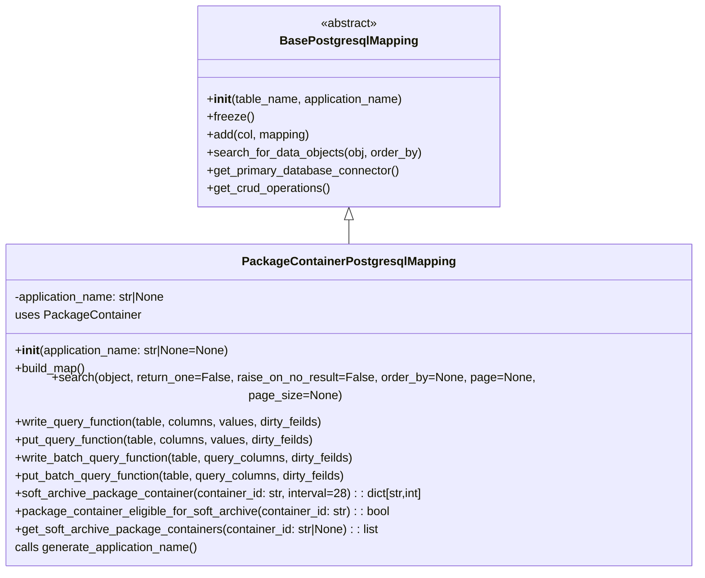

# Diagram: partview_core/partview_service/partview_service/persistence/sql/postgresql/PackageContainerPostgresqlMapping.py


> Auto-generated by Obscura crawlers

## Diagram 1



### SVG

<svg id="container" width="942.1171875" xmlns="http://www.w3.org/2000/svg" class="classDiagram" height="744" viewBox="0 0 942.1171875 744" role="graphics-document document" aria-roledescription="class"><style>#container{font-family:"trebuchet ms",verdana,arial,sans-serif;font-size:16px;fill:#333;}@keyframes edge-animation-frame{from{stroke-dashoffset:0;}}@keyframes dash{to{stroke-dashoffset:0;}}#container .edge-animation-slow{stroke-dasharray:9,5!important;stroke-dashoffset:900;animation:dash 50s linear infinite;stroke-linecap:round;}#container .edge-animation-fast{stroke-dasharray:9,5!important;stroke-dashoffset:900;animation:dash 20s linear infinite;stroke-linecap:round;}#container .error-icon{fill:#552222;}#container .error-text{fill:#552222;stroke:#552222;}#container .edge-thickness-normal{stroke-width:1px;}#container .edge-thickness-thick{stroke-width:3.5px;}#container .edge-pattern-solid{stroke-dasharray:0;}#container .edge-thickness-invisible{stroke-width:0;fill:none;}#container .edge-pattern-dashed{stroke-dasharray:3;}#container .edge-pattern-dotted{stroke-dasharray:2;}#container .marker{fill:#333333;stroke:#333333;}#container .marker.cross{stroke:#333333;}#container svg{font-family:"trebuchet ms",verdana,arial,sans-serif;font-size:16px;}#container p{margin:0;}#container g.classGroup text{fill:#9370DB;stroke:none;font-family:"trebuchet ms",verdana,arial,sans-serif;font-size:10px;}#container g.classGroup text .title{font-weight:bolder;}#container .nodeLabel,#container .edgeLabel{color:#131300;}#container .edgeLabel .label rect{fill:#ECECFF;}#container .label text{fill:#131300;}#container .labelBkg{background:#ECECFF;}#container .edgeLabel .label span{background:#ECECFF;}#container .classTitle{font-weight:bolder;}#container .node rect,#container .node circle,#container .node ellipse,#container .node polygon,#container .node path{fill:#ECECFF;stroke:#9370DB;stroke-width:1px;}#container .divider{stroke:#9370DB;stroke-width:1;}#container g.clickable{cursor:pointer;}#container g.classGroup rect{fill:#ECECFF;stroke:#9370DB;}#container g.classGroup line{stroke:#9370DB;stroke-width:1;}#container .classLabel .box{stroke:none;stroke-width:0;fill:#ECECFF;opacity:0.5;}#container .classLabel .label{fill:#9370DB;font-size:10px;}#container .relation{stroke:#333333;stroke-width:1;fill:none;}#container .dashed-line{stroke-dasharray:3;}#container .dotted-line{stroke-dasharray:1 2;}#container #compositionStart,#container .composition{fill:#333333!important;stroke:#333333!important;stroke-width:1;}#container #compositionEnd,#container .composition{fill:#333333!important;stroke:#333333!important;stroke-width:1;}#container #dependencyStart,#container .dependency{fill:#333333!important;stroke:#333333!important;stroke-width:1;}#container #dependencyStart,#container .dependency{fill:#333333!important;stroke:#333333!important;stroke-width:1;}#container #extensionStart,#container .extension{fill:transparent!important;stroke:#333333!important;stroke-width:1;}#container #extensionEnd,#container .extension{fill:transparent!important;stroke:#333333!important;stroke-width:1;}#container #aggregationStart,#container .aggregation{fill:transparent!important;stroke:#333333!important;stroke-width:1;}#container #aggregationEnd,#container .aggregation{fill:transparent!important;stroke:#333333!important;stroke-width:1;}#container #lollipopStart,#container .lollipop{fill:#ECECFF!important;stroke:#333333!important;stroke-width:1;}#container #lollipopEnd,#container .lollipop{fill:#ECECFF!important;stroke:#333333!important;stroke-width:1;}#container .edgeTerminals{font-size:11px;line-height:initial;}#container .classTitleText{text-anchor:middle;font-size:18px;fill:#333;}#container .label-icon{display:inline-block;height:1em;overflow:visible;vertical-align:-0.125em;}#container .node .label-icon path{fill:currentColor;stroke:revert;stroke-width:revert;}#container :root{--mermaid-font-family:"trebuchet ms",verdana,arial,sans-serif;}</style><g><defs><marker id="container_class-aggregationStart" class="marker aggregation class" refX="18" refY="7" markerWidth="190" markerHeight="240" orient="auto"><path d="M 18,7 L9,13 L1,7 L9,1 Z"></path></marker></defs><defs><marker id="container_class-aggregationEnd" class="marker aggregation class" refX="1" refY="7" markerWidth="20" markerHeight="28" orient="auto"><path d="M 18,7 L9,13 L1,7 L9,1 Z"></path></marker></defs><defs><marker id="container_class-extensionStart" class="marker extension class" refX="18" refY="7" markerWidth="190" markerHeight="240" orient="auto"><path d="M 1,7 L18,13 V 1 Z"></path></marker></defs><defs><marker id="container_class-extensionEnd" class="marker extension class" refX="1" refY="7" markerWidth="20" markerHeight="28" orient="auto"><path d="M 1,1 V 13 L18,7 Z"></path></marker></defs><defs><marker id="container_class-compositionStart" class="marker composition class" refX="18" refY="7" markerWidth="190" markerHeight="240" orient="auto"><path d="M 18,7 L9,13 L1,7 L9,1 Z"></path></marker></defs><defs><marker id="container_class-compositionEnd" class="marker composition class" refX="1" refY="7" markerWidth="20" markerHeight="28" orient="auto"><path d="M 18,7 L9,13 L1,7 L9,1 Z"></path></marker></defs><defs><marker id="container_class-dependencyStart" class="marker dependency class" refX="6" refY="7" markerWidth="190" markerHeight="240" orient="auto"><path d="M 5,7 L9,13 L1,7 L9,1 Z"></path></marker></defs><defs><marker id="container_class-dependencyEnd" class="marker dependency class" refX="13" refY="7" markerWidth="20" markerHeight="28" orient="auto"><path d="M 18,7 L9,13 L14,7 L9,1 Z"></path></marker></defs><defs><marker id="container_class-lollipopStart" class="marker lollipop class" refX="13" refY="7" markerWidth="190" markerHeight="240" orient="auto"><circle stroke="black" fill="transparent" cx="7" cy="7" r="6"></circle></marker></defs><defs><marker id="container_class-lollipopEnd" class="marker lollipop class" refX="1" refY="7" markerWidth="190" markerHeight="240" orient="auto"><circle stroke="black" fill="transparent" cx="7" cy="7" r="6"></circle></marker></defs><g class="root"><g class="clusters"></g><g class="edgePaths"><path d="M471.059,295.25L471.059,296.542C471.059,297.833,471.059,300.417,471.059,305.875C471.059,311.333,471.059,319.667,471.059,323.833L471.059,328" id="id_BasePostgresqlMapping_PackageContainerPostgresqlMapping_1" class="edge-thickness-normal edge-pattern-solid relation" style=";;;" data-edge="true" data-et="edge" data-id="id_BasePostgresqlMapping_PackageContainerPostgresqlMapping_1" data-points="W3sieCI6NDcxLjA1ODU5Mzc1LCJ5IjoyNzh9LHsieCI6NDcxLjA1ODU5Mzc1LCJ5IjozMDN9LHsieCI6NDcxLjA1ODU5Mzc1LCJ5IjozMjh9XQ==" marker-start="url(#container_class-extensionStart)"></path></g><g class="edgeLabels"><g class="edgeLabel"><g class="label" data-id="id_BasePostgresqlMapping_PackageContainerPostgresqlMapping_1" transform="translate(0, 0)"><foreignObject width="0" height="0"><div xmlns="http://www.w3.org/1999/xhtml" class="labelBkg" style="display: table-cell; white-space: nowrap; line-height: 1.5; max-width: 200px; text-align: center;"><span class="edgeLabel"></span></div></foreignObject></g></g></g><g class="nodes"><g class="node default" id="classId-BasePostgresqlMapping-0" transform="translate(471.05859375, 143)"><g class="basic label-container"><path d="M-201.015625 -135 L201.015625 -135 L201.015625 135 L-201.015625 135" stroke="none" stroke-width="0" fill="#ECECFF" style=""></path><path d="M-201.015625 -135 C-73.02158625906655 -135, 54.972452481866895 -135, 201.015625 -135 M-201.015625 -135 C-93.27898103464383 -135, 14.457662930712331 -135, 201.015625 -135 M201.015625 -135 C201.015625 -30.69363244931462, 201.015625 73.61273510137076, 201.015625 135 M201.015625 -135 C201.015625 -49.980713702062985, 201.015625 35.03857259587403, 201.015625 135 M201.015625 135 C110.6330185597815 135, 20.25041211956301 135, -201.015625 135 M201.015625 135 C105.87805668620838 135, 10.740488372416763 135, -201.015625 135 M-201.015625 135 C-201.015625 31.3481102987774, -201.015625 -72.3037794024452, -201.015625 -135 M-201.015625 135 C-201.015625 68.82434927920865, -201.015625 2.648698558417294, -201.015625 -135" stroke="#9370DB" stroke-width="1.3" fill="none" stroke-dasharray="0 0" style=""></path></g><g class="annotation-group text" transform="translate(-38.609375, -111)"><g class="label" style="" transform="translate(0,-12)"><foreignObject width="77.21875" height="24"><div xmlns="http://www.w3.org/1999/xhtml" style="display: table-cell; white-space: nowrap; line-height: 1.5; max-width: 127px; text-align: center;"><span class="nodeLabel markdown-node-label" style=""><p>«abstract»</p></span></div></foreignObject></g></g><g class="label-group text" transform="translate(-87.921875, -87)"><g class="label" style="font-weight: bolder" transform="translate(0,-12)"><foreignObject width="175.84375" height="24"><div xmlns="http://www.w3.org/1999/xhtml" style="display: table-cell; white-space: nowrap; line-height: 1.5; max-width: 223px; text-align: center;"><span class="nodeLabel markdown-node-label" style=""><p>BasePostgresqlMapping</p></span></div></foreignObject></g></g><g class="members-group text" transform="translate(-189.015625, -39)"></g><g class="methods-group text" transform="translate(-189.015625, -9)"><g class="label" style="" transform="translate(0,-12)"><foreignObject width="267.375" height="24"><div xmlns="http://www.w3.org/1999/xhtml" style="display: table-cell; white-space: nowrap; line-height: 1.5; max-width: 356px; text-align: center;"><span class="nodeLabel markdown-node-label" style=""><p>+<strong>init</strong>(table_name, application_name)</p></span></div></foreignObject></g><g class="label" style="" transform="translate(0,12)"><foreignObject width="62.109375" height="24"><div xmlns="http://www.w3.org/1999/xhtml" style="display: table-cell; white-space: nowrap; line-height: 1.5; max-width: 119px; text-align: center;"><span class="nodeLabel markdown-node-label" style=""><p>+freeze()</p></span></div></foreignObject></g><g class="label" style="" transform="translate(0,36)"><foreignObject width="139.09375" height="24"><div xmlns="http://www.w3.org/1999/xhtml" style="display: table-cell; white-space: nowrap; line-height: 1.5; max-width: 196px; text-align: center;"><span class="nodeLabel markdown-node-label" style=""><p>+add(col, mapping)</p></span></div></foreignObject></g><g class="label" style="" transform="translate(0,60)"><foreignObject width="290.109375" height="24"><div xmlns="http://www.w3.org/1999/xhtml" style="display: table-cell; white-space: nowrap; line-height: 1.5; max-width: 347px; text-align: center;"><span class="nodeLabel markdown-node-label" style=""><p>+search_for_data_objects(obj, order_by)</p></span></div></foreignObject></g><g class="label" style="" transform="translate(0,84)"><foreignObject width="260.671875" height="24"><div xmlns="http://www.w3.org/1999/xhtml" style="display: table-cell; white-space: nowrap; line-height: 1.5; max-width: 318px; text-align: center;"><span class="nodeLabel markdown-node-label" style=""><p>+get_primary_database_connector()</p></span></div></foreignObject></g><g class="label" style="" transform="translate(0,108)"><foreignObject width="167.984375" height="24"><div xmlns="http://www.w3.org/1999/xhtml" style="display: table-cell; white-space: nowrap; line-height: 1.5; max-width: 225px; text-align: center;"><span class="nodeLabel markdown-node-label" style=""><p>+get_crud_operations()</p></span></div></foreignObject></g></g><g class="divider" style=""><path d="M-201.015625 -63 C-50.374105995745595 -63, 100.26741300850881 -63, 201.015625 -63 M-201.015625 -63 C-82.16023346757761 -63, 36.695158064844776 -63, 201.015625 -63" stroke="#9370DB" stroke-width="1.3" fill="none" stroke-dasharray="0 0" style=""></path></g><g class="divider" style=""><path d="M-201.015625 -39 C-87.73392539792374 -39, 25.547774204152518 -39, 201.015625 -39 M-201.015625 -39 C-84.14624604882694 -39, 32.72313290234612 -39, 201.015625 -39" stroke="#9370DB" stroke-width="1.3" fill="none" stroke-dasharray="0 0" style=""></path></g></g><g class="node default" id="classId-PackageContainerPostgresqlMapping-1" transform="translate(471.05859375, 532)"><g class="basic label-container"><path d="M-463.05859375 -204 L463.05859375 -204 L463.05859375 204 L-463.05859375 204" stroke="none" stroke-width="0" fill="#ECECFF" style=""></path><path d="M-463.05859375 -204 C-174.87137556463614 -204, 113.31584262072772 -204, 463.05859375 -204 M-463.05859375 -204 C-205.8824060997403 -204, 51.293781550519384 -204, 463.05859375 -204 M463.05859375 -204 C463.05859375 -76.59154433521965, 463.05859375 50.816911329560696, 463.05859375 204 M463.05859375 -204 C463.05859375 -113.47119626158354, 463.05859375 -22.942392523167086, 463.05859375 204 M463.05859375 204 C129.7406371742435 204, -203.57731940151302 204, -463.05859375 204 M463.05859375 204 C211.56261566429035 204, -39.933362421419304 204, -463.05859375 204 M-463.05859375 204 C-463.05859375 59.628899209324516, -463.05859375 -84.74220158135097, -463.05859375 -204 M-463.05859375 204 C-463.05859375 119.9588149128776, -463.05859375 35.9176298257552, -463.05859375 -204" stroke="#9370DB" stroke-width="1.3" fill="none" stroke-dasharray="0 0" style=""></path></g><g class="annotation-group text" transform="translate(0, -180)"></g><g class="label-group text" transform="translate(-135.8515625, -180)"><g class="label" style="font-weight: bolder" transform="translate(0,-12)"><foreignObject width="271.703125" height="24"><div xmlns="http://www.w3.org/1999/xhtml" style="display: table-cell; white-space: nowrap; line-height: 1.5; max-width: 317px; text-align: center;"><span class="nodeLabel markdown-node-label" style=""><p>PackageContainerPostgresqlMapping</p></span></div></foreignObject></g></g><g class="members-group text" transform="translate(-451.05859375, -132)"><g class="label" style="" transform="translate(0,-12)"><foreignObject width="209.484375" height="24"><div xmlns="http://www.w3.org/1999/xhtml" style="display: table-cell; white-space: nowrap; line-height: 1.5; max-width: 267px; text-align: center;"><span class="nodeLabel markdown-node-label" style=""><p>-application_name: str|None</p></span></div></foreignObject></g><g class="label" style="" transform="translate(0,12)"><foreignObject width="165.78125" height="24"><div xmlns="http://www.w3.org/1999/xhtml" style="display: table-cell; white-space: nowrap; line-height: 1.5; max-width: 217px; text-align: center;"><span class="nodeLabel markdown-node-label" style=""><p>uses PackageContainer</p></span></div></foreignObject></g></g><g class="methods-group text" transform="translate(-451.05859375, -60)"><g class="label" style="" transform="translate(0,-12)"><foreignObject width="292.4375" height="24"><div xmlns="http://www.w3.org/1999/xhtml" style="display: table-cell; white-space: nowrap; line-height: 1.5; max-width: 381px; text-align: center;"><span class="nodeLabel markdown-node-label" style=""><p>+<strong>init</strong>(application_name: str|None=None)</p></span></div></foreignObject></g><g class="label" style="" transform="translate(0,12)"><foreignObject width="96.109375" height="24"><div xmlns="http://www.w3.org/1999/xhtml" style="display: table-cell; white-space: nowrap; line-height: 1.5; max-width: 153px; text-align: center;"><span class="nodeLabel markdown-node-label" style=""><p>+build_map()</p></span></div></foreignObject></g><g class="label" style="" transform="translate(0,36)"><foreignObject width="766.265625" height="24"><div xmlns="http://www.w3.org/1999/xhtml" style="display: table-cell; white-space: nowrap; line-height: 1.5; max-width: 824px; text-align: center;"><span class="nodeLabel markdown-node-label" style=""><p>+search(object, return_one=False, raise_on_no_result=False, order_by=None, page=None, page_size=None)</p></span></div></foreignObject></g><g class="label" style="" transform="translate(0,60)"><foreignObject width="422.609375" height="24"><div xmlns="http://www.w3.org/1999/xhtml" style="display: table-cell; white-space: nowrap; line-height: 1.5; max-width: 480px; text-align: center;"><span class="nodeLabel markdown-node-label" style=""><p>+write_query_function(table, columns, values, dirty_feilds)</p></span></div></foreignObject></g><g class="label" style="" transform="translate(0,84)"><foreignObject width="411.109375" height="24"><div xmlns="http://www.w3.org/1999/xhtml" style="display: table-cell; white-space: nowrap; line-height: 1.5; max-width: 468px; text-align: center;"><span class="nodeLabel markdown-node-label" style=""><p>+put_query_function(table, columns, values, dirty_feilds)</p></span></div></foreignObject></g><g class="label" style="" transform="translate(0,108)"><foreignObject width="466.28125" height="24"><div xmlns="http://www.w3.org/1999/xhtml" style="display: table-cell; white-space: nowrap; line-height: 1.5; max-width: 524px; text-align: center;"><span class="nodeLabel markdown-node-label" style=""><p>+write_batch_query_function(table, query_columns, dirty_feilds)</p></span></div></foreignObject></g><g class="label" style="" transform="translate(0,132)"><foreignObject width="454.78125" height="24"><div xmlns="http://www.w3.org/1999/xhtml" style="display: table-cell; white-space: nowrap; line-height: 1.5; max-width: 512px; text-align: center;"><span class="nodeLabel markdown-node-label" style=""><p>+put_batch_query_function(table, query_columns, dirty_feilds)</p></span></div></foreignObject></g><g class="label" style="" transform="translate(0,156)"><foreignObject width="555.171875" height="24"><div xmlns="http://www.w3.org/1999/xhtml" style="display: table-cell; white-space: nowrap; line-height: 1.5; max-width: 613px; text-align: center;"><span class="nodeLabel markdown-node-label" style=""><p>+soft_archive_package_container(container_id: str, interval=28) : : dict[str,int]</p></span></div></foreignObject></g><g class="label" style="" transform="translate(0,180)"><foreignObject width="509.484375" height="24"><div xmlns="http://www.w3.org/1999/xhtml" style="display: table-cell; white-space: nowrap; line-height: 1.5; max-width: 567px; text-align: center;"><span class="nodeLabel markdown-node-label" style=""><p>+package_container_eligible_for_soft_archive(container_id: str) : : bool</p></span></div></foreignObject></g><g class="label" style="" transform="translate(0,204)"><foreignObject width="494.234375" height="24"><div xmlns="http://www.w3.org/1999/xhtml" style="display: table-cell; white-space: nowrap; line-height: 1.5; max-width: 552px; text-align: center;"><span class="nodeLabel markdown-node-label" style=""><p>+get_soft_archive_package_containers(container_id: str|None) : : list</p></span></div></foreignObject></g><g class="label" style="" transform="translate(0,228)"><foreignObject width="249.578125" height="24"><div xmlns="http://www.w3.org/1999/xhtml" style="display: table-cell; white-space: nowrap; line-height: 1.5; max-width: 300px; text-align: center;"><span class="nodeLabel markdown-node-label" style=""><p>calls generate_application_name()</p></span></div></foreignObject></g></g><g class="divider" style=""><path d="M-463.05859375 -156 C-275.77948695772454 -156, -88.50038016544909 -156, 463.05859375 -156 M-463.05859375 -156 C-152.9323926570425 -156, 157.193808435915 -156, 463.05859375 -156" stroke="#9370DB" stroke-width="1.3" fill="none" stroke-dasharray="0 0" style=""></path></g><g class="divider" style=""><path d="M-463.05859375 -84 C-165.511097452758 -84, 132.03639884448398 -84, 463.05859375 -84 M-463.05859375 -84 C-260.61404657480693 -84, -58.16949939961381 -84, 463.05859375 -84" stroke="#9370DB" stroke-width="1.3" fill="none" stroke-dasharray="0 0" style=""></path></g></g></g></g></g></svg>

## Diagram 2

```mermaid
flowchart TD
    Start([start]) --> Init[Instantiate PackageContainerPostgresqlMapping]
    Init --> BuildMap[build_map() - register column mappings]
    BuildMap --> PutQuery[put/put_batch/write_query_function generation]
    PutQuery --> DBInsert[INSERT ... ON CONFLICT DO UPDATE]
    DBInsert --> Return[RETURNING *]
    Start --> SoftArchiveCall[soft_archive_package_container(container_id)]
    SoftArchiveCall --> ForEachQuery[/Iterate queries: container, part, trip_leg, asn_order, orchestrator/]
    ForEachQuery --> Mogrify[mogrify(query, {package_container_id})]
    Mogrify --> Execute[execute(mogrified_query)]
    Execute --> Fetch[fetchall() -> returning ids]
    Fetch --> Tally[accumulate counts in total_count]
    Tally --> ReturnCounts[return total_count]
    ReturnCounts --> End([end])
```

> SVG rendering failed for this diagram.
