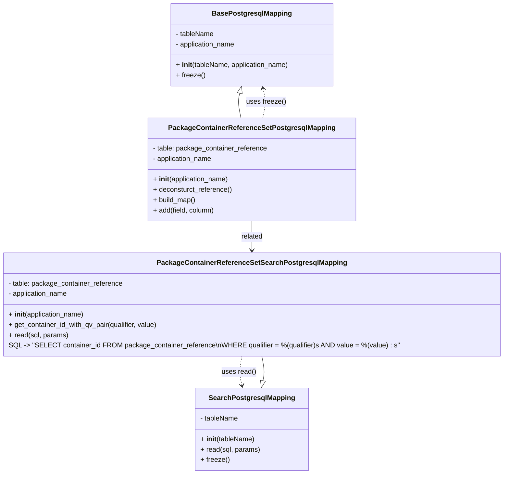

# Diagram: partview_core/partview_service/partview_service/persistence/sql/postgresql/PackageContainerReferenceSetPostgresqlMapping.py

> Auto-generated by Obscura crawlers

## Mermaid

### SVG

<svg id="container" width="1135.4609375" xmlns="http://www.w3.org/2000/svg" class="classDiagram" height="1102" viewBox="0 0 1135.4609375 1102" role="graphics-document document" aria-roledescription="class"><g><defs><marker id="container_class-aggregationStart" class="marker aggregation class" refX="18" refY="7" markerWidth="190" markerHeight="240" orient="auto"><path d="M 18,7 L9,13 L1,7 L9,1 Z"></path></marker></defs><defs><marker id="container_class-aggregationEnd" class="marker aggregation class" refX="1" refY="7" markerWidth="20" markerHeight="28" orient="auto"><path d="M 18,7 L9,13 L1,7 L9,1 Z"></path></marker></defs><defs><marker id="container_class-extensionStart" class="marker extension class" refX="18" refY="7" markerWidth="190" markerHeight="240" orient="auto"><path d="M 1,7 L18,13 V 1 Z"></path></marker></defs><defs><marker id="container_class-extensionEnd" class="marker extension class" refX="1" refY="7" markerWidth="20" markerHeight="28" orient="auto"><path d="M 1,1 V 13 L18,7 Z"></path></marker></defs><defs><marker id="container_class-compositionStart" class="marker composition class" refX="18" refY="7" markerWidth="190" markerHeight="240" orient="auto"><path d="M 18,7 L9,13 L1,7 L9,1 Z"></path></marker></defs><defs><marker id="container_class-compositionEnd" class="marker composition class" refX="1" refY="7" markerWidth="20" markerHeight="28" orient="auto"><path d="M 18,7 L9,13 L1,7 L9,1 Z"></path></marker></defs><defs><marker id="container_class-dependencyStart" class="marker dependency class" refX="6" refY="7" markerWidth="190" markerHeight="240" orient="auto"><path d="M 5,7 L9,13 L1,7 L9,1 Z"></path></marker></defs><defs><marker id="container_class-dependencyEnd" class="marker dependency class" refX="13" refY="7" markerWidth="20" markerHeight="28" orient="auto"><path d="M 18,7 L9,13 L14,7 L9,1 Z"></path></marker></defs><defs><marker id="container_class-lollipopStart" class="marker lollipop class" refX="13" refY="7" markerWidth="190" markerHeight="240" orient="auto"><circle stroke="black" fill="transparent" cx="7" cy="7" r="6"></circle></marker></defs><defs><marker id="container_class-lollipopEnd" class="marker lollipop class" refX="1" refY="7" markerWidth="190" markerHeight="240" orient="auto"><circle stroke="black" fill="transparent" cx="7" cy="7" r="6"></circle></marker></defs><g class="root"><g class="clusters"></g><g class="edgePaths"><path d="M539.845,216.745L539.011,220.121C538.176,223.497,536.506,230.248,536.963,239.791C537.42,249.333,540.004,261.667,541.296,267.833L542.588,274" id="id_BasePostgresqlMapping_PackageContainerReferenceSetPostgresqlMapping_1" class="edge-thickness-normal edge-pattern-solid relation" style=";;;" data-edge="true" data-et="edge" data-id="id_BasePostgresqlMapping_PackageContainerReferenceSetPostgresqlMapping_1" data-points="W3sieCI6NTQzLjk4NzA0NzY5NzM2ODQsInkiOjIwMH0seyJ4Ijo1MzQuODM1OTM3NSwieSI6MjM3fSx7IngiOjU0Mi41ODgxNTE4NzEwMTkxLCJ5IjoyNzR9XQ==" marker-start="url(#container_class-extensionStart)"></path><path d="M593.207,885.174L593.966,881.811C594.725,878.449,596.243,871.725,595.823,862.196C595.403,852.667,593.043,840.333,591.864,834.167L590.684,828" id="id_SearchPostgresqlMapping_PackageContainerReferenceSetSearchPostgresqlMapping_2" class="edge-thickness-normal edge-pattern-solid relation" style=";;;" data-edge="true" data-et="edge" data-id="id_SearchPostgresqlMapping_PackageContainerReferenceSetSearchPostgresqlMapping_2" data-points="W3sieCI6NTg5LjQwNzE2MDQ3OTMyMzQsInkiOjkwMn0seyJ4Ijo1OTcuNzYxNzE4NzUsInkiOjg2NX0seyJ4Ijo1OTAuNjg0MjkwNDA2MDUxLCJ5Ijo4Mjh9XQ==" marker-start="url(#container_class-extensionStart)"></path><path d="M567.73,514L567.73,520.167C567.73,526.333,567.73,538.667,567.73,550C567.73,561.333,567.73,571.667,567.73,576.833L567.73,582" id="id_PackageContainerReferenceSetPostgresqlMapping_PackageContainerReferenceSetSearchPostgresqlMapping_3" class="edge-thickness-normal edge-pattern-solid relation" style=";;;" data-edge="true" data-et="edge" data-id="id_PackageContainerReferenceSetPostgresqlMapping_PackageContainerReferenceSetSearchPostgresqlMapping_3" data-points="W3sieCI6NTY3LjczMDQ2ODc1LCJ5Ijo1MTR9LHsieCI6NTY3LjczMDQ2ODc1LCJ5Ijo1NTF9LHsieCI6NTY3LjczMDQ2ODc1LCJ5Ijo1ODh9XQ==" marker-end="url(#container_class-dependencyEnd)"></path><path d="M544.777,828L543.597,834.167C542.418,840.333,540.058,852.667,540.051,864.025C540.044,875.382,542.388,885.765,543.56,890.956L544.732,896.147" id="id_PackageContainerReferenceSetSearchPostgresqlMapping_SearchPostgresqlMapping_4" class="edge-thickness-normal edge-pattern-dashed relation" style=";;;" data-edge="true" data-et="edge" data-id="id_PackageContainerReferenceSetSearchPostgresqlMapping_SearchPostgresqlMapping_4" data-points="W3sieCI6NTQ0Ljc3NjY0NzA5Mzk0OSwieSI6ODI4fSx7IngiOjUzNy42OTkyMTg3NSwieSI6ODY1fSx7IngiOjU0Ni4wNTM3NzcwMjA2NzY2LCJ5Ijo5MDJ9XQ==" marker-end="url(#container_class-dependencyEnd)"></path><path d="M592.873,274L594.165,267.833C595.457,261.667,598.041,249.333,598.048,237.971C598.055,226.608,595.485,216.216,594.2,211.02L592.914,205.824" id="id_PackageContainerReferenceSetPostgresqlMapping_BasePostgresqlMapping_5" class="edge-thickness-normal edge-pattern-dashed relation" style=";;;" data-edge="true" data-et="edge" data-id="id_PackageContainerReferenceSetPostgresqlMapping_BasePostgresqlMapping_5" data-points="W3sieCI6NTkyLjg3Mjc4NTYyODk4MDksInkiOjI3NH0seyJ4Ijo2MDAuNjI1LCJ5IjoyMzd9LHsieCI6NTkxLjQ3Mzg4OTgwMjYzMTYsInkiOjIwMH1d" marker-end="url(#container_class-dependencyEnd)"></path></g><g class="edgeLabels"><g class="edgeLabel"><g class="label" data-id="id_BasePostgresqlMapping_PackageContainerReferenceSetPostgresqlMapping_1" transform="translate(0, 0)"><foreignObject width="0" height="0">

</foreignObject></g></g><g class="edgeLabel"><g class="label" data-id="id_SearchPostgresqlMapping_PackageContainerReferenceSetSearchPostgresqlMapping_2" transform="translate(0, 0)"><foreignObject width="0" height="0">

</foreignObject></g></g><g class="edgeLabel" transform="translate(567.73046875, 551)"><g class="label" data-id="id_PackageContainerReferenceSetPostgresqlMapping_PackageContainerReferenceSetSearchPostgresqlMapping_3" transform="translate(-25.78125, -12)"><foreignObject width="51.5625" height="24">

related

</foreignObject></g></g><g class="edgeLabel" transform="translate(537.72793, 865.12714)"><g class="label" data-id="id_PackageContainerReferenceSetSearchPostgresqlMapping_SearchPostgresqlMapping_4" transform="translate(-40.0625, -12)"><foreignObject width="80.125" height="24">

uses read()

</foreignObject></g></g><g class="edgeLabel" transform="translate(600.58761, 236.84882)"><g class="label" data-id="id_PackageContainerReferenceSetPostgresqlMapping_BasePostgresqlMapping_5" transform="translate(-45.7890625, -12)"><foreignObject width="91.578125" height="24">

uses freeze()

</foreignObject></g></g></g><g class="nodes"><g class="node default" id="classId-BasePostgresqlMapping-0" transform="translate(567.73046875, 104)"><g class="basic label-container"><path d="M-188.546875 -96 L188.546875 -96 L188.546875 96 L-188.546875 96" stroke="none" stroke-width="0" fill="#ECECFF" style=""></path><path d="M-188.546875 -96 C-40.24873271424812 -96, 108.04940957150376 -96, 188.546875 -96 M-188.546875 -96 C-80.10896546697981 -96, 28.32894406604038 -96, 188.546875 -96 M188.546875 -96 C188.546875 -34.31359207681974, 188.546875 27.372815846360524, 188.546875 96 M188.546875 -96 C188.546875 -28.524403808535666, 188.546875 38.95119238292867, 188.546875 96 M188.546875 96 C111.96793716557931 96, 35.38899933115863 96, -188.546875 96 M188.546875 96 C44.303627094125005 96, -99.93962081174999 96, -188.546875 96 M-188.546875 96 C-188.546875 41.79717839632853, -188.546875 -12.405643207342933, -188.546875 -96 M-188.546875 96 C-188.546875 55.082419911935936, -188.546875 14.164839823871873, -188.546875 -96" stroke="#9370DB" stroke-width="1.3" fill="none" stroke-dasharray="0 0" style=""></path></g><g class="annotation-group text" transform="translate(0, -72)"></g><g class="label-group text" transform="translate(-87.921875, -72)"><g class="label" style="font-weight: bolder" transform="translate(0,-12)"><foreignObject width="175.84375" height="24">

BasePostgresqlMapping

</foreignObject></g></g><g class="members-group text" transform="translate(-176.546875, -24)"><g class="label" style="" transform="translate(0,-12)"><foreignObject width="89.953125" height="24">

- tableName

</foreignObject></g><g class="label" style="" transform="translate(0,12)"><foreignObject width="141.640625" height="24">

- application_name

</foreignObject></g></g><g class="methods-group text" transform="translate(-176.546875, 48)"><g class="label" style="" transform="translate(0,-12)"><foreignObject width="265.171875" height="24">

+ <strong>init</strong>(tableName, application_name)

</foreignObject></g><g class="label" style="" transform="translate(0,12)"><foreignObject width="66.578125" height="24">

+ freeze()

</foreignObject></g></g><g class="divider" style=""><path d="M-188.546875 -48 C-58.98123468311326 -48, 70.58440563377349 -48, 188.546875 -48 M-188.546875 -48 C-51.92363230672015 -48, 84.6996103865597 -48, 188.546875 -48" stroke="#9370DB" stroke-width="1.3" fill="none" stroke-dasharray="0 0" style=""></path></g><g class="divider" style=""><path d="M-188.546875 24 C-70.9873555240236 24, 46.5721639519528 24, 188.546875 24 M-188.546875 24 C-79.61855875449156 24, 29.30975749101688 24, 188.546875 24" stroke="#9370DB" stroke-width="1.3" fill="none" stroke-dasharray="0 0" style=""></path></g></g><g class="node default" id="classId-SearchPostgresqlMapping-1" transform="translate(567.73046875, 998)"><g class="basic label-container"><path d="M-128.83203125 -96 L128.83203125 -96 L128.83203125 96 L-128.83203125 96" stroke="none" stroke-width="0" fill="#ECECFF" style=""></path><path d="M-128.83203125 -96 C-57.482046723205755 -96, 13.86793780358849 -96, 128.83203125 -96 M-128.83203125 -96 C-54.52348931058529 -96, 19.78505262882942 -96, 128.83203125 -96 M128.83203125 -96 C128.83203125 -32.600962967531956, 128.83203125 30.79807406493609, 128.83203125 96 M128.83203125 -96 C128.83203125 -56.80867121660706, 128.83203125 -17.61734243321412, 128.83203125 96 M128.83203125 96 C28.84355204707157 96, -71.14492715585686 96, -128.83203125 96 M128.83203125 96 C67.57714730508792 96, 6.322263360175825 96, -128.83203125 96 M-128.83203125 96 C-128.83203125 41.07167681015365, -128.83203125 -13.856646379692705, -128.83203125 -96 M-128.83203125 96 C-128.83203125 50.58486953432142, -128.83203125 5.169739068642841, -128.83203125 -96" stroke="#9370DB" stroke-width="1.3" fill="none" stroke-dasharray="0 0" style=""></path></g><g class="annotation-group text" transform="translate(0, -72)"></g><g class="label-group text" transform="translate(-95.1171875, -72)"><g class="label" style="font-weight: bolder" transform="translate(0,-12)"><foreignObject width="190.234375" height="24">

SearchPostgresqlMapping

</foreignObject></g></g><g class="members-group text" transform="translate(-116.83203125, -24)"><g class="label" style="" transform="translate(0,-12)"><foreignObject width="89.953125" height="24">

- tableName

</foreignObject></g></g><g class="methods-group text" transform="translate(-116.83203125, 24)"><g class="label" style="" transform="translate(0,-12)"><foreignObject width="126.3125" height="24">

+ <strong>init</strong>(tableName)

</foreignObject></g><g class="label" style="" transform="translate(0,12)"><foreignObject width="138.546875" height="24">

+ read(sql, params)

</foreignObject></g><g class="label" style="" transform="translate(0,36)"><foreignObject width="66.578125" height="24">

+ freeze()

</foreignObject></g></g><g class="divider" style=""><path d="M-128.83203125 -48 C-61.71313883870998 -48, 5.405753572580039 -48, 128.83203125 -48 M-128.83203125 -48 C-27.425189404365682 -48, 73.98165244126864 -48, 128.83203125 -48" stroke="#9370DB" stroke-width="1.3" fill="none" stroke-dasharray="0 0" style=""></path></g><g class="divider" style=""><path d="M-128.83203125 0 C-35.89859532017765 0, 57.034840609644704 0, 128.83203125 0 M-128.83203125 0 C-43.17494469019468 0, 42.48214186961064 0, 128.83203125 0" stroke="#9370DB" stroke-width="1.3" fill="none" stroke-dasharray="0 0" style=""></path></g></g><g class="node default" id="classId-PackageContainerReferenceSetPostgresqlMapping-2" transform="translate(567.73046875, 394)"><g class="basic label-container"><path d="M-237.7421875 -120 L237.7421875 -120 L237.7421875 120 L-237.7421875 120" stroke="none" stroke-width="0" fill="#ECECFF" style=""></path><path d="M-237.7421875 -120 C-117.70585346171087 -120, 2.3304805765782532 -120, 237.7421875 -120 M-237.7421875 -120 C-135.92878759278108 -120, -34.115387685562155 -120, 237.7421875 -120 M237.7421875 -120 C237.7421875 -39.47266549904933, 237.7421875 41.054669001901345, 237.7421875 120 M237.7421875 -120 C237.7421875 -28.140679644125584, 237.7421875 63.71864071174883, 237.7421875 120 M237.7421875 120 C103.09315495922505 120, -31.555877581549908 120, -237.7421875 120 M237.7421875 120 C78.60849998194541 120, -80.52518753610917 120, -237.7421875 120 M-237.7421875 120 C-237.7421875 36.79116302409659, -237.7421875 -46.41767395180682, -237.7421875 -120 M-237.7421875 120 C-237.7421875 46.198820299682325, -237.7421875 -27.60235940063535, -237.7421875 -120" stroke="#9370DB" stroke-width="1.3" fill="none" stroke-dasharray="0 0" style=""></path></g><g class="annotation-group text" transform="translate(0, -96)"></g><g class="label-group text" transform="translate(-184.4375, -96)"><g class="label" style="font-weight: bolder" transform="translate(0,-12)"><foreignObject width="368.875" height="24">

PackageContainerReferenceSetPostgresqlMapping

</foreignObject></g></g><g class="members-group text" transform="translate(-225.7421875, -48)"><g class="label" style="" transform="translate(0,-12)"><foreignObject width="267.046875" height="24">

- table: package_container_reference

</foreignObject></g><g class="label" style="" transform="translate(0,12)"><foreignObject width="141.640625" height="24">

- application_name

</foreignObject></g></g><g class="methods-group text" transform="translate(-225.7421875, 24)"><g class="label" style="" transform="translate(0,-12)"><foreignObject width="177.984375" height="24">

+ <strong>init</strong>(application_name)

</foreignObject></g><g class="label" style="" transform="translate(0,12)"><foreignObject width="185.109375" height="24">

+ deconsturct_reference()

</foreignObject></g><g class="label" style="" transform="translate(0,36)"><foreignObject width="100.34375" height="24">

+ build_map()

</foreignObject></g><g class="label" style="" transform="translate(0,60)"><foreignObject width="144.375" height="24">

+ add(field, column)

</foreignObject></g></g><g class="divider" style=""><path d="M-237.7421875 -72 C-76.68930616140165 -72, 84.36357517719671 -72, 237.7421875 -72 M-237.7421875 -72 C-126.90765929241688 -72, -16.07313108483376 -72, 237.7421875 -72" stroke="#9370DB" stroke-width="1.3" fill="none" stroke-dasharray="0 0" style=""></path></g><g class="divider" style=""><path d="M-237.7421875 0 C-95.53841344912726 0, 46.665360601745476 0, 237.7421875 0 M-237.7421875 0 C-99.1509543412923 0, 39.44027881741539 0, 237.7421875 0" stroke="#9370DB" stroke-width="1.3" fill="none" stroke-dasharray="0 0" style=""></path></g></g><g class="node default" id="classId-PackageContainerReferenceSetSearchPostgresqlMapping-3" transform="translate(567.73046875, 708)"><g class="basic label-container"><path d="M-559.73046875 -120 L559.73046875 -120 L559.73046875 120 L-559.73046875 120" stroke="none" stroke-width="0" fill="#ECECFF" style=""></path><path d="M-559.73046875 -120 C-240.18888737292292 -120, 79.35269400415416 -120, 559.73046875 -120 M-559.73046875 -120 C-215.95791871943237 -120, 127.81463131113526 -120, 559.73046875 -120 M559.73046875 -120 C559.73046875 -49.28230161884974, 559.73046875 21.435396762300513, 559.73046875 120 M559.73046875 -120 C559.73046875 -42.95043455072934, 559.73046875 34.09913089854132, 559.73046875 120 M559.73046875 120 C252.93431606505607 120, -53.86183661988787 120, -559.73046875 120 M559.73046875 120 C232.67497893846007 120, -94.38051087307986 120, -559.73046875 120 M-559.73046875 120 C-559.73046875 42.77118924458732, -559.73046875 -34.45762151082536, -559.73046875 -120 M-559.73046875 120 C-559.73046875 48.16626597867575, -559.73046875 -23.667468042648494, -559.73046875 -120" stroke="#9370DB" stroke-width="1.3" fill="none" stroke-dasharray="0 0" style=""></path></g><g class="annotation-group text" transform="translate(0, -96)"></g><g class="label-group text" transform="translate(-209.1484375, -96)"><g class="label" style="font-weight: bolder" transform="translate(0,-12)"><foreignObject width="418.296875" height="24">

PackageContainerReferenceSetSearchPostgresqlMapping

</foreignObject></g></g><g class="members-group text" transform="translate(-547.73046875, -48)"><g class="label" style="" transform="translate(0,-12)"><foreignObject width="267.046875" height="24">

- table: package_container_reference

</foreignObject></g><g class="label" style="" transform="translate(0,12)"><foreignObject width="141.640625" height="24">

- application_name

</foreignObject></g></g><g class="methods-group text" transform="translate(-547.73046875, 24)"><g class="label" style="" transform="translate(0,-12)"><foreignObject width="177.984375" height="24">

+ <strong>init</strong>(application_name)

</foreignObject></g><g class="label" style="" transform="translate(0,12)"><foreignObject width="351.03125" height="24">

+ get_container_id_with_qv_pair(qualifier, value)

</foreignObject></g><g class="label" style="" transform="translate(0,36)"><foreignObject width="138.546875" height="24">

+ read(sql, params)

</foreignObject></g><g class="label" style="" transform="translate(0,60)"><foreignObject width="886.3125" height="24">

SQL -&gt; "SELECT container_id FROM package_container_reference\nWHERE qualifier = %(qualifier)s AND value = %(value) : s"

</foreignObject></g></g><g class="divider" style=""><path d="M-559.73046875 -72 C-174.89115284893654 -72, 209.94816305212692 -72, 559.73046875 -72 M-559.73046875 -72 C-217.68620139205456 -72, 124.35806596589089 -72, 559.73046875 -72" stroke="#9370DB" stroke-width="1.3" fill="none" stroke-dasharray="0 0" style=""></path></g><g class="divider" style=""><path d="M-559.73046875 0 C-308.0961624902001 0, -56.46185623040009 0, 559.73046875 0 M-559.73046875 0 C-311.9075887952828 0, -64.08470884056555 0, 559.73046875 0" stroke="#9370DB" stroke-width="1.3" fill="none" stroke-dasharray="0 0" style=""></path></g></g></g></g></g></svg>
