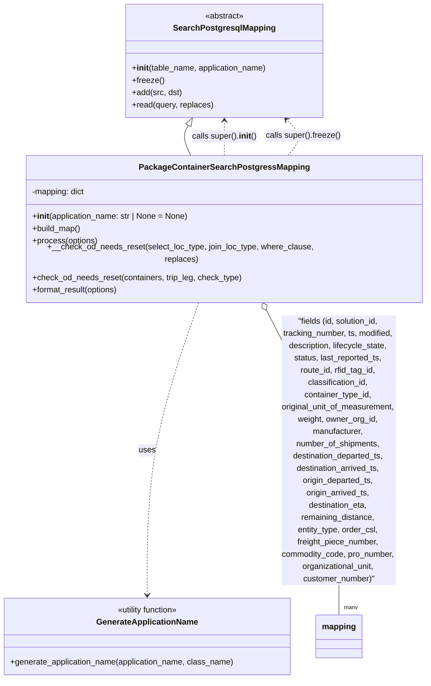

# Diagram: partview_core/partview_service/partview_service/persistence/sql/postgresql/PackageContainerSearchPostgressMapping.py

> Auto-generated by Obscura crawlers

## Mermaid

### SVG

<svg id="container" width="834.697265625" xmlns="http://www.w3.org/2000/svg" class="classDiagram" height="1304" viewBox="0 0 834.697265625 1304" role="graphics-document document" aria-roledescription="class"><g><defs><marker id="container_class-aggregationStart" class="marker aggregation class" refX="18" refY="7" markerWidth="190" markerHeight="240" orient="auto"><path d="M 18,7 L9,13 L1,7 L9,1 Z"></path></marker></defs><defs><marker id="container_class-aggregationEnd" class="marker aggregation class" refX="1" refY="7" markerWidth="20" markerHeight="28" orient="auto"><path d="M 18,7 L9,13 L1,7 L9,1 Z"></path></marker></defs><defs><marker id="container_class-extensionStart" class="marker extension class" refX="18" refY="7" markerWidth="190" markerHeight="240" orient="auto"><path d="M 1,7 L18,13 V 1 Z"></path></marker></defs><defs><marker id="container_class-extensionEnd" class="marker extension class" refX="1" refY="7" markerWidth="20" markerHeight="28" orient="auto"><path d="M 1,1 V 13 L18,7 Z"></path></marker></defs><defs><marker id="container_class-compositionStart" class="marker composition class" refX="18" refY="7" markerWidth="190" markerHeight="240" orient="auto"><path d="M 18,7 L9,13 L1,7 L9,1 Z"></path></marker></defs><defs><marker id="container_class-compositionEnd" class="marker composition class" refX="1" refY="7" markerWidth="20" markerHeight="28" orient="auto"><path d="M 18,7 L9,13 L1,7 L9,1 Z"></path></marker></defs><defs><marker id="container_class-dependencyStart" class="marker dependency class" refX="6" refY="7" markerWidth="190" markerHeight="240" orient="auto"><path d="M 5,7 L9,13 L1,7 L9,1 Z"></path></marker></defs><defs><marker id="container_class-dependencyEnd" class="marker dependency class" refX="13" refY="7" markerWidth="20" markerHeight="28" orient="auto"><path d="M 18,7 L9,13 L14,7 L9,1 Z"></path></marker></defs><defs><marker id="container_class-lollipopStart" class="marker lollipop class" refX="13" refY="7" markerWidth="190" markerHeight="240" orient="auto"><circle stroke="black" fill="transparent" cx="7" cy="7" r="6"></circle></marker></defs><defs><marker id="container_class-lollipopEnd" class="marker lollipop class" refX="1" refY="7" markerWidth="190" markerHeight="240" orient="auto"><circle stroke="black" fill="transparent" cx="7" cy="7" r="6"></circle></marker></defs><g class="root"><g class="clusters"></g><g class="edgePaths"><path d="M369.511,245.017L367.44,248.681C365.369,252.344,361.226,259.672,362.208,269.503C363.19,279.333,369.295,291.667,372.348,297.833L375.401,304" id="id_SearchPostgresqlMapping_PackageContainerSearchPostgressMapping_1" class="edge-thickness-normal edge-pattern-solid relation" style=";;;" data-edge="true" data-et="edge" data-id="id_SearchPostgresqlMapping_PackageContainerSearchPostgressMapping_1" data-points="W3sieCI6Mzc4LCJ5IjoyMzB9LHsieCI6MzU3LjA4Mzk4NDM3NSwieSI6MjY3fSx7IngiOjM3NS40MDA5Njg0NzI2MzMxNywieSI6MzA0fV0=" marker-start="url(#container_class-extensionStart)"></path><path d="M393.361,568L376.07,616.167C358.779,664.333,324.196,760.667,306.905,856C289.613,951.333,289.613,1045.667,289.613,1092.833L289.613,1140" id="id_PackageContainerSearchPostgressMapping_GenerateApplicationName_2" class="edge-thickness-normal edge-pattern-dashed relation" style=";;;" data-edge="true" data-et="edge" data-id="id_PackageContainerSearchPostgressMapping_GenerateApplicationName_2" data-points="W3sieCI6MzkzLjM2MTM3NDUxNzUxNzgsInkiOjU2OH0seyJ4IjoyODkuNjEzMjgxMjUsInkiOjg1N30seyJ4IjoyODkuNjEzMjgxMjUsInkiOjExNDZ9XQ==" marker-end="url(#container_class-dependencyEnd)"></path><path d="M519.239,583.222L543.566,628.851C567.894,674.481,616.548,765.741,640.876,865.037C665.203,964.333,665.203,1071.667,665.203,1125.333L665.203,1179" id="id_PackageContainerSearchPostgressMapping_mapping_3" class="edge-thickness-normal edge-pattern-solid relation" style=";;;" data-edge="true" data-et="edge" data-id="id_PackageContainerSearchPostgressMapping_mapping_3" data-points="W3sieCI6NTExLjEyMzUxMDgwMDE3ODE3LCJ5Ijo1Njh9LHsieCI6NjY1LjIwMzEyNSwieSI6ODU3fSx7IngiOjY2NS4yMDMxMjUsInkiOjExNzl9XQ==" marker-start="url(#container_class-aggregationStart)"></path><path d="M440.748,304L440.748,297.833C440.748,291.667,440.748,279.333,440.748,268C440.748,256.667,440.748,246.333,440.748,241.167L440.748,236" id="id_PackageContainerSearchPostgressMapping_SearchPostgresqlMapping_4" class="edge-thickness-normal edge-pattern-dashed relation" style=";;;" data-edge="true" data-et="edge" data-id="id_PackageContainerSearchPostgressMapping_SearchPostgresqlMapping_4" data-points="W3sieCI6NDQwLjc0ODA0Njg3NSwieSI6MzA0fSx7IngiOjQ0MC43NDgwNDY4NzUsInkiOjI2N30seyJ4Ijo0NDAuNzQ4MDQ2ODc1LCJ5IjoyMzB9XQ==" marker-end="url(#container_class-dependencyEnd)"></path><path d="M563.363,304L569.091,297.833C574.82,291.667,586.276,279.333,586.191,267.686C586.106,256.039,574.479,245.077,568.665,239.597L562.852,234.116" id="id_PackageContainerSearchPostgressMapping_SearchPostgresqlMapping_5" class="edge-thickness-normal edge-pattern-dashed relation" style=";;;" data-edge="true" data-et="edge" data-id="id_PackageContainerSearchPostgressMapping_SearchPostgresqlMapping_5" data-points="W3sieCI6NTYzLjM2MzA2MTY2Nzg5OTQsInkiOjMwNH0seyJ4Ijo1OTcuNzMyNDIxODc1LCJ5IjoyNjd9LHsieCI6NTU4LjQ4NjMyODEyNSwieSI6MjMwfV0=" marker-end="url(#container_class-dependencyEnd)"></path></g><g class="edgeLabels"><g class="edgeLabel"><g class="label" data-id="id_SearchPostgresqlMapping_PackageContainerSearchPostgressMapping_1" transform="translate(0, 0)"><foreignObject width="0" height="0">

</foreignObject></g></g><g class="edgeLabel" transform="translate(289.61328125, 857)"><g class="label" data-id="id_PackageContainerSearchPostgressMapping_GenerateApplicationName_2" transform="translate(-16.4921875, -12)"><foreignObject width="32.984375" height="24">

uses

</foreignObject></g></g><g class="edgeLabel" transform="translate(665.203125, 857)"><g class="label" data-id="id_PackageContainerSearchPostgressMapping_mapping_3" transform="translate(-115.3671875, -264)"><foreignObject width="230.734375" height="528">

"fields (id, solution_id, tracking_number, ts, modified, description, lifecycle_state, status, last_reported_ts, route_id, rfid_tag_id, classification_id, container_type_id, original_unit_of_measurement, weight, owner_org_id, manufacturer, number_of_shipments, destination_departed_ts, destination_arrived_ts, origin_departed_ts, origin_arrived_ts, destination_eta, remaining_distance, entity_type, order_csl, freight_piece_number, commodity_code, pro_number, organizational_unit, customer_number)"

</foreignObject></g></g><g class="edgeLabel" transform="translate(440.748046875, 267)"><g class="label" data-id="id_PackageContainerSearchPostgressMapping_SearchPostgresqlMapping_4" transform="translate(-63.6640625, -12)"><foreignObject width="127.328125" height="24">

calls super().<strong>init</strong>()

</foreignObject></g></g><g class="edgeLabel" transform="translate(596.48183, 265.82098)"><g class="label" data-id="id_PackageContainerSearchPostgressMapping_SearchPostgresqlMapping_5" transform="translate(-73.3203125, -12)"><foreignObject width="146.640625" height="24">

calls super().freeze()

</foreignObject></g></g><g class="edgeTerminals" transform="translate(675.2031274999998, 1156.500002142857)"><g class="inner" transform="translate(0, 0)"></g><foreignObject style="width: 36px; height: 12px;">
many
</foreignObject></g></g><g class="nodes"><g class="node default" id="classId-SearchPostgresqlMapping-0" transform="translate(440.748046875, 119)"><g class="basic label-container"><path d="M-193.24609375 -111 L193.24609375 -111 L193.24609375 111 L-193.24609375 111" stroke="none" stroke-width="0" fill="#ECECFF" style=""></path><path d="M-193.24609375 -111 C-107.44961244045432 -111, -21.653131130908633 -111, 193.24609375 -111 M-193.24609375 -111 C-45.419989162591975 -111, 102.40611542481605 -111, 193.24609375 -111 M193.24609375 -111 C193.24609375 -53.0393859518258, 193.24609375 4.9212280963484005, 193.24609375 111 M193.24609375 -111 C193.24609375 -28.103981320975848, 193.24609375 54.792037358048304, 193.24609375 111 M193.24609375 111 C88.8672302853254 111, -15.51163317934919 111, -193.24609375 111 M193.24609375 111 C86.30242650227935 111, -20.64124074544131 111, -193.24609375 111 M-193.24609375 111 C-193.24609375 38.126008352791345, -193.24609375 -34.74798329441731, -193.24609375 -111 M-193.24609375 111 C-193.24609375 28.698188281553612, -193.24609375 -53.603623436892775, -193.24609375 -111" stroke="#9370DB" stroke-width="1.3" fill="none" stroke-dasharray="0 0" style=""></path></g><g class="annotation-group text" transform="translate(-38.609375, -87)"><g class="label" style="" transform="translate(0,-12)"><foreignObject width="77.21875" height="24">

«abstract»

</foreignObject></g></g><g class="label-group text" transform="translate(-95.1171875, -63)"><g class="label" style="font-weight: bolder" transform="translate(0,-12)"><foreignObject width="190.234375" height="24">

SearchPostgresqlMapping

</foreignObject></g></g><g class="members-group text" transform="translate(-181.24609375, -15)"></g><g class="methods-group text" transform="translate(-181.24609375, 15)"><g class="label" style="" transform="translate(0,-12)"><foreignObject width="267.375" height="24">

+<strong>init</strong>(table_name, application_name)

</foreignObject></g><g class="label" style="" transform="translate(0,12)"><foreignObject width="62.109375" height="24">

+freeze()

</foreignObject></g><g class="label" style="" transform="translate(0,36)"><foreignObject width="97.828125" height="24">

+add(src, dst)

</foreignObject></g><g class="label" style="" transform="translate(0,60)"><foreignObject width="160.734375" height="24">

+read(query, replaces)

</foreignObject></g></g><g class="divider" style=""><path d="M-193.24609375 -39 C-38.92453533372347 -39, 115.39702308255306 -39, 193.24609375 -39 M-193.24609375 -39 C-85.41729777432889 -39, 22.411498201342226 -39, 193.24609375 -39" stroke="#9370DB" stroke-width="1.3" fill="none" stroke-dasharray="0 0" style=""></path></g><g class="divider" style=""><path d="M-193.24609375 -15 C-72.91976595372915 -15, 47.40656184254169 -15, 193.24609375 -15 M-193.24609375 -15 C-55.08182041523773 -15, 83.08245291952454 -15, 193.24609375 -15" stroke="#9370DB" stroke-width="1.3" fill="none" stroke-dasharray="0 0" style=""></path></g></g><g class="node default" id="classId-PackageContainerSearchPostgressMapping-1" transform="translate(440.748046875, 436)"><g class="basic label-container"><path d="M-385.94921875 -132 L385.94921875 -132 L385.94921875 132 L-385.94921875 132" stroke="none" stroke-width="0" fill="#ECECFF" style=""></path><path d="M-385.94921875 -132 C-185.21530686636865 -132, 15.5186050172627 -132, 385.94921875 -132 M-385.94921875 -132 C-135.71973167538007 -132, 114.50975539923985 -132, 385.94921875 -132 M385.94921875 -132 C385.94921875 -78.94772482285018, 385.94921875 -25.89544964570034, 385.94921875 132 M385.94921875 -132 C385.94921875 -37.924200951681996, 385.94921875 56.15159809663601, 385.94921875 132 M385.94921875 132 C154.2689544231709 132, -77.4113099036582 132, -385.94921875 132 M385.94921875 132 C90.99709655149843 132, -203.95502564700314 132, -385.94921875 132 M-385.94921875 132 C-385.94921875 55.87749346566585, -385.94921875 -20.2450130686683, -385.94921875 -132 M-385.94921875 132 C-385.94921875 67.81748697248037, -385.94921875 3.634973944960734, -385.94921875 -132" stroke="#9370DB" stroke-width="1.3" fill="none" stroke-dasharray="0 0" style=""></path></g><g class="annotation-group text" transform="translate(0, -108)"></g><g class="label-group text" transform="translate(-157.1953125, -108)"><g class="label" style="font-weight: bolder" transform="translate(0,-12)"><foreignObject width="314.390625" height="24">

PackageContainerSearchPostgressMapping

</foreignObject></g></g><g class="members-group text" transform="translate(-373.94921875, -60)"><g class="label" style="" transform="translate(0,-12)"><foreignObject width="105.671875" height="24">

-mapping: dict

</foreignObject></g></g><g class="methods-group text" transform="translate(-373.94921875, -12)"><g class="label" style="" transform="translate(0,-12)"><foreignObject width="309.390625" height="24">

+<strong>init</strong>(application_name: str | None = None)

</foreignObject></g><g class="label" style="" transform="translate(0,12)"><foreignObject width="96.109375" height="24">

+build_map()

</foreignObject></g><g class="label" style="" transform="translate(0,36)"><foreignObject width="129.0625" height="24">

+process(options)

</foreignObject></g><g class="label" style="" transform="translate(0,60)"><foreignObject width="590.703125" height="24">

+__check_od_needs_reset(select_loc_type, join_loc_type, where_clause, replaces)

</foreignObject></g><g class="label" style="" transform="translate(0,84)"><foreignObject width="412.84375" height="24">

+check_od_needs_reset(containers, trip_leg, check_type)

</foreignObject></g><g class="label" style="" transform="translate(0,108)"><foreignObject width="172.34375" height="24">

+format_result(options)

</foreignObject></g></g><g class="divider" style=""><path d="M-385.94921875 -84 C-198.70395799733228 -84, -11.458697244664563 -84, 385.94921875 -84 M-385.94921875 -84 C-117.52423094988518 -84, 150.90075685022964 -84, 385.94921875 -84" stroke="#9370DB" stroke-width="1.3" fill="none" stroke-dasharray="0 0" style=""></path></g><g class="divider" style=""><path d="M-385.94921875 -36 C-229.04832019512094 -36, -72.14742164024187 -36, 385.94921875 -36 M-385.94921875 -36 C-159.60918636420698 -36, 66.73084602158605 -36, 385.94921875 -36" stroke="#9370DB" stroke-width="1.3" fill="none" stroke-dasharray="0 0" style=""></path></g></g><g class="node default" id="classId-GenerateApplicationName-2" transform="translate(289.61328125, 1221)"><g class="basic label-container"><path d="M-281.61328125 -75 L281.61328125 -75 L281.61328125 75 L-281.61328125 75" stroke="none" stroke-width="0" fill="#ECECFF" style=""></path><path d="M-281.61328125 -75 C-104.02680688881591 -75, 73.55966747236818 -75, 281.61328125 -75 M-281.61328125 -75 C-121.03111376398309 -75, 39.55105372203383 -75, 281.61328125 -75 M281.61328125 -75 C281.61328125 -44.92050373752885, 281.61328125 -14.841007475057694, 281.61328125 75 M281.61328125 -75 C281.61328125 -36.34892931483011, 281.61328125 2.3021413703397826, 281.61328125 75 M281.61328125 75 C133.15297657452564 75, -15.307328100948723 75, -281.61328125 75 M281.61328125 75 C124.10914097778985 75, -33.3949992944203 75, -281.61328125 75 M-281.61328125 75 C-281.61328125 34.0332250460469, -281.61328125 -6.9335499079061975, -281.61328125 -75 M-281.61328125 75 C-281.61328125 16.09703403297071, -281.61328125 -42.80593193405858, -281.61328125 -75" stroke="#9370DB" stroke-width="1.3" fill="none" stroke-dasharray="0 0" style=""></path></g><g class="annotation-group text" transform="translate(-62.7890625, -51)"><g class="label" style="" transform="translate(0,-12)"><foreignObject width="125.578125" height="24">

«utility function»

</foreignObject></g></g><g class="label-group text" transform="translate(-95.8203125, -27)"><g class="label" style="font-weight: bolder" transform="translate(0,-12)"><foreignObject width="191.640625" height="24">

GenerateApplicationName

</foreignObject></g></g><g class="members-group text" transform="translate(-269.61328125, 21)"></g><g class="methods-group text" transform="translate(-269.61328125, 51)"><g class="label" style="" transform="translate(0,-12)"><foreignObject width="443.40625" height="24">

+generate_application_name(application_name, class_name)

</foreignObject></g></g><g class="divider" style=""><path d="M-281.61328125 -3 C-82.69410816490702 -3, 116.22506492018596 -3, 281.61328125 -3 M-281.61328125 -3 C-61.64582076083161 -3, 158.32163972833678 -3, 281.61328125 -3" stroke="#9370DB" stroke-width="1.3" fill="none" stroke-dasharray="0 0" style=""></path></g><g class="divider" style=""><path d="M-281.61328125 21 C-168.7113410106477 21, -55.8094007712954 21, 281.61328125 21 M-281.61328125 21 C-139.99594248147267 21, 1.6213962870546652 21, 281.61328125 21" stroke="#9370DB" stroke-width="1.3" fill="none" stroke-dasharray="0 0" style=""></path></g></g><g class="node default" id="classId-mapping-3" transform="translate(665.203125, 1221)"><g class="basic label-container"><path d="M-43.9765625 -42 L43.9765625 -42 L43.9765625 42 L-43.9765625 42" stroke="none" stroke-width="0" fill="#ECECFF" style=""></path><path d="M-43.9765625 -42 C-15.158728217467146 -42, 13.659106065065707 -42, 43.9765625 -42 M-43.9765625 -42 C-19.080006771033474 -42, 5.816548957933051 -42, 43.9765625 -42 M43.9765625 -42 C43.9765625 -16.53744590214497, 43.9765625 8.92510819571006, 43.9765625 42 M43.9765625 -42 C43.9765625 -13.082957567535495, 43.9765625 15.834084864929011, 43.9765625 42 M43.9765625 42 C9.523243040680903 42, -24.930076418638194 42, -43.9765625 42 M43.9765625 42 C25.13986507340171 42, 6.3031676468034235 42, -43.9765625 42 M-43.9765625 42 C-43.9765625 14.729260352817384, -43.9765625 -12.541479294365232, -43.9765625 -42 M-43.9765625 42 C-43.9765625 9.698347709822485, -43.9765625 -22.60330458035503, -43.9765625 -42" stroke="#9370DB" stroke-width="1.3" fill="none" stroke-dasharray="0 0" style=""></path></g><g class="annotation-group text" transform="translate(0, -18)"></g><g class="label-group text" transform="translate(-31.9765625, -18)"><g class="label" style="font-weight: bolder" transform="translate(0,-12)"><foreignObject width="63.953125" height="24">

mapping

</foreignObject></g></g><g class="members-group text" transform="translate(-31.9765625, 30)"></g><g class="methods-group text" transform="translate(-31.9765625, 60)"></g><g class="divider" style=""><path d="M-43.9765625 6 C-8.943683196526088 6, 26.089196106947824 6, 43.9765625 6 M-43.9765625 6 C-22.209105601025207 6, -0.44164870205041495 6, 43.9765625 6" stroke="#9370DB" stroke-width="1.3" fill="none" stroke-dasharray="0 0" style=""></path></g><g class="divider" style=""><path d="M-43.9765625 24 C-10.904801730186215 24, 22.16695903962757 24, 43.9765625 24 M-43.9765625 24 C-22.311892575656987 24, -0.6472226513139745 24, 43.9765625 24" stroke="#9370DB" stroke-width="1.3" fill="none" stroke-dasharray="0 0" style=""></path></g></g></g></g></g></svg>
