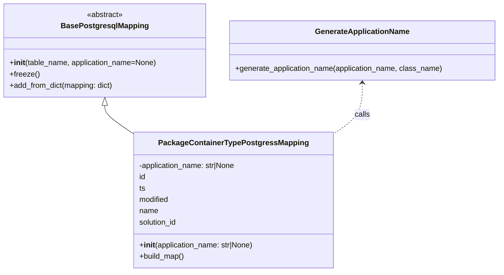

# Diagram: partview_core/partview_service/partview_service/persistence/sql/postgresql/PackageContainerTypePostgressMapping.py

> Auto-generated by Obscura crawlers

## Mermaid

### SVG

<svg id="container" width="1054.8984375" xmlns="http://www.w3.org/2000/svg" class="classDiagram" height="576" viewBox="0 0 1054.8984375 576" role="graphics-document document" aria-roledescription="class"><g><defs><marker id="container_class-aggregationStart" class="marker aggregation class" refX="18" refY="7" markerWidth="190" markerHeight="240" orient="auto"><path d="M 18,7 L9,13 L1,7 L9,1 Z"></path></marker></defs><defs><marker id="container_class-aggregationEnd" class="marker aggregation class" refX="1" refY="7" markerWidth="20" markerHeight="28" orient="auto"><path d="M 18,7 L9,13 L1,7 L9,1 Z"></path></marker></defs><defs><marker id="container_class-extensionStart" class="marker extension class" refX="18" refY="7" markerWidth="190" markerHeight="240" orient="auto"><path d="M 1,7 L18,13 V 1 Z"></path></marker></defs><defs><marker id="container_class-extensionEnd" class="marker extension class" refX="1" refY="7" markerWidth="20" markerHeight="28" orient="auto"><path d="M 1,1 V 13 L18,7 Z"></path></marker></defs><defs><marker id="container_class-compositionStart" class="marker composition class" refX="18" refY="7" markerWidth="190" markerHeight="240" orient="auto"><path d="M 18,7 L9,13 L1,7 L9,1 Z"></path></marker></defs><defs><marker id="container_class-compositionEnd" class="marker composition class" refX="1" refY="7" markerWidth="20" markerHeight="28" orient="auto"><path d="M 18,7 L9,13 L1,7 L9,1 Z"></path></marker></defs><defs><marker id="container_class-dependencyStart" class="marker dependency class" refX="6" refY="7" markerWidth="190" markerHeight="240" orient="auto"><path d="M 5,7 L9,13 L1,7 L9,1 Z"></path></marker></defs><defs><marker id="container_class-dependencyEnd" class="marker dependency class" refX="13" refY="7" markerWidth="20" markerHeight="28" orient="auto"><path d="M 18,7 L9,13 L14,7 L9,1 Z"></path></marker></defs><defs><marker id="container_class-lollipopStart" class="marker lollipop class" refX="13" refY="7" markerWidth="190" markerHeight="240" orient="auto"><circle stroke="black" fill="transparent" cx="7" cy="7" r="6"></circle></marker></defs><defs><marker id="container_class-lollipopEnd" class="marker lollipop class" refX="1" refY="7" markerWidth="190" markerHeight="240" orient="auto"><circle stroke="black" fill="transparent" cx="7" cy="7" r="6"></circle></marker></defs><g class="root"><g class="clusters"></g><g class="edgePaths"><path d="M220.836,223.25L220.836,226.542C220.836,229.833,220.836,236.417,231.216,246.61C241.597,256.804,262.358,270.608,272.739,277.51L283.119,284.412" id="id_BasePostgresqlMapping_PackageContainerTypePostgressMapping_1" class="edge-thickness-normal edge-pattern-solid relation" style=";;;" data-edge="true" data-et="edge" data-id="id_BasePostgresqlMapping_PackageContainerTypePostgressMapping_1" data-points="W3sieCI6MjIwLjgzNTkzNzUsInkiOjIwNn0seyJ4IjoyMjAuODM1OTM3NSwieSI6MjQzfSx7IngiOjI4My4xMTkxNDA2MjUsInkiOjI4NC40MTE2MTE1MDUzMn1d" marker-start="url(#container_class-extensionStart)"></path><path d="M765.285,176L765.285,187.167C765.285,198.333,765.285,220.667,754.905,238.735C744.524,256.804,723.763,270.608,713.382,277.51L703.002,284.412" id="id_GenerateApplicationName_PackageContainerTypePostgressMapping_2" class="edge-thickness-normal edge-pattern-dashed relation" style=";;;" data-edge="true" data-et="edge" data-id="id_GenerateApplicationName_PackageContainerTypePostgressMapping_2" data-points="W3sieCI6NzY1LjI4NTE1NjI1LCJ5IjoxNzB9LHsieCI6NzY1LjI4NTE1NjI1LCJ5IjoyNDN9LHsieCI6NzAzLjAwMTk1MzEyNSwieSI6Mjg0LjQxMTYxMTUwNTMyfV0=" marker-start="url(#container_class-dependencyStart)"></path></g><g class="edgeLabels"><g class="edgeLabel"><g class="label" data-id="id_BasePostgresqlMapping_PackageContainerTypePostgressMapping_1" transform="translate(0, 0)"><foreignObject width="0" height="0">

</foreignObject></g></g><g class="edgeLabel" transform="translate(765.28515625, 243)"><g class="label" data-id="id_GenerateApplicationName_PackageContainerTypePostgressMapping_2" transform="translate(-16.4453125, -12)"><foreignObject width="32.890625" height="24">

calls

</foreignObject></g></g></g><g class="nodes"><g class="node default" id="classId-BasePostgresqlMapping-0" transform="translate(220.8359375, 107)"><g class="basic label-container"><path d="M-212.8359375 -99 L212.8359375 -99 L212.8359375 99 L-212.8359375 99" stroke="none" stroke-width="0" fill="#ECECFF" style=""></path><path d="M-212.8359375 -99 C-97.44927674301792 -99, 17.937384013964163 -99, 212.8359375 -99 M-212.8359375 -99 C-111.56497941293176 -99, -10.294021325863525 -99, 212.8359375 -99 M212.8359375 -99 C212.8359375 -58.015648620726, 212.8359375 -17.031297241451995, 212.8359375 99 M212.8359375 -99 C212.8359375 -27.43205128220815, 212.8359375 44.1358974355837, 212.8359375 99 M212.8359375 99 C93.32799462180411 99, -26.179948256391782 99, -212.8359375 99 M212.8359375 99 C89.10923783404277 99, -34.617461831914454 99, -212.8359375 99 M-212.8359375 99 C-212.8359375 54.14657677127947, -212.8359375 9.29315354255894, -212.8359375 -99 M-212.8359375 99 C-212.8359375 21.6852459752743, -212.8359375 -55.6295080494514, -212.8359375 -99" stroke="#9370DB" stroke-width="1.3" fill="none" stroke-dasharray="0 0" style=""></path></g><g class="annotation-group text" transform="translate(-38.609375, -75)"><g class="label" style="" transform="translate(0,-12)"><foreignObject width="77.21875" height="24">

«abstract»

</foreignObject></g></g><g class="label-group text" transform="translate(-87.921875, -51)"><g class="label" style="font-weight: bolder" transform="translate(0,-12)"><foreignObject width="175.84375" height="24">

BasePostgresqlMapping

</foreignObject></g></g><g class="members-group text" transform="translate(-200.8359375, -3)"></g><g class="methods-group text" transform="translate(-200.8359375, 27)"><g class="label" style="" transform="translate(0,-12)"><foreignObject width="313.75" height="24">

+<strong>init</strong>(table_name, application_name=None)

</foreignObject></g><g class="label" style="" transform="translate(0,12)"><foreignObject width="62.109375" height="24">

+freeze()

</foreignObject></g><g class="label" style="" transform="translate(0,36)"><foreignObject width="222.796875" height="24">

+add_from_dict(mapping: dict)

</foreignObject></g></g><g class="divider" style=""><path d="M-212.8359375 -27 C-46.1783717166405 -27, 120.479194066719 -27, 212.8359375 -27 M-212.8359375 -27 C-110.71560679296411 -27, -8.59527608592822 -27, 212.8359375 -27" stroke="#9370DB" stroke-width="1.3" fill="none" stroke-dasharray="0 0" style=""></path></g><g class="divider" style=""><path d="M-212.8359375 -3 C-50.70306636398783 -3, 111.42980477202434 -3, 212.8359375 -3 M-212.8359375 -3 C-53.01463668278913 -3, 106.80666413442174 -3, 212.8359375 -3" stroke="#9370DB" stroke-width="1.3" fill="none" stroke-dasharray="0 0" style=""></path></g></g><g class="node default" id="classId-PackageContainerTypePostgressMapping-1" transform="translate(493.060546875, 424)"><g class="basic label-container"><path d="M-209.94140625 -144 L209.94140625 -144 L209.94140625 144 L-209.94140625 144" stroke="none" stroke-width="0" fill="#ECECFF" style=""></path><path d="M-209.94140625 -144 C-115.70964078223518 -144, -21.477875314470367 -144, 209.94140625 -144 M-209.94140625 -144 C-55.940207062368245 -144, 98.06099212526351 -144, 209.94140625 -144 M209.94140625 -144 C209.94140625 -70.45938470501343, 209.94140625 3.0812305899731314, 209.94140625 144 M209.94140625 -144 C209.94140625 -48.12187634846461, 209.94140625 47.75624730307078, 209.94140625 144 M209.94140625 144 C110.79103334409645 144, 11.640660438192896 144, -209.94140625 144 M209.94140625 144 C125.47487756983921 144, 41.008348889678416 144, -209.94140625 144 M-209.94140625 144 C-209.94140625 81.00601634781812, -209.94140625 18.012032695636236, -209.94140625 -144 M-209.94140625 144 C-209.94140625 33.33282967021887, -209.94140625 -77.33434065956226, -209.94140625 -144" stroke="#9370DB" stroke-width="1.3" fill="none" stroke-dasharray="0 0" style=""></path></g><g class="annotation-group text" transform="translate(0, -120)"></g><g class="label-group text" transform="translate(-149.8203125, -120)"><g class="label" style="font-weight: bolder" transform="translate(0,-12)"><foreignObject width="299.640625" height="24">

PackageContainerTypePostgressMapping

</foreignObject></g></g><g class="members-group text" transform="translate(-197.94140625, -72)"><g class="label" style="" transform="translate(0,-12)"><foreignObject width="209.484375" height="24">

-application_name: str|None

</foreignObject></g><g class="label" style="" transform="translate(0,12)"><foreignObject width="14.09375" height="24">

id

</foreignObject></g><g class="label" style="" transform="translate(0,36)"><foreignObject width="13.25" height="24">

ts

</foreignObject></g><g class="label" style="" transform="translate(0,60)"><foreignObject width="64.625" height="24">

modified

</foreignObject></g><g class="label" style="" transform="translate(0,84)"><foreignObject width="40.515625" height="24">

name

</foreignObject></g><g class="label" style="" transform="translate(0,108)"><foreignObject width="82.234375" height="24">

solution_id

</foreignObject></g></g><g class="methods-group text" transform="translate(-197.94140625, 96)"><g class="label" style="" transform="translate(0,-12)"><foreignObject width="246.0625" height="24">

+<strong>init</strong>(application_name: str|None)

</foreignObject></g><g class="label" style="" transform="translate(0,12)"><foreignObject width="96.109375" height="24">

+build_map()

</foreignObject></g></g><g class="divider" style=""><path d="M-209.94140625 -96 C-118.36380801796038 -96, -26.78620978592076 -96, 209.94140625 -96 M-209.94140625 -96 C-78.48843308560402 -96, 52.96454007879197 -96, 209.94140625 -96" stroke="#9370DB" stroke-width="1.3" fill="none" stroke-dasharray="0 0" style=""></path></g><g class="divider" style=""><path d="M-209.94140625 72 C-115.72834278640825 72, -21.515279322816497 72, 209.94140625 72 M-209.94140625 72 C-125.80929451835783 72, -41.67718278671566 72, 209.94140625 72" stroke="#9370DB" stroke-width="1.3" fill="none" stroke-dasharray="0 0" style=""></path></g></g><g class="node default" id="classId-GenerateApplicationName-2" transform="translate(765.28515625, 107)"><g class="basic label-container"><path d="M-281.61328125 -63 L281.61328125 -63 L281.61328125 63 L-281.61328125 63" stroke="none" stroke-width="0" fill="#ECECFF" style=""></path><path d="M-281.61328125 -63 C-109.44092851676399 -63, 62.73142421647202 -63, 281.61328125 -63 M-281.61328125 -63 C-163.7218553587269 -63, -45.830429467453826 -63, 281.61328125 -63 M281.61328125 -63 C281.61328125 -28.93893518879024, 281.61328125 5.122129622419521, 281.61328125 63 M281.61328125 -63 C281.61328125 -33.266277839876366, 281.61328125 -3.5325556797527256, 281.61328125 63 M281.61328125 63 C146.5903975179034 63, 11.567513785806796 63, -281.61328125 63 M281.61328125 63 C100.93526935275929 63, -79.74274254448142 63, -281.61328125 63 M-281.61328125 63 C-281.61328125 13.675508446418256, -281.61328125 -35.64898310716349, -281.61328125 -63 M-281.61328125 63 C-281.61328125 28.509505126723425, -281.61328125 -5.980989746553149, -281.61328125 -63" stroke="#9370DB" stroke-width="1.3" fill="none" stroke-dasharray="0 0" style=""></path></g><g class="annotation-group text" transform="translate(0, -39)"></g><g class="label-group text" transform="translate(-95.8203125, -39)"><g class="label" style="font-weight: bolder" transform="translate(0,-12)"><foreignObject width="191.640625" height="24">

GenerateApplicationName

</foreignObject></g></g><g class="members-group text" transform="translate(-269.61328125, 9)"></g><g class="methods-group text" transform="translate(-269.61328125, 39)"><g class="label" style="" transform="translate(0,-12)"><foreignObject width="443.40625" height="24">

+generate_application_name(application_name, class_name)

</foreignObject></g></g><g class="divider" style=""><path d="M-281.61328125 -15 C-86.07473178207408 -15, 109.46381768585184 -15, 281.61328125 -15 M-281.61328125 -15 C-86.94487066824337 -15, 107.72353991351326 -15, 281.61328125 -15" stroke="#9370DB" stroke-width="1.3" fill="none" stroke-dasharray="0 0" style=""></path></g><g class="divider" style=""><path d="M-281.61328125 9 C-149.14020611552496 9, -16.667130981049922 9, 281.61328125 9 M-281.61328125 9 C-165.55637467220532 9, -49.49946809441067 9, 281.61328125 9" stroke="#9370DB" stroke-width="1.3" fill="none" stroke-dasharray="0 0" style=""></path></g></g></g></g></g></svg>
