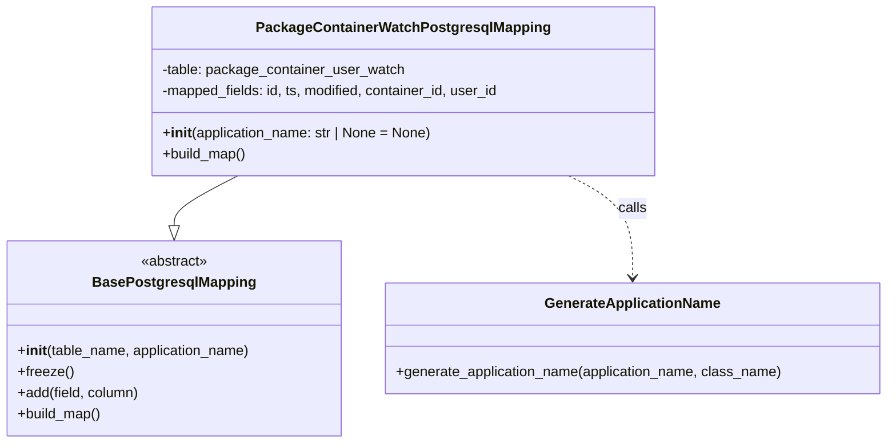

# Diagram: partview_core/partview_service/partview_service/persistence/sql/postgresql/PackageContainerWatchPostgresqlMapping.py

> Auto-generated by Obscura crawlers

## Mermaid

### SVG

<svg id="container" width="1008.5234375" xmlns="http://www.w3.org/2000/svg" class="classDiagram" height="504" viewBox="0 0 1008.5234375 504" role="graphics-document document" aria-roledescription="class"><g><defs><marker id="container_class-aggregationStart" class="marker aggregation class" refX="18" refY="7" markerWidth="190" markerHeight="240" orient="auto"><path d="M 18,7 L9,13 L1,7 L9,1 Z"></path></marker></defs><defs><marker id="container_class-aggregationEnd" class="marker aggregation class" refX="1" refY="7" markerWidth="20" markerHeight="28" orient="auto"><path d="M 18,7 L9,13 L1,7 L9,1 Z"></path></marker></defs><defs><marker id="container_class-extensionStart" class="marker extension class" refX="18" refY="7" markerWidth="190" markerHeight="240" orient="auto"><path d="M 1,7 L18,13 V 1 Z"></path></marker></defs><defs><marker id="container_class-extensionEnd" class="marker extension class" refX="1" refY="7" markerWidth="20" markerHeight="28" orient="auto"><path d="M 1,1 V 13 L18,7 Z"></path></marker></defs><defs><marker id="container_class-compositionStart" class="marker composition class" refX="18" refY="7" markerWidth="190" markerHeight="240" orient="auto"><path d="M 18,7 L9,13 L1,7 L9,1 Z"></path></marker></defs><defs><marker id="container_class-compositionEnd" class="marker composition class" refX="1" refY="7" markerWidth="20" markerHeight="28" orient="auto"><path d="M 18,7 L9,13 L1,7 L9,1 Z"></path></marker></defs><defs><marker id="container_class-dependencyStart" class="marker dependency class" refX="6" refY="7" markerWidth="190" markerHeight="240" orient="auto"><path d="M 5,7 L9,13 L1,7 L9,1 Z"></path></marker></defs><defs><marker id="container_class-dependencyEnd" class="marker dependency class" refX="13" refY="7" markerWidth="20" markerHeight="28" orient="auto"><path d="M 18,7 L9,13 L14,7 L9,1 Z"></path></marker></defs><defs><marker id="container_class-lollipopStart" class="marker lollipop class" refX="13" refY="7" markerWidth="190" markerHeight="240" orient="auto"><circle stroke="black" fill="transparent" cx="7" cy="7" r="6"></circle></marker></defs><defs><marker id="container_class-lollipopEnd" class="marker lollipop class" refX="1" refY="7" markerWidth="190" markerHeight="240" orient="auto"><circle stroke="black" fill="transparent" cx="7" cy="7" r="6"></circle></marker></defs><g class="root"><g class="clusters"></g><g class="edgePaths"><path d="M270.155,200L258.07,206.167C245.986,212.333,221.817,224.667,209.733,234.125C197.648,243.583,197.648,250.167,197.648,253.458L197.648,256.75" id="id_PackageContainerWatchPostgresqlMapping_BasePostgresqlMapping_1" class="edge-thickness-normal edge-pattern-solid relation" style=";;;" data-edge="true" data-et="edge" data-id="id_PackageContainerWatchPostgresqlMapping_BasePostgresqlMapping_1" data-points="W3sieCI6MjcwLjE1NDc2Njc5OTgxMiwieSI6MjAwfSx7IngiOjE5Ny42NDg0Mzc1LCJ5IjoyMzd9LHsieCI6MTk3LjY0ODQzNzUsInkiOjI3NH1d" marker-end="url(#container_class-extensionEnd)"></path><path d="M646.404,200L658.488,206.167C670.573,212.333,694.741,224.667,706.826,244C718.91,263.333,718.91,289.667,718.91,302.833L718.91,316" id="id_PackageContainerWatchPostgresqlMapping_GenerateApplicationName_2" class="edge-thickness-normal edge-pattern-dashed relation" style=";;;" data-edge="true" data-et="edge" data-id="id_PackageContainerWatchPostgresqlMapping_GenerateApplicationName_2" data-points="W3sieCI6NjQ2LjQwMzgyNjk1MDE4OCwieSI6MjAwfSx7IngiOjcxOC45MTAxNTYyNSwieSI6MjM3fSx7IngiOjcxOC45MTAxNTYyNSwieSI6MzIyfV0=" marker-end="url(#container_class-dependencyEnd)"></path></g><g class="edgeLabels"><g class="edgeLabel"><g class="label" data-id="id_PackageContainerWatchPostgresqlMapping_BasePostgresqlMapping_1" transform="translate(0, 0)"><foreignObject width="0" height="0">

</foreignObject></g></g><g class="edgeLabel" transform="translate(718.91015625, 237)"><g class="label" data-id="id_PackageContainerWatchPostgresqlMapping_GenerateApplicationName_2" transform="translate(-16.4453125, -12)"><foreignObject width="32.890625" height="24">

calls

</foreignObject></g></g></g><g class="nodes"><g class="node default" id="classId-BasePostgresqlMapping-0" transform="translate(197.6484375, 385)"><g class="basic label-container"><path d="M-189.6484375 -111 L189.6484375 -111 L189.6484375 111 L-189.6484375 111" stroke="none" stroke-width="0" fill="#ECECFF" style=""></path><path d="M-189.6484375 -111 C-105.50695897852172 -111, -21.365480457043446 -111, 189.6484375 -111 M-189.6484375 -111 C-106.92954570003077 -111, -24.210653900061544 -111, 189.6484375 -111 M189.6484375 -111 C189.6484375 -41.77373859384322, 189.6484375 27.45252281231356, 189.6484375 111 M189.6484375 -111 C189.6484375 -62.66294123072228, 189.6484375 -14.325882461444564, 189.6484375 111 M189.6484375 111 C81.82103937001428 111, -26.006358759971448 111, -189.6484375 111 M189.6484375 111 C109.0910433799112 111, 28.533649259822397 111, -189.6484375 111 M-189.6484375 111 C-189.6484375 39.44142427607366, -189.6484375 -32.11715144785268, -189.6484375 -111 M-189.6484375 111 C-189.6484375 22.25678181034617, -189.6484375 -66.48643637930766, -189.6484375 -111" stroke="#9370DB" stroke-width="1.3" fill="none" stroke-dasharray="0 0" style=""></path></g><g class="annotation-group text" transform="translate(-38.609375, -87)"><g class="label" style="" transform="translate(0,-12)"><foreignObject width="77.21875" height="24">

«abstract»

</foreignObject></g></g><g class="label-group text" transform="translate(-87.921875, -63)"><g class="label" style="font-weight: bolder" transform="translate(0,-12)"><foreignObject width="175.84375" height="24">

BasePostgresqlMapping

</foreignObject></g></g><g class="members-group text" transform="translate(-177.6484375, -15)"></g><g class="methods-group text" transform="translate(-177.6484375, 15)"><g class="label" style="" transform="translate(0,-12)"><foreignObject width="267.375" height="24">

+<strong>init</strong>(table_name, application_name)

</foreignObject></g><g class="label" style="" transform="translate(0,12)"><foreignObject width="62.109375" height="24">

+freeze()

</foreignObject></g><g class="label" style="" transform="translate(0,36)"><foreignObject width="139.890625" height="24">

+add(field, column)

</foreignObject></g><g class="label" style="" transform="translate(0,60)"><foreignObject width="96.109375" height="24">

+build_map()

</foreignObject></g></g><g class="divider" style=""><path d="M-189.6484375 -39 C-40.726153243384914 -39, 108.19613101323017 -39, 189.6484375 -39 M-189.6484375 -39 C-55.65741965970534 -39, 78.33359818058932 -39, 189.6484375 -39" stroke="#9370DB" stroke-width="1.3" fill="none" stroke-dasharray="0 0" style=""></path></g><g class="divider" style=""><path d="M-189.6484375 -15 C-73.0075806350101 -15, 43.6332762299798 -15, 189.6484375 -15 M-189.6484375 -15 C-38.77170103954535 -15, 112.1050354209093 -15, 189.6484375 -15" stroke="#9370DB" stroke-width="1.3" fill="none" stroke-dasharray="0 0" style=""></path></g></g><g class="node default" id="classId-PackageContainerWatchPostgresqlMapping-1" transform="translate(458.279296875, 104)"><g class="basic label-container"><path d="M-285.68359375 -96 L285.68359375 -96 L285.68359375 96 L-285.68359375 96" stroke="none" stroke-width="0" fill="#ECECFF" style=""></path><path d="M-285.68359375 -96 C-155.7233681344014 -96, -25.763142518802795 -96, 285.68359375 -96 M-285.68359375 -96 C-136.9700866985722 -96, 11.743420352855594 -96, 285.68359375 -96 M285.68359375 -96 C285.68359375 -50.85289989382667, 285.68359375 -5.7057997876533335, 285.68359375 96 M285.68359375 -96 C285.68359375 -20.34353329804088, 285.68359375 55.31293340391824, 285.68359375 96 M285.68359375 96 C105.90604976174782 96, -73.87149422650435 96, -285.68359375 96 M285.68359375 96 C63.76089381659037 96, -158.16180611681926 96, -285.68359375 96 M-285.68359375 96 C-285.68359375 25.07234213449952, -285.68359375 -45.85531573100096, -285.68359375 -96 M-285.68359375 96 C-285.68359375 35.441300613726185, -285.68359375 -25.11739877254763, -285.68359375 -96" stroke="#9370DB" stroke-width="1.3" fill="none" stroke-dasharray="0 0" style=""></path></g><g class="annotation-group text" transform="translate(0, -72)"></g><g class="label-group text" transform="translate(-158.1640625, -72)"><g class="label" style="font-weight: bolder" transform="translate(0,-12)"><foreignObject width="316.328125" height="24">

PackageContainerWatchPostgresqlMapping

</foreignObject></g></g><g class="members-group text" transform="translate(-273.68359375, -24)"><g class="label" style="" transform="translate(0,-12)"><foreignObject width="275.171875" height="24">

-table: package_container_user_watch

</foreignObject></g><g class="label" style="" transform="translate(0,12)"><foreignObject width="389.203125" height="24">

-mapped_fields: id, ts, modified, container_id, user_id

</foreignObject></g></g><g class="methods-group text" transform="translate(-273.68359375, 48)"><g class="label" style="" transform="translate(0,-12)"><foreignObject width="309.390625" height="24">

+<strong>init</strong>(application_name: str | None = None)

</foreignObject></g><g class="label" style="" transform="translate(0,12)"><foreignObject width="96.109375" height="24">

+build_map()

</foreignObject></g></g><g class="divider" style=""><path d="M-285.68359375 -48 C-104.53990168517953 -48, 76.60379037964094 -48, 285.68359375 -48 M-285.68359375 -48 C-144.99193306833553 -48, -4.300272386671054 -48, 285.68359375 -48" stroke="#9370DB" stroke-width="1.3" fill="none" stroke-dasharray="0 0" style=""></path></g><g class="divider" style=""><path d="M-285.68359375 24 C-104.43027198256851 24, 76.82304978486297 24, 285.68359375 24 M-285.68359375 24 C-106.90180509301592 24, 71.87998356396815 24, 285.68359375 24" stroke="#9370DB" stroke-width="1.3" fill="none" stroke-dasharray="0 0" style=""></path></g></g><g class="node default" id="classId-GenerateApplicationName-2" transform="translate(718.91015625, 385)"><g class="basic label-container"><path d="M-281.61328125 -63 L281.61328125 -63 L281.61328125 63 L-281.61328125 63" stroke="none" stroke-width="0" fill="#ECECFF" style=""></path><path d="M-281.61328125 -63 C-93.23790595371133 -63, 95.13746934257733 -63, 281.61328125 -63 M-281.61328125 -63 C-135.45848130885244 -63, 10.696318632295117 -63, 281.61328125 -63 M281.61328125 -63 C281.61328125 -25.832035424682736, 281.61328125 11.335929150634527, 281.61328125 63 M281.61328125 -63 C281.61328125 -29.654251710239976, 281.61328125 3.6914965795200487, 281.61328125 63 M281.61328125 63 C158.83547114720358 63, 36.057661044407155 63, -281.61328125 63 M281.61328125 63 C93.32737709959434 63, -94.95852705081131 63, -281.61328125 63 M-281.61328125 63 C-281.61328125 13.070446767350447, -281.61328125 -36.85910646529911, -281.61328125 -63 M-281.61328125 63 C-281.61328125 25.00390969880398, -281.61328125 -12.99218060239204, -281.61328125 -63" stroke="#9370DB" stroke-width="1.3" fill="none" stroke-dasharray="0 0" style=""></path></g><g class="annotation-group text" transform="translate(0, -39)"></g><g class="label-group text" transform="translate(-95.8203125, -39)"><g class="label" style="font-weight: bolder" transform="translate(0,-12)"><foreignObject width="191.640625" height="24">

GenerateApplicationName

</foreignObject></g></g><g class="members-group text" transform="translate(-269.61328125, 9)"></g><g class="methods-group text" transform="translate(-269.61328125, 39)"><g class="label" style="" transform="translate(0,-12)"><foreignObject width="443.40625" height="24">

+generate_application_name(application_name, class_name)

</foreignObject></g></g><g class="divider" style=""><path d="M-281.61328125 -15 C-165.57695546700734 -15, -49.540629684014675 -15, 281.61328125 -15 M-281.61328125 -15 C-60.257251364599966 -15, 161.09877852080007 -15, 281.61328125 -15" stroke="#9370DB" stroke-width="1.3" fill="none" stroke-dasharray="0 0" style=""></path></g><g class="divider" style=""><path d="M-281.61328125 9 C-108.67632282020017 9, 64.26063560959966 9, 281.61328125 9 M-281.61328125 9 C-57.90753878292452 9, 165.79820368415096 9, 281.61328125 9" stroke="#9370DB" stroke-width="1.3" fill="none" stroke-dasharray="0 0" style=""></path></g></g></g></g></g></svg>
