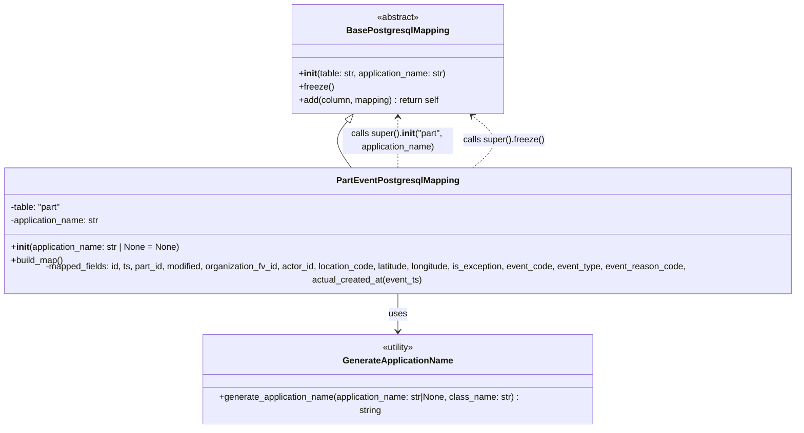

# Diagram: partview_core/partview_service/partview_service/persistence/sql/postgresql/PartEventPostgresqlMapping.py

> Auto-generated by Obscura crawlers

## Mermaid

### SVG

<svg id="container" width="1532.5703125" xmlns="http://www.w3.org/2000/svg" class="classDiagram" height="752" viewBox="0 0 1532.5703125 752" role="graphics-document document" aria-roledescription="class"><g><defs><marker id="container_class-aggregationStart" class="marker aggregation class" refX="18" refY="7" markerWidth="190" markerHeight="240" orient="auto"><path d="M 18,7 L9,13 L1,7 L9,1 Z"></path></marker></defs><defs><marker id="container_class-aggregationEnd" class="marker aggregation class" refX="1" refY="7" markerWidth="20" markerHeight="28" orient="auto"><path d="M 18,7 L9,13 L1,7 L9,1 Z"></path></marker></defs><defs><marker id="container_class-extensionStart" class="marker extension class" refX="18" refY="7" markerWidth="190" markerHeight="240" orient="auto"><path d="M 1,7 L18,13 V 1 Z"></path></marker></defs><defs><marker id="container_class-extensionEnd" class="marker extension class" refX="1" refY="7" markerWidth="20" markerHeight="28" orient="auto"><path d="M 1,1 V 13 L18,7 Z"></path></marker></defs><defs><marker id="container_class-compositionStart" class="marker composition class" refX="18" refY="7" markerWidth="190" markerHeight="240" orient="auto"><path d="M 18,7 L9,13 L1,7 L9,1 Z"></path></marker></defs><defs><marker id="container_class-compositionEnd" class="marker composition class" refX="1" refY="7" markerWidth="20" markerHeight="28" orient="auto"><path d="M 18,7 L9,13 L1,7 L9,1 Z"></path></marker></defs><defs><marker id="container_class-dependencyStart" class="marker dependency class" refX="6" refY="7" markerWidth="190" markerHeight="240" orient="auto"><path d="M 5,7 L9,13 L1,7 L9,1 Z"></path></marker></defs><defs><marker id="container_class-dependencyEnd" class="marker dependency class" refX="13" refY="7" markerWidth="20" markerHeight="28" orient="auto"><path d="M 18,7 L9,13 L14,7 L9,1 Z"></path></marker></defs><defs><marker id="container_class-lollipopStart" class="marker lollipop class" refX="13" refY="7" markerWidth="190" markerHeight="240" orient="auto"><circle stroke="black" fill="transparent" cx="7" cy="7" r="6"></circle></marker></defs><defs><marker id="container_class-lollipopEnd" class="marker lollipop class" refX="1" refY="7" markerWidth="190" markerHeight="240" orient="auto"><circle stroke="black" fill="transparent" cx="7" cy="7" r="6"></circle></marker></defs><g class="root"><g class="clusters"></g><g class="edgePaths"><path d="M675.151,219.399L670.34,225.333C665.529,231.266,655.907,243.133,657.338,257.233C658.769,271.333,671.253,287.667,677.495,295.833L683.737,304" id="id_BasePostgresqlMapping_PartEventPostgresqlMapping_1" class="edge-thickness-normal edge-pattern-solid relation" style=";;;" data-edge="true" data-et="edge" data-id="id_BasePostgresqlMapping_PartEventPostgresqlMapping_1" data-points="W3sieCI6Njg2LjAxNDg4NTk3OTcyOTcsInkiOjIwNn0seyJ4Ijo2NDYuMjg1MTU2MjUsInkiOjI1NX0seyJ4Ijo2ODMuNzM3Mzg1NTQ5MzYzLCJ5IjozMDR9XQ==" marker-start="url(#container_class-extensionStart)"></path><path d="M766.285,520L766.285,526.167C766.285,532.333,766.285,544.667,766.285,556C766.285,567.333,766.285,577.667,766.285,582.833L766.285,588" id="id_PartEventPostgresqlMapping_GenerateApplicationName_2" class="edge-thickness-normal edge-pattern-solid relation" style=";;;" data-edge="true" data-et="edge" data-id="id_PartEventPostgresqlMapping_GenerateApplicationName_2" data-points="W3sieCI6NzY2LjI4NTE1NjI1LCJ5Ijo1MjB9LHsieCI6NzY2LjI4NTE1NjI1LCJ5Ijo1NTd9LHsieCI6NzY2LjI4NTE1NjI1LCJ5Ijo1OTR9XQ==" marker-end="url(#container_class-dependencyEnd)"></path><path d="M766.285,304L766.285,295.833C766.285,287.667,766.285,271.333,766.285,256C766.285,240.667,766.285,226.333,766.285,219.167L766.285,212" id="id_PartEventPostgresqlMapping_BasePostgresqlMapping_3" class="edge-thickness-normal edge-pattern-dashed relation" style=";;;" data-edge="true" data-et="edge" data-id="id_PartEventPostgresqlMapping_BasePostgresqlMapping_3" data-points="W3sieCI6NzY2LjI4NTE1NjI1LCJ5IjozMDR9LHsieCI6NzY2LjI4NTE1NjI1LCJ5IjoyNTV9LHsieCI6NzY2LjI4NTE1NjI1LCJ5IjoyMDZ9XQ==" marker-end="url(#container_class-dependencyEnd)"></path><path d="M899.27,304L909.326,295.833C919.382,287.667,939.494,271.333,939.676,255.608C939.859,239.882,920.112,224.765,910.238,217.206L900.365,209.647" id="id_PartEventPostgresqlMapping_BasePostgresqlMapping_4" class="edge-thickness-normal edge-pattern-dashed relation" style=";;;" data-edge="true" data-et="edge" data-id="id_PartEventPostgresqlMapping_BasePostgresqlMapping_4" data-points="W3sieCI6ODk5LjI2OTgyOTgxNjg3OSwieSI6MzA0fSx7IngiOjk1OS42MDU0Njg3NSwieSI6MjU1fSx7IngiOjg5NS42MDA3NzA2OTI1Njc2LCJ5IjoyMDZ9XQ==" marker-end="url(#container_class-dependencyEnd)"></path></g><g class="edgeLabels"><g class="edgeLabel"><g class="label" data-id="id_BasePostgresqlMapping_PartEventPostgresqlMapping_1" transform="translate(0, 0)"><foreignObject width="0" height="0">

</foreignObject></g></g><g class="edgeLabel" transform="translate(766.28515625, 557)"><g class="label" data-id="id_PartEventPostgresqlMapping_GenerateApplicationName_2" transform="translate(-16.4921875, -12)"><foreignObject width="32.984375" height="24">

uses

</foreignObject></g></g><g class="edgeLabel" transform="translate(766.28515625, 255)"><g class="label" data-id="id_PartEventPostgresqlMapping_BasePostgresqlMapping_3" transform="translate(-100, -24)"><foreignObject width="200" height="48">

calls super().<strong>init</strong>("part", application_name)

</foreignObject></g></g><g class="edgeLabel" transform="translate(958.46154, 254.12425)"><g class="label" data-id="id_PartEventPostgresqlMapping_BasePostgresqlMapping_4" transform="translate(-73.3203125, -12)"><foreignObject width="146.640625" height="24">

calls super().freeze()

</foreignObject></g></g></g><g class="nodes"><g class="node default" id="classId-BasePostgresqlMapping-0" transform="translate(766.28515625, 107)"><g class="basic label-container"><path d="M-192.3359375 -99 L192.3359375 -99 L192.3359375 99 L-192.3359375 99" stroke="none" stroke-width="0" fill="#ECECFF" style=""></path><path d="M-192.3359375 -99 C-60.75597728634699 -99, 70.82398292730602 -99, 192.3359375 -99 M-192.3359375 -99 C-46.229442036492685 -99, 99.87705342701463 -99, 192.3359375 -99 M192.3359375 -99 C192.3359375 -25.015778070593342, 192.3359375 48.968443858813316, 192.3359375 99 M192.3359375 -99 C192.3359375 -48.377566432306345, 192.3359375 2.2448671353873095, 192.3359375 99 M192.3359375 99 C63.573063436200016 99, -65.18981062759997 99, -192.3359375 99 M192.3359375 99 C70.56926360707534 99, -51.197410285849315 99, -192.3359375 99 M-192.3359375 99 C-192.3359375 27.838760446721537, -192.3359375 -43.322479106556926, -192.3359375 -99 M-192.3359375 99 C-192.3359375 51.31393555314849, -192.3359375 3.627871106296979, -192.3359375 -99" stroke="#9370DB" stroke-width="1.3" fill="none" stroke-dasharray="0 0" style=""></path></g><g class="annotation-group text" transform="translate(-38.609375, -75)"><g class="label" style="" transform="translate(0,-12)"><foreignObject width="77.21875" height="24">

«abstract»

</foreignObject></g></g><g class="label-group text" transform="translate(-87.921875, -51)"><g class="label" style="font-weight: bolder" transform="translate(0,-12)"><foreignObject width="175.84375" height="24">

BasePostgresqlMapping

</foreignObject></g></g><g class="members-group text" transform="translate(-180.3359375, -3)"></g><g class="methods-group text" transform="translate(-180.3359375, 27)"><g class="label" style="" transform="translate(0,-12)"><foreignObject width="272.75" height="24">

+<strong>init</strong>(table: str, application_name: str)

</foreignObject></g><g class="label" style="" transform="translate(0,12)"><foreignObject width="62.109375" height="24">

+freeze()

</foreignObject></g><g class="label" style="" transform="translate(0,36)"><foreignObject width="259.28125" height="24">

+add(column, mapping) : return self

</foreignObject></g></g><g class="divider" style=""><path d="M-192.3359375 -27 C-62.55007405098502 -27, 67.23578939802997 -27, 192.3359375 -27 M-192.3359375 -27 C-79.94631399762464 -27, 32.443309504750715 -27, 192.3359375 -27" stroke="#9370DB" stroke-width="1.3" fill="none" stroke-dasharray="0 0" style=""></path></g><g class="divider" style=""><path d="M-192.3359375 -3 C-47.50318189402171 -3, 97.32957371195658 -3, 192.3359375 -3 M-192.3359375 -3 C-62.0238731839392 -3, 68.2881911321216 -3, 192.3359375 -3" stroke="#9370DB" stroke-width="1.3" fill="none" stroke-dasharray="0 0" style=""></path></g></g><g class="node default" id="classId-PartEventPostgresqlMapping-1" transform="translate(766.28515625, 412)"><g class="basic label-container"><path d="M-758.28515625 -108 L758.28515625 -108 L758.28515625 108 L-758.28515625 108" stroke="none" stroke-width="0" fill="#ECECFF" style=""></path><path d="M-758.28515625 -108 C-347.63534378168066 -108, 63.01446868663868 -108, 758.28515625 -108 M-758.28515625 -108 C-189.47382018066503 -108, 379.33751588866994 -108, 758.28515625 -108 M758.28515625 -108 C758.28515625 -24.723835935810285, 758.28515625 58.55232812837943, 758.28515625 108 M758.28515625 -108 C758.28515625 -59.589074174953126, 758.28515625 -11.178148349906252, 758.28515625 108 M758.28515625 108 C408.55710654426974 108, 58.829056838539486 108, -758.28515625 108 M758.28515625 108 C223.4402846627853 108, -311.4045869244294 108, -758.28515625 108 M-758.28515625 108 C-758.28515625 34.40149162802828, -758.28515625 -39.197016743943436, -758.28515625 -108 M-758.28515625 108 C-758.28515625 37.49868529584802, -758.28515625 -33.00262940830396, -758.28515625 -108" stroke="#9370DB" stroke-width="1.3" fill="none" stroke-dasharray="0 0" style=""></path></g><g class="annotation-group text" transform="translate(0, -84)"></g><g class="label-group text" transform="translate(-105.6796875, -84)"><g class="label" style="font-weight: bolder" transform="translate(0,-12)"><foreignObject width="211.359375" height="24">

PartEventPostgresqlMapping

</foreignObject></g></g><g class="members-group text" transform="translate(-746.28515625, -36)"><g class="label" style="" transform="translate(0,-12)"><foreignObject width="94.1875" height="24">

-table: "part"

</foreignObject></g><g class="label" style="" transform="translate(0,12)"><foreignObject width="164.671875" height="24">

-application_name: str

</foreignObject></g></g><g class="methods-group text" transform="translate(-746.28515625, 36)"><g class="label" style="" transform="translate(0,-12)"><foreignObject width="309.390625" height="24">

+<strong>init</strong>(application_name: str | None = None)

</foreignObject></g><g class="label" style="" transform="translate(0,12)"><foreignObject width="96.109375" height="24">

+build_map()

</foreignObject></g><g class="label" style="" transform="translate(0,36)"><foreignObject width="1386.890625" height="24">

-mapped_fields: id, ts, part_id, modified, organization_fv_id, actor_id, location_code, latitude, longitude, is_exception, event_code, event_type, event_reason_code, actual_created_at(event_ts)

</foreignObject></g></g><g class="divider" style=""><path d="M-758.28515625 -60 C-299.63365145413024 -60, 159.0178533417395 -60, 758.28515625 -60 M-758.28515625 -60 C-426.3584647713748 -60, -94.43177329274965 -60, 758.28515625 -60" stroke="#9370DB" stroke-width="1.3" fill="none" stroke-dasharray="0 0" style=""></path></g><g class="divider" style=""><path d="M-758.28515625 12 C-163.6022720302674 12, 431.0806121894652 12, 758.28515625 12 M-758.28515625 12 C-200.27872393615644 12, 357.7277083776871 12, 758.28515625 12" stroke="#9370DB" stroke-width="1.3" fill="none" stroke-dasharray="0 0" style=""></path></g></g><g class="node default" id="classId-GenerateApplicationName-2" transform="translate(766.28515625, 669)"><g class="basic label-container"><path d="M-358.49609375 -75 L358.49609375 -75 L358.49609375 75 L-358.49609375 75" stroke="none" stroke-width="0" fill="#ECECFF" style=""></path><path d="M-358.49609375 -75 C-180.7106953292181 -75, -2.9252969084362235 -75, 358.49609375 -75 M-358.49609375 -75 C-98.20368317517926 -75, 162.08872739964147 -75, 358.49609375 -75 M358.49609375 -75 C358.49609375 -29.83631473226947, 358.49609375 15.327370535461057, 358.49609375 75 M358.49609375 -75 C358.49609375 -27.021311227793696, 358.49609375 20.95737754441261, 358.49609375 75 M358.49609375 75 C209.64392562392368 75, 60.79175749784736 75, -358.49609375 75 M358.49609375 75 C79.64145475565391 75, -199.21318423869218 75, -358.49609375 75 M-358.49609375 75 C-358.49609375 38.940145467375544, -358.49609375 2.8802909347510877, -358.49609375 -75 M-358.49609375 75 C-358.49609375 42.5562279510695, -358.49609375 10.112455902139004, -358.49609375 -75" stroke="#9370DB" stroke-width="1.3" fill="none" stroke-dasharray="0 0" style=""></path></g><g class="annotation-group text" transform="translate(-30.3125, -51)"><g class="label" style="" transform="translate(0,-12)"><foreignObject width="60.625" height="24">

«utility»

</foreignObject></g></g><g class="label-group text" transform="translate(-95.8203125, -27)"><g class="label" style="font-weight: bolder" transform="translate(0,-12)"><foreignObject width="191.640625" height="24">

GenerateApplicationName

</foreignObject></g></g><g class="members-group text" transform="translate(-346.49609375, 21)"></g><g class="methods-group text" transform="translate(-346.49609375, 51)"><g class="label" style="" transform="translate(0,-12)"><foreignObject width="597.171875" height="24">

+generate_application_name(application_name: str|None, class_name: str) : string

</foreignObject></g></g><g class="divider" style=""><path d="M-358.49609375 -3 C-127.84654479173315 -3, 102.8030041665337 -3, 358.49609375 -3 M-358.49609375 -3 C-98.05505617916072 -3, 162.38598139167857 -3, 358.49609375 -3" stroke="#9370DB" stroke-width="1.3" fill="none" stroke-dasharray="0 0" style=""></path></g><g class="divider" style=""><path d="M-358.49609375 21 C-82.55043791917382 21, 193.39521791165237 21, 358.49609375 21 M-358.49609375 21 C-139.4364104427816 21, 79.62327286443679 21, 358.49609375 21" stroke="#9370DB" stroke-width="1.3" fill="none" stroke-dasharray="0 0" style=""></path></g></g></g></g></g></svg>
