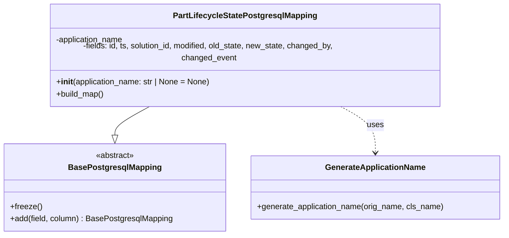

# Diagram: partview_core/partview_service/partview_service/persistence/sql/postgresql/PartLifecycleStatePostgresqlMapping.py


> Auto-generated by Obscura crawlers

## Diagram 1



### SVG

<svg id="container" width="996.3515625" xmlns="http://www.w3.org/2000/svg" class="classDiagram" height="456" viewBox="0 0 996.3515625 456" role="graphics-document document" aria-roledescription="class"><style>#container{font-family:"trebuchet ms",verdana,arial,sans-serif;font-size:16px;fill:#333;}@keyframes edge-animation-frame{from{stroke-dashoffset:0;}}@keyframes dash{to{stroke-dashoffset:0;}}#container .edge-animation-slow{stroke-dasharray:9,5!important;stroke-dashoffset:900;animation:dash 50s linear infinite;stroke-linecap:round;}#container .edge-animation-fast{stroke-dasharray:9,5!important;stroke-dashoffset:900;animation:dash 20s linear infinite;stroke-linecap:round;}#container .error-icon{fill:#552222;}#container .error-text{fill:#552222;stroke:#552222;}#container .edge-thickness-normal{stroke-width:1px;}#container .edge-thickness-thick{stroke-width:3.5px;}#container .edge-pattern-solid{stroke-dasharray:0;}#container .edge-thickness-invisible{stroke-width:0;fill:none;}#container .edge-pattern-dashed{stroke-dasharray:3;}#container .edge-pattern-dotted{stroke-dasharray:2;}#container .marker{fill:#333333;stroke:#333333;}#container .marker.cross{stroke:#333333;}#container svg{font-family:"trebuchet ms",verdana,arial,sans-serif;font-size:16px;}#container p{margin:0;}#container g.classGroup text{fill:#9370DB;stroke:none;font-family:"trebuchet ms",verdana,arial,sans-serif;font-size:10px;}#container g.classGroup text .title{font-weight:bolder;}#container .nodeLabel,#container .edgeLabel{color:#131300;}#container .edgeLabel .label rect{fill:#ECECFF;}#container .label text{fill:#131300;}#container .labelBkg{background:#ECECFF;}#container .edgeLabel .label span{background:#ECECFF;}#container .classTitle{font-weight:bolder;}#container .node rect,#container .node circle,#container .node ellipse,#container .node polygon,#container .node path{fill:#ECECFF;stroke:#9370DB;stroke-width:1px;}#container .divider{stroke:#9370DB;stroke-width:1;}#container g.clickable{cursor:pointer;}#container g.classGroup rect{fill:#ECECFF;stroke:#9370DB;}#container g.classGroup line{stroke:#9370DB;stroke-width:1;}#container .classLabel .box{stroke:none;stroke-width:0;fill:#ECECFF;opacity:0.5;}#container .classLabel .label{fill:#9370DB;font-size:10px;}#container .relation{stroke:#333333;stroke-width:1;fill:none;}#container .dashed-line{stroke-dasharray:3;}#container .dotted-line{stroke-dasharray:1 2;}#container #compositionStart,#container .composition{fill:#333333!important;stroke:#333333!important;stroke-width:1;}#container #compositionEnd,#container .composition{fill:#333333!important;stroke:#333333!important;stroke-width:1;}#container #dependencyStart,#container .dependency{fill:#333333!important;stroke:#333333!important;stroke-width:1;}#container #dependencyStart,#container .dependency{fill:#333333!important;stroke:#333333!important;stroke-width:1;}#container #extensionStart,#container .extension{fill:transparent!important;stroke:#333333!important;stroke-width:1;}#container #extensionEnd,#container .extension{fill:transparent!important;stroke:#333333!important;stroke-width:1;}#container #aggregationStart,#container .aggregation{fill:transparent!important;stroke:#333333!important;stroke-width:1;}#container #aggregationEnd,#container .aggregation{fill:transparent!important;stroke:#333333!important;stroke-width:1;}#container #lollipopStart,#container .lollipop{fill:#ECECFF!important;stroke:#333333!important;stroke-width:1;}#container #lollipopEnd,#container .lollipop{fill:#ECECFF!important;stroke:#333333!important;stroke-width:1;}#container .edgeTerminals{font-size:11px;line-height:initial;}#container .classTitleText{text-anchor:middle;font-size:18px;fill:#333;}#container .label-icon{display:inline-block;height:1em;overflow:visible;vertical-align:-0.125em;}#container .node .label-icon path{fill:currentColor;stroke:revert;stroke-width:revert;}#container :root{--mermaid-font-family:"trebuchet ms",verdana,arial,sans-serif;}</style><g><defs><marker id="container_class-aggregationStart" class="marker aggregation class" refX="18" refY="7" markerWidth="190" markerHeight="240" orient="auto"><path d="M 18,7 L9,13 L1,7 L9,1 Z"></path></marker></defs><defs><marker id="container_class-aggregationEnd" class="marker aggregation class" refX="1" refY="7" markerWidth="20" markerHeight="28" orient="auto"><path d="M 18,7 L9,13 L1,7 L9,1 Z"></path></marker></defs><defs><marker id="container_class-extensionStart" class="marker extension class" refX="18" refY="7" markerWidth="190" markerHeight="240" orient="auto"><path d="M 1,7 L18,13 V 1 Z"></path></marker></defs><defs><marker id="container_class-extensionEnd" class="marker extension class" refX="1" refY="7" markerWidth="20" markerHeight="28" orient="auto"><path d="M 1,1 V 13 L18,7 Z"></path></marker></defs><defs><marker id="container_class-compositionStart" class="marker composition class" refX="18" refY="7" markerWidth="190" markerHeight="240" orient="auto"><path d="M 18,7 L9,13 L1,7 L9,1 Z"></path></marker></defs><defs><marker id="container_class-compositionEnd" class="marker composition class" refX="1" refY="7" markerWidth="20" markerHeight="28" orient="auto"><path d="M 18,7 L9,13 L1,7 L9,1 Z"></path></marker></defs><defs><marker id="container_class-dependencyStart" class="marker dependency class" refX="6" refY="7" markerWidth="190" markerHeight="240" orient="auto"><path d="M 5,7 L9,13 L1,7 L9,1 Z"></path></marker></defs><defs><marker id="container_class-dependencyEnd" class="marker dependency class" refX="13" refY="7" markerWidth="20" markerHeight="28" orient="auto"><path d="M 18,7 L9,13 L14,7 L9,1 Z"></path></marker></defs><defs><marker id="container_class-lollipopStart" class="marker lollipop class" refX="13" refY="7" markerWidth="190" markerHeight="240" orient="auto"><circle stroke="black" fill="transparent" cx="7" cy="7" r="6"></circle></marker></defs><defs><marker id="container_class-lollipopEnd" class="marker lollipop class" refX="1" refY="7" markerWidth="190" markerHeight="240" orient="auto"><circle stroke="black" fill="transparent" cx="7" cy="7" r="6"></circle></marker></defs><g class="root"><g class="clusters"></g><g class="edgePaths"><path d="M297.964,200L286.021,206.167C274.078,212.333,250.191,224.667,238.248,234.125C226.305,243.583,226.305,250.167,226.305,253.458L226.305,256.75" id="id_PartLifecycleStatePostgresqlMapping_BasePostgresqlMapping_1" class="edge-thickness-normal edge-pattern-solid relation" style=";;;" data-edge="true" data-et="edge" data-id="id_PartLifecycleStatePostgresqlMapping_BasePostgresqlMapping_1" data-points="W3sieCI6Mjk3Ljk2NDQ3NjYyMTI0MDYsInkiOjIwMH0seyJ4IjoyMjYuMzA0Njg3NSwieSI6MjM3fSx7IngiOjIyNi4zMDQ2ODc1LCJ5IjoyNzR9XQ==" marker-end="url(#container_class-extensionEnd)"></path><path d="M669.821,200L681.764,206.167C693.707,212.333,717.594,224.667,729.537,240C741.48,255.333,741.48,273.667,741.48,282.833L741.48,292" id="id_PartLifecycleStatePostgresqlMapping_GenerateApplicationName_2" class="edge-thickness-normal edge-pattern-dashed relation" style=";;;" data-edge="true" data-et="edge" data-id="id_PartLifecycleStatePostgresqlMapping_GenerateApplicationName_2" data-points="W3sieCI6NjY5LjgyMDY3OTYyODc1OTQsInkiOjIwMH0seyJ4Ijo3NDEuNDgwNDY4NzUsInkiOjIzN30seyJ4Ijo3NDEuNDgwNDY4NzUsInkiOjI5OH1d" marker-end="url(#container_class-dependencyEnd)"></path></g><g class="edgeLabels"><g class="edgeLabel"><g class="label" data-id="id_PartLifecycleStatePostgresqlMapping_BasePostgresqlMapping_1" transform="translate(0, 0)"><foreignObject width="0" height="0"><div xmlns="http://www.w3.org/1999/xhtml" class="labelBkg" style="display: table-cell; white-space: nowrap; line-height: 1.5; max-width: 200px; text-align: center;"><span class="edgeLabel"></span></div></foreignObject></g></g><g class="edgeLabel" transform="translate(741.48046875, 237)"><g class="label" data-id="id_PartLifecycleStatePostgresqlMapping_GenerateApplicationName_2" transform="translate(-16.4921875, -12)"><foreignObject width="32.984375" height="24"><div xmlns="http://www.w3.org/1999/xhtml" class="labelBkg" style="display: table-cell; white-space: nowrap; line-height: 1.5; max-width: 200px; text-align: center;"><span class="edgeLabel"><p>uses</p></span></div></foreignObject></g></g></g><g class="nodes"><g class="node default" id="classId-BasePostgresqlMapping-0" transform="translate(226.3046875, 361)"><g class="basic label-container"><path d="M-218.3046875 -87 L218.3046875 -87 L218.3046875 87 L-218.3046875 87" stroke="none" stroke-width="0" fill="#ECECFF" style=""></path><path d="M-218.3046875 -87 C-105.53469701095705 -87, 7.235293478085907 -87, 218.3046875 -87 M-218.3046875 -87 C-120.85360374223986 -87, -23.40251998447971 -87, 218.3046875 -87 M218.3046875 -87 C218.3046875 -18.091696360400505, 218.3046875 50.81660727919899, 218.3046875 87 M218.3046875 -87 C218.3046875 -46.96401916114597, 218.3046875 -6.92803832229194, 218.3046875 87 M218.3046875 87 C116.53069621352297 87, 14.756704927045945 87, -218.3046875 87 M218.3046875 87 C96.41378587144956 87, -25.477115757100876 87, -218.3046875 87 M-218.3046875 87 C-218.3046875 23.678370515283575, -218.3046875 -39.64325896943285, -218.3046875 -87 M-218.3046875 87 C-218.3046875 24.62582885254178, -218.3046875 -37.74834229491644, -218.3046875 -87" stroke="#9370DB" stroke-width="1.3" fill="none" stroke-dasharray="0 0" style=""></path></g><g class="annotation-group text" transform="translate(-38.609375, -63)"><g class="label" style="" transform="translate(0,-12)"><foreignObject width="77.21875" height="24"><div xmlns="http://www.w3.org/1999/xhtml" style="display: table-cell; white-space: nowrap; line-height: 1.5; max-width: 127px; text-align: center;"><span class="nodeLabel markdown-node-label" style=""><p>«abstract»</p></span></div></foreignObject></g></g><g class="label-group text" transform="translate(-87.921875, -39)"><g class="label" style="font-weight: bolder" transform="translate(0,-12)"><foreignObject width="175.84375" height="24"><div xmlns="http://www.w3.org/1999/xhtml" style="display: table-cell; white-space: nowrap; line-height: 1.5; max-width: 223px; text-align: center;"><span class="nodeLabel markdown-node-label" style=""><p>BasePostgresqlMapping</p></span></div></foreignObject></g></g><g class="members-group text" transform="translate(-206.3046875, 9)"></g><g class="methods-group text" transform="translate(-206.3046875, 39)"><g class="label" style="" transform="translate(0,-12)"><foreignObject width="62.109375" height="24"><div xmlns="http://www.w3.org/1999/xhtml" style="display: table-cell; white-space: nowrap; line-height: 1.5; max-width: 119px; text-align: center;"><span class="nodeLabel markdown-node-label" style=""><p>+freeze()</p></span></div></foreignObject></g><g class="label" style="" transform="translate(0,12)"><foreignObject width="324.6875" height="24"><div xmlns="http://www.w3.org/1999/xhtml" style="display: table-cell; white-space: nowrap; line-height: 1.5; max-width: 383px; text-align: center;"><span class="nodeLabel markdown-node-label" style=""><p>+add(field, column) : BasePostgresqlMapping</p></span></div></foreignObject></g></g><g class="divider" style=""><path d="M-218.3046875 -15 C-79.95648792274784 -15, 58.39171165450432 -15, 218.3046875 -15 M-218.3046875 -15 C-101.64216851655083 -15, 15.02035046689835 -15, 218.3046875 -15" stroke="#9370DB" stroke-width="1.3" fill="none" stroke-dasharray="0 0" style=""></path></g><g class="divider" style=""><path d="M-218.3046875 9 C-57.38776992395066 9, 103.52914765209869 9, 218.3046875 9 M-218.3046875 9 C-65.2030779093075 9, 87.89853168138501 9, 218.3046875 9" stroke="#9370DB" stroke-width="1.3" fill="none" stroke-dasharray="0 0" style=""></path></g></g><g class="node default" id="classId-PartLifecycleStatePostgresqlMapping-1" transform="translate(483.892578125, 104)"><g class="basic label-container"><path d="M-391.47265625 -96 L391.47265625 -96 L391.47265625 96 L-391.47265625 96" stroke="none" stroke-width="0" fill="#ECECFF" style=""></path><path d="M-391.47265625 -96 C-122.9981532445164 -96, 145.4763497609672 -96, 391.47265625 -96 M-391.47265625 -96 C-88.66140310753173 -96, 214.14985003493655 -96, 391.47265625 -96 M391.47265625 -96 C391.47265625 -42.057974424577466, 391.47265625 11.884051150845067, 391.47265625 96 M391.47265625 -96 C391.47265625 -55.11899695483213, 391.47265625 -14.237993909664254, 391.47265625 96 M391.47265625 96 C153.871320086243 96, -83.730016077514 96, -391.47265625 96 M391.47265625 96 C106.53885857119622 96, -178.39493910760757 96, -391.47265625 96 M-391.47265625 96 C-391.47265625 27.563061864803103, -391.47265625 -40.873876270393794, -391.47265625 -96 M-391.47265625 96 C-391.47265625 28.789459312165164, -391.47265625 -38.42108137566967, -391.47265625 -96" stroke="#9370DB" stroke-width="1.3" fill="none" stroke-dasharray="0 0" style=""></path></g><g class="annotation-group text" transform="translate(0, -72)"></g><g class="label-group text" transform="translate(-136.8203125, -72)"><g class="label" style="font-weight: bolder" transform="translate(0,-12)"><foreignObject width="273.640625" height="24"><div xmlns="http://www.w3.org/1999/xhtml" style="display: table-cell; white-space: nowrap; line-height: 1.5; max-width: 318px; text-align: center;"><span class="nodeLabel markdown-node-label" style=""><p>PartLifecycleStatePostgresqlMapping</p></span></div></foreignObject></g></g><g class="members-group text" transform="translate(-379.47265625, -24)"><g class="label" style="" transform="translate(0,-12)"><foreignObject width="137.15625" height="24"><div xmlns="http://www.w3.org/1999/xhtml" style="display: table-cell; white-space: nowrap; line-height: 1.5; max-width: 195px; text-align: center;"><span class="nodeLabel markdown-node-label" style=""><p>-application_name</p></span></div></foreignObject></g><g class="label" style="" transform="translate(0,12)"><foreignObject width="622.125" height="24"><div xmlns="http://www.w3.org/1999/xhtml" style="display: table-cell; white-space: nowrap; line-height: 1.5; max-width: 680px; text-align: center;"><span class="nodeLabel markdown-node-label" style=""><p>-fields: id, ts, solution_id, modified, old_state, new_state, changed_by, changed_event</p></span></div></foreignObject></g></g><g class="methods-group text" transform="translate(-379.47265625, 48)"><g class="label" style="" transform="translate(0,-12)"><foreignObject width="309.390625" height="24"><div xmlns="http://www.w3.org/1999/xhtml" style="display: table-cell; white-space: nowrap; line-height: 1.5; max-width: 398px; text-align: center;"><span class="nodeLabel markdown-node-label" style=""><p>+<strong>init</strong>(application_name: str | None = None)</p></span></div></foreignObject></g><g class="label" style="" transform="translate(0,12)"><foreignObject width="96.109375" height="24"><div xmlns="http://www.w3.org/1999/xhtml" style="display: table-cell; white-space: nowrap; line-height: 1.5; max-width: 153px; text-align: center;"><span class="nodeLabel markdown-node-label" style=""><p>+build_map()</p></span></div></foreignObject></g></g><g class="divider" style=""><path d="M-391.47265625 -48 C-95.49492461956277 -48, 200.48280701087447 -48, 391.47265625 -48 M-391.47265625 -48 C-184.45704219108717 -48, 22.558571867825663 -48, 391.47265625 -48" stroke="#9370DB" stroke-width="1.3" fill="none" stroke-dasharray="0 0" style=""></path></g><g class="divider" style=""><path d="M-391.47265625 24 C-113.68909610566658 24, 164.09446403866684 24, 391.47265625 24 M-391.47265625 24 C-164.93566128580613 24, 61.60133367838773 24, 391.47265625 24" stroke="#9370DB" stroke-width="1.3" fill="none" stroke-dasharray="0 0" style=""></path></g></g><g class="node default" id="classId-GenerateApplicationName-2" transform="translate(741.48046875, 361)"><g class="basic label-container"><path d="M-246.87109375 -63 L246.87109375 -63 L246.87109375 63 L-246.87109375 63" stroke="none" stroke-width="0" fill="#ECECFF" style=""></path><path d="M-246.87109375 -63 C-78.67038687596914 -63, 89.53031999806171 -63, 246.87109375 -63 M-246.87109375 -63 C-56.00800292450313 -63, 134.85508790099374 -63, 246.87109375 -63 M246.87109375 -63 C246.87109375 -19.30263802233044, 246.87109375 24.394723955339117, 246.87109375 63 M246.87109375 -63 C246.87109375 -34.69074018834338, 246.87109375 -6.38148037668676, 246.87109375 63 M246.87109375 63 C58.88301819903316 63, -129.10505735193368 63, -246.87109375 63 M246.87109375 63 C75.18869060410532 63, -96.49371254178936 63, -246.87109375 63 M-246.87109375 63 C-246.87109375 23.06862294045174, -246.87109375 -16.862754119096522, -246.87109375 -63 M-246.87109375 63 C-246.87109375 36.513147997278864, -246.87109375 10.026295994557728, -246.87109375 -63" stroke="#9370DB" stroke-width="1.3" fill="none" stroke-dasharray="0 0" style=""></path></g><g class="annotation-group text" transform="translate(0, -39)"></g><g class="label-group text" transform="translate(-95.8203125, -39)"><g class="label" style="font-weight: bolder" transform="translate(0,-12)"><foreignObject width="191.640625" height="24"><div xmlns="http://www.w3.org/1999/xhtml" style="display: table-cell; white-space: nowrap; line-height: 1.5; max-width: 240px; text-align: center;"><span class="nodeLabel markdown-node-label" style=""><p>GenerateApplicationName</p></span></div></foreignObject></g></g><g class="members-group text" transform="translate(-234.87109375, 9)"></g><g class="methods-group text" transform="translate(-234.87109375, 39)"><g class="label" style="" transform="translate(0,-12)"><foreignObject width="373.921875" height="24"><div xmlns="http://www.w3.org/1999/xhtml" style="display: table-cell; white-space: nowrap; line-height: 1.5; max-width: 431px; text-align: center;"><span class="nodeLabel markdown-node-label" style=""><p>+generate_application_name(orig_name, cls_name)</p></span></div></foreignObject></g></g><g class="divider" style=""><path d="M-246.87109375 -15 C-109.32216175067231 -15, 28.226770248655384 -15, 246.87109375 -15 M-246.87109375 -15 C-56.42294519727972 -15, 134.02520335544057 -15, 246.87109375 -15" stroke="#9370DB" stroke-width="1.3" fill="none" stroke-dasharray="0 0" style=""></path></g><g class="divider" style=""><path d="M-246.87109375 9 C-133.05113945799593 9, -19.231185165991832 9, 246.87109375 9 M-246.87109375 9 C-125.41332890104943 9, -3.9555640520988504 9, 246.87109375 9" stroke="#9370DB" stroke-width="1.3" fill="none" stroke-dasharray="0 0" style=""></path></g></g></g></g></g></svg>

## Diagram 2

```mermaid
flowchart TD
    A[PartLifecycleStatePostgresqlMapping.__init__] --> B{application_name passed?}
    B -- yes --> C[use provided application_name]
    B -- no --> D[generate_application_name(application_name, className)]
    D --> E[application_name result]
    C --> E
    E --> F[super().__init__("part", application_name=E)]
    F --> G[super().freeze()]
    subgraph BuildMap
        H[build_map] --> I[id -> id]
        I --> J[ts -> ts]
        J --> K[solution_id -> solution_id]
        K --> L[modified -> modified]
        L --> M[old_state -> old_state]
        M --> N[new_state -> new_state]
        N --> O[changed_by -> changed_by]
        O --> P[changed_event -> changed_event]
    end
    G --> H
```

> SVG rendering failed for this diagram.
