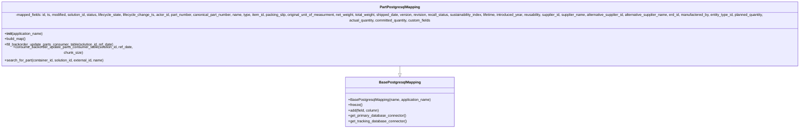
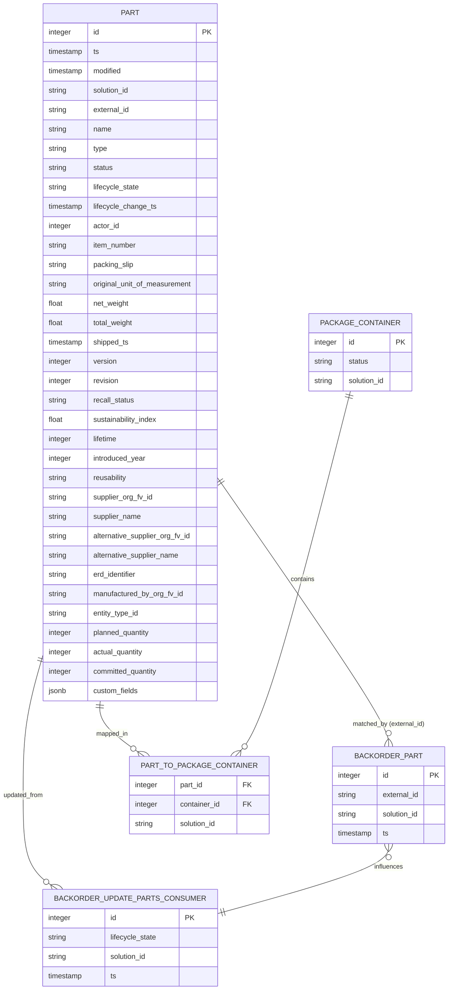

# Diagram: partview_core/partview_service/partview_service/persistence/sql/postgresql/PartPostgresqlMapping.py

> Auto-generated by Obscura crawlers

## Diagram 1

### SVG

<svg id="container" width="3927.734375" xmlns="http://www.w3.org/2000/svg" class="classDiagram" height="528" viewBox="0 0 3927.734375 528" role="graphics-document document" aria-roledescription="class"><g><defs><marker id="container_class-aggregationStart" class="marker aggregation class" refX="18" refY="7" markerWidth="190" markerHeight="240" orient="auto"><path d="M 18,7 L9,13 L1,7 L9,1 Z"></path></marker></defs><defs><marker id="container_class-aggregationEnd" class="marker aggregation class" refX="1" refY="7" markerWidth="20" markerHeight="28" orient="auto"><path d="M 18,7 L9,13 L1,7 L9,1 Z"></path></marker></defs><defs><marker id="container_class-extensionStart" class="marker extension class" refX="18" refY="7" markerWidth="190" markerHeight="240" orient="auto"><path d="M 1,7 L18,13 V 1 Z"></path></marker></defs><defs><marker id="container_class-extensionEnd" class="marker extension class" refX="1" refY="7" markerWidth="20" markerHeight="28" orient="auto"><path d="M 1,1 V 13 L18,7 Z"></path></marker></defs><defs><marker id="container_class-compositionStart" class="marker composition class" refX="18" refY="7" markerWidth="190" markerHeight="240" orient="auto"><path d="M 18,7 L9,13 L1,7 L9,1 Z"></path></marker></defs><defs><marker id="container_class-compositionEnd" class="marker composition class" refX="1" refY="7" markerWidth="20" markerHeight="28" orient="auto"><path d="M 18,7 L9,13 L1,7 L9,1 Z"></path></marker></defs><defs><marker id="container_class-dependencyStart" class="marker dependency class" refX="6" refY="7" markerWidth="190" markerHeight="240" orient="auto"><path d="M 5,7 L9,13 L1,7 L9,1 Z"></path></marker></defs><defs><marker id="container_class-dependencyEnd" class="marker dependency class" refX="13" refY="7" markerWidth="20" markerHeight="28" orient="auto"><path d="M 18,7 L9,13 L14,7 L9,1 Z"></path></marker></defs><defs><marker id="container_class-lollipopStart" class="marker lollipop class" refX="13" refY="7" markerWidth="190" markerHeight="240" orient="auto"><circle stroke="black" fill="transparent" cx="7" cy="7" r="6"></circle></marker></defs><defs><marker id="container_class-lollipopEnd" class="marker lollipop class" refX="1" refY="7" markerWidth="190" markerHeight="240" orient="auto"><circle stroke="black" fill="transparent" cx="7" cy="7" r="6"></circle></marker></defs><g class="root"><g class="clusters"></g><g class="edgePaths"><path d="M1963.867,248L1963.867,252.167C1963.867,256.333,1963.867,264.667,1963.867,270.125C1963.867,275.583,1963.867,278.167,1963.867,279.458L1963.867,280.75" id="id_PartPostgresqlMapping_BasePostgresqlMapping_1" class="edge-thickness-normal edge-pattern-solid relation" style=";;;" data-edge="true" data-et="edge" data-id="id_PartPostgresqlMapping_BasePostgresqlMapping_1" data-points="W3sieCI6MTk2My44NjcxODc1LCJ5IjoyNDh9LHsieCI6MTk2My44NjcxODc1LCJ5IjoyNzN9LHsieCI6MTk2My44NjcxODc1LCJ5IjoyOTh9XQ==" marker-end="url(#container_class-extensionEnd)"></path></g><g class="edgeLabels"><g class="edgeLabel"><g class="label" data-id="id_PartPostgresqlMapping_BasePostgresqlMapping_1" transform="translate(0, 0)"><foreignObject width="0" height="0">

</foreignObject></g></g></g><g class="nodes"><g class="node default" id="classId-BasePostgresqlMapping-0" transform="translate(1963.8671875, 409)"><g class="basic label-container"><path d="M-241.0625 -111 L241.0625 -111 L241.0625 111 L-241.0625 111" stroke="none" stroke-width="0" fill="#ECECFF" style=""></path><path d="M-241.0625 -111 C-132.4652917939138 -111, -23.868083587827584 -111, 241.0625 -111 M-241.0625 -111 C-99.33550386063735 -111, 42.39149227872531 -111, 241.0625 -111 M241.0625 -111 C241.0625 -41.48433056196839, 241.0625 28.031338876063217, 241.0625 111 M241.0625 -111 C241.0625 -42.17205182835684, 241.0625 26.655896343286315, 241.0625 111 M241.0625 111 C71.1427188916924 111, -98.7770622166152 111, -241.0625 111 M241.0625 111 C56.943582729439186 111, -127.17533454112163 111, -241.0625 111 M-241.0625 111 C-241.0625 34.065640638593464, -241.0625 -42.86871872281307, -241.0625 -111 M-241.0625 111 C-241.0625 53.0354362185056, -241.0625 -4.929127562988796, -241.0625 -111" stroke="#9370DB" stroke-width="1.3" fill="none" stroke-dasharray="0 0" style=""></path></g><g class="annotation-group text" transform="translate(0, -87)"></g><g class="label-group text" transform="translate(-87.921875, -87)"><g class="label" style="font-weight: bolder" transform="translate(0,-12)"><foreignObject width="175.84375" height="24">

BasePostgresqlMapping

</foreignObject></g></g><g class="members-group text" transform="translate(-229.0625, -39)"></g><g class="methods-group text" transform="translate(-229.0625, -9)"><g class="label" style="" transform="translate(0,-12)"><foreignObject width="370.203125" height="24">

+BasePostgresqlMapping(name, application_name)

</foreignObject></g><g class="label" style="" transform="translate(0,12)"><foreignObject width="62.109375" height="24">

+freeze()

</foreignObject></g><g class="label" style="" transform="translate(0,36)"><foreignObject width="139.890625" height="24">

+add(field, column)

</foreignObject></g><g class="label" style="" transform="translate(0,60)"><foreignObject width="260.671875" height="24">

+get_primary_database_connector()

</foreignObject></g><g class="label" style="" transform="translate(0,84)"><foreignObject width="262.375" height="24">

+get_tracking_database_connector()

</foreignObject></g></g><g class="divider" style=""><path d="M-241.0625 -63 C-50.962974113827045 -63, 139.1365517723459 -63, 241.0625 -63 M-241.0625 -63 C-140.79999120858213 -63, -40.537482417164284 -63, 241.0625 -63" stroke="#9370DB" stroke-width="1.3" fill="none" stroke-dasharray="0 0" style=""></path></g><g class="divider" style=""><path d="M-241.0625 -39 C-81.78799402382879 -39, 77.48651195234243 -39, 241.0625 -39 M-241.0625 -39 C-118.13914415063131 -39, 4.78421169873738 -39, 241.0625 -39" stroke="#9370DB" stroke-width="1.3" fill="none" stroke-dasharray="0 0" style=""></path></g></g><g class="node default" id="classId-PartPostgresqlMapping-1" transform="translate(1963.8671875, 128)"><g class="basic label-container"><path d="M-1955.8671875 -120 L1955.8671875 -120 L1955.8671875 120 L-1955.8671875 120" stroke="none" stroke-width="0" fill="#ECECFF" style=""></path><path d="M-1955.8671875 -120 C-1023.4149857932025 -120, -90.96278408640501 -120, 1955.8671875 -120 M-1955.8671875 -120 C-611.8304298238293 -120, 732.2063278523415 -120, 1955.8671875 -120 M1955.8671875 -120 C1955.8671875 -56.115796018235855, 1955.8671875 7.76840796352829, 1955.8671875 120 M1955.8671875 -120 C1955.8671875 -54.49970504602872, 1955.8671875 11.000589907942555, 1955.8671875 120 M1955.8671875 120 C930.8350767474044 120, -94.1970340051912 120, -1955.8671875 120 M1955.8671875 120 C640.9479430180659 120, -673.9713014638683 120, -1955.8671875 120 M-1955.8671875 120 C-1955.8671875 57.04885227677336, -1955.8671875 -5.90229544645328, -1955.8671875 -120 M-1955.8671875 120 C-1955.8671875 51.67747910950622, -1955.8671875 -16.645041780987555, -1955.8671875 -120" stroke="#9370DB" stroke-width="1.3" fill="none" stroke-dasharray="0 0" style=""></path></g><g class="annotation-group text" transform="translate(0, -96)"></g><g class="label-group text" transform="translate(-85.46875, -96)"><g class="label" style="font-weight: bolder" transform="translate(0,-12)"><foreignObject width="170.9375" height="24">

PartPostgresqlMapping

</foreignObject></g></g><g class="members-group text" transform="translate(-1943.8671875, -48)"><g class="label" style="" transform="translate(0,-12)"><foreignObject width="3802.265625" height="24">

-mapped_fields: id, ts, modified, solution_id, status, lifecycle_state, lifecycle_change_ts, actor_id, part_number, canonical_part_number, name, type, item_id, packing_slip, original_unit_of_measurment, net_weight, total_weight, shipped_date, version, revision, recall_status, sustainability_index, lifetime, introduced_year, reusability, supplier_id, supplier_name, alternative_supplier_id, alternative_supplier_name, erd_id, manufactered_by, entity_type_id, planned_quantity, actual_quantity, committed_quantity, custom_fields

</foreignObject></g></g><g class="methods-group text" transform="translate(-1943.8671875, 0)"><g class="label" style="" transform="translate(0,-12)"><foreignObject width="173.734375" height="24">

+<strong>init</strong>(application_name)

</foreignObject></g><g class="label" style="" transform="translate(0,12)"><foreignObject width="96.109375" height="24">

+build_map()

</foreignObject></g><g class="label" style="" transform="translate(0,36)"><foreignObject width="494.96875" height="24">

+fill_backorder_update_parts_consumer_table(solution_id, ref_date)

</foreignObject></g><g class="label" style="" transform="translate(0,60)"><foreignObject width="629.3125" height="24">

+consume_backorder_update_parts_consumer_table(solution_id, ref_date, chunk_size)

</foreignObject></g><g class="label" style="" transform="translate(0,84)"><foreignObject width="450.65625" height="24">

+search_for_part(container_id, solution_id, external_id, name)

</foreignObject></g></g><g class="divider" style=""><path d="M-1955.8671875 -72 C-428.33987399149396 -72, 1099.187439517012 -72, 1955.8671875 -72 M-1955.8671875 -72 C-716.7931694558076 -72, 522.2808485883847 -72, 1955.8671875 -72" stroke="#9370DB" stroke-width="1.3" fill="none" stroke-dasharray="0 0" style=""></path></g><g class="divider" style=""><path d="M-1955.8671875 -24 C-1077.6651761532642 -24, -199.4631648065283 -24, 1955.8671875 -24 M-1955.8671875 -24 C-443.66638319160916 -24, 1068.5344211167817 -24, 1955.8671875 -24" stroke="#9370DB" stroke-width="1.3" fill="none" stroke-dasharray="0 0" style=""></path></g></g></g></g></g></svg>

## Diagram 2

### SVG

<svg id="container" width="973.5078125" xmlns="http://www.w3.org/2000/svg" class="erDiagram" height="2184.5" viewBox="0 0 973.5078125 2184.5" role="graphics-document document" aria-roledescription="er"><g><defs><marker id="container_er-onlyOneStart" class="marker onlyOne er" refX="0" refY="9" markerWidth="18" markerHeight="18" orient="auto"><path d="M9,0 L9,18 M15,0 L15,18"></path></marker></defs><defs><marker id="container_er-onlyOneEnd" class="marker onlyOne er" refX="18" refY="9" markerWidth="18" markerHeight="18" orient="auto"><path d="M3,0 L3,18 M9,0 L9,18"></path></marker></defs><defs><marker id="container_er-zeroOrOneStart" class="marker zeroOrOne er" refX="0" refY="9" markerWidth="30" markerHeight="18" orient="auto"><circle fill="white" cx="21" cy="9" r="6"></circle><path d="M9,0 L9,18"></path></marker></defs><defs><marker id="container_er-zeroOrOneEnd" class="marker zeroOrOne er" refX="30" refY="9" markerWidth="30" markerHeight="18" orient="auto"><circle fill="white" cx="9" cy="9" r="6"></circle><path d="M21,0 L21,18"></path></marker></defs><defs><marker id="container_er-oneOrMoreStart" class="marker oneOrMore er" refX="18" refY="18" markerWidth="45" markerHeight="36" orient="auto"><path d="M0,18 Q 18,0 36,18 Q 18,36 0,18 M42,9 L42,27"></path></marker></defs><defs><marker id="container_er-oneOrMoreEnd" class="marker oneOrMore er" refX="27" refY="18" markerWidth="45" markerHeight="36" orient="auto"><path d="M3,9 L3,27 M9,18 Q27,0 45,18 Q27,36 9,18"></path></marker></defs><defs><marker id="container_er-zeroOrMoreStart" class="marker zeroOrMore er" refX="18" refY="18" markerWidth="57" markerHeight="36" orient="auto"><circle fill="white" cx="48" cy="18" r="6"></circle><path d="M0,18 Q18,0 36,18 Q18,36 0,18"></path></marker></defs><defs><marker id="container_er-zeroOrMoreEnd" class="marker zeroOrMore er" refX="39" refY="18" markerWidth="57" markerHeight="36" orient="auto"><circle fill="white" cx="9" cy="18" r="6"></circle><path d="M21,18 Q39,0 57,18 Q39,36 21,18"></path></marker></defs><g class="root"><g class="clusters"></g><g class="edgePaths"><path d="M215.546,1547L214.818,1555.417C214.091,1563.833,212.635,1580.667,229.057,1601.063C245.478,1621.458,279.777,1645.417,296.926,1657.396L314.075,1669.375" id="id_entity-PART-0_entity-PART_TO_PACKAGE_CONTAINER-3_0" class="edge-thickness-normal edge-pattern-solid relationshipLine" style="undefined;;;undefined" data-edge="true" data-et="edge" data-id="id_entity-PART-0_entity-PART_TO_PACKAGE_CONTAINER-3_0" data-points="W3sieCI6MjE1LjU0NTk5MzcxMTg5MDI1LCJ5IjoxNTQ3fSx7IngiOjIxMS4xNzk2ODc1LCJ5IjoxNTk3LjV9LHsieCI6MzE0LjA3NTQwMDg2Mzc4MDc3LCJ5IjoxNjY5LjM3NX1d" marker-start="url(#container_er-onlyOneStart)" marker-end="url(#container_er-zeroOrMoreEnd)"></path><path d="M753.62,863L723.601,985.417C693.583,1107.833,633.545,1352.667,593.096,1487.063C552.647,1621.458,531.785,1645.417,521.355,1657.396L510.924,1669.375" id="id_entity-PACKAGE_CONTAINER-2_entity-PART_TO_PACKAGE_CONTAINER-3_1" class="edge-thickness-normal edge-pattern-solid relationshipLine" style="undefined;;;undefined" data-edge="true" data-et="edge" data-id="id_entity-PACKAGE_CONTAINER-2_entity-PART_TO_PACKAGE_CONTAINER-3_1" data-points="W3sieCI6NzUzLjYxOTg2NDcxMDM2NTgsInkiOjg2M30seyJ4Ijo1NzMuNTA3ODEyNSwieSI6MTU5Ny41fSx7IngiOjUxMC45MjQwNDA2NTcyNjc2NSwieSI6MTY2OS4zNzV9XQ==" marker-start="url(#container_er-onlyOneStart)" marker-end="url(#container_er-zeroOrMoreEnd)"></path><path d="M479.133,1067.831L539.049,1156.109C598.966,1244.387,718.799,1420.944,778.716,1517.638C838.633,1614.333,838.633,1631.167,838.633,1639.583L838.633,1648" id="id_entity-PART-0_entity-BACKORDER_PART-1_2" class="edge-thickness-normal edge-pattern-solid relationshipLine" style="undefined;;;undefined" data-edge="true" data-et="edge" data-id="id_entity-PART-0_entity-BACKORDER_PART-1_2" data-points="W3sieCI6NDc5LjEzMjgxMjUsInkiOjEwNjcuODMwNTc3MzUyMjkzfSx7IngiOjgzOC42MzI4MTI1LCJ5IjoxNTk3LjV9LHsieCI6ODM4LjYzMjgxMjUsInkiOjE2NDh9XQ==" marker-start="url(#container_er-onlyOneStart)" marker-end="url(#container_er-zeroOrMoreEnd)"></path><path d="M85.023,1483.111L79.699,1502.176C74.375,1521.24,63.727,1559.37,58.402,1604.664C53.078,1649.958,53.078,1702.417,53.078,1754.875C53.078,1807.333,53.078,1859.792,65.325,1894.438C77.573,1929.083,102.067,1945.917,114.315,1954.333L126.562,1962.75" id="id_entity-PART-0_entity-BACKORDER_UPDATE_PARTS_CONSUMER-4_3" class="edge-thickness-normal edge-pattern-solid relationshipLine" style="undefined;;;undefined" data-edge="true" data-et="edge" data-id="id_entity-PART-0_entity-BACKORDER_UPDATE_PARTS_CONSUMER-4_3" data-points="W3sieCI6ODUuMDIzNDM3NSwieSI6MTQ4My4xMTA2NzEzOTczOH0seyJ4Ijo1My4wNzgxMjUsInkiOjE1OTcuNX0seyJ4Ijo1My4wNzgxMjUsInkiOjE3NTQuODc1fSx7IngiOjUzLjA3ODEyNSwieSI6MTkxMi4yNX0seyJ4IjoxMjYuNTYxODQyMjM1OTAxNTEsInkiOjE5NjIuNzV9XQ==" marker-start="url(#container_er-onlyOneStart)" marker-end="url(#container_er-zeroOrMoreEnd)"></path><path d="M838.633,1861.75L838.633,1870.167C838.633,1878.583,838.633,1895.417,774.115,1922.077C709.596,1948.737,580.56,1985.224,516.042,2003.468L451.523,2021.712" id="id_entity-BACKORDER_PART-1_entity-BACKORDER_UPDATE_PARTS_CONSUMER-4_4" class="edge-thickness-normal edge-pattern-solid relationshipLine" style="undefined;;;undefined" data-edge="true" data-et="edge" data-id="id_entity-BACKORDER_PART-1_entity-BACKORDER_UPDATE_PARTS_CONSUMER-4_4" data-points="W3sieCI6ODM4LjYzMjgxMjUsInkiOjE4NjEuNzV9LHsieCI6ODM4LjYzMjgxMjUsInkiOjE5MTIuMjV9LHsieCI6NDUxLjUyMzQzNzUsInkiOjIwMjEuNzExNTQ4NDQ5NTg1M31d" marker-start="url(#container_er-zeroOrMoreStart)" marker-end="url(#container_er-onlyOneEnd)"></path></g><g class="edgeLabels"><g class="edgeLabel" transform="translate(241.85035, 1618.92416)"><g class="label" data-id="id_entity-PART-0_entity-PART_TO_PACKAGE_CONTAINER-3_0" transform="translate(-35.84375, -10.5)"><foreignObject width="71.6875" height="21">

mapped_in

</foreignObject></g></g><g class="edgeLabel" transform="translate(652.21505, 1276.53057)"><g class="label" data-id="id_entity-PACKAGE_CONTAINER-2_entity-PART_TO_PACKAGE_CONTAINER-3_1" transform="translate(-27.03125, -10.5)"><foreignObject width="54.0625" height="21">

contains

</foreignObject></g></g><g class="edgeLabel" transform="translate(838.6328125, 1597.5)"><g class="label" data-id="id_entity-PART-0_entity-BACKORDER_PART-1_2" transform="translate(-81.0625, -10.5)"><foreignObject width="162.125" height="21">

matched_by (external_id)

</foreignObject></g></g><g class="edgeLabel" transform="translate(53.078125, 1754.875)"><g class="label" data-id="id_entity-PART-0_entity-BACKORDER_UPDATE_PARTS_CONSUMER-4_3" transform="translate(-45.078125, -10.5)"><foreignObject width="90.15625" height="21">

updated_from

</foreignObject></g></g><g class="edgeLabel" transform="translate(838.6328125, 1912.25)"><g class="label" data-id="id_entity-BACKORDER_PART-1_entity-BACKORDER_UPDATE_PARTS_CONSUMER-4_4" transform="translate(-32.5078125, -10.5)"><foreignObject width="65.015625" height="21">

influences

</foreignObject></g></g></g><g class="nodes"><g class="node default" id="entity-PART-0" transform="translate(282.078125, 777.5)"><g style=""><path d="M-197.0546875 -769.5 L197.0546875 -769.5 L197.0546875 769.5 L-197.0546875 769.5" stroke="none" stroke-width="0" fill="#ECECFF"></path><path d="M-197.0546875 -769.5 C-93.45543861697962 -769.5, 10.14381026604076 -769.5, 197.0546875 -769.5 M-197.0546875 -769.5 C-84.75553296447397 -769.5, 27.543621571052057 -769.5, 197.0546875 -769.5 M197.0546875 -769.5 C197.0546875 -267.2105689323576, 197.0546875 235.0788621352848, 197.0546875 769.5 M197.0546875 -769.5 C197.0546875 -420.78710134433453, 197.0546875 -72.07420268866906, 197.0546875 769.5 M197.0546875 769.5 C105.02812650810921 769.5, 13.00156551621842 769.5, -197.0546875 769.5 M197.0546875 769.5 C49.50152998887933 769.5, -98.05162752224135 769.5, -197.0546875 769.5 M-197.0546875 769.5 C-197.0546875 243.19198254512844, -197.0546875 -283.1160349097431, -197.0546875 -769.5 M-197.0546875 769.5 C-197.0546875 201.32467108624667, -197.0546875 -366.85065782750667, -197.0546875 -769.5" stroke="#9370DB" stroke-width="1.3" fill="none" stroke-dasharray="0 0"></path></g><g style="" class="row-rect-odd"><path d="M-197.0546875 -726.75 L197.0546875 -726.75 L197.0546875 -684 L-197.0546875 -684" stroke="none" stroke-width="0" fill="hsl(240, 100%, 100%)"></path><path d="M-197.0546875 -726.75 C-45.50405583998406 -726.75, 106.04657582003188 -726.75, 197.0546875 -726.75 M-197.0546875 -726.75 C-53.821386904473854 -726.75, 89.41191369105229 -726.75, 197.0546875 -726.75 M197.0546875 -726.75 C197.0546875 -710.8842485627692, 197.0546875 -695.0184971255385, 197.0546875 -684 M197.0546875 -726.75 C197.0546875 -712.6741562055716, 197.0546875 -698.5983124111433, 197.0546875 -684 M197.0546875 -684 C100.71039435707276 -684, 4.366101214145516 -684, -197.0546875 -684 M197.0546875 -684 C43.28633912415745 -684, -110.4820092516851 -684, -197.0546875 -684 M-197.0546875 -684 C-197.0546875 -692.8644069906962, -197.0546875 -701.7288139813924, -197.0546875 -726.75 M-197.0546875 -684 C-197.0546875 -700.1059115981624, -197.0546875 -716.2118231963248, -197.0546875 -726.75" stroke="#9370DB" stroke-width="1.3" fill="none" stroke-dasharray="0 0"></path></g><g style="" class="row-rect-even"><path d="M-197.0546875 -684 L197.0546875 -684 L197.0546875 -641.25 L-197.0546875 -641.25" stroke="none" stroke-width="0" fill="hsl(240, 100%, 97.2745098039%)"></path><path d="M-197.0546875 -684 C-80.70535969921363 -684, 35.64396810157274 -684, 197.0546875 -684 M-197.0546875 -684 C-78.6800712235051 -684, 39.69454505298981 -684, 197.0546875 -684 M197.0546875 -684 C197.0546875 -674.297732929418, 197.0546875 -664.595465858836, 197.0546875 -641.25 M197.0546875 -684 C197.0546875 -670.6030007761753, 197.0546875 -657.2060015523507, 197.0546875 -641.25 M197.0546875 -641.25 C72.13412336233192 -641.25, -52.78644077533616 -641.25, -197.0546875 -641.25 M197.0546875 -641.25 C96.02473094148681 -641.25, -5.005225617026383 -641.25, -197.0546875 -641.25 M-197.0546875 -641.25 C-197.0546875 -650.4374468943763, -197.0546875 -659.6248937887525, -197.0546875 -684 M-197.0546875 -641.25 C-197.0546875 -653.9246575181953, -197.0546875 -666.5993150363906, -197.0546875 -684" stroke="#9370DB" stroke-width="1.3" fill="none" stroke-dasharray="0 0"></path></g><g style="" class="row-rect-odd"><path d="M-197.0546875 -641.25 L197.0546875 -641.25 L197.0546875 -598.5 L-197.0546875 -598.5" stroke="none" stroke-width="0" fill="hsl(240, 100%, 100%)"></path><path d="M-197.0546875 -641.25 C-44.21255633554483 -641.25, 108.62957482891034 -641.25, 197.0546875 -641.25 M-197.0546875 -641.25 C-108.95056193387629 -641.25, -20.846436367752574 -641.25, 197.0546875 -641.25 M197.0546875 -641.25 C197.0546875 -624.6030592651945, 197.0546875 -607.956118530389, 197.0546875 -598.5 M197.0546875 -641.25 C197.0546875 -632.2425568476588, 197.0546875 -623.2351136953175, 197.0546875 -598.5 M197.0546875 -598.5 C76.57849231985871 -598.5, -43.89770286028258 -598.5, -197.0546875 -598.5 M197.0546875 -598.5 C92.7554045744766 -598.5, -11.5438783510468 -598.5, -197.0546875 -598.5 M-197.0546875 -598.5 C-197.0546875 -607.6653483487521, -197.0546875 -616.8306966975042, -197.0546875 -641.25 M-197.0546875 -598.5 C-197.0546875 -607.4665742667979, -197.0546875 -616.433148533596, -197.0546875 -641.25" stroke="#9370DB" stroke-width="1.3" fill="none" stroke-dasharray="0 0"></path></g><g style="" class="row-rect-even"><path d="M-197.0546875 -598.5 L197.0546875 -598.5 L197.0546875 -555.75 L-197.0546875 -555.75" stroke="none" stroke-width="0" fill="hsl(240, 100%, 97.2745098039%)"></path><path d="M-197.0546875 -598.5 C-76.43545296846422 -598.5, 44.18378156307156 -598.5, 197.0546875 -598.5 M-197.0546875 -598.5 C-90.65238511643248 -598.5, 15.749917267135032 -598.5, 197.0546875 -598.5 M197.0546875 -598.5 C197.0546875 -584.6147006330341, 197.0546875 -570.7294012660683, 197.0546875 -555.75 M197.0546875 -598.5 C197.0546875 -587.8667643884422, 197.0546875 -577.2335287768844, 197.0546875 -555.75 M197.0546875 -555.75 C97.89663688050187 -555.75, -1.2614137389962536 -555.75, -197.0546875 -555.75 M197.0546875 -555.75 C85.78686450127941 -555.75, -25.48095849744118 -555.75, -197.0546875 -555.75 M-197.0546875 -555.75 C-197.0546875 -570.6727518328386, -197.0546875 -585.5955036656773, -197.0546875 -598.5 M-197.0546875 -555.75 C-197.0546875 -565.4912064805369, -197.0546875 -575.2324129610738, -197.0546875 -598.5" stroke="#9370DB" stroke-width="1.3" fill="none" stroke-dasharray="0 0"></path></g><g style="" class="row-rect-odd"><path d="M-197.0546875 -555.75 L197.0546875 -555.75 L197.0546875 -513 L-197.0546875 -513" stroke="none" stroke-width="0" fill="hsl(240, 100%, 100%)"></path><path d="M-197.0546875 -555.75 C-42.09807174821174 -555.75, 112.85854400357653 -555.75, 197.0546875 -555.75 M-197.0546875 -555.75 C-98.93768293473062 -555.75, -0.8206783694612341 -555.75, 197.0546875 -555.75 M197.0546875 -555.75 C197.0546875 -540.0342429735992, 197.0546875 -524.3184859471986, 197.0546875 -513 M197.0546875 -555.75 C197.0546875 -543.2440691547242, 197.0546875 -530.7381383094485, 197.0546875 -513 M197.0546875 -513 C91.77685391038835 -513, -13.500979679223292 -513, -197.0546875 -513 M197.0546875 -513 C51.74802753108406 -513, -93.55863243783187 -513, -197.0546875 -513 M-197.0546875 -513 C-197.0546875 -527.337732523328, -197.0546875 -541.6754650466559, -197.0546875 -555.75 M-197.0546875 -513 C-197.0546875 -523.2475149757967, -197.0546875 -533.4950299515933, -197.0546875 -555.75" stroke="#9370DB" stroke-width="1.3" fill="none" stroke-dasharray="0 0"></path></g><g style="" class="row-rect-even"><path d="M-197.0546875 -513 L197.0546875 -513 L197.0546875 -470.25 L-197.0546875 -470.25" stroke="none" stroke-width="0" fill="hsl(240, 100%, 97.2745098039%)"></path><path d="M-197.0546875 -513 C-56.75677286350563 -513, 83.54114177298874 -513, 197.0546875 -513 M-197.0546875 -513 C-82.1053540478848 -513, 32.843979404230396 -513, 197.0546875 -513 M197.0546875 -513 C197.0546875 -498.84625901745187, 197.0546875 -484.69251803490374, 197.0546875 -470.25 M197.0546875 -513 C197.0546875 -496.77597788508626, 197.0546875 -480.5519557701725, 197.0546875 -470.25 M197.0546875 -470.25 C117.54728940389303 -470.25, 38.039891307786064 -470.25, -197.0546875 -470.25 M197.0546875 -470.25 C101.68548338074493 -470.25, 6.3162792614898535 -470.25, -197.0546875 -470.25 M-197.0546875 -470.25 C-197.0546875 -482.80538170805727, -197.0546875 -495.3607634161146, -197.0546875 -513 M-197.0546875 -470.25 C-197.0546875 -486.19309540198236, -197.0546875 -502.1361908039647, -197.0546875 -513" stroke="#9370DB" stroke-width="1.3" fill="none" stroke-dasharray="0 0"></path></g><g style="" class="row-rect-odd"><path d="M-197.0546875 -470.25 L197.0546875 -470.25 L197.0546875 -427.5 L-197.0546875 -427.5" stroke="none" stroke-width="0" fill="hsl(240, 100%, 100%)"></path><path d="M-197.0546875 -470.25 C-115.437460132892 -470.25, -33.820232765784 -470.25, 197.0546875 -470.25 M-197.0546875 -470.25 C-102.21190586594838 -470.25, -7.3691242318967625 -470.25, 197.0546875 -470.25 M197.0546875 -470.25 C197.0546875 -455.56420667259204, 197.0546875 -440.87841334518413, 197.0546875 -427.5 M197.0546875 -470.25 C197.0546875 -454.9568790410174, 197.0546875 -439.6637580820348, 197.0546875 -427.5 M197.0546875 -427.5 C85.09729201569147 -427.5, -26.86010346861707 -427.5, -197.0546875 -427.5 M197.0546875 -427.5 C112.7274530150562 -427.5, 28.400218530112397 -427.5, -197.0546875 -427.5 M-197.0546875 -427.5 C-197.0546875 -437.23651645736203, -197.0546875 -446.9730329147241, -197.0546875 -470.25 M-197.0546875 -427.5 C-197.0546875 -437.76214275712726, -197.0546875 -448.0242855142545, -197.0546875 -470.25" stroke="#9370DB" stroke-width="1.3" fill="none" stroke-dasharray="0 0"></path></g><g style="" class="row-rect-even"><path d="M-197.0546875 -427.5 L197.0546875 -427.5 L197.0546875 -384.75 L-197.0546875 -384.75" stroke="none" stroke-width="0" fill="hsl(240, 100%, 97.2745098039%)"></path><path d="M-197.0546875 -427.5 C-116.04580506869301 -427.5, -35.03692263738603 -427.5, 197.0546875 -427.5 M-197.0546875 -427.5 C-65.63539340746487 -427.5, 65.78390068507025 -427.5, 197.0546875 -427.5 M197.0546875 -427.5 C197.0546875 -411.44411974570664, 197.0546875 -395.3882394914133, 197.0546875 -384.75 M197.0546875 -427.5 C197.0546875 -418.37336012759624, 197.0546875 -409.24672025519254, 197.0546875 -384.75 M197.0546875 -384.75 C82.1021465836907 -384.75, -32.850394332618606 -384.75, -197.0546875 -384.75 M197.0546875 -384.75 C113.17193884194054 -384.75, 29.28919018388109 -384.75, -197.0546875 -384.75 M-197.0546875 -384.75 C-197.0546875 -399.1358497532002, -197.0546875 -413.5216995064004, -197.0546875 -427.5 M-197.0546875 -384.75 C-197.0546875 -393.69172012265614, -197.0546875 -402.6334402453123, -197.0546875 -427.5" stroke="#9370DB" stroke-width="1.3" fill="none" stroke-dasharray="0 0"></path></g><g style="" class="row-rect-odd"><path d="M-197.0546875 -384.75 L197.0546875 -384.75 L197.0546875 -342 L-197.0546875 -342" stroke="none" stroke-width="0" fill="hsl(240, 100%, 100%)"></path><path d="M-197.0546875 -384.75 C-109.36603371868173 -384.75, -21.67737993736347 -384.75, 197.0546875 -384.75 M-197.0546875 -384.75 C-76.16157448771962 -384.75, 44.73153852456076 -384.75, 197.0546875 -384.75 M197.0546875 -384.75 C197.0546875 -367.99611243158256, 197.0546875 -351.2422248631652, 197.0546875 -342 M197.0546875 -384.75 C197.0546875 -371.81832792555525, 197.0546875 -358.8866558511105, 197.0546875 -342 M197.0546875 -342 C52.06696082639968 -342, -92.92076584720064 -342, -197.0546875 -342 M197.0546875 -342 C91.99050596227399 -342, -13.073675575452029 -342, -197.0546875 -342 M-197.0546875 -342 C-197.0546875 -351.1998905991808, -197.0546875 -360.39978119836155, -197.0546875 -384.75 M-197.0546875 -342 C-197.0546875 -352.40349895683266, -197.0546875 -362.8069979136653, -197.0546875 -384.75" stroke="#9370DB" stroke-width="1.3" fill="none" stroke-dasharray="0 0"></path></g><g style="" class="row-rect-even"><path d="M-197.0546875 -342 L197.0546875 -342 L197.0546875 -299.25 L-197.0546875 -299.25" stroke="none" stroke-width="0" fill="hsl(240, 100%, 97.2745098039%)"></path><path d="M-197.0546875 -342 C-44.076220390683545 -342, 108.90224671863291 -342, 197.0546875 -342 M-197.0546875 -342 C-45.462711026143126 -342, 106.12926544771375 -342, 197.0546875 -342 M197.0546875 -342 C197.0546875 -328.24358334261865, 197.0546875 -314.48716668523724, 197.0546875 -299.25 M197.0546875 -342 C197.0546875 -328.9313215353415, 197.0546875 -315.862643070683, 197.0546875 -299.25 M197.0546875 -299.25 C86.1189398208392 -299.25, -24.816807858321596 -299.25, -197.0546875 -299.25 M197.0546875 -299.25 C104.7094783700067 -299.25, 12.364269240013414 -299.25, -197.0546875 -299.25 M-197.0546875 -299.25 C-197.0546875 -309.6843122191324, -197.0546875 -320.1186244382648, -197.0546875 -342 M-197.0546875 -299.25 C-197.0546875 -315.76087924679405, -197.0546875 -332.27175849358815, -197.0546875 -342" stroke="#9370DB" stroke-width="1.3" fill="none" stroke-dasharray="0 0"></path></g><g style="" class="row-rect-odd"><path d="M-197.0546875 -299.25 L197.0546875 -299.25 L197.0546875 -256.5 L-197.0546875 -256.5" stroke="none" stroke-width="0" fill="hsl(240, 100%, 100%)"></path><path d="M-197.0546875 -299.25 C-67.62203586646626 -299.25, 61.810615767067475 -299.25, 197.0546875 -299.25 M-197.0546875 -299.25 C-43.43857673029743 -299.25, 110.17753403940515 -299.25, 197.0546875 -299.25 M197.0546875 -299.25 C197.0546875 -284.9045401948183, 197.0546875 -270.5590803896367, 197.0546875 -256.5 M197.0546875 -299.25 C197.0546875 -285.19192805790067, 197.0546875 -271.13385611580134, 197.0546875 -256.5 M197.0546875 -256.5 C42.278758761423774 -256.5, -112.49716997715245 -256.5, -197.0546875 -256.5 M197.0546875 -256.5 C69.55899950921797 -256.5, -57.93668848156406 -256.5, -197.0546875 -256.5 M-197.0546875 -256.5 C-197.0546875 -265.91768894059373, -197.0546875 -275.33537788118747, -197.0546875 -299.25 M-197.0546875 -256.5 C-197.0546875 -270.3576503839361, -197.0546875 -284.2153007678722, -197.0546875 -299.25" stroke="#9370DB" stroke-width="1.3" fill="none" stroke-dasharray="0 0"></path></g><g style="" class="row-rect-even"><path d="M-197.0546875 -256.5 L197.0546875 -256.5 L197.0546875 -213.75 L-197.0546875 -213.75" stroke="none" stroke-width="0" fill="hsl(240, 100%, 97.2745098039%)"></path><path d="M-197.0546875 -256.5 C-52.94739651892701 -256.5, 91.15989446214599 -256.5, 197.0546875 -256.5 M-197.0546875 -256.5 C-55.56316923384864 -256.5, 85.92834903230272 -256.5, 197.0546875 -256.5 M197.0546875 -256.5 C197.0546875 -246.38576744136844, 197.0546875 -236.2715348827369, 197.0546875 -213.75 M197.0546875 -256.5 C197.0546875 -247.22463954898268, 197.0546875 -237.9492790979654, 197.0546875 -213.75 M197.0546875 -213.75 C42.1238028435485 -213.75, -112.807081812903 -213.75, -197.0546875 -213.75 M197.0546875 -213.75 C99.65304780430048 -213.75, 2.2514081086009696 -213.75, -197.0546875 -213.75 M-197.0546875 -213.75 C-197.0546875 -224.75854473199647, -197.0546875 -235.7670894639929, -197.0546875 -256.5 M-197.0546875 -213.75 C-197.0546875 -223.19948156753205, -197.0546875 -232.6489631350641, -197.0546875 -256.5" stroke="#9370DB" stroke-width="1.3" fill="none" stroke-dasharray="0 0"></path></g><g style="" class="row-rect-odd"><path d="M-197.0546875 -213.75 L197.0546875 -213.75 L197.0546875 -171 L-197.0546875 -171" stroke="none" stroke-width="0" fill="hsl(240, 100%, 100%)"></path><path d="M-197.0546875 -213.75 C-70.76484896087807 -213.75, 55.52498957824386 -213.75, 197.0546875 -213.75 M-197.0546875 -213.75 C-94.8270443394903 -213.75, 7.4005988210194005 -213.75, 197.0546875 -213.75 M197.0546875 -213.75 C197.0546875 -198.55106281466544, 197.0546875 -183.3521256293309, 197.0546875 -171 M197.0546875 -213.75 C197.0546875 -200.46615024159678, 197.0546875 -187.18230048319356, 197.0546875 -171 M197.0546875 -171 C44.13927192020205 -171, -108.7761436595959 -171, -197.0546875 -171 M197.0546875 -171 C74.64990946480908 -171, -47.75486857038183 -171, -197.0546875 -171 M-197.0546875 -171 C-197.0546875 -183.96358417140434, -197.0546875 -196.92716834280867, -197.0546875 -213.75 M-197.0546875 -171 C-197.0546875 -185.13781684828388, -197.0546875 -199.27563369656778, -197.0546875 -213.75" stroke="#9370DB" stroke-width="1.3" fill="none" stroke-dasharray="0 0"></path></g><g style="" class="row-rect-even"><path d="M-197.0546875 -171 L197.0546875 -171 L197.0546875 -128.25 L-197.0546875 -128.25" stroke="none" stroke-width="0" fill="hsl(240, 100%, 97.2745098039%)"></path><path d="M-197.0546875 -171 C-41.41055853820791 -171, 114.23357042358418 -171, 197.0546875 -171 M-197.0546875 -171 C-101.6694837897661 -171, -6.284280079532209 -171, 197.0546875 -171 M197.0546875 -171 C197.0546875 -156.0640012541407, 197.0546875 -141.12800250828138, 197.0546875 -128.25 M197.0546875 -171 C197.0546875 -154.28355927103217, 197.0546875 -137.56711854206435, 197.0546875 -128.25 M197.0546875 -128.25 C46.96678638603777 -128.25, -103.12111472792446 -128.25, -197.0546875 -128.25 M197.0546875 -128.25 C75.30739362718631 -128.25, -46.43990024562737 -128.25, -197.0546875 -128.25 M-197.0546875 -128.25 C-197.0546875 -140.97522572227246, -197.0546875 -153.70045144454488, -197.0546875 -171 M-197.0546875 -128.25 C-197.0546875 -138.3651781794769, -197.0546875 -148.48035635895386, -197.0546875 -171" stroke="#9370DB" stroke-width="1.3" fill="none" stroke-dasharray="0 0"></path></g><g style="" class="row-rect-odd"><path d="M-197.0546875 -128.25 L197.0546875 -128.25 L197.0546875 -85.5 L-197.0546875 -85.5" stroke="none" stroke-width="0" fill="hsl(240, 100%, 100%)"></path><path d="M-197.0546875 -128.25 C-64.39501212913478 -128.25, 68.26466324173043 -128.25, 197.0546875 -128.25 M-197.0546875 -128.25 C-112.95481460124884 -128.25, -28.854941702497683 -128.25, 197.0546875 -128.25 M197.0546875 -128.25 C197.0546875 -116.06908722699245, 197.0546875 -103.88817445398492, 197.0546875 -85.5 M197.0546875 -128.25 C197.0546875 -116.87553182415684, 197.0546875 -105.50106364831368, 197.0546875 -85.5 M197.0546875 -85.5 C82.36255507685904 -85.5, -32.32957734628192 -85.5, -197.0546875 -85.5 M197.0546875 -85.5 C50.69496883830794 -85.5, -95.66474982338411 -85.5, -197.0546875 -85.5 M-197.0546875 -85.5 C-197.0546875 -94.09866920482393, -197.0546875 -102.69733840964787, -197.0546875 -128.25 M-197.0546875 -85.5 C-197.0546875 -99.10558160149644, -197.0546875 -112.71116320299288, -197.0546875 -128.25" stroke="#9370DB" stroke-width="1.3" fill="none" stroke-dasharray="0 0"></path></g><g style="" class="row-rect-even"><path d="M-197.0546875 -85.5 L197.0546875 -85.5 L197.0546875 -42.75 L-197.0546875 -42.75" stroke="none" stroke-width="0" fill="hsl(240, 100%, 97.2745098039%)"></path><path d="M-197.0546875 -85.5 C-114.36192652997792 -85.5, -31.669165559955843 -85.5, 197.0546875 -85.5 M-197.0546875 -85.5 C-44.01721663076498 -85.5, 109.02025423847005 -85.5, 197.0546875 -85.5 M197.0546875 -85.5 C197.0546875 -72.91443237952895, 197.0546875 -60.32886475905788, 197.0546875 -42.75 M197.0546875 -85.5 C197.0546875 -69.26411765861874, 197.0546875 -53.028235317237474, 197.0546875 -42.75 M197.0546875 -42.75 C91.24743155019485 -42.75, -14.559824399610307 -42.75, -197.0546875 -42.75 M197.0546875 -42.75 C103.37384047287185 -42.75, 9.692993445743696 -42.75, -197.0546875 -42.75 M-197.0546875 -42.75 C-197.0546875 -54.38051311285744, -197.0546875 -66.01102622571489, -197.0546875 -85.5 M-197.0546875 -42.75 C-197.0546875 -52.68911510178389, -197.0546875 -62.62823020356778, -197.0546875 -85.5" stroke="#9370DB" stroke-width="1.3" fill="none" stroke-dasharray="0 0"></path></g><g style="" class="row-rect-odd"><path d="M-197.0546875 -42.75 L197.0546875 -42.75 L197.0546875 0 L-197.0546875 0" stroke="none" stroke-width="0" fill="hsl(240, 100%, 100%)"></path><path d="M-197.0546875 -42.75 C-92.34389683760551 -42.75, 12.366893824788974 -42.75, 197.0546875 -42.75 M-197.0546875 -42.75 C-93.12542227517152 -42.75, 10.803842949656968 -42.75, 197.0546875 -42.75 M197.0546875 -42.75 C197.0546875 -25.939824228479065, 197.0546875 -9.12964845695813, 197.0546875 0 M197.0546875 -42.75 C197.0546875 -28.864657219151304, 197.0546875 -14.979314438302609, 197.0546875 0 M197.0546875 0 C41.07960568525368 0, -114.89547612949264 0, -197.0546875 0 M197.0546875 0 C79.5793364243772 0, -37.89601465124559 0, -197.0546875 0 M-197.0546875 0 C-197.0546875 -12.864694355255573, -197.0546875 -25.729388710511145, -197.0546875 -42.75 M-197.0546875 0 C-197.0546875 -11.494169507586635, -197.0546875 -22.98833901517327, -197.0546875 -42.75" stroke="#9370DB" stroke-width="1.3" fill="none" stroke-dasharray="0 0"></path></g><g style="" class="row-rect-even"><path d="M-197.0546875 0 L197.0546875 0 L197.0546875 42.75 L-197.0546875 42.75" stroke="none" stroke-width="0" fill="hsl(240, 100%, 97.2745098039%)"></path><path d="M-197.0546875 0 C-91.32973681916542 0, 14.395213861669163 0, 197.0546875 0 M-197.0546875 0 C-40.084152389718895 0, 116.88638272056221 0, 197.0546875 0 M197.0546875 0 C197.0546875 9.20343957582497, 197.0546875 18.40687915164994, 197.0546875 42.75 M197.0546875 0 C197.0546875 13.161560833672699, 197.0546875 26.323121667345397, 197.0546875 42.75 M197.0546875 42.75 C80.74988436320419 42.75, -35.55491877359162 42.75, -197.0546875 42.75 M197.0546875 42.75 C94.38470485523193 42.75, -8.285277789536138 42.75, -197.0546875 42.75 M-197.0546875 42.75 C-197.0546875 29.209213068342024, -197.0546875 15.668426136684051, -197.0546875 0 M-197.0546875 42.75 C-197.0546875 32.66584736413614, -197.0546875 22.58169472827228, -197.0546875 0" stroke="#9370DB" stroke-width="1.3" fill="none" stroke-dasharray="0 0"></path></g><g style="" class="row-rect-odd"><path d="M-197.0546875 42.75 L197.0546875 42.75 L197.0546875 85.5 L-197.0546875 85.5" stroke="none" stroke-width="0" fill="hsl(240, 100%, 100%)"></path><path d="M-197.0546875 42.75 C-105.73394646517357 42.75, -14.413205430347148 42.75, 197.0546875 42.75 M-197.0546875 42.75 C-73.60033272292466 42.75, 49.854022054150676 42.75, 197.0546875 42.75 M197.0546875 42.75 C197.0546875 58.174716883937094, 197.0546875 73.59943376787419, 197.0546875 85.5 M197.0546875 42.75 C197.0546875 58.862583580792204, 197.0546875 74.97516716158441, 197.0546875 85.5 M197.0546875 85.5 C46.895981141270454 85.5, -103.26272521745909 85.5, -197.0546875 85.5 M197.0546875 85.5 C89.69268975915982 85.5, -17.66930798168036 85.5, -197.0546875 85.5 M-197.0546875 85.5 C-197.0546875 76.57092507980474, -197.0546875 67.64185015960949, -197.0546875 42.75 M-197.0546875 85.5 C-197.0546875 75.80069249313408, -197.0546875 66.10138498626816, -197.0546875 42.75" stroke="#9370DB" stroke-width="1.3" fill="none" stroke-dasharray="0 0"></path></g><g style="" class="row-rect-even"><path d="M-197.0546875 85.5 L197.0546875 85.5 L197.0546875 128.25 L-197.0546875 128.25" stroke="none" stroke-width="0" fill="hsl(240, 100%, 97.2745098039%)"></path><path d="M-197.0546875 85.5 C-110.05931255191892 85.5, -23.063937603837843 85.5, 197.0546875 85.5 M-197.0546875 85.5 C-73.04582983865352 85.5, 50.963027822692965 85.5, 197.0546875 85.5 M197.0546875 85.5 C197.0546875 94.55508584317059, 197.0546875 103.61017168634118, 197.0546875 128.25 M197.0546875 85.5 C197.0546875 102.00905955980724, 197.0546875 118.51811911961447, 197.0546875 128.25 M197.0546875 128.25 C51.897142885550096 128.25, -93.26040172889981 128.25, -197.0546875 128.25 M197.0546875 128.25 C86.04605572759131 128.25, -24.962576044817382 128.25, -197.0546875 128.25 M-197.0546875 128.25 C-197.0546875 112.26918026989861, -197.0546875 96.28836053979721, -197.0546875 85.5 M-197.0546875 128.25 C-197.0546875 111.5685386849741, -197.0546875 94.88707736994819, -197.0546875 85.5" stroke="#9370DB" stroke-width="1.3" fill="none" stroke-dasharray="0 0"></path></g><g style="" class="row-rect-odd"><path d="M-197.0546875 128.25 L197.0546875 128.25 L197.0546875 171 L-197.0546875 171" stroke="none" stroke-width="0" fill="hsl(240, 100%, 100%)"></path><path d="M-197.0546875 128.25 C-83.69952145593085 128.25, 29.6556445881383 128.25, 197.0546875 128.25 M-197.0546875 128.25 C-104.78983862473964 128.25, -12.524989749479289 128.25, 197.0546875 128.25 M197.0546875 128.25 C197.0546875 145.2490112843652, 197.0546875 162.24802256873042, 197.0546875 171 M197.0546875 128.25 C197.0546875 141.37187177916812, 197.0546875 154.4937435583362, 197.0546875 171 M197.0546875 171 C50.91760612817188 171, -95.21947524365623 171, -197.0546875 171 M197.0546875 171 C90.31032038431047 171, -16.434046731379055 171, -197.0546875 171 M-197.0546875 171 C-197.0546875 155.46357283068352, -197.0546875 139.927145661367, -197.0546875 128.25 M-197.0546875 171 C-197.0546875 161.6048199837217, -197.0546875 152.20963996744342, -197.0546875 128.25" stroke="#9370DB" stroke-width="1.3" fill="none" stroke-dasharray="0 0"></path></g><g style="" class="row-rect-even"><path d="M-197.0546875 171 L197.0546875 171 L197.0546875 213.75 L-197.0546875 213.75" stroke="none" stroke-width="0" fill="hsl(240, 100%, 97.2745098039%)"></path><path d="M-197.0546875 171 C-73.46265169003748 171, 50.12938411992505 171, 197.0546875 171 M-197.0546875 171 C-94.36521855101432 171, 8.324250397971355 171, 197.0546875 171 M197.0546875 171 C197.0546875 183.98240872789233, 197.0546875 196.9648174557847, 197.0546875 213.75 M197.0546875 171 C197.0546875 186.9750947971559, 197.0546875 202.95018959431178, 197.0546875 213.75 M197.0546875 213.75 C75.74771809862011 213.75, -45.559251302759776 213.75, -197.0546875 213.75 M197.0546875 213.75 C114.8184597304784 213.75, 32.58223196095679 213.75, -197.0546875 213.75 M-197.0546875 213.75 C-197.0546875 204.17306582415398, -197.0546875 194.59613164830793, -197.0546875 171 M-197.0546875 213.75 C-197.0546875 202.803747571857, -197.0546875 191.857495143714, -197.0546875 171" stroke="#9370DB" stroke-width="1.3" fill="none" stroke-dasharray="0 0"></path></g><g style="" class="row-rect-odd"><path d="M-197.0546875 213.75 L197.0546875 213.75 L197.0546875 256.5 L-197.0546875 256.5" stroke="none" stroke-width="0" fill="hsl(240, 100%, 100%)"></path><path d="M-197.0546875 213.75 C-42.109387596402826 213.75, 112.83591230719435 213.75, 197.0546875 213.75 M-197.0546875 213.75 C-56.10728847523737 213.75, 84.84011054952526 213.75, 197.0546875 213.75 M197.0546875 213.75 C197.0546875 226.24454813239151, 197.0546875 238.73909626478303, 197.0546875 256.5 M197.0546875 213.75 C197.0546875 223.49800324776055, 197.0546875 233.24600649552113, 197.0546875 256.5 M197.0546875 256.5 C118.03613185865007 256.5, 39.01757621730013 256.5, -197.0546875 256.5 M197.0546875 256.5 C89.29823923799076 256.5, -18.458209024018487 256.5, -197.0546875 256.5 M-197.0546875 256.5 C-197.0546875 244.93159212275674, -197.0546875 233.36318424551348, -197.0546875 213.75 M-197.0546875 256.5 C-197.0546875 244.65154415196724, -197.0546875 232.80308830393452, -197.0546875 213.75" stroke="#9370DB" stroke-width="1.3" fill="none" stroke-dasharray="0 0"></path></g><g style="" class="row-rect-even"><path d="M-197.0546875 256.5 L197.0546875 256.5 L197.0546875 299.25 L-197.0546875 299.25" stroke="none" stroke-width="0" fill="hsl(240, 100%, 97.2745098039%)"></path><path d="M-197.0546875 256.5 C-51.541386891224164 256.5, 93.97191371755167 256.5, 197.0546875 256.5 M-197.0546875 256.5 C-50.05396758510125 256.5, 96.9467523297975 256.5, 197.0546875 256.5 M197.0546875 256.5 C197.0546875 269.2465819551176, 197.0546875 281.99316391023524, 197.0546875 299.25 M197.0546875 256.5 C197.0546875 266.7288845668928, 197.0546875 276.9577691337857, 197.0546875 299.25 M197.0546875 299.25 C97.09676211789802 299.25, -2.8611632642039524 299.25, -197.0546875 299.25 M197.0546875 299.25 C116.00779232997238 299.25, 34.96089715994475 299.25, -197.0546875 299.25 M-197.0546875 299.25 C-197.0546875 288.915788638557, -197.0546875 278.5815772771139, -197.0546875 256.5 M-197.0546875 299.25 C-197.0546875 282.7962769716126, -197.0546875 266.3425539432252, -197.0546875 256.5" stroke="#9370DB" stroke-width="1.3" fill="none" stroke-dasharray="0 0"></path></g><g style="" class="row-rect-odd"><path d="M-197.0546875 299.25 L197.0546875 299.25 L197.0546875 342 L-197.0546875 342" stroke="none" stroke-width="0" fill="hsl(240, 100%, 100%)"></path><path d="M-197.0546875 299.25 C-99.02905158187323 299.25, -1.0034156637464662 299.25, 197.0546875 299.25 M-197.0546875 299.25 C-103.98406703529538 299.25, -10.913446570590764 299.25, 197.0546875 299.25 M197.0546875 299.25 C197.0546875 315.9458805321067, 197.0546875 332.64176106421337, 197.0546875 342 M197.0546875 299.25 C197.0546875 312.0870866608007, 197.0546875 324.92417332160136, 197.0546875 342 M197.0546875 342 C47.722044467203546 342, -101.61059856559291 342, -197.0546875 342 M197.0546875 342 C88.32383730565135 342, -20.407012888697295 342, -197.0546875 342 M-197.0546875 342 C-197.0546875 332.29979999506565, -197.0546875 322.5995999901313, -197.0546875 299.25 M-197.0546875 342 C-197.0546875 326.9150121696249, -197.0546875 311.83002433924986, -197.0546875 299.25" stroke="#9370DB" stroke-width="1.3" fill="none" stroke-dasharray="0 0"></path></g><g style="" class="row-rect-even"><path d="M-197.0546875 342 L197.0546875 342 L197.0546875 384.75 L-197.0546875 384.75" stroke="none" stroke-width="0" fill="hsl(240, 100%, 97.2745098039%)"></path><path d="M-197.0546875 342 C-85.49458290485116 342, 26.065521690297686 342, 197.0546875 342 M-197.0546875 342 C-106.1970166275101 342, -15.33934575502019 342, 197.0546875 342 M197.0546875 342 C197.0546875 351.079761165096, 197.0546875 360.1595223301919, 197.0546875 384.75 M197.0546875 342 C197.0546875 353.4945931229575, 197.0546875 364.989186245915, 197.0546875 384.75 M197.0546875 384.75 C48.47856748032126 384.75, -100.09755253935748 384.75, -197.0546875 384.75 M197.0546875 384.75 C40.581437806645 384.75, -115.89181188671 384.75, -197.0546875 384.75 M-197.0546875 384.75 C-197.0546875 368.9730279047358, -197.0546875 353.19605580947155, -197.0546875 342 M-197.0546875 384.75 C-197.0546875 372.0796284948984, -197.0546875 359.4092569897968, -197.0546875 342" stroke="#9370DB" stroke-width="1.3" fill="none" stroke-dasharray="0 0"></path></g><g style="" class="row-rect-odd"><path d="M-197.0546875 384.75 L197.0546875 384.75 L197.0546875 427.5 L-197.0546875 427.5" stroke="none" stroke-width="0" fill="hsl(240, 100%, 100%)"></path><path d="M-197.0546875 384.75 C-48.43962897629169 384.75, 100.17542954741663 384.75, 197.0546875 384.75 M-197.0546875 384.75 C-86.85121739023704 384.75, 23.35225271952592 384.75, 197.0546875 384.75 M197.0546875 384.75 C197.0546875 396.11341373855606, 197.0546875 407.4768274771122, 197.0546875 427.5 M197.0546875 384.75 C197.0546875 401.36755253243933, 197.0546875 417.98510506487867, 197.0546875 427.5 M197.0546875 427.5 C58.91105303819214 427.5, -79.23258142361573 427.5, -197.0546875 427.5 M197.0546875 427.5 C81.47565975031382 427.5, -34.10336799937235 427.5, -197.0546875 427.5 M-197.0546875 427.5 C-197.0546875 412.39897667284544, -197.0546875 397.2979533456908, -197.0546875 384.75 M-197.0546875 427.5 C-197.0546875 416.807165426884, -197.0546875 406.114330853768, -197.0546875 384.75" stroke="#9370DB" stroke-width="1.3" fill="none" stroke-dasharray="0 0"></path></g><g style="" class="row-rect-even"><path d="M-197.0546875 427.5 L197.0546875 427.5 L197.0546875 470.25 L-197.0546875 470.25" stroke="none" stroke-width="0" fill="hsl(240, 100%, 97.2745098039%)"></path><path d="M-197.0546875 427.5 C-75.76861432004357 427.5, 45.517458859912864 427.5, 197.0546875 427.5 M-197.0546875 427.5 C-68.0405209703707 427.5, 60.973645559258614 427.5, 197.0546875 427.5 M197.0546875 427.5 C197.0546875 443.0227190235664, 197.0546875 458.5454380471329, 197.0546875 470.25 M197.0546875 427.5 C197.0546875 441.12936181021007, 197.0546875 454.7587236204201, 197.0546875 470.25 M197.0546875 470.25 C77.33543061368385 470.25, -42.38382627263229 470.25, -197.0546875 470.25 M197.0546875 470.25 C70.62610369907564 470.25, -55.802480101848715 470.25, -197.0546875 470.25 M-197.0546875 470.25 C-197.0546875 453.52947392497066, -197.0546875 436.8089478499414, -197.0546875 427.5 M-197.0546875 470.25 C-197.0546875 457.74697198499734, -197.0546875 445.24394396999475, -197.0546875 427.5" stroke="#9370DB" stroke-width="1.3" fill="none" stroke-dasharray="0 0"></path></g><g style="" class="row-rect-odd"><path d="M-197.0546875 470.25 L197.0546875 470.25 L197.0546875 513 L-197.0546875 513" stroke="none" stroke-width="0" fill="hsl(240, 100%, 100%)"></path><path d="M-197.0546875 470.25 C-78.16324599037229 470.25, 40.72819551925542 470.25, 197.0546875 470.25 M-197.0546875 470.25 C-53.67080887292761 470.25, 89.71306975414478 470.25, 197.0546875 470.25 M197.0546875 470.25 C197.0546875 485.6578922498373, 197.0546875 501.0657844996745, 197.0546875 513 M197.0546875 470.25 C197.0546875 483.1232482127789, 197.0546875 495.9964964255577, 197.0546875 513 M197.0546875 513 C41.61747545008987 513, -113.81973659982026 513, -197.0546875 513 M197.0546875 513 C76.43411755603891 513, -44.186452387922174 513, -197.0546875 513 M-197.0546875 513 C-197.0546875 503.35931692572507, -197.0546875 493.71863385145014, -197.0546875 470.25 M-197.0546875 513 C-197.0546875 501.3654247081905, -197.0546875 489.73084941638103, -197.0546875 470.25" stroke="#9370DB" stroke-width="1.3" fill="none" stroke-dasharray="0 0"></path></g><g style="" class="row-rect-even"><path d="M-197.0546875 513 L197.0546875 513 L197.0546875 555.75 L-197.0546875 555.75" stroke="none" stroke-width="0" fill="hsl(240, 100%, 97.2745098039%)"></path><path d="M-197.0546875 513 C-84.3593916440423 513, 28.33590421191539 513, 197.0546875 513 M-197.0546875 513 C-86.31627426820211 513, 24.422138963595785 513, 197.0546875 513 M197.0546875 513 C197.0546875 523.8712840437962, 197.0546875 534.7425680875923, 197.0546875 555.75 M197.0546875 513 C197.0546875 526.3156794823103, 197.0546875 539.6313589646205, 197.0546875 555.75 M197.0546875 555.75 C114.96464953575598 555.75, 32.87461157151196 555.75, -197.0546875 555.75 M197.0546875 555.75 C112.55477485727562 555.75, 28.054862214551235 555.75, -197.0546875 555.75 M-197.0546875 555.75 C-197.0546875 546.5167472013502, -197.0546875 537.2834944027003, -197.0546875 513 M-197.0546875 555.75 C-197.0546875 542.1626872650272, -197.0546875 528.5753745300543, -197.0546875 513" stroke="#9370DB" stroke-width="1.3" fill="none" stroke-dasharray="0 0"></path></g><g style="" class="row-rect-odd"><path d="M-197.0546875 555.75 L197.0546875 555.75 L197.0546875 598.5 L-197.0546875 598.5" stroke="none" stroke-width="0" fill="hsl(240, 100%, 100%)"></path><path d="M-197.0546875 555.75 C-54.38517145597933 555.75, 88.28434458804134 555.75, 197.0546875 555.75 M-197.0546875 555.75 C-107.44969849501904 555.75, -17.84470949003807 555.75, 197.0546875 555.75 M197.0546875 555.75 C197.0546875 564.8658068721661, 197.0546875 573.9816137443322, 197.0546875 598.5 M197.0546875 555.75 C197.0546875 571.9385621277992, 197.0546875 588.1271242555983, 197.0546875 598.5 M197.0546875 598.5 C76.89062103124758 598.5, -43.27344543750485 598.5, -197.0546875 598.5 M197.0546875 598.5 C48.65580878964593 598.5, -99.74306992070814 598.5, -197.0546875 598.5 M-197.0546875 598.5 C-197.0546875 586.4245302307609, -197.0546875 574.3490604615217, -197.0546875 555.75 M-197.0546875 598.5 C-197.0546875 584.6536815270705, -197.0546875 570.807363054141, -197.0546875 555.75" stroke="#9370DB" stroke-width="1.3" fill="none" stroke-dasharray="0 0"></path></g><g style="" class="row-rect-even"><path d="M-197.0546875 598.5 L197.0546875 598.5 L197.0546875 641.25 L-197.0546875 641.25" stroke="none" stroke-width="0" fill="hsl(240, 100%, 97.2745098039%)"></path><path d="M-197.0546875 598.5 C-97.22456732536506 598.5, 2.605552849269884 598.5, 197.0546875 598.5 M-197.0546875 598.5 C-107.55106321496031 598.5, -18.047438929920617 598.5, 197.0546875 598.5 M197.0546875 598.5 C197.0546875 610.7786527018282, 197.0546875 623.0573054036563, 197.0546875 641.25 M197.0546875 598.5 C197.0546875 608.3028098781001, 197.0546875 618.1056197562001, 197.0546875 641.25 M197.0546875 641.25 C115.43829614276821 641.25, 33.82190478553642 641.25, -197.0546875 641.25 M197.0546875 641.25 C51.79626673264994 641.25, -93.46215403470012 641.25, -197.0546875 641.25 M-197.0546875 641.25 C-197.0546875 631.5548663967664, -197.0546875 621.8597327935328, -197.0546875 598.5 M-197.0546875 641.25 C-197.0546875 631.9147152875806, -197.0546875 622.5794305751612, -197.0546875 598.5" stroke="#9370DB" stroke-width="1.3" fill="none" stroke-dasharray="0 0"></path></g><g style="" class="row-rect-odd"><path d="M-197.0546875 641.25 L197.0546875 641.25 L197.0546875 684 L-197.0546875 684" stroke="none" stroke-width="0" fill="hsl(240, 100%, 100%)"></path><path d="M-197.0546875 641.25 C-82.06773746498197 641.25, 32.91921257003605 641.25, 197.0546875 641.25 M-197.0546875 641.25 C-45.48042771992169 641.25, 106.09383206015661 641.25, 197.0546875 641.25 M197.0546875 641.25 C197.0546875 650.7059650455251, 197.0546875 660.1619300910503, 197.0546875 684 M197.0546875 641.25 C197.0546875 651.9557707406057, 197.0546875 662.6615414812113, 197.0546875 684 M197.0546875 684 C59.29540658678161 684, -78.46387432643678 684, -197.0546875 684 M197.0546875 684 C109.26122782222632 684, 21.467768144452634 684, -197.0546875 684 M-197.0546875 684 C-197.0546875 674.1368520479505, -197.0546875 664.2737040959009, -197.0546875 641.25 M-197.0546875 684 C-197.0546875 667.9219656223977, -197.0546875 651.8439312447953, -197.0546875 641.25" stroke="#9370DB" stroke-width="1.3" fill="none" stroke-dasharray="0 0"></path></g><g style="" class="row-rect-even"><path d="M-197.0546875 684 L197.0546875 684 L197.0546875 726.75 L-197.0546875 726.75" stroke="none" stroke-width="0" fill="hsl(240, 100%, 97.2745098039%)"></path><path d="M-197.0546875 684 C-60.42045208913214 684, 76.21378332173572 684, 197.0546875 684 M-197.0546875 684 C-54.83547819978176 684, 87.38373110043648 684, 197.0546875 684 M197.0546875 684 C197.0546875 700.9649899856754, 197.0546875 717.9299799713509, 197.0546875 726.75 M197.0546875 684 C197.0546875 700.0713477260284, 197.0546875 716.1426954520567, 197.0546875 726.75 M197.0546875 726.75 C98.74428192742782 726.75, 0.43387635485564147 726.75, -197.0546875 726.75 M197.0546875 726.75 C63.677379331529636 726.75, -69.69992883694073 726.75, -197.0546875 726.75 M-197.0546875 726.75 C-197.0546875 717.6587601758724, -197.0546875 708.5675203517449, -197.0546875 684 M-197.0546875 726.75 C-197.0546875 711.4704332409524, -197.0546875 696.1908664819048, -197.0546875 684" stroke="#9370DB" stroke-width="1.3" fill="none" stroke-dasharray="0 0"></path></g><g style="" class="row-rect-odd"><path d="M-197.0546875 726.75 L197.0546875 726.75 L197.0546875 769.5 L-197.0546875 769.5" stroke="none" stroke-width="0" fill="hsl(240, 100%, 100%)"></path><path d="M-197.0546875 726.75 C-39.820733055094735 726.75, 117.41322138981053 726.75, 197.0546875 726.75 M-197.0546875 726.75 C-96.93690698402153 726.75, 3.1808735319569337 726.75, 197.0546875 726.75 M197.0546875 726.75 C197.0546875 739.5071638556959, 197.0546875 752.2643277113918, 197.0546875 769.5 M197.0546875 726.75 C197.0546875 736.6488126373812, 197.0546875 746.5476252747624, 197.0546875 769.5 M197.0546875 769.5 C92.01952740710591 769.5, -13.015632685788177 769.5, -197.0546875 769.5 M197.0546875 769.5 C105.37087797852831 769.5, 13.687068457056625 769.5, -197.0546875 769.5 M-197.0546875 769.5 C-197.0546875 755.085809433915, -197.0546875 740.67161886783, -197.0546875 726.75 M-197.0546875 769.5 C-197.0546875 753.7394229400838, -197.0546875 737.9788458801677, -197.0546875 726.75" stroke="#9370DB" stroke-width="1.3" fill="none" stroke-dasharray="0 0"></path></g><g class="label name" transform="translate(-17.5703125, -760.125)" style=""><foreignObject width="35.140625" height="24">

PART

</foreignObject></g><g class="label attribute-type" transform="translate(-184.5546875, -717.375)" style=""><foreignObject width="51.109375" height="24">

integer

</foreignObject></g><g class="label attribute-name" transform="translate(-81.7734375, -717.375)" style=""><foreignObject width="14.09375" height="24">

id

</foreignObject></g><g class="label attribute-keys" transform="translate(165.8203125, -717.375)" style=""><foreignObject width="18.734375" height="24">

PK

</foreignObject></g><g class="label attribute-comment" transform="translate(209.5546875, -717.375)" style=""><foreignObject width="0" height="0">

</foreignObject></g><g class="label attribute-type" transform="translate(-184.5546875, -674.625)" style=""><foreignObject width="77.78125" height="24">

timestamp

</foreignObject></g><g class="label attribute-name" transform="translate(-81.7734375, -674.625)" style=""><foreignObject width="13.25" height="24">

ts

</foreignObject></g><g class="label attribute-keys" transform="translate(165.8203125, -674.625)" style=""><foreignObject width="0" height="0">

</foreignObject></g><g class="label attribute-comment" transform="translate(209.5546875, -674.625)" style=""><foreignObject width="0" height="0">

</foreignObject></g><g class="label attribute-type" transform="translate(-184.5546875, -631.875)" style=""><foreignObject width="77.78125" height="24">

timestamp

</foreignObject></g><g class="label attribute-name" transform="translate(-81.7734375, -631.875)" style=""><foreignObject width="64.625" height="24">

modified

</foreignObject></g><g class="label attribute-keys" transform="translate(165.8203125, -631.875)" style=""><foreignObject width="0" height="0">

</foreignObject></g><g class="label attribute-comment" transform="translate(209.5546875, -631.875)" style=""><foreignObject width="0" height="0">

</foreignObject></g><g class="label attribute-type" transform="translate(-184.5546875, -589.125)" style=""><foreignObject width="41.640625" height="24">

string

</foreignObject></g><g class="label attribute-name" transform="translate(-81.7734375, -589.125)" style=""><foreignObject width="82.234375" height="24">

solution_id

</foreignObject></g><g class="label attribute-keys" transform="translate(165.8203125, -589.125)" style=""><foreignObject width="0" height="0">

</foreignObject></g><g class="label attribute-comment" transform="translate(209.5546875, -589.125)" style=""><foreignObject width="0" height="0">

</foreignObject></g><g class="label attribute-type" transform="translate(-184.5546875, -546.375)" style=""><foreignObject width="41.640625" height="24">

string

</foreignObject></g><g class="label attribute-name" transform="translate(-81.7734375, -546.375)" style=""><foreignObject width="81.78125" height="24">

external_id

</foreignObject></g><g class="label attribute-keys" transform="translate(165.8203125, -546.375)" style=""><foreignObject width="0" height="0">

</foreignObject></g><g class="label attribute-comment" transform="translate(209.5546875, -546.375)" style=""><foreignObject width="0" height="0">

</foreignObject></g><g class="label attribute-type" transform="translate(-184.5546875, -503.625)" style=""><foreignObject width="41.640625" height="24">

string

</foreignObject></g><g class="label attribute-name" transform="translate(-81.7734375, -503.625)" style=""><foreignObject width="40.515625" height="24">

name

</foreignObject></g><g class="label attribute-keys" transform="translate(165.8203125, -503.625)" style=""><foreignObject width="0" height="0">

</foreignObject></g><g class="label attribute-comment" transform="translate(209.5546875, -503.625)" style=""><foreignObject width="0" height="0">

</foreignObject></g><g class="label attribute-type" transform="translate(-184.5546875, -460.875)" style=""><foreignObject width="41.640625" height="24">

string

</foreignObject></g><g class="label attribute-name" transform="translate(-81.7734375, -460.875)" style=""><foreignObject width="31.796875" height="24">

type

</foreignObject></g><g class="label attribute-keys" transform="translate(165.8203125, -460.875)" style=""><foreignObject width="0" height="0">

</foreignObject></g><g class="label attribute-comment" transform="translate(209.5546875, -460.875)" style=""><foreignObject width="0" height="0">

</foreignObject></g><g class="label attribute-type" transform="translate(-184.5546875, -418.125)" style=""><foreignObject width="41.640625" height="24">

string

</foreignObject></g><g class="label attribute-name" transform="translate(-81.7734375, -418.125)" style=""><foreignObject width="44.40625" height="24">

status

</foreignObject></g><g class="label attribute-keys" transform="translate(165.8203125, -418.125)" style=""><foreignObject width="0" height="0">

</foreignObject></g><g class="label attribute-comment" transform="translate(209.5546875, -418.125)" style=""><foreignObject width="0" height="0">

</foreignObject></g><g class="label attribute-type" transform="translate(-184.5546875, -375.375)" style=""><foreignObject width="41.640625" height="24">

string

</foreignObject></g><g class="label attribute-name" transform="translate(-81.7734375, -375.375)" style=""><foreignObject width="103.65625" height="24">

lifecycle_state

</foreignObject></g><g class="label attribute-keys" transform="translate(165.8203125, -375.375)" style=""><foreignObject width="0" height="0">

</foreignObject></g><g class="label attribute-comment" transform="translate(209.5546875, -375.375)" style=""><foreignObject width="0" height="0">

</foreignObject></g><g class="label attribute-type" transform="translate(-184.5546875, -332.625)" style=""><foreignObject width="77.78125" height="24">

timestamp

</foreignObject></g><g class="label attribute-name" transform="translate(-81.7734375, -332.625)" style=""><foreignObject width="140.0625" height="24">

lifecycle_change_ts

</foreignObject></g><g class="label attribute-keys" transform="translate(165.8203125, -332.625)" style=""><foreignObject width="0" height="0">

</foreignObject></g><g class="label attribute-comment" transform="translate(209.5546875, -332.625)" style=""><foreignObject width="0" height="0">

</foreignObject></g><g class="label attribute-type" transform="translate(-184.5546875, -289.875)" style=""><foreignObject width="51.109375" height="24">

integer

</foreignObject></g><g class="label attribute-name" transform="translate(-81.7734375, -289.875)" style=""><foreignObject width="58.53125" height="24">

actor_id

</foreignObject></g><g class="label attribute-keys" transform="translate(165.8203125, -289.875)" style=""><foreignObject width="0" height="0">

</foreignObject></g><g class="label attribute-comment" transform="translate(209.5546875, -289.875)" style=""><foreignObject width="0" height="0">

</foreignObject></g><g class="label attribute-type" transform="translate(-184.5546875, -247.125)" style=""><foreignObject width="41.640625" height="24">

string

</foreignObject></g><g class="label attribute-name" transform="translate(-81.7734375, -247.125)" style=""><foreignObject width="97.609375" height="24">

item_number

</foreignObject></g><g class="label attribute-keys" transform="translate(165.8203125, -247.125)" style=""><foreignObject width="0" height="0">

</foreignObject></g><g class="label attribute-comment" transform="translate(209.5546875, -247.125)" style=""><foreignObject width="0" height="0">

</foreignObject></g><g class="label attribute-type" transform="translate(-184.5546875, -204.375)" style=""><foreignObject width="41.640625" height="24">

string

</foreignObject></g><g class="label attribute-name" transform="translate(-81.7734375, -204.375)" style=""><foreignObject width="90.65625" height="24">

packing_slip

</foreignObject></g><g class="label attribute-keys" transform="translate(165.8203125, -204.375)" style=""><foreignObject width="0" height="0">

</foreignObject></g><g class="label attribute-comment" transform="translate(209.5546875, -204.375)" style=""><foreignObject width="0" height="0">

</foreignObject></g><g class="label attribute-type" transform="translate(-184.5546875, -161.625)" style=""><foreignObject width="41.640625" height="24">

string

</foreignObject></g><g class="label attribute-name" transform="translate(-81.7734375, -161.625)" style=""><foreignObject width="222.59375" height="24">

original_unit_of_measurement

</foreignObject></g><g class="label attribute-keys" transform="translate(165.8203125, -161.625)" style=""><foreignObject width="0" height="0">

</foreignObject></g><g class="label attribute-comment" transform="translate(209.5546875, -161.625)" style=""><foreignObject width="0" height="0">

</foreignObject></g><g class="label attribute-type" transform="translate(-184.5546875, -118.875)" style=""><foreignObject width="33.0625" height="24">

float

</foreignObject></g><g class="label attribute-name" transform="translate(-81.7734375, -118.875)" style=""><foreignObject width="80.0625" height="24">

net_weight

</foreignObject></g><g class="label attribute-keys" transform="translate(165.8203125, -118.875)" style=""><foreignObject width="0" height="0">

</foreignObject></g><g class="label attribute-comment" transform="translate(209.5546875, -118.875)" style=""><foreignObject width="0" height="0">

</foreignObject></g><g class="label attribute-type" transform="translate(-184.5546875, -76.125)" style=""><foreignObject width="33.0625" height="24">

float

</foreignObject></g><g class="label attribute-name" transform="translate(-81.7734375, -76.125)" style=""><foreignObject width="89.953125" height="24">

total_weight

</foreignObject></g><g class="label attribute-keys" transform="translate(165.8203125, -76.125)" style=""><foreignObject width="0" height="0">

</foreignObject></g><g class="label attribute-comment" transform="translate(209.5546875, -76.125)" style=""><foreignObject width="0" height="0">

</foreignObject></g><g class="label attribute-type" transform="translate(-184.5546875, -33.375)" style=""><foreignObject width="77.78125" height="24">

timestamp

</foreignObject></g><g class="label attribute-name" transform="translate(-81.7734375, -33.375)" style=""><foreignObject width="79.90625" height="24">

shipped_ts

</foreignObject></g><g class="label attribute-keys" transform="translate(165.8203125, -33.375)" style=""><foreignObject width="0" height="0">

</foreignObject></g><g class="label attribute-comment" transform="translate(209.5546875, -33.375)" style=""><foreignObject width="0" height="0">

</foreignObject></g><g class="label attribute-type" transform="translate(-184.5546875, 9.375)" style=""><foreignObject width="51.109375" height="24">

integer

</foreignObject></g><g class="label attribute-name" transform="translate(-81.7734375, 9.375)" style=""><foreignObject width="53.171875" height="24">

version

</foreignObject></g><g class="label attribute-keys" transform="translate(165.8203125, 9.375)" style=""><foreignObject width="0" height="0">

</foreignObject></g><g class="label attribute-comment" transform="translate(209.5546875, 9.375)" style=""><foreignObject width="0" height="0">

</foreignObject></g><g class="label attribute-type" transform="translate(-184.5546875, 52.125)" style=""><foreignObject width="51.109375" height="24">

integer

</foreignObject></g><g class="label attribute-name" transform="translate(-81.7734375, 52.125)" style=""><foreignObject width="57.453125" height="24">

revision

</foreignObject></g><g class="label attribute-keys" transform="translate(165.8203125, 52.125)" style=""><foreignObject width="0" height="0">

</foreignObject></g><g class="label attribute-comment" transform="translate(209.5546875, 52.125)" style=""><foreignObject width="0" height="0">

</foreignObject></g><g class="label attribute-type" transform="translate(-184.5546875, 94.875)" style=""><foreignObject width="41.640625" height="24">

string

</foreignObject></g><g class="label attribute-name" transform="translate(-81.7734375, 94.875)" style=""><foreignObject width="92.546875" height="24">

recall_status

</foreignObject></g><g class="label attribute-keys" transform="translate(165.8203125, 94.875)" style=""><foreignObject width="0" height="0">

</foreignObject></g><g class="label attribute-comment" transform="translate(209.5546875, 94.875)" style=""><foreignObject width="0" height="0">

</foreignObject></g><g class="label attribute-type" transform="translate(-184.5546875, 137.625)" style=""><foreignObject width="33.0625" height="24">

float

</foreignObject></g><g class="label attribute-name" transform="translate(-81.7734375, 137.625)" style=""><foreignObject width="145.640625" height="24">

sustainability_index

</foreignObject></g><g class="label attribute-keys" transform="translate(165.8203125, 137.625)" style=""><foreignObject width="0" height="0">

</foreignObject></g><g class="label attribute-comment" transform="translate(209.5546875, 137.625)" style=""><foreignObject width="0" height="0">

</foreignObject></g><g class="label attribute-type" transform="translate(-184.5546875, 180.375)" style=""><foreignObject width="51.109375" height="24">

integer

</foreignObject></g><g class="label attribute-name" transform="translate(-81.7734375, 180.375)" style=""><foreignObject width="55.84375" height="24">

lifetime

</foreignObject></g><g class="label attribute-keys" transform="translate(165.8203125, 180.375)" style=""><foreignObject width="0" height="0">

</foreignObject></g><g class="label attribute-comment" transform="translate(209.5546875, 180.375)" style=""><foreignObject width="0" height="0">

</foreignObject></g><g class="label attribute-type" transform="translate(-184.5546875, 223.125)" style=""><foreignObject width="51.109375" height="24">

integer

</foreignObject></g><g class="label attribute-name" transform="translate(-81.7734375, 223.125)" style=""><foreignObject width="118.609375" height="24">

introduced_year

</foreignObject></g><g class="label attribute-keys" transform="translate(165.8203125, 223.125)" style=""><foreignObject width="0" height="0">

</foreignObject></g><g class="label attribute-comment" transform="translate(209.5546875, 223.125)" style=""><foreignObject width="0" height="0">

</foreignObject></g><g class="label attribute-type" transform="translate(-184.5546875, 265.875)" style=""><foreignObject width="41.640625" height="24">

string

</foreignObject></g><g class="label attribute-name" transform="translate(-81.7734375, 265.875)" style=""><foreignObject width="76.53125" height="24">

reusability

</foreignObject></g><g class="label attribute-keys" transform="translate(165.8203125, 265.875)" style=""><foreignObject width="0" height="0">

</foreignObject></g><g class="label attribute-comment" transform="translate(209.5546875, 265.875)" style=""><foreignObject width="0" height="0">

</foreignObject></g><g class="label attribute-type" transform="translate(-184.5546875, 308.625)" style=""><foreignObject width="41.640625" height="24">

string

</foreignObject></g><g class="label attribute-name" transform="translate(-81.7734375, 308.625)" style=""><foreignObject width="133.4375" height="24">

supplier_org_fv_id

</foreignObject></g><g class="label attribute-keys" transform="translate(165.8203125, 308.625)" style=""><foreignObject width="0" height="0">

</foreignObject></g><g class="label attribute-comment" transform="translate(209.5546875, 308.625)" style=""><foreignObject width="0" height="0">

</foreignObject></g><g class="label attribute-type" transform="translate(-184.5546875, 351.375)" style=""><foreignObject width="41.640625" height="24">

string

</foreignObject></g><g class="label attribute-name" transform="translate(-81.7734375, 351.375)" style=""><foreignObject width="107.453125" height="24">

supplier_name

</foreignObject></g><g class="label attribute-keys" transform="translate(165.8203125, 351.375)" style=""><foreignObject width="0" height="0">

</foreignObject></g><g class="label attribute-comment" transform="translate(209.5546875, 351.375)" style=""><foreignObject width="0" height="0">

</foreignObject></g><g class="label attribute-type" transform="translate(-184.5546875, 394.125)" style=""><foreignObject width="41.640625" height="24">

string

</foreignObject></g><g class="label attribute-name" transform="translate(-81.7734375, 394.125)" style=""><foreignObject width="220" height="24">

alternative_supplier_org_fv_id

</foreignObject></g><g class="label attribute-keys" transform="translate(165.8203125, 394.125)" style=""><foreignObject width="0" height="0">

</foreignObject></g><g class="label attribute-comment" transform="translate(209.5546875, 394.125)" style=""><foreignObject width="0" height="0">

</foreignObject></g><g class="label attribute-type" transform="translate(-184.5546875, 436.875)" style=""><foreignObject width="41.640625" height="24">

string

</foreignObject></g><g class="label attribute-name" transform="translate(-81.7734375, 436.875)" style=""><foreignObject width="194.015625" height="24">

alternative_supplier_name

</foreignObject></g><g class="label attribute-keys" transform="translate(165.8203125, 436.875)" style=""><foreignObject width="0" height="0">

</foreignObject></g><g class="label attribute-comment" transform="translate(209.5546875, 436.875)" style=""><foreignObject width="0" height="0">

</foreignObject></g><g class="label attribute-type" transform="translate(-184.5546875, 479.625)" style=""><foreignObject width="41.640625" height="24">

string

</foreignObject></g><g class="label attribute-name" transform="translate(-81.7734375, 479.625)" style=""><foreignObject width="98.875" height="24">

erd_identifier

</foreignObject></g><g class="label attribute-keys" transform="translate(165.8203125, 479.625)" style=""><foreignObject width="0" height="0">

</foreignObject></g><g class="label attribute-comment" transform="translate(209.5546875, 479.625)" style=""><foreignObject width="0" height="0">

</foreignObject></g><g class="label attribute-type" transform="translate(-184.5546875, 522.375)" style=""><foreignObject width="41.640625" height="24">

string

</foreignObject></g><g class="label attribute-name" transform="translate(-81.7734375, 522.375)" style=""><foreignObject width="201.515625" height="24">

manufactured_by_org_fv_id

</foreignObject></g><g class="label attribute-keys" transform="translate(165.8203125, 522.375)" style=""><foreignObject width="0" height="0">

</foreignObject></g><g class="label attribute-comment" transform="translate(209.5546875, 522.375)" style=""><foreignObject width="0" height="0">

</foreignObject></g><g class="label attribute-type" transform="translate(-184.5546875, 565.125)" style=""><foreignObject width="41.640625" height="24">

string

</foreignObject></g><g class="label attribute-name" transform="translate(-81.7734375, 565.125)" style=""><foreignObject width="103.359375" height="24">

entity_type_id

</foreignObject></g><g class="label attribute-keys" transform="translate(165.8203125, 565.125)" style=""><foreignObject width="0" height="0">

</foreignObject></g><g class="label attribute-comment" transform="translate(209.5546875, 565.125)" style=""><foreignObject width="0" height="0">

</foreignObject></g><g class="label attribute-type" transform="translate(-184.5546875, 607.875)" style=""><foreignObject width="51.109375" height="24">

integer

</foreignObject></g><g class="label attribute-name" transform="translate(-81.7734375, 607.875)" style=""><foreignObject width="128.6875" height="24">

planned_quantity

</foreignObject></g><g class="label attribute-keys" transform="translate(165.8203125, 607.875)" style=""><foreignObject width="0" height="0">

</foreignObject></g><g class="label attribute-comment" transform="translate(209.5546875, 607.875)" style=""><foreignObject width="0" height="0">

</foreignObject></g><g class="label attribute-type" transform="translate(-184.5546875, 650.625)" style=""><foreignObject width="51.109375" height="24">

integer

</foreignObject></g><g class="label attribute-name" transform="translate(-81.7734375, 650.625)" style=""><foreignObject width="113.5" height="24">

actual_quantity

</foreignObject></g><g class="label attribute-keys" transform="translate(165.8203125, 650.625)" style=""><foreignObject width="0" height="0">

</foreignObject></g><g class="label attribute-comment" transform="translate(209.5546875, 650.625)" style=""><foreignObject width="0" height="0">

</foreignObject></g><g class="label attribute-type" transform="translate(-184.5546875, 693.375)" style=""><foreignObject width="51.109375" height="24">

integer

</foreignObject></g><g class="label attribute-name" transform="translate(-81.7734375, 693.375)" style=""><foreignObject width="147.03125" height="24">

committed_quantity

</foreignObject></g><g class="label attribute-keys" transform="translate(165.8203125, 693.375)" style=""><foreignObject width="0" height="0">

</foreignObject></g><g class="label attribute-comment" transform="translate(209.5546875, 693.375)" style=""><foreignObject width="0" height="0">

</foreignObject></g><g class="label attribute-type" transform="translate(-184.5546875, 736.125)" style=""><foreignObject width="40.1875" height="24">

jsonb

</foreignObject></g><g class="label attribute-name" transform="translate(-81.7734375, 736.125)" style=""><foreignObject width="100.4375" height="24">

custom_fields

</foreignObject></g><g class="label attribute-keys" transform="translate(165.8203125, 736.125)" style=""><foreignObject width="0" height="0">

</foreignObject></g><g class="label attribute-comment" transform="translate(209.5546875, 736.125)" style=""><foreignObject width="0" height="0">

</foreignObject></g><g class="divider"><path d="M-197.0546875 -726.75 C-105.31592706057691 -726.75, -13.577166621153822 -726.75, 197.0546875 -726.75 M-197.0546875 -726.75 C-112.43273861631857 -726.75, -27.810789732637147 -726.75, 197.0546875 -726.75" stroke="#9370DB" stroke-width="1.3" fill="none" stroke-dasharray="0 0"></path></g><g class="divider"><path d="M-94.2734375 -726.75 C-94.2734375 -145.38719526493787, -94.2734375 435.97560947012425, -94.2734375 769.5 M-94.2734375 -726.75 C-94.2734375 -382.01934249522554, -94.2734375 -37.28868499045109, -94.2734375 769.5" stroke="#9370DB" stroke-width="1.3" fill="none" stroke-dasharray="0 0"></path></g><g class="divider"><path d="M153.3203125 -726.75 C153.3203125 -270.68536142411085, 153.3203125 185.3792771517783, 153.3203125 769.5 M153.3203125 -726.75 C153.3203125 -420.37422527848855, 153.3203125 -113.9984505569771, 153.3203125 769.5" stroke="#9370DB" stroke-width="1.3" fill="none" stroke-dasharray="0 0"></path></g><g class="divider"><path d="M-197.0546875 -726.75 C-107.36832886017946 -726.75, -17.68197022035892 -726.75, 197.0546875 -726.75 M-197.0546875 -726.75 C-108.48620797172165 -726.75, -19.91772844344331 -726.75, 197.0546875 -726.75" stroke="#9370DB" stroke-width="1.3" fill="none" stroke-dasharray="0 0"></path></g></g><g class="node default" id="entity-BACKORDER_PART-1" transform="translate(838.6328125, 1754.875)"><g style=""><path d="M-126.875 -106.875 L126.875 -106.875 L126.875 106.875 L-126.875 106.875" stroke="none" stroke-width="0" fill="#ECECFF"></path><path d="M-126.875 -106.875 C-56.362447340837946 -106.875, 14.150105318324108 -106.875, 126.875 -106.875 M-126.875 -106.875 C-37.99663529106817 -106.875, 50.88172941786365 -106.875, 126.875 -106.875 M126.875 -106.875 C126.875 -23.4100560310617, 126.875 60.0548879378766, 126.875 106.875 M126.875 -106.875 C126.875 -40.743959704427226, 126.875 25.387080591145548, 126.875 106.875 M126.875 106.875 C68.75681301017374 106.875, 10.638626020347473 106.875, -126.875 106.875 M126.875 106.875 C52.80291338670504 106.875, -21.269173226589913 106.875, -126.875 106.875 M-126.875 106.875 C-126.875 55.13134386940857, -126.875 3.387687738817135, -126.875 -106.875 M-126.875 106.875 C-126.875 45.10393996940894, -126.875 -16.667120061182118, -126.875 -106.875" stroke="#9370DB" stroke-width="1.3" fill="none" stroke-dasharray="0 0"></path></g><g style="" class="row-rect-odd"><path d="M-126.875 -64.125 L126.875 -64.125 L126.875 -21.375 L-126.875 -21.375" stroke="none" stroke-width="0" fill="hsl(240, 100%, 100%)"></path><path d="M-126.875 -64.125 C-33.537521206515265 -64.125, 59.79995758696947 -64.125, 126.875 -64.125 M-126.875 -64.125 C-47.65597066244891 -64.125, 31.563058675102184 -64.125, 126.875 -64.125 M126.875 -64.125 C126.875 -51.11559170162887, 126.875 -38.10618340325774, 126.875 -21.375 M126.875 -64.125 C126.875 -53.217724729777174, 126.875 -42.31044945955435, 126.875 -21.375 M126.875 -21.375 C52.23767219823692 -21.375, -22.399655603526156 -21.375, -126.875 -21.375 M126.875 -21.375 C45.681185707639315 -21.375, -35.51262858472137 -21.375, -126.875 -21.375 M-126.875 -21.375 C-126.875 -33.22956791688613, -126.875 -45.084135833772265, -126.875 -64.125 M-126.875 -21.375 C-126.875 -38.23067379930076, -126.875 -55.08634759860152, -126.875 -64.125" stroke="#9370DB" stroke-width="1.3" fill="none" stroke-dasharray="0 0"></path></g><g style="" class="row-rect-even"><path d="M-126.875 -21.375 L126.875 -21.375 L126.875 21.375 L-126.875 21.375" stroke="none" stroke-width="0" fill="hsl(240, 100%, 97.2745098039%)"></path><path d="M-126.875 -21.375 C-57.533232549313254 -21.375, 11.808534901373491 -21.375, 126.875 -21.375 M-126.875 -21.375 C-30.788994561676034 -21.375, 65.29701087664793 -21.375, 126.875 -21.375 M126.875 -21.375 C126.875 -10.745483899428189, 126.875 -0.11596779885637787, 126.875 21.375 M126.875 -21.375 C126.875 -10.293015016949566, 126.875 0.7889699661008684, 126.875 21.375 M126.875 21.375 C61.78578927279463 21.375, -3.3034214544107385 21.375, -126.875 21.375 M126.875 21.375 C45.083918421976676 21.375, -36.70716315604665 21.375, -126.875 21.375 M-126.875 21.375 C-126.875 10.529425993088502, -126.875 -0.3161480138229962, -126.875 -21.375 M-126.875 21.375 C-126.875 5.3571525928832635, -126.875 -10.660694814233473, -126.875 -21.375" stroke="#9370DB" stroke-width="1.3" fill="none" stroke-dasharray="0 0"></path></g><g style="" class="row-rect-odd"><path d="M-126.875 21.375 L126.875 21.375 L126.875 64.125 L-126.875 64.125" stroke="none" stroke-width="0" fill="hsl(240, 100%, 100%)"></path><path d="M-126.875 21.375 C-25.926653416700887 21.375, 75.02169316659823 21.375, 126.875 21.375 M-126.875 21.375 C-59.53152585108826 21.375, 7.811948297823477 21.375, 126.875 21.375 M126.875 21.375 C126.875 37.20144089489481, 126.875 53.02788178978962, 126.875 64.125 M126.875 21.375 C126.875 37.23724043088205, 126.875 53.09948086176411, 126.875 64.125 M126.875 64.125 C61.57842538955569 64.125, -3.7181492208886198 64.125, -126.875 64.125 M126.875 64.125 C66.98431488058155 64.125, 7.0936297611631005 64.125, -126.875 64.125 M-126.875 64.125 C-126.875 50.911657399871416, -126.875 37.698314799742825, -126.875 21.375 M-126.875 64.125 C-126.875 53.921492340933796, -126.875 43.71798468186759, -126.875 21.375" stroke="#9370DB" stroke-width="1.3" fill="none" stroke-dasharray="0 0"></path></g><g style="" class="row-rect-even"><path d="M-126.875 64.125 L126.875 64.125 L126.875 106.875 L-126.875 106.875" stroke="none" stroke-width="0" fill="hsl(240, 100%, 97.2745098039%)"></path><path d="M-126.875 64.125 C-26.921671814017103 64.125, 73.0316563719658 64.125, 126.875 64.125 M-126.875 64.125 C-45.23030710776625 64.125, 36.4143857844675 64.125, 126.875 64.125 M126.875 64.125 C126.875 74.62642463299838, 126.875 85.12784926599677, 126.875 106.875 M126.875 64.125 C126.875 77.86604003432431, 126.875 91.60708006864864, 126.875 106.875 M126.875 106.875 C55.47543931806102 106.875, -15.924121363877958 106.875, -126.875 106.875 M126.875 106.875 C33.82112819855294 106.875, -59.23274360289412 106.875, -126.875 106.875 M-126.875 106.875 C-126.875 98.07263507184283, -126.875 89.27027014368564, -126.875 64.125 M-126.875 106.875 C-126.875 90.25829847683254, -126.875 73.64159695366507, -126.875 64.125" stroke="#9370DB" stroke-width="1.3" fill="none" stroke-dasharray="0 0"></path></g><g class="label name" transform="translate(-64.7890625, -97.5)" style=""><foreignObject width="129.578125" height="24">

BACKORDER_PART

</foreignObject></g><g class="label attribute-type" transform="translate(-114.375, -54.75)" style=""><foreignObject width="51.109375" height="24">

integer

</foreignObject></g><g class="label attribute-name" transform="translate(-11.59375, -54.75)" style=""><foreignObject width="14.09375" height="24">

id

</foreignObject></g><g class="label attribute-keys" transform="translate(95.640625, -54.75)" style=""><foreignObject width="18.734375" height="24">

PK

</foreignObject></g><g class="label attribute-comment" transform="translate(139.375, -54.75)" style=""><foreignObject width="0" height="0">

</foreignObject></g><g class="label attribute-type" transform="translate(-114.375, -12)" style=""><foreignObject width="41.640625" height="24">

string

</foreignObject></g><g class="label attribute-name" transform="translate(-11.59375, -12)" style=""><foreignObject width="81.78125" height="24">

external_id

</foreignObject></g><g class="label attribute-keys" transform="translate(95.640625, -12)" style=""><foreignObject width="0" height="0">

</foreignObject></g><g class="label attribute-comment" transform="translate(139.375, -12)" style=""><foreignObject width="0" height="0">

</foreignObject></g><g class="label attribute-type" transform="translate(-114.375, 30.75)" style=""><foreignObject width="41.640625" height="24">

string

</foreignObject></g><g class="label attribute-name" transform="translate(-11.59375, 30.75)" style=""><foreignObject width="82.234375" height="24">

solution_id

</foreignObject></g><g class="label attribute-keys" transform="translate(95.640625, 30.75)" style=""><foreignObject width="0" height="0">

</foreignObject></g><g class="label attribute-comment" transform="translate(139.375, 30.75)" style=""><foreignObject width="0" height="0">

</foreignObject></g><g class="label attribute-type" transform="translate(-114.375, 73.5)" style=""><foreignObject width="77.78125" height="24">

timestamp

</foreignObject></g><g class="label attribute-name" transform="translate(-11.59375, 73.5)" style=""><foreignObject width="13.25" height="24">

ts

</foreignObject></g><g class="label attribute-keys" transform="translate(95.640625, 73.5)" style=""><foreignObject width="0" height="0">

</foreignObject></g><g class="label attribute-comment" transform="translate(139.375, 73.5)" style=""><foreignObject width="0" height="0">

</foreignObject></g><g class="divider"><path d="M-126.875 -64.125 C-48.571282324144164 -64.125, 29.732435351711672 -64.125, 126.875 -64.125 M-126.875 -64.125 C-55.239549895153615 -64.125, 16.39590020969277 -64.125, 126.875 -64.125" stroke="#9370DB" stroke-width="1.3" fill="none" stroke-dasharray="0 0"></path></g><g class="divider"><path d="M-24.09375 -64.125 C-24.09375 -27.99599109419256, -24.09375 8.133017811614877, -24.09375 106.875 M-24.09375 -64.125 C-24.09375 -28.96657214718914, -24.09375 6.19185570562172, -24.09375 106.875" stroke="#9370DB" stroke-width="1.3" fill="none" stroke-dasharray="0 0"></path></g><g class="divider"><path d="M83.140625 -64.125 C83.140625 3.3097154927221055, 83.140625 70.74443098544421, 83.140625 106.875 M83.140625 -64.125 C83.140625 1.4462143539968366, 83.140625 67.01742870799367, 83.140625 106.875" stroke="#9370DB" stroke-width="1.3" fill="none" stroke-dasharray="0 0"></path></g><g class="divider"><path d="M-126.875 -64.125 C-53.21443610416439 -64.125, 20.446127791671216 -64.125, 126.875 -64.125 M-126.875 -64.125 C-46.59920537558395 -64.125, 33.6765892488321 -64.125, 126.875 -64.125" stroke="#9370DB" stroke-width="1.3" fill="none" stroke-dasharray="0 0"></path></g></g><g class="node default" id="entity-PACKAGE_CONTAINER-2" transform="translate(774.5859375, 777.5)"><g style=""><path d="M-113.5390625 -85.5 L113.5390625 -85.5 L113.5390625 85.5 L-113.5390625 85.5" stroke="none" stroke-width="0" fill="#ECECFF"></path><path d="M-113.5390625 -85.5 C-32.39777453931626 -85.5, 48.74351342136748 -85.5, 113.5390625 -85.5 M-113.5390625 -85.5 C-62.576002770436475 -85.5, -11.612943040872949 -85.5, 113.5390625 -85.5 M113.5390625 -85.5 C113.5390625 -45.99824254492208, 113.5390625 -6.496485089844157, 113.5390625 85.5 M113.5390625 -85.5 C113.5390625 -27.54608546411125, 113.5390625 30.4078290717775, 113.5390625 85.5 M113.5390625 85.5 C23.074138296041824 85.5, -67.39078590791635 85.5, -113.5390625 85.5 M113.5390625 85.5 C43.247266647835204 85.5, -27.044529204329592 85.5, -113.5390625 85.5 M-113.5390625 85.5 C-113.5390625 30.384220961162875, -113.5390625 -24.73155807767425, -113.5390625 -85.5 M-113.5390625 85.5 C-113.5390625 22.436038908042363, -113.5390625 -40.627922183915274, -113.5390625 -85.5" stroke="#9370DB" stroke-width="1.3" fill="none" stroke-dasharray="0 0"></path></g><g style="" class="row-rect-odd"><path d="M-113.5390625 -42.75 L113.5390625 -42.75 L113.5390625 0 L-113.5390625 0" stroke="none" stroke-width="0" fill="hsl(240, 100%, 100%)"></path><path d="M-113.5390625 -42.75 C-53.33320105756278 -42.75, 6.872660384874436 -42.75, 113.5390625 -42.75 M-113.5390625 -42.75 C-45.739956129756905 -42.75, 22.05915024048619 -42.75, 113.5390625 -42.75 M113.5390625 -42.75 C113.5390625 -29.51639423421119, 113.5390625 -16.28278846842238, 113.5390625 0 M113.5390625 -42.75 C113.5390625 -29.37265949460263, 113.5390625 -15.995318989205263, 113.5390625 0 M113.5390625 0 C39.423161598667846 0, -34.69273930266431 0, -113.5390625 0 M113.5390625 0 C49.06896992944037 0, -15.401122641119258 0, -113.5390625 0 M-113.5390625 0 C-113.5390625 -15.883289368527565, -113.5390625 -31.76657873705513, -113.5390625 -42.75 M-113.5390625 0 C-113.5390625 -9.183646046200858, -113.5390625 -18.367292092401716, -113.5390625 -42.75" stroke="#9370DB" stroke-width="1.3" fill="none" stroke-dasharray="0 0"></path></g><g style="" class="row-rect-even"><path d="M-113.5390625 0 L113.5390625 0 L113.5390625 42.75 L-113.5390625 42.75" stroke="none" stroke-width="0" fill="hsl(240, 100%, 97.2745098039%)"></path><path d="M-113.5390625 0 C-60.34053494064985 0, -7.142007381299706 0, 113.5390625 0 M-113.5390625 0 C-23.494748180481352 0, 66.5495661390373 0, 113.5390625 0 M113.5390625 0 C113.5390625 13.153471238619279, 113.5390625 26.306942477238557, 113.5390625 42.75 M113.5390625 0 C113.5390625 8.671807166895325, 113.5390625 17.34361433379065, 113.5390625 42.75 M113.5390625 42.75 C56.50994769273331 42.75, -0.5191671145333743 42.75, -113.5390625 42.75 M113.5390625 42.75 C53.16748203627658 42.75, -7.204098427446837 42.75, -113.5390625 42.75 M-113.5390625 42.75 C-113.5390625 30.364613163269233, -113.5390625 17.97922632653847, -113.5390625 0 M-113.5390625 42.75 C-113.5390625 26.537809429518926, -113.5390625 10.325618859037853, -113.5390625 0" stroke="#9370DB" stroke-width="1.3" fill="none" stroke-dasharray="0 0"></path></g><g style="" class="row-rect-odd"><path d="M-113.5390625 42.75 L113.5390625 42.75 L113.5390625 85.5 L-113.5390625 85.5" stroke="none" stroke-width="0" fill="hsl(240, 100%, 100%)"></path><path d="M-113.5390625 42.75 C-62.71585385979982 42.75, -11.892645219599643 42.75, 113.5390625 42.75 M-113.5390625 42.75 C-61.16602526986628 42.75, -8.792988039732563 42.75, 113.5390625 42.75 M113.5390625 42.75 C113.5390625 55.997814167957834, 113.5390625 69.24562833591567, 113.5390625 85.5 M113.5390625 42.75 C113.5390625 54.530195795727195, 113.5390625 66.31039159145439, 113.5390625 85.5 M113.5390625 85.5 C57.363019659018654 85.5, 1.1869768180373086 85.5, -113.5390625 85.5 M113.5390625 85.5 C44.16288912208343 85.5, -25.213284255833145 85.5, -113.5390625 85.5 M-113.5390625 85.5 C-113.5390625 74.36202351566664, -113.5390625 63.22404703133326, -113.5390625 42.75 M-113.5390625 85.5 C-113.5390625 75.16519529278906, -113.5390625 64.83039058557813, -113.5390625 42.75" stroke="#9370DB" stroke-width="1.3" fill="none" stroke-dasharray="0 0"></path></g><g class="label name" transform="translate(-76.125, -76.125)" style=""><foreignObject width="152.25" height="24">

PACKAGE_CONTAINER

</foreignObject></g><g class="label attribute-type" transform="translate(-101.0390625, -33.375)" style=""><foreignObject width="51.109375" height="24">

integer

</foreignObject></g><g class="label attribute-name" transform="translate(-24.9296875, -33.375)" style=""><foreignObject width="14.09375" height="24">

id

</foreignObject></g><g class="label attribute-keys" transform="translate(82.3046875, -33.375)" style=""><foreignObject width="18.734375" height="24">

PK

</foreignObject></g><g class="label attribute-comment" transform="translate(126.0390625, -33.375)" style=""><foreignObject width="0" height="0">

</foreignObject></g><g class="label attribute-type" transform="translate(-101.0390625, 9.375)" style=""><foreignObject width="41.640625" height="24">

string

</foreignObject></g><g class="label attribute-name" transform="translate(-24.9296875, 9.375)" style=""><foreignObject width="44.40625" height="24">

status

</foreignObject></g><g class="label attribute-keys" transform="translate(82.3046875, 9.375)" style=""><foreignObject width="0" height="0">

</foreignObject></g><g class="label attribute-comment" transform="translate(126.0390625, 9.375)" style=""><foreignObject width="0" height="0">

</foreignObject></g><g class="label attribute-type" transform="translate(-101.0390625, 52.125)" style=""><foreignObject width="41.640625" height="24">

string

</foreignObject></g><g class="label attribute-name" transform="translate(-24.9296875, 52.125)" style=""><foreignObject width="82.234375" height="24">

solution_id

</foreignObject></g><g class="label attribute-keys" transform="translate(82.3046875, 52.125)" style=""><foreignObject width="0" height="0">

</foreignObject></g><g class="label attribute-comment" transform="translate(126.0390625, 52.125)" style=""><foreignObject width="0" height="0">

</foreignObject></g><g class="divider"><path d="M-113.5390625 -42.75 C-40.09228500165878 -42.75, 33.35449249668244 -42.75, 113.5390625 -42.75 M-113.5390625 -42.75 C-23.37784500468571 -42.75, 66.78337249062858 -42.75, 113.5390625 -42.75" stroke="#9370DB" stroke-width="1.3" fill="none" stroke-dasharray="0 0"></path></g><g class="divider"><path d="M-37.4296875 -42.75 C-37.4296875 -15.48276830805327, -37.4296875 11.78446338389346, -37.4296875 85.5 M-37.4296875 -42.75 C-37.4296875 -14.148065392557061, -37.4296875 14.453869214885877, -37.4296875 85.5" stroke="#9370DB" stroke-width="1.3" fill="none" stroke-dasharray="0 0"></path></g><g class="divider"><path d="M69.8046875 -42.75 C69.8046875 2.330081387410331, 69.8046875 47.41016277482066, 69.8046875 85.5 M69.8046875 -42.75 C69.8046875 -2.0029485125168875, 69.8046875 38.744102974966225, 69.8046875 85.5" stroke="#9370DB" stroke-width="1.3" fill="none" stroke-dasharray="0 0"></path></g><g class="divider"><path d="M-113.5390625 -42.75 C-56.907043367578986 -42.75, -0.2750242351579715 -42.75, 113.5390625 -42.75 M-113.5390625 -42.75 C-38.703456438966995 -42.75, 36.13214962206601 -42.75, 113.5390625 -42.75" stroke="#9370DB" stroke-width="1.3" fill="none" stroke-dasharray="0 0"></path></g></g><g class="node default" id="entity-PART_TO_PACKAGE_CONTAINER-3" transform="translate(436.4765625, 1754.875)"><g style=""><path d="M-135.28125 -85.5 L135.28125 -85.5 L135.28125 85.5 L-135.28125 85.5" stroke="none" stroke-width="0" fill="#ECECFF"></path><path d="M-135.28125 -85.5 C-29.061398495492426 -85.5, 77.15845300901515 -85.5, 135.28125 -85.5 M-135.28125 -85.5 C-74.27064535525444 -85.5, -13.260040710508889 -85.5, 135.28125 -85.5 M135.28125 -85.5 C135.28125 -41.494707068222276, 135.28125 2.5105858635554483, 135.28125 85.5 M135.28125 -85.5 C135.28125 -47.05115627855081, 135.28125 -8.602312557101627, 135.28125 85.5 M135.28125 85.5 C48.95253659301807 85.5, -37.376176813963866 85.5, -135.28125 85.5 M135.28125 85.5 C68.19906665217998 85.5, 1.116883304359959 85.5, -135.28125 85.5 M-135.28125 85.5 C-135.28125 39.23343530768976, -135.28125 -7.03312938462048, -135.28125 -85.5 M-135.28125 85.5 C-135.28125 25.85951498245415, -135.28125 -33.7809700350917, -135.28125 -85.5" stroke="#9370DB" stroke-width="1.3" fill="none" stroke-dasharray="0 0"></path></g><g style="" class="row-rect-odd"><path d="M-135.28125 -42.75 L135.28125 -42.75 L135.28125 0 L-135.28125 0" stroke="none" stroke-width="0" fill="hsl(240, 100%, 100%)"></path><path d="M-135.28125 -42.75 C-49.304313929681 -42.75, 36.672622140638 -42.75, 135.28125 -42.75 M-135.28125 -42.75 C-65.61932900257032 -42.75, 4.04259199485935 -42.75, 135.28125 -42.75 M135.28125 -42.75 C135.28125 -26.511322317130542, 135.28125 -10.272644634261084, 135.28125 0 M135.28125 -42.75 C135.28125 -31.153983734766932, 135.28125 -19.557967469533867, 135.28125 0 M135.28125 0 C50.9179413254427 0, -33.445367349114605 0, -135.28125 0 M135.28125 0 C65.72117911042916 0, -3.838891779141676 0, -135.28125 0 M-135.28125 0 C-135.28125 -16.308582358255475, -135.28125 -32.61716471651095, -135.28125 -42.75 M-135.28125 0 C-135.28125 -13.773006379254811, -135.28125 -27.546012758509622, -135.28125 -42.75" stroke="#9370DB" stroke-width="1.3" fill="none" stroke-dasharray="0 0"></path></g><g style="" class="row-rect-even"><path d="M-135.28125 0 L135.28125 0 L135.28125 42.75 L-135.28125 42.75" stroke="none" stroke-width="0" fill="hsl(240, 100%, 97.2745098039%)"></path><path d="M-135.28125 0 C-29.233763223901065 0, 76.81372355219787 0, 135.28125 0 M-135.28125 0 C-31.997602779963202 0, 71.2860444400736 0, 135.28125 0 M135.28125 0 C135.28125 12.837066786249943, 135.28125 25.674133572499887, 135.28125 42.75 M135.28125 0 C135.28125 13.760855840054976, 135.28125 27.521711680109952, 135.28125 42.75 M135.28125 42.75 C59.33204838583295 42.75, -16.617153228334104 42.75, -135.28125 42.75 M135.28125 42.75 C71.31696699569994 42.75, 7.352683991399871 42.75, -135.28125 42.75 M-135.28125 42.75 C-135.28125 28.33135488035812, -135.28125 13.912709760716236, -135.28125 0 M-135.28125 42.75 C-135.28125 32.13410925834974, -135.28125 21.518218516699473, -135.28125 0" stroke="#9370DB" stroke-width="1.3" fill="none" stroke-dasharray="0 0"></path></g><g style="" class="row-rect-odd"><path d="M-135.28125 42.75 L135.28125 42.75 L135.28125 85.5 L-135.28125 85.5" stroke="none" stroke-width="0" fill="hsl(240, 100%, 100%)"></path><path d="M-135.28125 42.75 C-42.410366067075714 42.75, 50.46051786584857 42.75, 135.28125 42.75 M-135.28125 42.75 C-34.61315441444599 42.75, 66.05494117110803 42.75, 135.28125 42.75 M135.28125 42.75 C135.28125 52.95774148684044, 135.28125 63.16548297368088, 135.28125 85.5 M135.28125 42.75 C135.28125 58.745114200606, 135.28125 74.740228401212, 135.28125 85.5 M135.28125 85.5 C42.20650033244921 85.5, -50.86824933510158 85.5, -135.28125 85.5 M135.28125 85.5 C70.98711794899019 85.5, 6.692985897980378 85.5, -135.28125 85.5 M-135.28125 85.5 C-135.28125 76.17738141166132, -135.28125 66.85476282332263, -135.28125 42.75 M-135.28125 85.5 C-135.28125 69.20356098809135, -135.28125 52.907121976182715, -135.28125 42.75" stroke="#9370DB" stroke-width="1.3" fill="none" stroke-dasharray="0 0"></path></g><g class="label name" transform="translate(-110.28125, -76.125)" style=""><foreignObject width="220.5625" height="24">

PART_TO_PACKAGE_CONTAINER

</foreignObject></g><g class="label attribute-type" transform="translate(-122.78125, -33.375)" style=""><foreignObject width="51.109375" height="24">

integer

</foreignObject></g><g class="label attribute-name" transform="translate(-34.390625, -33.375)" style=""><foreignObject width="52.40625" height="24">

part_id

</foreignObject></g><g class="label attribute-keys" transform="translate(93.21875, -33.375)" style=""><foreignObject width="17.28125" height="24">

FK

</foreignObject></g><g class="label attribute-comment" transform="translate(147.78125, -33.375)" style=""><foreignObject width="0" height="0">

</foreignObject></g><g class="label attribute-type" transform="translate(-122.78125, 9.375)" style=""><foreignObject width="51.109375" height="24">

integer

</foreignObject></g><g class="label attribute-name" transform="translate(-34.390625, 9.375)" style=""><foreignObject width="90.328125" height="24">

container_id

</foreignObject></g><g class="label attribute-keys" transform="translate(93.21875, 9.375)" style=""><foreignObject width="17.28125" height="24">

FK

</foreignObject></g><g class="label attribute-comment" transform="translate(147.78125, 9.375)" style=""><foreignObject width="0" height="0">

</foreignObject></g><g class="label attribute-type" transform="translate(-122.78125, 52.125)" style=""><foreignObject width="41.640625" height="24">

string

</foreignObject></g><g class="label attribute-name" transform="translate(-34.390625, 52.125)" style=""><foreignObject width="82.234375" height="24">

solution_id

</foreignObject></g><g class="label attribute-keys" transform="translate(93.21875, 52.125)" style=""><foreignObject width="0" height="0">

</foreignObject></g><g class="label attribute-comment" transform="translate(147.78125, 52.125)" style=""><foreignObject width="0" height="0">

</foreignObject></g><g class="divider"><path d="M-135.28125 -42.75 C-35.02725319957764 -42.75, 65.22674360084471 -42.75, 135.28125 -42.75 M-135.28125 -42.75 C-75.6024373512515 -42.75, -15.923624702502991 -42.75, 135.28125 -42.75" stroke="#9370DB" stroke-width="1.3" fill="none" stroke-dasharray="0 0"></path></g><g class="divider"><path d="M-46.890625 -42.75 C-46.890625 7.0698471598839845, -46.890625 56.88969431976797, -46.890625 85.5 M-46.890625 -42.75 C-46.890625 7.871197999604938, -46.890625 58.492395999209876, -46.890625 85.5" stroke="#9370DB" stroke-width="1.3" fill="none" stroke-dasharray="0 0"></path></g><g class="divider"><path d="M80.71875 -42.75 C80.71875 -6.202005428216545, 80.71875 30.34598914356691, 80.71875 85.5 M80.71875 -42.75 C80.71875 -3.821109441354672, 80.71875 35.107781117290656, 80.71875 85.5" stroke="#9370DB" stroke-width="1.3" fill="none" stroke-dasharray="0 0"></path></g><g class="divider"><path d="M-135.28125 -42.75 C-31.97566073241046 -42.75, 71.32992853517908 -42.75, 135.28125 -42.75 M-135.28125 -42.75 C-40.92183291567923 -42.75, 53.437584168641536 -42.75, 135.28125 -42.75" stroke="#9370DB" stroke-width="1.3" fill="none" stroke-dasharray="0 0"></path></g></g><g class="node default" id="entity-BACKORDER_UPDATE_PARTS_CONSUMER-4" transform="translate(282.078125, 2069.625)"><g style=""><path d="M-169.4453125 -106.875 L169.4453125 -106.875 L169.4453125 106.875 L-169.4453125 106.875" stroke="none" stroke-width="0" fill="#ECECFF"></path><path d="M-169.4453125 -106.875 C-52.52798117328611 -106.875, 64.38935015342778 -106.875, 169.4453125 -106.875 M-169.4453125 -106.875 C-59.52872340955389 -106.875, 50.38786568089222 -106.875, 169.4453125 -106.875 M169.4453125 -106.875 C169.4453125 -39.2258702493145, 169.4453125 28.423259501371007, 169.4453125 106.875 M169.4453125 -106.875 C169.4453125 -59.678165494857275, 169.4453125 -12.48133098971455, 169.4453125 106.875 M169.4453125 106.875 C81.60494301474439 106.875, -6.235426470511214 106.875, -169.4453125 106.875 M169.4453125 106.875 C91.05260317873604 106.875, 12.65989385747207 106.875, -169.4453125 106.875 M-169.4453125 106.875 C-169.4453125 40.58577996741812, -169.4453125 -25.70344006516376, -169.4453125 -106.875 M-169.4453125 106.875 C-169.4453125 21.78037377253412, -169.4453125 -63.31425245493176, -169.4453125 -106.875" stroke="#9370DB" stroke-width="1.3" fill="none" stroke-dasharray="0 0"></path></g><g style="" class="row-rect-odd"><path d="M-169.4453125 -64.125 L169.4453125 -64.125 L169.4453125 -21.375 L-169.4453125 -21.375" stroke="none" stroke-width="0" fill="hsl(240, 100%, 100%)"></path><path d="M-169.4453125 -64.125 C-72.68140456171112 -64.125, 24.082503376577762 -64.125, 169.4453125 -64.125 M-169.4453125 -64.125 C-41.185571332872115 -64.125, 87.07416983425577 -64.125, 169.4453125 -64.125 M169.4453125 -64.125 C169.4453125 -53.681406164565544, 169.4453125 -43.23781232913109, 169.4453125 -21.375 M169.4453125 -64.125 C169.4453125 -53.173448102268594, 169.4453125 -42.22189620453718, 169.4453125 -21.375 M169.4453125 -21.375 C53.656671943814416 -21.375, -62.13196861237117 -21.375, -169.4453125 -21.375 M169.4453125 -21.375 C56.432246253824914 -21.375, -56.58081999235017 -21.375, -169.4453125 -21.375 M-169.4453125 -21.375 C-169.4453125 -34.62538540666995, -169.4453125 -47.8757708133399, -169.4453125 -64.125 M-169.4453125 -21.375 C-169.4453125 -30.024950334782606, -169.4453125 -38.67490066956521, -169.4453125 -64.125" stroke="#9370DB" stroke-width="1.3" fill="none" stroke-dasharray="0 0"></path></g><g style="" class="row-rect-even"><path d="M-169.4453125 -21.375 L169.4453125 -21.375 L169.4453125 21.375 L-169.4453125 21.375" stroke="none" stroke-width="0" fill="hsl(240, 100%, 97.2745098039%)"></path><path d="M-169.4453125 -21.375 C-78.25531343546845 -21.375, 12.934685629063097 -21.375, 169.4453125 -21.375 M-169.4453125 -21.375 C-82.84489279844604 -21.375, 3.7555269031079206 -21.375, 169.4453125 -21.375 M169.4453125 -21.375 C169.4453125 -12.229339973173818, 169.4453125 -3.0836799463476368, 169.4453125 21.375 M169.4453125 -21.375 C169.4453125 -5.919098886052428, 169.4453125 9.536802227895144, 169.4453125 21.375 M169.4453125 21.375 C78.51984471605708 21.375, -12.405623067885841 21.375, -169.4453125 21.375 M169.4453125 21.375 C66.13497391977477 21.375, -37.17536466045047 21.375, -169.4453125 21.375 M-169.4453125 21.375 C-169.4453125 6.057341026465446, -169.4453125 -9.260317947069108, -169.4453125 -21.375 M-169.4453125 21.375 C-169.4453125 9.717297339536733, -169.4453125 -1.9404053209265335, -169.4453125 -21.375" stroke="#9370DB" stroke-width="1.3" fill="none" stroke-dasharray="0 0"></path></g><g style="" class="row-rect-odd"><path d="M-169.4453125 21.375 L169.4453125 21.375 L169.4453125 64.125 L-169.4453125 64.125" stroke="none" stroke-width="0" fill="hsl(240, 100%, 100%)"></path><path d="M-169.4453125 21.375 C-35.60266074826973 21.375, 98.23999100346055 21.375, 169.4453125 21.375 M-169.4453125 21.375 C-84.74782719150585 21.375, -0.050341883011697064 21.375, 169.4453125 21.375 M169.4453125 21.375 C169.4453125 35.14971701615112, 169.4453125 48.924434032302244, 169.4453125 64.125 M169.4453125 21.375 C169.4453125 38.26757843684306, 169.4453125 55.16015687368612, 169.4453125 64.125 M169.4453125 64.125 C50.512188313026826 64.125, -68.42093587394635 64.125, -169.4453125 64.125 M169.4453125 64.125 C70.19653017036376 64.125, -29.052252159272484 64.125, -169.4453125 64.125 M-169.4453125 64.125 C-169.4453125 53.378110654559165, -169.4453125 42.63122130911833, -169.4453125 21.375 M-169.4453125 64.125 C-169.4453125 50.12543437250373, -169.4453125 36.12586874500746, -169.4453125 21.375" stroke="#9370DB" stroke-width="1.3" fill="none" stroke-dasharray="0 0"></path></g><g style="" class="row-rect-even"><path d="M-169.4453125 64.125 L169.4453125 64.125 L169.4453125 106.875 L-169.4453125 106.875" stroke="none" stroke-width="0" fill="hsl(240, 100%, 97.2745098039%)"></path><path d="M-169.4453125 64.125 C-69.53508808845251 64.125, 30.375136323094978 64.125, 169.4453125 64.125 M-169.4453125 64.125 C-80.3521950647836 64.125, 8.740922370432799 64.125, 169.4453125 64.125 M169.4453125 64.125 C169.4453125 76.77643210486605, 169.4453125 89.42786420973209, 169.4453125 106.875 M169.4453125 64.125 C169.4453125 78.49581405749396, 169.4453125 92.86662811498793, 169.4453125 106.875 M169.4453125 106.875 C51.754180031391726 106.875, -65.93695243721655 106.875, -169.4453125 106.875 M169.4453125 106.875 C83.4568214605725 106.875, -2.531669578855002 106.875, -169.4453125 106.875 M-169.4453125 106.875 C-169.4453125 98.19054241458491, -169.4453125 89.50608482916982, -169.4453125 64.125 M-169.4453125 106.875 C-169.4453125 92.97800504569891, -169.4453125 79.08101009139781, -169.4453125 64.125" stroke="#9370DB" stroke-width="1.3" fill="none" stroke-dasharray="0 0"></path></g><g class="label name" transform="translate(-144.4453125, -97.5)" style=""><foreignObject width="288.890625" height="24">

BACKORDER_UPDATE_PARTS_CONSUMER

</foreignObject></g><g class="label attribute-type" transform="translate(-156.9453125, -54.75)" style=""><foreignObject width="51.109375" height="24">

integer

</foreignObject></g><g class="label attribute-name" transform="translate(-32.92447916666667, -54.75)" style=""><foreignObject width="14.09375" height="24">

id

</foreignObject></g><g class="label attribute-keys" transform="translate(116.97135416666669, -54.75)" style=""><foreignObject width="18.734375" height="24">

PK

</foreignObject></g><g class="label attribute-comment" transform="translate(181.9453125, -54.75)" style=""><foreignObject width="0" height="0">

</foreignObject></g><g class="label attribute-type" transform="translate(-156.9453125, -12)" style=""><foreignObject width="41.640625" height="24">

string

</foreignObject></g><g class="label attribute-name" transform="translate(-32.92447916666667, -12)" style=""><foreignObject width="103.65625" height="24">

lifecycle_state

</foreignObject></g><g class="label attribute-keys" transform="translate(116.97135416666669, -12)" style=""><foreignObject width="0" height="0">

</foreignObject></g><g class="label attribute-comment" transform="translate(181.9453125, -12)" style=""><foreignObject width="0" height="0">

</foreignObject></g><g class="label attribute-type" transform="translate(-156.9453125, 30.75)" style=""><foreignObject width="41.640625" height="24">

string

</foreignObject></g><g class="label attribute-name" transform="translate(-32.92447916666667, 30.75)" style=""><foreignObject width="82.234375" height="24">

solution_id

</foreignObject></g><g class="label attribute-keys" transform="translate(116.97135416666669, 30.75)" style=""><foreignObject width="0" height="0">

</foreignObject></g><g class="label attribute-comment" transform="translate(181.9453125, 30.75)" style=""><foreignObject width="0" height="0">

</foreignObject></g><g class="label attribute-type" transform="translate(-156.9453125, 73.5)" style=""><foreignObject width="77.78125" height="24">

timestamp

</foreignObject></g><g class="label attribute-name" transform="translate(-32.92447916666667, 73.5)" style=""><foreignObject width="13.25" height="24">

ts

</foreignObject></g><g class="label attribute-keys" transform="translate(116.97135416666669, 73.5)" style=""><foreignObject width="0" height="0">

</foreignObject></g><g class="label attribute-comment" transform="translate(181.9453125, 73.5)" style=""><foreignObject width="0" height="0">

</foreignObject></g><g class="divider"><path d="M-169.4453125 -64.125 C-71.36863280825025 -64.125, 26.70804688349949 -64.125, 169.4453125 -64.125 M-169.4453125 -64.125 C-35.78605357278397 -64.125, 97.87320535443206 -64.125, 169.4453125 -64.125" stroke="#9370DB" stroke-width="1.3" fill="none" stroke-dasharray="0 0"></path></g><g class="divider"><path d="M-45.42447916666667 -64.125 C-45.42447916666667 -1.3971134503710871, -45.42447916666667 61.330773099257826, -45.42447916666667 106.875 M-45.42447916666667 -64.125 C-45.42447916666667 -0.13708503760283008, -45.42447916666667 63.85082992479434, -45.42447916666667 106.875" stroke="#9370DB" stroke-width="1.3" fill="none" stroke-dasharray="0 0"></path></g><g class="divider"><path d="M104.47135416666669 -64.125 C104.47135416666669 -7.555454615955668, 104.47135416666669 49.014090768088664, 104.47135416666669 106.875 M104.47135416666669 -64.125 C104.47135416666669 -25.562736702397522, 104.47135416666669 12.999526595204955, 104.47135416666669 106.875" stroke="#9370DB" stroke-width="1.3" fill="none" stroke-dasharray="0 0"></path></g><g class="divider"><path d="M-169.4453125 -64.125 C-56.2538283612585 -64.125, 56.937655777483 -64.125, 169.4453125 -64.125 M-169.4453125 -64.125 C-40.66124833864379 -64.125, 88.12281582271243 -64.125, 169.4453125 -64.125" stroke="#9370DB" stroke-width="1.3" fill="none" stroke-dasharray="0 0"></path></g></g></g></g></g></svg>
