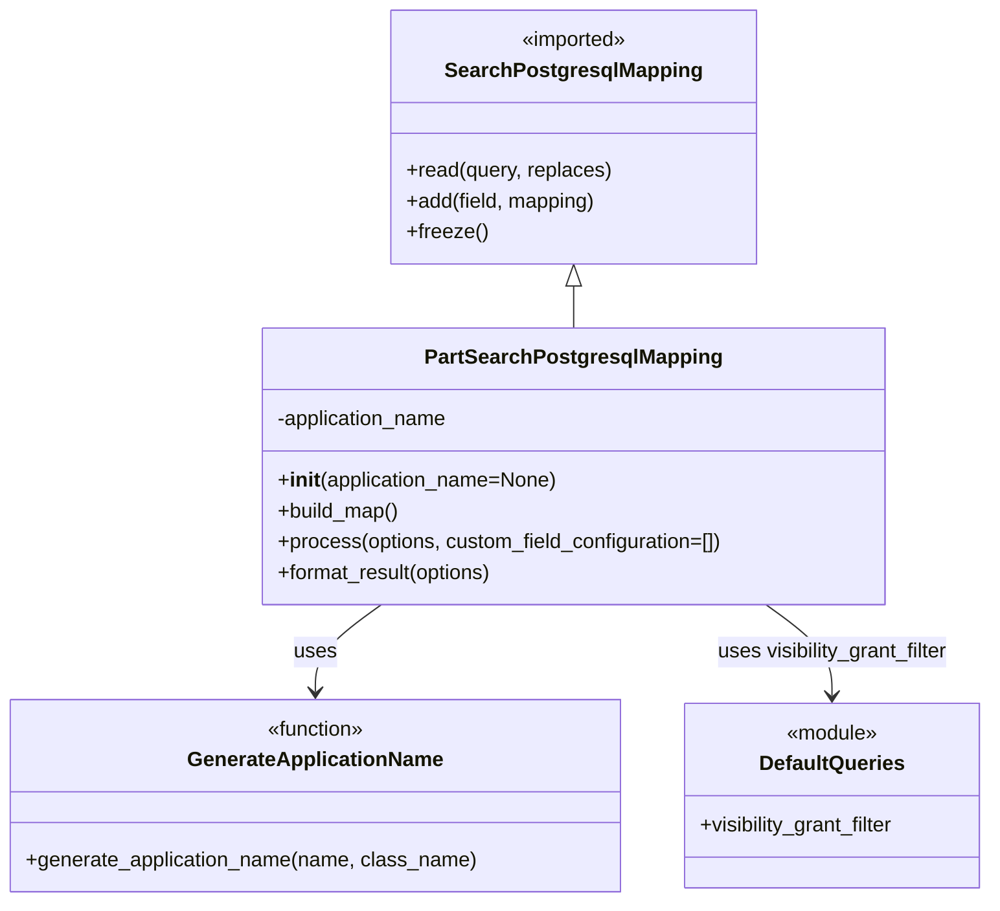

# Diagram: partview_core/partview_service/partview_service/persistence/sql/postgresql/PartSearchPostgresqlMapping.py

> Auto-generated by Obscura crawlers

## Mermaid

### SVG

<svg id="container" width="774.828125" xmlns="http://www.w3.org/2000/svg" class="classDiagram" height="704" viewBox="0 0 774.828125 704" role="graphics-document document" aria-roledescription="class"><g><defs><marker id="container_class-aggregationStart" class="marker aggregation class" refX="18" refY="7" markerWidth="190" markerHeight="240" orient="auto"><path d="M 18,7 L9,13 L1,7 L9,1 Z"></path></marker></defs><defs><marker id="container_class-aggregationEnd" class="marker aggregation class" refX="1" refY="7" markerWidth="20" markerHeight="28" orient="auto"><path d="M 18,7 L9,13 L1,7 L9,1 Z"></path></marker></defs><defs><marker id="container_class-extensionStart" class="marker extension class" refX="18" refY="7" markerWidth="190" markerHeight="240" orient="auto"><path d="M 1,7 L18,13 V 1 Z"></path></marker></defs><defs><marker id="container_class-extensionEnd" class="marker extension class" refX="1" refY="7" markerWidth="20" markerHeight="28" orient="auto"><path d="M 1,1 V 13 L18,7 Z"></path></marker></defs><defs><marker id="container_class-compositionStart" class="marker composition class" refX="18" refY="7" markerWidth="190" markerHeight="240" orient="auto"><path d="M 18,7 L9,13 L1,7 L9,1 Z"></path></marker></defs><defs><marker id="container_class-compositionEnd" class="marker composition class" refX="1" refY="7" markerWidth="20" markerHeight="28" orient="auto"><path d="M 18,7 L9,13 L1,7 L9,1 Z"></path></marker></defs><defs><marker id="container_class-dependencyStart" class="marker dependency class" refX="6" refY="7" markerWidth="190" markerHeight="240" orient="auto"><path d="M 5,7 L9,13 L1,7 L9,1 Z"></path></marker></defs><defs><marker id="container_class-dependencyEnd" class="marker dependency class" refX="13" refY="7" markerWidth="20" markerHeight="28" orient="auto"><path d="M 18,7 L9,13 L14,7 L9,1 Z"></path></marker></defs><defs><marker id="container_class-lollipopStart" class="marker lollipop class" refX="13" refY="7" markerWidth="190" markerHeight="240" orient="auto"><circle stroke="black" fill="transparent" cx="7" cy="7" r="6"></circle></marker></defs><defs><marker id="container_class-lollipopEnd" class="marker lollipop class" refX="1" refY="7" markerWidth="190" markerHeight="240" orient="auto"><circle stroke="black" fill="transparent" cx="7" cy="7" r="6"></circle></marker></defs><g class="root"><g class="clusters"></g><g class="edgePaths"><path d="M446.602,223.25L446.602,224.542C446.602,225.833,446.602,228.417,446.602,233.875C446.602,239.333,446.602,247.667,446.602,251.833L446.602,256" id="id_SearchPostgresqlMapping_PartSearchPostgresqlMapping_1" class="edge-thickness-normal edge-pattern-solid relation" style=";;;" data-edge="true" data-et="edge" data-id="id_SearchPostgresqlMapping_PartSearchPostgresqlMapping_1" data-points="W3sieCI6NDQ2LjYwMTU2MjUsInkiOjIwNn0seyJ4Ijo0NDYuNjAxNTYyNSwieSI6MjMxfSx7IngiOjQ0Ni42MDE1NjI1LCJ5IjoyNTZ9XQ==" marker-start="url(#container_class-extensionStart)"></path><path d="M295.992,472L287.393,478.167C278.793,484.333,261.594,496.667,252.994,508C244.395,519.333,244.395,529.667,244.395,534.833L244.395,540" id="id_PartSearchPostgresqlMapping_GenerateApplicationName_2" class="edge-thickness-normal edge-pattern-solid relation" style=";;;" data-edge="true" data-et="edge" data-id="id_PartSearchPostgresqlMapping_GenerateApplicationName_2" data-points="W3sieCI6Mjk1Ljk5MjE4NzUsInkiOjQ3Mn0seyJ4IjoyNDQuMzk0NTMxMjUsInkiOjUwOX0seyJ4IjoyNDQuMzk0NTMxMjUsInkiOjU0Nn1d" marker-end="url(#container_class-dependencyEnd)"></path><path d="M597.211,472L605.811,478.167C614.41,484.333,631.609,496.667,640.209,508.5C648.809,520.333,648.809,531.667,648.809,537.333L648.809,543" id="id_PartSearchPostgresqlMapping_DefaultQueries_3" class="edge-thickness-normal edge-pattern-solid relation" style=";;;" data-edge="true" data-et="edge" data-id="id_PartSearchPostgresqlMapping_DefaultQueries_3" data-points="W3sieCI6NTk3LjIxMDkzNzUsInkiOjQ3Mn0seyJ4Ijo2NDguODA4NTkzNzUsInkiOjUwOX0seyJ4Ijo2NDguODA4NTkzNzUsInkiOjU0OX1d" marker-end="url(#container_class-dependencyEnd)"></path></g><g class="edgeLabels"><g class="edgeLabel"><g class="label" data-id="id_SearchPostgresqlMapping_PartSearchPostgresqlMapping_1" transform="translate(0, 0)"><foreignObject width="0" height="0">

</foreignObject></g></g><g class="edgeLabel" transform="translate(244.39453125, 509)"><g class="label" data-id="id_PartSearchPostgresqlMapping_GenerateApplicationName_2" transform="translate(-16.4921875, -12)"><foreignObject width="32.984375" height="24">

uses

</foreignObject></g></g><g class="edgeLabel" transform="translate(648.80859375, 509)"><g class="label" data-id="id_PartSearchPostgresqlMapping_DefaultQueries_3" transform="translate(-93.234375, -12)"><foreignObject width="186.46875" height="24">

uses visibility_grant_filter

</foreignObject></g></g></g><g class="nodes"><g class="node default" id="classId-SearchPostgresqlMapping-0" transform="translate(446.6015625, 107)"><g class="basic label-container"><path d="M-139.92578125 -99 L139.92578125 -99 L139.92578125 99 L-139.92578125 99" stroke="none" stroke-width="0" fill="#ECECFF" style=""></path><path d="M-139.92578125 -99 C-30.761360710850752 -99, 78.4030598282985 -99, 139.92578125 -99 M-139.92578125 -99 C-77.38998176749564 -99, -14.854182284991268 -99, 139.92578125 -99 M139.92578125 -99 C139.92578125 -25.39090871619777, 139.92578125 48.21818256760446, 139.92578125 99 M139.92578125 -99 C139.92578125 -49.186936198492525, 139.92578125 0.6261276030149503, 139.92578125 99 M139.92578125 99 C37.05738905635209 99, -65.81100313729581 99, -139.92578125 99 M139.92578125 99 C57.32779929928226 99, -25.270182651435476 99, -139.92578125 99 M-139.92578125 99 C-139.92578125 33.1719953837124, -139.92578125 -32.6560092325752, -139.92578125 -99 M-139.92578125 99 C-139.92578125 58.10958266804382, -139.92578125 17.21916533608764, -139.92578125 -99" stroke="#9370DB" stroke-width="1.3" fill="none" stroke-dasharray="0 0" style=""></path></g><g class="annotation-group text" transform="translate(-42.671875, -75)"><g class="label" style="" transform="translate(0,-12)"><foreignObject width="85.34375" height="24">

«imported»

</foreignObject></g></g><g class="label-group text" transform="translate(-95.1171875, -51)"><g class="label" style="font-weight: bolder" transform="translate(0,-12)"><foreignObject width="190.234375" height="24">

SearchPostgresqlMapping

</foreignObject></g></g><g class="members-group text" transform="translate(-127.92578125, -3)"></g><g class="methods-group text" transform="translate(-127.92578125, 27)"><g class="label" style="" transform="translate(0,-12)"><foreignObject width="160.734375" height="24">

+read(query, replaces)

</foreignObject></g><g class="label" style="" transform="translate(0,12)"><foreignObject width="149.765625" height="24">

+add(field, mapping)

</foreignObject></g><g class="label" style="" transform="translate(0,36)"><foreignObject width="62.109375" height="24">

+freeze()

</foreignObject></g></g><g class="divider" style=""><path d="M-139.92578125 -27 C-61.05505057280757 -27, 17.815680104384853 -27, 139.92578125 -27 M-139.92578125 -27 C-59.34850805513241 -27, 21.228765139735174 -27, 139.92578125 -27" stroke="#9370DB" stroke-width="1.3" fill="none" stroke-dasharray="0 0" style=""></path></g><g class="divider" style=""><path d="M-139.92578125 -3 C-31.070420625508035 -3, 77.78493999898393 -3, 139.92578125 -3 M-139.92578125 -3 C-80.06535155415762 -3, -20.204921858315217 -3, 139.92578125 -3" stroke="#9370DB" stroke-width="1.3" fill="none" stroke-dasharray="0 0" style=""></path></g></g><g class="node default" id="classId-PartSearchPostgresqlMapping-1" transform="translate(446.6015625, 364)"><g class="basic label-container"><path d="M-243.31640625 -108 L243.31640625 -108 L243.31640625 108 L-243.31640625 108" stroke="none" stroke-width="0" fill="#ECECFF" style=""></path><path d="M-243.31640625 -108 C-115.92826054602382 -108, 11.459885157952357 -108, 243.31640625 -108 M-243.31640625 -108 C-49.462964506275455 -108, 144.3904772374491 -108, 243.31640625 -108 M243.31640625 -108 C243.31640625 -59.77541257878987, 243.31640625 -11.550825157579737, 243.31640625 108 M243.31640625 -108 C243.31640625 -63.8608248348804, 243.31640625 -19.721649669760794, 243.31640625 108 M243.31640625 108 C72.794373926334 108, -97.727658397332 108, -243.31640625 108 M243.31640625 108 C123.61867485784069 108, 3.9209434656813755 108, -243.31640625 108 M-243.31640625 108 C-243.31640625 51.27653704915454, -243.31640625 -5.446925901690918, -243.31640625 -108 M-243.31640625 108 C-243.31640625 51.78649403469377, -243.31640625 -4.427011930612466, -243.31640625 -108" stroke="#9370DB" stroke-width="1.3" fill="none" stroke-dasharray="0 0" style=""></path></g><g class="annotation-group text" transform="translate(0, -84)"></g><g class="label-group text" transform="translate(-110.1796875, -84)"><g class="label" style="font-weight: bolder" transform="translate(0,-12)"><foreignObject width="220.359375" height="24">

PartSearchPostgresqlMapping

</foreignObject></g></g><g class="members-group text" transform="translate(-231.31640625, -36)"><g class="label" style="" transform="translate(0,-12)"><foreignObject width="137.15625" height="24">

-application_name

</foreignObject></g></g><g class="methods-group text" transform="translate(-231.31640625, 12)"><g class="label" style="" transform="translate(0,-12)"><foreignObject width="220.109375" height="24">

+<strong>init</strong>(application_name=None)

</foreignObject></g><g class="label" style="" transform="translate(0,12)"><foreignObject width="96.109375" height="24">

+build_map()

</foreignObject></g><g class="label" style="" transform="translate(0,36)"><foreignObject width="352.453125" height="24">

+process(options, custom_field_configuration=[])

</foreignObject></g><g class="label" style="" transform="translate(0,60)"><foreignObject width="172.34375" height="24">

+format_result(options)

</foreignObject></g></g><g class="divider" style=""><path d="M-243.31640625 -60 C-106.60278242527252 -60, 30.110841399454955 -60, 243.31640625 -60 M-243.31640625 -60 C-91.25744221390872 -60, 60.801521822182565 -60, 243.31640625 -60" stroke="#9370DB" stroke-width="1.3" fill="none" stroke-dasharray="0 0" style=""></path></g><g class="divider" style=""><path d="M-243.31640625 -12 C-137.96828991051342 -12, -32.62017357102681 -12, 243.31640625 -12 M-243.31640625 -12 C-144.52355225829592 -12, -45.730698266591844 -12, 243.31640625 -12" stroke="#9370DB" stroke-width="1.3" fill="none" stroke-dasharray="0 0" style=""></path></g></g><g class="node default" id="classId-GenerateApplicationName-2" transform="translate(244.39453125, 621)"><g class="basic label-container"><path d="M-236.39453125 -75 L236.39453125 -75 L236.39453125 75 L-236.39453125 75" stroke="none" stroke-width="0" fill="#ECECFF" style=""></path><path d="M-236.39453125 -75 C-73.27113576764441 -75, 89.85225971471118 -75, 236.39453125 -75 M-236.39453125 -75 C-129.93638865646582 -75, -23.478246062931646 -75, 236.39453125 -75 M236.39453125 -75 C236.39453125 -43.8986347459374, 236.39453125 -12.797269491874793, 236.39453125 75 M236.39453125 -75 C236.39453125 -26.56120014999039, 236.39453125 21.877599700019218, 236.39453125 75 M236.39453125 75 C63.37720592042376 75, -109.64011940915248 75, -236.39453125 75 M236.39453125 75 C105.41822331492668 75, -25.558084620146644 75, -236.39453125 75 M-236.39453125 75 C-236.39453125 16.946426205473088, -236.39453125 -41.107147589053824, -236.39453125 -75 M-236.39453125 75 C-236.39453125 37.70642263281873, -236.39453125 0.4128452656374577, -236.39453125 -75" stroke="#9370DB" stroke-width="1.3" fill="none" stroke-dasharray="0 0" style=""></path></g><g class="annotation-group text" transform="translate(-39.484375, -51)"><g class="label" style="" transform="translate(0,-12)"><foreignObject width="78.96875" height="24">

«function»

</foreignObject></g></g><g class="label-group text" transform="translate(-95.8203125, -27)"><g class="label" style="font-weight: bolder" transform="translate(0,-12)"><foreignObject width="191.640625" height="24">

GenerateApplicationName

</foreignObject></g></g><g class="members-group text" transform="translate(-224.39453125, 21)"></g><g class="methods-group text" transform="translate(-224.39453125, 51)"><g class="label" style="" transform="translate(0,-12)"><foreignObject width="352.96875" height="24">

+generate_application_name(name, class_name)

</foreignObject></g></g><g class="divider" style=""><path d="M-236.39453125 -3 C-114.06527438852092 -3, 8.263982472958162 -3, 236.39453125 -3 M-236.39453125 -3 C-113.01714336796671 -3, 10.36024451406658 -3, 236.39453125 -3" stroke="#9370DB" stroke-width="1.3" fill="none" stroke-dasharray="0 0" style=""></path></g><g class="divider" style=""><path d="M-236.39453125 21 C-109.45975581425925 21, 17.475019621481493 21, 236.39453125 21 M-236.39453125 21 C-87.36377770120612 21, 61.666975847587764 21, 236.39453125 21" stroke="#9370DB" stroke-width="1.3" fill="none" stroke-dasharray="0 0" style=""></path></g></g><g class="node default" id="classId-DefaultQueries-3" transform="translate(648.80859375, 621)"><g class="basic label-container"><path d="M-118.01953125 -72 L118.01953125 -72 L118.01953125 72 L-118.01953125 72" stroke="none" stroke-width="0" fill="#ECECFF" style=""></path><path d="M-118.01953125 -72 C-40.05467668886227 -72, 37.910177872275455 -72, 118.01953125 -72 M-118.01953125 -72 C-44.68342817982381 -72, 28.652674890352387 -72, 118.01953125 -72 M118.01953125 -72 C118.01953125 -25.924754055107428, 118.01953125 20.150491889785144, 118.01953125 72 M118.01953125 -72 C118.01953125 -19.534862031283424, 118.01953125 32.93027593743315, 118.01953125 72 M118.01953125 72 C70.19947744256456 72, 22.3794236351291 72, -118.01953125 72 M118.01953125 72 C67.53059278209537 72, 17.041654314190723 72, -118.01953125 72 M-118.01953125 72 C-118.01953125 35.37550175522429, -118.01953125 -1.2489964895514163, -118.01953125 -72 M-118.01953125 72 C-118.01953125 32.5201831755976, -118.01953125 -6.959633648804797, -118.01953125 -72" stroke="#9370DB" stroke-width="1.3" fill="none" stroke-dasharray="0 0" style=""></path></g><g class="annotation-group text" transform="translate(-36.6015625, -48)"><g class="label" style="" transform="translate(0,-12)"><foreignObject width="73.203125" height="24">

«module»

</foreignObject></g></g><g class="label-group text" transform="translate(-54.9609375, -24)"><g class="label" style="font-weight: bolder" transform="translate(0,-12)"><foreignObject width="109.921875" height="24">

DefaultQueries

</foreignObject></g></g><g class="members-group text" transform="translate(-106.01953125, 24)"><g class="label" style="" transform="translate(0,-12)"><foreignObject width="157.078125" height="24">

+visibility_grant_filter

</foreignObject></g></g><g class="methods-group text" transform="translate(-106.01953125, 72)"></g><g class="divider" style=""><path d="M-118.01953125 0 C-64.40767988486746 0, -10.795828519734926 0, 118.01953125 0 M-118.01953125 0 C-29.12773975555848 0, 59.76405173888304 0, 118.01953125 0" stroke="#9370DB" stroke-width="1.3" fill="none" stroke-dasharray="0 0" style=""></path></g><g class="divider" style=""><path d="M-118.01953125 48 C-50.32564616684668 48, 17.368238916306638 48, 118.01953125 48 M-118.01953125 48 C-25.965544347381822 48, 66.08844255523636 48, 118.01953125 48" stroke="#9370DB" stroke-width="1.3" fill="none" stroke-dasharray="0 0" style=""></path></g></g></g></g></g></svg>
