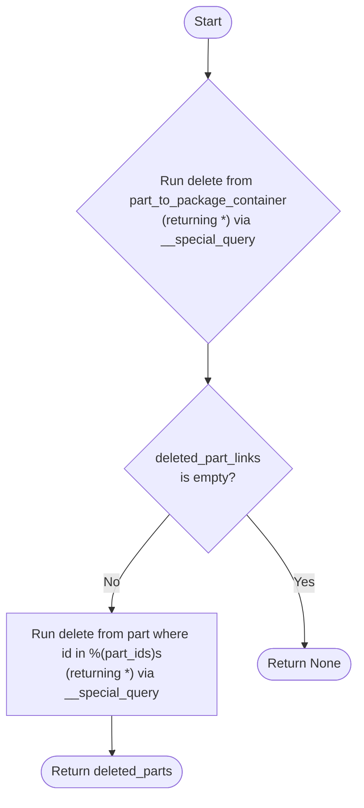

# Diagram: partview_core/partview_service/partview_service/persistence/sql/postgresql/PartToContainerPostgresqlMapping.py


> Auto-generated by Obscura crawlers

## Diagram 1

```mermaid
classDiagram
    class BasePostgresqlMapping {
        <<abstract>>
        +__init__(table_name, application_name=None)
        +freeze()
        +add(key, column)
        +get_primary_database_connector()
    }
    class PartToContainerPostgresqlMapping {
        +__init__(application_name=None)
        +build_map()
        +__special_query(query, replaces={})
        +delete_dup_parts_from_container(container_id, parts)
        -table: "part_to_package_container"
    }
    BasePostgresqlMapping <|-- PartToContainerPostgresqlMapping
```

> SVG rendering failed for this diagram.

## Diagram 2



### SVG

<svg id="container" width="461.7020263671875" xmlns="http://www.w3.org/2000/svg" class="flowchart" height="1114.328125" viewBox="0 0 461.7020263671875 1114.328125" role="graphics-document document" aria-roledescription="flowchart-v2"><style>#container{font-family:"trebuchet ms",verdana,arial,sans-serif;font-size:16px;fill:#333;}@keyframes edge-animation-frame{from{stroke-dashoffset:0;}}@keyframes dash{to{stroke-dashoffset:0;}}#container .edge-animation-slow{stroke-dasharray:9,5!important;stroke-dashoffset:900;animation:dash 50s linear infinite;stroke-linecap:round;}#container .edge-animation-fast{stroke-dasharray:9,5!important;stroke-dashoffset:900;animation:dash 20s linear infinite;stroke-linecap:round;}#container .error-icon{fill:#552222;}#container .error-text{fill:#552222;stroke:#552222;}#container .edge-thickness-normal{stroke-width:1px;}#container .edge-thickness-thick{stroke-width:3.5px;}#container .edge-pattern-solid{stroke-dasharray:0;}#container .edge-thickness-invisible{stroke-width:0;fill:none;}#container .edge-pattern-dashed{stroke-dasharray:3;}#container .edge-pattern-dotted{stroke-dasharray:2;}#container .marker{fill:#333333;stroke:#333333;}#container .marker.cross{stroke:#333333;}#container svg{font-family:"trebuchet ms",verdana,arial,sans-serif;font-size:16px;}#container p{margin:0;}#container .label{font-family:"trebuchet ms",verdana,arial,sans-serif;color:#333;}#container .cluster-label text{fill:#333;}#container .cluster-label span{color:#333;}#container .cluster-label span p{background-color:transparent;}#container .label text,#container span{fill:#333;color:#333;}#container .node rect,#container .node circle,#container .node ellipse,#container .node polygon,#container .node path{fill:#ECECFF;stroke:#9370DB;stroke-width:1px;}#container .rough-node .label text,#container .node .label text,#container .image-shape .label,#container .icon-shape .label{text-anchor:middle;}#container .node .katex path{fill:#000;stroke:#000;stroke-width:1px;}#container .rough-node .label,#container .node .label,#container .image-shape .label,#container .icon-shape .label{text-align:center;}#container .node.clickable{cursor:pointer;}#container .root .anchor path{fill:#333333!important;stroke-width:0;stroke:#333333;}#container .arrowheadPath{fill:#333333;}#container .edgePath .path{stroke:#333333;stroke-width:2.0px;}#container .flowchart-link{stroke:#333333;fill:none;}#container .edgeLabel{background-color:rgba(232,232,232, 0.8);text-align:center;}#container .edgeLabel p{background-color:rgba(232,232,232, 0.8);}#container .edgeLabel rect{opacity:0.5;background-color:rgba(232,232,232, 0.8);fill:rgba(232,232,232, 0.8);}#container .labelBkg{background-color:rgba(232, 232, 232, 0.5);}#container .cluster rect{fill:#ffffde;stroke:#aaaa33;stroke-width:1px;}#container .cluster text{fill:#333;}#container .cluster span{color:#333;}#container div.mermaidTooltip{position:absolute;text-align:center;max-width:200px;padding:2px;font-family:"trebuchet ms",verdana,arial,sans-serif;font-size:12px;background:hsl(80, 100%, 96.2745098039%);border:1px solid #aaaa33;border-radius:2px;pointer-events:none;z-index:100;}#container .flowchartTitleText{text-anchor:middle;font-size:18px;fill:#333;}#container rect.text{fill:none;stroke-width:0;}#container .icon-shape,#container .image-shape{background-color:rgba(232,232,232, 0.8);text-align:center;}#container .icon-shape p,#container .image-shape p{background-color:rgba(232,232,232, 0.8);padding:2px;}#container .icon-shape rect,#container .image-shape rect{opacity:0.5;background-color:rgba(232,232,232, 0.8);fill:rgba(232,232,232, 0.8);}#container .label-icon{display:inline-block;height:1em;overflow:visible;vertical-align:-0.125em;}#container .node .label-icon path{fill:currentColor;stroke:revert;stroke-width:revert;}#container :root{--mermaid-font-family:"trebuchet ms",verdana,arial,sans-serif;}</style><g><marker id="container_flowchart-v2-pointEnd" class="marker flowchart-v2" viewBox="0 0 10 10" refX="5" refY="5" markerUnits="userSpaceOnUse" markerWidth="8" markerHeight="8" orient="auto"><path d="M 0 0 L 10 5 L 0 10 z" class="arrowMarkerPath" style="stroke-width: 1; stroke-dasharray: 1, 0;"></path></marker><marker id="container_flowchart-v2-pointStart" class="marker flowchart-v2" viewBox="0 0 10 10" refX="4.5" refY="5" markerUnits="userSpaceOnUse" markerWidth="8" markerHeight="8" orient="auto"><path d="M 0 5 L 10 10 L 10 0 z" class="arrowMarkerPath" style="stroke-width: 1; stroke-dasharray: 1, 0;"></path></marker><marker id="container_flowchart-v2-circleEnd" class="marker flowchart-v2" viewBox="0 0 10 10" refX="11" refY="5" markerUnits="userSpaceOnUse" markerWidth="11" markerHeight="11" orient="auto"><circle cx="5" cy="5" r="5" class="arrowMarkerPath" style="stroke-width: 1; stroke-dasharray: 1, 0;"></circle></marker><marker id="container_flowchart-v2-circleStart" class="marker flowchart-v2" viewBox="0 0 10 10" refX="-1" refY="5" markerUnits="userSpaceOnUse" markerWidth="11" markerHeight="11" orient="auto"><circle cx="5" cy="5" r="5" class="arrowMarkerPath" style="stroke-width: 1; stroke-dasharray: 1, 0;"></circle></marker><marker id="container_flowchart-v2-crossEnd" class="marker cross flowchart-v2" viewBox="0 0 11 11" refX="12" refY="5.2" markerUnits="userSpaceOnUse" markerWidth="11" markerHeight="11" orient="auto"><path d="M 1,1 l 9,9 M 10,1 l -9,9" class="arrowMarkerPath" style="stroke-width: 2; stroke-dasharray: 1, 0;"></path></marker><marker id="container_flowchart-v2-crossStart" class="marker cross flowchart-v2" viewBox="0 0 11 11" refX="-1" refY="5.2" markerUnits="userSpaceOnUse" markerWidth="11" markerHeight="11" orient="auto"><path d="M 1,1 l 9,9 M 10,1 l -9,9" class="arrowMarkerPath" style="stroke-width: 2; stroke-dasharray: 1, 0;"></path></marker><g class="root"><g class="clusters"></g><g class="edgePaths"><path d="M257.538,47.5L257.455,51.583C257.371,55.667,257.205,63.833,257.121,71.417C257.038,79,257.038,86,257.038,89.5L257.038,93" id="L_Start_QueryDeleteLinks_0" class="edge-thickness-normal edge-pattern-solid edge-thickness-normal edge-pattern-solid flowchart-link" style=";" data-edge="true" data-et="edge" data-id="L_Start_QueryDeleteLinks_0" data-points="W3sieCI6MjU3LjUzNzk2MDA1MjQ5MDIzLCJ5Ijo0Ny41fSx7IngiOjI1Ny4wMzc5NjAwNTI0OTAyMywieSI6NzJ9LHsieCI6MjU3LjAzNzk2MDA1MjQ5MDIzLCJ5Ijo5N31d" marker-end="url(#container_flowchart-v2-pointEnd)"></path><path d="M257.038,489.328L257.038,493.495C257.038,497.661,257.038,505.995,257.038,513.661C257.038,521.328,257.038,528.328,257.038,531.828L257.038,535.328" id="L_QueryDeleteLinks_HasDeletedLinks_0" class="edge-thickness-normal edge-pattern-solid edge-thickness-normal edge-pattern-solid flowchart-link" style=";" data-edge="true" data-et="edge" data-id="L_QueryDeleteLinks_HasDeletedLinks_0" data-points="W3sieCI6MjU3LjAzNzk2MDA1MjQ5MDIzLCJ5Ijo0ODkuMzI4MTI1fSx7IngiOjI1Ny4wMzc5NjAwNTI0OTAyMywieSI6NTE0LjMyODEyNX0seyJ4IjoyNTcuMDM3OTYwMDUyNDkwMjMsInkiOjUzOS4zMjgxMjV9XQ==" marker-end="url(#container_flowchart-v2-pointEnd)"></path><path d="M200.956,761.246L190.463,776.76C179.971,792.274,158.985,823.301,148.493,844.314C138,865.328,138,876.328,138,881.828L138,887.328" id="L_HasDeletedLinks_DeleteParts_0" class="edge-thickness-normal edge-pattern-solid edge-thickness-normal edge-pattern-solid flowchart-link" style=";" data-edge="true" data-et="edge" data-id="L_HasDeletedLinks_DeleteParts_0" data-points="W3sieCI6MjAwLjk1NjEwMzg1ODk2MDQ2LCJ5Ijo3NjEuMjQ2MjY4ODA2NDcwMn0seyJ4IjoxMzgsInkiOjg1NC4zMjgxMjV9LHsieCI6MTM4LCJ5Ijo4OTEuMzI4MTI1fV0=" marker-end="url(#container_flowchart-v2-pointEnd)"></path><path d="M138,1017.328L138,1021.495C138,1025.661,138,1033.995,138.07,1041.745C138.141,1049.495,138.281,1056.662,138.351,1060.245L138.422,1063.829" id="L_DeleteParts_ReturnDeletedParts_0" class="edge-thickness-normal edge-pattern-solid edge-thickness-normal edge-pattern-solid flowchart-link" style=";" data-edge="true" data-et="edge" data-id="L_DeleteParts_ReturnDeletedParts_0" data-points="W3sieCI6MTM4LCJ5IjoxMDE3LjMyODEyNX0seyJ4IjoxMzgsInkiOjEwNDIuMzI4MTI1fSx7IngiOjEzOC41LCJ5IjoxMDY3LjgyODEyNX1d" marker-end="url(#container_flowchart-v2-pointEnd)"></path><path d="M313.12,761.246L323.613,776.76C334.105,792.274,355.091,823.301,365.662,851.648C376.234,879.995,376.393,905.662,376.472,918.495L376.551,931.328" id="L_HasDeletedLinks_ReturnNone_0" class="edge-thickness-normal edge-pattern-solid edge-thickness-normal edge-pattern-solid flowchart-link" style=";" data-edge="true" data-et="edge" data-id="L_HasDeletedLinks_ReturnNone_0" data-points="W3sieCI6MzEzLjExOTgxNjI0NjAyLCJ5Ijo3NjEuMjQ2MjY4ODA2NDcwMn0seyJ4IjozNzYuMDc1OTIwMTA0OTgwNDcsInkiOjg1NC4zMjgxMjV9LHsieCI6Mzc2LjU3NTkyMDEwNDk4MDQ3LCJ5Ijo5MzUuMzI4MTI1fV0=" marker-end="url(#container_flowchart-v2-pointEnd)"></path></g><g class="edgeLabels"><g class="edgeLabel"><g class="label" data-id="L_Start_QueryDeleteLinks_0" transform="translate(0, 0)"><foreignObject width="0" height="0"><div xmlns="http://www.w3.org/1999/xhtml" class="labelBkg" style="display: table-cell; white-space: nowrap; line-height: 1.5; max-width: 200px; text-align: center;"><span class="edgeLabel"></span></div></foreignObject></g></g><g class="edgeLabel"><g class="label" data-id="L_QueryDeleteLinks_HasDeletedLinks_0" transform="translate(0, 0)"><foreignObject width="0" height="0"><div xmlns="http://www.w3.org/1999/xhtml" class="labelBkg" style="display: table-cell; white-space: nowrap; line-height: 1.5; max-width: 200px; text-align: center;"><span class="edgeLabel"></span></div></foreignObject></g></g><g class="edgeLabel" transform="translate(138, 854.328125)"><g class="label" data-id="L_HasDeletedLinks_DeleteParts_0" transform="translate(-10.140625, -12)"><foreignObject width="20.28125" height="24"><div xmlns="http://www.w3.org/1999/xhtml" class="labelBkg" style="display: table-cell; white-space: nowrap; line-height: 1.5; max-width: 200px; text-align: center;"><span class="edgeLabel"><p>No</p></span></div></foreignObject></g></g><g class="edgeLabel"><g class="label" data-id="L_DeleteParts_ReturnDeletedParts_0" transform="translate(0, 0)"><foreignObject width="0" height="0"><div xmlns="http://www.w3.org/1999/xhtml" class="labelBkg" style="display: table-cell; white-space: nowrap; line-height: 1.5; max-width: 200px; text-align: center;"><span class="edgeLabel"></span></div></foreignObject></g></g><g class="edgeLabel" transform="translate(376.07592010498047, 854.328125)"><g class="label" data-id="L_HasDeletedLinks_ReturnNone_0" transform="translate(-12.03125, -12)"><foreignObject width="24.0625" height="24"><div xmlns="http://www.w3.org/1999/xhtml" class="labelBkg" style="display: table-cell; white-space: nowrap; line-height: 1.5; max-width: 200px; text-align: center;"><span class="edgeLabel"><p>Yes</p></span></div></foreignObject></g></g></g><g class="nodes"><g class="node default" id="flowchart-Start-0" transform="translate(257.03796005249023, 27.5)"><g class="basic label-container outer-path"><path d="M-10.3984375 -19.5 C-4.6769498577215955 -19.5, 1.044537784556809 -19.5, 10.3984375 -19.5 C10.3984375 -19.5, 10.3984375 -19.5, 10.398437499999998 -19.5 C10.896665884464422 -19.484022785452947, 11.394894268928848 -19.468045570905893, 11.6478067896239 -19.45993515863156 C12.052122545004574 -19.420931303970825, 12.45643830038525 -19.381927449310087, 12.892042152847864 -19.3399052695533 C13.302822841382502 -19.273493433482837, 13.713603529917142 -19.207081597412376, 14.126030759676757 -19.140403561325776 C14.545921046880459 -19.044566343311725, 14.96581133408416 -18.948729125297675, 15.34470188623539 -18.862249829261074 C15.75340202653179 -18.740949772931916, 16.16210216682819 -18.619649716602762, 16.543047751460602 -18.50658706670804 C16.908502191188 -18.37209645466455, 17.273956630915396 -18.237605842621058, 17.716144095147794 -18.074876768247425 C17.947611956549856 -17.97241281225488, 18.17907981795192 -17.86994885626234, 18.85917041279238 -17.568892924097174 C19.16358321551273 -17.410080959903674, 19.467996018233084 -17.251268995710173, 19.967429764076783 -16.990714730406097 C20.304670803285088 -16.786277230589693, 20.641911842493396 -16.58183973077329, 21.036368073605697 -16.342718045390892 C21.28248994875812 -16.17103407972882, 21.528611823910538 -15.999350114066747, 22.061592844578712 -15.627565626425154 C22.334283360878395 -15.410102196275554, 22.606973877178074 -15.192638766125956, 23.03889120850187 -14.848196188198123 C23.33538660134427 -14.578926917256869, 23.631881994186667 -14.309657646315614, 23.964247236767985 -14.007812326905688 C24.203340497886998 -13.7609289048785, 24.442433759006015 -13.514045482851312, 24.833858442968648 -13.10986736009568 C25.155218664470475 -12.732379358005016, 25.4765788859723 -12.354891355914353, 25.644151408126582 -12.158051136245305 C25.87928121090953 -11.842998621281856, 26.114411013692475 -11.527946106318405, 26.391796464640635 -11.156274872382312 C26.539822284369496 -10.928867462780588, 26.68784810409836 -10.701460053178863, 27.073721378604247 -10.108655082055241 C27.296813478547495 -9.712532468081253, 27.519905578490743 -9.316409854107265, 27.6871239742735 -9.019496659696287 C27.841820311551693 -8.698266405366748, 27.996516648829886 -8.37703615103721, 28.22948364880834 -7.893275190886684 C28.389847012576197 -7.49717458196536, 28.550210376344054 -7.101073973044036, 28.698571729970325 -6.734618561215508 C28.78653249851684 -6.469694740998638, 28.87449326706336 -6.204770920781769, 29.09246063421488 -5.548287939305138 C29.210044284506182 -5.099890519668011, 29.32762793479748 -4.651493100030885, 29.40953178754556 -4.339158212148133 C29.458207654163406 -4.089217924713557, 29.506883520781248 -3.83927763727898, 29.648482276581777 -3.1121979531509023 C29.692648564369154 -2.7696529466920023, 29.736814852156535 -2.4271079402331024, 29.808330202509367 -1.872449005199798 C29.83061098679195 -1.5254078052732052, 29.852891771074532 -1.1783666053466124, 29.888418715913414 -0.6250057626472757 C29.888418715913414 -0.2618668343832507, 29.888418715913414 0.1012720938807743, 29.888418715913414 0.625005762647271 C29.8643573757123 0.9997805582438613, 29.840296035511187 1.3745553538404516, 29.808330202509367 1.8724490051997846 C29.775358299145314 2.1281725766526067, 29.742386395781264 2.383896148105429, 29.648482276581777 3.1121979531508885 C29.563663477820572 3.547724558330212, 29.478844679059367 3.983251163509536, 29.40953178754556 4.339158212148129 C29.330281830821228 4.641372644286524, 29.251031874096896 4.943587076424921, 29.092460634214884 5.548287939305125 C28.98710931162084 5.865589337504635, 28.8817579890268 6.182890735704144, 28.69857172997033 6.734618561215495 C28.51952102917722 7.17687725388428, 28.340470328384107 7.619135946553066, 28.229483648808344 7.893275190886679 C28.029334685139695 8.308888796446407, 27.82918572147105 8.724502402006134, 27.687123974273504 9.019496659696284 C27.50699046832052 9.339341940011215, 27.326856962367536 9.659187220326148, 27.07372137860425 10.108655082055236 C26.898061957961165 10.378515123322043, 26.72240253731808 10.648375164588849, 26.39179646464064 11.156274872382301 C26.113853533831385 11.528693078544807, 25.83591060302213 11.90111128470731, 25.644151408126582 12.158051136245302 C25.45355721447409 12.381933921226368, 25.262963020821594 12.605816706207435, 24.83385844296866 13.10986736009567 C24.576811375888408 13.375289560812718, 24.319764308808153 13.640711761529765, 23.96424723676799 14.007812326905684 C23.5992371005777 14.339304874954722, 23.234226964387414 14.670797423003762, 23.038891208501887 14.848196188198111 C22.703320198327244 15.115805138892776, 22.367749188152597 15.383414089587442, 22.061592844578715 15.627565626425152 C21.698889966942495 15.880571452709665, 21.33618708930628 16.133577278994178, 21.036368073605708 16.34271804539089 C20.80252463971523 16.48447530923185, 20.568681205824753 16.62623257307281, 19.967429764076787 16.990714730406093 C19.625833008360903 17.168925539059906, 19.28423625264502 17.347136347713718, 18.859170412792388 17.56889292409717 C18.46822297601915 17.741953757313016, 18.07727553924591 17.91501459052886, 17.716144095147804 18.07487676824742 C17.404237112193957 18.189661421210978, 17.09233012924011 18.30444607417454, 16.543047751460616 18.506587066708033 C16.197758361789926 18.609067145101303, 15.852468972119235 18.711547223494573, 15.344701886235413 18.86224982926107 C14.985226766981594 18.944297679436374, 14.625751647727775 19.026345529611678, 14.126030759676766 19.140403561325773 C13.68820463230946 19.21118789420619, 13.250378504942155 19.28197222708661, 12.892042152847878 19.3399052695533 C12.446750923733381 19.382861978884918, 12.001459694618884 19.425818688216538, 11.6478067896239 19.45993515863156 C11.266841924766464 19.472151960344412, 10.885877059909028 19.484368762057265, 10.398437500000004 19.5 C10.398437500000002 19.5, 10.398437500000002 19.5, 10.3984375 19.5 C2.1469192312287326 19.5, -6.104599037542535 19.5, -10.398437499999996 19.5 C-10.715044607616955 19.489847026297074, -11.031651715233911 19.479694052594148, -11.647806789623893 19.45993515863156 C-12.056539696087027 19.4205051867183, -12.465272602550161 19.38107521480504, -12.892042152847871 19.3399052695533 C-13.360863371135585 19.264109890743388, -13.829684589423298 19.188314511933477, -14.126030759676759 19.140403561325773 C-14.502364746230588 19.05450778470363, -14.878698732784418 18.96861200808149, -15.344701886235388 18.862249829261074 C-15.67069871792094 18.765495680809092, -15.99669554960649 18.66874153235711, -16.54304775146059 18.506587066708043 C-16.891483038326893 18.37835966024076, -17.239918325193198 18.250132253773476, -17.716144095147797 18.074876768247425 C-18.095319655177907 17.907026995665447, -18.47449521520802 17.739177223083466, -18.85917041279238 17.568892924097174 C-19.122629491023925 17.431446491737372, -19.38608856925547 17.294000059377566, -19.96742976407678 16.990714730406097 C-20.382556118149214 16.739062695014145, -20.79768247222165 16.487410659622192, -21.036368073605686 16.3427180453909 C-21.343467506441648 16.12849877516472, -21.65056693927761 15.914279504938536, -22.061592844578712 15.627565626425156 C-22.32095849388891 15.420728423110067, -22.580324143199107 15.213891219794979, -23.03889120850187 14.848196188198125 C-23.342125651141547 14.572806690536469, -23.64536009378122 14.29741719287481, -23.964247236767974 14.007812326905697 C-24.27100744764467 13.691057223693809, -24.57776765852137 13.37430212048192, -24.833858442968655 13.109867360095677 C-25.035316673251405 12.873223059507515, -25.236774903534155 12.636578758919352, -25.64415140812658 12.158051136245307 C-25.93203843644774 11.772308745342771, -26.219925464768902 11.386566354440236, -26.391796464640635 11.156274872382316 C-26.609638662334625 10.821610757903658, -26.82748086002862 10.486946643424998, -27.073721378604244 10.108655082055249 C-27.198877400125166 9.886427892423415, -27.324033421646085 9.66420070279158, -27.6871239742735 9.019496659696289 C-27.837912325958744 8.706381421068011, -27.988700677643983 8.393266182439731, -28.22948364880834 7.893275190886686 C-28.362249203469794 7.565341704025515, -28.49501475813125 7.237408217164345, -28.698571729970325 6.73461856121551 C-28.814900239230326 6.384255625755316, -28.931228748490323 6.033892690295122, -29.09246063421488 5.5482879393051325 C-29.209961893813578 5.100204711087256, -29.32746315341227 4.652121482869381, -29.409531787545557 4.339158212148136 C-29.463983899219645 4.059558127159583, -29.51843601089373 3.7799580421710304, -29.648482276581777 3.112197953150904 C-29.682307218886457 2.8498583801261583, -29.716132161191137 2.5875188071014126, -29.808330202509364 1.872449005199809 C-29.825893459635044 1.59888709866136, -29.843456716760723 1.3253251921229108, -29.888418715913414 0.6250057626472781 C-29.888418715913414 0.27663285996670867, -29.888418715913414 -0.07174004271386081, -29.888418715913414 -0.6250057626472687 C-29.860195206615646 -1.0646097015666427, -29.831971697317883 -1.5042136404860167, -29.808330202509367 -1.8724490051997822 C-29.75815610623968 -2.261589387871499, -29.707982009969992 -2.6507297705432165, -29.648482276581777 -3.112197953150895 C-29.600372216288 -3.3592329446945848, -29.552262155994228 -3.606267936238275, -29.40953178754556 -4.339158212148126 C-29.34342387393526 -4.591256338095197, -29.277315960324962 -4.843354464042267, -29.092460634214884 -5.548287939305123 C-28.94897731217598 -5.98043684432351, -28.80549399013708 -6.412585749341898, -28.698571729970332 -6.734618561215485 C-28.5456361329921 -7.112372442560334, -28.39270053601387 -7.490126323905184, -28.229483648808344 -7.893275190886676 C-28.057000633447686 -8.251439862828397, -27.88451761808703 -8.609604534770117, -27.687123974273504 -9.019496659696282 C-27.510291529574488 -9.333480571486096, -27.33345908487547 -9.64746448327591, -27.073721378604247 -10.108655082055243 C-26.9307498488794 -10.328297744943901, -26.78777831915455 -10.547940407832558, -26.39179646464064 -11.156274872382308 C-26.2383697641675 -11.361852673556358, -26.084943063694364 -11.567430474730408, -25.644151408126586 -12.158051136245302 C-25.360575327720905 -12.4911557362259, -25.076999247315225 -12.8242603362065, -24.833858442968662 -13.10986736009567 C-24.542391377382057 -13.41083103520496, -24.250924311795448 -13.711794710314251, -23.964247236767996 -14.007812326905677 C-23.772232535948664 -14.18219499775921, -23.580217835129332 -14.356577668612742, -23.038891208501887 -14.848196188198107 C-22.779363950137174 -15.055162270433575, -22.51983669177246 -15.262128352669041, -22.06159284457872 -15.627565626425149 C-21.77004063697498 -15.830939825357866, -21.47848842937124 -16.034314024290584, -21.03636807360571 -16.342718045390885 C-20.716039449164764 -16.536903139986936, -20.395710824723814 -16.731088234582984, -19.96742976407679 -16.99071473040609 C-19.733116852610998 -17.112955626233212, -19.49880394114521 -17.23519652206033, -18.859170412792388 -17.56889292409717 C-18.532623622836038 -17.71344550134449, -18.20607683287969 -17.85799807859181, -17.716144095147804 -18.07487676824742 C-17.311463633192574 -18.223802919072128, -16.906783171237347 -18.372729069896835, -16.54304775146062 -18.506587066708033 C-16.103703534273723 -18.63698212420425, -15.664359317086824 -18.767377181700464, -15.344701886235413 -18.862249829261067 C-14.915324601092884 -18.960252392646208, -14.485947315950357 -19.05825495603135, -14.126030759676768 -19.140403561325773 C-13.646081852997325 -19.217997978498346, -13.166132946317882 -19.29559239567092, -12.89204215284788 -19.3399052695533 C-12.568612667972179 -19.371106122978393, -12.24518318309648 -19.402306976403487, -11.647806789623903 -19.45993515863156 C-11.301264858666213 -19.471048083854424, -10.954722927708524 -19.482161009077288, -10.398437500000005 -19.5 C-10.398437500000004 -19.5, -10.398437500000002 -19.5, -10.3984375 -19.5" stroke="none" stroke-width="0" fill="#ECECFF" style=""></path><path d="M-10.3984375 -19.5 C-6.012178347530383 -19.5, -1.6259191950607654 -19.5, 10.3984375 -19.5 M-10.3984375 -19.5 C-2.1240690363360386 -19.5, 6.150299427327923 -19.5, 10.3984375 -19.5 M10.3984375 -19.5 C10.3984375 -19.5, 10.398437499999998 -19.5, 10.398437499999998 -19.5 M10.3984375 -19.5 C10.3984375 -19.5, 10.398437499999998 -19.5, 10.398437499999998 -19.5 M10.398437499999998 -19.5 C10.808732001462188 -19.48684265392791, 11.219026502924379 -19.473685307855813, 11.6478067896239 -19.45993515863156 M10.398437499999998 -19.5 C10.754053960659839 -19.488596072272088, 11.10967042131968 -19.477192144544176, 11.6478067896239 -19.45993515863156 M11.6478067896239 -19.45993515863156 C11.980639414642225 -19.427827195585838, 12.31347203966055 -19.395719232540113, 12.892042152847864 -19.3399052695533 M11.6478067896239 -19.45993515863156 C12.073457200842117 -19.418873175380853, 12.499107612060333 -19.377811192130146, 12.892042152847864 -19.3399052695533 M12.892042152847864 -19.3399052695533 C13.321796072587462 -19.270425988601225, 13.75154999232706 -19.20094670764915, 14.126030759676757 -19.140403561325776 M12.892042152847864 -19.3399052695533 C13.186081474677492 -19.292367272308883, 13.480120796507117 -19.244829275064465, 14.126030759676757 -19.140403561325776 M14.126030759676757 -19.140403561325776 C14.495433781004905 -19.05608973228762, 14.864836802333055 -18.971775903249466, 15.34470188623539 -18.862249829261074 M14.126030759676757 -19.140403561325776 C14.456222557101961 -19.065039438266318, 14.786414354527167 -18.98967531520686, 15.34470188623539 -18.862249829261074 M15.34470188623539 -18.862249829261074 C15.705569898406003 -18.75514609748369, 16.066437910576617 -18.6480423657063, 16.543047751460602 -18.50658706670804 M15.34470188623539 -18.862249829261074 C15.64021501201349 -18.774543084710185, 15.935728137791589 -18.686836340159296, 16.543047751460602 -18.50658706670804 M16.543047751460602 -18.50658706670804 C16.926216063356257 -18.36557758596139, 17.309384375251916 -18.22456810521474, 17.716144095147794 -18.074876768247425 M16.543047751460602 -18.50658706670804 C16.89286395811891 -18.377851468992215, 17.242680164777216 -18.24911587127639, 17.716144095147794 -18.074876768247425 M17.716144095147794 -18.074876768247425 C18.156397601897787 -17.87998960046547, 18.59665110864778 -17.685102432683514, 18.85917041279238 -17.568892924097174 M17.716144095147794 -18.074876768247425 C17.98313520460909 -17.95668772409877, 18.25012631407039 -17.83849867995012, 18.85917041279238 -17.568892924097174 M18.85917041279238 -17.568892924097174 C19.103877163490022 -17.44122956900037, 19.348583914187664 -17.313566213903563, 19.967429764076783 -16.990714730406097 M18.85917041279238 -17.568892924097174 C19.21833285891273 -17.381518106010713, 19.577495305033086 -17.194143287924252, 19.967429764076783 -16.990714730406097 M19.967429764076783 -16.990714730406097 C20.392341283781626 -16.73313087010376, 20.817252803486472 -16.475547009801424, 21.036368073605697 -16.342718045390892 M19.967429764076783 -16.990714730406097 C20.219456859207686 -16.837934424262134, 20.471483954338588 -16.685154118118174, 21.036368073605697 -16.342718045390892 M21.036368073605697 -16.342718045390892 C21.2543460443604 -16.19066604910668, 21.472324015115102 -16.03861405282247, 22.061592844578712 -15.627565626425154 M21.036368073605697 -16.342718045390892 C21.430449316227946 -16.067824030039656, 21.824530558850192 -15.792930014688418, 22.061592844578712 -15.627565626425154 M22.061592844578712 -15.627565626425154 C22.421254250133256 -15.340745226487364, 22.7809156556878 -15.053924826549572, 23.03889120850187 -14.848196188198123 M22.061592844578712 -15.627565626425154 C22.272880715635406 -15.459069171863824, 22.484168586692096 -15.290572717302496, 23.03889120850187 -14.848196188198123 M23.03889120850187 -14.848196188198123 C23.22598393203632 -14.678283526886336, 23.413076655570777 -14.508370865574548, 23.964247236767985 -14.007812326905688 M23.03889120850187 -14.848196188198123 C23.387092173191807 -14.531969284959397, 23.735293137881747 -14.21574238172067, 23.964247236767985 -14.007812326905688 M23.964247236767985 -14.007812326905688 C24.219550435167758 -13.744190813775516, 24.47485363356753 -13.480569300645344, 24.833858442968648 -13.10986736009568 M23.964247236767985 -14.007812326905688 C24.288638494131717 -13.672851720660097, 24.613029751495453 -13.337891114414505, 24.833858442968648 -13.10986736009568 M24.833858442968648 -13.10986736009568 C25.14478344635407 -12.74463715898528, 25.455708449739486 -12.37940695787488, 25.644151408126582 -12.158051136245305 M24.833858442968648 -13.10986736009568 C25.131324900948506 -12.76044633223158, 25.428791358928365 -12.411025304367481, 25.644151408126582 -12.158051136245305 M25.644151408126582 -12.158051136245305 C25.895401169507075 -11.821399345319584, 26.146650930887567 -11.484747554393863, 26.391796464640635 -11.156274872382312 M25.644151408126582 -12.158051136245305 C25.856932736035304 -11.872943541625373, 26.069714063944023 -11.587835947005441, 26.391796464640635 -11.156274872382312 M26.391796464640635 -11.156274872382312 C26.58220329494332 -10.86375884964438, 26.772610125246008 -10.57124282690645, 27.073721378604247 -10.108655082055241 M26.391796464640635 -11.156274872382312 C26.583232935703357 -10.862177044939708, 26.774669406766076 -10.568079217497106, 27.073721378604247 -10.108655082055241 M27.073721378604247 -10.108655082055241 C27.253756717889303 -9.788984106599667, 27.43379205717436 -9.469313131144093, 27.6871239742735 -9.019496659696287 M27.073721378604247 -10.108655082055241 C27.214039318555574 -9.859506370939501, 27.354357258506898 -9.61035765982376, 27.6871239742735 -9.019496659696287 M27.6871239742735 -9.019496659696287 C27.818872104213437 -8.745918848917619, 27.950620234153373 -8.47234103813895, 28.22948364880834 -7.893275190886684 M27.6871239742735 -9.019496659696287 C27.81698965686078 -8.749827791123332, 27.946855339448057 -8.480158922550379, 28.22948364880834 -7.893275190886684 M28.22948364880834 -7.893275190886684 C28.405865354684607 -7.457608967264008, 28.582247060560878 -7.021942743641331, 28.698571729970325 -6.734618561215508 M28.22948364880834 -7.893275190886684 C28.396859633751635 -7.479853272082218, 28.564235618694934 -7.066431353277753, 28.698571729970325 -6.734618561215508 M28.698571729970325 -6.734618561215508 C28.8271850116492 -6.347255848542339, 28.955798293328076 -5.95989313586917, 29.09246063421488 -5.548287939305138 M28.698571729970325 -6.734618561215508 C28.789981520234257 -6.459306837112768, 28.88139131049819 -6.1839951130100275, 29.09246063421488 -5.548287939305138 M29.09246063421488 -5.548287939305138 C29.21599184380274 -5.077209898381729, 29.339523053390597 -4.606131857458321, 29.40953178754556 -4.339158212148133 M29.09246063421488 -5.548287939305138 C29.176481318529127 -5.227880655219981, 29.260502002843378 -4.9074733711348255, 29.40953178754556 -4.339158212148133 M29.40953178754556 -4.339158212148133 C29.494636397530684 -3.902164026740209, 29.57974100751581 -3.465169841332285, 29.648482276581777 -3.1121979531509023 M29.40953178754556 -4.339158212148133 C29.45816695266006 -4.089426918330962, 29.506802117774562 -3.83969562451379, 29.648482276581777 -3.1121979531509023 M29.648482276581777 -3.1121979531509023 C29.689565299279753 -2.7935661418658646, 29.730648321977725 -2.4749343305808273, 29.808330202509367 -1.872449005199798 M29.648482276581777 -3.1121979531509023 C29.691188510472973 -2.7809768363905514, 29.733894744364168 -2.449755719630201, 29.808330202509367 -1.872449005199798 M29.808330202509367 -1.872449005199798 C29.838093706305326 -1.4088584089098701, 29.867857210101285 -0.9452678126199423, 29.888418715913414 -0.6250057626472757 M29.808330202509367 -1.872449005199798 C29.828489555089174 -1.5584508164327637, 29.848648907668984 -1.2444526276657293, 29.888418715913414 -0.6250057626472757 M29.888418715913414 -0.6250057626472757 C29.888418715913414 -0.2599911390338681, 29.888418715913414 0.10502348457953947, 29.888418715913414 0.625005762647271 M29.888418715913414 -0.6250057626472757 C29.888418715913414 -0.2227977025582551, 29.888418715913414 0.1794103575307655, 29.888418715913414 0.625005762647271 M29.888418715913414 0.625005762647271 C29.87167337593035 0.8858279494786712, 29.85492803594728 1.1466501363100714, 29.808330202509367 1.8724490051997846 M29.888418715913414 0.625005762647271 C29.868233510138364 0.9394066357985444, 29.84804830436331 1.253807508949818, 29.808330202509367 1.8724490051997846 M29.808330202509367 1.8724490051997846 C29.757292489043603 2.2682874323037603, 29.70625477557784 2.6641258594077355, 29.648482276581777 3.1121979531508885 M29.808330202509367 1.8724490051997846 C29.74464019477045 2.3664161282082348, 29.680950187031534 2.860383251216685, 29.648482276581777 3.1121979531508885 M29.648482276581777 3.1121979531508885 C29.576275747201404 3.482963220663717, 29.504069217821034 3.853728488176545, 29.40953178754556 4.339158212148129 M29.648482276581777 3.1121979531508885 C29.576905331682617 3.4797304374154234, 29.505328386783454 3.8472629216799583, 29.40953178754556 4.339158212148129 M29.40953178754556 4.339158212148129 C29.293197330012777 4.782791918393466, 29.176862872479994 5.226425624638804, 29.092460634214884 5.548287939305125 M29.40953178754556 4.339158212148129 C29.3157155051295 4.696920357234577, 29.221899222713436 5.054682502321024, 29.092460634214884 5.548287939305125 M29.092460634214884 5.548287939305125 C28.966179495233796 5.928626609749038, 28.839898356252707 6.308965280192951, 28.69857172997033 6.734618561215495 M29.092460634214884 5.548287939305125 C28.941150502226115 6.004009948859693, 28.789840370237346 6.4597319584142605, 28.69857172997033 6.734618561215495 M28.69857172997033 6.734618561215495 C28.52187321313093 7.171067314042225, 28.345174696291537 7.607516066868955, 28.229483648808344 7.893275190886679 M28.69857172997033 6.734618561215495 C28.516375423725165 7.184646960167, 28.334179117479998 7.634675359118505, 28.229483648808344 7.893275190886679 M28.229483648808344 7.893275190886679 C28.024160207435497 8.319633710115262, 27.81883676606265 8.745992229343845, 27.687123974273504 9.019496659696284 M28.229483648808344 7.893275190886679 C28.069645358582726 8.225182820531716, 27.909807068357107 8.557090450176753, 27.687123974273504 9.019496659696284 M27.687123974273504 9.019496659696284 C27.456962634625203 9.428171424604738, 27.226801294976898 9.836846189513192, 27.07372137860425 10.108655082055236 M27.687123974273504 9.019496659696284 C27.487677483422353 9.373634100349694, 27.288230992571204 9.727771541003104, 27.07372137860425 10.108655082055236 M27.07372137860425 10.108655082055236 C26.802878667340035 10.524742218008406, 26.532035956075823 10.940829353961576, 26.39179646464064 11.156274872382301 M27.07372137860425 10.108655082055236 C26.81740343352318 10.502428276705265, 26.56108548844211 10.896201471355292, 26.39179646464064 11.156274872382301 M26.39179646464064 11.156274872382301 C26.175120605086104 11.446600784608497, 25.958444745531565 11.736926696834692, 25.644151408126582 12.158051136245302 M26.39179646464064 11.156274872382301 C26.216108606717476 11.391680596506225, 26.040420748794308 11.627086320630147, 25.644151408126582 12.158051136245302 M25.644151408126582 12.158051136245302 C25.4613479145186 12.372782521650691, 25.278544420910624 12.58751390705608, 24.83385844296866 13.10986736009567 M25.644151408126582 12.158051136245302 C25.427052461216743 12.41306791256563, 25.209953514306907 12.668084688885958, 24.83385844296866 13.10986736009567 M24.83385844296866 13.10986736009567 C24.65638655358524 13.293121656597146, 24.478914664201824 13.476375953098621, 23.96424723676799 14.007812326905684 M24.83385844296866 13.10986736009567 C24.511021417188765 13.443223094626163, 24.188184391408868 13.776578829156655, 23.96424723676799 14.007812326905684 M23.96424723676799 14.007812326905684 C23.744611369124268 14.207279810653102, 23.524975501480547 14.406747294400517, 23.038891208501887 14.848196188198111 M23.96424723676799 14.007812326905684 C23.600446394749206 14.338206625984332, 23.236645552730423 14.66860092506298, 23.038891208501887 14.848196188198111 M23.038891208501887 14.848196188198111 C22.654723493326177 15.154559717918495, 22.270555778150467 15.46092324763888, 22.061592844578715 15.627565626425152 M23.038891208501887 14.848196188198111 C22.682244195807 15.132612690046688, 22.325597183112112 15.417029191895267, 22.061592844578715 15.627565626425152 M22.061592844578715 15.627565626425152 C21.77492972301899 15.82752941057869, 21.488266601459266 16.027493194732227, 21.036368073605708 16.34271804539089 M22.061592844578715 15.627565626425152 C21.80153894335067 15.808967970369892, 21.541485042122627 15.990370314314632, 21.036368073605708 16.34271804539089 M21.036368073605708 16.34271804539089 C20.711112652501576 16.53988979307723, 20.385857231397445 16.737061540763573, 19.967429764076787 16.990714730406093 M21.036368073605708 16.34271804539089 C20.61612791943965 16.59747009645162, 20.195887765273593 16.852222147512354, 19.967429764076787 16.990714730406093 M19.967429764076787 16.990714730406093 C19.54376010764116 17.211742918795192, 19.120090451205535 17.432771107184294, 18.859170412792388 17.56889292409717 M19.967429764076787 16.990714730406093 C19.534620190961807 17.216511207472415, 19.10181061784683 17.442307684538736, 18.859170412792388 17.56889292409717 M18.859170412792388 17.56889292409717 C18.585756694446506 17.689925066679105, 18.31234297610062 17.81095720926104, 17.716144095147804 18.07487676824742 M18.859170412792388 17.56889292409717 C18.464986406225307 17.743386490751316, 18.070802399658227 17.917880057405462, 17.716144095147804 18.07487676824742 M17.716144095147804 18.07487676824742 C17.41729742252953 18.184855106279304, 17.118450749911254 18.294833444311188, 16.543047751460616 18.506587066708033 M17.716144095147804 18.07487676824742 C17.36385014321788 18.204524199127224, 17.01155619128796 18.334171630007027, 16.543047751460616 18.506587066708033 M16.543047751460616 18.506587066708033 C16.098857575604367 18.638420379300356, 15.654667399748115 18.77025369189268, 15.344701886235413 18.86224982926107 M16.543047751460616 18.506587066708033 C16.17065851887524 18.617110236228402, 15.798269286289862 18.727633405748776, 15.344701886235413 18.86224982926107 M15.344701886235413 18.86224982926107 C15.018155882453048 18.936781823712575, 14.691609878670684 19.01131381816408, 14.126030759676766 19.140403561325773 M15.344701886235413 18.86224982926107 C14.8581665128321 18.97329835330035, 14.371631139428786 19.08434687733963, 14.126030759676766 19.140403561325773 M14.126030759676766 19.140403561325773 C13.66218610733566 19.21539436754728, 13.198341454994553 19.29038517376879, 12.892042152847878 19.3399052695533 M14.126030759676766 19.140403561325773 C13.636299299127483 19.219579545943184, 13.1465678385782 19.29875553056059, 12.892042152847878 19.3399052695533 M12.892042152847878 19.3399052695533 C12.551140921462103 19.37279160135137, 12.21023969007633 19.40567793314944, 11.6478067896239 19.45993515863156 M12.892042152847878 19.3399052695533 C12.482002634142153 19.37946128877817, 12.07196311543643 19.41901730800304, 11.6478067896239 19.45993515863156 M11.6478067896239 19.45993515863156 C11.320284624874116 19.470438156971866, 10.99276246012433 19.48094115531217, 10.398437500000004 19.5 M11.6478067896239 19.45993515863156 C11.252880934475858 19.472599662129614, 10.857955079327818 19.485264165627665, 10.398437500000004 19.5 M10.398437500000004 19.5 C10.398437500000002 19.5, 10.398437500000002 19.5, 10.3984375 19.5 M10.398437500000004 19.5 C10.398437500000002 19.5, 10.398437500000002 19.5, 10.3984375 19.5 M10.3984375 19.5 C3.9531668587314384 19.5, -2.4921037825371233 19.5, -10.398437499999996 19.5 M10.3984375 19.5 C2.7696594717683762 19.5, -4.8591185564632475 19.5, -10.398437499999996 19.5 M-10.398437499999996 19.5 C-10.844932341772633 19.48568177947384, -11.291427183545272 19.47136355894768, -11.647806789623893 19.45993515863156 M-10.398437499999996 19.5 C-10.68459559469781 19.490823466875984, -10.970753689395627 19.481646933751968, -11.647806789623893 19.45993515863156 M-11.647806789623893 19.45993515863156 C-12.111508966290739 19.41520236733197, -12.575211142957587 19.370469576032377, -12.892042152847871 19.3399052695533 M-11.647806789623893 19.45993515863156 C-12.126796702137138 19.41372757784106, -12.605786614650386 19.367519997050557, -12.892042152847871 19.3399052695533 M-12.892042152847871 19.3399052695533 C-13.272006032586951 19.27847565614098, -13.651969912326031 19.21704604272866, -14.126030759676759 19.140403561325773 M-12.892042152847871 19.3399052695533 C-13.243801388828162 19.28303556421362, -13.595560624808455 19.226165858873944, -14.126030759676759 19.140403561325773 M-14.126030759676759 19.140403561325773 C-14.495453488100145 19.05608523427173, -14.86487621652353 18.971766907217688, -15.344701886235388 18.862249829261074 M-14.126030759676759 19.140403561325773 C-14.485981600270724 19.058247130858952, -14.845932440864692 18.97609070039213, -15.344701886235388 18.862249829261074 M-15.344701886235388 18.862249829261074 C-15.789846099486427 18.730133363377824, -16.234990312737466 18.598016897494574, -16.54304775146059 18.506587066708043 M-15.344701886235388 18.862249829261074 C-15.636362410488692 18.775686516620027, -15.928022934741994 18.68912320397898, -16.54304775146059 18.506587066708043 M-16.54304775146059 18.506587066708043 C-16.822756142604554 18.40365179317104, -17.102464533748513 18.30071651963404, -17.716144095147797 18.074876768247425 M-16.54304775146059 18.506587066708043 C-16.82981461287354 18.40105421086427, -17.11658147428649 18.295521355020497, -17.716144095147797 18.074876768247425 M-17.716144095147797 18.074876768247425 C-18.015398095718524 17.942405899249287, -18.31465209628925 17.80993503025115, -18.85917041279238 17.568892924097174 M-17.716144095147797 18.074876768247425 C-18.035668271952822 17.93343289352378, -18.355192448757848 17.79198901880013, -18.85917041279238 17.568892924097174 M-18.85917041279238 17.568892924097174 C-19.104774133393637 17.44076162037619, -19.350377853994893 17.312630316655206, -19.96742976407678 16.990714730406097 M-18.85917041279238 17.568892924097174 C-19.274767481732123 17.352076199433938, -19.690364550671866 17.135259474770702, -19.96742976407678 16.990714730406097 M-19.96742976407678 16.990714730406097 C-20.359230195501016 16.75320300640182, -20.751030626925257 16.51569128239754, -21.036368073605686 16.3427180453909 M-19.96742976407678 16.990714730406097 C-20.345727669116897 16.761388317245526, -20.72402557415701 16.532061904084955, -21.036368073605686 16.3427180453909 M-21.036368073605686 16.3427180453909 C-21.366281705995398 16.112584577166803, -21.696195338385113 15.882451108942703, -22.061592844578712 15.627565626425156 M-21.036368073605686 16.3427180453909 C-21.33065782973278 16.137434251114858, -21.624947585859868 15.932150456838817, -22.061592844578712 15.627565626425156 M-22.061592844578712 15.627565626425156 C-22.264555513287192 15.465708299193587, -22.467518181995676 15.303850971962017, -23.03889120850187 14.848196188198125 M-22.061592844578712 15.627565626425156 C-22.440320644964103 15.32554028398784, -22.81904844534949 15.023514941550523, -23.03889120850187 14.848196188198125 M-23.03889120850187 14.848196188198125 C-23.361547074954718 14.555168667292062, -23.684202941407566 14.262141146385996, -23.964247236767974 14.007812326905697 M-23.03889120850187 14.848196188198125 C-23.363931152958365 14.553003510728395, -23.68897109741486 14.257810833258667, -23.964247236767974 14.007812326905697 M-23.964247236767974 14.007812326905697 C-24.24883199635656 13.713955197787191, -24.53341675594515 13.420098068668688, -24.833858442968655 13.109867360095677 M-23.964247236767974 14.007812326905697 C-24.2264262931528 13.73709092588752, -24.48860534953763 13.466369524869341, -24.833858442968655 13.109867360095677 M-24.833858442968655 13.109867360095677 C-25.085897471596585 12.813807975642307, -25.337936500224515 12.517748591188937, -25.64415140812658 12.158051136245307 M-24.833858442968655 13.109867360095677 C-25.057994803903938 12.84658403682086, -25.28213116483922 12.583300713546041, -25.64415140812658 12.158051136245307 M-25.64415140812658 12.158051136245307 C-25.84178323046021 11.893242498947648, -26.03941505279384 11.628433861649992, -26.391796464640635 11.156274872382316 M-25.64415140812658 12.158051136245307 C-25.94051580655604 11.760949841701956, -26.2368802049855 11.363848547158604, -26.391796464640635 11.156274872382316 M-26.391796464640635 11.156274872382316 C-26.61918327860157 10.806947664229295, -26.84657009256251 10.457620456076276, -27.073721378604244 10.108655082055249 M-26.391796464640635 11.156274872382316 C-26.60779004480903 10.824450730846287, -26.823783624977423 10.492626589310257, -27.073721378604244 10.108655082055249 M-27.073721378604244 10.108655082055249 C-27.286647070344817 9.73058395530557, -27.49957276208539 9.352512828555895, -27.6871239742735 9.019496659696289 M-27.073721378604244 10.108655082055249 C-27.246197575862013 9.802406128715257, -27.41867377311978 9.496157175375263, -27.6871239742735 9.019496659696289 M-27.6871239742735 9.019496659696289 C-27.896678614702537 8.58435196509437, -28.106233255131574 8.149207270492454, -28.22948364880834 7.893275190886686 M-27.6871239742735 9.019496659696289 C-27.81306823773664 8.757970701839538, -27.93901250119978 8.496444743982785, -28.22948364880834 7.893275190886686 M-28.22948364880834 7.893275190886686 C-28.34328405364316 7.612185990763534, -28.45708445847798 7.331096790640382, -28.698571729970325 6.73461856121551 M-28.22948364880834 7.893275190886686 C-28.345366423458888 7.607042497058806, -28.46124919810943 7.320809803230926, -28.698571729970325 6.73461856121551 M-28.698571729970325 6.73461856121551 C-28.82339914072158 6.358658288579717, -28.948226551472832 5.982698015943923, -29.09246063421488 5.5482879393051325 M-28.698571729970325 6.73461856121551 C-28.817925683217112 6.375143470506147, -28.9372796364639 6.015668379796784, -29.09246063421488 5.5482879393051325 M-29.09246063421488 5.5482879393051325 C-29.1584496598187 5.296643184853157, -29.22443868542252 5.044998430401182, -29.409531787545557 4.339158212148136 M-29.09246063421488 5.5482879393051325 C-29.18267912476088 5.204245733912084, -29.272897615306885 4.860203528519035, -29.409531787545557 4.339158212148136 M-29.409531787545557 4.339158212148136 C-29.489947424977654 3.9262409097853204, -29.570363062409747 3.513323607422505, -29.648482276581777 3.112197953150904 M-29.409531787545557 4.339158212148136 C-29.47911466709739 3.9818648319962793, -29.548697546649223 3.6245714518444228, -29.648482276581777 3.112197953150904 M-29.648482276581777 3.112197953150904 C-29.68786358634476 2.806764291348417, -29.727244896107745 2.50133062954593, -29.808330202509364 1.872449005199809 M-29.648482276581777 3.112197953150904 C-29.707242454350162 2.656465617888846, -29.76600263211855 2.2007332826267882, -29.808330202509364 1.872449005199809 M-29.808330202509364 1.872449005199809 C-29.826075658850208 1.5960491988166456, -29.843821115191048 1.3196493924334822, -29.888418715913414 0.6250057626472781 M-29.808330202509364 1.872449005199809 C-29.838897051086125 1.3963456655006463, -29.86946389966289 0.9202423258014835, -29.888418715913414 0.6250057626472781 M-29.888418715913414 0.6250057626472781 C-29.888418715913414 0.24727657987100093, -29.888418715913414 -0.13045260290527627, -29.888418715913414 -0.6250057626472687 M-29.888418715913414 0.6250057626472781 C-29.888418715913414 0.26508716671742644, -29.888418715913414 -0.09483142921242527, -29.888418715913414 -0.6250057626472687 M-29.888418715913414 -0.6250057626472687 C-29.86376612475608 -1.008989769136202, -29.83911353359874 -1.3929737756251352, -29.808330202509367 -1.8724490051997822 M-29.888418715913414 -0.6250057626472687 C-29.85850563543885 -1.0909261364426028, -29.828592554964285 -1.556846510237937, -29.808330202509367 -1.8724490051997822 M-29.808330202509367 -1.8724490051997822 C-29.760115730464396 -2.2463909293561786, -29.711901258419424 -2.620332853512575, -29.648482276581777 -3.112197953150895 M-29.808330202509367 -1.8724490051997822 C-29.775983442663534 -2.123324086973838, -29.743636682817705 -2.3741991687478943, -29.648482276581777 -3.112197953150895 M-29.648482276581777 -3.112197953150895 C-29.575675061198705 -3.4860476163325447, -29.502867845815636 -3.859897279514194, -29.40953178754556 -4.339158212148126 M-29.648482276581777 -3.112197953150895 C-29.570505671225863 -3.5125913412921435, -29.492529065869945 -3.9129847294333913, -29.40953178754556 -4.339158212148126 M-29.40953178754556 -4.339158212148126 C-29.28284882157906 -4.822255266123156, -29.156165855612556 -5.305352320098185, -29.092460634214884 -5.548287939305123 M-29.40953178754556 -4.339158212148126 C-29.293078549425914 -4.783244880251005, -29.176625311306267 -5.2273315483538845, -29.092460634214884 -5.548287939305123 M-29.092460634214884 -5.548287939305123 C-29.001798127571927 -5.821348964204963, -28.91113562092897 -6.094409989104804, -28.698571729970332 -6.734618561215485 M-29.092460634214884 -5.548287939305123 C-28.967447439439923 -5.924807763819657, -28.84243424466496 -6.30132758833419, -28.698571729970332 -6.734618561215485 M-28.698571729970332 -6.734618561215485 C-28.596217773075367 -6.987434813625185, -28.4938638161804 -7.240251066034885, -28.229483648808344 -7.893275190886676 M-28.698571729970332 -6.734618561215485 C-28.595849681631474 -6.988344006608162, -28.493127633292616 -7.242069452000839, -28.229483648808344 -7.893275190886676 M-28.229483648808344 -7.893275190886676 C-28.089314836057273 -8.184338729696416, -27.949146023306206 -8.475402268506153, -27.687123974273504 -9.019496659696282 M-28.229483648808344 -7.893275190886676 C-28.027794900789754 -8.312086191595162, -27.826106152771168 -8.730897192303647, -27.687123974273504 -9.019496659696282 M-27.687123974273504 -9.019496659696282 C-27.51057135050698 -9.332983721085519, -27.33401872674045 -9.646470782474758, -27.073721378604247 -10.108655082055243 M-27.687123974273504 -9.019496659696282 C-27.55185144081645 -9.259686740678635, -27.416578907359394 -9.49987682166099, -27.073721378604247 -10.108655082055243 M-27.073721378604247 -10.108655082055243 C-26.89575272615558 -10.382062723490984, -26.71778407370692 -10.655470364926726, -26.39179646464064 -11.156274872382308 M-27.073721378604247 -10.108655082055243 C-26.871910562060485 -10.418690690058554, -26.67009974551672 -10.728726298061865, -26.39179646464064 -11.156274872382308 M-26.39179646464064 -11.156274872382308 C-26.09500206651033 -11.553952327351023, -25.798207668380016 -11.951629782319738, -25.644151408126586 -12.158051136245302 M-26.39179646464064 -11.156274872382308 C-26.22807379437111 -11.375648335101378, -26.06435112410158 -11.595021797820449, -25.644151408126586 -12.158051136245302 M-25.644151408126586 -12.158051136245302 C-25.48028419367541 -12.350538890648302, -25.316416979224233 -12.543026645051302, -24.833858442968662 -13.10986736009567 M-25.644151408126586 -12.158051136245302 C-25.421355747682295 -12.419759596435382, -25.198560087238 -12.681468056625464, -24.833858442968662 -13.10986736009567 M-24.833858442968662 -13.10986736009567 C-24.53274810252834 -13.42078850821901, -24.23163776208802 -13.73170965634235, -23.964247236767996 -14.007812326905677 M-24.833858442968662 -13.10986736009567 C-24.639445219511405 -13.31061497493778, -24.445031996054148 -13.511362589779889, -23.964247236767996 -14.007812326905677 M-23.964247236767996 -14.007812326905677 C-23.625256018254582 -14.315675182343414, -23.28626479974117 -14.623538037781152, -23.038891208501887 -14.848196188198107 M-23.964247236767996 -14.007812326905677 C-23.627261774895842 -14.313853607231234, -23.290276313023693 -14.619894887556791, -23.038891208501887 -14.848196188198107 M-23.038891208501887 -14.848196188198107 C-22.730203905135983 -15.094366098118288, -22.421516601770076 -15.340536008038468, -22.06159284457872 -15.627565626425149 M-23.038891208501887 -14.848196188198107 C-22.778941323828935 -15.055499303667837, -22.518991439155982 -15.262802419137568, -22.06159284457872 -15.627565626425149 M-22.06159284457872 -15.627565626425149 C-21.850237375888685 -15.77499805195254, -21.63888190719865 -15.922430477479933, -21.03636807360571 -16.342718045390885 M-22.06159284457872 -15.627565626425149 C-21.827414555326396 -15.790918263592815, -21.59323626607407 -15.954270900760482, -21.03636807360571 -16.342718045390885 M-21.03636807360571 -16.342718045390885 C-20.760195935599448 -16.51013521841791, -20.48402379759318 -16.67755239144494, -19.96742976407679 -16.99071473040609 M-21.03636807360571 -16.342718045390885 C-20.736116107842427 -16.52473255151299, -20.435864142079147 -16.7067470576351, -19.96742976407679 -16.99071473040609 M-19.96742976407679 -16.99071473040609 C-19.740202641411184 -17.10925897475482, -19.512975518745574 -17.22780321910355, -18.859170412792388 -17.56889292409717 M-19.96742976407679 -16.99071473040609 C-19.712088650711546 -17.12392602569495, -19.456747537346303 -17.25713732098381, -18.859170412792388 -17.56889292409717 M-18.859170412792388 -17.56889292409717 C-18.5024648215321 -17.726795908052686, -18.145759230271818 -17.884698892008206, -17.716144095147804 -18.07487676824742 M-18.859170412792388 -17.56889292409717 C-18.550567273280166 -17.70550237957235, -18.241964133767947 -17.842111835047536, -17.716144095147804 -18.07487676824742 M-17.716144095147804 -18.07487676824742 C-17.3236414619539 -18.219321365517345, -16.931138828759995 -18.36376596278727, -16.54304775146062 -18.506587066708033 M-17.716144095147804 -18.07487676824742 C-17.269375463555512 -18.239291754557343, -16.822606831963217 -18.403706740867264, -16.54304775146062 -18.506587066708033 M-16.54304775146062 -18.506587066708033 C-16.30063777467418 -18.578533075382314, -16.05822779788774 -18.650479084056595, -15.344701886235413 -18.862249829261067 M-16.54304775146062 -18.506587066708033 C-16.081979311827222 -18.643429759393598, -15.620910872193827 -18.780272452079164, -15.344701886235413 -18.862249829261067 M-15.344701886235413 -18.862249829261067 C-14.862273486573905 -18.97236096334429, -14.379845086912397 -19.082472097427512, -14.126030759676768 -19.140403561325773 M-15.344701886235413 -18.862249829261067 C-15.03791525662542 -18.932271875499698, -14.731128627015426 -19.002293921738325, -14.126030759676768 -19.140403561325773 M-14.126030759676768 -19.140403561325773 C-13.847912926846092 -19.18536749570183, -13.569795094015419 -19.23033143007789, -12.89204215284788 -19.3399052695533 M-14.126030759676768 -19.140403561325773 C-13.717477255989886 -19.206455323422126, -13.308923752303004 -19.27250708551848, -12.89204215284788 -19.3399052695533 M-12.89204215284788 -19.3399052695533 C-12.410135676059335 -19.386394207791756, -11.928229199270792 -19.432883146030214, -11.647806789623903 -19.45993515863156 M-12.89204215284788 -19.3399052695533 C-12.523647316181973 -19.375443876386846, -12.155252479516065 -19.410982483220394, -11.647806789623903 -19.45993515863156 M-11.647806789623903 -19.45993515863156 C-11.231564905250732 -19.473283225697728, -10.81532302087756 -19.4866312927639, -10.398437500000005 -19.5 M-11.647806789623903 -19.45993515863156 C-11.394404020201343 -19.46806129222837, -11.141001250778782 -19.476187425825184, -10.398437500000005 -19.5 M-10.398437500000005 -19.5 C-10.398437500000004 -19.5, -10.398437500000004 -19.5, -10.3984375 -19.5 M-10.398437500000005 -19.5 C-10.398437500000004 -19.5, -10.398437500000004 -19.5, -10.3984375 -19.5" stroke="#9370DB" stroke-width="1.3" fill="none" stroke-dasharray="0 0" style=""></path></g><g class="label" style="" transform="translate(-17.5234375, -12)"><rect></rect><foreignObject width="35.046875" height="24"><div xmlns="http://www.w3.org/1999/xhtml" style="display: table-cell; white-space: nowrap; line-height: 1.5; max-width: 200px; text-align: center;"><span class="nodeLabel"><p>Start</p></span></div></foreignObject></g></g><g class="node default" id="flowchart-QueryDeleteLinks-1" transform="translate(257.03796005249023, 293.1640625)"><polygon points="196.1640625,0 392.328125,-196.1640625 196.1640625,-392.328125 0,-196.1640625" class="label-container" transform="translate(-195.6640625, 196.1640625)"></polygon><g class="label" style="" transform="translate(-145.1640625, -36)"><rect></rect><foreignObject width="290.328125" height="72"><div xmlns="http://www.w3.org/1999/xhtml" style="display: table; white-space: break-spaces; line-height: 1.5; max-width: 200px; text-align: center; width: 200px;"><span class="nodeLabel"><p>Run delete from part_to_package_container\n(returning *) via __special_query</p></span></div></foreignObject></g></g><g class="node default" id="flowchart-HasDeletedLinks-3" transform="translate(257.03796005249023, 678.328125)"><polygon points="139,0 278,-139 139,-278 0,-139" class="label-container" transform="translate(-138.5, 139)"></polygon><g class="label" style="" transform="translate(-100, -24)"><rect></rect><foreignObject width="200" height="48"><div xmlns="http://www.w3.org/1999/xhtml" style="display: table; white-space: break-spaces; line-height: 1.5; max-width: 200px; text-align: center; width: 200px;"><span class="nodeLabel"><p>deleted_part_links\nis empty?</p></span></div></foreignObject></g></g><g class="node default" id="flowchart-DeleteParts-5" transform="translate(138, 954.328125)"><rect class="basic label-container" style="" x="-130" y="-63" width="260" height="126"></rect><g class="label" style="" transform="translate(-100, -48)"><rect></rect><foreignObject width="200" height="96"><div xmlns="http://www.w3.org/1999/xhtml" style="display: table; white-space: break-spaces; line-height: 1.5; max-width: 200px; text-align: center; width: 200px;"><span class="nodeLabel"><p>Run delete from part where id in %(part_ids)s\n(returning *) via __special_query</p></span></div></foreignObject></g></g><g class="node default" id="flowchart-ReturnDeletedParts-7" transform="translate(138, 1086.828125)"><g class="basic label-container outer-path"><path d="M-70.015625 -19.5 C-18.415232132182233 -19.5, 33.185160735635534 -19.5, 70.015625 -19.5 C70.015625 -19.5, 70.015625 -19.5, 70.015625 -19.5 C70.43647638843143 -19.486504115110538, 70.85732777686286 -19.473008230221076, 71.2649942896239 -19.45993515863156 C71.67048598393345 -19.42081786255663, 72.07597767824298 -19.381700566481697, 72.50922965284786 -19.3399052695533 C72.89168357297304 -19.27807308572191, 73.2741374930982 -19.216240901890522, 73.74321825967675 -19.140403561325776 C73.99108156752615 -19.083830378768393, 74.23894487537555 -19.02725719621101, 74.96188938623538 -18.862249829261074 C75.21368770060961 -18.78751741127113, 75.46548601498384 -18.712784993281183, 76.1602352514606 -18.50658706670804 C76.39963639614112 -18.418485232465688, 76.63903754082165 -18.330383398223333, 77.3333315951478 -18.074876768247425 C77.69829277216027 -17.913319281372665, 78.06325394917273 -17.751761794497906, 78.47635791279238 -17.568892924097174 C78.88172775357442 -17.357411737812956, 79.28709759435647 -17.14593055152874, 79.58461726407678 -16.990714730406097 C79.84955854752184 -16.830105767413905, 80.11449983096688 -16.669496804421716, 80.6535555736057 -16.342718045390892 C80.97929650503895 -16.115495272720707, 81.3050374364722 -15.888272500050526, 81.67878034457871 -15.627565626425154 C81.91562298614537 -15.438689922423139, 82.152465627712 -15.249814218421124, 82.65607870850187 -14.848196188198123 C83.0063685464014 -14.530072225578994, 83.35665838430094 -14.211948262959865, 83.58143473676799 -14.007812326905688 C83.88956520016306 -13.689642325468748, 84.19769566355814 -13.371472324031808, 84.45104594296865 -13.10986736009568 C84.76477703078207 -12.741340972545421, 85.07850811859548 -12.372814584995163, 85.26133890812658 -12.158051136245305 C85.43446009861768 -11.926084512652139, 85.60758128910878 -11.694117889058973, 86.00898396464063 -11.156274872382312 C86.20565652173164 -10.854133010714289, 86.40232907882266 -10.551991149046264, 86.69090887860425 -10.108655082055241 C86.91403784819393 -9.71246700229056, 87.13716681778361 -9.31627892252588, 87.3043114742735 -9.019496659696287 C87.4392161199791 -8.739364276391624, 87.57412076568468 -8.459231893086963, 87.84667114880834 -7.893275190886684 C87.94429204709284 -7.652149684752281, 88.04191294537735 -7.411024178617877, 88.31575922997033 -6.734618561215508 C88.39587233757089 -6.493330645412878, 88.47598544517146 -6.252042729610247, 88.70964813421489 -5.548287939305138 C88.8091699676284 -5.168768055463941, 88.90869180104193 -4.789248171622745, 89.02671928754556 -4.339158212148133 C89.08654589926296 -4.03196120533815, 89.14637251098036 -3.7247641985281663, 89.26566977658177 -3.1121979531509023 C89.30584821707377 -2.800581902825395, 89.34602665756579 -2.488965852499888, 89.42551770250937 -1.872449005199798 C89.44826541548163 -1.518135014033441, 89.47101312845389 -1.1638210228670842, 89.50560621591342 -0.6250057626472757 C89.50560621591342 -0.250679535688965, 89.50560621591342 0.12364669126934569, 89.50560621591342 0.625005762647271 C89.4753244848855 1.0966681663804134, 89.44504275385758 1.5683305701135557, 89.42551770250937 1.8724490051997846 C89.38206366676097 2.209469925494428, 89.33860963101257 2.5464908457890716, 89.26566977658177 3.1121979531508885 C89.18437084128865 3.529650803344985, 89.10307190599555 3.9471036535390813, 89.02671928754556 4.339158212148129 C88.92415822683358 4.730267986887809, 88.82159716612159 5.121377761627491, 88.70964813421489 5.548287939305125 C88.63014935524276 5.787725595158869, 88.55065057627064 6.027163251012612, 88.31575922997033 6.734618561215495 C88.19176649721888 7.040883008347979, 88.06777376446743 7.347147455480464, 87.84667114880834 7.893275190886679 C87.69037344395771 8.217830719244168, 87.53407573910708 8.542386247601655, 87.3043114742735 9.019496659696284 C87.16694725356433 9.26340074320108, 87.02958303285516 9.507304826705877, 86.69090887860425 10.108655082055236 C86.45580262853458 10.469841417030098, 86.22069637846492 10.83102775200496, 86.00898396464065 11.156274872382301 C85.72006198837654 11.543403999242681, 85.43114001211244 11.930533126103061, 85.26133890812659 12.158051136245302 C85.07462073690289 12.377380924729588, 84.88790256567918 12.596710713213874, 84.45104594296866 13.10986736009567 C84.27563380999878 13.290994788991028, 84.10022167702888 13.472122217886387, 83.58143473676799 14.007812326905684 C83.29921162027176 14.264119894093092, 83.01698850377552 14.5204274612805, 82.6560787085019 14.848196188198111 C82.32053265538525 15.115785236303154, 81.9849866022686 15.383374284408196, 81.67878034457871 15.627565626425152 C81.45899632758476 15.78087744238338, 81.23921231059082 15.934189258341608, 80.6535555736057 16.34271804539089 C80.39006378657088 16.502448315141013, 80.12657199953607 16.662178584891137, 79.58461726407678 16.990714730406093 C79.20663774982091 17.18790640088595, 78.82865823556503 17.385098071365803, 78.47635791279238 17.56889292409717 C78.06674137735622 17.750218013491953, 77.65712484192008 17.93154310288673, 77.3333315951478 18.07487676824742 C76.9978406627561 18.19834053261175, 76.6623497303644 18.321804296976076, 76.16023525146062 18.506587066708033 C75.77612505440374 18.62058895695895, 75.39201485734685 18.734590847209866, 74.96188938623541 18.86224982926107 C74.65247688611754 18.932871213307713, 74.34306438599968 19.00349259735436, 73.74321825967677 19.140403561325773 C73.38974419963947 19.197550506120326, 73.03627013960218 19.254697450914882, 72.50922965284788 19.3399052695533 C72.16395404217292 19.373213592460438, 71.81867843149794 19.406521915367573, 71.2649942896239 19.45993515863156 C70.7812887910186 19.475446652496192, 70.2975832924133 19.49095814636083, 70.015625 19.5 C70.015625 19.5, 70.015625 19.5, 70.015625 19.5 C14.516484871110123 19.5, -40.982655257779754 19.5, -70.015625 19.5 C-70.46635531489758 19.48554595609457, -70.91708562979517 19.47109191218914, -71.2649942896239 19.45993515863156 C-71.58819732364509 19.428756150648052, -71.9114003576663 19.397577142664545, -72.50922965284786 19.3399052695533 C-72.84520968690578 19.285586623210893, -73.18118972096369 19.231267976868487, -73.74321825967675 19.140403561325773 C-74.00196034093521 19.081347369728405, -74.26070242219367 19.022291178131034, -74.96188938623538 18.862249829261074 C-75.35320608442942 18.74610908730035, -75.74452278262345 18.629968345339627, -76.16023525146059 18.506587066708043 C-76.50568257689018 18.379459257669883, -76.85112990231977 18.252331448631722, -77.3333315951478 18.074876768247425 C-77.65697284403765 17.931610387840426, -77.98061409292751 17.78834400743343, -78.47635791279238 17.568892924097174 C-78.70502323544196 17.449598371738023, -78.93368855809152 17.330303819378873, -79.58461726407678 16.990714730406097 C-79.8418277971029 16.834792193748797, -80.099038330129 16.6788696570915, -80.65355557360569 16.3427180453909 C-80.9245916577729 16.153655006038843, -81.19562774194009 15.964591966686783, -81.67878034457871 15.627565626425156 C-81.90497789037317 15.447179103023565, -82.13117543616764 15.266792579621972, -82.65607870850187 14.848196188198125 C-82.85871528901255 14.664167007248441, -83.06135186952324 14.480137826298757, -83.58143473676797 14.007812326905697 C-83.75747597751693 13.826035292577734, -83.9335172182659 13.644258258249769, -84.45104594296865 13.109867360095677 C-84.67524387358408 12.846511713571138, -84.89944180419953 12.583156067046598, -85.26133890812658 12.158051136245307 C-85.49282213245209 11.847884704204683, -85.7243053567776 11.53771827216406, -86.00898396464063 11.156274872382316 C-86.18668653511732 10.883276004308554, -86.364389105594 10.61027713623479, -86.69090887860425 10.108655082055249 C-86.87292757177742 9.785462460934948, -87.05494626495062 9.462269839814649, -87.3043114742735 9.019496659696289 C-87.51365640209481 8.584787437811467, -87.7230013299161 8.150078215926644, -87.84667114880834 7.893275190886686 C-87.9641818732005 7.603021429722754, -88.08169259759266 7.312767668558822, -88.31575922997033 6.73461856121551 C-88.46889033946809 6.27341205753723, -88.62202144896584 5.81220555385895, -88.70964813421489 5.5482879393051325 C-88.82611404600317 5.104152941010932, -88.94257995779145 4.660017942716733, -89.02671928754556 4.339158212148136 C-89.08758049086391 4.026648796128281, -89.14844169418225 3.7141393801084277, -89.26566977658177 3.112197953150904 C-89.32829520538978 2.626487494105775, -89.39092063419777 2.140777035060646, -89.42551770250937 1.872449005199809 C-89.45516278162499 1.4107029688968142, -89.48480786074062 0.9489569325938194, -89.50560621591342 0.6250057626472781 C-89.50560621591342 0.3281660749145465, -89.50560621591342 0.03132638718181491, -89.50560621591342 -0.6250057626472687 C-89.48255050765204 -0.9841170290510581, -89.45949479939065 -1.3432282954548476, -89.42551770250937 -1.8724490051997822 C-89.36594197562025 -2.3345065783938237, -89.30636624873114 -2.796564151587865, -89.26566977658177 -3.112197953150895 C-89.20628749035745 -3.4171134424621177, -89.14690520413315 -3.7220289317733406, -89.02671928754556 -4.339158212148126 C-88.93532350877904 -4.687689927765957, -88.84392773001252 -5.036221643383788, -88.70964813421489 -5.548287939305123 C-88.58243193802396 -5.931442853083947, -88.45521574183302 -6.314597766862772, -88.31575922997033 -6.734618561215485 C-88.16258064057551 -7.112972638527241, -88.0094020511807 -7.491326715838996, -87.84667114880834 -7.893275190886676 C-87.73702739967375 -8.120952781965062, -87.62738365053916 -8.348630373043449, -87.3043114742735 -9.019496659696282 C-87.17493634391805 -9.249215304294928, -87.04556121356259 -9.478933948893575, -86.69090887860425 -10.108655082055243 C-86.51710226163468 -10.37566871933209, -86.34329564466509 -10.642682356608937, -86.00898396464063 -11.156274872382308 C-85.78495492290796 -11.45645337883853, -85.5609258811753 -11.75663188529475, -85.26133890812659 -12.158051136245302 C-85.05877775345711 -12.3959909945763, -84.85621659878761 -12.633930852907298, -84.45104594296866 -13.10986736009567 C-84.15699519737129 -13.413498896940148, -83.86294445177391 -13.717130433784625, -83.58143473676799 -14.007812326905677 C-83.32168628576952 -14.24370899753508, -83.06193783477106 -14.479605668164481, -82.6560787085019 -14.848196188198107 C-82.29987292003725 -15.132260825464536, -81.9436671315726 -15.416325462730963, -81.67878034457871 -15.627565626425149 C-81.42346897515846 -15.80565978548167, -81.1681576057382 -15.983753944538192, -80.65355557360571 -16.342718045390885 C-80.40205177759017 -16.49518112453587, -80.15054798157462 -16.647644203680855, -79.58461726407678 -16.99071473040609 C-79.2455653364027 -17.167597903900536, -78.90651340872863 -17.34448107739498, -78.4763579127924 -17.56889292409717 C-78.10818201649549 -17.73187347183789, -77.74000612019859 -17.89485401957861, -77.33333159514781 -18.07487676824742 C-77.09487918678919 -18.162629458753294, -76.85642677843056 -18.250382149259167, -76.16023525146062 -18.506587066708033 C-75.69717211838513 -18.644021773936853, -75.23410898530963 -18.781456481165673, -74.96188938623541 -18.862249829261067 C-74.57996888463822 -18.949420691486438, -74.19804838304104 -19.036591553711812, -73.74321825967677 -19.140403561325773 C-73.31618131555803 -19.20944358272993, -72.8891443714393 -19.27848360413408, -72.50922965284788 -19.3399052695533 C-72.15925637214299 -19.373666771038447, -71.8092830914381 -19.4074282725236, -71.2649942896239 -19.45993515863156 C-70.93773259399433 -19.47042980423415, -70.61047089836475 -19.480924449836746, -70.015625 -19.5 C-70.015625 -19.5, -70.015625 -19.5, -70.015625 -19.5" stroke="none" stroke-width="0" fill="#ECECFF" style=""></path><path d="M-70.015625 -19.5 C-38.20577209054348 -19.5, -6.395919181086967 -19.5, 70.015625 -19.5 M-70.015625 -19.5 C-37.41501558739668 -19.5, -4.814406174793362 -19.5, 70.015625 -19.5 M70.015625 -19.5 C70.015625 -19.5, 70.015625 -19.5, 70.015625 -19.5 M70.015625 -19.5 C70.015625 -19.5, 70.015625 -19.5, 70.015625 -19.5 M70.015625 -19.5 C70.35506160950622 -19.489114928606416, 70.69449821901244 -19.47822985721283, 71.2649942896239 -19.45993515863156 M70.015625 -19.5 C70.49163961128956 -19.484735137922176, 70.96765422257913 -19.469470275844355, 71.2649942896239 -19.45993515863156 M71.2649942896239 -19.45993515863156 C71.74646402740466 -19.413488352079927, 72.22793376518543 -19.367041545528295, 72.50922965284786 -19.3399052695533 M71.2649942896239 -19.45993515863156 C71.63908942514702 -19.42384665082287, 72.01318456067014 -19.387758143014178, 72.50922965284786 -19.3399052695533 M72.50922965284786 -19.3399052695533 C72.85347557063159 -19.28425025923299, 73.19772148841531 -19.228595248912683, 73.74321825967675 -19.140403561325776 M72.50922965284786 -19.3399052695533 C72.78717784419571 -19.294968761496595, 73.06512603554356 -19.250032253439894, 73.74321825967675 -19.140403561325776 M73.74321825967675 -19.140403561325776 C74.13959824543444 -19.049932416197723, 74.53597823119212 -18.95946127106967, 74.96188938623538 -18.862249829261074 M73.74321825967675 -19.140403561325776 C74.13051848985617 -19.05200481115752, 74.5178187200356 -18.96360606098926, 74.96188938623538 -18.862249829261074 M74.96188938623538 -18.862249829261074 C75.42547214460548 -18.72466089997239, 75.88905490297556 -18.587071970683702, 76.1602352514606 -18.50658706670804 M74.96188938623538 -18.862249829261074 C75.43854283961974 -18.720781586301634, 75.91519629300409 -18.579313343342193, 76.1602352514606 -18.50658706670804 M76.1602352514606 -18.50658706670804 C76.53313066635218 -18.369358107020513, 76.90602608124374 -18.232129147332987, 77.3333315951478 -18.074876768247425 M76.1602352514606 -18.50658706670804 C76.57230350082277 -18.354942141825624, 76.98437175018492 -18.20329721694321, 77.3333315951478 -18.074876768247425 M77.3333315951478 -18.074876768247425 C77.61723944624963 -17.94919918439182, 77.90114729735146 -17.823521600536214, 78.47635791279238 -17.568892924097174 M77.3333315951478 -18.074876768247425 C77.63767554149388 -17.940152731242414, 77.94201948783997 -17.805428694237403, 78.47635791279238 -17.568892924097174 M78.47635791279238 -17.568892924097174 C78.84875991683671 -17.374611037122115, 79.22116192088104 -17.180329150147056, 79.58461726407678 -16.990714730406097 M78.47635791279238 -17.568892924097174 C78.77152431601262 -17.414904800600283, 79.06669071923285 -17.260916677103392, 79.58461726407678 -16.990714730406097 M79.58461726407678 -16.990714730406097 C79.93598467808678 -16.77771373916912, 80.28735209209677 -16.564712747932138, 80.6535555736057 -16.342718045390892 M79.58461726407678 -16.990714730406097 C79.85369768636433 -16.827596597123307, 80.12277810865187 -16.664478463840517, 80.6535555736057 -16.342718045390892 M80.6535555736057 -16.342718045390892 C80.94428067048061 -16.139920803097557, 81.23500576735553 -15.937123560804222, 81.67878034457871 -15.627565626425154 M80.6535555736057 -16.342718045390892 C80.98133616212534 -16.11407249623257, 81.30911675064499 -15.885426947074249, 81.67878034457871 -15.627565626425154 M81.67878034457871 -15.627565626425154 C81.96854957474646 -15.396482376449438, 82.2583188049142 -15.165399126473721, 82.65607870850187 -14.848196188198123 M81.67878034457871 -15.627565626425154 C82.05711830418974 -15.32585117163129, 82.43545626380077 -15.024136716837427, 82.65607870850187 -14.848196188198123 M82.65607870850187 -14.848196188198123 C82.8480684329647 -14.67383620021073, 83.04005815742752 -14.499476212223334, 83.58143473676799 -14.007812326905688 M82.65607870850187 -14.848196188198123 C82.89813658683761 -14.628365627594109, 83.14019446517335 -14.408535066990092, 83.58143473676799 -14.007812326905688 M83.58143473676799 -14.007812326905688 C83.83811833937743 -13.742765433095732, 84.09480194198689 -13.477718539285776, 84.45104594296865 -13.10986736009568 M83.58143473676799 -14.007812326905688 C83.8868275396623 -13.692469184701881, 84.19222034255664 -13.377126042498075, 84.45104594296865 -13.10986736009568 M84.45104594296865 -13.10986736009568 C84.64279873396694 -12.884623620746181, 84.83455152496524 -12.659379881396683, 85.26133890812658 -12.158051136245305 M84.45104594296865 -13.10986736009568 C84.67707492422429 -12.844360857299431, 84.90310390547991 -12.578854354503182, 85.26133890812658 -12.158051136245305 M85.26133890812658 -12.158051136245305 C85.45054061075498 -11.904538091352938, 85.6397423133834 -11.651025046460571, 86.00898396464063 -11.156274872382312 M85.26133890812658 -12.158051136245305 C85.51104633966813 -11.823465926794631, 85.76075377120968 -11.488880717343957, 86.00898396464063 -11.156274872382312 M86.00898396464063 -11.156274872382312 C86.17829782158677 -10.896163320976463, 86.3476116785329 -10.636051769570614, 86.69090887860425 -10.108655082055241 M86.00898396464063 -11.156274872382312 C86.240162983493 -10.801121819166472, 86.47134200234535 -10.445968765950632, 86.69090887860425 -10.108655082055241 M86.69090887860425 -10.108655082055241 C86.87518946126951 -9.781446247100595, 87.05947004393478 -9.454237412145948, 87.3043114742735 -9.019496659696287 M86.69090887860425 -10.108655082055241 C86.89879588954288 -9.739530643291175, 87.1066829004815 -9.37040620452711, 87.3043114742735 -9.019496659696287 M87.3043114742735 -9.019496659696287 C87.49346986002921 -8.626705224333495, 87.6826282457849 -8.233913788970705, 87.84667114880834 -7.893275190886684 M87.3043114742735 -9.019496659696287 C87.46440400640151 -8.68706109130103, 87.62449653852953 -8.354625522905772, 87.84667114880834 -7.893275190886684 M87.84667114880834 -7.893275190886684 C88.02797539510021 -7.445450197266606, 88.2092796413921 -6.997625203646527, 88.31575922997033 -6.734618561215508 M87.84667114880834 -7.893275190886684 C87.9808126400126 -7.561943114162844, 88.11495413121688 -7.230611037439004, 88.31575922997033 -6.734618561215508 M88.31575922997033 -6.734618561215508 C88.43000508405153 -6.390528251327794, 88.54425093813275 -6.046437941440081, 88.70964813421489 -5.548287939305138 M88.31575922997033 -6.734618561215508 C88.43602804608796 -6.37238804930277, 88.55629686220558 -6.010157537390031, 88.70964813421489 -5.548287939305138 M88.70964813421489 -5.548287939305138 C88.83469780410985 -5.071419351125867, 88.95974747400481 -4.594550762946595, 89.02671928754556 -4.339158212148133 M88.70964813421489 -5.548287939305138 C88.83330552970324 -5.0767286968538485, 88.95696292519158 -4.60516945440256, 89.02671928754556 -4.339158212148133 M89.02671928754556 -4.339158212148133 C89.0863626620368 -4.032902089767237, 89.14600603652805 -3.7266459673863417, 89.26566977658177 -3.1121979531509023 M89.02671928754556 -4.339158212148133 C89.07893151770729 -4.071059445326379, 89.13114374786903 -3.8029606785046255, 89.26566977658177 -3.1121979531509023 M89.26566977658177 -3.1121979531509023 C89.30272426673261 -2.824810644777683, 89.33977875688346 -2.5374233364044634, 89.42551770250937 -1.872449005199798 M89.26566977658177 -3.1121979531509023 C89.32146143287959 -2.6794888842137508, 89.3772530891774 -2.246779815276599, 89.42551770250937 -1.872449005199798 M89.42551770250937 -1.872449005199798 C89.45085801476806 -1.4777531874386918, 89.47619832702676 -1.0830573696775856, 89.50560621591342 -0.6250057626472757 M89.42551770250937 -1.872449005199798 C89.44157415363601 -1.6223568183681465, 89.45763060476267 -1.372264631536495, 89.50560621591342 -0.6250057626472757 M89.50560621591342 -0.6250057626472757 C89.50560621591342 -0.22036203436694884, 89.50560621591342 0.184281693913378, 89.50560621591342 0.625005762647271 M89.50560621591342 -0.6250057626472757 C89.50560621591342 -0.1654762492743005, 89.50560621591342 0.2940532640986747, 89.50560621591342 0.625005762647271 M89.50560621591342 0.625005762647271 C89.47737854913501 1.064674457683559, 89.44915088235659 1.504343152719847, 89.42551770250937 1.8724490051997846 M89.50560621591342 0.625005762647271 C89.4795701063058 1.0305391857552324, 89.4535339966982 1.4360726088631939, 89.42551770250937 1.8724490051997846 M89.42551770250937 1.8724490051997846 C89.38620274414282 2.1773680586740536, 89.34688778577627 2.482287112148322, 89.26566977658177 3.1121979531508885 M89.42551770250937 1.8724490051997846 C89.39266077174523 2.1272808718715766, 89.35980384098109 2.382112738543369, 89.26566977658177 3.1121979531508885 M89.26566977658177 3.1121979531508885 C89.18909196834666 3.5054088137126933, 89.11251416011154 3.8986196742744985, 89.02671928754556 4.339158212148129 M89.26566977658177 3.1121979531508885 C89.20902720455243 3.4030455891097313, 89.1523846325231 3.693893225068574, 89.02671928754556 4.339158212148129 M89.02671928754556 4.339158212148129 C88.92104878348735 4.742125642008239, 88.81537827942914 5.145093071868349, 88.70964813421489 5.548287939305125 M89.02671928754556 4.339158212148129 C88.94254703264606 4.660143500565957, 88.85837477774656 4.981128788983787, 88.70964813421489 5.548287939305125 M88.70964813421489 5.548287939305125 C88.577632277295 5.945898666477483, 88.4456164203751 6.343509393649839, 88.31575922997033 6.734618561215495 M88.70964813421489 5.548287939305125 C88.56992068901943 5.969124741688771, 88.43019324382396 6.389961544072416, 88.31575922997033 6.734618561215495 M88.31575922997033 6.734618561215495 C88.15209088213285 7.1388825446863, 87.98842253429538 7.543146528157106, 87.84667114880834 7.893275190886679 M88.31575922997033 6.734618561215495 C88.20235815631669 7.014721405600596, 88.08895708266304 7.294824249985698, 87.84667114880834 7.893275190886679 M87.84667114880834 7.893275190886679 C87.68109930202077 8.237088673411078, 87.51552745523318 8.580902155935478, 87.3043114742735 9.019496659696284 M87.84667114880834 7.893275190886679 C87.68063143945167 8.23806020004644, 87.51459173009502 8.582845209206203, 87.3043114742735 9.019496659696284 M87.3043114742735 9.019496659696284 C87.0772070638101 9.42274353728929, 86.85010265334671 9.825990414882295, 86.69090887860425 10.108655082055236 M87.3043114742735 9.019496659696284 C87.1729223524324 9.252791350116446, 87.0415332305913 9.48608604053661, 86.69090887860425 10.108655082055236 M86.69090887860425 10.108655082055236 C86.46809447010371 10.45095784755832, 86.24528006160315 10.7932606130614, 86.00898396464065 11.156274872382301 M86.69090887860425 10.108655082055236 C86.54700732960094 10.329726504300744, 86.40310578059764 10.55079792654625, 86.00898396464065 11.156274872382301 M86.00898396464065 11.156274872382301 C85.80253843361818 11.432893076377622, 85.59609290259571 11.709511280372945, 85.26133890812659 12.158051136245302 M86.00898396464065 11.156274872382301 C85.78661830618735 11.454224596781494, 85.56425264773405 11.752174321180686, 85.26133890812659 12.158051136245302 M85.26133890812659 12.158051136245302 C85.03183856614942 12.427635296871088, 84.80233822417225 12.697219457496873, 84.45104594296866 13.10986736009567 M85.26133890812659 12.158051136245302 C85.03815902885539 12.420210921732137, 84.81497914958419 12.682370707218974, 84.45104594296866 13.10986736009567 M84.45104594296866 13.10986736009567 C84.18717097589263 13.382339928139373, 83.92329600881659 13.654812496183078, 83.58143473676799 14.007812326905684 M84.45104594296866 13.10986736009567 C84.14232121362525 13.428650989914402, 83.83359648428184 13.747434619733136, 83.58143473676799 14.007812326905684 M83.58143473676799 14.007812326905684 C83.37408131760218 14.196125215921247, 83.16672789843635 14.38443810493681, 82.6560787085019 14.848196188198111 M83.58143473676799 14.007812326905684 C83.32293085396974 14.242578713625115, 83.0644269711715 14.477345100344545, 82.6560787085019 14.848196188198111 M82.6560787085019 14.848196188198111 C82.44007808605922 15.020450936578175, 82.22407746361655 15.192705684958241, 81.67878034457871 15.627565626425152 M82.6560787085019 14.848196188198111 C82.35154642246927 15.091052582364647, 82.04701413643666 15.333908976531184, 81.67878034457871 15.627565626425152 M81.67878034457871 15.627565626425152 C81.32246729556198 15.876114184875934, 80.96615424654524 16.124662743326716, 80.6535555736057 16.34271804539089 M81.67878034457871 15.627565626425152 C81.27388877921591 15.910000454948872, 80.8689972138531 16.19243528347259, 80.6535555736057 16.34271804539089 M80.6535555736057 16.34271804539089 C80.33633624101331 16.53501826899612, 80.01911690842091 16.72731849260135, 79.58461726407678 16.990714730406093 M80.6535555736057 16.34271804539089 C80.31779716393392 16.546256766469355, 79.98203875426213 16.749795487547818, 79.58461726407678 16.990714730406093 M79.58461726407678 16.990714730406093 C79.3515982255778 17.112280613535194, 79.11857918707882 17.23384649666429, 78.47635791279238 17.56889292409717 M79.58461726407678 16.990714730406093 C79.27625868622188 17.151585202959904, 78.96790010836696 17.31245567551371, 78.47635791279238 17.56889292409717 M78.47635791279238 17.56889292409717 C78.12194113519338 17.72578271814008, 77.76752435759438 17.882672512182992, 77.3333315951478 18.07487676824742 M78.47635791279238 17.56889292409717 C78.04401046625965 17.760280313545888, 77.6116630197269 17.951667702994605, 77.3333315951478 18.07487676824742 M77.3333315951478 18.07487676824742 C77.01972623722767 18.190286438898177, 76.70612087930756 18.305696109548933, 76.16023525146062 18.506587066708033 M77.3333315951478 18.07487676824742 C77.04348008593868 18.181544802994356, 76.75362857672957 18.28821283774129, 76.16023525146062 18.506587066708033 M76.16023525146062 18.506587066708033 C75.84568453783578 18.5999440674015, 75.53113382421094 18.693301068094964, 74.96188938623541 18.86224982926107 M76.16023525146062 18.506587066708033 C75.91858305073114 18.578308171426254, 75.67693085000168 18.650029276144476, 74.96188938623541 18.86224982926107 M74.96188938623541 18.86224982926107 C74.68607358445682 18.925202986150722, 74.41025778267822 18.988156143040374, 73.74321825967677 19.140403561325773 M74.96188938623541 18.86224982926107 C74.59933296949039 18.9450009654814, 74.23677655274535 19.027752101701726, 73.74321825967677 19.140403561325773 M73.74321825967677 19.140403561325773 C73.46398738586646 19.185547443535658, 73.18475651205614 19.23069132574554, 72.50922965284788 19.3399052695533 M73.74321825967677 19.140403561325773 C73.31461961680444 19.209696066073253, 72.8860209739321 19.278988570820736, 72.50922965284788 19.3399052695533 M72.50922965284788 19.3399052695533 C72.16931502219259 19.37269642516546, 71.8294003915373 19.40548758077762, 71.2649942896239 19.45993515863156 M72.50922965284788 19.3399052695533 C72.04102587591323 19.385072324816758, 71.57282209897859 19.430239380080216, 71.2649942896239 19.45993515863156 M71.2649942896239 19.45993515863156 C70.8811450957866 19.47224445516079, 70.49729590194929 19.484553751690022, 70.015625 19.5 M71.2649942896239 19.45993515863156 C70.76748032669866 19.475889463070388, 70.2699663637734 19.49184376750922, 70.015625 19.5 M70.015625 19.5 C70.015625 19.5, 70.015625 19.5, 70.015625 19.5 M70.015625 19.5 C70.015625 19.5, 70.015625 19.5, 70.015625 19.5 M70.015625 19.5 C26.592456155794217 19.5, -16.830712688411566 19.5, -70.015625 19.5 M70.015625 19.5 C25.486911587512942 19.5, -19.041801824974115 19.5, -70.015625 19.5 M-70.015625 19.5 C-70.26842299482391 19.491893260347442, -70.52122098964782 19.48378652069489, -71.2649942896239 19.45993515863156 M-70.015625 19.5 C-70.29848045686946 19.490929376042946, -70.5813359137389 19.481858752085888, -71.2649942896239 19.45993515863156 M-71.2649942896239 19.45993515863156 C-71.69270808652497 19.418674123045612, -72.12042188342605 19.377413087459665, -72.50922965284786 19.3399052695533 M-71.2649942896239 19.45993515863156 C-71.7176284776309 19.41627008288678, -72.17026266563789 19.372605007142, -72.50922965284786 19.3399052695533 M-72.50922965284786 19.3399052695533 C-72.99331312213032 19.261642408363084, -73.47739659141278 19.183379547172866, -73.74321825967675 19.140403561325773 M-72.50922965284786 19.3399052695533 C-72.98856023479897 19.262410818327623, -73.46789081675006 19.184916367101952, -73.74321825967675 19.140403561325773 M-73.74321825967675 19.140403561325773 C-74.12527814949571 19.053200884648376, -74.50733803931469 18.965998207970976, -74.96188938623538 18.862249829261074 M-73.74321825967675 19.140403561325773 C-74.18577164683965 19.039393638636586, -74.62832503400254 18.938383715947396, -74.96188938623538 18.862249829261074 M-74.96188938623538 18.862249829261074 C-75.34694217693658 18.747968182164307, -75.73199496763776 18.633686535067536, -76.16023525146059 18.506587066708043 M-74.96188938623538 18.862249829261074 C-75.25243009125901 18.776018873089342, -75.54297079628265 18.68978791691761, -76.16023525146059 18.506587066708043 M-76.16023525146059 18.506587066708043 C-76.59632932402148 18.34610041679622, -77.03242339658239 18.18561376688439, -77.3333315951478 18.074876768247425 M-76.16023525146059 18.506587066708043 C-76.40536572182988 18.41637678765092, -76.65049619219917 18.32616650859379, -77.3333315951478 18.074876768247425 M-77.3333315951478 18.074876768247425 C-77.74380463893789 17.89317252801177, -78.15427768272798 17.711468287776118, -78.47635791279238 17.568892924097174 M-77.3333315951478 18.074876768247425 C-77.61808144379235 17.948826457056626, -77.9028312924369 17.822776145865827, -78.47635791279238 17.568892924097174 M-78.47635791279238 17.568892924097174 C-78.89856534255911 17.348627578424633, -79.32077277232585 17.128362232752096, -79.58461726407678 16.990714730406097 M-78.47635791279238 17.568892924097174 C-78.71464456897968 17.444578928194144, -78.95293122516699 17.320264932291117, -79.58461726407678 16.990714730406097 M-79.58461726407678 16.990714730406097 C-79.8228441264834 16.846300206438766, -80.06107098889002 16.701885682471435, -80.65355557360569 16.3427180453909 M-79.58461726407678 16.990714730406097 C-79.85717302644068 16.82548982554566, -80.12972878880456 16.660264920685226, -80.65355557360569 16.3427180453909 M-80.65355557360569 16.3427180453909 C-81.00282202641552 16.09908488741182, -81.35208847922536 15.85545172943274, -81.67878034457871 15.627565626425156 M-80.65355557360569 16.3427180453909 C-80.9573542498166 16.1308012400989, -81.2611529260275 15.9188844348069, -81.67878034457871 15.627565626425156 M-81.67878034457871 15.627565626425156 C-82.06160724763727 15.322271358687695, -82.44443415069581 15.016977090950235, -82.65607870850187 14.848196188198125 M-81.67878034457871 15.627565626425156 C-82.06531692089686 15.319312992981718, -82.45185349721501 15.01106035953828, -82.65607870850187 14.848196188198125 M-82.65607870850187 14.848196188198125 C-82.98529632828763 14.549209456529592, -83.31451394807338 14.25022272486106, -83.58143473676797 14.007812326905697 M-82.65607870850187 14.848196188198125 C-83.02134620603671 14.516469911385364, -83.38661370357157 14.184743634572605, -83.58143473676797 14.007812326905697 M-83.58143473676797 14.007812326905697 C-83.77010876834629 13.81299089887501, -83.9587827999246 13.618169470844322, -84.45104594296865 13.109867360095677 M-83.58143473676797 14.007812326905697 C-83.79705330376977 13.785168453862758, -84.01267187077158 13.56252458081982, -84.45104594296865 13.109867360095677 M-84.45104594296865 13.109867360095677 C-84.77289203749983 12.731808623897765, -85.09473813203103 12.353749887699852, -85.26133890812658 12.158051136245307 M-84.45104594296865 13.109867360095677 C-84.75170546457485 12.756695578005601, -85.05236498618106 12.403523795915525, -85.26133890812658 12.158051136245307 M-85.26133890812658 12.158051136245307 C-85.53680328936821 11.78895396070291, -85.81226767060984 11.419856785160514, -86.00898396464063 11.156274872382316 M-85.26133890812658 12.158051136245307 C-85.43634459922382 11.923559453521454, -85.61135029032106 11.689067770797601, -86.00898396464063 11.156274872382316 M-86.00898396464063 11.156274872382316 C-86.22644365357638 10.822198394074297, -86.44390334251214 10.488121915766278, -86.69090887860425 10.108655082055249 M-86.00898396464063 11.156274872382316 C-86.17837684273536 10.896041923272087, -86.34776972083007 10.635808974161856, -86.69090887860425 10.108655082055249 M-86.69090887860425 10.108655082055249 C-86.92869214248834 9.686446818862615, -87.16647540637244 9.264238555669982, -87.3043114742735 9.019496659696289 M-86.69090887860425 10.108655082055249 C-86.87219099694308 9.786770324139628, -87.0534731152819 9.464885566224009, -87.3043114742735 9.019496659696289 M-87.3043114742735 9.019496659696289 C-87.41984625055849 8.779586224692308, -87.53538102684348 8.539675789688326, -87.84667114880834 7.893275190886686 M-87.3043114742735 9.019496659696289 C-87.44716916655476 8.722849605009307, -87.59002685883603 8.426202550322323, -87.84667114880834 7.893275190886686 M-87.84667114880834 7.893275190886686 C-87.99071182359287 7.537491939331899, -88.13475249837741 7.18170868777711, -88.31575922997033 6.73461856121551 M-87.84667114880834 7.893275190886686 C-87.94984633622394 7.638430483213597, -88.05302152363954 7.383585775540507, -88.31575922997033 6.73461856121551 M-88.31575922997033 6.73461856121551 C-88.45182334092914 6.3248151378795985, -88.58788745188795 5.915011714543688, -88.70964813421489 5.5482879393051325 M-88.31575922997033 6.73461856121551 C-88.42719780746518 6.398983321127128, -88.53863638496003 6.063348081038746, -88.70964813421489 5.5482879393051325 M-88.70964813421489 5.5482879393051325 C-88.77450265775374 5.30096953292315, -88.83935718129261 5.053651126541169, -89.02671928754556 4.339158212148136 M-88.70964813421489 5.5482879393051325 C-88.78562454978446 5.258556938351567, -88.86160096535403 4.968825937398002, -89.02671928754556 4.339158212148136 M-89.02671928754556 4.339158212148136 C-89.10663319954777 3.928817163828085, -89.18654711154997 3.5184761155080344, -89.26566977658177 3.112197953150904 M-89.02671928754556 4.339158212148136 C-89.12203768704552 3.849718376266736, -89.21735608654546 3.360278540385337, -89.26566977658177 3.112197953150904 M-89.26566977658177 3.112197953150904 C-89.30531850838146 2.8046902188402454, -89.34496724018113 2.4971824845295867, -89.42551770250937 1.872449005199809 M-89.26566977658177 3.112197953150904 C-89.32689592246882 2.6373400561209928, -89.38812206835587 2.162482159091082, -89.42551770250937 1.872449005199809 M-89.42551770250937 1.872449005199809 C-89.44384004513664 1.5870637292512781, -89.46216238776391 1.3016784533027475, -89.50560621591342 0.6250057626472781 M-89.42551770250937 1.872449005199809 C-89.44615443233467 1.5510152805022939, -89.46679116215996 1.2295815558047787, -89.50560621591342 0.6250057626472781 M-89.50560621591342 0.6250057626472781 C-89.50560621591342 0.37267004424403843, -89.50560621591342 0.12033432584079873, -89.50560621591342 -0.6250057626472687 M-89.50560621591342 0.6250057626472781 C-89.50560621591342 0.37312797017560306, -89.50560621591342 0.12125017770392799, -89.50560621591342 -0.6250057626472687 M-89.50560621591342 -0.6250057626472687 C-89.48542809721981 -0.9392962487844289, -89.4652499785262 -1.253586734921589, -89.42551770250937 -1.8724490051997822 M-89.50560621591342 -0.6250057626472687 C-89.48602775739965 -0.9299560574464096, -89.46644929888589 -1.2349063522455506, -89.42551770250937 -1.8724490051997822 M-89.42551770250937 -1.8724490051997822 C-89.36443541294884 -2.3461911809688436, -89.3033531233883 -2.819933356737905, -89.26566977658177 -3.112197953150895 M-89.42551770250937 -1.8724490051997822 C-89.38754884122868 -2.166927995493069, -89.34957997994799 -2.461406985786356, -89.26566977658177 -3.112197953150895 M-89.26566977658177 -3.112197953150895 C-89.20896505537182 -3.403364712016975, -89.15226033416185 -3.694531470883055, -89.02671928754556 -4.339158212148126 M-89.26566977658177 -3.112197953150895 C-89.19495346396067 -3.4753112725622923, -89.12423715133957 -3.8384245919736895, -89.02671928754556 -4.339158212148126 M-89.02671928754556 -4.339158212148126 C-88.90013451181174 -4.821880824209997, -88.77354973607794 -5.304603436271869, -88.70964813421489 -5.548287939305123 M-89.02671928754556 -4.339158212148126 C-88.94860246783703 -4.637051501740587, -88.8704856481285 -4.934944791333049, -88.70964813421489 -5.548287939305123 M-88.70964813421489 -5.548287939305123 C-88.61653404246961 -5.8287327479261055, -88.52341995072433 -6.109177556547089, -88.31575922997033 -6.734618561215485 M-88.70964813421489 -5.548287939305123 C-88.55807389774935 -6.004805389464361, -88.40649966128382 -6.4613228396236, -88.31575922997033 -6.734618561215485 M-88.31575922997033 -6.734618561215485 C-88.21520688642572 -6.982984793817976, -88.11465454288111 -7.231351026420466, -87.84667114880834 -7.893275190886676 M-88.31575922997033 -6.734618561215485 C-88.13528250947576 -7.180399550117087, -87.95480578898119 -7.626180539018691, -87.84667114880834 -7.893275190886676 M-87.84667114880834 -7.893275190886676 C-87.67896626533197 -8.241517969735048, -87.51126138185559 -8.589760748583418, -87.3043114742735 -9.019496659696282 M-87.84667114880834 -7.893275190886676 C-87.69474366709727 -8.208755857387054, -87.54281618538622 -8.52423652388743, -87.3043114742735 -9.019496659696282 M-87.3043114742735 -9.019496659696282 C-87.15535583707317 -9.283982476939325, -87.00640019987284 -9.548468294182369, -86.69090887860425 -10.108655082055243 M-87.3043114742735 -9.019496659696282 C-87.17728489251459 -9.245045218445433, -87.05025831075568 -9.470593777194583, -86.69090887860425 -10.108655082055243 M-86.69090887860425 -10.108655082055243 C-86.5430044381541 -10.33587602048996, -86.39509999770395 -10.56309695892468, -86.00898396464063 -11.156274872382308 M-86.69090887860425 -10.108655082055243 C-86.48954116041014 -10.418009972004919, -86.28817344221602 -10.727364861954596, -86.00898396464063 -11.156274872382308 M-86.00898396464063 -11.156274872382308 C-85.84822789238225 -11.371673364029087, -85.68747182012386 -11.587071855675864, -85.26133890812659 -12.158051136245302 M-86.00898396464063 -11.156274872382308 C-85.85638524009326 -11.360743261246004, -85.70378651554587 -11.5652116501097, -85.26133890812659 -12.158051136245302 M-85.26133890812659 -12.158051136245302 C-84.95375494115491 -12.519356765873761, -84.64617097418324 -12.880662395502222, -84.45104594296866 -13.10986736009567 M-85.26133890812659 -12.158051136245302 C-85.01497788079595 -12.447440817287442, -84.76861685346532 -12.736830498329581, -84.45104594296866 -13.10986736009567 M-84.45104594296866 -13.10986736009567 C-84.26724829132328 -13.29965352548736, -84.0834506396779 -13.489439690879049, -83.58143473676799 -14.007812326905677 M-84.45104594296866 -13.10986736009567 C-84.24151968171452 -13.326220427266536, -84.03199342046038 -13.542573494437402, -83.58143473676799 -14.007812326905677 M-83.58143473676799 -14.007812326905677 C-83.22196531267667 -14.334272946825642, -82.86249588858536 -14.660733566745607, -82.6560787085019 -14.848196188198107 M-83.58143473676799 -14.007812326905677 C-83.2334894222757 -14.323807055399035, -82.88554410778342 -14.639801783892393, -82.6560787085019 -14.848196188198107 M-82.6560787085019 -14.848196188198107 C-82.39146761268556 -15.05921649551464, -82.12685651686924 -15.270236802831173, -81.67878034457871 -15.627565626425149 M-82.6560787085019 -14.848196188198107 C-82.40061480531404 -15.051921852810453, -82.14515090212618 -15.2556475174228, -81.67878034457871 -15.627565626425149 M-81.67878034457871 -15.627565626425149 C-81.46857340600192 -15.774196887064605, -81.25836646742515 -15.920828147704063, -80.65355557360571 -16.342718045390885 M-81.67878034457871 -15.627565626425149 C-81.29536982075149 -15.895016210272953, -80.91195929692427 -16.162466794120757, -80.65355557360571 -16.342718045390885 M-80.65355557360571 -16.342718045390885 C-80.39814393159503 -16.497550083743175, -80.14273228958434 -16.652382122095464, -79.58461726407678 -16.99071473040609 M-80.65355557360571 -16.342718045390885 C-80.35344783156877 -16.524645122242532, -80.05334008953183 -16.706572199094175, -79.58461726407678 -16.99071473040609 M-79.58461726407678 -16.99071473040609 C-79.15289901419256 -17.21594186484196, -78.72118076430833 -17.441168999277824, -78.4763579127924 -17.56889292409717 M-79.58461726407678 -16.99071473040609 C-79.1787557222423 -17.20245243681442, -78.77289418040782 -17.414190143222747, -78.4763579127924 -17.56889292409717 M-78.4763579127924 -17.56889292409717 C-78.10656190926674 -17.73259064524928, -77.7367659057411 -17.896288366401393, -77.33333159514781 -18.07487676824742 M-78.4763579127924 -17.56889292409717 C-78.07264400416453 -17.74760509569913, -77.66893009553667 -17.926317267301084, -77.33333159514781 -18.07487676824742 M-77.33333159514781 -18.07487676824742 C-76.92548099020524 -18.224969560995948, -76.51763038526268 -18.375062353744475, -76.16023525146062 -18.506587066708033 M-77.33333159514781 -18.07487676824742 C-76.99942482801778 -18.19775754515159, -76.66551806088775 -18.32063832205576, -76.16023525146062 -18.506587066708033 M-76.16023525146062 -18.506587066708033 C-75.90689326509134 -18.58177763844321, -75.65355127872206 -18.65696821017839, -74.96188938623541 -18.862249829261067 M-76.16023525146062 -18.506587066708033 C-75.74655594984841 -18.629364911979568, -75.33287664823622 -18.752142757251104, -74.96188938623541 -18.862249829261067 M-74.96188938623541 -18.862249829261067 C-74.49410940951479 -18.969017556397926, -74.02632943279417 -19.075785283534785, -73.74321825967677 -19.140403561325773 M-74.96188938623541 -18.862249829261067 C-74.4847292228646 -18.971158522789395, -74.00756905949378 -19.080067216317723, -73.74321825967677 -19.140403561325773 M-73.74321825967677 -19.140403561325773 C-73.38491339995817 -19.198331512349387, -73.02660854023958 -19.256259463373006, -72.50922965284788 -19.3399052695533 M-73.74321825967677 -19.140403561325773 C-73.43981504928355 -19.18945543945511, -73.13641183889034 -19.238507317584446, -72.50922965284788 -19.3399052695533 M-72.50922965284788 -19.3399052695533 C-72.09952251086831 -19.37942922479514, -71.68981536888874 -19.41895318003698, -71.2649942896239 -19.45993515863156 M-72.50922965284788 -19.3399052695533 C-72.18403709953498 -19.371276204070128, -71.85884454622207 -19.40264713858696, -71.2649942896239 -19.45993515863156 M-71.2649942896239 -19.45993515863156 C-70.88695289784107 -19.472058210253106, -70.50891150605823 -19.48418126187465, -70.015625 -19.5 M-71.2649942896239 -19.45993515863156 C-71.01097594877879 -19.468081032405756, -70.75695760793369 -19.476226906179953, -70.015625 -19.5 M-70.015625 -19.5 C-70.015625 -19.5, -70.015625 -19.5, -70.015625 -19.5 M-70.015625 -19.5 C-70.015625 -19.5, -70.015625 -19.5, -70.015625 -19.5" stroke="#9370DB" stroke-width="1.3" fill="none" stroke-dasharray="0 0" style=""></path></g><g class="label" style="" transform="translate(-77.140625, -12)"><rect></rect><foreignObject width="154.28125" height="24"><div xmlns="http://www.w3.org/1999/xhtml" style="display: table-cell; white-space: nowrap; line-height: 1.5; max-width: 200px; text-align: center;"><span class="nodeLabel"><p>Return deleted_parts</p></span></div></foreignObject></g></g><g class="node default" id="flowchart-ReturnNone-9" transform="translate(376.07592010498047, 954.328125)"><g class="basic label-container outer-path"><path d="M-38.5859375 -19.5 C-10.620806222080986 -19.5, 17.344325055838027 -19.5, 38.5859375 -19.5 C38.5859375 -19.5, 38.5859375 -19.5, 38.5859375 -19.5 C38.90883572661454 -19.489645282355742, 39.23173395322909 -19.479290564711484, 39.8353067896239 -19.45993515863156 C40.22056590018709 -19.4227696755774, 40.60582501075028 -19.385604192523235, 41.079542152847864 -19.3399052695533 C41.54720197609099 -19.264297656087447, 42.014861799334106 -19.188690042621595, 42.31353075967676 -19.140403561325776 C42.780507293444806 -19.033819214799887, 43.247483827212854 -18.927234868274, 43.53220188623539 -18.862249829261074 C43.92851897934718 -18.74462499633637, 44.32483607245897 -18.62700016341166, 44.730547751460605 -18.50658706670804 C45.14045174237669 -18.355738608939966, 45.55035573329278 -18.204890151171888, 45.9036440951478 -18.074876768247425 C46.34246393876986 -17.880624240604096, 46.78128378239193 -17.68637171296077, 47.04667041279238 -17.568892924097174 C47.419728054807926 -17.37426899121249, 47.79278569682347 -17.179645058327804, 48.15492976407678 -16.990714730406097 C48.546971322338116 -16.753056833896153, 48.93901288059945 -16.51539893738621, 49.2238680736057 -16.342718045390892 C49.618678685556254 -16.06731525357012, 50.01348929750681 -15.791912461749343, 50.24909284457871 -15.627565626425154 C50.57804685722341 -15.365233555174916, 50.90700086986812 -15.102901483924677, 51.226391208501866 -14.848196188198123 C51.525087717035774 -14.57692792222417, 51.82378422556968 -14.305659656250219, 52.15174723676799 -14.007812326905688 C52.47253167756604 -13.676576054889308, 52.79331611836409 -13.34533978287293, 53.02135844296865 -13.10986736009568 C53.21034315955024 -12.887875158463935, 53.399327876131835 -12.66588295683219, 53.83165140812658 -12.158051136245305 C54.04186821271318 -11.876379769244133, 54.252085017299784 -11.594708402242961, 54.579296464640635 -11.156274872382312 C54.820325191632634 -10.78599002244701, 55.06135391862463 -10.415705172511707, 55.26122137860425 -10.108655082055241 C55.446714922622604 -9.779292511392528, 55.63220846664097 -9.449929940729813, 55.874623974273504 -9.019496659696287 C56.01605277316153 -8.725816732713767, 56.15748157204956 -8.432136805731247, 56.41698364880834 -7.893275190886684 C56.58978282907861 -7.4664578747742425, 56.76258200934888 -7.039640558661801, 56.886071729970325 -6.734618561215508 C57.04024986615133 -6.270258579988347, 57.19442800233233 -5.8058985987611855, 57.27996063421488 -5.548287939305138 C57.351096932890044 -5.277014401789879, 57.4222332315652 -5.005740864274621, 57.59703178754556 -4.339158212148133 C57.650553466435184 -4.06433570286075, 57.70407514532481 -3.789513193573366, 57.835982276581774 -3.1121979531509023 C57.873458382884664 -2.821540673159954, 57.91093448918755 -2.530883393169006, 57.99583020250937 -1.872449005199798 C58.01495255722719 -1.5746028951827649, 58.03407491194502 -1.2767567851657315, 58.07591871591342 -0.6250057626472757 C58.07591871591342 -0.12714841014231565, 58.07591871591342 0.3707089423626444, 58.07591871591342 0.625005762647271 C58.05949708192855 0.8807859672659364, 58.043075447943686 1.1365661718846019, 57.99583020250937 1.8724490051997846 C57.93411106947522 2.3511304131912403, 57.872391936441076 2.8298118211826964, 57.835982276581774 3.1121979531508885 C57.76085968307037 3.497936593666176, 57.68573708955898 3.883675234181463, 57.59703178754556 4.339158212148129 C57.53001400297328 4.594726070413807, 57.462996218400995 4.850293928679484, 57.27996063421489 5.548287939305125 C57.14253873887094 5.962180792875503, 57.005116843526984 6.37607364644588, 56.886071729970325 6.734618561215495 C56.78031845650258 6.995831191281277, 56.67456518303484 7.25704382134706, 56.41698364880834 7.893275190886679 C56.28774528300483 8.161641422735705, 56.15850691720133 8.430007654584731, 55.874623974273504 9.019496659696284 C55.693429112739054 9.34122648432001, 55.5122342512046 9.66295630894374, 55.26122137860425 10.108655082055236 C55.08556967078304 10.378503274356456, 54.909917962961835 10.648351466657676, 54.57929646464064 11.156274872382301 C54.37157871547673 11.434597732785697, 54.163860966312825 11.712920593189095, 53.83165140812658 12.158051136245302 C53.64149181344374 12.38142341654723, 53.4513322187609 12.604795696849159, 53.02135844296866 13.10986736009567 C52.82690314819764 13.31065841702336, 52.63244785342662 13.511449473951052, 52.15174723676799 14.007812326905684 C51.87022242994107 14.263485707727682, 51.58869762311415 14.519159088549682, 51.22639120850189 14.848196188198111 C50.895314460518016 15.112221084392974, 50.564237712534144 15.376245980587838, 50.24909284457871 15.627565626425152 C49.96924830308007 15.822773064299652, 49.68940376158143 16.01798050217415, 49.22386807360571 16.34271804539089 C48.8478959558385 16.57063455263878, 48.47192383807129 16.79855105988667, 48.15492976407678 16.990714730406093 C47.755877401137575 17.19890009254624, 47.35682503819837 17.40708545468639, 47.04667041279239 17.56889292409717 C46.60546608526077 17.764200992034052, 46.164261757729165 17.959509059970934, 45.903644095147804 18.07487676824742 C45.43465465679311 18.247469216852792, 44.96566521843841 18.420061665458167, 44.73054775146062 18.506587066708033 C44.45301897522231 18.58895615071729, 44.175490198983994 18.67132523472655, 43.53220188623541 18.86224982926107 C43.220662343020166 18.93335669701444, 42.90912279980492 19.004463564767807, 42.313530759676766 19.140403561325773 C41.90893268961798 19.205815839587984, 41.50433461955918 19.271228117850196, 41.07954215284788 19.3399052695533 C40.62641212412671 19.38361817845544, 40.17328209540554 19.42733108735758, 39.8353067896239 19.45993515863156 C39.57787990436725 19.468190337790706, 39.3204530191106 19.47644551694985, 38.58593750000001 19.5 C38.58593750000001 19.5, 38.5859375 19.5, 38.5859375 19.5 C11.524020629605292 19.5, -15.537896240789415 19.5, -38.58593749999999 19.5 C-38.8838046888765 19.490447979016043, -39.181671877753004 19.480895958032082, -39.83530678962389 19.45993515863156 C-40.26146990332743 19.41882371558871, -40.68763301703096 19.37771227254586, -41.07954215284787 19.3399052695533 C-41.535958669553956 19.26611538669521, -41.99237518626004 19.192325503837118, -42.31353075967676 19.140403561325773 C-42.745014366633804 19.041920243731504, -43.176497973590855 18.94343692613723, -43.532201886235384 18.862249829261074 C-43.93176787362355 18.743660741568934, -44.33133386101172 18.625071653876795, -44.73054775146059 18.506587066708043 C-45.16089018839202 18.3482170718754, -45.591232625323435 18.18984707704276, -45.9036440951478 18.074876768247425 C-46.2235995671761 17.93324197192235, -46.543555039204406 17.791607175597278, -47.04667041279238 17.568892924097174 C-47.30515135297876 17.434043583166883, -47.56363229316515 17.29919424223659, -48.15492976407678 16.990714730406097 C-48.51948881274172 16.76971689271864, -48.88404786140666 16.548719055031185, -49.223868073605686 16.3427180453909 C-49.460279984199424 16.177807330667374, -49.69669189479316 16.01289661594385, -50.24909284457871 15.627565626425156 C-50.630286728486006 15.32357364800436, -51.0114806123933 15.019581669583562, -51.226391208501866 14.848196188198125 C-51.418347624414174 14.673866450155016, -51.61030404032648 14.499536712111908, -52.151747236767974 14.007812326905697 C-52.33950394428391 13.813938111283125, -52.52726065179984 13.620063895660556, -53.021358442968655 13.109867360095677 C-53.32382564720058 12.754572171133377, -53.626292851432495 12.399276982171077, -53.831651408126575 12.158051136245307 C-54.087078427068455 11.815802200743324, -54.342505446010335 11.47355326524134, -54.579296464640635 11.156274872382316 C-54.730217888261656 10.924419037623723, -54.88113931188267 10.69256320286513, -55.26122137860425 10.108655082055249 C-55.475547284600914 9.728097733106807, -55.68987319059758 9.347540384158364, -55.874623974273504 9.019496659696289 C-56.06997519116389 8.613845677976952, -56.26532640805428 8.208194696257614, -56.41698364880834 7.893275190886686 C-56.60309625718602 7.433573449951334, -56.78920886556369 6.973871709015982, -56.886071729970325 6.73461856121551 C-57.01889069903789 6.334588988212893, -57.151709668105454 5.934559415210277, -57.27996063421488 5.5482879393051325 C-57.36588088429003 5.220636787696649, -57.45180113436518 4.892985636088166, -57.59703178754556 4.339158212148136 C-57.659466761485724 4.018567816601801, -57.72190173542589 3.6979774210554663, -57.835982276581774 3.112197953150904 C-57.892117471438496 2.676824466990196, -57.948252666295225 2.2414509808294882, -57.99583020250937 1.872449005199809 C-58.02375070995773 1.437564564663521, -58.0516712174061 1.0026801241272327, -58.07591871591342 0.6250057626472781 C-58.07591871591342 0.13554038278637748, -58.07591871591342 -0.3539249970745232, -58.07591871591342 -0.6250057626472687 C-58.052622121119065 -0.9878690312421452, -58.02932552632471 -1.3507322998370217, -57.99583020250937 -1.8724490051997822 C-57.95207251174775 -2.2118250138134936, -57.90831482098613 -2.551201022427205, -57.835982276581774 -3.112197953150895 C-57.75249091482999 -3.5409084498407366, -57.668999553078216 -3.969618946530578, -57.59703178754556 -4.339158212148126 C-57.53238035834004 -4.585702131815435, -57.46772892913452 -4.832246051482745, -57.27996063421489 -5.548287939305123 C-57.20087028312279 -5.786495475458363, -57.1217799320307 -6.024703011611602, -56.88607172997033 -6.734618561215485 C-56.75721469406665 -7.052897931178892, -56.62835765816296 -7.371177301142298, -56.41698364880834 -7.893275190886676 C-56.237679092788845 -8.265604937964069, -56.05837453676935 -8.637934685041461, -55.874623974273504 -9.019496659696282 C-55.69354403152347 -9.341022434381493, -55.512464088773434 -9.662548209066705, -55.26122137860425 -10.108655082055243 C-54.994645746301096 -10.518186838853083, -54.728070113997944 -10.927718595650921, -54.57929646464064 -11.156274872382308 C-54.318508420552696 -11.505707093180591, -54.057720376464744 -11.855139313978873, -53.83165140812659 -12.158051136245302 C-53.529927265013995 -12.512473483335459, -53.2282031219014 -12.866895830425616, -53.02135844296866 -13.10986736009567 C-52.69054954855498 -13.451454703493127, -52.35974065414131 -13.793042046890582, -52.151747236767996 -14.007812326905677 C-51.960330617444015 -14.181651835969504, -51.76891399812003 -14.35549134503333, -51.22639120850189 -14.848196188198107 C-50.83993758717836 -15.15638266724086, -50.45348396585483 -15.464569146283612, -50.24909284457872 -15.627565626425149 C-49.98424647157235 -15.81231099121969, -49.719400098565984 -15.99705635601423, -49.223868073605715 -16.342718045390885 C-48.892105909499286 -16.543834218923084, -48.56034374539286 -16.744950392455284, -48.15492976407679 -16.99071473040609 C-47.72381109700443 -17.215629062873056, -47.29269242993207 -17.440543395340022, -47.04667041279239 -17.56889292409717 C-46.61686660067045 -17.759154322046463, -46.18706278854851 -17.94941571999576, -45.903644095147804 -18.07487676824742 C-45.437679519365844 -18.2463560394645, -44.97171494358389 -18.417835310681582, -44.73054775146062 -18.506587066708033 C-44.338233332980764 -18.623023926812447, -43.94591891450091 -18.739460786916865, -43.53220188623541 -18.862249829261067 C-43.17166691160413 -18.94453958451008, -42.81113193697284 -19.026829339759086, -42.313530759676766 -19.140403561325773 C-42.06567379746509 -19.180475152816708, -41.81781683525342 -19.22054674430764, -41.07954215284788 -19.3399052695533 C-40.76990218313343 -19.369775865035106, -40.460262213418986 -19.39964646051691, -39.8353067896239 -19.45993515863156 C-39.38674232500665 -19.47431974793407, -38.9381778603894 -19.48870433723658, -38.58593750000001 -19.5 C-38.58593750000001 -19.5, -38.58593750000001 -19.5, -38.5859375 -19.5" stroke="none" stroke-width="0" fill="#ECECFF" style=""></path><path d="M-38.5859375 -19.5 C-19.77528264136456 -19.5, -0.9646277827291172 -19.5, 38.5859375 -19.5 M-38.5859375 -19.5 C-21.712328905687222 -19.5, -4.838720311374445 -19.5, 38.5859375 -19.5 M38.5859375 -19.5 C38.5859375 -19.5, 38.5859375 -19.5, 38.5859375 -19.5 M38.5859375 -19.5 C38.5859375 -19.5, 38.5859375 -19.5, 38.5859375 -19.5 M38.5859375 -19.5 C38.88195242463068 -19.49050737752519, 39.17796734926137 -19.48101475505038, 39.8353067896239 -19.45993515863156 M38.5859375 -19.5 C38.89591246267075 -19.490059706276814, 39.2058874253415 -19.480119412553623, 39.8353067896239 -19.45993515863156 M39.8353067896239 -19.45993515863156 C40.12658986433185 -19.431835430733635, 40.4178729390398 -19.403735702835707, 41.079542152847864 -19.3399052695533 M39.8353067896239 -19.45993515863156 C40.242553135596616 -19.42064859342096, 40.64979948156934 -19.38136202821036, 41.079542152847864 -19.3399052695533 M41.079542152847864 -19.3399052695533 C41.47611433061021 -19.275790555315854, 41.87268650837255 -19.21167584107841, 42.31353075967676 -19.140403561325776 M41.079542152847864 -19.3399052695533 C41.55652280850432 -19.262790736186993, 42.033503464160766 -19.18567620282069, 42.31353075967676 -19.140403561325776 M42.31353075967676 -19.140403561325776 C42.652680717762955 -19.06299479655291, 42.991830675849144 -18.98558603178004, 43.53220188623539 -18.862249829261074 M42.31353075967676 -19.140403561325776 C42.58826159467671 -19.07769804102328, 42.862992429676666 -19.014992520720785, 43.53220188623539 -18.862249829261074 M43.53220188623539 -18.862249829261074 C43.99170368754243 -18.72587210660732, 44.45120548884948 -18.589494383953564, 44.730547751460605 -18.50658706670804 M43.53220188623539 -18.862249829261074 C43.807076100790866 -18.780668605225205, 44.08195031534635 -18.699087381189337, 44.730547751460605 -18.50658706670804 M44.730547751460605 -18.50658706670804 C45.030646844331855 -18.396147826445816, 45.330745937203105 -18.28570858618359, 45.9036440951478 -18.074876768247425 M44.730547751460605 -18.50658706670804 C45.194501456959564 -18.335847814343385, 45.65845516245852 -18.165108561978727, 45.9036440951478 -18.074876768247425 M45.9036440951478 -18.074876768247425 C46.298186090473365 -17.900224730589255, 46.69272808579893 -17.725572692931085, 47.04667041279238 -17.568892924097174 M45.9036440951478 -18.074876768247425 C46.26488204728908 -17.9149674425776, 46.626119999430365 -17.75505811690777, 47.04667041279238 -17.568892924097174 M47.04667041279238 -17.568892924097174 C47.29015406565906 -17.44186765835535, 47.533637718525746 -17.314842392613524, 48.15492976407678 -16.990714730406097 M47.04667041279238 -17.568892924097174 C47.35320516803144 -17.40897393863384, 47.65973992327049 -17.249054953170507, 48.15492976407678 -16.990714730406097 M48.15492976407678 -16.990714730406097 C48.509161228001204 -16.775977535279967, 48.86339269192562 -16.561240340153837, 49.2238680736057 -16.342718045390892 M48.15492976407678 -16.990714730406097 C48.38150907553655 -16.853361020271358, 48.60808838699631 -16.716007310136618, 49.2238680736057 -16.342718045390892 M49.2238680736057 -16.342718045390892 C49.5869608599174 -16.08944023569324, 49.9500536462291 -15.836162425995587, 50.24909284457871 -15.627565626425154 M49.2238680736057 -16.342718045390892 C49.514671520452175 -16.139866149549114, 49.80547496729864 -15.937014253707334, 50.24909284457871 -15.627565626425154 M50.24909284457871 -15.627565626425154 C50.572442335491225 -15.36970301211375, 50.895791826403745 -15.111840397802343, 51.226391208501866 -14.848196188198123 M50.24909284457871 -15.627565626425154 C50.55451101508384 -15.384002762966164, 50.85992918558897 -15.140439899507173, 51.226391208501866 -14.848196188198123 M51.226391208501866 -14.848196188198123 C51.41803708524557 -14.674148473611524, 51.60968296198928 -14.500100759024924, 52.15174723676799 -14.007812326905688 M51.226391208501866 -14.848196188198123 C51.59599409525832 -14.512532625602416, 51.96559698201478 -14.17686906300671, 52.15174723676799 -14.007812326905688 M52.15174723676799 -14.007812326905688 C52.33365833602944 -13.819974181739237, 52.515569435290885 -13.632136036572785, 53.02135844296865 -13.10986736009568 M52.15174723676799 -14.007812326905688 C52.391109173937 -13.760651474798165, 52.63047111110601 -13.513490622690641, 53.02135844296865 -13.10986736009568 M53.02135844296865 -13.10986736009568 C53.25367949654441 -12.836969831123154, 53.48600055012017 -12.564072302150628, 53.83165140812658 -12.158051136245305 M53.02135844296865 -13.10986736009568 C53.28845748660119 -12.79611762507877, 53.55555653023372 -12.482367890061859, 53.83165140812658 -12.158051136245305 M53.83165140812658 -12.158051136245305 C53.999219373952435 -11.93352532779439, 54.166787339778296 -11.708999519343475, 54.579296464640635 -11.156274872382312 M53.83165140812658 -12.158051136245305 C54.04232246266956 -11.875771115685613, 54.25299351721253 -11.59349109512592, 54.579296464640635 -11.156274872382312 M54.579296464640635 -11.156274872382312 C54.797533425648005 -10.821004295445512, 55.015770386655376 -10.485733718508712, 55.26122137860425 -10.108655082055241 M54.579296464640635 -11.156274872382312 C54.73270935157352 -10.920591480925117, 54.88612223850641 -10.684908089467921, 55.26122137860425 -10.108655082055241 M55.26122137860425 -10.108655082055241 C55.43199766456732 -9.805424493353668, 55.60277395053039 -9.502193904652094, 55.874623974273504 -9.019496659696287 M55.26122137860425 -10.108655082055241 C55.47373881471132 -9.731308854523219, 55.68625625081838 -9.353962626991198, 55.874623974273504 -9.019496659696287 M55.874623974273504 -9.019496659696287 C56.05521598965318 -8.644493475710266, 56.23580800503286 -8.269490291724244, 56.41698364880834 -7.893275190886684 M55.874623974273504 -9.019496659696287 C55.998637006520376 -8.761980944781836, 56.122650038767254 -8.504465229867387, 56.41698364880834 -7.893275190886684 M56.41698364880834 -7.893275190886684 C56.53858250443722 -7.59292366652941, 56.660181360066105 -7.292572142172137, 56.886071729970325 -6.734618561215508 M56.41698364880834 -7.893275190886684 C56.5293173482919 -7.6158087813379725, 56.641651047775454 -7.338342371789261, 56.886071729970325 -6.734618561215508 M56.886071729970325 -6.734618561215508 C57.04106177968225 -6.267813225794056, 57.19605182939418 -5.801007890372604, 57.27996063421488 -5.548287939305138 M56.886071729970325 -6.734618561215508 C57.01830024498609 -6.336367341740841, 57.15052876000185 -5.938116122266174, 57.27996063421488 -5.548287939305138 M57.27996063421488 -5.548287939305138 C57.34383075213098 -5.304723498206863, 57.407700870047066 -5.061159057108589, 57.59703178754556 -4.339158212148133 M57.27996063421488 -5.548287939305138 C57.37744256758251 -5.176547078437171, 57.47492450095015 -4.804806217569205, 57.59703178754556 -4.339158212148133 M57.59703178754556 -4.339158212148133 C57.645297906946645 -4.091321890071495, 57.69356402634774 -3.8434855679948567, 57.835982276581774 -3.1121979531509023 M57.59703178754556 -4.339158212148133 C57.689233245602026 -3.8657232118132243, 57.7814347036585 -3.392288211478315, 57.835982276581774 -3.1121979531509023 M57.835982276581774 -3.1121979531509023 C57.869000742886236 -2.8561132487271865, 57.90201920919069 -2.6000285443034707, 57.99583020250937 -1.872449005199798 M57.835982276581774 -3.1121979531509023 C57.89687151963164 -2.6399530079972267, 57.957760762681495 -2.167708062843551, 57.99583020250937 -1.872449005199798 M57.99583020250937 -1.872449005199798 C58.021447379591216 -1.4734407943368215, 58.04706455667307 -1.074432583473845, 58.07591871591342 -0.6250057626472757 M57.99583020250937 -1.872449005199798 C58.02269646344418 -1.453985305084606, 58.049562724378994 -1.0355216049694143, 58.07591871591342 -0.6250057626472757 M58.07591871591342 -0.6250057626472757 C58.07591871591342 -0.16835630360602827, 58.07591871591342 0.28829315543521916, 58.07591871591342 0.625005762647271 M58.07591871591342 -0.6250057626472757 C58.07591871591342 -0.21543666662525723, 58.07591871591342 0.19413242939676123, 58.07591871591342 0.625005762647271 M58.07591871591342 0.625005762647271 C58.04692105015651 1.076667813305583, 58.0179233843996 1.528329863963895, 57.99583020250937 1.8724490051997846 M58.07591871591342 0.625005762647271 C58.051964582851994 0.9981107205071196, 58.02801044979057 1.3712156783669682, 57.99583020250937 1.8724490051997846 M57.99583020250937 1.8724490051997846 C57.962891361053934 2.1279161550181476, 57.92995251959851 2.3833833048365105, 57.835982276581774 3.1121979531508885 M57.99583020250937 1.8724490051997846 C57.95580994690369 2.182838204784072, 57.91578969129801 2.4932274043683598, 57.835982276581774 3.1121979531508885 M57.835982276581774 3.1121979531508885 C57.76465586503499 3.4784440016012157, 57.693329453488204 3.844690050051543, 57.59703178754556 4.339158212148129 M57.835982276581774 3.1121979531508885 C57.74052119371709 3.6023704379540273, 57.64506011085241 4.092542922757167, 57.59703178754556 4.339158212148129 M57.59703178754556 4.339158212148129 C57.49346545000114 4.734101543139628, 57.389899112456725 5.129044874131128, 57.27996063421489 5.548287939305125 M57.59703178754556 4.339158212148129 C57.50649507241985 4.684413945783001, 57.415958357294144 5.029669679417875, 57.27996063421489 5.548287939305125 M57.27996063421489 5.548287939305125 C57.19046716813655 5.8178280002856475, 57.10097370205821 6.08736806126617, 56.886071729970325 6.734618561215495 M57.27996063421489 5.548287939305125 C57.18329848753298 5.839418924089447, 57.08663634085108 6.1305499088737685, 56.886071729970325 6.734618561215495 M56.886071729970325 6.734618561215495 C56.75768990436453 7.051724152555546, 56.62930807875874 7.368829743895598, 56.41698364880834 7.893275190886679 M56.886071729970325 6.734618561215495 C56.76404033866803 7.0360384570486, 56.642008947365746 7.337458352881706, 56.41698364880834 7.893275190886679 M56.41698364880834 7.893275190886679 C56.275392830473585 8.187291554716985, 56.13380201213883 8.48130791854729, 55.874623974273504 9.019496659696284 M56.41698364880834 7.893275190886679 C56.26343137685076 8.212129769098887, 56.10987910489318 8.530984347311096, 55.874623974273504 9.019496659696284 M55.874623974273504 9.019496659696284 C55.73924738456612 9.259871503087936, 55.603870794858736 9.500246346479589, 55.26122137860425 10.108655082055236 M55.874623974273504 9.019496659696284 C55.64048904365166 9.435226937747975, 55.40635411302982 9.850957215799667, 55.26122137860425 10.108655082055236 M55.26122137860425 10.108655082055236 C55.01706166908287 10.483749961942193, 54.772901959561494 10.85884484182915, 54.57929646464064 11.156274872382301 M55.26122137860425 10.108655082055236 C55.05076351475145 10.431974876782544, 54.84030565089865 10.755294671509851, 54.57929646464064 11.156274872382301 M54.57929646464064 11.156274872382301 C54.40673432379928 11.387492420375295, 54.23417218295791 11.618709968368288, 53.83165140812658 12.158051136245302 M54.57929646464064 11.156274872382301 C54.40454674963285 11.390423570466195, 54.229797034625065 11.624572268550091, 53.83165140812658 12.158051136245302 M53.83165140812658 12.158051136245302 C53.50848260741038 12.537663598392244, 53.18531380669418 12.917276060539189, 53.02135844296866 13.10986736009567 M53.83165140812658 12.158051136245302 C53.52871390358506 12.51389876671211, 53.225776399043525 12.86974639717892, 53.02135844296866 13.10986736009567 M53.02135844296866 13.10986736009567 C52.7163595986947 13.424803707679342, 52.41136075442075 13.739740055263013, 52.15174723676799 14.007812326905684 M53.02135844296866 13.10986736009567 C52.73926185694896 13.401155245721453, 52.45716527092926 13.692443131347236, 52.15174723676799 14.007812326905684 M52.15174723676799 14.007812326905684 C51.78913813995371 14.337124314521457, 51.42652904313942 14.66643630213723, 51.22639120850189 14.848196188198111 M52.15174723676799 14.007812326905684 C51.82596499379582 14.303679140247203, 51.50018275082366 14.59954595358872, 51.22639120850189 14.848196188198111 M51.22639120850189 14.848196188198111 C50.92734470468929 15.086677817026978, 50.62829820087669 15.325159445855842, 50.24909284457871 15.627565626425152 M51.22639120850189 14.848196188198111 C50.93348918354003 15.081777758654956, 50.640587158578185 15.315359329111804, 50.24909284457871 15.627565626425152 M50.24909284457871 15.627565626425152 C49.92819728895743 15.851408474681849, 49.607301733336136 16.075251322938545, 49.22386807360571 16.34271804539089 M50.24909284457871 15.627565626425152 C49.893929428626144 15.875312250617187, 49.53876601267357 16.12305887480922, 49.22386807360571 16.34271804539089 M49.22386807360571 16.34271804539089 C48.866217569088334 16.55952788301698, 48.50856706457096 16.77633772064307, 48.15492976407678 16.990714730406093 M49.22386807360571 16.34271804539089 C48.99387728131498 16.482139815253447, 48.76388648902425 16.621561585116, 48.15492976407678 16.990714730406093 M48.15492976407678 16.990714730406093 C47.747290175925734 17.20338004243888, 47.339650587774685 17.416045354471663, 47.04667041279239 17.56889292409717 M48.15492976407678 16.990714730406093 C47.83605368510472 17.157072176555943, 47.51717760613266 17.32342962270579, 47.04667041279239 17.56889292409717 M47.04667041279239 17.56889292409717 C46.69621484979001 17.724029205943413, 46.345759286787626 17.87916548778966, 45.903644095147804 18.07487676824742 M47.04667041279239 17.56889292409717 C46.688844472617646 17.72729185328315, 46.331018532442904 17.885690782469126, 45.903644095147804 18.07487676824742 M45.903644095147804 18.07487676824742 C45.54972947754154 18.205120619077388, 45.19581485993528 18.335364469907354, 44.73054775146062 18.506587066708033 M45.903644095147804 18.07487676824742 C45.56585493280939 18.199186302476747, 45.22806577047097 18.323495836706073, 44.73054775146062 18.506587066708033 M44.73054775146062 18.506587066708033 C44.433171367721016 18.594846816441457, 44.13579498398141 18.683106566174878, 43.53220188623541 18.86224982926107 M44.73054775146062 18.506587066708033 C44.396859934599185 18.605623859189414, 44.06317211773775 18.704660651670796, 43.53220188623541 18.86224982926107 M43.53220188623541 18.86224982926107 C43.19410022958841 18.93941932607125, 42.85599857294141 19.016588822881424, 42.313530759676766 19.140403561325773 M43.53220188623541 18.86224982926107 C43.154092207319 18.948550896077496, 42.7759825284026 19.03485196289392, 42.313530759676766 19.140403561325773 M42.313530759676766 19.140403561325773 C41.86951213779757 19.21218904869536, 41.42549351591838 19.28397453606495, 41.07954215284788 19.3399052695533 M42.313530759676766 19.140403561325773 C41.91744868595488 19.20443903934277, 41.521366612232995 19.268474517359767, 41.07954215284788 19.3399052695533 M41.07954215284788 19.3399052695533 C40.79992353067555 19.36687974174367, 40.52030490850322 19.393854213934038, 39.8353067896239 19.45993515863156 M41.07954215284788 19.3399052695533 C40.750556401056 19.37164212936541, 40.421570649264126 19.403378989177515, 39.8353067896239 19.45993515863156 M39.8353067896239 19.45993515863156 C39.520431584784276 19.470032593583362, 39.205556379944646 19.48013002853516, 38.58593750000001 19.5 M39.8353067896239 19.45993515863156 C39.34326186947213 19.47571408151349, 38.85121694932036 19.49149300439542, 38.58593750000001 19.5 M38.58593750000001 19.5 C38.58593750000001 19.5, 38.58593750000001 19.5, 38.5859375 19.5 M38.58593750000001 19.5 C38.58593750000001 19.5, 38.5859375 19.5, 38.5859375 19.5 M38.5859375 19.5 C18.798949587961715 19.5, -0.9880383240765696 19.5, -38.58593749999999 19.5 M38.5859375 19.5 C18.267933658040548 19.5, -2.050070183918905 19.5, -38.58593749999999 19.5 M-38.58593749999999 19.5 C-38.92531026898938 19.489116975847534, -39.26468303797876 19.478233951695064, -39.83530678962389 19.45993515863156 M-38.58593749999999 19.5 C-38.936684265360334 19.488752233922057, -39.287431030720676 19.477504467844113, -39.83530678962389 19.45993515863156 M-39.83530678962389 19.45993515863156 C-40.1711240778349 19.427539268717222, -40.5069413660459 19.395143378802885, -41.07954215284787 19.3399052695533 M-39.83530678962389 19.45993515863156 C-40.223774745275854 19.422460122150884, -40.612242700927816 19.384985085670213, -41.07954215284787 19.3399052695533 M-41.07954215284787 19.3399052695533 C-41.35647078653071 19.295133595673086, -41.63339942021354 19.250361921792873, -42.31353075967676 19.140403561325773 M-41.07954215284787 19.3399052695533 C-41.4268013157895 19.283763101123924, -41.77406047873112 19.227620932694553, -42.31353075967676 19.140403561325773 M-42.31353075967676 19.140403561325773 C-42.66620198735454 19.059908655003156, -43.01887321503232 18.97941374868054, -43.532201886235384 18.862249829261074 M-42.31353075967676 19.140403561325773 C-42.596678149781845 19.075777017243684, -42.87982553988693 19.011150473161596, -43.532201886235384 18.862249829261074 M-43.532201886235384 18.862249829261074 C-43.927935999120336 18.74479802180757, -44.32367011200528 18.627346214354066, -44.73054775146059 18.506587066708043 M-43.532201886235384 18.862249829261074 C-43.9623393100995 18.734587299695615, -44.39247673396362 18.60692477013016, -44.73054775146059 18.506587066708043 M-44.73054775146059 18.506587066708043 C-44.99766692260387 18.40828474250477, -45.26478609374715 18.30998241830149, -45.9036440951478 18.074876768247425 M-44.73054775146059 18.506587066708043 C-45.04707615017427 18.390101690024967, -45.36360454888794 18.273616313341893, -45.9036440951478 18.074876768247425 M-45.9036440951478 18.074876768247425 C-46.145478551626425 17.9678238281286, -46.38731300810505 17.86077088800978, -47.04667041279238 17.568892924097174 M-45.9036440951478 18.074876768247425 C-46.34521601341428 17.87940597879641, -46.78678793168076 17.68393518934539, -47.04667041279238 17.568892924097174 M-47.04667041279238 17.568892924097174 C-47.314399642088325 17.429218756662237, -47.58212887138426 17.2895445892273, -48.15492976407678 16.990714730406097 M-47.04667041279238 17.568892924097174 C-47.459415121180285 17.35356427410681, -47.87215982956818 17.138235624116444, -48.15492976407678 16.990714730406097 M-48.15492976407678 16.990714730406097 C-48.57136124349448 16.738271520360076, -48.98779272291218 16.485828310314055, -49.223868073605686 16.3427180453909 M-48.15492976407678 16.990714730406097 C-48.531735388610535 16.762292946458096, -48.908541013144294 16.533871162510092, -49.223868073605686 16.3427180453909 M-49.223868073605686 16.3427180453909 C-49.55725837848531 16.11015940094057, -49.89064868336492 15.87760075649024, -50.24909284457871 15.627565626425156 M-49.223868073605686 16.3427180453909 C-49.5484606517075 16.11629631429331, -49.873053229809315 15.889874583195725, -50.24909284457871 15.627565626425156 M-50.24909284457871 15.627565626425156 C-50.59115322354027 15.354781576812282, -50.93321360250183 15.081997527199407, -51.226391208501866 14.848196188198125 M-50.24909284457871 15.627565626425156 C-50.55237857305829 15.385703328734877, -50.85566430153787 15.143841031044598, -51.226391208501866 14.848196188198125 M-51.226391208501866 14.848196188198125 C-51.44225820217471 14.652151496072118, -51.65812519584755 14.456106803946112, -52.151747236767974 14.007812326905697 M-51.226391208501866 14.848196188198125 C-51.58088152449713 14.526257462511015, -51.9353718404924 14.204318736823907, -52.151747236767974 14.007812326905697 M-52.151747236767974 14.007812326905697 C-52.36181577189681 13.790899317437692, -52.57188430702564 13.573986307969689, -53.021358442968655 13.109867360095677 M-52.151747236767974 14.007812326905697 C-52.45030353654811 13.699528435454633, -52.74885983632825 13.39124454400357, -53.021358442968655 13.109867360095677 M-53.021358442968655 13.109867360095677 C-53.303037306257295 12.778991339295466, -53.584716169545935 12.448115318495253, -53.831651408126575 12.158051136245307 M-53.021358442968655 13.109867360095677 C-53.30542117824087 12.776191107617398, -53.589483913513085 12.44251485513912, -53.831651408126575 12.158051136245307 M-53.831651408126575 12.158051136245307 C-54.046962278772824 11.869554184803174, -54.26227314941907 11.58105723336104, -54.579296464640635 11.156274872382316 M-53.831651408126575 12.158051136245307 C-54.10106210891598 11.79706534100726, -54.37047280970539 11.43607954576921, -54.579296464640635 11.156274872382316 M-54.579296464640635 11.156274872382316 C-54.851745273358276 10.737720339443126, -55.124194082075924 10.319165806503936, -55.26122137860425 10.108655082055249 M-54.579296464640635 11.156274872382316 C-54.716378549496284 10.945679978350135, -54.85346063435193 10.735085084317955, -55.26122137860425 10.108655082055249 M-55.26122137860425 10.108655082055249 C-55.494965455488106 9.693618804393582, -55.72870953237196 9.278582526731913, -55.874623974273504 9.019496659696289 M-55.26122137860425 10.108655082055249 C-55.498027867793816 9.688181181241914, -55.73483435698339 9.26770728042858, -55.874623974273504 9.019496659696289 M-55.874623974273504 9.019496659696289 C-55.98378815653257 8.79281489949602, -56.09295233879163 8.566133139295752, -56.41698364880834 7.893275190886686 M-55.874623974273504 9.019496659696289 C-56.026450219475294 8.70422621297354, -56.178276464677076 8.38895576625079, -56.41698364880834 7.893275190886686 M-56.41698364880834 7.893275190886686 C-56.53483521604918 7.602179541296765, -56.65268678329002 7.3110838917068435, -56.886071729970325 6.73461856121551 M-56.41698364880834 7.893275190886686 C-56.54318691742062 7.581550677440148, -56.6693901860329 7.26982616399361, -56.886071729970325 6.73461856121551 M-56.886071729970325 6.73461856121551 C-57.02474955851894 6.316943036938456, -57.16342738706756 5.899267512661402, -57.27996063421488 5.5482879393051325 M-56.886071729970325 6.73461856121551 C-56.98641986756095 6.432385959097032, -57.08676800515156 6.130153356978555, -57.27996063421488 5.5482879393051325 M-57.27996063421488 5.5482879393051325 C-57.40354702755016 5.076999458836011, -57.52713342088545 4.605710978366889, -57.59703178754556 4.339158212148136 M-57.27996063421488 5.5482879393051325 C-57.401068858464505 5.086449791604914, -57.52217708271412 4.624611643904696, -57.59703178754556 4.339158212148136 M-57.59703178754556 4.339158212148136 C-57.663911235061796 3.9957463841285006, -57.73079068257803 3.6523345561088654, -57.835982276581774 3.112197953150904 M-57.59703178754556 4.339158212148136 C-57.686831315627 3.878056614586901, -57.776630843708446 3.416955017025666, -57.835982276581774 3.112197953150904 M-57.835982276581774 3.112197953150904 C-57.88155319021143 2.7587589460340642, -57.92712410384108 2.4053199389172244, -57.99583020250937 1.872449005199809 M-57.835982276581774 3.112197953150904 C-57.888177629903495 2.7073810999259567, -57.940372983225224 2.302564246701009, -57.99583020250937 1.872449005199809 M-57.99583020250937 1.872449005199809 C-58.02554311892837 1.4096463481394392, -58.05525603534737 0.9468436910790695, -58.07591871591342 0.6250057626472781 M-57.99583020250937 1.872449005199809 C-58.0246278819039 1.4239019035615175, -58.05342556129843 0.975354801923226, -58.07591871591342 0.6250057626472781 M-58.07591871591342 0.6250057626472781 C-58.07591871591342 0.2749775740364917, -58.07591871591342 -0.07505061457429474, -58.07591871591342 -0.6250057626472687 M-58.07591871591342 0.6250057626472781 C-58.07591871591342 0.35890512334789487, -58.07591871591342 0.0928044840485116, -58.07591871591342 -0.6250057626472687 M-58.07591871591342 -0.6250057626472687 C-58.05577468097949 -0.9387653667154963, -58.03563064604557 -1.2525249707837238, -57.99583020250937 -1.8724490051997822 M-58.07591871591342 -0.6250057626472687 C-58.04658792773968 -1.081856463839281, -58.01725713956594 -1.5387071650312933, -57.99583020250937 -1.8724490051997822 M-57.99583020250937 -1.8724490051997822 C-57.9359696379092 -2.3367157234331226, -57.876109073309046 -2.8009824416664633, -57.835982276581774 -3.112197953150895 M-57.99583020250937 -1.8724490051997822 C-57.944490950284546 -2.2706261073734573, -57.89315169805972 -2.6688032095471326, -57.835982276581774 -3.112197953150895 M-57.835982276581774 -3.112197953150895 C-57.7516671575674 -3.54513826928302, -57.66735203855302 -3.978078585415145, -57.59703178754556 -4.339158212148126 M-57.835982276581774 -3.112197953150895 C-57.78800569174517 -3.3585475764320583, -57.740029106908565 -3.6048971997132218, -57.59703178754556 -4.339158212148126 M-57.59703178754556 -4.339158212148126 C-57.47473354902834 -4.805534400006147, -57.352435310511126 -5.271910587864169, -57.27996063421489 -5.548287939305123 M-57.59703178754556 -4.339158212148126 C-57.47214855858573 -4.815392088905783, -57.34726532962589 -5.29162596566344, -57.27996063421489 -5.548287939305123 M-57.27996063421489 -5.548287939305123 C-57.177888271428365 -5.8557136329956885, -57.075815908641836 -6.163139326686253, -56.88607172997033 -6.734618561215485 M-57.27996063421489 -5.548287939305123 C-57.18873736035691 -5.823037905710484, -57.097514086498926 -6.097787872115845, -56.88607172997033 -6.734618561215485 M-56.88607172997033 -6.734618561215485 C-56.71951736684782 -7.14601105823764, -56.5529630037253 -7.557403555259796, -56.41698364880834 -7.893275190886676 M-56.88607172997033 -6.734618561215485 C-56.700721490955615 -7.192437235084926, -56.5153712519409 -7.650255908954366, -56.41698364880834 -7.893275190886676 M-56.41698364880834 -7.893275190886676 C-56.2752266544593 -8.187636622766243, -56.133469660110265 -8.481998054645809, -55.874623974273504 -9.019496659696282 M-56.41698364880834 -7.893275190886676 C-56.24902063493613 -8.242053983025107, -56.08105762106391 -8.590832775163536, -55.874623974273504 -9.019496659696282 M-55.874623974273504 -9.019496659696282 C-55.70865974523032 -9.314182954062995, -55.54269551618714 -9.608869248429707, -55.26122137860425 -10.108655082055243 M-55.874623974273504 -9.019496659696282 C-55.68155328063915 -9.362313226771791, -55.4884825870048 -9.705129793847298, -55.26122137860425 -10.108655082055243 M-55.26122137860425 -10.108655082055243 C-55.03629879046078 -10.45419657761534, -54.81137620231732 -10.799738073175437, -54.57929646464064 -11.156274872382308 M-55.26122137860425 -10.108655082055243 C-55.12260811658396 -10.321602275390953, -54.98399485456367 -10.534549468726663, -54.57929646464064 -11.156274872382308 M-54.57929646464064 -11.156274872382308 C-54.336788662524306 -11.481213234302928, -54.09428086040798 -11.806151596223549, -53.83165140812659 -12.158051136245302 M-54.57929646464064 -11.156274872382308 C-54.34090120115247 -11.475702807201166, -54.102505937664304 -11.795130742020024, -53.83165140812659 -12.158051136245302 M-53.83165140812659 -12.158051136245302 C-53.635190688391575 -12.388825076577689, -53.43872996865656 -12.619599016910074, -53.02135844296866 -13.10986736009567 M-53.83165140812659 -12.158051136245302 C-53.66871486657694 -12.349445669301375, -53.5057783250273 -12.540840202357446, -53.02135844296866 -13.10986736009567 M-53.02135844296866 -13.10986736009567 C-52.68239950378736 -13.459870293846821, -52.343440564606055 -13.80987322759797, -52.151747236767996 -14.007812326905677 M-53.02135844296866 -13.10986736009567 C-52.76525464802306 -13.374315554889606, -52.509150853077465 -13.638763749683541, -52.151747236767996 -14.007812326905677 M-52.151747236767996 -14.007812326905677 C-51.885111638051995 -14.249963722868195, -51.618476039336 -14.492115118830712, -51.22639120850189 -14.848196188198107 M-52.151747236767996 -14.007812326905677 C-51.89511925260536 -14.240875072117799, -51.638491268442735 -14.47393781732992, -51.22639120850189 -14.848196188198107 M-51.22639120850189 -14.848196188198107 C-50.95515046042075 -15.064503466773376, -50.6839097123396 -15.280810745348646, -50.24909284457872 -15.627565626425149 M-51.22639120850189 -14.848196188198107 C-50.88707484853364 -15.118791955685223, -50.54775848856541 -15.38938772317234, -50.24909284457872 -15.627565626425149 M-50.24909284457872 -15.627565626425149 C-49.89393207241718 -15.875310406423008, -49.53877130025565 -16.123055186420867, -49.223868073605715 -16.342718045390885 M-50.24909284457872 -15.627565626425149 C-49.97892184795599 -15.81602521815522, -49.708750851333264 -16.00448480988529, -49.223868073605715 -16.342718045390885 M-49.223868073605715 -16.342718045390885 C-48.9681171855333 -16.497755736699425, -48.712366297460896 -16.65279342800796, -48.15492976407679 -16.99071473040609 M-49.223868073605715 -16.342718045390885 C-48.87947687829555 -16.551490011855215, -48.53508568298539 -16.760261978319544, -48.15492976407679 -16.99071473040609 M-48.15492976407679 -16.99071473040609 C-47.89574777451383 -17.1259298083471, -47.636565784950875 -17.261144886288108, -47.04667041279239 -17.56889292409717 M-48.15492976407679 -16.99071473040609 C-47.82831125443217 -17.16111139767855, -47.501692744787555 -17.331508064951006, -47.04667041279239 -17.56889292409717 M-47.04667041279239 -17.56889292409717 C-46.66035384620673 -17.739903808450855, -46.27403727962108 -17.91091469280454, -45.903644095147804 -18.07487676824742 M-47.04667041279239 -17.56889292409717 C-46.70534471139167 -17.71998768704008, -46.36401900999094 -17.871082449982996, -45.903644095147804 -18.07487676824742 M-45.903644095147804 -18.07487676824742 C-45.57735421468756 -18.19495446044738, -45.25106433422732 -18.31503215264734, -44.73054775146062 -18.506587066708033 M-45.903644095147804 -18.07487676824742 C-45.454735604101046 -18.24007924261723, -45.00582711305429 -18.40528171698704, -44.73054775146062 -18.506587066708033 M-44.73054775146062 -18.506587066708033 C-44.47397899820734 -18.582735325916737, -44.21741024495407 -18.65888358512544, -43.53220188623541 -18.862249829261067 M-44.73054775146062 -18.506587066708033 C-44.31717951296778 -18.629272590078546, -43.90381127447494 -18.75195811344906, -43.53220188623541 -18.862249829261067 M-43.53220188623541 -18.862249829261067 C-43.119426998967405 -18.95646300367212, -42.7066521116994 -19.050676178083172, -42.313530759676766 -19.140403561325773 M-43.53220188623541 -18.862249829261067 C-43.24872842526823 -18.926950796889617, -42.96525496430106 -18.991651764518167, -42.313530759676766 -19.140403561325773 M-42.313530759676766 -19.140403561325773 C-41.90912203029145 -19.205785228456254, -41.50471330090614 -19.271166895586735, -41.07954215284788 -19.3399052695533 M-42.313530759676766 -19.140403561325773 C-41.994648260784174 -19.191958010776016, -41.675765761891576 -19.243512460226256, -41.07954215284788 -19.3399052695533 M-41.07954215284788 -19.3399052695533 C-40.69606593905775 -19.37689875870001, -40.31258972526763 -19.41389224784672, -39.8353067896239 -19.45993515863156 M-41.07954215284788 -19.3399052695533 C-40.76898380468023 -19.369864459899972, -40.45842545651259 -19.399823650246645, -39.8353067896239 -19.45993515863156 M-39.8353067896239 -19.45993515863156 C-39.52110492038802 -19.470011001021117, -39.206903051152146 -19.480086843410675, -38.58593750000001 -19.5 M-39.8353067896239 -19.45993515863156 C-39.40961725366787 -19.47358619349525, -38.983927717711836 -19.487237228358946, -38.58593750000001 -19.5 M-38.58593750000001 -19.5 C-38.58593750000001 -19.5, -38.5859375 -19.5, -38.5859375 -19.5 M-38.58593750000001 -19.5 C-38.58593750000001 -19.5, -38.5859375 -19.5, -38.5859375 -19.5" stroke="#9370DB" stroke-width="1.3" fill="none" stroke-dasharray="0 0" style=""></path></g><g class="label" style="" transform="translate(-45.7109375, -12)"><rect></rect><foreignObject width="91.421875" height="24"><div xmlns="http://www.w3.org/1999/xhtml" style="display: table-cell; white-space: nowrap; line-height: 1.5; max-width: 200px; text-align: center;"><span class="nodeLabel"><p>Return None</p></span></div></foreignObject></g></g></g></g></g></svg>
