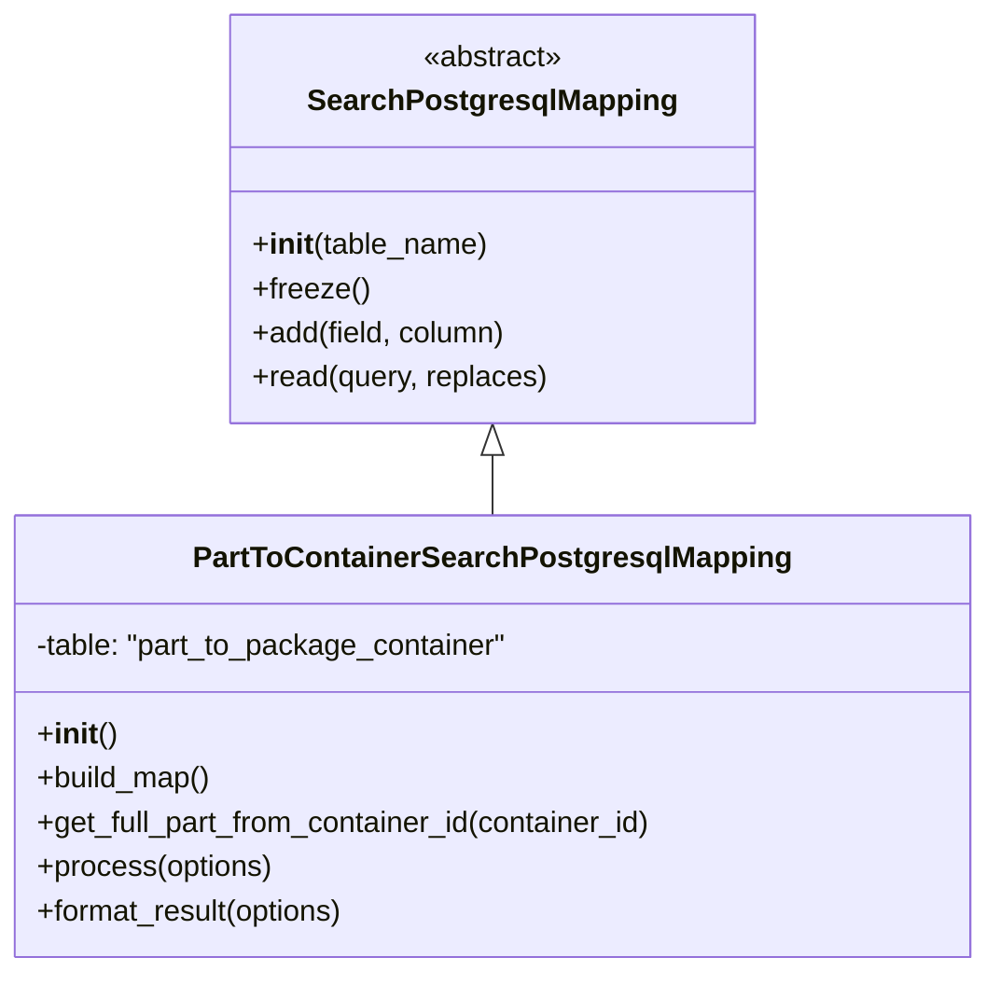

# Diagram: partview_core/partview_service/partview_service/persistence/sql/postgresql/PartToContainerSearchPostgresqlMapping.py

> Auto-generated by Obscura crawlers

## Mermaid

### SVG

<svg id="container" width="536.3828125" xmlns="http://www.w3.org/2000/svg" class="classDiagram" height="528" viewBox="0 0 536.3828125 528" role="graphics-document document" aria-roledescription="class"><g><defs><marker id="container_class-aggregationStart" class="marker aggregation class" refX="18" refY="7" markerWidth="190" markerHeight="240" orient="auto"><path d="M 18,7 L9,13 L1,7 L9,1 Z"></path></marker></defs><defs><marker id="container_class-aggregationEnd" class="marker aggregation class" refX="1" refY="7" markerWidth="20" markerHeight="28" orient="auto"><path d="M 18,7 L9,13 L1,7 L9,1 Z"></path></marker></defs><defs><marker id="container_class-extensionStart" class="marker extension class" refX="18" refY="7" markerWidth="190" markerHeight="240" orient="auto"><path d="M 1,7 L18,13 V 1 Z"></path></marker></defs><defs><marker id="container_class-extensionEnd" class="marker extension class" refX="1" refY="7" markerWidth="20" markerHeight="28" orient="auto"><path d="M 1,1 V 13 L18,7 Z"></path></marker></defs><defs><marker id="container_class-compositionStart" class="marker composition class" refX="18" refY="7" markerWidth="190" markerHeight="240" orient="auto"><path d="M 18,7 L9,13 L1,7 L9,1 Z"></path></marker></defs><defs><marker id="container_class-compositionEnd" class="marker composition class" refX="1" refY="7" markerWidth="20" markerHeight="28" orient="auto"><path d="M 18,7 L9,13 L1,7 L9,1 Z"></path></marker></defs><defs><marker id="container_class-dependencyStart" class="marker dependency class" refX="6" refY="7" markerWidth="190" markerHeight="240" orient="auto"><path d="M 5,7 L9,13 L1,7 L9,1 Z"></path></marker></defs><defs><marker id="container_class-dependencyEnd" class="marker dependency class" refX="13" refY="7" markerWidth="20" markerHeight="28" orient="auto"><path d="M 18,7 L9,13 L14,7 L9,1 Z"></path></marker></defs><defs><marker id="container_class-lollipopStart" class="marker lollipop class" refX="13" refY="7" markerWidth="190" markerHeight="240" orient="auto"><circle stroke="black" fill="transparent" cx="7" cy="7" r="6"></circle></marker></defs><defs><marker id="container_class-lollipopEnd" class="marker lollipop class" refX="1" refY="7" markerWidth="190" markerHeight="240" orient="auto"><circle stroke="black" fill="transparent" cx="7" cy="7" r="6"></circle></marker></defs><g class="root"><g class="clusters"></g><g class="edgePaths"><path d="M268.191,247.25L268.191,248.542C268.191,249.833,268.191,252.417,268.191,257.875C268.191,263.333,268.191,271.667,268.191,275.833L268.191,280" id="id_SearchPostgresqlMapping_PartToContainerSearchPostgresqlMapping_1" class="edge-thickness-normal edge-pattern-solid relation" style=";;;" data-edge="true" data-et="edge" data-id="id_SearchPostgresqlMapping_PartToContainerSearchPostgresqlMapping_1" data-points="W3sieCI6MjY4LjE5MTQwNjI1LCJ5IjoyMzB9LHsieCI6MjY4LjE5MTQwNjI1LCJ5IjoyNTV9LHsieCI6MjY4LjE5MTQwNjI1LCJ5IjoyODB9XQ==" marker-start="url(#container_class-extensionStart)"></path></g><g class="edgeLabels"><g class="edgeLabel"><g class="label" data-id="id_SearchPostgresqlMapping_PartToContainerSearchPostgresqlMapping_1" transform="translate(0, 0)"><foreignObject width="0" height="0">

</foreignObject></g></g></g><g class="nodes"><g class="node default" id="classId-SearchPostgresqlMapping-0" transform="translate(268.19140625, 119)"><g class="basic label-container"><path d="M-139.92578125 -111 L139.92578125 -111 L139.92578125 111 L-139.92578125 111" stroke="none" stroke-width="0" fill="#ECECFF" style=""></path><path d="M-139.92578125 -111 C-80.23264631504095 -111, -20.539511380081905 -111, 139.92578125 -111 M-139.92578125 -111 C-72.38361815297203 -111, -4.841455055944067 -111, 139.92578125 -111 M139.92578125 -111 C139.92578125 -28.82462777497838, 139.92578125 53.35074445004324, 139.92578125 111 M139.92578125 -111 C139.92578125 -55.07772160144707, 139.92578125 0.8445567971058665, 139.92578125 111 M139.92578125 111 C41.20039315829071 111, -57.52499493341858 111, -139.92578125 111 M139.92578125 111 C32.7769469035475 111, -74.371887442905 111, -139.92578125 111 M-139.92578125 111 C-139.92578125 35.464052716315265, -139.92578125 -40.07189456736947, -139.92578125 -111 M-139.92578125 111 C-139.92578125 66.56588164050851, -139.92578125 22.13176328101703, -139.92578125 -111" stroke="#9370DB" stroke-width="1.3" fill="none" stroke-dasharray="0 0" style=""></path></g><g class="annotation-group text" transform="translate(-38.609375, -87)"><g class="label" style="" transform="translate(0,-12)"><foreignObject width="77.21875" height="24">

«abstract»

</foreignObject></g></g><g class="label-group text" transform="translate(-95.1171875, -63)"><g class="label" style="font-weight: bolder" transform="translate(0,-12)"><foreignObject width="190.234375" height="24">

SearchPostgresqlMapping

</foreignObject></g></g><g class="members-group text" transform="translate(-127.92578125, -15)"></g><g class="methods-group text" transform="translate(-127.92578125, 15)"><g class="label" style="" transform="translate(0,-12)"><foreignObject width="128.515625" height="24">

+<strong>init</strong>(table_name)

</foreignObject></g><g class="label" style="" transform="translate(0,12)"><foreignObject width="62.109375" height="24">

+freeze()

</foreignObject></g><g class="label" style="" transform="translate(0,36)"><foreignObject width="139.890625" height="24">

+add(field, column)

</foreignObject></g><g class="label" style="" transform="translate(0,60)"><foreignObject width="160.734375" height="24">

+read(query, replaces)

</foreignObject></g></g><g class="divider" style=""><path d="M-139.92578125 -39 C-83.23418856232522 -39, -26.54259587465043 -39, 139.92578125 -39 M-139.92578125 -39 C-31.198004121765265 -39, 77.52977300646947 -39, 139.92578125 -39" stroke="#9370DB" stroke-width="1.3" fill="none" stroke-dasharray="0 0" style=""></path></g><g class="divider" style=""><path d="M-139.92578125 -15 C-67.22416384498885 -15, 5.4774535600222976 -15, 139.92578125 -15 M-139.92578125 -15 C-50.03971125994596 -15, 39.84635873010808 -15, 139.92578125 -15" stroke="#9370DB" stroke-width="1.3" fill="none" stroke-dasharray="0 0" style=""></path></g></g><g class="node default" id="classId-PartToContainerSearchPostgresqlMapping-1" transform="translate(268.19140625, 400)"><g class="basic label-container"><path d="M-260.19140625 -120 L260.19140625 -120 L260.19140625 120 L-260.19140625 120" stroke="none" stroke-width="0" fill="#ECECFF" style=""></path><path d="M-260.19140625 -120 C-106.96557811385941 -120, 46.260250022281184 -120, 260.19140625 -120 M-260.19140625 -120 C-85.67778499551724 -120, 88.83583625896551 -120, 260.19140625 -120 M260.19140625 -120 C260.19140625 -48.149009188808094, 260.19140625 23.701981622383812, 260.19140625 120 M260.19140625 -120 C260.19140625 -63.508758222285934, 260.19140625 -7.017516444571868, 260.19140625 120 M260.19140625 120 C56.49508774725277 120, -147.20123075549446 120, -260.19140625 120 M260.19140625 120 C72.33175710468626 120, -115.52789204062748 120, -260.19140625 120 M-260.19140625 120 C-260.19140625 65.01187106288182, -260.19140625 10.023742125763661, -260.19140625 -120 M-260.19140625 120 C-260.19140625 68.26883875110585, -260.19140625 16.53767750221168, -260.19140625 -120" stroke="#9370DB" stroke-width="1.3" fill="none" stroke-dasharray="0 0" style=""></path></g><g class="annotation-group text" transform="translate(0, -96)"></g><g class="label-group text" transform="translate(-154.3359375, -96)"><g class="label" style="font-weight: bolder" transform="translate(0,-12)"><foreignObject width="308.671875" height="24">

PartToContainerSearchPostgresqlMapping

</foreignObject></g></g><g class="members-group text" transform="translate(-248.19140625, -48)"><g class="label" style="" transform="translate(0,-12)"><foreignObject width="261.21875" height="24">

-table: "part_to_package_container"

</foreignObject></g></g><g class="methods-group text" transform="translate(-248.19140625, 0)"><g class="label" style="" transform="translate(0,-12)"><foreignObject width="42.796875" height="24">

+<strong>init</strong>()

</foreignObject></g><g class="label" style="" transform="translate(0,12)"><foreignObject width="96.109375" height="24">

+build_map()

</foreignObject></g><g class="label" style="" transform="translate(0,36)"><foreignObject width="342.046875" height="24">

+get_full_part_from_container_id(container_id)

</foreignObject></g><g class="label" style="" transform="translate(0,60)"><foreignObject width="129.0625" height="24">

+process(options)

</foreignObject></g><g class="label" style="" transform="translate(0,84)"><foreignObject width="172.34375" height="24">

+format_result(options)

</foreignObject></g></g><g class="divider" style=""><path d="M-260.19140625 -72 C-141.77109876100462 -72, -23.350791272009275 -72, 260.19140625 -72 M-260.19140625 -72 C-136.7298318572182 -72, -13.268257464436402 -72, 260.19140625 -72" stroke="#9370DB" stroke-width="1.3" fill="none" stroke-dasharray="0 0" style=""></path></g><g class="divider" style=""><path d="M-260.19140625 -24 C-81.44784626118258 -24, 97.29571372763485 -24, 260.19140625 -24 M-260.19140625 -24 C-123.39679456016623 -24, 13.397817129667544 -24, 260.19140625 -24" stroke="#9370DB" stroke-width="1.3" fill="none" stroke-dasharray="0 0" style=""></path></g></g></g></g></g></svg>
