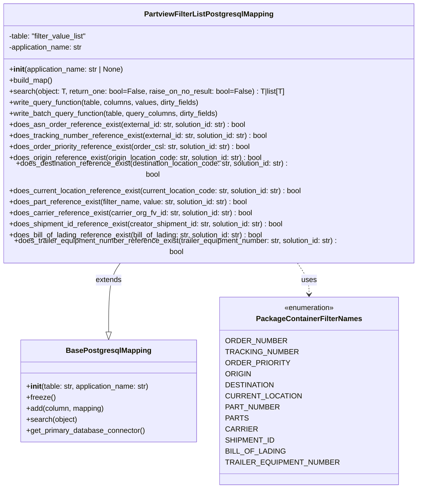

# Diagram: partview_core/partview_service/partview_service/persistence/sql/postgresql/PartviewFilterListPostgresqlMapping.py


> Auto-generated by Obscura crawlers

## Diagram 1



### SVG

<svg id="container" width="932.203125" xmlns="http://www.w3.org/2000/svg" class="classDiagram" height="1026" viewBox="0 0 932.203125 1026" role="graphics-document document" aria-roledescription="class"><style>#container{font-family:"trebuchet ms",verdana,arial,sans-serif;font-size:16px;fill:#333;}@keyframes edge-animation-frame{from{stroke-dashoffset:0;}}@keyframes dash{to{stroke-dashoffset:0;}}#container .edge-animation-slow{stroke-dasharray:9,5!important;stroke-dashoffset:900;animation:dash 50s linear infinite;stroke-linecap:round;}#container .edge-animation-fast{stroke-dasharray:9,5!important;stroke-dashoffset:900;animation:dash 20s linear infinite;stroke-linecap:round;}#container .error-icon{fill:#552222;}#container .error-text{fill:#552222;stroke:#552222;}#container .edge-thickness-normal{stroke-width:1px;}#container .edge-thickness-thick{stroke-width:3.5px;}#container .edge-pattern-solid{stroke-dasharray:0;}#container .edge-thickness-invisible{stroke-width:0;fill:none;}#container .edge-pattern-dashed{stroke-dasharray:3;}#container .edge-pattern-dotted{stroke-dasharray:2;}#container .marker{fill:#333333;stroke:#333333;}#container .marker.cross{stroke:#333333;}#container svg{font-family:"trebuchet ms",verdana,arial,sans-serif;font-size:16px;}#container p{margin:0;}#container g.classGroup text{fill:#9370DB;stroke:none;font-family:"trebuchet ms",verdana,arial,sans-serif;font-size:10px;}#container g.classGroup text .title{font-weight:bolder;}#container .nodeLabel,#container .edgeLabel{color:#131300;}#container .edgeLabel .label rect{fill:#ECECFF;}#container .label text{fill:#131300;}#container .labelBkg{background:#ECECFF;}#container .edgeLabel .label span{background:#ECECFF;}#container .classTitle{font-weight:bolder;}#container .node rect,#container .node circle,#container .node ellipse,#container .node polygon,#container .node path{fill:#ECECFF;stroke:#9370DB;stroke-width:1px;}#container .divider{stroke:#9370DB;stroke-width:1;}#container g.clickable{cursor:pointer;}#container g.classGroup rect{fill:#ECECFF;stroke:#9370DB;}#container g.classGroup line{stroke:#9370DB;stroke-width:1;}#container .classLabel .box{stroke:none;stroke-width:0;fill:#ECECFF;opacity:0.5;}#container .classLabel .label{fill:#9370DB;font-size:10px;}#container .relation{stroke:#333333;stroke-width:1;fill:none;}#container .dashed-line{stroke-dasharray:3;}#container .dotted-line{stroke-dasharray:1 2;}#container #compositionStart,#container .composition{fill:#333333!important;stroke:#333333!important;stroke-width:1;}#container #compositionEnd,#container .composition{fill:#333333!important;stroke:#333333!important;stroke-width:1;}#container #dependencyStart,#container .dependency{fill:#333333!important;stroke:#333333!important;stroke-width:1;}#container #dependencyStart,#container .dependency{fill:#333333!important;stroke:#333333!important;stroke-width:1;}#container #extensionStart,#container .extension{fill:transparent!important;stroke:#333333!important;stroke-width:1;}#container #extensionEnd,#container .extension{fill:transparent!important;stroke:#333333!important;stroke-width:1;}#container #aggregationStart,#container .aggregation{fill:transparent!important;stroke:#333333!important;stroke-width:1;}#container #aggregationEnd,#container .aggregation{fill:transparent!important;stroke:#333333!important;stroke-width:1;}#container #lollipopStart,#container .lollipop{fill:#ECECFF!important;stroke:#333333!important;stroke-width:1;}#container #lollipopEnd,#container .lollipop{fill:#ECECFF!important;stroke:#333333!important;stroke-width:1;}#container .edgeTerminals{font-size:11px;line-height:initial;}#container .classTitleText{text-anchor:middle;font-size:18px;fill:#333;}#container .label-icon{display:inline-block;height:1em;overflow:visible;vertical-align:-0.125em;}#container .node .label-icon path{fill:currentColor;stroke:revert;stroke-width:revert;}#container :root{--mermaid-font-family:"trebuchet ms",verdana,arial,sans-serif;}</style><g><defs><marker id="container_class-aggregationStart" class="marker aggregation class" refX="18" refY="7" markerWidth="190" markerHeight="240" orient="auto"><path d="M 18,7 L9,13 L1,7 L9,1 Z"></path></marker></defs><defs><marker id="container_class-aggregationEnd" class="marker aggregation class" refX="1" refY="7" markerWidth="20" markerHeight="28" orient="auto"><path d="M 18,7 L9,13 L1,7 L9,1 Z"></path></marker></defs><defs><marker id="container_class-extensionStart" class="marker extension class" refX="18" refY="7" markerWidth="190" markerHeight="240" orient="auto"><path d="M 1,7 L18,13 V 1 Z"></path></marker></defs><defs><marker id="container_class-extensionEnd" class="marker extension class" refX="1" refY="7" markerWidth="20" markerHeight="28" orient="auto"><path d="M 1,1 V 13 L18,7 Z"></path></marker></defs><defs><marker id="container_class-compositionStart" class="marker composition class" refX="18" refY="7" markerWidth="190" markerHeight="240" orient="auto"><path d="M 18,7 L9,13 L1,7 L9,1 Z"></path></marker></defs><defs><marker id="container_class-compositionEnd" class="marker composition class" refX="1" refY="7" markerWidth="20" markerHeight="28" orient="auto"><path d="M 18,7 L9,13 L1,7 L9,1 Z"></path></marker></defs><defs><marker id="container_class-dependencyStart" class="marker dependency class" refX="6" refY="7" markerWidth="190" markerHeight="240" orient="auto"><path d="M 5,7 L9,13 L1,7 L9,1 Z"></path></marker></defs><defs><marker id="container_class-dependencyEnd" class="marker dependency class" refX="13" refY="7" markerWidth="20" markerHeight="28" orient="auto"><path d="M 18,7 L9,13 L14,7 L9,1 Z"></path></marker></defs><defs><marker id="container_class-lollipopStart" class="marker lollipop class" refX="13" refY="7" markerWidth="190" markerHeight="240" orient="auto"><circle stroke="black" fill="transparent" cx="7" cy="7" r="6"></circle></marker></defs><defs><marker id="container_class-lollipopEnd" class="marker lollipop class" refX="1" refY="7" markerWidth="190" markerHeight="240" orient="auto"><circle stroke="black" fill="transparent" cx="7" cy="7" r="6"></circle></marker></defs><g class="root"><g class="clusters"></g><g class="edgePaths"><path d="M282.505,536L278.216,542.167C273.928,548.333,265.351,560.667,261.062,585.625C256.773,610.583,256.773,648.167,256.773,666.958L256.773,685.75" id="id_PartviewFilterListPostgresqlMapping_BasePostgresqlMapping_1" class="edge-thickness-normal edge-pattern-solid relation" style=";;;" data-edge="true" data-et="edge" data-id="id_PartviewFilterListPostgresqlMapping_BasePostgresqlMapping_1" data-points="W3sieCI6MjgyLjUwNDgwMTcwMjY1NzgsInkiOjUzNn0seyJ4IjoyNTYuNzczNDM3NSwieSI6NTczfSx7IngiOjI1Ni43NzM0Mzc1LCJ5Ijo3MDN9XQ==" marker-end="url(#container_class-extensionEnd)"></path><path d="M649.698,536L653.987,542.167C658.275,548.333,666.853,560.667,671.141,572C675.43,583.333,675.43,593.667,675.43,598.833L675.43,604" id="id_PartviewFilterListPostgresqlMapping_PackageContainerFilterNames_2" class="edge-thickness-normal edge-pattern-dashed relation" style=";;;" data-edge="true" data-et="edge" data-id="id_PartviewFilterListPostgresqlMapping_PackageContainerFilterNames_2" data-points="W3sieCI6NjQ5LjY5ODMyMzI5NzM0MjIsInkiOjUzNn0seyJ4Ijo2NzUuNDI5Njg3NSwieSI6NTczfSx7IngiOjY3NS40Mjk2ODc1LCJ5Ijo2MTB9XQ==" marker-end="url(#container_class-dependencyEnd)"></path></g><g class="edgeLabels"><g class="edgeLabel" transform="translate(256.7734375, 573)"><g class="label" data-id="id_PartviewFilterListPostgresqlMapping_BasePostgresqlMapping_1" transform="translate(-28.5078125, -12)"><foreignObject width="57.015625" height="24"><div xmlns="http://www.w3.org/1999/xhtml" class="labelBkg" style="display: table-cell; white-space: nowrap; line-height: 1.5; max-width: 200px; text-align: center;"><span class="edgeLabel"><p>extends</p></span></div></foreignObject></g></g><g class="edgeLabel" transform="translate(675.4296875, 573)"><g class="label" data-id="id_PartviewFilterListPostgresqlMapping_PackageContainerFilterNames_2" transform="translate(-16.4921875, -12)"><foreignObject width="32.984375" height="24"><div xmlns="http://www.w3.org/1999/xhtml" class="labelBkg" style="display: table-cell; white-space: nowrap; line-height: 1.5; max-width: 200px; text-align: center;"><span class="edgeLabel"><p>uses</p></span></div></foreignObject></g></g></g><g class="nodes"><g class="node default" id="classId-BasePostgresqlMapping-0" transform="translate(256.7734375, 814)"><g class="basic label-container"><path d="M-192.3359375 -111 L192.3359375 -111 L192.3359375 111 L-192.3359375 111" stroke="none" stroke-width="0" fill="#ECECFF" style=""></path><path d="M-192.3359375 -111 C-75.7280299703428 -111, 40.879877559314394 -111, 192.3359375 -111 M-192.3359375 -111 C-57.23209033875142 -111, 77.87175682249716 -111, 192.3359375 -111 M192.3359375 -111 C192.3359375 -24.00689621226917, 192.3359375 62.98620757546166, 192.3359375 111 M192.3359375 -111 C192.3359375 -45.49140471612186, 192.3359375 20.017190567756273, 192.3359375 111 M192.3359375 111 C81.42385594710521 111, -29.48822560578958 111, -192.3359375 111 M192.3359375 111 C91.90989390047567 111, -8.516149699048668 111, -192.3359375 111 M-192.3359375 111 C-192.3359375 65.2915517826855, -192.3359375 19.58310356537102, -192.3359375 -111 M-192.3359375 111 C-192.3359375 55.83811150107071, -192.3359375 0.6762230021414268, -192.3359375 -111" stroke="#9370DB" stroke-width="1.3" fill="none" stroke-dasharray="0 0" style=""></path></g><g class="annotation-group text" transform="translate(0, -87)"></g><g class="label-group text" transform="translate(-87.921875, -87)"><g class="label" style="font-weight: bolder" transform="translate(0,-12)"><foreignObject width="175.84375" height="24"><div xmlns="http://www.w3.org/1999/xhtml" style="display: table-cell; white-space: nowrap; line-height: 1.5; max-width: 223px; text-align: center;"><span class="nodeLabel markdown-node-label" style=""><p>BasePostgresqlMapping</p></span></div></foreignObject></g></g><g class="members-group text" transform="translate(-180.3359375, -39)"></g><g class="methods-group text" transform="translate(-180.3359375, -9)"><g class="label" style="" transform="translate(0,-12)"><foreignObject width="272.75" height="24"><div xmlns="http://www.w3.org/1999/xhtml" style="display: table-cell; white-space: nowrap; line-height: 1.5; max-width: 362px; text-align: center;"><span class="nodeLabel markdown-node-label" style=""><p>+<strong>init</strong>(table: str, application_name: str)</p></span></div></foreignObject></g><g class="label" style="" transform="translate(0,12)"><foreignObject width="62.109375" height="24"><div xmlns="http://www.w3.org/1999/xhtml" style="display: table-cell; white-space: nowrap; line-height: 1.5; max-width: 119px; text-align: center;"><span class="nodeLabel markdown-node-label" style=""><p>+freeze()</p></span></div></foreignObject></g><g class="label" style="" transform="translate(0,36)"><foreignObject width="171.4375" height="24"><div xmlns="http://www.w3.org/1999/xhtml" style="display: table-cell; white-space: nowrap; line-height: 1.5; max-width: 229px; text-align: center;"><span class="nodeLabel markdown-node-label" style=""><p>+add(column, mapping)</p></span></div></foreignObject></g><g class="label" style="" transform="translate(0,60)"><foreignObject width="111.28125" height="24"><div xmlns="http://www.w3.org/1999/xhtml" style="display: table-cell; white-space: nowrap; line-height: 1.5; max-width: 169px; text-align: center;"><span class="nodeLabel markdown-node-label" style=""><p>+search(object)</p></span></div></foreignObject></g><g class="label" style="" transform="translate(0,84)"><foreignObject width="260.671875" height="24"><div xmlns="http://www.w3.org/1999/xhtml" style="display: table-cell; white-space: nowrap; line-height: 1.5; max-width: 318px; text-align: center;"><span class="nodeLabel markdown-node-label" style=""><p>+get_primary_database_connector()</p></span></div></foreignObject></g></g><g class="divider" style=""><path d="M-192.3359375 -63 C-41.31619948390724 -63, 109.70353853218552 -63, 192.3359375 -63 M-192.3359375 -63 C-114.28117277200039 -63, -36.22640804400078 -63, 192.3359375 -63" stroke="#9370DB" stroke-width="1.3" fill="none" stroke-dasharray="0 0" style=""></path></g><g class="divider" style=""><path d="M-192.3359375 -39 C-98.00937764979514 -39, -3.682817799590282 -39, 192.3359375 -39 M-192.3359375 -39 C-114.59277470194895 -39, -36.84961190389791 -39, 192.3359375 -39" stroke="#9370DB" stroke-width="1.3" fill="none" stroke-dasharray="0 0" style=""></path></g></g><g class="node default" id="classId-PartviewFilterListPostgresqlMapping-1" transform="translate(466.1015625, 272)"><g class="basic label-container"><path d="M-458.1015625 -264 L458.1015625 -264 L458.1015625 264 L-458.1015625 264" stroke="none" stroke-width="0" fill="#ECECFF" style=""></path><path d="M-458.1015625 -264 C-92.51358591245997 -264, 273.07439067508005 -264, 458.1015625 -264 M-458.1015625 -264 C-198.35232412377582 -264, 61.39691425244837 -264, 458.1015625 -264 M458.1015625 -264 C458.1015625 -116.4843850384189, 458.1015625 31.031229923162186, 458.1015625 264 M458.1015625 -264 C458.1015625 -71.16002429466326, 458.1015625 121.67995141067348, 458.1015625 264 M458.1015625 264 C164.8419228757765 264, -128.417716748447 264, -458.1015625 264 M458.1015625 264 C181.00193895498813 264, -96.09768459002373 264, -458.1015625 264 M-458.1015625 264 C-458.1015625 100.5633996794731, -458.1015625 -62.87320064105381, -458.1015625 -264 M-458.1015625 264 C-458.1015625 148.3797784598024, -458.1015625 32.75955691960479, -458.1015625 -264" stroke="#9370DB" stroke-width="1.3" fill="none" stroke-dasharray="0 0" style=""></path></g><g class="annotation-group text" transform="translate(0, -240)"></g><g class="label-group text" transform="translate(-134.375, -240)"><g class="label" style="font-weight: bolder" transform="translate(0,-12)"><foreignObject width="268.75" height="24"><div xmlns="http://www.w3.org/1999/xhtml" style="display: table-cell; white-space: nowrap; line-height: 1.5; max-width: 313px; text-align: center;"><span class="nodeLabel markdown-node-label" style=""><p>PartviewFilterListPostgresqlMapping</p></span></div></foreignObject></g></g><g class="members-group text" transform="translate(-446.1015625, -192)"><g class="label" style="" transform="translate(0,-12)"><foreignObject width="174.234375" height="24"><div xmlns="http://www.w3.org/1999/xhtml" style="display: table-cell; white-space: nowrap; line-height: 1.5; max-width: 232px; text-align: center;"><span class="nodeLabel markdown-node-label" style=""><p>-table: "filter_value_list"</p></span></div></foreignObject></g><g class="label" style="" transform="translate(0,12)"><foreignObject width="164.671875" height="24"><div xmlns="http://www.w3.org/1999/xhtml" style="display: table-cell; white-space: nowrap; line-height: 1.5; max-width: 223px; text-align: center;"><span class="nodeLabel markdown-node-label" style=""><p>-application_name: str</p></span></div></foreignObject></g></g><g class="methods-group text" transform="translate(-446.1015625, -120)"><g class="label" style="" transform="translate(0,-12)"><foreignObject width="254.546875" height="24"><div xmlns="http://www.w3.org/1999/xhtml" style="display: table-cell; white-space: nowrap; line-height: 1.5; max-width: 343px; text-align: center;"><span class="nodeLabel markdown-node-label" style=""><p>+<strong>init</strong>(application_name: str | None)</p></span></div></foreignObject></g><g class="label" style="" transform="translate(0,12)"><foreignObject width="96.109375" height="24"><div xmlns="http://www.w3.org/1999/xhtml" style="display: table-cell; white-space: nowrap; line-height: 1.5; max-width: 153px; text-align: center;"><span class="nodeLabel markdown-node-label" style=""><p>+build_map()</p></span></div></foreignObject></g><g class="label" style="" transform="translate(0,36)"><foreignObject width="600.265625" height="24"><div xmlns="http://www.w3.org/1999/xhtml" style="display: table-cell; white-space: nowrap; line-height: 1.5; max-width: 658px; text-align: center;"><span class="nodeLabel markdown-node-label" style=""><p>+search(object: T, return_one: bool=False, raise_on_no_result: bool=False) : T|list[T]</p></span></div></foreignObject></g><g class="label" style="" transform="translate(0,60)"><foreignObject width="422.109375" height="24"><div xmlns="http://www.w3.org/1999/xhtml" style="display: table-cell; white-space: nowrap; line-height: 1.5; max-width: 479px; text-align: center;"><span class="nodeLabel markdown-node-label" style=""><p>+write_query_function(table, columns, values, dirty_fields)</p></span></div></foreignObject></g><g class="label" style="" transform="translate(0,84)"><foreignObject width="465.765625" height="24"><div xmlns="http://www.w3.org/1999/xhtml" style="display: table-cell; white-space: nowrap; line-height: 1.5; max-width: 523px; text-align: center;"><span class="nodeLabel markdown-node-label" style=""><p>+write_batch_query_function(table, query_columns, dirty_fields)</p></span></div></foreignObject></g><g class="label" style="" transform="translate(0,108)"><foreignObject width="522.046875" height="24"><div xmlns="http://www.w3.org/1999/xhtml" style="display: table-cell; white-space: nowrap; line-height: 1.5; max-width: 580px; text-align: center;"><span class="nodeLabel markdown-node-label" style=""><p>+does_asn_order_reference_exist(external_id: str, solution_id: str) : bool</p></span></div></foreignObject></g><g class="label" style="" transform="translate(0,132)"><foreignObject width="572.46875" height="24"><div xmlns="http://www.w3.org/1999/xhtml" style="display: table-cell; white-space: nowrap; line-height: 1.5; max-width: 630px; text-align: center;"><span class="nodeLabel markdown-node-label" style=""><p>+does_tracking_number_reference_exist(external_id: str, solution_id: str) : bool</p></span></div></foreignObject></g><g class="label" style="" transform="translate(0,156)"><foreignObject width="534.703125" height="24"><div xmlns="http://www.w3.org/1999/xhtml" style="display: table-cell; white-space: nowrap; line-height: 1.5; max-width: 592px; text-align: center;"><span class="nodeLabel markdown-node-label" style=""><p>+does_order_priority_reference_exist(order_csl: str, solution_id: str) : bool</p></span></div></foreignObject></g><g class="label" style="" transform="translate(0,180)"><foreignObject width="563.40625" height="24"><div xmlns="http://www.w3.org/1999/xhtml" style="display: table-cell; white-space: nowrap; line-height: 1.5; max-width: 621px; text-align: center;"><span class="nodeLabel markdown-node-label" style=""><p>+does_origin_reference_exist(origin_location_code: str, solution_id: str) : bool</p></span></div></foreignObject></g><g class="label" style="" transform="translate(0,204)"><foreignObject width="645.1875" height="24"><div xmlns="http://www.w3.org/1999/xhtml" style="display: table-cell; white-space: nowrap; line-height: 1.5; max-width: 703px; text-align: center;"><span class="nodeLabel markdown-node-label" style=""><p>+does_destination_reference_exist(destination_location_code: str, solution_id: str) : bool</p></span></div></foreignObject></g><g class="label" style="" transform="translate(0,228)"><foreignObject width="651.328125" height="24"><div xmlns="http://www.w3.org/1999/xhtml" style="display: table-cell; white-space: nowrap; line-height: 1.5; max-width: 709px; text-align: center;"><span class="nodeLabel markdown-node-label" style=""><p>+does_current_location_reference_exist(current_location_code: str, solution_id: str) : bool</p></span></div></foreignObject></g><g class="label" style="" transform="translate(0,252)"><foreignObject width="527.640625" height="24"><div xmlns="http://www.w3.org/1999/xhtml" style="display: table-cell; white-space: nowrap; line-height: 1.5; max-width: 585px; text-align: center;"><span class="nodeLabel markdown-node-label" style=""><p>+does_part_reference_exist(filter_name, value: str, solution_id: str) : bool</p></span></div></foreignObject></g><g class="label" style="" transform="translate(0,276)"><foreignObject width="536.8125" height="24"><div xmlns="http://www.w3.org/1999/xhtml" style="display: table-cell; white-space: nowrap; line-height: 1.5; max-width: 594px; text-align: center;"><span class="nodeLabel markdown-node-label" style=""><p>+does_carrier_reference_exist(carrier_org_fv_id: str, solution_id: str) : bool</p></span></div></foreignObject></g><g class="label" style="" transform="translate(0,300)"><foreignObject width="609.375" height="24"><div xmlns="http://www.w3.org/1999/xhtml" style="display: table-cell; white-space: nowrap; line-height: 1.5; max-width: 667px; text-align: center;"><span class="nodeLabel markdown-node-label" style=""><p>+does_shipment_id_reference_exist(creator_shipment_id: str, solution_id: str) : bool</p></span></div></foreignObject></g><g class="label" style="" transform="translate(0,324)"><foreignObject width="566.765625" height="24"><div xmlns="http://www.w3.org/1999/xhtml" style="display: table-cell; white-space: nowrap; line-height: 1.5; max-width: 624px; text-align: center;"><span class="nodeLabel markdown-node-label" style=""><p>+does_bill_of_lading_reference_exist(bill_of_lading: str, solution_id: str) : bool</p></span></div></foreignObject></g><g class="label" style="" transform="translate(0,348)"><foreignObject width="757.828125" height="24"><div xmlns="http://www.w3.org/1999/xhtml" style="display: table-cell; white-space: nowrap; line-height: 1.5; max-width: 815px; text-align: center;"><span class="nodeLabel markdown-node-label" style=""><p>+does_trailer_equipment_number_reference_exist(trailer_equipment_number: str, solution_id: str) : bool</p></span></div></foreignObject></g></g><g class="divider" style=""><path d="M-458.1015625 -216 C-265.74721376534035 -216, -73.3928650306807 -216, 458.1015625 -216 M-458.1015625 -216 C-120.56121701762117 -216, 216.97912846475765 -216, 458.1015625 -216" stroke="#9370DB" stroke-width="1.3" fill="none" stroke-dasharray="0 0" style=""></path></g><g class="divider" style=""><path d="M-458.1015625 -144 C-233.62978213592976 -144, -9.158001771859517 -144, 458.1015625 -144 M-458.1015625 -144 C-198.86986637761697 -144, 60.361829744766055 -144, 458.1015625 -144" stroke="#9370DB" stroke-width="1.3" fill="none" stroke-dasharray="0 0" style=""></path></g></g><g class="node default" id="classId-PackageContainerFilterNames-2" transform="translate(675.4296875, 814)"><g class="basic label-container"><path d="M-176.3203125 -204 L176.3203125 -204 L176.3203125 204 L-176.3203125 204" stroke="none" stroke-width="0" fill="#ECECFF" style=""></path><path d="M-176.3203125 -204 C-99.85250727504567 -204, -23.384702050091335 -204, 176.3203125 -204 M-176.3203125 -204 C-51.3872968650616 -204, 73.5457187698768 -204, 176.3203125 -204 M176.3203125 -204 C176.3203125 -90.4370942915793, 176.3203125 23.1258114168414, 176.3203125 204 M176.3203125 -204 C176.3203125 -116.75295257359781, 176.3203125 -29.50590514719562, 176.3203125 204 M176.3203125 204 C99.12022998842835 204, 21.920147476856698 204, -176.3203125 204 M176.3203125 204 C64.74563358975327 204, -46.829045320493464 204, -176.3203125 204 M-176.3203125 204 C-176.3203125 90.48997903358905, -176.3203125 -23.020041932821897, -176.3203125 -204 M-176.3203125 204 C-176.3203125 72.36415272301286, -176.3203125 -59.27169455397427, -176.3203125 -204" stroke="#9370DB" stroke-width="1.3" fill="none" stroke-dasharray="0 0" style=""></path></g><g class="annotation-group text" transform="translate(-55.5546875, -180)"><g class="label" style="" transform="translate(0,-12)"><foreignObject width="111.109375" height="24"><div xmlns="http://www.w3.org/1999/xhtml" style="display: table-cell; white-space: nowrap; line-height: 1.5; max-width: 161px; text-align: center;"><span class="nodeLabel markdown-node-label" style=""><p>«enumeration»</p></span></div></foreignObject></g></g><g class="label-group text" transform="translate(-109.046875, -156)"><g class="label" style="font-weight: bolder" transform="translate(0,-12)"><foreignObject width="218.09375" height="24"><div xmlns="http://www.w3.org/1999/xhtml" style="display: table-cell; white-space: nowrap; line-height: 1.5; max-width: 265px; text-align: center;"><span class="nodeLabel markdown-node-label" style=""><p>PackageContainerFilterNames</p></span></div></foreignObject></g></g><g class="members-group text" transform="translate(-164.3203125, -108)"><g class="label" style="" transform="translate(0,-12)"><foreignObject width="119.5625" height="24"><div xmlns="http://www.w3.org/1999/xhtml" style="display: table-cell; white-space: nowrap; line-height: 1.5; max-width: 170px; text-align: center;"><span class="nodeLabel markdown-node-label" style=""><p>ORDER_NUMBER</p></span></div></foreignObject></g><g class="label" style="" transform="translate(0,12)"><foreignObject width="141.359375" height="24"><div xmlns="http://www.w3.org/1999/xhtml" style="display: table-cell; white-space: nowrap; line-height: 1.5; max-width: 192px; text-align: center;"><span class="nodeLabel markdown-node-label" style=""><p>TRACKING_NUMBER</p></span></div></foreignObject></g><g class="label" style="" transform="translate(0,36)"><foreignObject width="123.859375" height="24"><div xmlns="http://www.w3.org/1999/xhtml" style="display: table-cell; white-space: nowrap; line-height: 1.5; max-width: 174px; text-align: center;"><span class="nodeLabel markdown-node-label" style=""><p>ORDER_PRIORITY</p></span></div></foreignObject></g><g class="label" style="" transform="translate(0,60)"><foreignObject width="51.21875" height="24"><div xmlns="http://www.w3.org/1999/xhtml" style="display: table-cell; white-space: nowrap; line-height: 1.5; max-width: 101px; text-align: center;"><span class="nodeLabel markdown-node-label" style=""><p>ORIGIN</p></span></div></foreignObject></g><g class="label" style="" transform="translate(0,84)"><foreignObject width="94.359375" height="24"><div xmlns="http://www.w3.org/1999/xhtml" style="display: table-cell; white-space: nowrap; line-height: 1.5; max-width: 144px; text-align: center;"><span class="nodeLabel markdown-node-label" style=""><p>DESTINATION</p></span></div></foreignObject></g><g class="label" style="" transform="translate(0,108)"><foreignObject width="144.6875" height="24"><div xmlns="http://www.w3.org/1999/xhtml" style="display: table-cell; white-space: nowrap; line-height: 1.5; max-width: 195px; text-align: center;"><span class="nodeLabel markdown-node-label" style=""><p>CURRENT_LOCATION</p></span></div></foreignObject></g><g class="label" style="" transform="translate(0,132)"><foreignObject width="104.59375" height="24"><div xmlns="http://www.w3.org/1999/xhtml" style="display: table-cell; white-space: nowrap; line-height: 1.5; max-width: 155px; text-align: center;"><span class="nodeLabel markdown-node-label" style=""><p>PART_NUMBER</p></span></div></foreignObject></g><g class="label" style="" transform="translate(0,156)"><foreignObject width="43.546875" height="24"><div xmlns="http://www.w3.org/1999/xhtml" style="display: table-cell; white-space: nowrap; line-height: 1.5; max-width: 94px; text-align: center;"><span class="nodeLabel markdown-node-label" style=""><p>PARTS</p></span></div></foreignObject></g><g class="label" style="" transform="translate(0,180)"><foreignObject width="60.453125" height="24"><div xmlns="http://www.w3.org/1999/xhtml" style="display: table-cell; white-space: nowrap; line-height: 1.5; max-width: 111px; text-align: center;"><span class="nodeLabel markdown-node-label" style=""><p>CARRIER</p></span></div></foreignObject></g><g class="label" style="" transform="translate(0,204)"><foreignObject width="95.890625" height="24"><div xmlns="http://www.w3.org/1999/xhtml" style="display: table-cell; white-space: nowrap; line-height: 1.5; max-width: 146px; text-align: center;"><span class="nodeLabel markdown-node-label" style=""><p>SHIPMENT_ID</p></span></div></foreignObject></g><g class="label" style="" transform="translate(0,228)"><foreignObject width="116.90625" height="24"><div xmlns="http://www.w3.org/1999/xhtml" style="display: table-cell; white-space: nowrap; line-height: 1.5; max-width: 167px; text-align: center;"><span class="nodeLabel markdown-node-label" style=""><p>BILL_OF_LADING</p></span></div></foreignObject></g><g class="label" style="" transform="translate(0,252)"><foreignObject width="219.59375" height="24"><div xmlns="http://www.w3.org/1999/xhtml" style="display: table-cell; white-space: nowrap; line-height: 1.5; max-width: 270px; text-align: center;"><span class="nodeLabel markdown-node-label" style=""><p>TRAILER_EQUIPMENT_NUMBER</p></span></div></foreignObject></g></g><g class="methods-group text" transform="translate(-164.3203125, 204)"></g><g class="divider" style=""><path d="M-176.3203125 -132 C-103.28816581841929 -132, -30.256019136838574 -132, 176.3203125 -132 M-176.3203125 -132 C-68.31579917429042 -132, 39.68871415141916 -132, 176.3203125 -132" stroke="#9370DB" stroke-width="1.3" fill="none" stroke-dasharray="0 0" style=""></path></g><g class="divider" style=""><path d="M-176.3203125 180 C-72.37922935822687 180, 31.56185378354627 180, 176.3203125 180 M-176.3203125 180 C-43.16584395987476 180, 89.98862458025047 180, 176.3203125 180" stroke="#9370DB" stroke-width="1.3" fill="none" stroke-dasharray="0 0" style=""></path></g></g></g></g></g></svg>

## Diagram 2

```mermaid
flowchart LR
    A[Client code] --> B[PartviewFilterListPostgresqlMapping.search()]
    B --> C{super().search(object)}
    C --> D[results list]
    D --> E{raise_on_no_result?}
    E -->|true & empty| F[raise Exception("Resource not found")]
    E -->|false| G{return_one?}
    G -->|true & non-empty| H[return first item]
    G -->|false| I[return list]
```

> SVG rendering failed for this diagram.
