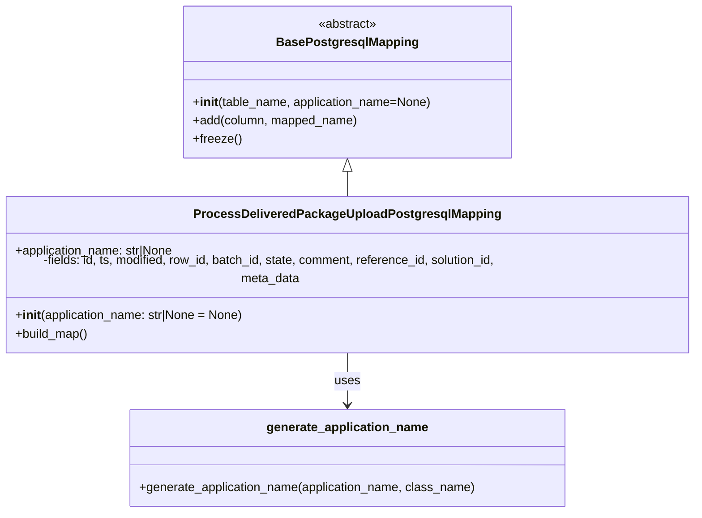

# Diagram: partview_core/partview_service/partview_service/persistence/sql/postgresql/ProcessDeliveredPackageUploadPostgresqlMapping.py

> Auto-generated by Obscura crawlers

## Mermaid

### SVG

<svg id="container" width="913.3125" xmlns="http://www.w3.org/2000/svg" class="classDiagram" height="656" viewBox="0 0 913.3125 656" role="graphics-document document" aria-roledescription="class"><g><defs><marker id="container_class-aggregationStart" class="marker aggregation class" refX="18" refY="7" markerWidth="190" markerHeight="240" orient="auto"><path d="M 18,7 L9,13 L1,7 L9,1 Z"></path></marker></defs><defs><marker id="container_class-aggregationEnd" class="marker aggregation class" refX="1" refY="7" markerWidth="20" markerHeight="28" orient="auto"><path d="M 18,7 L9,13 L1,7 L9,1 Z"></path></marker></defs><defs><marker id="container_class-extensionStart" class="marker extension class" refX="18" refY="7" markerWidth="190" markerHeight="240" orient="auto"><path d="M 1,7 L18,13 V 1 Z"></path></marker></defs><defs><marker id="container_class-extensionEnd" class="marker extension class" refX="1" refY="7" markerWidth="20" markerHeight="28" orient="auto"><path d="M 1,1 V 13 L18,7 Z"></path></marker></defs><defs><marker id="container_class-compositionStart" class="marker composition class" refX="18" refY="7" markerWidth="190" markerHeight="240" orient="auto"><path d="M 18,7 L9,13 L1,7 L9,1 Z"></path></marker></defs><defs><marker id="container_class-compositionEnd" class="marker composition class" refX="1" refY="7" markerWidth="20" markerHeight="28" orient="auto"><path d="M 18,7 L9,13 L1,7 L9,1 Z"></path></marker></defs><defs><marker id="container_class-dependencyStart" class="marker dependency class" refX="6" refY="7" markerWidth="190" markerHeight="240" orient="auto"><path d="M 5,7 L9,13 L1,7 L9,1 Z"></path></marker></defs><defs><marker id="container_class-dependencyEnd" class="marker dependency class" refX="13" refY="7" markerWidth="20" markerHeight="28" orient="auto"><path d="M 18,7 L9,13 L14,7 L9,1 Z"></path></marker></defs><defs><marker id="container_class-lollipopStart" class="marker lollipop class" refX="13" refY="7" markerWidth="190" markerHeight="240" orient="auto"><circle stroke="black" fill="transparent" cx="7" cy="7" r="6"></circle></marker></defs><defs><marker id="container_class-lollipopEnd" class="marker lollipop class" refX="1" refY="7" markerWidth="190" markerHeight="240" orient="auto"><circle stroke="black" fill="transparent" cx="7" cy="7" r="6"></circle></marker></defs><g class="root"><g class="clusters"></g><g class="edgePaths"><path d="M456.656,223.25L456.656,224.542C456.656,225.833,456.656,228.417,456.656,233.875C456.656,239.333,456.656,247.667,456.656,251.833L456.656,256" id="id_BasePostgresqlMapping_ProcessDeliveredPackageUploadPostgresqlMapping_1" class="edge-thickness-normal edge-pattern-solid relation" style=";;;" data-edge="true" data-et="edge" data-id="id_BasePostgresqlMapping_ProcessDeliveredPackageUploadPostgresqlMapping_1" data-points="W3sieCI6NDU2LjY1NjI1LCJ5IjoyMDZ9LHsieCI6NDU2LjY1NjI1LCJ5IjoyMzF9LHsieCI6NDU2LjY1NjI1LCJ5IjoyNTZ9XQ==" marker-start="url(#container_class-extensionStart)"></path><path d="M456.656,448L456.656,454.167C456.656,460.333,456.656,472.667,456.656,484C456.656,495.333,456.656,505.667,456.656,510.833L456.656,516" id="id_ProcessDeliveredPackageUploadPostgresqlMapping_generate_application_name_2" class="edge-thickness-normal edge-pattern-solid relation" style=";;;" data-edge="true" data-et="edge" data-id="id_ProcessDeliveredPackageUploadPostgresqlMapping_generate_application_name_2" data-points="W3sieCI6NDU2LjY1NjI1LCJ5Ijo0NDh9LHsieCI6NDU2LjY1NjI1LCJ5Ijo0ODV9LHsieCI6NDU2LjY1NjI1LCJ5Ijo1MjJ9XQ==" marker-end="url(#container_class-dependencyEnd)"></path></g><g class="edgeLabels"><g class="edgeLabel"><g class="label" data-id="id_BasePostgresqlMapping_ProcessDeliveredPackageUploadPostgresqlMapping_1" transform="translate(0, 0)"><foreignObject width="0" height="0">

</foreignObject></g></g><g class="edgeLabel" transform="translate(456.65625, 485)"><g class="label" data-id="id_ProcessDeliveredPackageUploadPostgresqlMapping_generate_application_name_2" transform="translate(-16.4921875, -12)"><foreignObject width="32.984375" height="24">

uses

</foreignObject></g></g></g><g class="nodes"><g class="node default" id="classId-BasePostgresqlMapping-0" transform="translate(456.65625, 107)"><g class="basic label-container"><path d="M-212.8359375 -99 L212.8359375 -99 L212.8359375 99 L-212.8359375 99" stroke="none" stroke-width="0" fill="#ECECFF" style=""></path><path d="M-212.8359375 -99 C-44.79544568598695 -99, 123.2450461280261 -99, 212.8359375 -99 M-212.8359375 -99 C-72.7826930700829 -99, 67.2705513598342 -99, 212.8359375 -99 M212.8359375 -99 C212.8359375 -50.251101630656315, 212.8359375 -1.50220326131263, 212.8359375 99 M212.8359375 -99 C212.8359375 -41.82118148370653, 212.8359375 15.357637032586936, 212.8359375 99 M212.8359375 99 C93.3421936741536 99, -26.15155015169279 99, -212.8359375 99 M212.8359375 99 C53.210013205605264 99, -106.41591108878947 99, -212.8359375 99 M-212.8359375 99 C-212.8359375 25.403216224150896, -212.8359375 -48.19356755169821, -212.8359375 -99 M-212.8359375 99 C-212.8359375 27.767678014122026, -212.8359375 -43.46464397175595, -212.8359375 -99" stroke="#9370DB" stroke-width="1.3" fill="none" stroke-dasharray="0 0" style=""></path></g><g class="annotation-group text" transform="translate(-38.609375, -75)"><g class="label" style="" transform="translate(0,-12)"><foreignObject width="77.21875" height="24">

«abstract»

</foreignObject></g></g><g class="label-group text" transform="translate(-87.921875, -51)"><g class="label" style="font-weight: bolder" transform="translate(0,-12)"><foreignObject width="175.84375" height="24">

BasePostgresqlMapping

</foreignObject></g></g><g class="members-group text" transform="translate(-200.8359375, -3)"></g><g class="methods-group text" transform="translate(-200.8359375, 27)"><g class="label" style="" transform="translate(0,-12)"><foreignObject width="313.75" height="24">

+<strong>init</strong>(table_name, application_name=None)

</foreignObject></g><g class="label" style="" transform="translate(0,12)"><foreignObject width="216.34375" height="24">

+add(column, mapped_name)

</foreignObject></g><g class="label" style="" transform="translate(0,36)"><foreignObject width="62.109375" height="24">

+freeze()

</foreignObject></g></g><g class="divider" style=""><path d="M-212.8359375 -27 C-99.86044783934814 -27, 13.11504182130372 -27, 212.8359375 -27 M-212.8359375 -27 C-87.45368052799532 -27, 37.928576444009366 -27, 212.8359375 -27" stroke="#9370DB" stroke-width="1.3" fill="none" stroke-dasharray="0 0" style=""></path></g><g class="divider" style=""><path d="M-212.8359375 -3 C-119.62018426697429 -3, -26.404431033948583 -3, 212.8359375 -3 M-212.8359375 -3 C-67.11050386591987 -3, 78.61492976816027 -3, 212.8359375 -3" stroke="#9370DB" stroke-width="1.3" fill="none" stroke-dasharray="0 0" style=""></path></g></g><g class="node default" id="classId-ProcessDeliveredPackageUploadPostgresqlMapping-1" transform="translate(456.65625, 352)"><g class="basic label-container"><path d="M-448.65625 -96 L448.65625 -96 L448.65625 96 L-448.65625 96" stroke="none" stroke-width="0" fill="#ECECFF" style=""></path><path d="M-448.65625 -96 C-223.82456916314348 -96, 1.007111673713041 -96, 448.65625 -96 M-448.65625 -96 C-192.73290065449237 -96, 63.19044869101526 -96, 448.65625 -96 M448.65625 -96 C448.65625 -31.70062465202861, 448.65625 32.59875069594278, 448.65625 96 M448.65625 -96 C448.65625 -38.37659292118555, 448.65625 19.246814157628904, 448.65625 96 M448.65625 96 C229.68919194441764 96, 10.722133888835288 96, -448.65625 96 M448.65625 96 C200.78877551424563 96, -47.07869897150874 96, -448.65625 96 M-448.65625 96 C-448.65625 36.75481205323518, -448.65625 -22.490375893529645, -448.65625 -96 M-448.65625 96 C-448.65625 27.304844618517507, -448.65625 -41.39031076296499, -448.65625 -96" stroke="#9370DB" stroke-width="1.3" fill="none" stroke-dasharray="0 0" style=""></path></g><g class="annotation-group text" transform="translate(0, -72)"></g><g class="label-group text" transform="translate(-189.28125, -72)"><g class="label" style="font-weight: bolder" transform="translate(0,-12)"><foreignObject width="378.5625" height="24">

ProcessDeliveredPackageUploadPostgresqlMapping

</foreignObject></g></g><g class="members-group text" transform="translate(-436.65625, -24)"><g class="label" style="" transform="translate(0,-12)"><foreignObject width="211.015625" height="24">

+application_name: str|None

</foreignObject></g><g class="label" style="" transform="translate(0,12)"><foreignObject width="684.03125" height="24">

-fields: id, ts, modified, row_id, batch_id, state, comment, reference_id, solution_id, meta_data

</foreignObject></g></g><g class="methods-group text" transform="translate(-436.65625, 48)"><g class="label" style="" transform="translate(0,-12)"><foreignObject width="300.90625" height="24">

+<strong>init</strong>(application_name: str|None = None)

</foreignObject></g><g class="label" style="" transform="translate(0,12)"><foreignObject width="96.109375" height="24">

+build_map()

</foreignObject></g></g><g class="divider" style=""><path d="M-448.65625 -48 C-129.88188008469007 -48, 188.89248983061987 -48, 448.65625 -48 M-448.65625 -48 C-113.46056208025118 -48, 221.73512583949764 -48, 448.65625 -48" stroke="#9370DB" stroke-width="1.3" fill="none" stroke-dasharray="0 0" style=""></path></g><g class="divider" style=""><path d="M-448.65625 24 C-148.34795384553843 24, 151.96034230892315 24, 448.65625 24 M-448.65625 24 C-120.8888552066515 24, 206.878539586697 24, 448.65625 24" stroke="#9370DB" stroke-width="1.3" fill="none" stroke-dasharray="0 0" style=""></path></g></g><g class="node default" id="classId-generate_application_name-2" transform="translate(456.65625, 585)"><g class="basic label-container"><path d="M-284.63671875 -63 L284.63671875 -63 L284.63671875 63 L-284.63671875 63" stroke="none" stroke-width="0" fill="#ECECFF" style=""></path><path d="M-284.63671875 -63 C-148.03597187706126 -63, -11.435225004122515 -63, 284.63671875 -63 M-284.63671875 -63 C-159.82805830904826 -63, -35.01939786809652 -63, 284.63671875 -63 M284.63671875 -63 C284.63671875 -16.612690573929235, 284.63671875 29.77461885214153, 284.63671875 63 M284.63671875 -63 C284.63671875 -22.731592685872542, 284.63671875 17.536814628254916, 284.63671875 63 M284.63671875 63 C69.22100179086698 63, -146.19471516826604 63, -284.63671875 63 M284.63671875 63 C137.03214735871535 63, -10.572424032569302 63, -284.63671875 63 M-284.63671875 63 C-284.63671875 29.430355287795656, -284.63671875 -4.1392894244086875, -284.63671875 -63 M-284.63671875 63 C-284.63671875 27.058550352766595, -284.63671875 -8.88289929446681, -284.63671875 -63" stroke="#9370DB" stroke-width="1.3" fill="none" stroke-dasharray="0 0" style=""></path></g><g class="annotation-group text" transform="translate(0, -39)"></g><g class="label-group text" transform="translate(-101.8671875, -39)"><g class="label" style="font-weight: bolder" transform="translate(0,-12)"><foreignObject width="203.734375" height="24">

generate_application_name

</foreignObject></g></g><g class="members-group text" transform="translate(-272.63671875, 9)"></g><g class="methods-group text" transform="translate(-272.63671875, 39)"><g class="label" style="" transform="translate(0,-12)"><foreignObject width="443.40625" height="24">

+generate_application_name(application_name, class_name)

</foreignObject></g></g><g class="divider" style=""><path d="M-284.63671875 -15 C-141.7342492981806 -15, 1.1682201536387993 -15, 284.63671875 -15 M-284.63671875 -15 C-103.25893875650911 -15, 78.11884123698178 -15, 284.63671875 -15" stroke="#9370DB" stroke-width="1.3" fill="none" stroke-dasharray="0 0" style=""></path></g><g class="divider" style=""><path d="M-284.63671875 9 C-57.36329049544048 9, 169.91013775911904 9, 284.63671875 9 M-284.63671875 9 C-144.92443441389653 9, -5.212150077793069 9, 284.63671875 9" stroke="#9370DB" stroke-width="1.3" fill="none" stroke-dasharray="0 0" style=""></path></g></g></g></g></g></svg>
