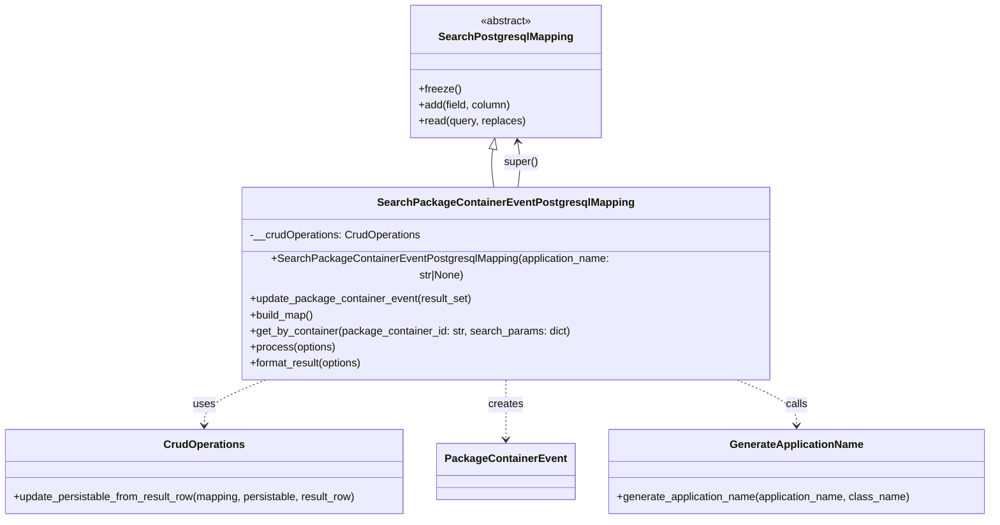

# Diagram: partview_core/partview_service/partview_service/persistence/sql/postgresql/SearchPackageContainerEventPostgresqlMapping.py

> Auto-generated by Obscura crawlers

## Mermaid

### SVG

<svg id="container" width="1478.234375" xmlns="http://www.w3.org/2000/svg" class="classDiagram" height="752" viewBox="0 0 1478.234375 752" role="graphics-document document" aria-roledescription="class"><g><defs><marker id="container_class-aggregationStart" class="marker aggregation class" refX="18" refY="7" markerWidth="190" markerHeight="240" orient="auto"><path d="M 18,7 L9,13 L1,7 L9,1 Z"></path></marker></defs><defs><marker id="container_class-aggregationEnd" class="marker aggregation class" refX="1" refY="7" markerWidth="20" markerHeight="28" orient="auto"><path d="M 18,7 L9,13 L1,7 L9,1 Z"></path></marker></defs><defs><marker id="container_class-extensionStart" class="marker extension class" refX="18" refY="7" markerWidth="190" markerHeight="240" orient="auto"><path d="M 1,7 L18,13 V 1 Z"></path></marker></defs><defs><marker id="container_class-extensionEnd" class="marker extension class" refX="1" refY="7" markerWidth="20" markerHeight="28" orient="auto"><path d="M 1,1 V 13 L18,7 Z"></path></marker></defs><defs><marker id="container_class-compositionStart" class="marker composition class" refX="18" refY="7" markerWidth="190" markerHeight="240" orient="auto"><path d="M 18,7 L9,13 L1,7 L9,1 Z"></path></marker></defs><defs><marker id="container_class-compositionEnd" class="marker composition class" refX="1" refY="7" markerWidth="20" markerHeight="28" orient="auto"><path d="M 18,7 L9,13 L1,7 L9,1 Z"></path></marker></defs><defs><marker id="container_class-dependencyStart" class="marker dependency class" refX="6" refY="7" markerWidth="190" markerHeight="240" orient="auto"><path d="M 5,7 L9,13 L1,7 L9,1 Z"></path></marker></defs><defs><marker id="container_class-dependencyEnd" class="marker dependency class" refX="13" refY="7" markerWidth="20" markerHeight="28" orient="auto"><path d="M 18,7 L9,13 L14,7 L9,1 Z"></path></marker></defs><defs><marker id="container_class-lollipopStart" class="marker lollipop class" refX="13" refY="7" markerWidth="190" markerHeight="240" orient="auto"><circle stroke="black" fill="transparent" cx="7" cy="7" r="6"></circle></marker></defs><defs><marker id="container_class-lollipopEnd" class="marker lollipop class" refX="1" refY="7" markerWidth="190" markerHeight="240" orient="auto"><circle stroke="black" fill="transparent" cx="7" cy="7" r="6"></circle></marker></defs><g class="root"><g class="clusters"></g><g class="edgePaths"><path d="M739.825,223.011L739.265,226.342C738.704,229.674,737.582,236.337,737.857,245.835C738.131,255.333,739.802,267.667,740.637,273.833L741.472,280" id="id_SearchPostgresqlMapping_SearchPackageContainerEventPostgresqlMapping_1" class="edge-thickness-normal edge-pattern-solid relation" style=";;;" data-edge="true" data-et="edge" data-id="id_SearchPostgresqlMapping_SearchPackageContainerEventPostgresqlMapping_1" data-points="W3sieCI6NzQyLjY4ODUzNDAwNzM1MjksInkiOjIwNn0seyJ4Ijo3MzYuNDYwOTM3NSwieSI6MjQzfSx7IngiOjc0MS40NzI0OTQ0NTI2NjI4LCJ5IjoyODB9XQ==" marker-start="url(#container_class-extensionStart)"></path><path d="M408.26,544L391.858,550.167C375.456,556.333,342.652,568.667,326.25,580C309.848,591.333,309.848,601.667,309.848,606.833L309.848,612" id="id_SearchPackageContainerEventPostgresqlMapping_CrudOperations_2" class="edge-thickness-normal edge-pattern-dashed relation" style=";;;" data-edge="true" data-et="edge" data-id="id_SearchPackageContainerEventPostgresqlMapping_CrudOperations_2" data-points="W3sieCI6NDA4LjI1OTc1NDA2ODA0NzM2LCJ5Ijo1NDR9LHsieCI6MzA5Ljg0NzY1NjI1LCJ5Ijo1ODF9LHsieCI6MzA5Ljg0NzY1NjI1LCJ5Ijo2MTh9XQ==" marker-end="url(#container_class-dependencyEnd)"></path><path d="M759.352,544L759.352,550.167C759.352,556.333,759.352,568.667,759.352,583.5C759.352,598.333,759.352,615.667,759.352,624.333L759.352,633" id="id_SearchPackageContainerEventPostgresqlMapping_PackageContainerEvent_3" class="edge-thickness-normal edge-pattern-dashed relation" style=";;;" data-edge="true" data-et="edge" data-id="id_SearchPackageContainerEventPostgresqlMapping_PackageContainerEvent_3" data-points="W3sieCI6NzU5LjM1MTU2MjUsInkiOjU0NH0seyJ4Ijo3NTkuMzUxNTYyNSwieSI6NTgxfSx7IngiOjc1OS4zNTE1NjI1LCJ5Ijo2Mzl9XQ==" marker-end="url(#container_class-dependencyEnd)"></path><path d="M1094.639,544L1110.303,550.167C1125.966,556.333,1157.294,568.667,1172.957,580C1188.621,591.333,1188.621,601.667,1188.621,606.833L1188.621,612" id="id_SearchPackageContainerEventPostgresqlMapping_GenerateApplicationName_4" class="edge-thickness-normal edge-pattern-dashed relation" style=";;;" data-edge="true" data-et="edge" data-id="id_SearchPackageContainerEventPostgresqlMapping_GenerateApplicationName_4" data-points="W3sieCI6MTA5NC42MzkwMDcwMjY2MjczLCJ5Ijo1NDR9LHsieCI6MTE4OC42MjEwOTM3NSwieSI6NTgxfSx7IngiOjExODguNjIxMDkzNzUsInkiOjYxOH1d" marker-end="url(#container_class-dependencyEnd)"></path><path d="M777.231,280L778.066,273.833C778.901,267.667,780.572,255.333,780.535,243.986C780.498,232.639,778.754,222.278,777.882,217.097L777.01,211.917" id="id_SearchPackageContainerEventPostgresqlMapping_SearchPostgresqlMapping_5" class="edge-thickness-normal edge-pattern-solid relation" style=";;;" data-edge="true" data-et="edge" data-id="id_SearchPackageContainerEventPostgresqlMapping_SearchPostgresqlMapping_5" data-points="W3sieCI6Nzc3LjIzMDYzMDU0NzMzNzIsInkiOjI4MH0seyJ4Ijo3ODIuMjQyMTg3NSwieSI6MjQzfSx7IngiOjc3Ni4wMTQ1OTA5OTI2NDcxLCJ5IjoyMDZ9XQ==" marker-end="url(#container_class-dependencyEnd)"></path></g><g class="edgeLabels"><g class="edgeLabel"><g class="label" data-id="id_SearchPostgresqlMapping_SearchPackageContainerEventPostgresqlMapping_1" transform="translate(0, 0)"><foreignObject width="0" height="0">

</foreignObject></g></g><g class="edgeLabel" transform="translate(309.84765625, 581)"><g class="label" data-id="id_SearchPackageContainerEventPostgresqlMapping_CrudOperations_2" transform="translate(-16.4921875, -12)"><foreignObject width="32.984375" height="24">

uses

</foreignObject></g></g><g class="edgeLabel" transform="translate(759.3515625, 581)"><g class="label" data-id="id_SearchPackageContainerEventPostgresqlMapping_PackageContainerEvent_3" transform="translate(-26.171875, -12)"><foreignObject width="52.34375" height="24">

creates

</foreignObject></g></g><g class="edgeLabel" transform="translate(1188.62109375, 581)"><g class="label" data-id="id_SearchPackageContainerEventPostgresqlMapping_GenerateApplicationName_4" transform="translate(-16.4453125, -12)"><foreignObject width="32.890625" height="24">

calls

</foreignObject></g></g><g class="edgeLabel" transform="translate(782.22704, 242.90998)"><g class="label" data-id="id_SearchPackageContainerEventPostgresqlMapping_SearchPostgresqlMapping_5" transform="translate(-25.78125, -12)"><foreignObject width="51.5625" height="24">

super()

</foreignObject></g></g></g><g class="nodes"><g class="node default" id="classId-SearchPostgresqlMapping-0" transform="translate(759.3515625, 107)"><g class="basic label-container"><path d="M-139.92578125 -99 L139.92578125 -99 L139.92578125 99 L-139.92578125 99" stroke="none" stroke-width="0" fill="#ECECFF" style=""></path><path d="M-139.92578125 -99 C-54.17179866119325 -99, 31.5821839276135 -99, 139.92578125 -99 M-139.92578125 -99 C-61.85260760969112 -99, 16.22056603061776 -99, 139.92578125 -99 M139.92578125 -99 C139.92578125 -41.98431991679528, 139.92578125 15.031360166409442, 139.92578125 99 M139.92578125 -99 C139.92578125 -37.89807351802336, 139.92578125 23.20385296395328, 139.92578125 99 M139.92578125 99 C48.6336329333476 99, -42.6585153833048 99, -139.92578125 99 M139.92578125 99 C46.66612436863531 99, -46.59353251272938 99, -139.92578125 99 M-139.92578125 99 C-139.92578125 56.1527887828854, -139.92578125 13.305577565770804, -139.92578125 -99 M-139.92578125 99 C-139.92578125 53.21822671162023, -139.92578125 7.436453423240465, -139.92578125 -99" stroke="#9370DB" stroke-width="1.3" fill="none" stroke-dasharray="0 0" style=""></path></g><g class="annotation-group text" transform="translate(-38.609375, -75)"><g class="label" style="" transform="translate(0,-12)"><foreignObject width="77.21875" height="24">

«abstract»

</foreignObject></g></g><g class="label-group text" transform="translate(-95.1171875, -51)"><g class="label" style="font-weight: bolder" transform="translate(0,-12)"><foreignObject width="190.234375" height="24">

SearchPostgresqlMapping

</foreignObject></g></g><g class="members-group text" transform="translate(-127.92578125, -3)"></g><g class="methods-group text" transform="translate(-127.92578125, 27)"><g class="label" style="" transform="translate(0,-12)"><foreignObject width="62.109375" height="24">

+freeze()

</foreignObject></g><g class="label" style="" transform="translate(0,12)"><foreignObject width="139.890625" height="24">

+add(field, column)

</foreignObject></g><g class="label" style="" transform="translate(0,36)"><foreignObject width="160.734375" height="24">

+read(query, replaces)

</foreignObject></g></g><g class="divider" style=""><path d="M-139.92578125 -27 C-67.54155786428652 -27, 4.842665521426966 -27, 139.92578125 -27 M-139.92578125 -27 C-30.19031318392912 -27, 79.54515488214176 -27, 139.92578125 -27" stroke="#9370DB" stroke-width="1.3" fill="none" stroke-dasharray="0 0" style=""></path></g><g class="divider" style=""><path d="M-139.92578125 -3 C-37.581469199889426 -3, 64.76284285022115 -3, 139.92578125 -3 M-139.92578125 -3 C-66.66856729031876 -3, 6.5886466693624754 -3, 139.92578125 -3" stroke="#9370DB" stroke-width="1.3" fill="none" stroke-dasharray="0 0" style=""></path></g></g><g class="node default" id="classId-CrudOperations-1" transform="translate(309.84765625, 681)"><g class="basic label-container"><path d="M-301.84765625 -63 L301.84765625 -63 L301.84765625 63 L-301.84765625 63" stroke="none" stroke-width="0" fill="#ECECFF" style=""></path><path d="M-301.84765625 -63 C-118.5863871169918 -63, 64.6748820160164 -63, 301.84765625 -63 M-301.84765625 -63 C-158.9456502474841 -63, -16.04364424496822 -63, 301.84765625 -63 M301.84765625 -63 C301.84765625 -23.126536383371906, 301.84765625 16.746927233256187, 301.84765625 63 M301.84765625 -63 C301.84765625 -32.07162052864505, 301.84765625 -1.1432410572900977, 301.84765625 63 M301.84765625 63 C164.70773458350104 63, 27.567812917002072 63, -301.84765625 63 M301.84765625 63 C141.66089542556088 63, -18.52586539887824 63, -301.84765625 63 M-301.84765625 63 C-301.84765625 36.49303625894441, -301.84765625 9.986072517888815, -301.84765625 -63 M-301.84765625 63 C-301.84765625 16.946059085766187, -301.84765625 -29.107881828467626, -301.84765625 -63" stroke="#9370DB" stroke-width="1.3" fill="none" stroke-dasharray="0 0" style=""></path></g><g class="annotation-group text" transform="translate(0, -39)"></g><g class="label-group text" transform="translate(-57.6171875, -39)"><g class="label" style="font-weight: bolder" transform="translate(0,-12)"><foreignObject width="115.234375" height="24">

CrudOperations

</foreignObject></g></g><g class="members-group text" transform="translate(-289.84765625, 9)"></g><g class="methods-group text" transform="translate(-289.84765625, 39)"><g class="label" style="" transform="translate(0,-12)"><foreignObject width="522.078125" height="24">

+update_persistable_from_result_row(mapping, persistable, result_row)

</foreignObject></g></g><g class="divider" style=""><path d="M-301.84765625 -15 C-92.58798172212781 -15, 116.67169280574439 -15, 301.84765625 -15 M-301.84765625 -15 C-92.34905905417907 -15, 117.14953814164187 -15, 301.84765625 -15" stroke="#9370DB" stroke-width="1.3" fill="none" stroke-dasharray="0 0" style=""></path></g><g class="divider" style=""><path d="M-301.84765625 9 C-122.80292107721749 9, 56.24181409556502 9, 301.84765625 9 M-301.84765625 9 C-171.22564293250775 9, -40.60362961501551 9, 301.84765625 9" stroke="#9370DB" stroke-width="1.3" fill="none" stroke-dasharray="0 0" style=""></path></g></g><g class="node default" id="classId-PackageContainerEvent-2" transform="translate(759.3515625, 681)"><g class="basic label-container"><path d="M-97.65625 -42 L97.65625 -42 L97.65625 42 L-97.65625 42" stroke="none" stroke-width="0" fill="#ECECFF" style=""></path><path d="M-97.65625 -42 C-41.817611363956374 -42, 14.021027272087252 -42, 97.65625 -42 M-97.65625 -42 C-42.109005897690835 -42, 13.43823820461833 -42, 97.65625 -42 M97.65625 -42 C97.65625 -16.73186723714342, 97.65625 8.536265525713162, 97.65625 42 M97.65625 -42 C97.65625 -14.793970820890316, 97.65625 12.412058358219369, 97.65625 42 M97.65625 42 C41.4268031431606 42, -14.802643713678805 42, -97.65625 42 M97.65625 42 C22.619595217017064 42, -52.41705956596587 42, -97.65625 42 M-97.65625 42 C-97.65625 19.638476531907443, -97.65625 -2.7230469361851135, -97.65625 -42 M-97.65625 42 C-97.65625 14.877322865788944, -97.65625 -12.245354268422112, -97.65625 -42" stroke="#9370DB" stroke-width="1.3" fill="none" stroke-dasharray="0 0" style=""></path></g><g class="annotation-group text" transform="translate(0, -18)"></g><g class="label-group text" transform="translate(-85.65625, -18)"><g class="label" style="font-weight: bolder" transform="translate(0,-12)"><foreignObject width="171.3125" height="24">

PackageContainerEvent

</foreignObject></g></g><g class="members-group text" transform="translate(-85.65625, 30)"></g><g class="methods-group text" transform="translate(-85.65625, 60)"></g><g class="divider" style=""><path d="M-97.65625 6 C-36.429047494378686 6, 24.798155011242628 6, 97.65625 6 M-97.65625 6 C-29.2103612705493 6, 39.2355274589014 6, 97.65625 6" stroke="#9370DB" stroke-width="1.3" fill="none" stroke-dasharray="0 0" style=""></path></g><g class="divider" style=""><path d="M-97.65625 24 C-31.87554913501225 24, 33.9051517299755 24, 97.65625 24 M-97.65625 24 C-42.63564121870453 24, 12.384967562590944 24, 97.65625 24" stroke="#9370DB" stroke-width="1.3" fill="none" stroke-dasharray="0 0" style=""></path></g></g><g class="node default" id="classId-GenerateApplicationName-3" transform="translate(1188.62109375, 681)"><g class="basic label-container"><path d="M-281.61328125 -63 L281.61328125 -63 L281.61328125 63 L-281.61328125 63" stroke="none" stroke-width="0" fill="#ECECFF" style=""></path><path d="M-281.61328125 -63 C-146.55253725356565 -63, -11.491793257131292 -63, 281.61328125 -63 M-281.61328125 -63 C-133.62866540837092 -63, 14.355950433258158 -63, 281.61328125 -63 M281.61328125 -63 C281.61328125 -36.237583126466305, 281.61328125 -9.475166252932617, 281.61328125 63 M281.61328125 -63 C281.61328125 -23.842482533076996, 281.61328125 15.315034933846007, 281.61328125 63 M281.61328125 63 C135.57569873088264 63, -10.46188378823473 63, -281.61328125 63 M281.61328125 63 C59.090083586390335 63, -163.43311407721933 63, -281.61328125 63 M-281.61328125 63 C-281.61328125 26.314047738034823, -281.61328125 -10.371904523930354, -281.61328125 -63 M-281.61328125 63 C-281.61328125 36.70694612887989, -281.61328125 10.413892257759784, -281.61328125 -63" stroke="#9370DB" stroke-width="1.3" fill="none" stroke-dasharray="0 0" style=""></path></g><g class="annotation-group text" transform="translate(0, -39)"></g><g class="label-group text" transform="translate(-95.8203125, -39)"><g class="label" style="font-weight: bolder" transform="translate(0,-12)"><foreignObject width="191.640625" height="24">

GenerateApplicationName

</foreignObject></g></g><g class="members-group text" transform="translate(-269.61328125, 9)"></g><g class="methods-group text" transform="translate(-269.61328125, 39)"><g class="label" style="" transform="translate(0,-12)"><foreignObject width="443.40625" height="24">

+generate_application_name(application_name, class_name)

</foreignObject></g></g><g class="divider" style=""><path d="M-281.61328125 -15 C-168.13978431978555 -15, -54.666287389571096 -15, 281.61328125 -15 M-281.61328125 -15 C-126.50472785673256 -15, 28.603825536534885 -15, 281.61328125 -15" stroke="#9370DB" stroke-width="1.3" fill="none" stroke-dasharray="0 0" style=""></path></g><g class="divider" style=""><path d="M-281.61328125 9 C-163.48538948074332 9, -45.357497711486644 9, 281.61328125 9 M-281.61328125 9 C-86.14878518084905 9, 109.31571088830191 9, 281.61328125 9" stroke="#9370DB" stroke-width="1.3" fill="none" stroke-dasharray="0 0" style=""></path></g></g><g class="node default" id="classId-SearchPackageContainerEventPostgresqlMapping-4" transform="translate(759.3515625, 412)"><g class="basic label-container"><path d="M-390.47265625 -132 L390.47265625 -132 L390.47265625 132 L-390.47265625 132" stroke="none" stroke-width="0" fill="#ECECFF" style=""></path><path d="M-390.47265625 -132 C-123.81749569527346 -132, 142.83766485945307 -132, 390.47265625 -132 M-390.47265625 -132 C-149.9542447224911 -132, 90.5641668050178 -132, 390.47265625 -132 M390.47265625 -132 C390.47265625 -27.25903323183843, 390.47265625 77.48193353632314, 390.47265625 132 M390.47265625 -132 C390.47265625 -76.79740297454278, 390.47265625 -21.594805949085554, 390.47265625 132 M390.47265625 132 C108.43427813153284 132, -173.60409998693433 132, -390.47265625 132 M390.47265625 132 C134.50322297780176 132, -121.46621029439649 132, -390.47265625 132 M-390.47265625 132 C-390.47265625 46.31690830225118, -390.47265625 -39.36618339549764, -390.47265625 -132 M-390.47265625 132 C-390.47265625 78.51002748048819, -390.47265625 25.020054960976395, -390.47265625 -132" stroke="#9370DB" stroke-width="1.3" fill="none" stroke-dasharray="0 0" style=""></path></g><g class="annotation-group text" transform="translate(0, -108)"></g><g class="label-group text" transform="translate(-180.7734375, -108)"><g class="label" style="font-weight: bolder" transform="translate(0,-12)"><foreignObject width="361.546875" height="24">

SearchPackageContainerEventPostgresqlMapping

</foreignObject></g></g><g class="members-group text" transform="translate(-378.47265625, -60)"><g class="label" style="" transform="translate(0,-12)"><foreignObject width="256.09375" height="24">

-__crudOperations: CrudOperations

</foreignObject></g></g><g class="methods-group text" transform="translate(-378.47265625, -12)"><g class="label" style="" transform="translate(0,-12)"><foreignObject width="576.171875" height="24">

+SearchPackageContainerEventPostgresqlMapping(application_name: str|None)

</foreignObject></g><g class="label" style="" transform="translate(0,12)"><foreignObject width="332.5625" height="24">

+update_package_container_event(result_set)

</foreignObject></g><g class="label" style="" transform="translate(0,36)"><foreignObject width="96.109375" height="24">

+build_map()

</foreignObject></g><g class="label" style="" transform="translate(0,60)"><foreignObject width="479.46875" height="24">

+get_by_container(package_container_id: str, search_params: dict)

</foreignObject></g><g class="label" style="" transform="translate(0,84)"><foreignObject width="129.0625" height="24">

+process(options)

</foreignObject></g><g class="label" style="" transform="translate(0,108)"><foreignObject width="172.34375" height="24">

+format_result(options)

</foreignObject></g></g><g class="divider" style=""><path d="M-390.47265625 -84 C-189.1979168710193 -84, 12.076822507961424 -84, 390.47265625 -84 M-390.47265625 -84 C-186.83591004069424 -84, 16.80083616861151 -84, 390.47265625 -84" stroke="#9370DB" stroke-width="1.3" fill="none" stroke-dasharray="0 0" style=""></path></g><g class="divider" style=""><path d="M-390.47265625 -36 C-147.605899626137 -36, 95.26085699772602 -36, 390.47265625 -36 M-390.47265625 -36 C-157.92467591237877 -36, 74.62330442524245 -36, 390.47265625 -36" stroke="#9370DB" stroke-width="1.3" fill="none" stroke-dasharray="0 0" style=""></path></g></g></g></g></g></svg>
