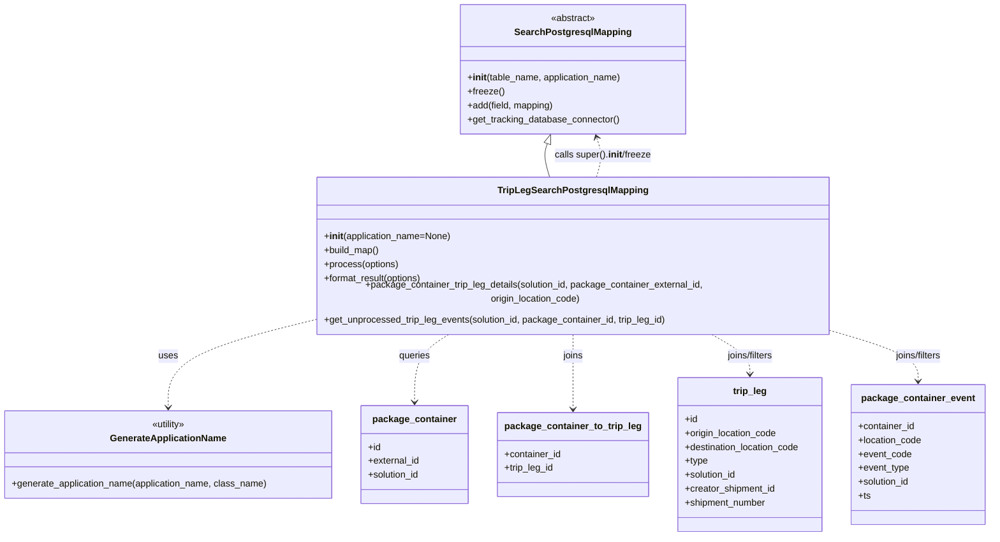

# Diagram: partview_core/partview_service/partview_service/persistence/sql/postgresql/TripLegSearchPostgresMapping.py

> Auto-generated by Obscura crawlers

## Mermaid

### SVG

<svg id="container" width="1691.046875" xmlns="http://www.w3.org/2000/svg" class="classDiagram" height="896" viewBox="0 0 1691.046875 896" role="graphics-document document" aria-roledescription="class"><g><defs><marker id="container_class-aggregationStart" class="marker aggregation class" refX="18" refY="7" markerWidth="190" markerHeight="240" orient="auto"><path d="M 18,7 L9,13 L1,7 L9,1 Z"></path></marker></defs><defs><marker id="container_class-aggregationEnd" class="marker aggregation class" refX="1" refY="7" markerWidth="20" markerHeight="28" orient="auto"><path d="M 18,7 L9,13 L1,7 L9,1 Z"></path></marker></defs><defs><marker id="container_class-extensionStart" class="marker extension class" refX="18" refY="7" markerWidth="190" markerHeight="240" orient="auto"><path d="M 1,7 L18,13 V 1 Z"></path></marker></defs><defs><marker id="container_class-extensionEnd" class="marker extension class" refX="1" refY="7" markerWidth="20" markerHeight="28" orient="auto"><path d="M 1,1 V 13 L18,7 Z"></path></marker></defs><defs><marker id="container_class-compositionStart" class="marker composition class" refX="18" refY="7" markerWidth="190" markerHeight="240" orient="auto"><path d="M 18,7 L9,13 L1,7 L9,1 Z"></path></marker></defs><defs><marker id="container_class-compositionEnd" class="marker composition class" refX="1" refY="7" markerWidth="20" markerHeight="28" orient="auto"><path d="M 18,7 L9,13 L1,7 L9,1 Z"></path></marker></defs><defs><marker id="container_class-dependencyStart" class="marker dependency class" refX="6" refY="7" markerWidth="190" markerHeight="240" orient="auto"><path d="M 5,7 L9,13 L1,7 L9,1 Z"></path></marker></defs><defs><marker id="container_class-dependencyEnd" class="marker dependency class" refX="13" refY="7" markerWidth="20" markerHeight="28" orient="auto"><path d="M 18,7 L9,13 L14,7 L9,1 Z"></path></marker></defs><defs><marker id="container_class-lollipopStart" class="marker lollipop class" refX="13" refY="7" markerWidth="190" markerHeight="240" orient="auto"><circle stroke="black" fill="transparent" cx="7" cy="7" r="6"></circle></marker></defs><defs><marker id="container_class-lollipopEnd" class="marker lollipop class" refX="1" refY="7" markerWidth="190" markerHeight="240" orient="auto"><circle stroke="black" fill="transparent" cx="7" cy="7" r="6"></circle></marker></defs><g class="root"><g class="clusters"></g><g class="edgePaths"><path d="M933.46,246.268L932.241,249.723C931.023,253.179,928.586,260.089,929.379,269.711C930.172,279.333,934.195,291.667,936.207,297.833L938.219,304" id="id_SearchPostgresqlMapping_TripLegSearchPostgresqlMapping_1" class="edge-thickness-normal edge-pattern-solid relation" style=";;;" data-edge="true" data-et="edge" data-id="id_SearchPostgresqlMapping_TripLegSearchPostgresqlMapping_1" data-points="W3sieCI6OTM5LjE5NzI2NTYyNSwieSI6MjMwfSx7IngiOjkyNi4xNDg0Mzc1LCJ5IjoyNjd9LHsieCI6OTM4LjIxODYwMzUxNTYyNSwieSI6MzA0fV0=" marker-start="url(#container_class-extensionStart)"></path><path d="M530.746,530.982L490.557,540.318C450.368,549.655,369.991,568.327,329.802,592.33C289.613,616.333,289.613,645.667,289.613,660.333L289.613,675" id="id_TripLegSearchPostgresqlMapping_GenerateApplicationName_2" class="edge-thickness-normal edge-pattern-dashed relation" style=";;;" data-edge="true" data-et="edge" data-id="id_TripLegSearchPostgresqlMapping_GenerateApplicationName_2" data-points="W3sieCI6NTMwLjc0NjA5Mzc1LCJ5Ijo1MzAuOTgyMDc3NTMxNjkwNX0seyJ4IjoyODkuNjEzMjgxMjUsInkiOjU4N30seyJ4IjoyODkuNjEzMjgxMjUsInkiOjY4MX1d" marker-end="url(#container_class-dependencyEnd)"></path><path d="M1018.469,304L1020.481,297.833C1022.492,291.667,1026.516,279.333,1026.685,267.943C1026.855,256.553,1023.17,246.106,1021.328,240.882L1019.486,235.658" id="id_TripLegSearchPostgresqlMapping_SearchPostgresqlMapping_3" class="edge-thickness-normal edge-pattern-dashed relation" style=";;;" data-edge="true" data-et="edge" data-id="id_TripLegSearchPostgresqlMapping_SearchPostgresqlMapping_3" data-points="W3sieCI6MTAxOC40Njg4OTY0ODQzNzUsInkiOjMwNH0seyJ4IjoxMDMwLjUzOTA2MjUsInkiOjI2N30seyJ4IjoxMDE3LjQ5MDIzNDM3NSwieSI6MjMwfV0=" marker-end="url(#container_class-dependencyEnd)"></path><path d="M774.172,550L763.935,556.167C753.699,562.333,733.226,574.667,722.99,594C712.754,613.333,712.754,639.667,712.754,652.833L712.754,666" id="id_TripLegSearchPostgresqlMapping_package_container_4" class="edge-thickness-normal edge-pattern-dashed relation" style=";;;" data-edge="true" data-et="edge" data-id="id_TripLegSearchPostgresqlMapping_package_container_4" data-points="W3sieCI6Nzc0LjE3MTU1NzYxNzE4NzUsInkiOjU1MH0seyJ4Ijo3MTIuNzUzOTA2MjUsInkiOjU4N30seyJ4Ijo3MTIuNzUzOTA2MjUsInkiOjY3Mn1d" marker-end="url(#container_class-dependencyEnd)"></path><path d="M978.344,550L978.344,556.167C978.344,562.333,978.344,574.667,978.344,596C978.344,617.333,978.344,647.667,978.344,662.833L978.344,678" id="id_TripLegSearchPostgresqlMapping_package_container_to_trip_leg_5" class="edge-thickness-normal edge-pattern-dashed relation" style=";;;" data-edge="true" data-et="edge" data-id="id_TripLegSearchPostgresqlMapping_package_container_to_trip_leg_5" data-points="W3sieCI6OTc4LjM0Mzc1LCJ5Ijo1NTB9LHsieCI6OTc4LjM0Mzc1LCJ5Ijo1ODd9LHsieCI6OTc4LjM0Mzc1LCJ5Ijo2ODR9XQ==" marker-end="url(#container_class-dependencyEnd)"></path><path d="M1209.716,550L1221.316,556.167C1232.916,562.333,1256.116,574.667,1267.716,586C1279.316,597.333,1279.316,607.667,1279.316,612.833L1279.316,618" id="id_TripLegSearchPostgresqlMapping_trip_leg_6" class="edge-thickness-normal edge-pattern-dashed relation" style=";;;" data-edge="true" data-et="edge" data-id="id_TripLegSearchPostgresqlMapping_trip_leg_6" data-points="W3sieCI6MTIwOS43MTY0Nzk0OTIxODc1LCJ5Ijo1NTB9LHsieCI6MTI3OS4zMTY0MDYyNSwieSI6NTg3fSx7IngiOjEyNzkuMzE2NDA2MjUsInkiOjYyNH1d" marker-end="url(#container_class-dependencyEnd)"></path><path d="M1425.941,548.117L1449.891,554.597C1473.84,561.078,1521.738,574.039,1545.688,587.686C1569.637,601.333,1569.637,615.667,1569.637,622.833L1569.637,630" id="id_TripLegSearchPostgresqlMapping_package_container_event_7" class="edge-thickness-normal edge-pattern-dashed relation" style=";;;" data-edge="true" data-et="edge" data-id="id_TripLegSearchPostgresqlMapping_package_container_event_7" data-points="W3sieCI6MTQyNS45NDE0MDYyNSwieSI6NTQ4LjExNjk5MDcwNDk1Njd9LHsieCI6MTU2OS42MzY3MTg3NSwieSI6NTg3fSx7IngiOjE1NjkuNjM2NzE4NzUsInkiOjYzNn1d" marker-end="url(#container_class-dependencyEnd)"></path></g><g class="edgeLabels"><g class="edgeLabel"><g class="label" data-id="id_SearchPostgresqlMapping_TripLegSearchPostgresqlMapping_1" transform="translate(0, 0)"><foreignObject width="0" height="0">

</foreignObject></g></g><g class="edgeLabel" transform="translate(289.61328125, 587)"><g class="label" data-id="id_TripLegSearchPostgresqlMapping_GenerateApplicationName_2" transform="translate(-16.4921875, -12)"><foreignObject width="32.984375" height="24">

uses

</foreignObject></g></g><g class="edgeLabel" transform="translate(1030.48675, 266.85168)"><g class="label" data-id="id_TripLegSearchPostgresqlMapping_SearchPostgresqlMapping_3" transform="translate(-84.390625, -12)"><foreignObject width="168.78125" height="24">

calls super().<strong>init</strong>/freeze

</foreignObject></g></g><g class="edgeLabel" transform="translate(712.75390625, 587)"><g class="label" data-id="id_TripLegSearchPostgresqlMapping_package_container_4" transform="translate(-27.2421875, -12)"><foreignObject width="54.484375" height="24">

queries

</foreignObject></g></g><g class="edgeLabel" transform="translate(978.34375, 587)"><g class="label" data-id="id_TripLegSearchPostgresqlMapping_package_container_to_trip_leg_5" transform="translate(-17.59375, -12)"><foreignObject width="35.1875" height="24">

joins

</foreignObject></g></g><g class="edgeLabel" transform="translate(1279.31640625, 587)"><g class="label" data-id="id_TripLegSearchPostgresqlMapping_trip_leg_6" transform="translate(-42.2890625, -12)"><foreignObject width="84.578125" height="24">

joins/filters

</foreignObject></g></g><g class="edgeLabel" transform="translate(1569.63671875, 587)"><g class="label" data-id="id_TripLegSearchPostgresqlMapping_package_container_event_7" transform="translate(-42.2890625, -12)"><foreignObject width="84.578125" height="24">

joins/filters

</foreignObject></g></g></g><g class="nodes"><g class="node default" id="classId-SearchPostgresqlMapping-0" transform="translate(978.34375, 119)"><g class="basic label-container"><path d="M-193.24609375 -111 L193.24609375 -111 L193.24609375 111 L-193.24609375 111" stroke="none" stroke-width="0" fill="#ECECFF" style=""></path><path d="M-193.24609375 -111 C-102.58751902557405 -111, -11.928944301148107 -111, 193.24609375 -111 M-193.24609375 -111 C-112.59401608132961 -111, -31.941938412659226 -111, 193.24609375 -111 M193.24609375 -111 C193.24609375 -61.22009142946505, 193.24609375 -11.4401828589301, 193.24609375 111 M193.24609375 -111 C193.24609375 -29.81228103894189, 193.24609375 51.37543792211622, 193.24609375 111 M193.24609375 111 C77.78146190645606 111, -37.68316993708788 111, -193.24609375 111 M193.24609375 111 C50.57532834723432 111, -92.09543705553136 111, -193.24609375 111 M-193.24609375 111 C-193.24609375 57.08917414120214, -193.24609375 3.1783482824042864, -193.24609375 -111 M-193.24609375 111 C-193.24609375 56.11931225982307, -193.24609375 1.2386245196461374, -193.24609375 -111" stroke="#9370DB" stroke-width="1.3" fill="none" stroke-dasharray="0 0" style=""></path></g><g class="annotation-group text" transform="translate(-38.609375, -87)"><g class="label" style="" transform="translate(0,-12)"><foreignObject width="77.21875" height="24">

«abstract»

</foreignObject></g></g><g class="label-group text" transform="translate(-95.1171875, -63)"><g class="label" style="font-weight: bolder" transform="translate(0,-12)"><foreignObject width="190.234375" height="24">

SearchPostgresqlMapping

</foreignObject></g></g><g class="members-group text" transform="translate(-181.24609375, -15)"></g><g class="methods-group text" transform="translate(-181.24609375, 15)"><g class="label" style="" transform="translate(0,-12)"><foreignObject width="267.375" height="24">

+<strong>init</strong>(table_name, application_name)

</foreignObject></g><g class="label" style="" transform="translate(0,12)"><foreignObject width="62.109375" height="24">

+freeze()

</foreignObject></g><g class="label" style="" transform="translate(0,36)"><foreignObject width="149.765625" height="24">

+add(field, mapping)

</foreignObject></g><g class="label" style="" transform="translate(0,60)"><foreignObject width="262.375" height="24">

+get_tracking_database_connector()

</foreignObject></g></g><g class="divider" style=""><path d="M-193.24609375 -39 C-104.47546531120493 -39, -15.704836872409857 -39, 193.24609375 -39 M-193.24609375 -39 C-49.900271183996836 -39, 93.44555138200633 -39, 193.24609375 -39" stroke="#9370DB" stroke-width="1.3" fill="none" stroke-dasharray="0 0" style=""></path></g><g class="divider" style=""><path d="M-193.24609375 -15 C-74.52049852731817 -15, 44.205096695363665 -15, 193.24609375 -15 M-193.24609375 -15 C-47.98564162657868 -15, 97.27481049684263 -15, 193.24609375 -15" stroke="#9370DB" stroke-width="1.3" fill="none" stroke-dasharray="0 0" style=""></path></g></g><g class="node default" id="classId-TripLegSearchPostgresqlMapping-1" transform="translate(978.34375, 427)"><g class="basic label-container"><path d="M-447.59765625 -123 L447.59765625 -123 L447.59765625 123 L-447.59765625 123" stroke="none" stroke-width="0" fill="#ECECFF" style=""></path><path d="M-447.59765625 -123 C-139.18527756141884 -123, 169.2271011271623 -123, 447.59765625 -123 M-447.59765625 -123 C-163.3413700196399 -123, 120.91491621072021 -123, 447.59765625 -123 M447.59765625 -123 C447.59765625 -61.18575597126702, 447.59765625 0.6284880574659581, 447.59765625 123 M447.59765625 -123 C447.59765625 -51.9425720672795, 447.59765625 19.114855865441, 447.59765625 123 M447.59765625 123 C193.77442047027068 123, -60.04881530945863 123, -447.59765625 123 M447.59765625 123 C170.5873756315467 123, -106.42290498690659 123, -447.59765625 123 M-447.59765625 123 C-447.59765625 66.26457741688654, -447.59765625 9.529154833773063, -447.59765625 -123 M-447.59765625 123 C-447.59765625 51.65754365261154, -447.59765625 -19.684912694776926, -447.59765625 -123" stroke="#9370DB" stroke-width="1.3" fill="none" stroke-dasharray="0 0" style=""></path></g><g class="annotation-group text" transform="translate(0, -99)"></g><g class="label-group text" transform="translate(-122.1640625, -99)"><g class="label" style="font-weight: bolder" transform="translate(0,-12)"><foreignObject width="244.328125" height="24">

TripLegSearchPostgresqlMapping

</foreignObject></g></g><g class="members-group text" transform="translate(-435.59765625, -51)"></g><g class="methods-group text" transform="translate(-435.59765625, -21)"><g class="label" style="" transform="translate(0,-12)"><foreignObject width="220.109375" height="24">

+<strong>init</strong>(application_name=None)

</foreignObject></g><g class="label" style="" transform="translate(0,12)"><foreignObject width="96.109375" height="24">

+build_map()

</foreignObject></g><g class="label" style="" transform="translate(0,36)"><foreignObject width="129.0625" height="24">

+process(options)

</foreignObject></g><g class="label" style="" transform="translate(0,60)"><foreignObject width="172.34375" height="24">

+format_result(options)

</foreignObject></g><g class="label" style="" transform="translate(0,84)"><foreignObject width="749.03125" height="24">

+package_container_trip_leg_details(solution_id, package_container_external_id, origin_location_code)

</foreignObject></g><g class="label" style="" transform="translate(0,108)"><foreignObject width="593.875" height="24">

+get_unprocessed_trip_leg_events(solution_id, package_container_id, trip_leg_id)

</foreignObject></g></g><g class="divider" style=""><path d="M-447.59765625 -75 C-265.06409090185974 -75, -82.53052555371949 -75, 447.59765625 -75 M-447.59765625 -75 C-201.44662817523 -75, 44.70439989954002 -75, 447.59765625 -75" stroke="#9370DB" stroke-width="1.3" fill="none" stroke-dasharray="0 0" style=""></path></g><g class="divider" style=""><path d="M-447.59765625 -51 C-101.67585493088171 -51, 244.24594638823658 -51, 447.59765625 -51 M-447.59765625 -51 C-183.24686638737484 -51, 81.10392347525033 -51, 447.59765625 -51" stroke="#9370DB" stroke-width="1.3" fill="none" stroke-dasharray="0 0" style=""></path></g></g><g class="node default" id="classId-GenerateApplicationName-2" transform="translate(289.61328125, 756)"><g class="basic label-container"><path d="M-281.61328125 -75 L281.61328125 -75 L281.61328125 75 L-281.61328125 75" stroke="none" stroke-width="0" fill="#ECECFF" style=""></path><path d="M-281.61328125 -75 C-166.854110403221 -75, -52.094939556442 -75, 281.61328125 -75 M-281.61328125 -75 C-77.45221668861194 -75, 126.70884787277612 -75, 281.61328125 -75 M281.61328125 -75 C281.61328125 -17.22944443257721, 281.61328125 40.54111113484558, 281.61328125 75 M281.61328125 -75 C281.61328125 -34.25726254523568, 281.61328125 6.485474909528634, 281.61328125 75 M281.61328125 75 C101.53335787294989 75, -78.54656550410022 75, -281.61328125 75 M281.61328125 75 C79.03272885968906 75, -123.54782353062188 75, -281.61328125 75 M-281.61328125 75 C-281.61328125 18.39943397151915, -281.61328125 -38.2011320569617, -281.61328125 -75 M-281.61328125 75 C-281.61328125 17.84828715917061, -281.61328125 -39.30342568165878, -281.61328125 -75" stroke="#9370DB" stroke-width="1.3" fill="none" stroke-dasharray="0 0" style=""></path></g><g class="annotation-group text" transform="translate(-30.3125, -51)"><g class="label" style="" transform="translate(0,-12)"><foreignObject width="60.625" height="24">

«utility»

</foreignObject></g></g><g class="label-group text" transform="translate(-95.8203125, -27)"><g class="label" style="font-weight: bolder" transform="translate(0,-12)"><foreignObject width="191.640625" height="24">

GenerateApplicationName

</foreignObject></g></g><g class="members-group text" transform="translate(-269.61328125, 21)"></g><g class="methods-group text" transform="translate(-269.61328125, 51)"><g class="label" style="" transform="translate(0,-12)"><foreignObject width="443.40625" height="24">

+generate_application_name(application_name, class_name)

</foreignObject></g></g><g class="divider" style=""><path d="M-281.61328125 -3 C-165.56717592823242 -3, -49.521070606464804 -3, 281.61328125 -3 M-281.61328125 -3 C-159.7052600289549 -3, -37.79723880790985 -3, 281.61328125 -3" stroke="#9370DB" stroke-width="1.3" fill="none" stroke-dasharray="0 0" style=""></path></g><g class="divider" style=""><path d="M-281.61328125 21 C-96.2989718724001 21, 89.0153375051998 21, 281.61328125 21 M-281.61328125 21 C-136.5736460638665 21, 8.46598912226699 21, 281.61328125 21" stroke="#9370DB" stroke-width="1.3" fill="none" stroke-dasharray="0 0" style=""></path></g></g><g class="node default" id="classId-package_container-3" transform="translate(712.75390625, 756)"><g class="basic label-container"><path d="M-91.52734375 -84 L91.52734375 -84 L91.52734375 84 L-91.52734375 84" stroke="none" stroke-width="0" fill="#ECECFF" style=""></path><path d="M-91.52734375 -84 C-28.348579816221367 -84, 34.830184117557266 -84, 91.52734375 -84 M-91.52734375 -84 C-22.19428271446661 -84, 47.13877832106678 -84, 91.52734375 -84 M91.52734375 -84 C91.52734375 -32.406775395899935, 91.52734375 19.18644920820013, 91.52734375 84 M91.52734375 -84 C91.52734375 -39.87544504153063, 91.52734375 4.249109916938735, 91.52734375 84 M91.52734375 84 C24.72629742974665 84, -42.0747488905067 84, -91.52734375 84 M91.52734375 84 C48.851675226965504 84, 6.176006703931009 84, -91.52734375 84 M-91.52734375 84 C-91.52734375 45.2998354105593, -91.52734375 6.599670821118593, -91.52734375 -84 M-91.52734375 84 C-91.52734375 32.77004087177166, -91.52734375 -18.459918256456675, -91.52734375 -84" stroke="#9370DB" stroke-width="1.3" fill="none" stroke-dasharray="0 0" style=""></path></g><g class="annotation-group text" transform="translate(0, -60)"></g><g class="label-group text" transform="translate(-68.8359375, -60)"><g class="label" style="font-weight: bolder" transform="translate(0,-12)"><foreignObject width="137.671875" height="24">

package_container

</foreignObject></g></g><g class="members-group text" transform="translate(-79.52734375, -12)"><g class="label" style="" transform="translate(0,-12)"><foreignObject width="22.078125" height="24">

+id

</foreignObject></g><g class="label" style="" transform="translate(0,12)"><foreignObject width="89.765625" height="24">

+external_id

</foreignObject></g><g class="label" style="" transform="translate(0,36)"><foreignObject width="90.21875" height="24">

+solution_id

</foreignObject></g></g><g class="methods-group text" transform="translate(-79.52734375, 84)"></g><g class="divider" style=""><path d="M-91.52734375 -36 C-45.43226218465304 -36, 0.662819380693918 -36, 91.52734375 -36 M-91.52734375 -36 C-50.51391549629916 -36, -9.500487242598325 -36, 91.52734375 -36" stroke="#9370DB" stroke-width="1.3" fill="none" stroke-dasharray="0 0" style=""></path></g><g class="divider" style=""><path d="M-91.52734375 60 C-20.13898967744049 60, 51.24936439511902 60, 91.52734375 60 M-91.52734375 60 C-25.193290622835704 60, 41.14076250432859 60, 91.52734375 60" stroke="#9370DB" stroke-width="1.3" fill="none" stroke-dasharray="0 0" style=""></path></g></g><g class="node default" id="classId-package_container_to_trip_leg-4" transform="translate(978.34375, 756)"><g class="basic label-container"><path d="M-124.0625 -72 L124.0625 -72 L124.0625 72 L-124.0625 72" stroke="none" stroke-width="0" fill="#ECECFF" style=""></path><path d="M-124.0625 -72 C-62.00779561336312 -72, 0.04690877327375631 -72, 124.0625 -72 M-124.0625 -72 C-39.516432408143075 -72, 45.02963518371385 -72, 124.0625 -72 M124.0625 -72 C124.0625 -24.350797156147344, 124.0625 23.298405687705312, 124.0625 72 M124.0625 -72 C124.0625 -14.83343451852594, 124.0625 42.33313096294812, 124.0625 72 M124.0625 72 C53.47306769845976 72, -17.116364603080484 72, -124.0625 72 M124.0625 72 C68.51923459275609 72, 12.975969185512184 72, -124.0625 72 M-124.0625 72 C-124.0625 34.26617466962337, -124.0625 -3.4676506607532644, -124.0625 -72 M-124.0625 72 C-124.0625 24.431724296694654, -124.0625 -23.136551406610693, -124.0625 -72" stroke="#9370DB" stroke-width="1.3" fill="none" stroke-dasharray="0 0" style=""></path></g><g class="annotation-group text" transform="translate(0, -48)"></g><g class="label-group text" transform="translate(-112.0625, -48)"><g class="label" style="font-weight: bolder" transform="translate(0,-12)"><foreignObject width="224.125" height="24">

package_container_to_trip_leg

</foreignObject></g></g><g class="members-group text" transform="translate(-112.0625, 0)"><g class="label" style="" transform="translate(0,-12)"><foreignObject width="98.3125" height="24">

+container_id

</foreignObject></g><g class="label" style="" transform="translate(0,12)"><foreignObject width="85.828125" height="24">

+trip_leg_id

</foreignObject></g></g><g class="methods-group text" transform="translate(-112.0625, 72)"></g><g class="divider" style=""><path d="M-124.0625 -24 C-55.95156983753267 -24, 12.159360324934653 -24, 124.0625 -24 M-124.0625 -24 C-46.65144869459425 -24, 30.7596026108115 -24, 124.0625 -24" stroke="#9370DB" stroke-width="1.3" fill="none" stroke-dasharray="0 0" style=""></path></g><g class="divider" style=""><path d="M-124.0625 48 C-74.38609314760714 48, -24.709686295214297 48, 124.0625 48 M-124.0625 48 C-38.59517014305982 48, 46.872159713880365 48, 124.0625 48" stroke="#9370DB" stroke-width="1.3" fill="none" stroke-dasharray="0 0" style=""></path></g></g><g class="node default" id="classId-trip_leg-5" transform="translate(1279.31640625, 756)"><g class="basic label-container"><path d="M-126.91015625 -132 L126.91015625 -132 L126.91015625 132 L-126.91015625 132" stroke="none" stroke-width="0" fill="#ECECFF" style=""></path><path d="M-126.91015625 -132 C-49.50478560835144 -132, 27.90058503329712 -132, 126.91015625 -132 M-126.91015625 -132 C-68.97779042108498 -132, -11.045424592169951 -132, 126.91015625 -132 M126.91015625 -132 C126.91015625 -31.00022741666767, 126.91015625 69.99954516666466, 126.91015625 132 M126.91015625 -132 C126.91015625 -61.8875846727492, 126.91015625 8.224830654501602, 126.91015625 132 M126.91015625 132 C35.26668702738705 132, -56.3767821952259 132, -126.91015625 132 M126.91015625 132 C36.283088986906904 132, -54.34397827618619 132, -126.91015625 132 M-126.91015625 132 C-126.91015625 68.30666207604744, -126.91015625 4.613324152094876, -126.91015625 -132 M-126.91015625 132 C-126.91015625 60.64301175164873, -126.91015625 -10.713976496702543, -126.91015625 -132" stroke="#9370DB" stroke-width="1.3" fill="none" stroke-dasharray="0 0" style=""></path></g><g class="annotation-group text" transform="translate(0, -108)"></g><g class="label-group text" transform="translate(-28.4140625, -108)"><g class="label" style="font-weight: bolder" transform="translate(0,-12)"><foreignObject width="56.828125" height="24">

trip_leg

</foreignObject></g></g><g class="members-group text" transform="translate(-114.91015625, -60)"><g class="label" style="" transform="translate(0,-12)"><foreignObject width="22.078125" height="24">

+id

</foreignObject></g><g class="label" style="" transform="translate(0,12)"><foreignObject width="160.5" height="24">

+origin_location_code

</foreignObject></g><g class="label" style="" transform="translate(0,36)"><foreignObject width="201.40625" height="24">

+destination_location_code

</foreignObject></g><g class="label" style="" transform="translate(0,60)"><foreignObject width="39.703125" height="24">

+type

</foreignObject></g><g class="label" style="" transform="translate(0,84)"><foreignObject width="90.21875" height="24">

+solution_id

</foreignObject></g><g class="label" style="" transform="translate(0,108)"><foreignObject width="157.546875" height="24">

+creator_shipment_id

</foreignObject></g><g class="label" style="" transform="translate(0,132)"><foreignObject width="141.5625" height="24">

+shipment_number

</foreignObject></g></g><g class="methods-group text" transform="translate(-114.91015625, 132)"></g><g class="divider" style=""><path d="M-126.91015625 -84 C-50.680571113532096 -84, 25.549014022935808 -84, 126.91015625 -84 M-126.91015625 -84 C-26.10022435270878 -84, 74.70970754458244 -84, 126.91015625 -84" stroke="#9370DB" stroke-width="1.3" fill="none" stroke-dasharray="0 0" style=""></path></g><g class="divider" style=""><path d="M-126.91015625 108 C-55.45100066165885 108, 16.008154926682295 108, 126.91015625 108 M-126.91015625 108 C-50.440677289677026 108, 26.028801670645947 108, 126.91015625 108" stroke="#9370DB" stroke-width="1.3" fill="none" stroke-dasharray="0 0" style=""></path></g></g><g class="node default" id="classId-package_container_event-6" transform="translate(1569.63671875, 756)"><g class="basic label-container"><path d="M-113.41015625 -120 L113.41015625 -120 L113.41015625 120 L-113.41015625 120" stroke="none" stroke-width="0" fill="#ECECFF" style=""></path><path d="M-113.41015625 -120 C-67.53109483730987 -120, -21.652033424619717 -120, 113.41015625 -120 M-113.41015625 -120 C-50.405718750553014 -120, 12.598718748893972 -120, 113.41015625 -120 M113.41015625 -120 C113.41015625 -56.51382501818468, 113.41015625 6.972349963630634, 113.41015625 120 M113.41015625 -120 C113.41015625 -44.48244677905549, 113.41015625 31.035106441889013, 113.41015625 120 M113.41015625 120 C33.57938489339203 120, -46.25138646321594 120, -113.41015625 120 M113.41015625 120 C30.283121412777362 120, -52.843913424445276 120, -113.41015625 120 M-113.41015625 120 C-113.41015625 57.602178235272085, -113.41015625 -4.79564352945583, -113.41015625 -120 M-113.41015625 120 C-113.41015625 40.35116432855628, -113.41015625 -39.29767134288744, -113.41015625 -120" stroke="#9370DB" stroke-width="1.3" fill="none" stroke-dasharray="0 0" style=""></path></g><g class="annotation-group text" transform="translate(0, -96)"></g><g class="label-group text" transform="translate(-92.7109375, -96)"><g class="label" style="font-weight: bolder" transform="translate(0,-12)"><foreignObject width="185.421875" height="24">

package_container_event

</foreignObject></g></g><g class="members-group text" transform="translate(-101.41015625, -48)"><g class="label" style="" transform="translate(0,-12)"><foreignObject width="98.3125" height="24">

+container_id

</foreignObject></g><g class="label" style="" transform="translate(0,12)"><foreignObject width="110.109375" height="24">

+location_code

</foreignObject></g><g class="label" style="" transform="translate(0,36)"><foreignObject width="91.28125" height="24">

+event_code

</foreignObject></g><g class="label" style="" transform="translate(0,60)"><foreignObject width="88.125" height="24">

+event_type

</foreignObject></g><g class="label" style="" transform="translate(0,84)"><foreignObject width="90.21875" height="24">

+solution_id

</foreignObject></g><g class="label" style="" transform="translate(0,108)"><foreignObject width="21.15625" height="24">

+ts

</foreignObject></g></g><g class="methods-group text" transform="translate(-101.41015625, 120)"></g><g class="divider" style=""><path d="M-113.41015625 -72 C-44.665219213522846 -72, 24.079717822954308 -72, 113.41015625 -72 M-113.41015625 -72 C-61.681018864095535 -72, -9.95188147819107 -72, 113.41015625 -72" stroke="#9370DB" stroke-width="1.3" fill="none" stroke-dasharray="0 0" style=""></path></g><g class="divider" style=""><path d="M-113.41015625 96 C-57.837803575663706 96, -2.2654509013274122 96, 113.41015625 96 M-113.41015625 96 C-28.689954588610135 96, 56.03024707277973 96, 113.41015625 96" stroke="#9370DB" stroke-width="1.3" fill="none" stroke-dasharray="0 0" style=""></path></g></g></g></g></g></svg>
