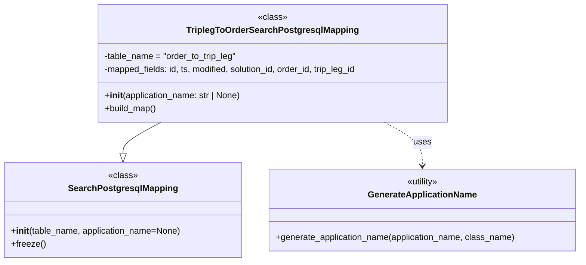

# Diagram: partview_core/partview_service/partview_service/persistence/sql/postgresql/TripLegToOrderSearchPostgresqlMapping.py

> Auto-generated by Obscura crawlers

## Mermaid

### SVG

<svg id="container" width="1062.09375" xmlns="http://www.w3.org/2000/svg" class="classDiagram" height="480" viewBox="0 0 1062.09375 480" role="graphics-document document" aria-roledescription="class"><g><defs><marker id="container_class-aggregationStart" class="marker aggregation class" refX="18" refY="7" markerWidth="190" markerHeight="240" orient="auto"><path d="M 18,7 L9,13 L1,7 L9,1 Z"></path></marker></defs><defs><marker id="container_class-aggregationEnd" class="marker aggregation class" refX="1" refY="7" markerWidth="20" markerHeight="28" orient="auto"><path d="M 18,7 L9,13 L1,7 L9,1 Z"></path></marker></defs><defs><marker id="container_class-extensionStart" class="marker extension class" refX="18" refY="7" markerWidth="190" markerHeight="240" orient="auto"><path d="M 1,7 L18,13 V 1 Z"></path></marker></defs><defs><marker id="container_class-extensionEnd" class="marker extension class" refX="1" refY="7" markerWidth="20" markerHeight="28" orient="auto"><path d="M 1,1 V 13 L18,7 Z"></path></marker></defs><defs><marker id="container_class-compositionStart" class="marker composition class" refX="18" refY="7" markerWidth="190" markerHeight="240" orient="auto"><path d="M 18,7 L9,13 L1,7 L9,1 Z"></path></marker></defs><defs><marker id="container_class-compositionEnd" class="marker composition class" refX="1" refY="7" markerWidth="20" markerHeight="28" orient="auto"><path d="M 18,7 L9,13 L1,7 L9,1 Z"></path></marker></defs><defs><marker id="container_class-dependencyStart" class="marker dependency class" refX="6" refY="7" markerWidth="190" markerHeight="240" orient="auto"><path d="M 5,7 L9,13 L1,7 L9,1 Z"></path></marker></defs><defs><marker id="container_class-dependencyEnd" class="marker dependency class" refX="13" refY="7" markerWidth="20" markerHeight="28" orient="auto"><path d="M 18,7 L9,13 L14,7 L9,1 Z"></path></marker></defs><defs><marker id="container_class-lollipopStart" class="marker lollipop class" refX="13" refY="7" markerWidth="190" markerHeight="240" orient="auto"><circle stroke="black" fill="transparent" cx="7" cy="7" r="6"></circle></marker></defs><defs><marker id="container_class-lollipopEnd" class="marker lollipop class" refX="1" refY="7" markerWidth="190" markerHeight="240" orient="auto"><circle stroke="black" fill="transparent" cx="7" cy="7" r="6"></circle></marker></defs><g class="root"><g class="clusters"></g><g class="edgePaths"><path d="M294.357,224L282.703,230.167C271.049,236.333,247.741,248.667,236.087,258.125C224.434,267.583,224.434,274.167,224.434,277.458L224.434,280.75" id="id_TriplegToOrderSearchPostgresqlMapping_SearchPostgresqlMapping_1" class="edge-thickness-normal edge-pattern-solid relation" style=";;;" data-edge="true" data-et="edge" data-id="id_TriplegToOrderSearchPostgresqlMapping_SearchPostgresqlMapping_1" data-points="W3sieCI6Mjk0LjM1NjgxNTczMjc1ODYsInkiOjIyNH0seyJ4IjoyMjQuNDMzNTkzNzUsInkiOjI2MX0seyJ4IjoyMjQuNDMzNTkzNzUsInkiOjI5OH1d" marker-end="url(#container_class-extensionEnd)"></path><path d="M702.557,224L714.211,230.167C725.865,236.333,749.173,248.667,760.827,262C772.48,275.333,772.48,289.667,772.48,296.833L772.48,304" id="id_TriplegToOrderSearchPostgresqlMapping_GenerateApplicationName_2" class="edge-thickness-normal edge-pattern-dashed relation" style=";;;" data-edge="true" data-et="edge" data-id="id_TriplegToOrderSearchPostgresqlMapping_GenerateApplicationName_2" data-points="W3sieCI6NzAyLjU1NzI0Njc2NzI0MTQsInkiOjIyNH0seyJ4Ijo3NzIuNDgwNDY4NzUsInkiOjI2MX0seyJ4Ijo3NzIuNDgwNDY4NzUsInkiOjMxMH1d" marker-end="url(#container_class-dependencyEnd)"></path></g><g class="edgeLabels"><g class="edgeLabel"><g class="label" data-id="id_TriplegToOrderSearchPostgresqlMapping_SearchPostgresqlMapping_1" transform="translate(0, 0)"><foreignObject width="0" height="0">

</foreignObject></g></g><g class="edgeLabel" transform="translate(772.48046875, 261)"><g class="label" data-id="id_TriplegToOrderSearchPostgresqlMapping_GenerateApplicationName_2" transform="translate(-16.4921875, -12)"><foreignObject width="32.984375" height="24">

uses

</foreignObject></g></g></g><g class="nodes"><g class="node default" id="classId-SearchPostgresqlMapping-0" transform="translate(224.43359375, 385)"><g class="basic label-container"><path d="M-216.43359375 -87 L216.43359375 -87 L216.43359375 87 L-216.43359375 87" stroke="none" stroke-width="0" fill="#ECECFF" style=""></path><path d="M-216.43359375 -87 C-106.28927524357778 -87, 3.855043262844447 -87, 216.43359375 -87 M-216.43359375 -87 C-110.67536464251914 -87, -4.917135535038284 -87, 216.43359375 -87 M216.43359375 -87 C216.43359375 -18.33285714833856, 216.43359375 50.33428570332288, 216.43359375 87 M216.43359375 -87 C216.43359375 -29.18501148185816, 216.43359375 28.629977036283677, 216.43359375 87 M216.43359375 87 C112.29712711469548 87, 8.16066047939097 87, -216.43359375 87 M216.43359375 87 C104.44138236302146 87, -7.550829023957078 87, -216.43359375 87 M-216.43359375 87 C-216.43359375 43.33686695884876, -216.43359375 -0.32626608230248166, -216.43359375 -87 M-216.43359375 87 C-216.43359375 39.92345623502052, -216.43359375 -7.153087529958967, -216.43359375 -87" stroke="#9370DB" stroke-width="1.3" fill="none" stroke-dasharray="0 0" style=""></path></g><g class="annotation-group text" transform="translate(-26.765625, -63)"><g class="label" style="" transform="translate(0,-12)"><foreignObject width="53.53125" height="24">

«class»

</foreignObject></g></g><g class="label-group text" transform="translate(-95.1171875, -39)"><g class="label" style="font-weight: bolder" transform="translate(0,-12)"><foreignObject width="190.234375" height="24">

SearchPostgresqlMapping

</foreignObject></g></g><g class="members-group text" transform="translate(-204.43359375, 9)"></g><g class="methods-group text" transform="translate(-204.43359375, 39)"><g class="label" style="" transform="translate(0,-12)"><foreignObject width="313.75" height="24">

+<strong>init</strong>(table_name, application_name=None)

</foreignObject></g><g class="label" style="" transform="translate(0,12)"><foreignObject width="62.109375" height="24">

+freeze()

</foreignObject></g></g><g class="divider" style=""><path d="M-216.43359375 -15 C-96.95531583745282 -15, 22.52296207509437 -15, 216.43359375 -15 M-216.43359375 -15 C-110.72216345328813 -15, -5.010733156576265 -15, 216.43359375 -15" stroke="#9370DB" stroke-width="1.3" fill="none" stroke-dasharray="0 0" style=""></path></g><g class="divider" style=""><path d="M-216.43359375 9 C-113.29333211761826 9, -10.153070485236526 9, 216.43359375 9 M-216.43359375 9 C-122.9776719329946 9, -29.521750115989192 9, 216.43359375 9" stroke="#9370DB" stroke-width="1.3" fill="none" stroke-dasharray="0 0" style=""></path></g></g><g class="node default" id="classId-TriplegToOrderSearchPostgresqlMapping-1" transform="translate(498.45703125, 116)"><g class="basic label-container"><path d="M-324.50390625 -108 L324.50390625 -108 L324.50390625 108 L-324.50390625 108" stroke="none" stroke-width="0" fill="#ECECFF" style=""></path><path d="M-324.50390625 -108 C-125.76192891807378 -108, 72.98004841385244 -108, 324.50390625 -108 M-324.50390625 -108 C-112.56383860288614 -108, 99.37622904422773 -108, 324.50390625 -108 M324.50390625 -108 C324.50390625 -53.86156068894817, 324.50390625 0.2768786221036663, 324.50390625 108 M324.50390625 -108 C324.50390625 -41.0185906972377, 324.50390625 25.962818605524603, 324.50390625 108 M324.50390625 108 C92.87924422735361 108, -138.74541779529278 108, -324.50390625 108 M324.50390625 108 C87.62864366071932 108, -149.24661892856136 108, -324.50390625 108 M-324.50390625 108 C-324.50390625 36.406128185882565, -324.50390625 -35.18774362823487, -324.50390625 -108 M-324.50390625 108 C-324.50390625 63.97190880890253, -324.50390625 19.943817617805067, -324.50390625 -108" stroke="#9370DB" stroke-width="1.3" fill="none" stroke-dasharray="0 0" style=""></path></g><g class="annotation-group text" transform="translate(-26.765625, -84)"><g class="label" style="" transform="translate(0,-12)"><foreignObject width="53.53125" height="24">

«class»

</foreignObject></g></g><g class="label-group text" transform="translate(-150.0703125, -60)"><g class="label" style="font-weight: bolder" transform="translate(0,-12)"><foreignObject width="300.140625" height="24">

TriplegToOrderSearchPostgresqlMapping

</foreignObject></g></g><g class="members-group text" transform="translate(-312.50390625, -12)"><g class="label" style="" transform="translate(0,-12)"><foreignObject width="245.421875" height="24">

-table_name = "order_to_trip_leg"

</foreignObject></g><g class="label" style="" transform="translate(0,12)"><foreignObject width="474.9375" height="24">

-mapped_fields: id, ts, modified, solution_id, order_id, trip_leg_id

</foreignObject></g></g><g class="methods-group text" transform="translate(-312.50390625, 60)"><g class="label" style="" transform="translate(0,-12)"><foreignObject width="254.546875" height="24">

+<strong>init</strong>(application_name: str | None)

</foreignObject></g><g class="label" style="" transform="translate(0,12)"><foreignObject width="96.109375" height="24">

+build_map()

</foreignObject></g></g><g class="divider" style=""><path d="M-324.50390625 -36 C-74.11496836073692 -36, 176.27396952852615 -36, 324.50390625 -36 M-324.50390625 -36 C-171.48460825738007 -36, -18.46531026476015 -36, 324.50390625 -36" stroke="#9370DB" stroke-width="1.3" fill="none" stroke-dasharray="0 0" style=""></path></g><g class="divider" style=""><path d="M-324.50390625 36 C-122.43732180082583 36, 79.62926264834834 36, 324.50390625 36 M-324.50390625 36 C-108.9957499987128 36, 106.51240625257441 36, 324.50390625 36" stroke="#9370DB" stroke-width="1.3" fill="none" stroke-dasharray="0 0" style=""></path></g></g><g class="node default" id="classId-GenerateApplicationName-2" transform="translate(772.48046875, 385)"><g class="basic label-container"><path d="M-281.61328125 -75 L281.61328125 -75 L281.61328125 75 L-281.61328125 75" stroke="none" stroke-width="0" fill="#ECECFF" style=""></path><path d="M-281.61328125 -75 C-134.88351670372555 -75, 11.846247842548905 -75, 281.61328125 -75 M-281.61328125 -75 C-61.71413166641423 -75, 158.18501791717154 -75, 281.61328125 -75 M281.61328125 -75 C281.61328125 -29.510506980052938, 281.61328125 15.978986039894124, 281.61328125 75 M281.61328125 -75 C281.61328125 -39.529670254656324, 281.61328125 -4.059340509312648, 281.61328125 75 M281.61328125 75 C82.61232046347041 75, -116.38864032305918 75, -281.61328125 75 M281.61328125 75 C133.89625224560245 75, -13.820776758795091 75, -281.61328125 75 M-281.61328125 75 C-281.61328125 31.333071192618497, -281.61328125 -12.333857614763005, -281.61328125 -75 M-281.61328125 75 C-281.61328125 27.416729657611285, -281.61328125 -20.16654068477743, -281.61328125 -75" stroke="#9370DB" stroke-width="1.3" fill="none" stroke-dasharray="0 0" style=""></path></g><g class="annotation-group text" transform="translate(-30.3125, -51)"><g class="label" style="" transform="translate(0,-12)"><foreignObject width="60.625" height="24">

«utility»

</foreignObject></g></g><g class="label-group text" transform="translate(-95.8203125, -27)"><g class="label" style="font-weight: bolder" transform="translate(0,-12)"><foreignObject width="191.640625" height="24">

GenerateApplicationName

</foreignObject></g></g><g class="members-group text" transform="translate(-269.61328125, 21)"></g><g class="methods-group text" transform="translate(-269.61328125, 51)"><g class="label" style="" transform="translate(0,-12)"><foreignObject width="443.40625" height="24">

+generate_application_name(application_name, class_name)

</foreignObject></g></g><g class="divider" style=""><path d="M-281.61328125 -3 C-149.65975663237361 -3, -17.70623201474723 -3, 281.61328125 -3 M-281.61328125 -3 C-68.49677201150973 -3, 144.61973722698053 -3, 281.61328125 -3" stroke="#9370DB" stroke-width="1.3" fill="none" stroke-dasharray="0 0" style=""></path></g><g class="divider" style=""><path d="M-281.61328125 21 C-154.1248431344478 21, -26.636405018895573 21, 281.61328125 21 M-281.61328125 21 C-150.5541204136621 21, -19.49495957732421 21, 281.61328125 21" stroke="#9370DB" stroke-width="1.3" fill="none" stroke-dasharray="0 0" style=""></path></g></g></g></g></g></svg>
