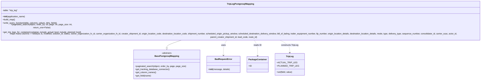

# Diagram: partview_core/partview_service/partview_service/persistence/sql/postgresql/TriplegPostgresqlMapping.py


> Auto-generated by Obscura crawlers

## Diagram 1



### SVG

<svg id="container" width="3987.78125" xmlns="http://www.w3.org/2000/svg" class="classDiagram" height="576" viewBox="0 0 3987.78125 576" role="graphics-document document" aria-roledescription="class"><style>#container{font-family:"trebuchet ms",verdana,arial,sans-serif;font-size:16px;fill:#333;}@keyframes edge-animation-frame{from{stroke-dashoffset:0;}}@keyframes dash{to{stroke-dashoffset:0;}}#container .edge-animation-slow{stroke-dasharray:9,5!important;stroke-dashoffset:900;animation:dash 50s linear infinite;stroke-linecap:round;}#container .edge-animation-fast{stroke-dasharray:9,5!important;stroke-dashoffset:900;animation:dash 20s linear infinite;stroke-linecap:round;}#container .error-icon{fill:#552222;}#container .error-text{fill:#552222;stroke:#552222;}#container .edge-thickness-normal{stroke-width:1px;}#container .edge-thickness-thick{stroke-width:3.5px;}#container .edge-pattern-solid{stroke-dasharray:0;}#container .edge-thickness-invisible{stroke-width:0;fill:none;}#container .edge-pattern-dashed{stroke-dasharray:3;}#container .edge-pattern-dotted{stroke-dasharray:2;}#container .marker{fill:#333333;stroke:#333333;}#container .marker.cross{stroke:#333333;}#container svg{font-family:"trebuchet ms",verdana,arial,sans-serif;font-size:16px;}#container p{margin:0;}#container g.classGroup text{fill:#9370DB;stroke:none;font-family:"trebuchet ms",verdana,arial,sans-serif;font-size:10px;}#container g.classGroup text .title{font-weight:bolder;}#container .nodeLabel,#container .edgeLabel{color:#131300;}#container .edgeLabel .label rect{fill:#ECECFF;}#container .label text{fill:#131300;}#container .labelBkg{background:#ECECFF;}#container .edgeLabel .label span{background:#ECECFF;}#container .classTitle{font-weight:bolder;}#container .node rect,#container .node circle,#container .node ellipse,#container .node polygon,#container .node path{fill:#ECECFF;stroke:#9370DB;stroke-width:1px;}#container .divider{stroke:#9370DB;stroke-width:1;}#container g.clickable{cursor:pointer;}#container g.classGroup rect{fill:#ECECFF;stroke:#9370DB;}#container g.classGroup line{stroke:#9370DB;stroke-width:1;}#container .classLabel .box{stroke:none;stroke-width:0;fill:#ECECFF;opacity:0.5;}#container .classLabel .label{fill:#9370DB;font-size:10px;}#container .relation{stroke:#333333;stroke-width:1;fill:none;}#container .dashed-line{stroke-dasharray:3;}#container .dotted-line{stroke-dasharray:1 2;}#container #compositionStart,#container .composition{fill:#333333!important;stroke:#333333!important;stroke-width:1;}#container #compositionEnd,#container .composition{fill:#333333!important;stroke:#333333!important;stroke-width:1;}#container #dependencyStart,#container .dependency{fill:#333333!important;stroke:#333333!important;stroke-width:1;}#container #dependencyStart,#container .dependency{fill:#333333!important;stroke:#333333!important;stroke-width:1;}#container #extensionStart,#container .extension{fill:transparent!important;stroke:#333333!important;stroke-width:1;}#container #extensionEnd,#container .extension{fill:transparent!important;stroke:#333333!important;stroke-width:1;}#container #aggregationStart,#container .aggregation{fill:transparent!important;stroke:#333333!important;stroke-width:1;}#container #aggregationEnd,#container .aggregation{fill:transparent!important;stroke:#333333!important;stroke-width:1;}#container #lollipopStart,#container .lollipop{fill:#ECECFF!important;stroke:#333333!important;stroke-width:1;}#container #lollipopEnd,#container .lollipop{fill:#ECECFF!important;stroke:#333333!important;stroke-width:1;}#container .edgeTerminals{font-size:11px;line-height:initial;}#container .classTitleText{text-anchor:middle;font-size:18px;fill:#333;}#container .label-icon{display:inline-block;height:1em;overflow:visible;vertical-align:-0.125em;}#container .node .label-icon path{fill:currentColor;stroke:revert;stroke-width:revert;}#container :root{--mermaid-font-family:"trebuchet ms",verdana,arial,sans-serif;}</style><g><defs><marker id="container_class-aggregationStart" class="marker aggregation class" refX="18" refY="7" markerWidth="190" markerHeight="240" orient="auto"><path d="M 18,7 L9,13 L1,7 L9,1 Z"></path></marker></defs><defs><marker id="container_class-aggregationEnd" class="marker aggregation class" refX="1" refY="7" markerWidth="20" markerHeight="28" orient="auto"><path d="M 18,7 L9,13 L1,7 L9,1 Z"></path></marker></defs><defs><marker id="container_class-extensionStart" class="marker extension class" refX="18" refY="7" markerWidth="190" markerHeight="240" orient="auto"><path d="M 1,7 L18,13 V 1 Z"></path></marker></defs><defs><marker id="container_class-extensionEnd" class="marker extension class" refX="1" refY="7" markerWidth="20" markerHeight="28" orient="auto"><path d="M 1,1 V 13 L18,7 Z"></path></marker></defs><defs><marker id="container_class-compositionStart" class="marker composition class" refX="18" refY="7" markerWidth="190" markerHeight="240" orient="auto"><path d="M 18,7 L9,13 L1,7 L9,1 Z"></path></marker></defs><defs><marker id="container_class-compositionEnd" class="marker composition class" refX="1" refY="7" markerWidth="20" markerHeight="28" orient="auto"><path d="M 18,7 L9,13 L1,7 L9,1 Z"></path></marker></defs><defs><marker id="container_class-dependencyStart" class="marker dependency class" refX="6" refY="7" markerWidth="190" markerHeight="240" orient="auto"><path d="M 5,7 L9,13 L1,7 L9,1 Z"></path></marker></defs><defs><marker id="container_class-dependencyEnd" class="marker dependency class" refX="13" refY="7" markerWidth="20" markerHeight="28" orient="auto"><path d="M 18,7 L9,13 L14,7 L9,1 Z"></path></marker></defs><defs><marker id="container_class-lollipopStart" class="marker lollipop class" refX="13" refY="7" markerWidth="190" markerHeight="240" orient="auto"><circle stroke="black" fill="transparent" cx="7" cy="7" r="6"></circle></marker></defs><defs><marker id="container_class-lollipopEnd" class="marker lollipop class" refX="1" refY="7" markerWidth="190" markerHeight="240" orient="auto"><circle stroke="black" fill="transparent" cx="7" cy="7" r="6"></circle></marker></defs><g class="root"><g class="clusters"></g><g class="edgePaths"><path d="M1565.489,272L1545.475,278.167C1525.461,284.333,1485.434,296.667,1465.42,306.125C1445.406,315.583,1445.406,322.167,1445.406,325.458L1445.406,328.75" id="id_TripLegPostgresqlMapping_BasePostgresqlMapping_1" class="edge-thickness-normal edge-pattern-solid relation" style=";;;" data-edge="true" data-et="edge" data-id="id_TripLegPostgresqlMapping_BasePostgresqlMapping_1" data-points="W3sieCI6MTU2NS40ODg2Mjc5NTg1Nzk5LCJ5IjoyNzJ9LHsieCI6MTQ0NS40MDYyNSwieSI6MzA5fSx7IngiOjE0NDUuNDA2MjUsInkiOjM0Nn1d" marker-end="url(#container_class-extensionEnd)"></path><path d="M1895.55,272L1890.955,278.167C1886.361,284.333,1877.173,296.667,1872.579,316C1867.984,335.333,1867.984,361.667,1867.984,374.833L1867.984,388" id="id_TripLegPostgresqlMapping_BadRequestError_2" class="edge-thickness-normal edge-pattern-dashed relation" style=";;;" data-edge="true" data-et="edge" data-id="id_TripLegPostgresqlMapping_BadRequestError_2" data-points="W3sieCI6MTg5NS41NDk2NDg2Njg2MzksInkiOjI3Mn0seyJ4IjoxODY3Ljk4NDM3NSwieSI6MzA5fSx7IngiOjE4NjcuOTg0Mzc1LCJ5IjozOTR9XQ==" marker-end="url(#container_class-dependencyEnd)"></path><path d="M2092.232,272L2096.826,278.167C2101.42,284.333,2110.608,296.667,2115.203,316.5C2119.797,336.333,2119.797,363.667,2119.797,377.333L2119.797,391" id="id_TripLegPostgresqlMapping_PackageContainer_3" class="edge-thickness-normal edge-pattern-dashed relation" style=";;;" data-edge="true" data-et="edge" data-id="id_TripLegPostgresqlMapping_PackageContainer_3" data-points="W3sieCI6MjA5Mi4yMzE2MDEzMzEzNjEsInkiOjI3Mn0seyJ4IjoyMTE5Ljc5Njg3NSwieSI6MzA5fSx7IngiOjIxMTkuNzk2ODc1LCJ5IjozOTd9XQ==" marker-end="url(#container_class-dependencyEnd)"></path><path d="M2269.183,272L2282.043,278.167C2294.904,284.333,2320.626,296.667,2333.487,312.5C2346.348,328.333,2346.348,347.667,2346.348,357.333L2346.348,367" id="id_TripLegPostgresqlMapping_TripLeg_4" class="edge-thickness-normal edge-pattern-dashed relation" style=";;;" data-edge="true" data-et="edge" data-id="id_TripLegPostgresqlMapping_TripLeg_4" data-points="W3sieCI6MjI2OS4xODI1MDczOTY0NDk2LCJ5IjoyNzJ9LHsieCI6MjM0Ni4zNDc2NTYyNSwieSI6MzA5fSx7IngiOjIzNDYuMzQ3NjU2MjUsInkiOjM3M31d" marker-end="url(#container_class-dependencyEnd)"></path></g><g class="edgeLabels"><g class="edgeLabel"><g class="label" data-id="id_TripLegPostgresqlMapping_BasePostgresqlMapping_1" transform="translate(0, 0)"><foreignObject width="0" height="0"><div xmlns="http://www.w3.org/1999/xhtml" class="labelBkg" style="display: table-cell; white-space: nowrap; line-height: 1.5; max-width: 200px; text-align: center;"><span class="edgeLabel"></span></div></foreignObject></g></g><g class="edgeLabel" transform="translate(1867.984375, 309)"><g class="label" data-id="id_TripLegPostgresqlMapping_BadRequestError_2" transform="translate(-16.4921875, -12)"><foreignObject width="32.984375" height="24"><div xmlns="http://www.w3.org/1999/xhtml" class="labelBkg" style="display: table-cell; white-space: nowrap; line-height: 1.5; max-width: 200px; text-align: center;"><span class="edgeLabel"><p>uses</p></span></div></foreignObject></g></g><g class="edgeLabel" transform="translate(2119.796875, 309)"><g class="label" data-id="id_TripLegPostgresqlMapping_PackageContainer_3" transform="translate(-29.6328125, -12)"><foreignObject width="59.265625" height="24"><div xmlns="http://www.w3.org/1999/xhtml" class="labelBkg" style="display: table-cell; white-space: nowrap; line-height: 1.5; max-width: 200px; text-align: center;"><span class="edgeLabel"><p>reads ID</p></span></div></foreignObject></g></g><g class="edgeLabel" transform="translate(2346.34765625, 309)"><g class="label" data-id="id_TripLegPostgresqlMapping_TripLeg_4" transform="translate(-66.2578125, -12)"><foreignObject width="132.515625" height="24"><div xmlns="http://www.w3.org/1999/xhtml" class="labelBkg" style="display: table-cell; white-space: nowrap; line-height: 1.5; max-width: 200px; text-align: center;"><span class="edgeLabel"><p>constructs TripLeg</p></span></div></foreignObject></g></g></g><g class="nodes"><g class="node default" id="classId-BasePostgresqlMapping-0" transform="translate(1445.40625, 457)"><g class="basic label-container"><path d="M-248.21875 -111 L248.21875 -111 L248.21875 111 L-248.21875 111" stroke="none" stroke-width="0" fill="#ECECFF" style=""></path><path d="M-248.21875 -111 C-106.6535449844418 -111, 34.91166003111641 -111, 248.21875 -111 M-248.21875 -111 C-94.0051812045362 -111, 60.2083875909276 -111, 248.21875 -111 M248.21875 -111 C248.21875 -35.26295992663364, 248.21875 40.47408014673272, 248.21875 111 M248.21875 -111 C248.21875 -35.137339730412506, 248.21875 40.72532053917499, 248.21875 111 M248.21875 111 C112.31816316162056 111, -23.58242367675888 111, -248.21875 111 M248.21875 111 C51.9432943285579 111, -144.3321613428842 111, -248.21875 111 M-248.21875 111 C-248.21875 45.481818853030276, -248.21875 -20.036362293939447, -248.21875 -111 M-248.21875 111 C-248.21875 40.53575671172747, -248.21875 -29.928486576545055, -248.21875 -111" stroke="#9370DB" stroke-width="1.3" fill="none" stroke-dasharray="0 0" style=""></path></g><g class="annotation-group text" transform="translate(-38.609375, -87)"><g class="label" style="" transform="translate(0,-12)"><foreignObject width="77.21875" height="24"><div xmlns="http://www.w3.org/1999/xhtml" style="display: table-cell; white-space: nowrap; line-height: 1.5; max-width: 127px; text-align: center;"><span class="nodeLabel markdown-node-label" style=""><p>«abstract»</p></span></div></foreignObject></g></g><g class="label-group text" transform="translate(-87.921875, -63)"><g class="label" style="font-weight: bolder" transform="translate(0,-12)"><foreignObject width="175.84375" height="24"><div xmlns="http://www.w3.org/1999/xhtml" style="display: table-cell; white-space: nowrap; line-height: 1.5; max-width: 223px; text-align: center;"><span class="nodeLabel markdown-node-label" style=""><p>BasePostgresqlMapping</p></span></div></foreignObject></g></g><g class="members-group text" transform="translate(-236.21875, -15)"></g><g class="methods-group text" transform="translate(-236.21875, 15)"><g class="label" style="" transform="translate(0,-12)"><foreignObject width="384.515625" height="24"><div xmlns="http://www.w3.org/1999/xhtml" style="display: table-cell; white-space: nowrap; line-height: 1.5; max-width: 442px; text-align: center;"><span class="nodeLabel markdown-node-label" style=""><p>+paginated_search(object, order_by, page, page_size)</p></span></div></foreignObject></g><g class="label" style="" transform="translate(0,12)"><foreignObject width="262.375" height="24"><div xmlns="http://www.w3.org/1999/xhtml" style="display: table-cell; white-space: nowrap; line-height: 1.5; max-width: 320px; text-align: center;"><span class="nodeLabel markdown-node-label" style=""><p>+get_tracking_database_connector()</p></span></div></foreignObject></g><g class="label" style="" transform="translate(0,36)"><foreignObject width="158.984375" height="24"><div xmlns="http://www.w3.org/1999/xhtml" style="display: table-cell; white-space: nowrap; line-height: 1.5; max-width: 216px; text-align: center;"><span class="nodeLabel markdown-node-label" style=""><p>+get_column_names()</p></span></div></foreignObject></g><g class="label" style="" transform="translate(0,60)"><foreignObject width="121.53125" height="24"><div xmlns="http://www.w3.org/1999/xhtml" style="display: table-cell; white-space: nowrap; line-height: 1.5; max-width: 179px; text-align: center;"><span class="nodeLabel markdown-node-label" style=""><p>+get_field(name)</p></span></div></foreignObject></g></g><g class="divider" style=""><path d="M-248.21875 -39 C-129.54859605386076 -39, -10.878442107721554 -39, 248.21875 -39 M-248.21875 -39 C-100.03373951586511 -39, 48.151270968269785 -39, 248.21875 -39" stroke="#9370DB" stroke-width="1.3" fill="none" stroke-dasharray="0 0" style=""></path></g><g class="divider" style=""><path d="M-248.21875 -15 C-129.41435191210934 -15, -10.609953824218678 -15, 248.21875 -15 M-248.21875 -15 C-101.32780504370419 -15, 45.56313991259162 -15, 248.21875 -15" stroke="#9370DB" stroke-width="1.3" fill="none" stroke-dasharray="0 0" style=""></path></g></g><g class="node default" id="classId-TripLegPostgresqlMapping-1" transform="translate(1993.890625, 140)"><g class="basic label-container"><path d="M-1985.890625 -132 L1985.890625 -132 L1985.890625 132 L-1985.890625 132" stroke="none" stroke-width="0" fill="#ECECFF" style=""></path><path d="M-1985.890625 -132 C-1010.5385892090891 -132, -35.186553418178164 -132, 1985.890625 -132 M-1985.890625 -132 C-1041.229082329629 -132, -96.56753965925759 -132, 1985.890625 -132 M1985.890625 -132 C1985.890625 -36.77592313851724, 1985.890625 58.448153722965515, 1985.890625 132 M1985.890625 -132 C1985.890625 -69.97175401894843, 1985.890625 -7.943508037896862, 1985.890625 132 M1985.890625 132 C699.587901650275 132, -586.7148216994501 132, -1985.890625 132 M1985.890625 132 C881.0223466408775 132, -223.84593171824508 132, -1985.890625 132 M-1985.890625 132 C-1985.890625 70.91377860882048, -1985.890625 9.827557217640972, -1985.890625 -132 M-1985.890625 132 C-1985.890625 49.98460322879991, -1985.890625 -32.030793542400176, -1985.890625 -132" stroke="#9370DB" stroke-width="1.3" fill="none" stroke-dasharray="0 0" style=""></path></g><g class="annotation-group text" transform="translate(0, -108)"></g><g class="label-group text" transform="translate(-97.453125, -108)"><g class="label" style="font-weight: bolder" transform="translate(0,-12)"><foreignObject width="194.90625" height="24"><div xmlns="http://www.w3.org/1999/xhtml" style="display: table-cell; white-space: nowrap; line-height: 1.5; max-width: 241px; text-align: center;"><span class="nodeLabel markdown-node-label" style=""><p>TripLegPostgresqlMapping</p></span></div></foreignObject></g></g><g class="members-group text" transform="translate(-1973.890625, -60)"><g class="label" style="" transform="translate(0,-12)"><foreignObject width="120.046875" height="24"><div xmlns="http://www.w3.org/1999/xhtml" style="display: table-cell; white-space: nowrap; line-height: 1.5; max-width: 177px; text-align: center;"><span class="nodeLabel markdown-node-label" style=""><p>-table: "trip_leg"</p></span></div></foreignObject></g></g><g class="methods-group text" transform="translate(-1973.890625, -12)"><g class="label" style="" transform="translate(0,-12)"><foreignObject width="173.734375" height="24"><div xmlns="http://www.w3.org/1999/xhtml" style="display: table-cell; white-space: nowrap; line-height: 1.5; max-width: 263px; text-align: center;"><span class="nodeLabel markdown-node-label" style=""><p>+<strong>init</strong>(application_name)</p></span></div></foreignObject></g><g class="label" style="" transform="translate(0,12)"><foreignObject width="96.109375" height="24"><div xmlns="http://www.w3.org/1999/xhtml" style="display: table-cell; white-space: nowrap; line-height: 1.5; max-width: 153px; text-align: center;"><span class="nodeLabel markdown-node-label" style=""><p>+build_map()</p></span></div></foreignObject></g><g class="label" style="" transform="translate(0,36)"><foreignObject width="422.109375" height="24"><div xmlns="http://www.w3.org/1999/xhtml" style="display: table-cell; white-space: nowrap; line-height: 1.5; max-width: 479px; text-align: center;"><span class="nodeLabel markdown-node-label" style=""><p>+write_query_function(table, columns, values, dirty_fields)</p></span></div></foreignObject></g><g class="label" style="" transform="translate(0,60)"><foreignObject width="600.125" height="24"><div xmlns="http://www.w3.org/1999/xhtml" style="display: table-cell; white-space: nowrap; line-height: 1.5; max-width: 657px; text-align: center;"><span class="nodeLabel markdown-node-label" style=""><p>+paginated_search(object, order_by: str, page: int, page_size: int, return_one=False)</p></span></div></foreignObject></g><g class="label" style="" transform="translate(0,84)"><foreignObject width="610.140625" height="24"><div xmlns="http://www.w3.org/1999/xhtml" style="display: table-cell; white-space: nowrap; line-height: 1.5; max-width: 668px; text-align: center;"><span class="nodeLabel markdown-node-label" style=""><p>+get_trip_legs_for_container(container, include_actual: bool, include_planned: bool)</p></span></div></foreignObject></g><g class="label" style="" transform="translate(0,108)"><foreignObject width="3850.328125" height="24"><div xmlns="http://www.w3.org/1999/xhtml" style="display: table-cell; white-space: nowrap; line-height: 1.5; max-width: 3922px; text-align: center;"><span class="nodeLabel markdown-node-label" style=""><p>maps many columns -&gt; fields(id, ts, modified, solution_id, status, owner_organization_fv_id, carrier_organization_fv_id, creator_shipment_id, origin_location_code, destination_location_code, shipment_number, scheduled_origin_pickup_window, scheduled_destination_delivery_window, bill_of_lading, trailer_equipment_number, llp_number, origin_location_details, destination_location_details, mode, type, delivery_type, sequence_number, consolidator_id, carrier_scac, actor_id, parent_creator_shipment_id, load_code, route_id)</p></span></div></foreignObject></g></g><g class="divider" style=""><path d="M-1985.890625 -84 C-534.2105665166187 -84, 917.4694919667627 -84, 1985.890625 -84 M-1985.890625 -84 C-766.3668078774128 -84, 453.1570092451743 -84, 1985.890625 -84" stroke="#9370DB" stroke-width="1.3" fill="none" stroke-dasharray="0 0" style=""></path></g><g class="divider" style=""><path d="M-1985.890625 -36 C-505.252693151049 -36, 975.385238697902 -36, 1985.890625 -36 M-1985.890625 -36 C-520.3689821616913 -36, 945.1526606766174 -36, 1985.890625 -36" stroke="#9370DB" stroke-width="1.3" fill="none" stroke-dasharray="0 0" style=""></path></g></g><g class="node default" id="classId-BadRequestError-2" transform="translate(1867.984375, 457)"><g class="basic label-container"><path d="M-124.359375 -63 L124.359375 -63 L124.359375 63 L-124.359375 63" stroke="none" stroke-width="0" fill="#ECECFF" style=""></path><path d="M-124.359375 -63 C-63.96037366880978 -63, -3.5613723376195594 -63, 124.359375 -63 M-124.359375 -63 C-67.20947356999841 -63, -10.059572139996817 -63, 124.359375 -63 M124.359375 -63 C124.359375 -14.935384408674963, 124.359375 33.129231182650074, 124.359375 63 M124.359375 -63 C124.359375 -21.75029776198403, 124.359375 19.49940447603194, 124.359375 63 M124.359375 63 C38.54581692970292 63, -47.267741140594154 63, -124.359375 63 M124.359375 63 C27.17779925609301 63, -70.00377648781398 63, -124.359375 63 M-124.359375 63 C-124.359375 22.496464883469002, -124.359375 -18.007070233061995, -124.359375 -63 M-124.359375 63 C-124.359375 36.33128217929118, -124.359375 9.662564358582351, -124.359375 -63" stroke="#9370DB" stroke-width="1.3" fill="none" stroke-dasharray="0 0" style=""></path></g><g class="annotation-group text" transform="translate(0, -39)"></g><g class="label-group text" transform="translate(-62.28125, -39)"><g class="label" style="font-weight: bolder" transform="translate(0,-12)"><foreignObject width="124.5625" height="24"><div xmlns="http://www.w3.org/1999/xhtml" style="display: table-cell; white-space: nowrap; line-height: 1.5; max-width: 174px; text-align: center;"><span class="nodeLabel markdown-node-label" style=""><p>BadRequestError</p></span></div></foreignObject></g></g><g class="members-group text" transform="translate(-112.359375, 9)"></g><g class="methods-group text" transform="translate(-112.359375, 39)"><g class="label" style="" transform="translate(0,-12)"><foreignObject width="162.4375" height="24"><div xmlns="http://www.w3.org/1999/xhtml" style="display: table-cell; white-space: nowrap; line-height: 1.5; max-width: 251px; text-align: center;"><span class="nodeLabel markdown-node-label" style=""><p>+<strong>init</strong>(message, details)</p></span></div></foreignObject></g></g><g class="divider" style=""><path d="M-124.359375 -15 C-71.18192429961101 -15, -18.00447359922201 -15, 124.359375 -15 M-124.359375 -15 C-34.781739943272015 -15, 54.79589511345597 -15, 124.359375 -15" stroke="#9370DB" stroke-width="1.3" fill="none" stroke-dasharray="0 0" style=""></path></g><g class="divider" style=""><path d="M-124.359375 9 C-36.81212602180118 9, 50.735122956397646 9, 124.359375 9 M-124.359375 9 C-31.76887433685691 9, 60.82162632628618 9, 124.359375 9" stroke="#9370DB" stroke-width="1.3" fill="none" stroke-dasharray="0 0" style=""></path></g></g><g class="node default" id="classId-PackageContainer-3" transform="translate(2119.796875, 457)"><g class="basic label-container"><path d="M-77.453125 -60 L77.453125 -60 L77.453125 60 L-77.453125 60" stroke="none" stroke-width="0" fill="#ECECFF" style=""></path><path d="M-77.453125 -60 C-16.738614471597295 -60, 43.97589605680541 -60, 77.453125 -60 M-77.453125 -60 C-17.800537535697394 -60, 41.85204992860521 -60, 77.453125 -60 M77.453125 -60 C77.453125 -24.628805415360652, 77.453125 10.742389169278695, 77.453125 60 M77.453125 -60 C77.453125 -22.91618890745594, 77.453125 14.16762218508812, 77.453125 60 M77.453125 60 C36.59675158538315 60, -4.259621829233694 60, -77.453125 60 M77.453125 60 C38.02630935743819 60, -1.400506285123626 60, -77.453125 60 M-77.453125 60 C-77.453125 18.170771673051036, -77.453125 -23.65845665389793, -77.453125 -60 M-77.453125 60 C-77.453125 23.083587298990437, -77.453125 -13.832825402019125, -77.453125 -60" stroke="#9370DB" stroke-width="1.3" fill="none" stroke-dasharray="0 0" style=""></path></g><g class="annotation-group text" transform="translate(0, -36)"></g><g class="label-group text" transform="translate(-65.453125, -36)"><g class="label" style="font-weight: bolder" transform="translate(0,-12)"><foreignObject width="130.90625" height="24"><div xmlns="http://www.w3.org/1999/xhtml" style="display: table-cell; white-space: nowrap; line-height: 1.5; max-width: 179px; text-align: center;"><span class="nodeLabel markdown-node-label" style=""><p>PackageContainer</p></span></div></foreignObject></g></g><g class="members-group text" transform="translate(-65.453125, 12)"><g class="label" style="" transform="translate(0,-12)"><foreignObject width="23.015625" height="24"><div xmlns="http://www.w3.org/1999/xhtml" style="display: table-cell; white-space: nowrap; line-height: 1.5; max-width: 80px; text-align: center;"><span class="nodeLabel markdown-node-label" style=""><p>+ID</p></span></div></foreignObject></g></g><g class="methods-group text" transform="translate(-65.453125, 60)"></g><g class="divider" style=""><path d="M-77.453125 -12 C-18.731797660159096 -12, 39.98952967968181 -12, 77.453125 -12 M-77.453125 -12 C-33.634876091695325 -12, 10.18337281660935 -12, 77.453125 -12" stroke="#9370DB" stroke-width="1.3" fill="none" stroke-dasharray="0 0" style=""></path></g><g class="divider" style=""><path d="M-77.453125 36 C-17.15104254523181 36, 43.15103990953638 36, 77.453125 36 M-77.453125 36 C-43.24971687210422 36, -9.046308744208446 36, 77.453125 36" stroke="#9370DB" stroke-width="1.3" fill="none" stroke-dasharray="0 0" style=""></path></g></g><g class="node default" id="classId-TripLeg-4" transform="translate(2346.34765625, 457)"><g class="basic label-container"><path d="M-99.09765625 -84 L99.09765625 -84 L99.09765625 84 L-99.09765625 84" stroke="none" stroke-width="0" fill="#ECECFF" style=""></path><path d="M-99.09765625 -84 C-37.22442513556332 -84, 24.648805978873355 -84, 99.09765625 -84 M-99.09765625 -84 C-56.44827361941341 -84, -13.798890988826827 -84, 99.09765625 -84 M99.09765625 -84 C99.09765625 -46.3883376963584, 99.09765625 -8.776675392716797, 99.09765625 84 M99.09765625 -84 C99.09765625 -43.563127735616995, 99.09765625 -3.126255471233989, 99.09765625 84 M99.09765625 84 C26.92763403670081 84, -45.24238817659838 84, -99.09765625 84 M99.09765625 84 C54.058076626839835 84, 9.01849700367967 84, -99.09765625 84 M-99.09765625 84 C-99.09765625 42.55970175352439, -99.09765625 1.119403507048787, -99.09765625 -84 M-99.09765625 84 C-99.09765625 44.158182443392235, -99.09765625 4.31636488678447, -99.09765625 -84" stroke="#9370DB" stroke-width="1.3" fill="none" stroke-dasharray="0 0" style=""></path></g><g class="annotation-group text" transform="translate(0, -60)"></g><g class="label-group text" transform="translate(-27.0546875, -60)"><g class="label" style="font-weight: bolder" transform="translate(0,-12)"><foreignObject width="54.109375" height="24"><div xmlns="http://www.w3.org/1999/xhtml" style="display: table-cell; white-space: nowrap; line-height: 1.5; max-width: 103px; text-align: center;"><span class="nodeLabel markdown-node-label" style=""><p>TripLeg</p></span></div></foreignObject></g></g><g class="members-group text" transform="translate(-87.09765625, -12)"><g class="label" style="" transform="translate(0,-12)"><foreignObject width="134.125" height="24"><div xmlns="http://www.w3.org/1999/xhtml" style="display: table-cell; white-space: nowrap; line-height: 1.5; max-width: 191px; text-align: center;"><span class="nodeLabel markdown-node-label" style=""><p>+ACTUAL_TRIP_LEG</p></span></div></foreignObject></g><g class="label" style="" transform="translate(0,12)"><foreignObject width="147.140625" height="24"><div xmlns="http://www.w3.org/1999/xhtml" style="display: table-cell; white-space: nowrap; line-height: 1.5; max-width: 205px; text-align: center;"><span class="nodeLabel markdown-node-label" style=""><p>+PLANNED_TRIP_LEG</p></span></div></foreignObject></g></g><g class="methods-group text" transform="translate(-87.09765625, 60)"><g class="label" style="" transform="translate(0,-12)"><foreignObject width="119.390625" height="24"><div xmlns="http://www.w3.org/1999/xhtml" style="display: table-cell; white-space: nowrap; line-height: 1.5; max-width: 177px; text-align: center;"><span class="nodeLabel markdown-node-label" style=""><p>+set(field, value)</p></span></div></foreignObject></g></g><g class="divider" style=""><path d="M-99.09765625 -36 C-56.861454446118444 -36, -14.625252642236887 -36, 99.09765625 -36 M-99.09765625 -36 C-43.58827032251687 -36, 11.92111560496626 -36, 99.09765625 -36" stroke="#9370DB" stroke-width="1.3" fill="none" stroke-dasharray="0 0" style=""></path></g><g class="divider" style=""><path d="M-99.09765625 36 C-55.9116728638868 36, -12.7256894777736 36, 99.09765625 36 M-99.09765625 36 C-54.53851963126783 36, -9.979383012535664 36, 99.09765625 36" stroke="#9370DB" stroke-width="1.3" fill="none" stroke-dasharray="0 0" style=""></path></g></g></g></g></g></svg>

## Diagram 2

```mermaid
flowchart TD
    A[write_query_function(table, columns, values, dirty_fields)] --> B{dirty_fields["type"] == "PLANNED"}
    B -->|true| C[Use unique_planned_trip_leg constraint\nON CONFLICT DO UPDATE set shipment_number = EXCLUDED.shipment_number\nRETURNING *]
    B -->|false| D[Use unique_actual_trip_leg constraint\nON CONFLICT DO UPDATE set creator_shipment_id = EXCLUDED.creator_shipment_id\nRETURNING *]

    E[paginated_search(object, order_by, page, page_size, return_one)] --> F[call super().paginated_search(...)]
    F --> G{page_size == 2 and return_one}
    G -->|true| H{len(search) > 1 ?}
    H -->|yes| I[raise BadRequestError("More than one result returned from search query")]
    H -->|no| J{len(search) == 0 ?}
    J -->|yes| K[raise BadRequestError("No results returned from search query")]
    J -->|no| L[return search[0]]
    G -->|false| M[return super().paginated_search(...)]

    N[get_trip_legs_for_container(container, include_actual, include_planned)] --> O[params = {container_id: container.get(PackageContainer.ID)}]
    O --> P[types = []]
    P --> Q{include_actual}
    Q -->|yes| R[append TripLeg.ACTUAL_TRIP_LEG to types]
    Q -->|no| S[skip]
    R --> T{include_planned}
    S --> T
    T -->|yes| U[append TripLeg.PLANNED_TRIP_LEG to types]
    T -->|no| V[skip]
    U --> W[params["types"] = tuple(types)]
    W --> X[Execute SQL JOIN on package_container_to_trip_leg and trip_leg WHERE trip_leg.type IN %(types)s ORDER BY sequence_number]
    X --> Y[Fetch results -> for each result create TripLeg and set fields -> append to triplegs]
    Y --> Z[return triplegs]
```

> SVG rendering failed for this diagram.
