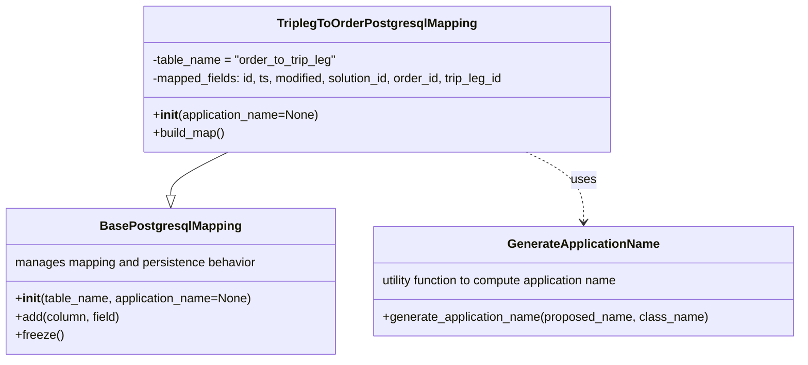

# Diagram: partview_core/partview_service/partview_service/persistence/sql/postgresql/TriplegToOrderPostgresqlMapping.py

> Auto-generated by Obscura crawlers

## Mermaid

### SVG

<svg id="container" width="1048.2890625" xmlns="http://www.w3.org/2000/svg" class="classDiagram" height="474" viewBox="0 0 1048.2890625 474" role="graphics-document document" aria-roledescription="class"><g><defs><marker id="container_class-aggregationStart" class="marker aggregation class" refX="18" refY="7" markerWidth="190" markerHeight="240" orient="auto"><path d="M 18,7 L9,13 L1,7 L9,1 Z"></path></marker></defs><defs><marker id="container_class-aggregationEnd" class="marker aggregation class" refX="1" refY="7" markerWidth="20" markerHeight="28" orient="auto"><path d="M 18,7 L9,13 L1,7 L9,1 Z"></path></marker></defs><defs><marker id="container_class-extensionStart" class="marker extension class" refX="18" refY="7" markerWidth="190" markerHeight="240" orient="auto"><path d="M 1,7 L18,13 V 1 Z"></path></marker></defs><defs><marker id="container_class-extensionEnd" class="marker extension class" refX="1" refY="7" markerWidth="20" markerHeight="28" orient="auto"><path d="M 1,1 V 13 L18,7 Z"></path></marker></defs><defs><marker id="container_class-compositionStart" class="marker composition class" refX="18" refY="7" markerWidth="190" markerHeight="240" orient="auto"><path d="M 18,7 L9,13 L1,7 L9,1 Z"></path></marker></defs><defs><marker id="container_class-compositionEnd" class="marker composition class" refX="1" refY="7" markerWidth="20" markerHeight="28" orient="auto"><path d="M 18,7 L9,13 L1,7 L9,1 Z"></path></marker></defs><defs><marker id="container_class-dependencyStart" class="marker dependency class" refX="6" refY="7" markerWidth="190" markerHeight="240" orient="auto"><path d="M 5,7 L9,13 L1,7 L9,1 Z"></path></marker></defs><defs><marker id="container_class-dependencyEnd" class="marker dependency class" refX="13" refY="7" markerWidth="20" markerHeight="28" orient="auto"><path d="M 18,7 L9,13 L14,7 L9,1 Z"></path></marker></defs><defs><marker id="container_class-lollipopStart" class="marker lollipop class" refX="13" refY="7" markerWidth="190" markerHeight="240" orient="auto"><circle stroke="black" fill="transparent" cx="7" cy="7" r="6"></circle></marker></defs><defs><marker id="container_class-lollipopEnd" class="marker lollipop class" refX="1" refY="7" markerWidth="190" markerHeight="240" orient="auto"><circle stroke="black" fill="transparent" cx="7" cy="7" r="6"></circle></marker></defs><g class="root"><g class="clusters"></g><g class="edgePaths"><path d="M299.288,200L286.742,206.167C274.197,212.333,249.106,224.667,236.561,234.125C224.016,243.583,224.016,250.167,224.016,253.458L224.016,256.75" id="id_TriplegToOrderPostgresqlMapping_BasePostgresqlMapping_1" class="edge-thickness-normal edge-pattern-solid relation" style=";;;" data-edge="true" data-et="edge" data-id="id_TriplegToOrderPostgresqlMapping_BasePostgresqlMapping_1" data-points="W3sieCI6Mjk5LjI4NzYwODY3MDExMjgsInkiOjIwMH0seyJ4IjoyMjQuMDE1NjI1LCJ5IjoyMzd9LHsieCI6MjI0LjAxNTYyNSwieSI6Mjc0fV0=" marker-end="url(#container_class-extensionEnd)"></path><path d="M689.888,200L702.434,206.167C714.979,212.333,740.069,224.667,752.615,240C765.16,255.333,765.16,273.667,765.16,282.833L765.16,292" id="id_TriplegToOrderPostgresqlMapping_GenerateApplicationName_2" class="edge-thickness-normal edge-pattern-dashed relation" style=";;;" data-edge="true" data-et="edge" data-id="id_TriplegToOrderPostgresqlMapping_GenerateApplicationName_2" data-points="W3sieCI6Njg5Ljg4ODE3MjU3OTg4NzIsInkiOjIwMH0seyJ4Ijo3NjUuMTYwMTU2MjUsInkiOjIzN30seyJ4Ijo3NjUuMTYwMTU2MjUsInkiOjI5OH1d" marker-end="url(#container_class-dependencyEnd)"></path></g><g class="edgeLabels"><g class="edgeLabel"><g class="label" data-id="id_TriplegToOrderPostgresqlMapping_BasePostgresqlMapping_1" transform="translate(0, 0)"><foreignObject width="0" height="0">

</foreignObject></g></g><g class="edgeLabel" transform="translate(765.16015625, 237)"><g class="label" data-id="id_TriplegToOrderPostgresqlMapping_GenerateApplicationName_2" transform="translate(-16.4921875, -12)"><foreignObject width="32.984375" height="24">

uses

</foreignObject></g></g></g><g class="nodes"><g class="node default" id="classId-BasePostgresqlMapping-0" transform="translate(224.015625, 370)"><g class="basic label-container"><path d="M-216.015625 -96 L216.015625 -96 L216.015625 96 L-216.015625 96" stroke="none" stroke-width="0" fill="#ECECFF" style=""></path><path d="M-216.015625 -96 C-119.00722649474454 -96, -21.998827989489087 -96, 216.015625 -96 M-216.015625 -96 C-87.51702699904658 -96, 40.98157100190684 -96, 216.015625 -96 M216.015625 -96 C216.015625 -26.784749230157388, 216.015625 42.430501539685224, 216.015625 96 M216.015625 -96 C216.015625 -57.02819970888306, 216.015625 -18.056399417766116, 216.015625 96 M216.015625 96 C86.21099474028131 96, -43.593635519437385 96, -216.015625 96 M216.015625 96 C127.27050132809107 96, 38.525377656182144 96, -216.015625 96 M-216.015625 96 C-216.015625 36.52858554456908, -216.015625 -22.942828910861834, -216.015625 -96 M-216.015625 96 C-216.015625 34.47586460756939, -216.015625 -27.048270784861216, -216.015625 -96" stroke="#9370DB" stroke-width="1.3" fill="none" stroke-dasharray="0 0" style=""></path></g><g class="annotation-group text" transform="translate(0, -72)"></g><g class="label-group text" transform="translate(-87.921875, -72)"><g class="label" style="font-weight: bolder" transform="translate(0,-12)"><foreignObject width="175.84375" height="24">

BasePostgresqlMapping

</foreignObject></g></g><g class="members-group text" transform="translate(-204.015625, -24)"><g class="label" style="" transform="translate(0,-12)"><foreignObject width="320.109375" height="24">

manages mapping and persistence behavior

</foreignObject></g></g><g class="methods-group text" transform="translate(-204.015625, 24)"><g class="label" style="" transform="translate(0,-12)"><foreignObject width="313.75" height="24">

+<strong>init</strong>(table_name, application_name=None)

</foreignObject></g><g class="label" style="" transform="translate(0,12)"><foreignObject width="139.890625" height="24">

+add(column, field)

</foreignObject></g><g class="label" style="" transform="translate(0,36)"><foreignObject width="62.109375" height="24">

+freeze()

</foreignObject></g></g><g class="divider" style=""><path d="M-216.015625 -48 C-77.38386076414002 -48, 61.24790347171995 -48, 216.015625 -48 M-216.015625 -48 C-64.57610891283471 -48, 86.86340717433058 -48, 216.015625 -48" stroke="#9370DB" stroke-width="1.3" fill="none" stroke-dasharray="0 0" style=""></path></g><g class="divider" style=""><path d="M-216.015625 0 C-75.95616068010094 0, 64.10330363979813 0, 216.015625 0 M-216.015625 0 C-48.87365379824405 0, 118.2683174035119 0, 216.015625 0" stroke="#9370DB" stroke-width="1.3" fill="none" stroke-dasharray="0 0" style=""></path></g></g><g class="node default" id="classId-TriplegToOrderPostgresqlMapping-1" transform="translate(494.587890625, 104)"><g class="basic label-container"><path d="M-312.1484375 -96 L312.1484375 -96 L312.1484375 96 L-312.1484375 96" stroke="none" stroke-width="0" fill="#ECECFF" style=""></path><path d="M-312.1484375 -96 C-102.09578843345491 -96, 107.95686063309017 -96, 312.1484375 -96 M-312.1484375 -96 C-87.66597093293097 -96, 136.81649563413805 -96, 312.1484375 -96 M312.1484375 -96 C312.1484375 -31.720732491173237, 312.1484375 32.558535017653526, 312.1484375 96 M312.1484375 -96 C312.1484375 -32.407292925820464, 312.1484375 31.185414148359072, 312.1484375 96 M312.1484375 96 C89.17724423457031 96, -133.79394903085938 96, -312.1484375 96 M312.1484375 96 C86.53649691810614 96, -139.07544366378772 96, -312.1484375 96 M-312.1484375 96 C-312.1484375 53.53545925029448, -312.1484375 11.07091850058896, -312.1484375 -96 M-312.1484375 96 C-312.1484375 39.06053096490985, -312.1484375 -17.878938070180297, -312.1484375 -96" stroke="#9370DB" stroke-width="1.3" fill="none" stroke-dasharray="0 0" style=""></path></g><g class="annotation-group text" transform="translate(0, -72)"></g><g class="label-group text" transform="translate(-125.359375, -72)"><g class="label" style="font-weight: bolder" transform="translate(0,-12)"><foreignObject width="250.71875" height="24">

TriplegToOrderPostgresqlMapping

</foreignObject></g></g><g class="members-group text" transform="translate(-300.1484375, -24)"><g class="label" style="" transform="translate(0,-12)"><foreignObject width="245.421875" height="24">

-table_name = "order_to_trip_leg"

</foreignObject></g><g class="label" style="" transform="translate(0,12)"><foreignObject width="474.9375" height="24">

-mapped_fields: id, ts, modified, solution_id, order_id, trip_leg_id

</foreignObject></g></g><g class="methods-group text" transform="translate(-300.1484375, 48)"><g class="label" style="" transform="translate(0,-12)"><foreignObject width="220.109375" height="24">

+<strong>init</strong>(application_name=None)

</foreignObject></g><g class="label" style="" transform="translate(0,12)"><foreignObject width="96.109375" height="24">

+build_map()

</foreignObject></g></g><g class="divider" style=""><path d="M-312.1484375 -48 C-174.7868241649812 -48, -37.425210829962396 -48, 312.1484375 -48 M-312.1484375 -48 C-77.67892792839083 -48, 156.79058164321833 -48, 312.1484375 -48" stroke="#9370DB" stroke-width="1.3" fill="none" stroke-dasharray="0 0" style=""></path></g><g class="divider" style=""><path d="M-312.1484375 24 C-90.90850429826568 24, 130.33142890346863 24, 312.1484375 24 M-312.1484375 24 C-143.88813037024372 24, 24.37217675951257 24, 312.1484375 24" stroke="#9370DB" stroke-width="1.3" fill="none" stroke-dasharray="0 0" style=""></path></g></g><g class="node default" id="classId-GenerateApplicationName-2" transform="translate(765.16015625, 370)"><g class="basic label-container"><path d="M-275.12890625 -72 L275.12890625 -72 L275.12890625 72 L-275.12890625 72" stroke="none" stroke-width="0" fill="#ECECFF" style=""></path><path d="M-275.12890625 -72 C-145.05164233667278 -72, -14.97437842334557 -72, 275.12890625 -72 M-275.12890625 -72 C-93.42358617370647 -72, 88.28173390258706 -72, 275.12890625 -72 M275.12890625 -72 C275.12890625 -17.612629176340036, 275.12890625 36.77474164731993, 275.12890625 72 M275.12890625 -72 C275.12890625 -29.4100426340504, 275.12890625 13.179914731899203, 275.12890625 72 M275.12890625 72 C164.54957954880427 72, 53.97025284760852 72, -275.12890625 72 M275.12890625 72 C143.37171902902818 72, 11.61453180805637 72, -275.12890625 72 M-275.12890625 72 C-275.12890625 21.101533648870216, -275.12890625 -29.796932702259568, -275.12890625 -72 M-275.12890625 72 C-275.12890625 18.779118590779632, -275.12890625 -34.441762818440736, -275.12890625 -72" stroke="#9370DB" stroke-width="1.3" fill="none" stroke-dasharray="0 0" style=""></path></g><g class="annotation-group text" transform="translate(0, -48)"></g><g class="label-group text" transform="translate(-95.8203125, -48)"><g class="label" style="font-weight: bolder" transform="translate(0,-12)"><foreignObject width="191.640625" height="24">

GenerateApplicationName

</foreignObject></g></g><g class="members-group text" transform="translate(-263.12890625, 0)"><g class="label" style="" transform="translate(0,-12)"><foreignObject width="325.234375" height="24">

utility function to compute application name

</foreignObject></g></g><g class="methods-group text" transform="translate(-263.12890625, 48)"><g class="label" style="" transform="translate(0,-12)"><foreignObject width="430.4375" height="24">

+generate_application_name(proposed_name, class_name)

</foreignObject></g></g><g class="divider" style=""><path d="M-275.12890625 -24 C-87.35914665808195 -24, 100.41061293383609 -24, 275.12890625 -24 M-275.12890625 -24 C-134.99201273892277 -24, 5.144880772154465 -24, 275.12890625 -24" stroke="#9370DB" stroke-width="1.3" fill="none" stroke-dasharray="0 0" style=""></path></g><g class="divider" style=""><path d="M-275.12890625 24 C-150.19310370719847 24, -25.25730116439695 24, 275.12890625 24 M-275.12890625 24 C-162.56718875131608 24, -50.00547125263216 24, 275.12890625 24" stroke="#9370DB" stroke-width="1.3" fill="none" stroke-dasharray="0 0" style=""></path></g></g></g></g></g></svg>
