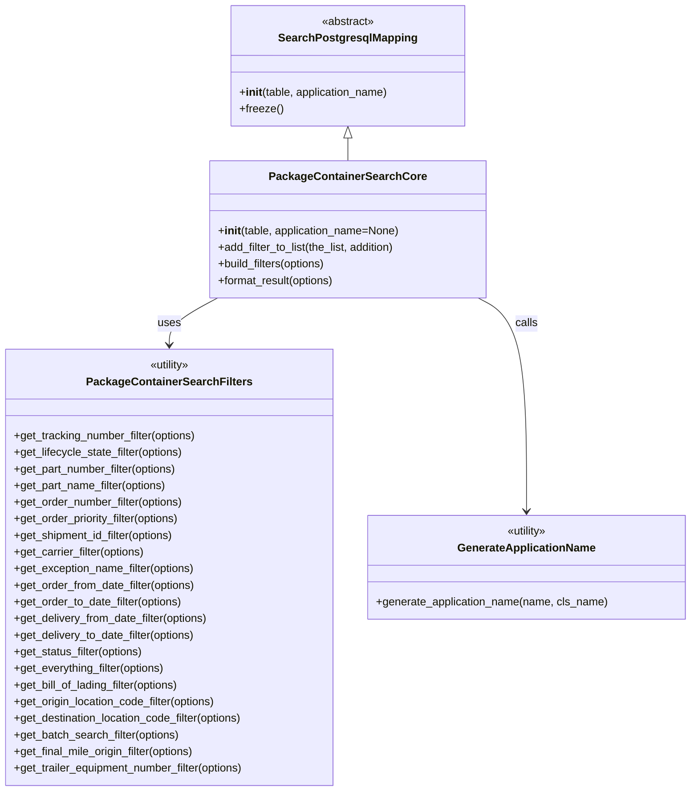

# Diagram: partview_core/partview_service/partview_service/persistence_adapter/postgresql/package_container/PackageContainerSearchCore.py


> Auto-generated by Obscura crawlers

## Diagram 1



### SVG

<svg id="container" width="1000.2421875" xmlns="http://www.w3.org/2000/svg" class="classDiagram" height="1142" viewBox="0 0 1000.2421875 1142" role="graphics-document document" aria-roledescription="class"><style>#container{font-family:"trebuchet ms",verdana,arial,sans-serif;font-size:16px;fill:#333;}@keyframes edge-animation-frame{from{stroke-dashoffset:0;}}@keyframes dash{to{stroke-dashoffset:0;}}#container .edge-animation-slow{stroke-dasharray:9,5!important;stroke-dashoffset:900;animation:dash 50s linear infinite;stroke-linecap:round;}#container .edge-animation-fast{stroke-dasharray:9,5!important;stroke-dashoffset:900;animation:dash 20s linear infinite;stroke-linecap:round;}#container .error-icon{fill:#552222;}#container .error-text{fill:#552222;stroke:#552222;}#container .edge-thickness-normal{stroke-width:1px;}#container .edge-thickness-thick{stroke-width:3.5px;}#container .edge-pattern-solid{stroke-dasharray:0;}#container .edge-thickness-invisible{stroke-width:0;fill:none;}#container .edge-pattern-dashed{stroke-dasharray:3;}#container .edge-pattern-dotted{stroke-dasharray:2;}#container .marker{fill:#333333;stroke:#333333;}#container .marker.cross{stroke:#333333;}#container svg{font-family:"trebuchet ms",verdana,arial,sans-serif;font-size:16px;}#container p{margin:0;}#container g.classGroup text{fill:#9370DB;stroke:none;font-family:"trebuchet ms",verdana,arial,sans-serif;font-size:10px;}#container g.classGroup text .title{font-weight:bolder;}#container .nodeLabel,#container .edgeLabel{color:#131300;}#container .edgeLabel .label rect{fill:#ECECFF;}#container .label text{fill:#131300;}#container .labelBkg{background:#ECECFF;}#container .edgeLabel .label span{background:#ECECFF;}#container .classTitle{font-weight:bolder;}#container .node rect,#container .node circle,#container .node ellipse,#container .node polygon,#container .node path{fill:#ECECFF;stroke:#9370DB;stroke-width:1px;}#container .divider{stroke:#9370DB;stroke-width:1;}#container g.clickable{cursor:pointer;}#container g.classGroup rect{fill:#ECECFF;stroke:#9370DB;}#container g.classGroup line{stroke:#9370DB;stroke-width:1;}#container .classLabel .box{stroke:none;stroke-width:0;fill:#ECECFF;opacity:0.5;}#container .classLabel .label{fill:#9370DB;font-size:10px;}#container .relation{stroke:#333333;stroke-width:1;fill:none;}#container .dashed-line{stroke-dasharray:3;}#container .dotted-line{stroke-dasharray:1 2;}#container #compositionStart,#container .composition{fill:#333333!important;stroke:#333333!important;stroke-width:1;}#container #compositionEnd,#container .composition{fill:#333333!important;stroke:#333333!important;stroke-width:1;}#container #dependencyStart,#container .dependency{fill:#333333!important;stroke:#333333!important;stroke-width:1;}#container #dependencyStart,#container .dependency{fill:#333333!important;stroke:#333333!important;stroke-width:1;}#container #extensionStart,#container .extension{fill:transparent!important;stroke:#333333!important;stroke-width:1;}#container #extensionEnd,#container .extension{fill:transparent!important;stroke:#333333!important;stroke-width:1;}#container #aggregationStart,#container .aggregation{fill:transparent!important;stroke:#333333!important;stroke-width:1;}#container #aggregationEnd,#container .aggregation{fill:transparent!important;stroke:#333333!important;stroke-width:1;}#container #lollipopStart,#container .lollipop{fill:#ECECFF!important;stroke:#333333!important;stroke-width:1;}#container #lollipopEnd,#container .lollipop{fill:#ECECFF!important;stroke:#333333!important;stroke-width:1;}#container .edgeTerminals{font-size:11px;line-height:initial;}#container .classTitleText{text-anchor:middle;font-size:18px;fill:#333;}#container .label-icon{display:inline-block;height:1em;overflow:visible;vertical-align:-0.125em;}#container .node .label-icon path{fill:currentColor;stroke:revert;stroke-width:revert;}#container :root{--mermaid-font-family:"trebuchet ms",verdana,arial,sans-serif;}</style><g><defs><marker id="container_class-aggregationStart" class="marker aggregation class" refX="18" refY="7" markerWidth="190" markerHeight="240" orient="auto"><path d="M 18,7 L9,13 L1,7 L9,1 Z"></path></marker></defs><defs><marker id="container_class-aggregationEnd" class="marker aggregation class" refX="1" refY="7" markerWidth="20" markerHeight="28" orient="auto"><path d="M 18,7 L9,13 L1,7 L9,1 Z"></path></marker></defs><defs><marker id="container_class-extensionStart" class="marker extension class" refX="18" refY="7" markerWidth="190" markerHeight="240" orient="auto"><path d="M 1,7 L18,13 V 1 Z"></path></marker></defs><defs><marker id="container_class-extensionEnd" class="marker extension class" refX="1" refY="7" markerWidth="20" markerHeight="28" orient="auto"><path d="M 1,1 V 13 L18,7 Z"></path></marker></defs><defs><marker id="container_class-compositionStart" class="marker composition class" refX="18" refY="7" markerWidth="190" markerHeight="240" orient="auto"><path d="M 18,7 L9,13 L1,7 L9,1 Z"></path></marker></defs><defs><marker id="container_class-compositionEnd" class="marker composition class" refX="1" refY="7" markerWidth="20" markerHeight="28" orient="auto"><path d="M 18,7 L9,13 L1,7 L9,1 Z"></path></marker></defs><defs><marker id="container_class-dependencyStart" class="marker dependency class" refX="6" refY="7" markerWidth="190" markerHeight="240" orient="auto"><path d="M 5,7 L9,13 L1,7 L9,1 Z"></path></marker></defs><defs><marker id="container_class-dependencyEnd" class="marker dependency class" refX="13" refY="7" markerWidth="20" markerHeight="28" orient="auto"><path d="M 18,7 L9,13 L14,7 L9,1 Z"></path></marker></defs><defs><marker id="container_class-lollipopStart" class="marker lollipop class" refX="13" refY="7" markerWidth="190" markerHeight="240" orient="auto"><circle stroke="black" fill="transparent" cx="7" cy="7" r="6"></circle></marker></defs><defs><marker id="container_class-lollipopEnd" class="marker lollipop class" refX="1" refY="7" markerWidth="190" markerHeight="240" orient="auto"><circle stroke="black" fill="transparent" cx="7" cy="7" r="6"></circle></marker></defs><g class="root"><g class="clusters"></g><g class="edgePaths"><path d="M505.178,199.25L505.178,200.542C505.178,201.833,505.178,204.417,505.178,209.875C505.178,215.333,505.178,223.667,505.178,227.833L505.178,232" id="id_SearchPostgresqlMapping_PackageContainerSearchCore_1" class="edge-thickness-normal edge-pattern-solid relation" style=";;;" data-edge="true" data-et="edge" data-id="id_SearchPostgresqlMapping_PackageContainerSearchCore_1" data-points="W3sieCI6NTA1LjE3NzczNDM3NSwieSI6MTgyfSx7IngiOjUwNS4xNzc3MzQzNzUsInkiOjIwN30seyJ4Ijo1MDUuMTc3NzM0Mzc1LCJ5IjoyMzJ9XQ==" marker-start="url(#container_class-extensionStart)"></path><path d="M316.961,430L305.237,436.167C293.513,442.333,270.065,454.667,258.341,466C246.617,477.333,246.617,487.667,246.617,492.833L246.617,498" id="id_PackageContainerSearchCore_PackageContainerSearchFilters_2" class="edge-thickness-normal edge-pattern-solid relation" style=";;;" data-edge="true" data-et="edge" data-id="id_PackageContainerSearchCore_PackageContainerSearchFilters_2" data-points="W3sieCI6MzE2Ljk2MDg2NTY5MzkzMzgsInkiOjQzMH0seyJ4IjoyNDYuNjE3MTg3NSwieSI6NDY3fSx7IngiOjI0Ni42MTcxODc1LCJ5Ijo1MDR9XQ==" marker-end="url(#container_class-dependencyEnd)"></path><path d="M693.395,430L705.119,436.167C716.842,442.333,740.29,454.667,752.014,506C763.738,557.333,763.738,647.667,763.738,692.833L763.738,738" id="id_PackageContainerSearchCore_GenerateApplicationName_3" class="edge-thickness-normal edge-pattern-solid relation" style=";;;" data-edge="true" data-et="edge" data-id="id_PackageContainerSearchCore_GenerateApplicationName_3" data-points="W3sieCI6NjkzLjM5NDYwMzA1NjA2NjIsInkiOjQzMH0seyJ4Ijo3NjMuNzM4MjgxMjUsInkiOjQ2N30seyJ4Ijo3NjMuNzM4MjgxMjUsInkiOjc0NH1d" marker-end="url(#container_class-dependencyEnd)"></path></g><g class="edgeLabels"><g class="edgeLabel"><g class="label" data-id="id_SearchPostgresqlMapping_PackageContainerSearchCore_1" transform="translate(0, 0)"><foreignObject width="0" height="0"><div xmlns="http://www.w3.org/1999/xhtml" class="labelBkg" style="display: table-cell; white-space: nowrap; line-height: 1.5; max-width: 200px; text-align: center;"><span class="edgeLabel"></span></div></foreignObject></g></g><g class="edgeLabel" transform="translate(246.6171875, 467)"><g class="label" data-id="id_PackageContainerSearchCore_PackageContainerSearchFilters_2" transform="translate(-16.4921875, -12)"><foreignObject width="32.984375" height="24"><div xmlns="http://www.w3.org/1999/xhtml" class="labelBkg" style="display: table-cell; white-space: nowrap; line-height: 1.5; max-width: 200px; text-align: center;"><span class="edgeLabel"><p>uses</p></span></div></foreignObject></g></g><g class="edgeLabel" transform="translate(763.73828125, 467)"><g class="label" data-id="id_PackageContainerSearchCore_GenerateApplicationName_3" transform="translate(-16.4453125, -12)"><foreignObject width="32.890625" height="24"><div xmlns="http://www.w3.org/1999/xhtml" class="labelBkg" style="display: table-cell; white-space: nowrap; line-height: 1.5; max-width: 200px; text-align: center;"><span class="edgeLabel"><p>calls</p></span></div></foreignObject></g></g></g><g class="nodes"><g class="node default" id="classId-SearchPostgresqlMapping-0" transform="translate(505.177734375, 95)"><g class="basic label-container"><path d="M-168.98828125 -87 L168.98828125 -87 L168.98828125 87 L-168.98828125 87" stroke="none" stroke-width="0" fill="#ECECFF" style=""></path><path d="M-168.98828125 -87 C-34.659772148887726 -87, 99.66873695222455 -87, 168.98828125 -87 M-168.98828125 -87 C-78.92503199263345 -87, 11.1382172647331 -87, 168.98828125 -87 M168.98828125 -87 C168.98828125 -32.531635521935215, 168.98828125 21.93672895612957, 168.98828125 87 M168.98828125 -87 C168.98828125 -22.521548538746018, 168.98828125 41.956902922507965, 168.98828125 87 M168.98828125 87 C91.07602645263673 87, 13.16377165527345 87, -168.98828125 87 M168.98828125 87 C38.530385890411964 87, -91.92750946917607 87, -168.98828125 87 M-168.98828125 87 C-168.98828125 49.569072014416626, -168.98828125 12.138144028833253, -168.98828125 -87 M-168.98828125 87 C-168.98828125 30.241084718352973, -168.98828125 -26.517830563294055, -168.98828125 -87" stroke="#9370DB" stroke-width="1.3" fill="none" stroke-dasharray="0 0" style=""></path></g><g class="annotation-group text" transform="translate(-38.609375, -63)"><g class="label" style="" transform="translate(0,-12)"><foreignObject width="77.21875" height="24"><div xmlns="http://www.w3.org/1999/xhtml" style="display: table-cell; white-space: nowrap; line-height: 1.5; max-width: 127px; text-align: center;"><span class="nodeLabel markdown-node-label" style=""><p>«abstract»</p></span></div></foreignObject></g></g><g class="label-group text" transform="translate(-95.1171875, -39)"><g class="label" style="font-weight: bolder" transform="translate(0,-12)"><foreignObject width="190.234375" height="24"><div xmlns="http://www.w3.org/1999/xhtml" style="display: table-cell; white-space: nowrap; line-height: 1.5; max-width: 237px; text-align: center;"><span class="nodeLabel markdown-node-label" style=""><p>SearchPostgresqlMapping</p></span></div></foreignObject></g></g><g class="members-group text" transform="translate(-156.98828125, 9)"></g><g class="methods-group text" transform="translate(-156.98828125, 39)"><g class="label" style="" transform="translate(0,-12)"><foreignObject width="218.859375" height="24"><div xmlns="http://www.w3.org/1999/xhtml" style="display: table-cell; white-space: nowrap; line-height: 1.5; max-width: 308px; text-align: center;"><span class="nodeLabel markdown-node-label" style=""><p>+<strong>init</strong>(table, application_name)</p></span></div></foreignObject></g><g class="label" style="" transform="translate(0,12)"><foreignObject width="62.109375" height="24"><div xmlns="http://www.w3.org/1999/xhtml" style="display: table-cell; white-space: nowrap; line-height: 1.5; max-width: 119px; text-align: center;"><span class="nodeLabel markdown-node-label" style=""><p>+freeze()</p></span></div></foreignObject></g></g><g class="divider" style=""><path d="M-168.98828125 -15 C-34.9685653123324 -15, 99.0511506253352 -15, 168.98828125 -15 M-168.98828125 -15 C-61.59184381821838 -15, 45.80459361356324 -15, 168.98828125 -15" stroke="#9370DB" stroke-width="1.3" fill="none" stroke-dasharray="0 0" style=""></path></g><g class="divider" style=""><path d="M-168.98828125 9 C-97.94420034509784 9, -26.90011944019568 9, 168.98828125 9 M-168.98828125 9 C-44.696388546504465 9, 79.59550415699107 9, 168.98828125 9" stroke="#9370DB" stroke-width="1.3" fill="none" stroke-dasharray="0 0" style=""></path></g></g><g class="node default" id="classId-PackageContainerSearchFilters-1" transform="translate(246.6171875, 819)"><g class="basic label-container"><path d="M-238.6171875 -315 L238.6171875 -315 L238.6171875 315 L-238.6171875 315" stroke="none" stroke-width="0" fill="#ECECFF" style=""></path><path d="M-238.6171875 -315 C-108.57308482945055 -315, 21.4710178410989 -315, 238.6171875 -315 M-238.6171875 -315 C-71.87486483516605 -315, 94.8674578296679 -315, 238.6171875 -315 M238.6171875 -315 C238.6171875 -154.89713281102664, 238.6171875 5.205734377946726, 238.6171875 315 M238.6171875 -315 C238.6171875 -176.47418149528787, 238.6171875 -37.94836299057573, 238.6171875 315 M238.6171875 315 C89.00021989311392 315, -60.616747713772156 315, -238.6171875 315 M238.6171875 315 C50.147346131886735 315, -138.32249523622653 315, -238.6171875 315 M-238.6171875 315 C-238.6171875 128.46385878265065, -238.6171875 -58.07228243469871, -238.6171875 -315 M-238.6171875 315 C-238.6171875 113.97353933990311, -238.6171875 -87.05292132019378, -238.6171875 -315" stroke="#9370DB" stroke-width="1.3" fill="none" stroke-dasharray="0 0" style=""></path></g><g class="annotation-group text" transform="translate(-30.3125, -291)"><g class="label" style="" transform="translate(0,-12)"><foreignObject width="60.625" height="24"><div xmlns="http://www.w3.org/1999/xhtml" style="display: table-cell; white-space: nowrap; line-height: 1.5; max-width: 111px; text-align: center;"><span class="nodeLabel markdown-node-label" style=""><p>«utility»</p></span></div></foreignObject></g></g><g class="label-group text" transform="translate(-112.796875, -267)"><g class="label" style="font-weight: bolder" transform="translate(0,-12)"><foreignObject width="225.59375" height="24"><div xmlns="http://www.w3.org/1999/xhtml" style="display: table-cell; white-space: nowrap; line-height: 1.5; max-width: 271px; text-align: center;"><span class="nodeLabel markdown-node-label" style=""><p>PackageContainerSearchFilters</p></span></div></foreignObject></g></g><g class="members-group text" transform="translate(-226.6171875, -219)"></g><g class="methods-group text" transform="translate(-226.6171875, -189)"><g class="label" style="" transform="translate(0,-12)"><foreignObject width="268.609375" height="24"><div xmlns="http://www.w3.org/1999/xhtml" style="display: table-cell; white-space: nowrap; line-height: 1.5; max-width: 326px; text-align: center;"><span class="nodeLabel markdown-node-label" style=""><p>+get_tracking_number_filter(options)</p></span></div></foreignObject></g><g class="label" style="" transform="translate(0,12)"><foreignObject width="250.0625" height="24"><div xmlns="http://www.w3.org/1999/xhtml" style="display: table-cell; white-space: nowrap; line-height: 1.5; max-width: 307px; text-align: center;"><span class="nodeLabel markdown-node-label" style=""><p>+get_lifecycle_state_filter(options)</p></span></div></foreignObject></g><g class="label" style="" transform="translate(0,36)"><foreignObject width="240.734375" height="24"><div xmlns="http://www.w3.org/1999/xhtml" style="display: table-cell; white-space: nowrap; line-height: 1.5; max-width: 298px; text-align: center;"><span class="nodeLabel markdown-node-label" style=""><p>+get_part_number_filter(options)</p></span></div></foreignObject></g><g class="label" style="" transform="translate(0,60)"><foreignObject width="225.40625" height="24"><div xmlns="http://www.w3.org/1999/xhtml" style="display: table-cell; white-space: nowrap; line-height: 1.5; max-width: 283px; text-align: center;"><span class="nodeLabel markdown-node-label" style=""><p>+get_part_name_filter(options)</p></span></div></foreignObject></g><g class="label" style="" transform="translate(0,84)"><foreignObject width="248.625" height="24"><div xmlns="http://www.w3.org/1999/xhtml" style="display: table-cell; white-space: nowrap; line-height: 1.5; max-width: 306px; text-align: center;"><span class="nodeLabel markdown-node-label" style=""><p>+get_order_number_filter(options)</p></span></div></foreignObject></g><g class="label" style="" transform="translate(0,108)"><foreignObject width="246.421875" height="24"><div xmlns="http://www.w3.org/1999/xhtml" style="display: table-cell; white-space: nowrap; line-height: 1.5; max-width: 304px; text-align: center;"><span class="nodeLabel markdown-node-label" style=""><p>+get_order_priority_filter(options)</p></span></div></foreignObject></g><g class="label" style="" transform="translate(0,132)"><foreignObject width="237.734375" height="24"><div xmlns="http://www.w3.org/1999/xhtml" style="display: table-cell; white-space: nowrap; line-height: 1.5; max-width: 295px; text-align: center;"><span class="nodeLabel markdown-node-label" style=""><p>+get_shipment_id_filter(options)</p></span></div></foreignObject></g><g class="label" style="" transform="translate(0,156)"><foreignObject width="193.234375" height="24"><div xmlns="http://www.w3.org/1999/xhtml" style="display: table-cell; white-space: nowrap; line-height: 1.5; max-width: 251px; text-align: center;"><span class="nodeLabel markdown-node-label" style=""><p>+get_carrier_filter(options)</p></span></div></foreignObject></g><g class="label" style="" transform="translate(0,180)"><foreignObject width="265.828125" height="24"><div xmlns="http://www.w3.org/1999/xhtml" style="display: table-cell; white-space: nowrap; line-height: 1.5; max-width: 323px; text-align: center;"><span class="nodeLabel markdown-node-label" style=""><p>+get_exception_name_filter(options)</p></span></div></foreignObject></g><g class="label" style="" transform="translate(0,204)"><foreignObject width="267.109375" height="24"><div xmlns="http://www.w3.org/1999/xhtml" style="display: table-cell; white-space: nowrap; line-height: 1.5; max-width: 324px; text-align: center;"><span class="nodeLabel markdown-node-label" style=""><p>+get_order_from_date_filter(options)</p></span></div></foreignObject></g><g class="label" style="" transform="translate(0,228)"><foreignObject width="247.5625" height="24"><div xmlns="http://www.w3.org/1999/xhtml" style="display: table-cell; white-space: nowrap; line-height: 1.5; max-width: 305px; text-align: center;"><span class="nodeLabel markdown-node-label" style=""><p>+get_order_to_date_filter(options)</p></span></div></foreignObject></g><g class="label" style="" transform="translate(0,252)"><foreignObject width="286.46875" height="24"><div xmlns="http://www.w3.org/1999/xhtml" style="display: table-cell; white-space: nowrap; line-height: 1.5; max-width: 344px; text-align: center;"><span class="nodeLabel markdown-node-label" style=""><p>+get_delivery_from_date_filter(options)</p></span></div></foreignObject></g><g class="label" style="" transform="translate(0,276)"><foreignObject width="266.921875" height="24"><div xmlns="http://www.w3.org/1999/xhtml" style="display: table-cell; white-space: nowrap; line-height: 1.5; max-width: 324px; text-align: center;"><span class="nodeLabel markdown-node-label" style=""><p>+get_delivery_to_date_filter(options)</p></span></div></foreignObject></g><g class="label" style="" transform="translate(0,300)"><foreignObject width="190.96875" height="24"><div xmlns="http://www.w3.org/1999/xhtml" style="display: table-cell; white-space: nowrap; line-height: 1.5; max-width: 248px; text-align: center;"><span class="nodeLabel markdown-node-label" style=""><p>+get_status_filter(options)</p></span></div></foreignObject></g><g class="label" style="" transform="translate(0,324)"><foreignObject width="223.21875" height="24"><div xmlns="http://www.w3.org/1999/xhtml" style="display: table-cell; white-space: nowrap; line-height: 1.5; max-width: 281px; text-align: center;"><span class="nodeLabel markdown-node-label" style=""><p>+get_everything_filter(options)</p></span></div></foreignObject></g><g class="label" style="" transform="translate(0,348)"><foreignObject width="245.8125" height="24"><div xmlns="http://www.w3.org/1999/xhtml" style="display: table-cell; white-space: nowrap; line-height: 1.5; max-width: 303px; text-align: center;"><span class="nodeLabel markdown-node-label" style=""><p>+get_bill_of_lading_filter(options)</p></span></div></foreignObject></g><g class="label" style="" transform="translate(0,372)"><foreignObject width="298.765625" height="24"><div xmlns="http://www.w3.org/1999/xhtml" style="display: table-cell; white-space: nowrap; line-height: 1.5; max-width: 356px; text-align: center;"><span class="nodeLabel markdown-node-label" style=""><p>+get_origin_location_code_filter(options)</p></span></div></foreignObject></g><g class="label" style="" transform="translate(0,396)"><foreignObject width="339.65625" height="24"><div xmlns="http://www.w3.org/1999/xhtml" style="display: table-cell; white-space: nowrap; line-height: 1.5; max-width: 397px; text-align: center;"><span class="nodeLabel markdown-node-label" style=""><p>+get_destination_location_code_filter(options)</p></span></div></foreignObject></g><g class="label" style="" transform="translate(0,420)"><foreignObject width="243.265625" height="24"><div xmlns="http://www.w3.org/1999/xhtml" style="display: table-cell; white-space: nowrap; line-height: 1.5; max-width: 301px; text-align: center;"><span class="nodeLabel markdown-node-label" style=""><p>+get_batch_search_filter(options)</p></span></div></foreignObject></g><g class="label" style="" transform="translate(0,444)"><foreignObject width="268.171875" height="24"><div xmlns="http://www.w3.org/1999/xhtml" style="display: table-cell; white-space: nowrap; line-height: 1.5; max-width: 326px; text-align: center;"><span class="nodeLabel markdown-node-label" style=""><p>+get_final_mile_origin_filter(options)</p></span></div></foreignObject></g><g class="label" style="" transform="translate(0,468)"><foreignObject width="340.4375" height="24"><div xmlns="http://www.w3.org/1999/xhtml" style="display: table-cell; white-space: nowrap; line-height: 1.5; max-width: 398px; text-align: center;"><span class="nodeLabel markdown-node-label" style=""><p>+get_trailer_equipment_number_filter(options)</p></span></div></foreignObject></g></g><g class="divider" style=""><path d="M-238.6171875 -243 C-49.40589839835599 -243, 139.80539070328803 -243, 238.6171875 -243 M-238.6171875 -243 C-84.4979954713574 -243, 69.6211965572852 -243, 238.6171875 -243" stroke="#9370DB" stroke-width="1.3" fill="none" stroke-dasharray="0 0" style=""></path></g><g class="divider" style=""><path d="M-238.6171875 -219 C-54.80719133403716 -219, 129.0028048319257 -219, 238.6171875 -219 M-238.6171875 -219 C-64.00690643712224 -219, 110.60337462575552 -219, 238.6171875 -219" stroke="#9370DB" stroke-width="1.3" fill="none" stroke-dasharray="0 0" style=""></path></g></g><g class="node default" id="classId-GenerateApplicationName-2" transform="translate(763.73828125, 819)"><g class="basic label-container"><path d="M-228.50390625 -75 L228.50390625 -75 L228.50390625 75 L-228.50390625 75" stroke="none" stroke-width="0" fill="#ECECFF" style=""></path><path d="M-228.50390625 -75 C-110.8677396462409 -75, 6.768426957518187 -75, 228.50390625 -75 M-228.50390625 -75 C-98.14364047912187 -75, 32.21662529175626 -75, 228.50390625 -75 M228.50390625 -75 C228.50390625 -34.38351496754601, 228.50390625 6.232970064907974, 228.50390625 75 M228.50390625 -75 C228.50390625 -32.859117359218324, 228.50390625 9.281765281563352, 228.50390625 75 M228.50390625 75 C79.62441594086849 75, -69.25507436826302 75, -228.50390625 75 M228.50390625 75 C120.26036165611157 75, 12.01681706222314 75, -228.50390625 75 M-228.50390625 75 C-228.50390625 30.724962100766426, -228.50390625 -13.550075798467148, -228.50390625 -75 M-228.50390625 75 C-228.50390625 22.45469542548547, -228.50390625 -30.090609149029063, -228.50390625 -75" stroke="#9370DB" stroke-width="1.3" fill="none" stroke-dasharray="0 0" style=""></path></g><g class="annotation-group text" transform="translate(-30.3125, -51)"><g class="label" style="" transform="translate(0,-12)"><foreignObject width="60.625" height="24"><div xmlns="http://www.w3.org/1999/xhtml" style="display: table-cell; white-space: nowrap; line-height: 1.5; max-width: 111px; text-align: center;"><span class="nodeLabel markdown-node-label" style=""><p>«utility»</p></span></div></foreignObject></g></g><g class="label-group text" transform="translate(-95.8203125, -27)"><g class="label" style="font-weight: bolder" transform="translate(0,-12)"><foreignObject width="191.640625" height="24"><div xmlns="http://www.w3.org/1999/xhtml" style="display: table-cell; white-space: nowrap; line-height: 1.5; max-width: 240px; text-align: center;"><span class="nodeLabel markdown-node-label" style=""><p>GenerateApplicationName</p></span></div></foreignObject></g></g><g class="members-group text" transform="translate(-216.50390625, 21)"></g><g class="methods-group text" transform="translate(-216.50390625, 51)"><g class="label" style="" transform="translate(0,-12)"><foreignObject width="337.1875" height="24"><div xmlns="http://www.w3.org/1999/xhtml" style="display: table-cell; white-space: nowrap; line-height: 1.5; max-width: 395px; text-align: center;"><span class="nodeLabel markdown-node-label" style=""><p>+generate_application_name(name, cls_name)</p></span></div></foreignObject></g></g><g class="divider" style=""><path d="M-228.50390625 -3 C-116.95761809286181 -3, -5.411329935723614 -3, 228.50390625 -3 M-228.50390625 -3 C-47.00072156208208 -3, 134.50246312583585 -3, 228.50390625 -3" stroke="#9370DB" stroke-width="1.3" fill="none" stroke-dasharray="0 0" style=""></path></g><g class="divider" style=""><path d="M-228.50390625 21 C-116.53772731348722 21, -4.571548376974448 21, 228.50390625 21 M-228.50390625 21 C-132.33211603978023 21, -36.16032582956046 21, 228.50390625 21" stroke="#9370DB" stroke-width="1.3" fill="none" stroke-dasharray="0 0" style=""></path></g></g><g class="node default" id="classId-PackageContainerSearchCore-3" transform="translate(505.177734375, 331)"><g class="basic label-container"><path d="M-197.9453125 -99 L197.9453125 -99 L197.9453125 99 L-197.9453125 99" stroke="none" stroke-width="0" fill="#ECECFF" style=""></path><path d="M-197.9453125 -99 C-107.72098462818055 -99, -17.49665675636109 -99, 197.9453125 -99 M-197.9453125 -99 C-69.22633750654092 -99, 59.49263748691817 -99, 197.9453125 -99 M197.9453125 -99 C197.9453125 -32.861149282370704, 197.9453125 33.27770143525859, 197.9453125 99 M197.9453125 -99 C197.9453125 -28.136308206951668, 197.9453125 42.727383586096664, 197.9453125 99 M197.9453125 99 C91.10774173993525 99, -15.7298290201295 99, -197.9453125 99 M197.9453125 99 C103.81255566353607 99, 9.679798827072148 99, -197.9453125 99 M-197.9453125 99 C-197.9453125 52.63625239598061, -197.9453125 6.272504791961225, -197.9453125 -99 M-197.9453125 99 C-197.9453125 35.9543070420066, -197.9453125 -27.091385915986805, -197.9453125 -99" stroke="#9370DB" stroke-width="1.3" fill="none" stroke-dasharray="0 0" style=""></path></g><g class="annotation-group text" transform="translate(0, -75)"></g><g class="label-group text" transform="translate(-106.65625, -75)"><g class="label" style="font-weight: bolder" transform="translate(0,-12)"><foreignObject width="213.3125" height="24"><div xmlns="http://www.w3.org/1999/xhtml" style="display: table-cell; white-space: nowrap; line-height: 1.5; max-width: 260px; text-align: center;"><span class="nodeLabel markdown-node-label" style=""><p>PackageContainerSearchCore</p></span></div></foreignObject></g></g><g class="members-group text" transform="translate(-185.9453125, -27)"></g><g class="methods-group text" transform="translate(-185.9453125, 3)"><g class="label" style="" transform="translate(0,-12)"><foreignObject width="265.234375" height="24"><div xmlns="http://www.w3.org/1999/xhtml" style="display: table-cell; white-space: nowrap; line-height: 1.5; max-width: 354px; text-align: center;"><span class="nodeLabel markdown-node-label" style=""><p>+<strong>init</strong>(table, application_name=None)</p></span></div></foreignObject></g><g class="label" style="" transform="translate(0,12)"><foreignObject width="263.828125" height="24"><div xmlns="http://www.w3.org/1999/xhtml" style="display: table-cell; white-space: nowrap; line-height: 1.5; max-width: 321px; text-align: center;"><span class="nodeLabel markdown-node-label" style=""><p>+add_filter_to_list(the_list, addition)</p></span></div></foreignObject></g><g class="label" style="" transform="translate(0,36)"><foreignObject width="160.75" height="24"><div xmlns="http://www.w3.org/1999/xhtml" style="display: table-cell; white-space: nowrap; line-height: 1.5; max-width: 218px; text-align: center;"><span class="nodeLabel markdown-node-label" style=""><p>+build_filters(options)</p></span></div></foreignObject></g><g class="label" style="" transform="translate(0,60)"><foreignObject width="172.34375" height="24"><div xmlns="http://www.w3.org/1999/xhtml" style="display: table-cell; white-space: nowrap; line-height: 1.5; max-width: 230px; text-align: center;"><span class="nodeLabel markdown-node-label" style=""><p>+format_result(options)</p></span></div></foreignObject></g></g><g class="divider" style=""><path d="M-197.9453125 -51 C-77.41085335212156 -51, 43.12360579575687 -51, 197.9453125 -51 M-197.9453125 -51 C-72.93109151335669 -51, 52.08312947328662 -51, 197.9453125 -51" stroke="#9370DB" stroke-width="1.3" fill="none" stroke-dasharray="0 0" style=""></path></g><g class="divider" style=""><path d="M-197.9453125 -27 C-88.45689477685251 -27, 21.031522946294984 -27, 197.9453125 -27 M-197.9453125 -27 C-58.41883796591276 -27, 81.10763656817448 -27, 197.9453125 -27" stroke="#9370DB" stroke-width="1.3" fill="none" stroke-dasharray="0 0" style=""></path></g></g></g></g></g></svg>

## Diagram 2

```mermaid
flowchart LR
    Start([start])
    InitFilters["filter_list = []\nquery = \"\""]
    AddFilters["call get_*_filter(options)\nadd_filter_to_list(filter_list, result) x many"]
    CheckFilters{"filter_list\nnot empty?"}
    BuildQuery["query = \" AND \" + \" AND \".join(filter_list)"]
    ReturnQuery["return query"]
    Start --> InitFilters --> AddFilters --> CheckFilters
    CheckFilters -- yes --> BuildQuery --> ReturnQuery
    CheckFilters -- no --> ReturnQuery
```

> SVG rendering failed for this diagram.
