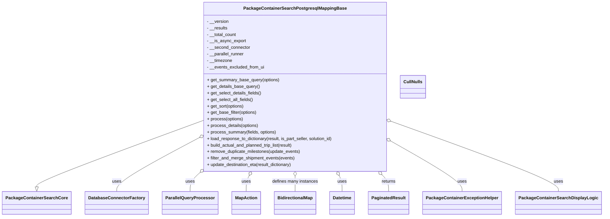

# Diagram: partview_core/partview_service/partview_service/persistence_adapter/postgresql/package_container/PackageContainerSearchPostgresqlMappingBase.py


> Auto-generated by Obscura crawlers

## Diagram 1



### SVG

<svg id="container" width="2123.59375" xmlns="http://www.w3.org/2000/svg" class="classDiagram" height="798" viewBox="0 0 2123.59375 798" role="graphics-document document" aria-roledescription="class"><style>#container{font-family:"trebuchet ms",verdana,arial,sans-serif;font-size:16px;fill:#333;}@keyframes edge-animation-frame{from{stroke-dashoffset:0;}}@keyframes dash{to{stroke-dashoffset:0;}}#container .edge-animation-slow{stroke-dasharray:9,5!important;stroke-dashoffset:900;animation:dash 50s linear infinite;stroke-linecap:round;}#container .edge-animation-fast{stroke-dasharray:9,5!important;stroke-dashoffset:900;animation:dash 20s linear infinite;stroke-linecap:round;}#container .error-icon{fill:#552222;}#container .error-text{fill:#552222;stroke:#552222;}#container .edge-thickness-normal{stroke-width:1px;}#container .edge-thickness-thick{stroke-width:3.5px;}#container .edge-pattern-solid{stroke-dasharray:0;}#container .edge-thickness-invisible{stroke-width:0;fill:none;}#container .edge-pattern-dashed{stroke-dasharray:3;}#container .edge-pattern-dotted{stroke-dasharray:2;}#container .marker{fill:#333333;stroke:#333333;}#container .marker.cross{stroke:#333333;}#container svg{font-family:"trebuchet ms",verdana,arial,sans-serif;font-size:16px;}#container p{margin:0;}#container g.classGroup text{fill:#9370DB;stroke:none;font-family:"trebuchet ms",verdana,arial,sans-serif;font-size:10px;}#container g.classGroup text .title{font-weight:bolder;}#container .nodeLabel,#container .edgeLabel{color:#131300;}#container .edgeLabel .label rect{fill:#ECECFF;}#container .label text{fill:#131300;}#container .labelBkg{background:#ECECFF;}#container .edgeLabel .label span{background:#ECECFF;}#container .classTitle{font-weight:bolder;}#container .node rect,#container .node circle,#container .node ellipse,#container .node polygon,#container .node path{fill:#ECECFF;stroke:#9370DB;stroke-width:1px;}#container .divider{stroke:#9370DB;stroke-width:1;}#container g.clickable{cursor:pointer;}#container g.classGroup rect{fill:#ECECFF;stroke:#9370DB;}#container g.classGroup line{stroke:#9370DB;stroke-width:1;}#container .classLabel .box{stroke:none;stroke-width:0;fill:#ECECFF;opacity:0.5;}#container .classLabel .label{fill:#9370DB;font-size:10px;}#container .relation{stroke:#333333;stroke-width:1;fill:none;}#container .dashed-line{stroke-dasharray:3;}#container .dotted-line{stroke-dasharray:1 2;}#container #compositionStart,#container .composition{fill:#333333!important;stroke:#333333!important;stroke-width:1;}#container #compositionEnd,#container .composition{fill:#333333!important;stroke:#333333!important;stroke-width:1;}#container #dependencyStart,#container .dependency{fill:#333333!important;stroke:#333333!important;stroke-width:1;}#container #dependencyStart,#container .dependency{fill:#333333!important;stroke:#333333!important;stroke-width:1;}#container #extensionStart,#container .extension{fill:transparent!important;stroke:#333333!important;stroke-width:1;}#container #extensionEnd,#container .extension{fill:transparent!important;stroke:#333333!important;stroke-width:1;}#container #aggregationStart,#container .aggregation{fill:transparent!important;stroke:#333333!important;stroke-width:1;}#container #aggregationEnd,#container .aggregation{fill:transparent!important;stroke:#333333!important;stroke-width:1;}#container #lollipopStart,#container .lollipop{fill:#ECECFF!important;stroke:#333333!important;stroke-width:1;}#container #lollipopEnd,#container .lollipop{fill:#ECECFF!important;stroke:#333333!important;stroke-width:1;}#container .edgeTerminals{font-size:11px;line-height:initial;}#container .classTitleText{text-anchor:middle;font-size:18px;fill:#333;}#container .label-icon{display:inline-block;height:1em;overflow:visible;vertical-align:-0.125em;}#container .node .label-icon path{fill:currentColor;stroke:revert;stroke-width:revert;}#container :root{--mermaid-font-family:"trebuchet ms",verdana,arial,sans-serif;}</style><g><defs><marker id="container_class-aggregationStart" class="marker aggregation class" refX="18" refY="7" markerWidth="190" markerHeight="240" orient="auto"><path d="M 18,7 L9,13 L1,7 L9,1 Z"></path></marker></defs><defs><marker id="container_class-aggregationEnd" class="marker aggregation class" refX="1" refY="7" markerWidth="20" markerHeight="28" orient="auto"><path d="M 18,7 L9,13 L1,7 L9,1 Z"></path></marker></defs><defs><marker id="container_class-extensionStart" class="marker extension class" refX="18" refY="7" markerWidth="190" markerHeight="240" orient="auto"><path d="M 1,7 L18,13 V 1 Z"></path></marker></defs><defs><marker id="container_class-extensionEnd" class="marker extension class" refX="1" refY="7" markerWidth="20" markerHeight="28" orient="auto"><path d="M 1,1 V 13 L18,7 Z"></path></marker></defs><defs><marker id="container_class-compositionStart" class="marker composition class" refX="18" refY="7" markerWidth="190" markerHeight="240" orient="auto"><path d="M 18,7 L9,13 L1,7 L9,1 Z"></path></marker></defs><defs><marker id="container_class-compositionEnd" class="marker composition class" refX="1" refY="7" markerWidth="20" markerHeight="28" orient="auto"><path d="M 18,7 L9,13 L1,7 L9,1 Z"></path></marker></defs><defs><marker id="container_class-dependencyStart" class="marker dependency class" refX="6" refY="7" markerWidth="190" markerHeight="240" orient="auto"><path d="M 5,7 L9,13 L1,7 L9,1 Z"></path></marker></defs><defs><marker id="container_class-dependencyEnd" class="marker dependency class" refX="13" refY="7" markerWidth="20" markerHeight="28" orient="auto"><path d="M 18,7 L9,13 L14,7 L9,1 Z"></path></marker></defs><defs><marker id="container_class-lollipopStart" class="marker lollipop class" refX="13" refY="7" markerWidth="190" markerHeight="240" orient="auto"><circle stroke="black" fill="transparent" cx="7" cy="7" r="6"></circle></marker></defs><defs><marker id="container_class-lollipopEnd" class="marker lollipop class" refX="1" refY="7" markerWidth="190" markerHeight="240" orient="auto"><circle stroke="black" fill="transparent" cx="7" cy="7" r="6"></circle></marker></defs><g class="root"><g class="clusters"></g><g class="edgePaths"><path d="M699.449,449.107L603.984,485.756C508.518,522.405,317.587,595.702,222.122,635.643C126.656,675.583,126.656,682.167,126.656,685.458L126.656,688.75" id="id_PackageContainerSearchPostgresqlMappingBase_PackageContainerSearchCore_1" class="edge-thickness-normal edge-pattern-solid relation" style=";;;" data-edge="true" data-et="edge" data-id="id_PackageContainerSearchPostgresqlMappingBase_PackageContainerSearchCore_1" data-points="W3sieCI6Njk5LjQ0OTIxODc1LCJ5Ijo0NDkuMTA3MzU2MTYzNzk1fSx7IngiOjEyNi42NTYyNSwieSI6NjY5fSx7IngiOjEyNi42NTYyNSwieSI6NzA2fV0=" marker-end="url(#container_class-extensionEnd)"></path><path d="M684.358,514.584L637.882,540.32C591.406,566.056,498.453,617.528,451.976,649.431C405.5,681.333,405.5,693.667,405.5,699.833L405.5,706" id="id_PackageContainerSearchPostgresqlMappingBase_DatabaseConnectorFactory_2" class="edge-thickness-normal edge-pattern-solid relation" style=";;;" data-edge="true" data-et="edge" data-id="id_PackageContainerSearchPostgresqlMappingBase_DatabaseConnectorFactory_2" data-points="W3sieCI6Njk5LjQ0OTIxODc1LCJ5Ijo1MDYuMjI4MDc1MDY4NDg2MzZ9LHsieCI6NDA1LjUsInkiOjY2OX0seyJ4Ijo0MDUuNSwieSI6NzA2fV0=" marker-start="url(#container_class-aggregationStart)"></path><path d="M689.905,643.789L685.417,647.991C680.929,652.193,671.953,660.596,667.465,670.965C662.977,681.333,662.977,693.667,662.977,699.833L662.977,706" id="id_PackageContainerSearchPostgresqlMappingBase_ParallelQueryProcessor_3" class="edge-thickness-normal edge-pattern-solid relation" style=";;;" data-edge="true" data-et="edge" data-id="id_PackageContainerSearchPostgresqlMappingBase_ParallelQueryProcessor_3" data-points="W3sieCI6NzAyLjQ5Nzc4Mzg0NjcwNDgsInkiOjYzMn0seyJ4Ijo2NjIuOTc2NTYyNSwieSI6NjY5fSx7IngiOjY2Mi45NzY1NjI1LCJ5Ijo3MDZ9XQ==" marker-start="url(#container_class-aggregationStart)"></path><path d="M871.709,647.423L869.908,651.019C868.106,654.615,864.502,661.808,862.7,671.57C860.898,681.333,860.898,693.667,860.898,699.833L860.898,706" id="id_PackageContainerSearchPostgresqlMappingBase_MapAction_4" class="edge-thickness-normal edge-pattern-solid relation" style=";;;" data-edge="true" data-et="edge" data-id="id_PackageContainerSearchPostgresqlMappingBase_MapAction_4" data-points="W3sieCI6ODc5LjQzNjUzNzQyODM2NjgsInkiOjYzMn0seyJ4Ijo4NjAuODk4NDM3NSwieSI6NjY5fSx7IngiOjg2MC44OTg0Mzc1LCJ5Ijo3MDZ9XQ==" marker-start="url(#container_class-aggregationStart)"></path><path d="M1035.758,649.25L1035.758,652.542C1035.758,655.833,1035.758,662.417,1035.758,671.875C1035.758,681.333,1035.758,693.667,1035.758,699.833L1035.758,706" id="id_PackageContainerSearchPostgresqlMappingBase_BidirectionalMap_5" class="edge-thickness-normal edge-pattern-solid relation" style=";;;" data-edge="true" data-et="edge" data-id="id_PackageContainerSearchPostgresqlMappingBase_BidirectionalMap_5" data-points="W3sieCI6MTAzNS43NTc4MTI1LCJ5Ijo2MzJ9LHsieCI6MTAzNS43NTc4MTI1LCJ5Ijo2Njl9LHsieCI6MTAzNS43NTc4MTI1LCJ5Ijo3MDZ9XQ==" marker-start="url(#container_class-aggregationStart)"></path><path d="M1194.94,647.515L1196.681,651.095C1198.421,654.676,1201.902,661.838,1203.642,671.586C1205.383,681.333,1205.383,693.667,1205.383,699.833L1205.383,706" id="id_PackageContainerSearchPostgresqlMappingBase_Datetime_6" class="edge-thickness-normal edge-pattern-solid relation" style=";;;" data-edge="true" data-et="edge" data-id="id_PackageContainerSearchPostgresqlMappingBase_Datetime_6" data-points="W3sieCI6MTE4Ny4zOTk2NDYzMTA4ODgzLCJ5Ijo2MzJ9LHsieCI6MTIwNS4zODI4MTI1LCJ5Ijo2Njl9LHsieCI6MTIwNS4zODI4MTI1LCJ5Ijo3MDZ9XQ==" marker-start="url(#container_class-aggregationStart)"></path><path d="M1348.713,644.415L1352.666,648.512C1356.619,652.61,1364.524,660.805,1368.477,671.069C1372.43,681.333,1372.43,693.667,1372.43,699.833L1372.43,706" id="id_PackageContainerSearchPostgresqlMappingBase_PaginatedResult_7" class="edge-thickness-normal edge-pattern-solid relation" style=";;;" data-edge="true" data-et="edge" data-id="id_PackageContainerSearchPostgresqlMappingBase_PaginatedResult_7" data-points="W3sieCI6MTMzNi43MzY2ODA2OTQ4NDIzLCJ5Ijo2MzJ9LHsieCI6MTM3Mi40Mjk2ODc1LCJ5Ijo2Njl9LHsieCI6MTM3Mi40Mjk2ODc1LCJ5Ijo3MDZ9XQ==" marker-start="url(#container_class-aggregationStart)"></path><path d="M1386.952,525.652L1427.752,549.543C1468.551,573.434,1550.151,621.217,1590.95,651.275C1631.75,681.333,1631.75,693.667,1631.75,699.833L1631.75,706" id="id_PackageContainerSearchPostgresqlMappingBase_PackageContainerExceptionHelper_8" class="edge-thickness-normal edge-pattern-solid relation" style=";;;" data-edge="true" data-et="edge" data-id="id_PackageContainerSearchPostgresqlMappingBase_PackageContainerExceptionHelper_8" data-points="W3sieCI6MTM3Mi4wNjY0MDYyNSwieSI6NTE2LjkzNDk2MjcwNjYyMX0seyJ4IjoxNjMxLjc1LCJ5Ijo2Njl9LHsieCI6MTYzMS43NSwieSI6NzA2fV0=" marker-start="url(#container_class-aggregationStart)"></path><path d="M1388.22,452.02L1484.768,488.183C1581.316,524.347,1774.412,596.673,1870.96,639.003C1967.508,681.333,1967.508,693.667,1967.508,699.833L1967.508,706" id="id_PackageContainerSearchPostgresqlMappingBase_PackageContainerSearchDisplayLogic_9" class="edge-thickness-normal edge-pattern-solid relation" style=";;;" data-edge="true" data-et="edge" data-id="id_PackageContainerSearchPostgresqlMappingBase_PackageContainerSearchDisplayLogic_9" data-points="W3sieCI6MTM3Mi4wNjY0MDYyNSwieSI6NDQ1Ljk2OTA4OTU4Mjc3NDM2fSx7IngiOjE5NjcuNTA3ODEyNSwieSI6NjY5fSx7IngiOjE5NjcuNTA3ODEyNSwieSI6NzA2fV0=" marker-start="url(#container_class-aggregationStart)"></path></g><g class="edgeLabels"><g class="edgeLabel"><g class="label" data-id="id_PackageContainerSearchPostgresqlMappingBase_PackageContainerSearchCore_1" transform="translate(0, 0)"><foreignObject width="0" height="0"><div xmlns="http://www.w3.org/1999/xhtml" class="labelBkg" style="display: table-cell; white-space: nowrap; line-height: 1.5; max-width: 200px; text-align: center;"><span class="edgeLabel"></span></div></foreignObject></g></g><g class="edgeLabel" transform="translate(405.5, 669)"><g class="label" data-id="id_PackageContainerSearchPostgresqlMappingBase_DatabaseConnectorFactory_2" transform="translate(-16.4921875, -12)"><foreignObject width="32.984375" height="24"><div xmlns="http://www.w3.org/1999/xhtml" class="labelBkg" style="display: table-cell; white-space: nowrap; line-height: 1.5; max-width: 200px; text-align: center;"><span class="edgeLabel"><p>uses</p></span></div></foreignObject></g></g><g class="edgeLabel" transform="translate(662.9765625, 669)"><g class="label" data-id="id_PackageContainerSearchPostgresqlMappingBase_ParallelQueryProcessor_3" transform="translate(-16.4921875, -12)"><foreignObject width="32.984375" height="24"><div xmlns="http://www.w3.org/1999/xhtml" class="labelBkg" style="display: table-cell; white-space: nowrap; line-height: 1.5; max-width: 200px; text-align: center;"><span class="edgeLabel"><p>uses</p></span></div></foreignObject></g></g><g class="edgeLabel" transform="translate(860.8984375, 669)"><g class="label" data-id="id_PackageContainerSearchPostgresqlMappingBase_MapAction_4" transform="translate(-16.4921875, -12)"><foreignObject width="32.984375" height="24"><div xmlns="http://www.w3.org/1999/xhtml" class="labelBkg" style="display: table-cell; white-space: nowrap; line-height: 1.5; max-width: 200px; text-align: center;"><span class="edgeLabel"><p>uses</p></span></div></foreignObject></g></g><g class="edgeLabel" transform="translate(1035.7578125, 669)"><g class="label" data-id="id_PackageContainerSearchPostgresqlMappingBase_BidirectionalMap_5" transform="translate(-84.859375, -12)"><foreignObject width="169.71875" height="24"><div xmlns="http://www.w3.org/1999/xhtml" class="labelBkg" style="display: table-cell; white-space: nowrap; line-height: 1.5; max-width: 200px; text-align: center;"><span class="edgeLabel"><p>defines many instances</p></span></div></foreignObject></g></g><g class="edgeLabel" transform="translate(1205.3828125, 669)"><g class="label" data-id="id_PackageContainerSearchPostgresqlMappingBase_Datetime_6" transform="translate(-16.4921875, -12)"><foreignObject width="32.984375" height="24"><div xmlns="http://www.w3.org/1999/xhtml" class="labelBkg" style="display: table-cell; white-space: nowrap; line-height: 1.5; max-width: 200px; text-align: center;"><span class="edgeLabel"><p>uses</p></span></div></foreignObject></g></g><g class="edgeLabel" transform="translate(1372.4296875, 669)"><g class="label" data-id="id_PackageContainerSearchPostgresqlMappingBase_PaginatedResult_7" transform="translate(-26.265625, -12)"><foreignObject width="52.53125" height="24"><div xmlns="http://www.w3.org/1999/xhtml" class="labelBkg" style="display: table-cell; white-space: nowrap; line-height: 1.5; max-width: 200px; text-align: center;"><span class="edgeLabel"><p>returns</p></span></div></foreignObject></g></g><g class="edgeLabel" transform="translate(1631.75, 669)"><g class="label" data-id="id_PackageContainerSearchPostgresqlMappingBase_PackageContainerExceptionHelper_8" transform="translate(-16.4921875, -12)"><foreignObject width="32.984375" height="24"><div xmlns="http://www.w3.org/1999/xhtml" class="labelBkg" style="display: table-cell; white-space: nowrap; line-height: 1.5; max-width: 200px; text-align: center;"><span class="edgeLabel"><p>uses</p></span></div></foreignObject></g></g><g class="edgeLabel" transform="translate(1967.5078125, 669)"><g class="label" data-id="id_PackageContainerSearchPostgresqlMappingBase_PackageContainerSearchDisplayLogic_9" transform="translate(-16.4921875, -12)"><foreignObject width="32.984375" height="24"><div xmlns="http://www.w3.org/1999/xhtml" class="labelBkg" style="display: table-cell; white-space: nowrap; line-height: 1.5; max-width: 200px; text-align: center;"><span class="edgeLabel"><p>uses</p></span></div></foreignObject></g></g></g><g class="nodes"><g class="node default" id="classId-PackageContainerSearchPostgresqlMappingBase-0" transform="translate(1035.7578125, 320)"><g class="basic label-container"><path d="M-336.30859375 -312 L336.30859375 -312 L336.30859375 312 L-336.30859375 312" stroke="none" stroke-width="0" fill="#ECECFF" style=""></path><path d="M-336.30859375 -312 C-84.53791261214695 -312, 167.2327685257061 -312, 336.30859375 -312 M-336.30859375 -312 C-139.41242693916027 -312, 57.48373987167946 -312, 336.30859375 -312 M336.30859375 -312 C336.30859375 -149.46284993437155, 336.30859375 13.074300131256905, 336.30859375 312 M336.30859375 -312 C336.30859375 -87.7682728958624, 336.30859375 136.4634542082752, 336.30859375 312 M336.30859375 312 C80.43471767604365 312, -175.4391583979127 312, -336.30859375 312 M336.30859375 312 C93.69535814491891 312, -148.91787746016217 312, -336.30859375 312 M-336.30859375 312 C-336.30859375 63.04039610305554, -336.30859375 -185.91920779388892, -336.30859375 -312 M-336.30859375 312 C-336.30859375 70.60196548962838, -336.30859375 -170.79606902074323, -336.30859375 -312" stroke="#9370DB" stroke-width="1.3" fill="none" stroke-dasharray="0 0" style=""></path></g><g class="annotation-group text" transform="translate(0, -288)"></g><g class="label-group text" transform="translate(-178.0859375, -288)"><g class="label" style="font-weight: bolder" transform="translate(0,-12)"><foreignObject width="356.171875" height="24"><div xmlns="http://www.w3.org/1999/xhtml" style="display: table-cell; white-space: nowrap; line-height: 1.5; max-width: 400px; text-align: center;"><span class="nodeLabel markdown-node-label" style=""><p>PackageContainerSearchPostgresqlMappingBase</p></span></div></foreignObject></g></g><g class="members-group text" transform="translate(-324.30859375, -240)"><g class="label" style="" transform="translate(0,-12)"><foreignObject width="79.859375" height="24"><div xmlns="http://www.w3.org/1999/xhtml" style="display: table-cell; white-space: nowrap; line-height: 1.5; max-width: 137px; text-align: center;"><span class="nodeLabel markdown-node-label" style=""><p>- __version</p></span></div></foreignObject></g><g class="label" style="" transform="translate(0,12)"><foreignObject width="76.3125" height="24"><div xmlns="http://www.w3.org/1999/xhtml" style="display: table-cell; white-space: nowrap; line-height: 1.5; max-width: 134px; text-align: center;"><span class="nodeLabel markdown-node-label" style=""><p>- __results</p></span></div></foreignObject></g><g class="label" style="" transform="translate(0,36)"><foreignObject width="109.765625" height="24"><div xmlns="http://www.w3.org/1999/xhtml" style="display: table-cell; white-space: nowrap; line-height: 1.5; max-width: 167px; text-align: center;"><span class="nodeLabel markdown-node-label" style=""><p>- __total_count</p></span></div></foreignObject></g><g class="label" style="" transform="translate(0,60)"><foreignObject width="142.609375" height="24"><div xmlns="http://www.w3.org/1999/xhtml" style="display: table-cell; white-space: nowrap; line-height: 1.5; max-width: 200px; text-align: center;"><span class="nodeLabel markdown-node-label" style=""><p>- __is_async_export</p></span></div></foreignObject></g><g class="label" style="" transform="translate(0,84)"><foreignObject width="159.828125" height="24"><div xmlns="http://www.w3.org/1999/xhtml" style="display: table-cell; white-space: nowrap; line-height: 1.5; max-width: 218px; text-align: center;"><span class="nodeLabel markdown-node-label" style=""><p>- __second_connector</p></span></div></foreignObject></g><g class="label" style="" transform="translate(0,108)"><foreignObject width="139.546875" height="24"><div xmlns="http://www.w3.org/1999/xhtml" style="display: table-cell; white-space: nowrap; line-height: 1.5; max-width: 198px; text-align: center;"><span class="nodeLabel markdown-node-label" style=""><p>- __parallel_runner</p></span></div></foreignObject></g><g class="label" style="" transform="translate(0,132)"><foreignObject width="93.78125" height="24"><div xmlns="http://www.w3.org/1999/xhtml" style="display: table-cell; white-space: nowrap; line-height: 1.5; max-width: 151px; text-align: center;"><span class="nodeLabel markdown-node-label" style=""><p>- __timezone</p></span></div></foreignObject></g><g class="label" style="" transform="translate(0,156)"><foreignObject width="211.96875" height="24"><div xmlns="http://www.w3.org/1999/xhtml" style="display: table-cell; white-space: nowrap; line-height: 1.5; max-width: 269px; text-align: center;"><span class="nodeLabel markdown-node-label" style=""><p>- __events_excluded_from_ui</p></span></div></foreignObject></g></g><g class="methods-group text" transform="translate(-324.30859375, -24)"><g class="label" style="" transform="translate(0,-12)"><foreignObject width="267.015625" height="24"><div xmlns="http://www.w3.org/1999/xhtml" style="display: table-cell; white-space: nowrap; line-height: 1.5; max-width: 324px; text-align: center;"><span class="nodeLabel markdown-node-label" style=""><p>+ get_summary_base_query(options)</p></span></div></foreignObject></g><g class="label" style="" transform="translate(0,12)"><foreignObject width="193.890625" height="24"><div xmlns="http://www.w3.org/1999/xhtml" style="display: table-cell; white-space: nowrap; line-height: 1.5; max-width: 251px; text-align: center;"><span class="nodeLabel markdown-node-label" style=""><p>+ get_details_base_query()</p></span></div></foreignObject></g><g class="label" style="" transform="translate(0,36)"><foreignObject width="201" height="24"><div xmlns="http://www.w3.org/1999/xhtml" style="display: table-cell; white-space: nowrap; line-height: 1.5; max-width: 258px; text-align: center;"><span class="nodeLabel markdown-node-label" style=""><p>+ get_select_details_fields()</p></span></div></foreignObject></g><g class="label" style="" transform="translate(0,60)"><foreignObject width="169.90625" height="24"><div xmlns="http://www.w3.org/1999/xhtml" style="display: table-cell; white-space: nowrap; line-height: 1.5; max-width: 227px; text-align: center;"><span class="nodeLabel markdown-node-label" style=""><p>+ get_select_all_fields()</p></span></div></foreignObject></g><g class="label" style="" transform="translate(0,84)"><foreignObject width="137.578125" height="24"><div xmlns="http://www.w3.org/1999/xhtml" style="display: table-cell; white-space: nowrap; line-height: 1.5; max-width: 195px; text-align: center;"><span class="nodeLabel markdown-node-label" style=""><p>+ get_sort(options)</p></span></div></foreignObject></g><g class="label" style="" transform="translate(0,108)"><foreignObject width="184.890625" height="24"><div xmlns="http://www.w3.org/1999/xhtml" style="display: table-cell; white-space: nowrap; line-height: 1.5; max-width: 242px; text-align: center;"><span class="nodeLabel markdown-node-label" style=""><p>+ get_base_filter(options)</p></span></div></foreignObject></g><g class="label" style="" transform="translate(0,132)"><foreignObject width="133.296875" height="24"><div xmlns="http://www.w3.org/1999/xhtml" style="display: table-cell; white-space: nowrap; line-height: 1.5; max-width: 191px; text-align: center;"><span class="nodeLabel markdown-node-label" style=""><p>+ process(options)</p></span></div></foreignObject></g><g class="label" style="" transform="translate(0,156)"><foreignObject width="190.3125" height="24"><div xmlns="http://www.w3.org/1999/xhtml" style="display: table-cell; white-space: nowrap; line-height: 1.5; max-width: 248px; text-align: center;"><span class="nodeLabel markdown-node-label" style=""><p>+ process_details(options)</p></span></div></foreignObject></g><g class="label" style="" transform="translate(0,180)"><foreignObject width="255.90625" height="24"><div xmlns="http://www.w3.org/1999/xhtml" style="display: table-cell; white-space: nowrap; line-height: 1.5; max-width: 313px; text-align: center;"><span class="nodeLabel markdown-node-label" style=""><p>+ process_summary(fields, options)</p></span></div></foreignObject></g><g class="label" style="" transform="translate(0,204)"><foreignObject width="470.53125" height="24"><div xmlns="http://www.w3.org/1999/xhtml" style="display: table-cell; white-space: nowrap; line-height: 1.5; max-width: 528px; text-align: center;"><span class="nodeLabel markdown-node-label" style=""><p>+ load_response_to_dictionary(result, is_part_seller, solution_id)</p></span></div></foreignObject></g><g class="label" style="" transform="translate(0,228)"><foreignObject width="322.515625" height="24"><div xmlns="http://www.w3.org/1999/xhtml" style="display: table-cell; white-space: nowrap; line-height: 1.5; max-width: 380px; text-align: center;"><span class="nodeLabel markdown-node-label" style=""><p>+ build_actual_and_planned_trip_list(result)</p></span></div></foreignObject></g><g class="label" style="" transform="translate(0,252)"><foreignObject width="346.546875" height="24"><div xmlns="http://www.w3.org/1999/xhtml" style="display: table-cell; white-space: nowrap; line-height: 1.5; max-width: 404px; text-align: center;"><span class="nodeLabel markdown-node-label" style=""><p>+ remove_duplicate_milestones(update_events)</p></span></div></foreignObject></g><g class="label" style="" transform="translate(0,276)"><foreignObject width="324.828125" height="24"><div xmlns="http://www.w3.org/1999/xhtml" style="display: table-cell; white-space: nowrap; line-height: 1.5; max-width: 382px; text-align: center;"><span class="nodeLabel markdown-node-label" style=""><p>+ filter_and_merge_shipment_events(events)</p></span></div></foreignObject></g><g class="label" style="" transform="translate(0,300)"><foreignObject width="319" height="24"><div xmlns="http://www.w3.org/1999/xhtml" style="display: table-cell; white-space: nowrap; line-height: 1.5; max-width: 376px; text-align: center;"><span class="nodeLabel markdown-node-label" style=""><p>+ update_destination_eta(result_dictionary)</p></span></div></foreignObject></g></g><g class="divider" style=""><path d="M-336.30859375 -264 C-199.169591324016 -264, -62.03058889803202 -264, 336.30859375 -264 M-336.30859375 -264 C-144.41718190141364 -264, 47.47422994717272 -264, 336.30859375 -264" stroke="#9370DB" stroke-width="1.3" fill="none" stroke-dasharray="0 0" style=""></path></g><g class="divider" style=""><path d="M-336.30859375 -48 C-80.62920178615437 -48, 175.05019017769126 -48, 336.30859375 -48 M-336.30859375 -48 C-113.50238250336139 -48, 109.30382874327722 -48, 336.30859375 -48" stroke="#9370DB" stroke-width="1.3" fill="none" stroke-dasharray="0 0" style=""></path></g></g><g class="node default" id="classId-PackageContainerSearchCore-1" transform="translate(126.65625, 748)"><g class="basic label-container"><path d="M-118.65625 -42 L118.65625 -42 L118.65625 42 L-118.65625 42" stroke="none" stroke-width="0" fill="#ECECFF" style=""></path><path d="M-118.65625 -42 C-69.51672571399386 -42, -20.37720142798773 -42, 118.65625 -42 M-118.65625 -42 C-36.33049917029125 -42, 45.995251659417505 -42, 118.65625 -42 M118.65625 -42 C118.65625 -21.216647762201305, 118.65625 -0.43329552440260954, 118.65625 42 M118.65625 -42 C118.65625 -19.236064898489442, 118.65625 3.5278702030211164, 118.65625 42 M118.65625 42 C50.968191535738114 42, -16.71986692852377 42, -118.65625 42 M118.65625 42 C51.430498764954834 42, -15.795252470090333 42, -118.65625 42 M-118.65625 42 C-118.65625 23.194052943023625, -118.65625 4.388105886047249, -118.65625 -42 M-118.65625 42 C-118.65625 14.87215012572532, -118.65625 -12.255699748549361, -118.65625 -42" stroke="#9370DB" stroke-width="1.3" fill="none" stroke-dasharray="0 0" style=""></path></g><g class="annotation-group text" transform="translate(0, -18)"></g><g class="label-group text" transform="translate(-106.65625, -18)"><g class="label" style="font-weight: bolder" transform="translate(0,-12)"><foreignObject width="213.3125" height="24"><div xmlns="http://www.w3.org/1999/xhtml" style="display: table-cell; white-space: nowrap; line-height: 1.5; max-width: 260px; text-align: center;"><span class="nodeLabel markdown-node-label" style=""><p>PackageContainerSearchCore</p></span></div></foreignObject></g></g><g class="members-group text" transform="translate(-106.65625, 30)"></g><g class="methods-group text" transform="translate(-106.65625, 60)"></g><g class="divider" style=""><path d="M-118.65625 6 C-70.04457680001249 6, -21.432903600024986 6, 118.65625 6 M-118.65625 6 C-56.27934259456518 6, 6.097564810869642 6, 118.65625 6" stroke="#9370DB" stroke-width="1.3" fill="none" stroke-dasharray="0 0" style=""></path></g><g class="divider" style=""><path d="M-118.65625 24 C-67.53120263740416 24, -16.40615527480834 24, 118.65625 24 M-118.65625 24 C-63.681766782008374 24, -8.707283564016748 24, 118.65625 24" stroke="#9370DB" stroke-width="1.3" fill="none" stroke-dasharray="0 0" style=""></path></g></g><g class="node default" id="classId-DatabaseConnectorFactory-2" transform="translate(405.5, 748)"><g class="basic label-container"><path d="M-110.1875 -42 L110.1875 -42 L110.1875 42 L-110.1875 42" stroke="none" stroke-width="0" fill="#ECECFF" style=""></path><path d="M-110.1875 -42 C-28.13579093986681 -42, 53.91591812026638 -42, 110.1875 -42 M-110.1875 -42 C-61.03796539760036 -42, -11.888430795200719 -42, 110.1875 -42 M110.1875 -42 C110.1875 -19.74769308061121, 110.1875 2.50461383877758, 110.1875 42 M110.1875 -42 C110.1875 -15.633966889460243, 110.1875 10.732066221079513, 110.1875 42 M110.1875 42 C31.872195415030404 42, -46.44310916993919 42, -110.1875 42 M110.1875 42 C47.89506913875349 42, -14.397361722493017 42, -110.1875 42 M-110.1875 42 C-110.1875 23.79734109297796, -110.1875 5.594682185955918, -110.1875 -42 M-110.1875 42 C-110.1875 19.568831338890373, -110.1875 -2.862337322219254, -110.1875 -42" stroke="#9370DB" stroke-width="1.3" fill="none" stroke-dasharray="0 0" style=""></path></g><g class="annotation-group text" transform="translate(0, -18)"></g><g class="label-group text" transform="translate(-98.1875, -18)"><g class="label" style="font-weight: bolder" transform="translate(0,-12)"><foreignObject width="196.375" height="24"><div xmlns="http://www.w3.org/1999/xhtml" style="display: table-cell; white-space: nowrap; line-height: 1.5; max-width: 244px; text-align: center;"><span class="nodeLabel markdown-node-label" style=""><p>DatabaseConnectorFactory</p></span></div></foreignObject></g></g><g class="members-group text" transform="translate(-98.1875, 30)"></g><g class="methods-group text" transform="translate(-98.1875, 60)"></g><g class="divider" style=""><path d="M-110.1875 6 C-36.8670154882177 6, 36.453469023564594 6, 110.1875 6 M-110.1875 6 C-29.77906100911835 6, 50.6293779817633 6, 110.1875 6" stroke="#9370DB" stroke-width="1.3" fill="none" stroke-dasharray="0 0" style=""></path></g><g class="divider" style=""><path d="M-110.1875 24 C-43.19839883323216 24, 23.790702333535677 24, 110.1875 24 M-110.1875 24 C-35.06171633798708 24, 40.06406732402584 24, 110.1875 24" stroke="#9370DB" stroke-width="1.3" fill="none" stroke-dasharray="0 0" style=""></path></g></g><g class="node default" id="classId-ParallelQueryProcessor-3" transform="translate(662.9765625, 748)"><g class="basic label-container"><path d="M-97.2890625 -42 L97.2890625 -42 L97.2890625 42 L-97.2890625 42" stroke="none" stroke-width="0" fill="#ECECFF" style=""></path><path d="M-97.2890625 -42 C-54.88713479337344 -42, -12.485207086746883 -42, 97.2890625 -42 M-97.2890625 -42 C-34.33882585020365 -42, 28.611410799592704 -42, 97.2890625 -42 M97.2890625 -42 C97.2890625 -16.45372371724215, 97.2890625 9.092552565515703, 97.2890625 42 M97.2890625 -42 C97.2890625 -10.125408452026157, 97.2890625 21.749183095947686, 97.2890625 42 M97.2890625 42 C50.155090165324765 42, 3.02111783064953 42, -97.2890625 42 M97.2890625 42 C50.45515627422265 42, 3.6212500484453045 42, -97.2890625 42 M-97.2890625 42 C-97.2890625 9.350683425397058, -97.2890625 -23.298633149205884, -97.2890625 -42 M-97.2890625 42 C-97.2890625 22.151083223333973, -97.2890625 2.302166446667947, -97.2890625 -42" stroke="#9370DB" stroke-width="1.3" fill="none" stroke-dasharray="0 0" style=""></path></g><g class="annotation-group text" transform="translate(0, -18)"></g><g class="label-group text" transform="translate(-85.2890625, -18)"><g class="label" style="font-weight: bolder" transform="translate(0,-12)"><foreignObject width="170.578125" height="24"><div xmlns="http://www.w3.org/1999/xhtml" style="display: table-cell; white-space: nowrap; line-height: 1.5; max-width: 218px; text-align: center;"><span class="nodeLabel markdown-node-label" style=""><p>ParallelQueryProcessor</p></span></div></foreignObject></g></g><g class="members-group text" transform="translate(-85.2890625, 30)"></g><g class="methods-group text" transform="translate(-85.2890625, 60)"></g><g class="divider" style=""><path d="M-97.2890625 6 C-46.25107656546744 6, 4.786909369065114 6, 97.2890625 6 M-97.2890625 6 C-58.25165061372201 6, -19.214238727444027 6, 97.2890625 6" stroke="#9370DB" stroke-width="1.3" fill="none" stroke-dasharray="0 0" style=""></path></g><g class="divider" style=""><path d="M-97.2890625 24 C-38.57127083628449 24, 20.14652082743102 24, 97.2890625 24 M-97.2890625 24 C-34.69212657035674 24, 27.904809359286517 24, 97.2890625 24" stroke="#9370DB" stroke-width="1.3" fill="none" stroke-dasharray="0 0" style=""></path></g></g><g class="node default" id="classId-BidirectionalMap-4" transform="translate(1035.7578125, 748)"><g class="basic label-container"><path d="M-74.2265625 -42 L74.2265625 -42 L74.2265625 42 L-74.2265625 42" stroke="none" stroke-width="0" fill="#ECECFF" style=""></path><path d="M-74.2265625 -42 C-25.614262209304748 -42, 22.998038081390504 -42, 74.2265625 -42 M-74.2265625 -42 C-43.29324743315509 -42, -12.359932366310169 -42, 74.2265625 -42 M74.2265625 -42 C74.2265625 -18.348991058852786, 74.2265625 5.302017882294429, 74.2265625 42 M74.2265625 -42 C74.2265625 -8.98366386823934, 74.2265625 24.03267226352132, 74.2265625 42 M74.2265625 42 C42.51246544664926 42, 10.798368393298517 42, -74.2265625 42 M74.2265625 42 C44.308856933310636 42, 14.391151366621266 42, -74.2265625 42 M-74.2265625 42 C-74.2265625 20.52684363755237, -74.2265625 -0.9463127248952574, -74.2265625 -42 M-74.2265625 42 C-74.2265625 17.45397346034308, -74.2265625 -7.0920530793138425, -74.2265625 -42" stroke="#9370DB" stroke-width="1.3" fill="none" stroke-dasharray="0 0" style=""></path></g><g class="annotation-group text" transform="translate(0, -18)"></g><g class="label-group text" transform="translate(-62.2265625, -18)"><g class="label" style="font-weight: bolder" transform="translate(0,-12)"><foreignObject width="124.453125" height="24"><div xmlns="http://www.w3.org/1999/xhtml" style="display: table-cell; white-space: nowrap; line-height: 1.5; max-width: 173px; text-align: center;"><span class="nodeLabel markdown-node-label" style=""><p>BidirectionalMap</p></span></div></foreignObject></g></g><g class="members-group text" transform="translate(-62.2265625, 30)"></g><g class="methods-group text" transform="translate(-62.2265625, 60)"></g><g class="divider" style=""><path d="M-74.2265625 6 C-40.065389840336366 6, -5.904217180672731 6, 74.2265625 6 M-74.2265625 6 C-30.42095004528133 6, 13.38466240943734 6, 74.2265625 6" stroke="#9370DB" stroke-width="1.3" fill="none" stroke-dasharray="0 0" style=""></path></g><g class="divider" style=""><path d="M-74.2265625 24 C-28.367564404690413 24, 17.491433690619175 24, 74.2265625 24 M-74.2265625 24 C-33.14780993987193 24, 7.930942620256147 24, 74.2265625 24" stroke="#9370DB" stroke-width="1.3" fill="none" stroke-dasharray="0 0" style=""></path></g></g><g class="node default" id="classId-MapAction-5" transform="translate(860.8984375, 748)"><g class="basic label-container"><path d="M-50.6328125 -42 L50.6328125 -42 L50.6328125 42 L-50.6328125 42" stroke="none" stroke-width="0" fill="#ECECFF" style=""></path><path d="M-50.6328125 -42 C-19.490039831308685 -42, 11.65273283738263 -42, 50.6328125 -42 M-50.6328125 -42 C-14.584114006177629 -42, 21.464584487644743 -42, 50.6328125 -42 M50.6328125 -42 C50.6328125 -13.136995221652338, 50.6328125 15.726009556695324, 50.6328125 42 M50.6328125 -42 C50.6328125 -17.74450153933703, 50.6328125 6.51099692132594, 50.6328125 42 M50.6328125 42 C27.670902388730944 42, 4.708992277461888 42, -50.6328125 42 M50.6328125 42 C19.670126862696172 42, -11.292558774607656 42, -50.6328125 42 M-50.6328125 42 C-50.6328125 15.122187786021453, -50.6328125 -11.755624427957095, -50.6328125 -42 M-50.6328125 42 C-50.6328125 18.076343789170924, -50.6328125 -5.8473124216581525, -50.6328125 -42" stroke="#9370DB" stroke-width="1.3" fill="none" stroke-dasharray="0 0" style=""></path></g><g class="annotation-group text" transform="translate(0, -18)"></g><g class="label-group text" transform="translate(-38.6328125, -18)"><g class="label" style="font-weight: bolder" transform="translate(0,-12)"><foreignObject width="77.265625" height="24"><div xmlns="http://www.w3.org/1999/xhtml" style="display: table-cell; white-space: nowrap; line-height: 1.5; max-width: 126px; text-align: center;"><span class="nodeLabel markdown-node-label" style=""><p>MapAction</p></span></div></foreignObject></g></g><g class="members-group text" transform="translate(-38.6328125, 30)"></g><g class="methods-group text" transform="translate(-38.6328125, 60)"></g><g class="divider" style=""><path d="M-50.6328125 6 C-18.03238872451773 6, 14.56803505096454 6, 50.6328125 6 M-50.6328125 6 C-22.672399989549774 6, 5.288012520900452 6, 50.6328125 6" stroke="#9370DB" stroke-width="1.3" fill="none" stroke-dasharray="0 0" style=""></path></g><g class="divider" style=""><path d="M-50.6328125 24 C-17.44751135331135 24, 15.737789793377303 24, 50.6328125 24 M-50.6328125 24 C-26.974572015890974 24, -3.316331531781948 24, 50.6328125 24" stroke="#9370DB" stroke-width="1.3" fill="none" stroke-dasharray="0 0" style=""></path></g></g><g class="node default" id="classId-CullNulls-6" transform="translate(1466.36328125, 320)"><g class="basic label-container"><path d="M-44.296875 -42 L44.296875 -42 L44.296875 42 L-44.296875 42" stroke="none" stroke-width="0" fill="#ECECFF" style=""></path><path d="M-44.296875 -42 C-14.656610884974413 -42, 14.983653230051175 -42, 44.296875 -42 M-44.296875 -42 C-25.504896445470347 -42, -6.712917890940695 -42, 44.296875 -42 M44.296875 -42 C44.296875 -13.838508827837959, 44.296875 14.322982344324082, 44.296875 42 M44.296875 -42 C44.296875 -23.975716546611775, 44.296875 -5.9514330932235495, 44.296875 42 M44.296875 42 C12.88233885002014 42, -18.53219729995972 42, -44.296875 42 M44.296875 42 C13.764512713901148 42, -16.767849572197704 42, -44.296875 42 M-44.296875 42 C-44.296875 22.79266907434225, -44.296875 3.5853381486844995, -44.296875 -42 M-44.296875 42 C-44.296875 24.270805200712637, -44.296875 6.541610401425274, -44.296875 -42" stroke="#9370DB" stroke-width="1.3" fill="none" stroke-dasharray="0 0" style=""></path></g><g class="annotation-group text" transform="translate(0, -18)"></g><g class="label-group text" transform="translate(-32.296875, -18)"><g class="label" style="font-weight: bolder" transform="translate(0,-12)"><foreignObject width="64.59375" height="24"><div xmlns="http://www.w3.org/1999/xhtml" style="display: table-cell; white-space: nowrap; line-height: 1.5; max-width: 114px; text-align: center;"><span class="nodeLabel markdown-node-label" style=""><p>CullNulls</p></span></div></foreignObject></g></g><g class="members-group text" transform="translate(-32.296875, 30)"></g><g class="methods-group text" transform="translate(-32.296875, 60)"></g><g class="divider" style=""><path d="M-44.296875 6 C-22.239090968044344 6, -0.18130693608868853 6, 44.296875 6 M-44.296875 6 C-10.729529605235257 6, 22.837815789529486 6, 44.296875 6" stroke="#9370DB" stroke-width="1.3" fill="none" stroke-dasharray="0 0" style=""></path></g><g class="divider" style=""><path d="M-44.296875 24 C-12.569426280436726 24, 19.158022439126547 24, 44.296875 24 M-44.296875 24 C-22.68927420019128 24, -1.081673400382563 24, 44.296875 24" stroke="#9370DB" stroke-width="1.3" fill="none" stroke-dasharray="0 0" style=""></path></g></g><g class="node default" id="classId-Datetime-7" transform="translate(1205.3828125, 748)"><g class="basic label-container"><path d="M-45.3984375 -42 L45.3984375 -42 L45.3984375 42 L-45.3984375 42" stroke="none" stroke-width="0" fill="#ECECFF" style=""></path><path d="M-45.3984375 -42 C-15.64837100491269 -42, 14.10169549017462 -42, 45.3984375 -42 M-45.3984375 -42 C-17.887046322636394 -42, 9.624344854727212 -42, 45.3984375 -42 M45.3984375 -42 C45.3984375 -13.27997185255364, 45.3984375 15.44005629489272, 45.3984375 42 M45.3984375 -42 C45.3984375 -11.09956683215361, 45.3984375 19.80086633569278, 45.3984375 42 M45.3984375 42 C12.070957334118695 42, -21.25652283176261 42, -45.3984375 42 M45.3984375 42 C20.115913460135616 42, -5.1666105797287685 42, -45.3984375 42 M-45.3984375 42 C-45.3984375 15.296509252072681, -45.3984375 -11.406981495854637, -45.3984375 -42 M-45.3984375 42 C-45.3984375 19.578771457972525, -45.3984375 -2.8424570840549492, -45.3984375 -42" stroke="#9370DB" stroke-width="1.3" fill="none" stroke-dasharray="0 0" style=""></path></g><g class="annotation-group text" transform="translate(0, -18)"></g><g class="label-group text" transform="translate(-33.3984375, -18)"><g class="label" style="font-weight: bolder" transform="translate(0,-12)"><foreignObject width="66.796875" height="24"><div xmlns="http://www.w3.org/1999/xhtml" style="display: table-cell; white-space: nowrap; line-height: 1.5; max-width: 116px; text-align: center;"><span class="nodeLabel markdown-node-label" style=""><p>Datetime</p></span></div></foreignObject></g></g><g class="members-group text" transform="translate(-33.3984375, 30)"></g><g class="methods-group text" transform="translate(-33.3984375, 60)"></g><g class="divider" style=""><path d="M-45.3984375 6 C-22.107568113172036 6, 1.1833012736559283 6, 45.3984375 6 M-45.3984375 6 C-18.319459521613332 6, 8.759518456773336 6, 45.3984375 6" stroke="#9370DB" stroke-width="1.3" fill="none" stroke-dasharray="0 0" style=""></path></g><g class="divider" style=""><path d="M-45.3984375 24 C-10.433690732080983 24, 24.531056035838034 24, 45.3984375 24 M-45.3984375 24 C-12.26582491122705 24, 20.8667876775459 24, 45.3984375 24" stroke="#9370DB" stroke-width="1.3" fill="none" stroke-dasharray="0 0" style=""></path></g></g><g class="node default" id="classId-PaginatedResult-8" transform="translate(1372.4296875, 748)"><g class="basic label-container"><path d="M-71.6484375 -42 L71.6484375 -42 L71.6484375 42 L-71.6484375 42" stroke="none" stroke-width="0" fill="#ECECFF" style=""></path><path d="M-71.6484375 -42 C-41.94622366716337 -42, -12.244009834326746 -42, 71.6484375 -42 M-71.6484375 -42 C-40.99997024222459 -42, -10.35150298444919 -42, 71.6484375 -42 M71.6484375 -42 C71.6484375 -10.093541147102314, 71.6484375 21.81291770579537, 71.6484375 42 M71.6484375 -42 C71.6484375 -10.399623208134273, 71.6484375 21.200753583731455, 71.6484375 42 M71.6484375 42 C35.88000529594354 42, 0.11157309188708098 42, -71.6484375 42 M71.6484375 42 C35.469035576450885 42, -0.7103663470982298 42, -71.6484375 42 M-71.6484375 42 C-71.6484375 17.66095923073067, -71.6484375 -6.678081538538663, -71.6484375 -42 M-71.6484375 42 C-71.6484375 17.36038056897701, -71.6484375 -7.279238862045979, -71.6484375 -42" stroke="#9370DB" stroke-width="1.3" fill="none" stroke-dasharray="0 0" style=""></path></g><g class="annotation-group text" transform="translate(0, -18)"></g><g class="label-group text" transform="translate(-59.6484375, -18)"><g class="label" style="font-weight: bolder" transform="translate(0,-12)"><foreignObject width="119.296875" height="24"><div xmlns="http://www.w3.org/1999/xhtml" style="display: table-cell; white-space: nowrap; line-height: 1.5; max-width: 167px; text-align: center;"><span class="nodeLabel markdown-node-label" style=""><p>PaginatedResult</p></span></div></foreignObject></g></g><g class="members-group text" transform="translate(-59.6484375, 30)"></g><g class="methods-group text" transform="translate(-59.6484375, 60)"></g><g class="divider" style=""><path d="M-71.6484375 6 C-23.997042402916925 6, 23.65435269416615 6, 71.6484375 6 M-71.6484375 6 C-36.608528265635336 6, -1.5686190312706714 6, 71.6484375 6" stroke="#9370DB" stroke-width="1.3" fill="none" stroke-dasharray="0 0" style=""></path></g><g class="divider" style=""><path d="M-71.6484375 24 C-41.03693127686844 24, -10.425425053736873 24, 71.6484375 24 M-71.6484375 24 C-40.03902556693381 24, -8.429613633867618 24, 71.6484375 24" stroke="#9370DB" stroke-width="1.3" fill="none" stroke-dasharray="0 0" style=""></path></g></g><g class="node default" id="classId-PackageContainerExceptionHelper-9" transform="translate(1631.75, 748)"><g class="basic label-container"><path d="M-137.671875 -42 L137.671875 -42 L137.671875 42 L-137.671875 42" stroke="none" stroke-width="0" fill="#ECECFF" style=""></path><path d="M-137.671875 -42 C-35.68236305008905 -42, 66.3071488998219 -42, 137.671875 -42 M-137.671875 -42 C-27.691782947109218 -42, 82.28830910578156 -42, 137.671875 -42 M137.671875 -42 C137.671875 -14.416289483720554, 137.671875 13.167421032558892, 137.671875 42 M137.671875 -42 C137.671875 -18.945948139236656, 137.671875 4.108103721526689, 137.671875 42 M137.671875 42 C50.819432225976115 42, -36.03301054804777 42, -137.671875 42 M137.671875 42 C54.673843545180816 42, -28.32418790963837 42, -137.671875 42 M-137.671875 42 C-137.671875 13.768859646029242, -137.671875 -14.462280707941517, -137.671875 -42 M-137.671875 42 C-137.671875 18.972052695990737, -137.671875 -4.0558946080185265, -137.671875 -42" stroke="#9370DB" stroke-width="1.3" fill="none" stroke-dasharray="0 0" style=""></path></g><g class="annotation-group text" transform="translate(0, -18)"></g><g class="label-group text" transform="translate(-125.671875, -18)"><g class="label" style="font-weight: bolder" transform="translate(0,-12)"><foreignObject width="251.34375" height="24"><div xmlns="http://www.w3.org/1999/xhtml" style="display: table-cell; white-space: nowrap; line-height: 1.5; max-width: 299px; text-align: center;"><span class="nodeLabel markdown-node-label" style=""><p>PackageContainerExceptionHelper</p></span></div></foreignObject></g></g><g class="members-group text" transform="translate(-125.671875, 30)"></g><g class="methods-group text" transform="translate(-125.671875, 60)"></g><g class="divider" style=""><path d="M-137.671875 6 C-29.44249441628503 6, 78.78688616742994 6, 137.671875 6 M-137.671875 6 C-67.56690868893679 6, 2.5380576221264164 6, 137.671875 6" stroke="#9370DB" stroke-width="1.3" fill="none" stroke-dasharray="0 0" style=""></path></g><g class="divider" style=""><path d="M-137.671875 24 C-66.90743724001852 24, 3.857000519962952 24, 137.671875 24 M-137.671875 24 C-44.5100734675606 24, 48.651728064878796 24, 137.671875 24" stroke="#9370DB" stroke-width="1.3" fill="none" stroke-dasharray="0 0" style=""></path></g></g><g class="node default" id="classId-PackageContainerSearchDisplayLogic-10" transform="translate(1967.5078125, 748)"><g class="basic label-container"><path d="M-148.0859375 -42 L148.0859375 -42 L148.0859375 42 L-148.0859375 42" stroke="none" stroke-width="0" fill="#ECECFF" style=""></path><path d="M-148.0859375 -42 C-46.34377652710559 -42, 55.39838444578882 -42, 148.0859375 -42 M-148.0859375 -42 C-66.33739120065275 -42, 15.411155098694508 -42, 148.0859375 -42 M148.0859375 -42 C148.0859375 -11.8369503338462, 148.0859375 18.3260993323076, 148.0859375 42 M148.0859375 -42 C148.0859375 -12.578676134242219, 148.0859375 16.842647731515562, 148.0859375 42 M148.0859375 42 C32.14188209928439 42, -83.80217330143122 42, -148.0859375 42 M148.0859375 42 C68.81496397010123 42, -10.456009559797536 42, -148.0859375 42 M-148.0859375 42 C-148.0859375 24.19626072321794, -148.0859375 6.392521446435879, -148.0859375 -42 M-148.0859375 42 C-148.0859375 21.363140410678415, -148.0859375 0.7262808213568306, -148.0859375 -42" stroke="#9370DB" stroke-width="1.3" fill="none" stroke-dasharray="0 0" style=""></path></g><g class="annotation-group text" transform="translate(0, -18)"></g><g class="label-group text" transform="translate(-136.0859375, -18)"><g class="label" style="font-weight: bolder" transform="translate(0,-12)"><foreignObject width="272.171875" height="24"><div xmlns="http://www.w3.org/1999/xhtml" style="display: table-cell; white-space: nowrap; line-height: 1.5; max-width: 318px; text-align: center;"><span class="nodeLabel markdown-node-label" style=""><p>PackageContainerSearchDisplayLogic</p></span></div></foreignObject></g></g><g class="members-group text" transform="translate(-136.0859375, 30)"></g><g class="methods-group text" transform="translate(-136.0859375, 60)"></g><g class="divider" style=""><path d="M-148.0859375 6 C-79.05509555852194 6, -10.024253617043883 6, 148.0859375 6 M-148.0859375 6 C-49.61779889086225 6, 48.85033971827551 6, 148.0859375 6" stroke="#9370DB" stroke-width="1.3" fill="none" stroke-dasharray="0 0" style=""></path></g><g class="divider" style=""><path d="M-148.0859375 24 C-55.11562845410896 24, 37.854680591782085 24, 148.0859375 24 M-148.0859375 24 C-49.062113882168006 24, 49.96170973566399 24, 148.0859375 24" stroke="#9370DB" stroke-width="1.3" fill="none" stroke-dasharray="0 0" style=""></path></g></g></g></g></g></svg>

## Diagram 2

```mermaid
flowchart TD
    A[process(options)] --> B{version == DETAILS?}
    B -- Yes --> C[process_details(options)]
    C --> C1[build_filters(options) -> get_count_query -> read(count_query)]
    C --> C2[get_query(select_details_fields) -> read(query)]
    C2 --> C3[for each result -> load_response_to_dictionary(result,...)]
    C3 --> C4[MapAction mapping, event filtering, remove_duplicate_milestones]
    C4 --> C5[build_actual_and_planned_trip_list, build_part_list, update_destination_eta]
    C5 --> C6[append to results]
    C6 --> Z[PaginatedResult.build_PaginatedResult(total_count, options, results)]
    B -- No --> D[process_summary(fields, options)]
    D --> D1[get_tracking_database_connector & __second_connector.get_tracking()]
    D --> D2[build_filters(options) -> maybe count_query -> read]
    D --> D3[get_query(select_all_fields) -> read(search_results)]
    D3 --> D4[for each result -> MapAction.map_from_record_to_dictionary(mapping)]
    D4 --> D5[map parts/orders, LastMilestone/LastUpdate mapping]
    D5 --> D6[update_destination_eta -> append to results]
    D6 --> Z
```

> SVG rendering failed for this diagram.
