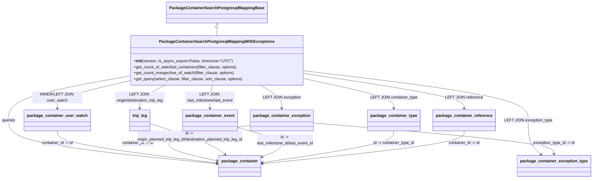

# Diagram: partview_core/partview_service/partview_service/persistence_adapter/postgresql/package_container/PackageContainerSearchPostgresqlMappingWithExceptions.py

> Auto-generated by Obscura crawlers

## Mermaid

### SVG

<svg id="container" width="2345.734375" xmlns="http://www.w3.org/2000/svg" class="classDiagram" height="712" viewBox="0 0 2345.734375 712" role="graphics-document document" aria-roledescription="class"><g><defs><marker id="container_class-aggregationStart" class="marker aggregation class" refX="18" refY="7" markerWidth="190" markerHeight="240" orient="auto"><path d="M 18,7 L9,13 L1,7 L9,1 Z"></path></marker></defs><defs><marker id="container_class-aggregationEnd" class="marker aggregation class" refX="1" refY="7" markerWidth="20" markerHeight="28" orient="auto"><path d="M 18,7 L9,13 L1,7 L9,1 Z"></path></marker></defs><defs><marker id="container_class-extensionStart" class="marker extension class" refX="18" refY="7" markerWidth="190" markerHeight="240" orient="auto"><path d="M 1,7 L18,13 V 1 Z"></path></marker></defs><defs><marker id="container_class-extensionEnd" class="marker extension class" refX="1" refY="7" markerWidth="20" markerHeight="28" orient="auto"><path d="M 1,1 V 13 L18,7 Z"></path></marker></defs><defs><marker id="container_class-compositionStart" class="marker composition class" refX="18" refY="7" markerWidth="190" markerHeight="240" orient="auto"><path d="M 18,7 L9,13 L1,7 L9,1 Z"></path></marker></defs><defs><marker id="container_class-compositionEnd" class="marker composition class" refX="1" refY="7" markerWidth="20" markerHeight="28" orient="auto"><path d="M 18,7 L9,13 L1,7 L9,1 Z"></path></marker></defs><defs><marker id="container_class-dependencyStart" class="marker dependency class" refX="6" refY="7" markerWidth="190" markerHeight="240" orient="auto"><path d="M 5,7 L9,13 L1,7 L9,1 Z"></path></marker></defs><defs><marker id="container_class-dependencyEnd" class="marker dependency class" refX="13" refY="7" markerWidth="20" markerHeight="28" orient="auto"><path d="M 18,7 L9,13 L14,7 L9,1 Z"></path></marker></defs><defs><marker id="container_class-lollipopStart" class="marker lollipop class" refX="13" refY="7" markerWidth="190" markerHeight="240" orient="auto"><circle stroke="black" fill="transparent" cx="7" cy="7" r="6"></circle></marker></defs><defs><marker id="container_class-lollipopEnd" class="marker lollipop class" refX="1" refY="7" markerWidth="190" markerHeight="240" orient="auto"><circle stroke="black" fill="transparent" cx="7" cy="7" r="6"></circle></marker></defs><g class="root"><g class="clusters"></g><g class="edgePaths"><path d="M863.426,109.25L863.426,110.542C863.426,111.833,863.426,114.417,863.426,119.875C863.426,125.333,863.426,133.667,863.426,137.833L863.426,142" id="id_PackageContainerSearchPostgresqlMappingBase_PackageContainerSearchPostgresqlMappingWithExceptions_1" class="edge-thickness-normal edge-pattern-solid relation" style=";;;" data-edge="true" data-et="edge" data-id="id_PackageContainerSearchPostgresqlMappingBase_PackageContainerSearchPostgresqlMappingWithExceptions_1" data-points="W3sieCI6ODYzLjQyNTc4MTI1LCJ5Ijo5Mn0seyJ4Ijo4NjMuNDI1NzgxMjUsInkiOjExN30seyJ4Ijo4NjMuNDI1NzgxMjUsInkiOjE0Mn1d" marker-start="url(#container_class-extensionStart)"></path><path d="M524.098,301.639L442.622,316.2C361.146,330.76,198.194,359.88,116.718,389.607C35.242,419.333,35.242,449.667,35.242,480C35.242,510.333,35.242,540.667,174.568,569.573C313.894,598.48,592.545,625.96,731.871,639.699L871.197,653.439" id="id_PackageContainerSearchPostgresqlMappingWithExceptions_package_container_2" class="edge-thickness-normal edge-pattern-solid relation" style=";;;" data-edge="true" data-et="edge" data-id="id_PackageContainerSearchPostgresqlMappingWithExceptions_package_container_2" data-points="W3sieCI6NTI0LjA5NzY1NjI1LCJ5IjozMDEuNjM5NDA3NTg5MDg1N30seyJ4IjozNS4yNDIxODc1LCJ5IjozODl9LHsieCI6MzUuMjQyMTg3NSwieSI6NDgwfSx7IngiOjM1LjI0MjE4NzUsInkiOjU3MX0seyJ4Ijo4NzcuMTY3OTY4NzUsInkiOjY1NC4wMjgyMDE2ODczNn1d" marker-end="url(#container_class-dependencyEnd)"></path><path d="M524.098,319.388L473.874,330.99C423.651,342.592,323.204,365.796,272.981,384.565C222.758,403.333,222.758,417.667,222.758,424.833L222.758,432" id="id_PackageContainerSearchPostgresqlMappingWithExceptions_package_container_user_watch_3" class="edge-thickness-normal edge-pattern-solid relation" style=";;;" data-edge="true" data-et="edge" data-id="id_PackageContainerSearchPostgresqlMappingWithExceptions_package_container_user_watch_3" data-points="W3sieCI6NTI0LjA5NzY1NjI1LCJ5IjozMTkuMzg3ODE1NDUxNDAyNn0seyJ4IjoyMjIuNzU3ODEyNSwieSI6Mzg5fSx7IngiOjIyMi43NTc4MTI1LCJ5Ijo0Mzh9XQ==" marker-end="url(#container_class-dependencyEnd)"></path><path d="M1036.448,340L1050.721,348.167C1064.994,356.333,1093.54,372.667,1107.813,388C1122.086,403.333,1122.086,417.667,1122.086,424.833L1122.086,432" id="id_PackageContainerSearchPostgresqlMappingWithExceptions_package_container_exception_4" class="edge-thickness-normal edge-pattern-solid relation" style=";;;" data-edge="true" data-et="edge" data-id="id_PackageContainerSearchPostgresqlMappingWithExceptions_package_container_exception_4" data-points="W3sieCI6MTAzNi40NDg0NTMzMzYxNDg4LCJ5IjozNDB9LHsieCI6MTEyMi4wODU5Mzc1LCJ5IjozODl9LHsieCI6MTEyMi4wODU5Mzc1LCJ5Ijo0Mzh9XQ==" marker-end="url(#container_class-dependencyEnd)"></path><path d="M1202.754,281.859L1351.05,299.716C1499.346,317.573,1795.939,353.286,1944.235,386.31C2092.531,419.333,2092.531,449.667,2092.531,480C2092.531,510.333,2092.531,540.667,2101.183,563.344C2109.835,586.022,2127.139,601.044,2135.79,608.555L2144.442,616.067" id="id_PackageContainerSearchPostgresqlMappingWithExceptions_package_container_exception_type_5" class="edge-thickness-normal edge-pattern-solid relation" style=";;;" data-edge="true" data-et="edge" data-id="id_PackageContainerSearchPostgresqlMappingWithExceptions_package_container_exception_type_5" data-points="W3sieCI6MTIwMi43NTM5MDYyNSwieSI6MjgxLjg1OTQ0MTA5NTA1NDU0fSx7IngiOjIwOTIuNTMxMjUsInkiOjM4OX0seyJ4IjoyMDkyLjUzMTI1LCJ5Ijo0ODB9LHsieCI6MjA5Mi41MzEyNSwieSI6NTcxfSx7IngiOjIxNDguOTcyOTU2NzMwNzY5LCJ5Ijo2MjB9XQ==" marker-end="url(#container_class-dependencyEnd)"></path><path d="M659.481,340L642.658,348.167C625.834,356.333,592.186,372.667,575.363,388C558.539,403.333,558.539,417.667,558.539,424.833L558.539,432" id="id_PackageContainerSearchPostgresqlMappingWithExceptions_trip_leg_6" class="edge-thickness-normal edge-pattern-solid relation" style=";;;" data-edge="true" data-et="edge" data-id="id_PackageContainerSearchPostgresqlMappingWithExceptions_trip_leg_6" data-points="W3sieCI6NjU5LjQ4MTI4Njk1MTAxMzUsInkiOjM0MH0seyJ4Ijo1NTguNTM5MDYyNSwieSI6Mzg5fSx7IngiOjU1OC41MzkwNjI1LCJ5Ijo0Mzh9XQ==" marker-end="url(#container_class-dependencyEnd)"></path><path d="M852.689,340L851.803,348.167C850.918,356.333,849.146,372.667,848.261,388C847.375,403.333,847.375,417.667,847.375,424.833L847.375,432" id="id_PackageContainerSearchPostgresqlMappingWithExceptions_package_container_event_7" class="edge-thickness-normal edge-pattern-solid relation" style=";;;" data-edge="true" data-et="edge" data-id="id_PackageContainerSearchPostgresqlMappingWithExceptions_package_container_event_7" data-points="W3sieCI6ODUyLjY4OTExMDAwODQ0NTksInkiOjM0MH0seyJ4Ijo4NDcuMzc1LCJ5IjozODl9LHsieCI6ODQ3LjM3NSwieSI6NDM4fV0=" marker-end="url(#container_class-dependencyEnd)"></path><path d="M1202.754,311.351L1265.175,324.293C1327.596,337.234,1452.439,363.117,1514.86,383.225C1577.281,403.333,1577.281,417.667,1577.281,424.833L1577.281,432" id="id_PackageContainerSearchPostgresqlMappingWithExceptions_package_container_type_8" class="edge-thickness-normal edge-pattern-solid relation" style=";;;" data-edge="true" data-et="edge" data-id="id_PackageContainerSearchPostgresqlMappingWithExceptions_package_container_type_8" data-points="W3sieCI6MTIwMi43NTM5MDYyNSwieSI6MzExLjM1MTE2MzA4MzM4ODU0fSx7IngiOjE1NzcuMjgxMjUsInkiOjM4OX0seyJ4IjoxNTc3LjI4MTI1LCJ5Ijo0Mzh9XQ==" marker-end="url(#container_class-dependencyEnd)"></path><path d="M1202.754,292.066L1310.107,308.221C1417.461,324.377,1632.168,356.689,1739.521,380.011C1846.875,403.333,1846.875,417.667,1846.875,424.833L1846.875,432" id="id_PackageContainerSearchPostgresqlMappingWithExceptions_package_container_reference_9" class="edge-thickness-normal edge-pattern-solid relation" style=";;;" data-edge="true" data-et="edge" data-id="id_PackageContainerSearchPostgresqlMappingWithExceptions_package_container_reference_9" data-points="W3sieCI6MTIwMi43NTM5MDYyNSwieSI6MjkyLjA2NTc0MDM5ODcwODMzfSx7IngiOjE4NDYuODc1LCJ5IjozODl9LHsieCI6MTg0Ni44NzUsInkiOjQzOH1d" marker-end="url(#container_class-dependencyEnd)"></path><path d="M222.758,522L222.758,530.167C222.758,538.333,222.758,554.667,330.834,576.21C438.91,597.753,655.062,624.505,763.137,637.882L871.213,651.258" id="id_package_container_user_watch_package_container_10" class="edge-thickness-normal edge-pattern-solid relation" style=";;;" data-edge="true" data-et="edge" data-id="id_package_container_user_watch_package_container_10" data-points="W3sieCI6MjIyLjc1NzgxMjUsInkiOjUyMn0seyJ4IjoyMjIuNzU3ODEyNSwieSI6NTcxfSx7IngiOjg3Ny4xNjc5Njg3NSwieSI6NjUxLjk5NTA5MDkyOTM3NjR9XQ==" marker-end="url(#container_class-dependencyEnd)"></path><path d="M1002.086,498.521L923.818,510.601C845.551,522.681,689.016,546.84,667.218,570.996C645.421,595.153,758.361,619.305,814.831,631.382L871.301,643.458" id="id_package_container_exception_package_container_11" class="edge-thickness-normal edge-pattern-solid relation" style=";;;" data-edge="true" data-et="edge" data-id="id_package_container_exception_package_container_11" data-points="W3sieCI6MTAwMi4wODU5Mzc1LCJ5Ijo0OTguNTIwODU5NDIwMDMwNn0seyJ4Ijo1MzIuNDgwNDY4NzUsInkiOjU3MX0seyJ4Ijo4NzcuMTY3OTY4NzUsInkiOjY0NC43MTI4OTAzNzM5ODc5fV0=" marker-end="url(#container_class-dependencyEnd)"></path><path d="M1242.086,490.156L1401.297,503.63C1560.508,517.104,1878.93,544.052,2038.141,564.693C2197.352,585.333,2197.352,599.667,2197.352,606.833L2197.352,614" id="id_package_container_exception_package_container_exception_type_12" class="edge-thickness-normal edge-pattern-solid relation" style=";;;" data-edge="true" data-et="edge" data-id="id_package_container_exception_package_container_exception_type_12" data-points="W3sieCI6MTI0Mi4wODU5Mzc1LCJ5Ijo0OTAuMTU1NjMwMTQ5NTI3fSx7IngiOjIxOTcuMzUxNTYyNSwieSI6NTcxfSx7IngiOjIxOTcuMzUxNTYyNSwieSI6NjIwfV0=" marker-end="url(#container_class-dependencyEnd)"></path><path d="M598.953,493.221L638.577,506.185C678.202,519.148,757.451,545.074,807.161,565.603C856.872,586.133,877.045,601.266,887.131,608.833L897.218,616.399" id="id_trip_leg_package_container_13" class="edge-thickness-normal edge-pattern-solid relation" style=";;;" data-edge="true" data-et="edge" data-id="id_trip_leg_package_container_13" data-points="W3sieCI6NTk4Ljk1MzEyNSwieSI6NDkzLjIyMTQ0NjcyNzIzOTU0fSx7IngiOjgzNi42OTkyMTg3NSwieSI6NTcxfSx7IngiOjkwMi4wMTcxMjc0MDM4NDYyLCJ5Ijo2MjB9XQ==" marker-end="url(#container_class-dependencyEnd)"></path><path d="M952.086,507.461L992.467,518.05C1032.848,528.64,1113.609,549.82,1129.002,570.031C1144.394,590.241,1094.417,609.482,1069.428,619.102L1044.439,628.723" id="id_package_container_event_package_container_14" class="edge-thickness-normal edge-pattern-solid relation" style=";;;" data-edge="true" data-et="edge" data-id="id_package_container_event_package_container_14" data-points="W3sieCI6OTUyLjA4NTkzNzUsInkiOjUwNy40NjA1MjYxNjc2NjY2N30seyJ4IjoxMTk0LjM3MTA5Mzc1LCJ5Ijo1NzF9LHsieCI6MTAzOC44Mzk4NDM3NSwieSI6NjMwLjg3ODYzMTYzMTEzNTR9XQ==" marker-end="url(#container_class-dependencyEnd)"></path><path d="M1577.281,522L1577.281,530.167C1577.281,538.333,1577.281,554.667,1488.53,575.875C1399.78,597.083,1222.278,623.166,1133.527,636.208L1044.776,649.249" id="id_package_container_type_package_container_15" class="edge-thickness-normal edge-pattern-solid relation" style=";;;" data-edge="true" data-et="edge" data-id="id_package_container_type_package_container_15" data-points="W3sieCI6MTU3Ny4yODEyNSwieSI6NTIyfSx7IngiOjE1NzcuMjgxMjUsInkiOjU3MX0seyJ4IjoxMDM4LjgzOTg0Mzc1LCJ5Ijo2NTAuMTIxNTI1MjE1MjUyMn1d" marker-end="url(#container_class-dependencyEnd)"></path><path d="M1846.875,522L1846.875,530.167C1846.875,538.333,1846.875,554.667,1713.197,576.519C1579.52,598.371,1312.164,625.742,1178.486,639.428L1044.809,653.113" id="id_package_container_reference_package_container_16" class="edge-thickness-normal edge-pattern-solid relation" style=";;;" data-edge="true" data-et="edge" data-id="id_package_container_reference_package_container_16" data-points="W3sieCI6MTg0Ni44NzUsInkiOjUyMn0seyJ4IjoxODQ2Ljg3NSwieSI6NTcxfSx7IngiOjEwMzguODM5ODQzNzUsInkiOjY1My43MjQyNTUyMjE5MDYzfV0=" marker-end="url(#container_class-dependencyEnd)"></path></g><g class="edgeLabels"><g class="edgeLabel"><g class="label" data-id="id_PackageContainerSearchPostgresqlMappingBase_PackageContainerSearchPostgresqlMappingWithExceptions_1" transform="translate(0, 0)"><foreignObject width="0" height="0">

</foreignObject></g></g><g class="edgeLabel" transform="translate(35.2421875, 480)"><g class="label" data-id="id_PackageContainerSearchPostgresqlMappingWithExceptions_package_container_2" transform="translate(-27.2421875, -12)"><foreignObject width="54.484375" height="24">

queries

</foreignObject></g></g><g class="edgeLabel" transform="translate(222.7578125, 389)"><g class="label" data-id="id_PackageContainerSearchPostgresqlMappingWithExceptions_package_container_user_watch_3" transform="translate(-100, -24)"><foreignObject width="200" height="48">

INNER/LEFT JOIN user_watch

</foreignObject></g></g><g class="edgeLabel" transform="translate(1122.0859375, 389)"><g class="label" data-id="id_PackageContainerSearchPostgresqlMappingWithExceptions_package_container_exception_4" transform="translate(-71.75, -12)"><foreignObject width="143.5" height="24">

LEFT JOIN exception

</foreignObject></g></g><g class="edgeLabel" transform="translate(2092.53125, 480)"><g class="label" data-id="id_PackageContainerSearchPostgresqlMappingWithExceptions_package_container_exception_type_5" transform="translate(-91.640625, -12)"><foreignObject width="183.28125" height="24">

LEFT JOIN exception_type

</foreignObject></g></g><g class="edgeLabel" transform="translate(558.5390625, 389)"><g class="label" data-id="id_PackageContainerSearchPostgresqlMappingWithExceptions_trip_leg_6" transform="translate(-100, -24)"><foreignObject width="200" height="48">

LEFT JOIN origin/destination_trip_leg

</foreignObject></g></g><g class="edgeLabel" transform="translate(847.375, 389)"><g class="label" data-id="id_PackageContainerSearchPostgresqlMappingWithExceptions_package_container_event_7" transform="translate(-100, -24)"><foreignObject width="200" height="48">

LEFT JOIN last_milestone/last_event

</foreignObject></g></g><g class="edgeLabel" transform="translate(1577.28125, 389)"><g class="label" data-id="id_PackageContainerSearchPostgresqlMappingWithExceptions_package_container_type_8" transform="translate(-90.2265625, -12)"><foreignObject width="180.453125" height="24">

LEFT JOIN container_type

</foreignObject></g></g><g class="edgeLabel" transform="translate(1846.875, 389)"><g class="label" data-id="id_PackageContainerSearchPostgresqlMappingWithExceptions_package_container_reference_9" transform="translate(-70.4609375, -12)"><foreignObject width="140.921875" height="24">

LEFT JOIN reference

</foreignObject></g></g><g class="edgeLabel" transform="translate(222.7578125, 571)"><g class="label" data-id="id_package_container_user_watch_package_container_10" transform="translate(-63.671875, -12)"><foreignObject width="127.34375" height="24">

container_id -&gt; id

</foreignObject></g></g><g class="edgeLabel" transform="translate(532.48046875, 571)"><g class="label" data-id="id_package_container_exception_package_container_11" transform="translate(-63.671875, -12)"><foreignObject width="127.34375" height="24">

container_id -&gt; id

</foreignObject></g></g><g class="edgeLabel" transform="translate(2197.3515625, 571)"><g class="label" data-id="id_package_container_exception_package_container_exception_type_12" transform="translate(-84.8203125, -12)"><foreignObject width="169.640625" height="24">

exception_type_id -&gt; id

</foreignObject></g></g><g class="edgeLabel" transform="translate(756.6296, 544.80525)"><g class="label" data-id="id_trip_leg_package_container_13" transform="translate(-220.546875, -24)"><foreignObject width="441.09375" height="48">

id -&gt; origin_planned_trip_leg_id/destination_planned_trip_leg_id

</foreignObject></g></g><g class="edgeLabel" transform="translate(1153.83261, 560.36875)"><g class="label" data-id="id_package_container_event_package_container_14" transform="translate(-117.125, -24)"><foreignObject width="234.25" height="48">

id -&gt; last_milestone_id/last_event_id

</foreignObject></g></g><g class="edgeLabel" transform="translate(1577.28125, 571)"><g class="label" data-id="id_package_container_type_package_container_15" transform="translate(-83.40625, -12)"><foreignObject width="166.8125" height="24">

id -&gt; container_type_id

</foreignObject></g></g><g class="edgeLabel" transform="translate(1846.875, 571)"><g class="label" data-id="id_package_container_reference_package_container_16" transform="translate(-63.671875, -12)"><foreignObject width="127.34375" height="24">

container_id -&gt; id

</foreignObject></g></g></g><g class="nodes"><g class="node default" id="classId-PackageContainerSearchPostgresqlMappingBase-0" transform="translate(863.42578125, 50)"><g class="basic label-container"><path d="M-190.0859375 -42 L190.0859375 -42 L190.0859375 42 L-190.0859375 42" stroke="none" stroke-width="0" fill="#ECECFF" style=""></path><path d="M-190.0859375 -42 C-43.81278394418973 -42, 102.46036961162054 -42, 190.0859375 -42 M-190.0859375 -42 C-53.69325088384301 -42, 82.69943573231399 -42, 190.0859375 -42 M190.0859375 -42 C190.0859375 -8.719865815664917, 190.0859375 24.560268368670165, 190.0859375 42 M190.0859375 -42 C190.0859375 -17.33183891803488, 190.0859375 7.336322163930241, 190.0859375 42 M190.0859375 42 C98.20899146367815 42, 6.332045427356292 42, -190.0859375 42 M190.0859375 42 C56.90369941028928 42, -76.27853867942144 42, -190.0859375 42 M-190.0859375 42 C-190.0859375 23.309086537299265, -190.0859375 4.6181730745985305, -190.0859375 -42 M-190.0859375 42 C-190.0859375 18.213437508315526, -190.0859375 -5.573124983368949, -190.0859375 -42" stroke="#9370DB" stroke-width="1.3" fill="none" stroke-dasharray="0 0" style=""></path></g><g class="annotation-group text" transform="translate(0, -18)"></g><g class="label-group text" transform="translate(-178.0859375, -18)"><g class="label" style="font-weight: bolder" transform="translate(0,-12)"><foreignObject width="356.171875" height="24">

PackageContainerSearchPostgresqlMappingBase

</foreignObject></g></g><g class="members-group text" transform="translate(-178.0859375, 30)"></g><g class="methods-group text" transform="translate(-178.0859375, 60)"></g><g class="divider" style=""><path d="M-190.0859375 6 C-72.30097259902678 6, 45.483992301946444 6, 190.0859375 6 M-190.0859375 6 C-109.13333080966075 6, -28.180724119321496 6, 190.0859375 6" stroke="#9370DB" stroke-width="1.3" fill="none" stroke-dasharray="0 0" style=""></path></g><g class="divider" style=""><path d="M-190.0859375 24 C-91.97595047482102 24, 6.134036550357962 24, 190.0859375 24 M-190.0859375 24 C-44.98628768323658 24, 100.11336213352683 24, 190.0859375 24" stroke="#9370DB" stroke-width="1.3" fill="none" stroke-dasharray="0 0" style=""></path></g></g><g class="node default" id="classId-PackageContainerSearchPostgresqlMappingWithExceptions-1" transform="translate(863.42578125, 241)"><g class="basic label-container"><path d="M-339.328125 -99 L339.328125 -99 L339.328125 99 L-339.328125 99" stroke="none" stroke-width="0" fill="#ECECFF" style=""></path><path d="M-339.328125 -99 C-107.93167565706463 -99, 123.46477368587074 -99, 339.328125 -99 M-339.328125 -99 C-160.1253992721888 -99, 19.077326455622426 -99, 339.328125 -99 M339.328125 -99 C339.328125 -47.211485619523735, 339.328125 4.57702876095253, 339.328125 99 M339.328125 -99 C339.328125 -20.303802815962896, 339.328125 58.39239436807421, 339.328125 99 M339.328125 99 C162.47093001345462 99, -14.38626497309076 99, -339.328125 99 M339.328125 99 C74.48536385246331 99, -190.35739729507338 99, -339.328125 99 M-339.328125 99 C-339.328125 22.836559851904454, -339.328125 -53.32688029619109, -339.328125 -99 M-339.328125 99 C-339.328125 44.916234890744235, -339.328125 -9.16753021851153, -339.328125 -99" stroke="#9370DB" stroke-width="1.3" fill="none" stroke-dasharray="0 0" style=""></path></g><g class="annotation-group text" transform="translate(0, -75)"></g><g class="label-group text" transform="translate(-216.859375, -75)"><g class="label" style="font-weight: bolder" transform="translate(0,-12)"><foreignObject width="433.71875" height="24">

PackageContainerSearchPostgresqlMappingWithExceptions

</foreignObject></g></g><g class="members-group text" transform="translate(-327.328125, -27)"></g><g class="methods-group text" transform="translate(-327.328125, 3)"><g class="label" style="" transform="translate(0,-12)"><foreignObject width="386.6875" height="24">

+<strong>init</strong>(version, is_async_export=False, timezone="UTC")

</foreignObject></g><g class="label" style="" transform="translate(0,12)"><foreignObject width="416.296875" height="24">

+get_count_of_watched_containers(filter_clause, options)

</foreignObject></g><g class="label" style="" transform="translate(0,36)"><foreignObject width="406.84375" height="24">

+get_count_irrespective_of_watch(filter_clause, options)

</foreignObject></g><g class="label" style="" transform="translate(0,60)"><foreignObject width="437.796875" height="24">

+get_query(select_clause, filter_clause, sort_clause, options)

</foreignObject></g></g><g class="divider" style=""><path d="M-339.328125 -51 C-74.933585679575 -51, 189.46095364085 -51, 339.328125 -51 M-339.328125 -51 C-136.2736224324747 -51, 66.78088013505061 -51, 339.328125 -51" stroke="#9370DB" stroke-width="1.3" fill="none" stroke-dasharray="0 0" style=""></path></g><g class="divider" style=""><path d="M-339.328125 -27 C-156.13540803753895 -27, 27.057308924922097 -27, 339.328125 -27 M-339.328125 -27 C-111.1591220956426 -27, 117.0098808087148 -27, 339.328125 -27" stroke="#9370DB" stroke-width="1.3" fill="none" stroke-dasharray="0 0" style=""></path></g></g><g class="node default" id="classId-package_container-2" transform="translate(958.00390625, 662)"><g class="basic label-container"><path d="M-80.8359375 -42 L80.8359375 -42 L80.8359375 42 L-80.8359375 42" stroke="none" stroke-width="0" fill="#ECECFF" style=""></path><path d="M-80.8359375 -42 C-40.78848395430935 -42, -0.7410304086186983 -42, 80.8359375 -42 M-80.8359375 -42 C-46.969844192691255 -42, -13.10375088538251 -42, 80.8359375 -42 M80.8359375 -42 C80.8359375 -24.27381743685338, 80.8359375 -6.5476348737067624, 80.8359375 42 M80.8359375 -42 C80.8359375 -23.589857321103178, 80.8359375 -5.179714642206356, 80.8359375 42 M80.8359375 42 C17.278808792967105 42, -46.27831991406579 42, -80.8359375 42 M80.8359375 42 C32.24577762266858 42, -16.344382254662847 42, -80.8359375 42 M-80.8359375 42 C-80.8359375 13.814888395251252, -80.8359375 -14.370223209497496, -80.8359375 -42 M-80.8359375 42 C-80.8359375 23.152073143868304, -80.8359375 4.304146287736607, -80.8359375 -42" stroke="#9370DB" stroke-width="1.3" fill="none" stroke-dasharray="0 0" style=""></path></g><g class="annotation-group text" transform="translate(0, -18)"></g><g class="label-group text" transform="translate(-68.8359375, -18)"><g class="label" style="font-weight: bolder" transform="translate(0,-12)"><foreignObject width="137.671875" height="24">

package_container

</foreignObject></g></g><g class="members-group text" transform="translate(-68.8359375, 30)"></g><g class="methods-group text" transform="translate(-68.8359375, 60)"></g><g class="divider" style=""><path d="M-80.8359375 6 C-35.355491918004816 6, 10.124953663990368 6, 80.8359375 6 M-80.8359375 6 C-40.5635836380022 6, -0.2912297760043998 6, 80.8359375 6" stroke="#9370DB" stroke-width="1.3" fill="none" stroke-dasharray="0 0" style=""></path></g><g class="divider" style=""><path d="M-80.8359375 24 C-25.920344906775675 24, 28.99524768644865 24, 80.8359375 24 M-80.8359375 24 C-33.22848919925748 24, 14.378959101485037 24, 80.8359375 24" stroke="#9370DB" stroke-width="1.3" fill="none" stroke-dasharray="0 0" style=""></path></g></g><g class="node default" id="classId-package_container_user_watch-3" transform="translate(222.7578125, 480)"><g class="basic label-container"><path d="M-125.2734375 -42 L125.2734375 -42 L125.2734375 42 L-125.2734375 42" stroke="none" stroke-width="0" fill="#ECECFF" style=""></path><path d="M-125.2734375 -42 C-71.92791001935956 -42, -18.58238253871913 -42, 125.2734375 -42 M-125.2734375 -42 C-35.32337689220198 -42, 54.626683715596045 -42, 125.2734375 -42 M125.2734375 -42 C125.2734375 -13.931629499082518, 125.2734375 14.136741001834963, 125.2734375 42 M125.2734375 -42 C125.2734375 -13.573967203783788, 125.2734375 14.852065592432425, 125.2734375 42 M125.2734375 42 C36.83602802457297 42, -51.60138145085406 42, -125.2734375 42 M125.2734375 42 C65.87970895741262 42, 6.485980414825249 42, -125.2734375 42 M-125.2734375 42 C-125.2734375 8.887008454202189, -125.2734375 -24.225983091595623, -125.2734375 -42 M-125.2734375 42 C-125.2734375 22.78153689316093, -125.2734375 3.5630737863218584, -125.2734375 -42" stroke="#9370DB" stroke-width="1.3" fill="none" stroke-dasharray="0 0" style=""></path></g><g class="annotation-group text" transform="translate(0, -18)"></g><g class="label-group text" transform="translate(-113.2734375, -18)"><g class="label" style="font-weight: bolder" transform="translate(0,-12)"><foreignObject width="226.546875" height="24">

package_container_user_watch

</foreignObject></g></g><g class="members-group text" transform="translate(-113.2734375, 30)"></g><g class="methods-group text" transform="translate(-113.2734375, 60)"></g><g class="divider" style=""><path d="M-125.2734375 6 C-54.792763400692934 6, 15.687910698614132 6, 125.2734375 6 M-125.2734375 6 C-72.81383007080211 6, -20.354222641604238 6, 125.2734375 6" stroke="#9370DB" stroke-width="1.3" fill="none" stroke-dasharray="0 0" style=""></path></g><g class="divider" style=""><path d="M-125.2734375 24 C-49.2880039934671 24, 26.6974295130658 24, 125.2734375 24 M-125.2734375 24 C-44.564869706458765 24, 36.14369808708247 24, 125.2734375 24" stroke="#9370DB" stroke-width="1.3" fill="none" stroke-dasharray="0 0" style=""></path></g></g><g class="node default" id="classId-package_container_exception-4" transform="translate(1122.0859375, 480)"><g class="basic label-container"><path d="M-120 -42 L120 -42 L120 42 L-120 42" stroke="none" stroke-width="0" fill="#ECECFF" style=""></path><path d="M-120 -42 C-31.230253180303123 -42, 57.539493639393754 -42, 120 -42 M-120 -42 C-47.92315435212265 -42, 24.153691295754697 -42, 120 -42 M120 -42 C120 -9.78407730018025, 120 22.4318453996395, 120 42 M120 -42 C120 -11.408728281304096, 120 19.182543437391807, 120 42 M120 42 C31.418984931064216 42, -57.16203013787157 42, -120 42 M120 42 C44.49751988110974 42, -31.004960237780523 42, -120 42 M-120 42 C-120 16.583404239448733, -120 -8.833191521102535, -120 -42 M-120 42 C-120 10.436123062709306, -120 -21.127753874581387, -120 -42" stroke="#9370DB" stroke-width="1.3" fill="none" stroke-dasharray="0 0" style=""></path></g><g class="annotation-group text" transform="translate(0, -18)"></g><g class="label-group text" transform="translate(-108, -18)"><g class="label" style="font-weight: bolder" transform="translate(0,-12)"><foreignObject width="216" height="24">

package_container_exception

</foreignObject></g></g><g class="members-group text" transform="translate(-108, 30)"></g><g class="methods-group text" transform="translate(-108, 60)"></g><g class="divider" style=""><path d="M-120 6 C-46.34963621132363 6, 27.300727577352745 6, 120 6 M-120 6 C-62.41446554811572 6, -4.828931096231443 6, 120 6" stroke="#9370DB" stroke-width="1.3" fill="none" stroke-dasharray="0 0" style=""></path></g><g class="divider" style=""><path d="M-120 24 C-52.940827172534895 24, 14.11834565493021 24, 120 24 M-120 24 C-58.483045695161465 24, 3.03390860967707 24, 120 24" stroke="#9370DB" stroke-width="1.3" fill="none" stroke-dasharray="0 0" style=""></path></g></g><g class="node default" id="classId-package_container_exception_type-5" transform="translate(2197.3515625, 662)"><g class="basic label-container"><path d="M-140.3828125 -42 L140.3828125 -42 L140.3828125 42 L-140.3828125 42" stroke="none" stroke-width="0" fill="#ECECFF" style=""></path><path d="M-140.3828125 -42 C-58.703924320903425 -42, 22.97496385819315 -42, 140.3828125 -42 M-140.3828125 -42 C-29.387386642738832 -42, 81.60803921452234 -42, 140.3828125 -42 M140.3828125 -42 C140.3828125 -19.14883465133203, 140.3828125 3.7023306973359382, 140.3828125 42 M140.3828125 -42 C140.3828125 -15.922822869397535, 140.3828125 10.15435426120493, 140.3828125 42 M140.3828125 42 C83.1185781316149 42, 25.854343763229807 42, -140.3828125 42 M140.3828125 42 C82.79957582171468 42, 25.21633914342938 42, -140.3828125 42 M-140.3828125 42 C-140.3828125 21.645867828144766, -140.3828125 1.2917356562895321, -140.3828125 -42 M-140.3828125 42 C-140.3828125 17.17109569326695, -140.3828125 -7.657808613466102, -140.3828125 -42" stroke="#9370DB" stroke-width="1.3" fill="none" stroke-dasharray="0 0" style=""></path></g><g class="annotation-group text" transform="translate(0, -18)"></g><g class="label-group text" transform="translate(-128.3828125, -18)"><g class="label" style="font-weight: bolder" transform="translate(0,-12)"><foreignObject width="256.765625" height="24">

package_container_exception_type

</foreignObject></g></g><g class="members-group text" transform="translate(-128.3828125, 30)"></g><g class="methods-group text" transform="translate(-128.3828125, 60)"></g><g class="divider" style=""><path d="M-140.3828125 6 C-50.998675083482496 6, 38.38546233303501 6, 140.3828125 6 M-140.3828125 6 C-54.74322310314102 6, 30.89636629371796 6, 140.3828125 6" stroke="#9370DB" stroke-width="1.3" fill="none" stroke-dasharray="0 0" style=""></path></g><g class="divider" style=""><path d="M-140.3828125 24 C-49.971839681218356 24, 40.43913313756329 24, 140.3828125 24 M-140.3828125 24 C-74.01002495364727 24, -7.637237407294549 24, 140.3828125 24" stroke="#9370DB" stroke-width="1.3" fill="none" stroke-dasharray="0 0" style=""></path></g></g><g class="node default" id="classId-trip_leg-6" transform="translate(558.5390625, 480)"><g class="basic label-container"><path d="M-40.4140625 -42 L40.4140625 -42 L40.4140625 42 L-40.4140625 42" stroke="none" stroke-width="0" fill="#ECECFF" style=""></path><path d="M-40.4140625 -42 C-17.35470738053153 -42, 5.704647738936941 -42, 40.4140625 -42 M-40.4140625 -42 C-10.791755561586072 -42, 18.830551376827856 -42, 40.4140625 -42 M40.4140625 -42 C40.4140625 -10.58645213009262, 40.4140625 20.82709573981476, 40.4140625 42 M40.4140625 -42 C40.4140625 -10.365194402572467, 40.4140625 21.269611194855067, 40.4140625 42 M40.4140625 42 C12.542554610022922 42, -15.328953279954156 42, -40.4140625 42 M40.4140625 42 C14.743700298613504 42, -10.926661902772992 42, -40.4140625 42 M-40.4140625 42 C-40.4140625 17.878189932467002, -40.4140625 -6.243620135065996, -40.4140625 -42 M-40.4140625 42 C-40.4140625 22.527905212617714, -40.4140625 3.0558104252354283, -40.4140625 -42" stroke="#9370DB" stroke-width="1.3" fill="none" stroke-dasharray="0 0" style=""></path></g><g class="annotation-group text" transform="translate(0, -18)"></g><g class="label-group text" transform="translate(-28.4140625, -18)"><g class="label" style="font-weight: bolder" transform="translate(0,-12)"><foreignObject width="56.828125" height="24">

trip_leg

</foreignObject></g></g><g class="members-group text" transform="translate(-28.4140625, 30)"></g><g class="methods-group text" transform="translate(-28.4140625, 60)"></g><g class="divider" style=""><path d="M-40.4140625 6 C-15.801782637459453 6, 8.810497225081093 6, 40.4140625 6 M-40.4140625 6 C-12.174131222084384 6, 16.065800055831232 6, 40.4140625 6" stroke="#9370DB" stroke-width="1.3" fill="none" stroke-dasharray="0 0" style=""></path></g><g class="divider" style=""><path d="M-40.4140625 24 C-22.416539367831433 24, -4.419016235662866 24, 40.4140625 24 M-40.4140625 24 C-13.727060449165233 24, 12.959941601669534 24, 40.4140625 24" stroke="#9370DB" stroke-width="1.3" fill="none" stroke-dasharray="0 0" style=""></path></g></g><g class="node default" id="classId-package_container_event-7" transform="translate(847.375, 480)"><g class="basic label-container"><path d="M-104.7109375 -42 L104.7109375 -42 L104.7109375 42 L-104.7109375 42" stroke="none" stroke-width="0" fill="#ECECFF" style=""></path><path d="M-104.7109375 -42 C-61.80116106733041 -42, -18.891384634660824 -42, 104.7109375 -42 M-104.7109375 -42 C-29.243347372005857 -42, 46.224242755988286 -42, 104.7109375 -42 M104.7109375 -42 C104.7109375 -19.628290754659076, 104.7109375 2.7434184906818473, 104.7109375 42 M104.7109375 -42 C104.7109375 -16.663177153650793, 104.7109375 8.673645692698415, 104.7109375 42 M104.7109375 42 C31.72903124663074 42, -41.25287500673852 42, -104.7109375 42 M104.7109375 42 C39.308789691455644 42, -26.093358117088712 42, -104.7109375 42 M-104.7109375 42 C-104.7109375 18.17895638074221, -104.7109375 -5.642087238515579, -104.7109375 -42 M-104.7109375 42 C-104.7109375 17.824240584494422, -104.7109375 -6.351518831011155, -104.7109375 -42" stroke="#9370DB" stroke-width="1.3" fill="none" stroke-dasharray="0 0" style=""></path></g><g class="annotation-group text" transform="translate(0, -18)"></g><g class="label-group text" transform="translate(-92.7109375, -18)"><g class="label" style="font-weight: bolder" transform="translate(0,-12)"><foreignObject width="185.421875" height="24">

package_container_event

</foreignObject></g></g><g class="members-group text" transform="translate(-92.7109375, 30)"></g><g class="methods-group text" transform="translate(-92.7109375, 60)"></g><g class="divider" style=""><path d="M-104.7109375 6 C-44.5552012756532 6, 15.600534948693607 6, 104.7109375 6 M-104.7109375 6 C-41.61350299434241 6, 21.483931511315177 6, 104.7109375 6" stroke="#9370DB" stroke-width="1.3" fill="none" stroke-dasharray="0 0" style=""></path></g><g class="divider" style=""><path d="M-104.7109375 24 C-41.79702369878809 24, 21.116890102423824 24, 104.7109375 24 M-104.7109375 24 C-33.12684657775846 24, 38.45724434448309 24, 104.7109375 24" stroke="#9370DB" stroke-width="1.3" fill="none" stroke-dasharray="0 0" style=""></path></g></g><g class="node default" id="classId-package_container_type-8" transform="translate(1577.28125, 480)"><g class="basic label-container"><path d="M-100.578125 -42 L100.578125 -42 L100.578125 42 L-100.578125 42" stroke="none" stroke-width="0" fill="#ECECFF" style=""></path><path d="M-100.578125 -42 C-57.00096189052382 -42, -13.423798781047637 -42, 100.578125 -42 M-100.578125 -42 C-48.672743831628 -42, 3.2326373367440056 -42, 100.578125 -42 M100.578125 -42 C100.578125 -18.897020018112975, 100.578125 4.205959963774049, 100.578125 42 M100.578125 -42 C100.578125 -24.79223295040707, 100.578125 -7.584465900814138, 100.578125 42 M100.578125 42 C39.76333634155723 42, -21.051452316885545 42, -100.578125 42 M100.578125 42 C42.47457695361855 42, -15.628971092762896 42, -100.578125 42 M-100.578125 42 C-100.578125 25.13261711465581, -100.578125 8.265234229311623, -100.578125 -42 M-100.578125 42 C-100.578125 17.537180266028198, -100.578125 -6.925639467943604, -100.578125 -42" stroke="#9370DB" stroke-width="1.3" fill="none" stroke-dasharray="0 0" style=""></path></g><g class="annotation-group text" transform="translate(0, -18)"></g><g class="label-group text" transform="translate(-88.578125, -18)"><g class="label" style="font-weight: bolder" transform="translate(0,-12)"><foreignObject width="177.15625" height="24">

package_container_type

</foreignObject></g></g><g class="members-group text" transform="translate(-88.578125, 30)"></g><g class="methods-group text" transform="translate(-88.578125, 60)"></g><g class="divider" style=""><path d="M-100.578125 6 C-31.831504583079635 6, 36.91511583384073 6, 100.578125 6 M-100.578125 6 C-35.67004116726396 6, 29.23804266547208 6, 100.578125 6" stroke="#9370DB" stroke-width="1.3" fill="none" stroke-dasharray="0 0" style=""></path></g><g class="divider" style=""><path d="M-100.578125 24 C-43.92687562631566 24, 12.724373747368674 24, 100.578125 24 M-100.578125 24 C-25.161559884010643 24, 50.255005231978714 24, 100.578125 24" stroke="#9370DB" stroke-width="1.3" fill="none" stroke-dasharray="0 0" style=""></path></g></g><g class="node default" id="classId-package_container_reference-9" transform="translate(1846.875, 480)"><g class="basic label-container"><path d="M-119.015625 -42 L119.015625 -42 L119.015625 42 L-119.015625 42" stroke="none" stroke-width="0" fill="#ECECFF" style=""></path><path d="M-119.015625 -42 C-49.8444434185257 -42, 19.3267381629486 -42, 119.015625 -42 M-119.015625 -42 C-33.31472879538711 -42, 52.38616740922578 -42, 119.015625 -42 M119.015625 -42 C119.015625 -12.568618632309054, 119.015625 16.862762735381892, 119.015625 42 M119.015625 -42 C119.015625 -14.011600251031599, 119.015625 13.976799497936803, 119.015625 42 M119.015625 42 C47.92201984621043 42, -23.171585307579136 42, -119.015625 42 M119.015625 42 C35.37225357325228 42, -48.27111785349544 42, -119.015625 42 M-119.015625 42 C-119.015625 23.60300924840907, -119.015625 5.206018496818139, -119.015625 -42 M-119.015625 42 C-119.015625 12.458327930581977, -119.015625 -17.083344138836047, -119.015625 -42" stroke="#9370DB" stroke-width="1.3" fill="none" stroke-dasharray="0 0" style=""></path></g><g class="annotation-group text" transform="translate(0, -18)"></g><g class="label-group text" transform="translate(-107.015625, -18)"><g class="label" style="font-weight: bolder" transform="translate(0,-12)"><foreignObject width="214.03125" height="24">

package_container_reference

</foreignObject></g></g><g class="members-group text" transform="translate(-107.015625, 30)"></g><g class="methods-group text" transform="translate(-107.015625, 60)"></g><g class="divider" style=""><path d="M-119.015625 6 C-32.45288745524611 6, 54.10985008950777 6, 119.015625 6 M-119.015625 6 C-48.07389726658877 6, 22.867830466822454 6, 119.015625 6" stroke="#9370DB" stroke-width="1.3" fill="none" stroke-dasharray="0 0" style=""></path></g><g class="divider" style=""><path d="M-119.015625 24 C-57.4856476370513 24, 4.0443297258973985 24, 119.015625 24 M-119.015625 24 C-43.194368406618736 24, 32.62688818676253 24, 119.015625 24" stroke="#9370DB" stroke-width="1.3" fill="none" stroke-dasharray="0 0" style=""></path></g></g></g></g></g></svg>
